# Ngày 001 — Tuần 1, Ngày 1

## Khởi động LLM Engineering: từ chạy mô hình cục bộ đến ứng dụng tóm tắt website

> **Loại bài:** Lesson + Lab + Review
> **Mục tiêu chính:** làm quen với LLM Engineering bằng thực hành ngay từ đầu, thiết lập môi trường phát triển, chạy LLM cục bộ, gọi mô hình qua API và xây dựng ứng dụng AI đầu tiên.

Tài liệu gốc bắt đầu bằng định hướng một hành trình học kéo dài tám tuần, nhưng thay vì chỉ giới thiệu lý thuyết, bài học đưa người học vào thực hành ngay: chạy một LLM cục bộ, sau đó xây dựng môi trường và tiến tới ứng dụng đầu tiên. 

---

# 1. Mục tiêu học tập

Sau bài này, người học có thể:

1. Giải thích sự khác nhau cơ bản giữa:

   * LLM chạy trên máy cá nhân;
   * LLM được gọi qua API trên đám mây.
2. Sử dụng **Ollama** để thử nghiệm một mô hình cục bộ.
3. Hiểu ảnh hưởng của kích thước mô hình đến khả năng và tài nguyên cần thiết.
4. Nắm được lộ trình tám tuần của khóa LLM Engineering.
5. Hiểu vai trò của:

   * Git;
   * GitHub;
   * Cursor;
   * `uv`;
   * môi trường Python;
   * Jupyter Notebook.
6. Biết cách quản lý API key bằng biến môi trường.
7. Thực hiện một yêu cầu đầu tiên tới LLM bằng Python.
8. Phân biệt **system prompt** và **user prompt**.
9. Hiểu pipeline của một ứng dụng:
   **URL → lấy nội dung → tạo prompt → gọi LLM → tóm tắt Markdown**.
10. Biết cách mở rộng bài thực hành thành một sản phẩm nhỏ phục vụ nhu cầu thực tế.

---

# 2. Chuẩn hóa một số thuật ngữ trong bản nguồn

Bản nguồn có một số từ được phiên âm/nhận dạng chưa chuẩn. Trong bài học này sử dụng tên chuẩn để dễ học:

| Trong bản nguồn | Dùng trong bài học                         |
| --------------- | ------------------------------------------ |
| Olama / Allama  | **Ollama**                                 |
| GEMA            | **Gemma**                                  |
| GPT OS          | **GPT-OSS**                                |
| Cursa / Con trỏ | **Cursor**                                 |
| EMV             | **`.env`**                                 |
| khóa API AI mở  | **`OPENAI_API_KEY`**                       |
| LZ              | thường được hiểu theo ngữ cảnh là **`ls`** |
| LM engineering  | **LLM Engineering**                        |

Đặc biệt, nội dung nguồn nhấn mạnh rằng tệp bí mật phải nằm ở thư mục gốc của dự án, tên chính xác là `.env` và chứa biến API key đúng tên. 

---

# 3. Bản đồ toàn bộ bài học

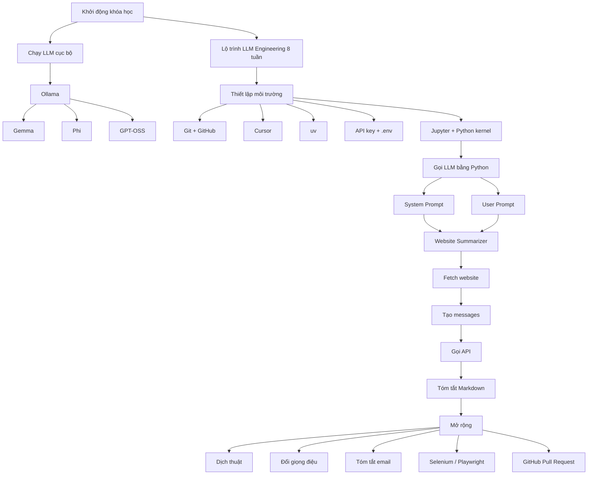

---

# 4. Chạy LLM ngay trên máy cá nhân

## 4.1. Ý tưởng

Thông thường người dùng biết LLM thông qua các ứng dụng đám mây như ChatGPT, Claude hoặc Gemini.

Bài học đưa ra một trải nghiệm khác:

> tải một mô hình về máy và trực tiếp tương tác với nó trên máy cá nhân.

Nguồn giới thiệu Ollama như công cụ để chạy mô hình cục bộ trên Windows, macOS hoặc Linux. 

Tài liệu Ollama hiện tại cũng xác nhận Ollama hỗ trợ macOS, Windows và Linux, đồng thời cung cấp giao diện dòng lệnh để chạy hoặc tương tác với mô hình. ([Ollama][1])

## 4.2. Minh họa: Ollama, Terminal, GitHub và Jupyter


Các hình trên lần lượt giúp hình dung:

* một LLM đang chạy trong terminal;
* PowerShell trên Windows;
* thao tác lấy URL clone từ GitHub;
* giao diện Notebook;
* cấu trúc một Python virtual environment.

---

# 5. Quy trình thử nghiệm Ollama

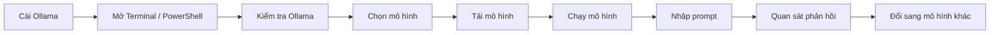

## 5.1. Mô hình nhỏ trước

Bài học bắt đầu bằng **Gemma** cỡ nhỏ.

Mục tiêu không phải tìm ngay mô hình tốt nhất mà để người học:

* thấy một LLM có thể chạy trên máy mình;
* tương tác trực tiếp với nó;
* hiểu rằng số lượng tham số có liên hệ với kích thước mô hình;
* bắt đầu cảm nhận sự khác biệt giữa mô hình nhỏ và lớn.

Nguồn sử dụng một biến thể Gemma khoảng **270 triệu tham số** làm ví dụ mô hình rất nhỏ. 

## 5.2. Tăng kích thước mô hình

Sau Gemma, bài học thử một mô hình Phi lớn hơn.

Ý tưởng cần nhớ:

**Không phải mọi LLM đều giống nhau.**

Hai mô hình có thể khác về:

* số tham số;
* dung lượng;
* RAM cần thiết;
* tốc độ;
* khả năng hiểu yêu cầu;
* chất lượng câu trả lời.

## 5.3. Thử mô hình lớn hơn

Nguồn tiếp tục minh họa bằng GPT-OSS khoảng 20 tỷ tham số và nhấn mạnh rằng loại mô hình này cần tài nguyên máy lớn hơn đáng kể. 

### Quy luật trực giác

```text
Mô hình nhỏ
    ↓
ít tài nguyên
nhanh hơn
dễ chạy local
nhưng thường hạn chế hơn

Mô hình lớn
    ↓
nhiều RAM / VRAM / ổ đĩa hơn
có thể chậm hơn
nhưng thường xử lý nhiệm vụ phức tạp tốt hơn
```

---

# 6. Từ chatbot thử nghiệm đến ứng dụng thực tế

Một ví dụ trong bài là yêu cầu LLM trở thành **gia sư tiếng Tây Ban Nha**.

Điều đáng chú ý không nằm ở tiếng Tây Ban Nha mà ở tư duy:

> LLM không chỉ dùng để hỏi đáp. Ta có thể giao cho nó một **vai trò** và xây một sản phẩm xung quanh vai trò đó.

Ví dụ:

```text
LLM
 ├── Gia sư ngôn ngữ
 ├── Trợ lý tóm tắt
 ├── Trợ lý lập trình
 ├── Phân tích tài liệu
 ├── Dịch thuật
 ├── Trợ lý chăm sóc khách hàng
 └── Agent thực hiện nhiệm vụ
```

Nguồn liên hệ ví dụ gia sư với một loại tính năng có thể xuất hiện trong ứng dụng thương mại. 

---

# 7. Lộ trình tám tuần

Theo bài học, hành trình phát triển từ kiến thức cơ bản tới hệ thống agent được tổ chức theo trình tự tương đối như sau. 

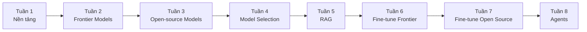

## 7.1. Triết lý học

Bài học nhấn mạnh **learning by doing**:

* học thông qua project;
* sửa code;
* thử nghiệm;
* tạo biến thể;
* xem kết quả;
* áp dụng vào bài toán thương mại.

Không nên chỉ xem giảng viên gõ code rồi chép lại. Bản nguồn khuyến khích người học thay đổi, khám phá và biến code mẫu thành dự án của mình. 

---

# 8. Hệ sinh thái sáu khóa AI

Theo tài liệu, chương trình rộng hơn gồm sáu hướng:

|  # | Hướng                     | Trọng tâm                                           |
| -: | ------------------------- | --------------------------------------------------- |
|  1 | AI Builder                | xây trợ lý/agent, kể cả voice agent                 |
|  2 | AI Coder                  | phát triển phần mềm bằng công cụ coding AI          |
|  3 | AI Leader                 | ứng dụng AI vào doanh nghiệp, chuyển đổi và startup |
|  4 | AI Engineering Core       | LLM, API, open-source LLM, RAG, fine-tuning         |
|  5 | Agentic AI Engineering    | agent loop, SDK, MCP và agent                       |
|  6 | Production AI Engineering | triển khai quy mô lớn trên cloud                    |

Nguồn mô tả sáu khóa này là các mảnh ghép bổ sung cho nhau, với ba khóa cuối tập trung nhiều hơn vào AI Engineering. 

---

# 9. Thiết lập môi trường phát triển

Đây là phần nền tảng quan trọng.

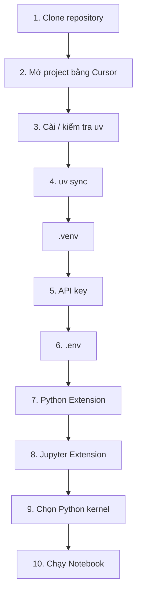

Nguồn trình bày setup gồm việc clone repository, dùng Cursor, `uv`, tạo API key và đưa khóa vào tệp môi trường. 

---

# 10. Git và GitHub

## 10.1. Hai khái niệm không giống nhau

### Git

Hệ thống quản lý phiên bản.

Dùng để:

* theo dõi thay đổi;
* commit;
* branch;
* merge;
* clone.

### GitHub

Nền tảng trực tuyến lưu trữ Git repository và hỗ trợ cộng tác.

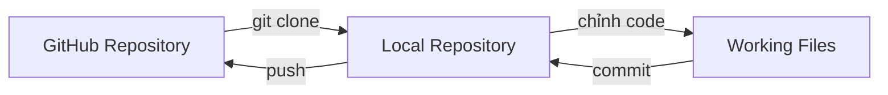

## 10.2. Một số lệnh được sử dụng

```bash
git
git clone <repository-url>

mkdir projects
cd projects
ls
```

Nguồn yêu cầu người học kiểm tra Git, tạo thư mục dự án rồi clone repository từ GitHub về máy.  

---

# 11. Cursor và project root

Một project trong Cursor nên được mở từ **thư mục gốc đúng của repository**.

Ví dụ:

```text
projects/
└── llm_engineering/
    ├── README.md
    ├── pyproject.toml
    ├── uv.lock
    ├── week1/
    ├── week2/
    └── ...
```

Không nên mở nhầm:

```text
projects/
```

hoặc chỉ:

```text
week1/
```

nếu toàn bộ repository mới là project root.

Nguồn nhấn mạnh rằng mở nhầm thư mục sẽ khiến cấu trúc project trở nên khó hiểu trong Cursor. 

---

# 12. `uv` và môi trường Python

`uv` được sử dụng để quản lý môi trường Python và dependency của dự án.

Bài học đặc biệt sử dụng:

```bash
uv --version
uv self update
uv sync
```

Nguồn xem `uv sync` là bước xây môi trường và dependency cho project. 

Theo tài liệu chính thức hiện tại, `uv sync` đồng bộ dependency của dự án với môi trường và tạo `.venv` nếu môi trường đó chưa tồn tại. ([Astral Docs][2])

### Sơ đồ

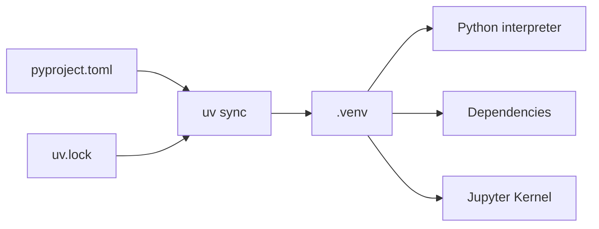

---

# 13. API và ChatGPT không phải là cùng một sản phẩm

Một điểm dễ nhầm:

```text
ChatGPT
    = ứng dụng để người dùng trò chuyện

OpenAI API
    = giao diện để chương trình của bạn gọi mô hình
```

Trong bài học, người học cần API để Python có thể gửi yêu cầu trực tiếp tới mô hình. Nguồn cũng dành riêng một đoạn để phân biệt sản phẩm ChatGPT và API dùng từ góc nhìn kỹ sư. 

---

# 14. Bảo vệ API key

## 14.1. Không hard-code key

Không nên:

```python
api_key = "sk-xxxxxxxxxxxxxxxx"
```

trực tiếp trong source code.

## 14.2. Dùng `.env`

Ví dụ:

```env
OPENAI_API_KEY=your_secret_key_here
```

Sau đó code đọc khóa từ biến môi trường.

OpenAI hiện khuyến nghị không commit API key vào repository và sử dụng biến môi trường như `OPENAI_API_KEY` để giảm nguy cơ làm lộ khóa. ([OpenAI Help Center][3])

### Sơ đồ bảo mật

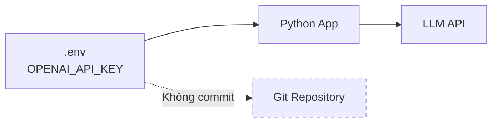

### Nguyên tắc

> **API key là bí mật.**

Không:

* chụp màn hình rồi đăng công khai;
* gửi key vào chat;
* commit key;
* đặt key trong frontend;
* đưa key lên GitHub.

---

# 15. Jupyter Notebook

Notebook là file có phần mở rộng:

```text
.ipynb
```

Notebook chứa nhiều **cell**.

```text
Notebook
 ├── Markdown Cell
 ├── Code Cell
 ├── Code Cell
 ├── Markdown Cell
 └── Code Cell
```

Có thể chạy từng cell riêng.

Trong nguồn, người học cài extension Python + Jupyter, mở notebook ngày 1 và chọn interpreter của `.venv` làm kernel. 

---

# 16. Kernel là gì?

Trong ngữ cảnh bài học:

> Kernel là tiến trình Python thực thi code của Notebook.

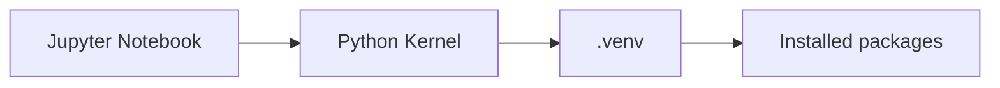

Nếu chọn sai kernel, có thể gặp:

```text
ModuleNotFoundError
ImportError
package not found
```

dù package thực tế đã được cài trong một môi trường Python khác.

Nguồn hướng dẫn chọn interpreter từ `.venv` và dùng troubleshooting notebook khi kernel không xuất hiện đúng. 

---

# 17. Cuộc gọi LLM đầu tiên bằng code

Thông tin gửi đến API được tổ chức thành các **message**.

Ví dụ khái niệm:

```python
messages = [
    {
        "role": "user",
        "content": "Xin chào GPT"
    }
]
```

Nguồn giới thiệu cấu trúc này dưới dạng một Python list chứa dictionary với hai trường quan trọng:

```text
role
content
```


---

# 18. System Prompt và User Prompt

Đây là một trong những kiến thức quan trọng nhất của bài.


Các hình minh họa lần lượt cho:

* kiến trúc System → User → Assistant;
* khu vực quản lý API key;
* pipeline web scraping;
* luồng GitHub/Pull Request.

## 18.1. System Prompt

System prompt mô tả:

* vai trò;
* nhiệm vụ;
* giọng điệu;
* quy tắc;
* ngữ cảnh;
* định dạng đầu ra.

Ví dụ:

```text
Bạn là trợ lý chuyên phân tích nội dung website.
Hãy tạo bản tóm tắt ngắn gọn.
Bỏ qua nội dung điều hướng.
Trả kết quả bằng Markdown.
```

## 18.2. User Prompt

User prompt chứa nhiệm vụ/input cụ thể của phiên đó.

```text
Sau đây là nội dung của website.
Hãy tóm tắt các nội dung quan trọng:

<website content>
```

Nguồn giải thích system prompt là nơi đặt khung và nhiệm vụ chung, còn user prompt là yêu cầu thực tế mà người dùng gửi trong khung đó. 

---

# 19. Cấu trúc Messages

```python
messages = [
    {
        "role": "system",
        "content": system_prompt
    },
    {
        "role": "user",
        "content": user_prompt
    }
]
```

Sơ đồ:

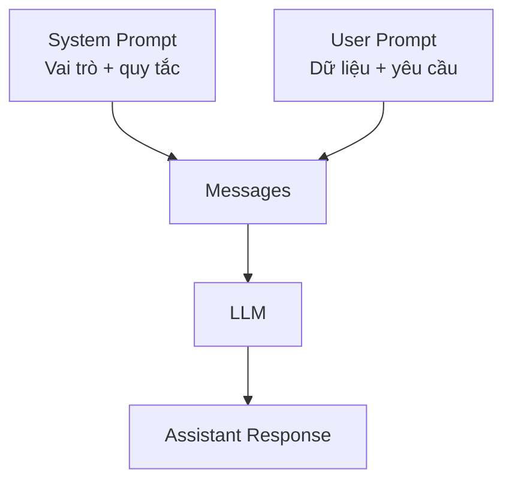

---

# 20. Thí nghiệm thay đổi System Prompt

Giữ nguyên:

```text
User: 2 + 2 bằng bao nhiêu?
```

Thay system prompt:

### Trường hợp A

```text
Bạn là một trợ lý hữu ích.
```

### Trường hợp B

```text
Bạn là một trợ lý khó tính và hay mỉa mai.
```

Giá trị toán học vẫn là:

```text
4
```

nhưng **giọng điệu phản hồi** có thể thay đổi.

Nguồn yêu cầu người học chủ động thay system prompt và quan sát việc thay đổi persona, giọng điệu và nhiệm vụ của LLM. 

---

# 21. Project đầu tiên — Website Summarizer

Đây là sản phẩm chính của ngày 1.

## 21.1. Yêu cầu

Đầu vào:

```text
URL
```

Đầu ra:

```text
Bản tóm tắt website bằng Markdown
```

Nguồn mô tả ứng dụng như một trình duyệt đơn giản có khả năng lấy nội dung từ URL rồi tạo bản tóm tắt. 

---

# 22. Kiến trúc Website Summarizer

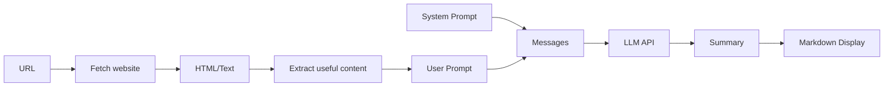

---

# 23. Giai đoạn 1 — lấy nội dung website

Bài mẫu dùng **Beautiful Soup** để hỗ trợ xử lý nội dung HTML.

```text
URL
 ↓
HTTP Response
 ↓
HTML
 ↓
BeautifulSoup
 ↓
Text Content
```

Điểm quan trọng:

> LLM chưa xuất hiện ở bước này.

Đây chỉ là quá trình lấy dữ liệu.

Nguồn mô tả hàm lấy website sử dụng BeautifulSoup và nhấn mạnh rằng ở thời điểm đó chưa có phần AI tham gia. 

---

# 24. Giai đoạn 2 — tạo prompt

Ví dụ:

```python
system_prompt = """
Bạn là trợ lý chuyên phân tích website.
Hãy tạo bản tóm tắt ngắn gọn bằng Markdown.
"""
```

Sau đó:

```python
user_prompt = f"""
Sau đây là nội dung website:

{website_content}

Hãy tóm tắt các điểm quan trọng.
"""
```

---

# 25. Giai đoạn 3 — tạo messages

```python
def messages_for(website_content):
    return [
        {
            "role": "system",
            "content": system_prompt
        },
        {
            "role": "user",
            "content": user_prompt_prefix + website_content
        }
    ]
```

Nguồn cũng xây một hàm tương tự để kết hợp system prompt với nội dung website thành danh sách message. 

---

# 26. Giai đoạn 4 — gọi LLM

```text
messages
   ↓
LLM API
   ↓
response
   ↓
assistant message
```

Sau đó lấy nội dung phản hồi và hiển thị bằng Markdown.

---

# 27. Toàn bộ luồng xử lý

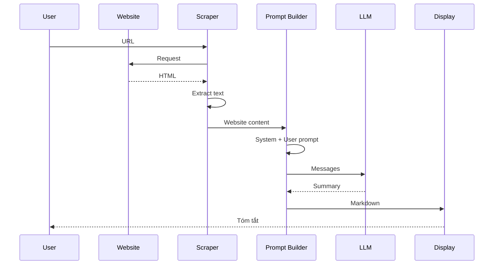

Nguồn xác nhận sản phẩm cuối cùng đã lấy nội dung website, gửi qua LLM và hiển thị bản tóm tắt. 

---

# 28. System Prompt biến một chương trình thành nhiều sản phẩm

Chỉ thay system prompt, cùng một pipeline có thể trở thành:

```text
Website
   │
   ├── Tóm tắt
   ├── Dịch sang tiếng Việt
   ├── Viết kiểu hài hước
   ├── Trích tin quan trọng
   ├── Trích tên người
   ├── Trích sự kiện
   ├── Phân tích sentiment
   └── Viết báo cáo cho lãnh đạo
```

Nguồn minh họa việc đổi system prompt sang phong cách thông minh/hài hước và thu được bản tóm tắt khác về giọng điệu. 

---

# 29. Hạn chế của scraper đơn giản

Một scraper HTML đơn giản không phải lúc nào cũng lấy được nội dung của website được render mạnh bằng JavaScript.

```text
HTML server-rendered
        ↓
Simple scraper
        ↓
thường lấy được

JavaScript-rendered page
        ↓
Simple scraper
        ↓
có thể thiếu dữ liệu
```

Bài học đưa ra hai hướng nâng cao:

* Selenium;
* Playwright.

Nguồn nói rõ scraper đơn giản không hoạt động với mọi website và gợi ý Selenium/Playwright cho bài nâng cao. 

---

# 30. GitHub Pull Request và học qua cộng đồng

Luồng mở rộng:

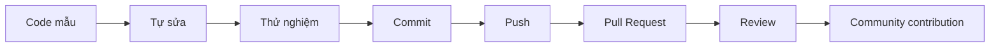

Bản nguồn khuyến khích sinh viên tạo biến thể của project và gửi Pull Request để đóng góp lại cho repository của khóa học. 

---

# 31. Kiến thức trọng tâm phải nhớ

| Kiến thức           | Ghi nhớ ngắn                                 |
| ------------------- | -------------------------------------------- |
| Ollama              | chạy LLM local                               |
| Model size          | ảnh hưởng tài nguyên và khả năng             |
| Git                 | quản lý phiên bản                            |
| GitHub              | lưu trữ/cộng tác repository                  |
| Cursor              | IDE                                          |
| `uv`                | quản lý Python project/environment           |
| `.venv`             | môi trường Python riêng                      |
| `.env`              | nơi lưu biến môi trường/bí mật trong bài lab |
| API key             | credential để chương trình gọi API           |
| Kernel              | Python process chạy notebook                 |
| `role`              | loại message                                 |
| `content`           | nội dung message                             |
| system prompt       | vai trò + luật + bối cảnh                    |
| user prompt         | input/yêu cầu cụ thể                         |
| BeautifulSoup       | hỗ trợ parse HTML                            |
| Markdown            | định dạng đầu ra                             |
| Selenium/Playwright | browser automation nâng cao                  |
| Pull Request        | đề nghị hợp nhất thay đổi                    |

---

# 32. Checklist thực hành

```text
[ ] Cài Ollama
[ ] Chạy được ít nhất một local model
[ ] Thử hai model khác kích thước
[ ] Cài Git
[ ] Clone repository
[ ] Mở đúng project root bằng Cursor
[ ] Kiểm tra uv
[ ] Chạy uv sync
[ ] Thấy .venv
[ ] Cài Python Extension
[ ] Cài Jupyter Extension
[ ] Mở Notebook
[ ] Chọn đúng .venv kernel
[ ] Thiết lập API key an toàn
[ ] Không commit API key
[ ] Chạy được request LLM đầu tiên
[ ] Phân biệt system/user prompt
[ ] Chạy Website Summarizer
[ ] Thử ít nhất 3 system prompt
[ ] Thử ít nhất 3 website
[ ] Tạo một biến thể phục vụ bài toán riêng
```

---

# 33. Câu hỏi ôn tập — Dạng 1: Trắc nghiệm

### Câu 1

Mục đích chính của Ollama trong bài là gì?

A. Thiết kế website
B. Chạy LLM trên máy cá nhân
C. Quản lý Git repository
D. Tạo Python package

### Câu 2

Công cụ nào được dùng để quản lý môi trường/dependency Python?

A. Git
B. Ollama
C. `uv`
D. BeautifulSoup

### Câu 3

Lệnh nào dùng để clone repository?

A. `git pull`
B. `git clone`
C. `uv clone`
D. `python clone`

### Câu 4

File Jupyter Notebook thường có phần mở rộng nào?

A. `.py`
B. `.json`
C. `.ipynb`
D. `.llm`

### Câu 5

Trong cấu trúc message, trường nào cho biết loại người gửi?

A. `type`
B. `mode`
C. `role`
D. `sender_id`

### Câu 6

System prompt chủ yếu dùng để:

A. lưu API key;
B. xác định vai trò và hành vi chung của model;
C. clone repository;
D. tạo virtual environment.

### Câu 7

User prompt chủ yếu chứa:

A. phiên bản Python;
B. yêu cầu/input cụ thể;
C. API secret;
D. dependency.

### Câu 8

Vai trò của `.env` trong bài lab là:

A. lưu ảnh;
B. lưu notebook;
C. lưu biến môi trường/bí mật;
D. lưu lịch sử Git.

### Câu 9

Tại sao không nên commit API key?

A. Git không hỗ trợ chuỗi dài.
B. Có thể làm lộ credential.
C. Python không đọc được.
D. LLM sẽ chậm.

### Câu 10

Website Summarizer nhận đầu vào chính là:

A. URL;
B. video;
C. database SQL;
D. ảnh.

### Câu 11

BeautifulSoup trong project chủ yếu dùng để:

A. huấn luyện LLM;
B. parse nội dung HTML;
C. quản lý API key;
D. tạo embeddings.

### Câu 12

Khi website phụ thuộc mạnh vào JavaScript, giải pháp nâng cao được nhắc tới là:

A. Matplotlib;
B. NumPy;
C. Selenium/Playwright;
D. Flask.

### Câu 13

`uv sync` có vai trò gần nhất với:

A. đồng bộ dependency/môi trường;
B. gửi code lên GitHub;
C. chạy Ollama;
D. tóm tắt website.

### Câu 14

Kernel của Jupyter là:

A. một repository;
B. tiến trình thực thi code;
C. API key;
D. system prompt.

### Câu 15

Thay system prompt nhưng giữ nguyên user prompt có thể thay đổi:

A. chủ yếu persona, phong cách hoặc cách thực hiện nhiệm vụ;
B. CPU của máy;
C. URL repository;
D. phiên bản Git.

---

# 34. Dạng 2: Đúng / Sai

### Câu 16

Ollama chỉ chạy được trên Linux.

### Câu 17

Git và GitHub là cùng một công cụ.

### Câu 18

System prompt có thể quy định giọng điệu của assistant.

### Câu 19

API key có thể commit lên GitHub nếu repository private.

### Câu 20

Một Notebook có thể chứa cả Markdown và code.

### Câu 21

Chọn sai Python kernel có thể gây lỗi import package.

### Câu 22

BeautifulSoup chính là LLM dùng để tóm tắt website.

### Câu 23

Model lớn hơn luôn cần ít tài nguyên hơn model nhỏ.

### Câu 24

Selenium hoặc Playwright có thể hỗ trợ với website cần browser rendering.

### Câu 25

Bài học khuyến khích thay đổi code và tạo biến thể riêng thay vì chỉ sao chép.

---

# 35. Dạng 3: Điền vào chỗ trống

### Câu 26

Lệnh sao chép repository về máy:

```bash
git ______ <url>
```

### Câu 27

Lệnh chuyển thư mục:

```bash
______ projects
```

### Câu 28

Lệnh tạo thư mục:

```bash
______ projects
```

### Câu 29

File dùng để giữ biến môi trường trong bài:

```text
______
```

### Câu 30

Tên biến API key được sử dụng:

```text
________________
```

### Câu 31

File Notebook có đuôi:

```text
_______
```

### Câu 32

Hai key quan trọng trong một message:

```text
_______
_______
```

### Câu 33

Prompt thiết lập persona gọi là:

```text
_______ prompt
```

### Câu 34

Prompt mang dữ liệu/yêu cầu cụ thể gọi là:

```text
_______ prompt
```

### Câu 35

Công cụ parse HTML trong project:

```text
Beautiful ______
```

---

# 36. Dạng 4: Ghép cặp

Ghép cột A với cột B.

| Cột A             | Cột B                         |
| ----------------- | ----------------------------- |
| A. Git            | 1. chạy Notebook              |
| B. GitHub         | 2. browser automation         |
| C. Jupyter Kernel | 3. quản lý version            |
| D. Ollama         | 4. lưu/cộng tác repository    |
| E. Playwright     | 5. chạy LLM local             |
| F. `uv`           | 6. quản lý Python environment |

### Câu 36–41

Hãy viết dạng:

```text
A-?
B-?
C-?
D-?
E-?
F-?
```

---

# 37. Dạng 5: Sắp xếp quy trình

### Câu 42

Sắp xếp đúng quá trình thiết lập:

```text
A. Chọn Jupyter kernel
B. Clone repository
C. uv sync
D. Mở project bằng Cursor
E. Mở Notebook
```

### Câu 43

Sắp xếp pipeline Website Summarizer:

```text
A. LLM tạo summary
B. Fetch website
C. Hiển thị Markdown
D. Tạo messages
E. Nhận URL
```

### Câu 44

Sắp xếp workflow Git:

```text
A. Pull Request
B. chỉnh code
C. clone
D. commit
E. push
```

---

# 38. Dạng 6: Tìm lỗi

### Câu 45

Có gì sai?

```env
OPENAI-API-KEY=abc123
```

### Câu 46

Có gì nguy hiểm?

```python
client = OpenAI(api_key="sk-secret-real-key")
```

### Câu 47

Có gì đáng kiểm tra khi Notebook báo:

```text
ModuleNotFoundError: No module named 'openai'
```

trong khi `uv sync` đã thành công?

### Câu 48

Người học clone repository vào:

```text
C:\Users\A\projects\llm-engineering
```

nhưng Cursor chỉ mở:

```text
C:\Users\A\projects\llm-engineering\week1
```

Vấn đề tiềm ẩn là gì?

### Câu 49

Scraper lấy gần như trang trống từ một SPA render bằng JavaScript. Hướng xử lý nào phù hợp?

---

# 39. Dạng 7: Đọc cấu trúc code

### Câu 50

Đoạn code sau có bao nhiêu message?

```python
messages = [
    {
        "role": "system",
        "content": "Bạn là trợ lý tóm tắt."
    },
    {
        "role": "user",
        "content": "Hãy tóm tắt văn bản này."
    }
]
```

### Câu 51

Message đầu tiên đóng vai trò gì?

### Câu 52

Message thứ hai đóng vai trò gì?

### Câu 53

Nếu thay:

```text
Bạn là trợ lý tóm tắt.
```

bằng:

```text
Bạn là biên tập viên hài hước, nhưng phải giữ chính xác mọi dữ kiện.
```

thì phần nào của kết quả nhiều khả năng thay đổi?

---

# 40. Dạng 8: Câu hỏi tự luận ngắn

### Câu 54

Tại sao bài học bắt đầu bằng việc chạy LLM local thay vì chỉ giới thiệu lý thuyết?

### Câu 55

Giải thích sự khác nhau giữa Git và GitHub.

### Câu 56

Tại sao project cần virtual environment riêng?

### Câu 57

Tại sao API key cần được bảo mật?

### Câu 58

Giải thích bằng lời của anh sự khác nhau giữa system prompt và user prompt.

### Câu 59

Vì sao một system prompt tốt có thể biến cùng một pipeline thành nhiều sản phẩm?

### Câu 60

BeautifulSoup và LLM đảm nhận hai nhiệm vụ khác nhau như thế nào?

---

# 41. Dạng 9: Tình huống thực tế

### Câu 61 — Hỗ trợ khách hàng

Anh có một website chứa 20 bài FAQ.

Hãy thiết kế system prompt để LLM:

* đọc nội dung;
* lấy các chính sách quan trọng;
* trình bày ngắn;
* không tự bịa thông tin.

---

### Câu 62 — Học tiếng Anh

Biến Website Summarizer thành công cụ:

> lấy một bài báo tiếng Anh rồi tạo bài học từ vựng B1.

Hãy xác định:

```text
Input:
System Prompt:
User Prompt:
Output:
```

---

### Câu 63 — Tin tức

Anh muốn tóm tắt một trang tin nhưng không muốn model thêm ý kiến.

System prompt cần có ít nhất ba quy tắc nào?

---

### Câu 64 — Email

Thiết kế một LLM tool:

```text
Email → đề xuất Subject
```

Hãy viết system prompt và user prompt mẫu.

---

### Câu 65 — Website JavaScript

Website không lấy được nội dung bằng BeautifulSoup.

Hãy đề xuất pipeline mới có Playwright.

---

### Câu 66 — API key bị lộ

Anh phát hiện key đã được commit lên repository public.

Ba hành động đầu tiên nên là gì?

---

# 42. Dạng 10: Thiết kế Prompt

### Câu 67

Viết system prompt cho một assistant:

> tóm tắt website theo phong cách giáo trình đại học.

### Câu 68

Viết system prompt cho một assistant:

> chuyển bài báo thành 10 flashcard hỏi–đáp.

### Câu 69

Viết system prompt cho một assistant:

> trích tên người, tổ chức, ngày tháng và sự kiện thành JSON.

### Câu 70

Viết system prompt cho một assistant:

> đọc trang sản phẩm và tạo bảng so sánh ưu/nhược điểm nhưng tuyệt đối không tự tạo thông số.

---

# 43. Dạng 11: Mini Project

## Câu 71 — Website → Lesson

Mở rộng project:

```text
URL
 ↓
Website
 ↓
LLM
 ↓
Lesson Markdown
```

Yêu cầu output:

```markdown
# Tên bài

## Mục tiêu

## Khái niệm

## Ví dụ

## Tóm tắt

## 10 câu hỏi ôn tập
```

---

## Câu 72 — Website → Quiz Generator

Pipeline:

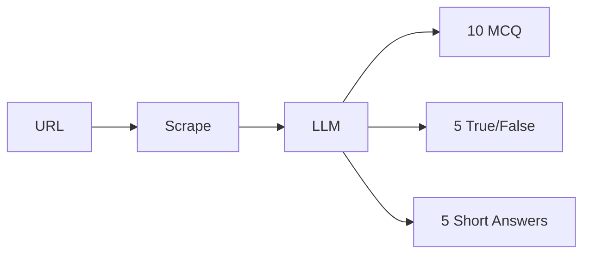

Thử nghĩ cách khiến model **không tạo câu hỏi ngoài nội dung website**.

---

## Câu 73 — Local version

Thay API cloud bằng LLM chạy qua Ollama.

So sánh:

| Tiêu chí        | Cloud API | Local LLM |
| --------------- | --------- | --------- |
| Internet        | ?         | ?         |
| Dữ liệu rời máy | ?         | ?         |
| Tài nguyên máy  | ?         | ?         |
| Cài đặt         | ?         | ?         |
| Chi phí API     | ?         | ?         |

---

# 44. Đáp án phần khách quan

## Trắc nghiệm

```text
1. B
2. C
3. B
4. C
5. C
6. B
7. B
8. C
9. B
10. A
11. B
12. C
13. A
14. B
15. A
```

## Đúng / Sai

```text
16. Sai
17. Sai
18. Đúng
19. Sai
20. Đúng
21. Đúng
22. Sai
23. Sai
24. Đúng
25. Đúng
```

## Điền từ

```text
26. clone
27. cd
28. mkdir
29. .env
30. OPENAI_API_KEY
31. .ipynb
32. role, content
33. system
34. user
35. Soup
```

## Ghép cặp

```text
A-3
B-4
C-1
D-5
E-2
F-6
```

## Sắp xếp

```text
42. B → D → C → E → A
43. E → B → D → A → C
44. C → B → D → E → A
```

---

# 45. Gợi ý đáp án phần tìm lỗi

### Câu 45

Trong bài lab, tên biến được dùng là:

```env
OPENAI_API_KEY=...
```

không phải:

```env
OPENAI-API-KEY
```

### Câu 46

API key bị hard-code trực tiếp trong source code.

Nên lấy từ biến môi trường.

### Câu 47

Kiểm tra trước tiên:

```text
Notebook đang dùng kernel nào?
```

Có thể Notebook không chạy Python interpreter của `.venv`.

### Câu 48

Cursor đang mở sai project root.

Nên mở:

```text
llm-engineering/
```

### Câu 49

Dùng browser automation như:

```text
Playwright
```

hoặc:

```text
Selenium
```

để render trang trước khi lấy nội dung.

---

# 46. Flashcard ôn nhanh

| Mặt trước           | Mặt sau                                 |
| ------------------- | --------------------------------------- |
| Ollama là gì?       | Công cụ chạy/tương tác LLM local        |
| Git là gì?          | Version control                         |
| GitHub là gì?       | Nền tảng lưu và cộng tác Git repository |
| `uv sync` làm gì?   | Đồng bộ môi trường/dependency project   |
| `.venv` là gì?      | Python virtual environment              |
| `.env` dùng làm gì? | Lưu biến môi trường/bí mật trong lab    |
| Kernel là gì?       | Process chạy code Notebook              |
| `role` là gì?       | Vai trò của message                     |
| `content` là gì?    | Nội dung message                        |
| System prompt?      | Vai trò, quy tắc, bối cảnh              |
| User prompt?        | Input/yêu cầu cụ thể                    |
| BeautifulSoup?      | Parse HTML                              |
| Playwright?         | Browser automation                      |
| Pull Request?       | Đề nghị hợp nhất code                   |
| Website Summarizer? | URL → scrape → prompt → LLM → summary   |

---

# 47. Bài tự đánh giá cuối ngày

Không xem tài liệu, hãy thử tự vẽ lại sơ đồ này:

```text
                   ┌─────────────┐
                   │    URL      │
                   └──────┬──────┘
                          ↓
                   ┌─────────────┐
                   │   Scraper   │
                   └──────┬──────┘
                          ↓
                ┌───────────────────┐
                │ Website Content   │
                └─────────┬─────────┘
                          ↓
       ┌──────────────────┴──────────────────┐
       ↓                                     ↓
┌──────────────┐                     ┌──────────────┐
│System Prompt │                     │ User Prompt  │
└──────┬───────┘                     └──────┬───────┘
       └──────────────────┬──────────────────┘
                          ↓
                    ┌──────────┐
                    │ Messages │
                    └────┬─────┘
                         ↓
                    ┌──────────┐
                    │   LLM    │
                    └────┬─────┘
                         ↓
                   ┌────────────┐
                   │  Markdown  │
                   │  Summary   │
                   └────────────┘
```

Nếu anh có thể giải thích **từng mũi tên** trong sơ đồ mà không nhìn lại bài, đồng thời tự viết được hai message `system` và `user`, thì anh đã nắm được phần cốt lõi của Ngày 1.

Cuối tài liệu gốc cũng tổng kết rằng sau ngày đầu người học đã chạy mô hình cục bộ, gọi frontier model bằng code, hiểu system/user prompt và xây được trình tóm tắt có khả năng áp dụng sang các bài toán thương mại khác. 

[1]: https://docs.ollama.com/quickstart?utm_source=chatgpt.com "Quickstart - Ollama"
[2]: https://docs.astral.sh/uv/reference/cli/?utm_source=chatgpt.com "Commands | uv"
[3]: https://help.openai.com/en/articles/5112595?utm_source=chatgpt.com "Best Practices for API Key Safety | OpenAI Help Center"
