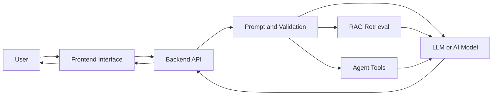
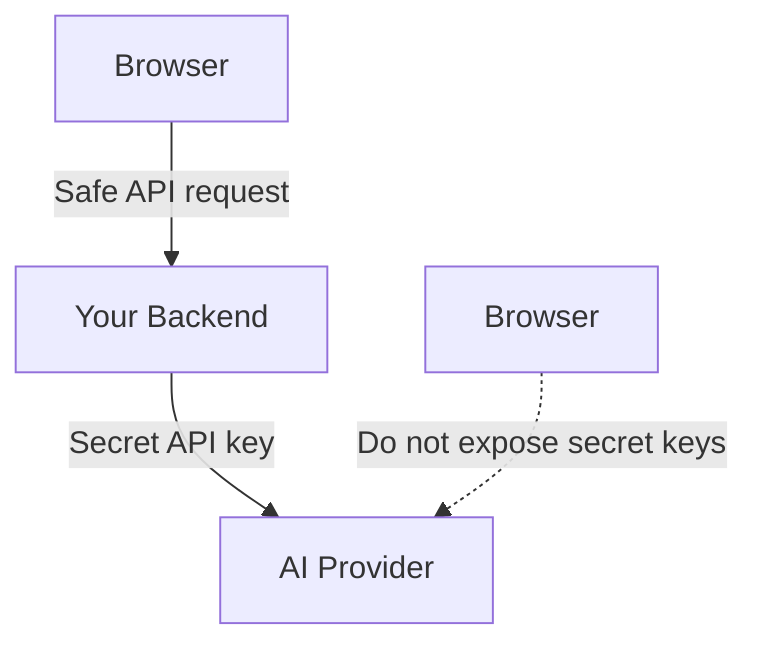
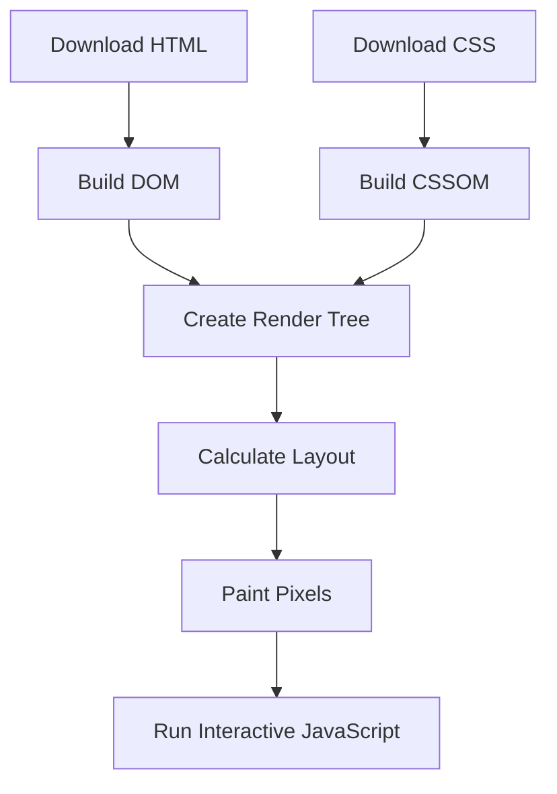
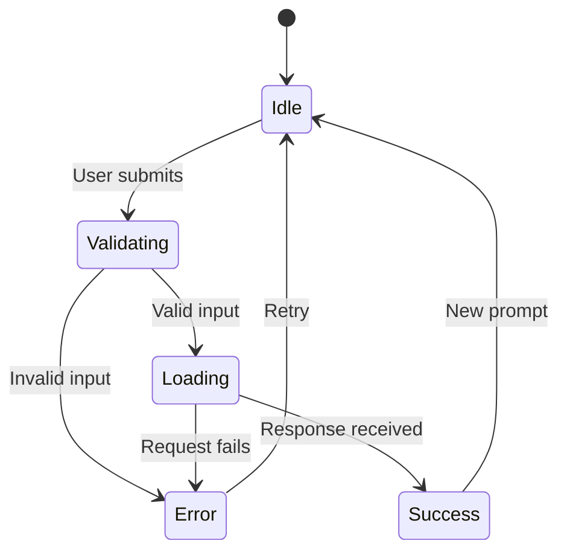
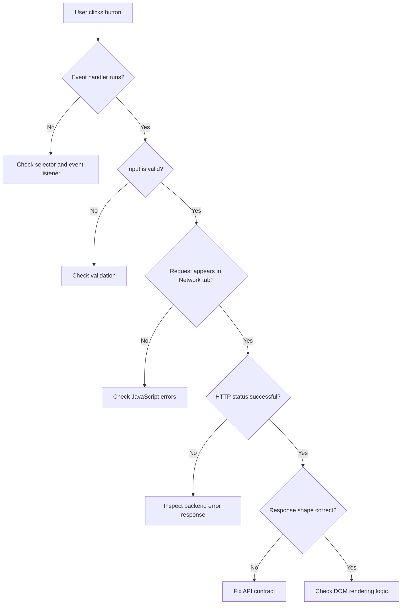
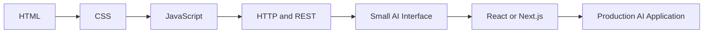

# 001 — Frontend Basics

**Course Section:** 01 — Foundations and LLM Basics
**Module:** Module 01 — Prerequisites
**Content Group:** Background Options
**Roadmap Source:** Prerequisites / Background Options
**Lesson Type:** Prerequisite
**Order in Module:** 001
**Suggested Duration:** 18 minutes

---

## 1. Overview

This lesson introduces **Frontend Basics** in the context of modern AI engineering.

The frontend is the part of an application that users can see and interact with. It includes elements such as:

* Pages
* Buttons
* Forms
* Chat interfaces
* File-upload areas
* Dashboards
* Loading indicators
* Error messages
* Model-generated responses

For an AI application, the frontend is responsible for collecting user input, sending requests to an AI backend, presenting model responses, and helping users understand what the system is doing.

After completing this lesson, you should understand:

* The roles of HTML, CSS, and JavaScript
* How browsers render web applications
* How a frontend communicates with a backend API
* How frontend concepts apply to chatbots, RAG systems, agents, and multimodal applications
* How to build and debug a small AI application interface

---

## 2. Learning Objectives

By the end of this lesson, you should be able to:

1. Explain frontend development in your own words.
2. Describe the responsibilities of HTML, CSS, and JavaScript.
3. Explain where the frontend appears in an AI engineering workflow.
4. Build a small interactive web interface.
5. Send data from a browser to a backend API.
6. Display success, loading, and error states.
7. Identify common frontend production problems.
8. Connect a frontend interface to an AI model, RAG pipeline, or agent backend.

---

## 3. What Is Frontend Development?

Frontend development is the process of building the part of an application that runs in the user's browser or client device.

A simple web application usually contains three main frontend technologies:

| Technology | Responsibility                    | Example                                |
| ---------- | --------------------------------- | -------------------------------------- |
| HTML       | Defines the structure and content | Headings, buttons, forms               |
| CSS        | Controls presentation and layout  | Colors, spacing, responsive design     |
| JavaScript | Adds behavior and interaction     | API calls, validation, dynamic updates |

A useful mental model is:

```text
HTML       = Structure
CSS        = Appearance
JavaScript = Behavior
```

For example, consider an AI chatbot:

* HTML creates the message input, send button, and response area.
* CSS controls how the chat interface looks.
* JavaScript sends the prompt to the backend and displays the AI response.

---

## 4. Where Frontend Fits in an AI Application

A production AI application normally includes more than just an AI model.



### Typical request flow

1. The user enters a prompt.
2. The frontend validates the input.
3. JavaScript sends an HTTP request to the backend.
4. The backend prepares the prompt.
5. The backend may retrieve documents or call tools.
6. The backend sends the request to an AI model.
7. The model produces a response.
8. The backend returns structured data.
9. The frontend displays the result.

The frontend should not normally call a paid AI provider directly because doing so may expose API keys and security credentials.



---

## 5. Core Frontend Technologies

## 5.1 HTML: Page Structure

HTML stands for **HyperText Markup Language**.

It describes the structure of a web page using elements and tags.

```html
<!DOCTYPE html>
<html lang="en">
<head>
  <meta charset="UTF-8">
  <meta
    name="viewport"
    content="width=device-width, initial-scale=1.0"
  >
  <title>AI Assistant</title>
</head>
<body>
  <main>
    <h1>AI Assistant</h1>

    <label for="prompt">Your question</label>
    <textarea
      id="prompt"
      placeholder="Ask the AI something..."
    ></textarea>

    <button id="send-button">Send</button>

    <section id="response">
      The response will appear here.
    </section>
  </main>
</body>
</html>
```

### Important HTML concepts

#### Elements

An HTML element usually contains:

```html
<p>This is a paragraph.</p>
```

* `<p>` is the opening tag.
* `This is a paragraph.` is the content.
* `</p>` is the closing tag.

#### Attributes

Attributes modify the behavior or meaning of an element.

```html
<input
  id="email"
  type="email"
  placeholder="Enter your email"
>
```

In this example:

* `id` identifies the element.
* `type` defines the expected input.
* `placeholder` gives the user a hint.

#### Semantic HTML

Semantic elements describe their purpose clearly.

```html
<header></header>
<nav></nav>
<main></main>
<section></section>
<article></article>
<footer></footer>
```

Semantic HTML improves:

* Accessibility
* Search engine understanding
* Code readability
* Maintainability

---

## 5.2 CSS: Presentation and Layout

CSS stands for **Cascading Style Sheets**.

It controls how HTML elements look and how they are positioned.

```css
* {
  box-sizing: border-box;
}

body {
  margin: 0;
  min-height: 100vh;
  font-family: Arial, sans-serif;
  background: #f5f7fb;
}

main {
  width: min(700px, 90%);
  margin: 48px auto;
  padding: 24px;
  background: white;
  border-radius: 16px;
  box-shadow: 0 8px 30px rgb(0 0 0 / 10%);
}

textarea {
  display: block;
  width: 100%;
  min-height: 120px;
  margin-top: 8px;
  padding: 12px;
  resize: vertical;
}

button {
  margin-top: 16px;
  padding: 10px 18px;
  cursor: pointer;
}

#response {
  margin-top: 24px;
  padding: 16px;
  background: #f1f3f7;
  border-radius: 8px;
}
```

### The CSS box model

Every HTML element can be understood as a rectangular box.

```text
┌───────────────────────────────┐
│            Margin             │
│  ┌─────────────────────────┐  │
│  │         Border          │  │
│  │  ┌───────────────────┐  │  │
│  │  │      Padding      │  │  │
│  │  │  ┌─────────────┐  │  │  │
│  │  │  │   Content   │  │  │  │
│  │  │  └─────────────┘  │  │  │
│  │  └───────────────────┘  │  │
│  └─────────────────────────┘  │
└───────────────────────────────┘
```

Using the following reset makes element dimensions easier to control:

```css
* {
  box-sizing: border-box;
}
```

With `border-box`, an element's declared width includes its content, padding, and border.

### Responsive design

A frontend should work across different screen sizes.

```css
.container {
  width: min(800px, 92%);
  margin-inline: auto;
}

@media (max-width: 600px) {
  .container {
    width: 100%;
    padding: 16px;
  }
}
```

---

## 5.3 JavaScript: Behavior and Interaction

JavaScript makes a page interactive.

It can:

* Read user input
* Change HTML content
* Send HTTP requests
* Validate forms
* Display loading states
* Handle errors
* Process streaming responses
* Save data in browser storage

Example:

```javascript
const sendButton = document.querySelector("#send-button");
const promptInput = document.querySelector("#prompt");
const responseBox = document.querySelector("#response");

sendButton.addEventListener("click", () => {
  const prompt = promptInput.value.trim();

  if (!prompt) {
    responseBox.textContent = "Please enter a question.";
    return;
  }

  responseBox.textContent = `You asked: ${prompt}`;
});
```

### DOM manipulation

The **Document Object Model**, or DOM, is the browser's representation of the HTML page.

JavaScript can select and modify DOM elements.

```javascript
const title = document.querySelector("h1");

title.textContent = "My AI Research Assistant";
```

The browser updates the visible page when the DOM changes.

---

## 6. Browser Rendering Process

When the browser opens a web page, it performs several steps.



Understanding this process helps explain problems such as:

* Styles not appearing
* JavaScript running before an element exists
* Layout shifts
* Slow page rendering
* Blocking scripts
* Missing assets

A script that accesses HTML elements should normally run after those elements have been created.

One solution is placing the script near the end of `<body>`:

```html
<body>
  <main id="app"></main>

  <script src="script.js"></script>
</body>
```

Another solution is using `defer`:

```html
<script src="script.js" defer></script>
```

---

## 7. Communicating with a Backend API

Frontend applications commonly communicate with backends using HTTP.

### Common HTTP methods

| Method | Typical purpose              |
| ------ | ---------------------------- |
| GET    | Retrieve data                |
| POST   | Create data or submit input  |
| PUT    | Replace an existing resource |
| PATCH  | Partially update a resource  |
| DELETE | Remove a resource            |

For an AI prompt request, `POST` is usually appropriate because the frontend sends structured input to the server.

### Example request

```javascript
async function askAI(prompt) {
  const response = await fetch("http://localhost:8000/api/chat", {
    method: "POST",
    headers: {
      "Content-Type": "application/json"
    },
    body: JSON.stringify({
      message: prompt
    })
  });

  if (!response.ok) {
    throw new Error(`Request failed: ${response.status}`);
  }

  return response.json();
}
```

### Example request body

```json
{
  "message": "Explain embeddings in simple language."
}
```

### Example response body

```json
{
  "answer": "An embedding is a numerical representation of meaning.",
  "model": "example-model",
  "request_id": "req_123"
}
```

### Complete frontend handler

```javascript
const sendButton = document.querySelector("#send-button");
const promptInput = document.querySelector("#prompt");
const responseBox = document.querySelector("#response");

sendButton.addEventListener("click", async () => {
  const prompt = promptInput.value.trim();

  if (!prompt) {
    responseBox.textContent = "Please enter a question.";
    return;
  }

  sendButton.disabled = true;
  responseBox.textContent = "Generating response...";

  try {
    const result = await askAI(prompt);
    responseBox.textContent = result.answer;
  } catch (error) {
    console.error(error);
    responseBox.textContent =
      "The request failed. Please try again.";
  } finally {
    sendButton.disabled = false;
  }
});
```

---

## 8. Example Backend Contract

A frontend and backend must agree on an API contract.

For example:

```text
Endpoint:
POST /api/chat

Request:
{
  "message": "string"
}

Successful response:
{
  "answer": "string",
  "request_id": "string"
}

Error response:
{
  "detail": "string"
}
```

A minimal FastAPI route could look like this:

```python
from fastapi import FastAPI
from pydantic import BaseModel

app = FastAPI()


class ChatRequest(BaseModel):
    message: str


class ChatResponse(BaseModel):
    answer: str
    request_id: str


@app.post("/api/chat", response_model=ChatResponse)
async def chat(request: ChatRequest) -> ChatResponse:
    return ChatResponse(
        answer=f"You asked: {request.message}",
        request_id="demo-request-001",
    )
```

This route does not call a real AI model yet. It provides a stable interface that the frontend can test against.

---

## 9. Frontend States for AI Applications

An AI interface should not only display the final answer. It must communicate the current application state.



### Important states

#### Idle

The application is waiting for user input.

```text
Ask the assistant a question.
```

#### Loading

The request is being processed.

```text
Generating a response...
```

#### Streaming

The response is arriving token by token.

```text
An embedding is a numerical...
```

#### Success

The complete response has been received.

#### Empty result

The request succeeded, but no useful result was returned.

#### Error

The request failed because of:

* Network problems
* Invalid input
* Server errors
* Authentication problems
* Model timeouts
* Rate limits

A strong frontend clearly distinguishes these states.

---

## 10. AI-Specific Frontend Responsibilities

A normal web form may finish in milliseconds. An AI request can take several seconds or longer.

The frontend should therefore handle several AI-specific concerns.

### 10.1 Long-running requests

Show a visible loading state and disable repeated submissions.

```javascript
sendButton.disabled = true;
sendButton.textContent = "Generating...";
```

### 10.2 Streaming responses

Streaming improves perceived speed because users see the answer while it is being generated.

```text
User prompt
    ↓
Backend begins generation
    ↓
Token 1 → Token 2 → Token 3 → ...
    ↓
Frontend appends each chunk
```

Common streaming technologies include:

* Server-Sent Events
* Fetch streams
* WebSockets

### 10.3 Markdown rendering

LLM responses frequently contain Markdown.

For example:

````markdown
## Explanation

- First point
- Second point

```python
print("Hello")
````

````

The frontend may use a Markdown parser to turn this text into formatted HTML.

Never insert untrusted model output directly with unsafe HTML rendering.

### 10.4 Citations

A RAG application may return sources together with the answer.

```json
{
  "answer": "The policy allows two pets.",
  "citations": [
    {
      "title": "Rental Agreement",
      "page": 4,
      "source_id": "document_123"
    }
  ]
}
````

The frontend should display the sources clearly and allow users to inspect them.

### 10.5 File uploads

Multimodal or document-based AI applications may accept:

* Images
* PDF documents
* Audio recordings
* CSV files
* Spreadsheets

The frontend should validate:

* File type
* File size
* Number of files
* Upload progress
* Server error messages

### 10.6 Human confirmation for agent actions

An AI agent may propose actions such as:

* Sending an email
* Deleting a file
* Creating a calendar event
* Purchasing an item
* Updating a database

The frontend should request explicit confirmation before sensitive or irreversible actions.

```text
The agent is ready to send this email.

[Review email] [Cancel] [Confirm and send]
```

---

## 11. Mini Demo: AI Prompt Interface

### Project structure

```text
frontend-basics/
├── index.html
├── style.css
└── script.js
```

### `index.html`

```html
<!DOCTYPE html>
<html lang="en">
<head>
  <meta charset="UTF-8">

  <meta
    name="viewport"
    content="width=device-width, initial-scale=1.0"
  >

  <title>AI Prompt Demo</title>

  <link rel="stylesheet" href="style.css">

  <script src="script.js" defer></script>
</head>

<body>
  <main class="container">
    <header>
      <p class="eyebrow">Frontend Basics</p>
      <h1>AI Prompt Demo</h1>

      <p>
        Enter a question and send it to the backend API.
      </p>
    </header>

    <form id="prompt-form">
      <label for="prompt">Prompt</label>

      <textarea
        id="prompt"
        name="prompt"
        placeholder="Explain vector databases..."
        maxlength="2000"
        required
      ></textarea>

      <div class="form-footer">
        <span id="character-count">0 / 2000</span>

        <button id="submit-button" type="submit">
          Ask AI
        </button>
      </div>
    </form>

    <section
      id="result"
      class="result"
      aria-live="polite"
    >
      The model response will appear here.
    </section>
  </main>
</body>
</html>
```

### `style.css`

```css
* {
  box-sizing: border-box;
}

body {
  margin: 0;
  min-height: 100vh;
  padding: 32px 16px;
  font-family: Arial, sans-serif;
  line-height: 1.5;
  background: #f4f6fa;
}

.container {
  width: min(720px, 100%);
  margin-inline: auto;
  padding: 28px;
  background: white;
  border-radius: 18px;
  box-shadow: 0 12px 40px rgb(0 0 0 / 8%);
}

.eyebrow {
  margin-bottom: 4px;
  font-size: 0.8rem;
  font-weight: bold;
  letter-spacing: 0.08em;
  text-transform: uppercase;
}

h1 {
  margin-top: 0;
}

label {
  display: block;
  margin-bottom: 8px;
  font-weight: bold;
}

textarea {
  width: 100%;
  min-height: 150px;
  padding: 14px;
  border: 1px solid #cdd3df;
  border-radius: 10px;
  font: inherit;
  resize: vertical;
}

textarea:focus {
  outline: 2px solid currentColor;
  outline-offset: 2px;
}

.form-footer {
  display: flex;
  justify-content: space-between;
  align-items: center;
  gap: 16px;
  margin-top: 12px;
}

button {
  padding: 10px 18px;
  border: 0;
  border-radius: 8px;
  font: inherit;
  font-weight: bold;
  cursor: pointer;
}

button:disabled {
  cursor: not-allowed;
  opacity: 0.6;
}

.result {
  min-height: 100px;
  margin-top: 24px;
  padding: 18px;
  border-radius: 12px;
  background: #f2f4f8;
  white-space: pre-wrap;
}

.result[data-state="error"] {
  border: 1px solid currentColor;
}

@media (max-width: 520px) {
  .container {
    padding: 20px;
  }

  .form-footer {
    align-items: stretch;
    flex-direction: column;
  }
}
```

### `script.js`

```javascript
const form = document.querySelector("#prompt-form");
const promptInput = document.querySelector("#prompt");
const submitButton = document.querySelector("#submit-button");
const resultBox = document.querySelector("#result");
const characterCount = document.querySelector("#character-count");

const API_URL = "http://localhost:8000/api/chat";

promptInput.addEventListener("input", () => {
  characterCount.textContent =
    `${promptInput.value.length} / 2000`;
});

form.addEventListener("submit", async (event) => {
  event.preventDefault();

  const prompt = promptInput.value.trim();

  if (!prompt) {
    showError("Please enter a prompt.");
    return;
  }

  setLoadingState(true);

  try {
    const response = await fetch(API_URL, {
      method: "POST",
      headers: {
        "Content-Type": "application/json"
      },
      body: JSON.stringify({
        message: prompt
      })
    });

    const data = await response.json();

    if (!response.ok) {
      const message =
        data.detail ?? `Request failed with ${response.status}`;

      throw new Error(message);
    }

    resultBox.dataset.state = "success";
    resultBox.textContent = data.answer;
  } catch (error) {
    console.error("AI request failed:", error);
    showError(error.message);
  } finally {
    setLoadingState(false);
  }
});

function setLoadingState(isLoading) {
  submitButton.disabled = isLoading;
  promptInput.disabled = isLoading;

  submitButton.textContent = isLoading
    ? "Generating..."
    : "Ask AI";

  if (isLoading) {
    resultBox.dataset.state = "loading";
    resultBox.textContent = "Generating a response...";
  }
}

function showError(message) {
  resultBox.dataset.state = "error";
  resultBox.textContent = `Error: ${message}`;
}
```

---

## 12. Running the Demo

You can run the frontend with a local development server.

For example, using Python:

```bash
python -m http.server 5500
```

Then open:

```text
http://localhost:5500
```

You can also use a VS Code development server extension. Beginner HTML and CSS courses often use VS Code together with a browser and a live development server to preview changes quickly.

A typical beginner project also separates the application into:

```text
index.html
style.css
script.js
```

This structure keeps content, presentation, and behavior organized.

---

## 13. CORS and Local Development

During local development, the frontend and backend may use different origins.

For example:

```text
Frontend: http://localhost:5500
Backend:  http://localhost:8000
```

The browser treats them as separate origins. The backend must explicitly allow the frontend origin.

FastAPI example:

```python
from fastapi.middleware.cors import CORSMiddleware

app.add_middleware(
    CORSMiddleware,
    allow_origins=[
        "http://localhost:5500",
    ],
    allow_credentials=True,
    allow_methods=["*"],
    allow_headers=["*"],
)
```

Avoid using unrestricted origins in production unless the application genuinely requires them.

---

## 14. Debugging Workflow

When the frontend does not work, debug the request layer by layer.



### Browser developer tools

Modern browsers include developer tools for inspecting applications.

#### Console

Use the Console to find JavaScript errors.

```javascript
console.log("Submitting prompt:", prompt);
console.error("Request failed:", error);
```

#### Network panel

Use the Network panel to inspect:

* Request URL
* HTTP method
* Request body
* Response body
* Status code
* Response time
* CORS failures

#### Elements panel

Use the Elements panel to inspect:

* HTML structure
* Applied CSS
* Overridden styles
* Element size and spacing
* Accessibility attributes

#### Application panel

Use the Application panel to inspect:

* Local storage
* Session storage
* Cookies
* Cached assets

---

## 15. Common Mistakes

### 15.1 Learning definitions without building anything

Reading about HTML, CSS, and JavaScript is not enough.

Build a small page after learning each concept.

### 15.2 Exposing an AI API key

Incorrect:

```javascript
const OPENAI_API_KEY = "secret-key";
```

Anything included in browser JavaScript can potentially be inspected by users.

Correct architecture:

```text
Frontend → Your backend → AI provider
```

### 15.3 Ignoring loading states

Without a loading state, users may click the submit button multiple times and create duplicate requests.

### 15.4 Handling only the happy path

The application may fail because of:

* Invalid JSON
* Network disconnection
* Backend timeout
* Model provider outage
* Rate limiting
* Authentication failure
* Unexpected response data

### 15.5 Assuming the API always returns the same shape

Unsafe:

```javascript
resultBox.textContent = data.answer;
```

Safer:

```javascript
if (typeof data.answer !== "string") {
  throw new Error("The backend returned an invalid response.");
}
```

### 15.6 Using unsafe HTML rendering

Unsafe model output can contain malicious markup.

Avoid directly inserting untrusted content:

```javascript
resultBox.innerHTML = modelOutput;
```

Prefer text rendering:

```javascript
resultBox.textContent = modelOutput;
```

Use a trusted sanitizer when rendered HTML or Markdown is required.

### 15.7 Forgetting mobile layouts

A desktop-only chat interface may become unusable on smaller screens.

Test:

* Narrow screens
* Long responses
* Long code blocks
* Large uploaded filenames
* On-screen keyboards
* Slow mobile networks

### 15.8 Hiding useful backend errors

Users should receive friendly messages, while developers should retain enough diagnostic information in logs.

User-facing message:

```text
The assistant is temporarily unavailable. Please try again.
```

Developer log:

```text
POST /api/chat returned 503
Provider timeout after 30 seconds
Request ID: req_123
```

---

## 16. Accessibility Basics

Accessibility helps people use the application with keyboards, screen readers, and assistive technologies.

### Use labels

```html
<label for="prompt">Prompt</label>
<textarea id="prompt"></textarea>
```

### Use real buttons

Prefer:

```html
<button type="submit">Send</button>
```

Avoid using a generic `<div>` as a clickable button.

### Announce dynamic content

```html
<section aria-live="polite" id="response"></section>
```

This helps screen readers announce newly generated AI responses.

### Preserve keyboard access

Users should be able to:

* Move through controls with `Tab`
* Submit a form with the keyboard
* See which element has focus
* Cancel or retry actions without a mouse

### Provide meaningful status text

Do not communicate state using color alone.

Instead of only changing the border color, also display:

```text
Upload failed: The file is larger than 10 MB.
```

---

## 17. Frontend Choices for AI Engineers

You do not need to master every frontend framework before building an AI application.

### Option 1: HTML, CSS, and JavaScript

Best for:

* Learning web fundamentals
* Small demos
* Understanding browser behavior
* Simple portfolio projects

### Option 2: React or Next.js

Best for:

* Complex interfaces
* Reusable components
* Production dashboards
* Authentication
* Routing
* Large application state

### Option 3: Streamlit or Gradio

Best for:

* Fast AI prototypes
* Internal tools
* Model demonstrations
* Data science workflows

However, prototype frameworks provide less control than a custom frontend.

### Suggested learning order



---

## 18. Practical Exercise

Build a small **AI Explanation Assistant**.

### Requirements

Your application must include:

1. A prompt textarea
2. A response area
3. A submit button
4. Input validation
5. A loading state
6. An error state
7. A successful response state
8. A backend API call
9. A responsive mobile layout
10. At least one accessibility improvement

### Suggested API input

```json
{
  "topic": "vector embeddings",
  "difficulty": "beginner"
}
```

### Suggested API output

```json
{
  "explanation": "Vector embeddings represent information as numbers...",
  "examples": [
    "Semantic search",
    "Document retrieval",
    "Recommendation systems"
  ]
}
```

### Optional extensions

* Add a difficulty selector.
* Add a copy-response button.
* Add conversation history.
* Add Markdown rendering.
* Add token streaming.
* Add file upload.
* Display source citations.
* Add a cancel-generation button.
* Save prompts in local storage.
* Add light and dark themes.

---

## 19. Production Failure Scenario

### Problem

The interface remains in the loading state forever after the backend returns an error.

### Possible cause

The code enables the loading state before the request but only disables it after a successful response.

Incorrect:

```javascript
setLoadingState(true);

const response = await fetch(API_URL);

if (!response.ok) {
  throw new Error("Request failed");
}

setLoadingState(false);
```

If the request fails, `setLoadingState(false)` is never reached.

### Fix

Use `finally`:

```javascript
setLoadingState(true);

try {
  const response = await fetch(API_URL);

  if (!response.ok) {
    throw new Error("Request failed");
  }
} catch (error) {
  showError(error.message);
} finally {
  setLoadingState(false);
}
```

The `finally` block runs whether the request succeeds or fails.

---

## 20. Practice Tasks

### Task 1: Five-line summary

Without looking at the lesson, write five lines explaining:

* What frontend development is
* What HTML does
* What CSS does
* What JavaScript does
* How the frontend communicates with an AI backend

### Task 2: Build a static interface

Create a page containing:

* A heading
* A prompt textarea
* A model selector
* A send button
* A response card

No backend is required for this task.

### Task 3: Add JavaScript behavior

Make the button:

1. Read the prompt.
2. Reject empty input.
3. Show a loading state.
4. Display a mock answer after one second.

```javascript
setTimeout(() => {
  resultBox.textContent = "This is a simulated AI response.";
}, 1000);
```

### Task 4: Connect the API

Replace the mock answer with a real request to a FastAPI or Node.js endpoint.

### Task 5: Document a failure

Record one production failure that could happen and explain:

* The symptom
* The likely cause
* How to reproduce it
* How to debug it
* How to prevent it

---

## 21. Completion Checklist

* [ ] I can explain frontend development in one or two minutes.
* [ ] I understand the responsibilities of HTML, CSS, and JavaScript.
* [ ] I can create a basic HTML page.
* [ ] I can apply CSS styles and responsive layouts.
* [ ] I can handle a form submission with JavaScript.
* [ ] I can send a JSON request to a backend API.
* [ ] I can inspect requests in the browser Network panel.
* [ ] I can display idle, loading, success, and error states.
* [ ] I understand why secret API keys must not be stored in frontend code.
* [ ] I have created a small frontend artifact or demo.
* [ ] I have recorded at least one limitation or unanswered question.
* [ ] I understand how this topic connects to prompts, models, retrieval, tools, safety, cost, and user experience.

---

## 22. Related Outcome

Prepare the web, backend, and programming foundations required before building AI applications.

Frontend knowledge enables an AI engineer to turn model capabilities into a usable product rather than an isolated notebook or API endpoint.

---

## 23. Related Project

Set up a minimal full-stack application containing:

```text
project/
├── frontend/
│   ├── index.html
│   ├── style.css
│   └── script.js
│
├── backend/
│   ├── main.py
│   └── requirements.txt
│
├── Dockerfile
├── docker-compose.yml
├── .gitignore
└── README.md
```

The project should include:

* Git version control
* A REST API endpoint
* Frontend-to-backend communication
* Basic database connectivity
* Environment variables
* Error handling
* Docker basics
* Setup instructions in the README

---

## 24. Key Takeaways

**Frontend Basics** is an essential milestone in the AI Engineer roadmap.

The frontend is where users experience the AI system. It transforms prompts, APIs, retrieval pipelines, agent tools, and model responses into an understandable and interactive product.

Remember the core relationship:

```text
HTML creates the structure.
CSS controls the presentation.
JavaScript provides the behavior.
The backend protects secrets and runs application logic.
The AI model generates or analyzes information.
```

Do not stop after reading the concepts. Turn this lesson into a working artifact:

* A prompt interface
* A chatbot
* A RAG search page
* An agent approval screen
* A multimodal upload demo
* A model evaluation dashboard
* A portfolio project

The goal is not only to make the page look good. The goal is to create an interface that remains clear, safe, accessible, and reliable when the AI system is slow, uncertain, or incorrect.

---

## 25. Suggested Learning Resources

The uploaded learning materials cover beginner HTML structures, common tags, links, attributes, CSS styling, JavaScript interaction, VS Code, and project-based frontend practice.
