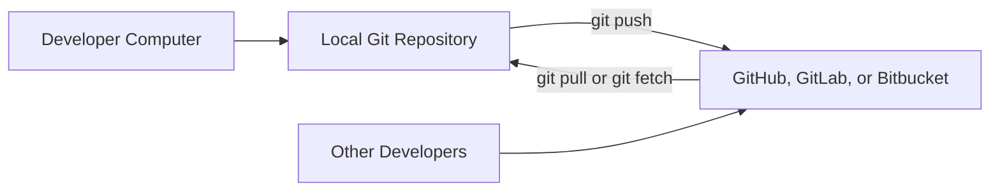
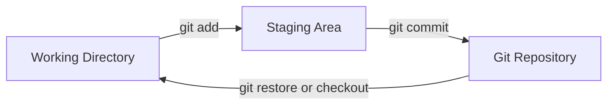
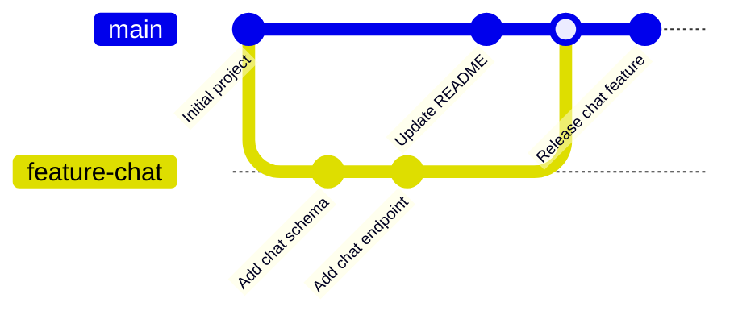
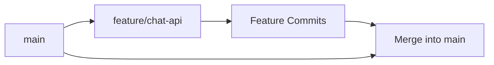
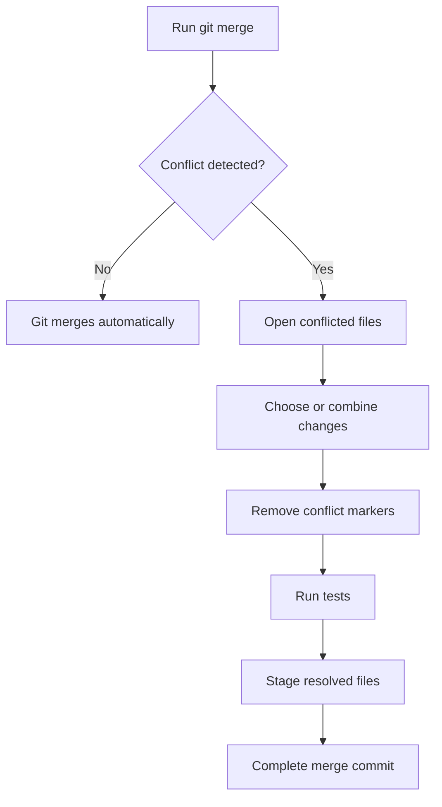
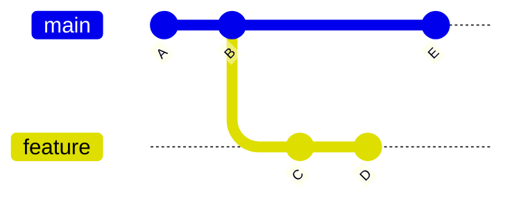

# 005 — Git

**Course:** 01 — Foundations and LLM Basics
**Module:** Module 01 — Prerequisites
**Content Group:** Required Foundations
**Roadmap Source:** Prerequisites / Required Foundations
**Lesson Type:** Prerequisite
**Order in Module:** 005
**Suggested Duration:** 18 minutes

---

## 1. Overview

**Git** is a distributed version-control system used to track changes in source code and collaborate safely with other developers.

For an AI Engineer, Git is essential because an AI application usually contains more than prompts or notebooks. A production project may include:

* Backend APIs.
* Frontend interfaces.
* Prompt templates.
* RAG pipelines.
* Agent tools.
* Model configuration.
* Evaluation scripts.
* Database migrations.
* Docker files.
* Deployment workflows.
* Tests and documentation.

Git helps you understand:

* What changed.
* Who changed it.
* Why it changed.
* Which version is running.
* How to recover from a mistake.
* How to review code before deployment.

A Git repository becomes the historical record of an AI system.

---

## 2. Learning Objectives

After completing this lesson, you should be able to:

* Explain Git in your own words.
* Distinguish Git from GitHub, GitLab, and Bitbucket.
* Create and initialize a Git repository.
* Understand the working directory, staging area, and commit history.
* Create clear and meaningful commits.
* Work with branches.
* Merge changes safely.
* Resolve a simple merge conflict.
* Use remote repositories.
* Create a pull request workflow.
* Ignore secrets, generated files, and large model artifacts.
* Recover from common Git mistakes.
* Apply Git to a small AI application.

---

## 3. Git, GitHub, GitLab, and Bitbucket

Git is the version-control system that runs locally on your computer.

GitHub, GitLab, and Bitbucket are platforms that host Git repositories and provide collaboration features.

| Tool      | Main Purpose                                             |
| --------- | -------------------------------------------------------- |
| Git       | Tracks file history locally                              |
| GitHub    | Hosts Git repositories and collaboration workflows       |
| GitLab    | Hosts repositories and includes CI/CD features           |
| Bitbucket | Hosts repositories and integrates with development tools |

You can use Git without GitHub.

You cannot use GitHub repositories effectively without understanding Git.



---

## 4. Why Git Matters for AI Engineering

AI applications change frequently.

You may modify:

* Prompt instructions.
* Model names.
* Temperature values.
* Retrieval parameters.
* Chunk sizes.
* Embedding models.
* Agent tool definitions.
* Safety rules.
* Output schemas.
* Evaluation datasets.
* API contracts.

A small configuration change can significantly affect system behavior.

Git allows you to compare versions and answer questions such as:

```text
Which prompt version produced this output?

When was the embedding model changed?

Why did retrieval quality become worse?

Which commit introduced the API become worse?

Which commit introduced the API error?

What code is currently deployed?

Can we restore the previous working version?
```

### AI Development Workflow


---

## 5. Core Git Concepts

### 5.1 Repository

A repository is a project directory tracked by Git.

It contains:

* Project files.
* Commit history.
* Branch information.
* Git configuration.
* References to remote repositories.

The hidden `.git` directory stores Git metadata.

---

### 5.2 Working Directory

The working directory contains the files you are currently editing.

Example:

```text
ai-assistant/
├── app.py
├── prompts/
│   └── system_prompt.txt
├── tests/
│   └── test_chat.py
└── README.md
```

When you edit `app.py`, the change exists in the working directory.

---

### 5.3 Staging Area

The staging area contains changes selected for the next commit.

You add files to the staging area with:

```bash
git add app.py
```

Or add all current changes:

```bash
git add .
```

The staging area allows you to choose exactly what belongs in a commit.

---

### 5.4 Commit

A commit is a saved snapshot of selected changes.

```bash
git commit -m "Add chat request validation"
```

Each commit contains:

* A unique identifier.
* Author information.
* Date and time.
* Commit message.
* Reference to the previous commit.
* Snapshot of the tracked changes.

---

## 6. The Three Main Git States



Typical workflow:

```bash
# Edit files
git status

# Select changes
git add app.py

# Save the selected changes
git commit -m "Add chat API endpoint"
```

---

## 7. Installing and Configuring Git

Check whether Git is installed:

```bash
git --version
```

Configure your name:

```bash
git config --global user.name "Your Name"
```

Configure your email:

```bash
git config --global user.email "you@example.com"
```

Review the configuration:

```bash
git config --global --list
```

Set the default branch name:

```bash
git config --global init.defaultBranch main
```

---

## 8. Creating a Repository

Create a new directory:

```bash
mkdir ai-assistant
cd ai-assistant
```

Initialize Git:

```bash
git init
```

Check the repository status:

```bash
git status
```

Create the first files:

```bash
touch README.md
touch app.py
```

Stage them:

```bash
git add README.md app.py
```

Create the first commit:

```bash
git commit -m "Initialize AI assistant project"
```

---

## 9. Understanding `git status`

`git status` shows the current state of the repository.

```bash
git status
```

It can show:

* Untracked files.
* Modified files.
* Staged files.
* Current branch.
* Whether the branch is ahead or behind the remote.
* Whether a merge conflict exists.

Use `git status` frequently.

A strong habit is:

```text
Edit → git status → git diff → git add → git commit
```

---

## 10. Inspecting Changes

View unstaged changes:

```bash
git diff
```

View staged changes:

```bash
git diff --staged
```

View changes in one file:

```bash
git diff app.py
```

View commit history:

```bash
git log
```

Compact history:

```bash
git log --oneline
```

History with branch visualization:

```bash
git log --oneline --graph --decorate --all
```

Example:

```text
* a51c820 Add RAG endpoint
* 8c14c91 Add document loader
* 3d821fa Initialize FastAPI project
```

---

## 11. Writing Good Commits

A good commit should represent one logical change.

Good examples:

```text
Add validation for empty chat messages

Fix timeout handling in model client

Update retrieval chunk size configuration

Add unit tests for document upload

Document local Docker setup
```

Poor examples:

```text
update

fix stuff

changes

final

working now
```

### Recommended Commit Structure

```text
<action> <specific change>
```

Examples:

```text
Add PostgreSQL message repository

Fix incorrect language cache key

Refactor prompt loading into locale service

Remove hardcoded API credentials

Add regression test for empty retrieval results
```

---

## 12. Atomic Commits

An atomic commit contains one focused change.

Poor commit:

```text
Add login, change model, update UI, fix tests, rewrite README
```

Better sequence:

```text
Add user authentication endpoint

Update chat UI for authenticated users

Change default model configuration

Fix chat endpoint unit tests

Update authentication documentation
```

Atomic commits make it easier to:

* Review code.
* Revert changes.
* Find bugs.
* Understand history.
* Cherry-pick specific fixes.

---

## 13. Branches

A branch is an independent line of development.

The default branch is commonly named `main` or `develop`.

Create a new branch:

```bash
git branch feature/chat-api
```

Switch to it:

```bash
git switch feature/chat-api
```

Create and switch in one command:

```bash
git switch -c feature/chat-api
```

Older syntax:

```bash
git checkout -b feature/chat-api
```

### Branch Workflow



Branches allow you to work on a feature without immediately changing the stable branch.

---

## 14. Recommended Branch Names

Use names that explain the purpose of the branch.

```text
feature/chat-history
feature/rag-pipeline
feature/model-streaming
fix/model-timeout
fix/language-cache-key
refactor/prompt-loader
test/retrieval-evaluation
docs/api-setup
```

A common format is:

```text
<type>/<short-description>
```

Common branch types:

| Type        | Purpose                   |
| ----------- | ------------------------- |
| `feature/`  | New functionality         |
| `fix/`      | Bug fix                   |
| `refactor/` | Internal code improvement |
| `test/`     | Test-related changes      |
| `docs/`     | Documentation changes     |
| `chore/`    | Maintenance tasks         |

---

## 15. Merging Branches

Suppose you completed work on:

```text
feature/chat-api
```

Switch to the target branch:

```bash
git switch main
```

Merge the feature branch:

```bash
git merge feature/chat-api
```

Delete the branch after a successful merge:

```bash
git branch -d feature/chat-api
```

### Merge Flow



---

## 16. Merge Conflicts

A merge conflict occurs when Git cannot automatically combine changes.

Example:

The `main` branch contains:

```python
MODEL_NAME = "fast-model"
```

The feature branch contains:

```python
MODEL_NAME = "accurate-model"
```

Git may produce:

```text
<<<<<<< HEAD
MODEL_NAME = "fast-model"
=======
MODEL_NAME = "accurate-model"
>>>>>>> feature/model-update
```

You must choose the correct final version:

```python
MODEL_NAME = "accurate-model"
```

Then stage the resolved file:

```bash
git add config.py
```

Complete the merge:

```bash
git commit
```

### Conflict Resolution Process



Never resolve a conflict by blindly selecting one side without understanding both changes.

---

## 17. Remote Repositories

A remote repository is a hosted copy of the project.

Add a remote:

```bash
git remote add origin <repository-url>
```

List remotes:

```bash
git remote -v
```

Push the current branch:

```bash
git push -u origin main
```

Push a feature branch:

```bash
git push -u origin feature/chat-api
```

Download remote information:

```bash
git fetch origin
```

Download and integrate remote changes:

```bash
git pull
```

---

## 18. `git fetch` vs `git pull`

### `git fetch`

Downloads remote information without changing your current branch.

```bash
git fetch origin
```

This is safer when you want to inspect changes first.

### `git pull`

Downloads and integrates remote changes into the current branch.

```bash
git pull origin main
```

Conceptually:

```text
git pull = git fetch + git merge
```

A careful workflow is:

```bash
git fetch origin
git log --oneline HEAD..origin/main
git diff HEAD..origin/main
git merge origin/main
```

---

## 19. Cloning an Existing Repository

Clone a repository:

```bash
git clone <repository-url>
```

Enter the project directory:

```bash
cd project-name
```

Inspect branches:

```bash
git branch --all
```

Install dependencies and follow the project's README.

For a Python project:

```bash
python -m venv .venv
source .venv/bin/activate
pip install -r requirements.txt
```

For a Node.js project:

```bash
npm install
```

---

## 20. Pull Request Workflow

A pull request, also called a merge request on some platforms, proposes changes for review.

Typical workflow:

```text
1. Update the target branch.
2. Create a feature branch.
3. Implement the change.
4. Add or update tests.
5. Review the diff locally.
6. Commit the changes.
7. Push the feature branch.
8. Open a pull request.
9. Address review comments.
10. Merge after approval.
```

### Example

```bash
git switch develop
git pull origin develop

git switch -c feature/rag-citations

# Implement the feature

git status
git diff

git add .
git commit -m "Add citations to RAG responses"

git push -u origin feature/rag-citations
```

---

## 21. What to Check Before Opening a Pull Request

Review the branch difference:

```bash
git diff develop...feature/rag-citations
```

Review commits:

```bash
git log --oneline develop..feature/rag-citations
```

Run tests:

```bash
pytest
```

Or:

```bash
npm test
```

Check formatting and linting:

```bash
ruff check .
ruff format --check .
```

Or:

```bash
npm run lint
npm run format:check
```

### Pull Request Checklist

* [ ] The feature works locally.
* [ ] Tests pass.
* [ ] New logic has tests.
* [ ] No secret keys are included.
* [ ] No debugging code remains.
* [ ] No unrelated files changed.
* [ ] Database migrations are included if required.
* [ ] API changes are documented.
* [ ] Error cases are handled.
* [ ] The branch is updated with the target branch.

---

## 22. Reviewing a Diff

Before committing, inspect changes:

```bash
git diff
```

Before pushing, inspect the latest commit:

```bash
git show
```

Compare two branches:

```bash
git diff develop...feature/chat-api
```

List changed files only:

```bash
git diff --name-only develop...feature/chat-api
```

Show change statistics:

```bash
git diff --stat develop...feature/chat-api
```

This is especially useful for large AI projects where generated files, datasets, or locale files may change unexpectedly.

---

## 23. `.gitignore`

A `.gitignore` file tells Git which files should not be tracked.

Example for an AI project:

```gitignore
# Environment variables and secrets
.env
.env.*
!.env.example

# Python
__pycache__/
*.py[cod]
.venv/
venv/
.pytest_cache/
.mypy_cache/
.ruff_cache/

# Node.js
node_modules/
dist/
build/
.next/

# IDE
.vscode/
.idea/

# Operating system
.DS_Store
Thumbs.db

# Logs
*.log
logs/

# Local databases
*.db
*.sqlite
*.sqlite3

# Model and data artifacts
models/
checkpoints/
embeddings/
vector_store/
data/raw/
data/processed/

# Generated outputs
output/
outputs/
reports/generated/
```

Before adding a file, check whether Git ignores it:

```bash
git check-ignore -v path/to/file
```

---

## 24. Files That Should Usually Not Be Committed

Avoid committing:

* API keys.
* Passwords.
* Private certificates.
* `.env` files.
* Personal user data.
* Local database files.
* Temporary logs.
* Virtual environments.
* Dependency directories.
* Generated model checkpoints.
* Large datasets.
* Cached embeddings.
* Build outputs.

Instead, commit:

* `.env.example`.
* Database migration files.
* Dataset download instructions.
* Model download scripts.
* Configuration templates.
* Reproducible setup commands.

---

## 25. Large Files, Models, and Datasets

Git is optimized for source code, not large binary files.

Avoid placing large files directly in normal Git history:

```text
model.pt
weights.bin
dataset.zip
vectors.index
large-video.mp4
```

Possible alternatives include:

* Git Large File Storage.
* Object storage.
* Dataset registries.
* Model registries.
* DVC.
* Hugging Face Hub.
* Cloud storage.
* Artifact storage in CI/CD.

### Recommended Repository Pattern

```text
ai-project/
├── src/
├── tests/
├── configs/
├── scripts/
│   ├── download_model.py
│   └── prepare_data.py
├── data/
│   └── README.md
├── models/
│   └── README.md
└── README.md
```

The repository should explain how to obtain large artifacts rather than storing all of them directly.

---

## 26. Versioning Prompts

Prompts are part of application logic and should be tracked in Git.

Example structure:

```text
prompts/
├── chat/
│   ├── system_v1.txt
│   └── evaluation_cases.json
├── rag/
│   ├── answer_prompt.txt
│   └── citation_prompt.txt
└── agents/
    └── tool_selection_prompt.txt
```

A prompt change should use a meaningful commit:

```text
Improve citation requirements in RAG answer prompt
```

Avoid:

```text
Update prompt
```

Record significant prompt changes with:

* Reason for the change.
* Expected behavior.
* Evaluation results.
* Known limitations.
* Model version used during testing.

---

## 27. Versioning AI Configuration

Configuration changes can strongly affect output.

Example:

```yaml
model:
  name: example-model
  temperature: 0.2
  max_tokens: 1000

retrieval:
  chunk_size: 800
  chunk_overlap: 120
  top_k: 5
```

Commit configuration changes separately when possible:

```text
Increase retrieval top_k from 3 to 5

Reduce generation temperature for structured output

Change embedding model for multilingual retrieval
```

This helps connect model behavior with exact code versions.

---

## 28. Git Tags and Releases

A tag marks an important version.

Create a tag:

```bash
git tag v1.0.0
```

Push it:

```bash
git push origin v1.0.0
```

Annotated tag:

```bash
git tag -a v1.0.0 -m "First production release"
```

Push all tags:

```bash
git push origin --tags
```

Example release history:

```text
v0.1.0 — Initial chat API
v0.2.0 — Add conversation storage
v0.3.0 — Add RAG document search
v1.0.0 — First production release
```

---

## 29. Common Recovery Commands

### Unstage a File

```bash
git restore --staged app.py
```

The file remains modified in the working directory.

---

### Discard Local Changes in One File

```bash
git restore app.py
```

This permanently removes uncommitted changes from that file.

Use it carefully.

---

### Amend the Latest Commit

Change the latest commit message:

```bash
git commit --amend -m "Add chat endpoint validation"
```

Add a forgotten file:

```bash
git add tests/test_chat.py
git commit --amend --no-edit
```

Avoid amending commits that other developers already use unless the team agrees.

---

### Revert a Commit

Create a new commit that reverses an earlier commit:

```bash
git revert <commit-id>
```

This is usually safer for shared branches.

---

### Reset Local History

```bash
git reset --soft HEAD~1
```

Removes the latest commit but keeps changes staged.

```bash
git reset --mixed HEAD~1
```

Removes the latest commit and keeps changes unstaged.

```bash
git reset --hard HEAD~1
```

Removes the latest commit and discards changes.

`--hard` can permanently delete work. Use it carefully.

---

### Recover a Lost Commit

Git often keeps references to recent actions:

```bash
git reflog
```

Example:

```text
a91d212 HEAD@{0}: reset: moving to HEAD~1
ce25b31 HEAD@{1}: commit: Add retrieval service
```

Recover the commit:

```bash
git switch -c recovery/retrieval ce25b31
```

---

## 30. `merge` vs `rebase`

Both operations integrate changes.

### Merge

```bash
git merge main
```

Advantages:

* Preserves branch history.
* Easy to understand.
* Safe for shared branches.

### Rebase

```bash
git rebase main
```

Advantages:

* Produces a linear history.
* Moves feature commits on top of the target branch.



After rebase, the feature commits are recreated after `E`.

Do not rebase public commits that other developers already depend on unless your team explicitly follows that workflow.

---

## 31. Merge Commit, Squash Merge, and Rebase Merge

### Merge Commit

Preserves every branch commit and creates a merge commit.

Useful when the branch history is meaningful.

### Squash Merge

Combines all feature commits into one commit.

Useful when the branch contains temporary commits such as:

```text
fix test

try again

remove debug log

address review
```

The final merged commit may become:

```text
Add document upload and indexing pipeline
```

### Rebase Merge

Places each feature commit directly on the target branch without a merge commit.

Useful for teams that prefer linear history.

The correct choice depends on team conventions.

---

## 32. Common Git Mistakes

### 32.1 Committing Secrets

Problem:

```text
AI_API_KEY=real-secret-key
```

Fix:

1. Remove the secret from the project.
2. Rotate the exposed credential.
3. Add the file to `.gitignore`.
4. Remove the secret from Git history if necessary.

Deleting the file in a later commit does not remove it from previous commits.

---

### 32.2 Committing Generated Files

Examples:

* `node_modules`.
* Python virtual environments.
* Model checkpoints.
* Embedding indexes.
* Build directories.

These make repositories large and difficult to review.

---

### 32.3 Using One Branch for Every Task

Mixing unrelated work creates a confusing pull request.

Create separate branches for separate features.

---

### 32.4 Creating Huge Commits

A commit with hundreds of unrelated files is difficult to review and revert.

Break work into logical commits.

---

### 32.5 Pulling Without Checking Local Changes

Before pulling:

```bash
git status
```

Commit or temporarily store local work first.

---

### 32.6 Resolving Conflicts Without Testing

A syntactically correct conflict resolution may still contain incorrect business logic.

Always run tests after resolving conflicts.

---

### 32.7 Force-Pushing Shared Branches

This can overwrite other developers' work.

Avoid:

```bash
git push --force
```

When rewriting your own branch is necessary, prefer:

```bash
git push --force-with-lease
```

`--force-with-lease` checks whether the remote branch changed unexpectedly.

---

## 33. Debugging with Git

Git can help identify when a bug appeared.

### Inspect File History

```bash
git log -- app.py
```

### Show Changes to a File

```bash
git log -p -- app.py
```

### Inspect Who Changed Each Line

```bash
git blame app.py
```

`git blame` should be used to understand history, not to assign personal blame.

### Find the Commit That Introduced a Bug

```bash
git bisect start
git bisect bad
git bisect good <known-good-commit>
```

Git selects a middle commit for testing.

Mark each result:

```bash
git bisect good
```

or:

```bash
git bisect bad
```

When complete:

```bash
git bisect reset
```

---

## 34. Example AI Project Workflow

Suppose you need to add streaming responses to an AI chatbot.

### Step 1 — Update the Base Branch

```bash
git switch develop
git pull origin develop
```

### Step 2 — Create a Branch

```bash
git switch -c feature/chat-streaming
```

### Step 3 — Implement the Feature

Files changed:

```text
backend/api/chat.py
backend/services/model_client.py
frontend/chat.js
tests/test_chat_streaming.py
```

### Step 4 — Review Changes

```bash
git status
git diff
```

### Step 5 — Run Tests

```bash
pytest tests/test_chat_streaming.py
```

### Step 6 — Create Focused Commits

```bash
git add backend/services/model_client.py
git commit -m "Add streaming support to model client"

git add backend/api/chat.py tests/test_chat_streaming.py
git commit -m "Expose streaming chat API endpoint"

git add frontend/chat.js
git commit -m "Render streamed chat response in frontend"
```

### Step 7 — Push the Branch

```bash
git push -u origin feature/chat-streaming
```

### Step 8 — Open a Pull Request

Describe:

* What changed.
* Why it changed.
* How it was tested.
* Known limitations.
* Screenshots or logs when relevant.

---

## 35. Production Failure Example

### Scenario

A new commit changes the prompt-loading path. Vietnamese prompts work, but English prompts return empty content.

### Investigation

Check recent commits:

```bash
git log --oneline -- prompts/ backend/
```

Compare the current version with the previous release:

```bash
git diff v1.2.0..HEAD -- prompts/ backend/
```

Inspect the suspected commit:

```bash
git show <commit-id>
```

Run the failing test:

```bash
pytest tests/test_prompt_loader.py
```

### Possible Fix

* Correct the locale path.
* Add a missing English prompt file.
* Add a regression test.
* Commit the fix separately.

```bash
git add prompts/ backend/ tests/
git commit -m "Fix English prompt loading after locale refactor"
```

---

## 36. Practical Mini Project

Create a minimal AI API repository.

### Required Files

```text
git-ai-demo/
├── app/
│   ├── main.py
│   └── ai_service.py
├── tests/
│   └── test_health.py
├── prompts/
│   └── system_prompt.txt
├── .env.example
├── .gitignore
├── Dockerfile
├── requirements.txt
└── README.md
```

### Required Git Workflow

1. Initialize the repository.
2. Create the first commit.
3. Create a feature branch.
4. Add a health-check endpoint.
5. Add one AI endpoint.
6. Add tests.
7. Create at least three focused commits.
8. Merge the feature branch.
9. Add a `v0.1.0` tag.
10. Push the repository to a remote host.

### Suggested Commit History

```text
Initialize FastAPI project

Add health-check endpoint

Add AI chat service

Add chat endpoint tests

Document local development setup
```

---

## 37. Practice Exercises

### Exercise 1 — Explain Git

Without reading the lesson, explain Git in five sentences.

Include:

* Repository.
* Working directory.
* Staging area.
* Commit.
* Branch.

---

### Exercise 2 — Basic Repository

Run:

```bash
mkdir git-practice
cd git-practice
git init
```

Create:

```text
README.md
app.py
```

Create two separate commits:

```text
Initialize project documentation

Add application entry point
```

---

### Exercise 3 — Feature Branch

Create:

```text
feature/health-endpoint
```

Add a health endpoint, commit it, and merge it into `main`.

---

### Exercise 4 — Merge Conflict

Create two branches that modify the same configuration line.

Attempt to merge them and resolve the conflict manually.

After resolving it:

* Run the application.
* Run tests.
* Review the final diff.
* Complete the merge commit.

---

### Exercise 5 — AI Configuration History

Create a configuration file:

```yaml
model:
  name: demo-model
  temperature: 0.7
```

Commit it.

Then change the temperature to `0.2` and commit again.

Use Git to answer:

* Which commit changed the temperature?
* What was the previous value?
* Why was it changed?

---

### Exercise 6 — Recover a Mistake

Create a commit, reset it, and recover it with:

```bash
git reflog
```

Document each command and explain what happened.

---

## 38. Completion Checklist

### Core Knowledge

* [ ] I can explain what Git does.
* [ ] I understand the difference between Git and GitHub.
* [ ] I understand the working directory, staging area, and repository.
* [ ] I understand commits and branches.
* [ ] I understand local and remote repositories.

### Practical Skills

* [ ] I can initialize a repository.
* [ ] I can inspect changes with `git status` and `git diff`.
* [ ] I can stage and commit changes.
* [ ] I can create and switch branches.
* [ ] I can merge a feature branch.
* [ ] I can resolve a simple conflict.
* [ ] I can clone, fetch, pull, and push.
* [ ] I can review branch differences before a pull request.

### AI Engineering Practices

* [ ] I do not commit API keys.
* [ ] I ignore local environments and generated artifacts.
* [ ] I track prompt and configuration changes.
* [ ] I use meaningful commit messages.
* [ ] I add tests for AI behavior changes.
* [ ] I know how to connect a production failure to a commit.
* [ ] I know how to revert a broken change.

---

## 39. Related Outcome

This lesson prepares the version-control and collaboration foundation required before building production AI applications.

Git supports later topics such as:

* Prompt engineering.
* RAG development.
* Agent tools.
* Multimodal applications.
* Model evaluation.
* Database migrations.
* Docker deployment.
* CI/CD.
* Code review.
* Production incident investigation.

---

## 40. Related Project

Set up a minimal FastAPI or Node.js API containing:

* Git version control.
* A structured branch workflow.
* A REST endpoint.
* A database connection.
* Environment configuration.
* One AI-related feature.
* Automated tests.
* Docker support.
* A complete README.
* A tagged initial release.

### Suggested Portfolio Description

> Built and versioned a production-oriented AI API using Git, feature branches, focused commits, pull-request review, automated tests, secure environment configuration, Docker packaging, and tagged releases.

---

## 41. Summary

Git is more than a tool for saving code.

It provides a structured history of how an AI application evolves.

A reliable development workflow looks like this:


The essential cycle is:

```text
Edit
  ↓
Inspect
  ↓
Stage
  ↓
Commit
  ↓
Review
  ↓
Push
  ↓
Merge
  ↓
Deploy
```

For AI Engineers, Git should track not only application code but also prompts, schemas, evaluation scripts, retrieval configuration, tool definitions, and deployment files.

Start with a small repository, create focused commits, use feature branches, review every diff, protect secrets, and learn how to recover from mistakes. These habits will make later AI projects safer, easier to debug, and easier to maintain.

---

# Bài luyện tập

## Mục tiêu


## Đề bài


## Yêu cầu hoàn thành

- [ ] 
- [ ] 
- [ ] 

## Kết quả / lời giải


## Ghi chú
