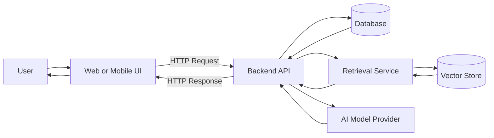
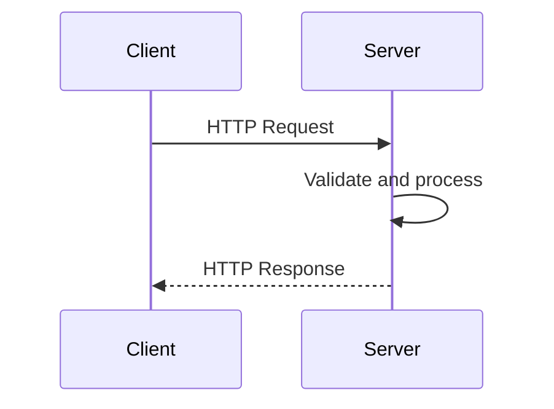
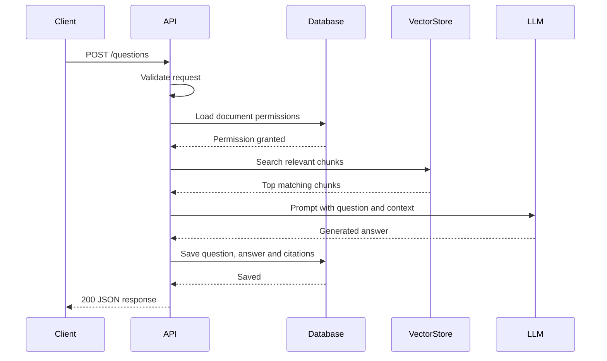
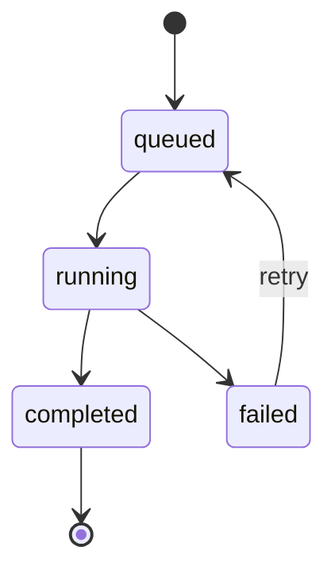
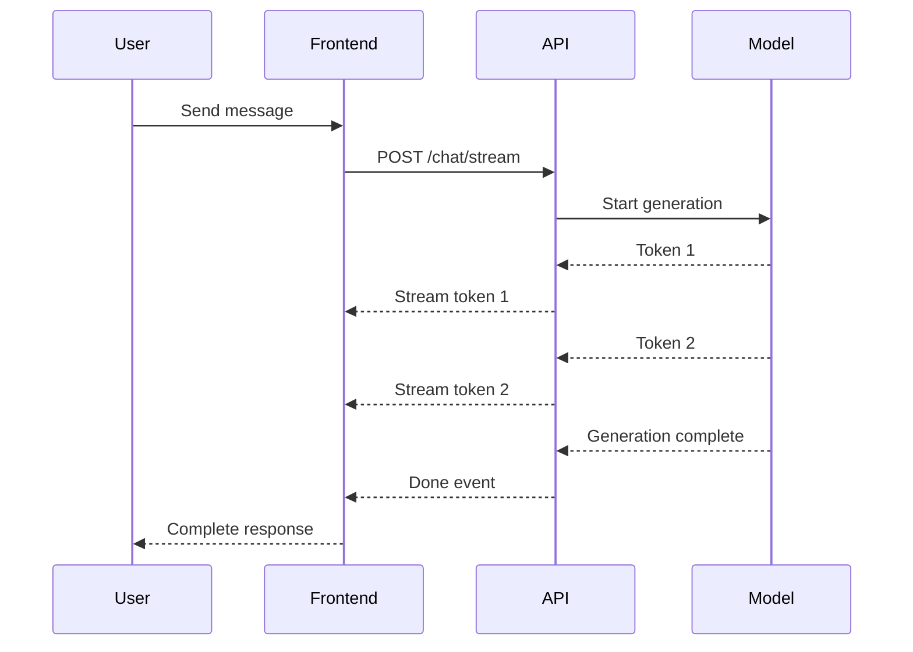
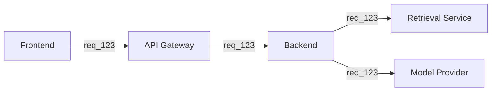
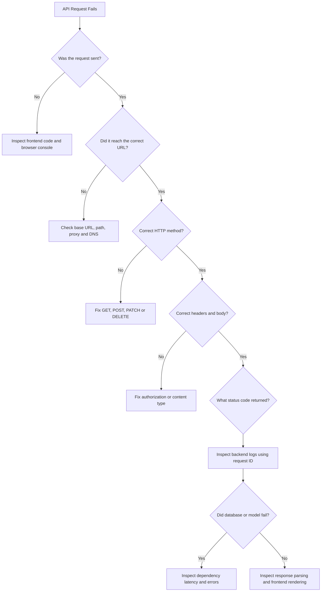
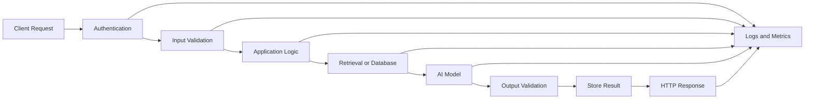

# 006 — HTTP / REST API

**Course:** 01 — Foundations and LLM Basics
**Module:** Module 01 — Prerequisites
**Content Group:** Required Foundations
**Roadmap Source:** Prerequisites / Required Foundations
**Lesson Type:** Prerequisite
**Order in Module:** 006
**Suggested Duration:** 18 minutes

---

## 1. Overview

**HTTP** is the communication protocol used by web browsers, mobile applications, backend services, databases, and AI providers to exchange information over a network.

A **REST API** is a common way to design HTTP endpoints around resources such as:

* Users.
* Conversations.
* Messages.
* Documents.
* Predictions.
* Model jobs.
* Agent executions.
* Evaluation results.

For an AI Engineer, HTTP and REST are essential because most AI applications connect several independent systems:

```text
Frontend → Backend → Database → Retrieval Service → AI Model
```

Even when an AI model runs locally, an API is often required so that web, mobile, or external systems can use it.

A production AI feature is therefore not only a prompt. It is usually a complete request-and-response workflow with validation, authentication, model execution, error handling, logging, and monitoring.

---

## 2. Learning Objectives

After completing this lesson, you should be able to:

* Explain HTTP and REST in your own words.
* Describe how clients and servers communicate.
* Identify the major parts of an HTTP request and response.
* Use common HTTP methods correctly.
* Understand common HTTP status codes.
* Design resource-oriented REST endpoints.
* Send and receive JSON data.
* Build a minimal API with FastAPI or Node.js.
* Call an API from a frontend or command line.
* Handle validation errors, timeouts, and rate limits.
* Understand authentication, CORS, and HTTPS.
* Design API endpoints for chat, RAG, agents, and multimodal AI.
* Debug a failed API request systematically.

---

## 3. Where HTTP Fits in an AI Application

HTTP connects the different layers of an AI product.



A user may only see a text box and a generated answer, but several HTTP requests may occur behind the interface.

For example:

```text
1. Upload a document.
2. Check the indexing status.
3. Ask a question.
4. Retrieve matching document chunks.
5. Call an AI model.
6. Save the conversation.
7. Stream the response to the interface.
```

---

## 4. What Is HTTP?

HTTP stands for **Hypertext Transfer Protocol**.

It defines how a client sends a request and how a server returns a response.

The client may be:

* A browser.
* A mobile application.
* A command-line tool.
* Another backend service.
* An AI agent.
* A scheduled worker.

The server may be:

* A FastAPI application.
* A Node.js server.
* A model provider.
* A document-processing service.
* A vector database gateway.
* A cloud function.

### Basic Communication Model



HTTP normally follows a request-and-response pattern:

```text
Client sends one request.
Server processes the request.
Server returns one response.
```

---

## 5. HTTP and HTTPS

HTTP sends information between systems.

HTTPS is HTTP protected with encryption through TLS.

```text
HTTP  = Communication without transport encryption
HTTPS = Encrypted HTTP communication
```

Production applications should use HTTPS because requests may contain:

* Authentication tokens.
* User messages.
* Uploaded files.
* Personal information.
* Payment details.
* Internal model outputs.
* API credentials.

HTTPS protects data while it travels between the client and server.

It does not automatically protect:

* Data stored incorrectly in a database.
* Secrets written to logs.
* Insecure backend logic.
* Weak authentication.
* Unsafe model output.
* Incorrect authorization rules.

---

## 6. Anatomy of an HTTP Request

An HTTP request normally contains:

* A method.
* A URL.
* Headers.
* Query parameters.
* An optional body.

### Example Request

```http
POST /api/v1/chat HTTP/1.1
Host: api.example.com
Authorization: Bearer example-token
Content-Type: application/json
Accept: application/json

{
  "message": "Explain retrieval-augmented generation.",
  "language": "en"
}
```

### Request Components

| Component     | Example                          | Purpose                           |
| ------------- | -------------------------------- | --------------------------------- |
| Method        | `POST`                           | Describes the requested operation |
| Path          | `/api/v1/chat`                   | Identifies the endpoint           |
| Host          | `api.example.com`                | Identifies the server             |
| Headers       | `Content-Type: application/json` | Provides metadata                 |
| Authorization | `Bearer example-token`           | Identifies the caller             |
| Body          | JSON object                      | Contains request data             |

---

## 7. Anatomy of an HTTP Response

An HTTP response normally contains:

* A status code.
* Headers.
* An optional body.

### Example Response

```http
HTTP/1.1 200 OK
Content-Type: application/json
X-Request-ID: req_abc123

{
  "answer": "Retrieval-augmented generation combines retrieval with language-model generation.",
  "model": "example-model",
  "processing_time_ms": 842
}
```

### Response Components

| Component        | Example        | Purpose                        |
| ---------------- | -------------- | ------------------------------ |
| Status code      | `200`          | Indicates success or failure   |
| Response headers | `Content-Type` | Describes the returned content |
| Request ID       | `req_abc123`   | Helps trace the request        |
| Body             | JSON object    | Contains the result            |

---

## 8. URLs and Endpoints

A URL identifies the location of a resource or operation.

Example:

```text
https://api.example.com/api/v1/conversations/42/messages?limit=20
```

Its parts are:

| Part          | Value                        |
| ------------- | ---------------------------- |
| Protocol      | `https`                      |
| Host          | `api.example.com`            |
| Base path     | `/api/v1`                    |
| Resource path | `/conversations/42/messages` |
| Query string  | `?limit=20`                  |

An **endpoint** is a specific combination of an HTTP method and path.

These are different endpoints:

```text
GET /api/v1/documents
POST /api/v1/documents
GET /api/v1/documents/42
DELETE /api/v1/documents/42
```

---

## 9. Common HTTP Methods

### GET

Retrieves information.

```http
GET /api/v1/conversations/42
```

Typical uses:

* Get a user profile.
* Load chat history.
* Check job status.
* Retrieve document metadata.
* List model configurations.

A `GET` request should not create or modify important server state.

---

### POST

Creates a resource or starts an operation.

```http
POST /api/v1/conversations
```

Typical uses:

* Create a conversation.
* Send a prompt.
* Upload a document.
* Start an evaluation.
* Execute an agent.
* Generate an image.

---

### PUT

Replaces an existing resource.

```http
PUT /api/v1/users/42/preferences
```

A complete replacement may require every field.

---

### PATCH

Updates part of an existing resource.

```http
PATCH /api/v1/conversations/42
```

Request:

```json
{
  "title": "RAG Architecture Questions"
}
```

---

### DELETE

Removes a resource.

```http
DELETE /api/v1/documents/42
```

The server may delete the resource permanently or mark it as deleted.

---

## 10. CRUD and HTTP Methods

CRUD represents four common data operations:

| CRUD Operation | HTTP Method      | Example                     |
| -------------- | ---------------- | --------------------------- |
| Create         | `POST`           | Create a conversation       |
| Read           | `GET`            | Read a conversation         |
| Update         | `PUT` or `PATCH` | Update a conversation title |
| Delete         | `DELETE`         | Delete a conversation       |

Example REST interface:

```text
POST   /api/v1/conversations
GET    /api/v1/conversations
GET    /api/v1/conversations/{conversation_id}
PATCH  /api/v1/conversations/{conversation_id}
DELETE /api/v1/conversations/{conversation_id}
```

---

## 11. HTTP Status Codes

Status codes tell the client what happened.

### Success Codes

|             Code | Meaning                           | Example                 |
| ---------------: | --------------------------------- | ----------------------- |
|         `200 OK` | Request succeeded                 | Get a conversation      |
|    `201 Created` | Resource created                  | Create a document       |
|   `202 Accepted` | Processing started asynchronously | Start document indexing |
| `204 No Content` | Success with no response body     | Delete a resource       |

### Client Error Codes

|                         Code | Meaning                              | Example                        |
| ---------------------------: | ------------------------------------ | ------------------------------ |
|            `400 Bad Request` | Invalid request                      | Malformed JSON                 |
|           `401 Unauthorized` | Authentication missing or invalid    | Expired access token           |
|              `403 Forbidden` | Authenticated but not allowed        | Access another user's document |
|              `404 Not Found` | Resource does not exist              | Unknown conversation ID        |
|               `409 Conflict` | Request conflicts with current state | Duplicate resource             |
|      `413 Payload Too Large` | Uploaded content is too large        | Oversized PDF                  |
| `415 Unsupported Media Type` | Unsupported body format              | Incorrect file type            |
|   `422 Unprocessable Entity` | Validation failed                    | Missing required field         |
|      `429 Too Many Requests` | Rate limit exceeded                  | Too many model calls           |

### Server Error Codes

|                        Code | Meaning                         | Example                                     |
| --------------------------: | ------------------------------- | ------------------------------------------- |
| `500 Internal Server Error` | Unexpected backend error        | Unhandled exception                         |
|           `502 Bad Gateway` | Upstream service failed         | Model provider returned an invalid response |
|   `503 Service Unavailable` | Service temporarily unavailable | Model provider outage                       |
|       `504 Gateway Timeout` | Upstream request timed out      | Slow model request                          |

---

## 12. Choosing the Correct Status Code

Incorrect:

```http
HTTP/1.1 200 OK

{
  "success": false,
  "error": "Document not found"
}
```

Better:

```http
HTTP/1.1 404 Not Found

{
  "error": {
    "code": "document_not_found",
    "message": "The requested document does not exist."
  }
}
```

Clients should not need to inspect every response body to determine whether a request succeeded.

---

## 13. Headers

HTTP headers carry metadata about the request or response.

Common headers include:

| Header           | Purpose                               |
| ---------------- | ------------------------------------- |
| `Content-Type`   | Describes the body format             |
| `Accept`         | Describes the desired response format |
| `Authorization`  | Contains authentication information   |
| `User-Agent`     | Identifies the client                 |
| `Cache-Control`  | Controls caching                      |
| `Content-Length` | Describes body size                   |
| `X-Request-ID`   | Identifies the request for debugging  |
| `Retry-After`    | Indicates when a client may retry     |

### Example

```http
Authorization: Bearer eyJhbGciOi...
Content-Type: application/json
Accept: application/json
X-Request-ID: req_987
```

---

## 14. Request Bodies and JSON

Most modern REST APIs use JSON.

### Request

```json
{
  "message": "Summarize this document.",
  "document_id": "doc_42",
  "options": {
    "max_sentences": 5,
    "language": "en"
  }
}
```

### Response

```json
{
  "summary": "The document explains the fundamentals of HTTP and REST APIs.",
  "document_id": "doc_42",
  "model": "example-model"
}
```

JSON supports:

* Strings.
* Numbers.
* Booleans.
* Arrays.
* Objects.
* `null`.

JSON does not support comments.

---

## 15. Path Parameters

Path parameters identify a specific resource.

```text
GET /api/v1/documents/{document_id}
```

Example:

```http
GET /api/v1/documents/doc_42
```

FastAPI example:

```python
from fastapi import FastAPI

app = FastAPI()


@app.get("/api/v1/documents/{document_id}")
async def get_document(document_id: str) -> dict[str, str]:
    return {
        "document_id": document_id,
        "status": "ready",
    }
```

Use path parameters when the value is part of the resource identity.

---

## 16. Query Parameters

Query parameters modify how a resource is retrieved.

```http
GET /api/v1/documents?status=ready&limit=20&offset=0
```

Typical uses include:

* Filtering.
* Sorting.
* Pagination.
* Searching.
* Selecting language.
* Selecting response detail.

FastAPI example:

```python
from fastapi import FastAPI, Query

app = FastAPI()


@app.get("/api/v1/documents")
async def list_documents(
    status: str | None = None,
    limit: int = Query(default=20, ge=1, le=100),
    offset: int = Query(default=0, ge=0),
) -> dict:
    return {
        "status_filter": status,
        "limit": limit,
        "offset": offset,
        "items": [],
    }
```

---

## 17. Path Parameters vs Query Parameters

Use a path parameter to identify a resource:

```text
GET /documents/42
```

Use query parameters to filter or modify the result:

```text
GET /documents?status=ready&limit=20
```

Poor design:

```text
GET /getDocument?id=42
```

Better REST design:

```text
GET /documents/42
```

---

## 18. What Is REST?

REST stands for **Representational State Transfer**.

REST is an architectural style for designing network APIs.

Common REST ideas include:

* Resources are represented by URLs.
* Standard HTTP methods describe actions.
* Requests are stateless.
* Responses use standard status codes.
* Resources can have multiple representations.
* Clients and servers are separated.

REST is not a programming language or framework.

FastAPI, Express, Django, and NestJS can all be used to build REST APIs.

---

## 19. Resource-Oriented Design

REST APIs should usually use nouns rather than action-heavy URLs.

Poor:

```text
POST /createConversation
GET  /getConversation
POST /deleteConversation
```

Better:

```text
POST   /conversations
GET    /conversations/{conversation_id}
DELETE /conversations/{conversation_id}
```

For AI operations, action-style subresources may still be appropriate:

```text
POST /documents/{document_id}/index
POST /conversations/{conversation_id}/messages
POST /evaluations/{evaluation_id}/run
POST /agents/{agent_id}/executions
```

The goal is consistency and clarity.

---

## 20. Stateless Requests

A REST request should contain enough information for the server to understand and process it.

For example, authentication information is commonly included in each request:

```http
Authorization: Bearer access-token
```

The server may store data such as conversations or users, but it should not depend on invisible client context that is missing from the request.

Stateless design makes systems easier to:

* Scale.
* Test.
* Cache.
* Distribute.
* Recover.
* Monitor.

---

## 21. Idempotency

An operation is **idempotent** when performing it multiple times produces the same intended final state.

Typically:

| Method   | Usually Idempotent?       |
| -------- | ------------------------- |
| `GET`    | Yes                       |
| `PUT`    | Yes                       |
| `DELETE` | Yes                       |
| `PATCH`  | Depends on implementation |
| `POST`   | Usually no                |

Example problem:

A client sends a payment or expensive model-generation request. The network times out, so the client retries. The server may process the operation twice.

An idempotency key can reduce this risk:

```http
Idempotency-Key: generation-request-123
```

The server stores the result associated with the key and returns the same result for repeated requests.

This is useful for:

* Payments.
* Document uploads.
* Model fine-tuning jobs.
* Expensive report generation.
* Agent executions with side effects.

---

## 22. A Minimal FastAPI REST API

```python
from datetime import UTC, datetime
from uuid import uuid4

from fastapi import FastAPI, HTTPException, status
from pydantic import BaseModel, Field

app = FastAPI(
    title="AI Conversation API",
    version="1.0.0",
)


class ConversationCreate(BaseModel):
    title: str = Field(min_length=1, max_length=120)


class Conversation(BaseModel):
    id: str
    title: str
    created_at: datetime


conversations: dict[str, Conversation] = {}


@app.get("/health")
async def health_check() -> dict[str, str]:
    return {"status": "ok"}


@app.post(
    "/api/v1/conversations",
    response_model=Conversation,
    status_code=status.HTTP_201_CREATED,
)
async def create_conversation(
    request: ConversationCreate,
) -> Conversation:
    conversation = Conversation(
        id=str(uuid4()),
        title=request.title.strip(),
        created_at=datetime.now(UTC),
    )

    conversations[conversation.id] = conversation
    return conversation


@app.get(
    "/api/v1/conversations/{conversation_id}",
    response_model=Conversation,
)
async def get_conversation(
    conversation_id: str,
) -> Conversation:
    conversation = conversations.get(conversation_id)

    if conversation is None:
        raise HTTPException(
            status_code=status.HTTP_404_NOT_FOUND,
            detail="Conversation not found.",
        )

    return conversation


@app.delete(
    "/api/v1/conversations/{conversation_id}",
    status_code=status.HTTP_204_NO_CONTENT,
)
async def delete_conversation(
    conversation_id: str,
) -> None:
    if conversation_id not in conversations:
        raise HTTPException(
            status_code=status.HTTP_404_NOT_FOUND,
            detail="Conversation not found.",
        )

    del conversations[conversation_id]
```

Run the server:

```bash
uvicorn main:app --reload
```

---

## 23. Calling the API with `curl`

### Health Check

```bash
curl http://localhost:8000/health
```

Response:

```json
{
  "status": "ok"
}
```

### Create a Conversation

```bash
curl \
  -X POST \
  http://localhost:8000/api/v1/conversations \
  -H "Content-Type: application/json" \
  -d '{
    "title": "HTTP and REST Questions"
  }'
```

### Get a Conversation

```bash
curl \
  http://localhost:8000/api/v1/conversations/<conversation-id>
```

### Delete a Conversation

```bash
curl \
  -X DELETE \
  http://localhost:8000/api/v1/conversations/<conversation-id>
```

Use verbose mode to inspect headers:

```bash
curl -v http://localhost:8000/health
```

---

## 24. Calling an API with Python

```python
import httpx


async def create_conversation(title: str) -> dict:
    async with httpx.AsyncClient(
        base_url="http://localhost:8000",
        timeout=10.0,
    ) as client:
        response = await client.post(
            "/api/v1/conversations",
            json={"title": title},
        )

        response.raise_for_status()
        return response.json()
```

Important practices:

* Set a timeout.
* Check the status code.
* Handle connection failures.
* Validate the response.
* Avoid logging secrets.

---

## 25. Calling an API with JavaScript

```javascript
async function createConversation(title) {
  const response = await fetch(
    "http://localhost:8000/api/v1/conversations",
    {
      method: "POST",
      headers: {
        "Content-Type": "application/json",
      },
      body: JSON.stringify({ title }),
    },
  );

  if (!response.ok) {
    const errorBody = await response.json().catch(() => null);

    throw new Error(
      errorBody?.detail ||
        `Request failed with status ${response.status}`,
    );
  }

  return response.json();
}
```

Usage:

```javascript
try {
  const conversation = await createConversation(
    "RAG Architecture",
  );

  console.log(conversation);
} catch (error) {
  console.error("Failed to create conversation", error);
}
```

---

## 26. Building an AI Chat Endpoint

### Request Schema

```json
{
  "message": "Explain vector embeddings.",
  "conversation_id": "conv_42"
}
```

### Response Schema

```json
{
  "message_id": "msg_92",
  "answer": "A vector embedding is a numerical representation of data.",
  "model": "example-model",
  "usage": {
    "input_tokens": 18,
    "output_tokens": 72
  }
}
```

### FastAPI Example

```python
from uuid import uuid4

from fastapi import FastAPI, HTTPException
from pydantic import BaseModel, Field

app = FastAPI()


class ChatRequest(BaseModel):
    message: str = Field(min_length=1, max_length=4000)
    conversation_id: str | None = None


class TokenUsage(BaseModel):
    input_tokens: int
    output_tokens: int


class ChatResponse(BaseModel):
    message_id: str
    answer: str
    model: str
    usage: TokenUsage


async def generate_answer(message: str) -> str:
    return f"AI response for: {message}"


@app.post("/api/v1/chat", response_model=ChatResponse)
async def chat(request: ChatRequest) -> ChatResponse:
    message = request.message.strip()

    if not message:
        raise HTTPException(
            status_code=400,
            detail="Message cannot be empty.",
        )

    answer = await generate_answer(message)

    return ChatResponse(
        message_id=str(uuid4()),
        answer=answer,
        model="demo-model",
        usage=TokenUsage(
            input_tokens=len(message.split()),
            output_tokens=len(answer.split()),
        ),
    )
```

---

## 27. A RAG API Workflow

A RAG request may pass through several internal services.



### Suggested RAG Endpoint

```text
POST /api/v1/questions
```

Request:

```json
{
  "document_ids": ["doc_1", "doc_2"],
  "question": "What are the main findings?",
  "top_k": 5
}
```

Response:

```json
{
  "answer": "The documents identify three main findings...",
  "citations": [
    {
      "document_id": "doc_1",
      "chunk_id": "chunk_18",
      "score": 0.91
    }
  ]
}
```

---

## 28. Long-Running AI Tasks

Some AI operations are too slow for one normal HTTP request.

Examples:

* Indexing a large document collection.
* Fine-tuning a model.
* Processing a long video.
* Generating a large report.
* Evaluating thousands of examples.
* Running a complex agent workflow.

A common pattern uses an asynchronous job.

### Start the Job

```http
POST /api/v1/indexing-jobs
```

Response:

```http
HTTP/1.1 202 Accepted
```

```json
{
  "job_id": "job_42",
  "status": "queued"
}
```

### Check Job Status

```http
GET /api/v1/indexing-jobs/job_42
```

Response:

```json
{
  "job_id": "job_42",
  "status": "running",
  "progress": 65
}
```

### Job State Diagram



---

## 29. Streaming AI Responses

AI responses may be generated token by token.

Waiting for the complete response can make the application feel slow.

Common streaming technologies include:

* Server-Sent Events.
* Chunked HTTP responses.
* WebSockets.

### Server-Sent Events Format

```text
data: {"type":"token","value":"Retrieval"}

data: {"type":"token","value":"-augmented"}

data: {"type":"token","value":" generation"}

data: {"type":"done"}
```

### Streaming Flow



Streaming improves perceived responsiveness but introduces additional complexity:

* Connection interruption.
* Partial output.
* Cancellation.
* Error events.
* Retry behavior.
* Saving incomplete messages.
* Parsing streamed chunks.

---

## 30. File Upload APIs

Multimodal and RAG applications often accept files.

File uploads commonly use:

```http
Content-Type: multipart/form-data
```

Example FastAPI endpoint:

```python
from fastapi import FastAPI, File, HTTPException, UploadFile

app = FastAPI()

ALLOWED_TYPES = {
    "application/pdf",
    "text/plain",
}

MAX_FILE_SIZE = 10 * 1024 * 1024


@app.post("/api/v1/documents")
async def upload_document(
    file: UploadFile = File(...),
) -> dict[str, str]:
    if file.content_type not in ALLOWED_TYPES:
        raise HTTPException(
            status_code=415,
            detail="Unsupported file type.",
        )

    content = await file.read()

    if len(content) > MAX_FILE_SIZE:
        raise HTTPException(
            status_code=413,
            detail="File is too large.",
        )

    return {
        "filename": file.filename or "unknown",
        "status": "uploaded",
    }
```

Production file uploads should also consider:

* Malware scanning.
* File-name sanitization.
* Object storage.
* Duplicate detection.
* User quotas.
* Image dimensions.
* PDF page limits.
* Extraction failures.
* Data privacy.

---

## 31. Authentication

Authentication answers:

```text
Who is making this request?
```

Common methods include:

* API keys.
* Session cookies.
* Bearer tokens.
* OAuth.
* JSON Web Tokens.

### Bearer Token Example

```http
Authorization: Bearer access-token
```

A backend should validate the token before accessing protected resources.

---

## 32. Authorization

Authorization answers:

```text
What is this authenticated user allowed to do?
```

Example:

A user may be authenticated but should not be allowed to read another user's document.

```text
User A → Document owned by User A → Allowed
User A → Document owned by User B → Forbidden
```

Authentication without authorization is insufficient.

API routes should verify:

* Ownership.
* Roles.
* Subscription plans.
* Workspace membership.
* Tool permissions.
* Data-access scope.

---

## 33. API Keys

API keys are commonly used for service-to-service authentication.

Example:

```http
X-API-Key: example-key
```

Or:

```http
Authorization: Bearer example-key
```

API keys should:

* Be stored in environment variables.
* Be transmitted through HTTPS.
* Be rotated when exposed.
* Have limited permissions.
* Be excluded from frontend code.
* Be excluded from logs.
* Be excluded from Git.

---

## 34. CORS

CORS stands for **Cross-Origin Resource Sharing**.

Browsers restrict requests between different origins.

Example:

```text
Frontend: http://localhost:3000
Backend:  http://localhost:8000
```

These are different origins because the ports differ.

FastAPI configuration:

```python
from fastapi import FastAPI
from fastapi.middleware.cors import CORSMiddleware

app = FastAPI()

app.add_middleware(
    CORSMiddleware,
    allow_origins=[
        "http://localhost:3000",
    ],
    allow_credentials=True,
    allow_methods=["GET", "POST", "PATCH", "DELETE"],
    allow_headers=["Authorization", "Content-Type"],
)
```

Avoid unrestricted production configuration unless it is intentional:

```python
allow_origins=["*"]
```

CORS is a browser security policy. It is not a replacement for authentication or authorization.

---

## 35. API Versioning

APIs change over time.

A new response format may break existing mobile or frontend clients.

Path versioning is common:

```text
/api/v1/chat
/api/v2/chat
```

Versioning is useful when introducing incompatible changes such as:

* Renaming fields.
* Removing fields.
* Changing authentication.
* Changing response structure.
* Changing endpoint behavior.

Do not create a new version for every small internal change.

---

## 36. Pagination

List endpoints should not return unlimited data.

Example:

```http
GET /api/v1/messages?limit=20&offset=40
```

Response:

```json
{
  "items": [],
  "limit": 20,
  "offset": 40,
  "total": 125
}
```

Common pagination styles include:

* Offset pagination.
* Page-number pagination.
* Cursor pagination.

Cursor pagination is often more reliable for large or frequently changing datasets.

```json
{
  "items": [],
  "next_cursor": "msg_782"
}
```

---

## 37. Filtering and Sorting

Example request:

```http
GET /api/v1/documents?status=ready&sort=-created_at&limit=20
```

Possible interpretation:

* Return only ready documents.
* Sort newest first.
* Return at most 20 items.

Document supported filters clearly.

Avoid creating unpredictable query behavior.

---

## 38. Validation

Never trust client input.

Validate:

* Required fields.
* Data types.
* String lengths.
* Number ranges.
* Enum values.
* File types.
* File sizes.
* Identifier formats.
* Relationships between fields.

Example Pydantic schema:

```python
from typing import Literal

from pydantic import BaseModel, Field


class GenerationRequest(BaseModel):
    prompt: str = Field(min_length=1, max_length=8000)
    temperature: float = Field(default=0.2, ge=0.0, le=2.0)
    max_tokens: int = Field(default=500, ge=1, le=4000)
    language: Literal["en", "vi"] = "en"
```

Validation should happen before expensive model or database work.

---

## 39. Error Response Design

Use a consistent error format.

```json
{
  "error": {
    "code": "model_timeout",
    "message": "The AI service did not respond in time.",
    "request_id": "req_123"
  }
}
```

Recommended fields:

* Stable machine-readable code.
* Human-readable message.
* Request ID.
* Optional field-level validation details.

Avoid exposing:

* Stack traces.
* SQL queries.
* Internal file paths.
* API keys.
* Provider secrets.
* Sensitive model prompts.

---

## 40. Timeouts

Every network call should have a timeout.

Without a timeout, a request may remain open indefinitely.

Different operations may require different limits:

| Operation               |  Example Timeout |
| ----------------------- | ---------------: |
| Health check            |        2 seconds |
| Database query          |        5 seconds |
| Normal model call       |       30 seconds |
| Large report generation | Asynchronous job |
| File download           |   30–120 seconds |

Python example:

```python
async with httpx.AsyncClient(timeout=30.0) as client:
    response = await client.post(url, json=payload)
```

Timeout values should reflect the expected operation, not a random large number.

---

## 41. Retries

Retries can help with temporary failures.

Possible retryable failures include:

* Connection reset.
* Temporary `503`.
* Some `429` responses.
* Short network interruption.

Do not automatically retry every error.

Avoid retrying:

* Invalid authentication.
* Invalid request data.
* Permission denial.
* Unsupported file type.
* Non-idempotent side effects without protection.

Use exponential backoff:

```text
Retry 1 after 1 second
Retry 2 after 2 seconds
Retry 3 after 4 seconds
```

Add randomness to avoid many clients retrying simultaneously.

---

## 42. Rate Limiting

Rate limiting protects services from excessive use.

The server may limit requests by:

* User.
* IP address.
* API key.
* Subscription plan.
* Model.
* Workspace.

A rate-limited response commonly uses:

```http
HTTP/1.1 429 Too Many Requests
Retry-After: 30
```

```json
{
  "error": {
    "code": "rate_limit_exceeded",
    "message": "Try again in 30 seconds."
  }
}
```

For AI applications, rate limits also help control:

* Model costs.
* Token consumption.
* Abuse.
* Concurrent generation.
* Expensive tool calls.

---

## 43. Caching

Caching stores previously computed results.

Useful cache candidates include:

* Public model metadata.
* Repeated embeddings.
* Frequently accessed document metadata.
* Stable retrieval results.
* Deterministic model responses.

Caching should be used carefully for personalized AI output.

Cache keys may need to include:

```text
user_id
language
model
prompt_version
document_version
retrieval_parameters
```

A missing field in the cache key can return incorrect or cross-user data.

---

## 44. Observability

A production API should provide enough information to understand failures and performance.

Useful fields include:

```json
{
  "request_id": "req_42",
  "route": "/api/v1/chat",
  "method": "POST",
  "status_code": 200,
  "duration_ms": 1184,
  "model": "example-model",
  "input_tokens": 210,
  "output_tokens": 96
}
```

Track:

* Request count.
* Error rate.
* Latency.
* Model latency.
* Database latency.
* Token usage.
* Cost.
* Rate-limit events.
* Timeouts.
* Retrieval quality.
* Tool failures.

---

## 45. Request IDs

A request ID connects logs across services.



When a user reports a failure, the request ID helps locate the exact event.

Example response header:

```http
X-Request-ID: req_123
```

---

## 46. Health and Readiness Endpoints

A health endpoint confirms that the application process is running.

```http
GET /health
```

Response:

```json
{
  "status": "ok"
}
```

A readiness endpoint checks whether the service can handle real traffic.

```http
GET /ready
```

It may verify:

* Database connection.
* Required configuration.
* Queue connection.
* Model gateway availability.
* Storage access.

Do not call expensive external services excessively from health endpoints.

---

## 47. REST API Design for AI Features

### Chat

```text
POST /api/v1/conversations
POST /api/v1/conversations/{id}/messages
GET  /api/v1/conversations/{id}/messages
```

### RAG Documents

```text
POST   /api/v1/documents
GET    /api/v1/documents
GET    /api/v1/documents/{id}
POST   /api/v1/documents/{id}/index
DELETE /api/v1/documents/{id}
```

### Agent Executions

```text
POST /api/v1/agents/{agent_id}/executions
GET  /api/v1/agent-executions/{execution_id}
POST /api/v1/agent-executions/{execution_id}/cancel
```

### Evaluations

```text
POST /api/v1/evaluations
POST /api/v1/evaluations/{id}/runs
GET  /api/v1/evaluation-runs/{run_id}
GET  /api/v1/evaluation-runs/{run_id}/results
```

### Multimodal Analysis

```text
POST /api/v1/images/analyze
POST /api/v1/audio/transcribe
POST /api/v1/videos/analyze
```

---

## 48. REST vs WebSockets

REST is suitable for:

* Standard CRUD operations.
* One request and one response.
* Document uploads.
* Model job creation.
* Retrieving history.
* Checking status.

WebSockets are useful when both client and server need continuous two-way communication.

Examples:

* Live voice assistants.
* Collaborative interfaces.
* Real-time agent events.
* Interactive streaming sessions.

Do not use WebSockets when normal HTTP requests are sufficient.

---

## 49. REST vs GraphQL

REST exposes multiple resource-oriented endpoints.

GraphQL exposes a schema through which clients request selected fields.

REST advantages:

* Simple mental model.
* Excellent HTTP support.
* Easy caching.
* Widely understood.
* Suitable for most beginner AI applications.

GraphQL advantages:

* Flexible client queries.
* Useful for complex connected data.
* Can reduce over-fetching.

Start with REST unless the project has a clear reason to use GraphQL.

---

## 50. Common Mistakes

### 50.1 Using `POST` for Everything

Poor:

```text
POST /getUser
POST /deleteDocument
POST /listMessages
```

Better:

```text
GET    /users/{id}
DELETE /documents/{id}
GET    /messages
```

---

### 50.2 Returning `200` for Every Result

Use status codes to communicate success and failure correctly.

---

### 50.3 Exposing Internal Errors

Do not send stack traces or database errors to users.

---

### 50.4 No Input Validation

A missing length limit can lead to:

* High model costs.
* Timeouts.
* Memory problems.
* Abuse.
* Invalid database values.

---

### 50.5 No Timeout

An upstream model request can block the API indefinitely.

---

### 50.6 Retrying Unsafe Operations

Retrying an agent tool may send the same email or create the same payment twice.

---

### 50.7 Hardcoding Secrets

Never include model API keys in frontend code or public repositories.

---

### 50.8 Ignoring Authorization

Checking that a resource exists is not enough. Verify that the caller is allowed to access it.

---

### 50.9 Inconsistent Response Schemas

Poor:

```json
{"message": "success"}
```

Another endpoint:

```json
{"data": {"result": "success"}}
```

Another endpoint:

```json
{"ok": true}
```

Use predictable conventions.

---

### 50.10 Breaking Existing Clients

Renaming a response field can break deployed web and mobile applications.

Version or coordinate incompatible changes carefully.

---

## 51. Debugging an API Request

Use a structured debugging workflow.



### Debugging Checklist

1. Confirm the full URL.
2. Confirm the HTTP method.
3. Inspect request headers.
4. Inspect request JSON.
5. Check the response status.
6. Read the response body.
7. Locate the request ID.
8. Inspect backend logs.
9. Check model and database dependencies.
10. Reproduce with `curl`.
11. Add a regression test.

---

## 52. Example Production Failure

### Symptom

The frontend shows:

```text
Unable to generate an answer.
```

### Network Response

```http
HTTP/1.1 504 Gateway Timeout
```

### Investigation

Possible causes:

* Model provider response exceeded the gateway timeout.
* Retrieval took too long.
* Too many document chunks were added.
* The server had no model timeout and waited indefinitely.
* The reverse proxy timeout was shorter than the backend timeout.

### Useful Logs

```json
{
  "request_id": "req_913",
  "route": "/api/v1/questions",
  "retrieval_ms": 340,
  "model_ms": 30000,
  "status_code": 504
}
```

### Fix

* Set an explicit provider timeout.
* Reduce unnecessary context.
* Stream the response.
* Move long tasks to an asynchronous job.
* Return a clear retryable error.
* Add a timeout regression test.

---

## 53. Testing a REST API

### FastAPI Test Example

```python
from fastapi.testclient import TestClient

from main import app

client = TestClient(app)


def test_health_check() -> None:
    response = client.get("/health")

    assert response.status_code == 200
    assert response.json() == {"status": "ok"}


def test_chat_rejects_empty_message() -> None:
    response = client.post(
        "/api/v1/chat",
        json={"message": ""},
    )

    assert response.status_code == 422


def test_unknown_conversation_returns_404() -> None:
    response = client.get(
        "/api/v1/conversations/unknown",
    )

    assert response.status_code == 404
```

### Important API Test Cases

* Successful request.
* Missing field.
* Invalid field type.
* Empty input.
* Oversized input.
* Unauthorized request.
* Forbidden resource.
* Unknown resource.
* Provider timeout.
* Provider rate limit.
* Database failure.
* Invalid model output.
* Duplicate request.
* Unsupported file type.

---

## 54. API Documentation

Good API documentation should describe:

* Method.
* Path.
* Purpose.
* Authentication.
* Request schema.
* Response schema.
* Status codes.
* Error examples.
* Rate limits.
* Example requests.

FastAPI generates interactive OpenAPI documentation automatically.

Common local URLs:

```text
http://localhost:8000/docs
http://localhost:8000/redoc
```

OpenAPI allows tools to:

* Generate documentation.
* Generate client SDKs.
* Validate contracts.
* Test endpoints.
* Import APIs into testing tools.

---

## 55. Practical Mini Project

Build a minimal AI summarization API.

### Required Endpoints

```text
GET  /health
POST /api/v1/summaries
GET  /api/v1/summaries/{summary_id}
```

### Create Summary Request

```json
{
  "text": "Long text to summarize...",
  "max_sentences": 3,
  "language": "en"
}
```

### Create Summary Response

```json
{
  "id": "summary_42",
  "status": "completed",
  "summary": "A concise summary.",
  "model": "example-model",
  "processing_time_ms": 720
}
```

### Required Features

* JSON validation.
* Correct status codes.
* Error schema.
* Model timeout handling.
* Request IDs.
* Structured logging.
* Environment variables.
* Unit tests.
* Dockerfile.
* README documentation.

### Suggested Project Structure

```text
http-rest-ai-demo/
├── app/
│   ├── main.py
│   ├── api/
│   │   └── summaries.py
│   ├── schemas/
│   │   └── summary.py
│   ├── services/
│   │   └── ai_service.py
│   ├── repositories/
│   │   └── summary_repository.py
│   └── core/
│       ├── config.py
│       └── logging.py
├── tests/
│   └── test_summaries.py
├── .env.example
├── .gitignore
├── Dockerfile
├── requirements.txt
└── README.md
```

---

## 56. Practice Exercises

### Exercise 1 — Explain HTTP

Without reading the lesson, explain in five sentences:

* Client.
* Server.
* Request.
* Response.
* Status code.

---

### Exercise 2 — Design CRUD Endpoints

Design REST endpoints for a document resource.

Include:

* Create document.
* List documents.
* Get one document.
* Update document metadata.
* Delete document.

---

### Exercise 3 — Build a Chat Route

Create:

```text
POST /api/v1/chat
```

Request:

```json
{
  "message": "Explain semantic search."
}
```

Response:

```json
{
  "answer": "Semantic search compares meaning rather than only exact keywords."
}
```

Handle:

* Empty messages.
* Messages longer than the configured limit.
* Missing API keys.
* Provider timeout.
* Rate limits.

---

### Exercise 4 — Add Authentication

Require a bearer token for:

```text
GET /api/v1/conversations/{conversation_id}
```

Test:

* Missing token.
* Invalid token.
* Valid token.
* Valid token accessing another user's conversation.

---

### Exercise 5 — Debug a Failure

Given:

```http
POST /api/v1/chat
Content-Type: text/plain

{"message":"Hello"}
```

The API returns:

```http
415 Unsupported Media Type
```

Explain:

* Why it failed.
* Which header is incorrect.
* What the corrected request should contain.

---

### Exercise 6 — Design a Long-Running Job

Design endpoints for document indexing:

```text
POST /api/v1/indexing-jobs
GET  /api/v1/indexing-jobs/{job_id}
POST /api/v1/indexing-jobs/{job_id}/cancel
```

Define possible job states and status codes.

---

## 57. Completion Checklist

### HTTP Foundations

* [ ] I can explain the client-server model.
* [ ] I understand requests and responses.
* [ ] I can identify methods, URLs, headers, and bodies.
* [ ] I know the major HTTP status-code groups.
* [ ] I understand the difference between HTTP and HTTPS.

### REST Design

* [ ] I can design resource-oriented endpoints.
* [ ] I understand path and query parameters.
* [ ] I can map CRUD operations to HTTP methods.
* [ ] I understand stateless requests.
* [ ] I understand basic idempotency.
* [ ] I can design consistent error responses.

### AI Engineering

* [ ] I can build a chat or summarization endpoint.
* [ ] I can call an external model API.
* [ ] I can validate model input.
* [ ] I can handle a model timeout.
* [ ] I understand streaming responses.
* [ ] I understand asynchronous AI jobs.
* [ ] I can design a RAG API.
* [ ] I know how HTTP connects agent tools and services.

### Production Readiness

* [ ] I use HTTPS in production.
* [ ] I protect secrets.
* [ ] I validate authorization.
* [ ] I configure timeouts.
* [ ] I handle rate limits.
* [ ] I record request IDs.
* [ ] I use structured logging.
* [ ] I test success and failure paths.
* [ ] I document the API contract.

---

## 58. Related Outcome

This lesson prepares the networking and API foundation required before building production AI applications.

It supports later topics such as:

* LLM provider integration.
* Prompt APIs.
* Embedding services.
* RAG pipelines.
* Agent tool calling.
* Multimodal uploads.
* Streaming generation.
* Model evaluation services.
* Authentication.
* Monitoring.
* Deployment.

---

## 59. Related Project

Set up a minimal FastAPI or Node.js service containing:

* Git version control.
* REST endpoints.
* JSON request and response schemas.
* Input validation.
* Correct HTTP status codes.
* A database connection.
* One AI-related endpoint.
* Timeout and error handling.
* Authentication.
* Request logging.
* Automated tests.
* Docker support.
* OpenAPI documentation.
* A complete README.

### Suggested Portfolio Description

> Built a production-oriented REST API for an AI application using FastAPI or Node.js, including validated JSON contracts, authentication, structured errors, model integration, timeouts, rate-limit handling, request tracing, automated tests, OpenAPI documentation, and Docker deployment.

---

## 60. Summary

HTTP is the communication foundation of modern AI products.

REST provides a clear and consistent way to organize HTTP endpoints around resources and operations.

A typical AI request moves through the following stages:



The essential workflow is:

```text
Request
   ↓
Authenticate
   ↓
Validate
   ↓
Process
   ↓
Call database, retrieval, model, or tool
   ↓
Validate output
   ↓
Return the correct status and response
   ↓
Log and monitor
```

An AI Engineer should be able to explain every step of this flow.

Start with a small API, use standard HTTP methods, return correct status codes, validate every input, protect secrets, configure timeouts, test failure paths, and document the contract clearly. These foundations will make later work with RAG, agents, multimodal systems, streaming, and production deployment much more reliable.
