# 007 — Database Basics

**Course:** 01 — Foundations and LLM Basics
**Module:** Module 01 — Prerequisites
**Content Group:** Required Foundations
**Roadmap Source:** Prerequisites / Required Foundations
**Lesson Type:** Prerequisite
**Order in Module:** 007
**Suggested Duration:** 18 minutes

---

## 1. Overview

A **database** is a system for storing, organizing, retrieving, and updating information.

In a modern AI application, the model is only one part of the system. The application must also remember:

* User accounts.
* Conversations.
* Messages.
* Uploaded documents.
* Document-processing status.
* Prompt versions.
* Model configurations.
* Agent executions.
* Tool results.
* Evaluation scores.
* Usage and billing records.

Without a database, most application data disappears when the server restarts.

Database knowledge helps an AI Engineer build applications that are persistent, searchable, secure, and reliable.

---

## 2. Learning Objectives

After completing this lesson, you should be able to:

* Explain the purpose of a database.
* Distinguish relational and NoSQL databases.
* Understand tables, rows, columns, and keys.
* Design a simple relational schema.
* Write basic SQL queries.
* Explain relationships between tables.
* Understand indexes and query performance.
* Explain transactions and data consistency.
* Connect a backend API to a database.
* Understand database migrations.
* Store AI application data safely.
* Explain the role of vector databases in RAG.
* Debug common database failures.

---

## 3. Where a Database Fits in an AI Application

A database sits between application logic and persistent data.

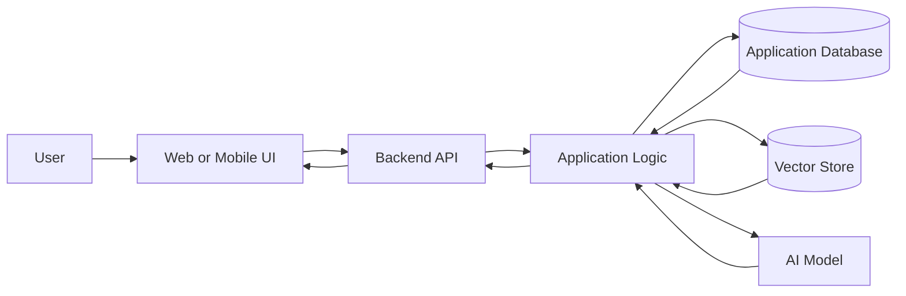

A typical AI request may use several data systems:

```text
Application database:
- Users
- Conversations
- Permissions
- Metadata

Object storage:
- PDFs
- Images
- Audio
- Video

Vector store:
- Embeddings
- Searchable document chunks

Cache:
- Temporary results
- Sessions
- Rate limits
```

---

## 4. What Is a Database?

A database stores information in a structured format so that applications can:

* Create new records.
* Read existing records.
* Update records.
* Delete records.
* Search records.
* Filter and sort results.
* Enforce relationships.
* Protect data integrity.

These four basic operations are known as CRUD:

| Operation | Meaning       | Example                     |
| --------- | ------------- | --------------------------- |
| Create    | Add data      | Create a conversation       |
| Read      | Retrieve data | Load chat history           |
| Update    | Modify data   | Rename a conversation       |
| Delete    | Remove data   | Delete an uploaded document |

---

## 5. Database Management Systems

A **Database Management System**, or DBMS, is software that manages a database.

Common systems include:

### Relational Databases

* PostgreSQL.
* MySQL.
* MariaDB.
* SQLite.
* Microsoft SQL Server.

### Document and NoSQL Databases

* MongoDB.
* DynamoDB.
* CouchDB.
* Firestore.

### Key-Value and Cache Systems

* Redis.
* Memcached.

### Vector Databases

* Pinecone.
* Weaviate.
* Milvus.
* Qdrant.
* Chroma.

PostgreSQL is a strong default for many AI applications because it supports:

* Relational tables.
* Transactions.
* JSON data.
* Full-text search.
* Extensions such as `pgvector`.
* Mature backup and security tools.

---

## 6. Relational Databases

A relational database stores data in tables.

Example `users` table:

| id | email                                       | name | created_at |
| -: | ------------------------------------------- | ---- | ---------- |
|  1 | [alex@example.com](mailto:alex@example.com) | Alex | 2026-07-16 |
|  2 | [sam@example.com](mailto:sam@example.com)   | Sam  | 2026-07-16 |

Each table contains:

* **Columns** that define fields.
* **Rows** that contain records.
* **Data types** that define valid values.
* **Constraints** that enforce rules.

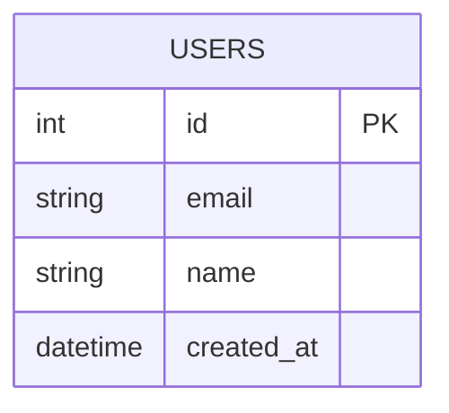

---

## 7. Tables, Rows, and Columns

Consider a table named `messages`.

| id | conversation_id | role      | content                                  |
| -: | --------------: | --------- | ---------------------------------------- |
|  1 |              10 | user      | Explain embeddings                       |
|  2 |              10 | assistant | Embeddings are numerical representations |

### Table

The complete collection of related records.

```text
messages
```

### Row

One record in the table.

```text
id = 1
conversation_id = 10
role = user
content = Explain embeddings
```

### Column

One property shared by all records.

```text
content
```

---

## 8. Common SQL Data Types

| Type              | Purpose             | Example             |
| ----------------- | ------------------- | ------------------- |
| `INTEGER`         | Whole numbers       | User ID             |
| `BIGINT`          | Large whole numbers | Token count         |
| `VARCHAR`         | Short text          | Email               |
| `TEXT`            | Long text           | Message content     |
| `BOOLEAN`         | True or false       | Is active           |
| `DATE`            | Calendar date       | Birth date          |
| `TIMESTAMP`       | Date and time       | Creation time       |
| `DECIMAL`         | Exact numeric value | Cost                |
| `JSON` or `JSONB` | Structured JSON     | Model configuration |
| `UUID`            | Unique identifier   | Conversation ID     |

Choose types based on the meaning and expected size of the data.

---

## 9. Primary Keys

A primary key uniquely identifies each row.

```sql
CREATE TABLE users (
    id SERIAL PRIMARY KEY,
    email VARCHAR(255) NOT NULL,
    name VARCHAR(120) NOT NULL
);
```

In this table:

```text
id
```

is the primary key.

A primary key must be:

* Unique.
* Non-null.
* Stable.

Common primary-key strategies include:

* Auto-incrementing integers.
* UUIDs.
* Application-generated identifiers.

---

## 10. Foreign Keys

A foreign key connects one table to another.

```sql
CREATE TABLE conversations (
    id SERIAL PRIMARY KEY,
    user_id INTEGER NOT NULL,
    title VARCHAR(255) NOT NULL,
    FOREIGN KEY (user_id) REFERENCES users(id)
);
```

Here:

```text
conversations.user_id
```

references:

```text
users.id
```

This prevents a conversation from referencing a user who does not exist.

---

## 11. Relationships Between Tables

### One-to-One

One record is connected to one other record.

Example:

```text
User ↔ User Profile
```

### One-to-Many

One record is connected to many records.

Example:

```text
One user → Many conversations
```

### Many-to-Many

Many records are connected to many records.

Example:

```text
Many users ↔ Many workspaces
```

A linking table is normally used.

---

## 12. Example AI Application Schema

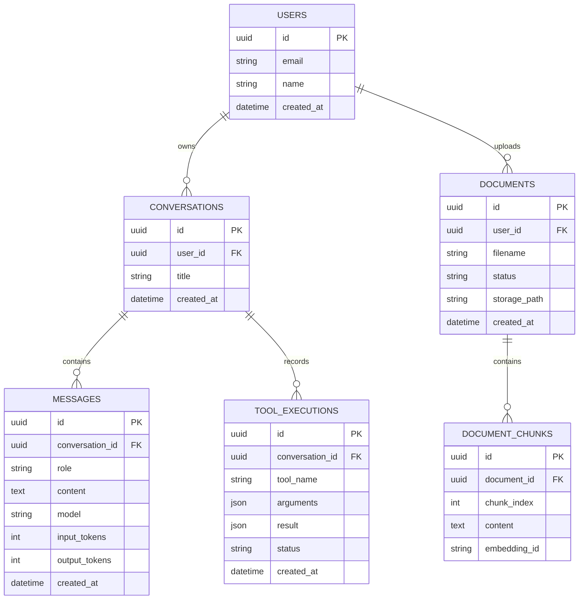

This schema supports:

* Chat history.
* Uploaded documents.
* RAG retrieval.
* Token tracking.
* Agent tool execution.
* User ownership.

---

## 13. Creating Tables with SQL

```sql
CREATE TABLE users (
    id UUID PRIMARY KEY,
    email VARCHAR(255) NOT NULL UNIQUE,
    name VARCHAR(120) NOT NULL,
    created_at TIMESTAMP NOT NULL DEFAULT CURRENT_TIMESTAMP
);

CREATE TABLE conversations (
    id UUID PRIMARY KEY,
    user_id UUID NOT NULL,
    title VARCHAR(255) NOT NULL,
    created_at TIMESTAMP NOT NULL DEFAULT CURRENT_TIMESTAMP,
    FOREIGN KEY (user_id)
        REFERENCES users(id)
        ON DELETE CASCADE
);

CREATE TABLE messages (
    id UUID PRIMARY KEY,
    conversation_id UUID NOT NULL,
    role VARCHAR(20) NOT NULL,
    content TEXT NOT NULL,
    model VARCHAR(120),
    input_tokens INTEGER,
    output_tokens INTEGER,
    created_at TIMESTAMP NOT NULL DEFAULT CURRENT_TIMESTAMP,
    FOREIGN KEY (conversation_id)
        REFERENCES conversations(id)
        ON DELETE CASCADE
);
```

---

## 14. Basic SQL Queries

SQL stands for **Structured Query Language**.

It is used to communicate with relational databases.

### Insert Data

```sql
INSERT INTO users (
    id,
    email,
    name
)
VALUES (
    '11111111-1111-1111-1111-111111111111',
    'alex@example.com',
    'Alex'
);
```

### Read Data

```sql
SELECT id, email, name
FROM users;
```

### Update Data

```sql
UPDATE users
SET name = 'Alex Johnson'
WHERE id = '11111111-1111-1111-1111-111111111111';
```

### Delete Data

```sql
DELETE FROM users
WHERE id = '11111111-1111-1111-1111-111111111111';
```

Always use a `WHERE` condition carefully when updating or deleting data.

---

## 15. Filtering Results

Use `WHERE` to filter rows.

```sql
SELECT id, title, created_at
FROM conversations
WHERE user_id = '11111111-1111-1111-1111-111111111111';
```

Multiple conditions:

```sql
SELECT *
FROM documents
WHERE user_id = '11111111-1111-1111-1111-111111111111'
  AND status = 'ready';
```

Common comparison operators include:

```text
=
!=
>
<
>=
<=
IN
LIKE
IS NULL
```

---

## 16. Sorting and Limiting Results

Sort results:

```sql
SELECT id, title, created_at
FROM conversations
ORDER BY created_at DESC;
```

Limit the number of rows:

```sql
SELECT id, title
FROM conversations
ORDER BY created_at DESC
LIMIT 20;
```

Pagination:

```sql
SELECT id, title
FROM conversations
ORDER BY created_at DESC
LIMIT 20
OFFSET 40;
```

For very large tables, cursor-based pagination is often more efficient than large offsets.

---

## 17. Joining Tables

A join combines related rows from multiple tables.

```sql
SELECT
    conversations.id,
    conversations.title,
    users.email
FROM conversations
JOIN users
    ON conversations.user_id = users.id;
```

### Join Flow

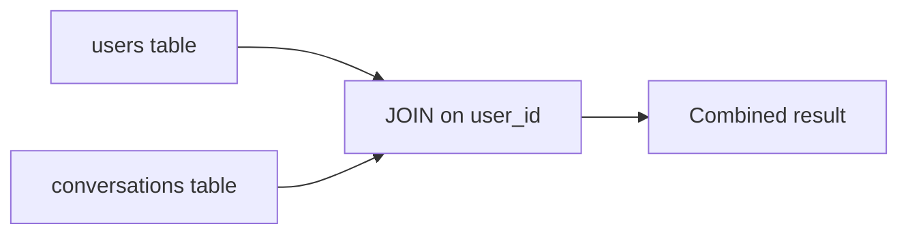

Common join types include:

| Join         | Meaning                                      |
| ------------ | -------------------------------------------- |
| `INNER JOIN` | Return matching rows                         |
| `LEFT JOIN`  | Return all left rows and matching right rows |
| `RIGHT JOIN` | Return all right rows and matching left rows |
| `FULL JOIN`  | Return rows from both sides                  |

---

## 18. Aggregate Functions

Aggregate functions calculate values across multiple rows.

### Count Conversations

```sql
SELECT COUNT(*) AS conversation_count
FROM conversations
WHERE user_id = '11111111-1111-1111-1111-111111111111';
```

### Sum Token Usage

```sql
SELECT
    SUM(input_tokens) AS total_input_tokens,
    SUM(output_tokens) AS total_output_tokens
FROM messages;
```

### Group by Model

```sql
SELECT
    model,
    COUNT(*) AS message_count,
    SUM(input_tokens + output_tokens) AS total_tokens
FROM messages
GROUP BY model
ORDER BY total_tokens DESC;
```

This can help calculate model usage and cost.

---

## 19. Constraints

Constraints protect data integrity.

### `NOT NULL`

Requires a value.

```sql
email VARCHAR(255) NOT NULL
```

### `UNIQUE`

Prevents duplicate values.

```sql
email VARCHAR(255) UNIQUE
```

### `CHECK`

Enforces a rule.

```sql
role VARCHAR(20) CHECK (
    role IN ('system', 'user', 'assistant', 'tool')
)
```

### Foreign Key

Prevents invalid references.

```sql
FOREIGN KEY (conversation_id)
    REFERENCES conversations(id)
```

### Default Value

Provides an automatic value.

```sql
created_at TIMESTAMP DEFAULT CURRENT_TIMESTAMP
```

Database constraints are important even when application code performs validation.

---

## 20. Normalization

Normalization organizes data to reduce duplication and inconsistency.

Poor design:

| conversation_id | user_email                                  | user_name | message     |
| --------------: | ------------------------------------------- | --------- | ----------- |
|               1 | [alex@example.com](mailto:alex@example.com) | Alex      | Hello       |
|               1 | [alex@example.com](mailto:alex@example.com) | Alex      | Hi          |
|               2 | [alex@example.com](mailto:alex@example.com) | Alex      | Explain RAG |

The same user information appears repeatedly.

Better design:

```text
users
conversations
messages
```

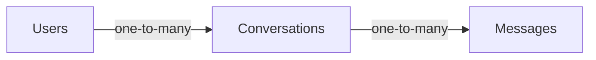

Benefits include:

* Less duplicated data.
* Easier updates.
* Better consistency.
* Clearer relationships.

---

## 21. Denormalization

Denormalization intentionally duplicates selected data to improve performance or simplify access.

Example:

Store the latest message preview directly in the conversation table.

```text
conversations.latest_message_preview
```

This avoids querying the messages table for every conversation list.

Denormalization may improve performance, but it introduces synchronization risks.

Use it only when measurements show a real need.

---

## 22. Indexes

An index helps a database find rows faster.

Without an index, the database may scan every row.

```sql
CREATE INDEX idx_conversations_user_id
ON conversations(user_id);
```

Index multiple columns:

```sql
CREATE INDEX idx_documents_user_status
ON documents(user_id, status);
```

Useful index candidates include:

* Foreign keys.
* Frequently filtered columns.
* Frequently sorted columns.
* Unique identifiers.
* Search fields.

---

## 23. Index Trade-Offs

Indexes improve reads but add costs.

Benefits:

* Faster filtering.
* Faster joins.
* Faster sorting.
* Faster lookups.

Costs:

* More storage.
* Slower inserts.
* Slower updates.
* Additional maintenance.

Do not create indexes on every column.

Add indexes based on actual query patterns.

---

## 24. Query Performance

A query may become slow because of:

* Missing indexes.
* Large table scans.
* Too many joins.
* Returning unnecessary columns.
* Unbounded result sets.
* Large `OFFSET` values.
* Repeated queries inside loops.
* Poor schema design.

Poor:

```sql
SELECT *
FROM messages;
```

Better:

```sql
SELECT id, role, content, created_at
FROM messages
WHERE conversation_id = :conversation_id
ORDER BY created_at ASC
LIMIT 100;
```

Use query-analysis tools such as:

```sql
EXPLAIN
SELECT *
FROM messages
WHERE conversation_id = 'example-id';
```

---

## 25. The N+1 Query Problem

The N+1 problem occurs when the application runs one query to load a list and then one additional query for every item.

Example:

```text
1 query to load 100 conversations
100 queries to load the user for each conversation
101 total queries
```

Better approaches include:

* Joining the related table.
* Eager loading.
* Batching queries.
* Selecting related data in one operation.

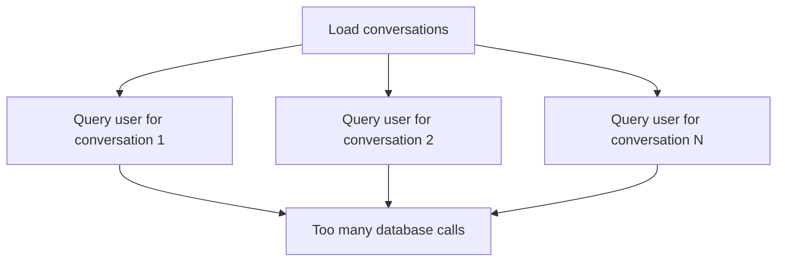

---

## 26. Transactions

A transaction groups multiple operations into one logical unit.

Example:

1. Create a conversation.
2. Create the first message.
3. Deduct usage credits.

Either all operations should succeed, or none should be saved.

```sql
BEGIN;

INSERT INTO conversations (...);

INSERT INTO messages (...);

UPDATE user_credits
SET credits = credits - 1
WHERE user_id = 'example-user';

COMMIT;
```

If an operation fails:

```sql
ROLLBACK;
```

---

## 27. ACID Properties

Transactions are commonly described using ACID.

### Atomicity

All operations succeed or all fail.

### Consistency

The database remains valid before and after the transaction.

### Isolation

Concurrent transactions do not incorrectly interfere with each other.

### Durability

Committed changes survive crashes or restarts.

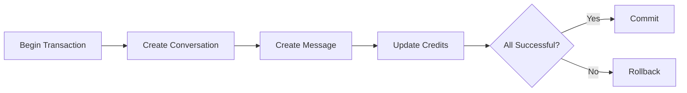

---

## 28. Concurrency

Multiple users may update data at the same time.

Example:

Two workers process the same document job.

Possible problem:

```text
Worker A reads status = queued
Worker B reads status = queued
Worker A starts the job
Worker B also starts the job
```

Solutions may include:

* Row locking.
* Unique constraints.
* Atomic updates.
* Job queues.
* Optimistic concurrency control.

Example atomic update:

```sql
UPDATE indexing_jobs
SET status = 'running'
WHERE id = :job_id
  AND status = 'queued';
```

The application should verify how many rows were updated.

---

## 29. Relational vs NoSQL Databases

### Relational Databases

Store structured data in tables.

Best for:

* Users and permissions.
* Transactions.
* Billing.
* Conversations.
* Structured relationships.
* Consistent business data.

### NoSQL Databases

Store data in flexible formats such as documents or key-value pairs.

Best for:

* Flexible schemas.
* High-volume event data.
* Rapidly changing structures.
* Large distributed workloads.
* Specific access patterns.

---

## 30. Document Database Example

A document database may store a conversation as JSON-like data.

```json
{
  "_id": "conv_42",
  "user_id": "user_1",
  "title": "RAG Questions",
  "messages": [
    {
      "role": "user",
      "content": "Explain RAG"
    },
    {
      "role": "assistant",
      "content": "RAG combines retrieval and generation."
    }
  ]
}
```

Advantages:

* Flexible schema.
* Natural JSON representation.
* Fewer joins.

Limitations:

* Large embedded arrays may become difficult to manage.
* Relationships may be less explicit.
* Duplicate data may be harder to maintain.
* Some transaction patterns are more complex.

---

## 31. Choosing a Database

Use this decision guide:

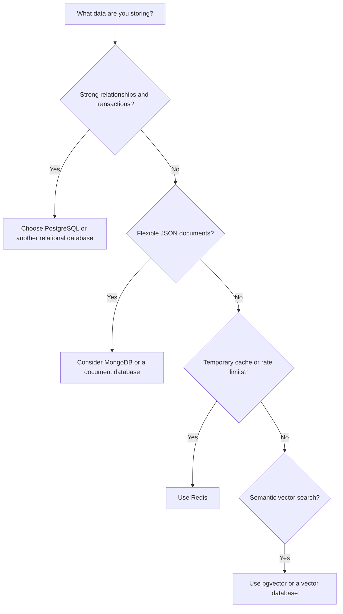

For many beginner AI applications:

```text
PostgreSQL + object storage + pgvector
```

is enough.

---

## 32. Vector Databases

A vector database stores embeddings.

An embedding is a numerical representation of text, images, audio, or other data.

Example:

```text
"Database basics"
        ↓
Embedding model
        ↓
[0.18, -0.42, 0.71, ...]
```

Vector search compares meaning rather than only exact keywords.

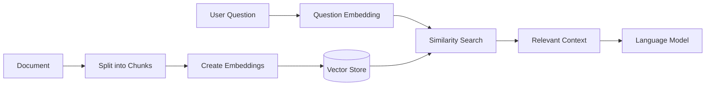

---

## 33. Vector Data in PostgreSQL

With a vector extension, PostgreSQL can store embeddings alongside normal relational data.

Conceptual schema:

```sql
CREATE TABLE document_chunks (
    id UUID PRIMARY KEY,
    document_id UUID NOT NULL,
    chunk_index INTEGER NOT NULL,
    content TEXT NOT NULL,
    embedding VECTOR(1536),
    FOREIGN KEY (document_id)
        REFERENCES documents(id)
);
```

Conceptual similarity query:

```sql
SELECT
    id,
    content,
    embedding <=> :query_embedding AS distance
FROM document_chunks
WHERE document_id = :document_id
ORDER BY distance
LIMIT 5;
```

The exact vector size depends on the embedding model.

---

## 34. Application Database vs Vector Database

These systems solve different problems.

| System              | Stores                       | Main Query                 |
| ------------------- | ---------------------------- | -------------------------- |
| Relational database | Users, messages, permissions | Exact structured lookup    |
| Vector database     | Embeddings and chunks        | Semantic similarity search |
| Object storage      | Files and media              | Retrieve by object path    |
| Cache               | Temporary values             | Fast key lookup            |

A RAG application may use all four.

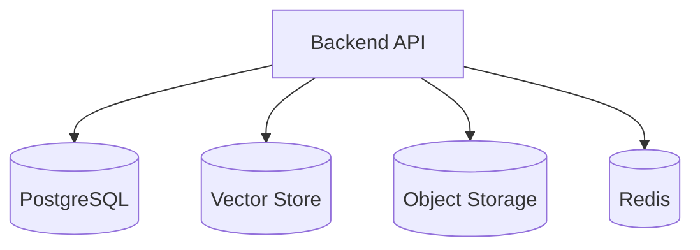

---

## 35. Database Migrations

A migration is a version-controlled database schema change.

Examples:

* Create a table.
* Add a column.
* Add an index.
* Rename a field.
* Create a constraint.
* Backfill existing data.

Migration history:

```text
001_create_users
002_create_conversations
003_create_messages
004_add_message_token_usage
005_add_document_status_index
```

Migrations help keep development, testing, and production databases synchronized.

---

## 36. Safe Migration Strategy

A risky change:

```sql
ALTER TABLE messages
DROP COLUMN content;
```

A safer multi-step approach may be:

1. Add the new column.
2. Write to both old and new columns.
3. Backfill old records.
4. Update readers to use the new column.
5. Confirm production behavior.
6. Remove the old column later.

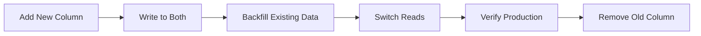

This reduces downtime and compatibility problems.

---

## 37. Object-Relational Mappers

An Object-Relational Mapper, or ORM, maps database tables to programming-language objects.

Common Python ORMs:

* SQLAlchemy.
* Django ORM.
* SQLModel.

Common JavaScript or TypeScript ORMs:

* Prisma.
* Drizzle.
* Sequelize.
* TypeORM.

### Conceptual Python Model

```python
from datetime import datetime
from uuid import UUID

from sqlalchemy import DateTime, ForeignKey, String, Text
from sqlalchemy.orm import Mapped, mapped_column


class Message:
    id: Mapped[UUID] = mapped_column(primary_key=True)
    conversation_id: Mapped[UUID] = mapped_column(
        ForeignKey("conversations.id"),
        index=True,
    )
    role: Mapped[str] = mapped_column(String(20))
    content: Mapped[str] = mapped_column(Text)
    created_at: Mapped[datetime] = mapped_column(DateTime)
```

ORMs improve productivity but do not remove the need to understand SQL.

---

## 38. Connecting FastAPI to a Database

Conceptual flow:

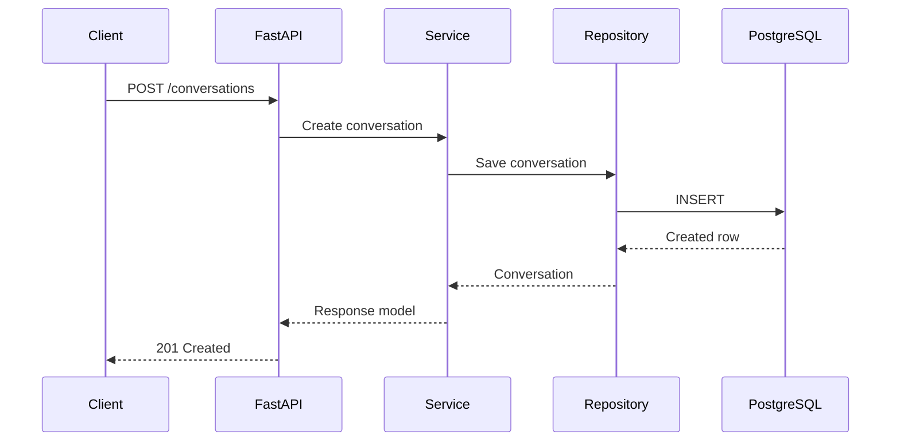

Recommended separation:

```text
API route:
- HTTP concerns

Service:
- Business rules

Repository:
- Database queries

Schema:
- Request and response validation
```

---

## 39. Repository Pattern Example

```python
from dataclasses import dataclass
from uuid import UUID


@dataclass
class ConversationRecord:
    id: UUID
    user_id: UUID
    title: str


class ConversationRepository:
    def create(
        self,
        user_id: UUID,
        title: str,
    ) -> ConversationRecord:
        # Execute INSERT query here.
        raise NotImplementedError

    def get_by_id(
        self,
        conversation_id: UUID,
    ) -> ConversationRecord | None:
        # Execute SELECT query here.
        raise NotImplementedError
```

This keeps SQL access separate from HTTP routes and model logic.

---

## 40. Connection Pooling

Opening a new database connection for every query is expensive.

A connection pool keeps reusable connections available.

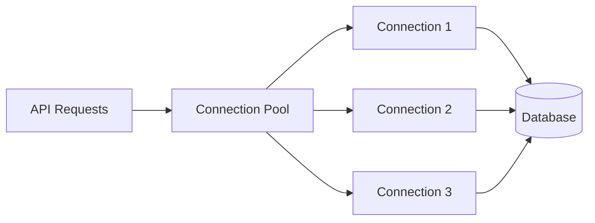

Pool settings should consider:

* Number of application workers.
* Database connection limit.
* Expected concurrency.
* Query duration.
* Idle connection timeout.

A pool that is too large can overload the database.

---

## 41. SQL Injection

SQL injection occurs when untrusted input is inserted directly into a SQL query.

Unsafe:

```python
query = (
    "SELECT * FROM users "
    f"WHERE email = '{user_email}'"
)
```

An attacker may manipulate the query.

Safe:

```python
query = """
SELECT *
FROM users
WHERE email = :email
"""
```

Parameters are passed separately.

Always use:

* Parameterized queries.
* Prepared statements.
* Trusted ORM query builders.

Never build SQL by concatenating user input.

---

## 42. Database Security

Protect the database with:

* Strong credentials.
* Environment variables.
* Encrypted connections.
* Limited database roles.
* Network restrictions.
* Regular backups.
* Audit logs.
* Secret rotation.
* Access monitoring.

The application account should not automatically have permission to:

* Create database administrators.
* Delete every database.
* Modify unrelated schemas.
* Read private administrative tables.

Use the principle of least privilege.

---

## 43. User Data and Privacy

AI applications may store sensitive content.

Examples:

* Private conversations.
* Uploaded documents.
* Audio recordings.
* Personal preferences.
* Medical or financial content.
* Tool-execution history.

Before storing data, define:

* Why it is needed.
* How long it is retained.
* Who can access it.
* How it is deleted.
* Whether it is encrypted.
* Whether it may be used for model training.
* What is recorded in logs.

Do not store data merely because it may be useful later.

---

## 44. Soft Delete vs Hard Delete

### Hard Delete

The row is permanently removed.

```sql
DELETE FROM documents
WHERE id = :document_id;
```

### Soft Delete

The row remains but is marked as deleted.

```sql
UPDATE documents
SET deleted_at = CURRENT_TIMESTAMP
WHERE id = :document_id;
```

Soft delete supports:

* Recovery.
* Auditing.
* Delayed cleanup.

However, every query must correctly exclude deleted records when required.

---

## 45. Backups and Recovery

A database is not safe merely because it runs in the cloud.

A backup strategy should define:

* Backup frequency.
* Retention period.
* Storage location.
* Encryption.
* Restore procedure.
* Recovery-time target.
* Recovery-point target.

The important question is not:

```text
Do we have backups?
```

It is:

```text
Have we tested restoring them?
```

---

## 46. Caching with Redis

Redis is often used for fast temporary data.

Common uses include:

* Session storage.
* Rate-limit counters.
* Job status.
* Cached API responses.
* Distributed locks.
* Temporary conversation state.

Example cache flow:

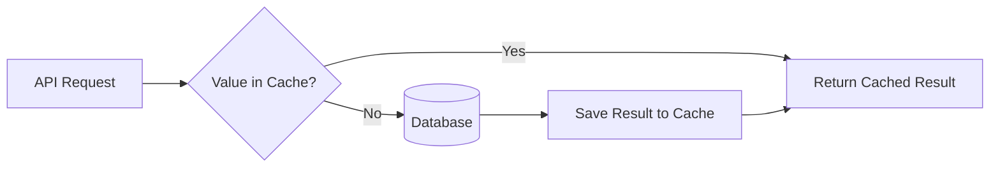

Do not use Redis as the only permanent storage for critical data unless the system is designed for that purpose.

---

## 47. AI-Specific Database Records

A production AI system may record:

### Model Request

```json
{
  "request_id": "req_42",
  "model": "example-model",
  "prompt_version": "rag-v3",
  "input_tokens": 912,
  "output_tokens": 183,
  "latency_ms": 1420,
  "status": "success"
}
```

### Retrieval Event

```json
{
  "query": "What are the project risks?",
  "top_k": 5,
  "document_ids": ["doc_1", "doc_4"],
  "retrieval_ms": 84
}
```

### Agent Tool Execution

```json
{
  "tool_name": "search_documents",
  "arguments": {
    "query": "deployment checklist"
  },
  "status": "success",
  "duration_ms": 92
}
```

Store only information that supports a clear operational, product, legal, or evaluation need.

---

## 48. Prompt and Model Versioning

Model behavior may change because of:

* Prompt changes.
* Model changes.
* Retrieval changes.
* Tool changes.
* Temperature changes.

Store version information with generated outputs.

```sql
CREATE TABLE model_generations (
    id UUID PRIMARY KEY,
    conversation_id UUID NOT NULL,
    model_name VARCHAR(120) NOT NULL,
    prompt_version VARCHAR(80) NOT NULL,
    retrieval_version VARCHAR(80),
    input_tokens INTEGER,
    output_tokens INTEGER,
    latency_ms INTEGER,
    created_at TIMESTAMP NOT NULL DEFAULT CURRENT_TIMESTAMP
);
```

This makes production debugging and evaluation more reliable.

---

## 49. Common Database Mistakes

### 49.1 Storing Everything in One Table

A single table becomes difficult to understand, validate, and query.

### 49.2 No Foreign-Key Constraints

Invalid references accumulate silently.

### 49.3 No Indexes

Queries become slow as data grows.

### 49.4 Too Many Indexes

Writes become slower and storage increases.

### 49.5 Using `SELECT *`

The application retrieves unnecessary data.

### 49.6 No Pagination

List endpoints attempt to return millions of rows.

### 49.7 Hardcoding Credentials

Database passwords appear in source control.

### 49.8 No Transactions

Partially completed operations leave inconsistent data.

### 49.9 Deleting Production Data Manually

Manual changes may bypass business rules and audit history.

### 49.10 Mixing Files with Database Records

Large files are stored directly in database rows without a clear reason.

Usually, file metadata belongs in the database while file contents belong in object storage.

---

## 50. Database Debugging Workflow

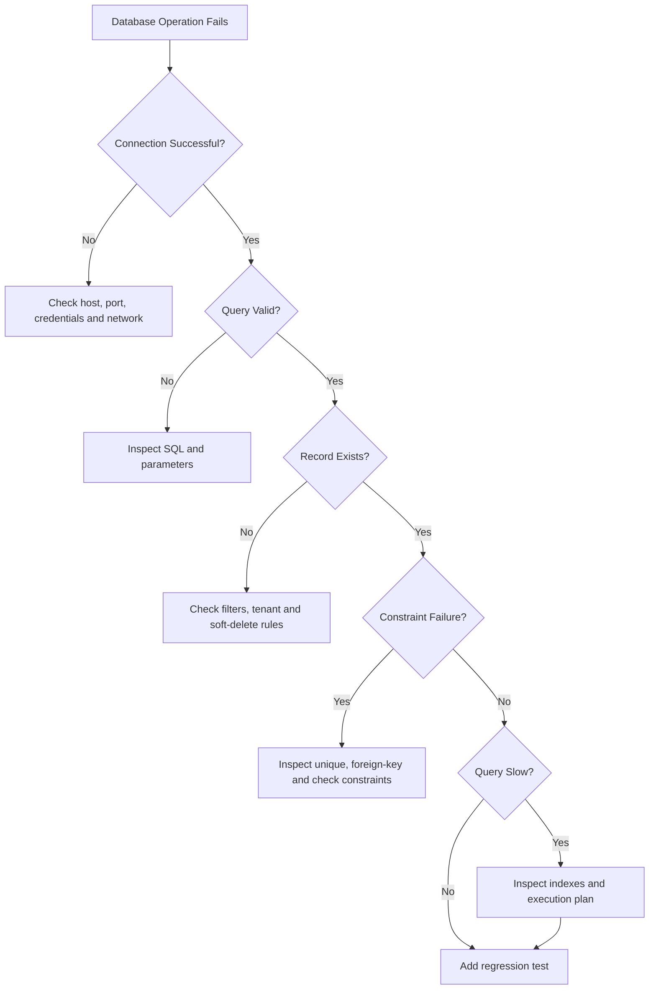

Useful debugging information includes:

* Query name.
* Request ID.
* Database duration.
* Number of returned rows.
* Error code.
* Constraint name.
* Transaction state.
* Connection-pool usage.

Do not log full database credentials or private user data.

---

## 51. Example Production Failure

### Symptom

The conversation list becomes slow after several months.

### Observation

The endpoint takes eight seconds:

```text
GET /api/v1/conversations
```

### Query

```sql
SELECT id, title, created_at
FROM conversations
WHERE user_id = :user_id
ORDER BY created_at DESC
LIMIT 20;
```

### Likely Cause

The database has no index on:

```text
user_id, created_at
```

### Improvement

```sql
CREATE INDEX idx_conversations_user_created
ON conversations(user_id, created_at DESC);
```

### Verification

* Compare execution plans.
* Measure query time before and after.
* Test with production-like data volume.
* Monitor insert performance.
* Add a performance regression check where appropriate.

---

## 52. Another Production Failure

### Symptom

Two identical document-processing jobs run for the same file.

### Cause

Two workers read the same queued record before either updates it.

### Unsafe Flow

```text
Worker A reads queued
Worker B reads queued
Worker A starts
Worker B starts
```

### Safer Update

```sql
UPDATE document_jobs
SET status = 'running'
WHERE id = :job_id
  AND status = 'queued';
```

Only the worker that updates one row should continue processing.

---

## 53. Testing Database Logic

Important test categories include:

* Insert a valid record.
* Reject duplicate unique values.
* Reject missing required fields.
* Reject invalid foreign keys.
* Update an existing record.
* Delete or soft-delete a record.
* Roll back a failed transaction.
* Enforce user ownership.
* Return paginated results.
* Retrieve records in the correct order.
* Handle database unavailability.
* Prevent duplicate jobs.

Tests should run against an isolated test database.

---

## 54. Practical Mini Project

Build a minimal AI conversation database.

### Required Tables

```text
users
conversations
messages
model_generations
```

### Required Features

* Create a user.
* Create a conversation.
* Add user and assistant messages.
* List conversations for one user.
* Load messages for one conversation.
* Record model name and token usage.
* Delete a conversation.
* Protect user ownership.
* Use migrations.
* Add indexes.
* Add automated tests.

### Suggested Structure

```text
database-ai-demo/
├── app/
│   ├── main.py
│   ├── api/
│   │   └── conversations.py
│   ├── models/
│   │   ├── user.py
│   │   ├── conversation.py
│   │   └── message.py
│   ├── schemas/
│   │   └── conversation.py
│   ├── repositories/
│   │   └── conversation_repository.py
│   ├── services/
│   │   └── conversation_service.py
│   └── core/
│       └── database.py
├── migrations/
├── tests/
│   └── test_conversations.py
├── .env.example
├── docker-compose.yml
├── Dockerfile
├── requirements.txt
└── README.md
```

---

## 55. Suggested API Flow

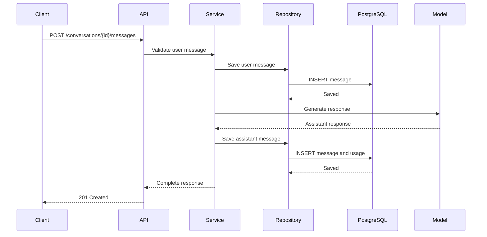

The message inserts may be wrapped in a transaction depending on the desired consistency behavior.

---

## 56. Practice Exercises

### Exercise 1 — Explain Database Concepts

Explain these terms in five sentences:

* Database.
* Table.
* Row.
* Primary key.
* Foreign key.

---

### Exercise 2 — Create a Schema

Design tables for:

* Users.
* Conversations.
* Messages.
* Uploaded documents.

Include:

* Primary keys.
* Foreign keys.
* Required fields.
* Creation timestamps.

---

### Exercise 3 — Write CRUD Queries

Write SQL to:

1. Create a conversation.
2. Read the conversation.
3. Rename it.
4. Delete it.

---

### Exercise 4 — Join Tables

Write a query that returns:

* Conversation title.
* User email.
* Conversation creation time.

---

### Exercise 5 — Token Usage Report

Write a query that groups token usage by model.

Expected fields:

```text
model
request_count
total_input_tokens
total_output_tokens
```

---

### Exercise 6 — Add an Index

Given:

```sql
SELECT *
FROM messages
WHERE conversation_id = :conversation_id
ORDER BY created_at;
```

Design an index to support this query.

---

### Exercise 7 — Transaction Failure

Simulate:

1. Create a conversation.
2. Create the first message.
3. Fail before updating usage credits.

Explain how a transaction prevents partial data.

---

### Exercise 8 — RAG Storage

Design tables for:

* Documents.
* Document chunks.
* Embedding metadata.
* Retrieval events.

Explain which data belongs in PostgreSQL, object storage, and a vector index.

---

## 57. Completion Checklist

### Database Foundations

* [ ] I can explain what a database does.
* [ ] I understand tables, rows, and columns.
* [ ] I understand primary and foreign keys.
* [ ] I understand one-to-many relationships.
* [ ] I can explain relational and NoSQL databases.

### SQL Skills

* [ ] I can create a-to-many relationships.
* [ ] I can explain table.
* [ ] I can insert data.
* [ ] I can select and filter data.
* [ ] I can update data.
* [ ] I can delete data.
* [ ] I can join related tables.
* [ ] I can use aggregate functions.
* [ ] I can sort and paginate results.

### Production Knowledge

* [ ] I understand constraints.
* [ ] I understand transactions.
* [ ] I understand indexes.
* [ ] I understand connection pooling.
* [ ] I know how to prevent SQL injection.
* [ ] I understand migrations.
* [ ] I understand backups.
* [ ] I know how to protect database credentials.

### AI Engineering

* [ ] I can design storage for conversations.
* [ ] I can store model usage metadata.
* [ ] I understand vector embeddings.
* [ ] I understand the difference between SQL and vector search.
* [ ] I can design storage for RAG documents.
* [ ] I can record agent tool executions.
* [ ] I can connect database records to prompt and model versions.

---

## 58. Related Outcome

This lesson prepares the data-storage foundation required before building production AI applications.

It supports later topics such as:

* LLM chat history.
* User authentication.
* RAG document storage.
* Vector retrieval.
* Agent memory.
* Model evaluation.
* Usage tracking.
* Cost analysis.
* Prompt versioning.
* Production monitoring.
* Background jobs.

---

## 59. Related Project

Set up a minimal FastAPI or Node.js application containing:

* Git version control.
* REST endpoints.
* PostgreSQL.
* Database migrations.
* Relational models.
* CRUD operations.
* Foreign-key relationships.
* Indexes.
* Transactions.
* Environment variables.
* Automated database tests.
* Docker Compose.
* A complete README.

### Suggested Portfolio Description

> Built a database-backed AI conversation service using PostgreSQL, relational schema design, migrations, indexed queries, transactional message storage, model-usage tracking, REST endpoints, automated tests, and Docker Compose.

---

## 60. Summary

A database gives an AI application memory, structure, and consistency.

A typical data flow looks like this:

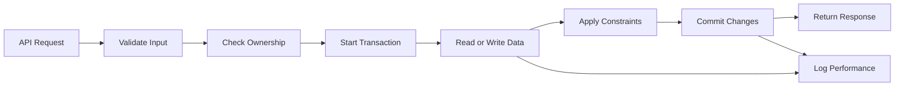

For an AI Engineer, database knowledge is necessary to manage:

```text
Users
  ↓
Conversations
  ↓
Messages
  ↓
Documents and chunks
  ↓
Retrieval results
  ↓
Model and prompt versions
  ↓
Tool executions
  ↓
Usage, cost and evaluation
```

Start with a relational database such as PostgreSQL. Learn tables, keys, SQL, relationships, constraints, indexes, transactions, migrations, and backups.

Add a vector store only when semantic search is required. Use object storage for large files and Redis for temporary or cached data.

A reliable AI application does not merely generate an answer. It stores the right data, protects ownership, maintains consistency, supports debugging, and remains usable as the number of users and records grows.
