# 008 — FastAPI / Flask / Express

**Course:** 01 — Foundations and LLM Basics
**Module:** Module 01 — Prerequisites
**Content Group:** Required Foundations
**Roadmap Source:** Prerequisites / Required Foundations
**Lesson Type:** Prerequisite
**Order in Module:** 008
**Suggested Duration:** 18 minutes

---

## 1. Overview

**FastAPI**, **Flask**, and **Express** are web frameworks used to build backend applications and HTTP APIs.

They help developers:

* Receive HTTP requests.
* Validate user input.
* Run application logic.
* Connect to databases.
* Call AI models.
* Execute retrieval pipelines.
* Run agent tools.
* Return JSON responses.
* Handle errors.
* Add authentication, logging, and monitoring.

The primary difference is their programming ecosystem:

* **FastAPI** uses Python and is designed around Python type hints, automatic data validation, asynchronous route handlers, and OpenAPI documentation.
* **Flask** uses Python and provides a lightweight foundation that can be extended as the application grows.
* **Express** uses JavaScript or TypeScript on Node.js and organizes applications around routes and middleware.

You normally choose one framework for a backend service rather than using all three together.

---

## 2. Learning Objectives

After completing this lesson, you should be able to:

* Explain what a backend web framework does.
* Compare FastAPI, Flask, and Express.
* Choose an appropriate framework for an AI application.
* Create a minimal HTTP server.
* Define REST API routes.
* Accept path, query, and body parameters.
* Validate JSON input.
* Return structured JSON responses.
* Add middleware.
* Handle application errors.
* Connect routes to AI services and databases.
* Organize a backend project into maintainable modules.
* Test an API endpoint.
* Identify common production problems.

---

## 3. Where a Backend Framework Fits

A backend framework connects the client to application services.

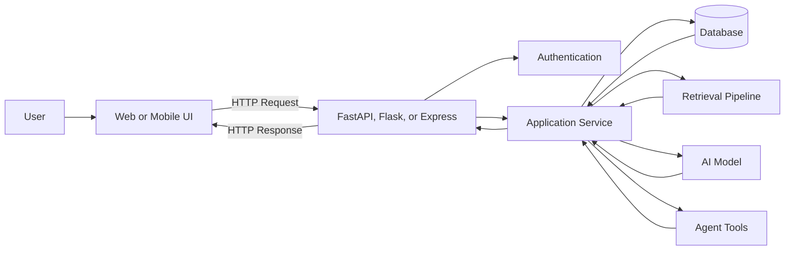

The framework should handle HTTP concerns, while separate services handle business and AI logic.

---

## 4. What Does a Web Framework Provide?

A backend framework usually provides tools for:

* Routing.
* Request parsing.
* Response creation.
* Error handling.
* Middleware.
* Cookies and headers.
* File uploads.
* Authentication integration.
* Dependency management.
* Testing.
* Server configuration.

Without a framework, developers would need to implement low-level HTTP handling manually.

### Basic Request Lifecycle

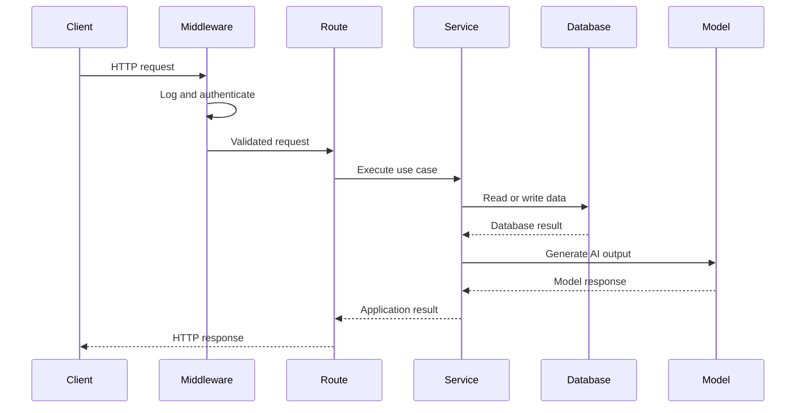

---

## 5. Framework Comparison

| Area              | FastAPI                              | Flask                                                                  | Express                                   |
| ----------------- | ------------------------------------ | ---------------------------------------------------------------------- | ----------------------------------------- |
| Language          | Python                               | Python                                                                 | JavaScript or TypeScript                  |
| Main style        | API-focused                          | Minimal and flexible                                                   | Middleware-based                          |
| Input validation  | Strong built-in integration          | Usually added manually or through extensions                           | Usually added with libraries              |
| API documentation | Automatic OpenAPI documentation      | Requires additional setup                                              | Requires additional setup                 |
| Async support     | First-class route support            | Available, but traditional Flask applications are commonly synchronous | Natural fit with Node.js async operations |
| Project structure | Flexible                             | Highly flexible                                                        | Highly flexible                           |
| Learning curve    | Beginner-friendly with Python typing | Very simple for small applications                                     | Simple for JavaScript developers          |
| AI ecosystem      | Excellent                            | Excellent                                                              | Strong and growing                        |
| Best starting use | Typed AI APIs                        | Small services and custom applications                                 | Full-stack JavaScript applications        |

---

## 6. How to Choose

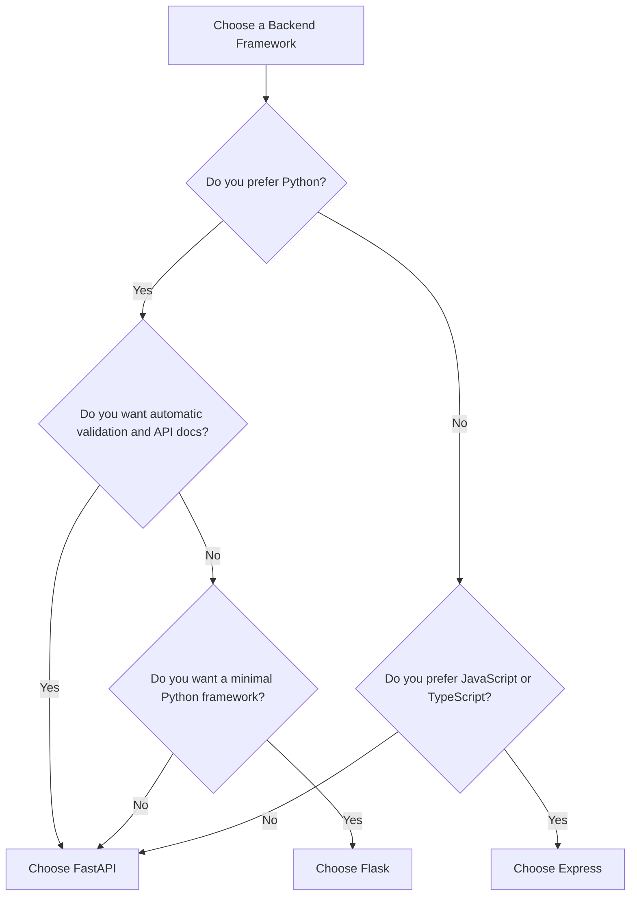

### Recommended Starting Point

Choose **FastAPI** when:

* Your main language is Python.
* You are building an AI or data API.
* You want request validation.
* You want generated API documentation.
* You expect many structured JSON schemas.
* You need asynchronous model or database calls.

Choose **Flask** when:

* You want a small Python service.
* You prefer choosing each extension yourself.
* You are maintaining an existing Flask project.
* You need a highly customized application structure.
* You are learning the basic mechanics of web frameworks.

Choose **Express** when:

* Your main language is JavaScript or TypeScript.
* Your frontend also uses JavaScript.
* You want one language across the full stack.
* You are building a Node.js service.
* Your team already uses the npm ecosystem.

---

# Part I — FastAPI

## 7. What Is FastAPI?

FastAPI is a Python framework for building APIs using standard Python type hints. It can generate OpenAPI schemas and interactive API documentation from route and data declarations.

It is commonly used for:

* AI model APIs.
* RAG services.
* Data-processing endpoints.
* Machine-learning inference.
* Agent backends.
* Internal microservices.
* File-processing services.

---

## 8. Install FastAPI

Create a virtual environment:

```bash
python -m venv .venv
```

Activate it on Linux or macOS:

```bash
source .venv/bin/activate
```

Activate it on Windows:

```powershell
.venv\Scripts\activate
```

Install the framework and server:

```bash
pip install fastapi uvicorn
```

---

## 9. Minimal FastAPI Application

```python
from fastapi import FastAPI

app = FastAPI(
    title="AI API",
    version="1.0.0",
)


@app.get("/")
async def root() -> dict[str, str]:
    return {
        "message": "AI API is running",
    }


@app.get("/health")
async def health_check() -> dict[str, str]:
    return {
        "status": "ok",
    }
```

Run the application:

```bash
uvicorn main:app --reload
```

The application is available at:

```text
http://localhost:8000
```

FastAPI generates interactive OpenAPI interfaces by default.

Common development URLs are:

```text
http://localhost:8000/docs
http://localhost:8000/redoc
```

---

## 10. FastAPI Request Validation

```python
from typing import Literal

from fastapi import FastAPI
from pydantic import BaseModel, Field

app = FastAPI()


class ChatRequest(BaseModel):
    message: str = Field(
        min_length=1,
        max_length=4000,
    )
    language: Literal["en", "vi"] = "en"
    temperature: float = Field(
        default=0.2,
        ge=0.0,
        le=2.0,
    )


class ChatResponse(BaseModel):
    answer: str
    model: str
    language: str


@app.post(
    "/api/v1/chat",
    response_model=ChatResponse,
)
async def chat(
    request: ChatRequest,
) -> ChatResponse:
    return ChatResponse(
        answer=f"Processed: {request.message}",
        model="demo-model",
        language=request.language,
    )
```

The schema protects the route from:

* Missing fields.
* Invalid data types.
* Unsupported languages.
* Empty messages.
* Invalid temperature values.
* Excessively long input.

---

## 11. FastAPI Path and Query Parameters

```python
from fastapi import FastAPI, Query

app = FastAPI()


@app.get("/api/v1/conversations/{conversation_id}")
async def get_conversation(
    conversation_id: str,
    include_messages: bool = False,
    limit: int = Query(
        default=20,
        ge=1,
        le=100,
    ),
) -> dict:
    return {
        "conversation_id": conversation_id,
        "include_messages": include_messages,
        "limit": limit,
    }
```

Example request:

```text
GET /api/v1/conversations/conv_42?include_messages=true&limit=10
```

---

## 12. FastAPI Error Handling

```python
from fastapi import FastAPI, HTTPException, status

app = FastAPI()

documents = {
    "doc_1": {
        "id": "doc_1",
        "status": "ready",
    }
}


@app.get("/api/v1/documents/{document_id}")
async def get_document(
    document_id: str,
) -> dict:
    document = documents.get(document_id)

    if document is None:
        raise HTTPException(
            status_code=status.HTTP_404_NOT_FOUND,
            detail="Document not found.",
        )

    return document
```

Response:

```json
{
  "detail": "Document not found."
}
```

---

## 13. FastAPI Dependency Injection

Dependencies can provide:

* Authentication.
* Database sessions.
* Configuration.
* Rate-limit checks.
* Service objects.
* Permission checks.

```python
from dataclasses import dataclass

from fastapi import Depends, FastAPI, Header, HTTPException

app = FastAPI()


@dataclass
class CurrentUser:
    id: str
    role: str


async def get_current_user(
    authorization: str | None = Header(default=None),
) -> CurrentUser:
    if authorization != "Bearer demo-token":
        raise HTTPException(
            status_code=401,
            detail="Invalid access token.",
        )

    return CurrentUser(
        id="user_1",
        role="member",
    )


@app.get("/api/v1/profile")
async def get_profile(
    user: CurrentUser = Depends(get_current_user),
) -> dict[str, str]:
    return {
        "user_id": user.id,
        "role": user.role,
    }
```

---

## 14. FastAPI Async Route

FastAPI supports `async def` route handlers and documents how asynchronous code can be used for network and I/O operations.

```python
import httpx

from fastapi import FastAPI

app = FastAPI()


@app.get("/api/v1/model-status")
async def model_status() -> dict:
    async with httpx.AsyncClient(
        timeout=5.0,
    ) as client:
        response = await client.get(
            "https://example.com/status",
        )

    return {
        "upstream_status": response.status_code,
    }
```

Async operations are useful for:

* Model API calls.
* Database queries.
* Object storage.
* Vector searches.
* Network tools.
* Concurrent retrieval operations.

---

# Part II — Flask

## 15. What Is Flask?

Flask is a lightweight Python WSGI web application framework. Its minimal core makes it quick to start, while additional functionality can be added as the application grows.

Flask is commonly used for:

* Small APIs.
* Internal tools.
* Traditional web applications.
* Prototypes.
* Existing Python services.
* Custom backend architectures.

---

## 16. Install Flask

```bash
pip install Flask
```

This is the installation command shown in Flask’s official documentation.

---

## 17. Minimal Flask Application

```python
from flask import Flask, jsonify

app = Flask(__name__)


@app.get("/")
def root():
    return jsonify(
        {
            "message": "AI API is running",
        }
    )


@app.get("/health")
def health_check():
    return jsonify(
        {
            "status": "ok",
        }
    )


if __name__ == "__main__":
    app.run(
        host="0.0.0.0",
        port=5000,
        debug=True,
    )
```

Run it:

```bash
python app.py
```

The application is available at:

```text
http://localhost:5000
```

---

## 18. Flask JSON Request

```python
from flask import Flask, jsonify, request

app = Flask(__name__)


@app.post("/api/v1/chat")
def chat():
    payload = request.get_json(silent=True)

    if payload is None:
        return (
            jsonify(
                {
                    "error": {
                        "code": "invalid_json",
                        "message": "A JSON body is required.",
                    }
                }
            ),
            400,
        )

    message = str(payload.get("message", "")).strip()

    if not message:
        return (
            jsonify(
                {
                    "error": {
                        "code": "empty_message",
                        "message": "Message cannot be empty.",
                    }
                }
            ),
            422,
        )

    if len(message) > 4000:
        return (
            jsonify(
                {
                    "error": {
                        "code": "message_too_long",
                        "message": "Message exceeds 4000 characters.",
                    }
                }
            ),
            422,
        )

    return jsonify(
        {
            "answer": f"Processed: {message}",
            "model": "demo-model",
        }
    )
```

Flask gives the developer more freedom, but validation conventions must be designed and applied consistently.

---

## 19. Flask Application Factory

The Flask documentation notes that a single global application instance is straightforward for small examples but may create difficulties as a project grows. The application-factory pattern helps organize larger systems.

```python
from flask import Flask


def create_app() -> Flask:
    app = Flask(__name__)

    from app.routes.health import health_blueprint
    from app.routes.chat import chat_blueprint

    app.register_blueprint(health_blueprint)
    app.register_blueprint(
        chat_blueprint,
        url_prefix="/api/v1",
    )

    return app
```

Application factories help with:

* Test configuration.
* Development and production environments.
* Extension initialization.
* Modular routes.
* Avoiding global state.

---

## 20. Flask Blueprints

Blueprints organize related endpoints.

```python
from flask import Blueprint, jsonify

health_blueprint = Blueprint(
    "health",
    __name__,
)


@health_blueprint.get("/health")
def health_check():
    return jsonify(
        {
            "status": "ok",
        }
    )
```

Chat blueprint:

```python
from flask import Blueprint, jsonify, request

chat_blueprint = Blueprint(
    "chat",
    __name__,
)


@chat_blueprint.post("/chat")
def chat():
    payload = request.get_json() or {}
    message = str(payload.get("message", "")).strip()

    if not message:
        return jsonify(
            {
                "error": "Message cannot be empty.",
            }
        ), 422

    return jsonify(
        {
            "answer": f"Processed: {message}",
        }
    )
```

---

# Part III — Express

## 21. What Is Express?

Express is a Node.js web framework built around routing and middleware. Its official documentation organizes request handling through route methods, routers, and middleware functions.

Express is commonly used for:

* JavaScript or TypeScript APIs.
* Full-stack web applications.
* Backend-for-frontend services.
* Serverless functions.
* Real-time applications.
* AI streaming backends.
* Existing Node.js systems.

---

## 22. Create an Express Project

```bash
mkdir express-ai-api
cd express-ai-api
npm init -y
npm install express
```

Use ECMAScript modules by adding this to `package.json`:

```json
{
  "type": "module"
}
```

---

## 23. Minimal Express Application

```javascript
import express from "express";

const app = express();
const port = process.env.PORT || 3000;

app.use(express.json());

app.get("/", (request, response) => {
  response.json({
    message: "AI API is running",
  });
});

app.get("/health", (request, response) => {
  response.json({
    status: "ok",
  });
});

app.listen(port, () => {
  console.log(`Server running on port ${port}`);
});
```

Run it:

```bash
node server.js
```

The application is available at:

```text
http://localhost:3000
```

---

## 24. Express Chat Endpoint

```javascript
import express from "express";

const app = express();

app.use(express.json());

app.post("/api/v1/chat", async (request, response) => {
  const message =
    typeof request.body?.message === "string"
      ? request.body.message.trim()
      : "";

  if (!message) {
    return response.status(422).json({
      error: {
        code: "empty_message",
        message: "Message cannot be empty.",
      },
    });
  }

  if (message.length > 4000) {
    return response.status(422).json({
      error: {
        code: "message_too_long",
        message: "Message exceeds 4000 characters.",
      },
    });
  }

  return response.json({
    answer: `Processed: ${message}`,
    model: "demo-model",
  });
});
```

---

## 25. Express Middleware

Middleware functions can inspect or modify requests and responses before route handlers run. Express supports application-level, router-level, error-handling, built-in, and third-party middleware.

### Request Logger

```javascript
function requestLogger(request, response, next) {
  const startedAt = Date.now();

  response.on("finish", () => {
    console.log({
      method: request.method,
      path: request.path,
      statusCode: response.statusCode,
      durationMs: Date.now() - startedAt,
    });
  });

  next();
}

app.use(requestLogger);
```

### Authentication Middleware

```javascript
function authenticate(request, response, next) {
  const authorization = request.headers.authorization;

  if (authorization !== "Bearer demo-token") {
    return response.status(401).json({
      error: {
        code: "invalid_token",
        message: "Authentication is required.",
      },
    });
  }

  request.user = {
    id: "user_1",
    role: "member",
  };

  next();
}

app.get(
  "/api/v1/profile",
  authenticate,
  (request, response) => {
    response.json({
      userId: request.user.id,
      role: request.user.role,
    });
  },
);
```

---

## 26. Express Routers

Express routers separate endpoint groups.

```javascript
import { Router } from "express";

export const chatRouter = Router();

chatRouter.post("/", async (request, response) => {
  response.json({
    answer: "Generated answer",
  });
});
```

Register it:

```javascript
import express from "express";

import { chatRouter } from "./routes/chat.js";

const app = express();

app.use(express.json());
app.use("/api/v1/chat", chatRouter);
```

---

## 27. Express Error Middleware

```javascript
function errorHandler(error, request, response, next) {
  console.error("Unhandled request error", {
    message: error.message,
    stack: error.stack,
  });

  if (response.headersSent) {
    return next(error);
  }

  return response.status(500).json({
    error: {
      code: "internal_error",
      message: "An unexpected error occurred.",
    },
  });
}

app.use(errorHandler);
```

Error middleware should be registered after the normal routes.

---

## 28. TypeScript with Express

TypeScript improves schema clarity and catches some mistakes before runtime.

```typescript
interface ChatRequest {
  message: string;
  language?: "en" | "vi";
}

interface ChatResponse {
  answer: string;
  model: string;
  language: string;
}

function validateChatRequest(
  body: unknown,
): ChatRequest {
  if (
    typeof body !== "object" ||
    body === null ||
    !("message" in body) ||
    typeof body.message !== "string"
  ) {
    throw new Error("Invalid chat request.");
  }

  return {
    message: body.message.trim(),
  };
}
```

In production Express applications, schema-validation libraries are commonly used to avoid writing every validation rule manually.

---

# Part IV — Equivalent Endpoints

## 29. Health Endpoint Comparison

### FastAPI

```python
@app.get("/health")
async def health_check() -> dict[str, str]:
    return {"status": "ok"}
```

### Flask

```python
@app.get("/health")
def health_check():
    return jsonify({"status": "ok"})
```

### Express

```javascript
app.get("/health", (request, response) => {
  response.json({ status: "ok" });
});
```

All three produce the same HTTP behavior:

```http
GET /health
```

```json
{
  "status": "ok"
}
```

---

## 30. Route Responsibility

A route should normally:

1. Receive the HTTP request.
2. Validate HTTP-level input.
3. Identify the authenticated user.
4. Call an application service.
5. Convert the result into an HTTP response.

A route should not contain the entire application.

Poor route:

```python
@app.post("/chat")
async def chat(request):
    # Validate input
    # Query the database
    # Build embeddings
    # Search documents
    # Construct a prompt
    # Call the model
    # Retry failures
    # Save token usage
    # Send analytics
    # Format the response
    ...
```

Better separation:

```text
Route
  ↓
Chat Service
  ├── Conversation Repository
  ├── Retrieval Service
  ├── Prompt Builder
  ├── Model Gateway
  └── Usage Repository
```

---

## 31. Layered Architecture

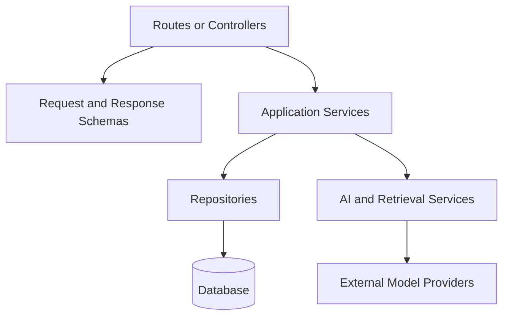

### Route Layer

Handles:

* HTTP methods.
* URLs.
* Headers.
* Status codes.
* Request and response conversion.

### Service Layer

Handles:

* Business rules.
* AI workflows.
* Transactions.
* Authorization decisions.
* Use-case orchestration.

### Repository Layer

Handles:

* SQL queries.
* Database persistence.
* Data retrieval.
* Storage-specific behavior.

### Provider Layer

Handles:

* Model APIs.
* Embedding APIs.
* External tools.
* Object storage.
* Third-party services.

---

## 32. Suggested FastAPI Structure

```text
fastapi-ai-app/
├── app/
│   ├── main.py
│   ├── api/
│   │   ├── dependencies.py
│   │   └── routes/
│   │       ├── chat.py
│   │       ├── documents.py
│   │       └── health.py
│   ├── schemas/
│   │   ├── chat.py
│   │   └── document.py
│   ├── services/
│   │   ├── chat_service.py
│   │   ├── model_service.py
│   │   └── retrieval_service.py
│   ├── repositories/
│   │   ├── conversation_repository.py
│   │   └── document_repository.py
│   ├── models/
│   └── core/
│       ├── config.py
│       ├── database.py
│       └── logging.py
├── tests/
├── migrations/
├── Dockerfile
├── requirements.txt
└── README.md
```

---

## 33. Suggested Flask Structure

```text
flask-ai-app/
├── app/
│   ├── __init__.py
│   ├── routes/
│   │   ├── chat.py
│   │   ├── documents.py
│   │   └── health.py
│   ├── services/
│   ├── repositories/
│   ├── models/
│   ├── extensions.py
│   └── config.py
├── tests/
├── migrations/
├── wsgi.py
├── Dockerfile
├── requirements.txt
└── README.md
```

---

## 34. Suggested Express Structure

```text
express-ai-app/
├── src/
│   ├── server.ts
│   ├── app.ts
│   ├── routes/
│   │   ├── chat.ts
│   │   ├── documents.ts
│   │   └── health.ts
│   ├── middleware/
│   │   ├── authentication.ts
│   │   ├── error-handler.ts
│   │   └── request-logger.ts
│   ├── schemas/
│   ├── services/
│   ├── repositories/
│   ├── models/
│   └── config/
├── tests/
├── migrations/
├── Dockerfile
├── package.json
├── tsconfig.json
└── README.md
```

---

# Part V — AI Integration

## 35. AI Chat Workflow

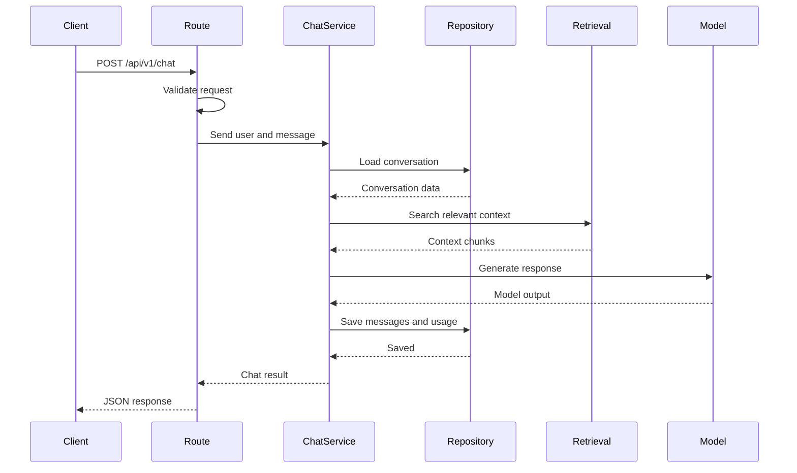

---

## 36. Framework-Independent AI Service

Keep model code separate from the framework.

### Python

```python
from dataclasses import dataclass


@dataclass
class GenerationResult:
    text: str
    model: str
    input_tokens: int
    output_tokens: int


class ModelService:
    async def generate(
        self,
        message: str,
    ) -> GenerationResult:
        return GenerationResult(
            text=f"Generated answer for: {message}",
            model="demo-model",
            input_tokens=len(message.split()),
            output_tokens=12,
        )
```

This service can be used by FastAPI or Flask.

### JavaScript

```javascript
export class ModelService {
  async generate(message) {
    return {
      text: `Generated answer for: ${message}`,
      model: "demo-model",
      inputTokens: message.split(/\s+/).length,
      outputTokens: 12,
    };
  }
}
```

This service can be used by Express routes, workers, or scripts.

---

## 37. RAG Endpoint

Suggested endpoint:

```text
POST /api/v1/questions
```

Request:

```json
{
  "question": "What are the main project risks?",
  "document_ids": [
    "doc_1",
    "doc_2"
  ],
  "top_k": 5
}
```

Response:

```json
{
  "answer": "The documents identify three major risks...",
  "citations": [
    {
      "document_id": "doc_1",
      "chunk_id": "chunk_12",
      "score": 0.91
    }
  ]
}
```

The framework route should not implement embedding and similarity-search logic directly.

---

## 38. Agent Endpoint

```text
POST /api/v1/agents/{agent_id}/executions
```

Request:

```json
{
  "message": "Find the latest order and summarize its status.",
  "allowed_tools": [
    "search_orders",
    "get_order_status"
  ]
}
```

Response:

```json
{
  "execution_id": "exec_42",
  "status": "completed",
  "answer": "The latest order is being prepared.",
  "tool_calls": [
    {
      "tool": "search_orders",
      "status": "success"
    },
    {
      "tool": "get_order_status",
      "status": "success"
    }
  ]
}
```

Agent APIs must validate:

* Tool names.
* Tool arguments.
* User permissions.
* Maximum iterations.
* Timeout limits.
* Side effects.
* Output schemas.

---

## 39. File Upload Endpoint

AI applications may upload:

* PDFs.
* Images.
* Audio.
* Video.
* CSV files.
* Text documents.

Conceptual FastAPI example:

```python
from fastapi import FastAPI, File, HTTPException, UploadFile

app = FastAPI()

ALLOWED_TYPES = {
    "application/pdf",
    "text/plain",
}

MAX_FILE_SIZE = 10 * 1024 * 1024


@app.post("/api/v1/documents")
async def upload_document(
    file: UploadFile = File(...),
) -> dict[str, str]:
    if file.content_type not in ALLOWED_TYPES:
        raise HTTPException(
            status_code=415,
            detail="Unsupported file type.",
        )

    content = await file.read()

    if len(content) > MAX_FILE_SIZE:
        raise HTTPException(
            status_code=413,
            detail="File is too large.",
        )

    return {
        "filename": file.filename or "unknown",
        "status": "uploaded",
    }
```

Production uploads also require:

* File-size limits.
* Type validation.
* Malware scanning.
* User quotas.
* Secure object storage.
* Background processing.
* Extraction error handling.

---

## 40. Streaming Responses

AI models often generate output incrementally.

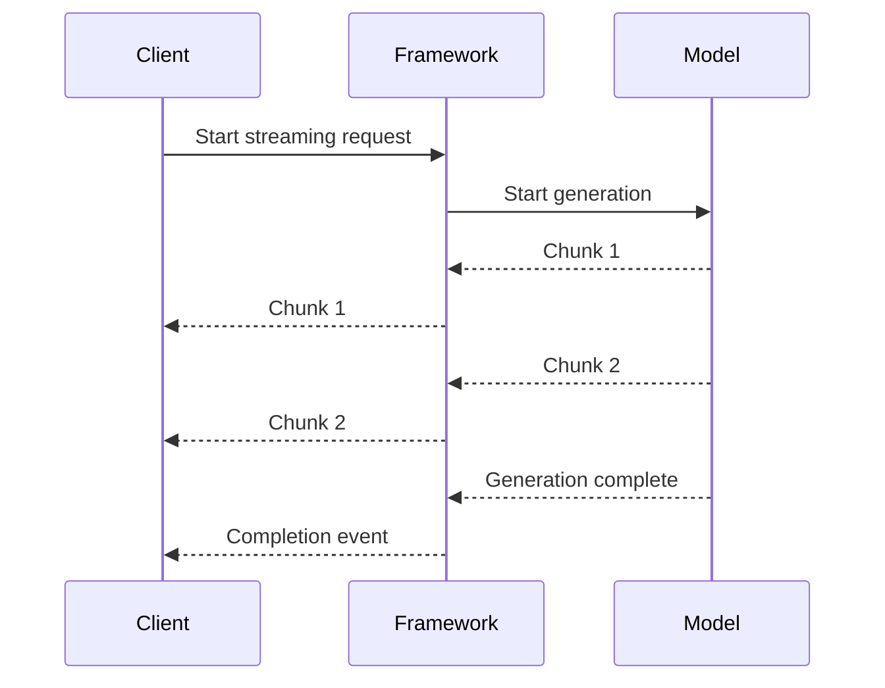

Streaming requires handling:

* Client disconnection.
* Partial output.
* Cancellation.
* Model errors after streaming starts.
* Saving incomplete responses.
* Timeouts.
* Backpressure.

FastAPI, Flask, and Express can all support streaming, but the implementation style differs.

---

# Part VI — Middleware and Cross-Cutting Concerns

## 41. Common Middleware Responsibilities

Middleware is suitable for concerns shared across many routes:

* Request IDs.
* Authentication.
* CORS.
* Logging.
* Timing.
* Compression.
* Rate limiting.
* Security headers.
* Error conversion.


Do not place route-specific business rules in global middleware.

---

## 42. CORS

A frontend and backend may use different origins:

```text
Frontend: http://localhost:3000
Backend:  http://localhost:8000
```

The backend must explicitly allow trusted frontend origins.

Production rules should avoid allowing every origin unless the API is intentionally public.

CORS does not replace:

* Authentication.
* Authorization.
* HTTPS.
* Input validation.

---

## 43. Authentication and Authorization

Authentication asks:

```text
Who is making the request?
```

Authorization asks:

```text
What is that user allowed to do?
```

A route must verify both when accessing private data.

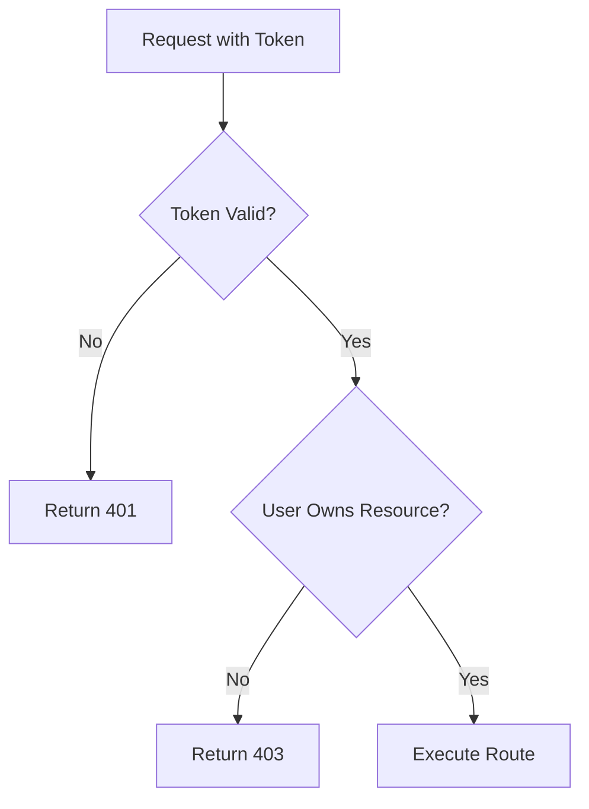

---

## 44. Error Response Format

Use a consistent response structure:

```json
{
  "error": {
    "code": "model_timeout",
    "message": "The AI service did not respond in time.",
    "request_id": "req_42"
  }
}
```

Avoid returning:

* Stack traces.
* SQL queries.
* Internal file paths.
* API keys.
* Raw provider errors.
* Sensitive prompts.
* Private user data.

---

## 45. Timeout Handling

Every external request should have a timeout.

Examples:

* Model provider.
* Vector database.
* PostgreSQL.
* Object storage.
* Agent tool.
* External website.

```text
Route timeout
    ↓
Service timeout
    ↓
Provider timeout
```

The limits must be coordinated.

A reverse proxy with a 30-second timeout will terminate the request even if the application waits for 60 seconds.

---

## 46. Background Jobs

Long-running tasks should not always remain inside one HTTP request.

Examples:

* Processing a large PDF.
* Transcribing a long audio file.
* Generating thousands of embeddings.
* Evaluating a dataset.
* Running a complex report.
* Fine-tuning a model.

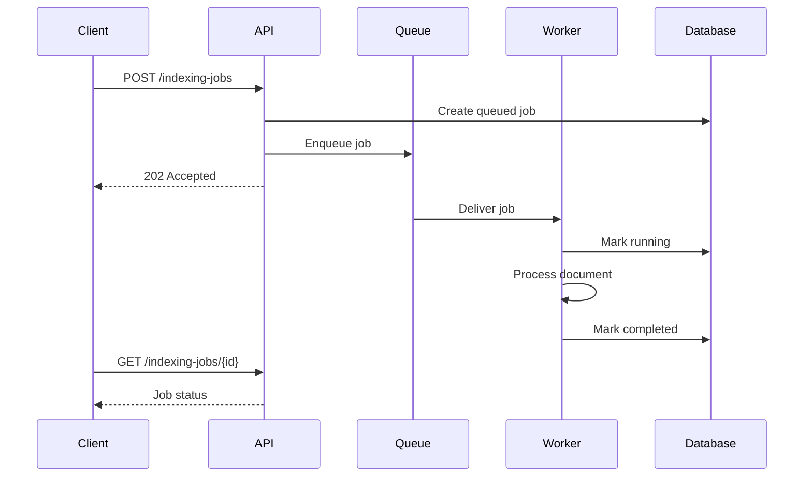

---

# Part VII — Testing

## 47. FastAPI Test

```python
from fastapi.testclient import TestClient

from app.main import app

client = TestClient(app)


def test_health_check() -> None:
    response = client.get("/health")

    assert response.status_code == 200
    assert response.json() == {
        "status": "ok",
    }


def test_chat_rejects_empty_message() -> None:
    response = client.post(
        "/api/v1/chat",
        json={
            "message": "",
        },
    )

    assert response.status_code == 422
```

---

## 48. Flask Test

```python
def test_health_check(client):
    response = client.get("/health")

    assert response.status_code == 200
    assert response.get_json() == {
        "status": "ok",
    }


def test_chat_rejects_empty_message(client):
    response = client.post(
        "/api/v1/chat",
        json={
            "message": "",
        },
    )

    assert response.status_code == 422
```

---

## 49. Express Test Concept

```javascript
import request from "supertest";

import { app } from "../src/app.js";

describe("GET /health", () => {
  it("returns the health status", async () => {
    const response = await request(app)
      .get("/health")
      .expect(200);

    expect(response.body).toEqual({
      status: "ok",
    });
  });
});

describe("POST /api/v1/chat", () => {
  it("rejects an empty message", async () => {
    await request(app)
      .post("/api/v1/chat")
      .send({
        message: "",
      })
      .expect(422);
  });
});
```

---

## 50. Important API Tests

Test at least:

* Valid requests.
* Missing fields.
* Invalid types.
* Empty input.
* Oversized input.
* Unauthorized access.
* Forbidden resources.
* Unknown resources.
* Database errors.
* Model timeouts.
* Provider rate limits.
* Invalid model output.
* Unsupported file types.
* Duplicate jobs.
* Client cancellation.

---

# Part VIII — Deployment

## 51. Environment Variables

Example:

```env
APP_ENV=development
PORT=8000
DATABASE_URL=postgresql://app:password@db:5432/ai_app
AI_API_KEY=replace-with-a-secret
AI_MODEL=example-model
LOG_LEVEL=INFO
```

Never commit the real environment file.

Commit an example:

```env
APP_ENV=development
PORT=
DATABASE_URL=
AI_API_KEY=
AI_MODEL=
LOG_LEVEL=
```

---

## 52. FastAPI Dockerfile

```dockerfile
FROM python:3.12-slim

WORKDIR /app

COPY requirements.txt .

RUN pip install --no-cache-dir -r requirements.txt

COPY . .

EXPOSE 8000

CMD [
  "uvicorn",
  "app.main:app",
  "--host",
  "0.0.0.0",
  "--port",
  "8000"
]
```

---

## 53. Flask Dockerfile

```dockerfile
FROM python:3.12-slim

WORKDIR /app

COPY requirements.txt .

RUN pip install --no-cache-dir -r requirements.txt

COPY . .

EXPOSE 5000

CMD [
  "gunicorn",
  "--bind",
  "0.0.0.0:5000",
  "wsgi:app"
]
```

The development server should not be treated as the full production deployment architecture.

---

## 54. Express Dockerfile

```dockerfile
FROM node:22-slim

WORKDIR /app

COPY package*.json ./

RUN npm ci --omit=dev

COPY . .

EXPOSE 3000

CMD [
  "node",
  "src/server.js"
]
```

For TypeScript, compile the project before running the production JavaScript output.

---

## 55. Production Architecture

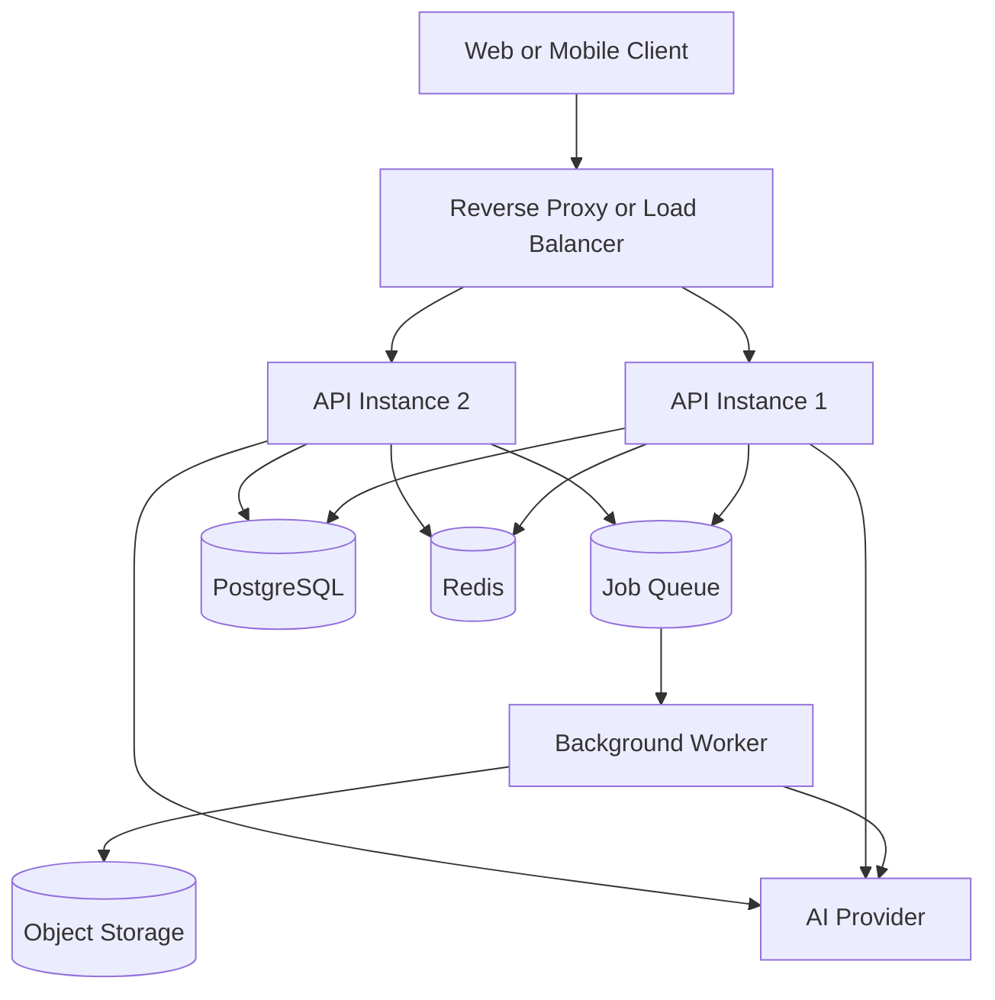

A framework is one component of the production system. It does not automatically provide:

* A database.
* A queue.
* Monitoring.
* Backups.
* Authentication design.
* Model safety.
* Cost control.
* Reliable deployment.

---

# Part IX — Common Mistakes

## 56. Putting All Logic in One File

A beginner application may start with one file, but production systems should separate concerns.

Poor:

```text
main.py
- 4,000 lines
- Routes
- SQL
- Prompts
- Model calls
- Authentication
- File processing
```

Better:

```text
routes/
services/
repositories/
schemas/
models/
core/
tests/
```

---

## 57. No Request Validation

Without validation, a user may send:

```json
{
  "message": null,
  "temperature": 99,
  "top_k": -5
}
```

Validation should happen before:

* Model calls.
* Database writes.
* Retrieval.
* File processing.
* Agent tool execution.

---

## 58. Calling the AI Provider Directly in Every Route

Poor:

```text
Route A → provider SDK
Route B → provider SDK
Route C → provider SDK
```

Better:

```text
Routes
   ↓
Model Gateway
   ↓
Selected Provider
```

A model gateway centralizes:

* API credentials.
* Model selection.
* Timeouts.
* Retries.
* Logging.
* Cost tracking.
* Response normalization.

---

## 59. No Global Error Handling

Uncaught errors may produce:

* Inconsistent responses.
* Exposed stack traces.
* Missing request IDs.
* Unclear frontend behavior.

Use framework-level error handling to produce consistent responses.

---

## 60. Blocking the Server

A route may perform CPU-heavy work such as:

* Large image processing.
* Local model inference.
* Video conversion.
* PDF extraction.
* Dataset evaluation.

Move expensive work to:

* Background workers.
* Separate processes.
* Specialized services.
* Task queues.

Async code does not automatically make CPU-heavy work non-blocking.

---

## 61. No Timeout or Cancellation

Model requests may continue even after the user closes the page.

Production systems should consider:

* Request cancellation.
* Provider timeout.
* Streaming disconnection.
* Worker cancellation.
* Cleanup of partial state.

---

## 62. Hardcoded Secrets

Never place API keys directly in:

* Python files.
* JavaScript files.
* Dockerfiles.
* Git repositories.
* Frontend bundles.
* Error messages.

Use secret-management and environment configuration.

---

## 63. Returning Raw Model Output

A model may return:

* Invalid JSON.
* Missing fields.
* Unexpected markdown.
* Unsupported tool calls.
* Unsafe URLs.
* Incorrect data types.

Validate the output before returning it to the client or executing a tool.

---

## 64. Framework Selection by Popularity Alone

The best framework depends on:

* Team language.
* Existing systems.
* Validation needs.
* Deployment environment.
* Performance profile.
* Available libraries.
* Maintenance requirements.

A small, well-designed service is better than a fashionable but poorly understood stack.

---

# Part X — Debugging

## 65. Debugging Workflow

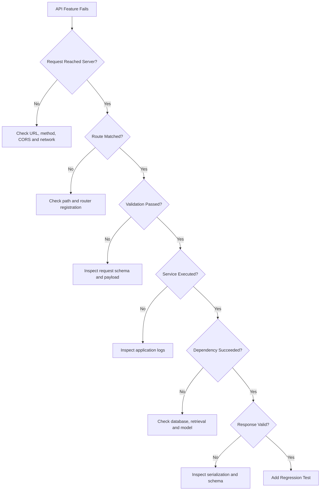

---

## 66. Useful Debugging Information

Record:

* Request ID.
* HTTP method.
* Route.
* Status code.
* Authenticated user ID.
* Duration.
* Database duration.
* Retrieval duration.
* Model duration.
* Model name.
* Token usage.
* Error type.
* Retry count.

Do not record secret keys or unnecessary private content.

---

## 67. Example Production Failure

### Symptom

The chat endpoint works locally but returns `500` in production.

### Possible Causes

* Missing environment variable.
* Incorrect database URL.
* Model API key not configured.
* Production dependency missing.
* Incorrect module import path.
* Database migration not applied.
* File path depends on the local machine.
* Reverse-proxy configuration is incorrect.

### Investigation

1. Locate the request ID.
2. Inspect the application log.
3. Verify environment configuration.
4. Verify database connectivity.
5. verify the deployed commit.
6. Reproduce using the production container.
7. Add a startup configuration check.
8. Add a regression test.

---

# Part XI — Practical Mini Project

## 68. Project: AI Summarization API

Build the same API using one framework:

* FastAPI.
* Flask.
* Express with JavaScript or TypeScript.

### Required Endpoints

```text
GET  /health
POST /api/v1/summaries
GET  /api/v1/summaries/{summary_id}
```

### Request

```json
{
  "text": "Long text to summarize...",
  "max_sentences": 3,
  "language": "en"
}
```

### Response

```json
{
  "id": "summary_42",
  "status": "completed",
  "summary": "A concise summary.",
  "model": "example-model",
  "processing_time_ms": 820
}
```

---

## 69. Required Features

* Request validation.
* JSON response schema.
* Correct HTTP status codes.
* Model service abstraction.
* Database repository.
* Request ID.
* Structured logging.
* Error middleware or handlers.
* Model timeout.
* Environment variables.
* Unit tests.
* Dockerfile.
* README.

---

## 70. Project Flow

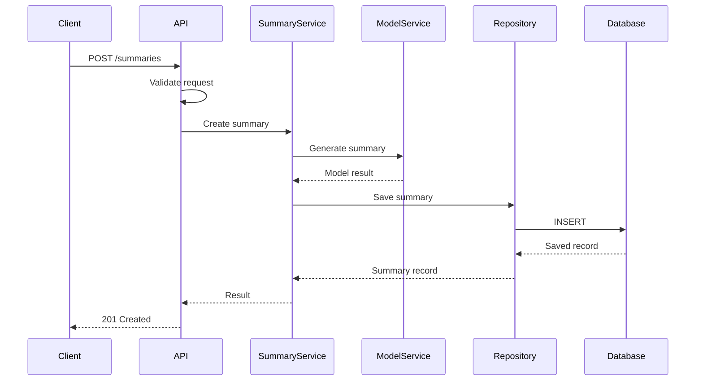

---

# Part XII — Practice Exercises

## 71. Exercise 1 — Compare the Frameworks

Write five sentences explaining:

* What FastAPI is.
* What Flask is.
* What Express is.
* Which framework you would choose.
* Why it matches your current project.

---

## 72. Exercise 2 — Build a Health Route

Implement:

```text
GET /health
```

Expected response:

```json
{
  "status": "ok"
}
```

Test the endpoint.

---

## 73. Exercise 3 — Build a Chat Route

Implement:

```text
POST /api/v1/chat
```

Request:

```json
{
  "message": "Explain vector search."
}
```

Response:

```json
{
  "answer": "Vector search compares numerical representations of meaning.",
  "model": "demo-model"
}
```

Handle:

* Missing body.
* Empty message.
* Oversized message.
* Invalid content type.
* Model timeout.

---

## 74. Exercise 4 — Add Middleware

Create middleware that records:

* Request ID.
* Method.
* Path.
* Status code.
* Duration.

Example log:

```json
{
  "request_id": "req_42",
  "method": "POST",
  "path": "/api/v1/chat",
  "status_code": 200,
  "duration_ms": 842
}
```

---

## 75. Exercise 5 — Separate the Layers

Refactor one route into:

```text
Route
Service
Repository
Schema
```

Explain the responsibility of each file.

---

## 76. Exercise 6 — Add a Failure Test

Mock the model service so it raises a timeout.

Expected response:

```http
503 Service Unavailable
```

```json
{
  "error": {
    "code": "model_timeout",
    "message": "The AI service did not respond in time."
  }
}
```

---

## 77. Exercise 7 — Framework Comparison Demo

Implement the same health and chat endpoints in:

* FastAPI.
* Flask.
* Express.

Compare:

* Number of required files.
* Validation approach.
* Error handling.
* Testing setup.
* Generated documentation.
* Code readability.

---

# Part XIII — Completion Checklist

## 78. Framework Knowledge

* [ ] I can explain what a backend framework does.
* [ ] I understand the differences between FastAPI, Flask, and Express.
* [ ] I can select a framework based on language and project requirements.
* [ ] I understand routes and middleware.
* [ ] I understand the request lifecycle.

## 79. API Implementation

* [ ] I can create a health endpoint.
* [ ] I can create a POST endpoint.
* [ ] I can accept JSON input.
* [ ] I can use path and query parameters.
* [ ] I can validate request data.
* [ ] I can return correct status codes.
* [ ] I can create consistent error responses.

## 80. AI Engineering

* [ ] I can connect a route to a model service.
* [ ] I can design a RAG endpoint.
* [ ] I can design an agent-execution endpoint.
* [ ] I can handle file uploads.
* [ ] I understand streaming.
* [ ] I can validate model output.
* [ ] I can track model usage and latency.

## 81. Production Readiness

* [ ] I use environment variables.
* [ ] I configure timeouts.
* [ ] I separate routes from business logic.
* [ ] I use structured logging.
* [ ] I add authentication and authorization.
* [ ] I write automated tests.
* [ ] I use a production deployment process.
* [ ] I package the application with Docker.

---

## 82. Related Outcome

This lesson prepares the backend-framework foundation required before building production AI applications.

It supports later topics such as:

* LLM API integration.
* Prompt services.
* Embedding endpoints.
* RAG pipelines.
* Agent APIs.
* Tool execution.
* Multimodal uploads.
* Streaming responses.
* Background workers.
* Authentication.
* Monitoring.
* Deployment.

---

## 83. Related Project

Set up a minimal backend using FastAPI, Flask, or Express with:

* Git version control.
* REST endpoints.
* Request validation.
* Response schemas.
* PostgreSQL connection.
* One AI-related feature.
* Service and repository layers.
* Authentication.
* Error handling.
* Logging.
* Automated tests.
* Docker support.
* Complete documentation.

### Suggested Portfolio Description

> Built a production-oriented AI backend using FastAPI, Flask, or Express, including validated REST endpoints, modular service architecture, model integration, PostgreSQL persistence, authentication, structured errors, request tracing, automated tests, and Docker deployment.

---

## 84. Summary

FastAPI, Flask, and Express all solve the same core problem:

```text
Receive request
      ↓
Validate input
      ↓
Execute application logic
      ↓
Access database, retrieval, model, or tools
      ↓
Return an HTTP response
```

Their main differences are language, conventions, and included features.

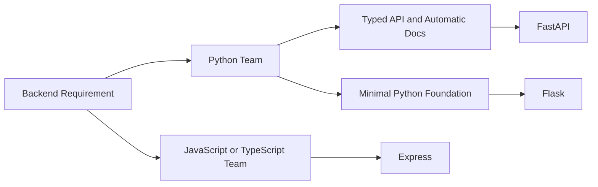

For many new Python AI APIs, FastAPI is a practical starting point because it combines type-based request declarations, validation, async route support, and generated OpenAPI documentation.

Flask is valuable when you want a smaller Python foundation and greater freedom to select application components.

Express is a strong choice when the project uses JavaScript or TypeScript across the frontend and backend and benefits from its routing and middleware model.

The framework itself is not the final skill. The real objective is learning to build a reliable request pipeline:

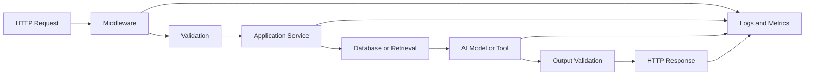

Choose one framework, build a small end-to-end API, test failure paths, and deploy it in a reproducible environment. Once you understand routes, middleware, validation, service layers, databases, model calls, and error handling in one framework, learning another framework becomes much easier.
