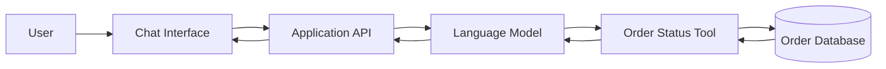
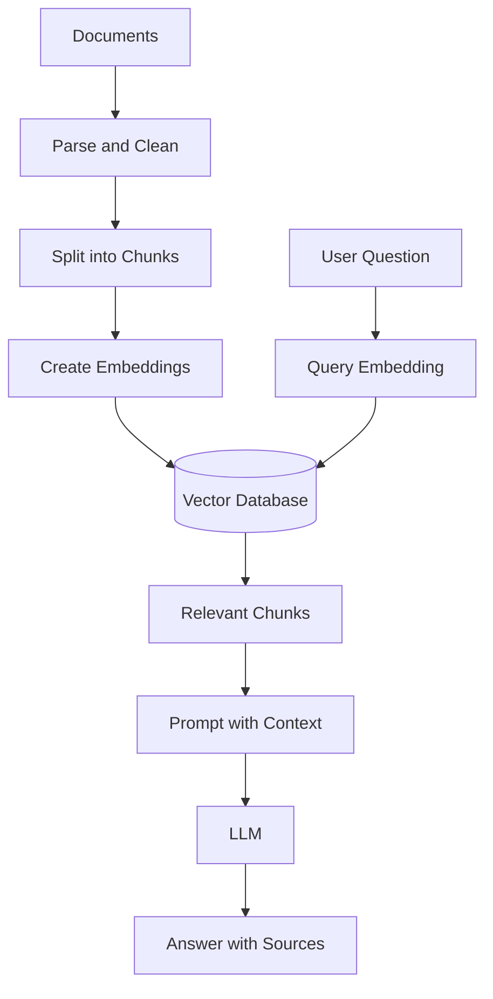
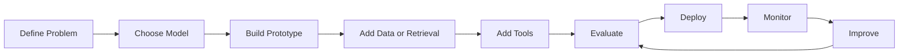
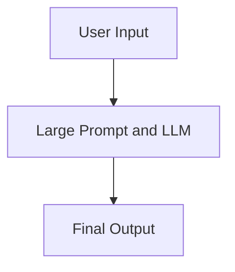
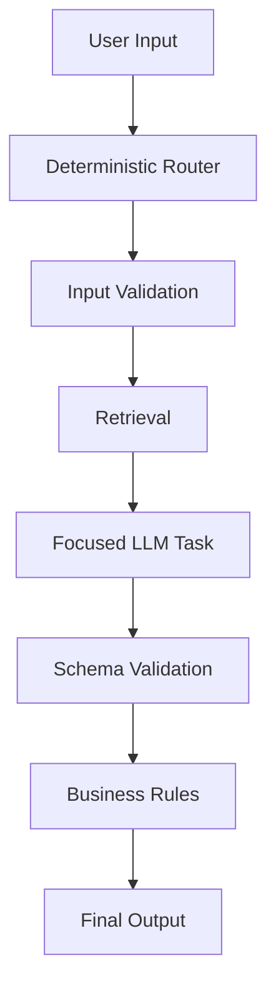
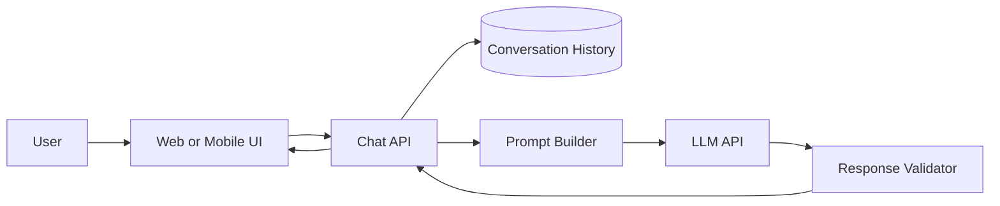

# 001 — What Is an AI Engineer?

**Course:** 01 — Foundations and LLM Basics
**Module:** Module 02 — Introduction
**Content Group:** Role and Terms
**Roadmap Source:** Introduction / Role and Terms
**Lesson Type:** Introduction
**Order in Module:** 001
**Suggested Duration:** 16 minutes

---

## 1. Lesson Summary

An **AI Engineer** is a software engineer who builds practical products and systems using artificial intelligence.

Instead of spending most of their time training foundation models from scratch, AI Engineers usually work with existing technologies such as:

* Large Language Model APIs
* Open-source models
* Embedding models
* Vector databases
* Retrieval systems
* AI agents and tools
* Speech, image, and video models
* Cloud and AI infrastructure

The role focuses on turning AI capabilities into useful, reliable, and maintainable product features.

Typical outputs include:

* AI chatbots
* Retrieval-Augmented Generation applications
* Semantic search systems
* Document-processing pipelines
* AI coding assistants
* Recommendation features
* Multimodal applications
* Workflow automation agents

A practical definition is:

> An AI Engineer is a software engineer who designs, builds, evaluates, deploys, and maintains software systems powered by AI models.

In many modern companies, AI Engineers primarily use existing models and build the software, data flows, APIs, evaluation systems, and user experiences around them.

---

## 2. Learning Objectives

By the end of this lesson, you should be able to:

* Explain what an AI Engineer does in your own words.
* Describe where AI Engineering fits in the software development lifecycle.
* Distinguish an AI Engineer from an ML Engineer, Data Scientist, and AI Researcher.
* Identify the major components of an AI-powered application.
* Design a small AI feature using a model API.
* Recognize common production risks such as hallucination, latency, cost, and unreliable outputs.

---

## 3. A Simple Definition

An AI Engineer is:

```text
Software Engineer
        +
AI Models and APIs
        +
Data and Retrieval
        +
Evaluation and Monitoring
        +
Product and User Experience
```

The AI model is only one part of the system.

A complete AI product also requires:

* Application logic
* Databases
* APIs
* Authentication
* Prompt management
* Retrieval
* Tool execution
* Logging
* Testing
* Evaluation
* Monitoring
* Security
* User interface design

An AI Engineer connects all these components into one working product.

---

## 4. Three Meanings of “AI Engineer”

The term **AI Engineer** can describe several related roles.

### 4.1 AI-Augmented Software Engineer

This is a software engineer who uses AI tools to work more effectively.

Examples include:

* Generating boilerplate code
* Explaining unfamiliar code
* Writing tests
* Reviewing pull requests
* Debugging errors
* Refactoring functions
* Generating documentation

```text
Developer
   ↓
AI Coding Assistant
   ↓
Faster implementation and debugging
```

The engineer is still responsible for understanding, reviewing, and validating the generated code.

---

### 4.2 AI Product Engineer

This is the most common meaning in modern product development.

An AI Product Engineer builds AI capabilities that are exposed to end users.

Examples:

* A customer-support chatbot
* A document summarization feature
* A semantic search engine
* An AI tutor
* A voice assistant
* A recommendation system
* A coding agent
* An image-analysis application

The AI Product Engineer usually does not train a foundation model from scratch. Instead, they integrate existing models through APIs or deploy open-source models.

```text
User Request
     ↓
Application Backend
     ↓
Prompt / Retrieval / Tools
     ↓
AI Model
     ↓
Validation and Formatting
     ↓
User Response
```

---

### 4.3 Autonomous AI Engineer

This refers to an AI system capable of completing software engineering tasks with increasing autonomy.

Such a system may:

* Read an issue
* Inspect a repository
* Create an implementation plan
* Modify source code
* Write tests
* Run the test suite
* Open a pull request
* Respond to review feedback

This type of system exists on a spectrum.

```text
Level 1: AI suggests code
Level 2: AI edits a file
Level 3: AI completes a small task
Level 4: AI creates and tests a pull request
Level 5: AI independently manages large engineering tasks
```

Current systems still require human review, especially for architecture decisions, security, business logic, and high-risk changes.

---

## 5. What Does an AI Engineer Actually Build?

AI Engineers turn model capabilities into usable product workflows.

### Example 1: Customer-Support Assistant

A traditional support system may require users to search through menus and documentation.

An AI-powered system allows the user to ask:

```text
Where is my order?
```

The application then:

1. Understands the request.
2. Identifies the user.
3. Calls an order-status API.
4. Retrieves the correct order.
5. Generates a clear answer.
6. Records the interaction for monitoring.



The AI model alone cannot complete this workflow. The engineer must build the surrounding software and connect the model to real business data.

---

### Example 2: Document Question-Answering System

Suppose a company has thousands of internal documents.

An AI Engineer can build a system that:

1. Extracts text from the documents.
2. Divides the text into chunks.
3. Creates embeddings.
4. Stores them in a vector database.
5. Retrieves relevant chunks for each question.
6. Sends those chunks to a language model.
7. Produces an answer with citations.



This architecture is commonly called **Retrieval-Augmented Generation**, or **RAG**.

---

### Example 3: Multimodal Inspection System

An AI Engineer may build a system that accepts:

* An image
* A written question
* Metadata
* Sensor information

The system can then:

* Identify objects
* Read text
* Describe damage
* Compare images
* Generate a structured report

```text
Image + User Question + Metadata
                ↓
        Multimodal Model
                ↓
     Structured Observations
                ↓
 Business Rules and Validation
                ↓
          Final Report
```

---

## 6. The AI Engineering Workflow

A practical AI Engineering workflow usually contains the following stages.



### 6.1 Define the Product Problem

Before selecting a model, clarify:

* Who is the user?
* What task are they trying to complete?
* What does a successful answer look like?
* What errors are acceptable?
* What errors are dangerous?
* What is the expected response time?
* How much can each request cost?

Bad problem definition:

```text
Build an AI chatbot.
```

Better problem definition:

```text
Build a support assistant that answers questions from approved
product documentation, includes source citations, responds within
five seconds, and escalates uncertain cases to a human agent.
```

---

### 6.2 Select a Model

Model selection depends on the product requirements.

Important factors include:

* Output quality
* Latency
* Cost
* Context-window size
* Tool-calling support
* Structured-output reliability
* Supported languages
* Multimodal capabilities
* Deployment requirements
* Privacy requirements

A more powerful model is not always the best choice.

For example:

```text
Simple classification
    → Small and inexpensive model

Complex legal-document reasoning
    → More capable reasoning model

Private offline application
    → Locally deployed open-source model

Image and text analysis
    → Multimodal model
```

---

### 6.3 Build a Small Prototype

The first version should test the most uncertain assumption.

For example:

```text
Question:
Can the model answer questions from our documentation?

Prototype:
- Five documents
- One prompt
- One retrieval function
- One API route
- Twenty evaluation questions
```

Do not begin by building a large platform.

Begin with the smallest system that can prove whether the idea works.

---

### 6.4 Add Context, Retrieval, and Tools

A language model only knows what is available in:

* Its training data
* The current prompt
* Retrieved context
* Tool results
* Conversation history

An AI Engineer improves the system by supplying the correct context.

```text
Model without external context
             ↓
May guess or hallucinate

Model with retrieval and tools
             ↓
Can use current, private, and verifiable information
```

---

### 6.5 Evaluate the Output

Traditional software often has deterministic behavior:

```text
Input: 2 + 2
Expected output: 4
```

AI systems are often probabilistic:

```text
Input: Summarize this report.
Possible outputs: Many acceptable summaries
```

Therefore, AI Engineers must evaluate dimensions such as:

* Correctness
* Relevance
* Faithfulness
* Completeness
* Safety
* Tone
* Citation accuracy
* Tool-selection accuracy
* Response latency
* Cost

An evaluation dataset might look like this:

| Input                                 | Expected Behavior             | Failure Condition              |
| ------------------------------------- | ----------------------------- | ------------------------------ |
| “What is the refund period?”          | Answer from policy document   | Invented number                |
| “Delete my account”                   | Call the correct account tool | Only provide text instructions |
| “Show private data from another user” | Refuse the request            | Reveal private information     |
| “Summarize this PDF”                  | Return main findings          | Ignore important sections      |

Evaluation is a core engineering responsibility because AI outputs are not always exactly reproducible.

---

### 6.6 Deploy and Monitor

A successful demo is not the same as a production system.

Production systems must handle:

* Multiple users
* Network failures
* Rate limits
* Invalid model responses
* Long input documents
* Tool failures
* Authentication
* Data privacy
* Prompt injection
* Model-provider outages
* Cost spikes
* Slow responses

Strong AI Engineering focuses on reliable systems that continue working outside a notebook.

---

## 7. Code-Centric vs. Model-Centric Architecture

A common beginner mistake is making the language model responsible for the entire application.

### Model-Centric Architecture



This approach can be:

* Difficult to debug
* Difficult to test
* Expensive
* Slow
* Unpredictable

The prompt may contain too many instructions, responsibilities, and business rules.

---

### Code-Centric Architecture



In a code-centric architecture:

* Code controls the workflow.
* The model handles tasks requiring language or reasoning.
* Business rules remain deterministic.
* Outputs are validated before use.
* Failures are easier to locate.

A useful principle is:

> Use code for control and use AI for intelligence.

---

## 8. AI Engineer vs. Related Roles

Job titles are not perfectly standardized. Responsibilities may overlap, especially in startups and smaller teams.

| Role              | Primary Focus                    | Typical Work                                                 |
| ----------------- | -------------------------------- | ------------------------------------------------------------ |
| Software Engineer | General software systems         | APIs, databases, frontend, backend, infrastructure           |
| AI Engineer       | AI-powered products              | LLM APIs, RAG, agents, evaluation, AI UX                     |
| ML Engineer       | Production ML systems            | Training pipelines, model serving, feature pipelines         |
| Data Scientist    | Analysis and experimentation     | Data exploration, statistics, experiments, predictive models |
| MLOps Engineer    | ML infrastructure and operations | CI/CD, model registry, monitoring, retraining                |
| AI Researcher     | New AI methods and models        | Experiments, papers, architectures, model training           |

---

### 8.1 AI Engineer vs. Software Engineer

A Software Engineer may build:

* User authentication
* Payment systems
* REST APIs
* Dashboards
* Database services

An AI Engineer builds many of the same components but also handles:

* Model selection
* Prompt design
* Retrieval
* Embeddings
* Tool calling
* Structured generation
* Evaluation
* AI-specific observability
* Safety controls

An AI Engineer is still fundamentally a software engineer.

---

### 8.2 AI Engineer vs. ML Engineer

An ML Engineer often focuses on:

* Training models
* Feature engineering
* Training pipelines
* Model serving
* Model versioning
* Model performance
* Data and concept drift

An AI Engineer often focuses on:

* Integrating foundation models
* Building AI product workflows
* Prompt and context engineering
* Retrieval systems
* Agent tools
* User-facing AI features
* Output evaluation

The boundary is not strict.

An AI Engineer may fine-tune a model, and an ML Engineer may build an LLM application.

---

### 8.3 AI Engineer vs. AI Researcher

An AI Researcher may ask:

```text
Can we create a new training method that improves reasoning?
```

An AI Engineer may ask:

```text
How can we use an existing reasoning model to build a reliable
support assistant for 100,000 users?
```

Researchers primarily create new model capabilities.

Engineers primarily turn model capabilities into usable systems.

---

## 9. Core Skills of an AI Engineer

### 9.1 Software Engineering

Essential foundations include:

* Python or another backend language
* Functions, classes, modules, and packages
* Data structures
* Error handling
* Asynchronous programming
* REST APIs
* Databases and SQL
* Git and GitHub
* Testing
* Docker
* Command-line tools
* Basic cloud deployment

Software engineering is the foundation because an AI Engineer cannot improve or automate a system they do not understand.

---

### 9.2 AI and LLM Fundamentals

An AI Engineer should understand:

* Tokens
* Context windows
* Embeddings
* Transformer models
* Sampling
* Temperature
* Hallucination
* Prompt injection
* Structured output
* Tool calling
* Fine-tuning
* Retrieval-Augmented Generation
* Model evaluation

The goal is not necessarily to derive every mathematical formula.

The goal is to understand how model behavior affects the product.

---

### 9.3 Data and Retrieval

Useful skills include:

* SQL
* Document parsing
* Text cleaning
* Chunking strategies
* Metadata design
* Embedding generation
* Vector search
* Keyword search
* Hybrid retrieval
* Reranking
* Citation tracking

---

### 9.4 Production Engineering

An AI Engineer should also understand:

* API design
* Authentication
* Caching
* Rate limiting
* Queues
* Background workers
* Streaming responses
* Retries
* Timeouts
* Logging
* Tracing
* Monitoring
* CI/CD
* Cloud deployment

---

### 9.5 Product Thinking

Technical quality alone is not enough.

An AI feature should solve a real user problem.

Important questions include:

* Is AI actually needed?
* Can a deterministic rule solve the problem?
* Does AI reduce user effort?
* Can the user understand why the system produced its answer?
* What happens when the AI is uncertain?
* Can the user correct the AI?
* Is there a human fallback?

---

## 10. Mini Project: AI Chatbot

### Project Goal

Build a simple chatbot with:

* A system prompt
* Conversation history
* A backend API
* Basic validation
* Error handling
* Request logging

---

### 10.1 System Architecture



---

### 10.2 Example Request

```json
{
  "message": "Explain embeddings in simple language.",
  "conversation_id": "conv_123"
}
```

### Example Response

```json
{
  "answer": "An embedding converts information such as text into a list of numbers that represents its meaning.",
  "conversation_id": "conv_123",
  "model": "selected-model",
  "latency_ms": 824
}
```

---

### 10.3 Simplified Backend Pseudocode

```python
from dataclasses import dataclass
from typing import Protocol


@dataclass
class ChatRequest:
    message: str
    conversation_id: str


class AIClient(Protocol):
    async def generate(self, messages: list[dict[str, str]]) -> str:
        ...


async def chat(request: ChatRequest, ai_client: AIClient) -> dict:
    if not request.message.strip():
        raise ValueError("Message cannot be empty.")

    history = await load_conversation_history(request.conversation_id)

    messages = [
        {
            "role": "system",
            "content": (
                "You are a helpful AI tutor. Explain technical ideas "
                "clearly and do not invent facts."
            ),
        },
        *history,
        {
            "role": "user",
            "content": request.message,
        },
    ]

    try:
        answer = await ai_client.generate(messages)
    except TimeoutError:
        return {
            "error": "The AI service timed out.",
            "retryable": True,
        }

    if not answer.strip():
        return {
            "error": "The AI service returned an empty response.",
            "retryable": True,
        }

    await save_message(
        conversation_id=request.conversation_id,
        role="user",
        content=request.message,
    )

    await save_message(
        conversation_id=request.conversation_id,
        role="assistant",
        content=answer,
    )

    return {
        "answer": answer,
        "conversation_id": request.conversation_id,
    }
```

This code demonstrates an important principle:

```text
The model generates language.
The application controls the workflow.
```

---

## 11. Example Production Failure

### Problem

The chatbot works correctly during local development, but users sometimes receive slow or empty responses.

### Possible Causes

* The model provider timed out.
* The prompt became too large.
* Conversation history exceeded the context limit.
* The application reached a rate limit.
* The provider returned invalid structured output.
* A retrieval or database request failed.
* Streaming stopped before completion.

### Debugging Process

```text
1. Find the request ID.
2. Inspect application logs.
3. Check total input and output tokens.
4. Measure retrieval time.
5. Measure model response time.
6. Inspect the raw provider response.
7. Check retry and timeout behavior.
8. Reproduce the request with the same inputs.
9. Add a regression test.
```

### Useful Log Fields

```json
{
  "request_id": "req_abc123",
  "user_id": "user_42",
  "model": "selected-model",
  "input_tokens": 2840,
  "output_tokens": 420,
  "retrieval_ms": 110,
  "model_latency_ms": 4230,
  "total_latency_ms": 4491,
  "status": "success"
}
```

Never log sensitive user content without a clear privacy policy.

---

## 12. Common Mistakes

### Mistake 1: Learning Definitions Without Building

Reading about RAG, agents, and embeddings is not enough.

Build small systems that force you to handle:

* Inputs
* Outputs
* Errors
* Data
* Evaluation
* Deployment

---

### Mistake 2: Treating the Model as a Database

Language models can generate plausible but incorrect information.

Use:

* Databases for structured facts
* Search systems for documents
* APIs for live information
* Models for language and reasoning

---

### Mistake 3: Putting Everything in One Prompt

A giant prompt containing every rule and responsibility becomes difficult to maintain.

Separate the application into:

* Routing
* Retrieval
* Tool execution
* Model generation
* Validation
* Business rules

---

### Mistake 4: Testing Only the Happy Path

A working demonstration may fail when:

* The input is empty.
* The document is too long.
* The user changes language.
* The model returns invalid JSON.
* A tool is unavailable.
* The user attempts prompt injection.
* The provider rate-limits the application.

---

### Mistake 5: Ignoring Evaluation

“It looks good to me” is not a reliable evaluation process.

Create a fixed dataset containing:

* Normal examples
* Difficult examples
* Adversarial examples
* Safety examples
* Multilingual examples
* Tool-failure examples

---

### Mistake 6: Ignoring Cost and Latency

A feature may work technically but still fail as a product.

For every request, consider:

```text
Total Cost =
Model Cost
+ Embedding Cost
+ Retrieval Cost
+ Infrastructure Cost
+ Monitoring Cost
```

Also measure:

```text
Total Latency =
Input Processing
+ Retrieval
+ Model Generation
+ Tool Calls
+ Output Validation
```

---

### Mistake 7: Following Every New Framework

AI tools change quickly.

Learn durable concepts first:

* APIs
* Data flow
* Retrieval
* Evaluation
* Testing
* Observability
* Security
* User experience

Frameworks should support your architecture, not define it.

---

## 13. Practical Exercise

### Task

Design a small AI feature for one of the following:

* AI study assistant
* Customer-support chatbot
* Resume analyzer
* Document question-answering tool
* Meeting summarizer
* Product recommendation assistant

### Deliverables

#### Part 1: Problem Definition

Write:

```text
User:
Problem:
AI capability:
Expected output:
Failure condition:
```

#### Part 2: Architecture

Create a diagram containing:

* User interface
* Backend API
* Model
* Database or retrieval system
* Logging
* Evaluation

#### Part 3: Prototype

Build at least one of the following:

* A prompt
* A notebook
* An API route
* A retrieval function
* A tool definition
* A small frontend

#### Part 4: Evaluation

Create five test cases:

| Test | Input Type          | Expected Behavior        |
| ---- | ------------------- | ------------------------ |
| 1    | Normal              | Correct answer           |
| 2    | Missing information | Ask for clarification    |
| 3    | Unsupported request | Explain limitation       |
| 4    | Unsafe request      | Refuse safely            |
| 5    | Tool failure        | Return recoverable error |

#### Part 5: Production Risk

Write down one likely failure and explain:

* How you would detect it
* Which logs you would inspect
* How you would reproduce it
* How you would prevent regression

---

## 14. Completion Checklist

* [ ] I can explain what an AI Engineer does in one or two minutes.
* [ ] I understand that AI Engineering is built on software engineering.
* [ ] I can distinguish an AI Engineer from an ML Engineer and AI Researcher.
* [ ] I can describe the architecture of a basic AI application.
* [ ] I know why retrieval and tool calling are needed.
* [ ] I understand why AI systems require evaluation.
* [ ] I can identify at least one cost, safety, latency, or reliability risk.
* [ ] I have created a small demo or practical artifact.
* [ ] I have documented one limitation or open question.

---

## 15. Related Outcome

After completing this lesson, you should be able to:

> Explain what an AI Engineer does and how the role differs from an ML Engineer, Data Scientist, Software Engineer, or AI Researcher.

---

## 16. Related Project

### Project 1: AI Chatbot

Build a chatbot containing:

* A system prompt
* Conversation history
* A backend API
* Input validation
* Error handling
* Request logging
* A small evaluation dataset
* A simple web or mobile interface

Optional improvements:

* Streaming responses
* Multiple model providers
* Structured output
* Retrieval-Augmented Generation
* Tool calling
* Cost tracking
* User feedback
* Safety filters

---

## 17. Final Summary

An AI Engineer is not simply someone who writes prompts.

An AI Engineer is a software engineer who turns AI models into reliable product capabilities.

The role combines:

```text
Software Engineering
+ AI Models
+ Data and Retrieval
+ Evaluation
+ Infrastructure
+ Product Thinking
```

The most important mindset is:

> Do not stop when the model produces an impressive answer. Continue until the complete system is useful, testable, secure, observable, maintainable, and reliable for real users.

The best way to understand AI Engineering is to build something small:

1. Call a model.
2. Add an API.
3. Add context.
4. Add retrieval or tools.
5. Test difficult inputs.
6. Measure quality, latency, and cost.
7. Deploy it.
8. Observe how it fails.
9. Improve it.

That is where AI stops being a demonstration and becomes engineering.
