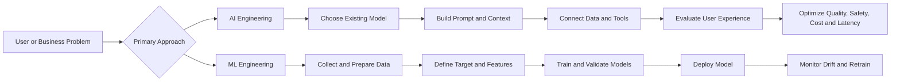
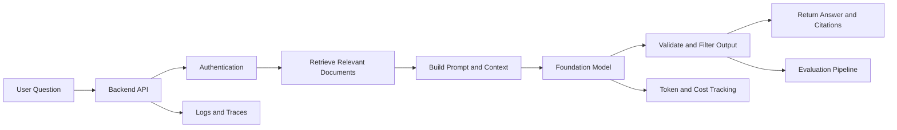
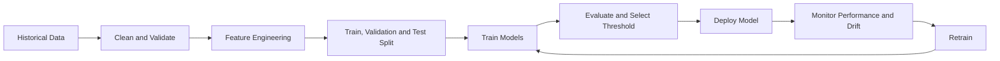
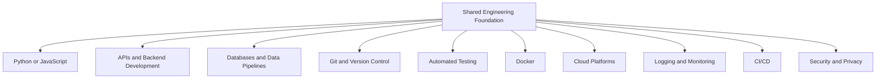
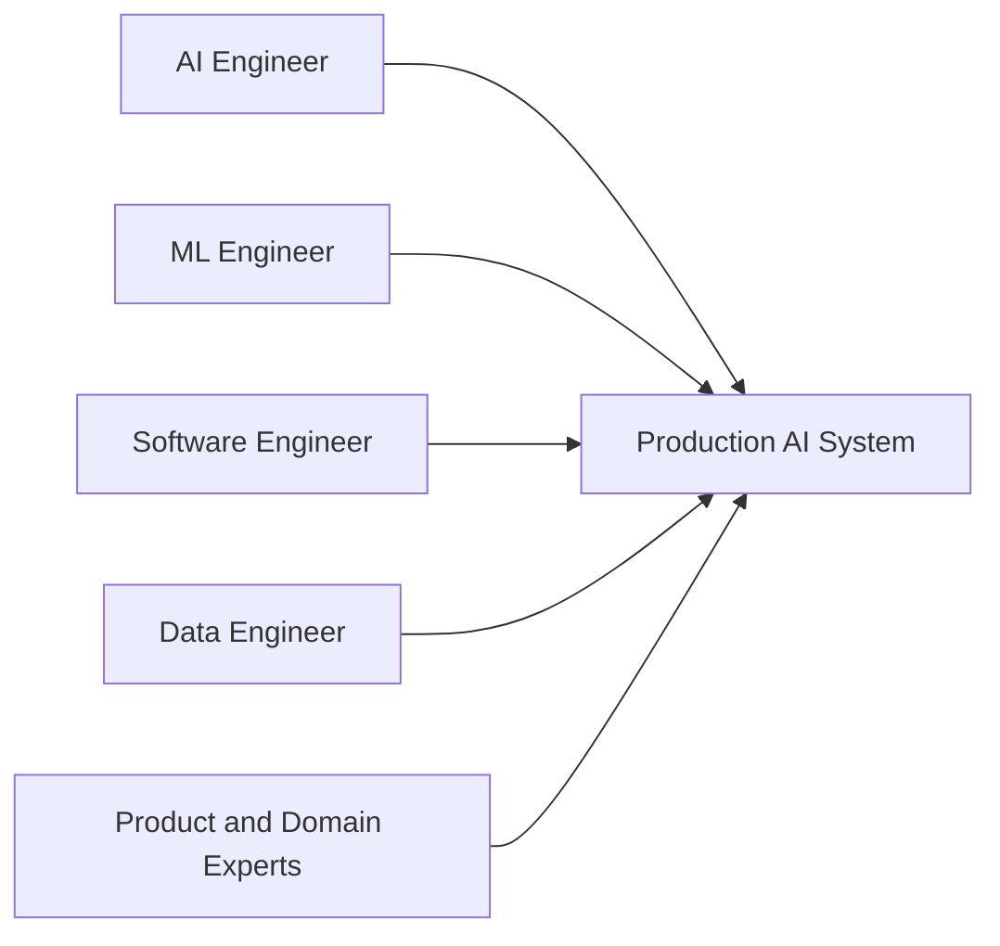
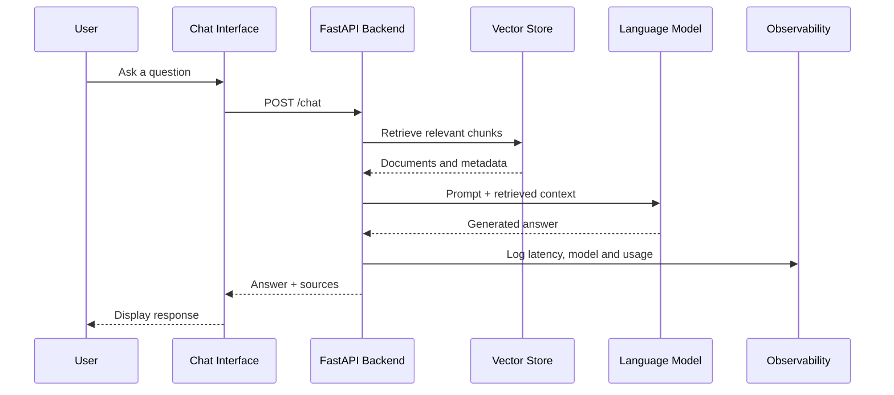
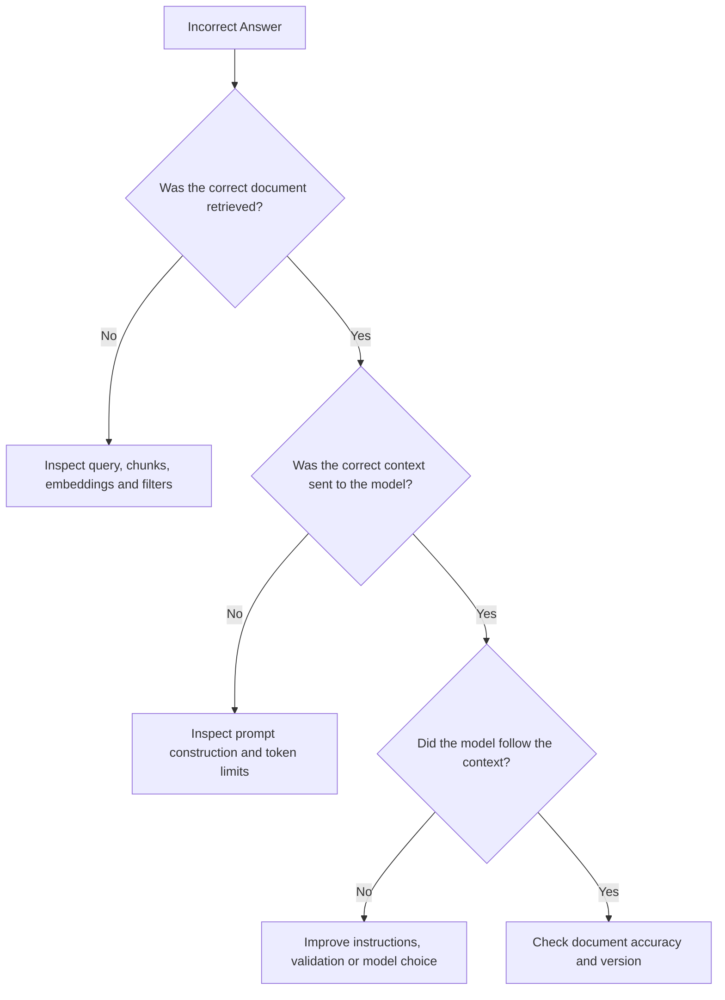

# 002 — AI Engineer vs. ML Engineer

**Course:** 01 — Foundations and LLM Basics
**Module:** Module 02 — Introduction
**Content Group:** Role and Terms
**Roadmap Source:** Introduction / Role and Terms
**Lesson Type:** Introduction
**Order in Module:** 002
**Suggested Duration:** 16 minutes

---

## 1. Lesson Summary

This lesson explains the difference between an **AI Engineer** and a **Machine Learning Engineer** in the context of modern AI development.

Both roles build intelligent systems and ship software to production. However, they usually begin from different starting points:

* An **AI Engineer** normally starts with an existing foundation model and builds a useful product around it.
* An **ML Engineer** normally starts with data and a measurable prediction problem, then trains, deploys, and maintains a model.

A useful mental model is:

> **AI Engineers build applications with models. ML Engineers build and operate model-driven systems.**

The boundary is not absolute. Job titles vary between companies, and many real positions combine responsibilities from software engineering, data engineering, machine learning, and generative AI. Therefore, always evaluate the actual job description rather than relying only on the title.

---

## 2. Learning Objectives

By the end of this lesson, you should be able to:

* Explain the difference between an AI Engineer and an ML Engineer in your own words.
* Identify the main responsibilities of each role.
* Compare their workflows, tools, skills, and production concerns.
* Recognize where the two roles overlap.
* Decide which path better matches your interests.
* Build a small AI application that demonstrates AI Engineering skills.
* Identify production risks related to quality, latency, cost, safety, and monitoring.

---

## 3. The Core Difference

### 3.1 AI Engineer

An AI Engineer builds software products using existing AI models as reusable building blocks.

The model may be accessed through:

* A hosted API
* A cloud AI platform
* A locally deployed open-source model
* A self-hosted inference server

Common examples include:

* Customer-support chatbots
* Document question-answering systems
* AI writing assistants
* Voice transcription applications
* Recommendation assistants
* AI agents that call external tools
* Multimodal applications that process text, images, audio, or video

The AI Engineer usually does not train a foundation model from scratch. Instead, the engineer focuses on:

* Model selection
* Prompt and context design
* Retrieval-Augmented Generation
* Tool integration
* Application architecture
* Evaluation
* Safety
* Latency
* Cost
* User experience
* Production reliability

Modern AI Engineering is often closer to **software engineering and product engineering** than to traditional model research.

---

### 3.2 Machine Learning Engineer

A Machine Learning Engineer builds, deploys, and operates machine learning systems.

The engineer may work on problems such as:

* Fraud detection
* Customer churn prediction
* Demand forecasting
* Credit-risk scoring
* Search ranking
* Recommendation systems
* Computer vision
* Anomaly detection
* Dynamic pricing

The ML Engineer usually focuses more deeply on:

* Data collection and preparation
* Feature engineering
* Training pipelines
* Validation strategies
* Model selection
* Hyperparameter optimization
* Deployment
* Model monitoring
* Data drift
* Model drift
* Retraining
* Scalable inference infrastructure

The goal is not merely to produce a model in a notebook. The goal is to create a reliable system that continues to perform correctly when real data changes.

---

## 4. Product-First vs. Model-First Thinking

One of the clearest ways to compare the roles is through their default starting point.



### AI Engineering is often product-first

The AI Engineer asks:

* What user problem should this feature solve?
* Can an existing model solve enough of the problem?
* What context does the model need?
* Should the system retrieve documents?
* Should the model call tools?
* How should the output appear in the interface?
* How can the result be evaluated?
* How can the system fail safely?

### ML Engineering is often model-and-data-first

The ML Engineer asks:

* What exactly should the system predict?
* What historical data is available?
* Is the target label reliable?
* Which features should be created?
* How should the data be split?
* Which metric represents business value?
* How should the model be deployed?
* How will drift and retraining be handled?

Neither approach is inherently better. They solve different classes of problems.

---

## 5. Side-by-Side Comparison

| Area                   | AI Engineer                                                | ML Engineer                                                       |
| ---------------------- | ---------------------------------------------------------- | ----------------------------------------------------------------- |
| Primary goal           | Build useful AI-powered product features                   | Build reliable machine learning systems                           |
| Typical starting point | Existing foundation or specialized model                   | Data, labels, features, and prediction target                     |
| Main focus             | Product integration and user experience                    | Model performance and production ML lifecycle                     |
| Model creation         | Usually uses pretrained models                             | Often trains or significantly adapts models                       |
| Common systems         | Chatbots, RAG, agents, copilots, multimodal apps           | Fraud detection, forecasting, ranking, vision, recommendations    |
| Data usage             | Context, retrieval, grounding, tool inputs                 | Training, validation, testing, feature engineering                |
| Evaluation             | Relevance, correctness, groundedness, safety, task success | Precision, recall, F1, AUC, RMSE, calibration, business impact    |
| Common iteration       | Prompt, retrieval, model, tool and UX changes              | Data, features, model architecture and hyperparameters            |
| Mathematics            | Functional understanding is often sufficient               | Stronger statistics, probability, linear algebra and optimization |
| Software engineering   | Essential                                                  | Essential                                                         |
| Production concerns    | Hallucination, latency, token cost, safety, tool failure   | Drift, skew, scalability, feature consistency, retraining         |
| Main output            | AI feature or application                                  | Production model and ML pipeline                                  |

---

## 6. What an AI Engineer Does

Consider a company that wants an internal assistant for answering employee questions.

An AI Engineer might perform the following workflow:

1. Select a suitable language model.
2. Create a basic chat interface.
3. Write a system prompt defining the assistant’s behavior.
4. Split company documents into smaller chunks.
5. Generate embeddings for those chunks.
6. Store them in a vector database.
7. Retrieve relevant chunks for each user question.
8. Add the retrieved context to the model request.
9. Require the model to answer only from approved sources.
10. Add citations to the answer.
11. Add authentication and access control.
12. Evaluate response quality.
13. Monitor latency, errors, cost, and user feedback.
14. Improve the system through repeated experiments.

This is not simply “calling an LLM API.”

A production AI Engineer must design the complete system surrounding the model.



### Typical AI Engineering tasks

* Comparing GPT, Claude, Gemini, or open-source models
* Building prompts and structured outputs
* Designing conversation memory
* Implementing RAG
* Connecting models to APIs and databases
* Building tool-calling agents
* Creating evaluation datasets
* Measuring answer quality
* Detecting hallucinations
* Reducing latency and cost
* Adding fallback behavior
* Protecting private data
* Integrating the feature into web or mobile products

AI Engineers frequently work with LLMs, vector databases, agents, tool calling, evaluation systems, and product APIs.

---

## 7. What an ML Engineer Does

Now consider a company that wants to detect fraudulent transactions.

A Machine Learning Engineer might perform the following workflow:

1. Define what counts as fraud.
2. Collect historical transaction data.
3. Validate the quality of the fraud labels.
4. Handle missing and inconsistent values.
5. Split data using time-aware validation.
6. Create a baseline model.
7. Engineer useful features.
8. Train and compare multiple models.
9. Select appropriate metrics.
10. Choose a classification threshold.
11. Test the system against recent unseen data.
12. Deploy the selected model.
13. Monitor prediction quality and drift.
14. Retrain when the data distribution changes.

Possible fraud features include:

* Number of recent transactions
* Transaction amount compared with user history
* Distance from the previous transaction
* Card country compared with shipping country
* Device reputation
* Unusual purchase time
* Failed payment attempts
* Velocity of account activity



### Typical ML Engineering tasks

* Building data and feature pipelines
* Training machine learning models
* Managing experiments
* Selecting evaluation metrics
* Preventing data leakage
* Handling class imbalance
* Optimizing inference performance
* Packaging models with Docker
* Deploying models through APIs
* Monitoring data drift
* Monitoring model performance
* Automating retraining
* Managing model versions
* Scaling inference infrastructure

---

## 8. A Day-in-the-Life Example

### 8.1 AI Engineer: Customer-Support Assistant

Alice is building a customer-support chatbot.

During the day, she may:

* Update the system prompt.
* Improve document chunking.
* Debug irrelevant retrieval results.
* Add an order-status API tool.
* Prevent the model from revealing personal data.
* Evaluate answers against a test dataset.
* Compare two models for quality and latency.
* Cache common answers.
* Run an A/B test on the new assistant.
* Review production traces where users reported bad answers.

Her main question is:

> Does this AI feature solve the user’s problem safely, quickly, and affordably?

---

### 8.2 ML Engineer: Fraud Detection

Mark is building a fraud-detection system.

During the day, he may:

* Investigate new transaction data.
* Repair a broken feature pipeline.
* Retrain a classification model.
* Analyze false positives.
* Tune the decision threshold.
* Check whether fraud patterns have changed.
* Monitor production model drift.
* Compare a new model against the current baseline.
* Optimize inference latency.
* Deploy a new model version through a controlled rollout.

His main question is:

> Does this model make reliable predictions on current production data?

The two engineers may use similar software tools, but they shape system behavior differently:

* Alice shapes behavior through **prompts, context, retrieval, tools, and application logic**.
* Mark shapes behavior through **data, features, training, objectives, and model optimization**.

---

## 9. Shared Foundations

The roles are different, but they share a large engineering foundation.



Both roles need to understand:

* Clean code
* Modular architecture
* API design
* Testing
* Debugging
* Databases
* Docker
* Cloud services
* Monitoring
* Security
* Production deployment
* Communication with product and business teams

A model that performs well but cannot be deployed is incomplete.

Similarly, an AI feature that looks impressive in a demo but is unsafe, slow, expensive, or unreliable is not production-ready.

---

## 10. Skill Comparison

### 10.1 AI Engineer Skills

#### Software and backend engineering

* Python, JavaScript, or TypeScript
* FastAPI, Flask, Express, or similar frameworks
* REST APIs and streaming responses
* SQL and NoSQL databases
* Authentication and authorization
* Background jobs and queues
* Docker and cloud deployment

#### Generative AI

* Foundation model capabilities
* Model selection
* Prompt engineering
* Structured output
* Function and tool calling
* Context-window management
* Conversation memory
* Multimodal input
* Fine-tuning fundamentals

#### Retrieval and context

* Embeddings
* Document chunking
* Vector databases
* Hybrid search
* Reranking
* Metadata filtering
* Citation generation
* Context compression

#### Evaluation and reliability

* Golden test datasets
* Human evaluation
* LLM-as-judge evaluation
* Groundedness checks
* Safety tests
* Prompt-injection tests
* Latency tracking
* Token and cost tracking

---

### 10.2 ML Engineer Skills

#### Mathematics and machine learning

* Statistics
* Probability
* Linear algebra
* Optimization
* Supervised learning
* Unsupervised learning
* Deep learning
* Model calibration
* Experimental design

#### Model development

* Scikit-learn
* PyTorch
* TensorFlow
* Feature engineering
* Hyperparameter tuning
* Cross-validation
* Imbalanced-data techniques
* Error analysis

#### MLOps and infrastructure

* Experiment tracking
* Model registries
* Feature stores
* Training pipelines
* Model serving
* Docker
* Kubernetes
* Airflow
* Spark
* Cloud ML platforms
* Drift monitoring
* Automated retraining

---

## 11. Where the Roles Overlap

The boundary between AI Engineering and ML Engineering is not fixed.

An AI Engineer may:

* Fine-tune an embedding model.
* Train a classifier for routing requests.
* Optimize a reranker.
* Evaluate a custom model.
* Deploy a self-hosted model.
* Build an inference pipeline.

An ML Engineer may:

* Integrate an LLM into an existing ML product.
* Build a RAG system.
* Use foundation models to label data.
* Create an agent for internal automation.
* Develop an LLM evaluation pipeline.
* Maintain generative AI infrastructure.

A mature AI product may need both roles.



The AI Engineer may own the user-facing AI experience, while the ML Engineer owns model training, inference infrastructure, or specialized prediction systems.

---

## 12. AI Engineer vs. AI Researcher

An AI Researcher focuses on discovering new methods or improving the fundamental capabilities of models.

| Role          | Main Question                                                                  |
| ------------- | ------------------------------------------------------------------------------ |
| AI Engineer   | How can we build a useful product with available models?                       |
| ML Engineer   | How can we train and operate a reliable model-based system?                    |
| AI Researcher | How can we create a better algorithm, model, architecture, or training method? |

AI Researchers may work on:

* New neural network architectures
* Training algorithms
* Reinforcement learning
* Model alignment
* Interpretability
* Multimodal learning
* Efficient inference
* New evaluation methods
* Publications and scientific experiments

The three roles can be viewed as a spectrum:

```text
Research and Algorithms
        |
        | AI Researcher
        |
        | ML Engineer
        |
        | AI Engineer
        |
Products and User Experience
```

This is a simplified spectrum, not a strict hierarchy.

---

## 13. How to Choose the Right Path

### Choose AI Engineering when you enjoy:

* Building applications
* Shipping features quickly
* Backend or full-stack development
* Working with APIs
* Designing user experiences
* Experimenting with LLMs
* Connecting models to tools and data
* Solving product and business problems
* Iterating through user feedback
* Balancing quality, latency, safety, and cost

### Choose ML Engineering when you enjoy:

* Mathematics and statistics
* Working deeply with datasets
* Training and comparing models
* Feature engineering
* Optimizing prediction performance
* Designing experiments
* Building scalable ML pipelines
* Monitoring drift
* Understanding model behavior
* Solving difficult modeling problems

### Ask yourself these questions

1. Do I prefer building products or optimizing models?
2. Do I enjoy mathematics and statistics?
3. Do I want to train models or integrate existing ones?
4. Do I prefer user-facing work or model infrastructure?
5. Do I enjoy rapid product iteration?
6. Do I enjoy long experimentation cycles?
7. Which type of failure do I find more interesting?

Examples:

* “The answer is not grounded in the document” is mainly an AI Engineering problem.
* “The validation score is high but production recall is falling” is mainly an ML Engineering problem.
* “The API cannot handle production traffic” is a shared engineering problem.

Do not select a career only because of a popular job title. Choose the type of work you want to perform repeatedly.

---

## 14. Practical Demo: AI Chatbot with RAG

### 14.1 Project Goal

Build a small chatbot that:

* Accepts a user question
* Searches a small document collection
* Adds relevant context to the prompt
* Calls a language model
* Returns an answer with sources
* Logs latency and token usage

### Architecture



---

### 14.2 Simplified API Route

```python
from time import perf_counter

from fastapi import FastAPI, HTTPException
from pydantic import BaseModel, Field

app = FastAPI(title="AI Engineering Demo")


class ChatRequest(BaseModel):
    question: str = Field(min_length=1, max_length=2_000)


class ChatResponse(BaseModel):
    answer: str
    sources: list[str]
    latency_ms: float


def retrieve_documents(question: str) -> list[dict[str, str]]:
    """Replace with a vector database or search service."""
    return [
        {
            "content": "Customers may request a refund within 30 days.",
            "source": "refund-policy.md",
        }
    ]


def call_language_model(question: str, context: str) -> str:
    """Replace with an actual model API or local inference server."""
    return (
        "Based on the refund policy, customers may request "
        "a refund within 30 days."
    )


@app.post("/chat", response_model=ChatResponse)
def chat(request: ChatRequest) -> ChatResponse:
    started_at = perf_counter()

    documents = retrieve_documents(request.question)
    if not documents:
        raise HTTPException(
            status_code=404,
            detail="No relevant documents were found.",
        )

    context = "\n\n".join(document["content"] for document in documents)
    answer = call_language_model(request.question, context)

    latency_ms = (perf_counter() - started_at) * 1_000

    return ChatResponse(
        answer=answer,
        sources=[document["source"] for document in documents],
        latency_ms=round(latency_ms, 2),
    )
```

This demo represents AI Engineering because the main work is not training a model. The main work is designing the system around the model.

---

## 15. Prompt Example

```text
You are a customer-support assistant.

Answer the user's question using only the supplied context.

Rules:
1. Do not invent company policies.
2. If the context is insufficient, say that you do not have enough information.
3. Do not reveal personal or confidential information.
4. Keep the answer under 150 words.
5. Mention the source document used.

Context:
{retrieved_context}

User question:
{question}
```

This prompt alone is not enough for production.

You also need:

* Retrieval quality checks
* Access control
* Input validation
* Output validation
* Evaluation
* Monitoring
* Error handling
* Safe fallback responses

---

## 16. Production Failure Example

### Problem

The chatbot gives a confident but incorrect refund policy.

### Possible causes

* The correct document was not retrieved.
* Document chunks were too large or too small.
* Metadata filtering selected an outdated policy.
* The prompt did not require grounded answers.
* The model ignored the provided context.
* The system mixed documents from different countries.
* The vector index was not updated.
* The user’s account did not have access to the relevant document.

### Debugging process



### Useful logs

```json
{
  "request_id": "req_123",
  "model": "selected-model",
  "question": "Can I return this product?",
  "retrieved_document_ids": [
    "refund-policy-v3"
  ],
  "retrieval_scores": [
    0.87
  ],
  "prompt_tokens": 1240,
  "completion_tokens": 102,
  "latency_ms": 1840,
  "estimated_cost_usd": 0.0042,
  "fallback_used": false
}
```

Never log sensitive user content without an appropriate privacy policy.

---

## 17. Common Misconceptions

### Misconception 1: AI Engineering is only prompt engineering

Prompt design is one component.

Real AI Engineering also includes:

* Backend services
* Retrieval
* Data pipelines
* Tool integration
* Security
* Testing
* Evaluation
* Monitoring
* Deployment
* Cost optimization
* User experience

---

### Misconception 2: AI Engineers do not need to understand models

They may not need to derive every mathematical equation, but they must understand models functionally.

They should understand:

* Context limits
* Tokenization
* Sampling
* Structured output
* Tool calling
* Embeddings
* Hallucination
* Model strengths and weaknesses
* Latency and cost trade-offs
* Fine-tuning limitations

---

### Misconception 3: ML Engineers only train models

Production ML Engineering includes much more than training:

* Data pipelines
* Model serving
* Monitoring
* Versioning
* Infrastructure
* Retraining
* Reliability
* Scalability

---

### Misconception 4: AI Engineering is always easier

AI Engineering may require less mathematical depth than some ML roles, but production AI systems are still difficult.

The engineer must manage probabilistic model behavior, rapidly changing tools, safety risks, privacy, latency, cost, and uncertain outputs.

---

### Misconception 5: Job titles are standardized

The same title can represent different work in different companies.

An “AI Engineer” may actually be:

* A backend engineer using LLM APIs
* An applied scientist
* An ML platform engineer
* A prompt and evaluation engineer
* A full-stack product engineer
* An inference engineer

Read the responsibilities, required skills, and expected deliverables.

---

## 18. Practical Exercises

### Exercise 1 — Five-line explanation

Without looking at the lesson, write five lines explaining:

1. What an AI Engineer builds
2. What an ML Engineer builds
3. Their main starting points
4. Their shared skills
5. The path you currently prefer

---

### Exercise 2 — Classify the task

Label each task as primarily:

* AI Engineering
* ML Engineering
* Shared

| Task                                          | Your Answer |
| --------------------------------------------- | ----------- |
| Build a document chatbot using an LLM API     |             |
| Train a fraud classifier from historical data |             |
| Add Docker deployment                         |             |
| Improve retrieval relevance                   |             |
| Detect model drift                            |             |
| Add an external calendar tool to an agent     |             |
| Create a feature pipeline                     |             |
| Monitor API latency                           |             |
| Choose a classification threshold             |             |
| Test prompt-injection attacks                 |             |

---

### Exercise 3 — Build a small demo

Create one of the following:

* A chatbot with a system prompt and chat history
* A document question-answering system
* A voice transcription cleaner
* A product-review summarizer
* A simple tool-calling assistant

Minimum requirements:

* One API route
* Input validation
* Model call or mocked model call
* Logging
* Error handling
* A README explaining the architecture

---

### Exercise 4 — Production risk analysis

Choose one possible failure:

* Hallucinated answer
* Slow response
* Excessive token cost
* Private-data exposure
* Irrelevant retrieval
* Tool execution failure

Document:

```text
Failure:
User impact:
Possible causes:
Logs required:
How to reproduce:
How to fix:
How to prevent regression:
```

---

## 19. Suggested Portfolio Artifact

### Project 1 — AI Chatbot

Build an AI chatbot with:

* System prompt
* Chat history
* Simple backend
* Streaming output
* Basic logging
* Model configuration
* Error handling
* Optional document retrieval

### Recommended repository structure

```text
ai-chatbot/
├── app/
│   ├── main.py
│   ├── api/
│   │   └── chat.py
│   ├── services/
│   │   ├── llm_service.py
│   │   └── retrieval_service.py
│   ├── schemas/
│   │   └── chat.py
│   ├── prompts/
│   │   └── system_prompt.txt
│   └── core/
│       ├── config.py
│       └── logging.py
├── tests/
│   ├── test_chat_api.py
│   └── test_prompt_behavior.py
├── Dockerfile
├── requirements.txt
├── .env.example
└── README.md
```

### Portfolio explanation

In an interview, you should be able to explain:

* Why you selected the model
* How conversation history is managed
* How you prevent prompt size from growing forever
* How errors are handled
* How response quality is evaluated
* How latency and cost are measured
* What safety limitations remain
* What you would improve for production

A useful project is more valuable than a project that only demonstrates a fashionable framework.

---

## 20. Common Mistakes

### Learning mistakes

* Memorizing role definitions without building anything
* Trying to learn AI Engineering and ML Engineering deeply at the same time
* Following job-title trends without reading job descriptions
* Watching tutorials without writing code
* Ignoring software engineering fundamentals
* Assuming API integration automatically creates a production-ready system

### Implementation mistakes

* Testing only the happy path
* Using one successful prompt as evidence of quality
* Skipping evaluation datasets
* Ignoring token cost
* Ignoring latency
* Logging private data
* Trusting model output without validation
* Allowing tools to execute unrestricted actions
* Failing to version prompts and models
* Not documenting assumptions and limitations

---

## 21. Completion Checklist

* [ ] I can explain **AI Engineer vs. ML Engineer** in one or two minutes.
* [ ] I understand product-first and model-first workflows.
* [ ] I can name at least five responsibilities of an AI Engineer.
* [ ] I can name at least five responsibilities of an ML Engineer.
* [ ] I understand where the roles overlap.
* [ ] I can explain how AI Engineers differ from AI Researchers.
* [ ] I have built a small practical demo.
* [ ] My demo includes basic error handling and logging.
* [ ] I have identified at least one production risk.
* [ ] I have documented assumptions and limitations.
* [ ] I understand which path currently matches my interests.

---

## 22. Key Takeaways

1. **AI Engineers usually build products around existing models.**

2. **ML Engineers usually build, deploy, and maintain trained machine learning models and pipelines.**

3. **AI Engineering is commonly closer to software and product engineering.**

4. **ML Engineering commonly requires deeper knowledge of statistics, data, training, and model behavior.**

5. **Both roles require strong software engineering skills.**

6. **The boundaries between the roles are blurry in real companies.**

7. **Job responsibilities are more informative than job titles.**

8. **The best way to understand either role is to build an end-to-end project.**

---

## 23. Final Summary

An **AI Engineer** takes models, data, prompts, retrieval systems, tools, APIs, and user interfaces and combines them into a useful AI product.

A **Machine Learning Engineer** takes data, features, algorithms, training pipelines, deployment infrastructure, and monitoring systems and combines them into a reliable machine learning system.

Both roles create production AI, but they usually control different parts of the system:

```text
AI Engineer
Existing model
    + context
    + retrieval
    + tools
    + application logic
    + UX
    = AI-powered product

ML Engineer
Data
    + features
    + training
    + evaluation
    + deployment
    + monitoring
    = Production ML system
```

Do not stop at understanding the definitions.

Turn this lesson into:

* A prompt
* An API route
* A RAG workflow
* An agent tool
* A model pipeline
* A production checklist
* A portfolio project

Knowledge becomes valuable when it is connected to a system you can build, test, explain, and improve.
