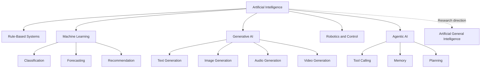
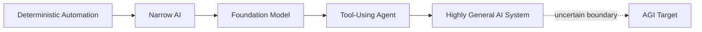
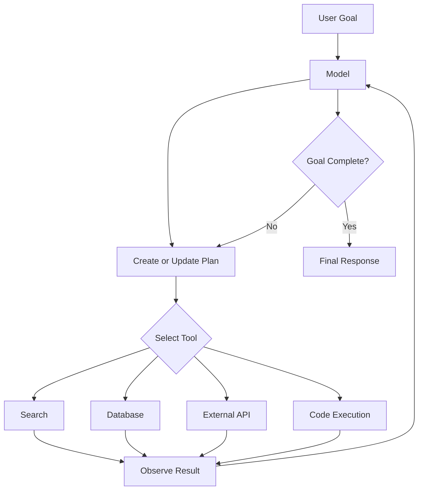
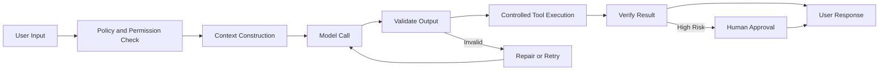
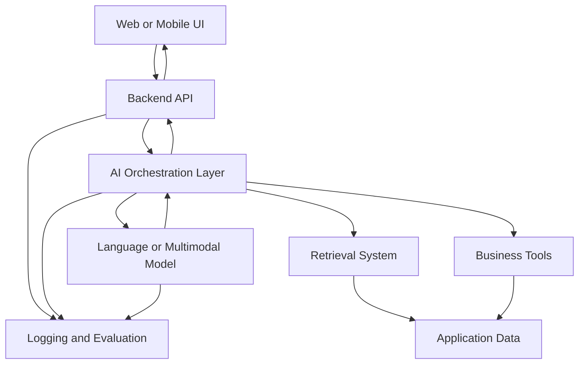
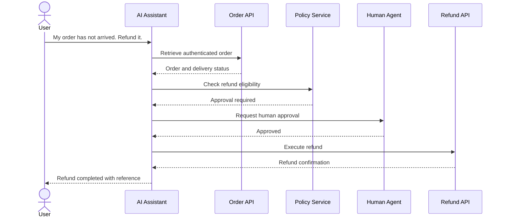
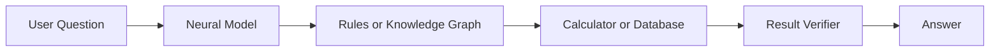

# 003 — AI vs AGI

**Course:** 01 — Foundations and LLM Basics
**Module:** Module 02 — Introduction
**Content Group:** Roles and Terms
**Roadmap Source:** Introduction / Roles and Terms
**Lesson Type:** Introduction
**Order in Module:** 003
**Suggested Duration:** 16 minutes

---

## 1. Lesson Summary

This lesson explains the difference between **Artificial Intelligence (AI)** and **Artificial General Intelligence (AGI)** from the perspective of a modern AI Engineer.

AI is a broad category covering machine-based systems that generate outputs such as predictions, recommendations, decisions, text, images, or actions. These systems normally operate according to objectives, data, tools, and constraints defined by humans.

AGI is a proposed category of AI with broad, transferable intelligence. Rather than performing only one task or following a narrowly defined workflow, an AGI system would be expected to learn, reason, adapt, and solve unfamiliar problems across many domains.

There is no single universally accepted AGI definition or test. Different organizations emphasize different properties, including breadth of capability, human-level performance, autonomy, economic usefulness, and the ability to learn new tasks. Recent research therefore treats AGI as a multidimensional spectrum rather than a simple yes-or-no milestone.

For an AI Engineer, the most important practical lesson is:

> Do not build a production system as though the model were an AGI.

A capable language model may appear intelligent, but it still requires prompts, context, retrieval, tools, validation, monitoring, permissions, and human supervision.

---

## 2. Learning Objectives

By the end of this lesson, you should be able to:

* Explain AI and AGI in your own words.
* Distinguish narrow AI, generative AI, agentic AI, and AGI.
* Explain why a powerful chatbot is not automatically an AGI.
* Identify where current AI models succeed and where they remain unreliable.
* Connect AI-versus-AGI concepts to prompts, APIs, RAG systems, tools, agents, evaluation, safety, and user experience.
* Build a small AI feature without assuming that the model can independently understand every situation.
* Document at least one limitation, failure mode, or open research question.

---

## 3. What Is Artificial Intelligence?

Artificial Intelligence is the broad field of creating computer systems that perform tasks associated with intelligent behavior.

An AI system may:

* Classify an image.
* Detect fraudulent transactions.
* Recommend products.
* Translate text.
* Generate an answer.
* Summarize a document.
* Predict equipment failure.
* Control a robot.
* Select and call software tools.

A useful high-level definition is:

> AI is a machine-based system that produces predictions, recommendations, decisions, content, or actions for human-defined objectives.

### Examples of Current AI Systems

| AI system                 | Primary task                              |
| ------------------------- | ----------------------------------------- |
| Spam filter               | Classify an email as spam or legitimate   |
| Recommendation engine     | Rank products, videos, or articles        |
| Object detector           | Locate objects inside an image            |
| Translation model         | Convert text from one language to another |
| Large language model      | Generate and transform language           |
| Speech recognition system | Convert audio into text                   |
| Fraud detection model     | Identify suspicious transactions          |
| Coding assistant          | Generate, explain, or modify source code  |

Most production AI systems operate within a defined application, data environment, permission boundary, and evaluation process.

---

## 4. What Is Artificial General Intelligence?

Artificial General Intelligence refers to a proposed AI system with broad and transferable intellectual capability.

An AGI system would be expected to:

* Perform well across many different domains.
* Learn unfamiliar tasks without extensive task-specific retraining.
* Transfer knowledge from one problem to another.
* Adapt when the environment changes.
* Plan over long time horizons.
* Reason through novel situations.
* Recognize when it lacks information.
* Use tools, memory, perception, and feedback coherently.
* Improve its strategy through experience.

One influential research framework evaluates progress toward AGI through two major dimensions:

1. **Performance:** How capable is the system?
2. **Generality:** Across how many tasks and domains can it apply that capability?

The same framework treats autonomy as a separate deployment concern: a system can be highly capable without being allowed to operate independently.

### Important Qualification

AGI is not currently a universally verified product category with a single accepted benchmark.

Organizations and researchers use different definitions. For example, some definitions emphasize general superiority over humans, while others emphasize performance across economically valuable work or broad cognitive faculties. The lack of a standard definition is one reason AGI claims must be examined carefully.

---

## 5. AI vs AGI

| Dimension            | Current AI systems                                              | Proposed AGI system                                            |
| -------------------- | --------------------------------------------------------------- | -------------------------------------------------------------- |
| Scope                | Usually optimized for defined tasks or workflows                | Capable across a broad range of domains                        |
| Learning             | Primarily trained before deployment, with limited adaptation    | Expected to acquire unfamiliar skills more independently       |
| Knowledge transfer   | Often inconsistent across domains                               | Strong transfer between different domains                      |
| Novel problems       | May fail outside familiar patterns                              | Expected to reason through unfamiliar situations               |
| Context              | Limited by prompts, context windows, memory, and connected data | Expected to build more persistent and general understanding    |
| Reliability          | Can be highly accurate but fails unpredictably                  | Expected to demonstrate robust performance across environments |
| Autonomy             | Controlled by application code and permissions                  | May support broad autonomous operation                         |
| Perception           | Usually separated into text, vision, audio, or sensor systems   | Expected to integrate multiple forms of perception             |
| Tool use             | Requires predefined tools and interfaces                        | Expected to select and use tools flexibly                      |
| Self-awareness       | Does not imply consciousness or genuine self-awareness          | Not required by every AGI definition                           |
| Production status    | Widely deployed                                                 | Definition and measurement remain unresolved                   |
| Engineering approach | Requires constraints, validation, and monitoring                | Still requires governance, even if highly capable              |

---

## 6. AI Is a Category, Not One Model

AI is an umbrella term containing many types of systems.



A system does not become AGI merely because it combines several AI components.

For example, an application may include:

* A language model.
* Image recognition.
* Web search.
* Long-term memory.
* Tool calling.
* A planning loop.

That application may be significantly more useful than a standalone model, but usefulness and architectural complexity are not sufficient evidence of AGI.

---

## 7. Narrow AI, General-Purpose AI, and AGI

The term **narrow AI** describes systems optimized for one task or a limited group of tasks.

Examples include:

* Face recognition.
* Credit scoring.
* Chess engines.
* Product recommendation.
* Medical-image classification.

Modern foundation models complicate this distinction because one model may perform many tasks:

* Answering questions.
* Writing code.
* Translating languages.
* Interpreting images.
* Summarizing documents.
* Calling tools.

It is therefore useful to think in terms of a capability spectrum.



The boundary between advanced general-purpose AI and AGI is debated because intelligence is not represented by one simple metric. Researchers may evaluate reasoning, memory, planning, perception, communication, creativity, adaptation, social cognition, or autonomy separately.

---

## 8. Generative AI Is Not the Same as AGI

Generative AI produces new content based on patterns learned during training.

It may generate:

* Text.
* Code.
* Images.
* Music.
* Speech.
* Video.
* Structured data.

A generative model can demonstrate broad knowledge and impressive reasoning while still having important limitations:

* It may invent unsupported information.
* It may misunderstand ambiguous requirements.
* It may behave differently when a prompt is slightly changed.
* It may not know whether its information is outdated.
* It may fail to follow long chains of instructions.
* It may not understand the real-world consequences of an action.
* It may be unable to access private or recent data without tools.
* It may express confidence without sufficient evidence.

Therefore:

```text
Generative capability ≠ general intelligence
Fluent language ≠ verified understanding
Correct answer once ≠ reliable production behavior
Tool calling ≠ unrestricted autonomy
Large context window ≠ persistent memory
```

---

## 9. Agentic AI Is Not Automatically AGI

An AI agent is usually a system that allows a model to:

1. Receive a goal.
2. Inspect the current state.
3. Select an action.
4. Call a tool.
5. Observe the result.
6. Continue until it reaches a stopping condition.



This creates useful behavior, but the agent remains constrained by:

* The model’s reasoning quality.
* The available tools.
* Tool descriptions.
* Application permissions.
* Context and memory.
* Error-handling logic.
* Budget limits.
* Maximum iteration count.
* Human approval requirements.

An agent can be autonomous within one workflow without possessing general intelligence.

---

## 10. Why the Distinction Matters to AI Engineers

An AI Engineer generally builds systems using existing models rather than attempting to create AGI from first principles.

The engineer’s job is to transform an uncertain model response into a dependable product experience.

### Incorrect Assumption

```text
The model is intelligent.
Therefore, it will understand the request and produce the correct result.
```

### Better Engineering Assumption

```text
The model is a probabilistic component.

It may:
- misunderstand the instruction,
- lack relevant information,
- produce invalid output,
- call the wrong tool,
- exceed the budget,
- or confidently return an incorrect answer.

The surrounding system must detect and control these failures.
```

### AI Engineering Responsibility



The application—not the model alone—must provide:

* Access control.
* Correct context.
* Trusted data.
* Output validation.
* Tool permissions.
* Retry logic.
* Observability.
* Cost limits.
* Safety policies.
* Human escalation.

---

## 11. AI Engineer Workflow

A modern AI Engineer commonly works with the following layers:



AGI is a research and strategic concept.

The AI Engineer’s immediate responsibility is to make the current system:

* Useful.
* Accurate enough for its intended task.
* Secure.
* Observable.
* Affordable.
* Testable.
* Recoverable when something fails.

---

## 12. Practical Example: Customer-Support Assistant

Suppose we want to build an AI customer-support assistant.

### User Request

```text
My order has not arrived. Can you refund it?
```

A model may produce a polite response, but it cannot safely process the refund based only on language generation.

The application must determine:

1. Is the user authenticated?
2. Which order is involved?
3. Has the order actually been delayed?
4. What is the store’s refund policy?
5. Is the refund amount within the model’s permission limit?
6. Does the action require human approval?
7. Was the payment provider successfully updated?
8. Should the user receive an email confirmation?

### Safe Processing Flow



The language model helps understand the request and explain the result.

The surrounding software guarantees that the action is valid.

---

## 13. Mini Demo: Constrained AI Chatbot

### Project Goal

Create a small chatbot with:

* A system prompt.
* Chat history.
* A backend API.
* A simple knowledge base.
* Structured output validation.
* A fallback response.

### Example System Prompt

```text
You are a technical-support assistant.

Rules:
1. Answer only from the supplied context.
2. Do not invent product policies.
3. When the context is insufficient, say that you cannot verify the answer.
4. Never claim that an external action was completed unless a tool result confirms it.
5. Return valid JSON matching the required schema.
```

### Expected Output Schema

```json
{
  "answer": "string",
  "confidence": "high | medium | low",
  "requires_human": false,
  "citations": []
}
```

### Simplified FastAPI Route

```python
from typing import Literal

from fastapi import FastAPI, HTTPException
from pydantic import BaseModel, Field, ValidationError

app = FastAPI()


class ChatRequest(BaseModel):
    message: str = Field(min_length=1, max_length=4000)
    history: list[dict[str, str]] = Field(default_factory=list)


class ChatResponse(BaseModel):
    answer: str
    confidence: Literal["high", "medium", "low"]
    requires_human: bool
    citations: list[str]


def retrieve_context(query: str) -> list[str]:
    """Replace with a vector database or search service."""
    documents = [
        "Refunds require confirmation from the payment service.",
        "The assistant must escalate refunds above $100.",
    ]

    return documents


def call_model(
    message: str,
    history: list[dict[str, str]],
    context: list[str],
) -> dict:
    """
    Replace this placeholder with an actual model API call.
    The model should be configured to return structured JSON.
    """
    return {
        "answer": (
            "I need to verify the order and refund eligibility "
            "before confirming a refund."
        ),
        "confidence": "medium",
        "requires_human": True,
        "citations": ["refund-policy"],
    }


@app.post("/chat", response_model=ChatResponse)
def chat(request: ChatRequest) -> ChatResponse:
    context = retrieve_context(request.message)

    try:
        raw_output = call_model(
            message=request.message,
            history=request.history,
            context=context,
        )

        response = ChatResponse.model_validate(raw_output)

    except ValidationError as error:
        raise HTTPException(
            status_code=502,
            detail="The model returned an invalid response.",
        ) from error

    if not context:
        return ChatResponse(
            answer="I cannot verify that from the available information.",
            confidence="low",
            requires_human=True,
            citations=[],
        )

    return response
```

### What This Demo Teaches

The model does not control the complete product.

The backend controls:

* Input limits.
* Retrieved context.
* Output format.
* Error behavior.
* Tool permissions.
* Human escalation.

That is practical AI engineering.

---

## 14. Ways Researchers Approach General Intelligence

AGI research includes several broad approaches.

### 14.1 Symbolic Approaches

Symbolic systems represent knowledge through:

* Rules.
* Logic.
* Concepts.
* Graphs.
* Programs.
* Explicit relationships.

#### Strengths

* Easier to inspect.
* Can support precise logical operations.
* Useful where rules must be followed exactly.

#### Limitations

* Difficult to encode the complexity of the real world.
* Often brittle when encountering unfamiliar situations.
* Knowledge engineering can become expensive.

---

### 14.2 Connectionist Approaches

Connectionist approaches use artificial neural networks that learn patterns from data.

Examples include:

* Deep neural networks.
* Transformers.
* Vision models.
* Speech models.
* Reinforcement-learning systems.

#### Strengths

* Learn complex patterns from large datasets.
* Strong performance in language, image, audio, and control tasks.
* Can generalize beyond explicitly programmed rules.

#### Limitations

* Internal reasoning can be difficult to interpret.
* Behavior depends heavily on training data.
* Models may fail outside the training distribution.
* Reliability is difficult to guarantee.

---

### 14.3 Hybrid or Neuro-Symbolic Approaches

Hybrid systems combine neural models with explicit reasoning mechanisms.

For example:



A language model may understand the user’s request, while:

* A rule engine enforces policy.
* A database supplies facts.
* A calculator performs arithmetic.
* A verifier checks the result.

This architecture is already useful in production, even without AGI.

---

### 14.4 Embodied Intelligence

Embodied intelligence studies systems that interact with physical environments through:

* Cameras.
* Microphones.
* Touch sensors.
* Robotic arms.
* Navigation systems.
* Feedback from the environment.

A robot must do more than produce a plausible answer. It must perceive the current state, select an action, execute it safely, and adapt to physical consequences.

This makes robotics especially difficult because errors may affect real people and objects.

---

## 15. Technologies Related to AGI Research

Several technologies may contribute to increasingly general AI systems.

| Technology                  | Contribution                                            |
| --------------------------- | ------------------------------------------------------- |
| Deep learning               | Learns complex representations from large datasets      |
| Foundation models           | Support many downstream tasks from one pretrained model |
| Natural language processing | Supports understanding and generation of language       |
| Computer vision             | Extracts information from images and video              |
| Speech processing           | Supports spoken interaction                             |
| Reinforcement learning      | Learns strategies through feedback                      |
| Robotics                    | Connects intelligence to physical action                |
| Retrieval systems           | Supply external and current knowledge                   |
| Tool use                    | Allows models to act through software interfaces        |
| Memory systems              | Preserve relevant information across interactions       |
| Knowledge graphs            | Represent structured entities and relationships         |
| Evaluation frameworks       | Measure capabilities, risks, and limitations            |

No individual technology automatically creates AGI. General intelligence would likely depend on the integration and reliability of multiple capabilities.

---

## 16. Major Challenges

### 16.1 Generalization

A system may perform well on familiar examples but fail when:

* The wording changes.
* The environment changes.
* Required information is missing.
* The problem combines multiple domains.
* The situation differs from training data.

### 16.2 Continual Learning

Humans continue learning from daily experience.

Most deployed models do not automatically update their core knowledge after every conversation. Adding uncontrolled continual learning also introduces risks such as:

* Learning incorrect information.
* Forgetting previous capabilities.
* Absorbing malicious instructions.
* Violating privacy boundaries.

### 16.3 Long-Horizon Planning

A model may complete one action correctly but fail across a workflow containing dozens of dependent steps.

Common problems include:

* Losing track of the original objective.
* Repeating completed actions.
* Selecting an inappropriate tool.
* Misinterpreting a tool result.
* Continuing after an unrecoverable error.
* Spending too much time or money.

### 16.4 Grounding

A model’s response should be connected to:

* Verified documents.
* Database records.
* Sensor data.
* Tool outputs.
* The current application state.

Without grounding, fluent output may still be false.

### 16.5 Causal Understanding

Recognizing a statistical pattern is not always the same as understanding why something happens.

This matters when the system must:

* Diagnose failures.
* Predict interventions.
* Explain consequences.
* Operate in an unfamiliar environment.

### 16.6 Social and Emotional Intelligence

Generating empathetic language does not prove that a system experiences emotions.

A system may imitate supportive communication while still misunderstanding:

* Social context.
* Cultural differences.
* Hidden intentions.
* Power relationships.
* Long-term emotional consequences.

### 16.7 Perception and Physical Interaction

Human intelligence combines:

* Vision.
* Hearing.
* Touch.
* Spatial awareness.
* Motor control.
* Real-world feedback.

Building systems that integrate all these capabilities reliably remains difficult.

### 16.8 Evaluation

A model may pass one benchmark through memorization, tool use, or narrow optimization.

Strong evaluation should test:

* Unseen tasks.
* Multiple domains.
* Robustness.
* Adaptation.
* Calibration.
* Tool use.
* Memory.
* Safety.
* Long-term behavior.

Current research continues to develop more rigorous cognitive and capability-based frameworks for measuring progress toward general intelligence.

---

## 17. Capability Does Not Equal Autonomy

Capability describes what a system can do.

Autonomy describes how independently it is allowed to operate.

These properties should be evaluated separately.

| System                                   | Capability |         Autonomy |
| ---------------------------------------- | ---------: | ---------------: |
| Writing assistant                        |     Medium |              Low |
| Code-completion model                    |     Medium |              Low |
| Research agent with search               |       High |           Medium |
| Customer-support agent with refund tools |       High | Potentially high |
| Fully automated financial controller     |       High |        Very high |

A more capable system is not always safer to make more autonomous.

For high-impact actions, an AI Engineer should use:

* Read-only access by default.
* Least-privilege permissions.
* Transaction limits.
* Approval steps.
* Sandboxed execution.
* Audit logs.
* Emergency stop mechanisms.

---

## 18. Production Checklist

Before releasing an AI feature, ask the following questions.

### Model and Prompt

* Is the model suitable for the task?
* Is the system prompt clear and testable?
* Are instructions separated from untrusted user content?
* Can prompt injection change the intended behavior?
* Is the output format validated?

### Knowledge and Retrieval

* Does the task require current or private information?
* Is the information retrieved from a trusted source?
* Are citations linked to the actual supporting content?
* What happens when retrieval returns nothing?
* Can irrelevant context mislead the model?

### Tools and Agents

* Which tools may the model call?
* Which actions require human approval?
* Can the same operation be executed twice accidentally?
* Are tool arguments validated?
* Is there an iteration, time, and cost limit?

### Reliability

* What is the fallback when the model fails?
* Can the system detect low confidence?
* Are deterministic rules used for critical decisions?
* Are failures visible in logs?
* Can the request be replayed during debugging?

### Safety and Security

* Is personal data minimized?
* Are secrets hidden from prompts and logs?
* Are users authorized for the requested action?
* Can model output trigger unsafe code?
* Is generated content moderated where necessary?

### Cost and Performance

* How many model calls occur per request?
* What is the token cost?
* Is caching available?
* Can a smaller model handle simple requests?
* Is latency acceptable for the user experience?

---

## 19. Useful Production Metrics

An AI feature should be measured as a product system, not only as a model.

| Metric                | Question answered                              |
| --------------------- | ---------------------------------------------- |
| Task success rate     | Did the user complete the intended task?       |
| Grounded-answer rate  | Is the answer supported by retrieved evidence? |
| Hallucination rate    | How often does the system invent information?  |
| Tool success rate     | Did tool calls complete correctly?             |
| Escalation rate       | How frequently is human support required?      |
| Invalid-output rate   | How often does schema validation fail?         |
| Retry rate            | How often must the model be called again?      |
| Latency               | How long does the user wait?                   |
| Cost per request      | How expensive is each completed interaction?   |
| User correction rate  | How often must users correct the assistant?    |
| Safety-violation rate | How frequently does the system break policy?   |

A system can have an impressive model while still producing a poor product because of:

* Slow retrieval.
* Incorrect tool results.
* Weak prompts.
* Missing validation.
* Poor user-interface design.
* Inadequate error messages.
* Excessive cost.

---

## 20. Common Misconceptions

### Misconception 1: “A chatbot can answer many questions, so it is AGI.”

Breadth of conversation is not enough. The system may still lack reliable adaptation, persistent understanding, physical perception, and robust long-term planning.

### Misconception 2: “Passing a difficult exam proves general intelligence.”

An exam measures selected capabilities. It does not automatically demonstrate broad competence, reliable real-world action, or adaptation to unfamiliar environments.

### Misconception 3: “A model that calls tools is an AGI.”

Tool use is an engineered capability. The model still depends on predefined APIs, permissions, schemas, and orchestration logic.

### Misconception 4: “More parameters always produce more intelligence.”

Model size is only one factor. Data quality, architecture, training methods, tools, memory, evaluation, and system design also matter.

### Misconception 5: “AGI must be conscious.”

Consciousness and general capability are separate questions. Some definitions of AGI focus on performance and adaptation without making claims about subjective experience.

### Misconception 6: “AI understands everything it says.”

A coherent response can still be unsupported, incomplete, or incorrect. Production systems must verify claims instead of treating fluent language as proof.

### Misconception 7: “AI will replace every software component.”

AI is useful for ambiguous language and pattern-based tasks. Deterministic software remains preferable for calculations, access control, transactions, invariants, and strict business rules.

---

## 21. Common Engineering Mistakes

### Mistake 1: Treating the Model as a Database

A language model should not be the only source of truth for:

* Account balances.
* Medical records.
* Order statuses.
* Current laws.
* Product inventory.
* Internal company policies.

Retrieve those facts from authoritative systems.

### Mistake 2: Letting the Model Make Final High-Risk Decisions

High-impact decisions should include deterministic checks or human review.

Examples include:

* Approving a loan.
* Issuing a large refund.
* Changing production infrastructure.
* Sending legal notices.
* Modifying medical treatment.

### Mistake 3: Trusting Free-Form Output

Use schemas, validators, constrained decoding, and business-rule checks.

### Mistake 4: Testing Only the Happy Path

Test:

* Empty input.
* Contradictory instructions.
* Missing context.
* Invalid tool output.
* Timeouts.
* Duplicate actions.
* Prompt injection.
* Very long conversations.
* Requests in different languages.

### Mistake 5: Hiding Uncertainty

A good AI product should be able to communicate:

* What it knows.
* What it retrieved.
* What it inferred.
* What it could not verify.
* When a human is required.

---

## 22. Practical Exercise

### Exercise A — Five-Line Explanation

Without looking at the lesson, write five lines explaining:

1. What AI is.
2. What AGI is.
3. Why generative AI is not automatically AGI.
4. Why an AI agent is not automatically AGI.
5. Why the distinction matters to an AI Engineer.

---

### Exercise B — Classify the Systems

Classify each example as:

* Narrow AI.
* General-purpose generative AI.
* Agentic AI.
* Hypothetical AGI.

| System                                                | Your classification |
| ----------------------------------------------------- | ------------------- |
| Email spam classifier                                 |                     |
| Image-generation model                                |                     |
| Language model connected to search and email tools    |                     |
| Chess engine                                          |                     |
| Robot that can learn almost any unfamiliar human task |                     |
| Customer-support chatbot using RAG                    |                     |

---

### Exercise C — Design a Safe AI Feature

Choose one feature:

* Study assistant.
* Customer-support assistant.
* Travel-planning assistant.
* Coding assistant.
* Document-analysis assistant.
* Personal-finance explainer.

Create a diagram containing:

```text
User
  ↓
API
  ↓
Prompt and context
  ↓
Model
  ↓
Validation
  ↓
Optional tool
  ↓
Final response
```

Then answer:

* What can the model do?
* What must application code do?
* Which source is authoritative?
* What action requires approval?
* How will failures be logged?
* What is the fallback behavior?

---

### Exercise D — Production Failure

Describe one production failure using this template:

```text
Feature:
Expected behavior:
Actual behavior:
User impact:
Likely cause:
How to reproduce:
Logs or metrics needed:
Immediate mitigation:
Permanent fix:
Regression test:
```

---

## 23. Suggested Mini Project

### Project 1 — Grounded AI Chatbot

Build a chatbot with:

* A system prompt.
* Chat history.
* A FastAPI or Express backend.
* A small document collection.
* Retrieval-Augmented Generation.
* Structured output.
* Source citations.
* A “not enough information” fallback.
* Basic logging.

### Required Demonstration

The final demo should show three scenarios:

1. **Supported question**

   The answer exists in the retrieved documents.

2. **Unsupported question**

   The assistant refuses to invent an answer.

3. **Malicious or conflicting instruction**

   The assistant follows the system policy instead of the untrusted content.

### Suggested Repository Structure

```text
ai-vs-agi-chatbot/
├── app/
│   ├── main.py
│   ├── models.py
│   ├── prompts.py
│   ├── retrieval.py
│   ├── llm_client.py
│   ├── validation.py
│   └── logging_config.py
├── data/
│   └── knowledge_base.md
├── tests/
│   ├── test_chat_api.py
│   ├── test_retrieval.py
│   └── test_prompt_injection.py
├── .env.example
├── Dockerfile
├── requirements.txt
└── README.md
```

### Portfolio Evidence

Your README should include:

* Problem statement.
* Architecture diagram.
* Setup instructions.
* Example requests and responses.
* Evaluation cases.
* Known limitations.
* Cost and latency notes.
* Screenshots or a short demo video.

---

## 24. Completion Checklist

* [ ] I can explain **AI vs AGI** in one or two minutes.
* [ ] I understand that AI is a broad field rather than one specific model.
* [ ] I can distinguish generative AI from AGI.
* [ ] I can distinguish an AI agent from AGI.
* [ ] I understand why fluent language does not guarantee correctness.
* [ ] I can identify which responsibilities belong to the model.
* [ ] I can identify which responsibilities belong to application code.
* [ ] I have created a small diagram, API route, prompt, or working demo.
* [ ] I have documented at least one production failure.
* [ ] I have defined at least one evaluation metric.
* [ ] I have recorded at least one limitation or open question.

---

## 25. Related Outcome

After completing this lesson, you should be better prepared to explain:

* What an AI Engineer does.
* How an AI Engineer differs from an ML Engineer.
* How an AI Engineer differs from an AI Researcher.
* Why building reliable AI products involves more than selecting a powerful model.
* Why current AI applications need orchestration, evaluation, safety controls, and monitoring.

---

## 26. Related Project

**Project 1: AI Chatbot with a system prompt, chat history, retrieval, and a simple backend**

This project demonstrates the central lesson:

> The model provides a capability, while the application provides reliability.

The goal is not to imitate AGI.

The goal is to build a focused AI system that performs one useful workflow safely and consistently.

---

## 27. Final Summary

Artificial Intelligence is the broad field of building machines that perform tasks involving prediction, generation, reasoning, perception, recommendation, or action.

Artificial General Intelligence is a proposed form of AI with broad, transferable capabilities across many domains. Its exact definition and measurement remain subjects of research and debate.

Modern foundation models can perform many tasks, but broad capability does not automatically imply:

* Reliable understanding.
* Independent learning.
* Persistent memory.
* Safe autonomy.
* Real-world grounding.
* General intelligence.

For an AI Engineer, the practical approach is to treat the model as one uncertain component inside a controlled system.

Build around it with:

* Clear prompts.
* Retrieval.
* Structured outputs.
* Deterministic rules.
* Restricted tools.
* Validation.
* Human approval.
* Logging.
* Evaluation.
* Fallback behavior.

The most valuable evidence of learning is not memorizing the definition of AGI. It is building a small AI application that works, documenting where it fails, and improving the system around those failures.

---

## 28. Five-Line Revision Note

```text
AI includes machine systems designed to perform intelligent tasks.
AGI refers to broad intelligence that transfers across unfamiliar domains.
Generative AI and AI agents can be powerful without being AGI.
Current AI products still require data, tools, validation, and human oversight.
An AI Engineer turns model capability into a reliable production system.
```

---

# Bài luyện tập

## Mục tiêu


## Đề bài


## Yêu cầu hoàn thành

- [ ] 
- [ ] 
- [ ] 

## Kết quả / lời giải


## Ghi chú
