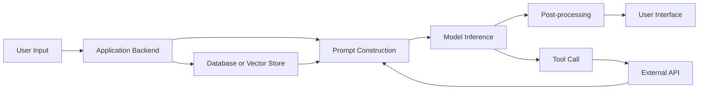
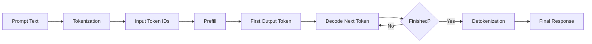
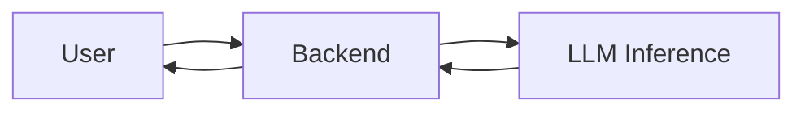
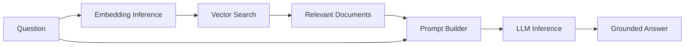
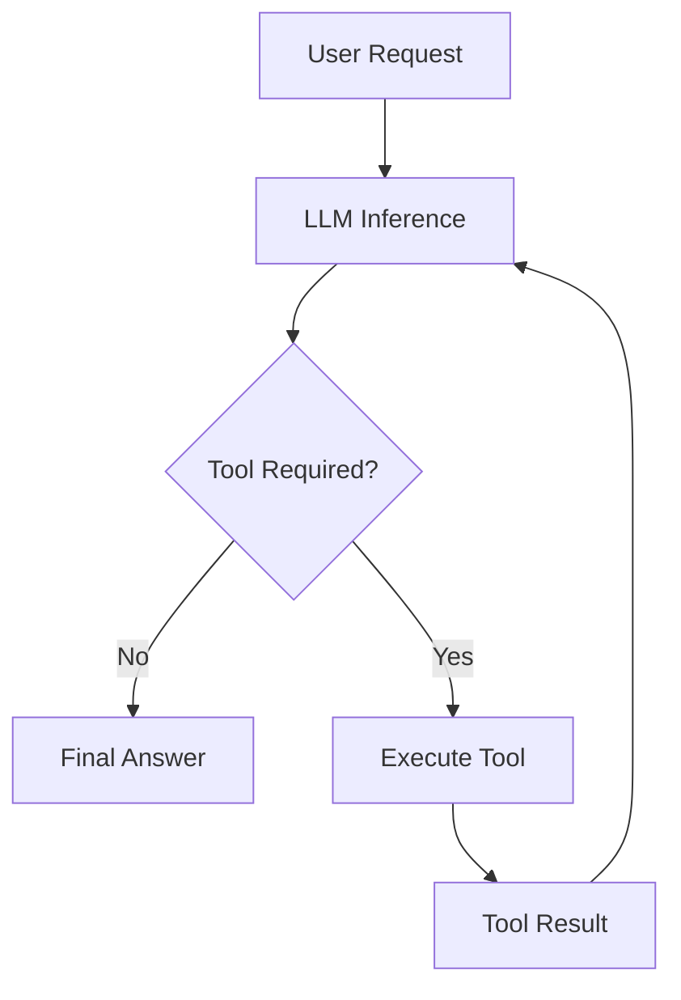
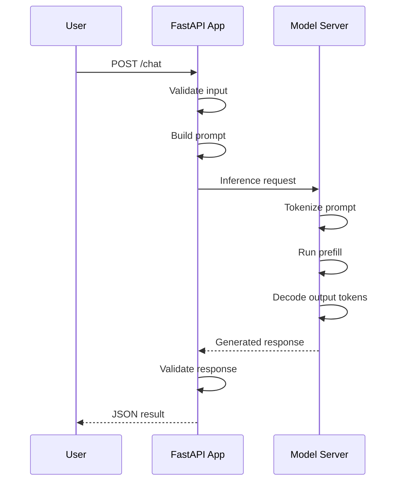
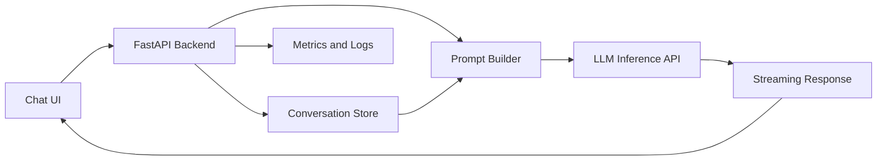

# 005 — Inference

**Course:** 01 — Foundations and LLM Basics
**Module:** Module 02 — Introduction
**Content Group:** Role and Terms
**Roadmap Source:** Introduction / Role and Terms
**Lesson Type:** Introduction
**Order in Module:** 005
**Suggested Duration:** 16 minutes

---

## 1. Summary

**Inference** is the process of running a trained AI model to produce an output from a new input.

For a traditional machine learning model, inference might mean predicting whether a transaction is fraudulent. For a large language model, inference may involve generating text, answering a question, summarizing a document, calling a tool, analyzing an image, or producing structured JSON.

A useful mental model is:

> **Training fills the model’s brain. Inference uses the model’s brain.**

When you send a prompt to an LLM API and receive a response, you are performing inference. The model normally does not retrain itself or update its learned weights during that request.

For AI Engineers, inference is especially important because most production AI applications spend their time and money running models rather than training them.

---

## 2. Learning Objectives

By the end of this lesson, you should be able to:

* Explain inference in your own words.
* Distinguish between model training and model inference.
* Describe the main stages of LLM inference.
* Explain why LLM output is generated token by token.
* Identify important inference metrics such as latency, throughput, and token usage.
* Build a small application that calls a model for inference.
* Recognize common production problems involving timeouts, rate limits, cost, and reliability.

---

## 3. What Is Inference?

Inference is the act of giving a trained model an input and asking it to calculate an output.

```text
Input → Trained Model → Output
```

Examples include:

```text
Image → Image classifier → "Cat"

Customer data → Churn model → 82% churn probability

Audio → Speech recognition model → Transcript

Prompt → Large language model → Generated response

Image + Prompt → Multimodal model → Image analysis
```

Inference can therefore produce many kinds of outputs:

* Text
* Images
* Audio
* Video
* Embeddings
* Classification labels
* Numerical predictions
* Structured JSON
* Tool calls
* Actions taken by an AI agent

The model has already learned its parameters during training. During ordinary inference, those parameters remain fixed while the model processes new data.

---

## 4. Training vs. Inference

Training and inference are different stages of the AI lifecycle.

| Aspect        | Training                        | Inference                                           |
| ------------- | ------------------------------- | --------------------------------------------------- |
| Purpose       | Teach the model patterns        | Use the learned patterns                            |
| Input         | Large training datasets         | A user request or new data                          |
| Output        | Updated model weights           | Prediction or generated content                     |
| Frequency     | Occasional                      | Continuous and frequent                             |
| Cost          | Extremely high for large models | Lower per request, but repeated constantly          |
| Duration      | Hours, days, or months          | Milliseconds to minutes                             |
| Typical owner | ML engineers and researchers    | AI, backend, platform, and infrastructure engineers |
| Example       | Training an LLM on text data    | Calling the LLM through an API                      |

A simple analogy is an intern:

```text
TRAINING
The intern studies documents, examples, corrections, and previous work.

INFERENCE
The trained intern receives a task and produces an answer.
```

Another developer-oriented analogy is:

```text
Training  ≈ Building the model
Inference ≈ Calling the model
```

When a user chats with an AI application, the model is normally performing inference rather than learning directly from that conversation.

---

## 5. Where Inference Appears in an AI Application

Inference is usually one stage inside a larger application workflow.



For example, a Retrieval-Augmented Generation application may perform the following steps:

1. Receive a user question.
2. Convert the question into an embedding.
3. Retrieve relevant documents.
4. Insert the documents into a prompt.
5. Run LLM inference.
6. Validate and format the generated answer.
7. Stream the answer to the user.
8. Record latency, token usage, cost, and errors.

Inference is the model-execution stage, but the complete quality of the application depends on the entire pipeline.

---

## 6. The LLM Inference Process

At a high level, LLM inference contains the following stages:



### 6.1 Tokenization

Language models do not operate directly on human-readable text. The prompt is first divided into **tokens** and converted into numerical token IDs.

```text
"Explain inference simply."

        ↓ Tokenizer

[1847, 294, 9281, 11204, 13]
```

A token may represent:

* A complete word
* Part of a word
* Punctuation
* Whitespace
* A special control symbol

Tokenization matters because API cost, context limits, memory usage, and response time are commonly measured using tokens.

---

### 6.2 Prefill

During the **prefill phase**, the model processes the complete input prompt.

For example:

```text
System prompt: You are a helpful AI tutor.
User prompt: Explain inference using an analogy.
Retrieved context: ...
Conversation history: ...
```

The model analyzes the relationships among the input tokens and builds internal representations that will be used during generation.

Prefill is highly parallelizable because the model can process many input tokens together. However, a very long prompt may increase:

* Time to first token
* GPU computation
* Memory usage
* API cost

The time before the user sees the first generated token is often measured as **Time to First Token**, or **TTFT**.

---

### 6.3 Decode

After processing the prompt, the model enters the **decode phase**.

The model predicts one token at a time:

```text
Prompt
  ↓
"The"
  ↓
"The model"
  ↓
"The model uses"
  ↓
"The model uses learned"
  ↓
"The model uses learned patterns..."
```

Each new token depends on the prompt and the tokens generated before it.

This process is called **autoregressive generation**.

```text
P(next token | prompt + previous output tokens)
```

Because decoding is sequential, generating a long answer usually takes longer than generating a short answer.

The generation loop stops when:

* The model generates an end-of-sequence token.
* A stop sequence is detected.
* The maximum output-token limit is reached.
* The request is cancelled.
* A safety or validation rule stops generation.

## The uploaded inference materials describe this distinction between prompt processing and sequential token generation, as well as the effect of KV caching on repeated computation.

## 7. Why the KV Cache Matters

Without optimization, the model would repeatedly recalculate information for all previous tokens whenever it generates a new token.

A **Key-Value cache**, commonly called a **KV cache**, stores intermediate attention data from tokens the model has already processed.

```text
Prompt tokens
     ↓
Calculate K and V representations
     ↓
Store them in the KV cache
     ↓
Generate a new token
     ↓
Calculate only the new token's K and V data
     ↓
Append them to the cache
```

Conceptually:

```text
Without KV cache:

Token 1 → Reprocess everything
Token 2 → Reprocess everything again
Token 3 → Reprocess everything again


With KV cache:

Prompt  → Process once
Token 1 → Process only Token 1
Token 2 → Process only Token 2
Token 3 → Process only Token 3
```

This improves generation speed, but the cache consumes GPU memory.

KV-cache usage generally increases with:

* Context length
* Generated response length
* Batch size
* Number of model layers
* Model hidden dimensions
* Numerical precision

This creates an important production trade-off:

```text
More concurrent requests
        versus
More memory required per request
```

KV caching, continuous batching, and related techniques are central to efficient decoder-only model inference.

---

## 8. Important Inference Metrics

An AI Engineer should not evaluate inference using only total response time.

### 8.1 End-to-End Latency

The total time from sending the request until receiving the complete response.

```text
Request sent ─────────────────────────────── Final response
              Total end-to-end latency
```

This includes:

* Network latency
* Queue time
* Prompt preprocessing
* Model execution
* Token generation
* Tool execution
* Output validation
* Post-processing

---

### 8.2 Time to First Token

**Time to First Token**, or **TTFT**, measures how long the user waits before the first output token appears.

```text
Request sent ───────── First token
              TTFT
```

TTFT is affected by:

* Prompt length
* Model size
* Request queue
* Prefill performance
* Server load
* Network latency

Streaming improves perceived responsiveness because the user can begin reading before the complete answer is finished.

---

### 8.3 Time per Output Token

**Time per Output Token**, sometimes abbreviated as **TPOT**, measures the average delay between generated tokens.

```text
Token 1 → Token 2 → Token 3 → Token 4
       TPOT      TPOT      TPOT
```

It primarily reflects decode performance.

---

### 8.4 Tokens per Second

Tokens per second measures generation speed:

```text
Tokens per second =
Number of generated tokens / Generation time
```

A higher value generally produces a faster visible response, although tokenization differs across models and languages.

---

### 8.5 Throughput

Throughput measures the total amount of work handled by the system.

Examples include:

* Requests per second
* Output tokens per second
* Total tokens per second
* Concurrent active requests

A system can have excellent throughput but poor latency for an individual user. Conversely, it may provide excellent latency for one user but perform badly under concurrent load.

---

### 8.6 Token Usage and Cost

Many model providers charge separately for:

* Input tokens
* Cached input tokens
* Output tokens
* Tool usage
* Image or audio input
* Specialized reasoning or processing

A simplified cost estimate is:

```text
Request cost =
(input tokens × input price)
+
(output tokens × output price)
```

Long prompts and unnecessarily verbose outputs increase both latency and cost.

---

### 8.7 Reliability Metrics

Production systems should also monitor:

* Request success rate
* Timeout rate
* Retry rate
* Rate-limit errors
* Invalid-output rate
* Safety-filter rate
* Tool-call failure rate
* Model fallback rate
* User cancellation rate

Inference performance is not useful when the application frequently returns invalid or incomplete results.

---

## 9. Latency vs. Throughput

Latency and throughput are related, but they are not identical.

### Low Latency

Low latency means one request receives a response quickly.

This is important for:

* Chatbots
* Voice assistants
* Autocomplete
* Interactive coding tools
* Real-time agents

### High Throughput

High throughput means the system processes a large amount of work over time.

This is important for:

* Batch summarization
* Document processing
* Large-scale classification
* Offline content generation
* Applications with many simultaneous users

```text
Single-user optimization:

Request → GPU → Fast response


Throughput optimization:

Request A ┐
Request B ├─ Scheduler → GPU → Batched generation
Request C ┤
Request D ┘
```

Production inference engines attempt to balance these goals by scheduling and batching requests efficiently.

---

## 10. Common Inference Optimizations

### 10.1 Streaming

Streaming sends output tokens to the client as they are generated.

```text
Non-streaming:
Wait → Wait → Wait → Complete answer

Streaming:
Wait → "Inference" → " is" → " the" → " process" → ...
```

Streaming may not significantly reduce total computation time, but it improves perceived responsiveness.

---

### 10.2 Batching

Batching processes multiple inputs together so that hardware can perform more work in parallel.

```text
Request A ┐
Request B ├─ Batch → Model
Request C ┘
```

Traditional static batching can waste resources when requests have different input or output lengths.

---

### 10.3 Continuous Batching

Continuous batching allows completed requests to leave a running batch while new requests enter it.

```text
Time 1: [A] [B] [C]
Time 2: [A] [B] [C]
Time 3: [A] [B complete] [C]
Time 4: [A] [D enters]   [C]
```

This keeps the GPU busy and improves throughput under concurrent workloads.

---

### 10.4 Quantization

Quantization stores model weights using lower-precision numerical formats.

Examples include:

```text
FP32 → FP16 → BF16 → INT8 → INT4
```

Potential benefits:

* Lower memory usage
* Faster loading
* Higher throughput
* Reduced hardware cost

Possible disadvantages:

* Reduced output quality
* Hardware compatibility issues
* Different performance across models and tasks

---

### 10.5 Prompt Reduction

Reducing unnecessary input tokens can improve:

* Cost
* TTFT
* Memory consumption
* Retrieval quality
* Attention efficiency

Instead of sending the complete conversation forever, an application may:

* Summarize old messages.
* Retrieve only relevant documents.
* Remove duplicate instructions.
* Limit examples.
* Cache repeated prefixes.

---

### 10.6 Output Limits

Setting a sensible maximum output length prevents unexpectedly long and expensive responses.

```python
max_output_tokens = 300
```

The appropriate limit depends on the feature:

| Feature               | Possible Output Limit |
| --------------------- | --------------------: |
| Intent classification |          10–30 tokens |
| Structured extraction |         50–300 tokens |
| Chat answer           |        200–800 tokens |
| Report generation     |         1,000+ tokens |
| Code generation       |   Depends on the task |

---

### 10.7 Speculative Decoding

Speculative decoding uses a smaller model to propose tokens and a larger model to verify them.

```text
Small model → Proposes several tokens
                   ↓
Large model → Accepts or rejects proposals
```

The goal is to generate output faster without substantially changing the result of the larger model.

---

### 10.8 Efficient Inference Engines

An inference engine manages how a model is loaded, scheduled, batched, and executed.

Common examples include:

* vLLM
* llama.cpp
* TensorRT-LLM
* Hugging Face Text Generation Inference
* SGLang
* LMDeploy

Different engines may prioritize different goals:

* GPU throughput
* Low-memory local execution
* Vendor-specific acceleration
* Quantized models
* Concurrent requests
* OpenAI-compatible APIs
* Distributed inference

The same model can produce similar answers at very different speeds depending on the inference engine and serving configuration. Systems such as vLLM improve concurrent serving through memory management techniques such as paged attention.

---

## 11. Inference in Different AI Architectures

### 11.1 Direct LLM Application



Example: a simple chatbot with a system prompt and chat history.

---

### 11.2 RAG Application



This workflow may contain multiple inference calls:

1. Embedding inference for the question.
2. Optional reranker inference.
3. LLM inference for the final answer.

---

### 11.3 Agent Application



An agent may run inference several times before producing the final response.

For example:

```text
Inference 1: Decide to search the database
Tool call: Search database
Inference 2: Interpret the results
Tool call: Call external API
Inference 3: Produce the final response
```

Therefore, agent latency and cost may be much higher than those of a single model call.

---

## 12. Practical Demo: A Small Inference API

The following example creates a simple FastAPI endpoint that sends a prompt to an OpenAI-compatible inference server.

```python
import os

import httpx
from fastapi import FastAPI, HTTPException
from pydantic import BaseModel, Field

app = FastAPI(title="Inference Demo")

MODEL_BASE_URL = os.getenv(
    "MODEL_BASE_URL",
    "http://localhost:8000/v1",
)
MODEL_API_KEY = os.getenv("MODEL_API_KEY", "local-key")
MODEL_NAME = os.getenv("MODEL_NAME", "demo-model")


class ChatRequest(BaseModel):
    message: str = Field(min_length=1, max_length=4_000)


class ChatResponse(BaseModel):
    answer: str
    input_tokens: int | None = None
    output_tokens: int | None = None


@app.post("/chat", response_model=ChatResponse)
async def chat(request: ChatRequest) -> ChatResponse:
    payload = {
        "model": MODEL_NAME,
        "messages": [
            {
                "role": "system",
                "content": (
                    "You are an AI tutor. Explain technical ideas "
                    "clearly and use a short example."
                ),
            },
            {
                "role": "user",
                "content": request.message,
            },
        ],
        "temperature": 0.3,
        "max_tokens": 300,
    }

    headers = {
        "Authorization": f"Bearer {MODEL_API_KEY}",
        "Content-Type": "application/json",
    }

    timeout = httpx.Timeout(
        connect=5.0,
        read=45.0,
        write=10.0,
        pool=5.0,
    )

    try:
        async with httpx.AsyncClient(timeout=timeout) as client:
            response = await client.post(
                f"{MODEL_BASE_URL}/chat/completions",
                json=payload,
                headers=headers,
            )
            response.raise_for_status()

    except httpx.TimeoutException as exc:
        raise HTTPException(
            status_code=504,
            detail="The model inference request timed out.",
        ) from exc

    except httpx.HTTPStatusError as exc:
        raise HTTPException(
            status_code=502,
            detail=(
                "The inference server returned an error: "
                f"{exc.response.status_code}"
            ),
        ) from exc

    except httpx.RequestError as exc:
        raise HTTPException(
            status_code=503,
            detail="The inference server is unavailable.",
        ) from exc

    data = response.json()

    try:
        answer = data["choices"][0]["message"]["content"]
    except (KeyError, IndexError, TypeError) as exc:
        raise HTTPException(
            status_code=502,
            detail="The inference server returned an invalid response.",
        ) from exc

    usage = data.get("usage", {})

    return ChatResponse(
        answer=answer,
        input_tokens=usage.get("prompt_tokens"),
        output_tokens=usage.get("completion_tokens"),
    )
```

Run the server:

```bash
uvicorn main:app --reload
```

Send a request:

```bash
curl -X POST http://localhost:8000/chat \
  -H "Content-Type: application/json" \
  -d '{
    "message": "Explain inference using a restaurant analogy."
  }'
```

Possible response:

```json
{
  "answer": "Training is like teaching a chef recipes. Inference is when a customer places an order and the chef uses those learned recipes to prepare the meal.",
  "input_tokens": 35,
  "output_tokens": 31
}
```

---

## 13. What Happens During the Demo?



The FastAPI server does not train the model. It sends a request to a trained model and receives an inference result.

---

## 14. Production Inference Checklist

A production inference feature should consider more than the prompt.

### Request Handling

* Validate user input.
* Reject empty or excessively large requests.
* Set input and output token limits.
* Attach a request ID.
* Support cancellation where possible.

### Reliability

* Configure connection and read timeouts.
* Retry only suitable transient errors.
* Use exponential backoff.
* Avoid retrying invalid requests.
* Implement model or provider fallback carefully.

### Rate Limits

* Detect rate-limit responses.
* Queue or reject excess traffic.
* Apply per-user limits.
* Protect expensive endpoints.
* Return a clear error message.

### Streaming

* Stream long answers when useful.
* Handle disconnected clients.
* Stop generation when the user cancels.
* Record whether the response completed.

### Output Validation

* Validate structured JSON.
* Reject missing required fields.
* Detect malformed tool calls.
* Apply safety policies.
* Use deterministic fallbacks where appropriate.

### Observability

Record at least:

```text
request_id
model
provider
input_tokens
output_tokens
time_to_first_token
total_latency
status_code
retry_count
estimated_cost
error_type
```

### Security

* Keep provider API keys on the server.
* Never expose secret keys in mobile or frontend code.
* Sanitize tool inputs.
* Restrict tools using allowlists.
* Avoid logging sensitive user content unnecessarily.

---

## 15. Common Production Failure

### Scenario

A chatbot works correctly during local testing but becomes slow after launch.

### Symptoms

* Users wait a long time before seeing the first token.
* Some requests time out.
* Cost increases rapidly.
* The server returns rate-limit errors.
* Responses occasionally stop halfway.

### Possible Causes

```text
Long conversation history
        ↓
Large input-token count
        ↓
Slow prefill and high cost

Too many concurrent requests
        ↓
Queue grows
        ↓
High latency and timeouts

No output-token limit
        ↓
Long generations
        ↓
High cost and low throughput
```

### Debugging Process

1. Record TTFT and total latency separately.
2. Record input and output token counts.
3. Compare performance by model and provider.
4. Check whether requests are waiting in a queue.
5. Inspect rate-limit and timeout logs.
6. Test short and long prompts independently.
7. Test one user and many concurrent users.
8. Verify whether streaming is working.
9. Limit output length.
10. Reduce or summarize old conversation history.

---

## 16. Common Mistakes

### Mistake 1: Treating Inference as Training

Sending a prompt does not normally retrain the model.

```text
Prompt sent → Temporary inference context
Not:
Prompt sent → Permanent weight update
```

Persistent behavior usually requires one of the following:

* Saving data in a database
* Adding memory retrieval
* Updating the system prompt
* Fine-tuning
* Retraining
* Updating external knowledge sources

---

### Mistake 2: Measuring Only Total Latency

A response can have acceptable total latency but poor TTFT, causing the interface to feel unresponsive.

Measure both:

```text
Time to first token
+
Time to complete response
```

---

### Mistake 3: Sending Too Much Context

More context is not automatically better.

Irrelevant context can:

* Increase cost
* Increase latency
* Distract the model
* Reduce answer quality
* Consume the context window

---

### Mistake 4: Retrying Every Error

Blind retries can make an outage worse and may duplicate expensive requests.

Retry only transient failures such as:

* Temporary network errors
* Selected server errors
* Some rate-limit responses

Do not automatically retry:

* Invalid API keys
* Invalid request schemas
* Unsupported models
* Safety rejections
* Requests that exceed context limits

---

### Mistake 5: Ignoring Concurrency

A demo that works for one user may fail for one hundred users.

Always test:

* Concurrent requests
* Different prompt lengths
* Different output lengths
* Queue behavior
* Memory consumption
* Rate limits
* Failure recovery

---

### Mistake 6: Optimizing Speed but Ignoring Quality

A smaller or heavily quantized model may be faster but less accurate.

Inference optimization requires balancing:

```text
Quality
Latency
Throughput
Cost
Memory
Reliability
Safety
```

There is rarely one universally best model or configuration.

---

## 17. Practical Exercise

Build a small inference endpoint for an AI tutor.

### Requirements

Your endpoint should:

1. Accept a user question.
2. Add a system prompt.
3. Call an LLM.
4. Limit the maximum output length.
5. Configure a timeout.
6. Return a clear error when the model is unavailable.
7. Record latency and token usage.
8. Return the final answer as JSON.

### Example Input

```json
{
  "question": "What is the difference between training and inference?"
}
```

### Example Output

```json
{
  "answer": "Training teaches a model by updating its weights. Inference uses the trained weights to produce an answer for new input.",
  "model": "demo-model",
  "latency_ms": 842,
  "input_tokens": 42,
  "output_tokens": 28
}
```

### Optional Extension

Add streaming and display tokens in the frontend as they arrive.

---

## 18. Reflection Questions

Answer these questions without looking at the lesson:

1. What is inference?
2. How is inference different from training?
3. What happens during tokenization?
4. What is the difference between prefill and decode?
5. Why does an LLM generate output one token at a time?
6. What does the KV cache store?
7. What is Time to First Token?
8. How are latency and throughput different?
9. Why can long prompts increase cost?
10. What production failure would you monitor first?

---

## 19. Completion Checklist

* [ ] I can explain **inference** in one or two minutes.
* [ ] I can distinguish training from inference.
* [ ] I understand tokenization, prefill, and decode at a high level.
* [ ] I know why LLMs generate tokens sequentially.
* [ ] I can explain the purpose of the KV cache.
* [ ] I understand latency, TTFT, throughput, and tokens per second.
* [ ] I have built a small inference demo.
* [ ] I have added timeouts and error handling.
* [ ] I have recorded at least one limitation or unresolved question.
* [ ] I can identify one way to reduce inference cost or latency.

---

## 20. Related Outcome

Explain what an AI Engineer does and how the role differs from an ML Engineer or AI Researcher.

Inference is central to this distinction:

* An **AI Researcher** may develop new model architectures or training techniques.
* An **ML Engineer** may train, evaluate, and deploy predictive models.
* An **AI Engineer** often integrates existing models into reliable products and optimizes the complete inference experience.

The AI Engineer must connect model behavior with:

* APIs
* Prompts
* Retrieval
* Tools
* Application state
* User interfaces
* Monitoring
* Cost controls
* Safety systems
* Production infrastructure

---

## 21. Related Project

### Project 1: AI Chatbot

Build an AI chatbot containing:

* A system prompt
* User and assistant chat history
* A backend API
* Model inference
* Streaming output
* Timeout handling
* Token usage tracking
* Basic logging
* A simple user interface

Suggested architecture:



Suggested metrics:

```text
request_count
success_rate
error_rate
average_latency
p95_latency
time_to_first_token
input_tokens
output_tokens
estimated_cost
```

---

## 22. Key Takeaways

1. **Inference means running a trained model to produce an output.**
2. Training changes model parameters; ordinary inference uses fixed parameters.
3. LLM inference includes tokenization, prefill, decoding, and detokenization.
4. Decoder-only LLMs generate output sequentially, one token at a time.
5. The KV cache prevents unnecessary recomputation but consumes memory.
6. AI applications must optimize latency, throughput, token usage, quality, and cost.
7. Production inference requires timeouts, retries, streaming, rate-limit handling, validation, and observability.
8. The model is only one part of the system; the inference engine, prompt, retrieval pipeline, and backend architecture also affect user experience.
9. A successful demo proves that the model can answer.
10. A successful production system proves that it can answer reliably, affordably, safely, and at scale.

---

## 23. Final Summary

**Inference is where a trained AI model performs useful work.**

For an AI Engineer, understanding inference means understanding more than how to call an API. It means knowing what happens between the user’s request and the final output, how token generation affects speed and cost, how production systems handle concurrent traffic, and how to make model-powered features reliable.

Turn this lesson into a practical artifact:

```text
Prompt
   ↓
Backend API
   ↓
Model inference
   ↓
Streaming response
   ↓
Metrics, logs, validation, and error handling
```

Once you can build and observe this workflow, inference is no longer only a definition. It becomes an engineering skill.
