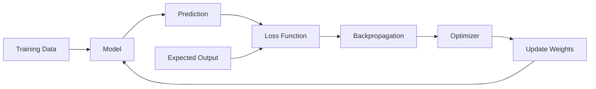
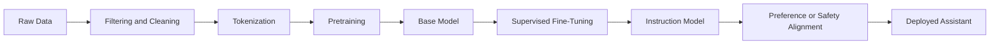
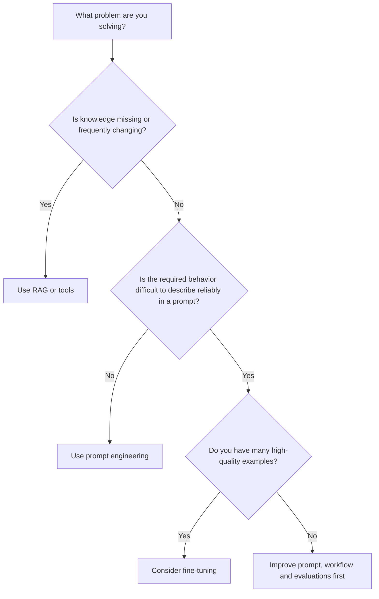

# 006 — Training

**Course:** 01 — Foundations and LLM Basics
**Module:** Module 02 — Introduction
**Content Group:** Role and Terms
**Roadmap Source:** Introduction / Role and Terms
**Lesson Type:** Introduction
**Order in Module:** 006
**Suggested Duration:** 16 minutes

---

## 1. Lesson Summary

**Training** is the process of improving a machine learning model by updating its internal parameters using data, a loss function, and an optimization algorithm.

During training, the model repeatedly:

1. Receives input data.
2. Produces a prediction.
3. Compares the prediction with the expected result.
4. Calculates an error.
5. Updates its parameters to reduce similar errors in the future.

For neural networks, these parameters are usually called **weights** and **biases**.

Large language models may contain billions of parameters. Training them from scratch requires enormous datasets, specialized hardware, distributed systems, and significant engineering resources.

Most AI Engineers do not train foundation models from scratch. However, they must understand training well enough to decide whether a product needs:

* Prompt engineering
* Retrieval-Augmented Generation
* Fine-tuning
* Embedding model training
* Model distillation
* Continued pretraining
* A completely new model

Understanding training also helps AI Engineers recognize model limitations, debug poor outputs, evaluate fine-tuning datasets, and avoid using expensive solutions unnecessarily.

---

## 2. Learning Objectives

By the end of this lesson, you should be able to:

* Explain model training in your own words.
* Describe the basic neural network training loop.
* Distinguish training, pretraining, fine-tuning, prompting, RAG, and inference.
* Explain the roles of datasets, parameters, loss functions, gradients, backpropagation, and optimizers.
* Identify when an AI application actually needs fine-tuning.
* Recognize common training and evaluation failures.
* Build a small experiment that simulates a model-training workflow.

---

## 3. What Is Training?

Training is an optimization process.

A model begins with parameters that are random, inherited from another model, or initialized using a predefined strategy. It then processes examples from a training dataset and adjusts those parameters to produce better predictions.

For a simple supervised-learning problem, one training example may contain:

```text
Input: An email message
Expected output: "spam"
```

The model may initially predict:

```text
Prediction: "not spam"
```

The training system calculates how wrong the prediction was and updates the model.

After seeing many examples, the model may learn patterns such as:

* Suspicious links
* Repeated marketing phrases
* Unusual sender behavior
* Certain combinations of words
* Message structure

The model is not usually given these rules directly. It learns statistical relationships from examples.

---

## 4. The Basic Training Loop

A simplified training loop looks like this:



The loop contains several important stages.

### 4.1 Forward Pass

The model receives an input and calculates an output.

```text
Input → Model → Prediction
```

For an image classifier:

```text
Image of handwritten digit → Neural network → Probability for digits 0–9
```

For a language model:

```text
Previous tokens → Transformer → Probability distribution for the next token
```

Language-model pretraining commonly teaches a model to predict the next token in a sequence. The correct next token acts as the training label, and the network is updated so that the probability of that token becomes higher.

---

### 4.2 Loss Calculation

The **loss function** measures how different the prediction is from the expected output.

Conceptually:

```text
Loss = difference between prediction and target
```

A small loss means the model made a good prediction.

A large loss means the model made a poor prediction.

For a classification problem, the model may output:

```text
Cat: 0.10
Dog: 0.30
Fish: 0.60
```

If the correct answer is `Dog`, the loss function penalizes the model because it assigned a higher probability to `Fish`.

Training attempts to minimize the average loss across many examples.

---

### 4.3 Backpropagation

**Backpropagation** calculates how much each model parameter contributed to the error.

A neural network may contain thousands, millions, or billions of parameters. Backpropagation efficiently calculates the gradient of the loss with respect to these parameters.

The gradient answers questions such as:

```text
If this weight increases slightly, will the loss increase or decrease?

How sensitive is the final error to this parameter?

Which parameters should change the most?
```

Backpropagation provides the gradients needed to improve the model.

---

### 4.4 Optimization

An optimizer uses the gradients to update the parameters.

A simplified update rule is:

```text
new_weight = old_weight - learning_rate × gradient
```

The **learning rate** controls how large each update is.

If it is too high:

* Training may become unstable.
* The loss may jump around.
* The model may skip useful parameter values.

If it is too low:

* Training may be extremely slow.
* The model may stop improving before reaching a good solution.

Popular optimizers include:

* Stochastic Gradient Descent
* Adam
* AdamW
* Adafactor

Gradient descent can be imagined as moving downhill across a landscape where the height represents model error. Each update attempts to move toward a lower-loss region.

---

## 5. Core Training Terminology

### 5.1 Dataset

A dataset is the collection of examples used to develop and evaluate a model.

It is commonly divided into three parts:

| Dataset Split  | Purpose                                        |
| -------------- | ---------------------------------------------- |
| Training set   | Used to update model parameters                |
| Validation set | Used to select settings and detect overfitting |
| Test set       | Used for final evaluation                      |

The test set must not influence training decisions. Otherwise, the reported performance may be misleading.

---

### 5.2 Parameters

Parameters are values learned by the model.

For neural networks, the main parameters are:

* Weights
* Biases
* Embedding values
* Attention projection matrices
* Feed-forward network matrices

When people say a model has “7 billion parameters,” they are referring to the number of learned numerical values inside the model.

---

### 5.3 Hyperparameters

Hyperparameters are settings chosen before or during the training process.

Examples include:

* Learning rate
* Batch size
* Number of epochs
* Sequence length
* Optimizer
* Weight decay
* Dropout rate
* Model architecture
* Vocabulary size

Parameters are learned by the model.

Hyperparameters are configured by engineers or selected through experiments.

---

### 5.4 Batch

A batch is a small group of training examples processed together.

Instead of updating the model after every example, training usually processes a batch:

```text
Dataset
  ↓
Batch 1 → Update
Batch 2 → Update
Batch 3 → Update
```

Larger batches may improve hardware utilization but require more memory.

---

### 5.5 Epoch

An epoch represents one complete pass through the training dataset.

For example:

```text
Dataset size: 10,000 examples
Batch size: 100 examples

Steps per epoch = 10,000 / 100 = 100 steps
```

Training for five epochs means the model processes the dataset approximately five times.

---

### 5.6 Checkpoint

A checkpoint is a saved version of the model during training.

Checkpoints may contain:

* Model parameters
* Optimizer state
* Training step
* Learning-rate scheduler state
* Random-number generator state
* Evaluation metrics

Checkpoints allow training to continue after an interruption and make it possible to compare different stages of the model.

---

## 6. How Large Language Models Are Trained

Training an LLM usually contains multiple stages.



---

### 6.1 Data Collection and Cleaning

The training pipeline may collect data from sources such as:

* Web pages
* Books
* Documentation
* Academic papers
* Code repositories
* Licensed datasets
* Human-created examples
* Synthetic data

Raw data cannot normally be used directly.

It may need:

* HTML removal
* Spam filtering
* Language detection
* Duplicate removal
* Quality scoring
* Personally identifiable information removal
* Unsafe-content filtering
* Document formatting
* Copyright or licensing review

The quality and composition of the dataset strongly influence the model's capabilities and limitations.

---

### 6.2 Tokenization

Language models do not directly process words or sentences. Text is converted into token IDs.

```text
"Training improves models"
        ↓
[3124, 9182, 4217]
```

A token may represent:

* A complete word
* Part of a word
* Punctuation
* Whitespace
* A byte sequence
* A special control symbol

Byte Pair Encoding and related algorithms balance vocabulary size against sequence length.

A small vocabulary creates longer sequences.

A large vocabulary creates larger embedding and output matrices.

Training a language model from scratch may therefore include training a tokenizer before training the transformer itself.

---

### 6.3 Pretraining

During pretraining, a language model learns general language patterns from a very large text corpus.

A common objective is next-token prediction:

```text
Context:
"Machine learning models improve through"

Target:
"training"
```

The model receives the context and predicts a probability distribution over its entire vocabulary.

The loss function rewards the model for assigning a high probability to the correct token.

This process is repeated across enormous numbers of token sequences.

Pretraining can teach the model:

* Grammar
* Writing structures
* Programming patterns
* Common facts
* Relationships between concepts
* Reasoning-like statistical patterns
* Different languages and communication styles

However, a pretrained model is not automatically a helpful conversational assistant.

---

### 6.4 Supervised Fine-Tuning

Supervised Fine-Tuning, or **SFT**, trains a pretrained model on curated input-output examples.

Example:

```json
{
  "messages": [
    {
      "role": "user",
      "content": "Explain gradient descent simply."
    },
    {
      "role": "assistant",
      "content": "Gradient descent is an algorithm that gradually changes a model's parameters to reduce prediction error."
    }
  ]
}
```

SFT may teach the model to:

* Follow instructions
* Produce specific output formats
* Use a desired tone
* Perform a specialized task
* Respond in a domain-specific style
* Call tools correctly
* Generate structured JSON

Because the model already learned general language during pretraining, fine-tuning usually needs much less data and compute than training from scratch.

---

### 6.5 Preference and Safety Alignment

After SFT, models may be trained using human or model preferences.

The training system may compare multiple answers:

```text
Response A: Clear, accurate and safe
Response B: Incorrect or unhelpful
```

The model is encouraged to prefer better responses.

Possible techniques include:

* Reinforcement Learning from Human Feedback
* Reinforcement Learning from AI Feedback
* Direct Preference Optimization
* Other preference-optimization methods

These stages are designed to improve helpfulness, safety, consistency, and instruction following.

---

## 7. Training vs Fine-Tuning vs Prompting vs RAG

These techniques solve different problems.

| Technique             | What Changes?               | Best Used For                                             |
| --------------------- | --------------------------- | --------------------------------------------------------- |
| Pretraining           | Most or all model weights   | Building a foundation model                               |
| Continued pretraining | Model weights               | Teaching additional domain language or knowledge patterns |
| Fine-tuning           | Some or all model weights   | Behavior, style, format or specialized tasks              |
| Prompting             | Input instructions          | Fast behavioral guidance                                  |
| RAG                   | Context provided at runtime | Current, private or frequently changing knowledge         |
| Tool calling          | External action capability  | APIs, databases, search and workflows                     |
| Inference             | No training update          | Generating outputs from the trained model                 |

A useful decision rule is:



---

## 8. When Fine-Tuning Is Appropriate

Fine-tuning may be useful when you need:

* A highly consistent response structure
* A specialized writing style
* Classification using domain-specific labels
* Reliable extraction into a fixed schema
* Tool-call patterns that prompting cannot stabilize
* Lower prompt length at high request volume
* Adaptation to a specialized vocabulary
* A smaller model specialized for one task

Example:

```text
Input:
Customer support message

Required output:
{
  "category": "...",
  "priority": "...",
  "team": "...",
  "summary": "..."
}
```

If prompting produces inconsistent fields despite strong examples and validation, fine-tuning may improve reliability.

---

## 9. When Fine-Tuning Is Not the Right Solution

Fine-tuning should not be the default response to every model problem.

### Problem: The model does not know today's product price

Use:

* Database lookup
* API call
* RAG

Do not expect fine-tuning to keep changing facts current.

---

### Problem: The model ignores one instruction

Try first:

* A clearer system prompt
* Better examples
* Output validation
* Prompt restructuring
* A stronger base model

---

### Problem: The model sometimes returns invalid JSON

Try:

* Structured output support
* JSON Schema validation
* Retry logic
* Constrained decoding
* Better examples

Fine-tuning may help later, but application-level validation is still required.

---

### Problem: The model answers from outdated documentation

Use RAG connected to current documentation.

Fine-tuning would embed a snapshot of the documentation into model parameters and would be difficult to update.

---

## 10. The AI Engineer's Role in Training

An AI Researcher may create new training algorithms or architectures.

An ML Engineer may build scalable training pipelines and optimize model performance.

An AI Engineer usually focuses on turning trained models into useful applications.

However, AI Engineers still interact with training-related work.

### Typical AI Engineer Responsibilities

* Selecting a suitable pretrained model
* Preparing fine-tuning examples
* Defining expected output schemas
* Creating train, validation and test splits
* Running managed fine-tuning jobs
* Comparing a fine-tuned model with a prompted baseline
* Building evaluation datasets
* Tracking model versions
* Integrating checkpoints or model endpoints
* Measuring quality, latency and cost
* Adding fallbacks and safety checks
* Monitoring deployed outputs

The AI Engineer's main question is not:

> How can I train the largest model?

It is:

> What is the smallest reliable intervention that solves the product problem?

---

## 11. Small Practical Demo: Simulating Training Decisions

Imagine that you are building an AI support-ticket router.

### Application Input

```text
"My card was charged twice for the same order."
```

### Expected Output

```json
{
  "category": "billing",
  "priority": "high",
  "team": "payments"
}
```

### Step 1: Build a Prompt Baseline

```python
SYSTEM_PROMPT = """
Classify the support ticket.

Return JSON with:
- category
- priority
- team

Allowed categories:
billing, technical, account, delivery
"""
```

Test the baseline on 100 labeled examples.

---

### Step 2: Create an Evaluation Dataset

```json
[
  {
    "input": "My card was charged twice.",
    "expected": {
      "category": "billing",
      "priority": "high",
      "team": "payments"
    }
  },
  {
    "input": "I forgot my password.",
    "expected": {
      "category": "account",
      "priority": "medium",
      "team": "identity"
    }
  }
]
```

Measure:

* Category accuracy
* Priority accuracy
* Team accuracy
* Valid JSON rate
* Latency
* Cost per request

---

### Step 3: Analyze Errors

Suppose the prompted model produces:

```json
{
  "category": "account",
  "priority": "medium",
  "team": "support"
}
```

Ask:

* Was the prompt unclear?
* Is the label taxonomy ambiguous?
* Do humans agree on the expected label?
* Are examples missing?
* Does the model need access to customer data?
* Is the task difficult enough to justify fine-tuning?

---

### Step 4: Consider Fine-Tuning

Fine-tuning examples could use a conversational format:

```json
{
  "messages": [
    {
      "role": "system",
      "content": "Classify support tickets into the required JSON schema."
    },
    {
      "role": "user",
      "content": "My card was charged twice for one order."
    },
    {
      "role": "assistant",
      "content": "{\"category\":\"billing\",\"priority\":\"high\",\"team\":\"payments\"}"
    }
  ]
}
```

After fine-tuning, evaluate the new model on a test set that was not included in training.

---

### Step 5: Compare Results

| Metric                  | Prompt Baseline | Fine-Tuned Model |
| ----------------------- | --------------: | ---------------: |
| Category accuracy       |             88% |              94% |
| Valid JSON rate         |             93% |              99% |
| Average latency         |          700 ms |           620 ms |
| Cost per 1,000 requests |           $4.20 |            $3.80 |
| Maintenance complexity  |             Low |           Medium |

The fine-tuned model is only valuable if the improvement justifies:

* Dataset creation
* Training cost
* Model-version management
* Regression testing
* Monitoring
* Future retraining

---

## 12. Simplified Training Pseudocode

The following example demonstrates the structure of a neural-network training loop.

```python
for epoch in range(number_of_epochs):
    model.train()

    for inputs, targets in training_loader:
        optimizer.zero_grad()

        predictions = model(inputs)

        loss = loss_function(predictions, targets)

        loss.backward()

        optimizer.step()

    validation_metrics = evaluate(model, validation_loader)

    save_checkpoint(model, validation_metrics)
```

### What Each Line Does

```python
optimizer.zero_grad()
```

Clears gradients from the previous step.

```python
predictions = model(inputs)
```

Runs the forward pass.

```python
loss = loss_function(predictions, targets)
```

Measures prediction error.

```python
loss.backward()
```

Runs backpropagation and calculates gradients.

```python
optimizer.step()
```

Updates the model parameters.

```python
evaluate(model, validation_loader)
```

Checks whether the model improves on data that was not used for weight updates.

---

## 13. Common Training Problems

### 13.1 Overfitting

Overfitting happens when the model performs well on training data but poorly on unseen data.

```text
Training accuracy:   99%
Validation accuracy: 72%
```

Possible causes:

* Too little training data
* Too many training epochs
* Duplicate examples
* Data leakage
* A model that is too large for the task
* Insufficient regularization

Possible solutions:

* Add more diverse data
* Stop training earlier
* Add regularization
* Remove duplicates
* Reduce model complexity
* Improve dataset splitting

---

### 13.2 Underfitting

Underfitting occurs when the model performs poorly on both training and validation data.

Possible causes:

* The model is too small
* Training stopped too early
* The learning rate is incorrect
* Input features are weak
* Labels are inconsistent
* The task is too difficult for the selected architecture

---

### 13.3 Data Leakage

Data leakage happens when information from the validation or test set influences training.

Examples:

* The same document appears in both training and test sets.
* Future information is included in a historical prediction task.
* The correct label is accidentally included in the input.
* Similar messages from the same conversation are split across datasets.

Leakage makes evaluation results appear better than real production performance.

---

### 13.4 Label Noise

Label noise means that the expected outputs contain mistakes or inconsistencies.

Example:

```text
"Payment failed" → technical
"Card payment failed" → billing
```

If two nearly identical examples receive different labels without a clear rule, the model receives conflicting signals.

Dataset quality is often more important than dataset size.

---

### 13.5 Catastrophic Forgetting

A fine-tuned model may become better at a narrow task while losing some general capabilities.

For example, excessive training on short support replies may make the model:

* Overuse short responses
* Ignore broader instructions
* Lose useful reasoning behavior
* Repeat the fine-tuning style in unrelated contexts

This risk can be reduced using:

* Smaller learning rates
* Fewer epochs
* Parameter-efficient fine-tuning
* More diverse examples
* Regression evaluations

---

### 13.6 Distribution Shift

Production inputs may differ from training inputs.

Training data:

```text
Short, clean English support messages
```

Production data:

```text
Vietnamese-English messages, screenshots, spelling errors and long conversation histories
```

The model may fail because the training dataset did not represent real usage.

---

### 13.7 Optimizing the Wrong Metric

A model may improve one metric while becoming worse for users.

For example:

```text
Classification accuracy increased,
but high-priority billing tickets are missed more often.
```

The evaluation should reflect business risk, not only average accuracy.

---

## 14. Production Checklist

Before training or fine-tuning a model, ask:

### Problem Definition

* What exact behavior needs improvement?
* Can the failure be reproduced?
* Is the problem related to knowledge, behavior, formatting or application logic?
* Is there already a prompt baseline?

### Data

* Are labels clearly defined?
* Are examples representative of production traffic?
* Has sensitive information been removed?
* Are duplicates controlled?
* Are train, validation and test sets separated correctly?

### Evaluation

* What metrics determine success?
* Is there a baseline for comparison?
* Are important edge cases included?
* Are safety and regression tests included?
* Will humans review a sample of outputs?

### Training

* Which base model will be used?
* Will full fine-tuning or parameter-efficient tuning be used?
* What are the learning rate, batch size and epoch count?
* How will checkpoints be selected?
* How will experiments be tracked?

### Deployment

* How will the model version be identified?
* Can the application roll back to the previous model?
* Is there a fallback model?
* Are latency and cost acceptable?
* How will production quality be monitored?

---

## 15. Hands-On Exercise

### Exercise A: Explain Training

Without looking at this lesson, write five lines explaining:

1. What model training is.
2. What a loss function does.
3. What backpropagation does.
4. What an optimizer does.
5. Why validation data is necessary.

---

### Exercise B: Design a Training Dataset

Choose one AI application:

* Email classification
* Customer-support routing
* Sentiment analysis
* Product-description generation
* Astrology interpretation formatting
* Resume information extraction

Create ten examples containing:

```json
{
  "input": "Example input",
  "expected_output": "Expected result"
}
```

Then divide them into:

```text
Training set:   6 examples
Validation set: 2 examples
Test set:       2 examples
```

For a real project, ten examples would be insufficient. The purpose here is to understand the workflow.

---

### Exercise C: Choose the Correct Technique

For each problem, choose prompting, RAG, fine-tuning or a tool call.

#### Scenario 1

The assistant needs to answer questions using the latest company policy.

```text
Recommended solution: RAG
```

#### Scenario 2

The assistant must always return one strict JSON schema.

```text
Recommended starting solution:
Prompting + structured output validation
```

Fine-tuning may be considered after evaluating the baseline.

#### Scenario 3

The assistant needs the current delivery status for an order.

```text
Recommended solution: Tool or API call
```

#### Scenario 4

The model must classify thousands of domain-specific messages using a unique label taxonomy.

```text
Recommended solution:
Build a prompt baseline, then consider fine-tuning
```

---

## 16. Common Mistakes

### Mistake 1: Assuming More Training Always Produces a Better Model

Training for too long can cause overfitting or catastrophic forgetting.

---

### Mistake 2: Using Fine-Tuning to Add Frequently Changing Knowledge

Knowledge that changes frequently should usually come from retrieval systems, databases or APIs.

---

### Mistake 3: Training Before Building an Evaluation Set

Without an evaluation set, you cannot reliably determine whether training improved the application.

---

### Mistake 4: Using Low-Quality Synthetic Data Without Review

Synthetic examples may contain:

* Repeated structures
* Incorrect labels
* Unrealistic language
* Hidden model biases
* Invalid assumptions

Synthetic data should be filtered, tested and reviewed.

---

### Mistake 5: Evaluating Only the Training Loss

A decreasing training loss does not prove that the model performs well on unseen production inputs.

---

### Mistake 6: Ignoring the Application Layer

Even a fine-tuned model still needs:

* Input validation
* Output validation
* Timeouts
* Retries
* Logging
* Safety filters
* Monitoring
* Fallback behavior

Training does not replace software engineering.

---

### Mistake 7: Training Without a Strong Baseline

Always compare the trained model against:

* The original model
* A better prompt
* RAG
* A stronger foundation model
* A deterministic software solution

A fine-tuned model should solve a measurable problem, not simply demonstrate that a training job can run.

---

## 17. Completion Checklist

* [ ] I can explain **training** in one or two minutes.
* [ ] I understand the forward pass, loss calculation, backpropagation and optimization.
* [ ] I know the difference between parameters and hyperparameters.
* [ ] I can distinguish pretraining, fine-tuning, prompting, RAG and inference.
* [ ] I understand why validation and test datasets are necessary.
* [ ] I can identify overfitting, underfitting and data leakage.
* [ ] I can explain when fine-tuning is appropriate.
* [ ] I have created a small training or evaluation dataset.
* [ ] I have documented at least one production limitation.
* [ ] I can connect training decisions to quality, cost, latency, safety and maintenance.

---

## 18. Related Outcome

Explain what an AI Engineer does and how the role differs from an ML Engineer or AI Researcher.

An AI Engineer is not expected to train every model from scratch. Instead, the role requires understanding the full model lifecycle well enough to make good product and architecture decisions.

The AI Engineer should know when to:

* Use an existing model
* Improve a prompt
* Add retrieval
* Integrate a tool
* Fine-tune a model
* Build an evaluation pipeline
* Escalate the problem to an ML training team

---

## 19. Related Project

### Project 1: AI Chatbot with System Prompt, Chat History and a Simple Backend

Training is related to this project even when the chatbot uses a pretrained API model.

You can create an evaluation dataset containing:

```json
{
  "user_message": "How do I reset my password?",
  "expected_behavior": [
    "Give clear steps",
    "Do not invent account details",
    "Ask the user to contact support if the reset fails"
  ]
}
```

Run the dataset against different versions of:

* The system prompt
* The model
* The retrieval pipeline
* The conversation-memory implementation
* A fine-tuned model

Record:

* Response quality
* Instruction-following rate
* Hallucination rate
* Latency
* Token usage
* Cost
* User-facing errors

This turns a basic chatbot into a measurable AI Engineering project.

---

## 20. Final Summary

**Training** is the process of updating model parameters so that predictions become more accurate according to a defined objective.

The simplified loop is:

```text
Data
  ↓
Forward pass
  ↓
Prediction
  ↓
Loss
  ↓
Backpropagation
  ↓
Optimizer update
  ↓
Repeat
```

Foundation-model training requires massive amounts of data, compute and infrastructure. Most AI Engineers therefore work with pretrained models rather than training them from scratch.

Their responsibility is to choose the right technique:

```text
Prompting for instructions
RAG for current or private knowledge
Tools for external actions
Fine-tuning for repeated specialized behavior
Training from scratch only for exceptional requirements
```

The most important lesson is not simply how a model learns.

It is how to decide whether changing the model's weights is actually the best solution to the product problem.

---

# Bài luyện tập

## Mục tiêu


## Đề bài


## Yêu cầu hoàn thành

- [ ] 
- [ ] 
- [ ] 

## Kết quả / lời giải


## Ghi chú
