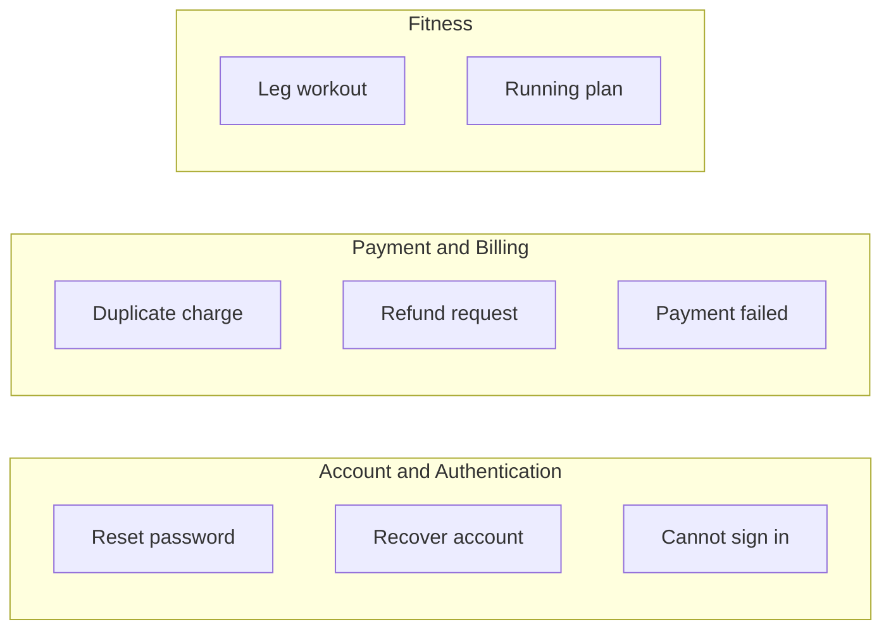
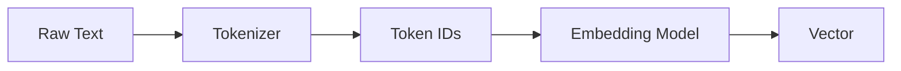
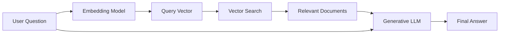
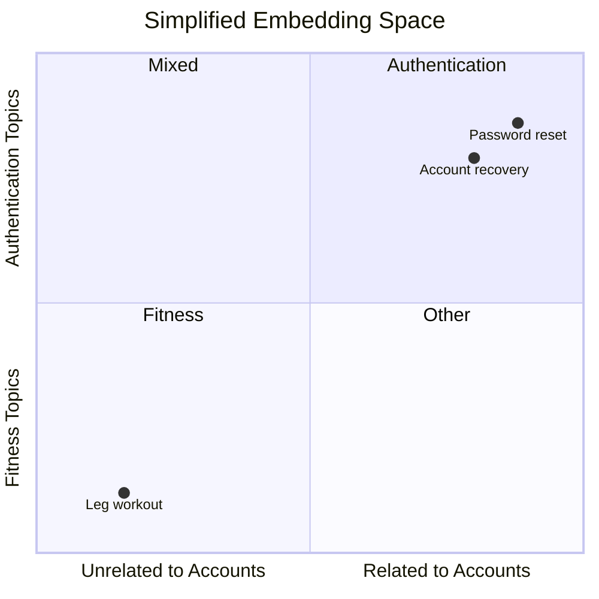
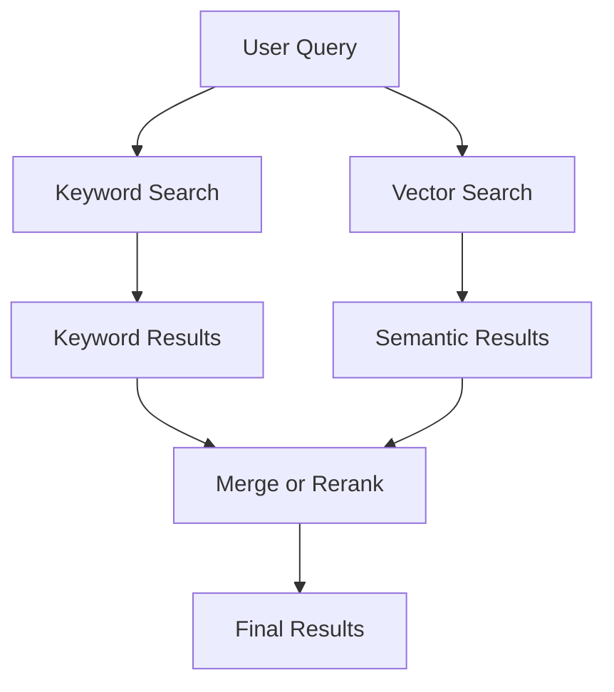
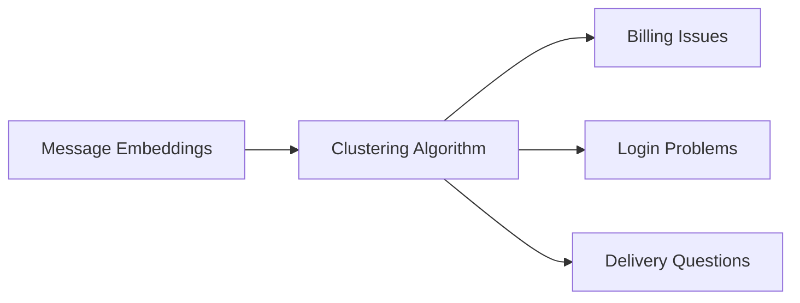
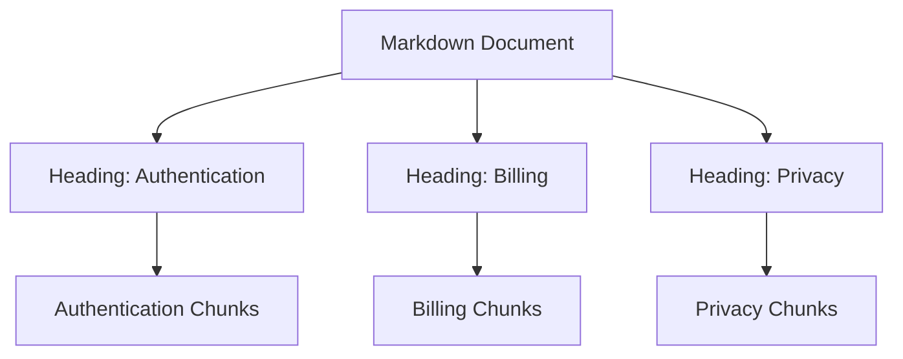
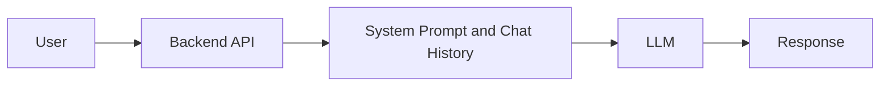
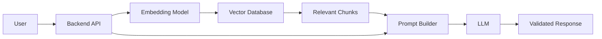

# 008 — Embeddings

**Course:** 01 — Foundations and LLM Basics
**Module:** Module 02 — Introduction
**Content Group:** Core Building Blocks
**Roadmap Source:** Introduction / Core Building Blocks
**Lesson Type:** Introduction
**Order in Module:** 008
**Suggested Duration:** 16 minutes

---

## 1. Lesson Summary

**Embeddings** convert text, images, audio, users, products, or other data into numerical vectors that capture meaningful relationships.

Instead of comparing data only by exact words, an embedding system can compare items by semantic meaning.

For example, a keyword search may fail to connect:

```text
"How can I recover my account?"
```

with:

```text
"Password reset instructions"
```

The two sentences contain different words, but they express closely related ideas. An embedding model can place them near each other in vector space.

Embeddings power many AI features, including:

* Semantic search
* Retrieval-Augmented Generation
* Recommendations
* Document similarity
* Clustering
* Duplicate detection
* Classification
* Anomaly detection
* Multimodal retrieval
* Long-term memory systems

A production embedding system requires more than calling an embedding model. It also needs:

* Appropriate chunking
* Useful metadata
* Vector indexing
* Similarity search
* Filtering
* Evaluation
* Versioning
* Access control
* Monitoring

---

## 2. Learning Objectives

By the end of this lesson, you should be able to:

* Explain embeddings in your own words.
* Describe how data becomes a numerical vector.
* Explain why semantically similar content has similar embeddings.
* Distinguish keyword search from semantic search.
* Understand cosine similarity, dot product, and distance.
* Describe the role of embeddings in a RAG pipeline.
* Design a basic document chunking and indexing workflow.
* Build a small semantic-search demo.
* Identify common embedding-system failures.
* Evaluate retrieval quality using practical metrics.

---

## 3. What Is an Embedding?

An embedding is an ordered list of numbers representing an item in a mathematical space.

A simplified text embedding may look like this:

```text
"Reset my password"

→ [0.12, -0.47, 0.81, 0.09, ...]
```

Real embedding vectors commonly contain hundreds or thousands of dimensions.

Each individual number is usually not directly understandable by humans. The useful information comes from the position of the complete vector relative to other vectors.

For example:

```text
"Reset my password"
"Recover my account"
"Forgot my login credentials"
```

should ideally have nearby vectors.

Meanwhile:

```text
"Best exercises for stronger legs"
```

should be farther away.

---

## 4. A Mental Model: A Map of Meaning

Imagine a large map where related concepts are placed near each other.



An embedding model attempts to create this kind of semantic organization automatically.

In the real system, the map is not two-dimensional. It may contain hundreds or thousands of dimensions.

```text
Human diagram: 2 dimensions
Real embedding space: perhaps 384, 768, 1,024, 1,536, or more dimensions
```

Higher-dimensional spaces allow the model to represent many different relationships at the same time.

A text might simultaneously contain information about:

* Topic
* Intent
* Sentiment
* Style
* Domain
* Entities
* Urgency
* Language
* Relationships between concepts

---

## 5. How Embeddings Work

The simplified process is:



Example:

```text
Input:
"How do I cancel my subscription?"

Tokenized input:
[How] [do] [I] [cancel] [my] [subscription] [?]

Embedding:
[0.19, -0.28, 0.73, ...]
```

The embedding model was trained so that content with related meaning tends to produce nearby vectors.

It does not normally return a written answer. It returns a numerical representation.

---

## 6. Embedding Model vs Generative Model

An embedding model and a generative language model solve different problems.

| Embedding Model                           | Generative Model                       |
| ----------------------------------------- | -------------------------------------- |
| Produces a numerical vector               | Produces text or structured content    |
| Used for similarity and retrieval         | Used for answering and generation      |
| Usually processes each item independently | Uses context to predict new tokens     |
| Output is mainly consumed by software     | Output is often shown to users         |
| Often cheaper and faster                  | Usually more computationally expensive |

A common RAG application uses both:



The embedding model finds relevant information.

The generative model uses that information to create the response.

---

## 7. Vector Similarity

Once two items have embeddings, the system needs a way to measure how similar they are.

Common methods include:

* Cosine similarity
* Dot product
* Euclidean distance

---

## 7.1 Cosine Similarity

Cosine similarity measures the angle between two vectors.

The formula is:

```text
cosine_similarity(A, B) = (A · B) / (||A|| × ||B||)
```

Where:

* `A · B` is the dot product.
* `||A||` is the length of vector A.
* `||B||` is the length of vector B.

A common interpretation is:

|       Value | Interpretation         |
| ----------: | ---------------------- |
|  Close to 1 | Very similar direction |
|  Close to 0 | Weak relationship      |
| Close to -1 | Opposite direction     |

The exact meaning depends on the embedding model and how its vectors are normalized.

---

## 7.2 Simplified Example

Suppose we have three two-dimensional vectors:

```text
Password reset: [0.9, 0.8]
Account recovery: [0.8, 0.7]
Leg workout: [0.1, -0.9]
```

A simplified diagram might look like:



The first two points are close together because their meanings are similar.

---

## 7.3 Euclidean Distance

Euclidean distance measures the straight-line distance between vectors.

```text
distance(A, B) = √Σ(Aᵢ - Bᵢ)²
```

A smaller distance indicates that the vectors are closer.

Whether cosine similarity or Euclidean distance is appropriate depends on:

* The embedding model
* Whether vectors are normalized
* The vector database
* The model provider's recommendation
* The retrieval task

---

## 7.4 Similarity Scores Are Not Universal

A similarity score of `0.80` is not automatically good or bad.

Scores depend on:

* The selected model
* Document length
* Language
* Domain
* Query style
* Similarity metric
* Data distribution

Do not choose a threshold only because it appears reasonable.

Evaluate thresholds using real examples from the application.

---

## 8. Keyword Search vs Semantic Search

### Keyword Search

Keyword search looks for exact words or lexical matches.

Query:

```text
password reset
```

Possible result:

```text
Password reset instructions
```

It may miss:

```text
How to regain access to your account
```

because the words are different.

---

### Semantic Search

Semantic search compares meaning using embeddings.

Query:

```text
I forgot my login credentials
```

Possible relevant results:

```text
Password reset instructions
Recover access to your account
Authentication troubleshooting
```

---

### Comparison

| Keyword Search                   | Semantic Search                       |
| -------------------------------- | ------------------------------------- |
| Matches exact terms              | Matches meaning                       |
| Strong for names and identifiers | Strong for natural-language questions |
| Easy to explain                  | More difficult to interpret           |
| May miss synonyms                | Can find paraphrases                  |
| Often fast and inexpensive       | Requires embeddings and vector search |
| Good for exact product codes     | Good for conceptual retrieval         |

Production systems often combine both approaches.

This is called **hybrid search**.

---

## 9. Hybrid Search

Hybrid search combines:

* Lexical or keyword search
* Semantic vector search



Hybrid search is useful because embeddings may struggle with:

* Exact IDs
* Version numbers
* Error codes
* Product names
* Rare abbreviations
* Unusual names

Example query:

```text
Error KSOLM-225
```

Exact keyword matching may be more reliable than semantic similarity.

---

## 10. Common Embedding Use Cases

## 10.1 Semantic Search

Search documents using meaning rather than exact words.

Example:

```text
Query:
"How long does a refund take?"

Retrieved document:
"Refunds are normally processed within five business days."
```

---

## 10.2 Retrieval-Augmented Generation

Embeddings help retrieve information that is added to an LLM prompt.


---

## 10.3 Recommendations

Represent users and products as vectors.

```text
User interests → User vector
Product description → Product vector
```

Products with vectors close to the user's vector can be recommended.

Examples:

* Movies
* Music
* Articles
* Courses
* Products
* Jobs
* Social content

---

## 10.4 Clustering

Clustering groups similar vectors without predefined labels.

Possible uses:

* Group customer-support tickets
* Discover common user complaints
* Organize documents by topic
* Detect emerging themes
* Explore research papers
* Group feedback messages



---

## 10.5 Classification

Embeddings can be used as input features for a traditional classifier.


For example:

```text
Support message → Embedding → Logistic regression → Billing
```

This may be cheaper and more deterministic than using a generative LLM for every classification request.

---

## 10.6 Duplicate Detection

Similar embeddings can identify:

* Duplicate support tickets
* Repeated questions
* Similar articles
* Near-duplicate product listings
* Duplicate bug reports

---

## 10.7 Anomaly Detection

Items that are far away from typical vector clusters may indicate anomalies.

Examples:

* Unusual transactions
* Off-topic documents
* Unexpected user requests
* Incorrectly classified content
* Data-quality problems

---

## 10.8 Multimodal Retrieval

Some embedding models place different modalities into a shared vector space.

For example:

```text
Text query:
"A red sports car on a mountain road"

→ Search image embeddings
→ Return matching images
```

Other multimodal embedding systems may connect:

* Text and images
* Audio and text
* Video and text
* Products and user behavior

---

# 11. Embeddings in a RAG Pipeline

A complete RAG system usually has two main phases:

1. Indexing
2. Retrieval and generation

---

## 11.1 Indexing Phase

The indexing phase prepares documents for search.


Example documents:

```text
company-policy.pdf
support-guide.md
product-documentation.html
frequently-asked-questions.json
```

---

## 11.2 Query Phase

The query phase runs when a user asks a question.


---

## 11.3 Why Embeddings Alone Are Not Enough

Embeddings only help identify potentially relevant information.

They do not guarantee that:

* The correct document exists.
* The document is current.
* The chunk is complete.
* The retrieved information is authorized.
* The LLM uses the context correctly.
* The answer is factually supported.

A reliable RAG system also needs:

* Good document ingestion
* Chunking
* Metadata
* Filtering
* Reranking
* Prompt design
* Citation handling
* Output evaluation
* Access control

---

# 12. Chunking

## 12.1 What Is a Chunk?

A chunk is a smaller unit created from a larger document.

Example:

```text
Original document:
20-page account security guide

Possible chunks:
1. Password reset
2. Two-factor authentication
3. Account recovery
4. Suspicious login detection
```

Each chunk is embedded and stored separately.

---

## 12.2 Why Chunk Documents?

Embedding an entire large document as one vector may produce an overly broad representation.

Suppose one document contains:

```text
Password resets
Billing rules
Privacy settings
Delivery policies
```

A single embedding may not represent every section precisely.

Smaller chunks improve retrieval specificity.

---

## 12.3 Chunk Size Trade-Off

### Chunks That Are Too Small

Possible problems:

* Missing context
* Incomplete sentences
* Lost relationships
* Too many retrieval results
* Higher storage and indexing costs

### Chunks That Are Too Large

Possible problems:

* Less precise embeddings
* Irrelevant text in the prompt
* Higher token usage
* Important details hidden inside long chunks

---

## 12.4 Chunk Overlap

Chunk overlap repeats a small amount of content between neighboring chunks.

```text
Chunk 1:
Lines 1–20

Chunk 2:
Lines 16–35
```

The overlapping lines preserve context across boundaries.

However, excessive overlap may create:

* Duplicate results
* Larger indexes
* Repeated prompt content
* Higher embedding costs

---

## 12.5 Structure-Aware Chunking

Instead of splitting every fixed number of characters, use document structure.

Possible boundaries include:

* Headings
* Paragraphs
* Sections
* Lists
* Tables
* Code blocks
* Dialogue turns
* FAQ entries

Example:



Structure-aware chunking usually produces more meaningful retrieval units.

---

# 13. Metadata

Metadata is structured information stored with each vector.

Example:

```json
{
  "chunk_id": "account-policy-password-reset-01",
  "text": "Password reset links expire after 30 minutes.",
  "metadata": {
    "document_id": "account-policy",
    "title": "Account Security Policy",
    "section": "Password Reset",
    "language": "en",
    "version": "2026-07",
    "access_level": "public"
  }
}
```

Useful metadata fields may include:

* Document ID
* File name
* Title
* Section
* Language
* Date
* Version
* Product
* Department
* User ID
* Organization ID
* Access level
* Source URL
* Content type

---

## 13.1 Metadata Filtering

Metadata filters narrow the search before or during vector retrieval.

Example:

```text
language = "en"
product = "mobile-app"
version = "2026-07"
access_level = "public"
```

This prevents the system from retrieving:

* Documents in the wrong language
* Outdated policies
* Content from another customer
* Unauthorized internal information
* Documentation for the wrong product

---

## 13.2 Multi-Tenant Isolation

In a multi-tenant application, data from one organization must not appear in another organization's search results.

A required filter might be:

```text
organization_id = current_user.organization_id
```

This should be enforced in backend logic.

Do not depend on the LLM to protect access boundaries.

---

# 14. Vector Indexes and Vector Databases

A vector database stores vectors and retrieves nearby vectors efficiently.

A stored record may contain:

```json
{
  "id": "chunk_001",
  "vector": [0.12, -0.47, 0.81],
  "text": "Password reset links expire after 30 minutes.",
  "metadata": {
    "section": "authentication"
  }
}
```

A vector search operation may look conceptually like:

```text
Search:
query_vector = [0.10, -0.45, 0.79]

Return:
The nearest stored vectors
```

---

## 14.1 Exact Search vs Approximate Search

### Exact Nearest-Neighbor Search

Compares the query with every vector.

Advantages:

* Accurate
* Easy to understand

Disadvantages:

* Slow for very large datasets

---

### Approximate Nearest-Neighbor Search

Uses a specialized index to find likely nearest vectors without comparing every item.

Advantages:

* Much faster at scale
* Suitable for millions of vectors

Disadvantages:

* May miss some relevant results
* Requires index configuration
* Introduces a recall-speed trade-off

---

## 14.2 Common Index Concepts

You may encounter terms such as:

* HNSW
* IVF
* Flat index
* Product quantization
* Approximate nearest neighbors
* Graph-based search
* Vector compression

At the introduction level, the key idea is:

> A vector index trades storage, speed, and exactness to make similarity search practical at scale.

---

# 15. Top-k Retrieval

`top_k` defines how many results are returned.

```text
top_k = 5
```

The search returns the five highest-ranked chunks.

A small `top_k` may miss useful information.

A large `top_k` may introduce:

* Irrelevant context
* Higher prompt costs
* Longer latency
* Conflicting documents
* Reduced answer quality

Choose `top_k` through evaluation rather than intuition alone.

---

# 16. Similarity Thresholds

A similarity threshold removes results below a chosen score.

Example:

```text
Return a result only when similarity >= 0.72
```

Potential benefit:

* Prevents obviously irrelevant chunks from reaching the LLM

Potential risk:

* Relevant results may be excluded
* Score behavior may change when switching models
* One threshold may not work for every query type

Thresholds should be calibrated using a labeled retrieval dataset.

---

# 17. Reranking

Initial vector retrieval is fast, but its ranking may not be perfect.

A reranker evaluates the query and candidate chunks more carefully.


This creates a two-stage search system:

1. Fast candidate generation
2. More precise candidate ranking

Reranking may improve quality but adds:

* Latency
* Cost
* Operational complexity

---

# 18. Practical Demo: Semantic Search

Suppose we have the following documents:

```python
documents = [
    {
        "id": "doc_1",
        "text": "Users can reset their password from the login page."
    },
    {
        "id": "doc_2",
        "text": "Refunds are processed within five business days."
    },
    {
        "id": "doc_3",
        "text": "Two-factor authentication can be enabled in security settings."
    },
]
```

The user asks:

```text
"I cannot remember my login credentials."
```

A semantic-search system should rank `doc_1` highly even though the exact phrase `reset password` does not appear in the query.

---

## 18.1 Simplified Python Structure

```python
from dataclasses import dataclass
from typing import Protocol, Sequence

import numpy as np


class EmbeddingClient(Protocol):
    def embed(self, texts: Sequence[str]) -> list[list[float]]:
        """Convert texts into embedding vectors."""
        ...


@dataclass
class Document:
    id: str
    text: str
    embedding: list[float] | None = None


def cosine_similarity(
    vector_a: Sequence[float],
    vector_b: Sequence[float],
) -> float:
    a = np.asarray(vector_a, dtype=np.float32)
    b = np.asarray(vector_b, dtype=np.float32)

    denominator = np.linalg.norm(a) * np.linalg.norm(b)

    if denominator == 0:
        return 0.0

    return float(np.dot(a, b) / denominator)


def index_documents(
    documents: list[Document],
    embedding_client: EmbeddingClient,
) -> None:
    texts = [document.text for document in documents]
    embeddings = embedding_client.embed(texts)

    if len(embeddings) != len(documents):
        raise ValueError("Embedding count does not match document count.")

    for document, embedding in zip(documents, embeddings, strict=True):
        document.embedding = embedding


def semantic_search(
    query: str,
    documents: list[Document],
    embedding_client: EmbeddingClient,
    top_k: int = 3,
) -> list[tuple[Document, float]]:
    if top_k <= 0:
        raise ValueError("top_k must be greater than zero.")

    query_embedding = embedding_client.embed([query])[0]
    scored_documents: list[tuple[Document, float]] = []

    for document in documents:
        if document.embedding is None:
            raise ValueError(f"Document {document.id} has not been indexed.")

        score = cosine_similarity(query_embedding, document.embedding)
        scored_documents.append((document, score))

    scored_documents.sort(key=lambda item: item[1], reverse=True)

    return scored_documents[:top_k]
```

The implementation is provider-independent. A real application would connect `EmbeddingClient` to a local or hosted embedding model.

---

## 18.2 Example Usage

```python
documents = [
    Document(
        id="doc_1",
        text="Users can reset their password from the login page.",
    ),
    Document(
        id="doc_2",
        text="Refunds are processed within five business days.",
    ),
    Document(
        id="doc_3",
        text="Two-factor authentication can be enabled in security settings.",
    ),
]

index_documents(documents, embedding_client)

results = semantic_search(
    query="I cannot remember my login credentials.",
    documents=documents,
    embedding_client=embedding_client,
    top_k=2,
)

for document, score in results:
    print(document.id, round(score, 4), document.text)
```

Expected conceptual result:

```text
doc_1  0.88  Users can reset their password from the login page.
doc_3  0.64  Two-factor authentication can be enabled in security settings.
```

The exact scores depend on the embedding model.

---

# 19. Simple RAG Prompt Construction

After retrieving relevant chunks, the backend can build a prompt.

```python
def build_rag_prompt(
    question: str,
    retrieved_documents: list[Document],
) -> str:
    context = "\n\n".join(
        f"[Source: {document.id}]\n{document.text}"
        for document in retrieved_documents
    )

    return f"""
You are a support assistant.

Answer the user's question using only the supplied sources.
If the sources do not contain the answer, say that the information is unavailable.
Mention the relevant source IDs.

Sources:
{context}

User question:
{question}
""".strip()
```

The embedding model retrieves information.

The generative model answers using that information.

---

# 20. Embedding Model Selection

Embedding models differ in several ways.

## 20.1 Dimensions

The embedding dimension is the number of values in each vector.

Higher dimensions may capture more information, but they also increase:

* Storage
* Memory usage
* Network transfer
* Index size
* Search computation

Higher dimensionality does not automatically guarantee better retrieval.

---

## 20.2 Language Coverage

A model trained mostly on English may perform poorly on:

* Vietnamese
* Mixed Vietnamese-English content
* Domain-specific abbreviations
* Regional language
* Transliterated text

Test the model using the application's actual languages.

---

## 20.3 Domain Coverage

A general embedding model may not fully understand specialized content such as:

* Medical terminology
* Legal documents
* Source code
* Scientific papers
* Product identifiers
* Astrology terminology
* Internal company abbreviations

Domain-specific models may perform better, but only evaluation can confirm this.

---

## 20.4 Input Length

Embedding models have maximum input lengths.

If a chunk is too long, the client or provider may:

* Reject it
* Truncate it
* Increase latency
* Produce a less focused vector

The chunking strategy must respect the embedding model's input limit.

---

## 20.5 Query and Document Modes

Some models use different instructions or representations for:

* Queries
* Documents
* Classification
* Clustering

For example:

```text
Query representation:
"Find a document that answers: How do I reset my password?"

Document representation:
"Users can reset their password from the login page."
```

Follow the model's recommended usage pattern.

---

# 21. Index Versioning

Changing the embedding model requires rebuilding the vectors.

Vectors from different models are generally not directly comparable.

Do not mix:

```text
Document vectors from embedding-model-v1
Query vectors from embedding-model-v2
```

A vector record should track information such as:

```json
{
  "embedding_model": "embedding-model-v2",
  "embedding_dimension": 1024,
  "chunking_version": "chunk-v3",
  "document_version": "2026-07"
}
```

Versioning helps reproduce retrieval behavior and safely migrate indexes.

---

# 22. Embedding Costs

Embedding cost may come from:

* Initial document indexing
* Reindexing updated documents
* Query embedding generation
* Vector storage
* Vector search infrastructure
* Reranking
* Network transfer

Unlike generative LLM calls, document embeddings can often be computed once and reused.

A simplified cost model is:

```text
Total embedding cost =
document indexing cost
+ document update cost
+ query embedding cost
+ vector infrastructure cost
```

Avoid embedding unchanged documents repeatedly.

A document hash can help detect whether content has changed.

---

# 23. Embedding Cache

The system can cache embeddings for repeated content.

Example cache key:

```text
hash(
    embedding_model
    + model_version
    + normalized_text
)
```

Benefits include:

* Lower cost
* Faster indexing
* Reduced duplicate work

The cache must include the model version because the same text may produce different vectors under different embedding models.

---

# 24. Evaluating Embedding Systems

A retrieval system should be measured independently from the final LLM answer.

## 24.1 Evaluation Dataset

Create test cases containing:

```json
{
  "query": "How long does a refund take?",
  "relevant_document_ids": [
    "refund-policy-processing-time"
  ]
}
```

Use real questions whenever possible.

The dataset should include:

* Normal questions
* Paraphrased questions
* Short queries
* Long questions
* Misspellings
* Multiple languages
* Ambiguous requests
* Exact identifiers
* Questions with no valid answer

---

## 24.2 Recall at k

**Recall@k** measures whether a relevant result appears in the top `k` retrieved items.

Example:

```text
Relevant document appears in top 5:
Success

Relevant document does not appear in top 5:
Failure
```

Formula:

```text
Recall@k =
queries with a relevant result in top k
/
total queries
```

---

## 24.3 Precision at k

**Precision@k** measures how many of the top `k` results are relevant.

```text
Top 5 results:
3 relevant
2 irrelevant

Precision@5 = 3 / 5 = 0.60
```

---

## 24.4 Mean Reciprocal Rank

**Mean Reciprocal Rank**, or **MRR**, rewards systems that rank the first relevant result highly.

For one query:

```text
Relevant result at rank 1 → reciprocal rank = 1
Relevant result at rank 2 → reciprocal rank = 1/2
Relevant result at rank 5 → reciprocal rank = 1/5
```

---

## 24.5 No-Answer Evaluation

Some questions should not retrieve a confident answer.

Example:

```text
Question:
"What is the CEO's private phone number?"

Knowledge base:
No such information
```

The system should avoid returning an unrelated chunk simply because one result must be ranked first.

No-answer evaluation helps calibrate:

* Similarity thresholds
* Confidence rules
* Fallback behavior

---

## 24.6 End-to-End Evaluation

After retrieval evaluation, test the complete RAG system.

Possible metrics include:

* Answer correctness
* Citation correctness
* Groundedness
* Completeness
* Hallucination rate
* Retrieval latency
* Total latency
* Token usage
* Cost per request

A good answer requires both:

```text
Good retrieval
+
Good generation
```

Improving the LLM cannot fully compensate for missing source documents.

---

# 25. Common Production Failures

## 25.1 Wrong Chunk Retrieved

Possible causes:

* Chunk is too broad
* Query is ambiguous
* Embedding model does not understand the domain
* Important terms are missing
* Metadata filtering is incorrect
* Top-k is too small

Debug by recording:

* Query text
* Query vector version
* Retrieved chunk IDs
* Similarity scores
* Metadata filters
* Ranking order

---

## 25.2 Correct Chunk Exists but Is Not Retrieved

Possible causes:

* The document was not indexed
* The index is outdated
* The content was truncated
* Query and document vectors use different models
* The wrong tenant filter was applied
* The chunking boundary removed important context

---

## 25.3 Irrelevant Results Have High Scores

Possible causes:

* Dataset contains repetitive template text
* Headers or navigation text dominate the chunk
* Documents are too similar
* The model is weak for the domain
* Similarity scores are poorly calibrated

Possible improvements:

* Remove boilerplate
* Improve chunking
* Add keyword search
* Add reranking
* Use metadata filters
* Test another embedding model

---

## 25.4 Duplicate Chunks Fill the Results

Possible causes:

* Excessive chunk overlap
* Duplicate documents
* Repeated headers
* Multiple document versions

Possible controls:

* Document deduplication
* Result diversification
* Grouping by document
* Reduced overlap
* Version filtering

---

## 25.5 Wrong-Language Retrieval

A Vietnamese query may return English documents even when Vietnamese documents exist.

Possible improvements:

* Add language metadata
* Filter by preferred language
* Use a multilingual embedding model
* Add cross-language retrieval evaluation
* Fall back to another language only when necessary

---

## 25.6 Stale Information

The embedding index may contain an old policy.

Possible controls:

* Version metadata
* Effective-date filters
* Scheduled reindexing
* Document change detection
* Index deletion for obsolete content

---

## 25.7 Unauthorized Retrieval

The system returns information belonging to another user or organization.

This is a serious access-control failure.

Required controls include:

* Tenant filters
* Backend authorization
* Separate indexes where appropriate
* Access metadata
* Security testing
* Retrieval audits

Security boundaries must not rely only on prompt instructions.

---

# 26. Common Mistakes

## Mistake 1: Treating Embeddings as Summaries

An embedding is a vector representation, not a human-readable summary.

You cannot reliably inspect individual dimensions and translate them back into specific facts.

---

## Mistake 2: Assuming Higher Similarity Means Correctness

A high similarity score only means that the model considers two vectors close.

It does not prove that:

* The document is correct
* The document is current
* The answer is complete
* The content is authorized

---

## Mistake 3: Embedding Entire Large Documents

Large documents often contain multiple topics.

Split them into meaningful sections before embedding.

---

## Mistake 4: Ignoring Metadata

Vectors alone are not enough for:

* Language filtering
* Tenant isolation
* Version control
* Permissions
* Product filtering

---

## Mistake 5: Mixing Embedding Models

Document vectors and query vectors must be generated by compatible model versions.

---

## Mistake 6: Using Only Happy-Path Queries

A retrieval system must also handle:

* Misspellings
* Vague questions
* Mixed languages
* Exact identifiers
* Unsupported questions
* Conflicting documents

---

## Mistake 7: Evaluating Only the Final LLM Answer

Evaluate retrieval separately.

Otherwise, you may not know whether the failure came from:

* Retrieval
* Prompt construction
* The generative model
* Output parsing

---

## Mistake 8: Using Vector Search for Everything

Keyword search may be better for:

* Email addresses
* Order IDs
* Error codes
* Exact names
* Version numbers
* Database keys

Use hybrid search where appropriate.

---

# 27. Production Checklist

## Data Preparation

* [ ] Documents are parsed correctly.
* [ ] Boilerplate and duplicated text are removed.
* [ ] Sensitive data is handled appropriately.
* [ ] Documents have stable IDs.
* [ ] Document versions are recorded.

## Chunking

* [ ] Chunk size is appropriate for the domain.
* [ ] Important sections are not split incorrectly.
* [ ] Overlap is controlled.
* [ ] Headings and source information are preserved.
* [ ] Tables and code blocks receive special handling when necessary.

## Embeddings

* [ ] The model supports required languages.
* [ ] The model supports the target domain.
* [ ] Document and query embeddings use compatible versions.
* [ ] Embedding dimensions are recorded.
* [ ] Input-length limits are respected.

## Metadata

* [ ] Language is stored.
* [ ] Product or domain is stored.
* [ ] Tenant or organization is stored.
* [ ] Access level is stored.
* [ ] Version or effective date is stored.

## Retrieval

* [ ] Similarity metric is appropriate.
* [ ] Top-k is evaluated.
* [ ] Similarity thresholds are calibrated.
* [ ] Keyword or hybrid search is considered.
* [ ] Reranking is evaluated where useful.

## Security

* [ ] Authorization is enforced before returning results.
* [ ] Multi-tenant filters cannot be removed by user input.
* [ ] Sensitive chunks are not logged carelessly.
* [ ] Retrieved content is treated as untrusted input.

## Evaluation

* [ ] A labeled query dataset exists.
* [ ] Recall@k is measured.
* [ ] Precision or ranking quality is measured.
* [ ] No-answer cases are tested.
* [ ] Multilingual and edge-case queries are included.

## Operations

* [ ] Embedding model versions are tracked.
* [ ] Index versions are tracked.
* [ ] Reindexing can be performed safely.
* [ ] Query latency is monitored.
* [ ] Retrieval failures are logged.
* [ ] A rollback strategy exists.

---

# 28. Hands-On Exercises

## Exercise A: Explain Embeddings

Without looking at the lesson, explain:

1. What an embedding is.
2. Why embeddings support semantic search.
3. What cosine similarity measures.
4. Why documents need chunking.
5. How embeddings are used in RAG.

Use one or two sentences for each answer.

---

## Exercise B: Design a Small Knowledge Base

Create five short documents for an AI chatbot.

Example topics:

```text
Account registration
Password reset
Subscription cancellation
Refund processing
Privacy settings
```

For each document, define:

```json
{
  "id": "document-id",
  "text": "Document content",
  "metadata": {
    "topic": "topic-name",
    "language": "en",
    "version": "1"
  }
}
```

Then write five queries that should retrieve the correct documents.

---

## Exercise C: Test Keyword vs Semantic Search

Use these two queries:

```text
"password reset"
"I cannot remember how to access my account"
```

Compare:

* Exact keyword results
* Embedding similarity results

Record which system handles the paraphrased query better.

---

## Exercise D: Create an Evaluation Table

Create a table like this:

| Query                        | Expected Document | Rank | Success at Top 3 |
| ---------------------------- | ----------------- | ---: | ---------------- |
| How do I recover my account? | password-reset    |    1 | Yes              |
| When will my money return?   | refund-policy     |    2 | Yes              |
| How do I enable 2FA?         | account-security  |    5 | No               |

Identify one retrieval failure and propose an improvement.

---

## Exercise E: Document a Production Failure

Example:

```text
Failure:
A Vietnamese question retrieves an outdated English policy.

Possible causes:
- Missing language filter
- Missing version filter
- Weak multilingual embeddings

Fix:
- Add language and version metadata
- Apply metadata filters
- Test a multilingual embedding model
```

---

# 29. Completion Checklist

* [ ] I can explain **embeddings** in one or two minutes.
* [ ] I understand that embeddings are vectors representing meaning.
* [ ] I can distinguish embedding models from generative models.
* [ ] I understand semantic search.
* [ ] I can explain cosine similarity.
* [ ] I understand why chunking is necessary.
* [ ] I know the role of metadata and vector indexes.
* [ ] I can explain how embeddings support RAG.
* [ ] I can build a small semantic-search demo.
* [ ] I know how to evaluate retrieval with Recall@k.
* [ ] I can identify at least one production limitation.
* [ ] I understand the security risks of multi-tenant retrieval.

---

# 30. Related Outcome

Explain what an AI Engineer does and how the role differs from an ML Engineer or AI Researcher.

An AI Researcher may develop new representation-learning methods or embedding architectures.

An ML Engineer may focus on:

* Training embedding models
* Building large-scale indexing pipelines
* Optimizing vector-search infrastructure
* Managing distributed data processing

An AI Engineer commonly focuses on:

* Selecting an embedding model
* Designing document ingestion
* Building chunking logic
* Adding metadata
* Connecting vector search to an LLM
* Evaluating retrieval
* Managing cost and latency
* Protecting access boundaries
* Integrating the feature into a real product

The AI Engineer does not only ask:

> Which embedding model has the best benchmark score?

The more practical question is:

> Which retrieval design reliably returns the right information for real users?

---

# 31. Related Project

## Project 1: AI Chatbot with System Prompt, Chat History, and a Simple Backend

Embeddings can upgrade the basic chatbot into a document-aware assistant.

### Basic Chatbot



### Chatbot with Embedding Retrieval



### Suggested API Routes

```text
POST /documents
POST /documents/index
POST /search
POST /chat
GET  /documents/{document_id}
DELETE /documents/{document_id}
```

### Example Search Response

```json
{
  "query": "How do I recover my account?",
  "results": [
    {
      "chunk_id": "password-reset-01",
      "score": 0.87,
      "text": "Users can reset their password from the login page.",
      "metadata": {
        "section": "Password Reset"
      }
    }
  ]
}
```

### Portfolio Evidence

Include:

* Architecture diagram
* Chunking strategy
* Metadata schema
* Embedding model choice
* Vector-database design
* Search API
* RAG prompt
* Evaluation dataset
* Recall@k results
* Latency measurements
* One failure and debugging report

---

# 32. Final Summary

Embeddings transform text or other data into numerical vectors that represent meaningful relationships.

```text
Text, image, audio, user, or product
                    ↓
             Embedding model
                    ↓
             Numerical vector
                    ↓
       Similarity search or clustering
```

They power:

```text
Semantic search
RAG retrieval
Recommendations
Clustering
Classification
Duplicate detection
Multimodal search
```

A complete embedding workflow is:


The most important lesson is that a good embedding model alone does not create a good retrieval system.

Production quality depends on the complete pipeline:

```text
Good data
+ meaningful chunks
+ useful metadata
+ compatible embeddings
+ correct filtering
+ strong evaluation
+ secure access control
```

For an AI Engineer, embeddings are not only mathematical vectors. They are a practical building block for connecting models to relevant, searchable, and product-specific information.

---

# Bài luyện tập

## Mục tiêu


## Đề bài


## Yêu cầu hoàn thành

- [ ] 
- [ ] 
- [ ] 

## Kết quả / lời giải


## Ghi chú
