# 009 — Vector Databases

**Course:** 01 — Foundations and LLM Basics
**Module:** Module 02 — Introduction
**Content Group:** Core Building Blocks
**Roadmap Source:** Introduction / Core Building Blocks
**Lesson Type:** Introduction
**Order in Module:** 009
**Suggested Duration:** 16 minutes

---

## 1. Lesson Summary

A **vector database** stores numerical vectors—usually embeddings—and searches for items whose vectors are closest to a query vector.

Traditional databases are designed to answer questions such as:

```sql
SELECT *
FROM documents
WHERE category = 'billing';
```

A vector database answers a different kind of question:

```text
Which documents have meanings most similar to this question?
```

For example, a user may ask:

```text
"I paid twice for the same purchase."
```

The knowledge base may contain:

```text
"How to report a duplicate card charge"
```

These sentences do not share many exact words, but they express similar meanings. An embedding model converts both texts into vectors, and the vector database finds that the vectors are close.

Vector databases are commonly used for:

* Semantic search
* Retrieval-Augmented Generation
* Recommendations
* Similar-item search
* Document discovery
* Duplicate detection
* Clustering
* Long-term AI memory
* Multimodal retrieval

A production vector-search system must handle more than vector storage. Important design decisions include:

* Embedding model
* Vector dimensions
* Similarity metric
* Index type
* Metadata filters
* Top-k
* Candidate count
* Recall
* Latency
* Update strategy
* Access control
* Evaluation

---

## 2. Learning Objectives

By the end of this lesson, you should be able to:

* Explain what a vector database is.
* Describe how embeddings are stored and searched.
* Distinguish a vector database from a traditional relational database.
* Explain nearest-neighbor search.
* Understand exact and approximate vector search.
* Describe common similarity metrics.
* Explain the roles of top-k, candidate count, recall, and latency.
* Apply metadata filtering to vector search.
* Place a vector database inside a RAG pipeline.
* Design a simple vector-search API.
* Identify common production failures.
* Create a small semantic-search or RAG demo.

---

# 3. What Is a Vector Database?

A vector database is a data system optimized for storing, indexing, and searching high-dimensional vectors.

A record may contain:

```json
{
  "id": "chunk_001",
  "text": "Password reset links expire after 30 minutes.",
  "embedding": [
    0.124,
    -0.486,
    0.771
  ],
  "metadata": {
    "document_id": "account-policy",
    "section": "password-reset",
    "language": "en",
    "version": "2026-07"
  }
}
```

The vector database stores:

1. A unique identifier
2. The embedding vector
3. The original content or a reference to it
4. Structured metadata

A vector-search query usually contains:

```json
{
  "vector": [
    0.119,
    -0.451,
    0.743
  ],
  "top_k": 5,
  "filter": {
    "language": "en"
  }
}
```

The database returns the records whose vectors are closest to the query vector.

---

# 4. Why Traditional Search Is Not Always Enough

Traditional search methods are effective for exact values.

Examples include:

* User IDs
* Email addresses
* Product codes
* Error codes
* Dates
* Categories
* Exact phrases

However, users often express the same intent using different words.

Consider this query:

```text
"How can I regain access to my profile?"
```

The correct document may be titled:

```text
"Password Reset and Account Recovery"
```

A keyword system may not recognize that:

```text
regain access
```

is related to:

```text
password reset
```

A vector-search system compares semantic representations instead of requiring exact word overlap.

---

## 4.1 Keyword Search

Keyword search may use:

* Exact matching
* Inverted indexes
* BM25
* Full-text search
* Prefix matching
* Fuzzy matching

Example:

```text
Query:
"password reset"

Strong keyword match:
"Password reset instructions"
```

---

## 4.2 Vector Search

Vector search converts both the query and stored items into embeddings.

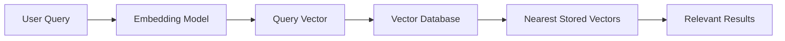

Example:

```text
Query:
"I cannot remember how to enter my account."

Retrieved result:
"Users can reset forgotten passwords from the login page."
```

Vector search can connect paraphrases even when exact words differ.

---

## 4.3 Hybrid Search

Vector search should not completely replace keyword search.

Keyword search is often better for:

* `ERR_CONNECTION_TIMEOUT`
* `KSOLM-225`
* `ORD-937124`
* Exact names
* File paths
* Version numbers
* Product SKUs

A **hybrid-search system** combines lexical and semantic results.

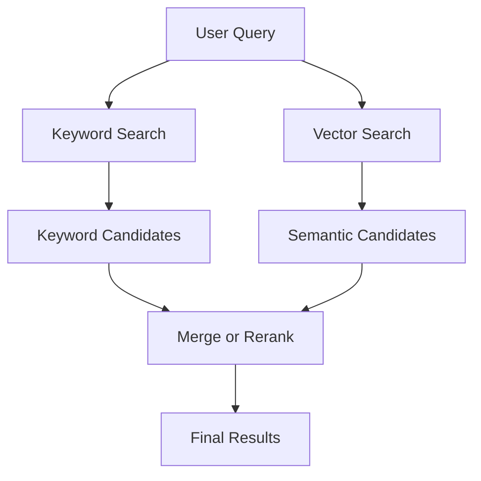

Hybrid search provides both:

```text
Exact matching
+
Semantic understanding
```

---

# 5. How Vector Search Works

A simplified vector-search pipeline contains two phases:

1. Indexing
2. Querying

---

## 5.1 Indexing Phase

During indexing, source data is prepared and stored.

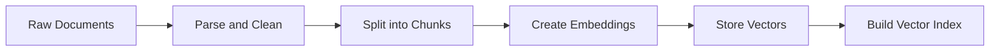

The steps are:

1. Load source documents.
2. Remove unnecessary content.
3. Split documents into chunks.
4. Generate an embedding for each chunk.
5. Store the vector, text, and metadata.
6. Build or update the vector index.

The uploaded course material demonstrates this pattern by generating embeddings for source records, storing those vectors with the original data and metadata, and then building a vector-search index over the embedding field.

---

## 5.2 Query Phase

When a user submits a query:

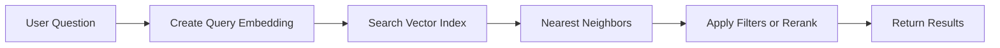

The query must normally be embedded using the same compatible embedding model as the stored documents.

```text
Document vectors: embedding-model-v1
Query vector: embedding-model-v1
```

Do not mix incompatible embedding spaces:

```text
Document vectors: embedding-model-A
Query vector: embedding-model-B
```

Even when both models produce vectors of the same dimension, their coordinate systems may represent meaning differently.

---

# 6. Nearest-Neighbor Search

Vector search is often called **nearest-neighbor search**.

Given a query vector, the database searches for stored vectors that are closest according to a selected similarity metric.

Suppose the query is represented as:

```text
Q = [0.80, 0.70]
```

Stored vectors:

```text
A = [0.82, 0.68]  Account recovery
B = [0.73, 0.66]  Password reset
C = [-0.40, 0.10] Leg exercises
```

Vectors `A` and `B` are much closer to `Q` than `C`.

A simplified map:

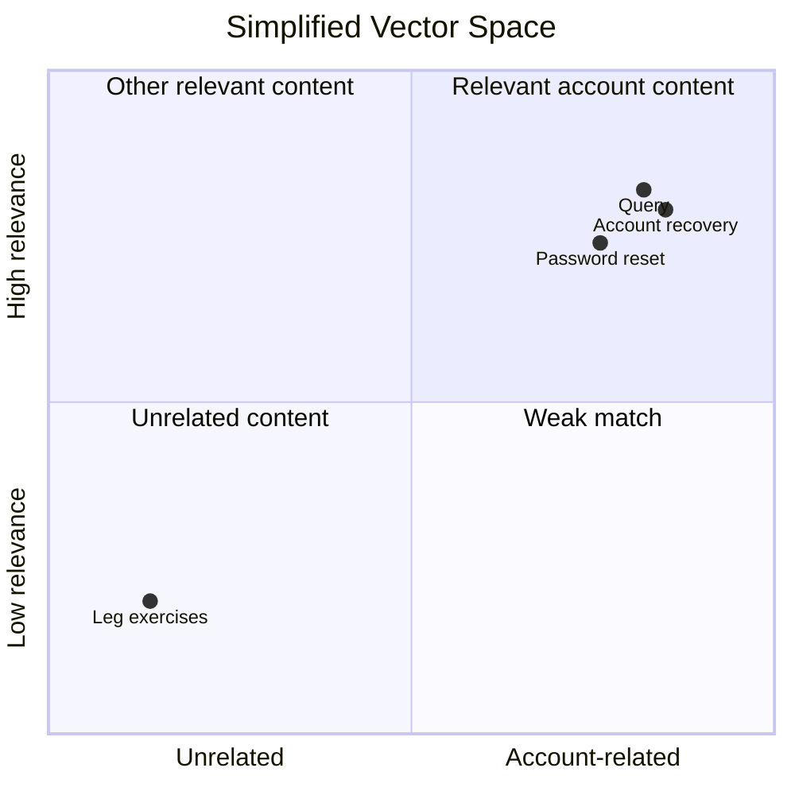

In real applications, vectors may contain hundreds or thousands of dimensions.

---

# 7. Similarity Metrics

The database needs a mathematical method for comparing vectors.

Common metrics include:

* Cosine similarity
* Dot product
* Euclidean distance

The correct choice depends on the embedding model and vector-database implementation.

---

## 7.1 Cosine Similarity

Cosine similarity measures the angle between two vectors.

```text
cosine_similarity(A, B) =
(A · B) / (||A|| × ||B||)
```

General interpretation:

|       Score | Meaning            |
| ----------: | ------------------ |
|  Close to 1 | Similar direction  |
|  Close to 0 | Weak relationship  |
| Close to -1 | Opposite direction |

Cosine similarity focuses on direction rather than magnitude.

It is commonly used for semantic text retrieval.

---

## 7.2 Dot Product

The dot product is:

```text
dot_product(A, B) = Σ AᵢBᵢ
```

A larger dot product commonly indicates greater similarity.

Dot product works especially well when the embedding model produces normalized vectors or was trained for this metric.

---

## 7.3 Euclidean Distance

Euclidean distance measures the straight-line distance between two vectors.

```text
distance(A, B) =
√Σ(Aᵢ - Bᵢ)²
```

For distance metrics:

```text
Smaller value = closer vectors
```

For similarity metrics:

```text
Larger value = more similar vectors
```

---

## 7.4 Follow the Embedding Model's Requirements

Do not select a metric only because it is familiar.

Check:

* How the model was trained
* Whether vectors are normalized
* Which metric the provider recommends
* Which metrics the database supports

The uploaded example configures different similarity methods for different vector fields, showing that index settings must match the vectors being stored and queried.

---

# 8. Exact vs Approximate Search

A database may perform exact or approximate nearest-neighbor search.

---

## 8.1 Exact Nearest-Neighbor Search

Exact search compares the query vector with every stored vector.

```text
Query vector
  ↓
Compare with vector 1
Compare with vector 2
Compare with vector 3
...
Compare with vector N
```

### Advantages

* Finds the exact nearest vectors
* Simple to understand
* Useful for small datasets
* Useful as an evaluation baseline

### Disadvantages

* Slow for large datasets
* Computational cost grows with dataset size
* May become impractical for millions of records

Exact search is sometimes called:

```text
Brute-force search
Flat search
Exhaustive search
```

---

## 8.2 Approximate Nearest-Neighbor Search

**Approximate Nearest Neighbor**, or **ANN**, uses an index to avoid comparing the query against every vector.

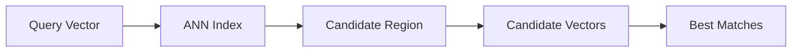

ANN search may not always return the mathematically exact nearest vectors, but it is much faster at scale.

### Advantages

* Low-latency search
* Scales to large collections
* Suitable for production retrieval
* Better throughput

### Disadvantages

* May miss some relevant vectors
* Requires index configuration
* Uses additional storage
* Introduces quality-speed trade-offs

---

# 9. Common Vector Index Types

Different vector databases use different algorithms and names, but several concepts appear frequently.

---

## 9.1 Flat Index

A flat index performs exact comparisons.

Best for:

* Small datasets
* High-accuracy evaluation
* Development baselines

Trade-off:

```text
High recall
Lower scalability
```

---

## 9.2 HNSW

**Hierarchical Navigable Small World**, or **HNSW**, creates a graph of vectors.

The search moves through connected vectors to find nearby regions.

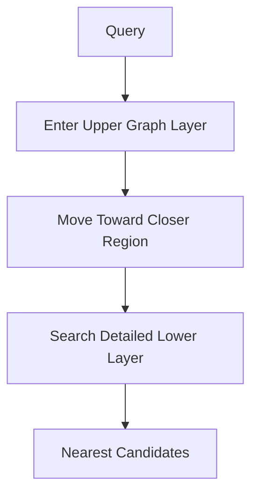

Typical properties:

* High recall
* Fast queries
* Higher memory usage
* Good general-purpose ANN performance

Common parameters may control:

* Graph connectivity
* Search exploration
* Construction quality

---

## 9.3 IVF

**Inverted File Index**, or **IVF**, divides vector space into clusters.

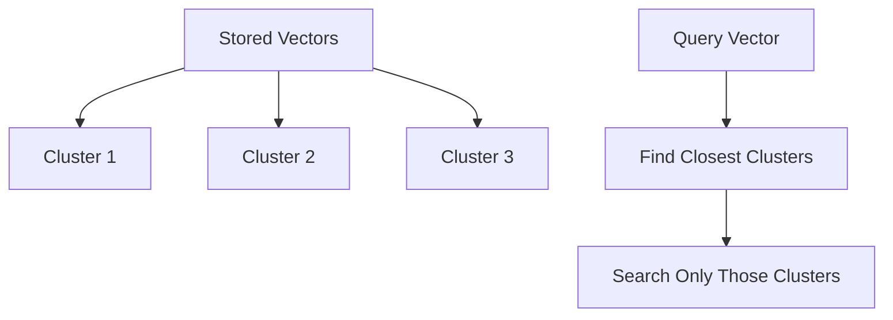

Instead of searching every vector, the database searches selected clusters.

Trade-off:

```text
More clusters searched → Better recall, higher latency
Fewer clusters searched → Lower latency, lower recall
```

---

## 9.4 Product Quantization

**Product Quantization**, or **PQ**, compresses vectors.

Benefits:

* Lower storage usage
* Lower memory requirements
* Faster large-scale search

Trade-off:

* Reduced precision
* More complex configuration
* Possible recall loss

---

# 10. Recall, Precision, and Latency

Vector-search design involves trade-offs.

---

## 10.1 Recall

Recall measures whether the system retrieves relevant documents.

For retrieval:

```text
Recall@k =
number of queries with a relevant document in top k
/
total number of queries
```

Example:

```text
100 test queries
Relevant result appears in top 5 for 86 queries

Recall@5 = 0.86
```

---

## 10.2 Precision

Precision measures how many returned results are relevant.

```text
Top 5 results:
3 relevant
2 irrelevant

Precision@5 = 3 / 5 = 0.60
```

---

## 10.3 Latency

Latency measures how long the search takes.

Example:

```text
Query embedding:      45 ms
Vector search:        30 ms
Metadata filtering:    5 ms
Reranking:           120 ms
Total retrieval:     200 ms
```

A system with excellent recall but five-second search latency may create poor user experience.

---

## 10.4 The Core Trade-Off

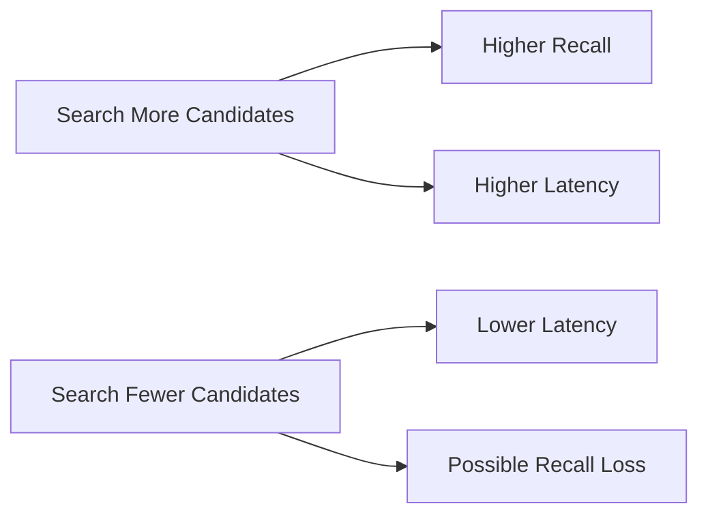

The best configuration depends on:

* Dataset size
* Accuracy requirements
* Latency target
* Hardware
* Query volume
* Business risk

---

# 11. Top-k and Candidate Count

Two commonly confused settings are:

* Candidate count
* Final top-k

---

## 11.1 Top-k

`top_k` is the number of results returned to the application.

Example:

```text
top_k = 5
```

The vector database returns five results.

A larger `top_k` may improve recall but can introduce:

* Irrelevant chunks
* More prompt tokens
* Higher LLM cost
* Conflicting context
* Lower answer quality

---

## 11.2 Candidate Count

ANN systems may first inspect a larger candidate set.

Example:

```text
candidate_count = 100
top_k = 5
```

The database:

1. Finds approximately 100 promising candidates.
2. Scores or ranks them.
3. Returns the best five.

The uploaded tutorial demonstrates this distinction by configuring a larger internal candidate pool while returning only a small final result set.

---

## 11.3 Candidate Trade-Off

```text
Higher candidate count:
+ Better chance of finding relevant vectors
- Higher computation and latency

Lower candidate count:
+ Faster search
- Greater chance of missing relevant vectors
```

Tune candidate count using a retrieval evaluation set.

---

# 12. Metadata Filtering

Vector similarity alone is not enough.

A document may be semantically relevant but still be:

* In the wrong language
* Outdated
* From another organization
* Unauthorized
* For a different product
* From the wrong environment

Metadata filters restrict the search.

Example:

```json
{
  "filter": {
    "organization_id": "org_123",
    "language": "en",
    "product": "mobile-app",
    "status": "active"
  }
}
```

---

## 12.1 Filter Before Search

Some systems apply metadata constraints before vector search.


This can improve:

* Security
* Relevance
* Performance

---

## 12.2 Filter After Search

Other systems may retrieve candidates first and filter afterward.

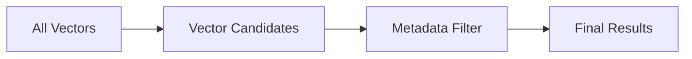

This may reduce effective recall if too many initial candidates are filtered out.

---

## 12.3 Multi-Tenant Security

Suppose the application serves multiple companies.

Each vector record should contain:

```json
{
  "organization_id": "org_123"
}
```

Every query must enforce:

```text
organization_id = authenticated_user.organization_id
```

This must be enforced by backend authorization logic.

Do not ask the LLM to decide which tenant's documents are safe to retrieve.

---

# 13. Data Model Design

A vector record should usually preserve enough information for retrieval, filtering, debugging, and citation.

Example:

```json
{
  "id": "chunk_72c3",
  "embedding": [
    0.124,
    -0.486,
    0.771
  ],
  "text": "Users can request a new password reset link.",
  "metadata": {
    "document_id": "account-security-policy",
    "document_title": "Account Security Policy",
    "section": "Password Reset",
    "chunk_index": 4,
    "language": "en",
    "product": "web-app",
    "organization_id": "org_123",
    "version": "2026-07",
    "source": "internal-docs"
  },
  "embedding_model": "embedding-model-v2",
  "chunking_version": "chunker-v3",
  "content_hash": "..."
}
```

---

## 13.1 Store Text with Vectors or Separately?

### Store Together

```text
Vector + text + metadata in one record
```

Advantages:

* Simple retrieval
* Fewer database calls
* Easy prototyping

Disadvantages:

* Larger records
* Duplicate source content
* More storage

---

### Store Separately

```text
Vector record → source document ID → document store
```

Advantages:

* Less duplication
* Better source-data management
* Easier document updates in some architectures

Disadvantages:

* Additional lookup
* More complex consistency handling

The correct choice depends on:

* Document size
* Database design
* Query latency
* Update frequency
* Citation requirements

---

# 14. Vector Database vs Traditional Database

| Traditional Database           | Vector Database                |
| ------------------------------ | ------------------------------ |
| Searches structured values     | Searches semantic similarity   |
| Uses equality, ranges, joins   | Uses nearest-neighbor search   |
| Good for IDs and transactions  | Good for embeddings            |
| Usually deterministic          | Approximate search may be used |
| SQL or document queries        | Vector queries plus filters    |
| Strong transactional use cases | Strong retrieval use cases     |

A vector database should not replace all other databases.

A production application may use:

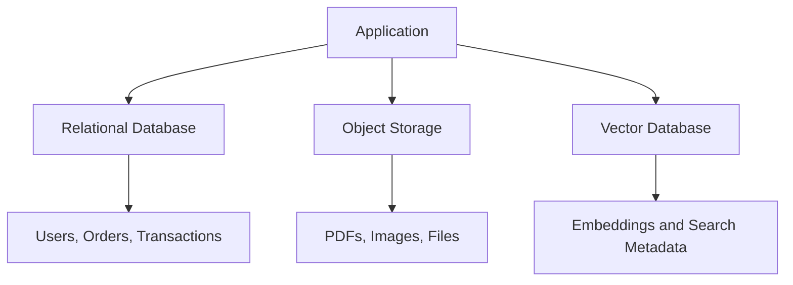

Use the right storage system for each responsibility.

---

# 15. Vector Databases in RAG

Vector databases are frequently used as the retrieval layer in RAG.

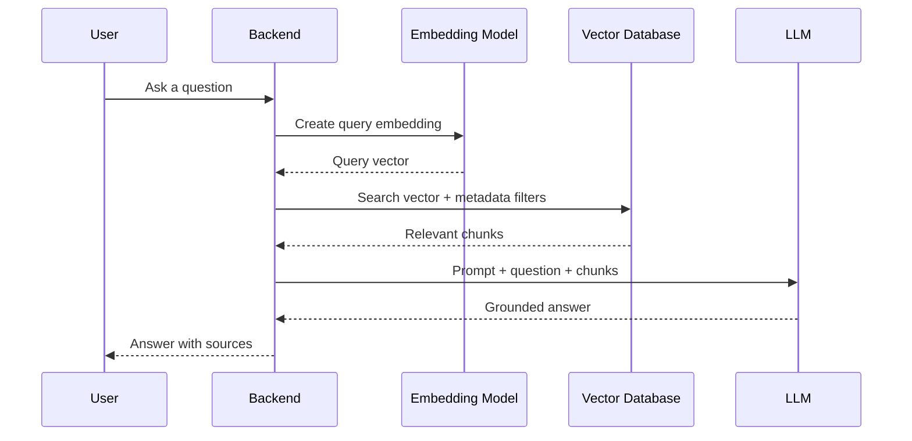

The vector database does not generate the final answer.

Its responsibility is:

```text
Retrieve the most relevant information
```

The LLM's responsibility is:

```text
Use that information to generate a response
```

The course material demonstrates this separation by first returning raw vector-search results and then passing retrieved content into a question-answering chain so the LLM can produce a clearer response.

---

# 16. Reranking

The initial vector search may return results that are broadly related but not perfectly ordered.

A **reranker** examines the query and candidate documents more carefully.

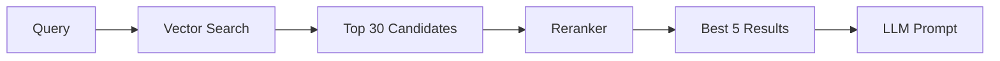

Vector search is optimized for:

```text
Fast candidate retrieval
```

Reranking is optimized for:

```text
Precise final ordering
```

Reranking may improve retrieval quality but adds:

* Latency
* Cost
* Another model dependency
* Additional monitoring requirements

---

# 17. Update Strategies

Source documents change over time.

A vector database must keep its index synchronized with the source data.

---

## 17.1 Full Reindexing

Delete or replace the complete index.

Best when:

* Dataset is small
* Embedding model changes
* Chunking strategy changes
* Metadata schema changes significantly

Disadvantages:

* Expensive
* Slow
* May require temporary duplicate indexes

---

## 17.2 Incremental Updates

Only process new or modified documents.

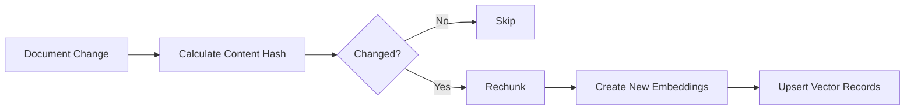

Benefits:

* Lower embedding cost
* Faster updates
* Suitable for frequently changing knowledge bases

---

## 17.3 Delete Handling

When a source document is deleted, its vectors must also be deleted.

Otherwise, the system may retrieve outdated or unauthorized content.

A reliable ingestion pipeline should support:

```text
Create
Update
Delete
Reindex
```

---

## 17.4 Versioned Index Migration

When switching embedding models:

```text
Old index:
embedding-model-v1

New index:
embedding-model-v2
```

A safe process may be:

1. Build the new index in parallel.
2. Run offline evaluations.
3. Send limited production traffic to the new index.
4. Compare retrieval metrics.
5. Switch traffic.
6. Retain the previous index for rollback.
7. Delete it only after validation.

---

# 18. Practical Demo: In-Memory Vector Store

The following example demonstrates the logic behind vector search without depending on a particular provider.

```python
from dataclasses import dataclass
from typing import Protocol, Sequence

import numpy as np


class EmbeddingClient(Protocol):
    def embed(self, texts: Sequence[str]) -> list[list[float]]:
        """Return one vector for each input text."""
        ...


@dataclass
class VectorRecord:
    id: str
    text: str
    embedding: list[float]
    metadata: dict[str, str]


def cosine_similarity(
    vector_a: Sequence[float],
    vector_b: Sequence[float],
) -> float:
    a = np.asarray(vector_a, dtype=np.float32)
    b = np.asarray(vector_b, dtype=np.float32)

    denominator = np.linalg.norm(a) * np.linalg.norm(b)

    if denominator == 0:
        return 0.0

    return float(np.dot(a, b) / denominator)


class InMemoryVectorStore:
    def __init__(self) -> None:
        self._records: list[VectorRecord] = []

    def add(self, records: Sequence[VectorRecord]) -> None:
        self._records.extend(records)

    def search(
        self,
        query_vector: Sequence[float],
        top_k: int = 5,
        filters: dict[str, str] | None = None,
    ) -> list[tuple[VectorRecord, float]]:
        if top_k <= 0:
            raise ValueError("top_k must be greater than zero.")

        filters = filters or {}
        results: list[tuple[VectorRecord, float]] = []

        for record in self._records:
            matches_filters = all(
                record.metadata.get(key) == value
                for key, value in filters.items()
            )

            if not matches_filters:
                continue

            score = cosine_similarity(
                query_vector,
                record.embedding,
            )

            results.append((record, score))

        results.sort(
            key=lambda item: item[1],
            reverse=True,
        )

        return results[:top_k]
```

---

## 18.1 Index Documents

```python
def build_records(
    documents: list[dict[str, object]],
    embedding_client: EmbeddingClient,
) -> list[VectorRecord]:
    texts = [str(document["text"]) for document in documents]
    embeddings = embedding_client.embed(texts)

    if len(embeddings) != len(documents):
        raise ValueError("Embedding count does not match document count.")

    records: list[VectorRecord] = []

    for document, embedding in zip(
        documents,
        embeddings,
        strict=True,
    ):
        records.append(
            VectorRecord(
                id=str(document["id"]),
                text=str(document["text"]),
                embedding=embedding,
                metadata=dict(document.get("metadata", {})),
            )
        )

    return records
```

---

## 18.2 Search Documents

```python
def semantic_search(
    query: str,
    vector_store: InMemoryVectorStore,
    embedding_client: EmbeddingClient,
    top_k: int = 3,
) -> list[tuple[VectorRecord, float]]:
    query_embeddings = embedding_client.embed([query])

    if not query_embeddings:
        raise RuntimeError("The embedding model returned no query vector.")

    return vector_store.search(
        query_vector=query_embeddings[0],
        top_k=top_k,
        filters={
            "language": "en",
        },
    )
```

---

## 18.3 Example Data

```python
documents = [
    {
        "id": "password-reset",
        "text": "Users can reset their password from the login page.",
        "metadata": {
            "language": "en",
            "topic": "account",
        },
    },
    {
        "id": "refund-policy",
        "text": "Refunds are processed within five business days.",
        "metadata": {
            "language": "en",
            "topic": "billing",
        },
    },
    {
        "id": "two-factor-authentication",
        "text": "Two-factor authentication can be enabled in security settings.",
        "metadata": {
            "language": "en",
            "topic": "account",
        },
    },
]
```

Possible query:

```text
"I forgot how to access my account."
```

Expected top result:

```text
Users can reset their password from the login page.
```

---

# 19. Example Vector Search API

A real backend may expose an endpoint such as:

```text
POST /search
```

Request:

```json
{
  "query": "How can I recover access to my account?",
  "top_k": 5,
  "filters": {
    "language": "en",
    "product": "web-app"
  }
}
```

Response:

```json
{
  "query": "How can I recover access to my account?",
  "results": [
    {
      "id": "password-reset-01",
      "score": 0.891,
      "text": "Users can reset their password from the login page.",
      "metadata": {
        "document": "account-policy",
        "section": "Password Reset"
      }
    }
  ]
}
```

---

## 19.1 FastAPI Route Structure

```python
from typing import Any

from fastapi import APIRouter, HTTPException
from pydantic import BaseModel, Field


router = APIRouter()


class SearchRequest(BaseModel):
    query: str = Field(min_length=1, max_length=2_000)
    top_k: int = Field(default=5, ge=1, le=20)
    filters: dict[str, str] = Field(default_factory=dict)


class SearchResult(BaseModel):
    id: str
    score: float
    text: str
    metadata: dict[str, Any]


class SearchResponse(BaseModel):
    query: str
    results: list[SearchResult]


@router.post("/search", response_model=SearchResponse)
async def search_documents(
    request: SearchRequest,
) -> SearchResponse:
    try:
        query_vector = await embedding_service.embed_query(
            request.query
        )

        matches = await vector_repository.search(
            vector=query_vector,
            top_k=request.top_k,
            filters=request.filters,
        )

        results = [
            SearchResult(
                id=match.id,
                score=match.score,
                text=match.text,
                metadata=match.metadata,
            )
            for match in matches
        ]

        return SearchResponse(
            query=request.query,
            results=results,
        )

    except TimeoutError as error:
        raise HTTPException(
            status_code=504,
            detail="Vector search timed out.",
        ) from error
```

A production route should also include:

* Authentication
* Tenant filters
* Request IDs
* Rate limiting
* Logging
* Timeouts
* Retry rules
* Model and index version tracking

---

# 20. Adding Vector Search to a Chatbot

A basic chatbot may send the user message directly to an LLM.

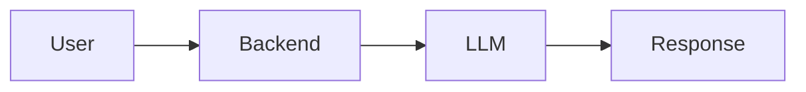

A retrieval-aware chatbot adds a vector database.

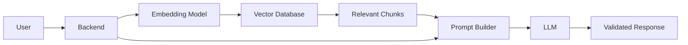

Example prompt:

```text
You are a support assistant.

Answer using only the supplied sources.
If the sources do not contain the answer, say that the information is unavailable.

Sources:
[password-reset-01]
Users can reset their password from the login page.
Reset links expire after 30 minutes.

Question:
How do I recover my account?
```

---

# 21. Retrieval Evaluation

A vector database should not be evaluated only by looking at a few successful examples.

Create a labeled dataset.

```json
[
  {
    "query": "How can I recover my account?",
    "relevant_ids": [
      "password-reset-01"
    ]
  },
  {
    "query": "When will my refund arrive?",
    "relevant_ids": [
      "refund-processing-time"
    ]
  }
]
```

---

## 21.1 Recall@k

```text
Did at least one relevant document appear in the top k?
```

Example:

| Query           | Expected       | Top 3 Result    | Success |
| --------------- | -------------- | --------------- | ------- |
| Recover account | password-reset | password-reset  | Yes     |
| Refund timing   | refund-policy  | payment-failure | No      |

---

## 21.2 Mean Reciprocal Rank

**Mean Reciprocal Rank**, or **MRR**, rewards highly ranked relevant results.

```text
Relevant result at rank 1 → 1.0
Relevant result at rank 2 → 0.5
Relevant result at rank 4 → 0.25
```

---

## 21.3 No-Answer Testing

Some queries should not retrieve a confident answer.

Example:

```text
"What is the CEO's private home address?"
```

If the knowledge base does not contain that information, the system should not treat an unrelated document as valid simply because it is the nearest vector.

Test:

* Similarity thresholds
* Empty result behavior
* Fallback responses
* Unsupported-query detection

---

## 21.4 Filter Evaluation

Test whether filters work correctly.

Examples:

* English queries retrieve English documents.
* Tenant A never retrieves Tenant B's records.
* Current policy is preferred over archived policy.
* Product-specific queries stay within the correct product.

---

# 22. Common Production Failures

## 22.1 Correct Document Was Never Indexed

Symptoms:

* Relevant source exists in storage.
* Vector search never returns it.

Possible causes:

* Ingestion job failed
* Unsupported file format
* Document was skipped
* Embedding API failed
* Index update did not complete

Debug using:

* Ingestion status
* Document count
* Vector count
* Failed-job logs
* Content hashes

---

## 22.2 Query and Documents Use Different Models

Symptoms:

* Retrieval results appear random.
* Similarity scores are unexpectedly low.
* Previously good search fails after a model change.

Fix:

* Track embedding-model version.
* Reindex all documents when changing models.
* Never mix incompatible embedding spaces.

---

## 22.3 Index Dimension Is Incorrect

Suppose vectors contain 768 values, but the index expects 1,536 dimensions.

Possible outcomes:

* Index creation fails
* Insert operations fail
* Search requests fail
* Data is silently excluded in poorly designed pipelines

Validate vector dimensions before storage.

---

## 22.4 Metadata Filters Remove Relevant Results

Symptoms:

* Relevant vector exists.
* Search without filters works.
* Search with filters returns nothing.

Check:

* Language values
* Tenant IDs
* Version values
* Boolean fields
* Missing metadata
* Case sensitivity

---

## 22.5 Candidate Count Is Too Low

Symptoms:

* Search is fast.
* Relevant items are often missing.
* Exact-search evaluation performs better.

Possible fix:

* Increase candidate count.
* Adjust ANN search parameters.
* Improve index configuration.

---

## 22.6 Top-k Is Too High

Symptoms:

* The LLM receives many irrelevant chunks.
* Answers contain conflicting information.
* Prompt cost increases.
* Response quality decreases.

Possible fix:

* Reduce top-k.
* Add reranking.
* Remove duplicate chunks.
* Group results by source document.

---

## 22.7 Duplicate Results

Possible causes:

* Excessive chunk overlap
* Duplicate files
* Multiple versions
* Repeated page headers
* Reindexed content was not deleted

Possible controls:

* Content hashing
* Deduplication
* Version filters
* Result diversification
* Document-level grouping

---

## 22.8 Stale Vectors

The source document was updated, but its old vectors remain.

Possible result:

```text
The chatbot answers using an outdated policy.
```

Fix:

* Use change detection.
* Delete obsolete chunks.
* Re-embed changed content.
* Track effective dates and versions.

---

## 22.9 Unauthorized Cross-Tenant Retrieval

This is a serious security incident.

Possible causes:

* Missing organization filter
* User-controlled filter values
* Incorrect authorization
* Shared namespace without isolation
* Cached results reused across tenants

Required controls:

* Server-side tenant enforcement
* Security tests
* Separate namespaces when appropriate
* Audit logging
* Cache isolation

---

# 23. Common Mistakes

## Mistake 1: Treating a Vector Database as a Knowledge Model

The vector database does not understand or generate answers.

It stores vectors and retrieves similar records.

---

## Mistake 2: Assuming Nearest Means Correct

The nearest stored vector is only the best available match.

It may still be irrelevant or outdated.

---

## Mistake 3: Ignoring Traditional Search

Vector search is weak for some exact identifiers.

Use keyword or hybrid search where appropriate.

---

## Mistake 4: Choosing Top-k Without Evaluation

A larger top-k is not automatically better.

It may reduce final LLM quality.

---

## Mistake 5: Omitting Metadata

Without metadata, it is difficult to enforce:

* Security
* Language
* Product scope
* Versioning
* Source citations

---

## Mistake 6: Hard-Coding Secrets

Never commit:

* Database passwords
* API keys
* Access tokens
* Connection strings

Use environment variables or a secret-management service.

---

## Mistake 7: Re-Embedding Unchanged Content

Use document hashes to avoid unnecessary cost.

---

## Mistake 8: Evaluating Only the Final Chatbot Answer

Evaluate vector retrieval independently from generation.

Otherwise, you will not know whether a failure came from:

* Embedding generation
* Vector search
* Filtering
* Reranking
* Prompt construction
* The LLM

---

# 24. Production Checklist

## Data

* [ ] Source documents have stable IDs.
* [ ] Duplicate documents are removed.
* [ ] Deleted documents remove their vectors.
* [ ] Sensitive data is handled correctly.
* [ ] Content hashes are recorded.

## Embeddings

* [ ] Document and query vectors use compatible models.
* [ ] Vector dimension is validated.
* [ ] Embedding-model version is stored.
* [ ] Input-length limits are respected.
* [ ] Required languages and domains are tested.

## Index

* [ ] The index type fits the dataset size.
* [ ] Similarity metric matches the embedding model.
* [ ] ANN parameters are evaluated.
* [ ] Index build status is monitored.
* [ ] A migration and rollback plan exists.

## Retrieval

* [ ] Top-k is measured rather than guessed.
* [ ] Candidate count is calibrated.
* [ ] Similarity thresholds are tested.
* [ ] Hybrid search is considered.
* [ ] Reranking is evaluated.

## Metadata

* [ ] Language is stored.
* [ ] Product or domain is stored.
* [ ] Organization or tenant is stored.
* [ ] Access level is stored.
* [ ] Version and effective date are stored.

## Security

* [ ] Tenant filters are enforced by the backend.
* [ ] Users cannot override authorization filters.
* [ ] Logs do not expose sensitive content.
* [ ] Cache entries are tenant-isolated.
* [ ] Cross-tenant retrieval tests exist.

## Operations

* [ ] Query latency is monitored.
* [ ] Index size is monitored.
* [ ] Embedding failures are logged.
* [ ] Vector-search errors have fallbacks.
* [ ] Search requests have timeouts.
* [ ] Model, index, and chunk versions are traceable.

## Evaluation

* [ ] A labeled query dataset exists.
* [ ] Recall@k is measured.
* [ ] Ranking quality is measured.
* [ ] No-answer queries are tested.
* [ ] Metadata filters are tested.
* [ ] Production queries are sampled and reviewed.

---

# 25. Hands-On Exercises

## Exercise A: Explain Vector Databases

Without looking at the lesson, explain:

1. What a vector database stores.
2. What nearest-neighbor search means.
3. Why ANN search is useful.
4. What top-k controls.
5. Why metadata filtering is necessary.

---

## Exercise B: Design a Vector Record

Create a JSON record containing:

```text
ID
Text
Embedding
Document ID
Section
Language
Version
Organization ID
Access level
```

Example:

```json
{
  "id": "chunk_001",
  "text": "Example content",
  "embedding": [0.1, 0.2, 0.3],
  "metadata": {
    "document_id": "doc_001",
    "section": "example",
    "language": "en",
    "version": "1",
    "organization_id": "org_001",
    "access_level": "internal"
  }
}
```

---

## Exercise C: Compare Search Types

Create three queries:

1. A conceptual natural-language question
2. An exact error code
3. A product identifier

Decide whether each should use:

```text
Keyword search
Vector search
Hybrid search
```

---

## Exercise D: Build a Retrieval Evaluation Table

| Query                        | Expected Document | Retrieved Rank | Success at Top 3 |
| ---------------------------- | ----------------- | -------------: | ---------------- |
| How do I recover my account? | password-reset    |              1 | Yes              |
| When is my refund returned?  | refund-policy     |              4 | No               |
| How do I enable 2FA?         | account-security  |              2 | Yes              |

Propose one improvement for the failed query.

---

## Exercise E: Document a Failure

Example:

```text
Failure:
The chatbot returns an outdated refund policy.

Possible causes:
- Old vectors were not deleted.
- Version metadata is missing.
- No effective-date filter exists.

Fix:
- Add document version metadata.
- Delete obsolete chunks.
- Reindex updated policies.
- Filter for active documents.
```

---

# 26. Completion Checklist

* [ ] I can explain **vector databases** in one or two minutes.
* [ ] I understand how embeddings are stored.
* [ ] I can explain nearest-neighbor search.
* [ ] I understand exact and approximate search.
* [ ] I know the purpose of a vector index.
* [ ] I understand cosine similarity, dot product, and Euclidean distance.
* [ ] I can explain top-k and candidate count.
* [ ] I understand the recall-latency trade-off.
* [ ] I can apply metadata filters.
* [ ] I can place a vector database in a RAG pipeline.
* [ ] I can design a basic vector-search API.
* [ ] I know how to evaluate retrieval quality.
* [ ] I understand multi-tenant retrieval risks.
* [ ] I have documented at least one production limitation.

---

# 27. Related Outcome

Explain what an AI Engineer does and how the role differs from an ML Engineer or AI Researcher.

An AI Researcher may develop:

* New embedding architectures
* New retrieval algorithms
* Better ANN techniques
* Representation-learning methods

An ML Engineer may focus on:

* Large-scale embedding pipelines
* Distributed indexing
* Search infrastructure
* Model training
* Performance optimization

An AI Engineer commonly focuses on:

* Selecting an embedding model
* Choosing a vector-database solution
* Designing chunk and metadata schemas
* Building search APIs
* Connecting retrieval to an LLM
* Evaluating top-k results
* Managing latency and cost
* Implementing security filters
* Monitoring production behavior

The AI Engineer's main question is not:

> Which vector database has the longest feature list?

The practical question is:

> Which retrieval architecture reliably returns the right authorized information within the product's latency and cost limits?

---

# 28. Related Project

## Project 1: AI Chatbot with System Prompt, Chat History, and a Simple Backend

Upgrade the chatbot with document retrieval.

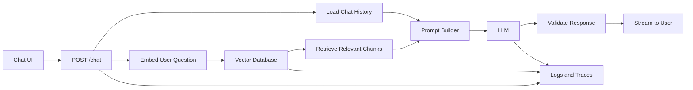

### Suggested API Routes

```text
POST   /documents
POST   /documents/index
POST   /search
POST   /chat
GET    /documents/{document_id}
DELETE /documents/{document_id}
POST   /indexes/rebuild
```

### Suggested Metrics

Track:

```text
Embedding latency
Vector-search latency
Recall@5
Top-k
Candidate count
Retrieved chunk IDs
Similarity scores
LLM latency
Input tokens
Output tokens
Total request cost
```

### Portfolio Evidence

Include:

* System architecture
* Vector-record schema
* Chunking strategy
* Metadata strategy
* Index configuration
* Search API
* RAG prompt
* Retrieval evaluation dataset
* Recall@k results
* Latency results
* Security design
* Failure investigation
* Before-and-after comparison

---

# 29. Final Summary

A vector database stores embeddings and retrieves nearby vectors based on similarity.

```text
Source data
    ↓
Chunking
    ↓
Embedding model
    ↓
Vectors + metadata
    ↓
Vector index
```

At query time:

```text
User query
    ↓
Query embedding
    ↓
Nearest-neighbor search
    ↓
Metadata filtering
    ↓
Top-k results
```

Inside RAG:

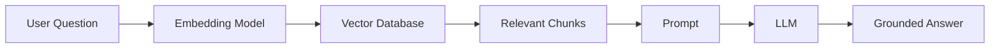

Important design trade-offs include:

```text
Recall vs latency
Accuracy vs storage
Candidate count vs computation
Top-k vs prompt noise
Frequent updates vs indexing cost
Shared infrastructure vs tenant isolation
```

A vector database is not a complete AI application.

A reliable system requires:

```text
Good source data
+ compatible embeddings
+ meaningful chunks
+ correct index settings
+ metadata filters
+ security controls
+ retrieval evaluation
+ monitoring
```

For an AI Engineer, the goal is not simply to store vectors. The goal is to retrieve the right information, for the right user, at the right time, with measurable quality and acceptable production cost.

---

# Bài luyện tập

## Mục tiêu


## Đề bài


## Yêu cầu hoàn thành

- [ ] 
- [ ] 
- [ ] 

## Kết quả / lời giải


## Ghi chú
