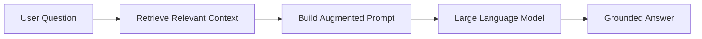
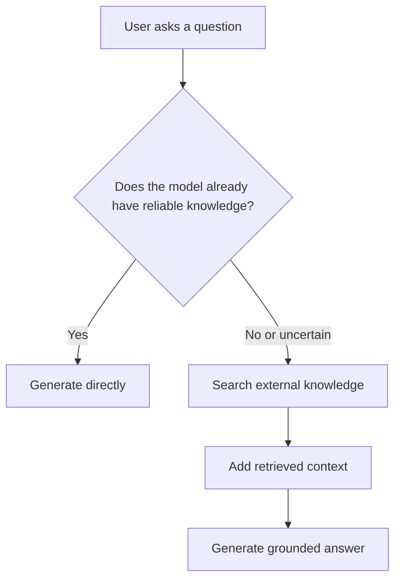
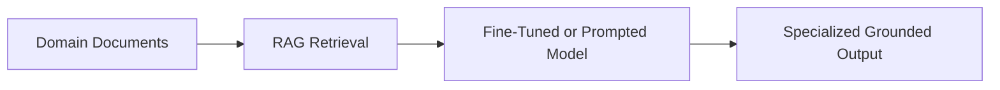
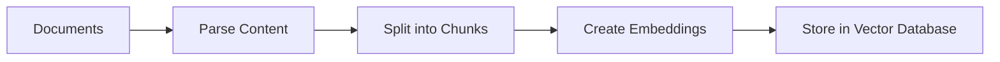
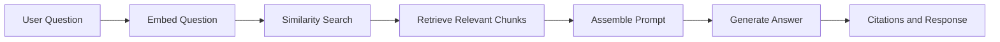
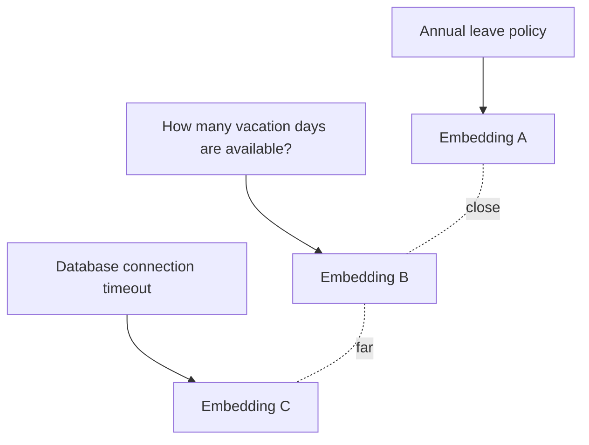
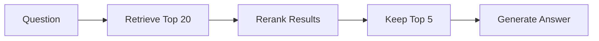
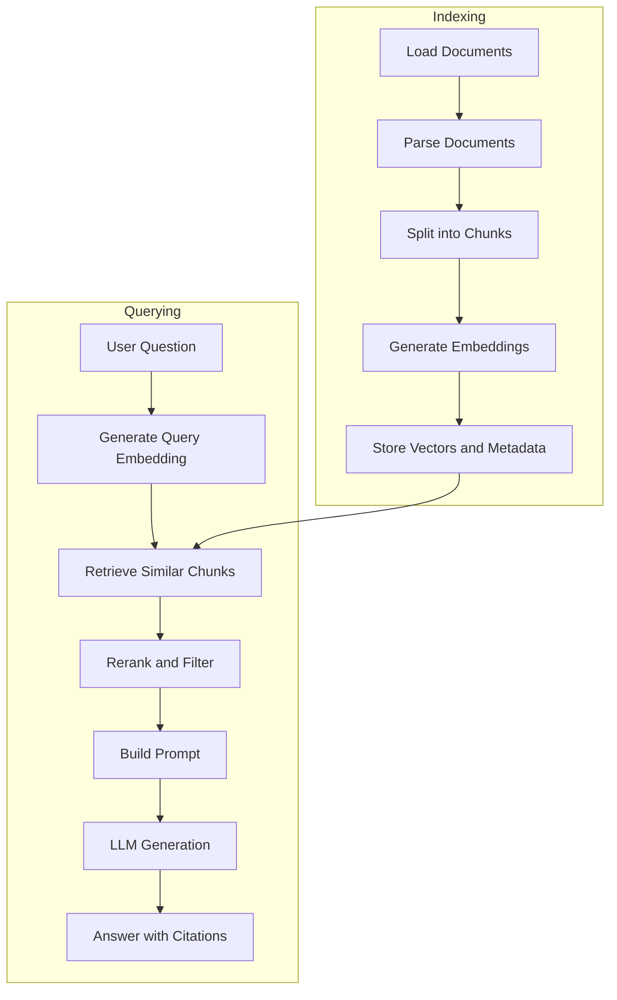
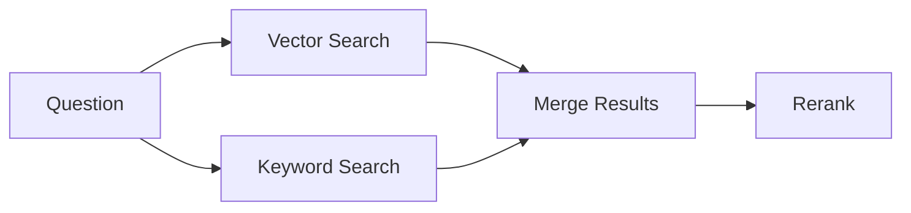
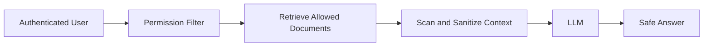

# 010 — Retrieval-Augmented Generation (RAG)

**Course:** 01 — Foundations and LLM Basics
**Module:** Module 02 — Introduction
**Content Group:** Core Building Blocks
**Roadmap Source:** Introduction / Core Building Blocks
**Lesson Type:** Introduction
**Order in Module:** 010
**Suggested Duration:** 16 minutes

---

## 1. Summary

Retrieval-Augmented Generation, usually called **RAG**, is an architecture that gives a Large Language Model relevant external information before asking it to generate an answer.

Instead of relying only on knowledge stored inside the model, a RAG system can search:

* Company documents
* Product documentation
* Research papers
* Customer support articles
* Database records
* User-uploaded files
* Frequently updated information
* Private organizational knowledge

The retrieved information is inserted into the model’s context window. The model then produces an answer grounded in that information.

A simple way to think about RAG is:

> **Search first, then generate.**

RAG is one of the most important building blocks for modern AI applications because most useful business data is private, specialized, or frequently updated.

---

## 2. Learning Objectives

By the end of this lesson, you should be able to:

* Explain RAG in your own words.
* Describe the difference between model knowledge and retrieved knowledge.
* Identify the main stages of a RAG pipeline.
* Explain how chunking, embeddings, vector databases, and retrieval work together.
* Build a small document-question-answering demo.
* Identify common RAG failures and debug them systematically.
* Explain when RAG is more appropriate than fine-tuning.
* Describe how citations and evaluation improve user trust.

---

## 3. What Is RAG?

RAG stands for:

* **Retrieval**
* **Augmented**
* **Generation**

Each word represents one part of the process.

### Retrieval

The system searches an external data source and selects information related to the user’s question.

### Augmented

The retrieved information is added to the model’s prompt as additional context.

### Generation

The language model uses the question and retrieved context to generate an answer.



For example, imagine that a company released a new refund policy yesterday.

A normal language model may not know about it because the information was not part of its training data.

A RAG application can:

1. Search the latest company policy documents.
2. Retrieve the refund-policy section.
3. insert it into the prompt.
4. Ask the model to answer using that section.
5. Return the answer with a source citation.

---

## 4. Why RAG Is Needed

Large Language Models are trained on large collections of data, but they still have important limitations.

### 4.1 Knowledge Cutoff

A model may not know about events or documents created after its training period.

### 4.2 Private Data

The model does not automatically know:

* Internal company policies
* Private source code
* Customer information
* Team documentation
* Personal files

### 4.3 Hallucination

When the model does not have enough information, it may generate an answer that sounds reasonable but is incorrect.

### 4.4 Expensive Knowledge Updates

Retraining or fine-tuning a model every time a document changes is expensive and difficult to maintain.

RAG addresses these limitations by retrieving knowledge at request time.



---

## 5. RAG vs Fine-Tuning

RAG and fine-tuning solve different problems.

| Area              | RAG                                        | Fine-Tuning                                             |
| ----------------- | ------------------------------------------ | ------------------------------------------------------- |
| Main purpose      | Add external knowledge                     | Change model behavior                                   |
| Knowledge updates | Update documents or database               | Retrain the model                                       |
| Private documents | Very suitable                              | Possible, but harder                                    |
| Citations         | Easier to support                          | Difficult                                               |
| Cost              | Usually lower                              | Usually higher                                          |
| Best for          | Question answering and knowledge retrieval | Style, formatting, classification, specialized behavior |

Use **RAG** when the application needs access to specific, private, or frequently changing knowledge.

Use **fine-tuning** when the application needs consistent behavior, tone, output structure, or task-specific patterns.

Many production systems use both:



---

## 6. The Two Main RAG Workflows

A RAG system normally has two separate workflows:

1. The **indexing workflow**
2. The **query workflow**

---

### 6.1 Indexing Workflow

Indexing prepares documents so that they can be searched efficiently.



This workflow normally runs when:

* A new document is uploaded.
* Existing content is updated.
* A knowledge base is rebuilt.
* An indexing job runs in the background.

---

### 6.2 Query Workflow

The query workflow runs when the user asks a question.



Unlike indexing, this workflow must usually run quickly because the user is waiting for an answer.

---

## 7. Core Components of a RAG System

A reliable RAG system contains more than an LLM and a vector database.

### 7.1 Document Loader

The loader reads data from different sources.

Examples include:

* PDF files
* Markdown files
* Web pages
* Word documents
* Notion pages
* Google Drive
* SQL databases
* Support tickets
* Source-code repositories

The loader should preserve useful metadata such as:

```json
{
  "document_id": "employee-handbook-2026",
  "title": "Employee Handbook",
  "page": 24,
  "section": "Annual Leave",
  "updated_at": "2026-06-15",
  "access_level": "employee"
}
```

Metadata is important for filtering, citations, permissions, and debugging.

---

### 7.2 Parser

The parser extracts meaningful content from the document.

Poor parsing can destroy document structure.

For example, a PDF may visually contain:

```text
Plan        Price       Storage
Free        $0          5 GB
Pro         $20         100 GB
```

A weak parser might produce:

```text
Plan Price Storage Free Pro $0 $20 5 GB 100 GB
```

The information is present, but its relationships have been lost.

A good parser should preserve:

* Headings
* Paragraph boundaries
* Lists
* Tables
* Page numbers
* Image captions
* Code blocks

---

### 7.3 Chunker

Large documents cannot always be embedded or inserted into a prompt as one unit.

The document is therefore divided into smaller pieces called **chunks**.

```text
Original document
    ↓
Section 1
    ↓
Chunk 1, Chunk 2, Chunk 3
```

A chunk should be:

* Small enough to retrieve precisely.
* Large enough to preserve meaning.
* Connected to useful metadata.
* Structured around natural document boundaries when possible.

Common chunking strategies include:

* Fixed-character chunking
* Token-based chunking
* Paragraph chunking
* Heading-based chunking
* Semantic chunking
* Parent-child chunking

Example:

```text
Chunk size: 500 tokens
Overlap: 80 tokens
```

Overlap helps prevent important sentences from being separated across chunk boundaries.

However, too much overlap creates duplicate results and increases storage cost.

---

### 7.4 Embedding Model

An embedding model converts text into a numerical vector.

```text
"How many annual leave days do employees receive?"
                        ↓
[0.018, -0.221, 0.774, ..., 0.109]
```

The vector represents the semantic meaning of the text.

Documents with similar meanings should be positioned near each other in embedding space.



The user question must normally be embedded using the same embedding model used for the documents.

---

### 7.5 Vector Database

A vector database stores embeddings and searches for vectors similar to the query vector.

Popular options include:

* PostgreSQL with pgvector
* Qdrant
* Pinecone
* Weaviate
* Milvus
* Chroma
* Elasticsearch with vector search

A stored record might look like this:

```json
{
  "id": "chunk-annual-leave-04",
  "text": "Full-time employees receive 18 paid annual leave days per year.",
  "embedding": [0.018, -0.221, 0.774],
  "metadata": {
    "document": "employee-handbook",
    "page": 24,
    "section": "Annual Leave"
  }
}
```

---

### 7.6 Retriever

The retriever decides which chunks should be returned.

A basic retriever performs semantic similarity search.

```python
documents = vector_store.similarity_search(
    query="How many annual leave days do employees receive?",
    k=4,
)
```

The parameter `k` controls how many chunks are retrieved.

* A small `k` may miss necessary information.
* A large `k` may add irrelevant context.
* More context is not always better.

Other retrieval methods include:

* Keyword search
* BM25 search
* Hybrid search
* Metadata filtering
* Multi-query retrieval
* Parent-document retrieval
* Graph retrieval
* SQL retrieval

---

### 7.7 Reranker

Initial retrieval is optimized for speed, but its ordering may not be ideal.

A reranker reads the question and retrieved chunks, then produces a better relevance ranking.



This two-stage strategy is common in production:

1. Retrieve a larger candidate set.
2. Rerank the candidates.
3. Send only the best chunks to the LLM.

---

### 7.8 Prompt Builder

The prompt builder combines:

* System instructions
* Retrieved context
* User question
* Output-format requirements
* Citation instructions
* Conversation history

Example:

```text
You are a company policy assistant.

Answer the question using only the provided context.

If the answer is not available in the context, say:
"I could not find this information in the available documents."

Include the source title and page number.

Context:
[Employee Handbook, page 24]
Full-time employees receive 18 paid annual leave days per year.

Question:
How many annual leave days do full-time employees receive?
```

---

### 7.9 Generator

The generator is the language model that creates the final response.

Its job is not to search the database. Its job is to reason over the retrieved context and produce a clear answer.

A strong generation prompt should tell the model:

* Which sources it may use
* What to do when information is missing
* Whether it may use general knowledge
* How to format citations
* How to handle conflicting documents
* How concise or detailed the answer should be

---

## 8. Basic RAG Pipeline

The complete basic workflow looks like this:



---

## 9. Minimal RAG Demo

The following example shows the main logic without depending on a specific framework.

```python
from dataclasses import dataclass
from typing import Protocol


@dataclass
class Document:
    text: str
    source: str


class EmbeddingModel(Protocol):
    def embed(self, text: str) -> list[float]:
        ...


class VectorStore(Protocol):
    def add(self, documents: list[Document], vectors: list[list[float]]) -> None:
        ...

    def search(self, vector: list[float], top_k: int) -> list[Document]:
        ...


class LanguageModel(Protocol):
    def generate(self, prompt: str) -> str:
        ...


def index_documents(
    documents: list[Document],
    embedding_model: EmbeddingModel,
    vector_store: VectorStore,
) -> None:
    vectors = [embedding_model.embed(document.text) for document in documents]
    vector_store.add(documents, vectors)


def answer_question(
    question: str,
    embedding_model: EmbeddingModel,
    vector_store: VectorStore,
    language_model: LanguageModel,
) -> str:
    query_vector = embedding_model.embed(question)
    retrieved_documents = vector_store.search(query_vector, top_k=4)

    if not retrieved_documents:
        return "I could not find relevant information in the knowledge base."

    context = "\n\n".join(
        f"Source: {document.source}\n{document.text}"
        for document in retrieved_documents
    )

    prompt = f"""
You are a knowledge-base assistant.

Answer the question using only the context below.
Do not invent missing information.
Mention the source used in your answer.

Context:
{context}

Question:
{question}
""".strip()

    return language_model.generate(prompt)
```

The framework may change, but the architecture remains similar:

```text
Question
   ↓
Embedding
   ↓
Vector Search
   ↓
Relevant Documents
   ↓
Prompt
   ↓
LLM Answer
```

---

## 10. Example Application

Consider an AI assistant for a software product.

### User Question

```text
How do I reset my API key?
```

### Retrieved Chunks

```text
Source: Developer Guide — API Security

Users can create a replacement API key from
Settings → Developer → API Keys.

Creating a replacement key does not immediately disable the old key.
The old key must be revoked manually.
```

### Generated Answer

```text
Open Settings → Developer → API Keys and create a replacement key.

After confirming that the new key works, manually revoke the old key.
Creating a replacement does not automatically disable the previous key.

Source: Developer Guide — API Security
```

The answer is grounded because it is based on a retrieved document rather than an unsupported guess.

---

## 11. Advanced Retrieval Techniques

Basic semantic search works well for simple questions, but production systems often require more advanced techniques.

### 11.1 Hybrid Search

Hybrid search combines:

* Semantic vector search
* Keyword or BM25 search

Vector search is useful for meaning.

Keyword search is useful for:

* Product codes
* Error messages
* Names
* Exact technical terms
* Version numbers



---

### 11.2 Query Rewriting

User questions may be short, vague, or poorly written.

Example:

```text
User query:
"It doesn't work after update."
```

A query-rewriting step might produce:

```text
"Application errors occurring after installing the latest software update"
```

The rewritten query is more likely to match technical documentation.

---

### 11.3 Multi-Query Retrieval

The system generates several alternative versions of the question.

```text
Original:
How does the agent store memory?

Alternative queries:
- What memory systems are used by the AI agent?
- Where is agent conversation history stored?
- How does the agent retrieve previous information?
```

The system retrieves documents for each query and combines the results.

This improves recall when the user’s wording differs from the wording used in the documents.

---

### 11.4 Query Decomposition

Complex questions may need to be divided into smaller questions.

```text
Original question:
Which subscription is cheaper over one year,
and which plan includes team analytics?
```

Decomposed questions:

1. What is the annual cost of each subscription?
2. Which plans include team analytics?
3. Which plan satisfies both conditions?

````

Each sub-question can be retrieved and answered separately before producing the final response.

---

### 11.5 Metadata Filtering

Metadata can restrict retrieval to the correct scope.

```python
results = vector_store.search(
    query="What is the refund period?",
    filters={
        "language": "en",
        "document_type": "policy",
        "region": "Vietnam",
        "status": "active",
    },
)
````

Without filtering, the system might retrieve:

* An outdated policy
* A policy for another country
* A Vietnamese document for an English query
* A draft document that was never approved

---

## 12. Citations and Source Attribution

Citations allow users to verify the answer.

A citation may contain:

* Document title
* URL
* Page number
* Section heading
* Chunk identifier
* Last-updated date

Example:

```text
Employees receive 18 paid annual leave days each year.

Source: Employee Handbook, Section 4.2, page 24.
```

Citations should be created from retrieved metadata rather than invented by the model.

A recommended response object is:

```json
{
  "answer": "Employees receive 18 paid annual leave days each year.",
  "citations": [
    {
      "document_id": "employee-handbook-2026",
      "title": "Employee Handbook",
      "page": 24,
      "section": "Annual Leave"
    }
  ]
}
```

---

## 13. RAG Evaluation

A RAG system contains at least two independent systems:

1. A retrieval system
2. A generation system

They must be evaluated separately.

### 13.1 Retrieval Evaluation

Ask:

* Was the correct document retrieved?
* Was it ranked near the top?
* Did metadata filtering work?
* Were irrelevant chunks included?
* Were important chunks missing?

Useful metrics include:

* Recall@K
* Precision@K
* Mean Reciprocal Rank
* Normalized Discounted Cumulative Gain
* Retrieval latency

### 13.2 Generation Evaluation

Ask:

* Is the answer supported by the retrieved context?
* Did the model invent information?
* Did it answer the question completely?
* Are the citations correct?
* Did it follow the requested format?

Useful evaluation dimensions include:

* Correctness
* Faithfulness
* Relevance
* Completeness
* Citation accuracy
* Refusal accuracy

---

## 14. Common Failure Modes

### 14.1 The Correct Document Is Never Retrieved

**Possible causes:**

* Poor chunking
* Weak embeddings
* Incorrect metadata filters
* Query and document language mismatch
* Important content lost during parsing

**Debugging approach:**

1. Run retrieval without the LLM.
2. Print the top retrieved chunks.
3. Inspect similarity scores.
4. Confirm that the correct content was indexed.
5. Test keyword and hybrid search.

---

### 14.2 The Correct Chunk Is Retrieved but the Answer Is Wrong

**Possible causes:**

* Weak prompt instructions
* Too much irrelevant context
* Conflicting documents
* Model ignores important text
* Answer is spread across multiple chunks

**Debugging approach:**

1. Log the final prompt.
2. Test the same prompt manually.
3. Reduce irrelevant context.
4. Rerank the retrieved chunks.
5. Add explicit grounding instructions.
6. Require the model to cite supporting sentences.

---

### 14.3 The Answer Uses Outdated Information

**Possible causes:**

* Old documents remain indexed.
* Updated documents were not re-indexed.
* No version metadata exists.
* Retrieval does not prioritize active content.

**Fixes:**

* Store document version and effective date.
* Remove or mark outdated records.
* Filter by status.
* Schedule re-indexing jobs.
* Include freshness in the ranking score.

---

### 14.4 Too Much Context Is Sent to the Model

More retrieved text can increase:

* Cost
* Latency
* Noise
* Contradictions
* Hallucination risk

The goal is not to retrieve the largest amount of context.

The goal is to retrieve the **smallest sufficient set of evidence**.

---

### 14.5 The System Cannot Say “I Don’t Know”

A production RAG system should not answer every question.

The prompt should explicitly instruct the model to refuse unsupported answers.

```text
If the context does not contain enough information,
state that the answer could not be found.
Do not use unsupported assumptions.
```

---

## 15. Production Observability

A production RAG request should log enough information to explain the final answer.

Useful fields include:

```json
{
  "request_id": "req_8f31",
  "query": "How many leave days do employees receive?",
  "rewritten_query": "Annual paid leave allowance for full-time employees",
  "retrieved_chunk_ids": [
    "employee-handbook-page-24-chunk-2"
  ],
  "retrieval_scores": [
    0.91
  ],
  "embedding_model": "embedding-model-v2",
  "generation_model": "chat-model-v1",
  "retrieval_latency_ms": 82,
  "generation_latency_ms": 640,
  "input_tokens": 1250,
  "output_tokens": 140
}
```

This information helps answer questions such as:

* Was the wrong document retrieved?
* Did the prompt contain the correct context?
* Did the model ignore the context?
* Why was the request slow?
* Why did token cost increase?
* Which document version produced the answer?

Avoid logging private document content unless it is allowed by your security and privacy policy.

---

## 16. Security Considerations

RAG introduces security risks because external documents can influence the model.

Important risks include:

* Unauthorized document retrieval
* Prompt injection inside documents
* Sensitive information leakage
* Cross-user data access
* Malicious uploaded files
* Incorrect access-control filters

A secure RAG pipeline should apply access control before generation.



The vector database should never be treated as the authorization system.

User permissions must be checked using trusted application logic.

---

## 17. Practical Exercise

Build a small document-question-answering application.

### Required Features

1. Load a Markdown, text, or PDF document.
2. Split the document into chunks.
3. Generate embeddings.
4. Store the chunks in a vector database.
5. Accept a user question.
6. Retrieve the most relevant chunks.
7. Generate an answer from the retrieved context.
8. Return at least one source citation.
9. Return “I could not find the answer” when evidence is missing.
10. Log retrieval results and latency.

### Suggested Test Questions

Create questions in three groups:

#### Direct Question

The answer appears clearly in one chunk.

```text
How many annual leave days are available?
```

#### Multi-Section Question

The answer requires information from multiple chunks.

```text
How do I request leave, and who must approve it?
```

#### Unsupported Question

The document does not contain the answer.

```text
What is the CEO's favorite restaurant?
```

The system should answer the first two questions and refuse the third.

---

## 18. Production Debugging Exercise

Assume the user asks:

```text
Can I receive a refund after 30 days?
```

The system answers:

```text
Yes, refunds are available for 60 days.
```

However, the current policy says refunds are available for only 14 days.

Investigate the pipeline in this order:

1. Confirm that the current policy was indexed.
2. Search the vector database for old policy chunks.
3. Inspect document version metadata.
4. Check whether the query selected the correct region.
5. Print the top retrieved chunks and scores.
6. Inspect the final prompt sent to the model.
7. Confirm that the citation refers to the current document.
8. Add a test case to prevent the regression.

The key debugging principle is:

> Do not immediately blame the language model. First identify whether the failure occurred during ingestion, retrieval, prompt construction, or generation.

---

## 19. Common Mistakes

### Mistake 1: Memorizing the Definition Without Building Anything

Knowing that RAG means Retrieval-Augmented Generation is not enough.

You should be able to implement:

```text
Load → Split → Embed → Store → Retrieve → Generate
```

### Mistake 2: Treating the Vector Database as the Entire RAG System

A vector database is only one component.

A complete RAG system also needs:

* Parsing
* Chunking
* Retrieval logic
* Prompt construction
* Generation
* Citations
* Evaluation
* Monitoring
* Access control

### Mistake 3: Evaluating Only the Final Answer

A correct-looking answer does not prove that retrieval worked.

Evaluate retrieval and generation independently.

### Mistake 4: Ignoring Metadata

Without metadata, it becomes difficult to:

* Produce citations
* Filter by user permissions
* Separate languages
* Remove outdated documents
* Debug incorrect answers

### Mistake 5: Assuming More Context Produces Better Answers

Too much context may make the answer worse.

Retrieve focused, relevant, and trustworthy evidence.

### Mistake 6: Testing Only the Happy Path

You must also test:

* Missing answers
* Conflicting documents
* Incorrect languages
* Empty retrieval results
* Very long questions
* Malicious instructions inside documents
* Outdated document versions
* Unauthorized access attempts

---

## 20. Completion Checklist

* [ ] I can explain RAG in one or two minutes.
* [ ] I can describe the indexing and query workflows.
* [ ] I understand the purpose of chunking.
* [ ] I understand how embeddings support semantic search.
* [ ] I can explain the role of a vector database.
* [ ] I can distinguish retrieval failures from generation failures.
* [ ] I have built a small RAG demo.
* [ ] My demo returns source citations.
* [ ] My demo refuses unsupported questions.
* [ ] I have tested at least one production failure case.
* [ ] I have documented one limitation or open question.
* [ ] I understand how RAG affects latency, cost, safety, and user experience.

---

## 21. Related Outcome

This lesson supports the following course outcome:

> Explain what an AI Engineer does and how the role differs from an ML Engineer or AI Researcher.

An AI Engineer does not only train models.

An AI Engineer combines:

* Language models
* Application code
* Data pipelines
* Retrieval systems
* Databases
* APIs
* Evaluation systems
* Monitoring
* User interfaces
* Security controls

RAG is a clear example of this integration-focused role.

---

## 22. Related Project

### Project 1: AI Chatbot

Extend the basic chatbot with:

* A system prompt
* Conversation history
* A backend API
* Document upload
* A vector database
* Semantic retrieval
* Grounded answers
* Source citations
* Retrieval tracing
* A fallback when no answer is found

Suggested API design:

```http
POST /documents
POST /documents/{document_id}/index
POST /chat
GET /chat/{conversation_id}
GET /sources/{source_id}
```

Example chat request:

```json
{
  "conversation_id": "conv_1024",
  "message": "What is the refund policy?",
  "language": "en"
}
```

Example response:

```json
{
  "answer": "Refund requests must be submitted within 14 days of purchase.",
  "citations": [
    {
      "title": "Refund Policy",
      "section": "Eligibility",
      "page": 2
    }
  ],
  "grounded": true
}
```

---

## 23. Key Takeaways

* RAG retrieves external information before asking the model to answer.
* It allows AI applications to use private, specialized, and current data.
* A basic RAG pipeline consists of indexing, retrieval, prompt assembly, and generation.
* Chunking and parsing strongly affect retrieval quality.
* Embeddings represent semantic meaning as numerical vectors.
* Vector databases help find chunks related to the user’s question.
* Retrieval and generation must be evaluated separately.
* Citations make answers easier to verify.
* Production RAG requires monitoring, security, access control, and refusal behavior.
* The best RAG system retrieves the smallest sufficient set of trustworthy evidence.

---

## 24. Final Summary

**Retrieval-Augmented Generation** connects the reasoning and language capabilities of an LLM with information stored outside the model.

A useful mental model is:

```text
RAG =
External Knowledge
+ Relevant Retrieval
+ Clear Prompt Instructions
+ Language Model Generation
+ Citations
+ Evaluation
```

Do not treat RAG as only a theoretical concept.

Turn it into a working artifact:

* A document chatbot
* A support assistant
* A codebase search tool
* A research assistant
* A company knowledge bot
* A personal file assistant
* A cited question-answering API

The moment you build, inspect, evaluate, and debug a complete RAG pipeline, RAG becomes a practical AI Engineering skill rather than just another definition.
