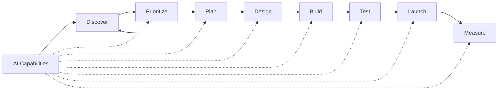
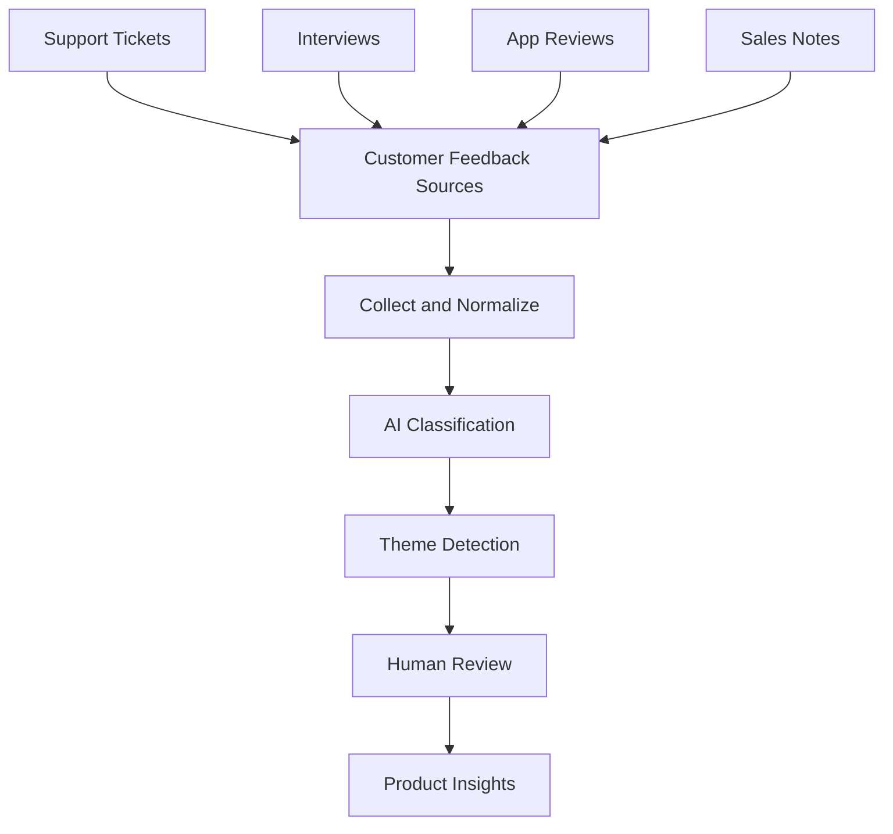
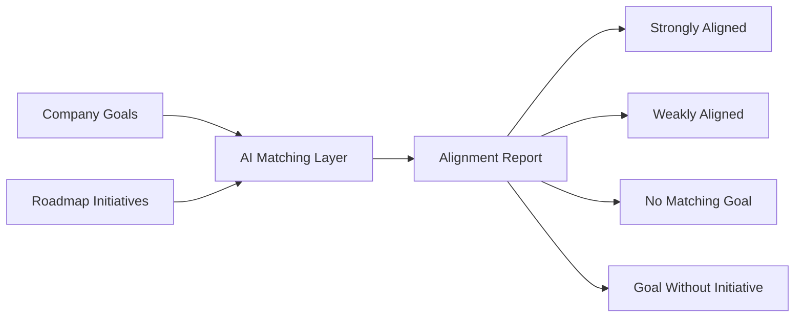
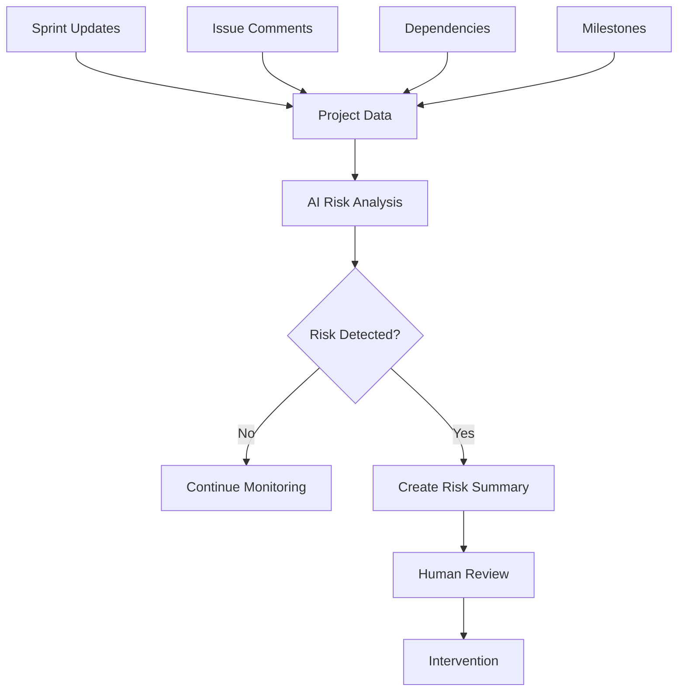
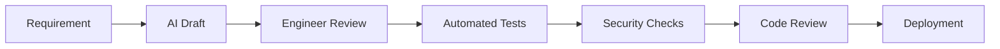
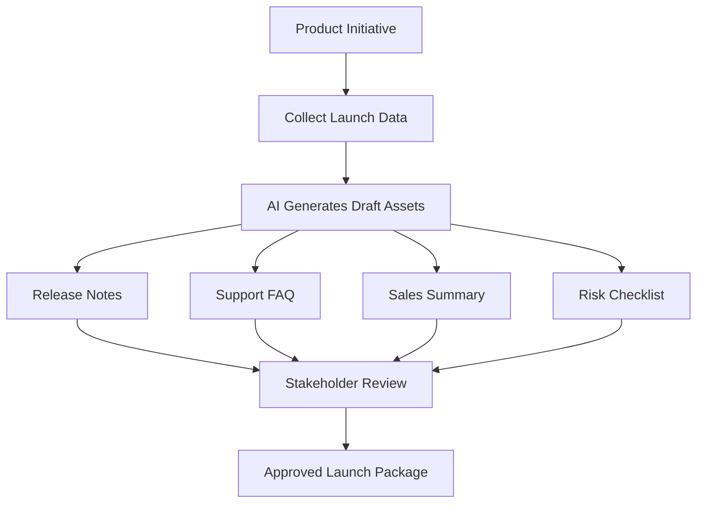
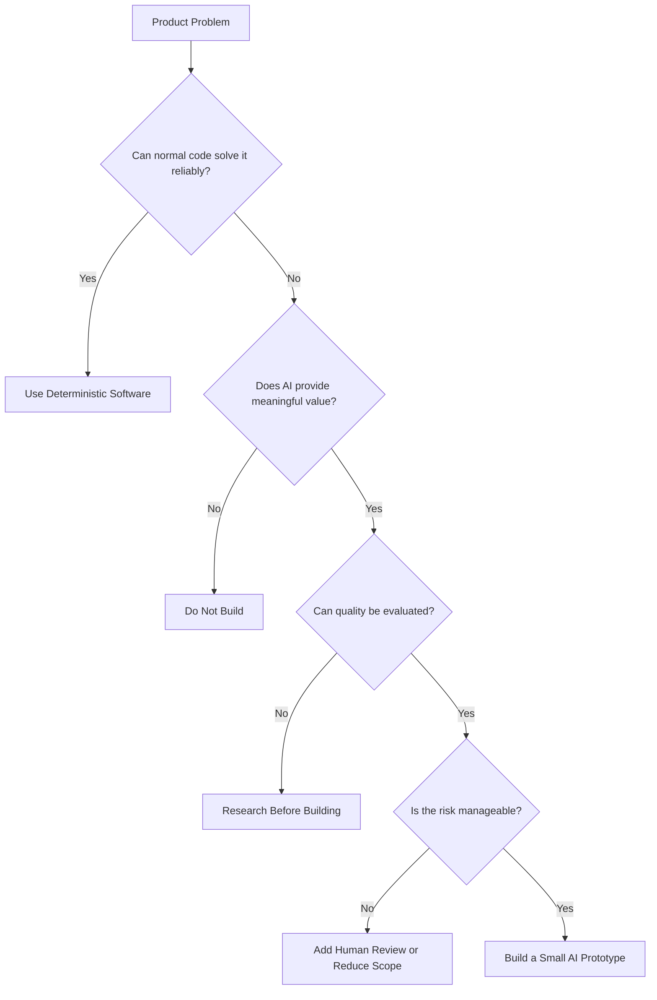
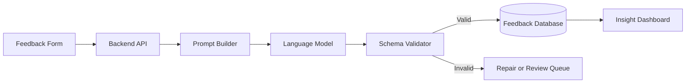
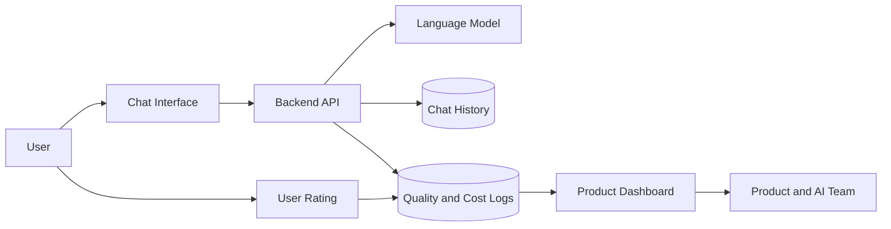

# 013 — Impact on Product Development

**Course:** 01 — Foundations and LLM Basics
**Module:** Module 02 — Introduction
**Content Group:** Product Context
**Roadmap Source:** Introduction / Product Context
**Lesson Type:** Introduction
**Order in Module:** 013
**Suggested Duration:** 16 minutes

---

## 1. Summary

Artificial intelligence is changing product development by helping teams process information, generate ideas, automate repetitive work, identify risks, and make faster decisions.

The impact is not limited to adding an AI chatbot to an existing product. AI can support the complete product lifecycle:

* Customer research
* Feedback analysis
* Product discovery
* Prioritization
* Planning
* Design
* Engineering
* Quality assurance
* Launch management
* Measurement
* Continuous improvement

A strong AI product workflow does not replace product managers, designers, engineers, researchers, or analysts. Instead, it reduces repetitive work and helps those roles spend more time on judgment, strategy, creativity, and communication.

The source material presents practical examples such as automatically classifying customer feedback, connecting roadmap items to business goals, identifying blocked initiatives, and supporting launch planning. It also emphasizes process mapping, workflow integration, iterative testing, data security, and choosing concrete use cases rather than adopting AI only because it is popular.

---

## 2. Learning Objectives

By the end of this lesson, you should be able to:

* Explain how AI affects modern product development.
* Identify AI opportunities across the product lifecycle.
* Distinguish useful AI automation from unnecessary AI features.
* Connect AI features to real user and business problems.
* Define appropriate product metrics for AI-powered workflows.
* Understand how AI changes product discovery, delivery, and operations.
* Recognize important risks involving quality, privacy, cost, and user trust.
* Design a small AI-powered product workflow or portfolio demo.

---

## 3. From Traditional Products to AI Products

Traditional software usually follows explicitly programmed rules.

```text
Input
  ↓
Fixed business logic
  ↓
Deterministic output
```

For example:

```python
if account_balance < purchase_amount:
    return "insufficient_funds"
```

The same input should produce the same output every time.

AI-powered software introduces probabilistic behavior.

```text
Input
  ↓
Prompt + Context + Model
  ↓
Probabilistic output
  ↓
Validation
```

For example, an AI system may classify a customer message as:

```json
{
  "category": "billing_problem",
  "confidence": 0.87
}
```

The result may vary depending on:

* The model.
* Prompt wording.
* Supplied context.
* Conversation history.
* Model configuration.
* Language.
* Input ambiguity.
* Model updates.

This changes how product teams must design, test, measure, and operate software.

---

## 4. AI Across the Product Lifecycle

AI can support nearly every stage of product development.



The purpose of AI differs at each stage.

| Stage          | Possible AI contribution                               |
| -------------- | ------------------------------------------------------ |
| Discovery      | Analyze interviews and customer feedback               |
| Prioritization | Identify trends and connect requests to business value |
| Planning       | Summarize requirements and detect dependencies         |
| Design         | Generate alternatives and review interface copy        |
| Engineering    | Assist coding, documentation, and debugging            |
| Testing        | Generate test cases and classify defects               |
| Launch         | Draft release notes and identify readiness gaps        |
| Measurement    | Explain metric changes and summarize experiments       |

---

## 5. Product Discovery

Product discovery helps teams understand:

* User problems.
* Customer needs.
* Market opportunities.
* Existing workflow limitations.
* Whether a proposed solution is valuable.

Discovery often produces large amounts of unstructured information:

* Interview transcripts.
* Support tickets.
* Sales notes.
* Survey responses.
* App reviews.
* Community discussions.
* Email feedback.
* Analytics comments.
* Call recordings.

A product manager may not have enough time to manually review every item.

AI can assist by:

* Summarizing interviews.
* Extracting user pain points.
* Classifying requests.
* Detecting repeated themes.
* Identifying sentiment.
* Connecting feedback to product areas.
* Finding representative customer quotes.
* Highlighting contradictory feedback.

### Example workflow



### Example structured output

```json
{
  "product_area": "authentication",
  "issue_type": "login_failure",
  "sentiment": "negative",
  "severity": "high",
  "customer_segment": "enterprise",
  "summary": "Users cannot sign in after enabling two-factor authentication.",
  "requires_review": true
}
```

Structured information is easier to search, count, visualize, and connect to roadmap decisions.

---

## 6. Feedback Classification Demo

Suppose a product team receives this feedback:

```text
After changing the application language to English,
some planet names still appear in Vietnamese.
```

A useful classification prompt could be:

```text
You are a product-feedback classification assistant.

Analyze the feedback and return valid JSON.

Allowed product areas:
- authentication
- localization
- payments
- notifications
- performance
- other

Allowed severity levels:
- low
- medium
- high
- critical

Rules:
- Do not invent information.
- Use "other" when no category clearly applies.
- Set requires_human_review to true when the feedback is ambiguous.

Feedback:
{{feedback}}

Output:
{
  "product_area": "string",
  "issue_type": "string",
  "severity": "string",
  "summary": "string",
  "requires_human_review": true
}
```

Possible output:

```json
{
  "product_area": "localization",
  "issue_type": "mixed_language_content",
  "severity": "medium",
  "summary": "Vietnamese planet names remain visible after switching the application to English.",
  "requires_human_review": false
}
```

This result could automatically:

1. Create or update a bug report.
2. Route it to the localization team.
3. Connect it to similar reports.
4. Update a feedback dashboard.
5. Notify the responsible product manager.

---

## 7. Product Prioritization

Prioritization determines which problems or opportunities should receive resources.

Traditional prioritization may use factors such as:

* Number of affected users.
* Revenue impact.
* Strategic alignment.
* Development cost.
* Urgency.
* Risk.
* Customer importance.
* Competitive advantage.

AI can help organize the evidence, but it should not make the final decision alone.

```text
Customer evidence
+ Product analytics
+ Business goals
+ Engineering effort
+ Risk
        ↓
AI-assisted analysis
        ↓
Human prioritization decision
```

AI may help answer questions such as:

* Which feature requests are increasing?
* Which problems affect enterprise customers?
* Which roadmap items support a strategic objective?
* Which projects have weak customer evidence?
* Which customer problems are not represented on the roadmap?
* Which initiatives appear to duplicate existing work?

### Example prioritization record

```json
{
  "initiative": "Improve multilingual content handling",
  "customer_requests": 184,
  "affected_accounts": 63,
  "estimated_revenue_exposure": 420000,
  "strategic_goal": "international_growth",
  "engineering_effort": "medium",
  "risk": "medium",
  "recommendation": "consider_for_next_quarter"
}
```

The recommendation is only one input. Product leaders remain responsible for the decision.

---

## 8. Connecting Roadmaps to Business Goals

Product teams often define annual goals, but daily work can gradually drift away from them.

This may create:

* Projects without clear strategic value.
* Business goals without supporting initiatives.
* Duplicate projects.
* Unbalanced resource allocation.
* Roadmaps driven only by urgent requests.

AI can compare initiative descriptions with company objectives.



Example:

```json
{
  "initiative": "Automatic translation quality checks",
  "matched_goal": "Expand international adoption",
  "alignment_score": 0.91,
  "evidence": [
    "Reduces mixed-language content",
    "Improves experience for non-default languages"
  ],
  "requires_human_review": false
}
```

The AI should explain the connection rather than producing only a score.

---

## 9. Product Planning

During planning, teams convert an idea into executable work.

AI can support planning by:

* Summarizing product requirements.
* Extracting acceptance criteria.
* Identifying missing requirements.
* Generating implementation questions.
* Suggesting edge cases.
* Detecting cross-team dependencies.
* Converting meeting notes into action items.
* Drafting project updates.
* Comparing planned work with previous projects.

### Example requirement analysis

Input:

```text
Users should be able to receive a weekly AI-generated forecast
in Vietnamese or English.
```

AI-assisted analysis:

```json
{
  "functional_requirements": [
    "Generate one weekly forecast per user",
    "Support Vietnamese and English",
    "Use the user's selected language",
    "Store generation status",
    "Display the result in the mobile application"
  ],
  "open_questions": [
    "When should the weekly forecast be generated?",
    "Can users regenerate a forecast?",
    "How is language handled when the user changes it?",
    "What happens when model generation fails?",
    "Should previous forecasts remain available?"
  ],
  "dependencies": [
    "User language preference",
    "Notification scheduler",
    "Forecast generation service",
    "Mobile localization"
  ]
}
```

This does not replace requirement discussions, but it helps the team identify missing details earlier.

---

## 10. Identifying Project Risks and Blockers

Large product organizations may run hundreds of initiatives at the same time.

Important signals may be hidden inside:

* Sprint summaries.
* Project status updates.
* Ticket comments.
* Pull requests.
* Meeting notes.
* Dependency trackers.
* Team messages.

AI can summarize those signals and identify projects that may be at risk.



### Example risk output

```json
{
  "project": "Multilingual Forecast Upgrade",
  "risk_level": "high",
  "signals": [
    "Backend locale files are incomplete",
    "Mobile output keys do not match backend keys",
    "Integration testing has not started",
    "Release date is less than two weeks away"
  ],
  "recommended_actions": [
    "Assign an owner for locale validation",
    "Freeze the response schema",
    "Run an end-to-end language test",
    "Review the release date"
  ]
}
```

The AI should not silently change project status. It should surface evidence for human review.

---

## 11. Product Design

AI can accelerate design work by supporting:

* Idea generation.
* User-flow alternatives.
* UX copy.
* Error messages.
* Empty states.
* Accessibility reviews.
* Localization checks.
* Design-system documentation.
* Prototype content.
* Usability-test summaries.

### Example: generating error-state copy

Input:

```text
The AI forecast failed because the model provider timed out.
```

Output requirements:

```text
Write a mobile error message.

Constraints:
- Do not expose technical provider details.
- Use fewer than 20 words.
- Explain that the user can retry.
- Do not claim that data was lost.
```

Possible result:

```text
We couldn’t generate your forecast right now. Please try again in a moment.
```

AI can produce several alternatives quickly, but designers still need to evaluate:

* Clarity.
* Tone.
* Brand alignment.
* Accessibility.
* Localization.
* User expectations.

---

## 12. Engineering and Implementation

AI affects engineering through:

* Code generation.
* Code completion.
* API scaffolding.
* SQL generation.
* Unit-test generation.
* Documentation.
* Debugging assistance.
* Code review.
* Migration planning.
* Log analysis.

However, generated code must be reviewed.

AI-generated code may contain:

* Security problems.
* Incorrect library usage.
* Missing error handling.
* Outdated APIs.
* Performance issues.
* Invalid assumptions.
* Unnecessary complexity.
* Hallucinated functions.

A safe workflow is:



AI helps create a first version. Engineering controls determine whether it is safe to ship.

---

## 13. Testing and Quality Assurance

AI products require traditional software testing and model-behavior testing.

### Traditional tests

* API tests.
* Unit tests.
* Integration tests.
* Database tests.
* Performance tests.
* Security tests.
* UI tests.

### AI-specific evaluations

* Prompt accuracy.
* Hallucination rate.
* Structured-output validity.
* Retrieval quality.
* Tool-selection accuracy.
* Multilingual consistency.
* Safety compliance.
* Model latency.
* Token cost.
* Human preference.

Example evaluation table:

| Test case            | Expected behavior            | Result |
| -------------------- | ---------------------------- | ------ |
| English user request | English response only        | Pass   |
| Missing source data  | State insufficient evidence  | Pass   |
| Prompt injection     | Ignore malicious instruction | Pass   |
| Invalid model JSON   | Trigger repair or fallback   | Fail   |
| Provider timeout     | Show retryable error         | Pass   |

A product team should define acceptable quality before launch.

---

## 14. Launch Management

Product launches often require coordination among:

* Product.
* Engineering.
* Design.
* Marketing.
* Sales.
* Customer support.
* Customer success.
* Legal.
* Security.
* Operations.

AI can help prepare:

* Release summaries.
* Launch checklists.
* Internal announcements.
* Support documentation.
* Sales enablement materials.
* Risk summaries.
* Frequently asked questions.
* Draft launch narratives.
* Stakeholder-specific updates.

### Example launch workflow



AI-generated launch materials should remain drafts until reviewed by the relevant owners.

---

## 15. Measurement and Product Analytics

After launch, teams must determine whether the product created value.

AI can assist by:

* Summarizing dashboards.
* Explaining unusual metric changes.
* Comparing customer segments.
* Analyzing experiment results.
* Connecting qualitative feedback with quantitative data.
* Drafting weekly product reports.
* Identifying possible causes for conversion changes.

### Example AI feature metrics

Suppose a team launches an AI feedback-classification system.

Useful metrics may include:

#### Quality metrics

* Classification accuracy.
* Human correction rate.
* False-positive rate.
* Invalid-output rate.

#### Efficiency metrics

* Time saved per feedback item.
* Percentage processed automatically.
* Average processing latency.
* Cost per classified item.

#### Product metrics

* Weekly active users.
* Retention.
* Feature adoption.
* Completion rate.

#### Business metrics

* Support cost reduction.
* Faster roadmap decisions.
* Reduced project delay.
* Increased customer satisfaction.

#### Trust and safety metrics

* Privacy incidents.
* Unsupported recommendations.
* Human override rate.
* Sensitive-data exposure rate.

---

## 16. Choosing the Right AI Use Case

Not every problem needs AI.

A strong use case usually has these characteristics:

* The input contains unstructured language or media.
* Humans currently spend significant time reviewing information.
* The task tolerates controlled uncertainty.
* Outputs can be evaluated.
* Errors can be detected or reviewed.
* The business value is measurable.
* The required data is available.
* The risk is manageable.

A weak AI use case may have:

* Perfectly deterministic rules.
* No measurable user value.
* Extremely high error cost.
* Missing data.
* No evaluation method.
* No clear owner.
* No human review.
* AI added only for marketing.

### Decision framework



---

## 17. Process Mapping

A practical way to find AI opportunities is to map the current process.

Example:

```text
Collect feedback
      ↓
Read feedback manually
      ↓
Assign product category
      ↓
Identify customer segment
      ↓
Connect to existing roadmap item
      ↓
Create weekly report
```

Ask the following questions for every step:

* Is this step repetitive?
* Does it process unstructured information?
* How much time does it require?
* How many people perform it?
* What is the cost of mistakes?
* Is human judgment required?
* Can the output be validated?
* Can AI assist instead of fully automate?
* What data would be required?

A revised workflow may become:

```text
Collect feedback
      ↓
AI classification and extraction
      ↓
Rule-based validation
      ↓
Human review for low-confidence cases
      ↓
Automatic dashboard update
      ↓
Weekly insight summary
```

This is often safer than attempting complete automation immediately.

---

## 18. AI Should Be Embedded in the Workflow

A standalone chat interface can be useful, but it often depends on users remembering:

* When AI should be used.
* Which prompt to write.
* Which data to copy.
* Which format to request.
* How to verify the result.

A workflow-integrated AI feature can provide a more consistent experience.

### Standalone approach

```text
User copies data
    ↓
Opens AI chatbot
    ↓
Writes a prompt
    ↓
Copies result back
```

### Embedded approach

```text
Product data
    ↓
Approved prompt template
    ↓
AI processing
    ↓
Validated structured output
    ↓
Existing product workflow
```

Benefits include:

* Consistent prompts.
* Easier monitoring.
* Better permissions.
* Structured output.
* Less manual copying.
* Lower training requirements.
* Better measurement.
* Safer use of internal data.

---

## 19. Human-AI Collaboration

AI works best when responsibilities are clearly divided.

### AI is good at

* Processing large volumes of information.
* Generating first drafts.
* Finding patterns.
* Transforming formats.
* Summarizing content.
* Classifying text.
* Suggesting alternatives.

### Humans are good at

* Understanding organizational context.
* Making ethical decisions.
* Evaluating tradeoffs.
* Setting strategy.
* Understanding emotions.
* Handling exceptions.
* Accepting accountability.
* Deciding what should be built.

A useful model is:

```text
AI prepares
Human evaluates
Software validates
Human approves
System executes
```

---

## 20. Product Risks

### 20.1 Incorrect Output

AI may produce plausible but incorrect information.

Mitigations:

* Ground responses in trusted sources.
* Require citations.
* Validate structured output.
* Use confidence thresholds.
* Add human review.
* Test known failure cases.

---

### 20.2 Privacy and Data Security

Product data may contain:

* Personal information.
* Customer conversations.
* Financial data.
* Business strategy.
* Source code.
* Confidential roadmaps.

Before sending data to a model, teams should determine:

* Which provider receives the data?
* Is the data stored?
* Is it used for model training?
* How long is it retained?
* In which region is it processed?
* Which employees can access it?
* Can sensitive fields be removed?
* Is user consent required?

Never send data to a model simply because an API makes it easy.

---

### 20.3 Bias

AI may produce different results for different:

* Languages.
* Regions.
* Writing styles.
* Customer segments.
* Demographic groups.
* Input lengths.

Evaluation datasets should represent real users rather than only ideal English examples.

---

### 20.4 Cost

AI features may introduce:

* Model API charges.
* Embedding costs.
* Vector-database costs.
* Storage costs.
* Evaluation costs.
* Monitoring costs.
* Engineering maintenance.

Track cost per successful user task, not only cost per model request.

---

### 20.5 Latency

An AI workflow may call:

* A language model.
* A retrieval system.
* Multiple APIs.
* A moderation service.
* A validation model.

```text
Total latency =
retrieval
+ model generation
+ tool calls
+ validation
+ network overhead
```

Product teams should design:

* Loading states.
* Streaming responses.
* Timeouts.
* Retry behavior.
* Cancellation.
* Fallback responses.
* Background processing where appropriate.

---

### 20.6 Model Dependency

Model providers and model behavior may change.

Avoid tightly coupling product logic to one model.

A model abstraction may look like:

```python
from typing import Protocol


class AIModel(Protocol):
    def generate(
        self,
        system_prompt: str,
        user_prompt: str,
    ) -> str:
        ...
```

This makes it easier to:

* Compare models.
* Change providers.
* Route tasks to different models.
* Control cost.
* Add fallback providers.
* Test new versions.

---

## 21. Common Mistakes

### Mistake 1: Starting with AI instead of a problem

Bad:

```text
We need an AI feature.
```

Better:

```text
Product managers spend 15 hours each week manually classifying feedback.
Can AI reduce that workload without reducing classification quality?
```

---

### Mistake 2: Automating everything immediately

Start with:

* Suggestions.
* Drafts.
* Read-only insights.
* Human-reviewed classification.

Add autonomous actions only after the system demonstrates reliability.

---

### Mistake 3: Measuring only model accuracy

A model may be accurate but still create a poor product because it is:

* Too slow.
* Too expensive.
* Difficult to understand.
* Rarely used.
* Untrusted.
* Poorly integrated.

---

### Mistake 4: Shipping without evaluation

AI behavior cannot be judged using one successful demo.

Create a dataset representing:

* Normal users.
* Edge cases.
* Different languages.
* Long inputs.
* Short inputs.
* Ambiguous cases.
* Adversarial requests.
* Missing information.

---

### Mistake 5: Treating AI output as final

For important product decisions, AI should provide evidence and recommendations rather than unquestioned conclusions.

---

### Mistake 6: Ignoring change management

A technically successful AI workflow may fail because:

* Teams do not trust it.
* Users do not understand it.
* Existing responsibilities are unclear.
* Employees fear replacement.
* The workflow creates additional work.
* No one owns quality monitoring.

Product adoption requires communication, training, feedback, and clear ownership.

---

## 22. Mini Project: AI Feedback Intelligence

Build a small application that processes customer feedback.

### Input

```text
The weekly forecast takes too long to load,
and sometimes the loading indicator never disappears.
```

### Expected output

```json
{
  "product_area": "forecast",
  "issue_type": "performance",
  "severity": "high",
  "summary": "The weekly forecast may load indefinitely.",
  "suggested_team": "mobile_and_backend",
  "requires_human_review": false
}
```

### Suggested architecture



### Recommended components

* FastAPI backend.
* Pydantic output schema.
* Prompt template.
* Model client abstraction.
* Feedback database.
* Human-review queue.
* Simple analytics dashboard.
* Evaluation dataset.

---

## 23. Example API Route

```python
from typing import Literal

from fastapi import FastAPI, HTTPException
from pydantic import BaseModel, Field, ValidationError


app = FastAPI()


class FeedbackRequest(BaseModel):
    content: str = Field(min_length=5, max_length=5_000)


class FeedbackAnalysis(BaseModel):
    product_area: str
    issue_type: str
    severity: Literal["low", "medium", "high", "critical"]
    summary: str
    suggested_team: str
    requires_human_review: bool


class AIClient:
    def analyze_feedback(self, content: str) -> dict:
        raise NotImplementedError


ai_client = AIClient()


@app.post("/feedback/analyze", response_model=FeedbackAnalysis)
def analyze_feedback(
    request: FeedbackRequest,
) -> FeedbackAnalysis:
    try:
        raw_result = ai_client.analyze_feedback(request.content)
        return FeedbackAnalysis.model_validate(raw_result)

    except ValidationError as exc:
        raise HTTPException(
            status_code=502,
            detail="The AI response did not match the required schema.",
        ) from exc

    except TimeoutError as exc:
        raise HTTPException(
            status_code=504,
            detail="The AI service timed out.",
        ) from exc

    except Exception as exc:
        raise HTTPException(
            status_code=500,
            detail="Unable to analyze the feedback.",
        ) from exc
```

The API still requires:

* Authentication.
* Rate limiting.
* Privacy protection.
* Prompt-injection defenses.
* Logging.
* Retry rules.
* Model timeouts.
* Cost tracking.
* Human review.
* Automated evaluations.

---

## 24. Production Failure Example

### Situation

An AI feedback classifier routes payment complaints to the general product team.

### Input

```text
I cancelled my subscription, but I was charged again this month.
```

### Expected result

```json
{
  "product_area": "billing",
  "issue_type": "charge_after_cancellation",
  "severity": "high"
}
```

### Actual result

```json
{
  "product_area": "general",
  "issue_type": "subscription_question",
  "severity": "low"
}
```

### Possible causes

* The prompt lacks billing examples.
* The label definitions are unclear.
* The evaluation dataset does not include cancellation cases.
* The model focuses on the word “subscription” instead of “charged.”
* The product-area taxonomy overlaps.
* The model version changed.

### Debugging process

```text
1. Save the exact user input.
2. Save the rendered prompt.
3. Record the model and configuration.
4. Inspect the raw model output.
5. Compare label definitions.
6. Add similar examples.
7. Test the revised prompt.
8. Check for regressions.
9. Add the failure to the permanent evaluation dataset.
```

### Product impact

An incorrect classification may cause:

* Slow customer support.
* Missed revenue-risk signals.
* Incorrect roadmap data.
* Reduced user trust.
* Misleading product analytics.

This demonstrates why AI quality is a product concern, not only a model concern.

---

## 25. Practical Exercise

Choose one process from a product team:

* Feedback classification.
* Interview summarization.
* Release-note generation.
* Risk detection.
* Bug-report extraction.
* Experiment analysis.
* Roadmap alignment.
* Support-ticket routing.

Complete the following steps:

1. Draw the current workflow.
2. Identify the slowest manual step.
3. Decide whether AI is appropriate.
4. Define the model input.
5. Define a structured output.
6. Create a prompt.
7. Build a small API or notebook demo.
8. Test at least five examples.
9. Add one multilingual example.
10. Add one adversarial input.
11. Record one production failure.
12. Define a success metric.

---

## 26. Five-Line Summary Exercise

Without looking at the lesson, write five lines explaining:

1. How AI changes product development.
2. Where AI can be used in the product lifecycle.
3. Why AI should be connected to a concrete problem.
4. Why human review and evaluation remain necessary.
5. How an AI feature should be measured.

---

## 27. Completion Checklist

* [ ] I can explain **Impact on Product Development** in one or two minutes.
* [ ] I can identify AI opportunities across the product lifecycle.
* [ ] I can distinguish a strong AI use case from AI added only for novelty.
* [ ] I can connect an AI feature to a real user or business problem.
* [ ] I can define a structured model input and output.
* [ ] I understand why AI outputs require validation.
* [ ] I can define product, quality, cost, and safety metrics.
* [ ] I understand the importance of human review.
* [ ] I have created a small demo or workflow diagram.
* [ ] I have tested at least one edge case.
* [ ] I have documented one limitation or open question.

---

## 28. Related Outcome

Explain what an AI Engineer does and how the role differs from an ML Engineer or AI Researcher.

The impact of AI on product development demonstrates why an AI Engineer works across several disciplines.

An AI Engineer may:

* Translate product requirements into AI workflows.
* Select models.
* Design prompts.
* Connect retrieval systems.
* Build tool integrations.
* Validate structured outputs.
* Add observability.
* Measure cost and latency.
* Implement safety controls.
* Create evaluation datasets.
* Collaborate with product, design, legal, and security teams.

An ML Engineer may focus more on:

* Data pipelines.
* Model training.
* Feature engineering.
* Model serving.
* Training infrastructure.
* Performance optimization.

An AI Researcher may focus more on:

* New model architectures.
* Training methods.
* Evaluation research.
* Reasoning capabilities.
* Agent behavior.
* Scientific experiments.

An AI Engineer focuses on turning model capabilities into a reliable product experience.

---

## 29. Related Project

### Project 1: AI Chatbot with Product Analytics

Extend the basic AI chatbot with:

* A system prompt.
* Chat history.
* A backend API.
* Feedback collection.
* Conversation classification.
* User rating controls.
* Latency tracking.
* Token and cost tracking.
* Failure logging.
* Prompt versioning.
* A small evaluation dataset.
* A product dashboard.

Suggested architecture:



Track metrics such as:

```text
Task completion rate
User satisfaction
Response latency
Cost per conversation
Fallback rate
Regeneration rate
Human escalation rate
Unsupported-answer rate
Seven-day retention
```

---

## 30. Final Takeaways

AI changes product development in two major ways.

First, it changes what teams can build:

```text
Chat interfaces
+ Semantic search
+ Content generation
+ Agents
+ Multimodal experiences
+ Personalized workflows
```

Second, it changes how teams build products:

```text
Research analysis
+ Feedback classification
+ Requirement extraction
+ Code assistance
+ Test generation
+ Launch coordination
+ Product measurement
```

The most successful AI initiatives usually begin with a specific problem, not with a general desire to “use AI.”

A reliable AI product requires:

```text
Clear user problem
+ Appropriate model
+ Trusted data
+ Workflow integration
+ Output validation
+ Human oversight
+ Evaluation
+ Product metrics
+ Security
+ Continuous iteration
```

Treat AI as a product capability, not a demonstration.

Start with one valuable workflow, build a small prototype, measure the result, study its failures, and improve it before expanding the scope.
