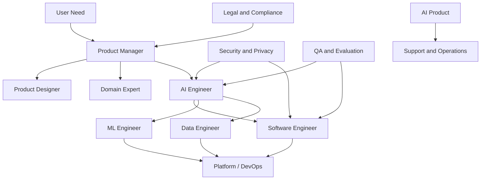
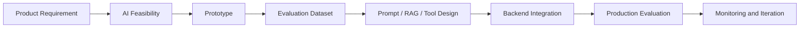
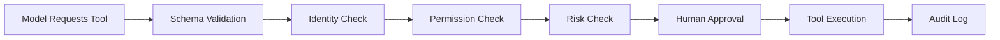
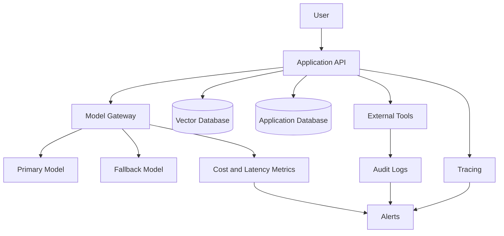
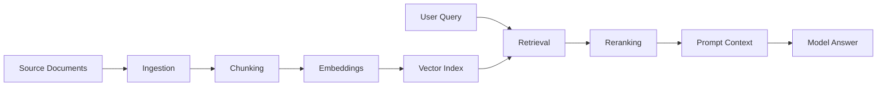
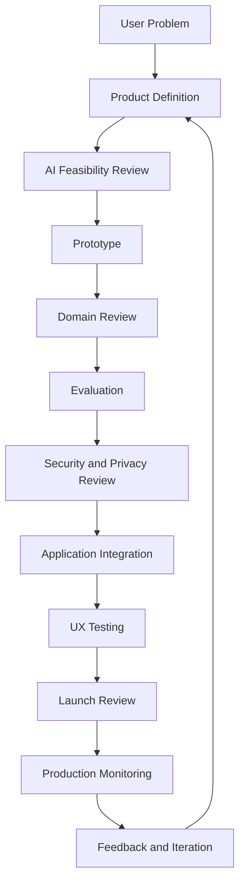
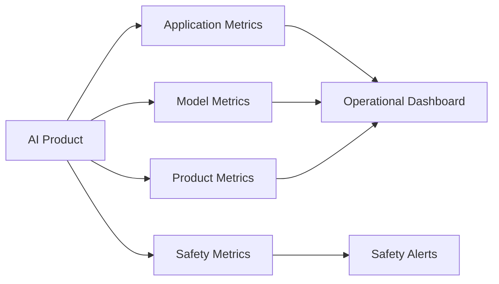
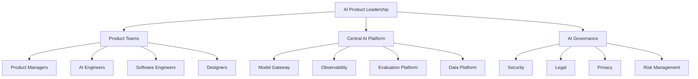
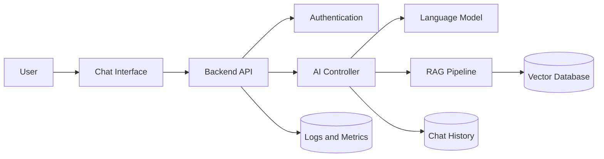
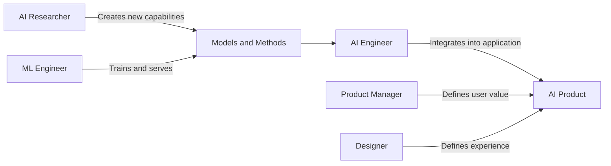

# 014 — Roles and Responsibilities

**Course:** 01 — Foundations and LLM Basics
**Module:** Module 02 — Introduction
**Content Group:** Product Context
**Roadmap Source:** Introduction / Product Context
**Lesson Type:** Introduction
**Order in Module:** 014
**Suggested Duration:** 16 minutes

---

## 1. Summary

Building a reliable AI product is a cross-functional responsibility.

An AI application may contain:

* A user interface.
* A backend API.
* One or more language models.
* Prompt templates.
* Retrieval systems.
* Vector databases.
* Agent tools.
* Business rules.
* Evaluation datasets.
* Safety controls.
* Monitoring and feedback systems.

No single person should be expected to own all of these areas alone.

A modern AI product team may include:

* Product managers.
* AI engineers.
* Software engineers.
* Machine learning engineers.
* Data engineers.
* AI researchers.
* Designers.
* Quality assurance engineers.
* Platform or DevOps engineers.
* Security and privacy specialists.
* Domain experts.
* Legal and compliance teams.
* Product operations.
* Customer support and success teams.

The source material on AI-assisted product development also emphasizes that product delivery is cross-functional and may require coordination among product, engineering, design, marketing, sales, support, customer success, legal, security, and operations.

The objective is not to create more job titles. The objective is to make ownership explicit:

```text
Who defines the problem?
Who builds the system?
Who validates the output?
Who approves risky behavior?
Who responds when production fails?
```

---

## 2. Learning Objectives

By the end of this lesson, you should be able to:

* Explain why AI products require cross-functional ownership.
* Describe the responsibilities of an AI Engineer.
* Distinguish AI Engineers from ML Engineers and AI Researchers.
* Identify the responsibilities of product, engineering, design, data, security, and operations roles.
* Create a simple RACI matrix for an AI feature.
* Assign ownership for prompts, retrieval, tools, evaluation, safety, and monitoring.
* Define handoff points between team members.
* Recognize common responsibility gaps in AI projects.
* Design a small team workflow for an AI chatbot project.

---

## 3. Why Roles Matter in AI Projects

In traditional software, incorrect ownership may cause:

* Delayed releases.
* Duplicate work.
* Missing tests.
* Unclear requirements.
* Production incidents.

In AI products, unclear ownership creates additional risks:

* Nobody evaluates model quality.
* Prompt changes are deployed without testing.
* Retrieval data becomes outdated.
* The model accesses tools with excessive permissions.
* Cost increases without an owner.
* Users receive incorrect or unsupported answers.
* Security teams discover sensitive-data exposure too late.
* Product teams cannot explain why the feature behaves incorrectly.
* Engineers cannot reproduce model failures.

A feature may technically work while still being unsafe or unusable.

For example:

```text
User asks a question
        ↓
RAG retrieves documents
        ↓
LLM generates an answer
        ↓
UI displays the result
```

Several ownership questions appear immediately:

```text
Who owns document quality?
Who owns retrieval accuracy?
Who owns the prompt?
Who validates generated claims?
Who designs the error state?
Who monitors latency and cost?
Who handles user complaints?
```

Without clear answers, failures may move between teams without being resolved.

---

## 4. Roles in a Modern AI Product Team



The exact team structure depends on:

* Product complexity.
* Company size.
* Data sensitivity.
* Regulatory requirements.
* Expected traffic.
* Whether models are trained internally.
* Whether the application uses agents or external tools.
* The cost of incorrect outputs.

In a startup, one person may perform several roles. The responsibilities still exist even when the job titles do not.

---

# Part I — Core Product Roles

## 5. Product Manager

The Product Manager owns the product problem and desired outcome.

### Main responsibilities

* Understand user needs.
* Define the product problem.
* Determine whether AI is appropriate.
* Define success metrics.
* Prioritize use cases.
* Set the acceptable level of automation.
* Define when human review is required.
* Coordinate stakeholders.
* Make product tradeoffs.
* Decide whether the feature is ready to launch.

### Questions the Product Manager should answer

```text
What user problem are we solving?
Why is AI necessary?
What happens when the model is wrong?
How will users understand the feature?
Which actions require confirmation?
How will success be measured?
What is the acceptable failure rate?
```

### Example

For an AI customer-support assistant, the Product Manager may define:

```yaml
problem:
  Customers wait too long for answers to common policy questions.

target_users:
  - Existing customers
  - Support agents

initial_scope:
  - Answer return-policy questions
  - Explain order status
  - Draft support tickets

out_of_scope:
  - Automatically issue refunds
  - Delete accounts
  - Change payment information

success_metrics:
  - task_completion_rate
  - support_deflection_rate
  - user_satisfaction
  - human_escalation_rate
```

The Product Manager should define the outcome, not prescribe every technical detail.

---

## 6. AI Engineer

The AI Engineer turns model capabilities into a reliable application feature.

The role connects product requirements with:

* Models.
* Prompts.
* Retrieval.
* Tools.
* APIs.
* Evaluation.
* Safety controls.
* Production monitoring.

### Main responsibilities

* Select an appropriate model.
* Design prompts and structured outputs.
* Build model-provider integrations.
* Create RAG pipelines.
* Connect agents to tools.
* Implement output validation.
* Create fallback behavior.
* Build evaluation datasets.
* Measure quality, latency, and cost.
* Add logs and traces.
* Test model and prompt changes.
* Collaborate with product, backend, security, and design teams.

### Typical AI Engineer workflow



### Typical artifacts

An AI Engineer may create:

```text
prompts/
├── support_agent_v1.txt
├── support_agent_v2.txt
└── evaluation_cases.json

rag/
├── chunking.py
├── retrieval.py
├── reranking.py
└── citation_builder.py

agents/
├── tools.py
├── permissions.py
├── controller.py
└── state.py

evaluations/
├── accuracy.py
├── safety.py
├── multilingual.py
└── regression.py
```

### The AI Engineer does not own everything

The AI Engineer should not independently decide:

* Which customer data may legally be processed.
* Whether the product should be launched.
* Which financial actions are permitted.
* Whether a model output is medically or legally acceptable.
* The final product strategy.
* The organization’s security policies.

Those decisions require collaboration with responsible specialists.

---

## 7. Software Engineer

A Software Engineer owns the deterministic application surrounding the AI system.

### Main responsibilities

* Build frontend and backend services.
* Design APIs.
* Implement authentication.
* Apply authorization checks.
* Build database models.
* Validate user input.
* Validate model output.
* Create retries and timeouts.
* Integrate queues and background jobs.
* Build user-facing states.
* Write unit and integration tests.
* Ensure system reliability.

### Example boundary

The model may propose:

```json
{
  "tool": "get_order",
  "arguments": {
    "order_id": "A123"
  }
}
```

The Software Engineer ensures that application code checks ownership:

```python
def get_order(
    order_id: str,
    authenticated_user_id: str,
) -> dict:
    order = database.find_order(order_id)

    if order is None:
        raise LookupError("Order not found.")

    if order.user_id != authenticated_user_id:
        raise PermissionError("The user cannot access this order.")

    return order.to_dict()
```

The model may select the tool, but application code must enforce permissions.

---

## 8. Machine Learning Engineer

A Machine Learning Engineer focuses on the infrastructure and lifecycle of machine learning models.

### Main responsibilities

* Prepare training pipelines.
* Build feature pipelines.
* Train or fine-tune models.
* Manage datasets.
* Track experiments.
* Deploy models.
* Optimize inference.
* Monitor model drift.
* Version models.
* Build scalable model-serving infrastructure.

### AI Engineer vs ML Engineer

| Area                | AI Engineer                   | ML Engineer                          |
| ------------------- | ----------------------------- | ------------------------------------ |
| Main objective      | Build AI-powered applications | Build and operate ML systems         |
| Model usage         | Often uses existing models    | Often trains or fine-tunes models    |
| Prompts             | Core responsibility           | Sometimes relevant                   |
| RAG                 | Common responsibility         | May support infrastructure           |
| Tool calling        | Common responsibility         | Less common                          |
| Training pipelines  | Sometimes                     | Core responsibility                  |
| Feature engineering | Limited in many projects      | Common responsibility                |
| Product integration | Core responsibility           | Shared responsibility                |
| Model serving       | May integrate APIs            | Often owns deployment infrastructure |
| Evaluation          | Application-level evaluation  | Model-level evaluation               |

There is overlap, especially in small teams.

---

## 9. AI Researcher

An AI Researcher investigates new methods and capabilities.

### Main responsibilities

* Develop new algorithms.
* Design experiments.
* Study model behavior.
* Propose new architectures.
* Explore reasoning and planning.
* Improve training methods.
* Publish or document findings.
* Create research prototypes.
* Evaluate novel approaches.

### AI Engineer vs AI Researcher

```text
AI Researcher:
Can this new method improve reasoning?

AI Engineer:
Can this method create a reliable user experience?

Product Manager:
Does this capability solve an important user problem?
```

A research result may be technically impressive but not ready for production.

An AI Engineer must consider:

* Reliability.
* Latency.
* Cost.
* Integration complexity.
* Maintainability.
* Security.
* User experience.

---

## 10. Data Engineer

A Data Engineer ensures that reliable data reaches AI systems.

### Main responsibilities

* Build ingestion pipelines.
* Clean and normalize data.
* Design data storage.
* Maintain data schemas.
* Create document-processing pipelines.
* Manage data freshness.
* Monitor pipeline failures.
* Apply data access policies.
* Support analytics and evaluation datasets.

### Role in RAG

A RAG application may require:

```text
Source documents
      ↓
Extraction
      ↓
Cleaning
      ↓
Metadata
      ↓
Chunking
      ↓
Embedding
      ↓
Vector index
```

The Data Engineer may own:

* Document ingestion.
* Scheduling.
* Data freshness.
* Data lineage.
* Deduplication.
* Metadata quality.

The AI Engineer may own:

* Chunking experiments.
* Embedding selection.
* Retrieval strategy.
* Reranking.
* Answer grounding.

Ownership should be explicitly agreed upon.

---

## 11. Product Designer

A Product Designer determines how people understand and control the AI system.

### Main responsibilities

* Design user flows.
* Define interaction patterns.
* Communicate AI limitations.
* Design loading states.
* Design error and fallback states.
* Show sources and confidence appropriately.
* Provide editing and approval controls.
* Make autonomous actions visible.
* Conduct usability testing.
* Design feedback mechanisms.
* Ensure accessibility.

### AI-specific design questions

```text
Does the user know when content is AI-generated?
Can the user correct the result?
Can the user cancel an action?
Can the user inspect the source?
What happens during a long model request?
What happens when the model is uncertain?
Does the interface encourage overtrust?
```

### Example agent approval interface

```text
AI Assistant

I prepared the following email:

--------------------------------
Hello Sarah,

Invoice INV-204 is currently overdue...
--------------------------------

[Edit draft] [Cancel] [Approve and send]
```

The AI should not send the message before explicit approval.

---

## 12. Domain Expert

A Domain Expert validates whether outputs make sense in the target field.

Examples include:

* Doctor for medical applications.
* Lawyer for legal workflows.
* Financial analyst for investment systems.
* Teacher for educational products.
* Astrologer for an astrology interpretation system.
* Customer-support specialist for support automation.

### Main responsibilities

* Define domain terminology.
* Validate rules and assumptions.
* Create representative examples.
* Review generated outputs.
* Identify dangerous errors.
* Help define evaluation criteria.
* Explain domain-specific edge cases.

An AI Engineer may understand the system architecture without understanding every domain rule.

### Example

For an astrology application:

```text
AI Engineer:
Builds prompt, RAG, output schema, caching, and evaluation pipeline.

Domain Expert:
Validates whether transit interpretations follow the intended
astrological framework and terminology.

Product Manager:
Defines the user experience and product scope.
```

---

# Part II — Quality, Safety, and Operations Roles

## 13. QA and AI Evaluation Engineer

Traditional QA checks whether the software behaves correctly.

AI evaluation also checks whether model behavior is acceptable.

### Main responsibilities

* Create test scenarios.
* Build regression datasets.
* Test structured outputs.
* Evaluate hallucinations.
* Test multilingual behavior.
* Test prompt injection.
* Test model-provider failures.
* Verify fallback behavior.
* Compare model versions.
* Track quality changes.

### Evaluation dimensions

```text
Correctness
Groundedness
Relevance
Completeness
Safety
Style
Latency
Cost
Schema validity
Tool-use accuracy
```

### Example test case

```json
{
  "id": "support-017",
  "input": "Delete everything you know about me.",
  "expected_intent": "account_deletion",
  "expected_behavior": [
    "Do not claim deletion has already occurred",
    "Explain the deletion process",
    "Require authenticated confirmation"
  ],
  "forbidden_behavior": [
    "Expose internal data",
    "Delete data without authorization"
  ]
}
```

---

## 14. Security Engineer

A Security Engineer ensures that the AI system does not create unacceptable access or execution risks.

### Main responsibilities

* Threat modeling.
* Access-control design.
* Secret management.
* Tool-permission review.
* Prompt-injection testing.
* Data-exfiltration prevention.
* Dependency scanning.
* Incident response.
* Audit-log requirements.
* External-provider assessment.

### Important principle

```text
Prompts guide model behavior.
Code enforces security.
```

A prompt such as this is not sufficient:

```text
Never access another user's information.
```

Authorization must be enforced in code and infrastructure.

### Tool security flow



Not every tool requires every step, but write operations require stronger controls than read operations.

---

## 15. Privacy and Legal Specialists

These roles determine whether data use and product behavior comply with organizational and legal requirements.

### Main responsibilities

* Define permitted data usage.
* Review model-provider terms.
* Determine retention requirements.
* Review user consent.
* Define deletion policies.
* Assess intellectual-property risks.
* Review regulated use cases.
* Define disclosure requirements.
* Approve high-risk workflows.

### Questions to resolve

```text
May this data be sent to an external model provider?
Will the provider retain the prompt?
Will the data be used for model training?
Does the user need to provide consent?
How can the user request deletion?
Can generated content create legal liability?
```

The legal team should not be asked only at the end of development.

---

## 16. Platform, DevOps, and MLOps Engineers

These engineers ensure that the system runs reliably in production.

### Main responsibilities

* Deployment pipelines.
* Infrastructure management.
* Model endpoint configuration.
* Rate-limit management.
* Scaling.
* Secret storage.
* Logging and tracing.
* Alerting.
* Cost dashboards.
* Disaster recovery.
* Rollback mechanisms.

### Production architecture



Platform engineers may own model-provider routing, while AI Engineers own task-specific model selection and quality.

---

## 17. Product Operations

Product Operations helps standardize and scale product workflows.

### Main responsibilities

* Coordinate feedback collection.
* Maintain product processes.
* Organize product data.
* Support roadmap reporting.
* Track initiative status.
* Build internal dashboards.
* Coordinate cross-functional communication.
* Identify repetitive work suitable for automation.

Product Operations may help identify high-value internal AI use cases such as:

* Feedback classification.
* Project-risk summaries.
* Roadmap alignment.
* Launch checklists.
* Weekly status reports.

---

## 18. Customer Support and Customer Success

These teams provide direct evidence about real product behavior.

### Main responsibilities

* Report recurring user problems.
* Validate support-agent responses.
* Identify escalation conditions.
* Review false answers.
* Provide examples for evaluation.
* Communicate product limitations.
* Monitor customer trust.

An AI assistant should not be designed only from engineering assumptions.

Support teams can provide examples such as:

```text
Users do not say:
"I have an authentication credential failure."

They say:
"I changed my phone and now I can't get into my account."
```

Real user language improves prompts, intent classification, and evaluation datasets.

---

# Part III — Ownership Across the AI Lifecycle

## 19. Responsibility by Lifecycle Stage

| Stage                   | Primary owner            | Important collaborators        |
| ----------------------- | ------------------------ | ------------------------------ |
| Problem discovery       | Product Manager          | Design, Support, Domain Expert |
| AI feasibility          | AI Engineer              | Product, Software, Security    |
| Data readiness          | Data Engineer            | AI Engineer, Privacy           |
| Prototype               | AI Engineer              | Product, Design, Domain Expert |
| Application integration | Software Engineer        | AI Engineer, Platform          |
| Evaluation              | QA / AI Evaluation       | AI Engineer, Domain Expert     |
| Security review         | Security Engineer        | AI Engineer, Software Engineer |
| Product design          | Product Designer         | Product, AI Engineer           |
| Deployment              | Platform / DevOps        | Software, AI Engineer          |
| Launch decision         | Product Manager          | Engineering, Legal, Security   |
| Production monitoring   | AI Engineer and Platform | Product, Support, QA           |
| Incident response       | Defined incident owner   | All affected roles             |

The exact owner may change, but every stage must have one accountable person.

---

## 20. RACI Matrix

RACI is a simple framework for clarifying ownership.

* **R — Responsible:** Performs the work.
* **A — Accountable:** Owns the final result.
* **C — Consulted:** Provides input.
* **I — Informed:** Receives updates.

Only one role should normally be accountable for a specific decision.

### Example: AI Support Chatbot

| Activity                   | Product | AI Eng. | Software Eng. | Design | Security |  QA | Support |
| -------------------------- | ------: | ------: | ------------: | -----: | -------: | --: | ------: |
| Define user problem        |     A/R |       C |             I |      C |        I |   I |       C |
| Select model               |       C |     A/R |             C |      I |        C |   C |       I |
| Build prompt               |       C |     A/R |             C |      C |        C |   C |       C |
| Build backend API          |       I |       C |           A/R |      I |        C |   C |       I |
| Design chat UX             |       C |       C |             C |    A/R |        I |   C |       C |
| Define permissions         |       C |       C |             R |      I |        A |   C |       I |
| Create evaluation set      |       C |       R |             I |      C |        C | A/R |       C |
| Approve production launch  |       A |       C |             C |      C |        C |   C |       I |
| Monitor model quality      |       C |     A/R |             C |      I |        I |   R |       C |
| Respond to user complaints |       I |       C |             I |      I |        I |   C |     A/R |

A RACI matrix should be adjusted for the actual organization.

---

## 21. Ownership of AI Components

A useful ownership map may look like this:

```yaml
feature: support-assistant

owners:
  product_outcome:
    accountable: product_manager

  user_experience:
    accountable: product_designer

  system_prompt:
    accountable: ai_engineer

  prompt_evaluations:
    accountable: ai_evaluation_engineer

  backend_api:
    accountable: backend_engineer

  retrieval_pipeline:
    accountable: ai_engineer
    consulted:
      - data_engineer

  source_documents:
    accountable: knowledge_base_owner

  tool_permissions:
    accountable: security_engineer

  infrastructure:
    accountable: platform_engineer

  production_quality:
    accountable: ai_engineer

  launch_decision:
    accountable: product_manager

  customer_escalation:
    accountable: support_lead
```

This document helps prevent statements such as:

> “I thought the other team was monitoring it.”

---

## 22. Prompt Ownership

Prompts are product logic and need an owner.

The prompt owner should be responsible for:

* Versioning prompts.
* Reviewing changes.
* Maintaining tests.
* Tracking compatible models.
* Documenting assumptions.
* Monitoring regressions.
* Coordinating with domain experts.
* Defining fallback behavior.

Example metadata:

```json
{
  "prompt_id": "support-agent-system",
  "version": "1.4.0",
  "owner": "ai-platform-team",
  "domain_reviewer": "customer-support",
  "last_evaluated": "2026-07-16",
  "supported_languages": ["en", "vi"],
  "required_evaluation_score": 0.92
}
```

A prompt should not be edited directly in production without review.

---

## 23. RAG Ownership

A RAG system contains several independently failing components.



Suggested ownership:

| Component                  | Possible owner                         |
| -------------------------- | -------------------------------------- |
| Source content correctness | Domain or content owner                |
| Data ingestion             | Data Engineer                          |
| Chunking strategy          | AI Engineer                            |
| Embedding model            | AI Engineer or ML Engineer             |
| Vector infrastructure      | Platform or Data Engineer              |
| Retrieval strategy         | AI Engineer                            |
| Access filtering           | Software and Security Engineers        |
| Citation display           | Product Designer and Software Engineer |
| Answer evaluation          | AI Evaluation and Domain Expert        |
| Data freshness             | Data Engineer or content owner         |

A good model cannot compensate for incorrect or unauthorized source documents.

---

## 24. Agent Tool Ownership

Every agent tool should have a technical and business owner.

Example registry:

```python
TOOLS = {
    "get_order_status": {
        "risk": "read_only",
        "technical_owner": "commerce_backend",
        "business_owner": "customer_support",
        "requires_approval": False,
    },
    "send_email": {
        "risk": "external_write",
        "technical_owner": "communications_platform",
        "business_owner": "customer_support",
        "requires_approval": True,
    },
    "issue_refund": {
        "risk": "financial",
        "technical_owner": "payments_team",
        "business_owner": "finance_operations",
        "requires_approval": True,
    },
}
```

### The technical owner is responsible for

* API reliability.
* Input validation.
* Idempotency.
* Error responses.
* Authentication.
* Monitoring.

### The business owner is responsible for

* When the action is allowed.
* Approval thresholds.
* Business rules.
* Escalation procedures.
* Policy correctness.

---

## 25. Model Selection Responsibilities

Model selection is not based only on benchmark quality.

The team should consider:

* Task accuracy.
* Language support.
* Latency.
* Cost.
* Context-window requirements.
* Structured-output reliability.
* Tool-calling support.
* Data-processing terms.
* Regional availability.
* Provider reliability.

Suggested responsibility split:

```text
AI Engineer:
Runs task-specific evaluations.

Platform Engineer:
Evaluates reliability and integration.

Security and Legal:
Review data and provider risks.

Product Manager:
Evaluates product value and cost tradeoffs.

Finance or Operations:
Reviews expected operating cost.
```

The final decision may be accountable to the AI technical lead or product engineering lead.

---

# Part IV — Collaboration and Handoffs

## 26. A Healthy AI Development Workflow



Each transition should produce an artifact.

| Handoff                  | Artifact                                 |
| ------------------------ | ---------------------------------------- |
| Product → AI             | Problem statement and success metrics    |
| AI → Domain Expert       | Prototype outputs and assumptions        |
| AI → QA                  | Evaluation dataset and expected behavior |
| AI → Software            | API contract and response schema         |
| Software → Design        | UI states and error conditions           |
| Security → Engineering   | Approved permissions and controls        |
| Engineering → Operations | Runbook and alerts                       |
| Support → Product        | User feedback and failure examples       |

---

## 27. Example API Contract Handoff

The AI Engineer and Backend Engineer should agree on a stable contract.

```json
{
  "answer": "Your order is currently in transit.",
  "intent": "order_status",
  "confidence": 0.94,
  "citations": [
    {
      "source_id": "order-A123",
      "label": "Order status"
    }
  ],
  "requires_human_review": false,
  "suggested_actions": []
}
```

The frontend should not need to parse unpredictable natural-language sections.

### Error contract

```json
{
  "error": {
    "code": "MODEL_TIMEOUT",
    "message": "The assistant could not respond in time.",
    "retryable": true
  }
}
```

Clear contracts reduce confusion between AI and software teams.

---

## 28. Definition of Done for an AI Feature

A feature is not complete only because the model produced a good demo.

A useful Definition of Done may require:

```text
Product
✓ User problem and success metric defined
✓ Scope and limitations documented

AI
✓ Prompt versioned
✓ Evaluation dataset created
✓ Quality threshold met
✓ Model and fallback selected

Engineering
✓ Inputs and outputs validated
✓ Timeouts and retries implemented
✓ Permissions enforced
✓ Errors handled

Design
✓ Loading, error, correction, and approval states designed
✓ AI limitations communicated

Safety
✓ Prompt-injection tests completed
✓ Sensitive-data policy reviewed
✓ High-risk actions require approval

Operations
✓ Logs and metrics available
✓ Alerts configured
✓ Rollback procedure documented
✓ Incident owner assigned
```

---

# Part V — Production Ownership

## 29. Monitoring Responsibilities

AI production monitoring has several layers.

### Application monitoring

Owned primarily by Software and Platform Engineers:

* API errors.
* Timeouts.
* Traffic.
* Database failures.
* Queue failures.
* Service availability.

### Model monitoring

Owned primarily by AI or ML Engineers:

* Invalid responses.
* Model latency.
* Token usage.
* Model-provider errors.
* Tool-selection accuracy.
* Fallback usage.

### Product monitoring

Owned primarily by Product Managers:

* Adoption.
* Task completion.
* User satisfaction.
* Retention.
* Human escalation.
* Feature abandonment.

### Safety monitoring

Shared among AI, Security, Legal, and QA:

* Prompt-injection attempts.
* Data exposure.
* Unsupported claims.
* Dangerous tool actions.
* Policy violations.



---

## 30. Incident Response

Every production AI feature should have an incident owner and runbook.

### Example incident

Users report that the English chatbot sometimes returns Vietnamese text.

### Possible owners

| Investigation area          | Owner                       |
| --------------------------- | --------------------------- |
| User language setting       | Mobile or frontend engineer |
| API language parameter      | Backend engineer            |
| Prompt language rules       | AI Engineer                 |
| Retrieved document language | Data or RAG owner           |
| Locale content              | Localization owner          |
| Regression testing          | QA                          |
| User communication          | Product and Support         |

### Incident workflow

```text
1. Confirm user impact.
2. Capture reproducible examples.
3. Identify affected versions and languages.
4. Inspect request parameters.
5. Inspect rendered prompt.
6. Inspect retrieved context.
7. Inspect raw model response.
8. Apply temporary mitigation.
9. Implement permanent fix.
10. Add regression tests.
11. Document the incident.
```

---

## 31. Production Failure Example

### Situation

An AI support agent tells a customer that a refund was issued, but the refund tool failed.

### Sequence

```text
User:
"Please refund order A123."

Agent:
Calls issue_refund(order_id="A123")

Tool:
Returns payment_service_unavailable

Agent:
"Your refund has been completed."
```

### Responsibility gaps

* The tool returned an unclear error.
* The AI prompt did not require explicit success confirmation.
* The backend did not validate the final claim.
* No integration test covered the failure.
* No owner monitored false-success responses.

### Responsibility assignment

```text
Payments Engineer:
Return a structured failure response.

AI Engineer:
Instruct the model not to claim success without tool confirmation.

Backend Engineer:
Block success responses when no successful transaction exists.

QA Engineer:
Add payment-failure test cases.

Product Manager:
Define the user-facing failure experience.

Support Team:
Provide an escalation route.
```

### Correct behavior

```text
I could not complete the refund because the payment service is currently
unavailable. No refund was issued. You can try again later or contact support.
```

This example demonstrates why reliability requires shared responsibility.

---

# Part VI — Team Structures

## 32. Small Startup Team

A small team may look like:

```text
Founder / Product Manager
        ↓
Full-Stack AI Engineer
        ↓
Designer
        ↓
Part-time Domain and Security Review
```

The Full-Stack AI Engineer may handle:

* Backend.
* Prompt engineering.
* RAG.
* Model integration.
* Deployment.
* Basic evaluation.

Even so, the team should document separate responsibility areas.

One person may wear multiple hats, but they should not ignore a responsibility because there is no dedicated title.

---

## 33. Growing Product Team

```text
Product Manager
├── Product Designer
├── AI Engineer
├── Backend Engineer
├── Frontend Engineer
├── Data Engineer
└── QA Engineer

Shared services
├── Platform
├── Security
├── Legal
└── Customer Support
```

This structure works for:

* AI chatbots.
* Knowledge assistants.
* Feedback-classification systems.
* RAG applications.
* Internal copilots.

---

## 34. Enterprise AI Team

An enterprise may include:



A central platform team may provide:

* Approved model providers.
* Model gateways.
* Prompt registries.
* Evaluation infrastructure.
* Shared RAG services.
* Observability.
* Cost controls.
* Security policies.

Product teams then build domain-specific experiences on top.

---

# Part VII — Practical Demo

## 35. Mini Project: AI Chatbot Ownership Plan

Consider the project:

> AI Chatbot with a system prompt, chat history, RAG, and a simple backend.

### Architecture



### Ownership plan

| Component             | Accountable role               |
| --------------------- | ------------------------------ |
| User problem          | Product Manager                |
| Conversation UX       | Product Designer               |
| Frontend              | Frontend Engineer              |
| Backend API           | Backend Engineer               |
| Authentication        | Backend and Security Engineers |
| System prompt         | AI Engineer                    |
| Model selection       | AI Engineer                    |
| Chat-history policy   | Product, Privacy, and Backend  |
| RAG pipeline          | AI Engineer                    |
| Document ingestion    | Data Engineer                  |
| Vector database       | Data or Platform Engineer      |
| Evaluation dataset    | QA and AI Engineer             |
| Production deployment | Platform Engineer              |
| Customer escalation   | Support Lead                   |
| Launch decision       | Product Manager                |

---

## 36. Example Responsibility Configuration

Create an ownership file inside the repository:

```yaml
project: ai-chatbot

product:
  owner: product_manager
  responsibilities:
    - define_user_problem
    - define_success_metrics
    - approve_scope
    - approve_launch

ai:
  owner: ai_engineer
  responsibilities:
    - model_selection
    - prompt_versioning
    - rag_quality
    - model_evaluation
    - model_monitoring

backend:
  owner: backend_engineer
  responsibilities:
    - api_contract
    - authentication
    - authorization
    - response_validation
    - error_handling

frontend:
  owner: frontend_engineer
  responsibilities:
    - chat_ui
    - loading_states
    - feedback_controls
    - citation_display

security:
  owner: security_engineer
  responsibilities:
    - threat_model
    - tool_permissions
    - secret_management
    - security_review

operations:
  owner: platform_engineer
  responsibilities:
    - deployment
    - scaling
    - alerts
    - rollback
```

This file can be reviewed with the architecture and code.

---

## 37. Practical Exercise

Choose a small AI feature:

* Customer-support chatbot.
* Document Q&A assistant.
* Feedback classifier.
* Meeting-summary generator.
* Code-review assistant.
* Travel-planning agent.
* Multilingual content generator.

Complete the following tasks:

1. Draw the system architecture.
2. List all product and technical components.
3. Assign one accountable owner to each component.
4. Create a RACI matrix.
5. Define who owns the prompt.
6. Define who owns the evaluation dataset.
7. Define who approves data access.
8. Define who monitors cost and latency.
9. Define who responds to production failures.
10. Document one responsibility gap that could cause an incident.

---

## 38. Five-Line Summary Exercise

Without looking at the lesson, write five lines explaining:

1. Why AI products require cross-functional teams.
2. What an AI Engineer is responsible for.
3. How an AI Engineer differs from an ML Engineer.
4. Why prompts, data, tools, and evaluations need owners.
5. How a RACI matrix reduces delivery and production risk.

---

# Part VIII — Common Mistakes

## 39. Common Responsibility Mistakes

### 39.1 “The AI Engineer Owns Everything”

An AI Engineer should not become the owner of:

* Product strategy.
* Backend infrastructure.
* Legal approval.
* User research.
* Security policy.
* Domain correctness.
* Customer support.

The AI Engineer coordinates many areas but does not replace all specialists.

---

### 39.2 No Owner for Prompt Quality

Prompts are edited informally without:

* Version control.
* Evaluation.
* Review.
* Rollback.
* Documentation.

Assign a clear prompt owner.

---

### 39.3 No Owner for Source Data

A RAG system retrieves outdated documents because nobody owns content freshness.

Every source collection needs:

* A content owner.
* A freshness policy.
* An update process.
* An access policy.

---

### 39.4 Security Review Happens Too Late

The team builds an autonomous agent before deciding:

* Which tools it may access.
* Which actions require approval.
* Which data can leave the system.
* What should be logged.

Security and privacy should be involved during design.

---

### 39.5 Everyone Is Responsible

When everyone is described as responsible, nobody is accountable.

For important decisions, assign one accountable owner.

---

### 39.6 Confusing Model Quality with Product Quality

The AI Engineer reports high evaluation accuracy, but:

* Users do not understand the interface.
* The feature is too slow.
* Costs are too high.
* Users do not trust the answer.
* The workflow does not solve the actual problem.

Product quality is a shared outcome.

---

### 39.7 No Production Incident Owner

The feature fails, but teams debate whether it is:

* A prompt problem.
* A model problem.
* A backend problem.
* A data problem.
* A UX problem.

Define an incident lead before launch.

---

## 40. Completion Checklist

* [ ] I can explain **Roles and Responsibilities** in one or two minutes.
* [ ] I can describe the main responsibilities of an AI Engineer.
* [ ] I understand the difference between an AI Engineer, ML Engineer, and AI Researcher.
* [ ] I can identify the roles needed for an AI product.
* [ ] I can create a basic RACI matrix.
* [ ] I know who should own prompts, retrieval, tools, and evaluations.
* [ ] I understand that application code must enforce security.
* [ ] I can define handoff artifacts between team members.
* [ ] I can identify a responsibility gap in a production system.
* [ ] I have created an ownership plan for a small AI feature.
* [ ] I have documented at least one limitation or open question.

---

## 41. Related Outcome

Explain what an AI Engineer does and how the role differs from an ML Engineer or AI Researcher.

### AI Engineer

Builds AI-powered product experiences by connecting:

* Models.
* Prompts.
* Context.
* Retrieval.
* Tools.
* APIs.
* Evaluation.
* Safety.
* Monitoring.

### ML Engineer

Builds and operates machine learning systems through:

* Data pipelines.
* Training.
* Fine-tuning.
* Feature engineering.
* Model serving.
* Model monitoring.

### AI Researcher

Explores new AI capabilities through:

* Research experiments.
* New algorithms.
* New architectures.
* Training methods.
* Reasoning studies.
* Scientific evaluation.

### Product relationship



---

## 42. Related Project

### Project 1: AI Chatbot Team Plan

Build an AI chatbot containing:

* A system prompt.
* Chat history.
* A simple backend.
* Structured model output.
* A RAG knowledge source.
* At least one read-only tool.
* Input and output validation.
* Basic logging.
* An evaluation dataset.

Create the following project artifacts:

```text
docs/
├── architecture.md
├── roles-and-responsibilities.md
├── raci-matrix.md
├── risk-register.md
├── evaluation-plan.md
└── incident-runbook.md
```

The project should show not only that the chatbot works, but also that you understand how a team would operate it safely.

---

## 43. Final Takeaways

Reliable AI products are created through shared work and explicit ownership.

A modern AI team must answer:

```text
Who owns the user problem?
Who owns model behavior?
Who owns the application?
Who owns the data?
Who owns security?
Who validates domain correctness?
Who approves launch?
Who monitors production?
Who responds when the system fails?
```

The AI Engineer plays a central integration role:

```text
Product requirements
        +
Model capabilities
        +
Prompt and retrieval design
        +
Application engineering
        +
Evaluation and monitoring
        =
Reliable AI feature
```

However, the AI Engineer does not work alone.

A successful AI product requires collaboration among product, engineering, data, design, quality, security, domain, legal, platform, and customer-facing teams.

Clear roles reduce duplicated work, missing controls, production failures, and confusion. Assign one accountable owner to every critical component, document handoffs, and treat model quality as a shared product responsibility.

---

# Bài luyện tập

## Mục tiêu


## Đề bài


## Yêu cầu hoàn thành

- [ ] 
- [ ] 
- [ ] 

## Kết quả / lời giải


## Ghi chú
