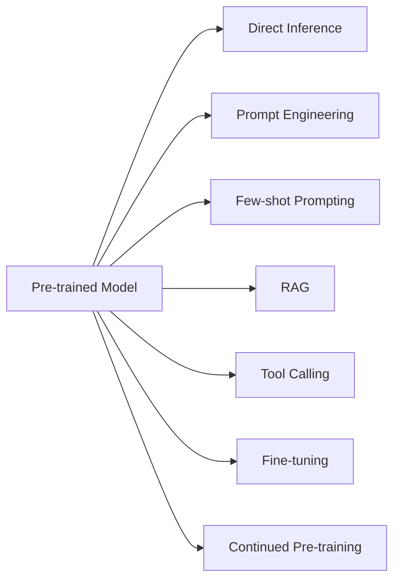
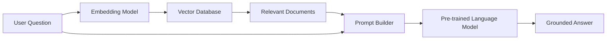
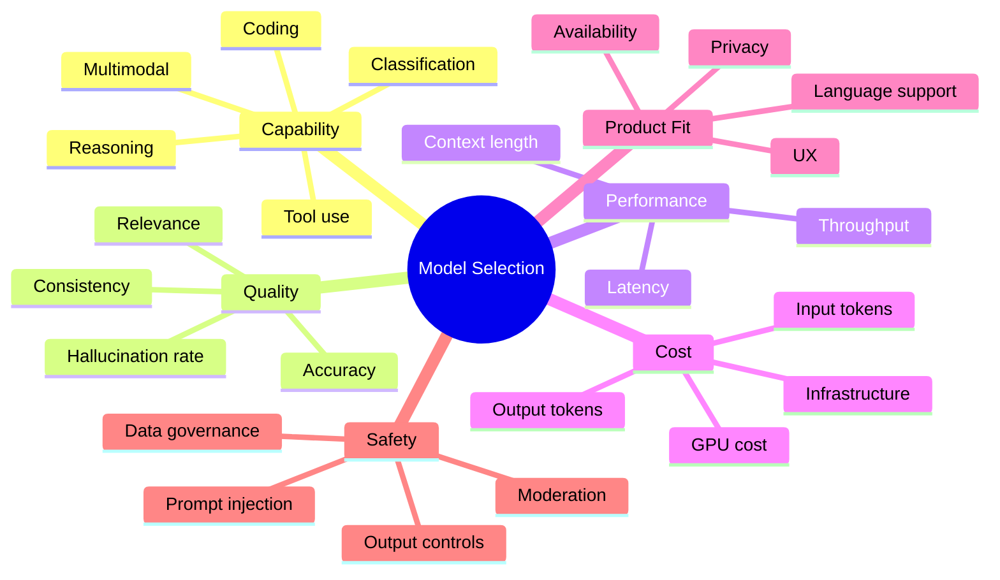
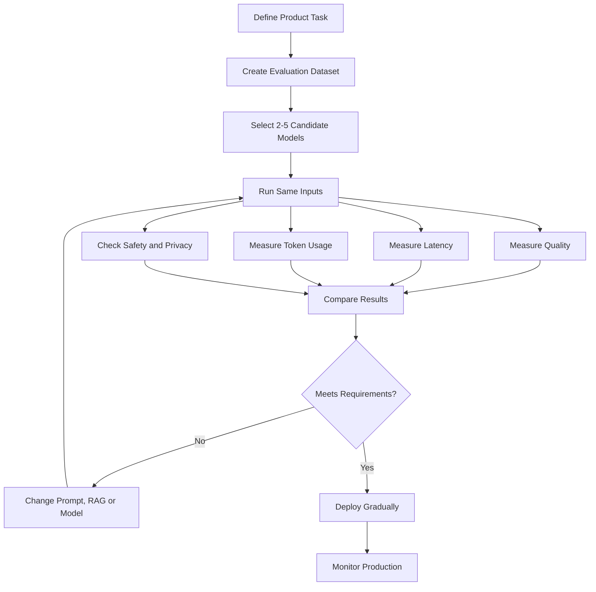
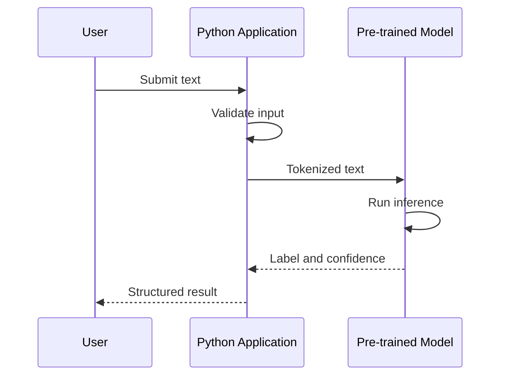
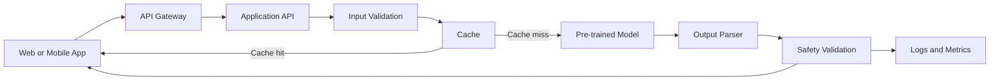
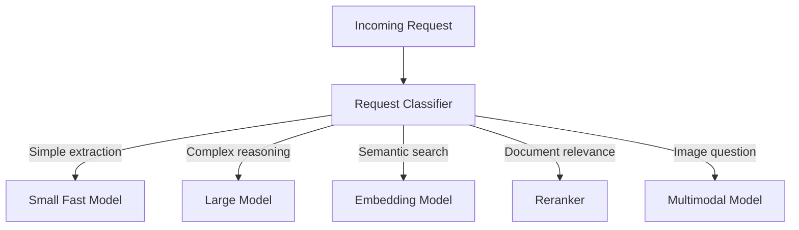
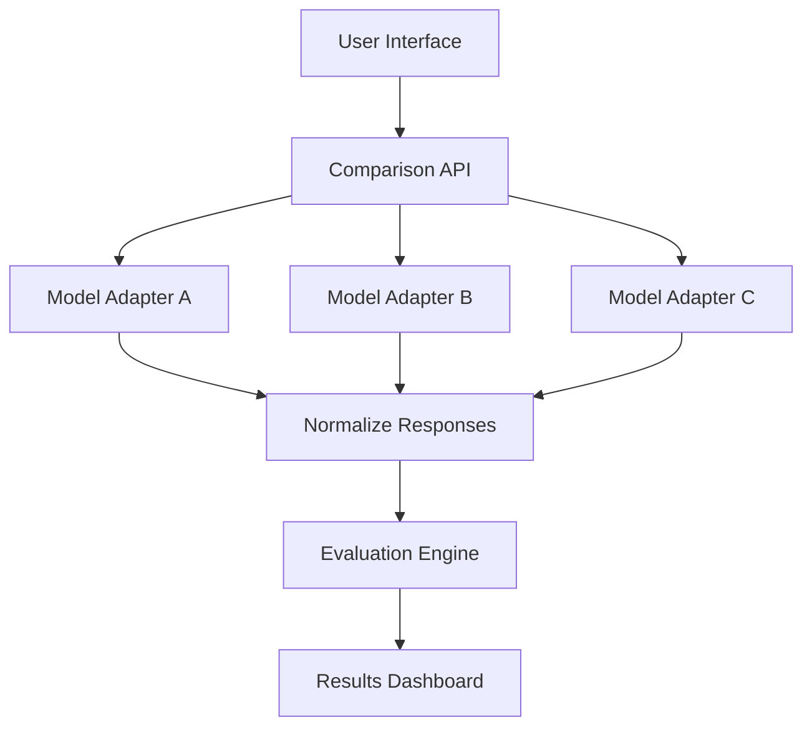

# 001 — Pre-trained Models

| Field                  | Details                                 |
| ---------------------- | --------------------------------------- |
| **Course**             | 02 — Model Platforms and Prompting      |
| **Module**             | Module 03 — Using Pre-trained Models    |
| **Content Group**      | Model Basics                            |
| **Roadmap Source**     | Using Pre-trained Models / Model Basics |
| **Lesson Type**        | Model Selection                         |
| **Order in Module**    | 001                                     |
| **Suggested Duration** | 20 minutes                              |

---

## 1. Summary

A **pre-trained model** is a machine learning model that has already learned patterns from a large dataset before you use it in your application.

Instead of collecting millions of examples and training a model from scratch, an AI Engineer can reuse an existing model through:

* A hosted API
* A cloud SDK
* An open-source model library
* A local inference server
* A model hub such as Hugging Face
* A managed AI platform

Pre-trained models allow teams to build features such as:

* Chat assistants
* Text classification
* Semantic search
* Document summarization
* Image recognition
* Speech transcription
* Translation
* Embeddings
* Recommendation systems
* Multimodal applications

Reusing knowledge from an existing model is closely related to **transfer learning**: weights learned for one problem are used as the starting point for another problem.

The main responsibility of an AI Engineer is usually not to train the largest model. It is to select, integrate, evaluate and operate the most suitable model for the product.

---

## 2. Learning Objectives

After completing this lesson, you should be able to:

* Explain pre-trained models in your own words.
* Distinguish between foundation models and task-specific models.
* Understand how pre-trained models are accessed and reused.
* Compare hosted APIs, open-source models and local inference.
* Select a model based on quality, latency, cost, context length and safety.
* Identify when to use prompting, RAG, fine-tuning or full training.
* Integrate a pre-trained model into a small AI application.
* Recognize common production problems and debug them.

---

## 3. What Is a Pre-trained Model?

A pre-trained model is a model whose parameters have already been learned from existing data.

```text
Raw training data
        ↓
Large training process
        ↓
Learned model parameters
        ↓
Pre-trained model
        ↓
Prompting, retrieval, fine-tuning or direct inference
        ↓
AI application
```

For example, a language model may be trained on a large collection of:

* Books
* Articles
* Websites
* Code
* Conversations
* Documentation
* Structured datasets

After training, the model contains numerical parameters that represent patterns learned from that data.

An application can then use the model without repeating the original training process.

---

## 4. Training From Scratch vs Using a Pre-trained Model

### Training from scratch

When training from scratch, a team must:

1. Collect a large dataset.
2. Clean and prepare the data.
3. Design a model architecture.
4. Configure distributed training.
5. Train the model for many iterations.
6. Evaluate the model.
7. Deploy and operate it.

This process can require:

* Expensive GPUs
* Large storage systems
* Distributed infrastructure
* Machine learning researchers
* Long experimentation cycles
* Significant energy and financial cost

### Using a pre-trained model

When using a pre-trained model, a team can start with an existing model and adapt it through:

* Prompt engineering
* Few-shot examples
* Retrieval-Augmented Generation
* Tool calling
* Parameter-efficient fine-tuning
* Full fine-tuning
* Replacing a classification layer

In traditional transfer learning, developers may freeze most model layers and train only the last layer or a small number of layers for a new task. This can save considerable computation while still achieving strong performance.

### Comparison

| Area               | Training From Scratch             | Pre-trained Model               |
| ------------------ | --------------------------------- | ------------------------------- |
| Initial dataset    | Very large                        | Small or optional               |
| Infrastructure     | High                              | Low to medium                   |
| Development time   | Weeks or months                   | Hours or days                   |
| Cost               | Very high                         | Usually lower                   |
| Customization      | Maximum                           | Moderate to high                |
| Required expertise | Research-focused                  | Product and integration-focused |
| Time to market     | Slow                              | Fast                            |
| Common use         | Model companies and research labs | Most AI products                |

---

## 5. Main Types of Pre-trained Models

### 5.1 Foundation Models

A foundation model is trained on broad data and can support many downstream tasks.

Examples of capabilities include:

* Text generation
* Reasoning
* Question answering
* Coding
* Summarization
* Translation
* Image understanding
* Audio understanding
* Tool usage

A foundation model is usually adapted through prompts, RAG, tools or fine-tuning.

```text
Foundation model
├── Customer support assistant
├── Coding assistant
├── Document analyzer
├── Translation service
├── Research agent
└── Content-generation application
```

---

### 5.2 Task-specific Models

A task-specific model is designed or fine-tuned for a narrower problem.

Examples include:

* Sentiment classification
* Named-entity recognition
* Object detection
* Face recognition
* Speech-to-text
* Text embeddings
* Reranking
* Toxicity detection
* Medical image classification

Task-specific models are often:

* Smaller
* Faster
* Cheaper
* Easier to evaluate
* More predictable for a narrow task

A large general-purpose model is not always the best choice.

---

### 5.3 Embedding Models

Embedding models convert text, images or other inputs into numerical vectors.

```text
"How do I reset my password?"
                ↓
         Embedding model
                ↓
[0.14, -0.27, 0.83, ..., 0.09]
```

Embeddings are commonly used for:

* Semantic search
* RAG
* Recommendations
* Clustering
* Duplicate detection
* Similarity comparison
* Classification

---

### 5.4 Reranking Models

A reranker receives a query and a set of candidate documents, then scores their relevance more accurately.

```text
User query
    ↓
Vector search returns 20 documents
    ↓
Reranker scores the documents
    ↓
Top 3–5 documents
    ↓
Language model generates an answer
```

Rerankers can improve RAG quality by removing documents that are semantically similar but not actually useful.

---

### 5.5 Multimodal Models

Multimodal models process more than one type of input or output.

Possible modalities include:

* Text
* Images
* Audio
* Video
* Documents
* Structured data

Example:

```text
Image of an invoice
        +
User question
        ↓
Multimodal model
        ↓
"The total amount is $1,248.50."
```

---

## 6. Where Pre-trained Models Come From

Pre-trained models may be distributed through:

### Model providers

A provider hosts the model and exposes it through an API.

```text
Application → HTTPS API → Hosted model → Response
```

The provider usually manages:

* GPUs
* Scaling
* Model updates
* Inference optimization
* Availability
* Security controls

### Model hubs

Model hubs provide model weights, documentation, datasets and demonstrations.

Hugging Face, for example, acts as a central platform for pre-trained models, datasets and hosted model demonstrations called Spaces.

### Framework libraries

Frameworks may include downloadable pre-trained models.

Examples include model libraries for:

* Natural language processing
* Computer vision
* Audio
* Embeddings
* Diffusion models

### Internal company models

Organizations may also create internal models trained or fine-tuned on proprietary data.

---

## 7. Ways to Use a Pre-trained Model

There are several levels of adaptation.



---

### 7.1 Direct Inference

The model is used without additional training.

Example:

```text
Input: "This application is fast and easy to use."
Task: Sentiment classification
Output: Positive
```

This approach is suitable when the model already supports the required task.

---

### 7.2 Prompt Engineering

Instructions are added to control the model.

```text
Classify the following support ticket.

Allowed categories:
- billing
- technical
- account
- cancellation

Return only JSON.

Ticket:
"I was charged twice for my subscription."
```

Expected output:

```json
{
  "category": "billing"
}
```

---

### 7.3 Few-shot Prompting

Examples are included in the prompt.

```text
Ticket: "I forgot my password."
Category: account

Ticket: "The mobile app crashes after login."
Category: technical

Ticket: "Please stop my subscription."
Category: cancellation

Ticket: "My card was charged twice."
Category:
```

Expected answer:

```text
billing
```

Few-shot examples help the model understand:

* Output format
* Classification boundaries
* Writing style
* Business terminology
* Edge cases

---

### 7.4 Retrieval-Augmented Generation

RAG gives the model external information at inference time.



RAG is useful when information is:

* Private
* Frequently updated
* Too large to place in one prompt
* Required to be traceable
* Outside the model’s training data

---

### 7.5 Tool Calling

A model can decide when to invoke external functions.

```text
User: "What is the status of order A1024?"

Model decision:
Call get_order_status(order_id="A1024")

Tool result:
{"status": "shipped", "delivery_date": "2026-07-20"}

Final answer:
"Order A1024 has shipped and is expected on July 20, 2026."
```

The model provides reasoning and language generation, while the tool provides current or private data.

---

### 7.6 Fine-tuning

Fine-tuning changes some or all model parameters using a specialized dataset.

It may be useful for:

* Consistent response style
* Domain-specific terminology
* Structured output behavior
* Specialized classification
* Repeated workflows
* Reducing large prompt examples

Fine-tuning should not normally be the first solution for adding current knowledge. RAG is usually more suitable for knowledge that changes regularly.

---

## 8. Hosted API vs Local Model

### Hosted API

The model runs on infrastructure managed by another organization.

#### Advantages

* Fast integration
* No GPU management
* Automatic scaling
* Access to powerful models
* Managed availability
* Simple SDKs

#### Disadvantages

* Usage-based cost
* Network latency
* Provider dependency
* Data governance concerns
* Rate limits
* Less infrastructure control

---

### Local or Self-hosted Model

The model runs on your own machine or infrastructure.

#### Advantages

* Greater data control
* Offline operation
* Custom deployment
* Predictable infrastructure
* Model customization
* No external request for every inference

#### Disadvantages

* GPU requirements
* Deployment complexity
* Scaling responsibility
* Monitoring responsibility
* Model optimization work
* Security patching
* Higher operational burden

---

### Decision Table

| Requirement              |           Hosted API |           Local Model |
| ------------------------ | -------------------: | --------------------: |
| Fast prototype           |            Excellent |              Moderate |
| No infrastructure team   |            Excellent |                  Weak |
| Sensitive data           |  Depends on provider |                Strong |
| Offline operation        |                 Weak |             Excellent |
| Highest model capability |      Often excellent |   Depends on hardware |
| Full deployment control  |              Limited |             Excellent |
| Easy autoscaling         |            Excellent |               Complex |
| Low traffic              | Often cost-effective |    May waste hardware |
| Very high stable traffic | Can become expensive | Potentially efficient |

---

## 9. Model Selection Criteria

Choosing a pre-trained model is a multi-objective decision.



---

### 9.1 Capability

Ask:

* Can the model perform the required task?
* Does it support text, images, audio or video?
* Can it call tools?
* Can it return structured output?
* Does it support the required language?
* Can it follow complex instructions?

A model that performs well on general benchmarks may still perform poorly on your exact workflow.

---

### 9.2 Quality

Quality may include:

* Task accuracy
* Factual correctness
* Instruction following
* Response completeness
* Citation correctness
* Tone consistency
* JSON validity
* Hallucination rate

Quality should be evaluated using real product examples.

---

### 9.3 Latency

Latency is the time between sending a request and receiving a useful response.

Important measurements include:

* Time to first token
* Total response time
* Tokens generated per second
* Retrieval time
* Tool execution time
* Queueing time

```text
Total latency =
network time
+ queue time
+ model processing
+ output generation
+ retrieval
+ tool calls
+ application rendering
```

A fast model does not guarantee a fast application. The complete pipeline must be measured.

---

### 9.4 Cost

Model cost may include:

* Input tokens
* Output tokens
* Cached tokens
* Embedding requests
* Reranking requests
* GPU rental
* Storage
* Network transfer
* Monitoring
* Engineering time

A simple cost estimate is:

```text
Request cost =
input token cost
+ output token cost
+ retrieval cost
+ tool cost
+ infrastructure overhead
```

A smaller model may be more suitable for:

* Classification
* Routing
* Extraction
* Moderation
* Query rewriting

A larger model can then be reserved for difficult reasoning tasks.

---

### 9.5 Context Length

Context length is the amount of input the model can process in one request.

A larger context window can support:

* Long documents
* Conversation history
* Multiple retrieved documents
* Large code files
* Complex instructions

However, a large context window does not automatically guarantee:

* Better reasoning
* Perfect recall
* Lower hallucination
* Correct use of all provided information

Long prompts can also increase cost and latency.

---

### 9.6 Safety and Privacy

Evaluate:

* Whether sensitive data may be sent to the provider
* Data retention policies
* Regional hosting requirements
* Prompt injection risks
* Harmful content handling
* Access control
* Audit logging
* Tenant isolation
* Personally identifiable information handling

---

### 9.7 Reliability

A production model should also be evaluated for:

* Uptime
* Rate limits
* Error rates
* Version stability
* Deprecation policy
* Retry behavior
* Streaming reliability
* Output consistency

---

## 10. A Practical Model-Selection Workflow



### Step 1: Define the task

Avoid requirements such as:

> The model should be intelligent.

Use measurable requirements:

> The system must classify support tickets into six categories with at least 90% accuracy and return valid JSON within two seconds.

---

### Step 2: Create an evaluation dataset

Include:

* Normal cases
* Difficult cases
* Ambiguous cases
* Long inputs
* Short inputs
* Multilingual inputs
* Malicious instructions
* Missing information
* Invalid formats

Example:

```json
{
  "input": "I cancelled yesterday but was charged again.",
  "expected_category": "billing",
  "expected_priority": "high"
}
```

---

### Step 3: Choose candidates

Select several models with different characteristics:

* High-quality general model
* Fast low-cost model
* Open-source model
* Task-specific model

Do not select a model only because it is popular.

---

### Step 4: Use the same test conditions

Use the same:

* Prompt
* Temperature
* Maximum output length
* Input examples
* Evaluation metrics
* Retry policy

This makes the comparison fair.

---

### Step 5: Measure product metrics

Example scorecard:

| Model   | Accuracy | P95 Latency | Average Tokens | JSON Validity | Estimated Cost |
| ------- | -------: | ----------: | -------------: | ------------: | -------------: |
| Model A |      94% |       2.8 s |            620 |           99% |           High |
| Model B |      91% |       1.1 s |            410 |           98% |            Low |
| Model C |      88% |       0.7 s |            380 |           96% |       Very low |

The best model depends on the product requirement.

For a real-time chat interface, Model B may be better than Model A even when Model A has slightly higher accuracy.

---

## 11. Demo: Using a Pre-trained Model Locally

The following example uses a pre-trained sentiment-analysis model.

### Install dependencies

```bash
pip install transformers torch
```

### Python example

```python
from transformers import pipeline


def analyze_sentiment(text: str) -> dict:
    """
    Analyze the sentiment of a text using a pre-trained model.
    """
    if not text.strip():
        raise ValueError("Text must not be empty.")

    classifier = pipeline(
        task="sentiment-analysis",
    )

    result = classifier(text)[0]

    return {
        "label": result["label"],
        "confidence": round(float(result["score"]), 4),
    }


if __name__ == "__main__":
    sample = "The application is simple, fast and very useful."
    output = analyze_sentiment(sample)
    print(output)
```

Possible output:

```json
{
  "label": "POSITIVE",
  "confidence": 0.9987
}
```

### What happened?



The application did not train a sentiment model. It downloaded and reused a model that had already been trained.

---

## 12. Demo: Exposing the Model Through FastAPI

### Install FastAPI

```bash
pip install fastapi uvicorn transformers torch
```

### API implementation

```python
from contextlib import asynccontextmanager
from typing import Any

from fastapi import FastAPI, HTTPException
from pydantic import BaseModel, Field
from transformers import pipeline


classifier: Any | None = None


@asynccontextmanager
async def lifespan(app: FastAPI):
    global classifier

    classifier = pipeline(
        task="sentiment-analysis",
    )

    yield

    classifier = None


app = FastAPI(
    title="Pre-trained Model Demo",
    version="1.0.0",
    lifespan=lifespan,
)


class SentimentRequest(BaseModel):
    text: str = Field(
        min_length=1,
        max_length=5_000,
        description="Text to analyze",
    )


class SentimentResponse(BaseModel):
    label: str
    confidence: float


@app.post(
    "/sentiment",
    response_model=SentimentResponse,
)
async def sentiment_analysis(
    request: SentimentRequest,
) -> SentimentResponse:
    if classifier is None:
        raise HTTPException(
            status_code=503,
            detail="Model is not available.",
        )

    try:
        result = classifier(request.text)[0]

        return SentimentResponse(
            label=str(result["label"]),
            confidence=round(float(result["score"]), 4),
        )
    except Exception as exc:
        raise HTTPException(
            status_code=500,
            detail="Inference failed.",
        ) from exc
```

Run the server:

```bash
uvicorn main:app --reload
```

Test it:

```bash
curl -X POST "http://localhost:8000/sentiment" \
  -H "Content-Type: application/json" \
  -d '{"text":"The new update is much faster."}'
```

---

## 13. Production Architecture



A production system should include more than a model call.

Important components include:

* Authentication
* Rate limiting
* Input validation
* Prompt construction
* Retrieval
* Model routing
* Timeouts
* Retries
* Output parsing
* Safety checks
* Caching
* Logging
* Monitoring
* Cost tracking

---

## 14. Prompting vs RAG vs Fine-tuning

| Problem                               | Recommended First Approach                |
| ------------------------------------- | ----------------------------------------- |
| Model does not follow instructions    | Improve the prompt                        |
| Output format is inconsistent         | Structured output and validation          |
| Model lacks private company knowledge | RAG                                       |
| Information changes frequently        | RAG or tools                              |
| A consistent style is required        | Prompting, then fine-tuning               |
| Task uses specialized labels          | Few-shot prompting or fine-tuning         |
| Latency is too high                   | Smaller model or shorter prompt           |
| Cost is too high                      | Routing, caching or smaller model         |
| Model needs current account data      | Tool calling                              |
| Model repeatedly fails a narrow task  | Fine-tuning may help                      |
| No existing model supports the domain | Continued pre-training or custom training |

### Recommended progression

```text
1. Direct inference
2. Prompt engineering
3. Few-shot examples
4. Structured output
5. RAG or tools
6. Model routing
7. Fine-tuning
8. Training from scratch
```

Start with the least complex solution that satisfies the product requirement.

---

## 15. Model Routing

A production application does not need to use one model for every request.



Example routing logic:

```python
def select_model(task: str, input_length: int) -> str:
    if task == "embedding":
        return "embedding-model"

    if task == "classification":
        return "small-fast-model"

    if task == "reasoning" and input_length > 10_000:
        return "large-context-model"

    return "general-model"
```

Routing can reduce:

* Cost
* Latency
* GPU usage
* Unnecessary calls to large models

---

## 16. Common Production Failure

### Scenario

A support assistant works correctly during testing but becomes slow and expensive in production.

### Possible causes

* The entire conversation is sent on every request.
* Retrieved documents are too long.
* The model generates unnecessarily long answers.
* A large model handles simple classification tasks.
* Requests are retried without limits.
* Streaming is delayed by application processing.
* Cache keys are incorrect.
* Tool calls execute sequentially.
* Model instances are loaded for every request.
* Logs contain large prompts and responses.

### Debugging process

```text
1. Add request tracing.
2. Measure every pipeline stage.
3. Record input and output token counts.
4. Measure time to first token.
5. Measure total generation time.
6. Inspect retrieval document length.
7. Check retry counts.
8. Compare models using the same request.
9. Add caching for repeated requests.
10. Route simple tasks to a smaller model.
```

Example structured log:

```json
{
  "request_id": "req_1024",
  "model": "candidate-model-b",
  "input_tokens": 3240,
  "output_tokens": 382,
  "retrieval_ms": 142,
  "model_ms": 1840,
  "total_ms": 2175,
  "cache_hit": false,
  "retry_count": 0,
  "status": "success"
}
```

---

## 17. Common Mistakes

### Mistake 1: Selecting the largest model automatically

Larger models may provide stronger reasoning, but they can also introduce:

* Higher cost
* Higher latency
* Lower throughput
* More complex deployment

Use the smallest model that reliably satisfies the task.

---

### Mistake 2: Trusting benchmark scores alone

Public benchmarks may not represent:

* Your language
* Your users
* Your document types
* Your output format
* Your edge cases
* Your safety requirements

Always create a product-specific evaluation dataset.

---

### Mistake 3: Ignoring preprocessing

Pre-trained models expect particular:

* Image sizes
* Tokenization rules
* Audio sample rates
* Normalization values
* Input formats

Incorrect preprocessing can make a strong model appear inaccurate.

---

### Mistake 4: Fine-tuning too early

Fine-tuning adds:

* Dataset preparation
* Training cost
* Version management
* Evaluation complexity
* Deployment complexity

First test prompting, RAG, tools and output validation.

---

### Mistake 5: Ignoring model versions

A provider may update or deprecate a model.

Store:

* Model name
* Model version
* Prompt version
* Evaluation version
* Deployment date

---

### Mistake 6: Testing only the happy path

A production evaluation should include:

* Empty input
* Invalid input
* Very long input
* Conflicting instructions
* Multiple languages
* Prompt injection
* Missing context
* Unsupported content
* Provider timeout
* Malformed output

---

### Mistake 7: Not documenting assumptions

Document assumptions such as:

* Supported languages
* Maximum input size
* Expected latency
* Data privacy level
* Required accuracy
* Human-review conditions

---

## 18. Practical Exercise

### Exercise 1: Explain the concept

Write five lines explaining:

1. What a pre-trained model is.
2. Why it is useful.
3. How an application accesses it.
4. How it can be adapted.
5. What factors determine model selection.

Do not look at the lesson while writing.

---

### Exercise 2: Build a small demo

Choose one task:

* Sentiment classification
* Ticket routing
* Text summarization
* Image classification
* Semantic search
* Translation

Your demo should include:

```text
Input
  ↓
Preprocessing
  ↓
Pre-trained model
  ↓
Output parsing
  ↓
Result
```

---

### Exercise 3: Compare two models

Create at least 20 test inputs.

Record:

| Input ID | Expected Result | Model A   | Model B   | A Latency | B Latency | Winner |
| -------- | --------------- | --------- | --------- | --------: | --------: | ------ |
| 001      | billing         | billing   | account   |     1.4 s |     0.8 s | A      |
| 002      | technical       | technical | technical |     1.2 s |     0.7 s | B      |

Calculate:

```text
Accuracy = correct predictions / total predictions

Average latency = total latency / number of requests

JSON validity = valid JSON responses / total responses
```

---

### Exercise 4: Document one production risk

Use this template:

```markdown
## Production Risk

### Problem
The model sometimes returns invalid JSON.

### Possible Causes
- The prompt does not define a strict schema.
- The response includes Markdown.
- The model reaches its output-token limit.
- The selected model is weak at instruction following.

### Debugging
- Log the raw response.
- Add schema validation.
- Request structured output.
- Retry only invalid responses.
- Compare with another model.

### Mitigation
Use a typed schema, validation and a controlled retry policy.
```

---

## 19. Project: Model Comparison App

Build a small application that compares two or three pre-trained models.

### Inputs

* User prompt
* Model selection
* Temperature
* Maximum output tokens
* Number of repetitions

### Outputs

* Model response
* Total latency
* Time to first token
* Input-token count
* Output-token count
* Estimated cost
* Validity status
* User quality score

### Suggested architecture



### Normalized result schema

```json
{
  "provider": "provider_name",
  "model": "model_name",
  "response": "Generated response",
  "input_tokens": 320,
  "output_tokens": 145,
  "time_to_first_token_ms": 280,
  "total_latency_ms": 1350,
  "estimated_cost": 0.0024,
  "valid_output": true,
  "error": null
}
```

### Recommended portfolio features

* Side-by-side outputs
* Latency chart
* Token-usage chart
* Prompt history
* Export to CSV
* Automatic evaluation
* Error logging
* Model routing recommendation
* Streaming support
* Configurable system prompt

---

## 20. Completion Checklist

* [ ] I can explain a pre-trained model in one or two minutes.
* [ ] I understand the difference between foundation and task-specific models.
* [ ] I can explain hosted APIs and local inference.
* [ ] I can identify when to use prompting, RAG, tools or fine-tuning.
* [ ] I can compare models using quality, latency and cost.
* [ ] I have built a small model-inference demo.
* [ ] I have tested at least one edge case.
* [ ] I have documented one production limitation.
* [ ] I understand that the best benchmark model is not automatically the best product model.
* [ ] I can describe how model selection affects UX, safety and infrastructure.

---

## 21. Key Outcome

Choose pre-trained AI models based on:

* Capability
* Product-specific quality
* Context length
* Latency
* Throughput
* Cost
* Language support
* Modalities
* Safety
* Privacy
* Deployment requirements
* Product fit

The objective is not to select the most powerful model.

The objective is to select the model that delivers the best overall product result under real constraints.

---

## 22. Final Summary

A pre-trained model already contains knowledge learned during an earlier training process.

AI Engineers use these models through APIs, SDKs, model hubs or local inference systems. They adapt them using prompts, few-shot examples, RAG, tools and fine-tuning.

A complete model-selection process should:

1. Define a measurable product task.
2. Create a representative evaluation dataset.
3. Compare multiple candidate models.
4. Measure quality, latency, cost and reliability.
5. Test safety and edge cases.
6. Deploy gradually.
7. Monitor real production behavior.

```text
Do not ask only:

"Which model is the most powerful?"

Ask:

"Which model provides sufficient quality,
at acceptable latency and cost,
for this specific product workflow?"
```

A pre-trained model becomes valuable only when it is connected to a reliable product workflow with evaluation, validation, monitoring and a clear user experience.

---

# Bài luyện tập

## Mục tiêu


## Đề bài


## Yêu cầu hoàn thành

- [ ] 
- [ ] 
- [ ] 

## Kết quả / lời giải


## Ghi chú
