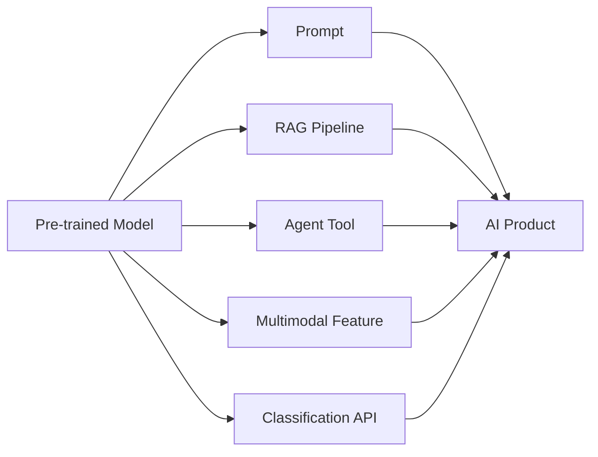
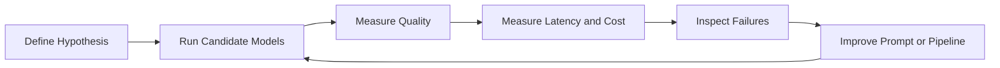
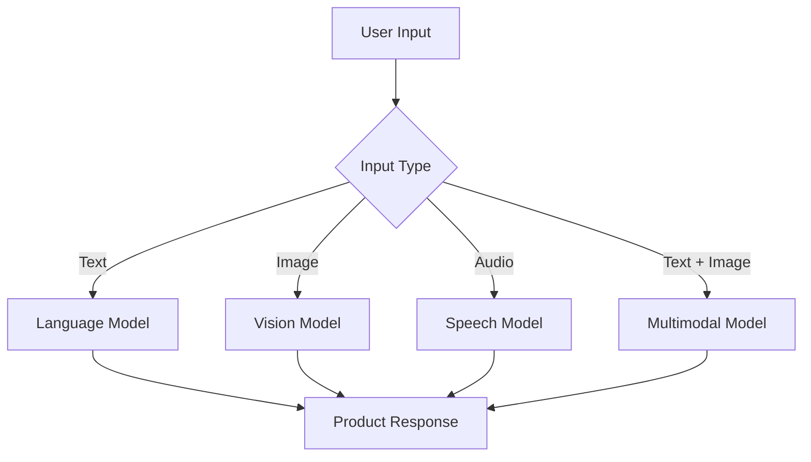
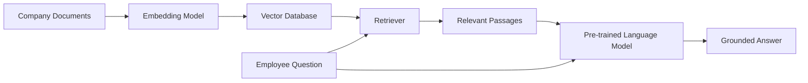
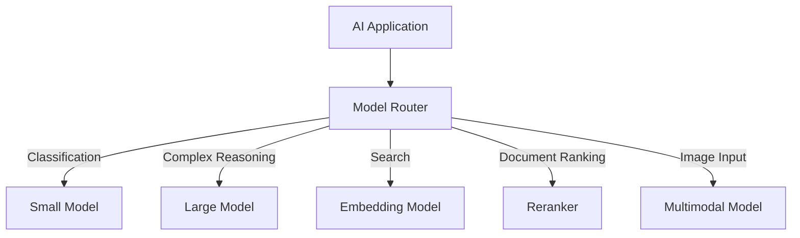
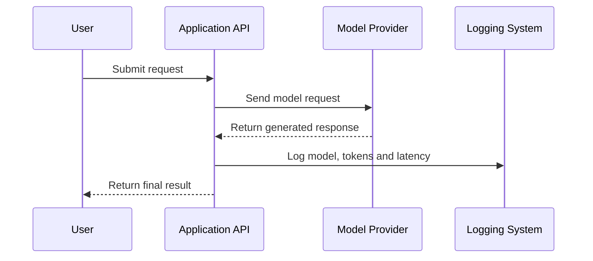
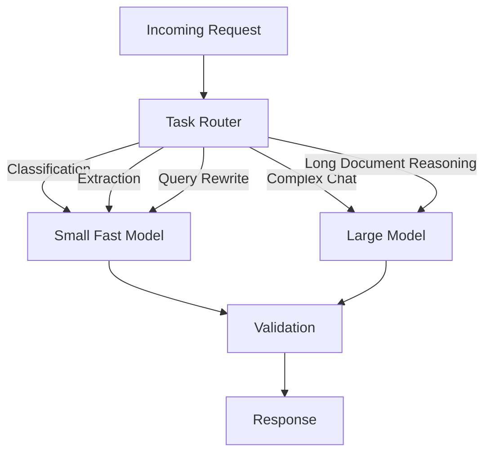
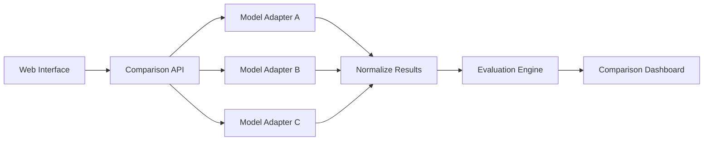

# 002 — Benefits of Pre-trained Models

| Field                  | Details                                 |
| ---------------------- | --------------------------------------- |
| **Course**             | 02 — Model Platforms and Prompting      |
| **Module**             | Module 03 — Using Pre-trained Models    |
| **Content Group**      | Model Basics                            |
| **Roadmap Source**     | Using Pre-trained Models / Model Basics |
| **Lesson Type**        | Model Selection                         |
| **Order in Module**    | 002                                     |
| **Suggested Duration** | 20 minutes                              |

---

## 1. Summary

Pre-trained models allow AI teams to build useful product features without training a large model from scratch.

A pre-trained model has already learned patterns from a large dataset. An AI Engineer can reuse this knowledge through:

* Hosted APIs
* Cloud SDKs
* Open-source model libraries
* Local inference
* Fine-tuning
* Retrieval-Augmented Generation
* Agent tools
* Multimodal pipelines

The main benefits include:

* Faster development
* Lower initial cost
* Less training data
* Strong baseline quality
* Easier experimentation
* Access to advanced capabilities
* Faster product validation
* Simpler scaling through managed platforms
* Reuse across multiple product features

However, these benefits must be evaluated using real tasks, prompts, latency requirements, cost constraints and failure cases.



---

## 2. Learning Objectives

After completing this lesson, you should be able to:

* Explain the main benefits of pre-trained models.
* Compare pre-trained models with training from scratch.
* Identify how pre-trained models reduce development time and cost.
* Understand how they support rapid experimentation.
* Recognize their role in prompts, RAG, agents and multimodal systems.
* Evaluate whether a model’s benefits apply to a specific product.
* Measure model quality, latency, token usage and reliability.
* Identify limitations that can reduce the expected benefits.
* Build a small model-comparison demo.
* Document a production failure and its debugging process.

---

## 3. Why Pre-trained Models Matter

Before pre-trained models became widely available, building an AI feature often required teams to:

1. Collect a large dataset.
2. Clean and label the data.
3. Select a model architecture.
4. Configure training infrastructure.
5. Train the model.
6. Tune hyperparameters.
7. Evaluate the result.
8. Deploy the model.
9. Maintain the infrastructure.

This process could take weeks or months.

With a pre-trained model, teams can begin at a much later stage:

```mermaid
flowchart TD
    subgraph Scratch["Training from Scratch"]
        A1[Collect Large Dataset]
        A2[Label and Clean Data]
        A3[Design Model]
        A4[Train Model]
        A5[Evaluate]
        A6[Deploy]
        A1 --> A2 --> A3 --> A4 --> A5 --> A6
    end

    subgraph Pretrained["Using a Pre-trained Model"]
        B1[Define Product Task]
        B2[Select Model]
        B3[Write Prompt or Integration]
        B4[Evaluate]
        B5[Deploy]
        B1 --> B2 --> B3 --> B4 --> B5
    end
```



The team can focus more on:

* User experience
* Business rules
* Data integration
* Prompt design
* Retrieval quality
* Safety
* Evaluation
* Monitoring
* Product reliability

This changes AI development from a research-heavy workflow into a product-engineering workflow.

---

## 4. Benefit 1: Faster Development

One of the largest benefits of pre-trained models is reduced development time.

An existing model may already support:

* Text generation
* Summarization
* Translation
* Sentiment analysis
* Image classification
* Speech recognition
* Embeddings
* Question answering
* Code generation
* Tool calling

Instead of building these capabilities from the beginning, developers can connect to an existing model.

### Example

Suppose a company wants to add automatic ticket classification.

Without a pre-trained model:

```text
Collect tickets
    ↓
Label thousands of examples
    ↓
Train a classifier
    ↓
Evaluate the classifier
    ↓
Deploy the model
```

With a pre-trained language model:

```text
Create ticket categories
    ↓
Write a classification prompt
    ↓
Test representative tickets
    ↓
Add structured output validation
    ↓
Deploy an API
```

Example prompt:

```text
Classify the following customer-support ticket.

Allowed categories:
- billing
- account
- technical
- cancellation

Return JSON only.

Ticket:
"I changed my password, but I still cannot sign in."
```

Expected output:

```json
{
  "category": "account"
}
```

A working prototype can often be created before a custom training dataset exists.

---

## 5. Benefit 2: Lower Initial Cost

Training a large model from scratch can require:

* Expensive GPUs
* Distributed training
* Large data storage
* Data-labeling teams
* Machine learning researchers
* Long experimentation cycles
* Infrastructure maintenance

Pre-trained models reduce these initial requirements.

### Cost comparison

| Cost Area                | Training From Scratch |     Pre-trained Model |
| ------------------------ | --------------------: | --------------------: |
| Dataset collection       |                  High |       Low or optional |
| Data labeling            |                  High |         Low to medium |
| GPU training             |             Very high |       None or limited |
| Research expertise       |                  High |              Moderate |
| Prototype infrastructure |               Complex |                Simple |
| Initial development time |                  Long |                 Short |
| Operational cost         |              Variable | API or inference cost |

Pre-trained models do not make AI free. They move the cost from large initial training investment toward:

* API usage
* Token consumption
* GPU inference
* Model hosting
* Evaluation
* Monitoring
* Integration engineering

This is especially useful when a team needs to validate whether users actually want the feature.

---

## 6. Benefit 3: Less Training Data

A pre-trained model already contains general knowledge and learned representations.

A team may not need millions of examples for a new task. It can often start with:

* Clear instructions
* A few examples
* A small evaluation dataset
* A document collection for RAG
* A limited fine-tuning dataset

### Few-shot example

```text
Input: "I was charged twice."
Category: billing

Input: "The app closes when I upload a photo."
Category: technical

Input: "Please delete my account."
Category: account

Input: "How can I stop next month's payment?"
Category:
```

Expected output:

```text
cancellation
```

The model uses patterns learned during pre-training together with examples provided in the prompt.

### Important distinction

A small dataset may be enough to adapt or evaluate a pre-trained model, but it may not be enough to prove production reliability.

Teams still need representative examples covering:

* Common cases
* Rare cases
* Ambiguous inputs
* Long inputs
* Multiple languages
* Invalid data
* Adversarial instructions

---

## 7. Benefit 4: Strong Baseline Performance

Pre-trained models often provide a strong starting point.

They may already understand:

* Grammar
* General vocabulary
* Common objects
* Code patterns
* Semantic similarity
* Basic reasoning structures
* Multiple languages
* Common document formats

This means the first version of an AI feature can be useful before task-specific optimization.

```text
General pre-training
        ↓
Broad capabilities
        ↓
Prompt or task adaptation
        ↓
Useful baseline
        ↓
Evaluation and improvement
```

A strong baseline helps teams answer important questions early:

* Is the feature technically possible?
* Is the output useful to users?
* Which failure cases are most serious?
* Is RAG required?
* Is fine-tuning necessary?
* What latency is acceptable?
* What quality level justifies the cost?

---

## 8. Benefit 5: Rapid Experimentation

Pre-trained models make it easier to compare different approaches.

An AI Engineer can test:

* Different model providers
* Small and large models
* Different system prompts
* Zero-shot and few-shot prompting
* RAG and non-RAG versions
* Different embedding models
* Different context sizes
* Different temperatures
* Local and hosted inference

### Experiment loop



Example hypothesis:

> A smaller model can classify support tickets with similar accuracy but less than half the latency of a larger model.

This can be tested quickly because both models are already trained.

---

## 9. Benefit 6: Access to Advanced Capabilities

Pre-trained models give small teams access to capabilities that would otherwise require major research investment.

Examples include:

### Language capabilities

* Chat
* Summarization
* Translation
* Extraction
* Classification
* Reasoning
* Code generation

### Vision capabilities

* Image classification
* Object detection
* Image captioning
* Document understanding
* Visual question answering

### Audio capabilities

* Speech recognition
* Speaker detection
* Audio classification
* Text-to-speech

### Multimodal capabilities

* Reading charts and screenshots
* Extracting information from documents
* Answering questions about images
* Combining text, image and audio inputs



A startup can therefore build an image assistant, document analyzer or voice interface without creating separate foundation models.

---

## 10. Benefit 7: Easier Product Validation

A pre-trained model allows teams to test a product idea before investing in a custom model.

### Example product idea

> Build an assistant that answers employee questions using internal company policies.

A prototype can be created using:

1. A pre-trained embedding model.
2. A vector database.
3. A pre-trained language model.
4. A simple chat interface.
5. A small set of evaluation questions.



The team can validate:

* Whether employees use the feature
* Whether answers are helpful
* Whether retrieval finds the right documents
* Whether citations are needed
* Whether response time is acceptable
* Whether the feature saves support time

Only after validation should the team consider more expensive customization.

---

## 11. Benefit 8: Reuse Across Multiple Features

One pre-trained model can support several features.

For example, one language model may be used for:

* Ticket classification
* Email drafting
* Document summarization
* Query rewriting
* Agent planning
* Structured extraction

However, using the same model everywhere is not always optimal.



The reusable benefit is strongest when the application uses a shared model gateway with:

* A common request format
* Provider adapters
* Logging
* Retry handling
* Token accounting
* Model routing
* Fallback support

---

## 12. Benefit 9: Easier Scaling with Hosted APIs

Hosted model APIs allow teams to avoid managing:

* GPU provisioning
* Model loading
* Distributed inference
* Autoscaling
* Hardware failures
* Driver compatibility
* Inference optimization

A simple architecture may look like this:



This allows the product team to scale without immediately building a dedicated machine learning infrastructure team.

### Limitation

Hosted APIs may introduce:

* Provider dependency
* Rate limits
* Network latency
* Data-governance concerns
* Variable usage cost
* Model-version changes

The benefit must therefore be compared with operational requirements.

---

## 13. Benefit 10: Easier Fine-tuning and Adaptation

Pre-trained models can be adapted instead of completely retrained.

Common adaptation methods include:

| Method                 | Changes Model Weights? | Typical Use                     |
| ---------------------- | ---------------------: | ------------------------------- |
| Prompt engineering     |                     No | Instructions and behavior       |
| Few-shot prompting     |                     No | Demonstrating output patterns   |
| RAG                    |                     No | Adding external knowledge       |
| Tool calling           |                     No | Accessing systems and live data |
| Fine-tuning            |                    Yes | Style or repeated task behavior |
| Continued pre-training |                    Yes | Specialized domain language     |

### Adaptation hierarchy

```text
Direct inference
    ↓
Prompt engineering
    ↓
Few-shot examples
    ↓
Structured output
    ↓
RAG and tools
    ↓
Fine-tuning
    ↓
Continued pre-training
```

This progression lets teams increase complexity only when simpler methods are insufficient.

---

## 14. Benefits in Different AI Workflows

### Prompt-based application

```text
User input
    ↓
System instruction
    ↓
Pre-trained model
    ↓
Generated response
```

Main benefits:

* Fast development
* Minimal infrastructure
* Easy prompt experimentation

---

### RAG application

```text
User question
    ↓
Embedding and retrieval
    ↓
Relevant private documents
    ↓
Pre-trained language model
    ↓
Grounded answer
```

Main benefits:

* Uses external knowledge
* Avoids retraining for every document update
* Supports citations
* Separates model knowledge from business knowledge

---

### Agent application

```text
User objective
    ↓
Pre-trained model
    ↓
Select tool
    ↓
Execute API or function
    ↓
Observe result
    ↓
Generate final answer
```

Main benefits:

* Natural-language planning
* Tool selection
* Flexible workflows
* Integration with live systems

---

### Multimodal application

```text
Image or document
        +
User question
        ↓
Pre-trained multimodal model
        ↓
Analysis or extraction
```

Main benefits:

* Avoids separate OCR and vision pipelines for simple use cases
* Supports natural-language interaction
* Enables fast document and image prototypes

---

## 15. Benefits Must Be Measured

A model is not beneficial simply because it is pre-trained.

Its value must be measured on the real product task.

Important metrics include:

### Quality metrics

* Accuracy
* Relevance
* Completeness
* Factual correctness
* JSON validity
* Citation correctness
* Hallucination rate
* User rating

### Performance metrics

* Time to first token
* Total response latency
* Tokens per second
* Requests per second
* Error rate
* Timeout rate

### Cost metrics

* Input tokens
* Output tokens
* Cached tokens
* Embedding cost
* Tool cost
* GPU cost
* Cost per successful request

### Reliability metrics

* Availability
* Retry count
* Invalid-output rate
* Provider-error rate
* Fallback usage
* Safety-filter rate

---

## 16. Model Evaluation Scorecard

A simple comparison table can reveal whether the expected benefits are real.

| Model   | Task Accuracy | Average Latency | Input Tokens | Output Tokens | JSON Validity | Estimated Cost |
| ------- | ------------: | --------------: | -----------: | ------------: | ------------: | -------------: |
| Model A |           94% |           2.6 s |          820 |           230 |           99% |           High |
| Model B |           92% |           1.2 s |          760 |           210 |           98% |         Medium |
| Model C |           86% |           0.7 s |          710 |           190 |           95% |            Low |

The best choice depends on the feature.

For a high-risk document analysis task, Model A may be appropriate.

For real-time ticket routing, Model B may provide better product value.

---

## 17. Demo: Compare Pre-trained Model Results

The following simplified Python example records model quality, latency and token usage.

```python
from dataclasses import asdict, dataclass
from time import perf_counter
from typing import Callable


@dataclass
class ModelResult:
    model: str
    output: str
    latency_ms: float
    input_tokens: int
    output_tokens: int
    valid: bool
    error: str | None = None


def estimate_tokens(text: str) -> int:
    """
    Simple approximation for demonstration purposes.
    Production systems should use the provider's tokenizer.
    """
    return max(1, len(text) // 4)


def run_model(
    model_name: str,
    prompt: str,
    model_function: Callable[[str], str],
) -> ModelResult:
    started_at = perf_counter()

    try:
        output = model_function(prompt)
        latency_ms = (perf_counter() - started_at) * 1000

        return ModelResult(
            model=model_name,
            output=output,
            latency_ms=round(latency_ms, 2),
            input_tokens=estimate_tokens(prompt),
            output_tokens=estimate_tokens(output),
            valid=bool(output.strip()),
        )

    except Exception as exc:
        latency_ms = (perf_counter() - started_at) * 1000

        return ModelResult(
            model=model_name,
            output="",
            latency_ms=round(latency_ms, 2),
            input_tokens=estimate_tokens(prompt),
            output_tokens=0,
            valid=False,
            error=str(exc),
        )


def mock_fast_model(prompt: str) -> str:
    return '{"category": "billing"}'


def mock_quality_model(prompt: str) -> str:
    return '{"category": "billing", "confidence": 0.96}'


prompt = """
Classify the support ticket.

Ticket:
"I cancelled my plan, but I was charged again."

Return JSON only.
""".strip()


results = [
    run_model("fast-model", prompt, mock_fast_model),
    run_model("quality-model", prompt, mock_quality_model),
]


for result in results:
    print(asdict(result))
```

Example output:

```json
{
  "model": "fast-model",
  "output": "{\"category\": \"billing\"}",
  "latency_ms": 0.02,
  "input_tokens": 27,
  "output_tokens": 5,
  "valid": true,
  "error": null
}
```

This structure can later be connected to real model providers.

---

## 18. Recommended Production Logging

Every model call should record enough information to support comparison and debugging.

```json
{
  "request_id": "req_2048",
  "feature": "ticket_classification",
  "provider": "provider_a",
  "model": "model_b",
  "model_version": "2026-06",
  "prompt_version": "ticket-v3",
  "input_tokens": 542,
  "output_tokens": 36,
  "time_to_first_token_ms": 310,
  "total_latency_ms": 940,
  "estimated_cost": 0.0018,
  "valid_output": true,
  "retry_count": 0,
  "fallback_used": false,
  "quality_score": 0.93,
  "status": "success"
}
```

### Why log the model version?

Model behavior can change because of:

* Provider updates
* Model deprecation
* Prompt changes
* Retrieval changes
* Configuration changes
* New safety policies

Without model and prompt versions, it is difficult to compare quality over time.

---

## 19. When the Benefits Become Smaller

Pre-trained models are powerful, but their advantages may be reduced when:

* The domain is extremely specialized.
* The task requires guaranteed deterministic behavior.
* The data cannot leave a private environment.
* The model does not support the required language.
* Inference cost becomes too high at scale.
* Latency requirements are extremely strict.
* The task requires a very small device.
* Model outputs require excessive human correction.
* Provider rate limits block product growth.
* Fine-grained control over model behavior is required.

### Decision question

Do not ask only:

> Can this pre-trained model perform the task?

Also ask:

> Can it perform the task at the required quality, latency, cost, privacy and reliability level?

---

## 20. Common Mistakes

### Mistake 1: Assuming all pre-trained models provide the same benefits

Models differ in:

* Capability
* Speed
* Cost
* Language support
* Context length
* Safety
* Reliability
* Deployment requirements

The benefits must be evaluated per model and per task.

---

### Mistake 2: Choosing a model from public benchmarks only

A benchmark may not represent:

* Your user language
* Your prompt structure
* Your output schema
* Your document type
* Your edge cases
* Your latency target

Use a product-specific evaluation dataset.

---

### Mistake 3: Ignoring failure cases

A model may perform well on normal examples but fail on:

* Ambiguous input
* Empty input
* Long documents
* Conflicting instructions
* Prompt injection
* Multilingual text
* Invalid formatting
* Missing information

---

### Mistake 4: Measuring only response quality

A model with excellent output may still be unsuitable because of:

* Slow response time
* High token cost
* Low throughput
* Rate limits
* Invalid JSON
* Unstable availability

---

### Mistake 5: Not logging model usage

Without logs, teams cannot determine:

* Which model generated the output
* How much the request cost
* Why latency increased
* Whether quality changed
* Whether retries occurred
* Whether a fallback model was used

---

### Mistake 6: Fine-tuning before testing simpler solutions

The expected benefit of pre-training is reduced when teams immediately add unnecessary training complexity.

Test these approaches first:

1. Better instructions
2. Few-shot examples
3. Structured output
4. Retrieval
5. Tool calling
6. Model routing

---

## 21. Example Production Failure

### Scenario

A team uses a large pre-trained language model for every feature.

The system includes:

* Ticket classification
* Query rewriting
* Document summarization
* Customer chat
* Structured data extraction

The application works correctly, but production cost and latency increase quickly.

### Root cause

A large reasoning model is being used for simple tasks that could be completed by smaller models.

### Debugging process

```text
1. Group requests by feature.
2. Measure tokens and latency for each feature.
3. Evaluate smaller candidate models.
4. Compare accuracy on the same dataset.
5. Route simple tasks to smaller models.
6. Keep the large model for difficult reasoning.
7. Monitor quality after deployment.
```

### Improved architecture



### Lesson

The main benefit is not simply access to a powerful model.

The larger benefit is the ability to choose and combine multiple pre-trained models efficiently.

---

## 22. Practical Exercises

### Exercise 1: Five-line summary

Without looking at the lesson, write five lines explaining:

1. Why pre-trained models reduce development time.
2. How they reduce initial cost.
3. Why they require less task-specific data.
4. How they support rapid experimentation.
5. Why their benefits must be measured.

---

### Exercise 2: Build a small feature

Choose one feature:

* Sentiment analysis
* Ticket classification
* Document summarization
* Image classification
* Semantic search
* Translation

Your demo should include:

```text
Input
  ↓
Preprocessing
  ↓
Pre-trained model
  ↓
Output validation
  ↓
Result
```

Record:

* Model name
* Model version
* Prompt version
* Input tokens
* Output tokens
* Latency
* Whether the result is valid

---

### Exercise 3: Compare two models

Create at least 20 realistic test cases.

| Test ID | Expected Output | Model A      | Model B      | A Latency | B Latency | Winner |
| ------- | --------------- | ------------ | ------------ | --------: | --------: | ------ |
| 001     | billing         | billing      | billing      |     2.1 s |     0.9 s | B      |
| 002     | account         | account      | technical    |     1.9 s |     0.8 s | A      |
| 003     | cancellation    | cancellation | cancellation |     2.4 s |     1.0 s | B      |

Calculate:

```text
Accuracy =
correct results / total results

Average latency =
total latency / number of requests

Valid-output rate =
valid outputs / total outputs

Average token usage =
total tokens / number of requests
```

---

### Exercise 4: Document a production risk

Use this template:

```markdown
## Production Risk

### Problem

Describe the production problem.

### Expected Benefit

Explain which benefit of the pre-trained model was expected.

### Actual Result

Describe what happened in production.

### Possible Causes

List possible technical causes.

### Debugging Steps

Describe how to investigate the issue.

### Mitigation

Describe how to prevent or reduce the problem.
```

---

## 23. Project: Model Comparison App

Build an application that compares two or three pre-trained models.

### Required inputs

* Prompt
* Candidate models
* Temperature
* Maximum output tokens
* Number of test runs

### Required outputs

* Generated response
* Quality score
* Input tokens
* Output tokens
* Time to first token
* Total latency
* Estimated cost
* Valid-output status
* Error information

### Architecture



### Suggested result schema

```json
{
  "provider": "provider_name",
  "model": "model_name",
  "model_version": "version_name",
  "prompt_version": "prompt-v1",
  "response": "Generated output",
  "quality_score": 0.91,
  "input_tokens": 480,
  "output_tokens": 120,
  "time_to_first_token_ms": 290,
  "total_latency_ms": 1240,
  "estimated_cost": 0.0021,
  "valid_output": true,
  "error": null
}
```

### Optional portfolio features

* Side-by-side response comparison
* Latency chart
* Token-usage chart
* Cost chart
* Prompt history
* CSV export
* Automatic scoring
* Model recommendation
* Error dashboard
* Provider fallback
* Streaming responses

---

## 24. Completion Checklist

* [ ] I can explain the benefits of pre-trained models in one or two minutes.
* [ ] I understand how they reduce development time.
* [ ] I understand how they reduce initial training cost.
* [ ] I know why less task-specific data may be required.
* [ ] I can explain how pre-trained models support rapid experimentation.
* [ ] I can connect them to prompts, RAG, tools and multimodal features.
* [ ] I have built a small model demo.
* [ ] I have compared at least two candidate models.
* [ ] I have measured quality, latency and token usage.
* [ ] I have logged the model and prompt versions.
* [ ] I have tested at least one failure case.
* [ ] I have documented at least one limitation.

---

## 25. Key Outcome

Choose pre-trained models based on:

* Required capability
* Product-specific quality
* Context length
* Latency
* Cost
* Safety
* Privacy
* Reliability
* Language support
* Modality support
* Deployment requirements
* Product fit

A pre-trained model should provide measurable value, not only an impressive demonstration.

---

## 26. Final Summary

Pre-trained models help AI Engineers build products faster by reusing knowledge learned during earlier training.

Their main benefits are:

1. Faster development
2. Lower initial cost
3. Less task-specific training data
4. Strong baseline quality
5. Rapid experimentation
6. Access to advanced AI capabilities
7. Faster product validation
8. Reuse across multiple features
9. Easier scaling through hosted platforms
10. Simpler adaptation through prompts, RAG, tools and fine-tuning

However, these benefits are not automatic.

A model must be evaluated using:

* Real product tasks
* Real prompts
* Representative edge cases
* Quality metrics
* Latency measurements
* Token usage
* Cost estimates
* Safety tests
* Production logs

```text
Do not evaluate a model only by asking:

"Does it produce a good answer?"

Also ask:

"Does it produce a reliable answer
with acceptable latency, cost and safety
for this specific product?"
```

The practical value of a pre-trained model comes from how well it fits the complete product workflow.
