# 004 — OpenAI Models

| Field                  | Details                                      |
| ---------------------- | -------------------------------------------- |
| **Course**             | 02 — Model Platforms and Prompting           |
| **Module**             | Module 03 — Using Pre-trained Models         |
| **Content Group**      | Popular AI Models                            |
| **Roadmap Source**     | Using Pre-trained Models / Popular AI Models |
| **Lesson Type**        | Model Selection                              |
| **Order in Module**    | 004                                          |
| **Suggested Duration** | 20 minutes                                   |

---

## 1. Summary

OpenAI provides pre-trained models for building applications that work with:

* Text
* Code
* Images
* Documents
* Speech
* Realtime audio
* Embeddings
* Tool calls
* Structured data
* Content moderation

An AI Engineer does not select a model only by asking which model is the most powerful.

Model selection should be based on:

* Task accuracy
* Reasoning requirements
* Input and output modalities
* Context length
* Latency
* Token usage
* Cost
* Tool support
* Safety
* Production reliability

OpenAI’s current model-selection guidance recommends achieving the required accuracy first and then finding the fastest and least expensive model that maintains that accuracy.

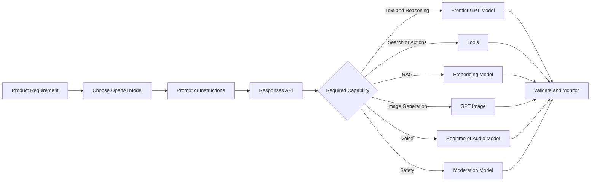

---

## 2. Learning Objectives

After completing this lesson, you should be able to:

* Explain what OpenAI models are.
* Identify the main OpenAI model categories.
* Select a model based on task complexity and product requirements.
* Make a basic request through the Responses API.
* Request structured outputs.
* Connect a model to external tools.
* Use embeddings in a RAG or semantic-search pipeline.
* Recognize when image, voice or moderation models are required.
* Track model versions, token usage and latency.
* Compare multiple models using an evaluation dataset.

---

## 3. What Are OpenAI Models?

OpenAI models are pre-trained models that applications can access through APIs and official client SDKs.

They can be used as components inside:

* Chat assistants
* Customer-support systems
* Coding tools
* Document analyzers
* RAG applications
* AI agents
* Voice assistants
* Image-generation products
* Content-moderation systems
* Data-extraction pipelines

The latest general OpenAI models support text and image input, text output, multilingual workflows and vision. They are available through the Responses API and official SDKs.

```text
Application input
      ↓
Prompt and context construction
      ↓
OpenAI model
      ↓
Text, structured data, tool call or media output
      ↓
Validation
      ↓
Product response
```

The model is only one part of the application. A complete production system also needs:

* Authentication
* Input validation
* Retrieval
* Tool execution
* Output parsing
* Safety checks
* Logging
* Monitoring
* Cost controls
* Fallback behavior

---

## 4. Current OpenAI Model Categories

> **Catalog snapshot:** July 17, 2026. Always verify the official model catalog before beginning a production integration.

### 4.1 Frontier GPT Models

The current GPT-5.6 family includes three main tiers:

| Model             | API Model ID                   | Best Fit                                                 |
| ----------------- | ------------------------------ | -------------------------------------------------------- |
| **GPT-5.6 Sol**   | `gpt-5.6-sol`, alias `gpt-5.6` | Complex professional work, advanced reasoning and coding |
| **GPT-5.6 Terra** | `gpt-5.6-terra`                | Balance between intelligence, cost and latency           |
| **GPT-5.6 Luna**  | `gpt-5.6-luna`                 | Cost-sensitive, high-volume workloads                    |

All three models support configurable reasoning levels and built-in tools such as function calling, web search, file search and computer use.

### Practical positioning

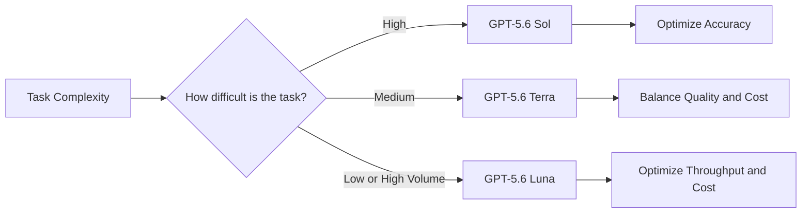

Examples:

| Task                           | Suggested Starting Point |
| ------------------------------ | ------------------------ |
| Complex codebase analysis      | GPT-5.6 Sol              |
| Multi-step agent workflow      | GPT-5.6 Sol or Terra     |
| Customer-support assistant     | GPT-5.6 Terra            |
| Structured document extraction | GPT-5.6 Terra or Luna    |
| High-volume classification     | GPT-5.6 Luna             |
| Simple query rewriting         | GPT-5.6 Luna             |

These are starting hypotheses, not final decisions. The final model should be chosen through evaluation.

---

### 4.2 Image Models

OpenAI provides specialized models for image generation and editing.

The current model catalog identifies **GPT Image 2** as the primary image-generation model. It can be used through the Image API or through image-generation tools in the Responses API.

Typical use cases include:

* Marketing images
* Product mockups
* Story illustrations
* Image editing
* Background replacement
* Visual design exploration
* Reference-image workflows

```text
Text prompt
    +
Optional reference image
    ↓
GPT Image model
    ↓
Generated or edited image
```

Use the Image API for a direct generation or editing request. Use the Responses API when image creation is part of a conversational or agentic workflow.

---

### 4.3 Realtime and Audio Models

OpenAI provides specialized models for:

* Realtime speech-to-speech interaction
* Voice agents
* Live translation
* Speech transcription
* Speaker-aware transcription
* Text-to-speech

The current catalog includes GPT-Realtime models for interactive speech workflows and GPT-4o Transcribe variants for speech-to-text tasks.

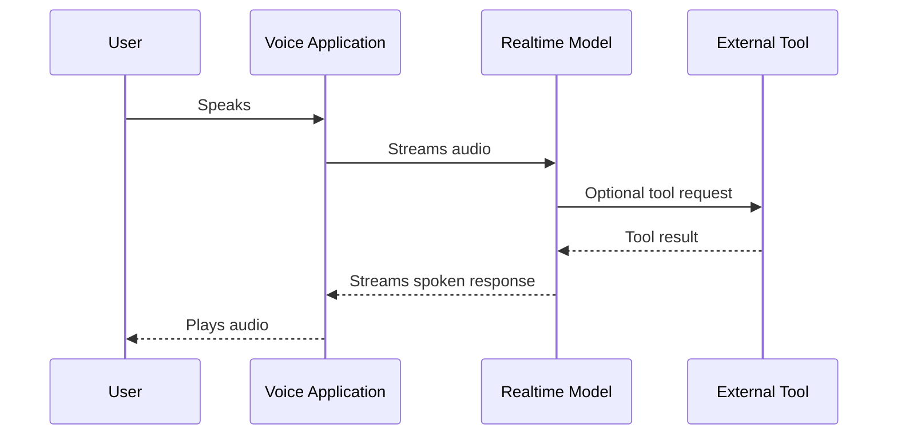

Choose realtime models when conversational delay matters. Choose transcription models when the application primarily needs text from an audio recording.

---

### 4.4 Embedding Models

Embedding models convert text into numerical vectors.

OpenAI currently documents:

* `text-embedding-3-small`
* `text-embedding-3-large`

Embeddings support search, clustering, recommendations, anomaly detection and classification. The distance between vectors represents how related their source texts are.

```text
"How can I cancel my plan?"
              ↓
       Embedding model
              ↓
[0.021, -0.183, 0.904, ...]
```

Embedding models are commonly used in RAG:

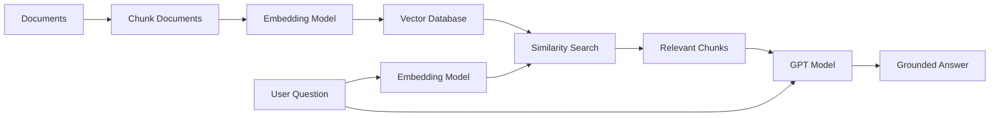

---

### 4.5 Moderation Models

The `omni-moderation-latest` model can classify potentially harmful text and image input. Moderation results can support filtering, review routing and account-level interventions.

Moderation is useful for:

* User-generated content
* Community applications
* AI chat systems
* Image uploads
* Public prompts
* Generated responses

```text
User input
    ↓
Moderation check
    ↓
Safe? ── Yes ──→ Model request
  │
  No
  ↓
Block, warn or route to review
```

Moderation signals should be combined with the product’s own policies and risk controls.

---

## 5. The Responses API

OpenAI recommends the Responses API for new projects. It provides a unified interface for text generation, multimodal input and agent-like tools, while Chat Completions remains supported.

The basic workflow is:

```text
Create OpenAI client
      ↓
Call client.responses.create()
      ↓
Specify model and input
      ↓
Receive response
      ↓
Read response.output_text
```

### Install the Python SDK

```bash
pip install openai
```

Store the API key in an environment variable:

```bash
export OPENAI_API_KEY="your-api-key"
```

Do not hardcode production API keys in source code.

---

## 6. Demo 1: Basic Text Generation

```python
from openai import OpenAI


client = OpenAI()


def generate_summary(text: str) -> str:
    if not text.strip():
        raise ValueError("Text must not be empty.")

    response = client.responses.create(
        model="gpt-5.6-terra",
        instructions=(
            "Summarize the input in three concise bullet points. "
            "Preserve important facts and do not invent information."
        ),
        input=text,
    )

    return response.output_text


if __name__ == "__main__":
    article = """
    Our application processes customer-support tickets.
    The current workflow requires a human to classify every ticket.
    The team wants to test automatic routing while keeping human review
    for low-confidence predictions.
    """

    print(generate_summary(article))
```

The official OpenAI quickstart uses the same basic pattern: create a client, call `responses.create`, specify a model and read `output_text`.

### Request flow

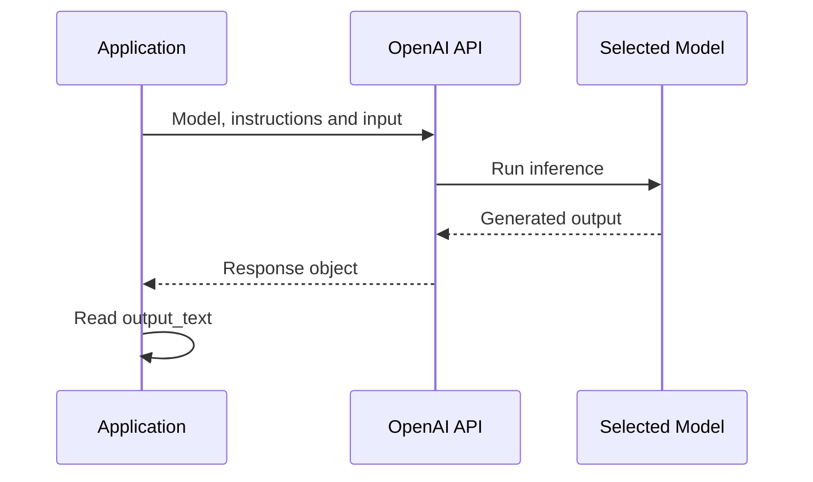

---

## 7. Instructions and Input

A request normally contains two important parts:

### Instructions

Instructions define stable behavior.

```text
You classify support tickets.

Allowed categories:
- billing
- technical
- account
- cancellation

Do not create new categories.
```

### Input

Input contains the current user data.

```text
I cancelled last week, but I was charged again.
```

Separating stable instructions from user input makes prompts:

* Easier to maintain
* Easier to test
* Safer against accidental instruction mixing
* Easier to version

---

## 8. Reasoning Effort

Current GPT-5.6 models support configurable reasoning levels. Higher reasoning effort can help with difficult tasks but may increase processing time and token usage.

Conceptually:

```text
Low reasoning effort
    → classification
    → extraction
    → simple rewriting

Medium reasoning effort
    → document analysis
    → multi-step planning
    → moderate coding

High or greater reasoning effort
    → difficult debugging
    → architecture analysis
    → complex agent planning
```

Do not enable maximum reasoning for every request.

Use the lowest reasoning level that consistently reaches the required quality target.

---

## 9. Structured Outputs

Normal model output is text. Production applications often need predictable data.

Example:

```json
{
  "category": "billing",
  "priority": "high",
  "confidence": 0.94
}
```

Structured Outputs enforce a defined schema. Unlike basic JSON mode, Structured Outputs are designed to enforce schema adherence. OpenAI recommends using Structured Outputs instead of JSON mode when possible.

### Demo with Pydantic

```python
from typing import Literal

from openai import OpenAI
from pydantic import BaseModel, Field


client = OpenAI()


class TicketClassification(BaseModel):
    category: Literal[
        "billing",
        "technical",
        "account",
        "cancellation",
    ]
    priority: Literal["low", "medium", "high"]
    confidence: float = Field(ge=0.0, le=1.0)


def classify_ticket(ticket: str) -> TicketClassification:
    response = client.responses.parse(
        model="gpt-5.6-terra",
        input=[
            {
                "role": "system",
                "content": (
                    "Classify the support ticket. "
                    "Use only the categories defined by the schema."
                ),
            },
            {
                "role": "user",
                "content": ticket,
            },
        ],
        text_format=TicketClassification,
    )

    return response.output_parsed


result = classify_ticket(
    "I cancelled my plan yesterday, but the payment was still processed."
)

print(result.model_dump())
```

The current Python SDK supports parsing Responses API output directly into a Pydantic model through `responses.parse`.

### Use Structured Outputs for

* Classification
* Entity extraction
* API responses
* Form generation
* Workflow decisions
* Database-ready records

---

## 10. Function Calling and Tools

A model only knows the information available in its context and training data. Function calling allows it to request data or actions from an external system.

OpenAI defines function calling as a way for models to interface with external systems and access information outside their training data.

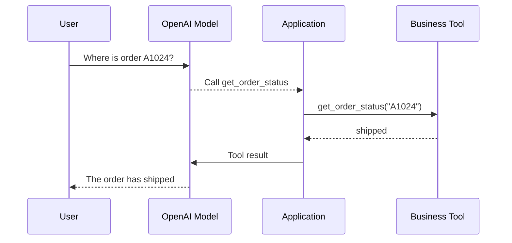

Possible tools include:

* Database lookup
* Weather API
* Calendar API
* Email system
* Payment service
* Search engine
* Internal company API
* Code execution
* File search

### Tool definition example

```python
tools = [
    {
        "type": "function",
        "name": "get_order_status",
        "description": "Get the current status of an order.",
        "parameters": {
            "type": "object",
            "properties": {
                "order_id": {
                    "type": "string",
                    "description": "The order identifier.",
                }
            },
            "required": ["order_id"],
            "additionalProperties": False,
        },
        "strict": True,
    }
]
```

The application—not the model—must execute the real function and return its result.

### Important safety rule

Never allow a model to execute unrestricted actions automatically.

Require:

* Authorization
* Parameter validation
* Tool allowlists
* Audit logs
* Confirmation for destructive actions
* Timeouts
* Idempotency
* Error handling

---

## 11. Built-in Tools

The Responses API supports built-in tools such as:

* Web search
* File search
* Computer use
* Code interpreter
* Remote MCP integrations

These tools are part of the current agent-oriented Responses API design.

### Example: Web Search

```python
from openai import OpenAI


client = OpenAI()

response = client.responses.create(
    model="gpt-5.6-terra",
    tools=[
        {
            "type": "web_search",
        }
    ],
    input="Summarize one important AI development from today.",
)

print(response.output_text)
```

Use web search when the answer requires current public information.

Use file search when the answer should be grounded in uploaded or internal documents.

Use custom functions when the application must call its own APIs.

---

## 12. Demo 2: Embeddings for Semantic Search

```python
from openai import OpenAI


client = OpenAI()


def create_embedding(text: str) -> list[float]:
    response = client.embeddings.create(
        model="text-embedding-3-small",
        input=text,
    )

    return response.data[0].embedding


query_vector = create_embedding(
    "How do I stop my monthly subscription?"
)

print(f"Embedding dimensions received: {len(query_vector)}")
```

The embeddings endpoint accepts text and a selected embedding model and returns a vector representation.

### Semantic-search workflow

```text
1. Split documents into chunks.
2. Create an embedding for each chunk.
3. Store vectors with document metadata.
4. Embed the user query.
5. Find nearby vectors.
6. Send the relevant text to a GPT model.
7. Generate a grounded answer.
```

---

## 13. Vision and Document Workflows

Current general models can accept image input and produce text output. This allows applications to:

* Describe an image
* Read a screenshot
* Inspect a chart
* Extract information from a document
* Classify visual content
* Answer questions about an image

OpenAI’s quickstart demonstrates sending image input to a model through the Responses API.

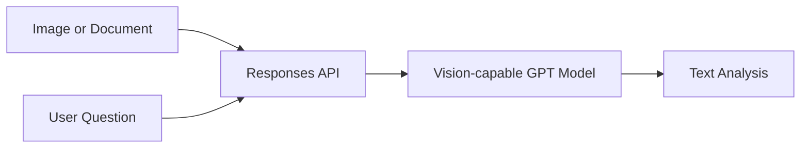

### Important limitation

Vision output should not be assumed to be perfectly accurate.

Use validation or human review when analyzing:

* Medical images
* Legal documents
* Financial statements
* Identity documents
* Safety-critical equipment
* Small or unclear visual details

---

## 14. Model Selection Workflow

OpenAI recommends optimizing accuracy first, then optimizing cost and latency.

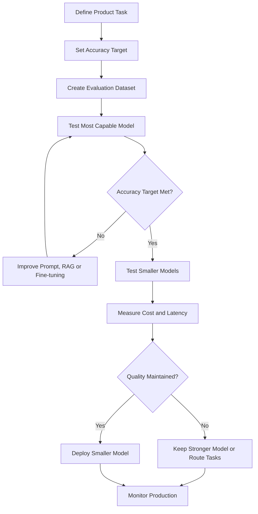

### Step 1: Define measurable requirements

Bad requirement:

> The chatbot should be intelligent.

Better requirement:

> The system must classify at least 92% of support tickets correctly, return valid structured output and respond within two seconds at P95.

---

### Step 2: Build an evaluation dataset

Include:

* Normal examples
* Ambiguous examples
* Very long inputs
* Multilingual inputs
* Missing context
* Prompt injection
* Invalid requests
* Domain-specific terminology

Example:

```json
{
  "id": "ticket-001",
  "input": "I cancelled yesterday, but I was charged again.",
  "expected_category": "billing",
  "expected_priority": "high"
}
```

---

### Step 3: Establish a quality baseline

Begin with a capable model to determine whether the task can reach the required accuracy.

Then compare:

* GPT-5.6 Sol
* GPT-5.6 Terra
* GPT-5.6 Luna
* A fine-tuned model, when appropriate

---

### Step 4: Optimize cost and latency

OpenAI recommends reducing requests, minimizing input and output tokens and testing smaller models after reaching the accuracy target.

Possible optimizations:

* Remove unnecessary prompt text.
* Limit response length.
* Cache repeated results.
* Route simple requests to a smaller model.
* Reduce redundant tool calls.
* Retrieve fewer but more relevant documents.
* Batch offline workloads.
* Stream user-facing responses.

---

## 15. Model Routing

One application can use several OpenAI models.

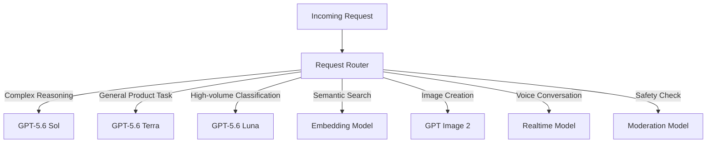

Example routing function:

```python
from typing import Literal


TaskType = Literal[
    "complex_reasoning",
    "general",
    "classification",
]


def choose_model(task: TaskType) -> str:
    model_map = {
        "complex_reasoning": "gpt-5.6",
        "general": "gpt-5.6-terra",
        "classification": "gpt-5.6-luna",
    }

    return model_map[task]
```

Routing should be based on evaluation results rather than model names alone.

---

## 16. Production Architecture

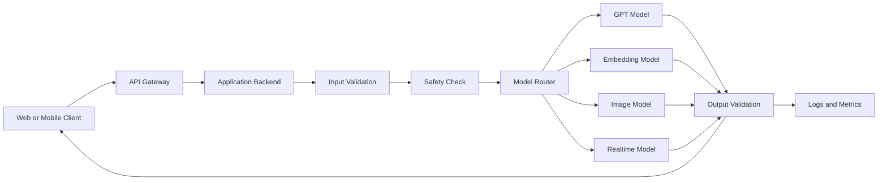

The backend should control:

* API credentials
* Model selection
* Prompts
* Tool definitions
* Rate limits
* Retry policies
* Timeouts
* Output validation
* Usage tracking

Do not call a paid model directly from an untrusted client using a permanent server API key.

---

## 17. Logging and Observability

Log enough information to compare model behavior over time.

```json
{
  "request_id": "req_2048",
  "feature": "ticket_classification",
  "provider": "openai",
  "model": "gpt-5.6-terra",
  "model_snapshot": "configured-snapshot-or-alias",
  "prompt_version": "ticket-v3",
  "input_tokens": 482,
  "output_tokens": 42,
  "reasoning_effort": "low",
  "time_to_first_token_ms": 310,
  "total_latency_ms": 980,
  "valid_output": true,
  "retry_count": 0,
  "fallback_used": false,
  "quality_score": 0.94,
  "status": "success"
}
```

Track:

* Model ID
* Model snapshot or alias
* Prompt version
* Input tokens
* Output tokens
* Cached tokens
* Reasoning configuration
* Latency
* Tool calls
* Errors
* Retries
* Quality score
* Estimated cost

### Why model versioning matters

A model alias may eventually point to a newer model behavior.

Before changing a model or snapshot:

1. Run regression evaluations.
2. Compare old and new outputs.
3. Inspect failure cases.
4. Deploy gradually.
5. Keep a rollback option.

---

## 18. Data and Privacy Considerations

According to OpenAI’s current API data-control documentation, API data is not used to train OpenAI models unless the customer explicitly opts in. Retention and application-state behavior vary by endpoint and configuration, so teams should review the exact data controls used by their workflow.

Before production deployment, review:

* Sensitive data in prompts
* Application-state storage
* Abuse-monitoring retention
* Regional requirements
* File retention
* Conversation storage
* Access permissions
* Logging policies

Avoid logging:

* Passwords
* API keys
* Authentication tokens
* Private customer data
* Complete confidential documents

Use redaction and least-privilege access.

---

## 19. Safety Considerations

A production AI application should not rely only on the model’s default behavior.

Add safeguards for:

* Prompt injection
* Harmful input
* Harmful output
* Unauthorized tool use
* Sensitive data exposure
* Destructive actions
* Hallucinated facts
* Invalid structured output

```text
Input
  ↓
Authentication
  ↓
Input moderation and validation
  ↓
Model or tool workflow
  ↓
Output validation and moderation
  ↓
Human review when required
  ↓
User
```

The moderation model can classify text and image inputs, but the application must decide how to act on those signals.

---

## 20. Common Mistakes

### Mistake 1: Always choosing the largest model

The most capable model may be unnecessary for:

* Classification
* Entity extraction
* Query rewriting
* Simple summaries
* Routing

Test a smaller model after establishing the quality baseline.

---

### Mistake 2: Selecting a model without an evaluation dataset

Manual testing with five prompts is not sufficient.

Use representative product data and measurable expected results.

---

### Mistake 3: Comparing models with different prompts

A fair comparison should keep these consistent:

* Prompt
* Input
* Reasoning level
* Output limits
* Tools
* Retrieval context
* Evaluation metric

---

### Mistake 4: Using free-form text for application logic

Do not parse sentences such as:

```text
This ticket probably belongs to billing.
```

Use Structured Outputs:

```json
{
  "category": "billing"
}
```

---

### Mistake 5: Treating model knowledge as live data

Use tools or search for:

* Current prices
* Order status
* Account balances
* Recent policies
* Current events
* Live schedules

---

### Mistake 6: Letting the model execute sensitive tools freely

The model may select a tool, but the application must enforce:

* User permissions
* Valid arguments
* Confirmation rules
* Business constraints

---

### Mistake 7: Ignoring model migration

Model availability and recommended model IDs evolve.

Monitor:

* Model catalog
* Changelog
* Deprecation notices
* Pricing
* Evaluation regressions

---

## 21. Example Production Failure

### Scenario

A team uses the flagship model for every application request.

The product performs:

* Ticket classification
* Chat responses
* Query rewriting
* Structured extraction
* Document analysis

### Symptoms

* High monthly cost
* Slow responses during traffic spikes
* Low throughput
* Simple requests use unnecessary reasoning

### Root cause

The application has no model-routing strategy.

### Debugging process

```text
1. Group requests by task type.
2. Measure accuracy by feature.
3. Record token usage and latency.
4. Test GPT-5.6 Terra and Luna on simple tasks.
5. Keep the flagship model for difficult requests.
6. Add fallback and routing logic.
7. Monitor quality after deployment.
```

### Improved architecture

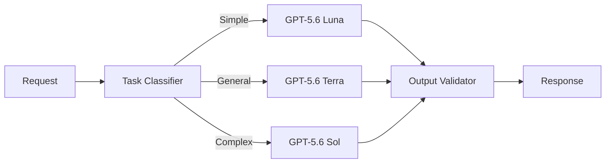

---

## 22. Practical Exercises

### Exercise 1: Five-line summary

Without looking at the lesson, explain:

1. What OpenAI models are.
2. What the Responses API does.
3. When to use a smaller GPT model.
4. What embeddings are used for.
5. Why model versions must be logged.

---

### Exercise 2: Basic API demo

Build a Python script that:

* Accepts user text
* Sends it to an OpenAI model
* Returns a three-sentence summary
* Measures total latency
* Logs the selected model

Suggested output:

```json
{
  "model": "gpt-5.6-terra",
  "latency_ms": 1240,
  "summary": "Generated summary..."
}
```

---

### Exercise 3: Structured classification

Create a support-ticket classifier with:

* Four categories
* Three priority levels
* Confidence from `0.0` to `1.0`
* Pydantic validation

Test at least 20 tickets.

---

### Exercise 4: Compare three models

Compare:

* `gpt-5.6`
* `gpt-5.6-terra`
* `gpt-5.6-luna`

Record:

| Test ID | Expected Result | Sol     | Terra   | Luna      | Latency | Tokens |
| ------- | --------------- | ------- | ------- | --------- | ------: | -----: |
| 001     | billing         | billing | billing | billing   |         |        |
| 002     | account         | account | account | technical |         |        |

Calculate:

```text
Accuracy =
correct outputs / total outputs

Valid-output rate =
schema-valid outputs / total outputs

Average latency =
total latency / number of requests

Average tokens =
total tokens / number of requests
```

---

### Exercise 5: Add a RAG component

Create a small document collection containing:

* Refund policy
* Account policy
* Subscription policy
* Privacy policy

Then:

1. Create embeddings.
2. Store document vectors.
3. Retrieve relevant chunks.
4. Send the chunks to a GPT model.
5. Require the model to cite the source document.
6. Test questions with missing information.

---

## 23. Project: Model Comparison App

Build an application that compares two or three OpenAI models.

### Inputs

* Prompt
* Candidate models
* Reasoning effort
* Maximum output length
* Number of runs
* Optional image
* Optional retrieval context

### Outputs

* Generated response
* Accuracy score
* Structured-output validity
* Input-token usage
* Output-token usage
* Time to first token
* Total latency
* Estimated cost
* Tool calls
* Error information

### Architecture

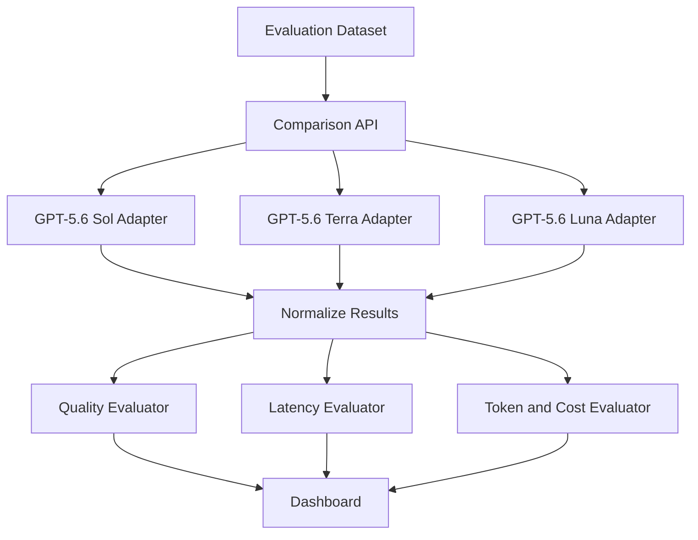

### Suggested result schema

```json
{
  "test_id": "ticket-001",
  "provider": "openai",
  "model": "gpt-5.6-terra",
  "prompt_version": "ticket-v3",
  "response": {
    "category": "billing",
    "priority": "high",
    "confidence": 0.94
  },
  "correct": true,
  "valid_output": true,
  "input_tokens": 510,
  "output_tokens": 41,
  "time_to_first_token_ms": 280,
  "total_latency_ms": 920,
  "estimated_cost": 0.0,
  "error": null
}
```

### Recommended portfolio features

* Side-by-side responses
* Latency chart
* Token-usage chart
* Cost comparison
* Prompt-version history
* Evaluation dataset upload
* CSV export
* Automatic model recommendation
* Error dashboard
* Fallback-model configuration

---

## 24. Completion Checklist

* [ ] I can explain OpenAI models in one or two minutes.
* [ ] I know the difference between frontier and specialized models.
* [ ] I can make a request using the Responses API.
* [ ] I can choose between Sol, Terra and Luna as evaluation candidates.
* [ ] I understand Structured Outputs.
* [ ] I understand function calling.
* [ ] I can explain how embeddings support RAG.
* [ ] I know when to use image, voice or moderation models.
* [ ] I have built a small API demo.
* [ ] I have compared at least two models.
* [ ] I have logged model version, token usage and latency.
* [ ] I have tested failure cases.
* [ ] I have documented at least one limitation.

---

## 25. Key Outcome

Choose OpenAI models based on:

* Required capability
* Product-specific accuracy
* Reasoning complexity
* Input and output modalities
* Context requirements
* Tool support
* Latency
* Token usage
* Cost
* Safety
* Privacy
* Reliability

Use a capable model to establish the quality target, then test whether a smaller and faster model can maintain that quality.

---

## 26. Final Summary

OpenAI provides model families for:

1. Text, reasoning and coding
2. Vision and multimodal input
3. Structured outputs
4. Function calling and agents
5. Embeddings and RAG
6. Image generation and editing
7. Realtime speech
8. Transcription
9. Content moderation

A reliable OpenAI integration should follow this workflow:

```text
Define task
    ↓
Create evaluation dataset
    ↓
Establish quality with a capable model
    ↓
Compare smaller models
    ↓
Measure latency, tokens and cost
    ↓
Add structured validation and safety
    ↓
Deploy gradually
    ↓
Monitor model and prompt versions
```

Do not ask only:

> Which OpenAI model is the most intelligent?

Ask:

> Which model achieves the required quality, modality support, safety and reliability at an acceptable latency and cost for this specific product?

```

OpenAI models become useful product components when they are surrounded by evaluation, validation, tools, safety controls and production monitoring.
```

---

# Bài luyện tập

## Mục tiêu


## Đề bài


## Yêu cầu hoàn thành

- [ ] 
- [ ] 
- [ ] 

## Kết quả / lời giải


## Ghi chú
