# 005 — Anthropic Claude

| Field                  | Details                                      |
| ---------------------- | -------------------------------------------- |
| **Course**             | 02 — Model Platforms and Prompting           |
| **Module**             | Module 03 — Using Pre-trained Models         |
| **Content Group**      | Popular AI Models                            |
| **Roadmap Source**     | Using Pre-trained Models / Popular AI Models |
| **Lesson Type**        | Model Selection                              |
| **Order in Module**    | 005                                          |
| **Suggested Duration** | 20 minutes                                   |

---

## 1. Summary

**Claude** is a family of large language models developed by Anthropic.

Claude models can support applications involving:

* Writing and editing
* Document analysis
* Reasoning
* Software development
* Structured data extraction
* Image understanding
* Long-context processing
* Tool calling
* Autonomous agents
* Multilingual workflows

Current Claude models accept text and image input and produce text output. They are available through Anthropic’s Claude API and through supported cloud platforms.

An AI Engineer should choose a Claude model according to:

* Task complexity
* Required quality
* Context length
* Latency
* Token cost
* Tool-use requirements
* Data-retention requirements
* Deployment environment
* Failure impact

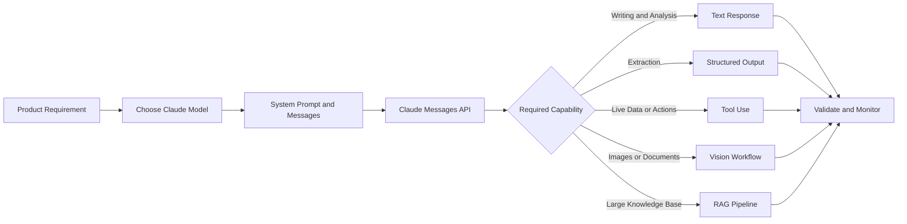

---

## 2. Learning Objectives

After completing this lesson, you should be able to:

* Explain what Anthropic Claude is.
* Identify the main Claude model tiers.
* Select a Claude model for a product task.
* Send a basic request through the Messages API.
* Separate system instructions from user messages.
* Request validated structured output.
* Connect Claude to tools and external APIs.
* Use Claude in vision, document and long-context workflows.
* Understand prompt caching and batch processing.
* Track model version, token usage, latency and errors.
* Compare Claude fairly with models from other providers.

---

## 3. What Is Claude?

Claude is a pre-trained AI model family designed for tasks involving language, code, reasoning, images and agentic workflows.

Claude can be used as a component inside:

* Customer-support assistants
* Coding agents
* Document-review systems
* Research assistants
* Internal knowledge assistants
* Data-extraction APIs
* Content-generation tools
* Browser or computer-use agents
* Multilingual applications

```text
User or application input
          ↓
System instructions
          ↓
Conversation messages
          ↓
Claude model
          ↓
Text, JSON or tool request
          ↓
Application validation
          ↓
Product response
```

Claude is not a complete application by itself. A production system normally adds:

* Authentication
* Prompt management
* Retrieval
* Tool execution
* Output validation
* Safety controls
* Logging
* Monitoring
* Cost limits
* Fallback behavior

---

## 4. Current Claude Model Family

> **Catalog snapshot:** July 17, 2026.

Anthropic’s current general model lineup includes Claude Fable 5, Claude Opus 4.8, Claude Sonnet 5 and Claude Haiku 4.5. Fable is positioned for the highest-capability, long-running agent workloads; Opus targets complex enterprise and coding work; Sonnet balances speed and intelligence; Haiku is optimized for speed and lower cost.

| Model                | API ID             | Typical Product Fit                                        |
| -------------------- | ------------------ | ---------------------------------------------------------- |
| **Claude Fable 5**   | `claude-fable-5`   | Most demanding reasoning and long-running agents           |
| **Claude Opus 4.8**  | `claude-opus-4-8`  | Complex coding, enterprise analysis and high-autonomy work |
| **Claude Sonnet 5**  | `claude-sonnet-5`  | General production workloads, agents and coding            |
| **Claude Haiku 4.5** | `claude-haiku-4-5` | Fast, high-volume and cost-sensitive tasks                 |

### Current technical comparison

| Feature                         |   Fable 5 |  Opus 4.8 |         Sonnet 5 |   Haiku 4.5 |
| ------------------------------- | --------: | --------: | ---------------: | ----------: |
| Context window                  | 1M tokens | 1M tokens |        1M tokens | 200K tokens |
| Maximum synchronous output      |      128K |      128K |             128K |         64K |
| Relative latency                |   Slowest |  Moderate |             Fast |     Fastest |
| Input price per million tokens  |       $10 |        $5 |  $2 introductory |          $1 |
| Output price per million tokens |       $50 |       $25 | $10 introductory |          $5 |

Claude Sonnet 5’s introductory price of $2 per million input tokens and $10 per million output tokens applies through **August 31, 2026**; its announced standard price is $3 and $15 afterward.

---

## 5. Practical Model Positioning

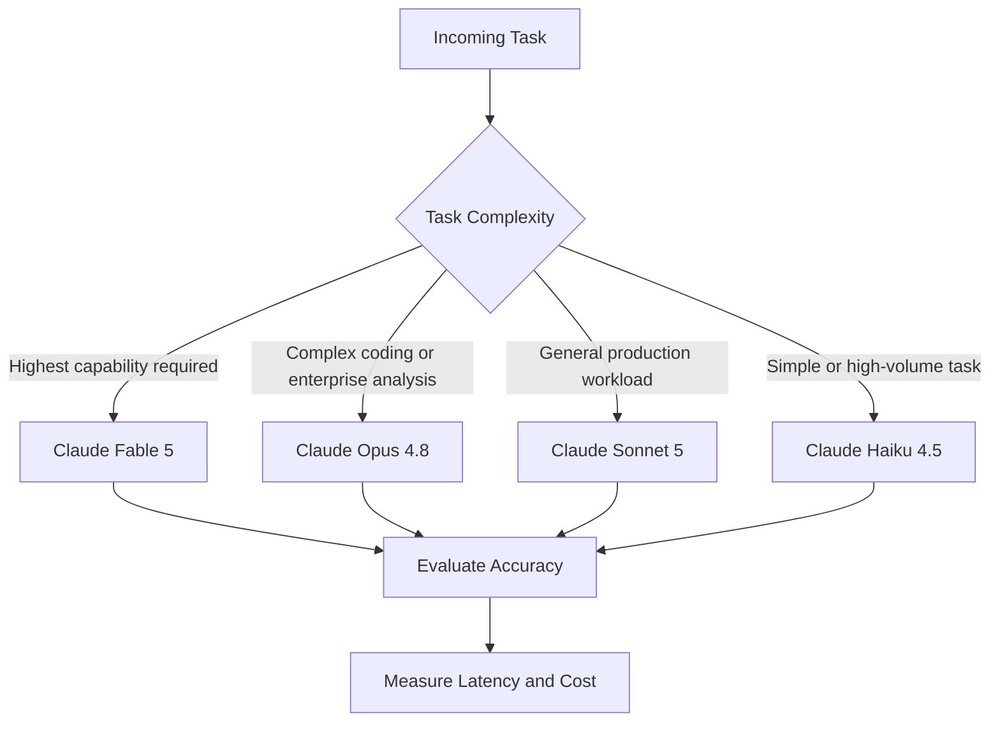

### Suggested starting points

| Task                                   | Model to Evaluate First    |
| -------------------------------------- | -------------------------- |
| Long-running autonomous research agent | Fable 5                    |
| Large codebase investigation           | Opus 4.8                   |
| General coding assistant               | Sonnet 5                   |
| Customer-support assistant             | Sonnet 5                   |
| Document classification                | Haiku 4.5 or Sonnet 5      |
| Query rewriting                        | Haiku 4.5                  |
| High-volume data extraction            | Haiku 4.5 or Sonnet 5      |
| Complex financial or legal analysis    | Opus 4.8 with human review |

These are starting hypotheses. The final decision should be based on a product-specific evaluation dataset rather than the model tier alone.

---

## 6. Claude Capabilities

### 6.1 Writing and Analysis

Claude can be used to:

* Summarize documents
* Rewrite content
* Compare arguments
* Extract requirements
* Produce reports
* Analyze feedback
* Translate text
* Generate explanations

---

### 6.2 Coding

Claude models can assist with:

* Code generation
* Debugging
* Refactoring
* Test creation
* Repository exploration
* Architecture analysis
* Terminal and browser tools
* Multi-step software tasks

Anthropic positions Sonnet 5 as a model for coding, agents and professional work at scale, while Opus 4.8 is intended for more complex agentic coding and enterprise tasks.

---

### 6.3 Vision

Current Claude models support image input and can analyze:

* Screenshots
* Diagrams
* Charts
* Photographs
* Scanned documents
* User-interface designs

They return text rather than generated images.

```text
Image or document
        +
User question
        ↓
Vision-capable Claude model
        ↓
Description, extraction or analysis
```

---

### 6.4 Structured Outputs

Claude can return JSON that follows a specified schema.

This is useful for:

* Classification
* Entity extraction
* API responses
* Workflow decisions
* Database-ready records
* Agent results

---

### 6.5 Tool Use

Claude can request tools that:

* Search the web
* Query a database
* Call an internal API
* Run code
* Edit files
* Use a browser
* Update external systems
* Connect through MCP

Anthropic distinguishes between client tools executed by your application and server tools executed on Anthropic’s infrastructure.

---

## 7. The Messages API

The main Claude API endpoint is the **Messages API**.

A request normally contains:

* A model ID
* A maximum output-token limit
* Optional system instructions
* One or more conversation messages
* Optional tools
* Optional output configuration

The Messages API supports single requests and stateless multi-turn conversations. System instructions are supplied through the top-level `system` parameter rather than a normal `system` role in the message list.

```text
Application
    ↓
client.messages.create(...)
    ↓
Claude API
    ↓
Message object
    ↓
Content blocks and usage metadata
```

---

## 8. Demo 1: Basic Claude API Request

### Install the SDK

```bash
pip install anthropic
```

Configure the API key:

```bash
export ANTHROPIC_API_KEY="your-api-key"
```

Do not hardcode a production API key in source code.

### Python example

```python
from anthropic import Anthropic


client = Anthropic()


def summarize_text(text: str) -> dict:
    if not text.strip():
        raise ValueError("Text must not be empty.")

    message = client.messages.create(
        model="claude-sonnet-5",
        max_tokens=500,
        system=(
            "You are a technical editor. "
            "Summarize the input in three concise bullet points. "
            "Do not invent information."
        ),
        messages=[
            {
                "role": "user",
                "content": text,
            }
        ],
    )

    output_text = "".join(
        block.text
        for block in message.content
        if block.type == "text"
    )

    return {
        "model": message.model,
        "text": output_text,
        "input_tokens": message.usage.input_tokens,
        "output_tokens": message.usage.output_tokens,
        "stop_reason": message.stop_reason,
    }


if __name__ == "__main__":
    result = summarize_text(
        """
        The support team currently classifies every ticket manually.
        The company wants to test automated ticket routing while
        retaining human review for uncertain cases.
        """
    )

    print(result)
```

This follows the current SDK pattern of calling `client.messages.create()` with a model, token limit and list of messages.

---

## 9. Understanding the Response

A Claude response contains information such as:

* Message ID
* Model ID
* Content blocks
* Stop reason
* Input-token usage
* Output-token usage

Example normalized result:

```json
{
  "provider": "anthropic",
  "model": "claude-sonnet-5",
  "text": "Generated response",
  "input_tokens": 284,
  "output_tokens": 76,
  "stop_reason": "end_turn"
}
```

### Important stop reasons

| Stop Reason     | Meaning                              |
| --------------- | ------------------------------------ |
| `end_turn`      | Claude finished the answer           |
| `max_tokens`    | Output reached the configured limit  |
| `tool_use`      | Claude requested a client-side tool  |
| `stop_sequence` | A custom stop sequence was generated |
| `refusal`       | Claude declined the request          |

Your application should inspect the stop reason rather than assuming every successful HTTP response contains a complete final answer.

---

## 10. System Instructions and Messages

### System instructions

Use the top-level `system` field for stable behavior:

```text
You classify customer-support tickets.

Allowed categories:
- billing
- account
- technical
- cancellation

Return only information supported by the ticket.
```

### User message

Use a user message for the current task:

```text
I cancelled my subscription yesterday, but I was charged today.
```

### Why separate them?

Separating stable instructions and user input makes the system:

* Easier to maintain
* Easier to version
* Easier to evaluate
* Less likely to confuse user data with developer instructions
* More suitable for prompt caching

---

## 11. Multi-turn Conversations

The Messages API is stateless. The application normally sends the required conversation history with each request.

```python
messages = [
    {
        "role": "user",
        "content": "What is a vector database?",
    },
    {
        "role": "assistant",
        "content": "A vector database stores and searches embeddings.",
    },
    {
        "role": "user",
        "content": "How does it support RAG?",
    },
]

response = client.messages.create(
    model="claude-sonnet-5",
    max_tokens=800,
    messages=messages,
)
```

### Production concern

Sending the full conversation repeatedly can increase:

* Input-token usage
* Cost
* Latency
* Context-window consumption

Possible solutions include:

* Summarizing old messages
* Removing irrelevant turns
* Storing structured memory
* Using prompt caching
* Retrieving only relevant history

---

## 12. Structured Outputs

Structured outputs constrain Claude to generate JSON that follows a specified schema.

Anthropic currently provides:

1. **JSON outputs** through `output_config.format`
2. **Strict tool use** through `strict: true`

These features are designed to prevent malformed JSON, missing required fields and invalid tool arguments.

### Example schema

```json
{
  "type": "object",
  "properties": {
    "category": {
      "type": "string",
      "enum": [
        "billing",
        "technical",
        "account",
        "cancellation"
      ]
    },
    "priority": {
      "type": "string",
      "enum": ["low", "medium", "high"]
    }
  },
  "required": ["category", "priority"],
  "additionalProperties": false
}
```

### Demo 2: Structured classification

```python
import json

from anthropic import Anthropic


client = Anthropic()


def classify_ticket(ticket: str) -> dict:
    response = client.messages.create(
        model="claude-sonnet-5",
        max_tokens=300,
        messages=[
            {
                "role": "user",
                "content": (
                    "Classify this customer-support ticket:\n\n"
                    f"{ticket}"
                ),
            }
        ],
        output_config={
            "format": {
                "type": "json_schema",
                "schema": {
                    "type": "object",
                    "properties": {
                        "category": {
                            "type": "string",
                            "enum": [
                                "billing",
                                "technical",
                                "account",
                                "cancellation",
                            ],
                        },
                        "priority": {
                            "type": "string",
                            "enum": ["low", "medium", "high"],
                        },
                    },
                    "required": ["category", "priority"],
                    "additionalProperties": False,
                },
            }
        },
    )

    if response.stop_reason != "end_turn":
        raise RuntimeError(
            f"Unexpected stop reason: {response.stop_reason}"
        )

    return json.loads(response.content[0].text)


print(
    classify_ticket(
        "I cancelled last week, but another payment was processed."
    )
)
```

The API returns schema-conforming JSON in the response text. A refusal or an output truncated by `max_tokens` still requires special handling.

---

## 13. Structured Output with Pydantic

The Python SDK also supports parsing into a Pydantic model.

```python
from typing import Literal

from anthropic import Anthropic
from pydantic import BaseModel, Field


client = Anthropic()


class TicketClassification(BaseModel):
    category: Literal[
        "billing",
        "technical",
        "account",
        "cancellation",
    ]
    priority: Literal["low", "medium", "high"]
    confidence: float = Field(ge=0.0, le=1.0)


response = client.messages.parse(
    model="claude-sonnet-5",
    max_tokens=300,
    messages=[
        {
            "role": "user",
            "content": (
                "Classify this ticket: "
                "The application crashes when I upload an image."
            ),
        }
    ],
    output_format=TicketClassification,
)

result = response.parsed_output
print(result.model_dump())
```

The current Python SDK can transform Pydantic models into supported schemas and validate the returned data against the original model.

---

## 14. Tool Use

Tool use connects Claude to information or actions outside the model.

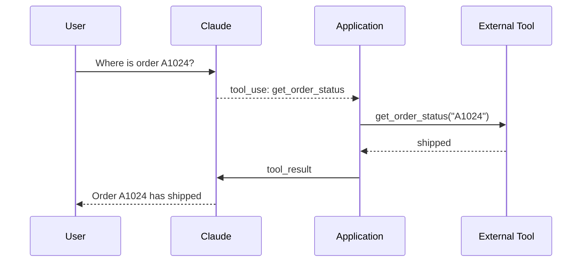

Claude does not directly execute your custom function. It produces a structured request; your application executes the operation and returns the result. Server tools such as web search may instead run on Anthropic’s infrastructure.

---

## 15. Defining a Custom Tool

```python
tools = [
    {
        "name": "get_order_status",
        "description": (
            "Return the current shipping status for an order."
        ),
        "strict": True,
        "input_schema": {
            "type": "object",
            "properties": {
                "order_id": {
                    "type": "string",
                    "description": "The order identifier.",
                }
            },
            "required": ["order_id"],
            "additionalProperties": False,
        },
    }
]
```

Send the tool to Claude:

```python
response = client.messages.create(
    model="claude-sonnet-5",
    max_tokens=500,
    tools=tools,
    messages=[
        {
            "role": "user",
            "content": "Where is order A1024?",
        }
    ],
)
```

When Claude chooses the tool, the response contains a `tool_use` content block. Your application must:

1. Read the tool name and arguments.
2. Validate authorization.
3. Execute the actual function.
4. Return a `tool_result`.
5. Continue the conversation.

### Safety controls

Do not execute model-requested actions without checking:

* User permissions
* Parameter validity
* Environment
* Business rules
* Side effects
* Idempotency
* Confirmation requirements

---

## 16. Client Tools vs Server Tools

| Tool Type                    | Execution Location       | Example                                 |
| ---------------------------- | ------------------------ | --------------------------------------- |
| User-defined client tool     | Your application         | Internal order API                      |
| Anthropic-schema client tool | Your application         | Bash, text editor or computer tool      |
| Server tool                  | Anthropic infrastructure | Web search, web fetch or code execution |
| MCP connector                | Remote MCP server        | Business systems and data sources       |

Tool choice affects:

* Security responsibility
* Latency
* Data flow
* Error handling
* Cost
* Retention requirements

---

## 17. MCP and Vendor Integration

The **Model Context Protocol**, or MCP, standardizes how AI applications connect to tools and data sources. Anthropic’s Messages API can connect to remote MCP servers.

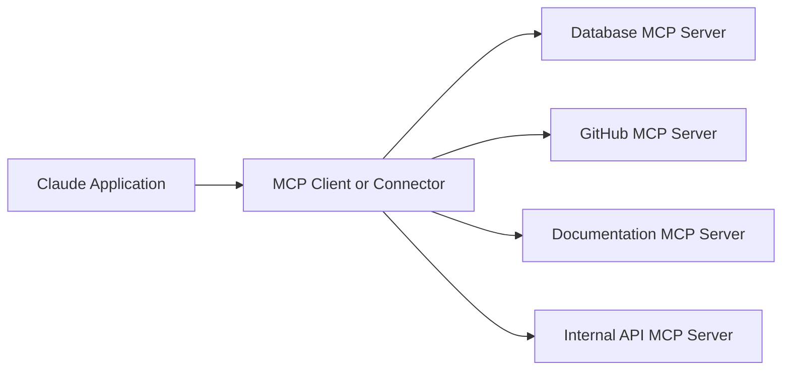

MCP can reduce custom integration work, but applications still need:

* Authentication
* Authorization
* Tool allowlists
* Audit logs
* Data-governance review

---

## 18. Vision and Document Workflows

A user message may contain text and image or document content blocks.

Conceptual request:

```text
User content:
- Image: invoice.png
- Text: "Extract the invoice number, date and total."
```

Claude can then return:

```json
{
  "invoice_number": "INV-2048",
  "date": "2026-07-10",
  "total": 1248.50
}
```

### Suitable use cases

* Invoice extraction
* Screenshot analysis
* UI review
* Chart explanation
* Form understanding
* Visual question answering
* Document comparison

### Important limitations

Vision output can still be incorrect when:

* Text is very small.
* Images are low resolution.
* Documents are rotated or damaged.
* Tables are complex.
* Important information is visually ambiguous.

Use schema validation and human review for high-risk documents.

---

## 19. Long-context Workflows

Fable 5, Opus 4.8 and Sonnet 5 currently support context windows of up to one million tokens, while Haiku 4.5 supports 200,000 tokens.

Long context can support:

* Large code repositories
* Long contracts
* Research papers
* Conversation history
* Multiple policy documents
* Agent trajectories

However, a larger context does not automatically produce a better answer.

```text
Large amount of available context
              ≠
All context should be sent
```

Problems include:

* Higher token cost
* Higher latency
* Irrelevant information
* Conflicting instructions
* Prompt-injection exposure
* Reduced attention to important evidence

For large knowledge collections, use retrieval and reranking rather than placing every document into every request.

---

## 20. RAG with Claude

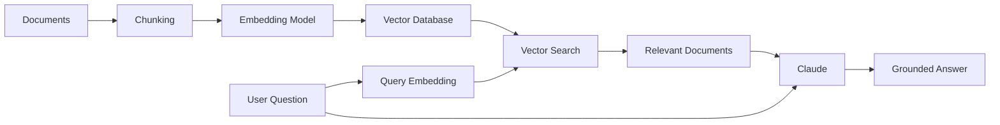

### Important note

Anthropic’s primary Claude models generate language and analyze images, but a RAG pipeline may use an embedding model from another provider or a locally hosted embedding model.

This means your application might combine:

```text
Embedding provider A
        +
Vector database
        +
Claude generation model
        =
RAG application
```

Vendor abstraction is therefore useful at several pipeline layers.

---

## 21. Prompt Caching

Prompt caching reduces repeated processing of stable prompt prefixes.

Cacheable content can include:

* Tool definitions
* System instructions
* Text messages
* Images
* Documents
* Previous tool calls and results

Claude prompt caches commonly use a five-minute lifetime, with a one-hour option available for suitable workflows. Cache hits are reported in response usage fields.

### Good caching candidates

* Long system prompts
* Reused policy documents
* Large tool definitions
* Stable coding guidelines
* Repeated conversation history

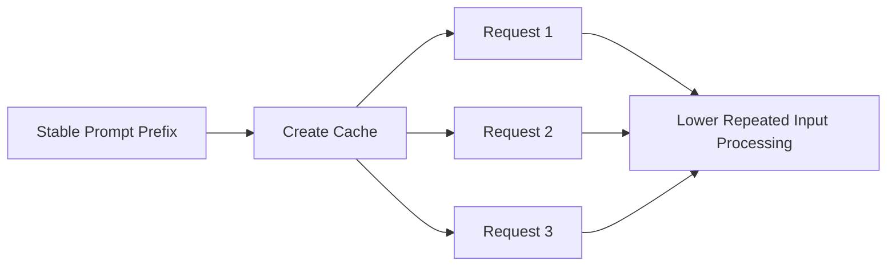

### Cache warning

Changing an earlier part of the prompt may invalidate later cached content.

The cache hierarchy follows:

```text
tools
  ↓
system
  ↓
messages
```

---

## 22. Batch Processing

The Message Batches API accepts multiple message requests for asynchronous processing. Results may complete out of order, so each request should include a unique `custom_id`. A batch may take up to 24 hours to complete.

Batch processing is suitable for:

* Offline classification
* Dataset labeling
* Large evaluation runs
* Document summarization
* Nightly content processing

It is not suitable when a user needs an immediate response.

---

## 23. Model Selection Workflow

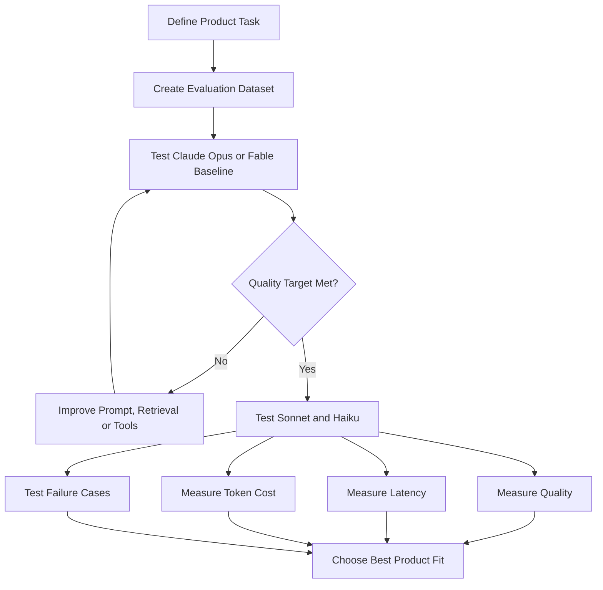

### Example requirements

Bad requirement:

> Claude should give good answers.

Better requirement:

> The system must classify at least 92% of support tickets correctly, return schema-valid JSON and complete within 1.5 seconds at P95.

---

## 24. Fair Provider Comparison

When comparing Claude with another model, keep the following constant:

* Evaluation dataset
* User input
* Business instructions
* Output schema
* Maximum output length
* Retrieval documents
* Tool definitions
* Number of test runs
* Scoring method

Do not reuse provider-specific prompting styles blindly. Equivalent prompts may require different formatting or instructions because model behavior differs.

### Comparison table

| Metric                     | Claude | Model B | Model C |
| -------------------------- | -----: | ------: | ------: |
| Task accuracy              |        |         |         |
| P50 latency                |        |         |         |
| P95 latency                |        |         |         |
| Input tokens               |        |         |         |
| Output tokens              |        |         |         |
| Structured-output validity |        |         |         |
| Tool-call accuracy         |        |         |         |
| Estimated cost             |        |         |         |

---

## 25. Vendor Abstraction

A provider abstraction layer can make model switching easier.

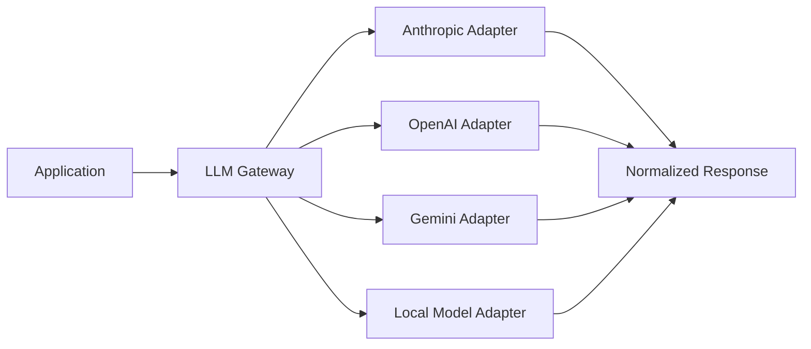

### Unified request model

```python
from dataclasses import dataclass
from typing import Any


@dataclass
class ModelRequest:
    provider: str
    model: str
    system: str
    messages: list[dict[str, Any]]
    max_output_tokens: int
```

### Unified response model

```python
@dataclass
class ModelResponse:
    provider: str
    model: str
    text: str
    input_tokens: int
    output_tokens: int
    latency_ms: float
    finish_reason: str
    error: str | None = None
```

### Abstraction limitations

A unified interface cannot completely hide differences in:

* Tool-call formats
* System-message behavior
* Structured outputs
* Reasoning controls
* Streaming events
* Safety behavior
* Tokenizers
* Context management

Use abstraction for shared infrastructure, but preserve provider-specific capabilities when they provide product value.

---

## 26. Production Architecture

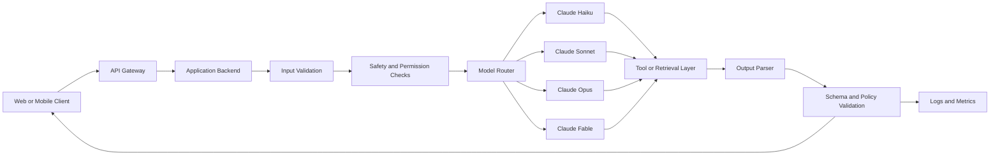

A production backend should control:

* API keys
* Model routing
* Prompt versions
* Tool permissions
* Timeouts
* Retries
* Token limits
* Structured-output validation
* Logging
* Cost tracking

---

## 27. Logging and Observability

Log enough information to compare model behavior over time.

```json
{
  "request_id": "req_1052",
  "feature": "ticket_classification",
  "provider": "anthropic",
  "model": "claude-sonnet-5",
  "prompt_version": "ticket-v4",
  "input_tokens": 518,
  "cache_creation_input_tokens": 0,
  "cache_read_input_tokens": 320,
  "output_tokens": 42,
  "latency_ms": 970,
  "stop_reason": "end_turn",
  "tool_calls": 0,
  "valid_output": true,
  "retry_count": 0,
  "fallback_used": false,
  "quality_score": 0.94,
  "status": "success"
}
```

Track:

* Model ID
* Prompt version
* Input tokens
* Output tokens
* Cache usage
* Latency
* Stop reason
* Tool calls
* Validation failures
* Refusals
* Retries
* Estimated cost
* Quality score

---

## 28. Privacy and Data Retention

Data-handling rules depend on the Claude product, API feature and deployment platform.

Anthropic documents zero-data-retention and HIPAA-ready arrangements for eligible API customers. Under eligible ZDR configurations, customer prompts and responses are not stored at rest after the API response, although feature-specific exceptions and safety or legal retention conditions may apply.

Important current consideration:

* Claude Fable 5 requires 30-day data retention.
* Fable 5 is not available under a zero-data-retention configuration.
* Some stateful tools and APIs have their own retention behavior.
* Cloud-provider deployments may follow the provider’s data-processing terms.

Before deployment, review:

* Prompt contents
* File storage
* Tool data
* Logging
* Regional requirements
* Healthcare or financial data
* Third-party integrations
* Model-specific retention

---

## 29. Safety Considerations

Claude’s safety behavior does not replace application-level controls.

Add safeguards for:

* Prompt injection
* Sensitive information
* Unauthorized tool access
* Destructive actions
* Hallucinated facts
* Invalid outputs
* High-risk decisions

```text
User input
    ↓
Authentication
    ↓
Input validation
    ↓
Claude or tool workflow
    ↓
Schema and policy validation
    ↓
Human review when required
    ↓
Final response or action
```

For tools that send messages, modify records or execute code, require authorization and confirmation based on the risk level.

---

## 30. Common Mistakes

### Mistake 1: Selecting Opus or Fable for every request

High-capability models can increase cost and latency.

Evaluate Sonnet or Haiku for:

* Classification
* Extraction
* Query rewriting
* Simple summaries
* Routing decisions

---

### Mistake 2: Assuming a one-million-token window removes the need for RAG

A large context can still contain:

* Irrelevant documents
* Old information
* Duplicate content
* Conflicting instructions

Retrieval remains useful for selecting fresh and relevant evidence.

---

### Mistake 3: Parsing free-form prose for application decisions

Avoid:

```text
This request appears to be related to billing.
```

Prefer structured output:

```json
{
  "category": "billing"
}
```

---

### Mistake 4: Ignoring stop reasons

A response stopped by `max_tokens` may be incomplete.

A `tool_use` response requires another application step.

A refusal may not follow the requested output schema.

---

### Mistake 5: Treating tools as automatically safe

A schema-valid tool call can still be unauthorized or harmful.

Validate business permissions separately.

---

### Mistake 6: Comparing providers using different datasets

A fair comparison requires identical evaluation inputs and scoring criteria.

---

### Mistake 7: Hiding all provider differences

A gateway is useful, but excessive normalization can remove:

* Advanced tool features
* Prompt caching
* Reasoning controls
* Provider-specific performance advantages

---

### Mistake 8: Failing to log model IDs

Model and API behavior evolves. Store the exact model identifier used for every important request.

---

## 31. Example Production Failure

### Scenario

A company migrates a document-analysis feature from Claude Opus to Claude Haiku to reduce costs.

### Symptoms

* Latency improves.
* Cost decreases.
* Extraction accuracy falls.
* Some complex tables produce missing fields.
* The valid-JSON rate remains high.

### Root cause

The team measured schema validity but did not measure semantic correctness.

```text
Valid JSON
    ≠
Correct extracted information
```

### Debugging process

1. Retrieve failed request IDs.
2. Compare source documents and outputs.
3. Separate simple and complex document types.
4. Measure field-level accuracy.
5. Evaluate Sonnet on difficult documents.
6. Add model routing based on document complexity.
7. Keep Haiku for simple documents.
8. Run a regression evaluation before redeployment.

### Improved architecture

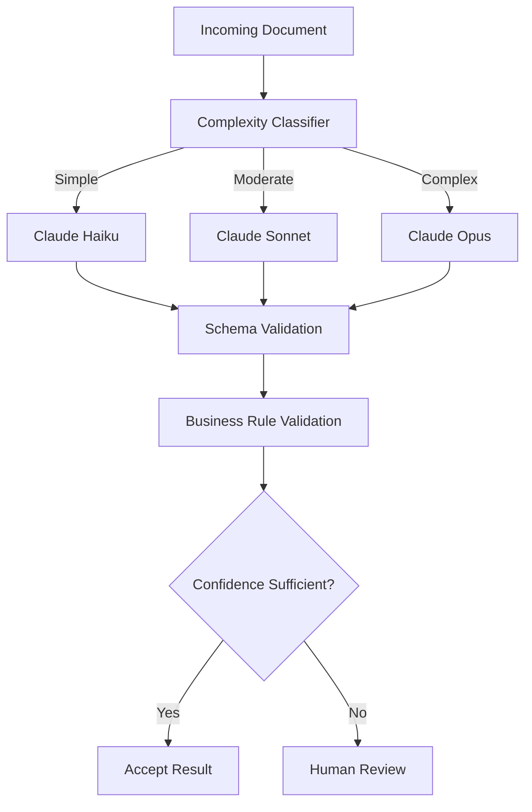

---

## 32. Practical Exercises

### Exercise 1: Five-line summary

Without looking at the lesson, explain:

1. What Claude is.
2. How Opus, Sonnet and Haiku differ.
3. What the Messages API does.
4. Why structured outputs are useful.
5. Why provider abstraction is incomplete.

---

### Exercise 2: Basic Claude demo

Build a Python script that:

* Accepts a paragraph
* Sends it to Claude
* Produces a three-point summary
* Records input and output tokens
* Measures request latency
* Logs the model ID

Expected output:

```json
{
  "model": "claude-sonnet-5",
  "latency_ms": 1120,
  "input_tokens": 240,
  "output_tokens": 82,
  "summary": "Generated summary"
}
```

---

### Exercise 3: Structured classifier

Create a support-ticket classifier with:

* Four categories
* Three priority levels
* A confidence field
* Pydantic validation
* At least 20 evaluation cases

---

### Exercise 4: Tool-use workflow

Create a read-only tool:

```text
get_order_status(order_id)
```

Test:

* Valid order
* Unknown order
* Missing order ID
* Unauthorized user
* Tool timeout
* Invalid tool result

---

### Exercise 5: Compare Claude models

Compare:

* Claude Haiku 4.5
* Claude Sonnet 5
* Claude Opus 4.8

Record:

| Test ID | Expected  | Haiku | Sonnet | Opus | Latency | Tokens |
| ------- | --------- | ----- | ------ | ---- | ------: | -----: |
| 001     | billing   |       |        |      |         |        |
| 002     | account   |       |        |      |         |        |
| 003     | technical |       |        |      |         |        |

Calculate:

```text
Accuracy =
correct outputs / total outputs

Valid-output rate =
valid outputs / total outputs

Average latency =
total latency / total requests

Average cost =
total estimated cost / total requests
```

---

## 33. Project: Model Comparison App

Build an application that compares Claude with two other models or compares multiple Claude tiers.

### Inputs

* Test prompt
* Candidate models
* System instructions
* Maximum output tokens
* Number of repetitions
* Optional image
* Optional retrieval context
* Optional tool definitions

### Outputs

* Generated response
* Task accuracy
* Structured-output validity
* Input tokens
* Output tokens
* Cache usage
* Total latency
* Estimated cost
* Tool-call accuracy
* Stop reason
* Error details

### Architecture

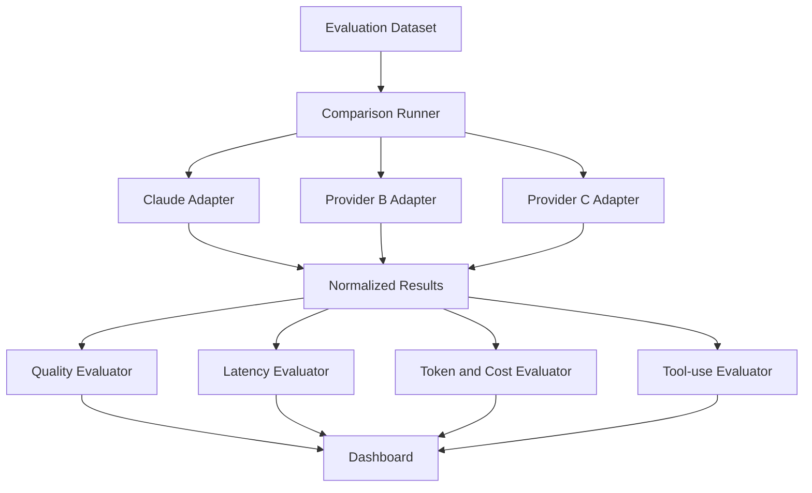

### Suggested result schema

```json
{
  "test_id": "ticket-001",
  "provider": "anthropic",
  "model": "claude-sonnet-5",
  "prompt_version": "ticket-v4",
  "response": {
    "category": "billing",
    "priority": "high",
    "confidence": 0.94
  },
  "correct": true,
  "valid_output": true,
  "input_tokens": 482,
  "output_tokens": 38,
  "cache_read_tokens": 0,
  "latency_ms": 930,
  "estimated_cost": 0.0013,
  "stop_reason": "end_turn",
  "error": null
}
```

### Recommended portfolio features

* Side-by-side model output
* Latency distribution
* Token-usage chart
* Cost comparison
* Prompt-version history
* Failure-case table
* CSV export
* Model-routing recommendation
* Provider fallback
* Cache-use statistics

---

## 34. Completion Checklist

* [ ] I can explain Anthropic Claude in one or two minutes.
* [ ] I understand the differences between Fable, Opus, Sonnet and Haiku.
* [ ] I can send a request through the Messages API.
* [ ] I understand that system instructions use a top-level field.
* [ ] I can read token usage and stop reasons.
* [ ] I can request structured JSON output.
* [ ] I understand Claude tool use.
* [ ] I can explain client and server tools.
* [ ] I understand long-context limitations.
* [ ] I know when prompt caching is useful.
* [ ] I can compare Claude with another provider fairly.
* [ ] I have tested at least one failure case.
* [ ] I have documented a privacy or retention limitation.

---

## 35. Key Outcome

Choose Claude models according to:

* Task-specific quality
* Reasoning complexity
* Agent autonomy
* Context requirements
* Vision requirements
* Tool-use reliability
* Latency
* Token cost
* Data retention
* Deployment platform
* Failure impact

Do not select a model based only on its tier.

Use evaluation data to determine whether a faster and less expensive Claude model can meet the same product-quality target.

---

## 36. Final Summary

Anthropic Claude provides models for:

1. Writing and analysis
2. Coding
3. Long-context processing
4. Image understanding
5. Structured outputs
6. Tool calling
7. Agent workflows
8. Document and RAG applications

A reliable Claude integration should follow this workflow:

```text
Define the product task
        ↓
Build an evaluation dataset
        ↓
Establish a quality baseline
        ↓
Compare Fable, Opus, Sonnet or Haiku
        ↓
Measure quality, latency and cost
        ↓
Add tools, retrieval or structured output
        ↓
Apply safety and permission controls
        ↓
Deploy gradually
        ↓
Monitor model behavior
```

Do not ask only:

> Is Claude good at this task?

Ask:

> Which Claude model reaches the required quality with acceptable latency, cost, safety, retention and operational complexity?

The value of Claude comes not only from model capability, but from how effectively it is integrated into a measurable, secure and observable product workflow.

---

# Bài luyện tập

## Mục tiêu


## Đề bài


## Yêu cầu hoàn thành

- [ ] 
- [ ] 
- [ ] 

## Kết quả / lời giải


## Ghi chú
