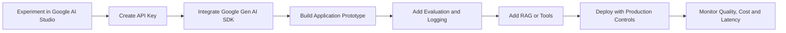
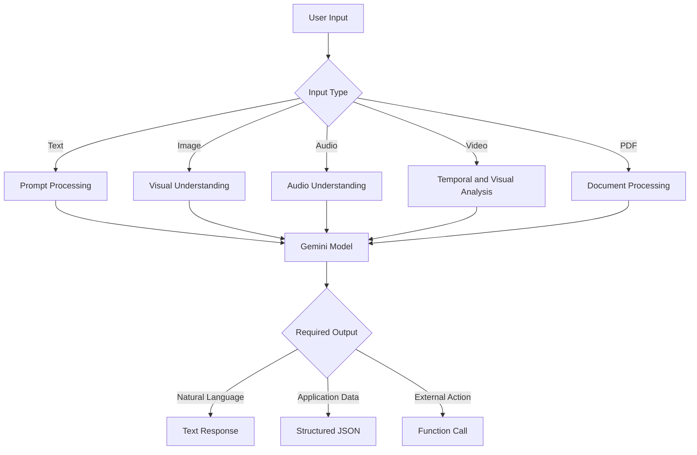
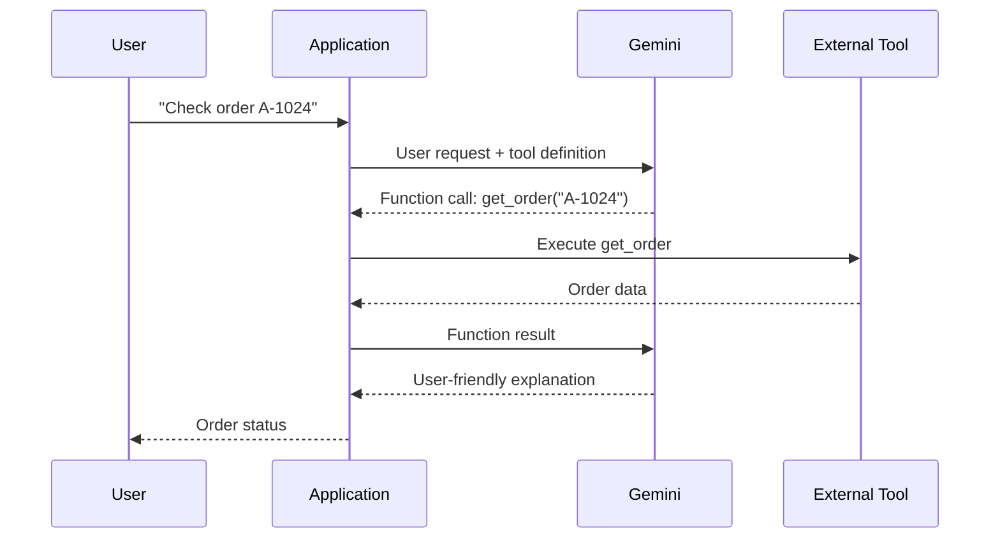
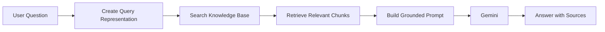
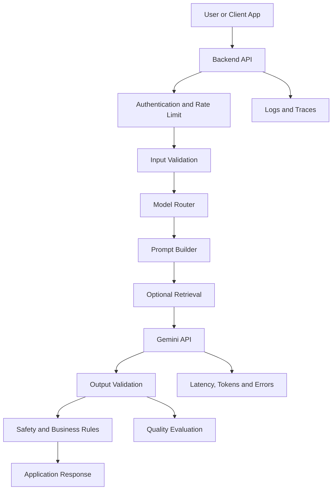
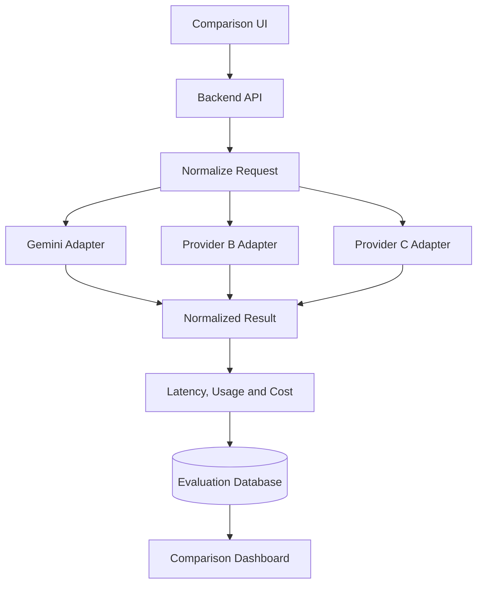

# 006 — Google Gemini

| Field                  | Details                                      |
| ---------------------- | -------------------------------------------- |
| **Course**             | 02 — Model Platforms and Prompting           |
| **Module**             | Module 03 — Using Pre-trained Models         |
| **Content Group**      | Popular AI Models                            |
| **Roadmap Source**     | Using Pre-trained Models / Popular AI Models |
| **Lesson Type**        | Model Selection                              |
| **Order in Module**    | 006                                          |
| **Suggested Duration** | 20 minutes                                   |

> **Documentation note:** Gemini model names and availability change frequently. The model examples in this lesson reflect Google’s developer documentation available in July 2026. Always verify the current model list before starting a production integration.

---

## 1. Summary

**Google Gemini** is a family of generative AI models and related developer services created by Google. Gemini models can be used for tasks involving:

* Text generation and summarization
* Code generation and analysis
* Image, audio, video, and document understanding
* Structured data extraction
* Function calling and tool use
* Retrieval-Augmented Generation
* Conversational and agentic applications
* Real-time voice and multimodal interactions

The Gemini API can generate text from text, image, video, and audio inputs. Google currently recommends the **Interactions API** for new Gemini projects, while the older `generateContent` API remains supported.

For an AI Engineer, learning Gemini is not only about calling a model. It also involves deciding:

* Which Gemini model fits the product
* How prompts and multimodal inputs should be designed
* Whether tools, RAG, or structured outputs are required
* How latency, cost, reliability, and safety will be measured
* How the application should behave when the model fails

---

## 2. Learning Objectives

After completing this lesson, you should be able to:

1. Explain Google Gemini in your own words.
2. Distinguish the Gemini application, Gemini API, Google AI Studio, and Vertex AI.
3. Identify the main capabilities of Gemini models.
4. Select a model based on quality, latency, cost, and modality.
5. Send a basic request through the Gemini API.
6. Explain where Gemini fits into a modern AI application.
7. Identify common production risks and debugging methods.
8. Build a small artifact that compares Gemini with another model.

---

## 3. Core Concepts

### 3.1 What Is Google Gemini?

Gemini is not one single model. It is a collection of models optimized for different workloads.

Some models prioritize:

* Advanced reasoning
* Coding performance
* Low latency
* Low operating cost
* High-volume processing
* Real-time voice interaction
* Multimodal understanding
* Media generation
* Embedding generation

This means that choosing “Gemini” is only the first decision. An AI Engineer must still select the appropriate model and API configuration.

---

### 3.2 Gemini Product Ecosystem

The term **Gemini** can refer to several related products.

| Product               | Main Purpose                                                                                      |
| --------------------- | ------------------------------------------------------------------------------------------------- |
| **Gemini App**        | A consumer-facing AI assistant                                                                    |
| **Google AI Studio**  | A browser-based environment for testing prompts and generating starter code                       |
| **Gemini API**        | A developer API for integrating Gemini models into applications                                   |
| **Vertex AI**         | Google Cloud’s enterprise platform for deploying, evaluating, governing, and operating AI systems |
| **Google Gen AI SDK** | A software development kit for calling Gemini from languages such as Python and JavaScript        |

Google AI Studio allows developers to test prompts, adjust model parameters, configure tools, and export code before building a complete application.

### Typical Learning-to-Production Path



---

### 3.3 Main Gemini Model Categories

Gemini models are commonly organized around performance and workload requirements.

| Category                    | Best Fit                                                       | Main Trade-off                       |
| --------------------------- | -------------------------------------------------------------- | ------------------------------------ |
| **Pro-class models**        | Difficult reasoning, coding, planning, and document analysis   | Higher latency and cost              |
| **Flash-class models**      | General application workloads and agent loops                  | Balanced quality, speed, and cost    |
| **Flash-Lite-class models** | Classification, extraction, routing, and high-volume workloads | Lower reasoning capability           |
| **Live models**             | Real-time voice, audio, and conversational applications        | More complex streaming architecture  |
| **Embedding models**        | Semantic search, recommendation, clustering, and RAG           | Do not produce normal chat responses |
| **Media models**            | Image, audio, music, or video generation                       | Specialized APIs and output formats  |

Google describes Gemini 2.5 Flash as a price-performance model for low-latency, high-volume reasoning tasks, while Gemini 2.5 Pro focuses on more complex reasoning and coding. Current model pages also include newer preview and production model families, so availability should always be checked before deployment.

### Practical Selection Rule

```text
Simple extraction or classification
        ↓
Use a Lite or low-cost model

General chatbot, RAG or tool workflow
        ↓
Use a Flash-class model

Complex code, planning or difficult reasoning
        ↓
Use a Pro-class model

Real-time voice or camera application
        ↓
Use a Live-capable model
```

Do not automatically choose the most powerful model. A smaller model may provide better product performance when speed and cost are more important than maximum reasoning quality.

---

### 3.4 Multimodal Capability

A multimodal model can process more than one type of information.

Gemini applications may work with:

* Text
* Images
* Audio
* Video
* PDF documents
* Tool results
* Structured JSON
* Conversation history

For example, a Gemini-powered application could:

1. Receive an image of an invoice.
2. Read the visible fields.
3. Extract the supplier, total, and date.
4. Return validated JSON.
5. Call an accounting API.
6. Store the result in a database.

### Multimodal Processing Flow



Multimodal capability is especially useful for:

* Document-processing systems
* Visual question answering
* Content moderation
* Product image analysis
* Meeting and audio summarization
* Video search
* Accessibility applications
* Real-time assistants

---

### 3.5 Context Window

The **context window** is the amount of information a model can consider during one request or conversation.

The context may contain:

* System instructions
* User messages
* Previous assistant messages
* Retrieved documents
* Source code
* Tool definitions
* Tool responses
* Image or document data
* Expected output schemas

A large context window can help with long documents or codebases, but it does not remove the need for retrieval and context management.

Sending unnecessary information can:

* Increase cost
* Increase latency
* Distract the model
* Reduce answer relevance
* Make debugging more difficult

A strong production system sends the **smallest amount of relevant context** required to complete the task.

---

### 3.6 Structured Outputs

Natural-language output is useful for chat interfaces, but backend systems usually need predictable data.

Suppose an application analyzes customer feedback. Instead of requesting a paragraph, it can request:

```json
{
  "sentiment": "negative",
  "category": "delivery",
  "priority": "high",
  "summary": "The order arrived three days late."
}
```

Structured output is useful for:

* Data extraction
* Classification
* API responses
* Database insertion
* Workflow routing
* UI rendering
* Evaluation automation

Gemini supports schema-constrained structured responses. Current Gemini documentation also describes combining structured outputs with tools such as search, URL context, code execution, file search, and function calling for supported model families.

However, schema-constrained generation is not a replacement for application validation.

Always validate:

* Required properties
* Allowed enum values
* String lengths
* Numeric ranges
* Date formats
* Business rules

---

### 3.7 Function Calling

Function calling allows a model to request an external operation instead of pretending that it performed the operation itself.

Examples include:

* Looking up an order
* Searching an internal database
* Checking the weather
* Scheduling a meeting
* Creating a support ticket
* Calculating a financial result
* Sending data to another service

Google describes three main function-calling use cases:

1. Taking actions in external systems
2. Accessing external knowledge
3. Extending model capabilities with specialized tools

### Function-Calling Architecture



The model should not directly control sensitive systems without application-level checks.

The application remains responsible for:

* Authentication
* Authorization
* Input validation
* Confirmation flows
* Rate limiting
* Audit logs
* Error handling

---

### 3.8 Gemini and RAG

**Retrieval-Augmented Generation**, or RAG, adds relevant external information to the model’s context before an answer is generated.

A typical RAG workflow is:



Gemini can be used in a custom RAG pipeline with:

* A vector database
* An embedding model
* Document chunking
* Metadata filtering
* Reranking
* Prompt construction
* Citation rendering

The Gemini API also provides a File Search tool that imports, chunks, embeds, and indexes files for retrieval.

RAG is useful when the model needs information that is:

* Private
* Frequently updated
* Organization-specific
* Too large to place in every prompt
* Required to support verifiable answers

RAG does not automatically eliminate hallucination. The system should still evaluate whether the response is supported by the retrieved evidence.

---

### 3.9 Interactions API

As of June 2026, Google recommends the **Interactions API** for new Gemini projects. It provides a common interface for:

* Text generation
* Multimodal understanding
* Structured responses
* Tool orchestration
* Agent workflows
* Server-managed conversation state

The older `generateContent` interface remains supported, but new capabilities are expected to appear first in the Interactions API.

A basic interaction contains:

```text
Model
+ User input
+ System instruction
+ Tools
+ Generation configuration
+ Optional previous interaction ID
= Model output and execution steps
```

A previous interaction ID can be used to continue a server-managed conversation without resending the entire conversation history. However, tools and generation settings may still need to be specified for each new interaction.

---

### 3.10 Prompt Design for Gemini

A strong prompt usually contains five elements.

```text
Role
+ Task
+ Context
+ Constraints
+ Output format
```

#### Weak Prompt

```text
Analyze this review.
```

#### Improved Prompt

```text
You are a customer-support classification assistant.

Analyze the customer review below.

Return:
- sentiment: positive, neutral or negative
- category: billing, delivery, product or support
- urgency: low, medium or high
- summary: one sentence

Do not invent information that is not present in the review.

Review:
"The package arrived three days late and the product box was damaged."
```

#### Production-Oriented Prompt

```text
You are a classification component inside a customer-support system.

Your task is to classify the provided review.

Rules:
1. Use only information explicitly present in the review.
2. Set urgency to high only when the customer describes safety, fraud,
   complete service failure or a time-critical issue.
3. The summary must contain no more than 25 words.
4. Return only data that matches the supplied JSON schema.
5. If the review is ambiguous, use category "other".

Review:
{{customer_review}}
```

Prompt quality should be evaluated with a dataset, not only with one manually selected example.

---

## 4. Example and Demo

### 4.1 Demo Goal

Build a small Gemini feature that:

1. Receives a product review.
2. Asks Gemini to analyze it.
3. Measures request latency.
4. Prints the result.
5. Handles common API errors.

### 4.2 Install the SDK

```bash
pip install -U google-genai
```

Set the API key as an environment variable:

```bash
export GEMINI_API_KEY="your-api-key"
```

Windows PowerShell:

```powershell
$env:GEMINI_API_KEY="your-api-key"
```

### 4.3 Python Demo

```python
import os
import time

from google import genai


def analyze_review(review: str) -> dict[str, object]:
    """
    Analyze a customer review using the Gemini Interactions API.

    Returns a small result dictionary containing the response
    and request latency.
    """
    if not review.strip():
        raise ValueError("The review must not be empty.")

    if not os.getenv("GEMINI_API_KEY"):
        raise RuntimeError(
            "GEMINI_API_KEY is missing. "
            "Set it before running the application."
        )

    # Keep the model configurable because model names and availability change.
    model_name = os.getenv("GEMINI_MODEL", "gemini-3.5-flash")

    client = genai.Client()

    prompt = f"""
You are a customer-support analysis assistant.

Analyze the review below.

Return a concise response containing:
- Sentiment
- Main issue
- Urgency
- One recommended support action

Do not invent details that are not present in the review.

Review:
{review}
""".strip()

    started_at = time.perf_counter()

    try:
        interaction = client.interactions.create(
            model=model_name,
            input=prompt,
        )
    except Exception as exc:
        raise RuntimeError(f"Gemini request failed: {exc}") from exc

    latency_ms = round((time.perf_counter() - started_at) * 1000, 2)

    return {
        "model": model_name,
        "latency_ms": latency_ms,
        "response": interaction.output_text,
    }


if __name__ == "__main__":
    sample_review = (
        "The package arrived three days late, and the outer box "
        "was badly damaged. The product still works."
    )

    result = analyze_review(sample_review)

    print(f"Model: {result['model']}")
    print(f"Latency: {result['latency_ms']} ms")
    print("\nResponse:")
    print(result["response"])
```

The basic SDK pattern follows Google’s current Interactions API examples: create a `genai.Client`, call `client.interactions.create`, and read `interaction.output_text`.

---

### 4.4 Expected Processing Flow

```text
Input:
Customer review

Process:
Validate input
→ Build prompt
→ Call Gemini
→ Measure latency
→ Read model output
→ Log result

Output:
Model response
+ latency
+ model identifier
```

---

### 4.5 What to Log

A production application should record enough information to debug the system without exposing sensitive data.

Example log:

```json
{
  "request_id": "req_01JXYZ",
  "feature": "review_analysis",
  "model": "configured-model-name",
  "prompt_version": "review_analysis_v3",
  "latency_ms": 842.14,
  "input_characters": 117,
  "output_characters": 286,
  "status": "success"
}
```

Do not log raw user content when it may contain:

* Personal data
* Authentication credentials
* Health information
* Financial information
* Confidential company data
* Private documents

---

### 4.6 Optional FastAPI Route

```python
import os
import time

from fastapi import FastAPI, HTTPException
from google import genai
from pydantic import BaseModel, Field


app = FastAPI(title="Gemini Review Analyzer")
client = genai.Client()


class ReviewRequest(BaseModel):
    review: str = Field(min_length=1, max_length=5_000)


class ReviewResponse(BaseModel):
    model: str
    latency_ms: float
    analysis: str


@app.post("/analyze-review", response_model=ReviewResponse)
def analyze_review(payload: ReviewRequest) -> ReviewResponse:
    model_name = os.getenv("GEMINI_MODEL", "gemini-3.5-flash")

    prompt = f"""
Analyze the following customer review.

Identify:
1. Sentiment
2. Main issue
3. Urgency
4. Recommended support action

Use only information found in the review.

Review:
{payload.review}
""".strip()

    started_at = time.perf_counter()

    try:
        interaction = client.interactions.create(
            model=model_name,
            input=prompt,
        )
    except Exception as exc:
        raise HTTPException(
            status_code=502,
            detail="The AI provider could not complete the request.",
        ) from exc

    latency_ms = round((time.perf_counter() - started_at) * 1000, 2)

    return ReviewResponse(
        model=model_name,
        latency_ms=latency_ms,
        analysis=interaction.output_text,
    )
```

Start the API:

```bash
uvicorn main:app --reload
```

Test it:

```bash
curl -X POST "http://localhost:8000/analyze-review" \
  -H "Content-Type: application/json" \
  -d '{
    "review": "The application is useful, but it crashes whenever I upload a PDF."
  }'
```

---

## 5. Model Selection Framework

Selecting a model should be treated as an engineering decision rather than a popularity contest.

### 5.1 Important Evaluation Dimensions

| Dimension             | Question                                                        |
| --------------------- | --------------------------------------------------------------- |
| **Task quality**      | Does the model solve the actual task correctly?                 |
| **Latency**           | Is the response fast enough for the user experience?            |
| **Cost**              | Can the product afford the expected request volume?             |
| **Context capacity**  | Can the model process the required information?                 |
| **Multimodality**     | Does the application need image, audio, video, or PDF inputs?   |
| **Tool use**          | Can the model reliably select and call tools?                   |
| **Structured output** | Can it follow the required schema?                              |
| **Language quality**  | Does it perform well in the users’ languages?                   |
| **Safety**            | Does it behave appropriately for the product domain?            |
| **Availability**      | Is the model stable and available in the deployment region?     |
| **Operational fit**   | Does it integrate with the existing cloud and monitoring stack? |

### 5.2 Weighted Score Example

```text
Model score =
    Quality × 0.35
  + Latency × 0.20
  + Cost × 0.15
  + Reliability × 0.15
  + Structured-output accuracy × 0.10
  + Ecosystem fit × 0.05
```

The weights should reflect the product.

For example:

* A coding assistant may assign more weight to reasoning quality.
* A real-time voice assistant may assign more weight to latency.
* A document-processing pipeline may prioritize extraction accuracy.
* A high-volume classifier may prioritize cost and throughput.

---

## 6. Production Architecture

A production Gemini feature usually requires more than one API call.



### Recommended Components

* API authentication
* Input-size limits
* Prompt versioning
* Model configuration
* Timeouts
* Retry policy
* Output validation
* Safety checks
* Caching
* Rate limiting
* Cost monitoring
* Evaluation datasets
* Fallback behavior
* Observability

---

## 7. Common Production Failures

### 7.1 Hard-Coding a Preview Model

#### Problem

The application uses a preview model identifier directly in many files.

#### Risk

The model may be renamed, deprecated, or removed.

#### Better Approach

```python
model_name = os.getenv("GEMINI_MODEL")
```

Keep model selection in:

* Environment configuration
* A model registry
* A feature configuration table
* A centralized AI gateway

---

### 7.2 Trusting Model Output Without Validation

#### Problem

The model returns malformed or semantically invalid data.

#### Example

```json
{
  "urgency": "extremely urgent"
}
```

But the application only supports:

```text
low | medium | high
```

#### Solution

Validate the result with:

* Pydantic
* JSON Schema
* Zod
* Business-rule checks

---

### 7.3 Exposing the API Key in the Client

#### Problem

A mobile or browser application contains a permanent server API key.

#### Risk

Attackers can extract and misuse the key.

#### Solution

Use this architecture:

```text
Mobile or Web Client
        ↓
Your Authenticated Backend
        ↓
Gemini API
```

For supported real-time client scenarios, use an authentication mechanism specifically designed for temporary client access rather than exposing a permanent credential.

---

### 7.4 No Timeout or Retry Policy

#### Problem

The request waits indefinitely or fails after a temporary provider error.

#### Solution

Define:

* Request timeout
* Maximum retry count
* Exponential backoff
* Retryable error categories
* Circuit-breaker behavior
* User-facing fallback message

Do not retry validation failures or clearly invalid requests.

---

### 7.5 Measuring Only Successful Requests

#### Problem

The team reports an excellent average latency, but failed and timed-out requests are excluded.

#### Better Metrics

Track:

* Success rate
* Error rate by category
* Timeout rate
* P50 latency
* P95 latency
* P99 latency
* Cost per successful task
* Output-validation failure rate
* Tool-call success rate
* User correction rate

---

### 7.6 Sending Too Much Context

#### Problem

The application sends an entire knowledge base or full conversation history for every request.

#### Effects

* Higher cost
* Higher latency
* Reduced relevance
* Context-window pressure
* Harder debugging

#### Solution

Use:

* Retrieval
* Summarized conversation memory
* Metadata filters
* Context caching
* Relevant-history selection
* Maximum input limits

---

### 7.7 Evaluating with Only One Prompt

A prompt that works for one example may fail on:

* Very short inputs
* Long inputs
* Mixed-language inputs
* Typographical errors
* Missing information
* Prompt injection
* Conflicting instructions
* Unsupported requests
* Adversarial content

Create a representative evaluation dataset before selecting the model.

---

### 7.8 Confusing Fluency with Accuracy

A fluent response may still contain incorrect information.

For factual or high-stakes tasks:

* Use retrieval or trusted tools.
* Ask for evidence.
* Validate critical fields.
* Show uncertainty.
* Require human review where appropriate.
* Avoid allowing the model to make irreversible decisions alone.

---

## 8. Practical Exercises

### Exercise 1 — Five-Line Summary

Without reviewing the lesson, write five lines explaining:

1. What Gemini is
2. What multimodal means
3. What function calling does
4. What RAG contributes
5. How you would select a Gemini model

---

### Exercise 2 — Basic API Call

Create a Python script that:

* Reads a user prompt
* Sends it to Gemini
* Prints the response
* Measures latency
* Handles an empty prompt
* Handles an API error

---

### Exercise 3 — Structured Extraction

Build a feature that extracts the following fields from a job description:

```json
{
  "job_title": "",
  "skills": [],
  "experience_years": 0,
  "location": "",
  "employment_type": ""
}
```

Test it with:

* A complete job post
* A job post with missing experience
* A Vietnamese job post
* A mixed English–Vietnamese job post
* A badly formatted job post

---

### Exercise 4 — Multimodal Demo

Build one of these small features:

* Invoice field extraction
* Screenshot error analysis
* Food image description
* Diagram explanation
* PDF document summarization
* Product image categorization

Record:

* Input format
* Selected model
* Prompt
* Output
* Latency
* Failure case
* Possible improvement

---

### Exercise 5 — Production Failure Report

Document one possible production failure using this template:

```markdown
## Failure

The model returned invalid JSON.

## Impact

The backend could not save the generated result.

## Detection

The JSON parser raised an exception.

## Root Cause

The application requested JSON in the prompt but did not enforce
or validate an output schema.

## Fix

Use structured output and validate the result with Pydantic.

## Prevention

Add schema-compliance tests to the evaluation dataset.
```

---

## 9. Common Mistakes

### Mistake 1: Memorizing Model Names

Model names change. Learn the model-selection process instead of memorizing one identifier.

### Mistake 2: Selecting Only by Benchmark Score

A model with a stronger public benchmark may still perform worse for your exact product dataset.

### Mistake 3: Ignoring Latency

A high-quality answer may still create a poor user experience if it arrives too slowly.

### Mistake 4: Ignoring Cost at Scale

A cheap test with ten requests may become expensive with millions of requests.

### Mistake 5: Using the Model as a Database

Models should not be treated as reliable storage for current, private, or exact business data.

### Mistake 6: Giving Models Unrestricted Tool Access

Sensitive actions require authorization, validation, confirmation, and audit logs.

### Mistake 7: Skipping Edge Cases

A successful happy path does not prove that the system is production-ready.

### Mistake 8: No Prompt Versioning

When prompts are changed without version tracking, quality regressions become difficult to investigate.

### Mistake 9: No Fallback

The application should define what happens when:

* Gemini is unavailable
* The request times out
* The output is invalid
* Safety controls block the response
* The selected model is deprecated

### Mistake 10: Assuming Multimodal Means Perfect Perception

Images, audio, video, and documents can still be misread. Critical extraction tasks require validation or human review.

---

## 10. Completion Checklist

### Understanding

* [ ] I can explain Google Gemini in one or two minutes.
* [ ] I understand that Gemini is a model family, not one model.
* [ ] I can distinguish Gemini App, AI Studio, Gemini API, and Vertex AI.
* [ ] I can explain multimodal input.
* [ ] I can explain structured output.
* [ ] I can explain function calling.
* [ ] I can explain how Gemini can be used in RAG.

### Implementation

* [ ] I have made at least one Gemini API request.
* [ ] I store the API key outside the source code.
* [ ] I can configure the model through an environment variable.
* [ ] I measure request latency.
* [ ] I handle API errors.
* [ ] I validate model output.
* [ ] I have tested at least one edge case.

### Production Awareness

* [ ] I understand the trade-off between quality, latency, and cost.
* [ ] I know why preview models require migration planning.
* [ ] I know what information should not be written to logs.
* [ ] I have documented at least one limitation.
* [ ] I know what the application should do when the model fails.
* [ ] I can describe how this feature would be monitored.

---

## 11. Related Outcome

> Choose pre-trained AI models based on capability, context length, latency, cost, reliability, safety, and product fit.

After this lesson, you should not choose Gemini simply because it is popular or powerful.

You should be able to justify the choice with evidence such as:

```text
We selected this Gemini model because it achieved the required
extraction accuracy, stayed below the latency target, supported PDF
input, produced schema-compliant results and met the expected cost
per document.
```

---

## 12. Related Project

# Project 2 — Model Comparison App

Build an application that compares two or three models using the same test cases.

Possible comparison:

```text
Gemini Flash-class model
vs.
Gemini Pro-class model
vs.
A model from another provider
```

### Required Features

* Shared prompt input
* Provider and model selection
* Response display
* Request latency
* Token or usage information when available
* Estimated cost
* Error display
* Side-by-side comparison
* Result history
* Manual quality score

### Suggested Architecture



### Normalized Response Schema

```json
{
  "provider": "google",
  "model": "configured-model-name",
  "response": "Generated answer",
  "latency_ms": 924.5,
  "input_tokens": null,
  "output_tokens": null,
  "estimated_cost": null,
  "status": "success",
  "error": null
}
```

### Evaluation Dataset

Create at least 20 test cases covering:

* Summarization
* Information extraction
* Classification
* Code generation
* Reasoning
* Vietnamese output
* English output
* Mixed-language input
* Long context
* Invalid or incomplete input

### Scoring Rubric

| Criterion             |     Score |
| --------------------- | --------: |
| Correctness           |       1–5 |
| Instruction following |       1–5 |
| Completeness          |       1–5 |
| Clarity               |       1–5 |
| Format compliance     |       1–5 |
| Latency               |  Measured |
| Cost                  | Estimated |
| Errors                |   Counted |

### Final Project Output

The final report should answer:

1. Which model produced the best quality?
2. Which model was fastest?
3. Which model was most cost-efficient?
4. Which model followed schemas most reliably?
5. Which model performed best in Vietnamese?
6. Which model should be used for the product?
7. Should one model handle every request, or should the system use model routing?

---

## 13. Suggested 20-Minute Lesson Plan

|          Time | Activity                                                 |
| ------------: | -------------------------------------------------------- |
|   0–3 minutes | Explain Gemini and its product ecosystem                 |
|   3–7 minutes | Discuss model categories and selection                   |
|  7–10 minutes | Explain multimodality, structured output, tools, and RAG |
| 10–15 minutes | Run the Python API demo                                  |
| 15–18 minutes | Review production risks                                  |
| 18–20 minutes | Assign the model-comparison exercise                     |

---

## 14. Key Takeaways

1. Gemini is a family of models and developer services, not one chatbot.
2. Different Gemini models optimize for different combinations of quality, latency, cost, and modality.
3. Gemini can support text, code, images, audio, video, documents, structured outputs, tools, and RAG.
4. The best model is the model that performs well on the product’s real evaluation dataset.
5. Structured output must still be validated by application code.
6. Function calling connects Gemini to external systems, but the application remains responsible for security and authorization.
7. Large context windows do not eliminate the need for retrieval and context management.
8. Production systems need timeouts, logging, evaluation, fallback behavior, and model-version management.
9. API keys and privileged tools should not be exposed directly to untrusted clients.
10. The lesson becomes valuable when it is converted into a working demo, evaluation report, API route, or portfolio project.

---

## 15. Final Summary

**Google Gemini** is an important model platform for modern AI Engineers because it supports general language tasks, coding, multimodal understanding, structured outputs, retrieval, tool use, and real-time AI experiences.

However, knowing that Gemini exists is not enough.

A capable AI Engineer should be able to:

* Select an appropriate model
* Design a reliable prompt
* Integrate the API
* Validate the output
* Measure latency and quality
* Control cost
* Protect credentials and data
* Handle provider failures
* Evaluate the system using realistic examples
* Explain why Gemini is or is not the correct choice for a product

Turn this lesson into a working prompt, API route, multimodal demo, RAG workflow, model-comparison dashboard, or portfolio report so that the knowledge becomes practical engineering experience.

---

# Bài luyện tập

## Mục tiêu


## Đề bài


## Yêu cầu hoàn thành

- [ ] 
- [ ] 
- [ ] 

## Kết quả / lời giải


## Ghi chú
