# 007 — Mistral AI

| Field                  | Details                                      |
| ---------------------- | -------------------------------------------- |
| **Course**             | 02 — Model Platforms and Prompting           |
| **Module**             | Module 03 — Using Pre-trained Models         |
| **Content Group**      | Popular AI Models                            |
| **Roadmap Source**     | Using Pre-trained Models / Popular AI Models |
| **Lesson Type**        | Model Selection                              |
| **Order in Module**    | 007                                          |
| **Suggested Duration** | 20 minutes                                   |

> **Documentation note:** Model names, prices, context limits, licenses, and availability can change. The examples in this lesson reflect Mistral AI documentation available in July 2026. Verify the current model catalog before beginning a production integration.

---

## 1. Summary

**Mistral AI** provides a family of general-purpose and specialized AI models for tasks such as:

* Text generation
* Reasoning
* Code generation
* Multimodal understanding
* Document processing
* Retrieval-Augmented Generation
* Embedding generation
* Function calling
* Agent workflows
* Local and edge inference

Mistral develops both **open-weight models** and models offered through its hosted platform. Its model catalog includes general-purpose models, compact models for local deployment, coding models, embedding models, document-processing services, and multimodal models.

For an AI Engineer, Mistral AI is especially relevant when a product requires one or more of the following:

* Control over model deployment
* Open-weight model access
* Local or private inference
* Efficient models for limited hardware
* Specialized coding capabilities
* Structured document extraction
* A hosted API with chat, tools, agents, and RAG features

Learning Mistral AI is not only about sending an API request. It requires evaluating whether a Mistral model fits the product’s:

* Real tasks
* Quality requirements
* Latency target
* Deployment environment
* Privacy constraints
* Operating budget
* Failure tolerance
* Licensing requirements

---

## 2. Learning Objectives

After completing this lesson, you should be able to:

1. Explain Mistral AI in your own words.
2. Distinguish between hosted and self-deployed Mistral models.
3. Identify major Mistral model categories.
4. Select a model based on task quality, latency, cost, licensing, and deployment requirements.
5. Send a request through the Mistral API.
6. Explain how Mistral models can support RAG and agent workflows.
7. Record model version, token usage, latency, and output quality.
8. Identify common production risks and suitable debugging methods.
9. Add Mistral AI to a multi-provider model comparison application.

---

## 3. What Is Mistral AI?

Mistral AI is an AI model and platform provider that develops language, multimodal, coding, embedding, audio, and document-processing systems.

Its platform can be considered through four main areas:

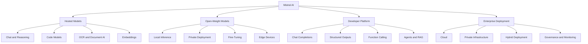

Mistral’s current platform positioning emphasizes deployment control across environments ranging from edge devices to cloud infrastructure.

---

## 4. Mistral AI Product Ecosystem

| Component              | Main Purpose                                                                    |
| ---------------------- | ------------------------------------------------------------------------------- |
| **Mistral Studio**     | Create API keys, test models, inspect requests, and use platform capabilities   |
| **Mistral API**        | Integrate Mistral models into backend services and applications                 |
| **Vibe**               | Mistral’s user-facing agent for productivity and coding workflows               |
| **Open-weight models** | Run selected models on local, private, edge, or cloud infrastructure            |
| **Agents API**         | Build assistants with persistent state, tools, document libraries, and handoffs |
| **Document AI**        | Extract and understand information from documents                               |
| **Embedding API**      | Generate vector representations for search, clustering, and RAG                 |

The Mistral documentation currently describes Vibe as a unified productivity and coding agent available across several interfaces.

### Typical Development Path

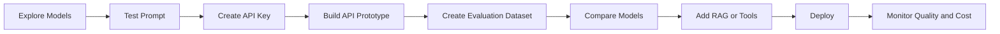

---

## 5. Main Model Categories

Mistral provides different models for different workload profiles. You should select a category before selecting a specific model identifier.

### 5.1 General-Purpose Models

General-purpose models handle tasks such as:

* Chat
* Summarization
* Classification
* Data extraction
* Question answering
* Content generation
* Reasoning
* Tool selection
* Multimodal analysis

Current examples include:

| Model Family       | Typical Product Fit                                             |
| ------------------ | --------------------------------------------------------------- |
| **Mistral Small**  | Efficient general applications and high-volume workloads        |
| **Mistral Medium** | Strong general reasoning, coding, vision, and agentic workloads |
| **Mistral Large**  | Complex, high-quality, general-purpose applications             |

For example, Mistral Small 4 combines instruction following, reasoning, and coding capabilities, while Mistral Medium 3.5 is positioned for multimodal, coding, and agentic use cases. Mistral Large 3 is a general-purpose multimodal open-weight mixture-of-experts model.

---

### 5.2 Compact and Edge Models

The **Ministral** family is designed for smaller-scale, local, and edge deployment.

Possible use cases include:

* Offline assistants
* Local document processing
* On-device classification
* Privacy-sensitive applications
* Industrial devices
* Robotics
* Local translation
* Low-resource inference systems

The Ministral 3 family includes compact model sizes intended for edge and local workloads, with instruct and reasoning variants and image-understanding capabilities.

### Local Deployment Flow

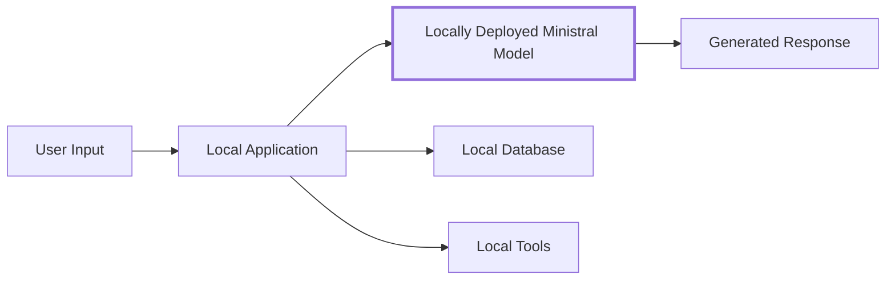

Potential benefits include:

* Lower data exposure
* Offline operation
* Greater infrastructure control
* Predictable deployment environments

Potential challenges include:

* GPU or memory requirements
* Quantization quality
* Inference optimization
* Model update management
* Security patching
* Infrastructure maintenance

---

### 5.3 Coding Models

**Codestral** is a specialized model family for coding tasks such as:

* Code completion
* Fill-in-the-middle completion
* Code generation
* Code correction
* Test generation
* Repository assistance

The current Codestral documentation describes it as a model optimized for low-latency, high-frequency coding operations, including fill-in-the-middle and code generation.

#### Example Use Cases

```text
IDE autocomplete
Code explanation
Unit-test generation
Refactoring suggestions
SQL generation
Code migration assistance
Bug detection
Documentation generation
```

A coding model should be evaluated on real repositories rather than only isolated algorithm questions.

Useful coding evaluation dimensions include:

* Compilation success
* Test pass rate
* Correctness of modified files
* Repository awareness
* Security regressions
* Edit precision
* Tool-call accuracy

---

### 5.4 Embedding Models

An embedding model converts text or code into numeric vectors representing semantic meaning.

Mistral provides embedding services for both general text and source code. The documentation lists RAG, classification, clustering, semantic code search, duplicate detection, and code analytics as common use cases.

### Embedding Process

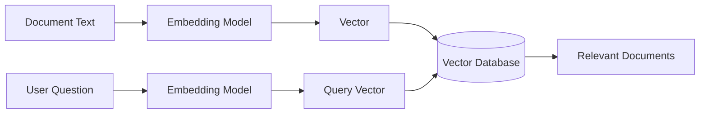

Embedding models do not normally generate conversational responses. Their output is used by another part of the system.

---

### 5.5 OCR and Document AI

Mistral provides dedicated OCR and document-processing capabilities.

These are useful for:

* PDF extraction
* Invoice processing
* Form understanding
* Table extraction
* Receipt analysis
* Scanned document processing
* Document question answering
* Layout-aware extraction

OCR 4 is currently described as Mistral’s latest OCR service, with paragraph-level bounding boxes and structural block labels.

### Document Processing Architecture

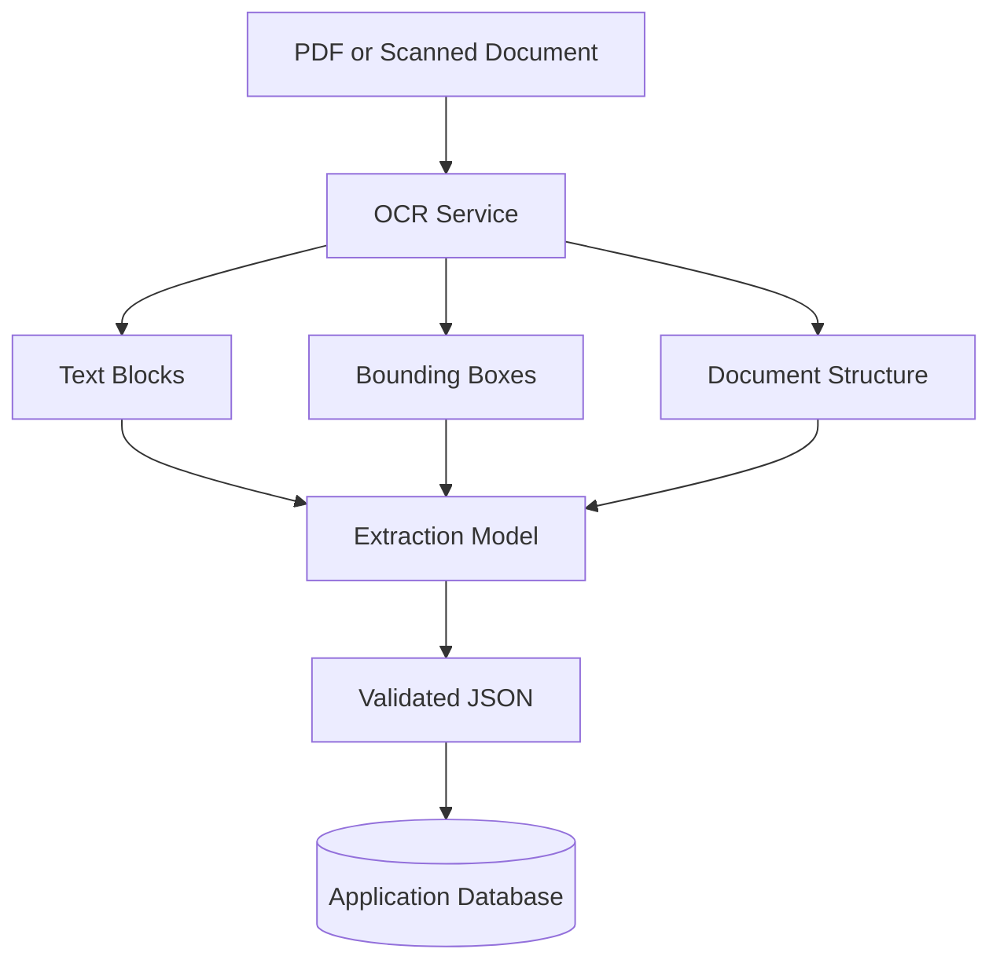

For document applications, compare a general vision model with a specialized OCR service. A specialized service may produce more reliable layout and bounding-box information.

---

### 5.6 Vision and Multimodal Models

Some Mistral models can process images in addition to text.

Possible applications include:

* Screenshot analysis
* Product-image classification
* Chart interpretation
* Diagram explanation
* Visual question answering
* Document understanding
* Image-based support tools

Mistral’s vision documentation states that vision-capable models are available through the Chat Completions API.

---

## 6. Hosted API vs Self-Deployment

One of the most important Mistral-related decisions is whether to use a hosted model or deploy model weights yourself.

### 6.1 Hosted API


#### Advantages

* Fast initial integration
* No GPU management
* Managed scaling
* Simple model upgrades
* Lower operational complexity
* Access to platform tools and APIs

#### Limitations

* External provider dependency
* Network latency
* Rate limits
* Data-processing considerations
* Usage-based cost
* Less infrastructure control

---

### 6.2 Self-Deployment

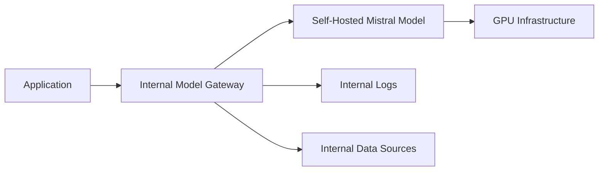

#### Advantages

* Greater data control
* Custom infrastructure
* Offline operation
* Model customization
* Potential cost control at sustained scale
* Reduced dependence on an external API

#### Limitations

* Hardware cost
* Deployment complexity
* Scaling responsibility
* Model-serving optimization
* Monitoring requirements
* Security and update responsibility

---

### 6.3 Decision Matrix

| Requirement            | Hosted API |    Self-Deployment |
| ---------------------- | ---------: | -----------------: |
| Fast prototype         |     Strong |               Weak |
| Minimal operations     |     Strong |               Weak |
| Offline use            |       Weak |             Strong |
| Private network only   |    Limited |             Strong |
| Custom inference stack |    Limited |             Strong |
| Easy model upgrades    |     Strong |           Moderate |
| Small initial traffic  |     Strong |               Weak |
| Sustained high traffic |    Depends | Potentially strong |
| Hardware control       |       Weak |             Strong |

The correct choice depends on workload volume, privacy requirements, infrastructure experience, licensing, and total operating cost.

---

## 7. Core API Concepts

### 7.1 Chat Completions

The Chat Completion API receives a list of messages and produces an assistant response.

Common message roles include:

* `system`
* `user`
* `assistant`
* `tool`

Mistral’s chat completion documentation describes applications such as chatbots, classification, extraction, summarization, code generation, and question answering.

### Basic Flow

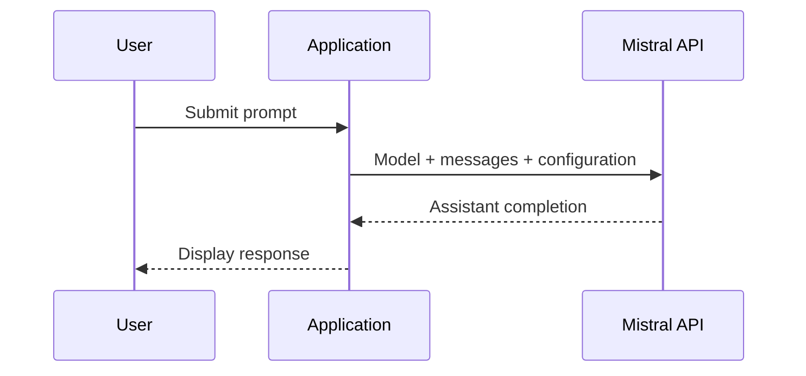

---

### 7.2 System Messages

A system message defines the model’s behavior or task context.

Example:

```text
You are a customer-support classification service.

Use only the information in the user message.
Do not invent customer or order details.
Return a concise answer.
```

System instructions may define:

* Role
* Task
* Safety constraints
* Output style
* Language
* Business rules
* Available context
* Limitations

---

### 7.3 Structured Outputs

Structured outputs make the model return information in a predictable format.

Mistral supports JSON mode and custom structured-output schemas. Its documentation recommends custom structured outputs when stronger format enforcement is required.

Example:

```json
{
  "sentiment": "negative",
  "category": "delivery",
  "urgency": "medium",
  "summary": "The package arrived late."
}
```

Structured output is useful for:

* API responses
* Workflow routing
* Database storage
* Form extraction
* Classification
* Automated evaluation
* UI rendering

Application code must still validate:

* Required fields
* Enum values
* Numeric ranges
* Maximum lengths
* Date formats
* Business constraints

---

## 8. Function Calling

Function calling allows the model to request an external function or API.

Examples include:

* Looking up a customer
* Retrieving an order
* Searching documentation
* Creating a support ticket
* Running a calculation
* Checking inventory
* Querying a database

Mistral describes function calling as a five-step process:

1. The developer defines tools.
2. The user sends a request.
3. The model generates function arguments.
4. The application executes the function.
5. The model generates a response using the tool result.

### Function-Calling Diagram

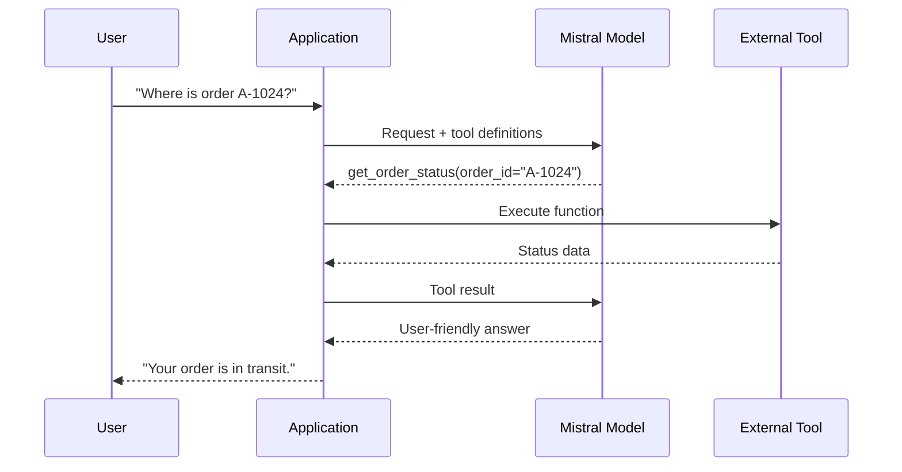

The model should not directly receive unrestricted access to sensitive systems.

The application remains responsible for:

* Authentication
* Authorization
* Argument validation
* Confirmation
* Rate limiting
* Audit logging
* Idempotency
* Error handling

---

## 9. Mistral Agents

Mistral’s Agents platform supports concepts including:

* Persistent conversation state
* Multimodal models
* Function tools
* Document libraries
* Connectors
* Built-in tools
* Agent handoffs
* Multi-agent workflows

The official documentation describes built-in capabilities including web search, code execution, image generation, document-library RAG, custom function calling, MCP connectors, and agent handoffs.

### Agent Architecture

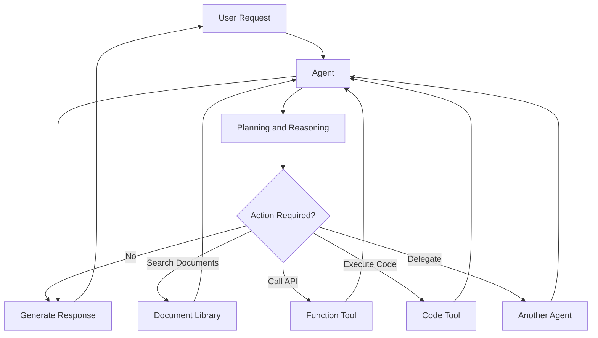

An agent is useful when a task requires several decisions or external actions. It is unnecessary for simple single-step generation tasks.

---

## 10. Mistral AI and RAG

**Retrieval-Augmented Generation** retrieves relevant external information before generating an answer.

### Standard RAG Pipeline

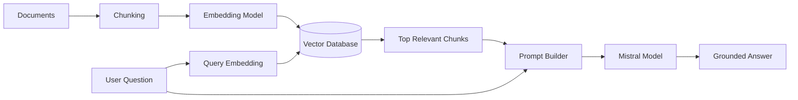

### RAG Components

1. Document ingestion
2. Text cleaning
3. Chunking
4. Embedding generation
5. Vector storage
6. Similarity search
7. Optional reranking
8. Prompt construction
9. Model generation
10. Citation rendering
11. Quality evaluation

Mistral’s embedding documentation identifies retrieval, semantic search, code search, classification, clustering, and duplicate detection as supported embedding use cases. It also provides managed document-library options for retrieval.

### When RAG Is Appropriate

Use RAG when the model needs information that is:

* Private
* Frequently updated
* Domain-specific
* Too large for every prompt
* Required for source-backed answers
* Stored in documents or knowledge bases

RAG does not automatically guarantee correctness. A production system should still measure:

* Retrieval relevance
* Citation correctness
* Answer faithfulness
* Missing-information behavior
* Hallucination rate

---

## 11. Prompt Design for Mistral Models

A useful prompt usually includes:

```text
Role
+ Task
+ Context
+ Rules
+ Output Format
+ Examples when necessary
```

### Weak Prompt

```text
Analyze this ticket.
```

### Improved Prompt

```text
You are a customer-support classification assistant.

Analyze the following support ticket.

Return:
- category
- urgency
- sentiment
- one-sentence summary

Use only information found in the ticket.

Ticket:
"The application crashes every time I try to upload a PDF."
```

### Production-Oriented Prompt

```text
You are a classification component in a support-ticket pipeline.

Classify the ticket according to these rules:

Categories:
- account
- billing
- performance
- file_upload
- other

Urgency:
- low
- medium
- high

Use high urgency only when the ticket describes:
- complete loss of access
- data loss
- a security incident
- a system-wide outage

Return data matching the required schema.
Do not include unsupported assumptions.

Ticket:
{{ticket_text}}
```

### Prompting Checklist

* State the task clearly.
* Define permitted labels.
* Explain ambiguous cases.
* Provide the output format.
* Set length limits.
* Include refusal or uncertainty behavior.
* Prevent unsupported assumptions.
* Test multilingual and malformed inputs.
* Version the prompt.

---

## 12. Practical API Demo

### 12.1 Demo Goal

Build a small application that:

1. Receives a support ticket.
2. Sends it to a Mistral model.
3. Measures latency.
4. Records token usage when available.
5. Prints the model response.
6. Handles API failures.

---

### 12.2 Install the Official SDK

```bash
pip install mistralai
```

Create an API key and store it in an environment variable:

```bash
export MISTRAL_API_KEY="your-api-key"
```

Windows PowerShell:

```powershell
$env:MISTRAL_API_KEY="your-api-key"
```

The current official quickstart uses the `mistralai` package, the `MISTRAL_API_KEY` environment variable, and `client.chat.complete()` for a basic request.

---

### 12.3 Python Demo

```python
import os
import time
from typing import Any

from mistralai.client import Mistral


def analyze_support_ticket(ticket: str) -> dict[str, Any]:
    """
    Analyze a support ticket with a configurable Mistral model.

    The function returns the response, latency, model identifier,
    and token usage when the API provides it.
    """
    normalized_ticket = ticket.strip()

    if not normalized_ticket:
        raise ValueError("The support ticket must not be empty.")

    api_key = os.getenv("MISTRAL_API_KEY")

    if not api_key:
        raise RuntimeError(
            "MISTRAL_API_KEY is missing. "
            "Set it before running the application."
        )

    # Keep the model configurable because available models change.
    model_name = os.getenv(
        "MISTRAL_MODEL",
        "mistral-small-latest",
    )

    client = Mistral(api_key=api_key)

    messages = [
        {
            "role": "system",
            "content": (
                "You are a customer-support classification assistant. "
                "Use only information present in the ticket. "
                "Return the category, urgency, sentiment, and a "
                "one-sentence summary."
            ),
        },
        {
            "role": "user",
            "content": normalized_ticket,
        },
    ]

    started_at = time.perf_counter()

    try:
        response = client.chat.complete(
            model=model_name,
            messages=messages,
            temperature=0.1,
        )
    except Exception as exc:
        raise RuntimeError(
            f"Mistral API request failed: {exc}"
        ) from exc

    latency_ms = round(
        (time.perf_counter() - started_at) * 1000,
        2,
    )

    usage = getattr(response, "usage", None)

    return {
        "model": model_name,
        "latency_ms": latency_ms,
        "input_tokens": getattr(usage, "prompt_tokens", None),
        "output_tokens": getattr(usage, "completion_tokens", None),
        "response": response.choices[0].message.content,
    }


if __name__ == "__main__":
    sample_ticket = (
        "The mobile application crashes every time I upload "
        "a PDF larger than 10 MB. Small PDFs work correctly."
    )

    result = analyze_support_ticket(sample_ticket)

    print(f"Model: {result['model']}")
    print(f"Latency: {result['latency_ms']} ms")
    print(f"Input tokens: {result['input_tokens']}")
    print(f"Output tokens: {result['output_tokens']}")
    print("\nAnalysis:")
    print(result["response"])
```

---

### 12.4 Expected Processing Flow

```text
Input:
Support ticket

Process:
Validate input
→ Build messages
→ Send Mistral API request
→ Measure latency
→ Read token usage
→ Validate response
→ Write logs

Output:
Ticket analysis
+ model version
+ latency
+ token usage
```

---

### 12.5 FastAPI Example

```python
import os
import time

from fastapi import FastAPI, HTTPException
from mistralai.client import Mistral
from pydantic import BaseModel, Field


app = FastAPI(title="Mistral Ticket Analyzer")


class TicketRequest(BaseModel):
    ticket: str = Field(min_length=1, max_length=10_000)


class TicketResponse(BaseModel):
    model: str
    latency_ms: float
    analysis: str


@app.post("/analyze-ticket", response_model=TicketResponse)
def analyze_ticket(payload: TicketRequest) -> TicketResponse:
    api_key = os.getenv("MISTRAL_API_KEY")

    if not api_key:
        raise HTTPException(
            status_code=500,
            detail="The AI service is not configured.",
        )

    model_name = os.getenv(
        "MISTRAL_MODEL",
        "mistral-small-latest",
    )

    client = Mistral(api_key=api_key)

    messages = [
        {
            "role": "system",
            "content": (
                "Analyze the support ticket. Return the category, "
                "urgency, sentiment, and recommended next action. "
                "Do not invent missing information."
            ),
        },
        {
            "role": "user",
            "content": payload.ticket,
        },
    ]

    started_at = time.perf_counter()

    try:
        response = client.chat.complete(
            model=model_name,
            messages=messages,
            temperature=0.1,
        )
    except Exception as exc:
        raise HTTPException(
            status_code=502,
            detail="The model provider could not complete the request.",
        ) from exc

    latency_ms = round(
        (time.perf_counter() - started_at) * 1000,
        2,
    )

    return TicketResponse(
        model=model_name,
        latency_ms=latency_ms,
        analysis=response.choices[0].message.content,
    )
```

Start the API:

```bash
uvicorn main:app --reload
```

Test the route:

```bash
curl -X POST "http://localhost:8000/analyze-ticket" \
  -H "Content-Type: application/json" \
  -d '{
    "ticket": "I was charged twice for the same subscription."
  }'
```

---

## 13. Logging and Observability

Every model request should be observable.

### Suggested Log Record

```json
{
  "request_id": "req_01KABC",
  "feature": "support_ticket_analysis",
  "provider": "mistral",
  "model": "mistral-small-latest",
  "prompt_version": "ticket_classifier_v2",
  "latency_ms": 721.4,
  "input_tokens": 142,
  "output_tokens": 76,
  "status": "success",
  "schema_valid": true
}
```

### Important Metrics

* Request count
* Success rate
* Error rate
* Timeout rate
* P50 latency
* P95 latency
* P99 latency
* Input-token usage
* Output-token usage
* Cost per request
* Cost per successful task
* Structured-output success rate
* Tool-call success rate
* User correction rate
* Quality score by model version

Mistral Studio includes observability concepts such as request exploration, datasets, judges, and evaluation campaigns.

### Sensitive Logging Rules

Avoid logging raw content that contains:

* Passwords
* API keys
* Access tokens
* Personal identification
* Health information
* Financial details
* Confidential documents
* Internal source code without approval

Use redaction, hashing, access control, and retention policies.

---

## 14. Model Selection Framework

A model should be evaluated using real product tasks rather than only public benchmarks.

### 14.1 Selection Dimensions

| Dimension             | Evaluation Question                            |
| --------------------- | ---------------------------------------------- |
| **Quality**           | Does the model solve the real task correctly?  |
| **Latency**           | Is the response fast enough for the UX?        |
| **Cost**              | Is the expected operating cost acceptable?     |
| **Context size**      | Can it process the required input?             |
| **Multimodality**     | Does the feature require images or documents?  |
| **Structured output** | Does it follow the required schema reliably?   |
| **Tool use**          | Does it select and call functions correctly?   |
| **Language support**  | Does it perform well for the target languages? |
| **Deployment**        | Can it run in the required environment?        |
| **Licensing**         | Does the license permit the intended use?      |
| **Privacy**           | Does the deployment satisfy data requirements? |
| **Reliability**       | Does it handle difficult and malformed inputs? |
| **Safety**            | Does it behave appropriately for the domain?   |

Mistral’s model comparison tool is designed to compare factors such as performance, context, pricing, capabilities, and licensing.

---

### 14.2 Example Weighted Score

```text
Total Model Score =
    Task Quality × 0.30
  + Reliability × 0.15
  + Latency × 0.15
  + Cost × 0.10
  + Schema Compliance × 0.10
  + Tool Accuracy × 0.10
  + Deployment Fit × 0.05
  + Licensing Fit × 0.05
```

Weights should change according to the product.

Examples:

* A real-time chatbot should give more weight to latency.
* A legal extraction system should prioritize accuracy and traceability.
* An offline application should prioritize local deployment.
* A code completion tool should prioritize speed and edit correctness.
* A high-volume classification pipeline should prioritize cost and throughput.

---

### 14.3 Simple Decision Tree

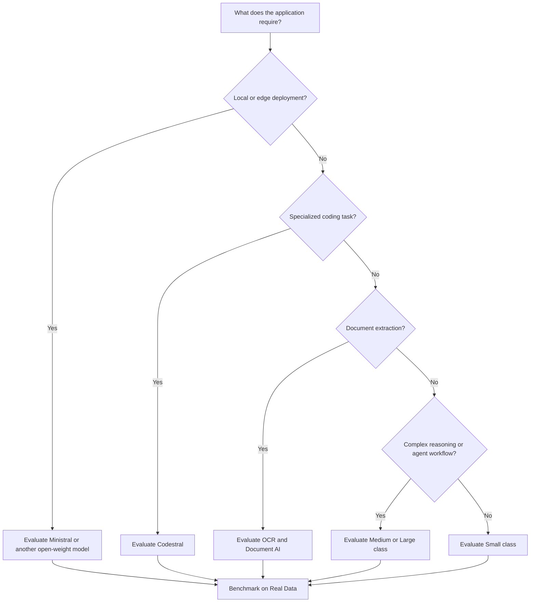

---

## 15. Evaluation Dataset

Create a dataset before comparing models.

A good evaluation dataset contains:

* Normal requests
* Short requests
* Long requests
* Missing fields
* Ambiguous instructions
* Typographical errors
* Vietnamese input
* English input
* Mixed-language input
* Prompt-injection attempts
* Unsupported requests
* Adversarial examples
* Real historical failures

### Example Dataset Record

```json
{
  "id": "ticket_014",
  "input": "I was billed twice this month.",
  "expected_category": "billing",
  "expected_urgency": "medium",
  "required_facts": [
    "duplicate charge"
  ],
  "forbidden_assumptions": [
    "refund already issued",
    "subscription canceled"
  ]
}
```

### Evaluation Results

```json
{
  "case_id": "ticket_014",
  "provider": "mistral",
  "model": "configured-model-name",
  "latency_ms": 614.7,
  "schema_valid": true,
  "category_correct": true,
  "urgency_correct": true,
  "hallucination_detected": false,
  "quality_score": 4.6
}
```

---

## 16. Common Production Failures

### 16.1 Hard-Coding a Model Version

#### Problem

The model identifier appears throughout the codebase.

#### Risk

Changing or retiring the model requires many code changes.

#### Better Approach

```python
model_name = os.getenv(
    "MISTRAL_MODEL",
    "mistral-small-latest",
)
```

For more control, maintain a centralized model registry:

```python
MODEL_REGISTRY = {
    "ticket_classifier": "mistral-small-latest",
    "complex_analysis": "mistral-medium-latest",
    "code_completion": "codestral-latest",
}
```

---

### 16.2 Using `latest` Without Tracking the Resolved Version

#### Problem

A `latest` alias may point to a newer model later.

#### Impact

Quality, cost, latency, or formatting can change without an application deployment.

#### Prevention

Record:

* Requested model alias
* Resolved model version when available
* Request date
* Prompt version
* Evaluation results

Run regression tests before intentionally upgrading a fixed model version.

---

### 16.3 Trusting Generated JSON

#### Problem

The output looks like JSON but violates application rules.

#### Example

```json
{
  "urgency": "very urgent"
}
```

The application only supports:

```text
low | medium | high
```

#### Solution

Use structured output and application validation.

```python
from typing import Literal
from pydantic import BaseModel


class TicketAnalysis(BaseModel):
    category: str
    urgency: Literal["low", "medium", "high"]
    sentiment: Literal["negative", "neutral", "positive"]
    summary: str
```

---

### 16.4 Exposing the API Key

#### Problem

The API key is included in browser or mobile application code.

#### Risk

Attackers can extract and misuse it.

#### Recommended Architecture

```text
Web or Mobile Client
        ↓
Authenticated Backend
        ↓
Mistral API
```

Keep permanent provider credentials on trusted servers.

---

### 16.5 No Timeout or Retry Strategy

#### Problem

Temporary network or provider failures cause poor UX.

#### Solution

Define:

* Connection timeout
* Read timeout
* Maximum retry count
* Exponential backoff
* Retryable status codes
* Circuit breaker
* Fallback behavior

Mistral’s current quickstart identifies authentication, payment, and rate-limit errors among common API failure categories and recommends backoff for rate-limit responses.

Do not retry:

* Invalid authentication indefinitely
* Invalid user input
* Schema validation failures without changing the request
* Safety-policy rejections
* Requests that already caused an irreversible action

---

### 16.6 No Tool Authorization

#### Problem

The model can call a tool that performs a sensitive action.

#### Example

```text
delete_user_account(user_id)
```

#### Solution

The backend should verify:

* User identity
* Permission
* Function name
* Arguments
* Resource ownership
* Confirmation state
* Idempotency key

The model proposes an action. The application authorizes and executes it.

---

### 16.7 Sending Too Much Context

#### Effects

* Higher latency
* Higher cost
* Less relevant answers
* Greater context-window pressure
* More difficult debugging

#### Better Approaches

* RAG
* Context filtering
* Metadata search
* Conversation summarization
* Relevant-message selection
* Input limits
* Cached reusable context

---

### 16.8 Evaluating Only the Happy Path

A feature that succeeds for one example is not production-ready.

Test:

* Empty input
* Very long input
* Wrong language
* Mixed language
* Malformed content
* Conflicting instructions
* Prompt injection
* External-tool failure
* Missing retrieved documents
* Provider timeout
* Invalid structured output

---

### 16.9 Confusing Open Weights with Zero Operational Cost

Downloading model weights does not make inference free.

Self-hosted systems still require:

* GPU or CPU infrastructure
* Storage
* Memory
* Networking
* Monitoring
* Deployment engineering
* Security
* Scaling
* Maintenance
* Energy

Compare total cost of ownership rather than only API token price.

---

### 16.10 Ignoring Licensing

Different models can have different licenses and usage restrictions.

Before deployment, record:

* Model name
* Model version
* Weight license
* Commercial-use permission
* Redistribution rules
* Modification rules
* Attribution requirements

Licensing should be reviewed separately from technical model quality.

---

## 17. Production Architecture

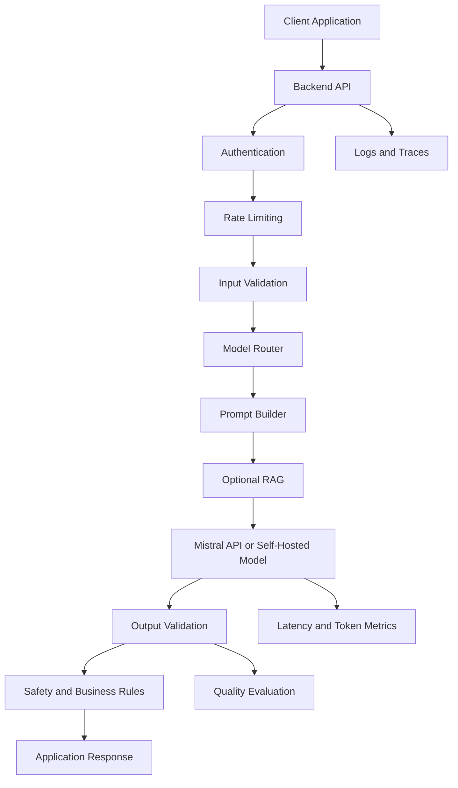

### Recommended Components

* Secret management
* Authentication
* Input validation
* Prompt versioning
* Model routing
* Timeouts
* Retries
* Output validation
* Guardrails
* Rate limiting
* Caching
* Usage monitoring
* Evaluation datasets
* Fallback models
* Audit logging
* Human review for sensitive decisions

---

## 18. Practical Exercises

### Exercise 1 — Five-Line Summary

Without reviewing the lesson, explain:

1. What Mistral AI is
2. What open-weight means
3. When local deployment is useful
4. What Codestral is designed for
5. How you would select a Mistral model

---

### Exercise 2 — Basic API Call

Create a Python script that:

* Reads a prompt from the terminal
* Sends it to the Mistral API
* Prints the response
* Measures latency
* Records token usage
* Handles an empty prompt
* Handles an API error

---

### Exercise 3 — Structured Classification

Build a ticket classifier that returns:

```json
{
  "category": "",
  "urgency": "",
  "sentiment": "",
  "summary": "",
  "requires_human_review": false
}
```

Test it with:

* A billing issue
* A password issue
* A crash report
* An ambiguous issue
* Vietnamese input
* Mixed English–Vietnamese input
* Prompt-injection text

---

### Exercise 4 — RAG Demo

Build a small documentation assistant.

#### Required Pipeline

```text
Markdown files
→ Chunk documents
→ Generate embeddings
→ Store vectors
→ Retrieve top chunks
→ Send context to Mistral
→ Return answer with sources
```

Measure:

* Retrieval precision
* Answer correctness
* Citation support
* Latency
* Token usage
* Missing-answer behavior

---

### Exercise 5 — Hosted vs Local Comparison

Compare:

* One hosted Mistral API model
* One locally deployed open-weight Mistral model

Record:

| Metric                 | Hosted | Local |
| ---------------------- | -----: | ----: |
| Setup time             |        |       |
| First-token latency    |        |       |
| Total latency          |        |       |
| Quality score          |        |       |
| Infrastructure cost    |        |       |
| Privacy control        |        |       |
| Operational complexity |        |       |

---

### Exercise 6 — Production Failure Report

Use this template:

```markdown
## Failure

The model returned an unsupported category.

## Impact

The backend could not route the support ticket.

## Detection

Pydantic validation rejected the model response.

## Root Cause

The prompt requested JSON but did not constrain the category values.

## Immediate Fix

Map unknown categories to `other` and request human review.

## Permanent Fix

Use a structured schema and add invalid-category cases to the
evaluation dataset.

## Monitoring

Track the schema-validation failure rate by model and prompt version.
```

---

## 19. Completion Checklist

### Understanding

* [ ] I can explain Mistral AI in one or two minutes.
* [ ] I understand the difference between hosted and self-deployed models.
* [ ] I understand what open-weight models are.
* [ ] I can identify general, compact, coding, embedding, vision, and OCR models.
* [ ] I can explain structured outputs.
* [ ] I can explain function calling.
* [ ] I can explain how Mistral models fit into a RAG pipeline.
* [ ] I understand that licenses must be checked per model.

### Implementation

* [ ] I have sent at least one request to the Mistral API.
* [ ] I store the API key outside the source code.
* [ ] I configure the model through an environment variable.
* [ ] I measure request latency.
* [ ] I record token usage when available.
* [ ] I validate model output.
* [ ] I handle API errors.
* [ ] I have tested at least one edge case.

### Production Readiness

* [ ] I record the model and prompt version.
* [ ] I have an evaluation dataset.
* [ ] I measure P50 and P95 latency.
* [ ] I know the expected cost per successful task.
* [ ] I understand the fallback behavior.
* [ ] Tool calls are authorized by backend code.
* [ ] Sensitive data is protected in logs.
* [ ] I have documented at least one limitation.
* [ ] I have reviewed the model license.
* [ ] I have a migration plan for model changes.

---

## 20. Related Outcome

> Choose pre-trained AI models based on capability, context length, latency, cost, safety, deployment requirements, licensing, and product fit.

A good model-selection explanation should look like this:

```text
We selected a Mistral Small-class model because it met our ticket
classification accuracy target, produced valid structured output,
responded within the required latency, and had a lower operating
cost than the larger candidates.

We will evaluate a Medium-class model only for tickets requiring
complex reasoning.
```

A weak explanation would be:

```text
We selected Mistral because it is a popular AI model.
```

---

## 21. Related Project

# Project 2 — Model Comparison App

Build an application that compares two or three models using the same prompts and evaluation cases.

### Example Comparison

```text
Mistral Small-class model
vs.
Mistral Medium-class model
vs.
Another provider's model
```

### Required Features

* Shared input prompt
* Provider selection
* Model selection
* Side-by-side responses
* Request latency
* Token usage
* Estimated cost
* Error status
* Structured-output validation
* Manual quality score
* Result history

### Suggested Architecture

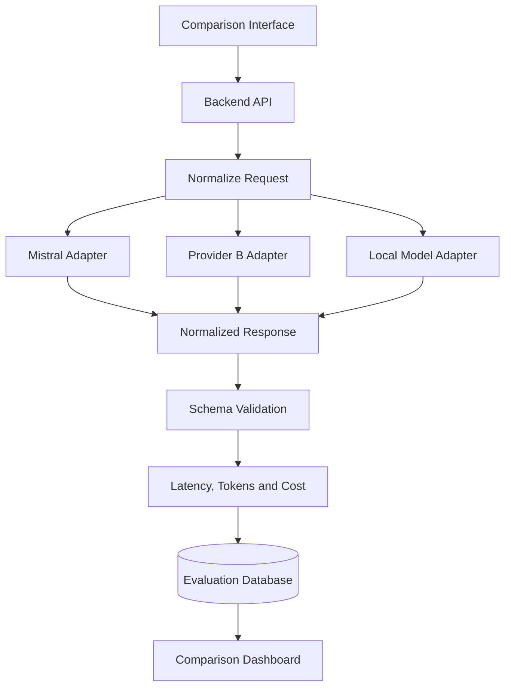

### Normalized Response Format

```json
{
  "provider": "mistral",
  "model": "configured-model-name",
  "response": "Generated answer",
  "latency_ms": 714.3,
  "input_tokens": 121,
  "output_tokens": 68,
  "estimated_cost": null,
  "schema_valid": true,
  "status": "success",
  "error": null
}
```

### Evaluation Tasks

Include at least 20 cases covering:

* Summarization
* Classification
* Data extraction
* Reasoning
* Code generation
* Vietnamese output
* English output
* Mixed-language input
* Long context
* Invalid input
* Prompt injection
* Tool selection

### Scoring Rubric

| Criterion             |  Measurement |
| --------------------- | -----------: |
| Correctness           |          1–5 |
| Instruction following |          1–5 |
| Completeness          |          1–5 |
| Clarity               |          1–5 |
| Schema compliance     | Pass or fail |
| Hallucination         |    Yes or no |
| Latency               | Milliseconds |
| Token usage           |     Measured |
| Cost                  |    Estimated |
| Error rate            |   Percentage |

### Final Report Questions

1. Which model produced the highest task quality?
2. Which model was fastest?
3. Which model used the fewest tokens?
4. Which model followed schemas most reliably?
5. Which model performed best in Vietnamese?
6. Which model handled edge cases best?
7. Which model had the best cost-to-quality ratio?
8. Should the product use one model or a routing strategy?
9. Would local deployment improve privacy or cost?
10. What migration risks exist?

---

## 22. Suggested 20-Minute Lesson Plan

|          Time | Activity                                        |
| ------------: | ----------------------------------------------- |
|   0–3 minutes | Explain Mistral AI and the open-weight approach |
|   3–7 minutes | Introduce the major model categories            |
|  7–10 minutes | Compare hosted and self-deployed models         |
| 10–15 minutes | Run the Python API demo                         |
| 15–18 minutes | Discuss RAG, agents, and production risks       |
| 18–20 minutes | Assign the model-comparison exercise            |

---

## 23. Key Takeaways

1. Mistral AI provides both general-purpose and specialized AI models.
2. Some Mistral models are available as open weights, enabling local or private deployment.
3. Smaller models may be better for high-volume or low-latency tasks.
4. Codestral is designed for coding and code-completion workflows.
5. Embedding models support semantic search and RAG.
6. OCR and Document AI services are useful for structured document processing.
7. Function calling connects models to external APIs and business systems.
8. Agents can combine tools, documents, connectors, and multi-step workflows.
9. Hosted APIs reduce operational complexity, while self-deployment increases infrastructure control.
10. Model selection must be based on real evaluation data, not only benchmarks.
11. Model aliases, versions, usage, latency, and quality should be logged.
12. Structured outputs still require backend validation.
13. API keys and sensitive tools must remain protected.
14. Open-weight inference still has hardware and operational costs.
15. Licensing must be included in the model-selection decision.

---

## 24. Final Summary

**Mistral AI** is an important platform in the modern AI Engineer roadmap because it offers hosted APIs, open-weight models, coding models, embeddings, multimodal capabilities, document processing, function calling, RAG, and agent workflows.

A capable AI Engineer should be able to:

* Choose the correct Mistral model category
* Decide between a hosted API and self-deployment
* Create and version prompts
* Integrate the official API
* Validate structured output
* Build tool-calling workflows
* Add Mistral models to RAG systems
* Measure latency, token usage, cost, and quality
* Test real failure cases
* Protect credentials and private information
* Track model versions and licenses
* Explain why the chosen model fits the product

Turn the lesson into a working API route, local-model experiment, RAG assistant, coding tool, document-processing demo, evaluation dashboard, or portfolio report so that the knowledge becomes practical engineering experience.
