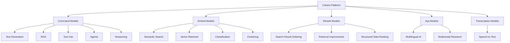
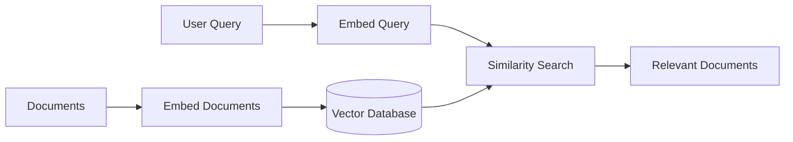
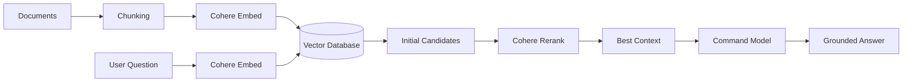
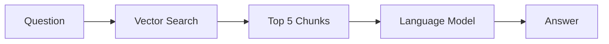
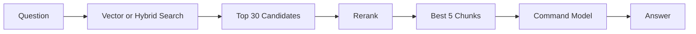
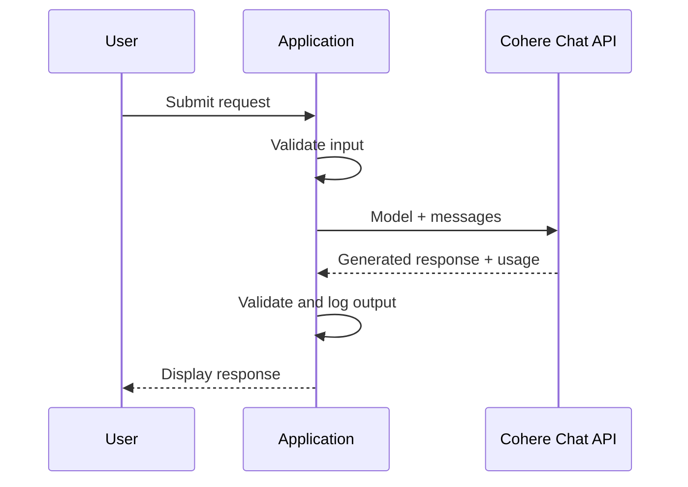
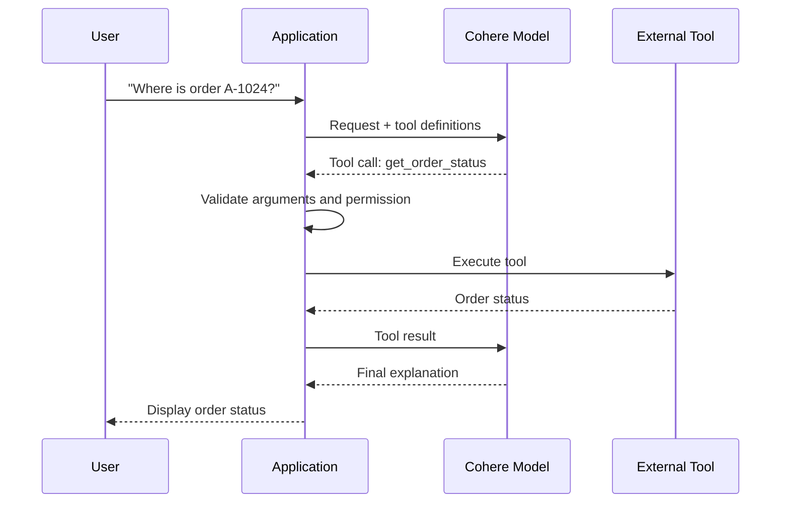
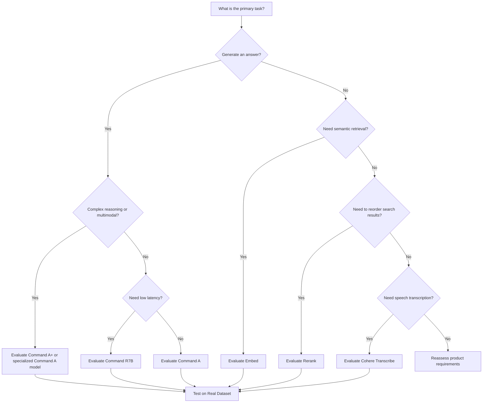
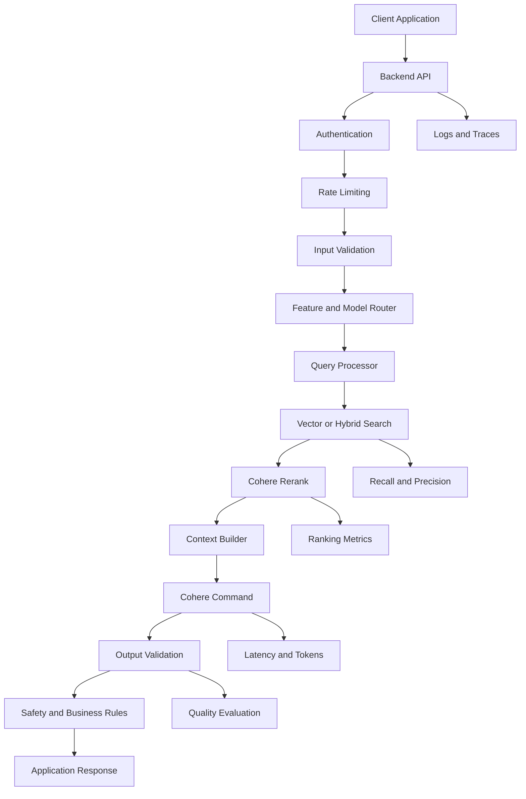
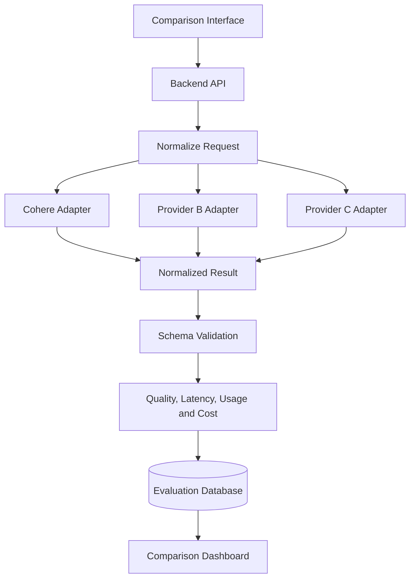

# 008 — Cohere

| Field                  | Details                                      |
| ---------------------- | -------------------------------------------- |
| **Course**             | 02 — Model Platforms and Prompting           |
| **Module**             | Module 03 — Using Pre-trained Models         |
| **Content Group**      | Popular AI Models                            |
| **Roadmap Source**     | Using Pre-trained Models / Popular AI Models |
| **Lesson Type**        | Model Selection                              |
| **Order in Module**    | 008                                          |
| **Suggested Duration** | 20 minutes                                   |

> **Documentation note:** Cohere regularly releases and retires models. The examples in this lesson reflect Cohere’s documentation available in July 2026. Always check the current model catalog and deprecation notices before production deployment.

---

## 1. Summary

**Cohere** is an AI model platform focused on enterprise language applications, multilingual systems, semantic search, Retrieval-Augmented Generation, reranking, tool use, and agent workflows.

Its main model families include:

* **Command** for text generation, reasoning, RAG, tools, and agents
* **Embed** for semantic vector representations
* **Rerank** for improving search-result relevance
* **Aya** for multilingual and multimodal research
* **Cohere Transcribe** for speech-to-text workloads

Cohere models can be accessed through Cohere’s platform and selected cloud platforms, including Amazon, Microsoft Azure, and Oracle infrastructure.

Cohere is especially relevant when an AI product requires:

* Enterprise document search
* Multilingual retrieval
* Source-grounded question answering
* Reranking of search results
* Tool-using assistants
* Structured output
* Private or controlled deployment
* Integration with existing vector databases

For an AI Engineer, learning Cohere means understanding how generation, embedding, retrieval, and reranking work together—not merely how to send a chat request.

---

## 2. Learning Objectives

After completing this lesson, you should be able to:

1. Explain Cohere in your own words.
2. Distinguish Command, Embed, and Rerank models.
3. Explain why reranking can improve a RAG pipeline.
4. Select a Cohere model based on task, latency, cost, modality, and product fit.
5. Send a basic request through the Cohere Chat API.
6. Build a simple semantic-search or reranking demo.
7. Explain how Cohere supports tool use and agent workflows.
8. Record model version, token usage, latency, and quality.
9. Identify common production failures and debugging methods.
10. Add Cohere to a multi-provider model comparison application.

---

## 3. What Is Cohere?

Cohere provides several specialized model categories rather than using one model for every AI task.



The central idea is to use the right component for each stage:

```text
Command → Generate and reason
Embed   → Retrieve by semantic meaning
Rerank  → Reorder retrieved candidates
```

---

## 4. Main Cohere Model Families

### 4.1 Command Models

The **Command** family contains Cohere’s generative language models.

Command models can be used for:

* Conversational applications
* Enterprise assistants
* Long-document analysis
* Retrieval-Augmented Generation
* Tool and function calling
* Multi-step agents
* Structured extraction
* Translation
* Reasoning
* Image understanding with vision-capable variants

Cohere’s current catalog includes models such as Command A+, Command A, Command A Reasoning, Command A Translate, Command A Vision, and the smaller Command R7B.

### Current Command Categories

| Model Category          | Typical Product Fit                                                                                  |
| ----------------------- | ---------------------------------------------------------------------------------------------------- |
| **Command A+**          | Advanced enterprise assistants combining vision, reasoning, multilingual output, and agent workflows |
| **Command A**           | General enterprise RAG, tool use, multilingual chat, and agents                                      |
| **Command A Reasoning** | Complex analysis, planning, and nuanced problem-solving                                              |
| **Command A Vision**    | Charts, diagrams, documents, tables, OCR, and image-based questions                                  |
| **Command A Translate** | Specialized multilingual translation                                                                 |
| **Command R7B**         | Faster and smaller RAG, tools, and agent workloads                                                   |
| **Command R / R+**      | Earlier long-context enterprise and RAG models                                                       |

Command A+ is currently listed as a text-and-image model with a 128,000-token context window, while Command A offers a 256,000-token context window for text workloads. Model limits and availability should be verified at deployment time.

---

### 4.2 Embed Models

An **embedding model** converts text, images, or documents into numeric vectors that represent meaning.

Example:

```text
"How do I reset my password?"
        ↓
Embedding model
        ↓
[0.024, -0.118, 0.453, ...]
```

Semantically similar inputs should produce vectors that are closer together.

Cohere’s current Embed catalog includes `embed-v4.0`, English-specific models, multilingual models, and smaller light variants. `embed-v4.0` supports text, images, and mixed text-image inputs such as PDFs, with configurable vector dimensions and a large context window.

### Common Embed Use Cases

* Semantic search
* Document retrieval
* Product recommendations
* Similar-ticket detection
* Duplicate-content detection
* Topic clustering
* Classification
* RAG
* Image-to-text retrieval
* Multimodal document search

### Embedding Architecture



---

### 4.3 Rerank Models

A retrieval system usually returns several candidate documents. However, the initial ordering may not place the best answer first.

A **Rerank model** receives:

* One query
* A list of candidate documents

It then sorts those documents from most relevant to least relevant and assigns relevance scores.

### Example

#### Query

```text
How do I cancel my subscription?
```

#### Initial Search Results

```text
1. Subscription price list
2. Account registration guide
3. Steps for canceling a subscription
4. Payment methods
5. Refund policy
```

#### After Reranking

```text
1. Steps for canceling a subscription
2. Refund policy
3. Subscription price list
4. Payment methods
5. Account registration guide
```

Cohere currently provides `rerank-v4.0-pro` for higher-quality and complex workloads and `rerank-v4.0-fast` for lower-latency, higher-throughput workloads. Both are multilingual and can rank text or semi-structured data.

---

### 4.4 Aya Models

The **Aya** family focuses on multilingual generative AI.

Cohere’s current catalog includes multilingual Aya models, multimodal Aya Vision, and smaller Tiny Aya variants. Tiny Aya models are designed to support a broad range of languages with a compact parameter count.

Possible uses include:

* Multilingual assistants
* Regional-language applications
* Cross-language analysis
* Translation research
* Low-resource language experimentation
* Multimodal multilingual applications

Aya may be especially interesting for research and products serving languages that receive less coverage from mainstream models.

---

### 4.5 Cohere Transcribe

Cohere also provides models for automatic speech recognition.

These models accept audio and return text, making them suitable for:

* Meeting transcription
* Customer-call analysis
* Voice-note processing
* Subtitle generation
* Searchable audio archives
* Voice-based agent input

The current Cohere model catalog lists a multilingual transcription model released in 2026.

---

## 5. Why Cohere Is Important for RAG

Cohere is strongly associated with retrieval systems because it provides separate components for each major RAG stage.



Cohere’s official end-to-end RAG example combines the Chat, Embed, and Rerank endpoints for retrieval, reranking, and conversational answer generation.

### Three Important Stages

#### Stage 1: Retrieval

Embed the query and search a vector database.

#### Stage 2: Reranking

Use a deeper relevance model to reorder the initial candidates.

#### Stage 3: Generation

Send only the best evidence to a Command model.

This approach can improve:

* Search relevance
* Answer quality
* Context efficiency
* Citation accuracy
* Resistance to irrelevant documents

However, reranking adds another model request, which increases latency and cost. Its value must be measured using real retrieval data.

---

## 6. Standard RAG vs RAG with Reranking

### Basic RAG



### RAG with Reranking



### Comparison

| Factor                | Basic RAG                     | RAG with Reranking                  |
| --------------------- | ----------------------------- | ----------------------------------- |
| Architecture          | Simpler                       | More complex                        |
| Number of model calls | Lower                         | Higher                              |
| Latency               | Usually lower                 | Usually higher                      |
| Retrieval precision   | Depends heavily on embeddings | Often improved                      |
| Cost                  | Lower                         | Higher                              |
| Context relevance     | May contain noisy results     | Usually more focused                |
| Best use              | Simple or low-volume search   | Enterprise and high-accuracy search |

Do not add reranking automatically. Measure whether it improves recall, precision, faithfulness, or final answer quality enough to justify the additional request.

---

## 7. Cohere Chat API

The Cohere Chat API receives a chronological list of messages and returns an assistant response.

Supported message roles include:

* `system`
* `user`
* `assistant`
* `tool`

Cohere recommends its version 2 API structure, where conversation messages are supplied in a single `messages` array.

### Request Flow



---

## 8. Prompt Design for Cohere

A strong prompt usually includes:

```text
Role
+ Task
+ Context
+ Rules
+ Output Format
```

### Weak Prompt

```text
Analyze this support ticket.
```

### Improved Prompt

```text
You are a customer-support classification assistant.

Analyze the support ticket below.

Return:
- category
- urgency
- sentiment
- one-sentence summary

Use only information stated in the ticket.
Do not invent account, payment, or customer details.

Ticket:
"The mobile application crashes whenever I upload a PDF."
```

### Production-Oriented Prompt

```text
You are a classification component in a support-ticket pipeline.

Allowed categories:
- account
- billing
- performance
- file_upload
- security
- other

Allowed urgency values:
- low
- medium
- high

Rules:
1. Use only information explicitly present in the ticket.
2. Use high urgency only for data loss, security incidents,
   total service failure, or loss of account access.
3. Use category "other" when no category clearly applies.
4. The summary must contain no more than 25 words.
5. Return valid JSON matching the supplied schema.

Ticket:
{{ticket_text}}
```

Prompt quality should be evaluated with a dataset rather than one manually selected input.

---

## 9. Structured Outputs

Natural-language answers are appropriate for chat interfaces, but application backends often require predictable data.

Example:

```json
{
  "category": "file_upload",
  "urgency": "medium",
  "sentiment": "negative",
  "summary": "The application crashes during PDF uploads.",
  "requires_human_review": false
}
```

The Cohere Chat API supports JSON output and optional JSON Schema constraints on supported models. Cohere’s documentation notes that applications should explicitly instruct the model to generate JSON when JSON mode is enabled.

Structured outputs are useful for:

* Classification
* Information extraction
* API responses
* Workflow routing
* Database insertion
* UI rendering
* Automated evaluation

Model output must still be validated by application code.

---

## 10. Tool Use and Agents

Tool use allows a Command model to request external operations.

Examples include:

* Search a document database
* Look up an order
* Query an SQL database
* Calculate a result
* Create a support ticket
* Retrieve account details
* Call an internal API
* Route a question to a specialized data source

Cohere’s Chat endpoint supports function calling, multi-step reasoning, and citation generation for tool-using and agentic applications.

### Tool-Calling Flow



The model proposes an action, but the application remains responsible for:

* Authentication
* Authorization
* Argument validation
* Confirmation
* Rate limiting
* Idempotency
* Audit logging
* Error handling

---

## 11. Model Selection Framework

Selecting Cohere should be an engineering decision based on the real product workload.

### 11.1 Important Dimensions

| Dimension                | Evaluation Question                                   |
| ------------------------ | ----------------------------------------------------- |
| **Task quality**         | Does the model solve the target task correctly?       |
| **Retrieval quality**    | Does Embed find the right candidates?                 |
| **Reranking quality**    | Does Rerank place the best evidence first?            |
| **Latency**              | Is total response time acceptable?                    |
| **Cost**                 | Can the expected workload be supported?               |
| **Context length**       | Can the model process the required input?             |
| **Multilingual quality** | Does it work for the target languages?                |
| **Structured output**    | Does it follow the schema reliably?                   |
| **Tool use**             | Does it choose and call tools correctly?              |
| **Modality**             | Does the feature require text, images, PDF, or audio? |
| **Deployment**           | Can it run in the required infrastructure?            |
| **Safety**               | Is the behavior appropriate for the product domain?   |
| **Reliability**          | Does it handle malformed and adversarial input?       |

---

### 11.2 Model Selection Decision Tree



---

### 11.3 Weighted Score Example

```text
Total Model Score =
    Task Quality × 0.25
  + Retrieval Quality × 0.15
  + Reliability × 0.15
  + Latency × 0.15
  + Cost × 0.10
  + Schema Compliance × 0.10
  + Multilingual Quality × 0.05
  + Ecosystem Fit × 0.05
```

The weights should reflect the product.

For example:

* A search engine should emphasize retrieval and reranking.
* A real-time assistant should emphasize latency.
* A financial assistant should emphasize accuracy and traceability.
* A multilingual support system should emphasize language quality.
* A large ingestion pipeline should emphasize throughput and cost.

---

## 12. Practical Chat API Demo

### 12.1 Demo Goal

Build a small Cohere feature that:

1. Receives a support ticket.
2. Sends it to a Command model.
3. Measures latency.
4. Records token usage.
5. Prints the analysis.
6. Handles common errors.

---

### 12.2 Install the SDK

```bash
pip install -U cohere
```

Set the API key:

```bash
export COHERE_API_KEY="your-api-key"
```

Windows PowerShell:

```powershell
$env:COHERE_API_KEY="your-api-key"
```

The current Cohere Python examples use `cohere.ClientV2`, the Chat endpoint, and a chronological `messages` array.

---

### 12.3 Python Demo

```python
import os
import time
from typing import Any

import cohere


def _read_usage(response: Any) -> dict[str, int | None]:
    """
    Read token information across compatible Cohere SDK responses.
    """
    usage = getattr(response, "usage", None)
    meta = getattr(response, "meta", None)

    source = usage or meta
    billed_units = getattr(source, "billed_units", None)
    tokens = getattr(source, "tokens", None)

    return {
        "input_tokens": getattr(tokens, "input_tokens", None),
        "output_tokens": getattr(tokens, "output_tokens", None),
        "billed_input_tokens": getattr(
            billed_units,
            "input_tokens",
            None,
        ),
        "billed_output_tokens": getattr(
            billed_units,
            "output_tokens",
            None,
        ),
    }


def analyze_support_ticket(ticket: str) -> dict[str, Any]:
    """
    Analyze a support ticket using Cohere's Chat API.
    """
    normalized_ticket = ticket.strip()

    if not normalized_ticket:
        raise ValueError("The support ticket must not be empty.")

    api_key = os.getenv("COHERE_API_KEY")

    if not api_key:
        raise RuntimeError(
            "COHERE_API_KEY is missing. "
            "Set it before running the application."
        )

    # Keep the model configurable because model availability changes.
    model_name = os.getenv(
        "COHERE_MODEL",
        "command-a-plus-05-2026",
    )

    client = cohere.ClientV2(api_key=api_key)

    messages = [
        {
            "role": "system",
            "content": (
                "You are a customer-support classification assistant. "
                "Use only information present in the ticket. "
                "Return the category, urgency, sentiment, and a "
                "one-sentence summary."
            ),
        },
        {
            "role": "user",
            "content": normalized_ticket,
        },
    ]

    started_at = time.perf_counter()

    try:
        response = client.chat(
            model=model_name,
            messages=messages,
        )
    except Exception as exc:
        raise RuntimeError(
            f"Cohere request failed: {exc}"
        ) from exc

    latency_ms = round(
        (time.perf_counter() - started_at) * 1000,
        2,
    )

    usage = _read_usage(response)

    if not response.message.content:
        raise RuntimeError("Cohere returned an empty response.")

    return {
        "model": model_name,
        "latency_ms": latency_ms,
        **usage,
        "response": response.message.content[0].text,
    }


if __name__ == "__main__":
    sample_ticket = (
        "The application crashes every time I upload a PDF "
        "larger than 10 MB. Smaller files work correctly."
    )

    result = analyze_support_ticket(sample_ticket)

    print(f"Model: {result['model']}")
    print(f"Latency: {result['latency_ms']} ms")
    print(f"Input tokens: {result['input_tokens']}")
    print(f"Output tokens: {result['output_tokens']}")
    print("\nAnalysis:")
    print(result["response"])
```

Cohere responses include usage or metadata fields that can report input, output, and billed token counts.

---

## 13. Practical Rerank Demo

### 13.1 Demo Goal

Given a user question and several knowledge-base documents, return the three most relevant documents.

```python
import os

import cohere


def rerank_documents(
    query: str,
    documents: list[str],
    top_n: int = 3,
) -> list[dict[str, object]]:
    if not query.strip():
        raise ValueError("The query must not be empty.")

    if not documents:
        raise ValueError("At least one document is required.")

    api_key = os.getenv("COHERE_API_KEY")

    if not api_key:
        raise RuntimeError("COHERE_API_KEY is missing.")

    model_name = os.getenv(
        "COHERE_RERANK_MODEL",
        "rerank-v4.0-pro",
    )

    client = cohere.ClientV2(api_key=api_key)

    response = client.rerank(
        model=model_name,
        query=query,
        documents=documents,
        top_n=min(top_n, len(documents)),
    )

    ranked_documents: list[dict[str, object]] = []

    for result in response.results:
        ranked_documents.append(
            {
                "index": result.index,
                "relevance_score": result.relevance_score,
                "document": documents[result.index],
            }
        )

    return ranked_documents


if __name__ == "__main__":
    knowledge_base = [
        "Subscriptions can be upgraded from the billing page.",
        "To cancel, open Settings, choose Subscription, and select Cancel.",
        "Password reset links expire after 30 minutes.",
        "Refund requests must be submitted within seven days.",
        "The mobile application supports PDF and image uploads.",
    ]

    results = rerank_documents(
        query="How can I cancel my subscription?",
        documents=knowledge_base,
    )

    for position, item in enumerate(results, start=1):
        print(
            f"{position}. Score={item['relevance_score']:.4f}\n"
            f"   {item['document']}"
        )
```

The official Rerank API accepts a query, a list of documents, a model, and the desired number of results. It returns document indexes and relevance scores.

---

## 14. FastAPI Demo

```python
import os
import time

import cohere
from fastapi import FastAPI, HTTPException
from pydantic import BaseModel, Field


app = FastAPI(title="Cohere Support Analyzer")


class TicketRequest(BaseModel):
    ticket: str = Field(min_length=1, max_length=10_000)


class TicketResponse(BaseModel):
    model: str
    latency_ms: float
    analysis: str


@app.post("/analyze-ticket", response_model=TicketResponse)
def analyze_ticket(payload: TicketRequest) -> TicketResponse:
    api_key = os.getenv("COHERE_API_KEY")

    if not api_key:
        raise HTTPException(
            status_code=500,
            detail="The Cohere service is not configured.",
        )

    model_name = os.getenv(
        "COHERE_MODEL",
        "command-a-plus-05-2026",
    )

    client = cohere.ClientV2(api_key=api_key)

    started_at = time.perf_counter()

    try:
        response = client.chat(
            model=model_name,
            messages=[
                {
                    "role": "system",
                    "content": (
                        "Analyze the support ticket. Return its "
                        "category, urgency, sentiment, and recommended "
                        "next action. Do not invent details."
                    ),
                },
                {
                    "role": "user",
                    "content": payload.ticket,
                },
            ],
        )
    except Exception as exc:
        raise HTTPException(
            status_code=502,
            detail="The model provider could not complete the request.",
        ) from exc

    if not response.message.content:
        raise HTTPException(
            status_code=502,
            detail="The model returned an empty response.",
        )

    latency_ms = round(
        (time.perf_counter() - started_at) * 1000,
        2,
    )

    return TicketResponse(
        model=model_name,
        latency_ms=latency_ms,
        analysis=response.message.content[0].text,
    )
```

Run the API:

```bash
uvicorn main:app --reload
```

Test the route:

```bash
curl -X POST "http://localhost:8000/analyze-ticket" \
  -H "Content-Type: application/json" \
  -d '{
    "ticket": "I was charged twice for the same subscription."
  }'
```

---

## 15. Logging and Observability

A production application should record enough information to compare behavior over time.

### Example Log

```json
{
  "request_id": "req_01ABC",
  "feature": "support_ticket_analysis",
  "provider": "cohere",
  "model": "command-a-plus-05-2026",
  "prompt_version": "ticket_classifier_v3",
  "latency_ms": 718.4,
  "input_tokens": 142,
  "output_tokens": 73,
  "billed_input_tokens": 128,
  "billed_output_tokens": 73,
  "schema_valid": true,
  "status": "success"
}
```

Cohere prices generative models by input and output tokens, embedding models by embedded tokens, and reranking models by search usage.

### Important Metrics

* Request count
* Success rate
* Error rate
* Timeout rate
* P50 latency
* P95 latency
* P99 latency
* Input tokens
* Output tokens
* Billed tokens
* Rerank search units
* Retrieval recall
* Reranking precision
* Schema-valid response rate
* Tool-call success rate
* Cost per successful task
* User correction rate
* Quality score by model version

### Avoid Logging

* Passwords
* API keys
* Authentication tokens
* Personal identification
* Health information
* Financial details
* Private documents
* Confidential company data

Use redaction, restricted access, retention rules, and encryption.

---

## 16. Evaluation Dataset

Do not select a model based on one successful prompt.

Create a dataset with:

* Normal requests
* Short requests
* Long requests
* Missing information
* Ambiguous questions
* Vietnamese inputs
* English inputs
* Mixed-language inputs
* Typographical errors
* Prompt-injection attempts
* Irrelevant retrieved documents
* Duplicate documents
* Conflicting documents
* Unsupported requests
* Historical production failures

### Generation Evaluation Record

```json
{
  "id": "ticket_014",
  "input": "I was billed twice this month.",
  "expected_category": "billing",
  "expected_urgency": "medium",
  "required_facts": [
    "duplicate charge"
  ],
  "forbidden_assumptions": [
    "refund already issued",
    "subscription canceled"
  ]
}
```

### Retrieval Evaluation Record

```json
{
  "query": "How do I cancel my plan?",
  "relevant_document_ids": [
    "subscription_cancel_01",
    "subscription_policy_02"
  ],
  "irrelevant_document_ids": [
    "password_reset_03"
  ]
}
```

### Useful Retrieval Metrics

* Recall@K
* Precision@K
* Mean Reciprocal Rank
* Normalized Discounted Cumulative Gain
* Top-result accuracy
* Final answer faithfulness

---

## 17. Common Production Failures

### 17.1 Using an Outdated Model Alias

#### Problem

The application uses a deprecated or retired model.

#### Impact

Requests may fail or model behavior may change during migration.

#### Prevention

* Store the model in configuration.
* Review Cohere’s deprecation page.
* Track model lifecycle status.
* Maintain a migration test suite.
* Avoid scattering model identifiers across the codebase.

Cohere classifies models as active, legacy, deprecated, or retired and publishes recommended replacements.

---

### 17.2 Hard-Coding the Model

#### Poor Approach

```python
response = client.chat(
    model="command-a-plus-05-2026",
    messages=messages,
)
```

#### Better Approach

```python
model_name = os.getenv(
    "COHERE_MODEL",
    "command-a-plus-05-2026",
)
```

For multiple features:

```python
MODEL_REGISTRY = {
    "ticket_classifier": os.getenv(
        "TICKET_MODEL",
        "command-r7b-12-2024",
    ),
    "complex_analysis": os.getenv(
        "ANALYSIS_MODEL",
        "command-a-plus-05-2026",
    ),
    "document_reranker": os.getenv(
        "RERANK_MODEL",
        "rerank-v4.0-pro",
    ),
}
```

---

### 17.3 Using Embeddings Without the Correct Input Type

Embedding models may treat queries and documents differently.

For retrieval, distinguish between:

```text
search_query
search_document
```

Using an incorrect input type can reduce semantic-search quality.

The application should also keep document and query embeddings compatible by using the same model version and expected configuration.

---

### 17.4 Retrieving Too Few Documents

#### Problem

Vector search returns only three documents before reranking.

#### Risk

The relevant document may never reach the reranker.

#### Better Pattern

```text
Retrieve 20–50 candidates
        ↓
Rerank candidates
        ↓
Use the best 3–8 chunks
```

The exact values should be determined through evaluation.

---

### 17.5 Retrieving Too Many Documents into the Prompt

#### Problem

The system includes all retrieved documents in the generation prompt.

#### Effects

* Higher cost
* Higher latency
* More irrelevant context
* Greater hallucination risk
* Reduced focus

#### Solution

Use filtering, deduplication, reranking, context limits, and relevance thresholds.

---

### 17.6 Trusting Relevance Scores as Absolute Truth

A high reranking score does not prove that a document contains the correct answer.

Validate:

* Whether the document actually answers the question
* Whether the document is current
* Whether the source is authoritative
* Whether sources conflict
* Whether the answer is supported by the selected passage

---

### 17.7 Trusting Generated JSON

#### Problem

The model returns syntactically valid JSON with invalid business values.

```json
{
  "urgency": "extremely_high"
}
```

#### Solution

Validate with an application schema.

```python
from typing import Literal

from pydantic import BaseModel, Field


class TicketAnalysis(BaseModel):
    category: Literal[
        "account",
        "billing",
        "performance",
        "file_upload",
        "security",
        "other",
    ]
    urgency: Literal["low", "medium", "high"]
    sentiment: Literal["negative", "neutral", "positive"]
    summary: str = Field(max_length=200)
    requires_human_review: bool
```

---

### 17.8 Exposing the API Key

Do not place a permanent API key in frontend or mobile source code.

```text
Web or Mobile Client
        ↓
Authenticated Backend
        ↓
Cohere API
```

The backend should enforce:

* User authentication
* Rate limits
* Input-size limits
* Feature permissions
* Usage quotas
* Audit logs

---

### 17.9 No Timeout or Retry Strategy

The Cohere Chat API documents errors including authentication failures, rate limits, internal errors, unavailable-service errors, and gateway timeouts.

Define:

* Connection timeout
* Read timeout
* Maximum retry count
* Exponential backoff
* Retryable status codes
* Circuit breaker
* Fallback behavior

Do not retry:

* Invalid API keys indefinitely
* Invalid inputs
* Permanent permission failures
* Irreversible tool actions
* Repeated schema failures without changing the request

---

### 17.10 No End-to-End RAG Evaluation

A good embedding score does not guarantee a good final answer.

Evaluate the complete pipeline:

```text
Query
→ Retrieval
→ Reranking
→ Context Selection
→ Generation
→ Citation
→ Final Answer
```

A failure can originate from any stage.

---

## 18. Production Architecture



### Recommended Components

* Secret management
* Authentication
* Rate limiting
* Input validation
* Prompt versioning
* Model configuration
* Vector database
* Metadata filtering
* Reranking
* Context budgeting
* Output validation
* Timeouts
* Retry policy
* Cost monitoring
* Quality evaluation
* Fallback behavior
* Audit logging
* Human review for sensitive decisions

---

## 19. Practical Exercises

### Exercise 1 — Five-Line Summary

Without reviewing the lesson, explain:

1. What Cohere is
2. What Command models do
3. What Embed models do
4. What Rerank models do
5. Why Cohere is useful for RAG

---

### Exercise 2 — Chat API

Create a Python script that:

* Reads a prompt from the terminal
* Sends it to a Command model
* Prints the response
* Measures latency
* Records token usage
* Handles empty input
* Handles API errors

---

### Exercise 3 — Semantic Search

Create ten sample documents and:

1. Generate embeddings
2. Store the vectors
3. Embed a user question
4. Calculate similarity
5. Return the top five documents

Test questions that:

* Use exact keywords
* Use synonyms
* Use Vietnamese
* Contain spelling errors
* Do not have a correct answer

---

### Exercise 4 — Reranking

Retrieve ten documents, then apply Cohere Rerank.

Compare:

| Metric               | Before Rerank | After Rerank |
| -------------------- | ------------: | -----------: |
| Top-1 accuracy       |               |              |
| Recall@5             |               |              |
| Mean Reciprocal Rank |               |              |
| Latency              |               |              |
| Cost                 |               |              |

---

### Exercise 5 — Complete RAG Demo

Build this pipeline:

```text
Markdown or PDF documents
→ Chunking
→ Cohere Embed
→ Vector database
→ Initial retrieval
→ Cohere Rerank
→ Command generation
→ Answer with citations
```

Record:

* Selected models
* Chunk size
* Chunk overlap
* Number of retrieved candidates
* Number of reranked results
* Prompt version
* Retrieval latency
* Reranking latency
* Generation latency
* Total latency
* Answer quality
* Citation support

---

### Exercise 6 — Production Failure Report

```markdown
## Failure

The assistant answered from an irrelevant document.

## Impact

The user received incorrect subscription instructions.

## Detection

The cited document did not contain the claimed information.

## Root Cause

The vector search returned semantically similar but outdated content,
and the pipeline did not apply metadata filtering.

## Immediate Fix

Remove the outdated document and require human review for affected
responses.

## Permanent Fix

Add publication-date filters, reranking, citation validation, and
retrieval regression tests.

## Monitoring

Track unsupported-answer rate and citation accuracy by model and
knowledge-base version.
```

---

## 20. Completion Checklist

### Understanding

* [ ] I can explain Cohere in one or two minutes.
* [ ] I can distinguish Command, Embed, and Rerank.
* [ ] I can explain semantic search.
* [ ] I can explain why reranking improves some RAG systems.
* [ ] I can explain tool calling.
* [ ] I understand Cohere’s multilingual model options.
* [ ] I understand that model availability changes over time.

### Implementation

* [ ] I have sent at least one Cohere Chat request.
* [ ] I have used the Cohere v2 client.
* [ ] I store the API key outside the source code.
* [ ] I configure models through environment variables.
* [ ] I measure request latency.
* [ ] I record token or search usage.
* [ ] I validate generated output.
* [ ] I have built a small reranking demo.
* [ ] I have tested at least one edge case.

### Production Readiness

* [ ] I record provider, model, and prompt version.
* [ ] I have a representative evaluation dataset.
* [ ] I measure retrieval and generation separately.
* [ ] I measure P50 and P95 latency.
* [ ] I track cost per successful task.
* [ ] I have timeout and retry policies.
* [ ] I have fallback behavior.
* [ ] Sensitive information is protected in logs.
* [ ] Tool calls are authorized by backend code.
* [ ] I monitor model deprecations.
* [ ] I have documented at least one limitation.

---

## 21. Related Outcome

> Choose pre-trained AI models based on capability, context length, latency, cost, safety, reliability, and product fit.

A strong model-selection explanation could be:

```text
We selected Cohere because our product is primarily an enterprise
knowledge-search application.

Embed improved multilingual semantic retrieval, while Rerank improved
top-result accuracy on our internal evaluation dataset. A Command
model produced grounded answers within our latency and cost limits.
```

A weak explanation would be:

```text
We selected Cohere because it is a popular AI platform.
```

---

## 22. Related Project

# Project 2 — Model Comparison App

Build an application that compares two or three models or complete AI pipelines.

### Example Comparison

```text
Cohere Command
vs.
Google Gemini
vs.
Mistral
```

You may also compare retrieval systems:

```text
Vector Search Only
vs.
Vector Search + Cohere Rerank
```

### Required Features

* Shared prompt input
* Provider selection
* Model selection
* Side-by-side responses
* Latency measurement
* Token usage
* Estimated cost
* Error status
* Structured-output validation
* Manual quality score
* Result history

### Additional RAG Metrics

* Retrieval latency
* Reranking latency
* Generation latency
* Total latency
* Recall@K
* Top-1 accuracy
* Citation correctness
* Answer faithfulness

### Suggested Architecture



### Normalized Response

```json
{
  "provider": "cohere",
  "model": "configured-model-name",
  "response": "Generated answer",
  "latency_ms": 714.3,
  "input_tokens": 121,
  "output_tokens": 68,
  "estimated_cost": null,
  "schema_valid": true,
  "status": "success",
  "error": null
}
```

### Final Report Questions

1. Which model produced the best task quality?
2. Which model was fastest?
3. Which model followed schemas most reliably?
4. Which model performed best in Vietnamese?
5. Did reranking improve retrieval quality?
6. How much latency did reranking add?
7. Which configuration had the best quality-to-cost ratio?
8. Which system handled missing information best?
9. Should the product use one provider or model routing?
10. What migration or deprecation risks exist?

---

## 23. Suggested 20-Minute Lesson Plan

|          Time | Activity                                   |
| ------------: | ------------------------------------------ |
|   0–3 minutes | Explain Cohere and its main model families |
|   3–7 minutes | Compare Command, Embed, and Rerank         |
|  7–10 minutes | Explain the complete RAG pipeline          |
| 10–14 minutes | Run the Chat API demo                      |
| 14–17 minutes | Run the Rerank demo                        |
| 17–19 minutes | Discuss production failures                |
| 19–20 minutes | Assign the model-comparison exercise       |

---

## 24. Key Takeaways

1. Cohere provides specialized models for generation, embeddings, reranking, multilingual AI, and transcription.
2. Command models generate answers, use tools, and support agent workflows.
3. Embed models convert content into semantic vectors.
4. Rerank models reorder retrieved documents by relevance.
5. A strong Cohere RAG system may combine Embed, Rerank, and Command.
6. Reranking can improve search quality but adds latency and cost.
7. Structured output still requires application-level validation.
8. The backend must authorize every sensitive tool action.
9. Retrieval quality and generation quality must be evaluated separately.
10. Model version, prompt version, token usage, latency, and failure cases should be logged.
11. Model selection should use real product data rather than one demo prompt.
12. Deprecated models require migration planning.
13. API keys should never be exposed in untrusted clients.
14. A fluent answer is not necessarily grounded or correct.
15. The best model is the one that meets the product’s measured requirements.

---

## 25. Final Summary

**Cohere** is an important platform in the AI Engineer roadmap because it provides a complete set of components for enterprise language and retrieval applications.

A capable AI Engineer should be able to:

* Select an appropriate Command model
* Generate semantic vectors with Embed
* Improve search results with Rerank
* Build a complete RAG pipeline
* Create structured outputs
* Connect models to tools
* Measure retrieval and generation quality
* Track latency, usage, cost, and model versions
* Protect API keys and private data
* Handle provider failures
* Monitor model deprecations
* Explain why Cohere is or is not the right product choice

Turn this lesson into a working chat endpoint, semantic-search demo, reranking experiment, enterprise RAG assistant, evaluation dashboard, or portfolio report so that the knowledge becomes practical engineering experience.
