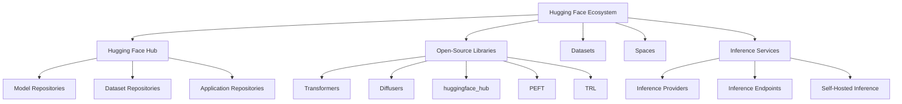
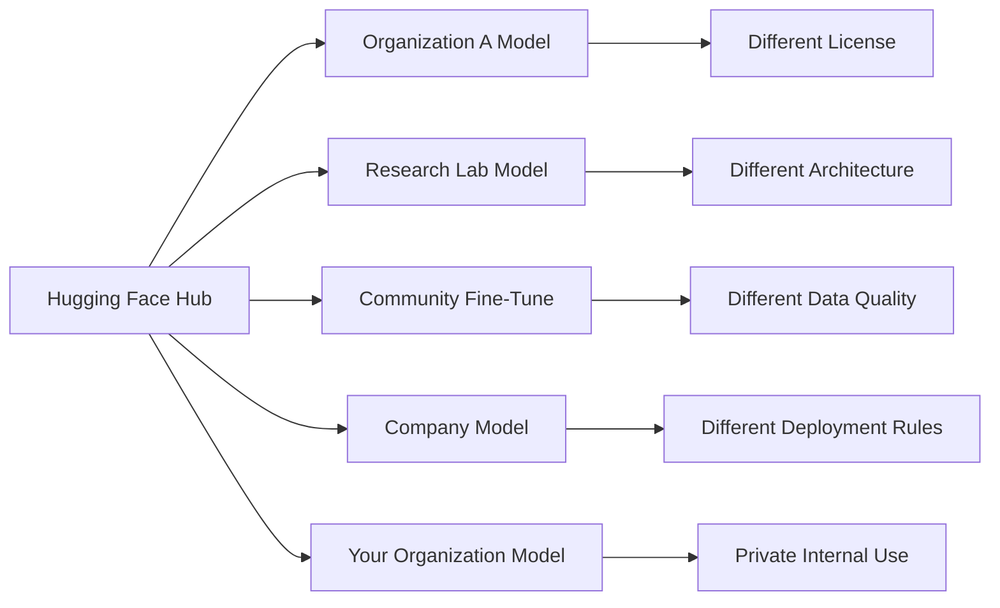
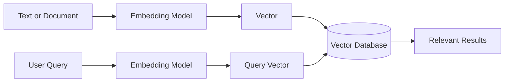
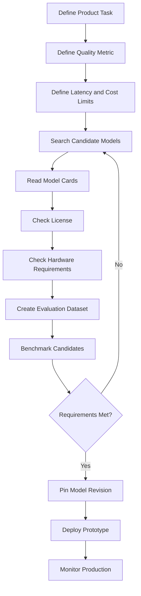
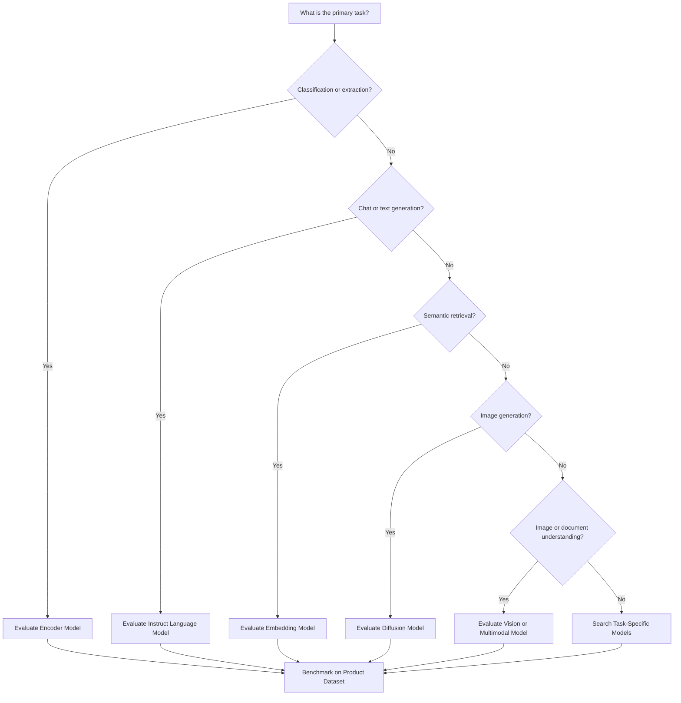
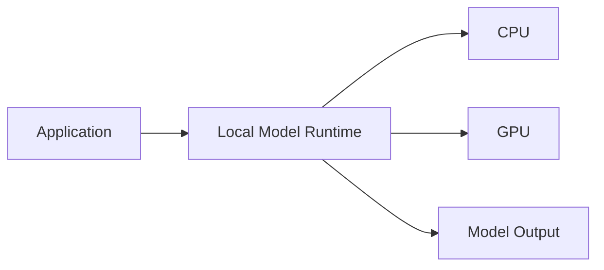
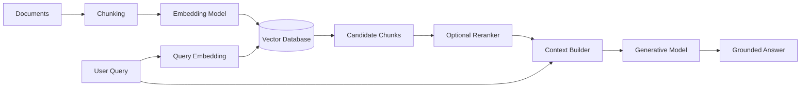
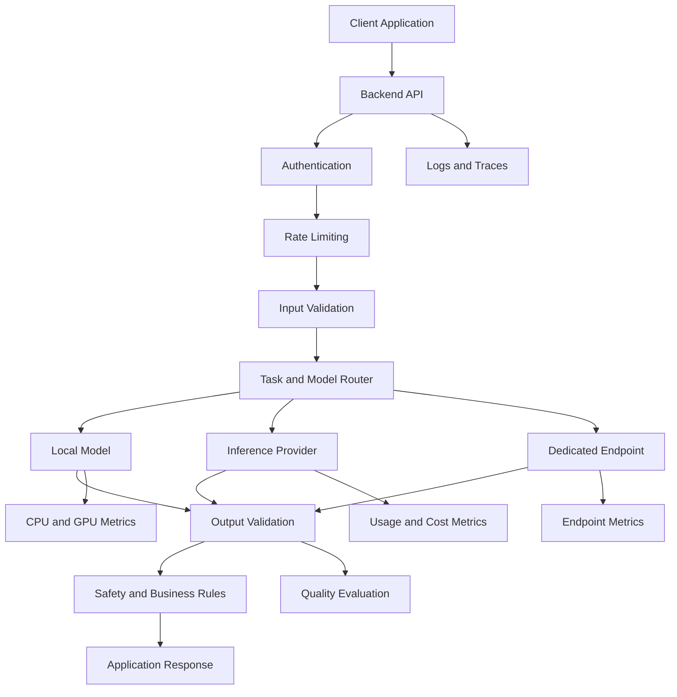
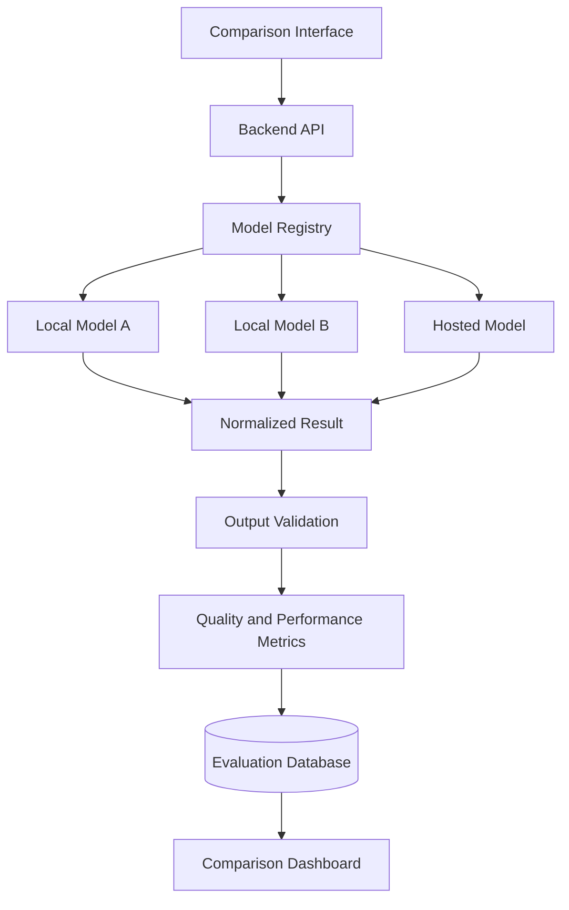

# 009 — Hugging Face Models

| Field                  | Details                                      |
| ---------------------- | -------------------------------------------- |
| **Course**             | 02 — Model Platforms and Prompting           |
| **Module**             | Module 03 — Using Pre-trained Models         |
| **Content Group**      | Popular AI Models                            |
| **Roadmap Source**     | Using Pre-trained Models / Popular AI Models |
| **Lesson Type**        | Model Selection                              |
| **Order in Module**    | 009                                          |
| **Suggested Duration** | 20 minutes                                   |

> **Documentation note:** The Hugging Face Hub changes continuously as model authors upload new versions, update licenses, revise model cards, and deprecate repositories. Verify the selected model, revision, license, dependencies, and deployment support before using it in production.

---

## 1. Summary

**Hugging Face Models** does not refer to one model family created by a single provider.

The **Hugging Face Hub** is a platform where individuals, research groups, and organizations can publish, discover, version, and share model repositories. These repositories may contain model weights, configurations, tokenizers, processors, source code, evaluation results, and model cards. Models can be downloaded with libraries such as `huggingface_hub` and `transformers`, or deployed through hosted inference services.

Hugging Face supports models for many tasks and modalities, including:

* Text generation
* Text classification
* Embedding generation
* Translation
* Question answering
* Image classification
* Object detection
* Image generation
* Speech recognition
* Audio classification
* Multimodal understanding
* Reinforcement learning
* Robotics

For an AI Engineer, Hugging Face is valuable because it provides access to a broad open-model ecosystem. However, this flexibility creates additional responsibilities.

You must evaluate:

* Model task and architecture
* Model size
* Quality on real product data
* Context length
* Hardware requirements
* License and usage restrictions
* Model-card completeness
* Security risks
* Quantization support
* Inference framework compatibility
* Latency and throughput
* Maintenance status
* Deployment cost

Open or downloadable model weights can offer greater control and customization, but they usually require more infrastructure and operational work than a fully managed model API.

---

## 2. Learning Objectives

After completing this lesson, you should be able to:

1. Explain what Hugging Face Models means.
2. Distinguish the Hugging Face Hub from a model provider.
3. Read and evaluate a model card.
4. Select a model based on task, quality, size, license, hardware, and product fit.
5. Run a pre-trained model locally with the `transformers` pipeline API.
6. Explain the difference between local inference, Inference Providers, Spaces, and Inference Endpoints.
7. Identify important model-repository files.
8. Explain quantization and model formats at a high level.
9. Record model version, latency, memory usage, and output quality.
10. Identify common security and production risks.
11. Add Hugging Face models to a model-comparison application.

---

## 3. The Hugging Face Ecosystem

Hugging Face is more than a collection of language models.



### 3.1 Model Hub

The Model Hub is used for:

* Model discovery
* Model storage
* Version management
* Model sharing
* Documentation
* Downloading weights and configuration files
* Connecting models to inference services

Model repositories can be integrated with `transformers`, `diffusers`, `sentence-transformers`, and other machine-learning libraries.

### 3.2 Datasets

The Hugging Face `datasets` library and Hub support datasets for text, image, and audio tasks. The library provides loading, processing, streaming, and sharing capabilities, with integration into the Hub.

### 3.3 Spaces

**Hugging Face Spaces** are commonly used to publish machine-learning demos and interactive applications.

A Space may use:

* Gradio
* Docker
* Static HTML

Spaces can be public, protected, or private, depending on the project configuration.

### 3.4 Inference Services

Hugging Face provides several ways to run models:

* Local inference
* Serverless Inference Providers
* Dedicated Inference Endpoints
* Self-managed model servers
* Interactive Spaces

Each method has different trade-offs in cost, latency, control, and operational complexity.

---

## 4. Hugging Face Is Not One Model Provider

A model repository may be published by:

* Hugging Face
* A cloud provider
* An AI laboratory
* A university
* An independent developer
* A commercial company
* An open-source community

For example, models on the Hub may come from organizations working on:

* General-purpose language models
* Code models
* Embedding models
* Vision-language models
* Speech models
* Diffusion models
* Scientific models
* Domain-specific classifiers

This means that quality, documentation, licensing, and maintenance can differ significantly between repositories.



Do not assume that a model is:

* Safe
* Accurate
* Commercially usable
* Properly evaluated
* Actively maintained

Simply because it appears on the Hugging Face Hub.

---

## 5. Common Model Categories

### 5.1 Encoder Models

Encoder models are designed to understand input representations.

Typical tasks include:

* Text classification
* Sentiment analysis
* Named Entity Recognition
* Embedding generation
* Semantic similarity
* Reranking
* Extractive question answering

Examples of model architecture families include BERT-style and RoBERTa-style models.

Encoder models are often smaller and faster than generative language models for classification and retrieval tasks.

---

### 5.2 Decoder-Only Models

Decoder-only models generate sequences one token at a time.

Typical tasks include:

* Chat
* Text generation
* Code generation
* Summarization
* Reasoning
* Tool calling
* Agent workflows

These models are commonly called **causal language models** or **generative language models**.

---

### 5.3 Encoder–Decoder Models

Encoder–decoder models process an input sequence and generate a different output sequence.

Typical tasks include:

* Translation
* Summarization
* Text transformation
* Question answering

T5-style models are a well-known example of this architecture pattern.

---

### 5.4 Embedding Models

Embedding models transform text, images, or other inputs into vectors.

Typical uses include:

* Semantic search
* RAG
* Recommendations
* Clustering
* Duplicate detection
* Similarity comparison



---

### 5.5 Vision Models

Vision models can perform tasks such as:

* Image classification
* Object detection
* Image segmentation
* Optical character recognition
* Image captioning
* Visual question answering

---

### 5.6 Diffusion Models

Diffusion models are commonly used for:

* Text-to-image generation
* Image editing
* Image inpainting
* Image-to-image transformation
* Video generation
* Audio generation

They are generally used through libraries such as `diffusers`.

---

### 5.7 Multimodal Models

Multimodal models can process more than one information type.

Examples include:

* Text and images
* Text and audio
* Text and video
* Documents containing text, tables, and images

A multimodal model may be appropriate for:

* Screenshot analysis
* PDF question answering
* Chart interpretation
* Visual customer support
* Image-based search
* Audio assistants

---

## 6. Understanding Model Repositories

A Hugging Face model repository may contain several important files.

```text
model-repository/
├── README.md
├── config.json
├── generation_config.json
├── tokenizer.json
├── tokenizer_config.json
├── special_tokens_map.json
├── model.safetensors
├── model-00001-of-00004.safetensors
├── model.safetensors.index.json
└── preprocessor_config.json
```

### Common Files

| File                           | Purpose                                                 |
| ------------------------------ | ------------------------------------------------------- |
| `README.md`                    | Model card and documentation                            |
| `config.json`                  | Model architecture and configuration                    |
| `generation_config.json`       | Default text-generation settings                        |
| `tokenizer.json`               | Tokenizer vocabulary and rules                          |
| `tokenizer_config.json`        | Tokenizer and chat-template configuration               |
| `special_tokens_map.json`      | Special token definitions                               |
| `model.safetensors`            | Model weights                                           |
| `model.safetensors.index.json` | Mapping for sharded weight files                        |
| `preprocessor_config.json`     | Image, audio, or multimodal preprocessing configuration |

Hugging Face documents `safetensors` as a safer and faster model-weight format than pickle-based formats. Large models may divide their weights across several sharded files.

---

## 7. Model Cards

A **model card** is the documentation attached to a model repository.

On the Hub, the model card is usually stored in `README.md` with Markdown content and YAML metadata. A model card should describe intended use, limitations, training information, datasets, evaluation results, biases, and ethical considerations.

### 7.1 What to Inspect

Before selecting a model, inspect:

| Area                  | Questions                                                   |
| --------------------- | ----------------------------------------------------------- |
| **Model description** | What architecture and task was the model designed for?      |
| **Intended use**      | Which use cases are supported?                              |
| **Out-of-scope use**  | Which uses should be avoided?                               |
| **License**           | Is commercial use, modification, or redistribution allowed? |
| **Training data**     | What data was used?                                         |
| **Languages**         | Which languages were tested?                                |
| **Evaluation**        | Which datasets and metrics were used?                       |
| **Limitations**       | What known failure cases exist?                             |
| **Bias and safety**   | Which risks are documented?                                 |
| **Hardware**          | What memory or accelerator is required?                     |
| **Example code**      | How should the model be loaded?                             |
| **Version**           | Which revision or checkpoint is being used?                 |

### 7.2 Model Card Review Template

```markdown
## Model Review

- Model ID:
- Repository owner:
- Revision:
- Task:
- Architecture:
- Parameter count:
- Context length:
- License:
- Supported languages:
- Training data:
- Evaluation datasets:
- Important metrics:
- Intended use:
- Limitations:
- Safety concerns:
- Required hardware:
- Quantization options:
- Inference framework:
- Production decision:
```

### 7.3 Warning Signs

Be careful when the model card:

* Does not identify a license
* Does not explain training data
* Contains no evaluation results
* Uses only self-reported examples
* Does not document limitations
* Does not identify supported languages
* Uses a custom implementation with no review
* Has not been updated for a long time
* Does not explain the expected prompt format
* Makes broad claims without reproducible evidence

---

## 8. License Evaluation

A model being downloadable does not automatically mean it can be used for any purpose.

A model license may restrict:

* Commercial use
* Redistribution
* Modification
* Hosted service usage
* High-risk applications
* Specific industries
* Training other models
* Use above a company-size threshold

Always record:

```text
Model ID
+ Repository owner
+ Model revision
+ License name
+ License version
+ Intended product use
+ Legal review status
```

### Important Distinction

```text
Public repository
        ≠
Unrestricted license
        ≠
Open-source software
        ≠
Commercially approved
```

When the license is absent or unclear, do not assume that production use is permitted.

---

## 9. Model Selection Framework

### 9.1 Selection Dimensions

| Dimension             | Evaluation Question                                        |
| --------------------- | ---------------------------------------------------------- |
| **Task fit**          | Was the model trained for the target task?                 |
| **Quality**           | Does it perform well on real product examples?             |
| **Model size**        | Can the infrastructure support it?                         |
| **Latency**           | Is response time acceptable?                               |
| **Throughput**        | Can it handle the expected request volume?                 |
| **Memory**            | How much CPU, RAM, or VRAM is required?                    |
| **Context length**    | Can it process the required input?                         |
| **Language support**  | Was it evaluated in the target language?                   |
| **License**           | Is the intended use permitted?                             |
| **Safety**            | Are risks and limitations documented?                      |
| **Framework support** | Does it work with the planned runtime?                     |
| **Quantization**      | Are lower-precision versions available?                    |
| **Maintenance**       | Is the repository actively maintained?                     |
| **Deployment fit**    | Can it run locally, on an endpoint, or through a provider? |

---

### 9.2 Selection Workflow



---

### 9.3 Decision Tree



---

## 10. Model Size and Hardware

Model parameter count is one factor affecting memory and computation.

A larger model may provide stronger capabilities, but it may also require:

* More GPU memory
* Higher inference cost
* Longer startup time
* Greater storage
* More complex distributed serving
* Lower throughput

A smaller specialized model may outperform a larger general-purpose model on a narrow task.

### Example Selection

```text
Task:
Classify customer tickets into six categories

Option A:
Large generative language model

Option B:
Small fine-tuned encoder model

Possible result:
The smaller encoder model may be faster, cheaper, easier to validate,
and sufficiently accurate for the classification task.
```

Do not use a large language model for every machine-learning problem.

---

## 11. Quantization

**Quantization** reduces the numerical precision used to store or execute model weights.

Common precision levels include:

* FP32
* FP16
* BF16
* INT8
* INT4

Potential benefits:

* Lower memory use
* Faster loading
* Lower inference cost
* Ability to run larger models on smaller hardware

Potential trade-offs:

* Reduced output quality
* Hardware-specific behavior
* Unsupported operations
* Different performance across frameworks
* Additional configuration complexity

### Quantization Decision

```text
Original Model
      ↓
Measure Baseline Quality
      ↓
Create or Select Quantized Version
      ↓
Measure Quality and Latency Again
      ↓
Deploy Only If Product Requirements Are Met
```

Never assume that a quantized model has identical behavior to its original checkpoint.

---

## 12. Model Formats

### 12.1 Safetensors

`safetensors` is commonly used for secure and efficient model-weight serialization. Hugging Face describes it as a safer alternative to pickle-based weight files.

### 12.2 GGUF

GGUF is a model format optimized for efficient loading and inference with runtimes in the GGML ecosystem, including tools based on `llama.cpp`. The Hub provides built-in support for GGUF repositories and metadata.

### 12.3 Framework-Specific Formats

Other formats may be designed for:

* PyTorch
* TensorFlow
* ONNX Runtime
* TensorRT
* OpenVINO
* MLX
* Core ML

Select a format based on the production runtime rather than popularity alone.

---

## 13. Ways to Run Hugging Face Models

### 13.1 Local Inference

The model is downloaded and executed on your own machine or server.



#### Advantages

* Full infrastructure control
* Offline operation
* Data can remain inside the environment
* Custom optimization
* No per-request provider dependency

#### Challenges

* Hardware management
* Memory requirements
* Scaling
* Model downloads
* Runtime compatibility
* Monitoring
* Security updates

---

### 13.2 Inference Providers

Hugging Face Inference Providers offer unified access to models running through supported inference partners. The Python and JavaScript SDKs provide a consistent interface across providers.


This is useful for:

* Rapid prototyping
* Comparing providers
* Avoiding initial GPU setup
* Testing different open models
* Serverless workloads

---

### 13.3 Inference Endpoints

Inference Endpoints provide dedicated managed infrastructure for production model deployment.

The service supports features such as autoscaling, logs, metrics, Hub integration, and multiple inference engines, including vLLM, TGI, SGLang, TEI, and `llama.cpp`.


This is appropriate when the product needs:

* Dedicated capacity
* Stable model deployment
* Autoscaling
* Private endpoints
* Managed observability
* Production-grade infrastructure

---

### 13.4 Hugging Face Spaces

Spaces are useful for:

* Portfolio demonstrations
* Internal prototypes
* Model showcases
* Interactive evaluation tools
* Gradio-based applications

Spaces should not automatically be treated as the final production architecture for high-volume or sensitive systems.

---

### 13.5 Self-Hosted Model Servers

Models may also be deployed through systems such as:

* vLLM
* Text Generation Inference
* SGLang
* llama.cpp
* Text Embeddings Inference
* Custom containers

Self-hosting offers control but requires your team to manage infrastructure, scaling, logging, monitoring, and security.

---

## 14. The Transformers Pipeline API

The `pipeline` API is a high-level interface for performing inference with supported models.

It handles much of the following automatically:

* Loading the model
* Loading the tokenizer or processor
* Preprocessing inputs
* Running inference
* Postprocessing outputs

The pipeline API supports tasks across text, vision, and audio, and can run on CPUs, GPUs, and Apple Silicon.

### Basic Pattern

```python
from transformers import pipeline

classifier = pipeline(
    task="text-classification",
    model="model-owner/model-name",
)

result = classifier("The application works very well.")
print(result)
```

For production, explicitly set the model rather than relying on a default model that may change.

---

## 15. Practical Local Demo

### 15.1 Demo Goal

Build a small feature that:

1. Loads a sentiment-analysis model from the Hub.
2. Runs it locally.
3. Measures model-loading time.
4. Measures inference latency.
5. Records the model ID and revision.
6. Handles invalid input.

### 15.2 Installation

```bash
pip install -U transformers torch
```

### 15.3 Python Demo

```python
import os
import time
from typing import Any

import torch
from transformers import pipeline


MODEL_ID = os.getenv(
    "HF_MODEL_ID",
    "distilbert/distilbert-base-uncased-finetuned-sst-2-english",
)

MODEL_REVISION = os.getenv("HF_MODEL_REVISION", "main")


def create_classifier() -> tuple[Any, float, str]:
    """
    Load the model and return:
    - the pipeline,
    - loading time in milliseconds,
    - selected device.
    """
    device = 0 if torch.cuda.is_available() else -1
    device_name = (
        torch.cuda.get_device_name(0)
        if torch.cuda.is_available()
        else "cpu"
    )

    started_at = time.perf_counter()

    classifier = pipeline(
        task="text-classification",
        model=MODEL_ID,
        revision=MODEL_REVISION,
        device=device,
    )

    load_time_ms = round(
        (time.perf_counter() - started_at) * 1000,
        2,
    )

    return classifier, load_time_ms, device_name


def analyze_sentiment(
    classifier: Any,
    text: str,
) -> dict[str, object]:
    normalized_text = text.strip()

    if not normalized_text:
        raise ValueError("The input text must not be empty.")

    started_at = time.perf_counter()

    outputs = classifier(
        normalized_text,
        truncation=True,
    )

    latency_ms = round(
        (time.perf_counter() - started_at) * 1000,
        2,
    )

    if not outputs:
        raise RuntimeError("The model returned no predictions.")

    prediction = outputs[0]

    return {
        "model_id": MODEL_ID,
        "model_revision": MODEL_REVISION,
        "label": prediction["label"],
        "score": round(float(prediction["score"]), 6),
        "latency_ms": latency_ms,
        "input_characters": len(normalized_text),
    }


if __name__ == "__main__":
    classifier, load_time_ms, device_name = create_classifier()

    print(f"Model: {MODEL_ID}")
    print(f"Revision: {MODEL_REVISION}")
    print(f"Device: {device_name}")
    print(f"Load time: {load_time_ms} ms")

    samples = [
        "The application is fast and easy to use.",
        "The payment flow is confusing and frequently crashes.",
    ]

    for sample in samples:
        result = analyze_sentiment(classifier, sample)

        print("\nInput:", sample)
        print("Label:", result["label"])
        print("Score:", result["score"])
        print("Latency:", result["latency_ms"], "ms")
```

The high-level pipeline API can be configured with a task identifier and a model ID from the Hub.

---

## 16. Batch Inference

Running inputs individually can create unnecessary overhead.

```python
samples = [
    "The interface is excellent.",
    "The application is extremely slow.",
    "The feature is acceptable but not impressive.",
]

results = classifier(
    samples,
    batch_size=3,
    truncation=True,
)

for sample, result in zip(samples, results):
    print(sample)
    print(result)
```

Batch inference may improve throughput, but the optimal batch size depends on:

* Input length
* Model architecture
* Available memory
* CPU or GPU
* Latency requirements
* Runtime implementation

Measure rather than guessing.

---

## 17. Hosted Inference Demo

For a hosted generative model, the `huggingface_hub` library provides an `InferenceClient`.

### Installation

```bash
pip install -U huggingface_hub
```

Set the token and model:

```bash
export HF_TOKEN="your-token"
export HF_CHAT_MODEL="model-owner/model-name"
```

### Python Example

```python
import os
import time

from huggingface_hub import InferenceClient


def generate_answer(question: str) -> dict[str, object]:
    normalized_question = question.strip()

    if not normalized_question:
        raise ValueError("The question must not be empty.")

    token = os.getenv("HF_TOKEN")
    model_id = os.getenv("HF_CHAT_MODEL")

    if not token:
        raise RuntimeError("HF_TOKEN is missing.")

    if not model_id:
        raise RuntimeError("HF_CHAT_MODEL is missing.")

    client = InferenceClient(
        provider="auto",
        api_key=token,
    )

    started_at = time.perf_counter()

    response = client.chat.completions.create(
        model=model_id,
        messages=[
            {
                "role": "system",
                "content": (
                    "You are a concise technical assistant. "
                    "Do not invent unsupported information."
                ),
            },
            {
                "role": "user",
                "content": normalized_question,
            },
        ],
        max_tokens=300,
        temperature=0.2,
    )

    latency_ms = round(
        (time.perf_counter() - started_at) * 1000,
        2,
    )

    return {
        "model_id": model_id,
        "latency_ms": latency_ms,
        "response": response.choices[0].message.content,
    }
```

The current `InferenceClient` supports chat-completion requests and can communicate with Hugging Face-routed providers, dedicated endpoints, or compatible local model servers.

---

## 18. FastAPI Demo

```python
import os
import time
from typing import Any

import torch
from fastapi import FastAPI, HTTPException
from pydantic import BaseModel, Field
from transformers import pipeline


MODEL_ID = os.getenv(
    "HF_MODEL_ID",
    "distilbert/distilbert-base-uncased-finetuned-sst-2-english",
)

MODEL_REVISION = os.getenv("HF_MODEL_REVISION", "main")

device = 0 if torch.cuda.is_available() else -1

classifier = pipeline(
    task="text-classification",
    model=MODEL_ID,
    revision=MODEL_REVISION,
    device=device,
)

app = FastAPI(title="Hugging Face Sentiment API")


class SentimentRequest(BaseModel):
    text: str = Field(min_length=1, max_length=5_000)


class SentimentResponse(BaseModel):
    model_id: str
    model_revision: str
    label: str
    score: float
    latency_ms: float


@app.post(
    "/analyze-sentiment",
    response_model=SentimentResponse,
)
def analyze_sentiment(
    payload: SentimentRequest,
) -> SentimentResponse:
    started_at = time.perf_counter()

    try:
        outputs: list[dict[str, Any]] = classifier(
            payload.text,
            truncation=True,
        )
    except Exception as exc:
        raise HTTPException(
            status_code=500,
            detail="The model could not process the request.",
        ) from exc

    if not outputs:
        raise HTTPException(
            status_code=502,
            detail="The model returned no prediction.",
        )

    latency_ms = round(
        (time.perf_counter() - started_at) * 1000,
        2,
    )

    prediction = outputs[0]

    return SentimentResponse(
        model_id=MODEL_ID,
        model_revision=MODEL_REVISION,
        label=str(prediction["label"]),
        score=float(prediction["score"]),
        latency_ms=latency_ms,
    )
```

Run the API:

```bash
uvicorn main:app --reload
```

Test it:

```bash
curl -X POST "http://localhost:8000/analyze-sentiment" \
  -H "Content-Type: application/json" \
  -d '{
    "text": "The product is useful, but the mobile application is slow."
  }'
```

---

## 19. Hugging Face Models in RAG

Hugging Face models can be used at several stages of a RAG system.



Possible model roles include:

* Embedding model
* Reranking model
* Query-rewriting model
* Answer-generation model
* Citation-validation model
* Classification or routing model

A product does not need to use the same model for every stage.

### Example Routing

```text
Small classifier
    → determine request type

Embedding model
    → retrieve documents

Reranker
    → improve result order

Instruction model
    → write final answer
```

---

## 20. Security Considerations

Downloading and executing model repositories introduces security risks.

The Hugging Face Hub provides features including access tokens, private repositories, malware scanning, pickle scanning, resource groups, MFA, and commit signatures.

### Security Checklist

* Review repository ownership.
* Inspect the model card.
* Prefer safe weight formats when available.
* Avoid executing unreviewed custom code.
* Pin model revisions.
* Scan dependencies.
* Restrict network access.
* Use read-only or fine-grained tokens.
* Store tokens in a secret manager.
* Do not expose Hub tokens in frontend code.
* Test models in an isolated environment.
* Maintain an approved-model registry.

### Token Permissions

Hugging Face recommends User Access Tokens for authenticating applications and notebooks. Token roles include fine-grained, read, and write permissions, with fine-grained tokens recommended for production use.

Recommended pattern:

```text
One production application
        ↓
One fine-grained token
        ↓
Only required model access
```

Avoid sharing one broad write token across multiple systems.

---

## 21. Model Revision Pinning

Using only a model ID may load a different repository state after the repository is updated.

### Weak Configuration

```python
pipeline(
    "text-classification",
    model="organization/model",
)
```

### Better Configuration

```python
pipeline(
    "text-classification",
    model="organization/model",
    revision="specific-tag-or-commit",
)
```

Record:

* Model ID
* Revision or commit hash
* Tokenizer revision
* Runtime version
* Quantization
* Prompt template
* Deployment date

This makes model behavior easier to reproduce and audit.

---

## 22. Chat Templates

Instruction and chat models may expect specific control tokens and message formatting.

The tokenizer configuration may define:

* Beginning-of-sequence token
* End-of-sequence token
* System-message format
* User-message format
* Assistant-message format
* Tool-call format
* Image placeholder tokens

Do not format every chat model using the same prompt syntax.

Use the tokenizer’s supported chat template when available.

```python
messages = [
    {
        "role": "system",
        "content": "You are a helpful assistant.",
    },
    {
        "role": "user",
        "content": "Explain vector search.",
    },
]

formatted_prompt = tokenizer.apply_chat_template(
    messages,
    tokenize=False,
    add_generation_prompt=True,
)
```

Incorrect formatting can significantly reduce output quality even when the underlying model is strong.

---

## 23. Logging and Observability

A production model request should generate useful operational data.

### Example Log

```json
{
  "request_id": "req_01HF123",
  "feature": "sentiment_analysis",
  "provider": "local_hugging_face",
  "model_id": "distilbert/distilbert-base-uncased-finetuned-sst-2-english",
  "model_revision": "pinned-revision",
  "runtime": "transformers",
  "runtime_version": "configured-version",
  "device": "cuda",
  "precision": "fp16",
  "latency_ms": 18.72,
  "input_characters": 86,
  "status": "success"
}
```

### Important Metrics

* Model load time
* Cold-start latency
* Warm-request latency
* P50 latency
* P95 latency
* P99 latency
* Requests per second
* Batch size
* CPU utilization
* GPU utilization
* GPU memory
* System memory
* Input tokens
* Output tokens
* Error rate
* Timeout rate
* Quality score
* Cost per successful task

### Measure Cold and Warm Performance Separately

```text
Cold Start:
Download or read files
→ initialize model
→ move weights to device
→ first request

Warm Request:
Model already loaded
→ process input
→ generate output
```

Cold-start latency can be significantly greater than normal request latency.

---

## 24. Model Evaluation

Do not select a model using only its Hub popularity or one demonstration.

Create a representative evaluation dataset.

### Example Classification Case

```json
{
  "id": "ticket_014",
  "input": "I was charged twice for the same subscription.",
  "expected_category": "billing",
  "expected_sentiment": "negative"
}
```

### Example Generative Case

```json
{
  "id": "summary_009",
  "input": "Long source document...",
  "required_facts": [
    "The launch date changed.",
    "The new deadline is August 12."
  ],
  "forbidden_claims": [
    "The project was canceled."
  ],
  "maximum_words": 80
}
```

### Evaluation Dimensions

| Dimension             | Example Measurement           |
| --------------------- | ----------------------------- |
| Correctness           | Accuracy or human score       |
| Instruction following | Pass or fail                  |
| Format compliance     | Schema validation             |
| Completeness          | Required facts included       |
| Hallucination         | Unsupported claims            |
| Language quality      | Human or model-assisted score |
| Latency               | Milliseconds                  |
| Throughput            | Requests per second           |
| Memory                | Peak RAM or VRAM              |
| Cost                  | Cost per successful task      |

---

## 25. Weighted Model Score

```text
Total Score =
    Task Quality × 0.30
  + Reliability × 0.15
  + Latency × 0.15
  + Throughput × 0.10
  + Memory Efficiency × 0.10
  + License Fit × 0.10
  + Maintenance Quality × 0.05
  + Deployment Fit × 0.05
```

Weights should change according to the product.

Examples:

* A mobile application should prioritize memory and latency.
* A legal assistant should prioritize accuracy and traceability.
* A batch classification system should prioritize throughput.
* An offline product should prioritize local deployment.
* A commercial product should treat license fit as mandatory rather than optional.

---

## 26. Common Production Failures

### 26.1 Selecting Models by Download Count

#### Problem

The team assumes that the most downloaded model is the best model.

#### Why It Fails

Download count does not directly measure:

* Product accuracy
* Safety
* Vietnamese quality
* Latency
* License suitability
* Maintenance quality

#### Better Approach

Benchmark multiple candidates on real product data.

---

### 26.2 Ignoring the License

#### Problem

A prototype uses a model that cannot legally support the intended commercial workflow.

#### Prevention

Include license approval in the deployment checklist.

---

### 26.3 Not Pinning the Revision

#### Problem

The repository changes and production behavior becomes difficult to reproduce.

#### Prevention

Pin the model revision and record it in logs.

---

### 26.4 Using a Generative Model for Simple Classification

#### Problem

A large language model is used for a task that could be handled by a small encoder.

#### Impact

* Higher cost
* Higher latency
* More variable outputs
* Harder validation

#### Solution

Compare task-specific models before selecting an LLM.

---

### 26.5 Ignoring Chat Templates

#### Problem

The application sends incorrectly formatted messages.

#### Impact

* Reduced instruction following
* Repeated text
* Unexpected role behavior
* Poor output quality

#### Solution

Use the tokenizer’s supported template.

---

### 26.6 Trusting Community Code Automatically

#### Problem

The application executes custom repository code without review.

#### Prevention

* Inspect the implementation.
* Pin the revision.
* Test in isolation.
* Avoid unnecessary remote code.
* Use an internal approval process.

---

### 26.7 Loading a Model That Does Not Fit in Memory

#### Symptoms

* Out-of-memory error
* Process termination
* Very slow swapping
* Model load failure

#### Possible Fixes

* Use a smaller model.
* Use quantization.
* Reduce batch size.
* Use a different precision.
* Use CPU offloading.
* Use multiple GPUs.
* Use a hosted endpoint.

---

### 26.8 Measuring Only Warm Latency

#### Problem

Testing starts after the model is already loaded.

#### Impact

The real startup experience is hidden.

#### Solution

Measure both cold-start and warm-request latency.

---

### 26.9 Exposing Access Tokens

#### Problem

A token is included in mobile or frontend source code.

#### Recommended Architecture

```text
Browser or Mobile App
        ↓
Authenticated Backend
        ↓
Hugging Face Service
```

Use fine-grained tokens with only the required permissions.

---

### 26.10 No Fallback Strategy

Define what happens when:

* Model files cannot be downloaded
* GPU memory is unavailable
* The endpoint times out
* The repository becomes gated
* The model is deleted
* A provider becomes unavailable
* Output validation fails

Possible fallbacks include:

* Smaller local model
* Backup hosted model
* Cached response
* Rule-based result
* Human-review queue
* Clear temporary error message

---

## 27. Production Architecture



### Recommended Components

* Model registry
* License registry
* Revision pinning
* Secret management
* Input validation
* Model routing
* Timeouts
* Retry policy
* Output validation
* Safety checks
* Hardware monitoring
* Cost monitoring
* Evaluation dataset
* Fallback behavior
* Audit logging

---

## 28. Practical Exercises

### Exercise 1 — Five-Line Summary

Without reviewing the lesson, explain:

1. What the Hugging Face Hub is
2. What a model card contains
3. Why licenses matter
4. How local and hosted inference differ
5. How you would select a model

---

### Exercise 2 — Model Card Review

Select three models for the same task.

Complete this table:

| Criterion            | Model A | Model B | Model C |
| -------------------- | ------- | ------- | ------- |
| Model ID             |         |         |         |
| Task                 |         |         |         |
| Architecture         |         |         |         |
| Parameters           |         |         |         |
| License              |         |         |         |
| Languages            |         |         |         |
| Evaluation data      |         |         |         |
| Limitations          |         |         |         |
| Model format         |         |         |         |
| Hardware requirement |         |         |         |
| Maintenance status   |         |         |         |

---

### Exercise 3 — Local Pipeline

Build a Python script that:

* Loads a task-specific model
* Processes five inputs
* Measures loading time
* Measures each request
* Tests batch inference
* Logs model ID and revision
* Handles empty input
* Handles model-loading errors

---

### Exercise 4 — Quantization Comparison

Compare an original model and a quantized version.

| Metric        | Original | Quantized |
| ------------- | -------: | --------: |
| Model size    |          |           |
| Peak memory   |          |           |
| Loading time  |          |           |
| P50 latency   |          |           |
| P95 latency   |          |           |
| Quality score |          |           |

---

### Exercise 5 — Deployment Comparison

Compare:

* Local pipeline
* Inference Provider
* Dedicated endpoint

| Dimension              | Local | Provider | Endpoint |
| ---------------------- | ----: | -------: | -------: |
| Setup effort           |       |          |          |
| Cold-start latency     |       |          |          |
| Warm latency           |       |          |          |
| Infrastructure control |       |          |          |
| Scaling complexity     |       |          |          |
| Privacy control        |       |          |          |
| Cost                   |       |          |          |
| Observability          |       |          |          |

---

### Exercise 6 — Production Failure Report

```markdown
## Failure

The production service loaded a newer model revision and classification
accuracy decreased.

## Impact

More support tickets were routed to the wrong team.

## Detection

The category accuracy metric dropped after a server restart.

## Root Cause

The application used the repository's default branch instead of a
pinned model revision.

## Immediate Fix

Restore the previously tested revision.

## Permanent Fix

Pin the model and tokenizer revisions in configuration.

## Prevention

Run the evaluation dataset before approving any model revision.
```

---

## 29. Completion Checklist

### Understanding

* [ ] I can explain Hugging Face Models in one or two minutes.
* [ ] I understand that Hugging Face is not one model provider.
* [ ] I can explain the Model Hub.
* [ ] I can read a model card.
* [ ] I understand why licenses matter.
* [ ] I can distinguish encoder, decoder, embedding, and diffusion models.
* [ ] I understand local and hosted inference options.
* [ ] I understand quantization at a high level.
* [ ] I know why model revisions should be pinned.

### Implementation

* [ ] I have loaded a model with `transformers`.
* [ ] I have used the pipeline API.
* [ ] I record the model ID and revision.
* [ ] I measure model-loading time.
* [ ] I measure request latency.
* [ ] I have tested batch inference.
* [ ] I handle invalid input.
* [ ] I have tested at least one failure case.

### Production Readiness

* [ ] The model license has been reviewed.
* [ ] The model revision is pinned.
* [ ] Access tokens are stored securely.
* [ ] The selected model fits available hardware.
* [ ] Cold and warm latency are measured separately.
* [ ] Memory usage is monitored.
* [ ] A representative evaluation dataset exists.
* [ ] Fallback behavior is documented.
* [ ] Model files and custom code have been reviewed.
* [ ] Model changes require regression testing.

---

## 30. Related Outcome

> Choose pre-trained AI models based on capability, context length, latency, cost, safety, license, deployment requirements, and product fit.

A strong model-selection explanation could be:

```text
We selected this Hugging Face encoder model because it achieved the
required ticket-classification accuracy while using less memory and
responding faster than the larger generative candidates.

Its license permits our intended commercial use, its revision is
pinned, and it can run on our existing CPU infrastructure.
```

A weak explanation would be:

```text
We selected it because it has many downloads on Hugging Face.
```

---

## 31. Related Project

# Project 2 — Model Comparison App

Build an application that compares two or three Hugging Face models using the same evaluation dataset.

### Example Comparisons

```text
Small encoder classifier
vs.
Larger encoder classifier
vs.
Generative instruction model
```

Or:

```text
Original model
vs.
8-bit model
vs.
4-bit model
```

Or:

```text
Local Transformers pipeline
vs.
Inference Provider
vs.
Dedicated Inference Endpoint
```

### Required Features

* Task selection
* Model ID input
* Model revision input
* Model-card summary
* License display
* Side-by-side outputs
* Model-loading time
* Request latency
* Batch throughput
* Memory usage
* Quality score
* Error status
* Result history

### Suggested Architecture



### Normalized Result

```json
{
  "provider": "hugging_face_local",
  "model_id": "organization/model-name",
  "model_revision": "pinned-revision",
  "task": "text-classification",
  "response": {
    "label": "positive",
    "score": 0.984
  },
  "load_time_ms": 2142.8,
  "latency_ms": 18.7,
  "peak_memory_mb": 492,
  "quality_score": 4.5,
  "status": "success",
  "error": null
}
```

### Evaluation Dataset

Include cases covering:

* Normal input
* Empty input
* Long input
* Typographical errors
* Vietnamese input
* English input
* Mixed-language input
* Ambiguous input
* Adversarial input
* Historical production failures

### Final Project Questions

1. Which model produced the best task quality?
2. Which model had the lowest latency?
3. Which model used the least memory?
4. Did quantization reduce quality?
5. Which model had the clearest model card?
6. Which licenses support the product?
7. Which model performed best in Vietnamese?
8. Which deployment method had the best operational fit?
9. Which model should be used in production?
10. Which fallback model should be configured?

---

## 32. Suggested 20-Minute Lesson Plan

|          Time | Activity                             |
| ------------: | ------------------------------------ |
|   0–3 minutes | Explain the Hugging Face ecosystem   |
|   3–6 minutes | Review model categories              |
|  6–10 minutes | Read a model card and license        |
| 10–14 minutes | Run the local pipeline demo          |
| 14–17 minutes | Compare deployment options           |
| 17–19 minutes | Review production risks              |
| 19–20 minutes | Assign the model-comparison exercise |

---

## 33. Key Takeaways

1. Hugging Face Models does not refer to one model family.
2. The Hugging Face Hub hosts repositories from many organizations and developers.
3. Model cards document intended use, evaluation, limitations, and other important information.
4. A public or downloadable model is not automatically approved for commercial use.
5. Task-specific models may outperform larger general-purpose models on narrow tasks.
6. The `transformers` pipeline API provides a simple way to run models locally.
7. Models can also be used through Inference Providers, Inference Endpoints, Spaces, or self-hosted servers.
8. Model ID, revision, tokenizer, runtime, and quantization should be recorded.
9. Model revisions should be pinned for reproducibility.
10. Quantization can reduce memory requirements but may affect output quality.
11. Chat models require the correct chat template.
12. Safe weight formats and repository security must be considered.
13. Model popularity is not a substitute for product evaluation.
14. Cold-start latency and warm latency should be measured separately.
15. The best model is the one that meets the product’s measured quality, cost, safety, license, and deployment requirements.

---

## 34. Final Summary

**Hugging Face Models** are an important part of the modern AI Engineer roadmap because the Hugging Face ecosystem provides access to a wide variety of open, gated, public, private, task-specific, and general-purpose models.

A capable AI Engineer should be able to:

* Search for relevant model candidates
* Read model cards critically
* Check model licenses
* Identify the correct architecture for a task
* Load models with `transformers`
* Compare local and hosted inference
* Evaluate memory and hardware requirements
* Use quantization appropriately
* Pin model revisions
* Secure Hub access tokens
* Benchmark models using real product data
* Monitor latency, memory, quality, and failures
* Explain why a selected model fits the product

Turn this lesson into a local inference demo, model-card comparison, quantization experiment, RAG pipeline, inference endpoint, Hugging Face Space, or model-evaluation dashboard so that the knowledge becomes practical engineering experience.
