# 010 — Azure AI

| Field                  | Details                                                |
| ---------------------- | ------------------------------------------------------ |
| **Course**             | 02 — Model Platforms and Prompting                     |
| **Module**             | Module 03 — Using Pre-trained Models                   |
| **Content Group**      | Cloud and Managed Platforms                            |
| **Roadmap Source**     | Using Pre-trained Models / Cloud and Managed Platforms |
| **Lesson Type**        | Model Selection                                        |
| **Order in Module**    | 010                                                    |
| **Suggested Duration** | 20 minutes                                             |

> **Current terminology:** Microsoft has evolved the previous **Azure AI Studio / Azure AI Foundry** experience into **Microsoft Foundry**. It is now the unified Azure platform for models, AI applications, agents, tools, evaluation, monitoring, security, and governance.

> **Documentation note:** Model names, regions, quotas, deployment types, preview features, prices, and API capabilities change frequently. Always confirm the current Microsoft documentation before production deployment.

---

## 1. Summary

**Azure AI** is a broad collection of Microsoft Azure services for building, deploying, securing, evaluating, and operating artificial intelligence applications.

The current central development platform is **Microsoft Foundry**, previously known as Azure AI Studio and Azure AI Foundry. Microsoft Foundry combines:

* Model discovery and deployment
* Azure OpenAI models
* Models from Microsoft and other providers
* Prompt and multimodal application development
* Retrieval-Augmented Generation
* AI agents and tool calling
* Evaluation and observability
* Content safety
* Authentication and authorization
* Enterprise networking and governance

Microsoft describes Foundry as a unified Azure platform-as-a-service for enterprise AI operations, model builders, and application development. It brings models, agents, tools, evaluations, monitoring, networking, and access control into one management environment.

For an AI Engineer, Azure AI is relevant when a product requires:

* Managed AI infrastructure
* Enterprise access control
* Integration with existing Azure services
* Private networking
* Multiple model providers
* Production monitoring
* RAG over organizational data
* Agent workflows
* Safety and compliance controls
* Regional deployment choices
* Centralized cost and resource management

Learning Azure AI is not only about calling an API. It is about understanding how a model becomes part of a reliable cloud application.

---

## 2. Learning Objectives

After completing this lesson, you should be able to:

1. Explain Azure AI and Microsoft Foundry in your own words.
2. Distinguish Microsoft Foundry, Azure OpenAI, Azure AI Search, and Azure AI Content Safety.
3. Explain the difference between a model and a model deployment.
4. Select models according to quality, latency, cost, region, quota, and product fit.
5. Send a request through a Microsoft Foundry project.
6. Explain how the Responses API fits into modern Azure AI applications.
7. Design a basic RAG architecture with Azure AI Search.
8. Explain how Foundry Agent Service connects models to tools.
9. Use Microsoft Entra ID for production authentication.
10. Record model version, deployment, token usage, latency, and quality.
11. Identify common production failures and debugging methods.
12. Add Azure-hosted models to a model-comparison application.

---

## 3. What Is Azure AI?

Azure AI is not one model and not one API.

It is an ecosystem of cloud services that can support the entire AI application lifecycle.

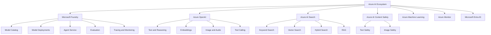

### Core Idea

```text
Model
+ Cloud deployment
+ Data retrieval
+ Authentication
+ Safety controls
+ Evaluation
+ Monitoring
= Production AI application
```

---

## 4. Microsoft Foundry

**Microsoft Foundry** is the primary platform for developing and operating modern AI applications on Azure.

It provides:

* A model catalog
* Projects and environments
* Model playgrounds
* Model deployments
* Responses API access
* Agent development
* Tool integrations
* Evaluation datasets
* Built-in evaluators
* Tracing
* Production monitoring
* Role-based access control
* Networking and policy integration

The platform consolidates several previous Azure AI experiences. The current architecture uses a Foundry resource containing projects, with a unified project endpoint and newer SDKs.

### Foundry Project Structure

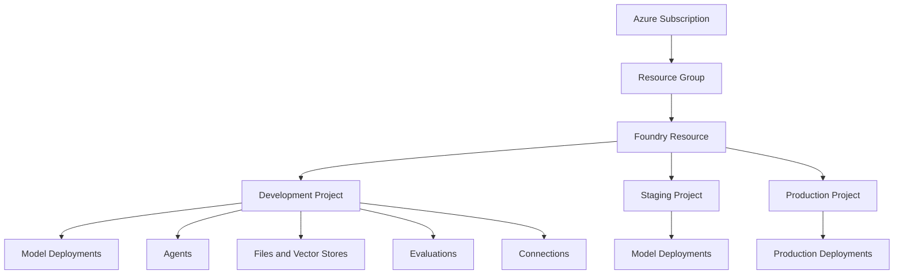

Projects help separate:

* Development and production assets
* Permissions
* Data
* Evaluation runs
* Connections
* Agent state
* Model configurations

---

## 5. Main Azure AI Components

### 5.1 Foundry Models

Foundry provides a catalog containing Azure OpenAI models and selected models from providers and communities.

Microsoft categorizes catalog models broadly as:

1. **Models sold directly by Azure**
2. **Models from partners and community**

Direct Azure models are hosted and operated through Azure, billed through the Azure subscription, and supported by Microsoft. The catalog can also include models from providers such as Microsoft, OpenAI, Meta, Mistral, Cohere, DeepSeek, xAI, and others.

---

### 5.2 Azure OpenAI

Azure OpenAI provides access to OpenAI model capabilities through Azure infrastructure and management controls.

Possible workloads include:

* Text generation
* Complex reasoning
* Code generation
* Structured extraction
* Multimodal understanding
* Embeddings
* Image generation
* Audio processing
* Tool calling
* Stateful conversations

The available models and capabilities depend on:

* Azure region
* Subscription
* Quota
* Deployment type
* Model lifecycle
* API support

---

### 5.3 Azure AI Search

Azure AI Search is a managed search service that supports:

* Full-text keyword search
* Vector search
* Hybrid search
* Semantic ranking
* Filtering
* Integrated chunking
* Integrated vectorization
* Document indexing
* RAG workflows

Vector search finds semantically similar content through embeddings. Hybrid search combines keyword and vector queries in one request and merges their results.

---

### 5.4 Foundry Agent Service

Foundry Agent Service is a managed platform for building, deploying, and scaling AI agents.

An agent can combine:

* A model
* Instructions
* Conversation state
* Tools
* Files
* Enterprise data
* APIs
* Code execution
* Search

The service supports models from the Foundry catalog and uses the Responses API as a central model and tool interface.

---

### 5.5 Azure AI Content Safety

Azure AI Content Safety provides text and image APIs for detecting harmful user-generated or AI-generated content.

It can be used as an additional safety layer around:

* User prompts
* Generated answers
* Uploaded images
* Community content
* Agent tool results

Microsoft also provides an interactive Content Safety Studio for testing moderation behavior.

---

### 5.6 Evaluation and Observability

Microsoft Foundry includes capabilities for:

* Model evaluation
* RAG evaluation
* Agent evaluation
* Safety evaluation
* Production monitoring
* Distributed tracing

Built-in evaluation categories include general quality, groundedness, relevance, safety, tool-call accuracy, and task completion. Monitoring can integrate with Azure Monitor and Application Insights to track latency, errors, token consumption, and quality signals.

---

## 6. Model vs Model Deployment

An important Azure concept is the difference between a **model** and a **deployment**.

### Model

A model is the underlying AI system, such as:

```text
A reasoning model
A low-latency chat model
An embedding model
A multimodal model
```

### Deployment

A deployment is an Azure-hosted instance or configuration that makes the model available to your application.

A deployment can define:

* Deployment name
* Model version
* Region
* Capacity
* Quota usage
* Upgrade policy
* Content-filter configuration
* Throughput configuration

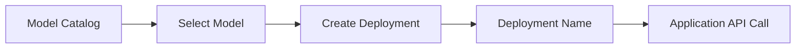

### Important API Detail

In many Azure model API calls, the value passed to the `model` parameter is the **deployment name**, not necessarily the original catalog model ID.

A `404` error can occur when the model parameter does not match the deployed model name.

---

## 7. Model Categories

### 7.1 General-Purpose Models

Suitable for:

* Chat
* Summarization
* Writing
* Classification
* Extraction
* General question answering

### 7.2 Reasoning Models

Suitable for:

* Complex planning
* Mathematics
* Scientific reasoning
* Difficult code problems
* Multi-step analysis

Reasoning models can provide better performance on difficult tasks, but may increase:

* Latency
* Token usage
* Cost

### 7.3 Small and Low-Latency Models

Suitable for:

* Request routing
* Classification
* Data extraction
* Short summaries
* High-volume workloads

### 7.4 Embedding Models

Suitable for:

* Semantic search
* RAG
* Clustering
* Recommendation
* Duplicate detection

### 7.5 Multimodal Models

Suitable for:

* Image analysis
* Screenshot understanding
* PDF processing
* Chart interpretation
* Visual question answering

### 7.6 Specialized Models

The Foundry catalog may include models specialized for:

* Code
* Healthcare
* Translation
* Images
* Audio
* Video
* Domain-specific workloads

---

## 8. Model Selection Framework

Do not select an Azure model only because it is the newest or most capable.

### 8.1 Important Dimensions

| Dimension             | Evaluation Question                                          |
| --------------------- | ------------------------------------------------------------ |
| **Task quality**      | Does the model solve the real product task?                  |
| **Latency**           | Is the response fast enough for the UX?                      |
| **Cost**              | Is the expected workload affordable?                         |
| **Context capacity**  | Can it process the required input?                           |
| **Output limit**      | Can it produce the required response size?                   |
| **Multimodality**     | Does the feature require text, image, audio, or video?       |
| **Structured output** | Does it follow the schema reliably?                          |
| **Tool use**          | Does it select and call tools correctly?                     |
| **Language quality**  | Does it support the users’ languages?                        |
| **Region**            | Is the model available in the required region?               |
| **Quota**             | Does the subscription have sufficient capacity?              |
| **Safety**            | Does it behave appropriately for the domain?                 |
| **Lifecycle**         | Is it stable, preview, deprecated, or retiring?              |
| **Enterprise fit**    | Does it support the required networking and access controls? |

---

### 8.2 Decision Tree

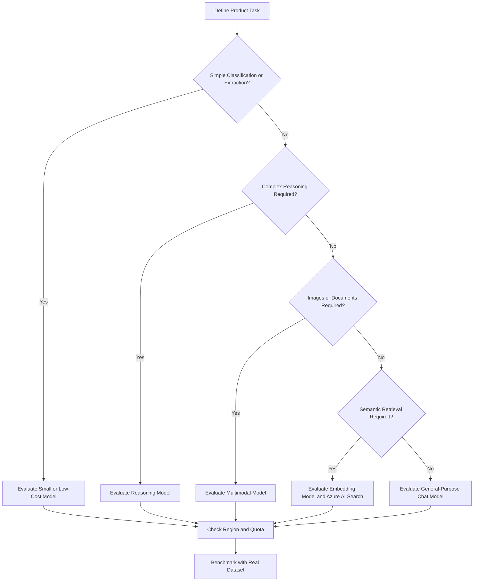

---

### 8.3 Weighted Score Example

```text
Total Model Score =
    Task Quality × 0.30
  + Reliability × 0.15
  + Latency × 0.15
  + Cost × 0.10
  + Schema Compliance × 0.10
  + Tool Accuracy × 0.10
  + Regional Fit × 0.05
  + Operational Fit × 0.05
```

Change the weights according to the application.

For example:

* A real-time assistant should prioritize latency.
* A legal system should prioritize groundedness and reliability.
* A high-volume classifier should prioritize cost and throughput.
* An internal enterprise assistant should prioritize security and data access.

---

## 9. The Responses API

Microsoft recommends the **Responses API** for new Azure OpenAI and Foundry applications.

The Responses API combines capabilities previously separated across chat completions and assistant-style APIs.

It can support:

* Text generation
* Stateful conversations
* Streaming
* Tool calling
* Structured output
* Image input
* File search
* Code execution
* Agent workflows

Microsoft documentation recommends considering the Responses API for new applications, while Chat Completions remains available for existing use cases.

### Basic Flow

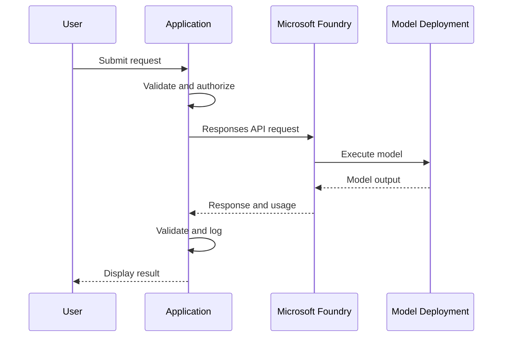

---

## 10. Authentication

Microsoft Foundry supports authentication through:

* Microsoft Entra ID
* API keys

Microsoft Entra ID is recommended for production. API keys are more appropriate for quick prototypes or controlled development environments.

### Recommended Production Flow

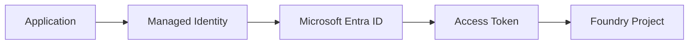

### Benefits of Microsoft Entra ID

* No permanent API key in application code
* Role-based access control
* Managed identity support
* Centralized identity management
* Easier credential rotation
* Better auditability

---

## 11. Practical API Demo

### 11.1 Demo Goal

Build a small feature that:

1. Receives a support ticket.
2. Sends it to a deployed model.
3. Measures latency.
4. Records token usage.
5. Prints the analysis.
6. Handles missing configuration and API errors.

---

### 11.2 Prerequisites

Install the current Foundry SDK:

```bash
pip install "azure-ai-projects>=2.3.0"
```

Authenticate with Azure CLI:

```bash
az login
```

The current Foundry SDK uses the `azure-ai-projects` 2.x package and a project endpoint.

Set the required environment variables:

```bash
export AZURE_AI_PROJECT_ENDPOINT="https://resource-name.ai.azure.com/api/projects/project-name"
export AZURE_AI_MODEL_DEPLOYMENT="your-deployment-name"
```

Windows PowerShell:

```powershell
$env:AZURE_AI_PROJECT_ENDPOINT="https://resource-name.ai.azure.com/api/projects/project-name"
$env:AZURE_AI_MODEL_DEPLOYMENT="your-deployment-name"
```

---

### 11.3 Python Demo

```python
import os
import time
from typing import Any

from azure.ai.projects import AIProjectClient
from azure.identity import DefaultAzureCredential


def _get_token_usage(response: Any) -> dict[str, int | None]:
    """
    Extract token usage when the selected model and API response
    expose usage information.
    """
    usage = getattr(response, "usage", None)

    return {
        "input_tokens": getattr(usage, "input_tokens", None),
        "output_tokens": getattr(usage, "output_tokens", None),
        "total_tokens": getattr(usage, "total_tokens", None),
    }


def analyze_support_ticket(ticket: str) -> dict[str, object]:
    """
    Analyze a support ticket using a model deployed in
    Microsoft Foundry.
    """
    normalized_ticket = ticket.strip()

    if not normalized_ticket:
        raise ValueError("The support ticket must not be empty.")

    project_endpoint = os.getenv("AZURE_AI_PROJECT_ENDPOINT")
    deployment_name = os.getenv("AZURE_AI_MODEL_DEPLOYMENT")

    if not project_endpoint:
        raise RuntimeError(
            "AZURE_AI_PROJECT_ENDPOINT is missing."
        )

    if not deployment_name:
        raise RuntimeError(
            "AZURE_AI_MODEL_DEPLOYMENT is missing."
        )

    project = AIProjectClient(
        endpoint=project_endpoint,
        credential=DefaultAzureCredential(),
    )

    client = project.get_openai_client()

    started_at = time.perf_counter()

    try:
        response = client.responses.create(
            model=deployment_name,
            instructions=(
                "You are a customer-support classification assistant. "
                "Use only information explicitly present in the ticket. "
                "Return the category, urgency, sentiment, summary, and "
                "recommended next action. Do not invent details."
            ),
            input=normalized_ticket,
        )
    except Exception as exc:
        raise RuntimeError(
            f"Azure AI request failed: {exc}"
        ) from exc

    latency_ms = round(
        (time.perf_counter() - started_at) * 1000,
        2,
    )

    usage = _get_token_usage(response)

    return {
        "deployment": deployment_name,
        "latency_ms": latency_ms,
        **usage,
        "response": response.output_text,
    }


if __name__ == "__main__":
    sample_ticket = (
        "The mobile application crashes whenever I upload "
        "a PDF larger than 10 MB. Smaller files work correctly."
    )

    result = analyze_support_ticket(sample_ticket)

    print(f"Deployment: {result['deployment']}")
    print(f"Latency: {result['latency_ms']} ms")
    print(f"Input tokens: {result['input_tokens']}")
    print(f"Output tokens: {result['output_tokens']}")
    print("\nAnalysis:")
    print(result["response"])
```

The current Foundry SDK pattern creates an `AIProjectClient`, obtains an OpenAI-compatible client, and sends a Responses API request through the project endpoint.

---

## 12. Streaming Responses

Streaming improves perceived latency by showing output while it is generated.

```python
stream = client.responses.create(
    model=deployment_name,
    input="Explain hybrid search in three short paragraphs.",
    stream=True,
)

for event in stream:
    if event.type == "response.output_text.delta":
        print(event.delta, end="", flush=True)
```

The Responses API supports streaming output through incremental response events.

### Streaming Architecture

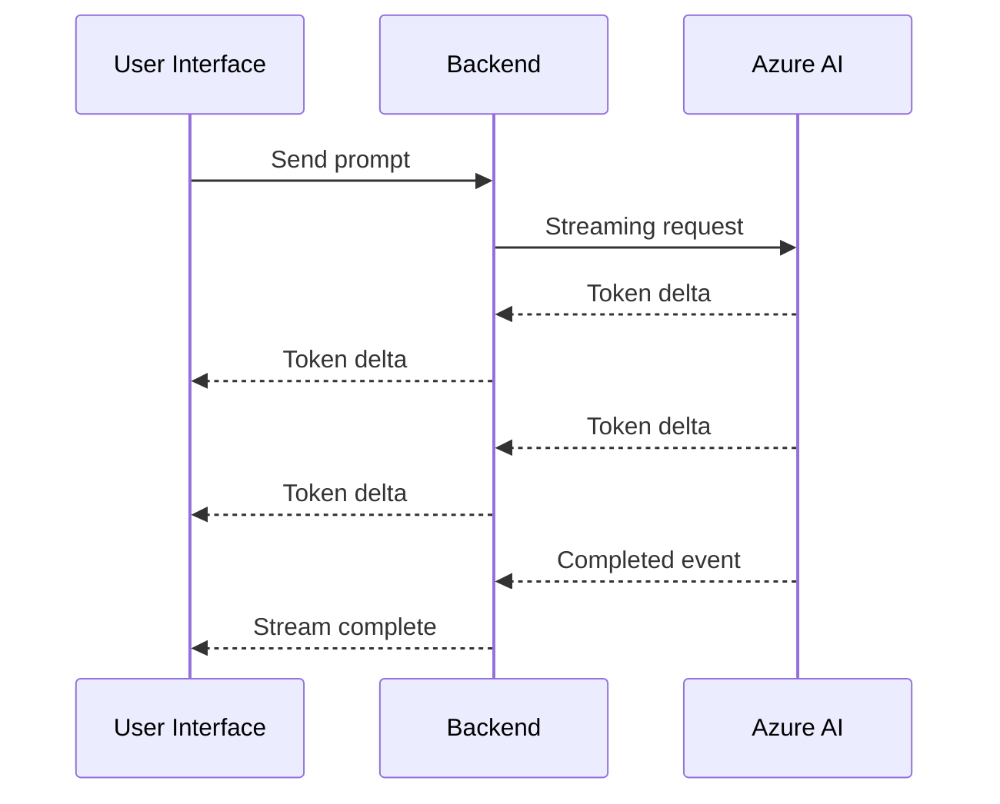

---

## 13. FastAPI Demo

```python
import os
import time

from azure.ai.projects import AIProjectClient
from azure.identity import DefaultAzureCredential
from fastapi import FastAPI, HTTPException
from pydantic import BaseModel, Field


PROJECT_ENDPOINT = os.getenv("AZURE_AI_PROJECT_ENDPOINT")
DEPLOYMENT_NAME = os.getenv("AZURE_AI_MODEL_DEPLOYMENT")

app = FastAPI(title="Azure AI Ticket Analyzer")


class TicketRequest(BaseModel):
    ticket: str = Field(min_length=1, max_length=10_000)


class TicketResponse(BaseModel):
    deployment: str
    latency_ms: float
    analysis: str


def create_model_client():
    if not PROJECT_ENDPOINT:
        raise RuntimeError("AZURE_AI_PROJECT_ENDPOINT is missing.")

    if not DEPLOYMENT_NAME:
        raise RuntimeError("AZURE_AI_MODEL_DEPLOYMENT is missing.")

    project = AIProjectClient(
        endpoint=PROJECT_ENDPOINT,
        credential=DefaultAzureCredential(),
    )

    return project.get_openai_client()


@app.post("/analyze-ticket", response_model=TicketResponse)
def analyze_ticket(payload: TicketRequest) -> TicketResponse:
    try:
        client = create_model_client()
    except Exception as exc:
        raise HTTPException(
            status_code=500,
            detail="The Azure AI service is not configured.",
        ) from exc

    started_at = time.perf_counter()

    try:
        response = client.responses.create(
            model=DEPLOYMENT_NAME,
            instructions=(
                "Analyze the support ticket. Return its category, "
                "urgency, sentiment, and recommended next action. "
                "Do not invent missing information."
            ),
            input=payload.ticket,
        )
    except Exception as exc:
        raise HTTPException(
            status_code=502,
            detail="The AI provider could not complete the request.",
        ) from exc

    latency_ms = round(
        (time.perf_counter() - started_at) * 1000,
        2,
    )

    return TicketResponse(
        deployment=DEPLOYMENT_NAME,
        latency_ms=latency_ms,
        analysis=response.output_text,
    )
```

Run the API:

```bash
uvicorn main:app --reload
```

Test it:

```bash
curl -X POST "http://localhost:8000/analyze-ticket" \
  -H "Content-Type: application/json" \
  -d '{
    "ticket": "I was charged twice for the same subscription."
  }'
```

---

## 14. Structured Outputs

Backend systems usually require predictable output rather than free-form paragraphs.

Example:

```json
{
  "category": "file_upload",
  "urgency": "medium",
  "sentiment": "negative",
  "summary": "The application crashes for PDF files larger than 10 MB.",
  "recommended_action": "Reproduce the issue and inspect upload-size handling.",
  "requires_human_review": false
}
```

Structured outputs are useful for:

* Ticket routing
* Data extraction
* Database insertion
* API responses
* Workflow automation
* UI rendering
* Automated evaluation

Application code must still validate:

* Required fields
* Allowed enum values
* Date formats
* Numeric ranges
* Maximum lengths
* Business rules

### Pydantic Validation Example

```python
from typing import Literal

from pydantic import BaseModel, Field


class TicketAnalysis(BaseModel):
    category: Literal[
        "account",
        "billing",
        "performance",
        "file_upload",
        "security",
        "other",
    ]
    urgency: Literal["low", "medium", "high"]
    sentiment: Literal["negative", "neutral", "positive"]
    summary: str = Field(max_length=250)
    recommended_action: str = Field(max_length=300)
    requires_human_review: bool
```

---

## 15. Azure AI Search and RAG

**Retrieval-Augmented Generation** retrieves relevant external information before asking a model to generate an answer.

Azure AI Search supports two broad RAG approaches:

1. **Classic RAG**
2. **Agentic retrieval**

Classic RAG uses application-controlled search and sends selected results to a model. Agentic retrieval can use LLM-assisted query planning, multiple focused subqueries, structured grounding results, and citation information. Agentic retrieval is currently presented as the recommended starting point for new, complex RAG implementations, while classic RAG remains appropriate when simplicity, control, speed, or generally available features are required.

---

### 15.1 Classic RAG

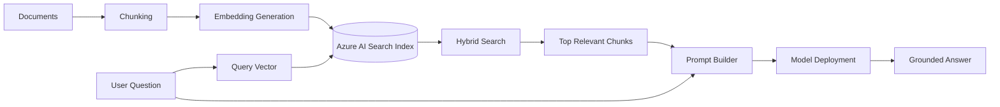

### Classic RAG Steps

1. Read source documents.
2. Split documents into chunks.
3. Generate embeddings.
4. Store text and vectors in Azure AI Search.
5. Receive a user question.
6. Run keyword and vector search.
7. Apply semantic ranking or filtering.
8. Select the best chunks.
9. Add the chunks to the prompt.
10. Generate an answer.
11. Display citations.

---

### 15.2 Agentic Retrieval

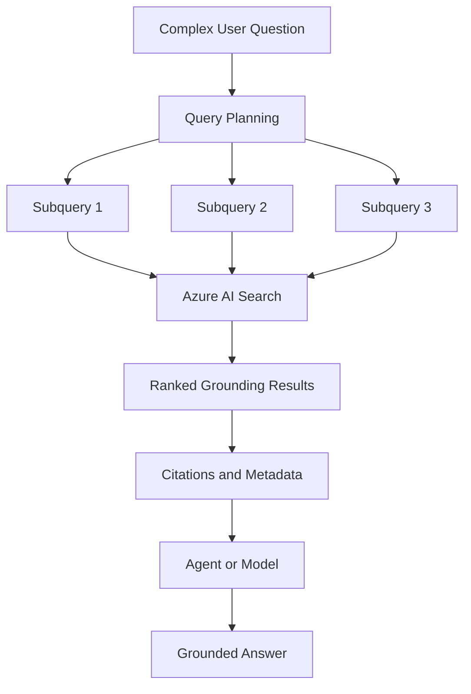

Agentic retrieval can:

* Use conversation history
* Break complex questions into subqueries
* Run queries in parallel
* Return structured grounding data
* Include citations
* Apply semantic ranking

---

### 15.3 Hybrid Search

Hybrid search runs:

* Keyword search
* Vector similarity search

in the same request.

```text
Keyword matches
        +
Semantic vector matches
        ↓
Merged and ranked results
```

Hybrid search is often useful when queries contain:

* Exact product names
* Error codes
* Technical identifiers
* Synonyms
* Natural-language descriptions

Azure AI Search recommends combining vector and keyword queries when maximum retrieval recall is important.

---

## 16. Foundry Agent Service

An AI agent is a model-driven application that can decide when to use tools or external information.

### Agent Components

```text
Model
+ Instructions
+ Conversation
+ Tools
+ Knowledge
+ Application Rules
= Agent
```

Foundry Agent Service manages agent development, deployment, and scaling. An agent can use supported models from the Foundry model catalog and interact through the Responses API.

### Agent Runtime

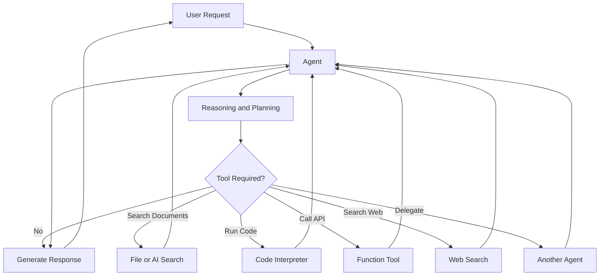

---

## 17. Agent Tools

Foundry Agent Service can support tools such as:

* Web search
* Code Interpreter
* File Search
* Function calling
* Azure AI Search
* Custom APIs
* MCP-based tools
* Other agents

Microsoft’s tool catalog documentation describes tools as capabilities that allow agents to search information, execute code, query data, or call APIs.

### Function-Calling Flow

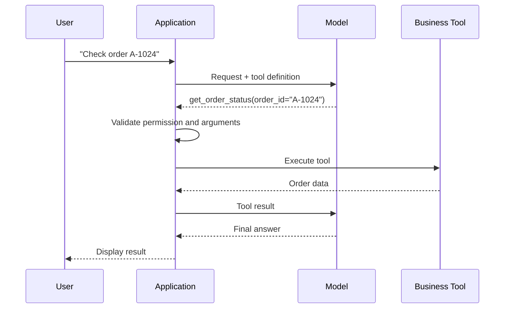

The model proposes tool calls, but application code should remain responsible for:

* Authentication
* Authorization
* Validation
* Confirmation
* Idempotency
* Rate limiting
* Audit logging
* Error handling

---

## 18. Safety

Model safety should be treated as a layered system.

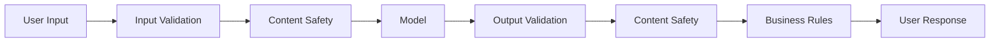

### Safety Layers

1. Input-size limits
2. Authentication
3. Prompt-injection defenses
4. Content filtering
5. Tool authorization
6. Structured-output validation
7. Sensitive-data controls
8. Human review
9. Audit logs
10. Incident monitoring

Azure AI Content Safety can analyze text and images for harmful material, but product-specific policies and application validation are still required.

---

## 19. Evaluation

A model should be evaluated on real product cases before deployment.

### Evaluation Categories

#### General Quality

* Correctness
* Completeness
* Coherence
* Fluency
* Instruction following

#### RAG Quality

* Retrieval relevance
* Groundedness
* Citation correctness
* Answer relevance
* Missing-information behavior

#### Agent Quality

* Tool selection
* Tool argument accuracy
* Task completion
* Number of unnecessary steps
* Recovery from tool errors

#### Safety

* Harmful content
* Prompt injection
* Data leakage
* Unsupported claims
* Policy violations

Microsoft Foundry provides built-in and custom evaluators for models, RAG applications, safety, and agents.

---

## 20. Evaluation Dataset

Create a dataset containing:

* Normal inputs
* Empty inputs
* Very long inputs
* Ambiguous questions
* Vietnamese inputs
* English inputs
* Mixed-language inputs
* Typographical errors
* Prompt-injection attempts
* Missing retrieved information
* Conflicting documents
* Tool failures
* Historical production failures

### Example Record

```json
{
  "id": "ticket_014",
  "input": "I was charged twice for the same subscription.",
  "expected_category": "billing",
  "expected_urgency": "medium",
  "required_facts": [
    "duplicate charge"
  ],
  "forbidden_claims": [
    "refund completed",
    "subscription canceled"
  ]
}
```

### Example RAG Record

```json
{
  "id": "rag_008",
  "question": "How can I cancel my subscription?",
  "relevant_document_ids": [
    "subscription_cancel_01"
  ],
  "required_answer_points": [
    "Open Settings",
    "Select Subscription",
    "Choose Cancel"
  ],
  "must_include_citation": true
}
```

---

## 21. Logging and Observability

A production application should record enough information to compare model behavior over time.

### Suggested Log

```json
{
  "request_id": "req_01AZURE123",
  "feature": "support_ticket_analysis",
  "provider": "microsoft_foundry",
  "project": "customer-support-production",
  "deployment": "ticket-model-production",
  "model_version": "resolved-model-version",
  "prompt_version": "ticket_classifier_v4",
  "latency_ms": 842.6,
  "input_tokens": 164,
  "output_tokens": 81,
  "total_tokens": 245,
  "schema_valid": true,
  "content_filter_status": "passed",
  "status": "success"
}
```

### Important Metrics

* Request count
* Success rate
* Error rate
* Timeout rate
* Rate-limit rate
* P50 latency
* P95 latency
* P99 latency
* Input tokens
* Output tokens
* Cost per request
* Cost per successful task
* Schema-valid output rate
* Content-filter activation rate
* Retrieval latency
* Tool-call success rate
* Groundedness
* User correction rate

Microsoft Foundry observability includes evaluation, monitoring, and distributed tracing. Tracing can capture model calls, tool invocations, agent decisions, and service dependencies through OpenTelemetry-compatible integrations.

---

## 22. Production Architecture

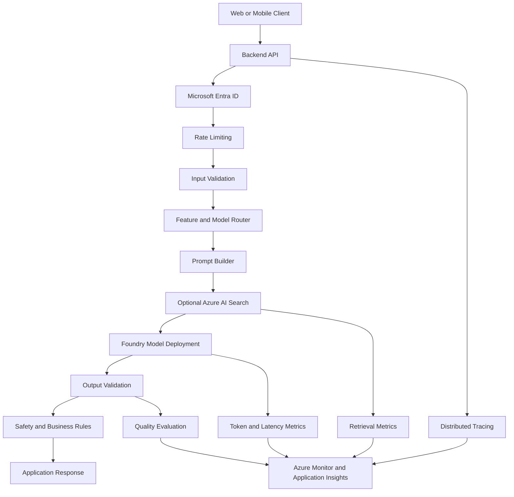

### Recommended Components

* Microsoft Entra ID
* Managed identity
* Azure Key Vault
* Role-based access control
* Private networking where required
* Model registry
* Deployment registry
* Prompt versioning
* Input validation
* Output validation
* Content safety
* Timeouts
* Retries
* Rate limiting
* Evaluation datasets
* Distributed tracing
* Cost monitoring
* Fallback behavior

---

## 23. Cost Considerations

Azure AI cost can include:

* Model input tokens
* Model output tokens
* Provisioned capacity
* Search indexes
* Vector storage
* Agent tools
* Code execution
* Content Safety
* Application hosting
* Logging and monitoring
* Networking
* Data storage

The Foundry platform can be explored without a separate platform fee, but deployed models, agents, tools, and underlying Azure services have their own billing models.

### Cost Formula

```text
Total AI Cost =
    Model Inference
  + Search and Retrieval
  + Agent Tools
  + Application Compute
  + Storage
  + Networking
  + Monitoring
```

### Cost Optimization Methods

* Use a smaller model for simple tasks.
* Route only difficult cases to larger models.
* Limit unnecessary context.
* Cache repeated responses.
* Use retrieval instead of sending full documents.
* Set output-token limits.
* Batch offline workloads.
* Monitor failed-request costs.
* Remove unused deployments.
* Track cost per successful task.

---

## 24. Common Production Failures

### 24.1 Confusing Model ID and Deployment Name

#### Problem

The application passes the catalog model ID instead of the deployment name.

#### Symptom

```text
404: Deployment not found
```

#### Fix

Store and use the configured deployment name.

```python
deployment_name = os.environ["AZURE_AI_MODEL_DEPLOYMENT"]
```

Microsoft’s troubleshooting guidance recommends confirming that the model parameter matches the deployment name.

---

### 24.2 Selecting an Unsupported Region

#### Problem

The required model is not available in the selected Azure region.

#### Impact

* Deployment creation fails
* Required deployment type is unavailable
* The application must use a different region

#### Prevention

Check:

* Model-region availability
* Data residency requirements
* Quota availability
* Network latency
* Disaster-recovery strategy

---

### 24.3 Insufficient Quota

#### Symptoms

* Deployment creation fails
* Requests are throttled
* Throughput is lower than expected

#### Prevention

* Estimate expected tokens per minute.
* Test concurrent traffic.
* Request quota before launch.
* Add retry and backoff.
* Configure a fallback deployment.
* Monitor throttling metrics.

---

### 24.4 Hard-Coding API Keys

#### Problem

An API key is stored in source code.

#### Better Approach

Use:

* Microsoft Entra ID
* Managed identities
* Azure Key Vault
* Environment-specific configuration

Microsoft recommends Entra ID for production authentication.

---

### 24.5 No Timeout or Retry Policy

#### Problem

Temporary provider or network failures create poor UX.

#### Define

* Connection timeout
* Read timeout
* Maximum retry count
* Exponential backoff
* Retryable status codes
* Circuit breaker
* Fallback behavior

Do not retry indefinitely.

---

### 24.6 Measuring Only Average Latency

Average latency can hide slow requests.

Track:

```text
P50
P95
P99
Timeout rate
Streaming first-token latency
Total generation latency
```

---

### 24.7 Using the Largest Model for Every Task

#### Problem

A powerful reasoning model handles simple classification and routing.

#### Impact

* Higher cost
* Higher latency
* Lower throughput

#### Better Architecture

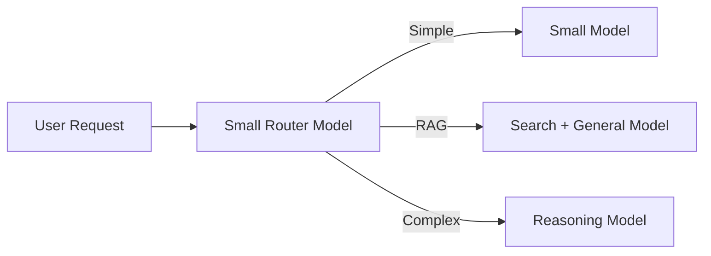

---

### 24.8 Trusting Model Output Without Validation

#### Problem

The model returns unsupported enum values or malformed data.

#### Solution

Use:

* Structured output
* JSON Schema
* Pydantic
* Business-rule validation
* Human review for sensitive actions

---

### 24.9 Poor RAG Retrieval

#### Symptoms

* Correct document is not retrieved
* Irrelevant chunks dominate the context
* Citations do not support the answer

#### Possible Causes

* Poor chunking
* Incorrect embedding model
* Missing metadata filters
* Too few retrieved candidates
* No hybrid search
* No semantic ranking
* Outdated content
* Incorrect index fields

---

### 24.10 Giving Agents Unrestricted Tool Access

#### Problem

An agent can execute sensitive operations without authorization.

#### Solution

Validate:

* User identity
* User permission
* Tool name
* Tool arguments
* Resource ownership
* Confirmation state
* Idempotency key

---

### 24.11 Ignoring Preview Status

Preview features may:

* Change APIs
* Have limited regional availability
* Have different support conditions
* Introduce migration work

Record whether every production dependency is:

```text
Generally Available
Preview
Deprecated
Retiring
```

---

### 24.12 No Model-Version Tracking

#### Problem

The deployment changes model version and product quality changes.

#### Log

* Deployment name
* Requested model
* Resolved model version
* Prompt version
* Evaluation version
* Deployment date

---

### 24.13 Logging Sensitive Content

Avoid placing the following in unrestricted logs:

* Personal identification
* Passwords
* API keys
* Access tokens
* Health information
* Financial information
* Confidential documents
* Private source code

Use:

* Redaction
* Hashing
* Encryption
* Restricted access
* Retention policies

---

## 25. Debugging Checklist

When a request fails, inspect the system in this order:

```text
1. Is the project endpoint correct?
2. Is authentication working?
3. Does the identity have the required role?
4. Does the deployment exist?
5. Does the model parameter match the deployment name?
6. Is the model available in this region?
7. Is quota available?
8. Is the request format valid?
9. Did a content filter block the request?
10. Did output validation fail?
11. Did a retrieval or tool call fail?
12. What do traces and logs show?
```

### Common Status Categories

| Status           | Likely Cause                              |
| ---------------- | ----------------------------------------- |
| `401`            | Missing or invalid authentication         |
| `403`            | Insufficient role or permission           |
| `404`            | Wrong endpoint or deployment name         |
| `429`            | Rate limit or quota                       |
| `5xx`            | Temporary service or infrastructure error |
| Validation error | Invalid input or output schema            |
| Empty answer     | Prompt, filter, or model behavior issue   |

---

## 26. Practical Exercises

### Exercise 1 — Five-Line Summary

Without reviewing the lesson, explain:

1. What Azure AI is
2. What Microsoft Foundry does
3. What a model deployment is
4. What Azure AI Search contributes
5. How you would select a model

---

### Exercise 2 — Basic API Call

Create a Python script that:

* Reads a prompt from the terminal
* Sends it to a Foundry deployment
* Prints the answer
* Measures latency
* Records token usage
* Handles empty input
* Handles authentication errors
* Handles a missing deployment

---

### Exercise 3 — Model Comparison

Deploy or access two models and compare them on:

* Classification
* Summarization
* Extraction
* Vietnamese writing
* English writing
* Reasoning
* Structured output

Record:

| Metric         | Model A | Model B |
| -------------- | ------: | ------: |
| Quality        |         |         |
| P50 latency    |         |         |
| P95 latency    |         |         |
| Input tokens   |         |         |
| Output tokens  |         |         |
| Schema success |         |         |
| Estimated cost |         |         |

---

### Exercise 4 — Classic RAG

Build this pipeline:

```text
PDF documents
→ Text extraction
→ Chunking
→ Embeddings
→ Azure AI Search
→ Hybrid retrieval
→ Model generation
→ Answer with citations
```

Measure:

* Recall@K
* Top-result accuracy
* Retrieval latency
* Generation latency
* Citation accuracy
* Groundedness

---

### Exercise 5 — Agent Tool

Create an agent that can call:

```text
get_order_status(order_id)
```

Test:

* Valid order ID
* Missing order ID
* Invalid order ID
* Unauthorized user
* Tool timeout
* Tool returns incomplete data
* User requests account deletion

---

### Exercise 6 — Production Failure Report

```markdown
## Failure

The production application returned deployment-not-found errors.

## Impact

All AI requests failed after the release.

## Detection

The API returned HTTP 404 responses.

## Root Cause

The application used the catalog model ID instead of the Azure
deployment name.

## Immediate Fix

Restore the previous deployment configuration.

## Permanent Fix

Store deployment names in environment-specific configuration and
validate them during application startup.

## Prevention

Add a deployment health check to the release pipeline.
```

---

## 27. Completion Checklist

### Understanding

* [ ] I can explain Azure AI in one or two minutes.
* [ ] I understand the current Microsoft Foundry terminology.
* [ ] I can distinguish a model from a deployment.
* [ ] I understand Azure OpenAI.
* [ ] I understand Azure AI Search.
* [ ] I can explain classic and agentic RAG.
* [ ] I can explain Foundry Agent Service.
* [ ] I understand Azure AI Content Safety.
* [ ] I understand why model region and quota matter.

### Implementation

* [ ] I have created or accessed a Foundry project.
* [ ] I have configured a model deployment.
* [ ] I have called the Responses API.
* [ ] I use the deployment name correctly.
* [ ] I authenticate with Microsoft Entra ID.
* [ ] I measure latency.
* [ ] I record token usage.
* [ ] I validate model output.
* [ ] I handle API errors.
* [ ] I have tested at least one edge case.

### Production Readiness

* [ ] Model and deployment versions are recorded.
* [ ] Prompt versions are recorded.
* [ ] Region availability has been checked.
* [ ] Quota has been tested.
* [ ] P50 and P95 latency are measured.
* [ ] Cost per successful task is tracked.
* [ ] Timeouts and retries are configured.
* [ ] Sensitive logs are redacted.
* [ ] Tool calls are authorized.
* [ ] RAG answers are evaluated for groundedness.
* [ ] Preview dependencies are documented.
* [ ] Fallback behavior is defined.

---

## 28. Related Outcome

> Choose pre-trained AI models based on capability, context length, latency, cost, safety, region, quota, operational requirements, and product fit.

A strong model-selection explanation could be:

```text
We selected this Azure deployment because it met our extraction
accuracy target, produced valid structured output, was available in
the required region, and stayed below our P95 latency and cost limits.

Simple classification requests are routed to a smaller deployment,
while complex reasoning requests use the more capable model.
```

A weak explanation would be:

```text
We selected Azure AI because Microsoft is popular.
```

---

## 29. Related Project

# Project 2 — Model Comparison App

Build an application that compares two or three model deployments using the same prompts and test cases.

### Example Comparison

```text
Azure-hosted small model
vs.
Azure-hosted reasoning model
vs.
Model from another provider
```

### Required Features

* Provider selection
* Project selection
* Deployment selection
* Shared prompt input
* Side-by-side output
* Streaming option
* Request latency
* Token usage
* Estimated cost
* Structured-output validation
* Error details
* Manual quality score
* Result history

### Suggested Architecture

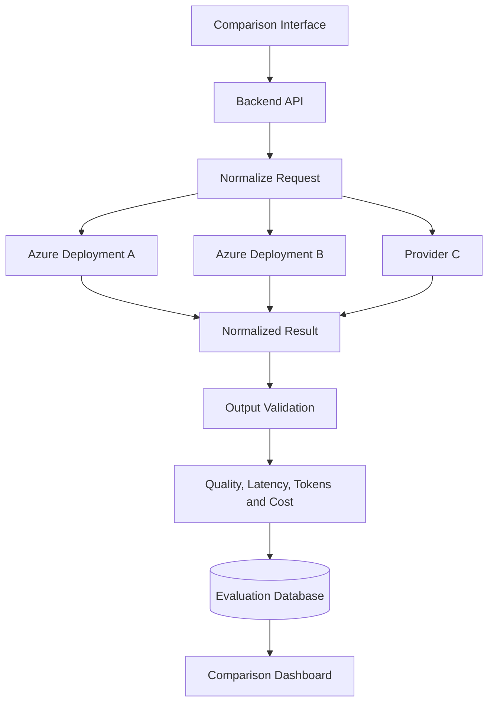

### Normalized Response

```json
{
  "provider": "microsoft_foundry",
  "project": "model-comparison",
  "deployment": "configured-deployment",
  "model_version": "resolved-version",
  "response": "Generated answer",
  "latency_ms": 824.6,
  "input_tokens": 126,
  "output_tokens": 71,
  "estimated_cost": null,
  "schema_valid": true,
  "status": "success",
  "error": null
}
```

### Evaluation Dataset

Include at least 20 cases covering:

* Summarization
* Classification
* Data extraction
* Coding
* Reasoning
* Vietnamese output
* English output
* Mixed-language input
* Long context
* Invalid input
* Prompt injection
* Structured output
* Tool selection
* Missing RAG information

### Final Report Questions

1. Which deployment produced the best task quality?
2. Which deployment was fastest?
3. Which deployment had the best cost-to-quality ratio?
4. Which model followed schemas most reliably?
5. Which model performed best in Vietnamese?
6. Which model handled long context best?
7. Which deployment had the lowest error rate?
8. Did RAG improve factual accuracy?
9. Should the product use model routing?
10. What quota, region, or lifecycle risks exist?

---

## 30. Suggested 20-Minute Lesson Plan

|          Time | Activity                                           |
| ------------: | -------------------------------------------------- |
|   0–3 minutes | Explain Azure AI and Microsoft Foundry             |
|   3–6 minutes | Introduce models, deployments, regions, and quotas |
|   6–9 minutes | Explain Azure OpenAI and the Responses API         |
|  9–13 minutes | Run the Python demo                                |
| 13–16 minutes | Explain Azure AI Search and RAG                    |
| 16–18 minutes | Discuss agents, safety, and observability          |
| 18–20 minutes | Assign the model-comparison exercise               |

---

## 31. Key Takeaways

1. Azure AI is an ecosystem, not one model.
2. Microsoft Foundry is the current unified Azure platform for AI models, agents, tools, evaluation, and governance.
3. Azure OpenAI provides OpenAI model capabilities through Azure-managed infrastructure.
4. A model and a model deployment are different concepts.
5. Applications commonly pass the deployment name in the API model parameter.
6. Model availability depends on region, quota, lifecycle, and deployment configuration.
7. The Responses API is the recommended foundation for many new applications.
8. Microsoft Entra ID is preferable to permanent API keys in production.
9. Azure AI Search supports vector, keyword, hybrid, and semantic retrieval.
10. RAG can use either a classic application-controlled pipeline or agentic retrieval.
11. Foundry Agent Service connects models to search, code, files, APIs, and other tools.
12. Tool calls must still be authorized and validated by the application.
13. Azure AI Content Safety provides an additional text and image safety layer.
14. Foundry evaluation and observability can measure quality, groundedness, latency, tool use, and safety.
15. Model version, deployment, prompt version, token usage, latency, and quality should be logged.
16. The largest model is not automatically the best model.
17. Production readiness requires evaluation, monitoring, cost control, fallback behavior, and security.

---

## 32. Final Summary

**Azure AI**, with **Microsoft Foundry** as its current unified development platform, is an important part of the modern AI Engineer roadmap.

It provides the infrastructure and services required to move from a model experiment to a governed production application.

A capable AI Engineer should be able to:

* Explore the model catalog
* Select an appropriate model
* Create and configure a deployment
* Use the Responses API
* Authenticate securely
* Build a RAG pipeline with Azure AI Search
* Create tool-using agents
* Validate structured output
* Apply safety controls
* Evaluate model and agent quality
* Monitor latency, errors, tokens, and cost
* Manage region and quota constraints
* Track deployment and model versions
* Define fallback behavior
* Explain why Azure AI is or is not the correct platform for a product

Turn this lesson into a working API route, RAG assistant, agent tool, model-comparison dashboard, evaluation report, or portfolio deployment so that the knowledge becomes practical engineering experience.

---

# Bài luyện tập

## Mục tiêu


## Đề bài


## Yêu cầu hoàn thành

- [ ] 
- [ ] 
- [ ] 

## Kết quả / lời giải


## Ghi chú
