# 011 — AWS SageMaker

| Field                  | Details                                                |
| ---------------------- | ------------------------------------------------------ |
| **Course**             | 02 — Model Platforms and Prompting                     |
| **Module**             | Module 03 — Using Pre-trained Models                   |
| **Content Group**      | Cloud and Managed Platforms                            |
| **Roadmap Source**     | Using Pre-trained Models / Cloud and Managed Platforms |
| **Lesson Type**        | Model Selection                                        |
| **Order in Module**    | 011                                                    |
| **Suggested Duration** | 20 minutes                                             |

> **Current terminology:** The next generation of **Amazon SageMaker** is a broader data, analytics, AI, and machine-learning platform. Its unified development environment is called **Amazon SageMaker Unified Studio**, while the managed service for building, training, and deploying machine-learning models is called **Amazon SageMaker AI**.

> **Documentation note:** Available models, instance types, Regions, quotas, pricing, SDK interfaces, and service lifecycles can change. Verify the current AWS documentation before creating a production deployment.

---

## 1. Summary

**AWS SageMaker** is a managed cloud platform for developing and operating machine-learning and AI systems.

Amazon SageMaker AI helps developers and data scientists:

* Prepare data
* Train and fine-tune models
* Track model versions
* Deploy models to managed infrastructure
* Run real-time or offline inference
* Monitor endpoint performance
* Automate machine-learning workflows

AWS describes SageMaker AI as a fully managed service for building, training, and deploying machine-learning models in production-ready hosted environments.

SageMaker is useful when a product requires:

* Custom or fine-tuned models
* Open-weight model deployment
* Control over model-serving infrastructure
* GPU or CPU instance selection
* Managed training jobs
* Scalable inference endpoints
* Private networking
* Model version governance
* Batch prediction
* Production monitoring
* Integration with AWS data and security services

For an AI Engineer, learning SageMaker is not only about invoking a pre-trained model. It also means deciding:

* Which model should be used
* Whether the model should be fine-tuned
* How it should be packaged
* Which inference mode is appropriate
* Which instance type can support it
* How latency and cost will be measured
* How model versions will be governed
* How failures, drift, and infrastructure issues will be detected

---

## 2. Learning Objectives

After completing this lesson, you should be able to:

1. Explain AWS SageMaker in your own words.
2. Distinguish Amazon SageMaker, SageMaker Unified Studio, and SageMaker AI.
3. Explain where SageMaker fits in the machine-learning lifecycle.
4. Discover and evaluate pre-trained models through SageMaker JumpStart.
5. Distinguish training, fine-tuning, deployment, and inference.
6. Select an inference option based on latency, traffic, payload size, and cost.
7. Invoke an existing SageMaker endpoint with Boto3.
8. Explain how SageMaker can support a RAG application.
9. Use IAM roles rather than hard-coded cloud credentials.
10. Record endpoint, model, version, latency, and infrastructure metrics.
11. Identify common production failures and debugging methods.
12. Add a SageMaker endpoint to a multi-provider model comparison application.

---

## 3. What Is Amazon SageMaker?

Amazon SageMaker now covers a broader set of data, analytics, governance, generative AI, and machine-learning capabilities.

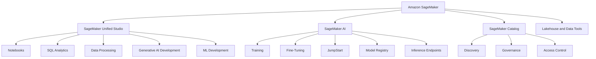

SageMaker Unified Studio combines tools from services such as SageMaker AI, Amazon Bedrock, AWS Glue, Amazon Athena, Amazon Redshift, and Amazon EMR in a governed development environment.

### Core Idea

```text
Data
+ Model
+ Training or customization
+ Managed infrastructure
+ Deployment
+ Monitoring
= Production machine-learning system
```

---

## 4. SageMaker Unified Studio

**Amazon SageMaker Unified Studio** is a unified development environment for data, analytics, artificial intelligence, and machine learning.

It provides a central place to:

* Discover organizational data
* Work in notebooks
* Run SQL analytics
* Build data pipelines
* Train machine-learning models
* Deploy models
* Develop generative AI applications
* Share data and AI artifacts
* Apply governance and access controls

AWS describes Unified Studio as a single interface for building, deploying, executing, and monitoring data and AI workflows.

### Simplified Project Structure

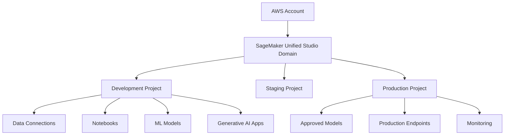

Separating development, staging, and production helps control:

* Permissions
* Data access
* Model versions
* Infrastructure
* Deployment configuration
* Cost
* Release approval

---

## 5. Amazon SageMaker AI

**Amazon SageMaker AI** focuses on machine-learning development and operations.

Its major responsibilities include:

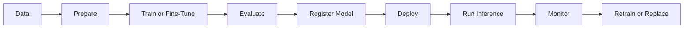

SageMaker Training provisions and manages compute infrastructure for training jobs. Developers can use built-in algorithms, supported machine-learning frameworks, or their own training containers and scripts.

---

## 6. Main SageMaker Components

### 6.1 SageMaker JumpStart

**SageMaker JumpStart** provides access to pre-trained and foundation models that can be evaluated, customized, and deployed through SageMaker.

JumpStart includes publicly available and proprietary models from AWS partners and third-party sources. Different models may have different licenses, deployment requirements, and usage agreements.

Typical model categories include:

* Text generation
* Summarization
* Question answering
* Classification
* Embeddings
* Image generation
* Computer vision
* Speech and audio
* Domain-specific models

### 6.2 SageMaker Training

SageMaker Training runs model-training or fine-tuning jobs on managed compute infrastructure.

A training job generally receives:

```text
Training code
+ Training container
+ Dataset in Amazon S3
+ Compute configuration
+ Hyperparameters
= Model artifacts
```

SageMaker handles compute provisioning for the job and can write the resulting model artifacts to Amazon S3.

### 6.3 SageMaker Model Registry

SageMaker Model Registry tracks models and their versions.

Models solving the same problem can be organized in a model group, with each approved model stored as a separate model version.

A registry entry may include:

* Model artifact location
* Container image
* Model metrics
* Approval status
* Model version
* Deployment metadata
* Evaluation results

### 6.4 SageMaker Hosting

SageMaker Hosting deploys a packaged model to managed inference infrastructure.

A typical hosting configuration contains:

```text
Model artifacts
+ Inference container
+ Endpoint configuration
+ Compute capacity
= Inference endpoint
```

### 6.5 Amazon CloudWatch

SageMaker publishes operational metrics to Amazon CloudWatch.

CloudWatch can be used to observe endpoint and infrastructure behavior through metrics, logs, dashboards, and alarms.

### 6.6 IAM Roles

SageMaker uses AWS Identity and Access Management roles to access services and resources on behalf of users and applications.

For example, an execution role may allow SageMaker to:

* Read training data from Amazon S3
* Write model artifacts
* Pull an inference container
* Create logs
* Access encrypted data

AWS recommends granting these permissions through IAM execution roles.

---

## 7. Model Discovery with JumpStart

The first step is not deploying a model. It is finding suitable candidates.

### Model Selection Workflow

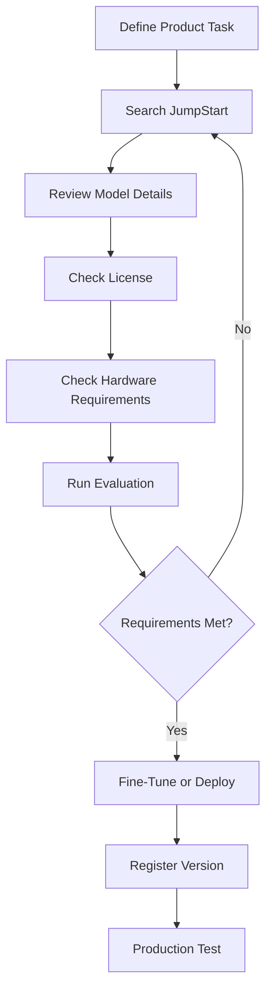

### Model Review Checklist

Before choosing a JumpStart model, inspect:

| Area                 | Questions                                              |
| -------------------- | ------------------------------------------------------ |
| **Task**             | Was the model designed for the target workload?        |
| **License**          | Does it allow the intended commercial or internal use? |
| **Model size**       | Can the selected instances support it?                 |
| **Context length**   | Can it process the required input?                     |
| **Language support** | Was it tested in the required languages?               |
| **Input format**     | What JSON or tensor structure does it expect?          |
| **Output format**    | What response schema does the container return?        |
| **Fine-tuning**      | Can the model be customized?                           |
| **Hardware**         | Does it require GPU inference?                         |
| **Safety**           | What limitations or risks are documented?              |
| **Region**           | Is it supported in the selected AWS Region?            |

JumpStart provides foundation-model evaluation workflows that can be used to compare text-generation models on quality and responsible-AI dimensions.

---

## 8. Pre-Trained Model vs Fine-Tuned Model

### Pre-Trained Model

A pre-trained model can be deployed without additional training.

Advantages:

* Faster setup
* No training dataset required
* Lower initial development effort
* Useful for prototypes

Limitations:

* May not follow domain-specific terminology
* May not produce the required style
* May perform poorly on specialized classifications
* May require large prompts

### Fine-Tuned Model

Fine-tuning adapts a pre-trained model to a smaller task-specific dataset.

SageMaker JumpStart supports fine-tuning for compatible foundation models through model-specific workflows.

Potential advantages:

* Better domain behavior
* Shorter prompts
* Improved output consistency
* More specialized task performance

Potential disadvantages:

* Training cost
* Dataset preparation
* Evaluation complexity
* Version management
* Risk of overfitting
* Additional deployment artifacts

### Decision Flow

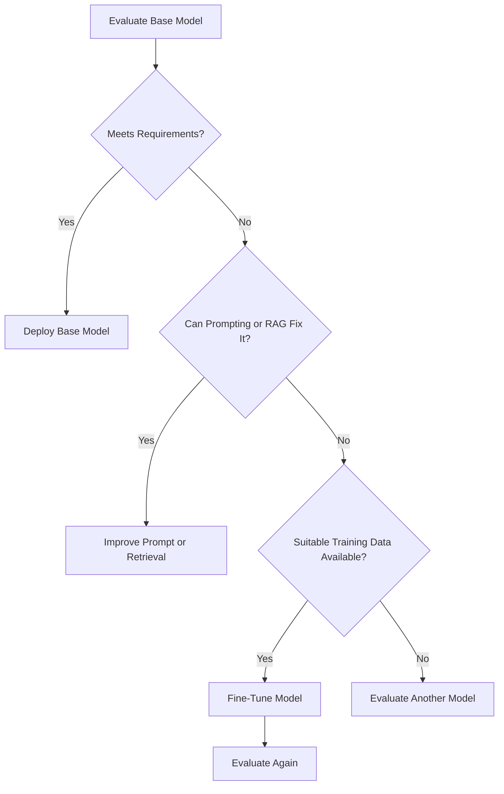

---

## 9. SageMaker vs Amazon Bedrock

SageMaker and Amazon Bedrock can both appear in generative AI architectures, but they solve different operational problems.

### Practical Rule of Thumb

| Requirement                                      | SageMaker AI                         | Amazon Bedrock                        |
| ------------------------------------------------ | ------------------------------------ | ------------------------------------- |
| Deploy custom model containers                   | Strong fit                           | Limited fit                           |
| Train models                                     | Strong fit                           | Not primary focus                     |
| Fine-tune open models with custom infrastructure | Strong fit                           | Model-dependent managed customization |
| Select GPU or CPU instances                      | Strong fit                           | Abstracted                            |
| Host proprietary model artifacts                 | Strong fit                           | Not the primary pattern               |
| Quickly call managed foundation models           | More setup                           | Strong fit                            |
| Build managed generative AI agents               | Possible through custom architecture | Native focus                          |
| Control serving infrastructure                   | High                                 | Lower                                 |
| Minimize model-hosting operations                | Lower                                | Higher                                |

SageMaker AI is a managed machine-learning service for building, training, and deploying models, while Amazon Bedrock is positioned as a managed platform for building generative AI applications and agents. The best choice depends on whether the team needs deeper control over the model lifecycle or a more abstracted foundation-model API.

---

## 10. SageMaker Inference Options

SageMaker offers several inference modes.

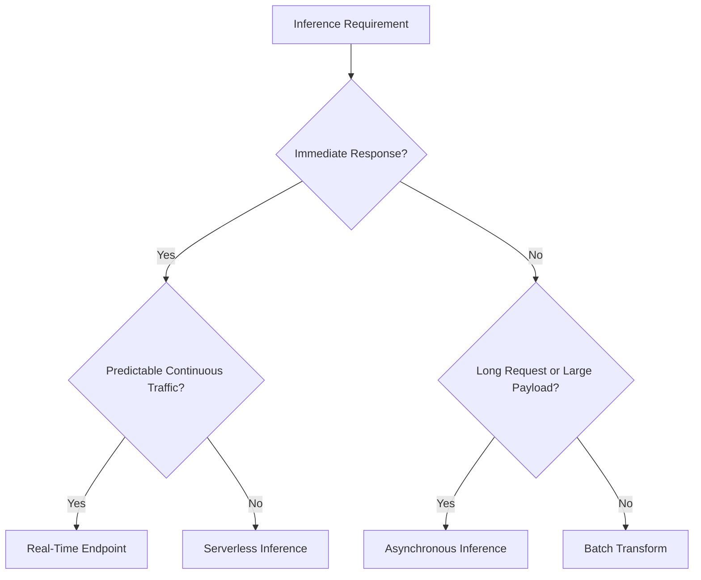

SageMaker documentation describes real-time, serverless, asynchronous, and batch options for different traffic and latency requirements.

---

### 10.1 Real-Time Inference

Use a real-time endpoint when the application requires interactive, low-latency predictions.

Examples:

* Chat
* Live recommendations
* Fraud scoring
* Image classification
* API-based text generation

Real-time inference is intended for interactive workloads requiring low latency.

#### Advantages

* Persistent capacity
* Low warm-request latency
* Autoscaling support
* Multiple instance choices

#### Limitations

* Cost continues while instances are running
* Capacity must be planned
* Scaling policies require configuration

---

### 10.2 Serverless Inference

Serverless Inference manages the underlying infrastructure and scales according to traffic.

It is intended for intermittent or unpredictable workloads that can tolerate cold starts.

#### Best Fit

* Development environments
* Low-volume APIs
* Infrequent classification
* Unpredictable traffic
* Lightweight models

#### Limitation

Cold starts can increase latency. AWS exposes serverless overhead latency through CloudWatch metrics.

---

### 10.3 Asynchronous Inference

Asynchronous Inference queues incoming requests and processes them separately.

AWS positions it for large payloads, long-running inference, and near-real-time workloads. It can scale endpoint capacity to zero when no requests are waiting.

#### Best Fit

* Large image generation jobs
* Long video processing
* Large document analysis
* Slow multimodal models
* Requests that do not need an immediate response

---

### 10.4 Batch Transform

Batch Transform processes datasets without maintaining a live endpoint.

It is suitable for large offline datasets when immediate predictions are not required.

#### Best Fit

* Nightly prediction jobs
* Data warehouse scoring
* Backfilling model outputs
* Offline document processing
* Evaluating a model over a dataset

---

## 11. Deployment Architecture

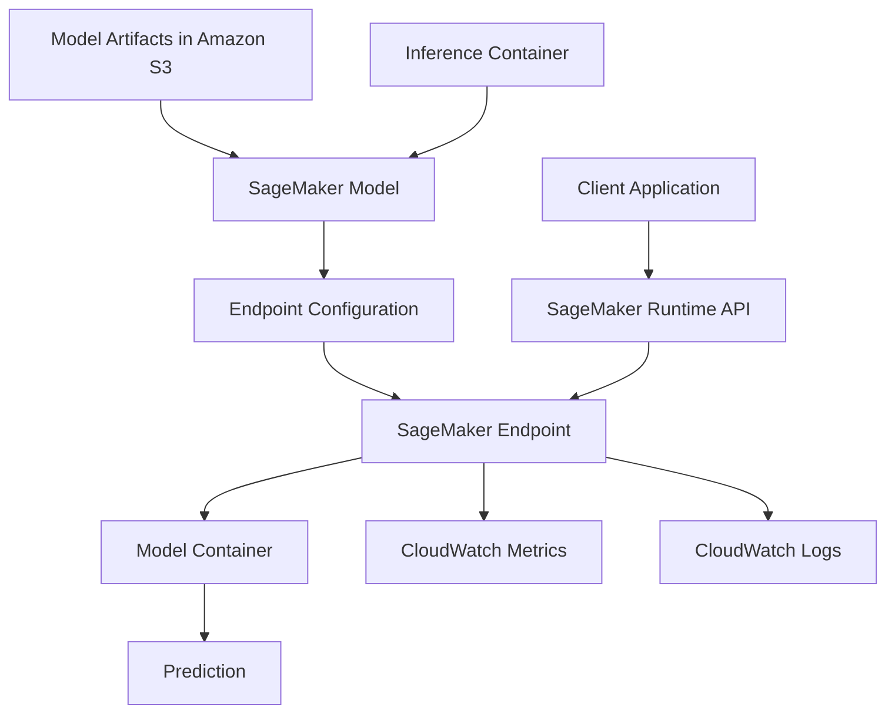

The standard real-time workflow is:

1. Create or obtain model artifacts.
2. Choose an inference container.
3. Create a SageMaker model resource.
4. Create an endpoint configuration.
5. Create an endpoint.
6. Wait until the endpoint becomes `InService`.
7. Invoke the endpoint.
8. Monitor performance and errors.

---

## 12. Practical API Demo

### 12.1 Demo Goal

Build a small Python application that:

1. Sends a prompt to an existing SageMaker endpoint.
2. Measures request latency.
3. Records the endpoint name.
4. Parses the returned JSON.
5. Handles missing configuration and AWS errors.

> The endpoint must already exist and have the status `InService`. The exact request and response formats depend on the selected model and inference container.

---

### 12.2 Install the SDK

```bash
pip install -U boto3
```

Configure AWS credentials using one of these methods:

* IAM role
* AWS IAM Identity Center
* AWS CLI profile
* Environment configuration for local development

Set the endpoint name and Region:

```bash
export SAGEMAKER_ENDPOINT_NAME="your-endpoint-name"
export AWS_REGION="ap-southeast-1"
```

Windows PowerShell:

```powershell
$env:SAGEMAKER_ENDPOINT_NAME="your-endpoint-name"
$env:AWS_REGION="ap-southeast-1"
```

---

### 12.3 Python Demo

```python
import json
import os
import time
from typing import Any

import boto3
from botocore.exceptions import BotoCoreError, ClientError


def invoke_text_endpoint(prompt: str) -> dict[str, Any]:
    """
    Invoke an existing SageMaker real-time endpoint.

    The JSON request shown here is commonly used by text-generation
    containers, but the exact contract must match the selected model.
    """
    normalized_prompt = prompt.strip()

    if not normalized_prompt:
        raise ValueError("The prompt must not be empty.")

    endpoint_name = os.getenv("SAGEMAKER_ENDPOINT_NAME")
    region_name = os.getenv("AWS_REGION")

    if not endpoint_name:
        raise RuntimeError(
            "SAGEMAKER_ENDPOINT_NAME is missing."
        )

    runtime = boto3.client(
        "sagemaker-runtime",
        region_name=region_name,
    )

    payload = {
        "inputs": normalized_prompt,
        "parameters": {
            "max_new_tokens": 256,
            "temperature": 0.2,
            "return_full_text": False,
        },
    }

    started_at = time.perf_counter()

    try:
        response = runtime.invoke_endpoint(
            EndpointName=endpoint_name,
            ContentType="application/json",
            Accept="application/json",
            Body=json.dumps(payload).encode("utf-8"),
        )
    except (BotoCoreError, ClientError) as exc:
        raise RuntimeError(
            f"SageMaker endpoint request failed: {exc}"
        ) from exc

    latency_ms = round(
        (time.perf_counter() - started_at) * 1000,
        2,
    )

    raw_body = response["Body"].read().decode("utf-8")

    try:
        parsed_body = json.loads(raw_body)
    except json.JSONDecodeError:
        parsed_body = {
            "raw_response": raw_body,
        }

    return {
        "endpoint": endpoint_name,
        "latency_ms": latency_ms,
        "request_id": response.get("ResponseMetadata", {}).get(
            "RequestId"
        ),
        "response": parsed_body,
    }


if __name__ == "__main__":
    result = invoke_text_endpoint(
        "Explain vector databases in three concise sentences."
    )

    print(f"Endpoint: {result['endpoint']}")
    print(f"Latency: {result['latency_ms']} ms")
    print(f"Request ID: {result['request_id']}")
    print("\nResponse:")
    print(
        json.dumps(
            result["response"],
            indent=2,
            ensure_ascii=False,
        )
    )
```

Applications invoke deployed real-time endpoints through the SageMaker Runtime `InvokeEndpoint` API. The endpoint can be called through SageMaker Studio, AWS SDKs, or the AWS CLI.

---

## 13. Important Payload Warning

SageMaker does not impose one universal prompt schema on every hosted model.

Different inference containers may expect different formats.

### Example Text-Generation Contract

```json
{
  "inputs": "Explain RAG.",
  "parameters": {
    "max_new_tokens": 200
  }
}
```

### Example Classification Contract

```json
{
  "instances": [
    {
      "text": "The application is very slow."
    }
  ]
}
```

### Example Tensor Contract

```json
{
  "inputs": [
    [0.12, 0.45, 0.91]
  ]
}
```

Before invoking an endpoint, verify:

* `ContentType`
* `Accept`
* Input property names
* Batch format
* Generation parameters
* Image or audio encoding
* Output structure
* Maximum payload size

---

## 14. FastAPI Demo

```python
import json
import os
import time
from typing import Any

import boto3
from botocore.exceptions import BotoCoreError, ClientError
from fastapi import FastAPI, HTTPException
from pydantic import BaseModel, Field


ENDPOINT_NAME = os.getenv("SAGEMAKER_ENDPOINT_NAME")
AWS_REGION = os.getenv("AWS_REGION")

runtime = boto3.client(
    "sagemaker-runtime",
    region_name=AWS_REGION,
)

app = FastAPI(title="SageMaker Text API")


class GenerationRequest(BaseModel):
    prompt: str = Field(min_length=1, max_length=20_000)
    max_new_tokens: int = Field(default=256, ge=1, le=2_048)


class GenerationResponse(BaseModel):
    endpoint: str
    latency_ms: float
    output: Any


@app.post(
    "/generate",
    response_model=GenerationResponse,
)
def generate(payload: GenerationRequest) -> GenerationResponse:
    if not ENDPOINT_NAME:
        raise HTTPException(
            status_code=500,
            detail="The SageMaker endpoint is not configured.",
        )

    request_body = {
        "inputs": payload.prompt,
        "parameters": {
            "max_new_tokens": payload.max_new_tokens,
            "temperature": 0.2,
            "return_full_text": False,
        },
    }

    started_at = time.perf_counter()

    try:
        response = runtime.invoke_endpoint(
            EndpointName=ENDPOINT_NAME,
            ContentType="application/json",
            Accept="application/json",
            Body=json.dumps(request_body).encode("utf-8"),
        )
    except ClientError as exc:
        status_code = exc.response.get(
            "ResponseMetadata",
            {},
        ).get("HTTPStatusCode", 502)

        raise HTTPException(
            status_code=status_code,
            detail="The model endpoint could not complete the request.",
        ) from exc
    except BotoCoreError as exc:
        raise HTTPException(
            status_code=502,
            detail="AWS could not complete the request.",
        ) from exc

    latency_ms = round(
        (time.perf_counter() - started_at) * 1000,
        2,
    )

    raw_output = response["Body"].read().decode("utf-8")

    try:
        parsed_output = json.loads(raw_output)
    except json.JSONDecodeError:
        parsed_output = raw_output

    return GenerationResponse(
        endpoint=ENDPOINT_NAME,
        latency_ms=latency_ms,
        output=parsed_output,
    )
```

Run the API:

```bash
uvicorn main:app --reload
```

Test it:

```bash
curl -X POST "http://localhost:8000/generate" \
  -H "Content-Type: application/json" \
  -d '{
    "prompt": "Explain the difference between training and inference.",
    "max_new_tokens": 200
  }'
```

---

## 15. OpenAI-Compatible Endpoints

SageMaker AI also supports an OpenAI-compatible API path for supported real-time endpoint configurations.

This can let applications use tools such as:

* OpenAI Python SDK
* LangChain
* Agent frameworks using OpenAI-compatible interfaces

AWS documents an authentication flow that generates short-lived bearer tokens from existing AWS credentials rather than requiring a permanent external API key.

### Architecture

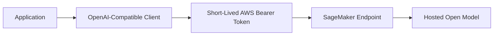

This approach can reduce code changes when an application already uses an OpenAI-compatible provider abstraction.

---

## 16. Model Selection Framework

Selecting a SageMaker model requires evaluating both the model and its infrastructure.

### 16.1 Evaluation Dimensions

| Dimension               | Evaluation Question                              |
| ----------------------- | ------------------------------------------------ |
| **Task quality**        | Does the model solve the real product task?      |
| **Latency**             | Does the endpoint meet the UX target?            |
| **Throughput**          | How many requests can it handle?                 |
| **Model size**          | Can it fit on the selected instance?             |
| **Infrastructure cost** | How much does the endpoint cost while running?   |
| **Context length**      | Can the model process the required input?        |
| **Output quality**      | Does it follow prompts and output schemas?       |
| **Language quality**    | Does it perform well in target languages?        |
| **License**             | Is the intended use permitted?                   |
| **Customization**       | Can it be fine-tuned or adapted?                 |
| **Container support**   | Is a compatible inference image available?       |
| **Region**              | Is the model and instance type available?        |
| **Security**            | Can it run inside the required network boundary? |
| **Maintenance**         | Who updates the model and container?             |

---

### 16.2 Weighted Score Example

```text
Total Model Score =
    Task Quality × 0.25
  + Reliability × 0.15
  + Latency × 0.15
  + Throughput × 0.10
  + Infrastructure Cost × 0.10
  + Memory Efficiency × 0.10
  + License Fit × 0.05
  + Security Fit × 0.05
  + Maintenance Fit × 0.05
```

Weights should change according to the product.

Examples:

* A real-time assistant should prioritize first-token latency.
* A batch classifier should prioritize throughput.
* A private enterprise application should prioritize networking and security.
* A narrow classification task may benefit from a small specialized model.
* A complex reasoning feature may justify a larger model.

---

## 17. Choosing an Instance

Model deployment requires selecting appropriate compute.

Possible considerations include:

* CPU or GPU
* GPU memory
* System memory
* Network bandwidth
* Model precision
* Quantization
* Batch size
* Concurrent requests
* Expected output length

### Capacity Decision Flow

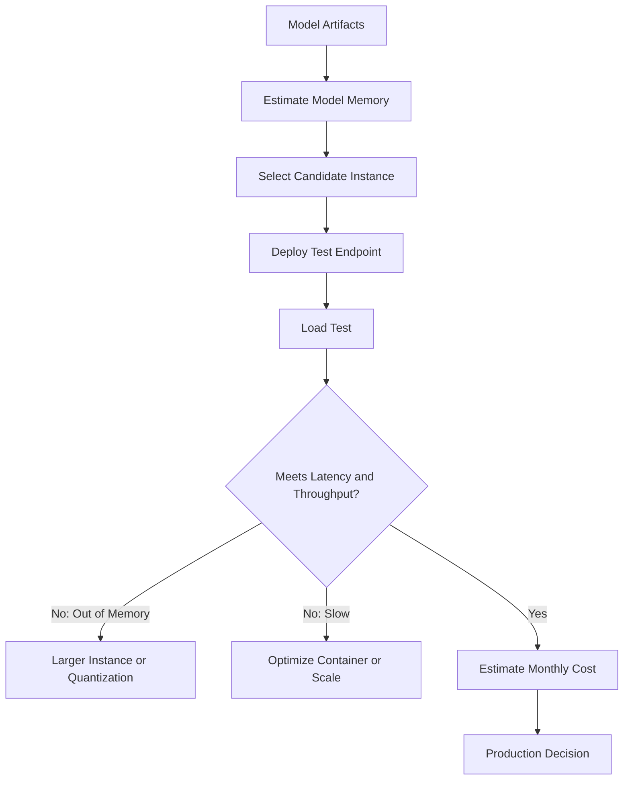

Do not select an instance only because the model loads successfully. It must also meet:

* P95 latency target
* Throughput target
* Availability target
* Cost target

---

## 18. Scaling Strategies

### Vertical Scaling

Use a larger instance.

```text
Smaller GPU
    ↓
Larger GPU with more memory and compute
```

### Horizontal Scaling

Use more instances behind the endpoint.

```text
Endpoint
├── Instance 1
├── Instance 2
└── Instance 3
```

### Model Optimization

Possible techniques include:

* Quantization
* Smaller models
* Optimized inference engines
* Request batching
* Shorter context
* Limited output length
* Model compilation
* Caching

### Routing

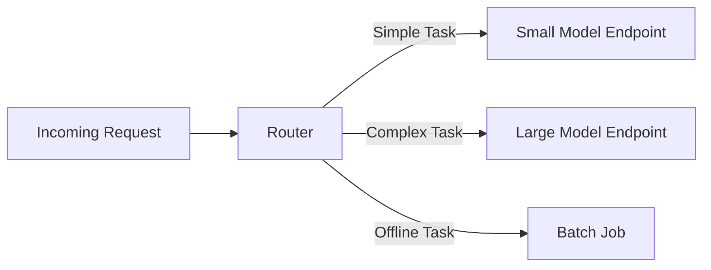

---

## 19. SageMaker and RAG

SageMaker can host one or more models used in a Retrieval-Augmented Generation pipeline.

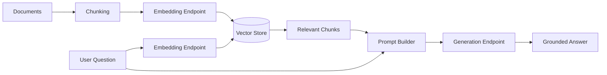

### Possible SageMaker Roles

* Embedding generation
* Query rewriting
* Reranking
* Answer generation
* Classification
* Safety checking
* Citation verification

The vector store may be:

* A managed vector search service
* A relational database with vector support
* A self-managed vector database
* An in-memory index for a prototype

### RAG Request Flow

```text
User question
→ Create query embedding
→ Retrieve candidate documents
→ Optional reranking
→ Build context
→ Invoke SageMaker generation endpoint
→ Validate answer and citations
```

---

## 20. RAG Evaluation

A production RAG system should evaluate each stage separately.

### Retrieval Metrics

* Recall@K
* Precision@K
* Mean Reciprocal Rank
* Top-result accuracy
* Reranking accuracy

### Generation Metrics

* Correctness
* Groundedness
* Relevance
* Citation support
* Completeness
* Refusal when evidence is missing

### System Metrics

* Retrieval latency
* Generation latency
* Total latency
* Endpoint cost
* Error rate
* Timeout rate

A strong generation model cannot recover information that the retrieval system failed to find.

---

## 21. Model Registry and MLOps

Model Registry helps organize model versions and approval states.

### Example Lifecycle

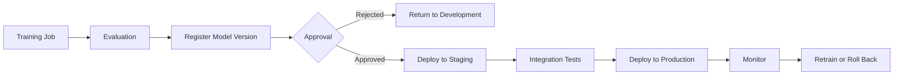

### Recommended Metadata

Store:

* Model name
* Model version
* Training dataset version
* Training code revision
* Container image
* Evaluation metrics
* Approval status
* Endpoint name
* Deployment date
* Responsible owner

SageMaker Model Registry supports model groups and versioned model packages for tracking multiple model candidates.

---

## 22. Authentication and Security

### IAM Execution Role

SageMaker uses an execution role when it needs to access AWS resources.

### Application Role

The application invoking an endpoint should have only the permissions it requires.

Example permission:

```json
{
  "Version": "2012-10-17",
  "Statement": [
    {
      "Effect": "Allow",
      "Action": "sagemaker:InvokeEndpoint",
      "Resource": "arn:aws:sagemaker:REGION:ACCOUNT_ID:endpoint/ENDPOINT_NAME"
    }
  ]
}
```

AWS provides resource-level IAM permissions for SageMaker API operations, including endpoint access controls.

### Recommended Security Practices

* Use IAM roles instead of embedded access keys.
* Apply least-privilege permissions.
* Encrypt model artifacts and endpoint data.
* Restrict access to model endpoints.
* Use private networking where required.
* Store data in approved Regions.
* Scan container images.
* Pin container versions.
* Record administrative actions.
* Protect inference logs.

SageMaker can be accessed through VPC interface endpoints so that supported traffic stays within AWS networking rather than using the public internet.

---

## 23. Logging and Observability

### Example Application Log

```json
{
  "request_id": "req_01SM123",
  "feature": "support_ticket_analysis",
  "provider": "aws_sagemaker",
  "region": "ap-southeast-1",
  "endpoint": "ticket-model-production",
  "model_version": "17",
  "container_version": "approved-image-tag",
  "latency_ms": 482.7,
  "input_characters": 241,
  "output_characters": 318,
  "status": "success"
}
```

### Endpoint Metrics

Track:

* Invocation count
* Invocation errors
* Model latency
* Overhead latency
* CPU utilization
* GPU utilization
* Memory utilization
* Disk utilization
* Concurrent requests
* Requests per instance
* P50 latency
* P95 latency
* P99 latency

SageMaker endpoint metrics are available through CloudWatch for operational monitoring and historical analysis.

### Token Usage

Unlike a single standardized hosted LLM API, a custom SageMaker endpoint may not always return token counts in the same structure.

For language models, measure token usage by:

* Reading usage fields returned by the selected container
* Using the model tokenizer in the gateway
* Recording input and output token counts in custom inference code

---

## 24. Model Monitoring Lifecycle Note

SageMaker Model Monitor has historically provided data-quality, model-quality, bias-drift, and feature-attribution monitoring.

However, AWS documentation currently states that new-customer access will close at the end of July 2026, while existing customers can continue using it. New production designs should verify current availability and maintain an alternative monitoring approach based on data capture, evaluation jobs, CloudWatch, and custom drift detection.

### Alternative Monitoring Flow

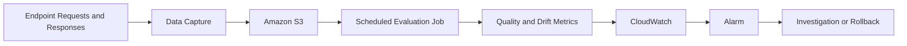

SageMaker endpoint data capture can record sampled inference inputs and outputs for analysis and debugging.

---

## 25. Cost Considerations

SageMaker cost may include:

* Notebook compute
* Training instances
* Training storage
* Model artifact storage
* Endpoint instances
* Serverless inference
* Asynchronous processing
* Batch Transform
* Data transfer
* Logging
* Monitoring
* Idle resources

### Simplified Formula

```text
Total SageMaker Cost =
    Development Compute
  + Training Compute
  + Model Storage
  + Inference Compute
  + Data Transfer
  + Monitoring
```

### Cost Optimization Methods

* Stop unused notebook resources.
* Delete unused endpoints.
* Use Serverless Inference for intermittent traffic.
* Use asynchronous inference for long requests.
* Use Batch Transform for offline datasets.
* Choose smaller specialized models.
* Quantize models when quality remains acceptable.
* Configure autoscaling.
* Limit unnecessary output generation.
* Track cost per successful prediction.

SageMaker Serverless Inference charges based on usage rather than continuously running endpoint instances, while real-time deployments require provisioned resources.

---

## 26. Common Production Failures

### 26.1 Endpoint Is Not `InService`

#### Symptoms

* Invocation fails
* Endpoint is still creating
* Endpoint update is in progress
* Deployment failed

#### Debugging

Check:

* Endpoint status
* Failure reason
* Container logs
* Model artifact location
* Instance availability
* IAM permissions

---

### 26.2 Incorrect Request Schema

#### Problem

The endpoint expects `instances`, but the application sends `inputs`.

#### Symptoms

* HTTP 400
* Container parsing error
* Empty result
* Unexpected output

#### Fix

Use the input contract documented for the selected model and container.

---

### 26.3 Model Does Not Fit in Memory

#### Symptoms

* Container exits
* Endpoint creation fails
* CUDA out-of-memory error
* Health check fails

#### Possible Solutions

* Larger instance
* Smaller model
* Quantized weights
* Tensor parallel deployment
* Lower batch size
* Optimized serving engine

---

### 26.4 Wrong AWS Region

#### Problem

The application invokes an endpoint in a different Region.

#### Symptoms

* Endpoint not found
* Authentication succeeds but invocation fails

#### Fix

Make the endpoint Region an explicit configuration value.

---

### 26.5 Missing IAM Permission

#### Symptoms

```text
AccessDeniedException
```

#### Check

* Application role
* Execution role
* `sagemaker:InvokeEndpoint`
* S3 permissions
* Container registry permissions
* Encryption key permissions

---

### 26.6 Exposing AWS Credentials

Do not store long-lived AWS access keys in:

* Source code
* Mobile applications
* Frontend JavaScript
* Public repositories
* Docker images

Use:

* IAM roles
* Task roles
* Instance profiles
* IAM Identity Center
* Short-lived credentials

---

### 26.7 Paying for an Idle Endpoint

#### Problem

A large GPU endpoint runs continuously with little traffic.

#### Possible Solutions

* Serverless Inference
* Asynchronous Inference with scale-to-zero
* Endpoint autoscaling
* Scheduled endpoint creation and deletion
* Smaller instances
* Shared or multi-model hosting where suitable

---

### 26.8 Measuring Only Average Latency

Average latency hides slow requests.

Track:

```text
P50 latency
P95 latency
P99 latency
Model latency
Overhead latency
Cold-start latency
Timeout rate
```

---

### 26.9 No Model Version Tracking

#### Problem

The endpoint is updated, but the logs only contain its name.

#### Impact

A quality regression cannot be connected to a specific model version.

#### Log

* Endpoint
* Endpoint configuration
* Model Registry version
* Container image
* Model artifact revision
* Prompt version
* Deployment timestamp

---

### 26.10 Using the Largest Model for Every Task

A large generative model may be unnecessary for:

* Routing
* Sentiment classification
* Spam detection
* Named Entity Recognition
* Simple data extraction

A smaller specialized model can provide:

* Lower latency
* Lower cost
* Higher throughput
* Easier validation

---

### 26.11 No Evaluation Dataset

One successful example is not enough.

Test:

* Normal requests
* Empty requests
* Long requests
* Vietnamese input
* English input
* Mixed-language input
* Malformed JSON
* Prompt injection
* Unsupported questions
* Historical failure cases

---

### 26.12 No Fallback Strategy

Define what happens when:

* Endpoint is unavailable
* Capacity is exhausted
* Request times out
* Output is invalid
* Model quality falls
* Deployment fails

Possible fallbacks include:

* Backup endpoint
* Smaller model
* Another AWS Region
* Managed model API
* Cached result
* Rule-based output
* Human-review queue

---

## 27. Debugging Checklist

```text
1. Does the endpoint exist?
2. Is the endpoint status InService?
3. Is the application using the correct Region?
4. Does the caller have sagemaker:InvokeEndpoint?
5. Does the payload match the model contract?
6. Is ContentType correct?
7. Is the model container healthy?
8. Can the model fit on the instance?
9. What do CloudWatch logs show?
10. Is the endpoint being throttled?
11. Did output parsing fail?
12. Which model and container versions are deployed?
```

### Common Error Categories

| Error                   | Likely Cause                        |
| ----------------------- | ----------------------------------- |
| `AccessDeniedException` | Missing IAM permission              |
| Endpoint not found      | Wrong name or Region                |
| `ModelError`            | Inference-container failure         |
| `InternalFailure`       | Service or container problem        |
| Timeout                 | Model too slow or request too large |
| Out of memory           | Instance too small                  |
| HTTP 400                | Incorrect request format            |
| HTTP 429                | Capacity or throttling issue        |

---

## 28. Practical Exercises

### Exercise 1 — Five-Line Summary

Without reviewing the lesson, explain:

1. What SageMaker is
2. What JumpStart provides
3. What an endpoint does
4. How real-time and batch inference differ
5. How you would select a model

---

### Exercise 2 — Invoke an Endpoint

Create a Python script that:

* Reads a prompt from the terminal
* Sends it to a SageMaker endpoint
* Prints the result
* Measures latency
* Records the endpoint name
* Handles an empty prompt
* Handles AWS API errors

---

### Exercise 3 — Compare Inference Options

Complete this table:

| Dimension        | Real-Time | Serverless | Asynchronous | Batch |
| ---------------- | --------: | ---------: | -----------: | ----: |
| Immediate result |           |            |              |       |
| Cold-start risk  |           |            |              |       |
| Large payloads   |           |            |              |       |
| Long processing  |           |            |              |       |
| Idle cost        |           |            |              |       |
| Best workload    |           |            |              |       |

---

### Exercise 4 — Model Comparison

Deploy or evaluate two models for the same task.

Measure:

| Metric                | Model A | Model B |
| --------------------- | ------: | ------: |
| Quality score         |         |         |
| Instance type         |         |         |
| Model load time       |         |         |
| P50 latency           |         |         |
| P95 latency           |         |         |
| Throughput            |         |         |
| Memory usage          |         |         |
| Estimated hourly cost |         |         |
| License fit           |         |         |

---

### Exercise 5 — RAG Demo

Build this pipeline:

```text
Markdown or PDF documents
→ Chunking
→ Embedding model on SageMaker
→ Vector database
→ Retrieval
→ Generative model on SageMaker
→ Answer with citations
```

Record:

* Embedding model
* Generation model
* Endpoint types
* Chunk size
* Number of retrieved chunks
* Retrieval latency
* Generation latency
* Groundedness
* Total cost estimate

---

### Exercise 6 — Production Failure Report

```markdown
## Failure

The production endpoint failed during model startup.

## Impact

All requests to the AI feature returned server errors.

## Detection

The endpoint remained in the Failed state and CloudWatch showed
a CUDA out-of-memory error.

## Root Cause

The selected model did not fit in the GPU memory of the configured
instance.

## Immediate Fix

Deploy the previous smaller model.

## Permanent Fix

Add a memory benchmark before deployment and require load testing
on the target instance type.

## Prevention

Validate model size, precision, quantization, batch size, and
instance capacity in the release pipeline.
```

---

## 29. Completion Checklist

### Understanding

* [ ] I can explain AWS SageMaker in one or two minutes.
* [ ] I understand SageMaker Unified Studio.
* [ ] I can distinguish SageMaker from SageMaker AI.
* [ ] I understand JumpStart.
* [ ] I understand training and fine-tuning.
* [ ] I can explain Model Registry.
* [ ] I can distinguish real-time, serverless, asynchronous, and batch inference.
* [ ] I understand the practical difference between SageMaker and Bedrock.

### Implementation

* [ ] I have invoked a SageMaker endpoint.
* [ ] I use IAM authentication.
* [ ] I configure the endpoint and Region outside the source code.
* [ ] I understand the endpoint input schema.
* [ ] I measure request latency.
* [ ] I parse model output safely.
* [ ] I handle AWS errors.
* [ ] I have tested at least one failure case.

### Production Readiness

* [ ] Model and container versions are recorded.
* [ ] The model license has been reviewed.
* [ ] The target instance has been load-tested.
* [ ] P50 and P95 latency are measured.
* [ ] Throughput has been measured.
* [ ] Endpoint cost is monitored.
* [ ] IAM follows least privilege.
* [ ] CloudWatch alarms exist.
* [ ] Sensitive inference data is protected.
* [ ] A fallback strategy is documented.
* [ ] An evaluation dataset exists.
* [ ] Rollback has been tested.

---

## 30. Related Outcome

> Choose pre-trained AI models based on capability, context length, latency, cost, safety, infrastructure, licensing, and product fit.

A strong model-selection explanation could be:

```text
We selected this JumpStart model because it met our Vietnamese
classification accuracy target and could be deployed on an instance
that stayed within our P95 latency and monthly cost limits.

We selected Serverless Inference because the feature receives
intermittent traffic and can tolerate occasional cold starts.
```

A weak explanation would be:

```text
We selected SageMaker because AWS is popular.
```

---

## 31. Related Project

# Project 2 — Model Comparison App

Build an application that compares two or three models or deployment configurations.

### Example Comparison

```text
SageMaker small-model endpoint
vs.
SageMaker large-model endpoint
vs.
Another managed model provider
```

You may also compare:

```text
Real-Time Inference
vs.
Serverless Inference
vs.
Asynchronous Inference
```

### Required Features

* Provider selection
* Endpoint selection
* Model version
* Shared input
* Side-by-side output
* Request latency
* Endpoint error
* Input and output size
* Token usage when available
* Instance type
* Estimated cost
* Manual quality score
* Result history

### Suggested Architecture

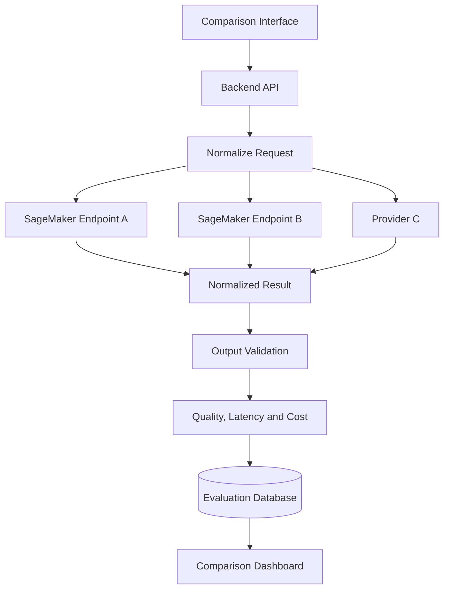

### Normalized Response

```json
{
  "provider": "aws_sagemaker",
  "region": "ap-southeast-1",
  "endpoint": "configured-endpoint",
  "model_version": "17",
  "response": "Generated answer",
  "latency_ms": 492.8,
  "input_tokens": null,
  "output_tokens": null,
  "instance_type": "configured-instance",
  "schema_valid": true,
  "status": "success",
  "error": null
}
```

### Evaluation Dataset

Include at least 20 cases covering:

* Summarization
* Classification
* Data extraction
* Code generation
* Reasoning
* Vietnamese output
* English output
* Mixed-language input
* Long input
* Invalid input
* Prompt injection
* Structured output
* Historical failures

### Final Report Questions

1. Which model produced the highest task quality?
2. Which endpoint had the lowest latency?
3. Which configuration had the highest throughput?
4. Which model used the least infrastructure?
5. Which model performed best in Vietnamese?
6. Did the larger model justify its additional cost?
7. Which inference option best matched the traffic pattern?
8. Which configuration had the lowest error rate?
9. Should the application use model routing?
10. What fallback endpoint should be configured?

---

## 32. Suggested 20-Minute Lesson Plan

|          Time | Activity                                          |
| ------------: | ------------------------------------------------- |
|   0–3 minutes | Explain Amazon SageMaker and SageMaker AI         |
|   3–6 minutes | Introduce JumpStart, Training, and Model Registry |
|  6–10 minutes | Compare inference options                         |
| 10–14 minutes | Run the Boto3 endpoint demo                       |
| 14–17 minutes | Explain model selection and RAG                   |
| 17–19 minutes | Discuss security, monitoring, and cost            |
| 19–20 minutes | Assign the model-comparison exercise              |

---

## 33. Key Takeaways

1. Amazon SageMaker is now a broader platform for data, analytics, AI, and machine learning.
2. SageMaker Unified Studio provides a unified development environment.
3. SageMaker AI focuses on building, training, fine-tuning, and deploying models.
4. JumpStart provides access to pre-trained and foundation models.
5. Every JumpStart model must be evaluated for task fit, license, hardware, and safety.
6. Model Registry tracks approved model versions.
7. Real-time endpoints support low-latency interactive workloads.
8. Serverless Inference is useful for intermittent traffic that can tolerate cold starts.
9. Asynchronous Inference supports long-running requests and larger payloads.
10. Batch Transform is appropriate for offline predictions.
11. Endpoint payload formats depend on the selected model container.
12. Applications invoke real-time endpoints through the SageMaker Runtime API.
13. IAM roles should replace hard-coded AWS credentials.
14. CloudWatch should monitor endpoint performance and errors.
15. Model, container, endpoint, and prompt versions should be recorded.
16. Larger models require more infrastructure and are not always better.
17. Cost must include idle endpoint capacity, not only request volume.
18. RAG can use separate SageMaker endpoints for embeddings and generation.
19. A production system requires load tests, evaluation data, alarms, and rollback.
20. The best model is the one that meets the product’s measured quality, latency, cost, infrastructure, and safety requirements.

---

## 34. Final Summary

**AWS SageMaker** is an important platform in the modern AI Engineer roadmap because it gives teams extensive control over the machine-learning lifecycle.

A capable AI Engineer should be able to:

* Discover models through JumpStart
* Review licenses and model requirements
* Train or fine-tune a model
* Register model versions
* Select an appropriate inference option
* Deploy models to managed endpoints
* Invoke endpoints securely
* Measure latency, throughput, and cost
* Build RAG systems with hosted embedding and generation models
* Monitor infrastructure with CloudWatch
* Protect data with IAM and private networking
* Debug container and endpoint failures
* Define fallback and rollback behavior
* Explain why SageMaker is or is not the correct platform for a product

Turn this lesson into a working endpoint, RAG assistant, model-deployment comparison, inference benchmark, MLOps pipeline, or portfolio report so that the knowledge becomes practical engineering experience.

---

# Bài luyện tập

## Mục tiêu


## Đề bài


## Yêu cầu hoàn thành

- [ ] 
- [ ] 
- [ ] 

## Kết quả / lời giải


## Ghi chú
