# 013 — Cut-off Dates and Knowledge

| Field                  | Details                                       |
| ---------------------- | --------------------------------------------- |
| **Course**             | 02 — Model Platforms and Prompting            |
| **Module**             | Module 03 — Using Pre-trained Models          |
| **Content Group**      | Selection Criteria                            |
| **Roadmap Source**     | Using Pre-trained Models / Selection Criteria |
| **Lesson Type**        | Model Selection                               |
| **Order in Module**    | 013                                           |
| **Suggested Duration** | 20 minutes                                    |

---

## 1. Summary

A model’s **knowledge cutoff** is the latest general period represented in its training knowledge.

A model may know many facts from before that date, but it should not be assumed to know:

* Recent news
* Current prices
* New laws or policies
* Current company leaders
* Recent product releases
* Live sports results
* Today’s weather
* Updated software documentation
* Private company information
* User-specific records

A knowledge cutoff is not the same as the current date, and it is not a guarantee that the model knows every fact published before the cutoff.

For current, changing, private, or organization-specific information, an AI application should use:

* Web search
* External APIs
* Databases
* Retrieval-Augmented Generation
* File search
* Enterprise search
* Tool calling
* Human-provided context

A reliable AI application must distinguish between:

```text
Model prior knowledge
        and
Retrieved or tool-provided knowledge
```

The application should also communicate where important information came from and when it was last updated.

---

## 2. Learning Objectives

After completing this lesson, you should be able to:

1. Explain a model knowledge cutoff in your own words.
2. Distinguish training knowledge from current retrieved data.
3. Explain why a cutoff is not a complete description of model knowledge.
4. Recognize questions that require fresh or private information.
5. Route requests to search, RAG, APIs, databases, or tools.
6. Add source dates and provenance to generated answers.
7. Detect stale documents in a knowledge base.
8. Design fallback behavior when current information is unavailable.
9. Evaluate answer freshness, groundedness, and citation quality.
10. Add knowledge-freshness checks to a model-comparison application.

---

## 3. What Is a Knowledge Cutoff?

A **knowledge cutoff** is the approximate latest period included in a model’s general training knowledge.

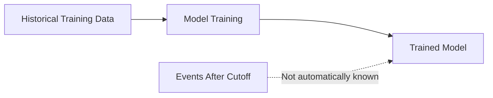

For example, suppose a model has a cutoff in December of a given year.

It may know:

* Historical events before that period
* Older product documentation
* Previously published scientific research
* Established programming concepts

It should not automatically be trusted for:

* Events from the following year
* New software versions
* Recently changed prices
* Current officeholders
* New regulations

---

## 4. Important Limitations of a Cutoff Date

A cutoff date is useful, but it does not fully describe what the model knows.

### 4.1 The Model Does Not Know Everything Before the Cutoff

Training data is incomplete.

A fact may have existed before the cutoff but still be:

* Missing from training
* Rarely mentioned
* Poorly represented
* Conflicting across sources
* Forgotten during training
* Difficult for the model to retrieve reliably

Therefore:

```text
Published before cutoff
        ≠
Known accurately by the model
```

---

### 4.2 The Cutoff Does Not Mean Zero Knowledge After That Date

A model may receive:

* Tool results
* Retrieved documents
* User-provided context
* Search results
* API responses
* Conversation updates

This information can allow it to answer questions about events after its training cutoff.

The answer is then based on **external evidence**, not only on training memory.

---

### 4.3 Cutoff Dates May Differ by Model

Different model versions may have different:

* Training datasets
* Cutoff periods
* update schedules
* search capabilities
* tool support
* retrieval integrations

Never assume that all models from the same provider share the same cutoff.

---

### 4.4 Cutoff and Current Date Are Different

The application may know the current system date even when the model does not know current events.

```text
Current date awareness
        ≠
Current world knowledge
```

Knowing that today is July 17 does not mean the model knows what happened on July 16.

---

## 5. Types of Knowledge in an AI Application

An AI application may combine several kinds of knowledge.

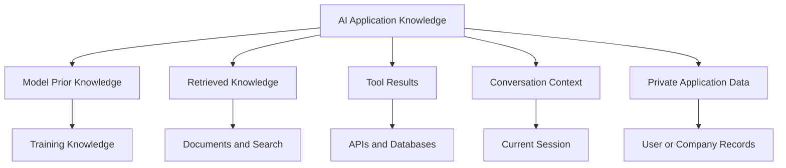

### 5.1 Model Prior Knowledge

Information learned during training.

Useful for:

* General concepts
* Historical background
* Common programming patterns
* Stable definitions
* Reasoning and writing

Weak for:

* Recent developments
* Exact current values
* Private information
* Rapidly changing rules

---

### 5.2 Retrieved Knowledge

Information selected from external sources and added to the prompt.

Examples:

* Knowledge-base documents
* Product documentation
* Legal policies
* Internal manuals
* Research papers
* Web search results

---

### 5.3 Tool-Provided Knowledge

Structured information returned by an external operation.

Examples:

* Current weather
* Currency conversion
* Order status
* Account balance
* Stock price
* Calendar availability
* Database query result

---

### 5.4 Conversation Knowledge

Information supplied earlier in the current conversation.

Examples:

* User preferences
* Clarifications
* Project requirements
* Previous decisions

Conversation knowledge is temporary unless the application stores it separately.

---

### 5.5 Private Knowledge

Information that is not present in public model training.

Examples:

* Company revenue
* Private source code
* Customer records
* Internal documentation
* Unpublished research
* Personal files

Private knowledge must be provided through secure retrieval or tools.

---

## 6. Stable vs Time-Sensitive Questions

A useful application should classify whether a request requires fresh information.

### Stable Questions

These are unlikely to change frequently.

Examples:

```text
What is a binary search?
What is an API?
Explain gradient descent.
What is a foreign key?
```

These questions can often be answered using model knowledge.

### Time-Sensitive Questions

These may change daily, weekly, or monthly.

Examples:

```text
Who is the current CEO?
What is the latest model version?
What is today's exchange rate?
What happened in the election?
What is the current price?
```

These questions usually require search or a live API.

### Private Questions

These require user-specific or organization-specific information.

Examples:

```text
What is my current subscription?
Which tasks are assigned to me?
What did our latest internal report say?
Where is order A-1024?
```

These require authenticated tools or private retrieval.

---

## 7. Freshness Classification

A production system can classify requests into freshness levels.

| Level                   | Description                    | Example                          |
| ----------------------- | ------------------------------ | -------------------------------- |
| **Static**              | Changes rarely                 | Definition of recursion          |
| **Slow-changing**       | Changes over months or years   | Standard software architecture   |
| **Frequently changing** | Changes weekly or monthly      | Product features or prices       |
| **Live**                | Changes hourly or continuously | Weather, markets, scores         |
| **Private**             | Depends on protected data      | User account or internal records |

### Routing Diagram

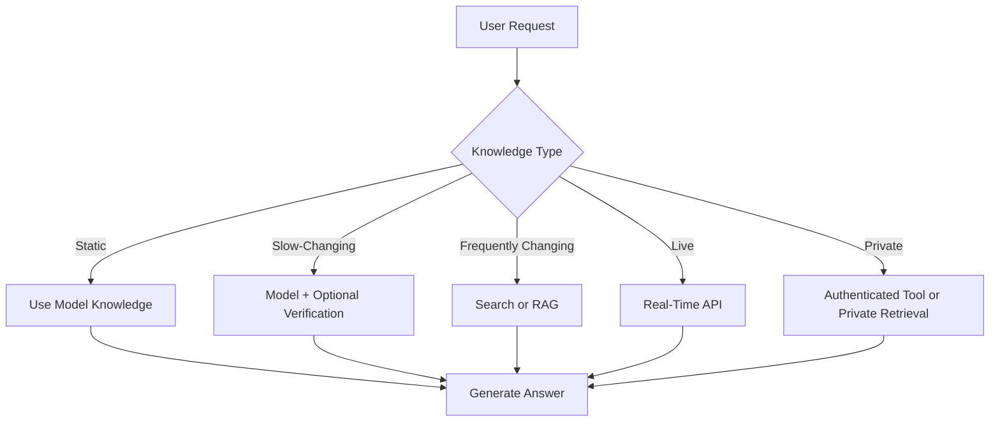

---

## 8. Freshness-Aware Request Routing

A simple request router can decide whether an external source is required.

### Example Rules

```text
Contains "today", "current", "latest", "recent"
        → Require fresh source

Asks about prices, weather, markets, schedules
        → Require live API

Asks about private account or company data
        → Require authenticated tool

Asks for a stable definition
        → Model knowledge may be sufficient
```

Rules are useful, but they are not perfect.

The system may also use a classifier model to decide:

```json
{
  "knowledge_type": "live",
  "requires_external_source": true,
  "recommended_source": "weather_api",
  "reason": "The user asks for today's weather."
}
```

---

## 9. Practical Demo: Freshness Router

### 9.1 Demo Goal

Build a small Python component that:

1. Receives a user question.
2. Detects freshness-related language.
3. Classifies the question.
4. Selects a suitable knowledge source.
5. Returns a routing decision.

### 9.2 Python Example

```python
from dataclasses import asdict, dataclass
from enum import Enum


class KnowledgeType(str, Enum):
    STATIC = "static"
    CHANGING = "changing"
    LIVE = "live"
    PRIVATE = "private"


@dataclass
class RoutingDecision:
    knowledge_type: KnowledgeType
    requires_external_source: bool
    recommended_source: str
    reason: str


LIVE_TERMS = {
    "today",
    "now",
    "current weather",
    "live score",
    "exchange rate",
    "stock price",
}

CHANGING_TERMS = {
    "latest",
    "recent",
    "current version",
    "current ceo",
    "new release",
    "this year",
}

PRIVATE_TERMS = {
    "my account",
    "my order",
    "my calendar",
    "our internal",
    "our company",
    "assigned to me",
}


def classify_knowledge_request(question: str) -> RoutingDecision:
    normalized = question.strip().lower()

    if not normalized:
        raise ValueError("The question must not be empty.")

    if any(term in normalized for term in PRIVATE_TERMS):
        return RoutingDecision(
            knowledge_type=KnowledgeType.PRIVATE,
            requires_external_source=True,
            recommended_source="authenticated_private_tool",
            reason="The request depends on user-specific or private data.",
        )

    if any(term in normalized for term in LIVE_TERMS):
        return RoutingDecision(
            knowledge_type=KnowledgeType.LIVE,
            requires_external_source=True,
            recommended_source="real_time_api",
            reason="The requested information can change continuously.",
        )

    if any(term in normalized for term in CHANGING_TERMS):
        return RoutingDecision(
            knowledge_type=KnowledgeType.CHANGING,
            requires_external_source=True,
            recommended_source="web_search_or_rag",
            reason="The request asks for recent or frequently changing information.",
        )

    return RoutingDecision(
        knowledge_type=KnowledgeType.STATIC,
        requires_external_source=False,
        recommended_source="model_prior_knowledge",
        reason="The request appears to concern stable general knowledge.",
    )


if __name__ == "__main__":
    questions = [
        "What is a vector database?",
        "What is the latest version of this library?",
        "What is the exchange rate today?",
        "Where is my order?",
    ]

    for question in questions:
        decision = classify_knowledge_request(question)

        print("\nQuestion:", question)
        print(asdict(decision))
```

This rule-based version is suitable for learning and prototyping. A production system should combine rules, model classification, domain-specific policies, and fallback verification.

---

## 10. Retrieval-Augmented Generation

RAG supplies external information to a model before it generates an answer.

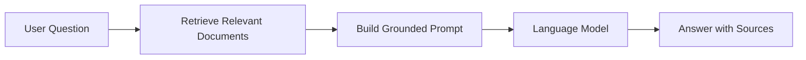

RAG is useful for:

* Private company knowledge
* Current documentation
* Product catalogs
* Frequently updated policies
* Legal or compliance documents
* Source-backed answers

### RAG Does Not Change the Model’s Training Cutoff

RAG does not permanently update the model.

Instead:

```text
Model prior knowledge
        +
Retrieved information for this request
        =
Grounded response
```

The retrieved information normally exists only in the current request or session.

---

## 11. Browsing and Web Search

Web search is useful when information is public and time-sensitive.

Examples include:

* News
* Product announcements
* Current officeholders
* Updated documentation
* Event schedules
* Public prices
* Recent research

### Browsing Flow

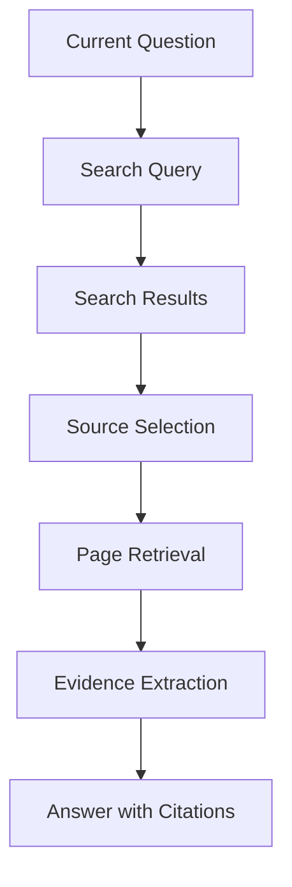

A reliable browsing system should evaluate:

* Source authority
* Publication date
* Event date
* Conflicting claims
* Primary vs secondary sources
* Whether the page is still current

---

## 12. APIs for Live Information

Search is not always the best source.

Structured APIs are better for values such as:

* Weather
* Currency rates
* Sports scores
* Inventory
* Transport schedules
* Account status
* Market prices

### API-Based Flow

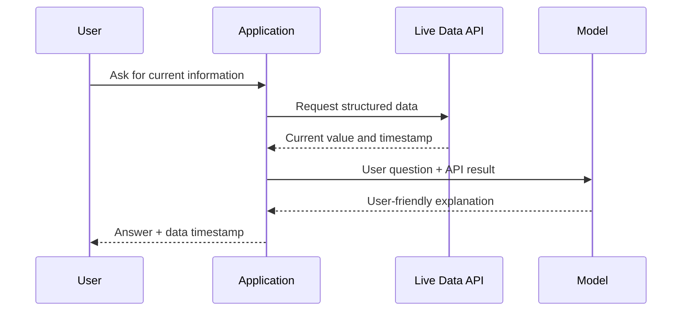

The application should treat the API result as the source of truth for that request.

---

## 13. Source Provenance

**Provenance** means recording where information came from.

A generated answer may be based on:

* Model knowledge
* Retrieved document
* Web page
* Database record
* External API
* Tool output
* User-provided text

### Example Provenance Record

```json
{
  "answer_id": "ans_014",
  "knowledge_sources": [
    {
      "type": "retrieved_document",
      "source_id": "policy_refund_v7",
      "updated_at": "2026-07-10T08:00:00Z"
    },
    {
      "type": "model_prior_knowledge",
      "model": "configured-model"
    }
  ],
  "generated_at": "2026-07-17T06:30:00Z"
}
```

Provenance helps with:

* Debugging
* Auditing
* Citation
* Freshness checks
* Compliance
* User trust

---

## 14. Communicating Knowledge Sources

Applications should make source usage clear.

### Based Only on Model Knowledge

```text
This answer is based on general model knowledge and has not been
verified against a current external source.
```

### Based on Retrieved Documents

```text
This answer is based on the company policy documents retrieved for
this request.
```

### Based on a Live API

```text
The value was retrieved from the live service at 10:42 AM.
```

### Based on Search

```text
This summary is based on recently retrieved public sources.
```

The exact wording depends on the product, but users should not be misled into thinking that old model memory is live data.

---

## 15. Source Dates

A current answer requires more than a source link.

The application should distinguish:

* Publication date
* Last-updated date
* Event date
* Retrieval time
* Data effective date

### Example

```text
Article published: July 16
Event happened: July 14
Page retrieved: July 17
```

A recently published article may describe an older event.

A page retrieved today may contain data last updated months ago.

---

## 16. Stale Knowledge

External data can also become outdated.

RAG does not automatically guarantee freshness.

A document index may contain:

* Old policies
* Superseded documentation
* Deprecated APIs
* Expired prices
* Duplicate versions
* Archived announcements

### Stale RAG Flow

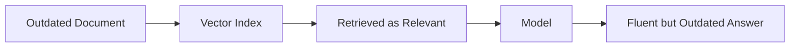

### Freshness Metadata

Store metadata such as:

```json
{
  "document_id": "refund_policy_v7",
  "version": 7,
  "published_at": "2026-06-01",
  "effective_from": "2026-06-15",
  "expires_at": null,
  "is_current": true
}
```

---

## 17. Freshness Filtering in RAG

Retrieval should consider both relevance and freshness.

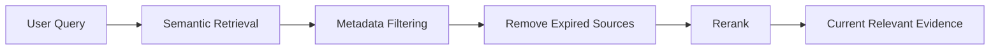

### Useful Filters

* `is_current = true`
* `effective_from <= today`
* `expires_at > today`
* Approved document status
* Region
* Product version
* User permission
* Language

---

## 18. Conflicting Sources

Current systems may retrieve sources that disagree.

Example:

```text
Source A:
The API supports version 2.

Source B:
Version 2 has been deprecated.

Source C:
Version 3 is in preview.
```

The model should not silently choose one without analysis.

### Conflict Handling

1. Prefer primary sources.
2. Compare update dates.
3. Check version and region.
4. Explain the disagreement.
5. Avoid claiming certainty when unresolved.
6. Request human review for high-impact cases.

---

## 19. Private Knowledge and Access Control

Retrieval must respect user permissions.

A user should not receive a document merely because it is semantically relevant.

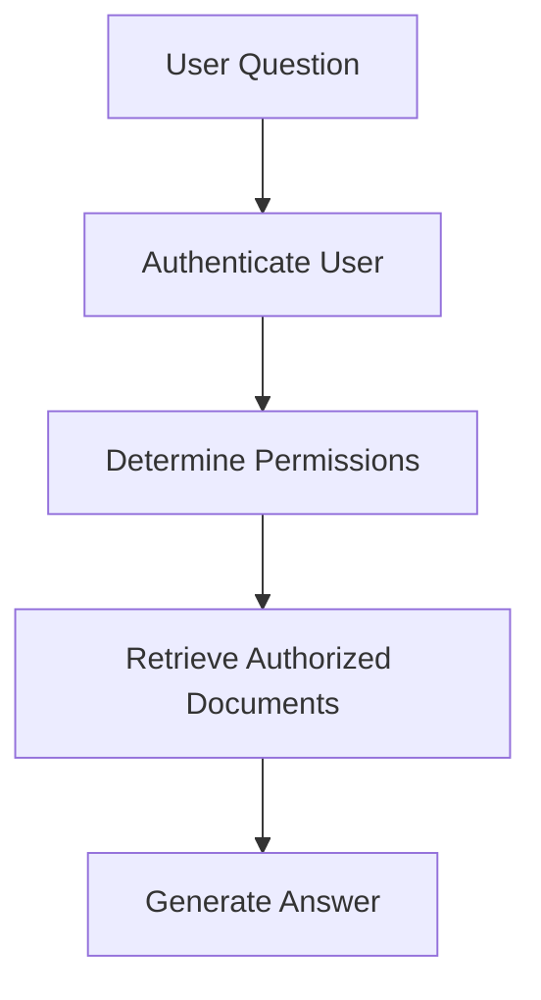

### Required Controls

* Authentication
* Role-based access
* Document-level permission filters
* Tenant isolation
* Audit logs
* Sensitive-data redaction
* Secure vector indexes
* Source citation restrictions

---

## 20. Knowledge Cutoff and Fine-Tuning

Fine-tuning can change model behavior, but it is not always the best way to add current knowledge.

### Fine-Tuning Is Good For

* Style
* Response format
* Domain terminology
* Classification behavior
* Tool selection patterns
* Repeated task instructions

### Fine-Tuning Is Usually Poor For

* Daily news
* Current prices
* Frequently changing policies
* Live account information
* Large document collections

For changing facts, prefer:

```text
RAG
APIs
Search
Databases
Tools
```

Fine-tuning requires retraining whenever the facts change.

---

## 21. Knowledge Updates vs Model Updates

These are different processes.

### Updating the Model

```text
New training
→ new model version
→ evaluation
→ deployment
```

### Updating External Knowledge

```text
New document or API data
→ update index or database
→ immediately available to retrieval
```

External knowledge is usually easier and faster to update.

---

## 22. Prompt Design for Grounded Answers

A grounded prompt should tell the model how to use external information.

### Example

```text
You are an enterprise support assistant.

Answer using only the supplied sources.

Rules:
1. Do not rely on unsupported prior knowledge when the sources provide
   a more recent answer.
2. If the sources do not contain the answer, say that the information
   is unavailable.
3. Prefer sources marked as current.
4. Mention conflicting sources.
5. Include source identifiers for important claims.

Sources:
{{retrieved_sources}}

Question:
{{user_question}}
```

This does not guarantee perfect grounding, but it provides clearer behavior.

---

## 23. Answer States

A production system should support more than “answer” or “error.”

Useful states include:

```text
ANSWERED_FROM_MODEL_KNOWLEDGE
ANSWERED_FROM_RETRIEVAL
ANSWERED_FROM_LIVE_TOOL
PARTIALLY_SUPPORTED
CONFLICTING_SOURCES
CURRENT_DATA_UNAVAILABLE
PERMISSION_DENIED
```

### Example Result

```json
{
  "status": "ANSWERED_FROM_RETRIEVAL",
  "answer": "The current refund period is seven days.",
  "source_ids": [
    "refund_policy_v7"
  ],
  "source_updated_at": "2026-07-10",
  "confidence": 0.93
}
```

---

## 24. Practical Demo: Freshness-Aware Knowledge Service

```python
from dataclasses import asdict
from datetime import UTC, datetime
from typing import Any


def build_knowledge_response(
    question: str,
    answer: str,
    routing: RoutingDecision,
    sources: list[dict[str, Any]] | None = None,
) -> dict[str, Any]:
    return {
        "question": question,
        "answer": answer,
        "knowledge_type": routing.knowledge_type.value,
        "knowledge_source": routing.recommended_source,
        "externally_verified": routing.requires_external_source,
        "sources": sources or [],
        "generated_at": datetime.now(UTC).isoformat(),
    }


if __name__ == "__main__":
    question = "What is the latest product version?"
    routing = classify_knowledge_request(question)

    response = build_knowledge_response(
        question=question,
        answer="Version information must be retrieved from current documentation.",
        routing=routing,
        sources=[],
    )

    print(asdict(routing))
    print(response)
```

This structure separates the answer text from knowledge provenance.

---

## 25. FastAPI Example

```python
from fastapi import FastAPI
from pydantic import BaseModel, Field


app = FastAPI(title="Knowledge Freshness Router")


class KnowledgeRequest(BaseModel):
    question: str = Field(min_length=1, max_length=5_000)


class KnowledgeRouteResponse(BaseModel):
    knowledge_type: str
    requires_external_source: bool
    recommended_source: str
    reason: str


@app.post("/route-knowledge", response_model=KnowledgeRouteResponse)
def route_knowledge(
    payload: KnowledgeRequest,
) -> KnowledgeRouteResponse:
    decision = classify_knowledge_request(payload.question)

    return KnowledgeRouteResponse(
        knowledge_type=decision.knowledge_type.value,
        requires_external_source=decision.requires_external_source,
        recommended_source=decision.recommended_source,
        reason=decision.reason,
    )
```

Run the API:

```bash
uvicorn main:app --reload
```

Test it:

```bash
curl -X POST "http://localhost:8000/route-knowledge" \
  -H "Content-Type: application/json" \
  -d '{
    "question": "Who is the current CEO of this company?"
  }'
```

---

## 26. Logging and Observability

A freshness-aware system should log more than the model name.

### Example Log

```json
{
  "request_id": "req_013",
  "feature": "knowledge_question_answering",
  "model": "configured-model",
  "knowledge_type": "changing",
  "routing_source": "web_search_or_rag",
  "external_source_used": true,
  "source_count": 4,
  "newest_source_date": "2026-07-16",
  "oldest_source_date": "2026-07-14",
  "answer_status": "ANSWERED_FROM_RETRIEVAL",
  "latency_ms": 1428.7,
  "status": "success"
}
```

### Useful Metrics

* Percentage of requests requiring external sources
* Search success rate
* Retrieval success rate
* Tool failure rate
* Unsupported-answer rate
* Citation correctness
* Source freshness
* Conflicting-source rate
* Average source age
* Answer latency
* Cost per verified answer

---

## 27. Evaluation Framework

A model should not be evaluated only on writing quality.

### Knowledge Evaluation Dimensions

| Dimension             | Question                                  |
| --------------------- | ----------------------------------------- |
| **Correctness**       | Is the answer factually correct?          |
| **Freshness**         | Is it based on current information?       |
| **Groundedness**      | Is it supported by retrieved evidence?    |
| **Citation accuracy** | Do citations support the claims?          |
| **Source authority**  | Are the sources trustworthy?              |
| **Uncertainty**       | Does the model admit missing information? |
| **Conflict handling** | Does it identify disagreements?           |
| **Privacy**           | Does it respect access restrictions?      |

---

## 28. Evaluation Dataset

Include several knowledge types.

```json
[
  {
    "id": "static_001",
    "question": "What is a binary search?",
    "knowledge_type": "static",
    "external_source_required": false
  },
  {
    "id": "changing_001",
    "question": "What is the latest stable release of the library?",
    "knowledge_type": "changing",
    "external_source_required": true
  },
  {
    "id": "live_001",
    "question": "What is today's exchange rate?",
    "knowledge_type": "live",
    "external_source_required": true
  },
  {
    "id": "private_001",
    "question": "What is my current order status?",
    "knowledge_type": "private",
    "external_source_required": true
  }
]
```

### Routing Metrics

* Freshness classification accuracy
* External-source recall
* External-source precision
* Incorrect model-only answer rate
* Private-data routing accuracy
* Live-API selection accuracy

---

## 29. Common Production Failures

### 29.1 Treating Model Memory as Live Data

#### Problem

The model answers a current question using old training knowledge.

#### Impact

The answer may be outdated while sounding confident.

#### Fix

Detect time-sensitive requests and require verification.

---

### 29.2 Assuming the Cutoff Guarantees Knowledge

#### Problem

The team assumes every fact before the cutoff is known.

#### Fix

Verify important, niche, or high-impact facts through a reliable source.

---

### 29.3 Using RAG with Outdated Documents

#### Problem

The model is grounded, but the retrieved source is stale.

#### Fix

Add version, status, effective-date, and expiration metadata.

---

### 29.4 Missing Source Dates

#### Problem

The answer contains citations but no indication of freshness.

#### Fix

Record and display publication, update, or retrieval dates where useful.

---

### 29.5 Mixing Prior Knowledge and Retrieved Facts

#### Problem

The model adds unsupported details not present in the retrieved evidence.

#### Fix

Use grounded prompts and citation validation.

---

### 29.6 Search Without Source Quality Checks

#### Problem

The system uses the first available result.

#### Risks

* SEO spam
* Outdated content
* Copied articles
* Unverified claims
* Malicious pages

#### Fix

Prioritize authoritative and primary sources.

---

### 29.7 No Behavior When Current Data Is Missing

#### Problem

The live API fails, and the model invents a current answer.

#### Better Behavior

```text
Current data is unavailable. I cannot verify the latest value.
```

---

### 29.8 Exposing Private Documents

#### Problem

Retrieval ignores access-control metadata.

#### Fix

Apply user permissions before semantic retrieval.

---

### 29.9 No Conflict Detection

#### Problem

Two current documents provide different answers.

#### Fix

Surface the conflict and avoid unsupported certainty.

---

### 29.10 Using Fine-Tuning for Frequently Changing Facts

#### Problem

The team retrains the model whenever information changes.

#### Better Approach

Use external knowledge sources that can be updated independently.

---

## 30. Production Architecture

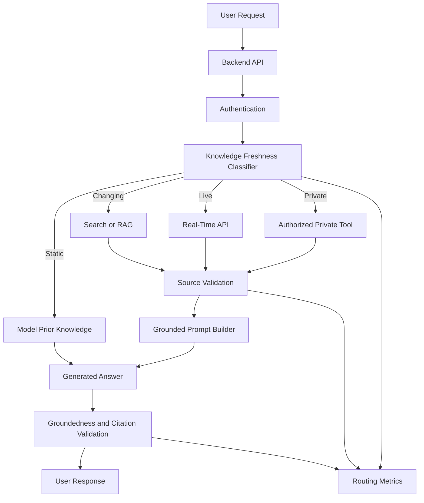

### Recommended Components

* Knowledge-type classifier
* Current-date awareness
* Model cutoff registry
* Search connector
* RAG pipeline
* Live API tools
* Private-data connectors
* Source-quality scoring
* Freshness metadata
* Citation generation
* Groundedness validation
* Access control
* Audit logging
* Fallback behavior

---

## 31. Practical Exercises

### Exercise 1 — Five-Line Summary

Without reviewing the lesson, explain:

1. What a knowledge cutoff is
2. Why it does not guarantee complete knowledge
3. When external data is necessary
4. What provenance means
5. Why source dates matter

---

### Exercise 2 — Freshness Classifier

Create a classifier for:

* Static knowledge
* Frequently changing knowledge
* Live information
* Private information

Test at least 20 questions.

---

### Exercise 3 — Model Knowledge vs Search

Ask the same current question using:

1. Model knowledge only
2. Search-grounded context

Compare:

| Metric      | Model Only | Search Grounded |
| ----------- | ---------: | --------------: |
| Correctness |            |                 |
| Freshness   |            |                 |
| Citations   |            |                 |
| Latency     |            |                 |
| Cost        |            |                 |

---

### Exercise 4 — Stale RAG Test

Create two policy documents:

* Old policy
* Current policy

Test retrieval with and without metadata filtering.

Measure whether the assistant selects the current document.

---

### Exercise 5 — Private Knowledge Tool

Build a mock function:

```text
get_order_status(order_id, user_id)
```

The function should:

* Verify ownership
* Return current status
* Include an update timestamp
* Reject unauthorized access
* Produce an audit record

---

### Exercise 6 — Production Failure Report

```markdown
## Failure

The assistant gave an outdated product price.

## Impact

The user received incorrect purchase information.

## Detection

The displayed value differed from the product API.

## Root Cause

The request was answered using model prior knowledge instead of the
live pricing API.

## Immediate Fix

Disable model-only answers for pricing questions.

## Permanent Fix

Add freshness classification and route all price requests to the
product API.

## Monitoring

Track pricing requests, tool usage, API failures, and unverified
current-value answers.
```

---

## 32. Completion Checklist

### Understanding

* [ ] I can explain a knowledge cutoff in one or two minutes.
* [ ] I understand that the cutoff does not guarantee complete knowledge.
* [ ] I can distinguish current date from current world knowledge.
* [ ] I can distinguish prior knowledge, retrieval, and tools.
* [ ] I understand source provenance.
* [ ] I understand why RAG can still be stale.
* [ ] I understand when fine-tuning is not appropriate.

### Implementation

* [ ] I can classify a request by freshness.
* [ ] I can route current questions to search or APIs.
* [ ] I can route private questions to authenticated tools.
* [ ] I record source timestamps.
* [ ] I return source identifiers.
* [ ] I handle missing current data.
* [ ] I detect conflicting sources.
* [ ] I have tested at least one stale-data case.

### Production Readiness

* [ ] Model cutoff information is recorded.
* [ ] Current questions require external verification.
* [ ] RAG documents contain freshness metadata.
* [ ] Expired documents are filtered.
* [ ] Search sources are quality-checked.
* [ ] Private retrieval applies access controls.
* [ ] Provenance is logged.
* [ ] Citation correctness is evaluated.
* [ ] Current-data failure behavior is defined.
* [ ] Unsupported claims are monitored.

---

## 33. Related Outcome

> Choose pre-trained AI models based on capability, context length, latency, cost, safety, knowledge freshness, and product fit.

A strong model-selection explanation could be:

```text
We selected this model for reasoning and structured output, but we do
not rely on its training knowledge for current product information.

Requests involving prices, versions, policies, or user records are
routed to approved APIs and retrieval systems. Answers include source
metadata and update timestamps.
```

A weak explanation would be:

```text
The model has a recent cutoff, so it knows everything we need.
```

---

## 34. Related Project

# Project 2 — Model Comparison App

Extend the Model Comparison App to measure knowledge freshness and grounding.

### Required Features

* Provider selection
* Model selection
* Knowledge-cutoff field
* Current-date display
* Freshness classification
* Model-only mode
* Search or RAG mode
* Live-tool mode
* Source display
* Source-date display
* Citation validation
* Latency and token usage
* Answer-quality scoring

### Suggested Architecture

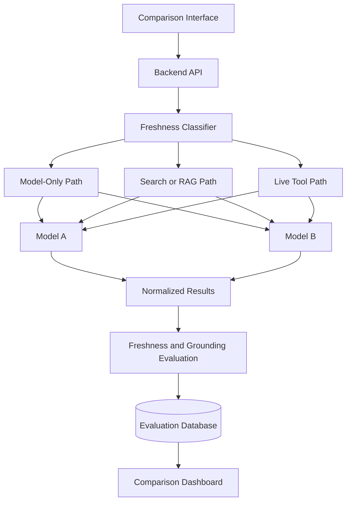

### Normalized Result

```json
{
  "provider": "provider_name",
  "model": "model_name",
  "knowledge_cutoff": "configured-cutoff",
  "question_type": "changing",
  "external_source_required": true,
  "external_source_used": true,
  "answer": "Generated answer",
  "source_ids": [
    "source_014"
  ],
  "newest_source_date": "2026-07-16",
  "citation_valid": true,
  "answer_current": true,
  "latency_ms": 1532.4,
  "status": "success",
  "error": null
}
```

### Evaluation Cases

Include:

* Stable historical question
* Recent news question
* Current officeholder question
* Current software version
* Current product price
* Live weather
* Private order status
* Stale policy document
* Conflicting sources
* Missing current data
* Unauthorized private request
* Incorrect citation

### Final Report Questions

1. Which model answers stable knowledge most accurately?
2. Which system detects current questions best?
3. Which model relies on unsupported memory most often?
4. Does search improve freshness?
5. Does RAG improve groundedness?
6. How often are stale sources retrieved?
7. Which system handles missing data honestly?
8. Which system produces the most accurate citations?
9. How much latency does verification add?
10. Which architecture should be used in production?

---

## 35. Suggested 20-Minute Lesson Plan

|          Time | Activity                                              |
| ------------: | ----------------------------------------------------- |
|   0–3 minutes | Explain knowledge cutoffs                             |
|   3–6 minutes | Compare prior, retrieved, live, and private knowledge |
|   6–9 minutes | Classify stable and time-sensitive questions          |
|  9–12 minutes | Explain RAG, browsing, APIs, and provenance           |
| 12–16 minutes | Run the freshness-router demo                         |
| 16–18 minutes | Review stale-data and privacy failures                |
| 18–20 minutes | Assign the freshness-comparison exercise              |

---

## 36. Key Takeaways

1. A knowledge cutoff describes the approximate latest period represented in model training.
2. It does not guarantee knowledge of every earlier fact.
3. A model may know the current date without knowing current events.
4. Current, live, private, and frequently changing information should use external sources.
5. RAG adds information to a request but does not permanently retrain the model.
6. Browsing is useful for recent public information.
7. APIs are preferable for structured live values.
8. Private information requires authenticated retrieval or tools.
9. Provenance records where answer information came from.
10. Source dates are necessary for evaluating freshness.
11. RAG documents can also become stale.
12. Metadata filters should remove expired or superseded documents.
13. Conflicting sources should be surfaced rather than silently ignored.
14. Fine-tuning is usually not the right method for frequently changing facts.
15. Users should understand whether an answer is based on model knowledge, retrieved evidence, or live data.
16. Knowledge routing, source usage, freshness, and citation quality should be logged.
17. A reliable AI application knows when not to trust model memory.

---

## 37. Final Summary

**Cut-off Dates and Knowledge** are essential model-selection and system-design concepts.

A capable AI Engineer should be able to:

* Understand model training cutoffs
* Recognize incomplete or outdated model knowledge
* Classify requests by freshness
* Route current questions to search or APIs
* Route private questions to secure tools
* Build RAG over approved documents
* Store source and freshness metadata
* Detect expired information
* Handle conflicting sources
* Generate grounded answers
* Validate citations
* Communicate uncertainty
* Log knowledge provenance
* Define safe fallback behavior
* Explain why a particular knowledge architecture fits the product

Turn this lesson into a freshness router, RAG metadata experiment, live-API integration, private-data tool, citation validator, or model-comparison dashboard so that the concept becomes practical engineering experience.

---

# Bài luyện tập

## Mục tiêu


## Đề bài


## Yêu cầu hoàn thành

- [ ] 
- [ ] 
- [ ] 

## Kết quả / lời giải


## Ghi chú
