# 014 — Latency

| Field                  | Details                                       |
| ---------------------- | --------------------------------------------- |
| **Course**             | 02 — Model Platforms and Prompting            |
| **Module**             | Module 03 — Using Pre-trained Models          |
| **Content Group**      | Selection Criteria                            |
| **Roadmap Source**     | Using Pre-trained Models / Selection Criteria |
| **Lesson Type**        | Model Selection                               |
| **Order in Module**    | 014                                           |
| **Suggested Duration** | 20 minutes                                    |

---

## 1. Summary

**Latency** is the amount of time between a user starting a request and the AI application producing a useful result.

In a simple API, latency may mean:

```text
Request sent
→ response received
```

In a generative AI application, latency is more complex. It may include:

* Client-to-server network time
* Authentication
* Input validation
* Prompt construction
* Tokenization
* Retrieval
* Reranking
* Model queue time
* Prompt processing
* Time to first token
* Token generation
* Tool execution
* Output validation
* Safety checks
* Response rendering

Latency is a major model-selection criterion because a model can produce excellent answers but still create a poor product experience if responses arrive too slowly.

A production system should not measure only one average response time. It should record:

* Time to First Byte
* Time to First Token
* Total response latency
* Inter-token latency
* Tokens per second
* Retrieval latency
* Tool latency
* P50, P95, and P99 latency
* Timeout and error rates

The best model is not always the fastest model or the most capable model. The correct choice depends on the required balance among:

```text
Quality
+ Latency
+ Cost
+ Reliability
+ Product experience
```

---

## 2. Learning Objectives

After completing this lesson, you should be able to:

1. Explain latency in your own words.
2. Identify the main components of AI application latency.
3. Distinguish Time to First Token from total response time.
4. Explain P50, P95, and P99 latency.
5. Measure model and end-to-end application latency.
6. Compare streaming and non-streaming responses.
7. Explain how prompt size and output length affect latency.
8. Identify latency introduced by RAG, tools, and agents.
9. Select a model based on real user-experience requirements.
10. Apply practical latency-optimization techniques.
11. Detect common benchmarking mistakes.
12. Add latency measurements to a Model Comparison App.

---

## 3. What Is Latency?

Latency measures how long an operation takes.

A simplified formula is:

```text
Latency = Completion time − Request start time
```

Example:

```text
Request started:  10:00:00.000
Response finished: 10:00:02.450

Total latency: 2.450 seconds
```

For a generative AI system, users may begin seeing text before the entire answer is complete. This creates two important measurements:

```text
Time until output begins
        and
Time until output finishes
```

---

## 4. Why Latency Matters

Latency affects both technical performance and user behavior.

### Low Latency Can Improve

* Perceived application quality
* Conversation flow
* User engagement
* Task completion
* Agent responsiveness
* Developer productivity
* Customer satisfaction

### High Latency Can Cause

* Users to repeat requests
* Duplicate API calls
* Abandoned sessions
* Broken conversational flow
* Timeouts
* Increased infrastructure cost
* Lower trust
* Poor real-time experiences

### Example

A 12-second response may be acceptable for:

* Generating a detailed report
* Analyzing a large document
* Running an offline agent workflow

The same 12-second delay may be unacceptable for:

* Search suggestions
* Voice conversations
* IDE autocomplete
* Real-time translation
* Form validation

Latency targets must be based on the product experience.

---

## 5. End-to-End Latency

The user experiences the latency of the entire application, not only the model.

```mermaid
flowchart LR
    U[User Action] --> N1[Client Network]
    N1 --> API[Backend API]
    API --> AUTH[Authentication]
    AUTH --> VALIDATE[Input Validation]
    VALIDATE --> CONTEXT[Context Building]
    CONTEXT --> RETRIEVE[Optional Retrieval]
    RETRIEVE --> MODEL[Model Request]
    MODEL --> OUTPUT[Output Validation]
    OUTPUT --> N2[Response Network]
    N2 --> UI[UI Rendering]
```

A simplified equation is:

```text
End-to-End Latency =
    Client Network
  + API Processing
  + Authentication
  + Context Construction
  + Retrieval
  + Model Queue Time
  + Model Inference
  + Tool Execution
  + Output Validation
  + Response Transfer
  + UI Rendering
```

Optimizing only the model may not significantly improve the total user experience if another stage is slow.

---

## 6. Important Latency Metrics

### 6.1 Time to First Byte

**Time to First Byte**, or TTFB, is the time from sending a request until the client receives the first byte of the response.

It includes:

* Network travel
* Server processing before output
* Provider queue time
* Initial response creation

TTFB is commonly useful for standard HTTP APIs.

---

### 6.2 Time to First Token

**Time to First Token**, or TTFT, is the time between sending a generative AI request and receiving the first generated token.

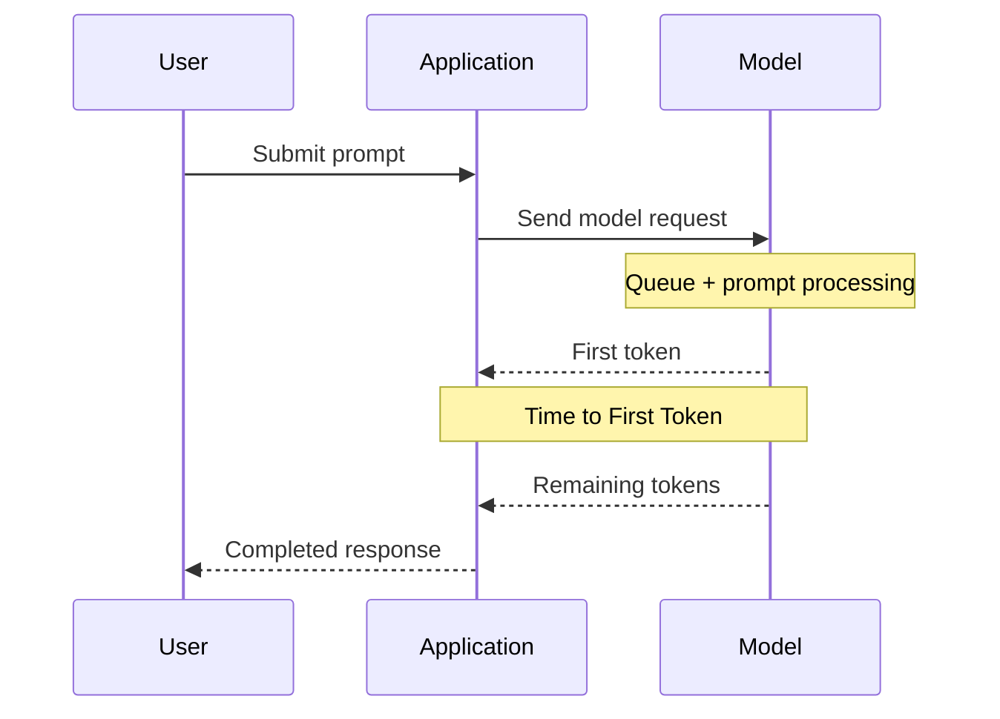

TTFT strongly affects perceived responsiveness in streaming applications.

It may be influenced by:

* Network distance
* Provider load
* Prompt length
* Model size
* Queue time
* Cold starts
* Input modality
* Retrieval processing

---

### 6.3 Total Latency

Total latency is the time until the complete answer is available.

```text
Total latency =
    Request start
    → final output token received
```

It depends heavily on:

* TTFT
* Output length
* Generation speed
* Tool calls
* Retries
* Post-processing

---

### 6.4 Inter-Token Latency

Inter-token latency is the delay between generated tokens after output begins.

```text
Token 1 → Token 2 → Token 3 → Token 4
   Δt        Δt        Δt
```

Low inter-token latency creates smooth streaming.

High inter-token latency can make the response appear to pause or stutter.

---

### 6.5 Tokens per Second

Generation throughput is often measured as:

```text
Tokens per second =
    Number of generated tokens
    ÷
    Generation duration
```

Example:

```text
Output tokens: 300
Generation duration after first token: 6 seconds

Generation speed: 50 tokens/second
```

Tokens per second should not be confused with requests per second.

---

### 6.6 Requests per Second

Requests per second measures how many requests a service can process over time.

```text
Requests per second =
    Completed requests
    ÷
    Measurement duration
```

A system may have:

* High tokens per second
* Low requests per second

when each request produces a very long response.

---

## 7. Latency Percentiles

Average latency is not enough for production monitoring.

Suppose the application records these latencies:

```text
0.8s, 0.9s, 1.0s, 1.1s, 1.2s,
1.3s, 1.5s, 2.0s, 4.0s, 12.0s
```

The average may hide the slowest user experiences.

### P50

P50 is the median latency.

```text
50% of requests are faster than or equal to this value.
```

It represents a typical request.

### P95

P95 means:

```text
95% of requests are faster than or equal to this value.
5% are slower.
```

P95 is useful for identifying poor but common user experiences.

### P99

P99 means:

```text
99% of requests are faster than or equal to this value.
1% are slower.
```

P99 exposes extreme tail latency.

### Latency Distribution

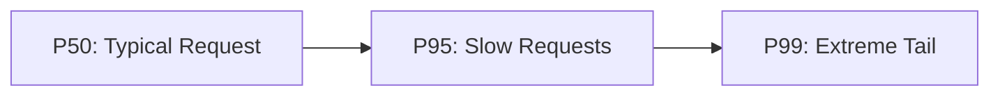

A production service should usually track at least:

* P50
* P95
* P99
* Maximum latency
* Timeout rate

---

## 8. Average Latency vs Tail Latency

Consider two models:

| Metric  | Model A | Model B |
| ------- | ------: | ------: |
| Average |   1.8 s |   1.9 s |
| P50     |   1.6 s |   1.7 s |
| P95     |   2.5 s |   4.8 s |
| P99     |   3.1 s |  12.0 s |

The average values are similar, but Model B creates much worse experiences for a meaningful percentage of users.

This is why selection should not be based only on average latency.

---

## 9. Latency Budgeting

A **latency budget** assigns a maximum target to each application stage.

Example target:

```text
Total target: 2,000 ms
```

Possible allocation:

| Component                     |       Budget |
| ----------------------------- | -----------: |
| Client network                |       100 ms |
| Authentication and validation |        80 ms |
| Retrieval                     |       250 ms |
| Reranking                     |       150 ms |
| Model TTFT                    |       700 ms |
| Generation                    |       550 ms |
| Output validation             |        70 ms |
| Response rendering            |       100 ms |
| **Total**                     | **2,000 ms** |

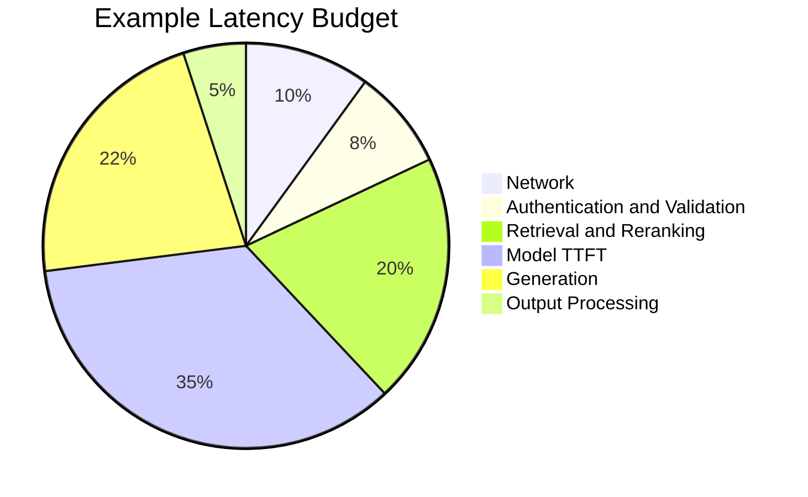

When the latency target is missed, the team can identify which stage consumed too much of the budget.

---

## 10. Model Latency Components

A model request commonly contains three stages.

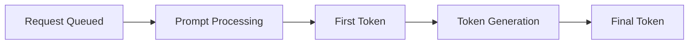

### 10.1 Queue Time

The request waits for available provider or server capacity.

Queue time increases when:

* Traffic spikes
* Capacity is insufficient
* Rate limits are approached
* GPU instances are saturated
* Requests have large contexts

---

### 10.2 Prefill or Prompt Processing

The model processes input tokens before generating output.

Longer input usually increases prompt-processing time.

```text
More input tokens
→ more prompt processing
→ higher TTFT
```

This stage is sometimes called:

* Prefill
* Prompt evaluation
* Input processing

---

### 10.3 Decode or Generation

The model generates output tokens sequentially.

```text
Token 1
→ Token 2
→ Token 3
→ ...
```

Longer outputs increase total latency even when TTFT stays constant.

---

## 11. Input Length and Latency

Long prompts can increase latency because the model must process more input.

Inputs may include:

* System prompts
* Conversation history
* Retrieved documents
* Tool definitions
* Tool outputs
* Images
* Source code

### Example

|    Input Size |     TTFT |
| ------------: | -------: |
|    500 tokens |   450 ms |
|  5,000 tokens |   900 ms |
| 25,000 tokens | 2,800 ms |
| 80,000 tokens | 7,500 ms |

These values are illustrative. Actual behavior depends on the provider, model, hardware, and request.

### Optimization

* Remove duplicate instructions.
* Summarize conversation history.
* Retrieve fewer but more relevant chunks.
* Reduce tool-schema size.
* Cache reusable prefixes.
* Avoid sending unused metadata.
* Use a smaller context model when appropriate.

---

## 12. Output Length and Latency

Output generation is usually sequential.

```text
More requested output tokens
→ longer completion time
```

Example:

| Output Length | Total Latency |
| ------------: | ------------: |
|     50 tokens |         1.2 s |
|    250 tokens |         3.8 s |
|  1,000 tokens |        13.4 s |

### Optimization

* Set clear maximum output limits.
* Ask for concise output.
* Use structured output instead of explanation-heavy prose.
* Generate reports asynchronously.
* Split large outputs into sections.
* Avoid requesting unused reasoning or commentary.

---

## 13. Streaming vs Non-Streaming

### Non-Streaming

The user receives nothing until the entire response is complete.

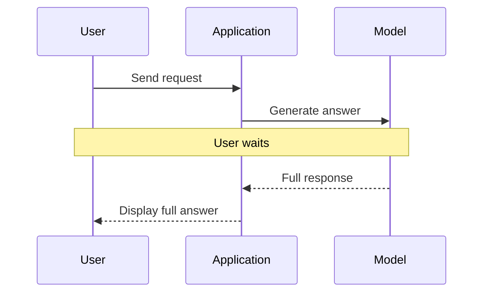

### Streaming

The user begins receiving content as soon as tokens are generated.

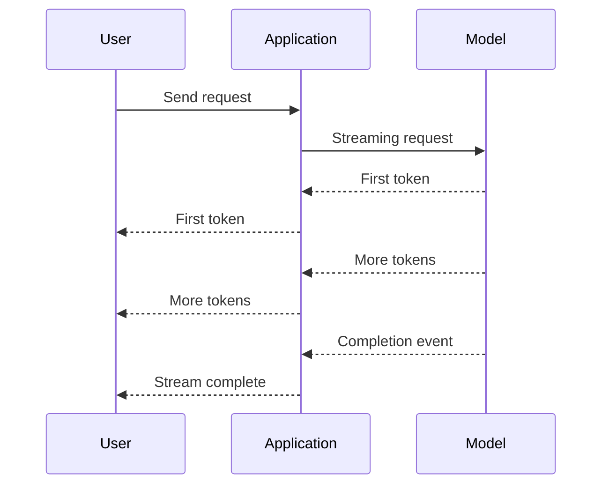

### Comparison

| Factor                 | Non-Streaming           | Streaming                     |
| ---------------------- | ----------------------- | ----------------------------- |
| Time to visible output | Total response time     | TTFT                          |
| Perceived latency      | Higher                  | Lower                         |
| Implementation         | Simpler                 | More complex                  |
| Error handling         | Easier before display   | Errors may occur mid-stream   |
| Output validation      | Validate before showing | May require buffered strategy |
| UX                     | Static                  | Progressive                   |

Streaming improves perceived speed but does not necessarily reduce actual total processing time.

---

## 14. Perceived Latency

Users do not experience all waiting equally.

A system can feel faster by providing immediate feedback.

### Useful Techniques

* Show a loading state immediately.
* Stream generated text.
* Display retrieval progress.
* Show tool execution status.
* Render partial structured results.
* Use optimistic UI carefully.
* Display a cancel button.
* Avoid frozen interfaces.

### Example Agent UI

```text
Searching approved documentation...
Found 5 relevant sources...
Checking the latest policy version...
Generating the answer...
```

Progress indicators should reflect real system activity rather than invented stages.

---

## 15. Cold Starts

A **cold start** occurs when infrastructure or model resources must initialize before serving a request.

Cold starts may involve:

* Starting a container
* Allocating compute
* Loading model weights
* Moving weights to a GPU
* Compiling kernels
* Loading a tokenizer
* Establishing network connections
* Creating a database connection pool

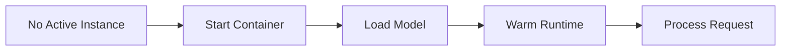

### Cold vs Warm Latency

| State            | Description                                  |
| ---------------- | -------------------------------------------- |
| **Cold request** | Infrastructure or model must initialize      |
| **Warm request** | Model and dependencies are already available |

Measure both separately.

### Cold-Start Mitigation

* Keep minimum instances running.
* Use smaller models.
* Preload models during application startup.
* Use provisioned capacity.
* Send safe warm-up requests.
* Keep database and network connections reusable.
* Avoid unnecessary runtime initialization per request.

---

## 16. Network Latency

A fast model can still feel slow when the application and model are geographically distant.

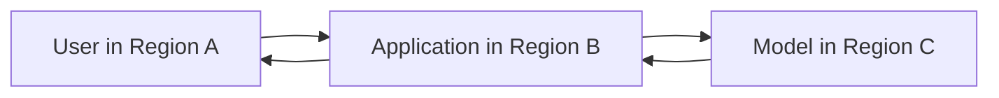

Network latency may come from:

* User-to-backend traffic
* Backend-to-model provider
* Backend-to-vector database
* Backend-to-tool APIs
* Cross-region communication

### Optimization

* Deploy the backend near users.
* Deploy model and data services in compatible regions.
* Avoid unnecessary cross-region calls.
* Reuse HTTP connections.
* Use connection pooling.
* Compress large payloads when appropriate.
* Reduce response size.

---

## 17. RAG Latency

A RAG request may include multiple operations.

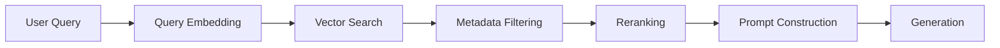

A simplified formula is:

```text
RAG latency =
    Query processing
  + Embedding
  + Search
  + Reranking
  + Context construction
  + Generation
```

### Example Breakdown

| Stage               |      Latency |
| ------------------- | -----------: |
| Query normalization |        15 ms |
| Query embedding     |        70 ms |
| Vector search       |        90 ms |
| Metadata filtering  |        20 ms |
| Reranking           |       180 ms |
| Prompt construction |        15 ms |
| Model generation    |     1,200 ms |
| **Total**           | **1,590 ms** |

### RAG Optimization

* Cache common query embeddings.
* Use efficient metadata filters.
* Retrieve fewer candidates.
* Rerank only when necessary.
* Keep the search index close to the backend.
* Reduce chunk duplication.
* Run independent operations concurrently.
* Cache repeated answers carefully.

---

## 18. Agent Latency

Agents can be much slower than single model calls because they may execute several reasoning and tool steps.

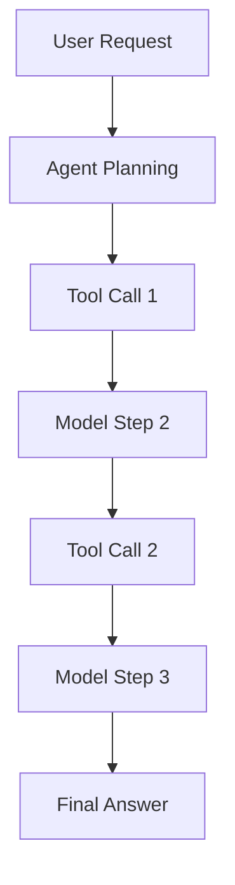

A simplified formula is:

```text
Agent latency =
    Sum of model calls
  + Sum of tool calls
  + Orchestration overhead
  + Retries
```

### Example

| Operation           |   Latency |
| ------------------- | --------: |
| Planning model call |     1.2 s |
| Search tool         |     0.8 s |
| Analysis model call |     1.5 s |
| Database tool       |     0.4 s |
| Final model call    |     1.1 s |
| **Total**           | **5.0 s** |

### Agent Optimization

* Reduce unnecessary agent steps.
* Limit maximum iterations.
* Use direct workflows for predictable tasks.
* Run independent tools in parallel.
* Use smaller models for routing.
* Cache reusable tool results.
* Summarize large tool outputs.
* Avoid retrying permanent errors.
* Set tool-specific timeouts.

---

## 19. Sequential vs Parallel Tool Calls

### Sequential Execution

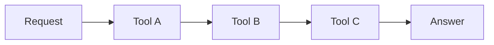

Total tool latency is approximately:

```text
Tool A + Tool B + Tool C
```

### Parallel Execution

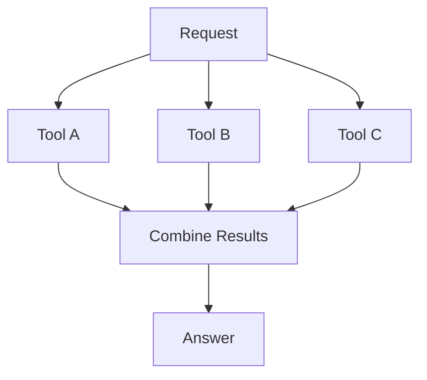

Total latency is closer to the slowest independent tool rather than the sum.

Parallel execution is appropriate only when tool calls do not depend on one another.

---

## 20. Latency and Model Size

Larger models commonly require more computation, but model size alone does not determine latency.

Latency also depends on:

* Hardware
* Quantization
* Model architecture
* Serving engine
* Batch size
* Provider capacity
* Prompt length
* Output length
* Network distance
* Queue time

A smaller model may be preferable for:

* Request routing
* Classification
* Entity extraction
* Short summarization
* High-volume workloads

A larger model may be justified for:

* Difficult reasoning
* Complex coding
* High-impact analysis
* Ambiguous instructions

---

## 21. Model Routing

A model router can select different models according to task difficulty and latency requirements.

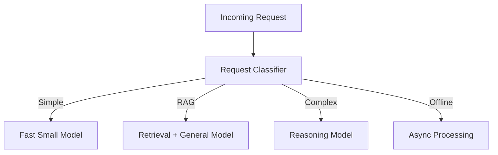

### Example Routing Policy

```text
Simple classification
→ fast low-cost model

Normal chat
→ balanced general model

Difficult reasoning
→ larger reasoning model

Long report
→ asynchronous job
```

Routing can improve:

* Average latency
* Cost
* Throughput
* User experience

Routing errors must also be evaluated. A fast model is not helpful when it produces an incorrect result.

---

## 22. Batching

Batching processes multiple inputs together.

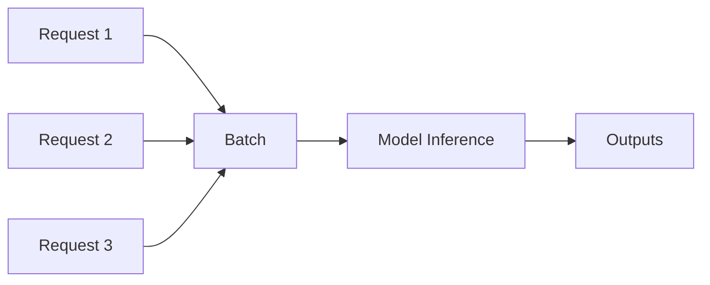

### Benefits

* Higher throughput
* Better hardware utilization
* Lower average infrastructure cost

### Trade-Offs

* Individual requests may wait for the batch.
* Tail latency may increase.
* Large batches require more memory.
* Inputs with different lengths may create inefficiency.

Batching is more suitable for:

* Offline processing
* High-volume embedding generation
* Classification pipelines
* Scheduled workloads

For interactive chat, dynamic batching must be carefully tuned.

---

## 23. Caching

Caching can reduce latency for repeated or reusable work.

### Cacheable Components

* Repeated model responses
* Query embeddings
* Retrieved search results
* Reusable prompt prefixes
* Tool results
* Static classification outcomes
* Document summaries

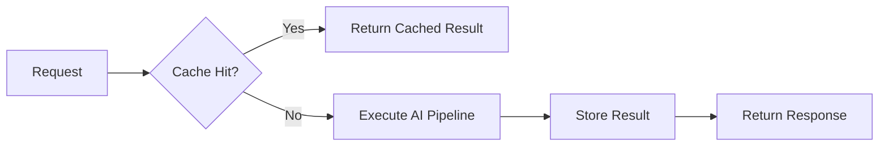

### Cache Key Considerations

A cache key may include:

* Model version
* Prompt version
* User permissions
* Language
* Input
* Knowledge-base version
* Tool version

Incorrect cache keys can return:

* Stale content
* Another user’s data
* Results from the wrong model
* Results in the wrong language

---

## 24. Timeouts

Every external operation should have a timeout.

Examples:

* Model request timeout
* Search timeout
* Database timeout
* Tool timeout
* Total workflow timeout

### Example Policy

```text
Search timeout:        1 second
Database timeout:      2 seconds
Model timeout:        15 seconds
Total request timeout: 20 seconds
```

### Why Timeouts Matter

Without them:

* Threads or workers remain blocked.
* Queues grow.
* Memory usage increases.
* Users wait indefinitely.
* One slow dependency affects the entire service.

Timeout behavior should return a useful fallback rather than a generic internal error whenever possible.

---

## 25. Retry Policies

Retries can recover temporary failures, but they also increase latency.

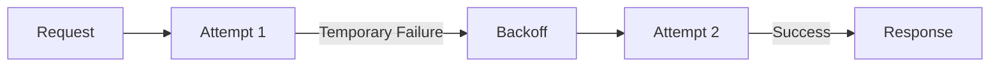

### Retry Appropriate For

* Temporary network errors
* Rate limits
* Service-unavailable responses
* Short-lived provider failures

### Do Not Retry Indefinitely

Avoid repeated retries for:

* Invalid input
* Invalid credentials
* Permission failures
* Unsupported models
* Schema errors without changing the prompt
* Irreversible tool operations

### Retry Budget

```text
Total latency =
    Initial attempt
  + backoff delay
  + retry attempt
```

Retries must fit within the total user-facing latency budget.

---

## 26. Benchmarking Latency

A useful benchmark should measure realistic application traffic.

### Benchmark Dimensions

* Model
* Model version
* Provider
* Region
* Input tokens
* Output tokens
* Concurrency
* Streaming mode
* Temperature
* Tools
* Retrieval
* Cold or warm state
* Success or failure
* Timestamp

### Test Cases

Include:

* Short prompt
* Medium prompt
* Long prompt
* Short output
* Long output
* RAG request
* Tool-calling request
* Concurrent traffic
* Cold-start request
* Rate-limit behavior

---

## 27. Practical Demo: Basic Latency Benchmark

### Demo Goal

Create a reusable Python function that:

1. Calls a model adapter.
2. Measures total latency.
3. Records success or failure.
4. Calculates P50, P95, and P99.
5. Compares multiple model configurations.

### Python Example

```python
from __future__ import annotations

import math
import statistics
import time
from dataclasses import asdict, dataclass
from typing import Callable


@dataclass
class BenchmarkResult:
    run: int
    model: str
    latency_ms: float
    success: bool
    output_length: int
    error: str | None = None


def percentile(values: list[float], percentile_value: float) -> float:
    if not values:
        raise ValueError("At least one value is required.")

    sorted_values = sorted(values)
    position = (len(sorted_values) - 1) * percentile_value
    lower_index = math.floor(position)
    upper_index = math.ceil(position)

    if lower_index == upper_index:
        return sorted_values[lower_index]

    lower_value = sorted_values[lower_index]
    upper_value = sorted_values[upper_index]
    weight = position - lower_index

    return lower_value + (upper_value - lower_value) * weight


def benchmark_model(
    model_name: str,
    call_model: Callable[[str], str],
    prompt: str,
    runs: int = 10,
) -> list[BenchmarkResult]:
    if runs < 1:
        raise ValueError("runs must be at least 1.")

    results: list[BenchmarkResult] = []

    for run_number in range(1, runs + 1):
        started_at = time.perf_counter()

        try:
            output = call_model(prompt)
            latency_ms = (
                time.perf_counter() - started_at
            ) * 1000

            results.append(
                BenchmarkResult(
                    run=run_number,
                    model=model_name,
                    latency_ms=round(latency_ms, 2),
                    success=True,
                    output_length=len(output),
                )
            )
        except Exception as exc:
            latency_ms = (
                time.perf_counter() - started_at
            ) * 1000

            results.append(
                BenchmarkResult(
                    run=run_number,
                    model=model_name,
                    latency_ms=round(latency_ms, 2),
                    success=False,
                    output_length=0,
                    error=str(exc),
                )
            )

    return results


def summarize_results(
    results: list[BenchmarkResult],
) -> dict[str, float | int]:
    successful = [
        result.latency_ms
        for result in results
        if result.success
    ]

    if not successful:
        return {
            "runs": len(results),
            "successful_runs": 0,
            "failed_runs": len(results),
        }

    return {
        "runs": len(results),
        "successful_runs": len(successful),
        "failed_runs": len(results) - len(successful),
        "mean_ms": round(statistics.mean(successful), 2),
        "median_ms": round(statistics.median(successful), 2),
        "p50_ms": round(percentile(successful, 0.50), 2),
        "p95_ms": round(percentile(successful, 0.95), 2),
        "p99_ms": round(percentile(successful, 0.99), 2),
        "minimum_ms": round(min(successful), 2),
        "maximum_ms": round(max(successful), 2),
    }


def mock_model_call(prompt: str) -> str:
    """
    Replace this function with a real provider SDK call.
    """
    if not prompt.strip():
        raise ValueError("Prompt must not be empty.")

    time.sleep(0.15)
    return "Example model response."


if __name__ == "__main__":
    benchmark_results = benchmark_model(
        model_name="example-model",
        call_model=mock_model_call,
        prompt="Explain semantic search.",
        runs=20,
    )

    for result in benchmark_results:
        print(asdict(result))

    print("\nSummary:")
    print(summarize_results(benchmark_results))
```

---

## 28. Measuring Streaming Latency

A streaming benchmark should record:

* Request start
* First token time
* Final token time
* Output-token count

```python
from dataclasses import dataclass
import time
from typing import Iterable


@dataclass
class StreamingMetrics:
    time_to_first_token_ms: float
    total_latency_ms: float
    generation_duration_ms: float
    output_chunks: int


def measure_stream(
    stream: Iterable[str],
) -> tuple[str, StreamingMetrics]:
    started_at = time.perf_counter()
    first_token_at: float | None = None
    chunks: list[str] = []

    for chunk in stream:
        if first_token_at is None:
            first_token_at = time.perf_counter()

        chunks.append(chunk)

    completed_at = time.perf_counter()

    if first_token_at is None:
        raise RuntimeError("The stream produced no output.")

    ttft_ms = (first_token_at - started_at) * 1000
    total_ms = (completed_at - started_at) * 1000
    generation_ms = (completed_at - first_token_at) * 1000

    metrics = StreamingMetrics(
        time_to_first_token_ms=round(ttft_ms, 2),
        total_latency_ms=round(total_ms, 2),
        generation_duration_ms=round(generation_ms, 2),
        output_chunks=len(chunks),
    )

    return "".join(chunks), metrics
```

A chunk is not always equivalent to one token. Use provider token-usage fields or the model tokenizer for precise token measurements.

---

## 29. FastAPI Latency Middleware

A backend can measure end-to-end route latency.

```python
import logging
import time
import uuid

from fastapi import FastAPI, Request


app = FastAPI(title="Latency Measurement API")
logger = logging.getLogger("latency")


@app.middleware("http")
async def measure_request_latency(
    request: Request,
    call_next,
):
    request_id = str(uuid.uuid4())
    started_at = time.perf_counter()

    try:
        response = await call_next(request)
        return response
    finally:
        latency_ms = (
            time.perf_counter() - started_at
        ) * 1000

        logger.info(
            "request_completed",
            extra={
                "request_id": request_id,
                "method": request.method,
                "path": request.url.path,
                "latency_ms": round(latency_ms, 2),
            },
        )
```

This measures the complete backend route, including:

* Validation
* Retrieval
* Model calls
* Tool calls
* Response construction

It should be combined with tracing for individual stages.

---

## 30. Distributed Tracing

A single total latency value does not show where time was spent.

Distributed tracing creates spans for each operation.

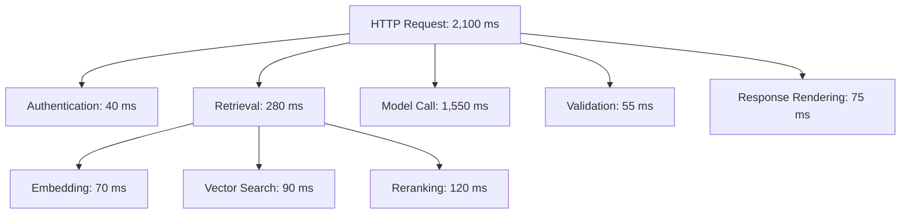

Useful span fields include:

* Request ID
* Trace ID
* Model
* Model version
* Provider
* Input tokens
* Output tokens
* Tool name
* Database query
* Retry count
* Error type
* Duration

---

## 31. Logging Schema

A production log might include:

```json
{
  "request_id": "req_014",
  "trace_id": "trace_8f42",
  "feature": "document_question_answering",
  "provider": "configured-provider",
  "model": "configured-model",
  "model_version": "resolved-version",
  "streaming": true,
  "input_tokens": 8420,
  "output_tokens": 318,
  "retrieval_ms": 205.4,
  "reranking_ms": 116.8,
  "model_ttft_ms": 742.5,
  "model_total_ms": 2386.2,
  "validation_ms": 34.7,
  "end_to_end_ms": 2842.6,
  "retry_count": 0,
  "status": "success"
}
```

Do not log sensitive prompt or response content without an approved policy.

---

## 32. Service-Level Objectives

A **Service-Level Objective**, or SLO, defines the target performance of a service.

Example:

```text
95% of chat requests should begin streaming within 1.5 seconds.

99% of classification requests should finish within 800 milliseconds.

99.9% of requests should complete without an internal error.
```

### Example SLO Table

| Feature           | Metric            |   Target |
| ----------------- | ----------------- | -------: |
| Chat              | P95 TTFT          |  ≤ 1.5 s |
| Classification    | P95 total latency | ≤ 800 ms |
| RAG answer        | P95 total latency |    ≤ 4 s |
| Voice assistant   | P95 TTFT          | ≤ 700 ms |
| Report generation | P95 completion    |   ≤ 30 s |

Different product features should have different latency targets.

---

## 33. Latency vs Quality

Optimization should not destroy answer quality.

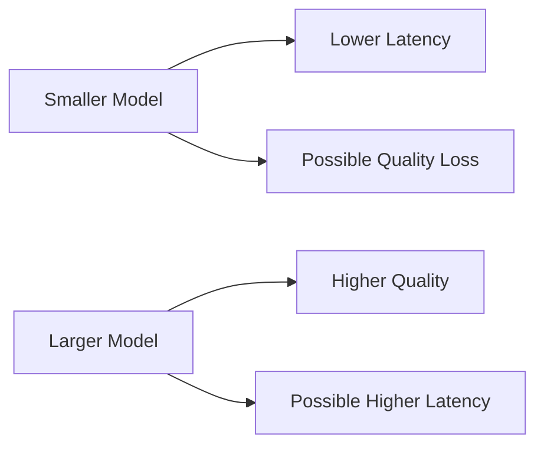

A useful model comparison records both.

| Model   | Quality Score | P95 Latency |
| ------- | ------------: | ----------: |
| Model A |         4.8/5 |       5.2 s |
| Model B |         4.5/5 |       1.8 s |
| Model C |         3.9/5 |       0.7 s |

The correct model depends on product requirements.

---

## 34. Latency vs Cost

Low latency may require:

* Reserved capacity
* More GPU instances
* Larger instance types
* Geographic replication
* Warm replicas
* Premium service tiers

This can increase cost.

```text
Lower latency
        may require
More available capacity
        which may cause
Higher infrastructure cost
```

A cost-effective design may tolerate higher latency for:

* Batch processing
* Background reports
* Low-priority jobs
* Long-running research tasks

---

## 35. Latency vs Throughput

Latency and throughput are related but different.

### Latency

Time required for one request.

### Throughput

Amount of work completed over time.

A system may optimize throughput through large batches while increasing individual request latency.

```text
Larger batches
→ better hardware utilization
→ higher throughput
→ possible longer waiting time per request
```

The correct optimization depends on whether the product is interactive or offline.

---

## 36. Optimization Checklist

### Model and Prompt

* Use the smallest model that meets the quality target.
* Reduce unnecessary input tokens.
* Limit output length.
* Use structured output.
* Select a faster model for simple tasks.
* Cache reusable prompt prefixes where supported.

### Retrieval

* Use metadata filters.
* Retrieve fewer candidates.
* Rerank selectively.
* Keep indexes close to the application.
* Cache common queries.
* Remove duplicate chunks.

### Infrastructure

* Deploy near users and data.
* Keep minimum warm capacity.
* Reuse network connections.
* Configure autoscaling.
* Use efficient inference engines.
* Quantize self-hosted models when quality remains acceptable.

### Agents and Tools

* Limit agent steps.
* Run independent tools concurrently.
* Use tool-specific timeouts.
* Cache tool results.
* Use direct workflows for predictable operations.
* Summarize large tool outputs.

### User Experience

* Stream output.
* Show genuine progress.
* Provide cancellation.
* Use asynchronous workflows for long operations.
* Notify users when background jobs complete.

---

## 37. Common Production Failures

### 37.1 Measuring Only the Model Call

#### Problem

The model dashboard shows 800 ms, but users wait four seconds.

#### Cause

The application ignores:

* Retrieval
* Network
* Authentication
* Output validation
* UI rendering

#### Fix

Measure both component latency and end-to-end latency.

---

### 37.2 Reporting Only Average Latency

#### Problem

The average appears acceptable while some users experience extreme delays.

#### Fix

Track P50, P95, P99, maximum, and timeout rate.

---

### 37.3 Benchmarking Only One Request

#### Problem

A single request may be unusually fast or slow.

#### Fix

Run repeated tests under realistic concurrency and report the distribution.

---

### 37.4 Mixing Cold and Warm Results

#### Problem

Cold-start requests and normal requests are combined into one metric.

#### Fix

Record cold and warm latency separately.

---

### 37.5 Comparing Different Prompt Sizes

#### Problem

Model A receives 1,000 tokens while Model B receives 10,000 tokens.

#### Fix

Use identical or normalized evaluation inputs.

---

### 37.6 Comparing Different Output Lengths

#### Problem

One model produces 50 tokens and another produces 500.

#### Fix

Compare equivalent task outputs or normalize generation settings.

---

### 37.7 No Timeout

#### Problem

A provider request waits indefinitely.

#### Fix

Set stage-level and total workflow timeouts.

---

### 37.8 Excessive Retries

#### Problem

Three slow retries turn a five-second request into a twenty-second request.

#### Fix

Use a retry budget and only retry temporary failures.

---

### 37.9 Sending Too Much Context

#### Problem

The full knowledge base is placed into every request.

#### Impact

* Higher TTFT
* Higher cost
* Lower relevance
* Possible context-limit errors

#### Fix

Use retrieval, summarization, and context budgeting.

---

### 37.10 Sequential Tool Calls

#### Problem

Independent tools execute one after another.

#### Fix

Execute independent operations concurrently.

---

### 37.11 Using an Agent for a Fixed Workflow

#### Problem

A multi-step agent handles a predictable one-step task.

#### Impact

* More model calls
* More cost
* Higher latency
* More failure points

#### Fix

Use deterministic application code for predictable workflows.

---

### 37.12 Ignoring Provider Queue Time

#### Problem

Latency becomes much worse during traffic spikes.

#### Fix

Monitor time by provider, region, deployment, and traffic level. Configure capacity or fallback routing.

---

## 38. Production Architecture

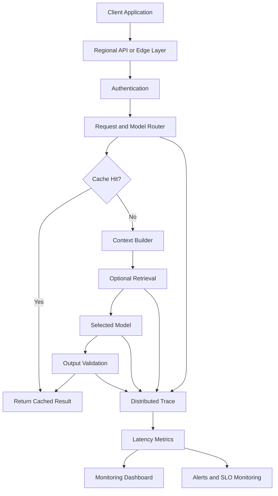

### Recommended Components

* Latency budget
* Request ID and trace ID
* Stage-level tracing
* P50, P95, and P99 dashboards
* Timeouts
* Retry budget
* Model router
* Cache
* Streaming
* Autoscaling
* Regional deployment
* Fallback model
* Load testing
* SLO alerts

---

## 39. Practical Exercises

### Exercise 1 — Five-Line Summary

Without reviewing the lesson, explain:

1. What latency means
2. What Time to First Token means
3. Why P95 matters
4. How input size affects latency
5. Why streaming improves perceived speed

---

### Exercise 2 — Basic Benchmark

Create a benchmark script that records:

* Model
* Input length
* Output length
* Total latency
* Success status
* Error
* P50
* P95
* P99

Run at least 30 requests.

---

### Exercise 3 — Prompt-Length Test

Test the same model with:

* 500 input tokens
* 5,000 input tokens
* 20,000 input tokens

Measure:

|    Input Size | TTFT | Total Latency | Cost |
| ------------: | ---: | ------------: | ---: |
|    500 tokens |      |               |      |
|  5,000 tokens |      |               |      |
| 20,000 tokens |      |               |      |

---

### Exercise 4 — Output-Length Test

Ask the model to generate:

* 50 tokens
* 250 tokens
* 1,000 tokens

Compare generation time and tokens per second.

---

### Exercise 5 — Streaming Test

Compare streaming and non-streaming modes.

| Metric                    | Streaming | Non-Streaming |
| ------------------------- | --------: | ------------: |
| Time to visible output    |           |               |
| Total latency             |           |               |
| Output quality            |           |               |
| Implementation complexity |           |               |

---

### Exercise 6 — RAG Latency Breakdown

Measure:

```text
Embedding
→ Search
→ Reranking
→ Prompt construction
→ Model generation
→ Validation
```

Identify the slowest stage and optimize it.

---

### Exercise 7 — Concurrent Load Test

Test the system with:

* 1 concurrent request
* 5 concurrent requests
* 20 concurrent requests
* 50 concurrent requests

Measure:

* P50 latency
* P95 latency
* Error rate
* Throughput
* Rate-limit responses

---

### Exercise 8 — Production Failure Report

```markdown
## Failure

The chatbot became extremely slow during peak traffic.

## Impact

P95 latency increased from 2 seconds to 14 seconds, and users
submitted duplicate requests.

## Detection

The latency dashboard showed increased model queue time and rate-limit
responses.

## Root Cause

The production deployment did not have enough capacity for concurrent
traffic, and the client automatically retried requests without a
retry budget.

## Immediate Fix

Disable excessive client retries and route traffic to the fallback
deployment.

## Permanent Fix

Add load testing, autoscaling, queue-time monitoring, backpressure,
and capacity alerts.

## Monitoring

Track P50, P95, P99, queue time, concurrent requests, retries, rate
limits, and timeout rate.
```

---

## 40. Completion Checklist

### Understanding

* [ ] I can explain latency in one or two minutes.
* [ ] I understand end-to-end latency.
* [ ] I can explain Time to First Token.
* [ ] I can explain total response latency.
* [ ] I understand tokens per second.
* [ ] I can explain P50, P95, and P99.
* [ ] I understand cold and warm starts.
* [ ] I understand perceived latency.

### Implementation

* [ ] I can measure total request latency.
* [ ] I can measure streaming TTFT.
* [ ] I record model and model version.
* [ ] I record input and output size.
* [ ] I calculate latency percentiles.
* [ ] I use timeouts.
* [ ] I implement bounded retries.
* [ ] I have tested concurrent requests.
* [ ] I have measured RAG stages separately.

### Production Readiness

* [ ] Every important feature has a latency SLO.
* [ ] P50, P95, and P99 are monitored.
* [ ] Cold and warm latency are separated.
* [ ] Model, retrieval, and tool calls are traced.
* [ ] Long operations use asynchronous workflows.
* [ ] Streaming is enabled where appropriate.
* [ ] A fallback deployment exists.
* [ ] Retry behavior fits the latency budget.
* [ ] Capacity has been load-tested.
* [ ] Quality is measured alongside latency.

---

## 41. Related Outcome

> Choose pre-trained AI models based on capability, context length, latency, cost, safety, and product fit.

A strong model-selection explanation could be:

```text
We selected Model B because it achieved the required answer quality
while keeping P95 Time to First Token below 1.5 seconds.

Model A produced slightly better answers, but its P95 latency exceeded
five seconds. Complex requests are routed to Model A, while normal
interactive requests use Model B.
```

A weak explanation would be:

```text
We selected the model because one test request was fast.
```

---

## 42. Related Project

# Project 2 — Model Comparison App

Extend the Model Comparison App to measure end-to-end and model-specific latency.

### Required Features

* Provider selection
* Model selection
* Shared prompt
* Streaming toggle
* Input-token count
* Output-token count
* Time to First Token
* Total latency
* Generation duration
* Tokens per second
* P50 latency
* P95 latency
* P99 latency
* Error rate
* Retry count
* Estimated cost
* Quality score

### Suggested Architecture

```mermaid
flowchart TD
    UI[Comparison Interface] --> API[Benchmark API]
    API --> NORMALIZE[Normalize Prompt and Settings]

    NORMALIZE --> MODEL_A[Model A Adapter]
    NORMALIZE --> MODEL_B[Model B Adapter]
    NORMALIZE --> MODEL_C[Model C Adapter]

    MODEL_A --> TRACE[Latency Trace]
    MODEL_B --> TRACE
    MODEL_C --> TRACE

    TRACE --> RESULTS[Normalized Results]
    RESULTS --> STATS[Percentile Calculator]
    STATS --> DB[(Benchmark Database)]
    DB --> DASHBOARD[Latency and Quality Dashboard]
```

### Normalized Result

```json
{
  "provider": "provider_name",
  "model": "model_name",
  "model_version": "resolved-version",
  "streaming": true,
  "input_tokens": 4210,
  "output_tokens": 286,
  "time_to_first_token_ms": 685.2,
  "generation_duration_ms": 2930.6,
  "total_latency_ms": 3615.8,
  "tokens_per_second": 97.59,
  "retrieval_ms": 0,
  "tool_ms": 0,
  "retry_count": 0,
  "quality_score": 4.5,
  "status": "success",
  "error": null
}
```

### Evaluation Cases

Include at least:

* Short prompt and short answer
* Short prompt and long answer
* Long prompt and short answer
* Long-context request
* Structured extraction
* RAG request
* Tool-calling request
* Streaming request
* Non-streaming request
* Five concurrent requests
* Twenty concurrent requests
* Cold-start request
* Provider timeout
* Rate-limit response

### Final Report Questions

1. Which model has the lowest P50 latency?
2. Which model has the lowest P95 latency?
3. Which model begins streaming fastest?
4. Which model generates tokens fastest?
5. How does input length affect TTFT?
6. How does output length affect total latency?
7. How much latency does RAG add?
8. How much latency do tools add?
9. Which model has the best quality-to-latency ratio?
10. Which model should handle interactive requests?
11. Which model should handle complex asynchronous tasks?
12. What fallback should be used during provider congestion?

---

## 43. Suggested 20-Minute Lesson Plan

|          Time | Activity                                             |
| ------------: | ---------------------------------------------------- |
|   0–3 minutes | Explain latency and why it matters                   |
|   3–6 minutes | Introduce TTFT, total latency, and tokens per second |
|   6–9 minutes | Explain P50, P95, P99, and latency budgets           |
|  9–12 minutes | Discuss prompt size, output length, and streaming    |
| 12–15 minutes | Run the benchmark demo                               |
| 15–17 minutes | Explain RAG and agent latency                        |
| 17–19 minutes | Review production failures and optimizations         |
| 19–20 minutes | Assign the Model Comparison App exercise             |

---

## 44. Key Takeaways

1. Latency is the time required for an AI operation to produce a useful result.
2. Users experience end-to-end latency, not only model inference latency.
3. Time to First Token measures how quickly streaming output begins.
4. Total latency measures how long the complete response takes.
5. Input length usually affects prompt-processing time and TTFT.
6. Output length usually affects generation duration.
7. Streaming lowers perceived latency but may not lower total latency.
8. P50 represents typical performance, while P95 and P99 expose slow requests.
9. Average latency alone is not sufficient for production monitoring.
10. Cold starts should be measured separately from warm requests.
11. RAG adds embedding, retrieval, filtering, and reranking latency.
12. Agents can be slow because they use multiple model and tool calls.
13. Independent tools should run in parallel when possible.
14. Timeouts and retry budgets prevent uncontrolled waiting.
15. Caching can reduce repeated work but must respect freshness and permissions.
16. Model routing can balance quality, latency, and cost.
17. Latency should be evaluated together with answer quality.
18. A production system should use traces, percentile dashboards, SLOs, and load tests.
19. The largest or most capable model is not always the best model for an interactive product.
20. The correct architecture gives each feature an appropriate latency target.

---

## 45. Final Summary

**Latency** is one of the most important model-selection and production-design criteria for modern AI applications.

A capable AI Engineer should be able to:

* Define latency targets
* Measure Time to First Token
* Measure total response time
* Calculate P50, P95, and P99
* Separate cold and warm performance
* Measure retrieval and tool latency
* Use streaming appropriately
* Reduce unnecessary context
* Limit output length
* Configure timeouts and retries
* Execute independent tools concurrently
* Route tasks to suitable models
* Benchmark realistic concurrency
* Monitor latency distributions
* Balance speed with quality and cost
* Explain why a selected model fits the product experience

Turn this lesson into a latency benchmark, streaming experiment, RAG trace, concurrent load test, SLO dashboard, or Model Comparison App so that the concept becomes practical engineering experience.
