# 015 — Cost

| Field                  | Details                                       |
| ---------------------- | --------------------------------------------- |
| **Course**             | 02 — Model Platforms and Prompting            |
| **Module**             | Module 03 — Using Pre-trained Models          |
| **Content Group**      | Selection Criteria                            |
| **Roadmap Source**     | Using Pre-trained Models / Selection Criteria |
| **Lesson Type**        | Model Selection                               |
| **Order in Module**    | 015                                           |
| **Suggested Duration** | 20 minutes                                    |

> **Pricing note:** Model prices, cloud instance prices, free-tier limits, and billing rules change frequently. Keep pricing in configuration and verify current provider documentation before making production decisions.

---

## 1. Summary

**Cost** is the total amount of money required to build, run, and maintain an AI feature.

For a simple hosted model request, cost may appear to be:

```text
Input token cost
+
Output token cost
```

A production AI application usually has many additional expenses:

* Model inference
* Embedding generation
* Vector search
* Reranking
* Tool and API calls
* File processing
* Image, audio, or video processing
* Application servers
* Databases and storage
* Network transfer
* Monitoring and logging
* Evaluation
* Human review
* Failed requests and retries
* Engineering and maintenance

The cheapest model per token is not always the cheapest model for the product.

A low-cost model may:

* Produce more errors
* Require longer prompts
* Need repeated retries
* Generate invalid structured output
* Create more human-review work
* Reduce user satisfaction

A better selection criterion is often:

```text
Cost per successful task
```

rather than:

```text
Cost per API request
```

---

## 2. Learning Objectives

After completing this lesson, you should be able to:

1. Explain AI application cost in your own words.
2. Identify direct and indirect AI costs.
3. Calculate approximate token-based inference cost.
4. Distinguish cost per request from cost per successful task.
5. Estimate monthly cost from expected traffic.
6. Explain how context length and output length affect cost.
7. Identify costs introduced by RAG, tools, and agents.
8. Compare hosted APIs with self-hosted models.
9. Design model-routing and caching strategies.
10. Set budgets, quotas, and cost alerts.
11. Log model usage and cost by feature.
12. Add cost analysis to a Model Comparison App.

---

## 3. Why Cost Matters

A prototype may process only a few requests.

A production application may process:

* Thousands of users
* Millions of tokens
* Large document collections
* Repeated tool calls
* Long multimodal inputs
* Multiple model steps per task

A feature that costs only a fraction of a cent per request can still become expensive at scale.

### Example

```text
Cost per request:        $0.01
Requests per day:       100,000
Daily cost:             $1,000
Approximate monthly cost: $30,000
```

Small design choices can therefore have a large financial effect.

---

## 4. Main Cost Categories

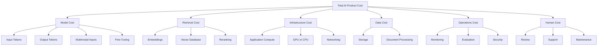

---

## 5. Direct Model Cost

Hosted model providers commonly charge by usage.

### 5.1 Input Tokens

Input tokens may include:

* System instructions
* User input
* Conversation history
* Retrieved documents
* Tool definitions
* Tool results
* Examples
* Structured-output schemas

### 5.2 Output Tokens

Output tokens are generated by the model.

Output tokens are often more expensive than input tokens because they require sequential generation.

### 5.3 Simplified Formula

```text
Request cost =
    Input tokens × input price per token
  + Output tokens × output price per token
```

Provider prices are commonly displayed per one million tokens.

```text
Request cost =
    Input tokens / 1,000,000 × input price
  + Output tokens / 1,000,000 × output price
```

---

## 6. Token Cost Example

Assume the following illustrative prices:

```text
Input:  $2.00 per 1,000,000 tokens
Output: $8.00 per 1,000,000 tokens
```

A request uses:

```text
Input tokens:  4,000
Output tokens:   500
```

Calculation:

```text
Input cost =
    4,000 / 1,000,000 × $2.00
  = $0.008

Output cost =
    500 / 1,000,000 × $8.00
  = $0.004

Total model cost =
    $0.008 + $0.004
  = $0.012
```

At 100,000 requests:

```text
100,000 × $0.012 = $1,200
```

This example excludes retrieval, storage, monitoring, and application infrastructure.

---

## 7. Context Length and Cost

Long prompts usually increase input-token cost.

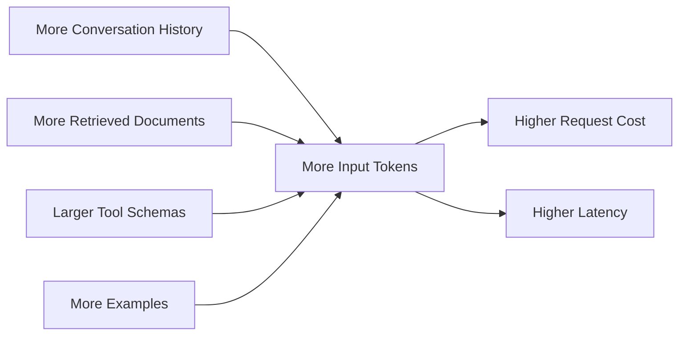

### Example

| Prompt Strategy            | Input Tokens |
| -------------------------- | -----------: |
| Short instruction          |          500 |
| Full conversation history  |        8,000 |
| Full history and documents |       35,000 |
| Retrieved relevant context |        5,000 |

Sending all available context may be significantly more expensive than selecting only relevant information.

### Better Context Strategy

* Keep the system prompt concise.
* Summarize old conversation history.
* Retrieve only relevant document sections.
* Remove duplicate instructions.
* Load only relevant tools.
* Reserve a clear output-token budget.
* Cache reusable prompt prefixes when supported.

---

## 8. Output Length and Cost

Long outputs increase:

* Token cost
* Generation latency
* Storage
* Network transfer
* Post-processing time

### Weak Prompt

```text
Explain this topic in as much detail as possible.
```

### Controlled Prompt

```text
Explain the topic in no more than five bullet points.
Each bullet must contain fewer than 25 words.
```

### Output Budgeting

```text
Short classification:     10–50 tokens
Structured extraction:    50–300 tokens
Chat answer:              100–600 tokens
Detailed report:          1,000+ tokens
```

The correct limit depends on the feature.

Do not request a 2,000-token answer when the UI displays only three sentences.

---

## 9. Cost per Request vs Cost per Successful Task

A request may complete technically while failing the actual task.

Possible failures include:

* Incorrect answer
* Invalid JSON
* Missing required fields
* Wrong tool call
* Unsupported claims
* Incorrect language
* User requests a retry

### Formula

```text
Cost per successful task =
    Total cost
    ÷
    Number of successfully completed tasks
```

### Example

| Model   | Cost per Request | Success Rate | Cost per Successful Task |
| ------- | ---------------: | -----------: | -----------------------: |
| Model A |           $0.010 |          60% |                  $0.0167 |
| Model B |           $0.014 |          95% |                  $0.0147 |
| Model C |           $0.025 |          98% |                  $0.0255 |

Model B costs more per request than Model A but less per successful task.

---

## 10. Quality-Adjusted Cost

Cost should be evaluated together with quality.

### Example Metric

```text
Quality-adjusted cost =
    Cost per successful task
    ÷
    Quality score
```

Another useful metric is:

```text
Value score =
    Quality score
    ÷
    Cost per request
```

These formulas are not universal standards. They are decision tools that should be adapted to the product.

### Model Comparison

| Model           | Quality | P95 Latency | Cost per Successful Task |
| --------------- | ------: | ----------: | -----------------------: |
| Small Model     |   3.9/5 |       0.8 s |                   $0.004 |
| Balanced Model  |   4.5/5 |       1.7 s |                   $0.011 |
| Reasoning Model |   4.8/5 |       7.2 s |                   $0.065 |

The correct choice depends on task importance.

---

## 11. Monthly Cost Estimation

A simple monthly forecast requires:

* Active users
* Requests per user
* Input tokens per request
* Output tokens per request
* Model prices
* Number of days

### Formula

```text
Monthly requests =
    Daily active users
  × Requests per user per day
  × Days per month
```

```text
Monthly model cost =
    Monthly input-token cost
  + Monthly output-token cost
```

### Example

```text
Daily active users:          10,000
Requests per user per day:        4
Days:                            30
Monthly requests:          1,200,000
```

If one request costs $0.006:

```text
1,200,000 × $0.006 = $7,200 per month
```

Add a safety margin for:

* Traffic growth
* Retries
* Experiments
* Long-tail requests
* Provider pricing changes

---

## 12. Practical Demo: Cost Calculator

```python
from dataclasses import asdict, dataclass


@dataclass
class ModelPricing:
    input_per_million: float
    output_per_million: float


@dataclass
class RequestCost:
    input_tokens: int
    output_tokens: int
    input_cost: float
    output_cost: float
    total_cost: float


def calculate_request_cost(
    input_tokens: int,
    output_tokens: int,
    pricing: ModelPricing,
) -> RequestCost:
    if input_tokens < 0 or output_tokens < 0:
        raise ValueError("Token counts must not be negative.")

    input_cost = (
        input_tokens / 1_000_000
    ) * pricing.input_per_million

    output_cost = (
        output_tokens / 1_000_000
    ) * pricing.output_per_million

    return RequestCost(
        input_tokens=input_tokens,
        output_tokens=output_tokens,
        input_cost=round(input_cost, 8),
        output_cost=round(output_cost, 8),
        total_cost=round(input_cost + output_cost, 8),
    )


def estimate_monthly_cost(
    request_cost: float,
    daily_active_users: int,
    requests_per_user: float,
    days: int = 30,
    retry_rate: float = 0.0,
) -> dict[str, float]:
    if retry_rate < 0:
        raise ValueError("retry_rate must not be negative.")

    base_requests = (
        daily_active_users
        * requests_per_user
        * days
    )

    effective_requests = base_requests * (1 + retry_rate)
    monthly_cost = effective_requests * request_cost

    return {
        "base_requests": round(base_requests, 2),
        "effective_requests": round(effective_requests, 2),
        "monthly_cost": round(monthly_cost, 2),
    }


if __name__ == "__main__":
    pricing = ModelPricing(
        input_per_million=2.00,
        output_per_million=8.00,
    )

    request = calculate_request_cost(
        input_tokens=4_000,
        output_tokens=500,
        pricing=pricing,
    )

    forecast = estimate_monthly_cost(
        request_cost=request.total_cost,
        daily_active_users=10_000,
        requests_per_user=4,
        retry_rate=0.05,
    )

    print("Request cost:")
    print(asdict(request))

    print("\nMonthly forecast:")
    print(forecast)
```

Store prices in configuration rather than hard-coding them throughout the application.

---

## 13. Pricing Configuration

```json
{
  "provider_a": {
    "model_small": {
      "input_per_million": 0.5,
      "output_per_million": 2.0,
      "effective_from": "2026-07-01"
    },
    "model_large": {
      "input_per_million": 3.0,
      "output_per_million": 12.0,
      "effective_from": "2026-07-01"
    }
  }
}
```

Recommended fields include:

* Provider
* Model
* Model version
* Input price
* Output price
* Cached-input price
* Image or audio price
* Effective date
* Currency
* Source
* Last verified date

---

## 14. RAG Cost

RAG introduces components beyond generation.

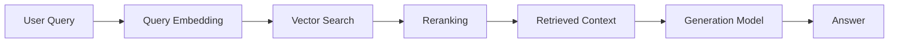

### RAG Cost Components

```text
RAG cost =
    Document ingestion
  + Document embeddings
  + Vector storage
  + Query embeddings
  + Search
  + Reranking
  + Generation
  + Monitoring
```

### One-Time or Periodic Costs

* Document parsing
* OCR
* Chunking
* Embedding generation
* Index construction

### Per-Request Costs

* Query embedding
* Search
* Reranking
* Model inference

---

## 15. RAG Can Reduce or Increase Cost

RAG may reduce model cost by avoiding extremely long prompts.

```text
Full knowledge base in prompt
        ↓
Very high input-token cost
```

Compared with:

```text
Retrieve five relevant chunks
        ↓
Smaller prompt
```

However, RAG can increase total cost if it adds:

* Expensive reranking
* Multiple retrieval queries
* Large candidate sets
* Duplicate context
* Repeated embedding generation
* Unnecessary generation steps

RAG should be measured end to end.

---

## 16. Agent Cost

Agents may make several model and tool calls for one user request.

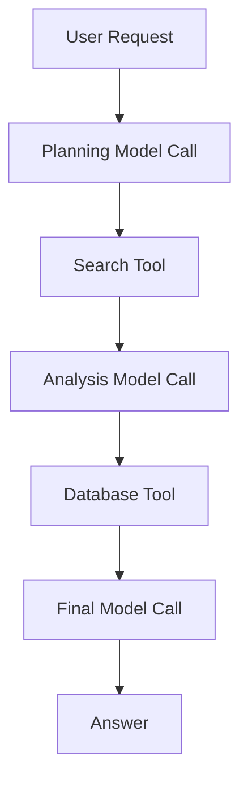

### Formula

```text
Agent task cost =
    Sum of model-call costs
  + Sum of tool-call costs
  + Retrieval costs
  + Retry costs
```

### Example

| Step           |       Cost |
| -------------- | ---------: |
| Planning call  |     $0.008 |
| Search API     |     $0.002 |
| Analysis call  |     $0.018 |
| Database query |     $0.001 |
| Final response |     $0.006 |
| **Total**      | **$0.035** |

A single user request may therefore produce several billable operations.

### Agent Optimization

* Limit maximum iterations.
* Use deterministic workflows when possible.
* Use smaller models for routing.
* Avoid repeating the same tool call.
* Cache reusable results.
* Stop when the task is complete.
* Set a maximum cost per agent run.

---

## 17. Tool and API Costs

Some tools have their own pricing:

* Web search
* Maps
* Weather
* Email delivery
* OCR
* Translation
* Speech recognition
* Text-to-speech
* Database queries
* Code execution
* Image generation

A complete cost record should associate tool costs with the originating user request.

```json
{
  "request_id": "req_015",
  "model_cost": 0.012,
  "search_cost": 0.003,
  "rerank_cost": 0.001,
  "total_variable_cost": 0.016
}
```

---

## 18. Multimodal Cost

Multimodal features may be billed according to:

* Image count
* Image resolution
* Audio duration
* Video duration
* Number of pages
* Input tokens after extraction
* Generated media duration or resolution

### Example Pipeline

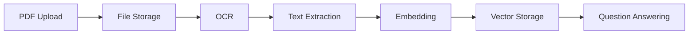

Every stage may have a cost.

Optimize by:

* Processing files once
* Reusing extracted text
* Deduplicating uploads
* Compressing images where appropriate
* Selecting only relevant pages
* Avoiding repeated OCR
* Storing reusable embeddings

---

## 19. Hosted API vs Self-Hosting

### Hosted API

The provider manages:

* Hardware
* Scaling
* Model serving
* Updates
* Availability

You usually pay according to usage.

### Self-Hosted Model

Your team manages:

* GPUs or CPUs
* Containers
* Serving runtime
* Autoscaling
* Monitoring
* Updates
* Security
* Capacity planning

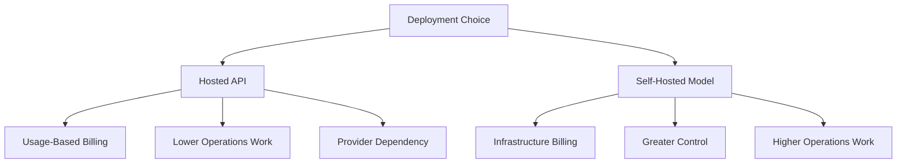

---

## 20. Self-Hosting Cost

Self-hosted inference cost may include:

```text
Compute instances
+ GPU memory
+ Storage
+ Network
+ Load balancing
+ Monitoring
+ Engineering
+ Idle capacity
+ Reliability and backups
```

### Simplified Infrastructure Cost

```text
Monthly compute cost =
    Hourly instance price
  × Number of instances
  × Running hours
```

Example:

```text
Hourly price:        $4
Instances:            3
Hours per month:    730

Monthly compute:
$4 × 3 × 730 = $8,760
```

This excludes storage, networking, support, and engineering.

---

## 21. Utilization Matters

A self-hosted model may look inexpensive when hardware is fully utilized.

It may be expensive when traffic is low.

```text
Low utilization
→ idle GPU capacity
→ high cost per request
```

```text
High utilization
→ more requests per instance
→ lower infrastructure cost per request
```

### Break-Even Analysis

Compare:

```text
Hosted API monthly cost
        versus
Self-hosted monthly infrastructure and operations cost
```

The break-even point depends on:

* Traffic volume
* Request length
* Required hardware
* Utilization
* Availability target
* Engineering capacity

---

## 22. Fixed and Variable Costs

### Fixed Costs

Do not change directly with each request.

Examples:

* Reserved GPU capacity
* Salaries
* Monitoring subscriptions
* Development environments
* Minimum database size

### Variable Costs

Increase with usage.

Examples:

* Model tokens
* Search calls
* Generated images
* Audio duration
* Network transfer
* Serverless functions

### Total Cost

```text
Total cost =
    Fixed cost
  + Variable cost
```

A low-traffic application may prefer usage-based services.

A high-volume stable workload may benefit from reserved or self-hosted capacity.

---

## 23. Cost Allocation

AI spending should be attributable to:

* Feature
* User
* Team
* Customer
* Environment
* Model
* Project
* Tenant

### Example Dimensions

```json
{
  "feature": "natal_reading",
  "environment": "production",
  "tenant_id": "tenant_42",
  "provider": "provider_a",
  "model": "model-balanced",
  "prompt_version": "natal_v12",
  "cost_usd": 0.0284
}
```

Cost allocation helps answer:

* Which feature is most expensive?
* Which users generate the most usage?
* Which model provides the best value?
* Which environment wastes capacity?
* Which prompt version increased spending?

---

## 24. Cost Logging

A production log may include:

```json
{
  "request_id": "req_015",
  "feature": "document_question_answering",
  "provider": "configured-provider",
  "model": "configured-model",
  "model_version": "resolved-version",
  "input_tokens": 8420,
  "output_tokens": 318,
  "model_cost_usd": 0.0217,
  "embedding_cost_usd": 0.0001,
  "rerank_cost_usd": 0.0010,
  "tool_cost_usd": 0.0020,
  "total_variable_cost_usd": 0.0248,
  "latency_ms": 2842.6,
  "quality_score": 4.6,
  "status": "success"
}
```

Do not include sensitive content in unrestricted cost logs.

---

## 25. Budgets and Quotas

Set limits at several levels.

### Possible Limits

* Maximum tokens per request
* Maximum output tokens
* Maximum requests per minute
* Maximum cost per user per day
* Maximum agent steps
* Maximum search calls
* Maximum file-processing size
* Monthly project budget

### Budget Enforcement

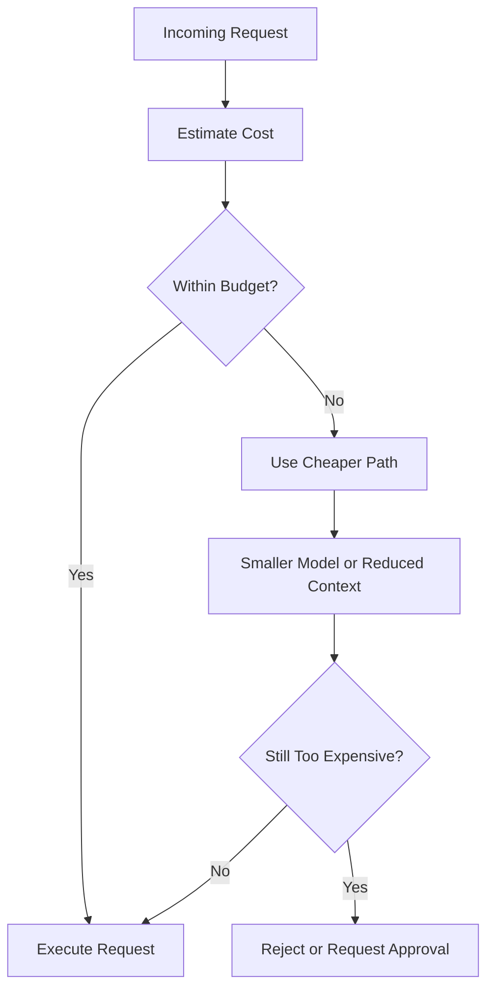

---

## 26. Cost-Aware Model Routing

A router can choose models based on task difficulty and budget.

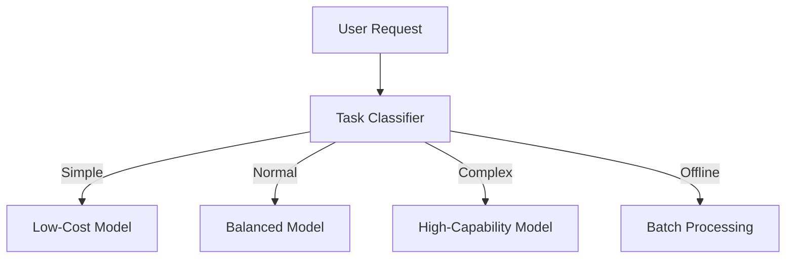

### Example Policy

```text
Classification or routing
→ Small model

Normal support answer
→ Balanced model

Complex legal or coding analysis
→ High-capability model

Large report
→ Asynchronous batch workflow
```

The router should be evaluated for both:

* Cost savings
* Quality loss

---

## 27. Cascading Models

A model cascade starts with a lower-cost option and escalates when necessary.

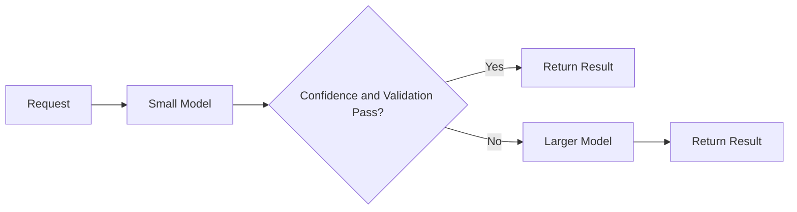

Escalation conditions may include:

* Low confidence
* Invalid output
* Difficult request
* Safety-sensitive topic
* User correction
* Missing evidence

Cascades can reduce average cost while preserving quality for difficult cases.

---

## 28. Caching

Caching avoids repeated computation.

### Cacheable Items

* Identical model responses
* Query embeddings
* Document summaries
* Search results
* Static tool responses
* Prompt prefixes
* Translations
* Classification results

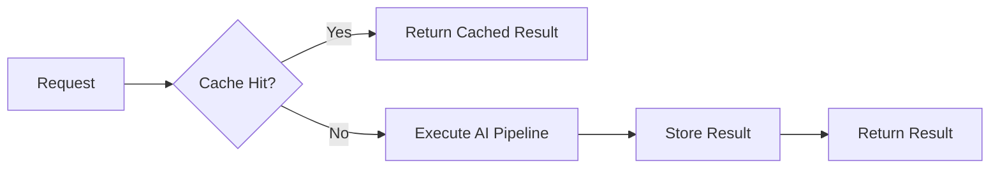

### Cache Key Requirements

Include values that affect the output:

* User or tenant permissions
* Language
* Model
* Model version
* Prompt version
* Input
* Knowledge-base version
* Tool configuration

A poor cache key can leak private data or return outdated results.

---

## 29. Batch Processing

Batch processing is often cheaper for non-interactive workloads.

Examples:

* Generating embeddings
* Classifying large datasets
* Summarizing archived documents
* Evaluating models
* Producing scheduled reports

Batch systems can improve:

* Hardware utilization
* Throughput
* Cost per item

Trade-off:

* Results are not immediate.

---

## 30. Retries and Failure Cost

Retries create additional billable operations.

### Example

```text
Initial request: $0.01
Retry 1:         $0.01
Retry 2:         $0.01

Total:           $0.03
```

A technical failure may still consume provider tokens before returning an error.

### Retry Strategy

* Retry only temporary errors.
* Use exponential backoff.
* Limit maximum attempts.
* Track retry cost separately.
* Use idempotency for external actions.
* Avoid regenerating completed tool steps.

---

## 31. Failed Output Cost

A response can be unusable because it:

* Violates a schema
* Is factually incorrect
* Uses the wrong language
* Ignores instructions
* Requires human correction

Track:

```text
Wasted model cost
=
Cost of failed or rejected outputs
```

Useful metrics:

* Schema failure cost
* Hallucination-related cost
* Retry cost
* Human-review cost
* User regeneration cost

---

## 32. Human Review Cost

High-stakes workflows may require humans to review model output.

Examples:

* Legal documents
* Medical content
* Financial recommendations
* Account actions
* Safety moderation

### Total Workflow Cost

```text
Total task cost =
    AI cost
  + Human review time
  + Correction time
```

A more accurate model may reduce review time enough to justify a higher API price.

---

## 33. Evaluation Cost

Model evaluation also uses resources.

Evaluation may include:

* Running test datasets
* Judge-model calls
* Human scoring
* Storage
* Analytics
* Repeated regression testing

Evaluation cost is necessary because it prevents more expensive production failures.

Use:

* Small smoke-test suites for every change
* Larger benchmark suites before releases
* Targeted tests for affected features
* Cached static evaluation inputs

---

## 34. Cost Optimization Framework

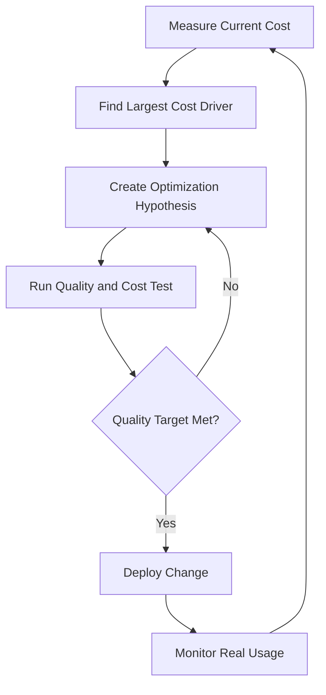

Do not optimize blindly.

Every cost reduction should be checked against:

* Accuracy
* Reliability
* Latency
* Safety
* User experience

---

## 35. Common Optimization Techniques

### Prompt and Context

* Shorten system instructions.
* Remove duplicate examples.
* Summarize old conversation history.
* Retrieve fewer relevant chunks.
* Reduce tool schemas.
* Set output limits.

### Model Selection

* Use smaller models for simple tasks.
* Route difficult tasks to larger models.
* Use specialized classification or embedding models.
* Evaluate quantized self-hosted models.

### Pipeline Design

* Cache repeated work.
* Batch offline jobs.
* Avoid unnecessary reranking.
* Reuse extracted document content.
* Parallelize independent operations to reduce infrastructure time.
* Stop agent loops early.

### Infrastructure

* Autoscale capacity.
* Remove idle endpoints.
* Use serverless services for intermittent traffic.
* Reserve capacity only for stable workloads.
* Monitor utilization.
* Choose appropriate regions.

---

## 36. Common Production Failures

### 36.1 Tracking Only Token Price

#### Problem

The team ignores retrieval, tools, infrastructure, and review costs.

#### Fix

Measure total workflow cost.

---

### 36.2 Selecting the Cheapest Model

#### Problem

The selected model produces many invalid or incorrect responses.

#### Fix

Measure cost per successful task.

---

### 36.3 No Output Limit

#### Problem

The model produces unnecessarily long answers.

#### Fix

Set feature-specific output limits.

---

### 36.4 Sending Full Conversation History

#### Problem

Every chat request becomes more expensive over time.

#### Fix

Keep recent messages and summarize older history.

---

### 36.5 Sending Too Much RAG Context

#### Problem

The system retrieves many documents and includes all of them.

#### Fix

Filter, deduplicate, rerank, and enforce a context budget.

---

### 36.6 Unbounded Agent Loops

#### Problem

An agent repeatedly calls models and tools.

#### Fix

Set:

* Maximum steps
* Maximum tool calls
* Maximum duration
* Maximum cost

---

### 36.7 Ignoring Retries

#### Problem

The usage dashboard counts requests but not automatic retry costs.

#### Fix

Log every provider and tool attempt.

---

### 36.8 No Pricing Version

#### Problem

Historical cost calculations use the latest price instead of the price active when the request occurred.

#### Fix

Store pricing version and effective date.

---

### 36.9 Paying for Idle Infrastructure

#### Problem

GPU endpoints run continuously with low utilization.

#### Fix

Use autoscaling, serverless inference, scheduling, or hosted APIs where appropriate.

---

### 36.10 No Cost Attribution

#### Problem

The team sees one large cloud bill but cannot identify its source.

#### Fix

Tag and log spending by feature, user, model, and environment.

---

### 36.11 Caching Private Data Incorrectly

#### Problem

A cached answer from one user is returned to another.

#### Fix

Include authorization context in cache keys or avoid caching sensitive results.

---

### 36.12 Optimizing Cost Without Quality Tests

#### Problem

A cheaper model is released and production accuracy decreases.

#### Fix

Require quality regression tests for every cost optimization.

---

## 37. Production Architecture

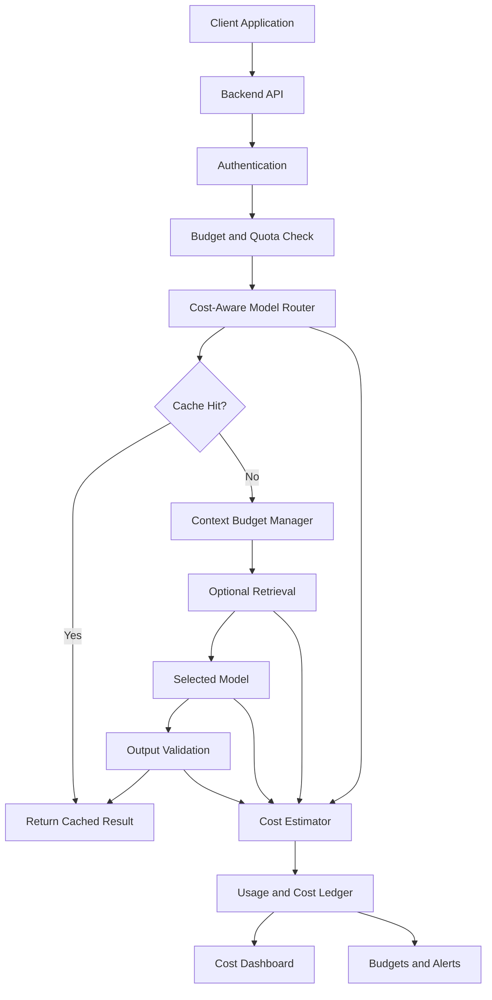

### Recommended Components

* Pricing registry
* Model registry
* Token counter
* Request cost estimator
* Feature-level budgets
* User quotas
* Cost-aware router
* Context budget manager
* Cache
* Usage ledger
* Cost dashboards
* Budget alerts
* Quality regression tests

---

## 38. Practical Exercise 1 — Five-Line Summary

Without reviewing the lesson, explain:

1. What AI cost includes
2. How token pricing works
3. What cost per successful task means
4. Why agents can be expensive
5. How model routing can reduce cost

---

## 39. Practical Exercise 2 — Request Calculator

Create a script that accepts:

* Input tokens
* Output tokens
* Input price
* Output price
* Monthly request count

Return:

* Cost per request
* Daily cost
* Monthly cost
* Annual cost

---

## 40. Practical Exercise 3 — Context Cost Test

Compare:

* 1,000 input tokens
* 5,000 input tokens
* 20,000 input tokens

Use the same question and output limit.

| Input Tokens | Cost | Latency | Quality |
| -----------: | ---: | ------: | ------: |
|        1,000 |      |         |         |
|        5,000 |      |         |         |
|       20,000 |      |         |         |

---

## 41. Practical Exercise 4 — Model Comparison

Compare three models using the same dataset.

| Metric                   | Model A | Model B | Model C |
| ------------------------ | ------: | ------: | ------: |
| Cost per request         |         |         |         |
| Success rate             |         |         |         |
| Cost per successful task |         |         |         |
| Quality score            |         |         |         |
| P95 latency              |         |         |         |
| Schema-valid rate        |         |         |         |

---

## 42. Practical Exercise 5 — RAG Cost

Measure:

```text
Embedding cost
+ Search cost
+ Reranking cost
+ Generation cost
= Total RAG cost
```

Compare:

```text
Full-context prompting
vs.
RAG without reranking
vs.
RAG with reranking
```

---

## 43. Practical Exercise 6 — Agent Budget

Build an agent with:

* Maximum five steps
* Maximum three tool calls
* Maximum cost of $0.10
* Maximum duration of 30 seconds

The workflow should stop safely when a limit is reached.

---

## 44. Practical Exercise 7 — Production Failure Report

```markdown
## Failure

The monthly AI bill increased by 240%.

## Impact

The feature exceeded its approved operating budget.

## Detection

The cost dashboard showed a sudden increase in input-token usage and
automatic retries.

## Root Cause

A release started sending the complete conversation history and ten
retrieved documents with every request. Provider timeouts also caused
up to three retries.

## Immediate Fix

Disable the release, reduce retrieved context, and limit retries.

## Permanent Fix

Add context budgets, per-request cost estimates, prompt regression
tests, and feature-level spending alerts.

## Monitoring

Track input tokens, output tokens, retry cost, cost per request, cost
per successful task, and monthly budget consumption.
```

---

## 45. Completion Checklist

### Understanding

* [ ] I can explain AI cost in one or two minutes.
* [ ] I understand input- and output-token pricing.
* [ ] I can distinguish fixed and variable costs.
* [ ] I understand cost per successful task.
* [ ] I understand RAG and agent costs.
* [ ] I can compare hosted and self-hosted costs.
* [ ] I understand why human review should be included.

### Implementation

* [ ] I can calculate request cost.
* [ ] I can estimate monthly cost.
* [ ] I record model and pricing versions.
* [ ] I record input and output tokens.
* [ ] I attribute costs to features.
* [ ] I set request and output limits.
* [ ] I track retries.
* [ ] I have tested at least one cost optimization.

### Production Readiness

* [ ] Pricing is stored in configuration.
* [ ] Feature-level budgets exist.
* [ ] User or tenant quotas are enforced.
* [ ] Cost alerts are configured.
* [ ] Agent runs have maximum cost limits.
* [ ] Idle infrastructure is monitored.
* [ ] Cache keys respect permissions.
* [ ] Cost and quality are evaluated together.
* [ ] Cost per successful task is tracked.
* [ ] A fallback exists when the budget is exceeded.

---

## 46. Related Outcome

> Choose pre-trained AI models based on capability, context length, latency, cost, safety, reliability, and product fit.

A strong model-selection explanation could be:

```text
We selected the balanced model because it achieved a 94% successful
task rate while keeping the cost per successful result below our
approved target.

Simple classification requests use a smaller model, while complex
requests are escalated only when validation fails.
```

A weak explanation would be:

```text
We selected this model because it has the lowest token price.
```

---

## 47. Related Project

# Project 2 — Model Comparison App

Extend the Model Comparison App to calculate and compare total AI cost.

### Required Features

* Provider selection
* Model selection
* Pricing configuration
* Input-token count
* Output-token count
* Cost per request
* Cost per successful task
* Monthly usage forecast
* Latency
* Quality score
* Retry count
* Tool costs
* Retrieval costs
* Budget alerts

### Suggested Architecture

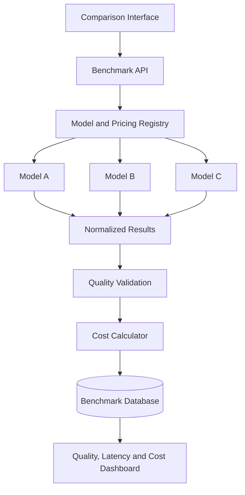

### Normalized Result

```json
{
  "provider": "provider_name",
  "model": "model_name",
  "model_version": "resolved-version",
  "pricing_version": "2026-07",
  "input_tokens": 4210,
  "output_tokens": 286,
  "model_cost_usd": 0.0124,
  "retrieval_cost_usd": 0.0003,
  "tool_cost_usd": 0.002,
  "total_cost_usd": 0.0147,
  "latency_ms": 1824.5,
  "quality_score": 4.5,
  "task_success": true,
  "retry_count": 0,
  "status": "success",
  "error": null
}
```

### Evaluation Cases

Include:

* Short classification
* Structured extraction
* Normal chat
* Long-context request
* RAG request
* Tool-calling request
* Multi-step agent
* Multimodal input
* Retry scenario
* Invalid-output scenario
* High-volume forecast
* Self-hosted cost estimate

### Final Report Questions

1. Which model has the lowest cost per request?
2. Which model has the lowest cost per successful task?
3. Which model has the best quality-to-cost ratio?
4. How much does long context increase cost?
5. How much does RAG add or save?
6. How much do agent steps cost?
7. What percentage of spending comes from failed requests?
8. Which model should handle simple tasks?
9. Which model should handle complex tasks?
10. At what traffic level might self-hosting become reasonable?
11. Which optimization reduces cost without harming quality?
12. What monthly budget should be approved?

---

## 48. Suggested 20-Minute Lesson Plan

|          Time | Activity                                                 |
| ------------: | -------------------------------------------------------- |
|   0–3 minutes | Explain direct and indirect AI costs                     |
|   3–6 minutes | Calculate token-based request cost                       |
|   6–9 minutes | Explain monthly forecasting and cost per successful task |
|  9–12 minutes | Discuss RAG, tools, and agent costs                      |
| 12–15 minutes | Run the cost-calculator demo                             |
| 15–18 minutes | Review optimization strategies and failures              |
| 18–20 minutes | Assign the Model Comparison App exercise                 |

---

## 49. Key Takeaways

1. AI cost includes more than model token prices.
2. Hosted model requests are commonly priced by input and output usage.
3. Long prompts and long answers increase cost.
4. Output tokens may have different pricing from input tokens.
5. Cost per successful task is more meaningful than cost per request.
6. RAG adds embedding, retrieval, storage, and optional reranking costs.
7. RAG can still reduce total cost by limiting model context.
8. Agents may trigger several model and tool calls for one task.
9. Retries and invalid outputs create wasted spending.
10. Hosted APIs reduce infrastructure work but create provider usage costs.
11. Self-hosting adds compute, idle capacity, operations, and maintenance costs.
12. Utilization is critical when evaluating self-hosted economics.
13. Model routing and cascades can reduce average cost.
14. Caching and batch processing can eliminate repeated work.
15. Every request should be attributed to a feature, model, and pricing version.
16. Budgets, quotas, and alerts should be enforced automatically.
17. Cost optimization must be tested against quality, latency, reliability, and safety.
18. The cheapest model is not always the most economical product choice.

---

## 50. Final Summary

**Cost** is a critical model-selection and production-design criterion.

A capable AI Engineer should be able to:

* Calculate token-based request cost
* Estimate daily and monthly spending
* Measure cost per successful task
* Include retrieval, tools, infrastructure, and review costs
* Compare hosted and self-hosted deployment
* Attribute spending to features and users
* Design cost-aware model routing
* Limit context and output length
* Control agent iterations
* Cache repeated work
* Batch offline workloads
* Set budgets and quotas
* Monitor retries and failed-output costs
* Test cost optimization against quality
* Explain why a selected model provides acceptable product value

Turn this lesson into a request-cost calculator, monthly forecast, RAG cost analysis, agent budget controller, self-hosting break-even analysis, or Model Comparison App dashboard so that the concept becomes practical engineering experience.
