# 016 — Quality

| Field                  | Details                                       |
| ---------------------- | --------------------------------------------- |
| **Course**             | 02 — Model Platforms and Prompting            |
| **Module**             | Module 03 — Using Pre-trained Models          |
| **Content Group**      | Selection Criteria                            |
| **Roadmap Source**     | Using Pre-trained Models / Selection Criteria |
| **Lesson Type**        | Model Selection                               |
| **Order in Module**    | 016                                           |
| **Suggested Duration** | 20 minutes                                    |

---

## 1. Summary

**Quality** describes how well an AI system completes the task it was designed to perform.

For a generative AI application, quality may include:

* Factual correctness
* Instruction following
* Completeness
* Relevance
* Clarity
* Groundedness
* Structured-output compliance
* Tool-call accuracy
* Retrieval quality
* Safety
* Language quality
* User satisfaction

Quality is not a single universal score.

A model may be strong at:

* Creative writing

but weak at:

* Structured extraction
* Mathematical reasoning
* Vietnamese responses
* Citation generation
* Tool use

A production system should therefore evaluate quality using:

```text
Real tasks
+ Real prompts
+ Representative data
+ Edge cases
+ Failure cases
+ Product-specific metrics
```

Model quality must also be considered together with:

```text
Quality
+ Latency
+ Cost
+ Reliability
+ Safety
+ Product fit
```

The most capable model is not automatically the best production model. A slightly less capable model may be preferable if it is faster, cheaper, more consistent, and easier to validate.

---

## 2. Learning Objectives

After completing this lesson, you should be able to:

1. Explain AI output quality in your own words.
2. Define quality according to a real product task.
3. Distinguish subjective and objective quality metrics.
4. Create a representative evaluation dataset.
5. Design a scoring rubric.
6. Evaluate structured output automatically.
7. Use human evaluation appropriately.
8. Explain the advantages and limitations of model-based judges.
9. Evaluate RAG, tool calling, and agents separately.
10. Compare models using quality, latency, and cost.
11. Detect quality regressions after model or prompt changes.
12. Add quality evaluation to a Model Comparison App.

---

## 3. What Does Quality Mean?

Quality means that the AI system produces an output that is useful, correct, and suitable for the intended product.

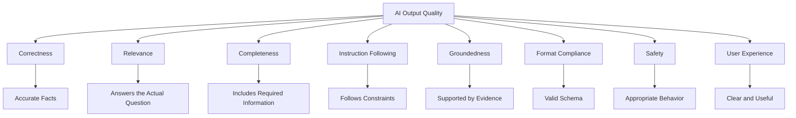

The definition of quality changes by feature.

### Customer-Support Classifier

Quality may mean:

* Correct category
* Correct urgency
* Valid JSON
* No unsupported assumptions

### RAG Assistant

Quality may mean:

* Relevant retrieval
* Correct answer
* Accurate citations
* No claims beyond the sources

### Code Generator

Quality may mean:

* Code compiles
* Tests pass
* No security regressions
* Minimal unnecessary changes

### Creative-Writing Assistant

Quality may mean:

* Style
* Coherence
* Originality
* Tone
* User preference alignment

---

## 4. Quality Is Task-Specific

A model should not be labeled simply as “high quality” without identifying the task.

```text
High quality for what?
```

Possible tasks include:

* Classification
* Summarization
* Translation
* Extraction
* Reasoning
* Coding
* RAG
* Tool selection
* Image understanding
* Conversation

### Example

| Model   | Classification | Creative Writing | Tool Calling |
| ------- | -------------: | ---------------: | -----------: |
| Model A |      Excellent |          Average |         Good |
| Model B |           Good |        Excellent |      Average |
| Model C |        Average |             Good |    Excellent |

A model-selection decision should match the actual workload.

---

## 5. Main Quality Dimensions

### 5.1 Correctness

Does the response contain the right answer?

Examples:

* Correct classification label
* Correct calculation
* Correct fact
* Correct code behavior
* Correct tool arguments

Correctness may be measured automatically when a known answer exists.

---

### 5.2 Relevance

Does the response directly address the user’s request?

A response can be factually correct but irrelevant.

#### User Request

```text
How do I reset my password?
```

#### Irrelevant but Correct Answer

```text
Passwords are used to protect user accounts.
```

#### Relevant Answer

```text
Open Settings, choose Security, and select Reset Password.
```

---

### 5.3 Completeness

Does the response contain all required information?

Example requirements:

```text
Return:
- category
- urgency
- summary
- next action
```

A response missing `next action` is incomplete even if the other fields are correct.

---

### 5.4 Instruction Following

Does the model follow constraints such as:

* Language
* Length
* Tone
* Output format
* Allowed labels
* Source restrictions
* Refusal behavior

Example:

```text
Answer in no more than three sentences.
```

A correct ten-paragraph answer fails instruction following.

---

### 5.5 Groundedness

Are the claims supported by the supplied evidence?

Groundedness is especially important for:

* RAG
* Web search
* Enterprise knowledge assistants
* Document analysis

```text
Grounded answer
=
Claims supported by available sources
```

---

### 5.6 Clarity

Is the output easy to understand?

Clarity includes:

* Logical structure
* Appropriate terminology
* Concise explanations
* No unnecessary repetition
* Clear next actions

---

### 5.7 Consistency

Does the model behave similarly across repeated equivalent inputs?

Inconsistent behavior can create:

* Different labels for the same case
* Unstable JSON schemas
* Contradictory answers
* Difficult debugging

---

### 5.8 Safety

Does the system behave appropriately in sensitive or prohibited situations?

Safety quality may include:

* Avoiding dangerous instructions
* Protecting personal data
* Refusing unauthorized actions
* Handling uncertainty
* Escalating high-risk cases

---

### 5.9 User Satisfaction

Does the output help the user complete the task?

Signals may include:

* Positive ratings
* Low regeneration rate
* Low correction rate
* High task completion
* Reduced support escalation

User satisfaction is useful but can be influenced by presentation, speed, and user expectations.

---

## 6. Quality Evaluation Pipeline

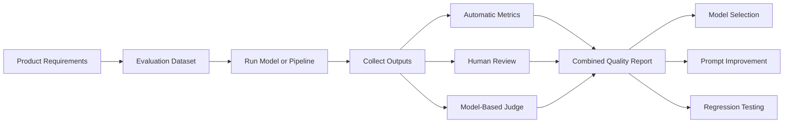

A strong evaluation combines several methods rather than relying on one score.

---

## 7. Offline vs Online Evaluation

### Offline Evaluation

Performed before deployment using a fixed dataset.

Examples:

* Accuracy tests
* Schema validation
* RAG groundedness
* Code test execution
* Human scoring

#### Advantages

* Repeatable
* Safe
* Easy to compare versions
* Suitable for release gates

#### Limitations

* May not represent real traffic perfectly
* Cannot capture every production behavior

---

### Online Evaluation

Performed using production or controlled live traffic.

Examples:

* User ratings
* A/B testing
* Task completion
* Regeneration rate
* Support escalation
* Error reports

#### Advantages

* Reflects actual user behavior
* Reveals unexpected use cases

#### Limitations

* Requires careful safety controls
* Can expose users to lower-quality variants
* Results may be affected by UX differences

---

## 8. Evaluation Dataset Design

A useful evaluation dataset should reflect production inputs.

### Include

* Normal cases
* Easy cases
* Difficult cases
* Ambiguous cases
* Missing information
* Long inputs
* Short inputs
* Typographical errors
* Vietnamese inputs
* English inputs
* Mixed-language inputs
* Prompt-injection attempts
* Historical production failures
* Rare but high-impact cases

### Dataset Balance

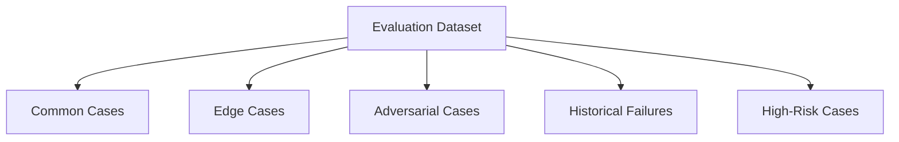

A dataset containing only happy-path examples will overestimate production quality.

---

## 9. Golden Dataset

A **golden dataset** contains carefully reviewed test cases with expected outcomes.

### Example Classification Record

```json
{
  "id": "ticket_014",
  "input": "I was charged twice for the same subscription.",
  "expected": {
    "category": "billing",
    "urgency": "medium",
    "sentiment": "negative"
  }
}
```

### Example Generative Record

```json
{
  "id": "summary_008",
  "input": "Long project update...",
  "required_facts": [
    "The launch moved to August 12.",
    "Testing begins on August 3."
  ],
  "forbidden_claims": [
    "The project was canceled."
  ],
  "maximum_words": 100
}
```

### Golden Dataset Requirements

* Versioned
* Reviewed
* Representative
* Traceable
* Updated after production incidents

---

## 10. Objective Metrics

Objective metrics can be calculated automatically.

### Classification Metrics

* Accuracy
* Precision
* Recall
* F1 score
* Confusion matrix

### Extraction Metrics

* Exact match
* Field accuracy
* Schema-valid rate
* Missing-field rate

### Retrieval Metrics

* Recall@K
* Precision@K
* Mean Reciprocal Rank
* NDCG
* Top-1 accuracy

### Code Metrics

* Compilation rate
* Test pass rate
* Security test results
* Patch application success

### Generation Metrics

* Required-fact coverage
* Unsupported-claim rate
* Length compliance
* Citation correctness

---

## 11. Classification Quality

### Accuracy

```text
Accuracy =
    Correct predictions
    ÷
    Total predictions
```

### Precision

```text
Precision =
    True positives
    ÷
    Predicted positives
```

### Recall

```text
Recall =
    True positives
    ÷
    Actual positives
```

### F1 Score

```text
F1 =
    2 × Precision × Recall
    ÷
    Precision + Recall
```

Use accuracy carefully when classes are imbalanced.

### Example

If only 1% of requests are security incidents, a model that always predicts “not security” achieves 99% accuracy but has zero security recall.

---

## 12. Confusion Matrix

A confusion matrix shows which labels are confused.

| Actual / Predicted | Billing | Account | Technical |
| ------------------ | ------: | ------: | --------: |
| Billing            |      82 |       8 |        10 |
| Account            |       6 |      90 |         4 |
| Technical          |      12 |       5 |        83 |

This helps identify whether the model frequently confuses:

* Billing and account issues
* Technical and performance issues
* Urgent and non-urgent requests

---

## 13. Structured-Output Quality

A backend often requires strict data.

### Example Schema

```json
{
  "category": "billing",
  "urgency": "medium",
  "requires_human_review": false
}
```

### Quality Checks

1. Is the output valid JSON?
2. Are all fields present?
3. Are values allowed?
4. Do values follow business rules?
5. Is the classification correct?

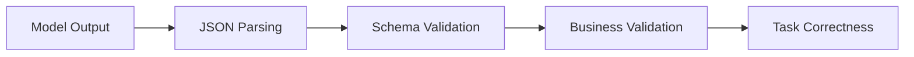

A syntactically valid JSON response can still contain an incorrect answer.

---

## 14. Practical Demo: Structured Evaluation

```python
from dataclasses import asdict, dataclass
from typing import Literal

from pydantic import BaseModel, ValidationError


class TicketAnalysis(BaseModel):
    category: Literal[
        "account",
        "billing",
        "technical",
        "other",
    ]
    urgency: Literal["low", "medium", "high"]
    sentiment: Literal["negative", "neutral", "positive"]
    requires_human_review: bool


@dataclass
class EvaluationResult:
    case_id: str
    schema_valid: bool
    category_correct: bool
    urgency_correct: bool
    sentiment_correct: bool
    total_score: float
    error: str | None = None


def evaluate_ticket_output(
    case_id: str,
    actual_output: dict,
    expected_output: dict,
) -> EvaluationResult:
    try:
        validated = TicketAnalysis.model_validate(actual_output)
    except ValidationError as exc:
        return EvaluationResult(
            case_id=case_id,
            schema_valid=False,
            category_correct=False,
            urgency_correct=False,
            sentiment_correct=False,
            total_score=0.0,
            error=str(exc),
        )

    category_correct = (
        validated.category == expected_output["category"]
    )
    urgency_correct = (
        validated.urgency == expected_output["urgency"]
    )
    sentiment_correct = (
        validated.sentiment == expected_output["sentiment"]
    )

    component_scores = [
        float(category_correct),
        float(urgency_correct),
        float(sentiment_correct),
    ]

    total_score = sum(component_scores) / len(component_scores)

    return EvaluationResult(
        case_id=case_id,
        schema_valid=True,
        category_correct=category_correct,
        urgency_correct=urgency_correct,
        sentiment_correct=sentiment_correct,
        total_score=round(total_score, 3),
    )


if __name__ == "__main__":
    expected = {
        "category": "billing",
        "urgency": "medium",
        "sentiment": "negative",
    }

    actual = {
        "category": "billing",
        "urgency": "medium",
        "sentiment": "negative",
        "requires_human_review": False,
    }

    result = evaluate_ticket_output(
        case_id="ticket_014",
        actual_output=actual,
        expected_output=expected,
    )

    print(asdict(result))
```

---

## 15. Rubric-Based Evaluation

Some tasks do not have one exact answer.

Examples:

* Writing
* Summarization
* Explanation
* Report generation
* Conversation

Use a scoring rubric.

### Example Rubric

| Criterion             | Weight | Score |
| --------------------- | -----: | ----: |
| Correctness           |    30% |   1–5 |
| Completeness          |    20% |   1–5 |
| Relevance             |    20% |   1–5 |
| Clarity               |    15% |   1–5 |
| Instruction following |    15% |   1–5 |

### Weighted Score

```text
Quality Score =
    Correctness × 0.30
  + Completeness × 0.20
  + Relevance × 0.20
  + Clarity × 0.15
  + Instruction Following × 0.15
```

Rubric criteria should describe observable behavior.

---

## 16. Example Quality Rubric

### Score 5 — Excellent

* Fully correct
* Complete
* Directly relevant
* Follows all instructions
* No unsupported claims

### Score 4 — Good

* Mostly correct
* Minor omission
* Clear and useful
* No major error

### Score 3 — Acceptable

* Main answer is usable
* Some missing details
* Minor unsupported statement

### Score 2 — Poor

* Significant omission
* Partially incorrect
* Requires major correction

### Score 1 — Failed

* Incorrect
* Irrelevant
* Unsafe
* Cannot be used

---

## 17. Human Evaluation

Humans are useful for evaluating subjective or high-impact outputs.

### Human Review Is Valuable For

* Tone
* Clarity
* Creativity
* Domain correctness
* Safety
* Cultural appropriateness
* User usefulness

### Reviewer Instructions Should Define

* The task
* The expected audience
* The scoring rubric
* Examples of each score
* What counts as a critical failure

---

## 18. Inter-Rater Agreement

Different reviewers may score the same response differently.

Measure agreement to detect an unclear rubric.

### Example

| Case | Reviewer A | Reviewer B |
| ---- | ---------: | ---------: |
| 001  |          5 |          5 |
| 002  |          4 |          2 |
| 003  |          3 |          3 |

Large disagreements may indicate:

* Ambiguous criteria
* Missing examples
* Different domain interpretations
* Reviewer fatigue

Improve the rubric before trusting the evaluation results.

---

## 19. Model-Based Judges

A language model can score another model’s output.

This is sometimes called:

```text
LLM-as-a-Judge
```

### Possible Workflow

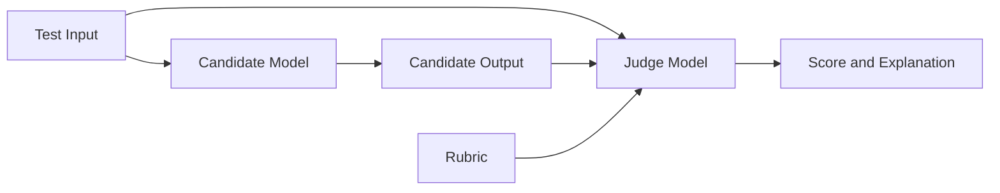

### Advantages

* Faster than full human evaluation
* Scales to large datasets
* Useful for early comparisons
* Can provide criterion-level feedback

### Limitations

* Judge bias
* Preference for verbose answers
* Sensitivity to prompt wording
* Inconsistent scoring
* Possible preference for its own style
* Cannot replace expert review in high-stakes domains

Use model judges as one signal rather than the only source of truth.

---

## 20. Pairwise Evaluation

Instead of scoring each answer independently, compare two answers.

```text
Given the same input:

Which response is better?
- Response A
- Response B
- Tie
```

Pairwise evaluation is useful when absolute scoring is difficult.

### Advantages

* Easier judgment
* Useful for model comparison
* Reduces scoring inconsistency

### Risks

* Position bias
* Length bias
* Judge-model bias

Randomize answer order to reduce position bias.

---

## 21. Blind Evaluation

Reviewers should not know which provider produced each answer.

### Poor Evaluation

```text
Response from the expensive flagship model
```

### Better Evaluation

```text
Candidate B
```

Blind evaluation reduces brand and expectation bias.

---

## 22. RAG Quality

RAG quality includes more than final-answer quality.

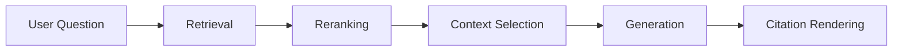

Each stage can fail separately.

### Retrieval Quality

* Relevant document retrieved
* Correct version retrieved
* Authorized document retrieved
* Important section ranked highly

### Generation Quality

* Answer supported by context
* No unsupported claims
* Appropriate refusal when evidence is missing

### Citation Quality

* Citation supports the claim
* Citation points to the correct source
* Citation is not misleading

---

## 23. RAG Evaluation Metrics

| Metric              | Meaning                              |
| ------------------- | ------------------------------------ |
| Recall@K            | Relevant evidence appears in top K   |
| Precision@K         | Retrieved results are relevant       |
| Groundedness        | Claims are supported by context      |
| Answer relevance    | Answer addresses the question        |
| Citation accuracy   | Citations support claims             |
| Context utilization | Model uses useful retrieved evidence |

### Important Principle

```text
Good generation cannot recover evidence that retrieval failed to find.
```

---

## 24. Tool-Calling Quality

A tool-enabled system should be evaluated on:

1. Tool selection
2. Argument generation
3. Authorization
4. Tool execution
5. Final response

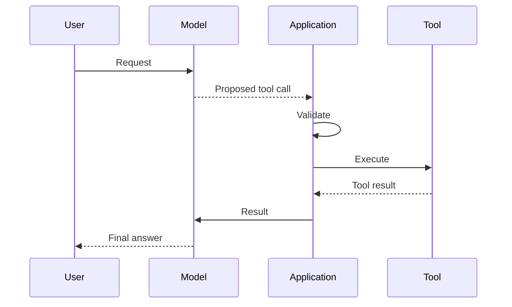

### Example Metrics

* Correct-tool rate
* Argument-valid rate
* Unauthorized-action rate
* Tool success rate
* Final task-completion rate
* Unnecessary-tool-call rate

---

## 25. Agent Quality

Agents may use several reasoning and tool steps.

### Agent Quality Dimensions

* Correct plan
* Correct tool sequence
* Efficient number of steps
* Recovery from tool errors
* Task completion
* No repeated loops
* No unauthorized actions
* Useful final response

### Agent Success

```text
Agent quality
≠
Quality of final text only
```

A fluent answer may hide:

* Unnecessary tool calls
* Incorrect database access
* Excessive cost
* Unsupported intermediate steps

---

## 26. Coding Quality

Code generation should be tested through execution.

### Evaluation Pipeline

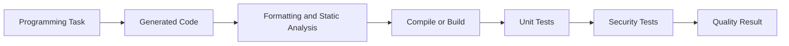

### Useful Metrics

* Build success
* Unit-test pass rate
* Integration-test pass rate
* Static-analysis violations
* Security findings
* Unnecessary file changes
* Runtime performance

Do not evaluate generated code only by reading it.

---

## 27. Multilingual Quality

A model that performs well in English may perform differently in Vietnamese.

Test:

* Grammar
* Natural phrasing
* Terminology
* Tone
* Cultural appropriateness
* Mixed-language input
* Diacritics
* Structured output with multilingual text

### Example Evaluation Cases

```text
English input → English output
Vietnamese input → Vietnamese output
Vietnamese input → English output
Mixed input → requested language
```

---

## 28. Multimodal Quality

For images, audio, and documents, evaluate the full processing pipeline.

### Image Tasks

* Object recognition
* Text reading
* Chart interpretation
* Spatial reasoning
* Counting

### Audio Tasks

* Transcription accuracy
* Speaker identification
* Noise robustness
* Timestamp accuracy

### Document Tasks

* OCR quality
* Table extraction
* Layout understanding
* Page selection
* Citation accuracy

---

## 29. Confidence and Calibration

A model may sound confident even when it is wrong.

A calibrated system should:

* Show higher confidence for reliable outputs
* Show lower confidence for uncertain outputs
* Escalate difficult cases
* Avoid unsupported certainty

### Calibration Test

Group predictions by confidence.

| Confidence Range | Actual Accuracy |
| ---------------- | --------------: |
| 90–100%          |             92% |
| 70–89%           |             75% |
| 50–69%           |             54% |

If 90%-confidence outputs are correct only 60% of the time, the system is poorly calibrated.

---

## 30. Reliability and Variance

Generative models may return different outputs for the same input.

Test repeated runs:

```text
Same prompt
+ Same model
+ Multiple runs
→ Output variance
```

### Measure

* Label stability
* Schema stability
* Factual consistency
* Tool-selection consistency
* Score variance

Lower temperature may improve consistency but does not guarantee correctness.

---

## 31. Quality Regression Testing

Quality may change after:

* Model upgrades
* Prompt edits
* RAG index changes
* Tool-schema changes
* Provider migration
* Temperature changes
* Safety-policy changes

### Regression Workflow

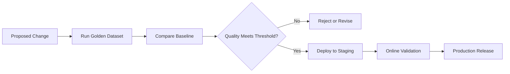

---

## 32. Release Gates

A release gate prevents deployment when quality falls below an acceptable threshold.

### Example Gates

```text
Classification accuracy ≥ 92%
Schema-valid rate ≥ 99%
Critical hallucination rate = 0%
Retrieval Recall@5 ≥ 90%
Tool argument accuracy ≥ 97%
P95 latency ≤ 3 seconds
Cost per successful task ≤ $0.03
```

Quality should be combined with safety, latency, and cost requirements.

---

## 33. Statistical Significance

Small score differences may be caused by random variation.

Example:

```text
Model A accuracy: 91.2%
Model B accuracy: 91.5%
```

On a dataset of only 20 examples, the difference may not be meaningful.

Use:

* Larger datasets
* Confidence intervals
* Repeated runs
* Paired comparisons
* Significance tests where appropriate

---

## 34. Error Analysis

A single aggregate score does not explain why the model fails.

Categorize errors.

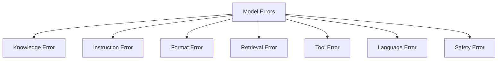

### Error Record

```json
{
  "case_id": "ticket_014",
  "error_type": "instruction_following",
  "severity": "medium",
  "description": "The response exceeded the maximum length.",
  "model": "configured-model",
  "prompt_version": "ticket_v4"
}
```

Error categories help identify whether to improve:

* Model choice
* Prompt
* Retrieval
* Tool configuration
* Validation
* Dataset coverage

---

## 35. Severity Levels

Not every error has the same impact.

### Low Severity

* Minor formatting issue
* Slightly verbose response

### Medium Severity

* Missing useful detail
* Incorrect non-critical classification

### High Severity

* Incorrect financial value
* Wrong tool action
* Privacy violation
* Unsafe recommendation
* Unsupported legal claim

Use severity-weighted quality scores when high-impact errors matter.

---

## 36. Quality Score Example

```text
Weighted Quality =
    Correctness × 0.30
  + Groundedness × 0.20
  + Instruction Following × 0.15
  + Completeness × 0.15
  + Clarity × 0.10
  + Safety × 0.10
```

Example:

| Criterion             | Score | Weight |   Weighted |
| --------------------- | ----: | -----: | ---------: |
| Correctness           |   4.5 |   0.30 |       1.35 |
| Groundedness          |   4.0 |   0.20 |       0.80 |
| Instruction following |   5.0 |   0.15 |       0.75 |
| Completeness          |   4.0 |   0.15 |       0.60 |
| Clarity               |   4.5 |   0.10 |       0.45 |
| Safety                |   5.0 |   0.10 |       0.50 |
| **Total**             |       |        | **4.45/5** |

---

## 37. Quality, Latency, and Cost

Model selection requires trade-offs.

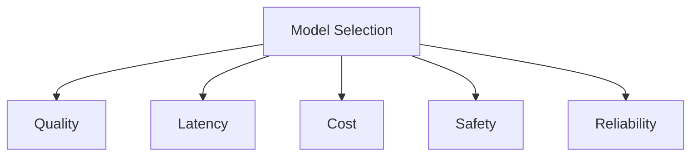

### Comparison Example

| Model   | Quality | P95 Latency | Cost per Task |
| ------- | ------: | ----------: | ------------: |
| Model A |   4.8/5 |       6.5 s |        $0.060 |
| Model B |   4.5/5 |       2.1 s |        $0.018 |
| Model C |   4.0/5 |       0.8 s |        $0.005 |

Possible routing:

```text
Simple tasks → Model C
Normal tasks → Model B
Complex high-value tasks → Model A
```

---

## 38. Quality per Cost

A useful metric is:

```text
Quality per dollar =
    Quality score
    ÷
    Cost per successful task
```

Another useful concept is the minimum acceptable quality threshold.

```text
Select the lowest-cost model
that meets all required quality thresholds.
```

Do not maximize quality beyond what the product needs if the cost and latency increase significantly.

---

## 39. Quality Monitoring in Production

Offline evaluation is not enough.

Production monitoring may include:

* User feedback
* Regeneration rate
* Manual correction rate
* Escalation rate
* Schema failures
* Tool failures
* Groundedness sampling
* Citation errors
* Complaint rate

### Monitoring Flow

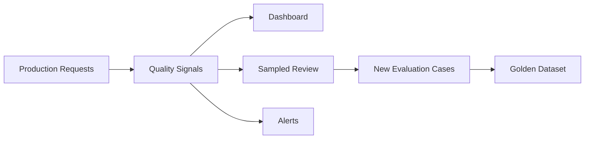

Production failures should become future regression tests.

---

## 40. User Feedback

### Explicit Feedback

* Thumbs up or down
* Rating
* Written comment
* Correction

### Implicit Feedback

* User regenerates answer
* User abandons task
* User manually edits output
* User escalates to support
* User retries with another model

Implicit signals require careful interpretation.

A user may regenerate because of curiosity, not because the answer was wrong.

---

## 41. Quality Drift

Quality can degrade over time because:

* User behavior changes
* Data changes
* Product terminology changes
* Model versions change
* Retrieval indexes become stale
* Prompt templates are modified
* New edge cases appear

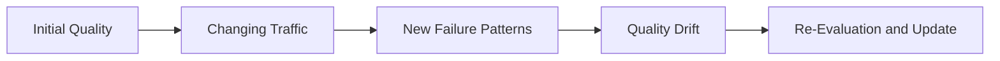

Monitor quality by:

* Time
* Model version
* Prompt version
* Feature
* Language
* User segment
* Input length

---

## 42. Quality Logging

A production quality record may include:

```json
{
  "request_id": "req_016",
  "feature": "support_ticket_analysis",
  "provider": "configured-provider",
  "model": "configured-model",
  "model_version": "resolved-version",
  "prompt_version": "ticket_v5",
  "schema_valid": true,
  "category_correct": true,
  "groundedness_score": 4.7,
  "instruction_score": 5.0,
  "human_review_required": false,
  "latency_ms": 1284.5,
  "cost_usd": 0.012,
  "status": "success"
}
```

Ground-truth correctness is not always available immediately in production. Some metrics may be calculated later through sampling or review.

---

## 43. Common Production Failures

### 43.1 Selecting a Model from One Prompt

#### Problem

The model looks excellent on one demonstration.

#### Fix

Use a representative evaluation dataset.

---

### 43.2 Using Public Benchmarks Only

#### Problem

A high public benchmark score does not guarantee product quality.

#### Fix

Test real prompts, languages, formats, and failure cases.

---

### 43.3 Evaluating Only Happy Paths

#### Problem

The model passes normal inputs but fails on ambiguity, missing data, or adversarial requests.

#### Fix

Include edge cases and historical failures.

---

### 43.4 Treating Fluency as Correctness

#### Problem

A fluent answer sounds convincing but contains unsupported claims.

#### Fix

Evaluate factual correctness and groundedness separately.

---

### 43.5 Checking JSON Syntax Only

#### Problem

The output is valid JSON but contains the wrong category.

#### Fix

Validate schema and task correctness.

---

### 43.6 No Prompt-Version Tracking

#### Problem

Quality changes, but the team cannot identify which prompt caused it.

#### Fix

Log prompt version with every evaluation and request.

---

### 43.7 Biased Human Evaluation

#### Problem

Reviewers know which model is more expensive or popular.

#### Fix

Use blind, randomized evaluation.

---

### 43.8 Trusting a Model Judge Completely

#### Problem

The judge favors verbose or stylistically similar responses.

#### Fix

Validate the judge against human-reviewed examples.

---

### 43.9 Ignoring Variance

#### Problem

One run succeeds, but repeated runs produce inconsistent outputs.

#### Fix

Run important cases multiple times.

---

### 43.10 No Regression Gate

#### Problem

A model or prompt update reaches production without evaluation.

#### Fix

Require automated release thresholds.

---

### 43.11 One Aggregate Score Hides Critical Failures

#### Problem

A model has a high average score but fails dangerous edge cases.

#### Fix

Track critical failures separately.

---

### 43.12 Optimizing Quality Without Cost or Latency

#### Problem

The highest-quality model creates an unusably slow or expensive product.

#### Fix

Use multi-objective model selection.

---

## 44. Production Architecture

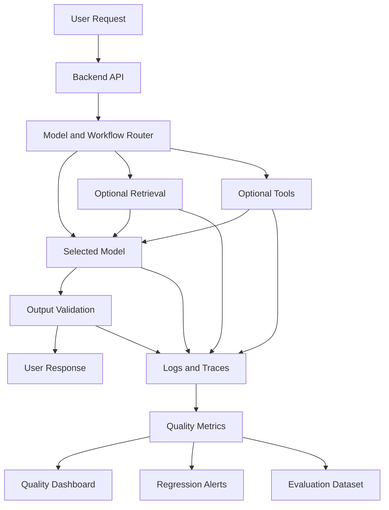

### Recommended Components

* Versioned evaluation dataset
* Model registry
* Prompt registry
* Automatic metrics
* Human-review workflow
* Model-based judge
* Schema validation
* Error taxonomy
* Quality dashboard
* Regression gates
* Online feedback
* Production sampling

---

## 45. Practical Exercise 1 — Five-Line Summary

Without reviewing the lesson, explain:

1. What AI quality means
2. Why quality is task-specific
3. What a golden dataset is
4. Why fluency is not the same as correctness
5. Why production monitoring is necessary

---

## 46. Practical Exercise 2 — Build a Rubric

Create a rubric for a support assistant using:

* Correctness
* Relevance
* Completeness
* Clarity
* Groundedness
* Safety

Define observable criteria for scores 1–5.

---

## 47. Practical Exercise 3 — Structured Evaluation

Create 20 ticket-classification cases.

Measure:

* Schema-valid rate
* Category accuracy
* Urgency accuracy
* Sentiment accuracy
* Overall task success

---

## 48. Practical Exercise 4 — Human Evaluation

Ask two reviewers to score the same 20 responses.

Compare:

* Average score
* Reviewer disagreement
* Common ambiguous criteria

Improve the rubric and repeat the evaluation.

---

## 49. Practical Exercise 5 — RAG Evaluation

Build a small RAG system and measure:

| Metric                  | Score |
| ----------------------- | ----: |
| Recall@5                |       |
| Answer correctness      |       |
| Groundedness            |       |
| Citation accuracy       |       |
| Missing-answer behavior |       |

---

## 50. Practical Exercise 6 — Tool-Calling Evaluation

Create a mock order tool.

Test:

* Correct tool selection
* Correct argument
* Missing argument
* Invalid order ID
* Unauthorized user
* Tool timeout
* Unnecessary tool call

---

## 51. Practical Exercise 7 — Regression Test

Compare two prompt versions:

```text
Prompt v1
vs.
Prompt v2
```

Record:

| Metric                   | v1 | v2 |
| ------------------------ | -: | -: |
| Accuracy                 |    |    |
| Schema-valid rate        |    |    |
| Hallucination rate       |    |    |
| P95 latency              |    |    |
| Cost per successful task |    |    |

---

## 52. Practical Exercise 8 — Production Failure Report

```markdown
## Failure

The new prompt increased answer fluency but reduced factual accuracy.

## Impact

Users received confident but unsupported product-policy answers.

## Detection

A sampled production review found an increased hallucination rate.

## Root Cause

The release prompt encouraged comprehensive answers but removed the
instruction to use only retrieved policy documents.

## Immediate Fix

Restore the previous prompt version.

## Permanent Fix

Add groundedness and unsupported-claim checks to the release gate.

## Monitoring

Track prompt version, groundedness, citation accuracy, unsupported
claims, user corrections, and escalation rate.
```

---

## 53. Completion Checklist

### Understanding

* [ ] I can explain AI quality in one or two minutes.
* [ ] I understand that quality is task-specific.
* [ ] I can distinguish correctness, relevance, and completeness.
* [ ] I understand groundedness.
* [ ] I can explain objective and subjective metrics.
* [ ] I understand human and model-based evaluation.
* [ ] I understand quality regression.

### Implementation

* [ ] I have created an evaluation dataset.
* [ ] I have created a scoring rubric.
* [ ] I can validate structured output.
* [ ] I can calculate task-level metrics.
* [ ] I have tested edge cases.
* [ ] I record model and prompt versions.
* [ ] I perform error analysis.
* [ ] I have compared at least two models.

### Production Readiness

* [ ] Release quality thresholds are defined.
* [ ] Critical failures are tracked separately.
* [ ] Production quality is sampled.
* [ ] User feedback is recorded.
* [ ] RAG retrieval and generation are evaluated separately.
* [ ] Tool and agent quality are measured.
* [ ] Judge-model scores are validated against humans.
* [ ] Quality is measured together with cost and latency.
* [ ] Production failures become new evaluation cases.
* [ ] Rollback criteria are documented.

---

## 54. Related Outcome

> Choose pre-trained AI models based on capability, context length, latency, cost, safety, quality, and product fit.

A strong model-selection explanation could be:

```text
We selected Model B because it achieved a 94% task-success rate,
99.2% schema compliance, and zero critical failures on our production
evaluation dataset.

Model A had slightly higher writing quality but lower groundedness and
a significantly higher cost per successful task.
```

A weak explanation would be:

```text
We selected Model B because its answers looked better.
```

---

## 55. Related Project

# Project 2 — Model Comparison App

Extend the Model Comparison App to evaluate quality across two or three models.

### Required Features

* Provider selection
* Model selection
* Prompt version
* Evaluation dataset
* Side-by-side responses
* Automatic scoring
* Human scoring
* Pairwise comparison
* Schema validation
* Quality rubric
* Latency
* Token usage
* Estimated cost
* Error analysis
* Result history

### Suggested Architecture

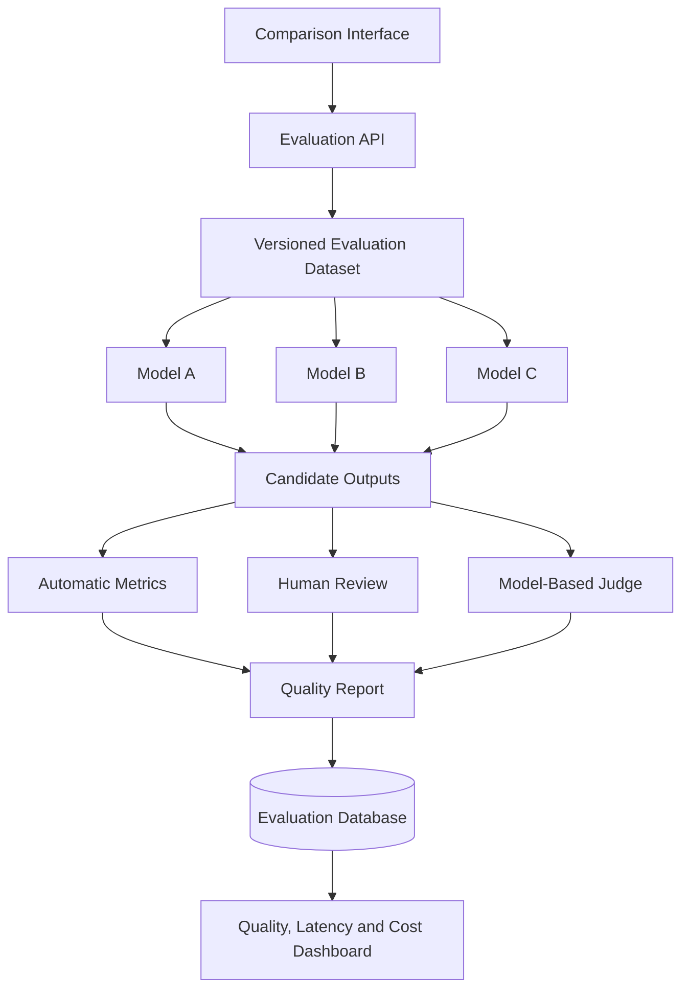

### Normalized Evaluation Result

```json
{
  "case_id": "ticket_014",
  "provider": "provider_name",
  "model": "model_name",
  "model_version": "resolved-version",
  "prompt_version": "ticket_v5",
  "schema_valid": true,
  "correctness_score": 5.0,
  "relevance_score": 4.8,
  "completeness_score": 4.5,
  "groundedness_score": 5.0,
  "safety_score": 5.0,
  "overall_quality_score": 4.86,
  "task_success": true,
  "critical_failure": false,
  "latency_ms": 1428.3,
  "cost_usd": 0.0142,
  "status": "success",
  "error": null
}
```

### Evaluation Cases

Include at least:

* Classification
* Structured extraction
* Short summarization
* Long summarization
* Reasoning
* Code generation
* Vietnamese output
* English output
* Mixed-language input
* RAG question
* Missing evidence
* Conflicting evidence
* Tool selection
* Invalid tool argument
* Prompt injection
* Safety-sensitive request
* Historical production failures

### Final Report Questions

1. Which model has the highest task-success rate?
2. Which model follows instructions best?
3. Which model produces the most valid structured outputs?
4. Which model is most grounded?
5. Which model performs best in Vietnamese?
6. Which model has the lowest critical-failure rate?
7. Which model has the best quality-to-latency ratio?
8. Which model has the best quality-to-cost ratio?
9. Which failures are caused by retrieval rather than generation?
10. Which model should handle simple tasks?
11. Which model should handle high-value complex tasks?
12. What release thresholds should be enforced?

---

## 56. Suggested 20-Minute Lesson Plan

|          Time | Activity                                 |
| ------------: | ---------------------------------------- |
|   0–3 minutes | Explain task-specific AI quality         |
|   3–6 minutes | Introduce major quality dimensions       |
|   6–9 minutes | Explain golden datasets and metrics      |
|  9–12 minutes | Demonstrate structured-output evaluation |
| 12–15 minutes | Discuss human and model-based judges     |
| 15–17 minutes | Explain RAG, tool, and agent quality     |
| 17–19 minutes | Review regression testing and failures   |
| 19–20 minutes | Assign the Model Comparison App exercise |

---

## 57. Key Takeaways

1. Quality is task-specific.
2. A model can be strong at one task and weak at another.
3. Quality includes correctness, relevance, completeness, groundedness, format compliance, safety, and user usefulness.
4. Fluent output is not necessarily correct.
5. Evaluation should use representative product data.
6. Happy-path tests are not sufficient.
7. A golden dataset supports repeatable comparisons.
8. Objective metrics are useful when expected answers are known.
9. Rubrics are useful for subjective tasks.
10. Human evaluation remains important for nuanced and high-impact outputs.
11. Model-based judges can scale evaluation but must be validated.
12. RAG quality requires separate retrieval, generation, and citation evaluation.
13. Tool-calling quality includes both tool selection and argument correctness.
14. Agent quality includes planning efficiency and task completion.
15. Model, prompt, retrieval, and tool changes can create regressions.
16. Release gates should prevent low-quality configurations from reaching production.
17. Production failures should be added to the evaluation dataset.
18. Quality should always be evaluated together with latency, cost, reliability, and safety.

---

## 58. Final Summary

**Quality** is one of the most important model-selection and production-readiness criteria for AI applications.

A capable AI Engineer should be able to:

* Define quality for a specific product task
* Build a representative evaluation dataset
* Create measurable success criteria
* Validate structured output
* Use objective metrics
* Design scoring rubrics
* Conduct blind human evaluation
* Use model-based judges carefully
* Evaluate retrieval, generation, tools, and agents separately
* Categorize errors
* Track critical failures
* Run regression tests
* Enforce release gates
* Monitor production feedback
* Compare quality against latency and cost
* Explain why a selected model meets the product’s requirements

Turn this lesson into an evaluation notebook, golden dataset, rubric, RAG benchmark, tool-calling test suite, regression pipeline, quality dashboard, or Model Comparison App so that the concept becomes practical engineering experience.
