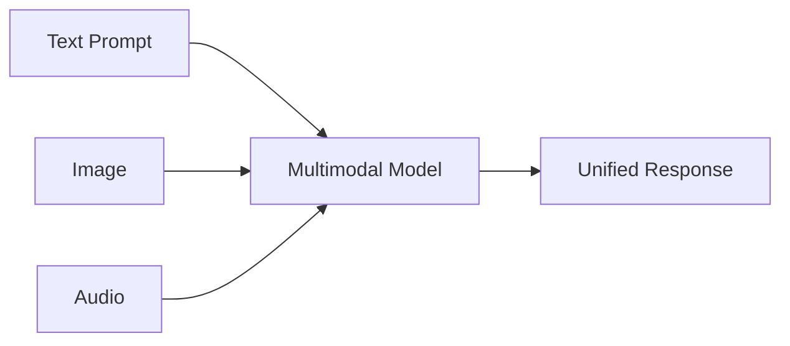
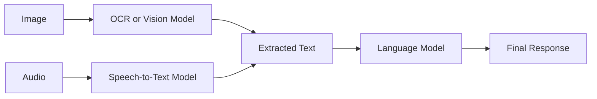
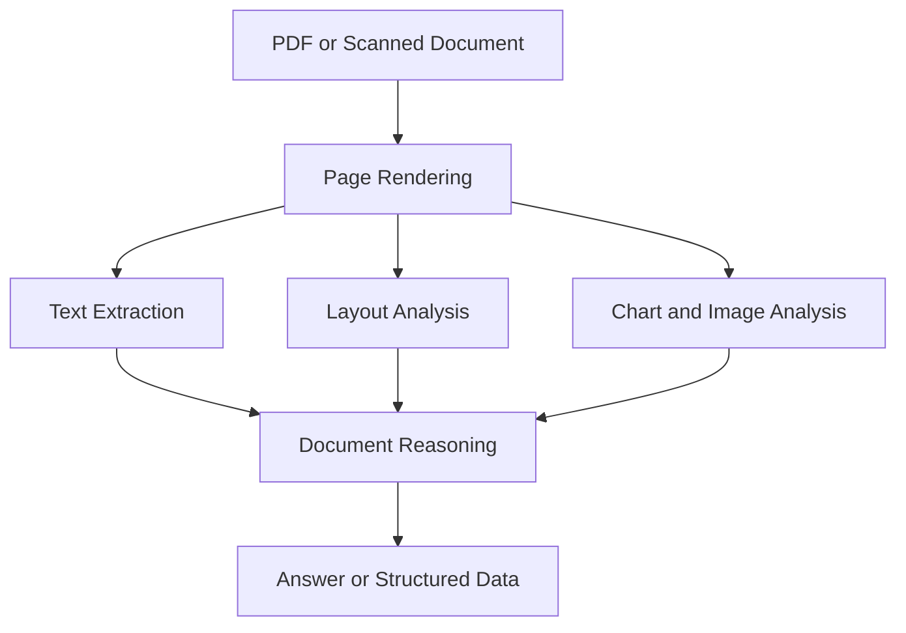
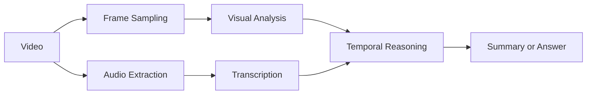
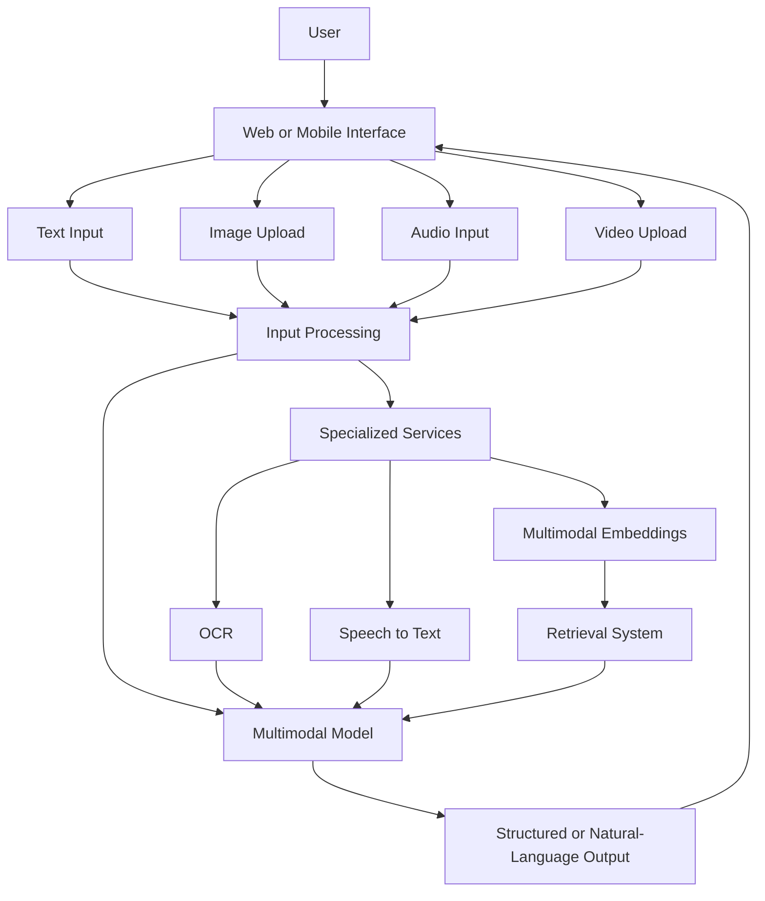
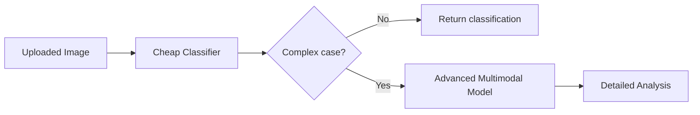
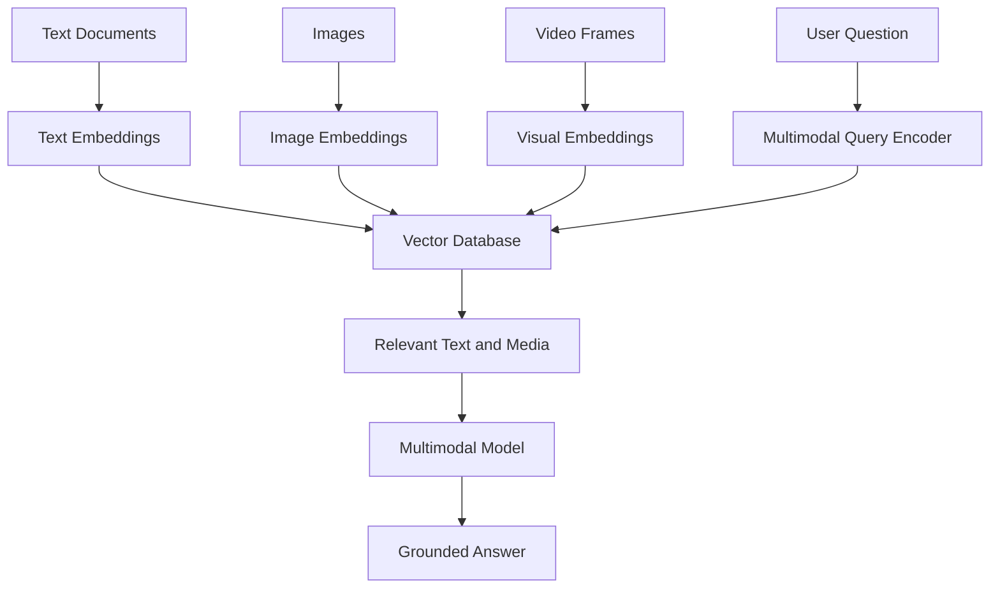
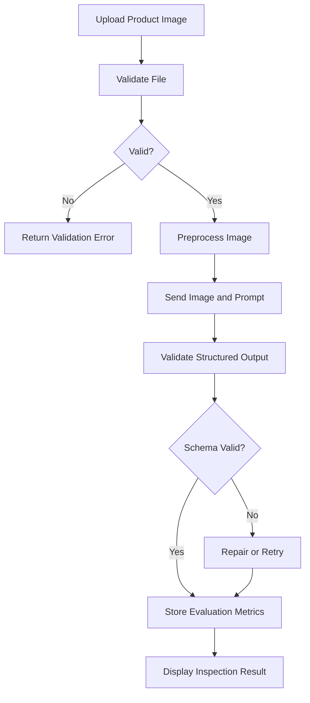

# 018 — Multimodal

**Course:** 02 — Model Platforms and Prompting
**Module:** Module 03 — Using Pre-trained Models
**Content Group:** Selection Criteria
**Roadmap Source:** Using Pre-trained Models / Selection Criteria
**Lesson Type:** Model Selection
**Order in Module:** 018
**Suggested Duration:** 20 minutes

---

## 1. Summary

**Multimodal AI** refers to models and systems that can process, understand, or generate more than one type of data.

Common modalities include:

* Text
* Images
* Audio
* Video
* Documents
* Structured data
* Sensor data

A text-only model receives text and produces text. A multimodal model may accept an image and a question, analyze a PDF containing charts, transcribe audio, understand a video sequence, or generate an image from a text prompt.

Multimodal capability is an important **model-selection criterion** because support for a modality does not automatically mean the model performs well on every task involving that modality.

For example, two models may both accept images, but differ significantly in their ability to:

* Read small text.
* Interpret charts.
* Understand spatial relationships.
* Count objects.
* Analyze multiple images together.
* Follow visual instructions.
* Process long videos.
* Handle noisy audio.
* Produce structured outputs.
* Maintain low latency and cost.

A production team should therefore evaluate multimodal models using real product inputs, realistic prompts, expected output formats, latency targets, safety requirements, and known failure cases.

---

## 2. Learning Objectives

After completing this lesson, you should be able to:

* Explain multimodal AI in your own words.
* Identify common input and output modalities.
* Distinguish native multimodal models from multimodal pipelines.
* Understand where multimodal processing fits in an AI application.
* Compare models using realistic multimodal tasks.
* Build a small image-understanding demo.
* Identify common multimodal production failures.
* Add multimodal evaluation to a Model Comparison App.

---

## 3. What Does Multimodal Mean?

A **modality** is a type or channel of information.

Examples:

| Modality        | Example input                            |
| --------------- | ---------------------------------------- |
| Text            | User question, article, chat message     |
| Image           | Photo, screenshot, diagram, medical scan |
| Audio           | Voice message, meeting recording, music  |
| Video           | Tutorial, security footage, product demo |
| Document        | PDF, presentation, invoice, report       |
| Structured data | JSON, database row, spreadsheet          |
| Sensor data     | Temperature, GPS, motion, IoT signals    |

A multimodal system combines two or more modalities.

### Examples

#### Image-to-text

```text
Input: Product image
Output: Product description
```

#### Image and text to text

```text
Input:
- Screenshot
- "Why is this page failing?"

Output:
- UI analysis
- Possible error
- Debugging steps
```

#### Audio-to-text

```text
Input: Customer support recording
Output: Transcript and summary
```

#### Text-to-image

```text
Input: "Create a futuristic underwater research station."
Output: Generated image
```

#### Video-to-text

```text
Input: Training video
Output: Chapters, summary, and action items
```

#### Multimodal-to-action

```text
Input:
- Image of a damaged machine
- Technician's spoken explanation

Output:
- Damage classification
- Repair recommendation
- Maintenance ticket
```

---

## 4. Multimodal Model vs Multimodal System

A multimodal application does not always require one model that handles everything.

There are two common approaches.

## 4.1 Native multimodal model

A native multimodal model receives multiple modalities directly.



### Advantages

* Simpler architecture.
* Shared reasoning across modalities.
* Easier conversational interaction.
* Less manual preprocessing.
* Better cross-modal understanding in some tasks.

### Limitations

* Potentially higher cost.
* Larger input payloads.
* Less control over intermediate steps.
* Provider-specific format requirements.
* Modality quality may vary significantly.

---

## 4.2 Multimodal pipeline

A pipeline uses specialized models or services for different steps.



### Advantages

* Specialized components can perform better.
* Individual components can be replaced.
* Intermediate outputs are easier to inspect.
* Costs can be optimized per modality.
* More control over validation and preprocessing.

### Limitations

* More infrastructure.
* More network calls.
* Higher end-to-end latency.
* Errors can propagate between stages.
* More complex monitoring and debugging.

---

## 5. Common Multimodal Capabilities

### 5.1 Visual question answering

The model answers questions about an image.

```text
Input:
- Image of a street
- "How many bicycles are visible?"

Output:
"Three bicycles are visible."
```

Typical tasks:

* Object identification.
* Counting.
* Attribute recognition.
* Scene description.
* Spatial reasoning.
* Visual comparison.

---

### 5.2 Optical character recognition

The system extracts text from images or scanned documents.

Example inputs:

* Receipts.
* Invoices.
* Screenshots.
* Forms.
* Labels.
* Handwritten notes.

A model may be able to read text visually, but a specialized OCR system may still be more accurate for:

* Small fonts.
* Dense documents.
* Rotated text.
* Tables.
* Low-resolution scans.
* Large-scale document processing.

---

### 5.3 Document understanding

Document understanding goes beyond plain OCR.

A model may need to interpret:

* Headings.
* Tables.
* Charts.
* Footnotes.
* Page structure.
* Relationships between visual regions.
* Information distributed across several pages.



---

### 5.4 Audio understanding

Audio tasks include:

* Speech transcription.
* Speaker identification.
* Language detection.
* Sentiment estimation.
* Sound classification.
* Meeting summarization.
* Voice command processing.

Audio performance may depend on:

* Background noise.
* Microphone quality.
* Speaker accent.
* Number of speakers.
* Domain-specific vocabulary.
* Audio duration.
* Streaming support.

---

### 5.5 Video understanding

Video combines:

* Images.
* Motion.
* Audio.
* Time.

A video model may need to understand what happens across several frames rather than treating each frame independently.

Typical tasks:

* Event detection.
* Activity recognition.
* Tutorial summarization.
* Safety monitoring.
* Sports analysis.
* Video search.
* Chapter generation.



---

### 5.6 Multimodal generation

Some models generate media rather than only understanding it.

Examples:

* Text-to-image.
* Image editing.
* Text-to-speech.
* Speech-to-speech.
* Text-to-video.
* Image-to-video.
* Music generation.

Generation quality must be evaluated separately from understanding quality.

A model that is excellent at interpreting images may not generate high-quality images, and the reverse may also be true.

---

## 6. Where Multimodal Fits in an AI Application

A typical multimodal application may contain the following components:



Multimodal processing may appear in:

* Prompt construction.
* Retrieval pipelines.
* Search systems.
* Agent tools.
* Content moderation.
* Accessibility features.
* User interfaces.
* Analytics pipelines.
* Automated workflows.

---

## 7. Why Multimodal Matters When Selecting a Model

A model should not be selected only because its documentation says it supports images, audio, or video.

The evaluation should match the product's actual requirements.

## 7.1 Supported modalities

First, identify what the model can accept and generate.

| Model capability  | Questions to ask                           |
| ----------------- | ------------------------------------------ |
| Text input        | Does it support long documents?            |
| Image input       | How many images can be provided?           |
| Audio input       | Does it support streaming audio?           |
| Video input       | What duration and file size are supported? |
| Image output      | Can it edit existing images?               |
| Audio output      | Does it support natural speech?            |
| Structured output | Can it return schema-valid JSON?           |

---

## 7.2 Image resolution and detail

A model may resize or compress images before processing them.

This can affect:

* Small text.
* Fine-grained defects.
* Facial details.
* Distant objects.
* Charts.
* Dense diagrams.

Test the model using the same image quality expected in production.

Do not evaluate only with clean, high-resolution examples.

---

## 7.3 Multiple-image reasoning

Some applications require comparison across several images.

Examples:

```text
Compare the product before and after repair.
```

```text
Which screenshot contains the incorrect configuration?
```

```text
Identify changes between these two diagrams.
```

Evaluation should test whether the model:

* Keeps image order correct.
* References the correct image.
* Detects meaningful differences.
* Avoids inventing differences.
* Handles more than two images.

---

## 7.4 Spatial reasoning

Spatial questions include:

* What is above the table?
* Which object is closest to the door?
* Is the red button to the left of the display?
* Which vehicle is behind the bus?

Models may identify objects correctly while still failing to understand their relationships.

Spatial reasoning should therefore be measured separately from object recognition.

---

## 7.5 Counting reliability

Object counting is a common failure case.

Example:

```text
How many fish are visible?
```

A model may:

* Miss overlapping objects.
* Count the same object twice.
* Include background objects.
* Estimate instead of counting.
* Produce different answers across repeated calls.

For tasks requiring exact counts, consider combining a vision model with an object-detection system.

---

## 7.6 Text-reading quality

Visual text can appear in:

* Screenshots.
* Documents.
* Street signs.
* Product labels.
* Charts.
* User interfaces.

Evaluate:

* Large text.
* Small text.
* Rotated text.
* Low contrast.
* Multiple languages.
* Handwriting.
* Tables.
* Mixed fonts.

A model may understand the general document while reading exact numbers incorrectly.

---

## 7.7 Temporal understanding

For audio and video, the model must reason over time.

Test whether it can answer:

* What happened first?
* What changed after the alarm?
* When did the speaker mention the deadline?
* Which action caused the error?
* Did the person complete the procedure correctly?

A model may summarize the content correctly but fail on event order or timestamps.

---

## 7.8 Multilingual performance

Multimodal systems often need to handle mixed-language input.

Examples:

* Vietnamese speech with English technical terms.
* English screenshots with Vietnamese questions.
* Multilingual documents.
* Product labels containing several languages.
* Code mixed with natural language.

Evaluate both:

* Modality understanding.
* Response-language correctness.

A model may correctly understand the image but respond in the wrong language.

---

## 7.9 Latency

Multimodal requests are often slower than text-only requests because they require larger inputs and additional processing.

Approximate total latency:

```text
Total latency
= upload time
+ preprocessing time
+ model queue time
+ multimodal inference time
+ output generation time
```

For a pipeline:

```text
Total latency
= OCR latency
+ transcription latency
+ retrieval latency
+ language-model latency
+ application overhead
```

Measure:

* Median latency.
* P95 latency.
* Time to first token.
* Total processing time.
* Upload and preprocessing time.

---

## 7.10 Cost

Multimodal pricing may depend on:

* Image count.
* Image resolution.
* Audio duration.
* Video duration.
* Number of sampled frames.
* Input tokens.
* Output tokens.
* Specialized API calls.
* Storage and bandwidth.

Approximate workflow cost:

```text
Total cost
= media-processing cost
+ model-input cost
+ model-output cost
+ retrieval cost
+ storage cost
```

A lower-cost architecture might use:



---

## 8. Multimodal Prompt Design

A good multimodal prompt should clearly identify:

1. The task.
2. The relevant media.
3. The expected output.
4. The required level of detail.
5. Uncertainty handling.
6. Safety constraints.

### Weak prompt

```text
Analyze this.
```

### Better prompt

```text
Analyze the attached product screenshot.

Tasks:
1. Identify the main UI error.
2. Quote the visible error message exactly.
3. Explain the most likely cause.
4. Suggest three debugging steps.

Return JSON with:
- error_message
- likely_cause
- debugging_steps
- confidence

Do not guess text that is unreadable.
```

### Image-order references

For multiple images, label them explicitly:

```text
Image 1: Current production interface
Image 2: Expected Figma design

Compare Image 1 with Image 2 and report only visible differences.
```

---

## 9. Practical Demo: Image Analysis API

The following provider-neutral example accepts an image and asks a multimodal model to return structured observations.

## 9.1 Request schema

```python
from pydantic import BaseModel, Field


class ImageAnalysisRequest(BaseModel):
    image_url: str
    question: str = Field(min_length=1, max_length=1000)
```

## 9.2 Expected response schema

```python
from typing import Literal


class ImageAnalysisResult(BaseModel):
    summary: str
    detected_text: list[str]
    observations: list[str]
    confidence: Literal["low", "medium", "high"]
    limitations: list[str]
```

## 9.3 Model call

```python
import json
from typing import Any


def analyze_image(
    model_client: Any,
    image_url: str,
    question: str,
) -> ImageAnalysisResult:
    system_prompt = """
    You are an image-analysis assistant.

    Rules:
    - Describe only visible evidence.
    - Do not invent unreadable text.
    - Separate observations from assumptions.
    - Mention uncertainty and image-quality limitations.
    - Return valid JSON matching the requested schema.
    """

    response = model_client.generate(
        messages=[
            {
                "role": "system",
                "content": system_prompt,
            },
            {
                "role": "user",
                "content": [
                    {
                        "type": "text",
                        "text": question,
                    },
                    {
                        "type": "image_url",
                        "image_url": image_url,
                    },
                ],
            },
        ],
        response_schema=ImageAnalysisResult.model_json_schema(),
    )

    payload = json.loads(response.text)
    return ImageAnalysisResult.model_validate(payload)
```

The exact media format varies between providers, but the main workflow remains similar:

```text
media input
→ multimodal prompt
→ model inference
→ structured validation
→ application response
```

## 9.4 FastAPI route

```python
from fastapi import FastAPI, HTTPException


app = FastAPI()


@app.post("/analyze-image", response_model=ImageAnalysisResult)
def analyze_image_route(
    request: ImageAnalysisRequest,
) -> ImageAnalysisResult:
    try:
        return analyze_image(
            model_client=model_client,
            image_url=request.image_url,
            question=request.question,
        )
    except ValueError as exc:
        raise HTTPException(
            status_code=422,
            detail=str(exc),
        ) from exc
    except Exception as exc:
        raise HTTPException(
            status_code=500,
            detail="Image analysis failed.",
        ) from exc
```

---

## 10. Input Validation

Media files should be validated before they reach the model.

### Validate image inputs

Check:

* MIME type.
* File extension.
* File size.
* Image dimensions.
* Corrupted files.
* Animated formats.
* Metadata.
* Unsupported color formats.

Example:

```python
from pathlib import Path


ALLOWED_IMAGE_TYPES = {
    "image/jpeg",
    "image/png",
    "image/webp",
}

MAX_IMAGE_SIZE_BYTES = 10 * 1024 * 1024


def validate_image(
    file_name: str,
    mime_type: str,
    size_bytes: int,
) -> None:
    if mime_type not in ALLOWED_IMAGE_TYPES:
        raise ValueError("Unsupported image type.")

    if size_bytes > MAX_IMAGE_SIZE_BYTES:
        raise ValueError("Image exceeds the maximum size.")

    suffix = Path(file_name).suffix.lower()

    if suffix not in {".jpg", ".jpeg", ".png", ".webp"}:
        raise ValueError("Unsupported file extension.")
```

### Validate audio and video inputs

Check:

* Duration.
* Codec.
* Container format.
* Sample rate.
* Channel count.
* Frame rate.
* Resolution.
* File size.
* Corruption.
* Malware risk.

---

## 11. Multimodal Retrieval-Augmented Generation

Traditional RAG usually retrieves text. Multimodal RAG can retrieve:

* Images.
* Screenshots.
* Diagrams.
* Video segments.
* Audio clips.
* Document pages.
* Text and visual content together.



### Example use cases

* Search a product catalog using an image.
* Find similar medical scans.
* Retrieve relevant slides from a presentation.
* Answer questions using charts and text.
* Search a video library by natural-language description.
* Diagnose UI issues using screenshots and documentation.

### Important design choices

* Use one shared embedding space or separate indexes.
* Store media metadata.
* Preserve page, frame, and timestamp references.
* Retrieve the original media, not only captions.
* Evaluate whether captions lose important visual details.

---

## 12. Evaluating Multimodal Models

A good evaluation set should represent real production conditions.

### Suggested image evaluation categories

| Category               | Example                                 |
| ---------------------- | --------------------------------------- |
| Object recognition     | Identify the tools on a desk            |
| Counting               | Count the visible vehicles              |
| OCR                    | Read the invoice total                  |
| Spatial reasoning      | Identify the object left of the monitor |
| Chart analysis         | Find the highest-performing month       |
| Screenshot debugging   | Identify the visible UI error           |
| Document understanding | Extract terms from a contract page      |
| Multiple images        | Compare before and after images         |
| Low-quality input      | Analyze a blurry photo                  |
| Multilingual input     | Read Vietnamese text in an image        |

### Suggested audio evaluation categories

* Clean speech.
* Background noise.
* Multiple speakers.
* Strong accents.
* Technical terminology.
* Long-form meetings.
* Interrupted speech.
* Code-switching between languages.

### Suggested video evaluation categories

* Event ordering.
* Action recognition.
* Temporal localization.
* Audio-visual consistency.
* Long-video summarization.
* Fine-grained procedure checking.
* Scene-change understanding.

---

## 13. Core Evaluation Metrics

### 13.1 Task accuracy

```text
Correct responses / Total evaluation examples
```

Task accuracy should be defined differently for each task.

Examples:

* Exact count.
* Correct object label.
* Correct chart value.
* Correct extracted field.
* Correct event sequence.

---

### 13.2 OCR exact-match accuracy

```text
Correctly extracted text fields / Total expected text fields
```

For long text, use:

* Character error rate.
* Word error rate.
* Field-level accuracy.

---

### 13.3 Groundedness

Measure whether the answer is supported by the input media.

```text
Supported claims / Total factual claims
```

A visually plausible answer is not sufficient if the evidence is not present.

---

### 13.4 Hallucination rate

```text
Unsupported claims / Total generated claims
```

Examples of visual hallucination:

* Reporting objects that are absent.
* Inventing unreadable text.
* Claiming a person performed an action not shown.
* Adding details based on stereotypes or expectations.

---

### 13.5 Refusal accuracy

The model should refuse or express uncertainty when:

* The image is too blurry.
* Text is unreadable.
* The requested detail is outside the frame.
* The audio is silent.
* The video does not show the relevant event.
* The task is unsafe or disallowed.

Measure both:

* Incorrect refusals.
* Failure to refuse when evidence is insufficient.

---

### 13.6 Structured-output validity

```text
Schema-valid responses / Total responses
```

Check:

* JSON validity.
* Required fields.
* Data types.
* Enum values.
* No unsupported fields.

---

### 13.7 Latency and cost

Record:

* Upload time.
* Preprocessing time.
* Model latency.
* Time to first token.
* End-to-end latency.
* Input cost.
* Output cost.
* Media-processing cost.

---

## 14. Example Model Comparison Table

| Metric                  | Model A | Model B | Model C |
| ----------------------- | ------: | ------: | ------: |
| Image question accuracy |     92% |     89% |     83% |
| OCR field accuracy      |     86% |     94% |     78% |
| Spatial reasoning       |     90% |     82% |     74% |
| Exact counting          |     77% |     72% |     68% |
| Schema-valid output     |     98% |     96% |     85% |
| Hallucination rate      |      3% |      5% |     11% |
| P95 latency             |   4.2 s |   2.8 s |   1.6 s |
| Average cost            |  $0.018 |  $0.010 |  $0.004 |

Possible model-selection decision:

* Choose **Model A** for complex visual reasoning.
* Choose **Model B** for document and OCR workflows.
* Choose **Model C** for low-risk image classification at high volume.

One model does not need to serve every multimodal feature.

---

## 15. Common Production Failures

## 15.1 The model invents unreadable text

Example:

```text
Image: Blurry invoice
Model: "The total is $148.75."
```

The actual total is not readable.

### Debugging steps

* Require the model to mark unreadable regions.
* Ask for confidence per extracted field.
* Use specialized OCR.
* Increase image resolution.
* Crop the relevant region.
* Compare against human-labeled test data.

---

## 15.2 Incorrect object counting

The model may count approximately rather than exactly.

### Debugging steps

* Ask for object locations before requesting a count.
* Divide the image into regions.
* Use an object-detection model.
* Run repeated evaluation.
* Require a low-confidence response when objects overlap.

---

## 15.3 Image order confusion

The model may confuse Image 1 and Image 2.

### Debugging steps

* Label each image clearly.
* Provide images in a stable order.
* Add distinguishing descriptions.
* Ask the model to summarize each image before comparing them.
* Validate comparison claims against image references.

---

## 15.4 Loss of detail during resizing

A provider may downscale large images.

### Symptoms

* Small labels disappear.
* Chart values become incorrect.
* Fine defects are missed.
* Dense tables become unreadable.

### Debugging steps

* Crop the image into regions.
* Send higher-detail image inputs when supported.
* Extract text separately.
* Compare model behavior across resolutions.
* Log original and processed dimensions.

---

## 15.5 Audio transcription errors

Typical causes:

* Background noise.
* Similar speaker voices.
* Technical vocabulary.
* Poor microphone quality.
* Mixed languages.

### Debugging steps

* Apply noise reduction.
* Use domain vocabulary hints.
* Add speaker diarization.
* Compare specialized transcription models.
* Preserve timestamps.
* Request user confirmation for critical fields.

---

## 15.6 Video sampling misses important events

A system may analyze only selected frames.

A short but important action can occur between sampled frames.

### Debugging steps

* Increase sampling rate around detected activity.
* Use scene-change detection.
* Combine audio and visual signals.
* Preserve timestamps.
* Allow the user to specify a time range.
* Use a specialized temporal model.

---

## 15.7 Model relies on visual assumptions

Example:

```text
The person is a doctor because they are wearing a white coat.
```

The image may not provide enough evidence.

### Prevention

Require evidence-based wording:

```text
The person is wearing a white coat. Their profession cannot be confirmed
from the image alone.
```

---

## 15.8 Wrong response language

The image may contain English text while the user asks in Vietnamese.

The model may respond in English because it follows the visual content instead of the user preference.

### Prevention

Include an explicit instruction:

```text
Respond in the language used by the user's question, regardless of the
language visible in the image.
```

---

## 16. Safety and Privacy

Multimodal inputs can contain highly sensitive information.

Examples:

* Faces.
* Identity documents.
* Home addresses.
* Medical records.
* Financial documents.
* Private conversations.
* Location metadata.
* Screenshots containing access tokens.
* Children's images.

### Production safeguards

* Validate uploads.
* Remove unnecessary metadata.
* Encrypt stored files.
* Apply access controls.
* Define retention periods.
* Avoid logging raw media unnecessarily.
* Redact sensitive information.
* Obtain consent where required.
* Restrict employee access.
* Delete temporary files.
* Review provider data-retention settings.

### Never place secrets in screenshots

A screenshot may accidentally contain:

* API keys.
* Passwords.
* Session cookies.
* Private URLs.
* Customer data.
* Internal system details.

Add automated redaction before storing or forwarding images.

---

## 17. Logging and Observability

A multimodal request log may include:

```json
{
  "request_id": "req_123",
  "model_provider": "provider_name",
  "model_name": "multimodal-model",
  "model_version": "version_or_snapshot",
  "input_modalities": ["text", "image"],
  "image_count": 2,
  "original_image_width": 1920,
  "original_image_height": 1080,
  "processed_image_width": 1280,
  "processed_image_height": 720,
  "input_tokens": 1650,
  "output_tokens": 240,
  "model_latency_ms": 2180,
  "preprocessing_latency_ms": 160,
  "schema_valid": true,
  "confidence": "medium",
  "final_status": "completed"
}
```

### Useful dashboards

Track:

* Accuracy by modality.
* Accuracy by file quality.
* OCR field accuracy.
* Hallucination rate.
* Refusal rate.
* Schema-validity rate.
* Average media size.
* P50 and P95 latency.
* Cost per successful task.
* Failures by model version.
* Performance by language.

Do not log raw private media unless there is a clear operational need and appropriate protection.

---

## 18. Practical Exercise

Build a small **Visual Product Inspector**.

### Input

```text
- Product image
- Inspection question
```

### Output

```json
{
  "product_type": "string",
  "visible_defects": [],
  "detected_text": [],
  "severity": "none | low | medium | high",
  "confidence": "low | medium | high",
  "limitations": []
}
```

### Required behavior

1. Validate the uploaded image.
2. Reject unsupported file formats.
3. Ask the model to describe visible evidence only.
4. Return schema-valid JSON.
5. Record model latency and token usage.
6. Handle blurry images.
7. Avoid inventing unreadable labels.
8. Compare results across two models.

### Example workflow



### Example production failure

```text
Failure:
The model reported a crack that was actually a shadow.

Cause:
The prompt asked for defects but did not require visible evidence or
uncertainty.

Fix:
Require the model to provide the location and visual evidence for every
reported defect. Add a confidence field and a "possible shadow" category.
```

---

## 19. Project Integration: Model Comparison App

Add a **Multimodal Evaluation** section to the Model Comparison App.

### Suggested test cases

```json
[
  {
    "id": "vision_001",
    "task": "ocr",
    "prompt": "Read the invoice total.",
    "expected_output": "$125.40"
  },
  {
    "id": "vision_002",
    "task": "counting",
    "prompt": "Count the visible bicycles.",
    "expected_output": 4
  },
  {
    "id": "vision_003",
    "task": "spatial_reasoning",
    "prompt": "What object is left of the laptop?",
    "expected_output": "coffee cup"
  },
  {
    "id": "vision_004",
    "task": "uncertainty",
    "prompt": "Read the blurred serial number.",
    "expected_behavior": "state_that_text_is_unreadable"
  },
  {
    "id": "vision_005",
    "task": "multilingual",
    "prompt": "Hãy mô tả lỗi trong ảnh bằng tiếng Việt.",
    "expected_language": "vi"
  }
]
```

### Suggested result schema

```json
{
  "model": "model-a",
  "test_case_id": "vision_001",
  "task_type": "ocr",
  "correct": true,
  "schema_valid": true,
  "grounded": true,
  "hallucination_detected": false,
  "confidence": "high",
  "latency_ms": 2410,
  "input_tokens": 1320,
  "output_tokens": 84,
  "estimated_cost": 0.012,
  "failure_reason": null
}
```

### Dashboard sections

```text
Overall Multimodal Accuracy
OCR Accuracy
Counting Accuracy
Spatial Reasoning
Groundedness
Hallucination Rate
Uncertainty Handling
Schema Validity
Latency
Cost
```

---

## 20. Common Learning Mistakes

### Memorizing the definition without building a demo

Multimodal behavior becomes clearer when you test real images, audio, documents, or videos.

### Evaluating only clean examples

Production inputs may be:

* Blurry.
* Dark.
* Rotated.
* Cropped.
* Compressed.
* Noisy.
* Incomplete.
* Multilingual.

### Treating all visual tasks as one capability

Evaluate OCR, counting, spatial reasoning, chart understanding, and object recognition separately.

### Trusting model confidence

A model may sound confident while being wrong.

Confidence should be evaluated against actual accuracy.

### Ignoring preprocessing

Cropping, resizing, compression, transcription, and frame sampling can affect results as much as model selection.

### Using one model for every modality

A specialized OCR, speech, detection, or embedding model may outperform a general multimodal model for a specific stage.

### Ignoring privacy

Multimodal inputs often reveal more personal information than plain text.

---

## 21. Completion Checklist

* [ ] I can explain multimodal AI in one or two minutes.
* [ ] I can name common input and output modalities.
* [ ] I understand the difference between a native multimodal model and a pipeline.
* [ ] I can design a prompt for image understanding.
* [ ] I can validate uploaded media before inference.
* [ ] I can evaluate OCR, counting, spatial reasoning, and groundedness separately.
* [ ] I can measure multimodal latency and cost.
* [ ] I have tested low-quality and multilingual inputs.
* [ ] I understand important privacy and safety risks.
* [ ] I have created a small multimodal demo or evaluation artifact.
* [ ] I have documented at least one limitation or open question.

---

## 22. Related Outcome

Choose pre-trained AI models based on:

* Required modalities.
* Task quality.
* Context length.
* Media limitations.
* Structured-output reliability.
* Latency.
* Cost.
* Safety.
* Privacy.
* Multilingual support.
* Product fit.

Multimodal support should be evaluated through the application's real media, prompts, expected outputs, and failure conditions.

---

## 23. Key Takeaways

1. Multimodal AI processes or generates more than one type of data.
2. Common modalities include text, images, audio, video, documents, and structured data.
3. A native multimodal model is not always better than a pipeline of specialized models.
4. Model selection must be based on the exact product task rather than general modality support.
5. OCR, counting, spatial reasoning, chart analysis, and video understanding are different capabilities.
6. Preprocessing can strongly affect multimodal performance.
7. Models should distinguish visible evidence from assumptions.
8. Exact values and unreadable text require careful uncertainty handling.
9. Multimodal applications require additional privacy, storage, and safety controls.
10. The best model is the one that delivers acceptable quality, latency, cost, and reliability on real product inputs.

---

## 24. Final Portfolio Artifact

A strong portfolio project for this lesson could use the following structure:

```text
multimodal-comparison-app/
├── app.py
├── api/
│   └── analyze_image.py
├── models/
│   ├── provider_a.py
│   └── provider_b.py
├── schemas/
│   └── image_analysis.py
├── preprocessing/
│   ├── image_validator.py
│   └── image_resizer.py
├── evaluation/
│   ├── dataset.json
│   ├── evaluator.py
│   └── metrics.py
├── sample_media/
├── results/
├── tests/
└── README.md
```

The README should document:

* Supported modalities.
* Application architecture.
* Model providers.
* Prompt design.
* Input validation.
* Evaluation dataset.
* Accuracy metrics.
* Latency and cost results.
* Failure cases.
* Privacy controls.
* Known limitations.

The goal is not only to prove that a model can accept an image, audio file, or video. The goal is to demonstrate that you can design, evaluate, and operate a reliable multimodal AI feature under realistic production conditions.
