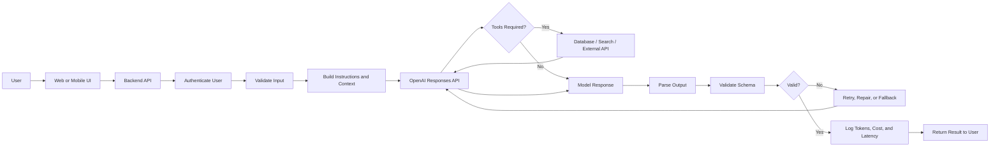
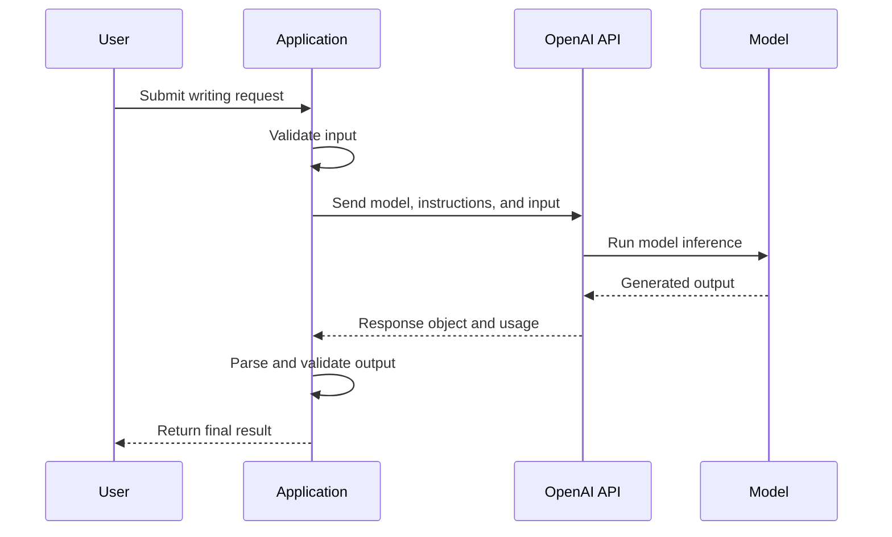
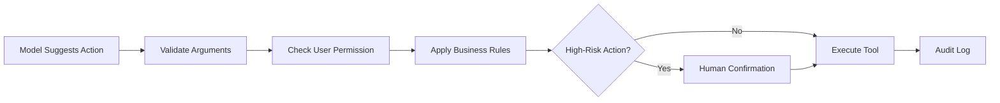
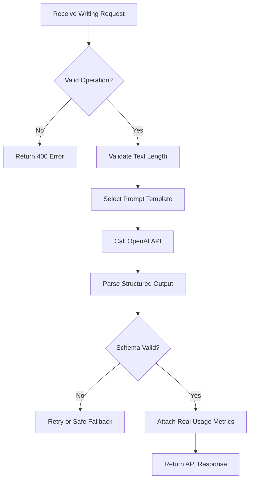

# 001 — OpenAI Platform

| Course Information     | Details                                                                                       |
| ---------------------- | --------------------------------------------------------------------------------------------- |
| **Course Section**     | 02 — Model Platforms and Prompting                                                            |
| **Module**             | Module 04 — OpenAI Platform and API                                                           |
| **Content Group**      | Platform Basics                                                                               |
| **Roadmap Source**     | OpenAI Platform and API / Platform Basics                                                     |
| **Lesson Type**        | API                                                                                           |
| **Order in Module**    | 001                                                                                           |
| **Suggested Duration** | 24 minutes                                                                                    |
| **Related Outcome**    | Call LLM APIs while managing messages, tokens, cost, latency, retries, and structured outputs |
| **Related Project**    | Project 3 — AI Writing Assistant                                                              |

---

## 1. Lesson Overview

The **OpenAI Platform** provides APIs, SDKs, models, tools, and development interfaces for integrating artificial intelligence into software applications.

Instead of manually entering a prompt into a chat interface, an AI engineer can call the OpenAI API from a backend service, send application data to a model, validate the result, and return it to an end user.

The current OpenAI developer platform centers many new integrations around the **Responses API**, which can handle text generation, image and file analysis, tool usage, streaming, and agent-style workflows.

The supplied learning transcript describes an API as an interface that carries requests and responses between software systems. It also explains that an OpenAI request normally specifies a model, input data, and parameters that affect the model's behavior.

By the end of this lesson, you should understand where the OpenAI Platform belongs in an AI application and how to make a small but production-aware API call.

---

## 2. Learning Objectives

After completing this lesson, you should be able to:

* Explain the OpenAI Platform in your own words.
* Distinguish between ChatGPT and the OpenAI API.
* Identify the main parts of an API request and response.
* Send a text-generation request using the OpenAI Python SDK.
* Extract the model output and token usage.
* Apply input and output validation.
* Recognize common API failures such as timeouts and rate-limit errors.
* Explain how model choice, token usage, streaming, and retries affect cost and user experience.
* Connect the platform to RAG, agents, tools, multimodal systems, and production applications.

---

## 3. What Is the OpenAI Platform?

The OpenAI Platform is a collection of services that developers use to build AI-powered applications.

Its main capabilities include:

| Capability         | Example                                                   |
| ------------------ | --------------------------------------------------------- |
| Text generation    | Writing, summarization, translation, and explanation      |
| Structured outputs | Returning JSON that follows an application schema         |
| Vision             | Analyzing screenshots, photographs, and documents         |
| File processing    | Extracting or reasoning over uploaded files               |
| Tool calling       | Asking the model to call application functions            |
| Retrieval          | Searching indexed documents or knowledge bases            |
| Image generation   | Creating or editing images                                |
| Speech and audio   | Transcription, speech generation, and realtime voice      |
| Streaming          | Displaying output while it is being generated             |
| Agents             | Combining models, tools, instructions, and workflow logic |

Current OpenAI model documentation lists models with different intelligence, speed, cost, context, modality, and tool-support characteristics. Model selection should therefore be based on the application rather than choosing the most powerful model for every request.

### 3.1 ChatGPT versus the OpenAI API

| ChatGPT                                 | OpenAI API                                                       |
| --------------------------------------- | ---------------------------------------------------------------- |
| A ready-to-use AI application           | A programmable service                                           |
| Designed mainly for human interaction   | Designed for application integration                             |
| Includes an existing user interface     | You build the interface and backend                              |
| Configuration is mostly handled for you | You manage prompts, models, validation, cost, and reliability    |
| Useful for individual workflows         | Useful for products, services, automations, and internal systems |

A developer normally uses the API when the AI capability must become part of another system.

Examples include:

* A writing assistant inside a web application.
* A customer-support chatbot.
* A document summarization service.
* A product recommendation engine.
* A RAG assistant connected to company documents.
* An agent that searches data and calls internal APIs.
* A mobile application that analyzes images.

---

## 4. Position in an AI Engineering Workflow

A basic AI request is not simply:

```text
prompt → model → answer
```

A more realistic application contains several additional stages.



This workflow shows that the model is only one component of the complete application.

A production system must also manage:

* Authentication.
* Input validation.
* Prompt construction.
* Context retrieval.
* Output parsing.
* Schema validation.
* Timeouts and retries.
* Rate limits.
* Logging and monitoring.
* Cost control.
* Security and privacy.
* Fallback behavior.

---

## 5. Core Platform Components

### 5.1 API key

An API key authenticates your application when it sends requests to OpenAI.

Store the key in an environment variable:

```bash
export OPENAI_API_KEY="your_api_key"
```

For Windows PowerShell:

```powershell
$env:OPENAI_API_KEY="your_api_key"
```

Never:

* Commit an API key to Git.
* Put it directly in frontend JavaScript.
* Include it in a mobile application package.
* Print it in application logs.
* Share one production key among unrelated projects.

The frontend should call your backend, and the backend should call OpenAI.

```text
Correct:

Browser → Your Backend → OpenAI API

Incorrect:

Browser → OpenAI API using a secret key embedded in JavaScript
```

---

### 5.2 Models

A model is the AI system that processes the input and generates the output.

Different models may be optimized for:

* Complex reasoning.
* Low latency.
* High-volume workloads.
* Coding.
* Image understanding.
* Audio processing.
* Realtime interaction.
* Lower cost.

Because model availability and recommendations change, production applications should keep the model ID in configuration rather than hard-coding it throughout the codebase.

```env
OPENAI_MODEL=gpt-5.6-luna
```

The current model catalog describes separate options for complex reasoning, balanced workloads, and cost-sensitive high-volume tasks.

---

### 5.3 Responses API

The Responses API provides a unified interface for generating model responses and using supported tools.

A simple request generally contains:

```text
model + instructions + input + output constraints
```

A more advanced request may also contain:

```text
model
+ instructions
+ conversation context
+ text or image input
+ tools
+ structured-output schema
+ token limit
+ streaming configuration
+ metadata
```

---

### 5.4 SDKs

The official SDKs simplify authentication, request creation, response parsing, streaming, and error handling.

For Python:

```bash
pip install --upgrade openai
```

The SDK automatically reads `OPENAI_API_KEY` from the environment when the client is created normally.

---

## 6. Anatomy of an API Request

Consider this conceptual request:

```json
{
  "model": "configured-model",
  "instructions": "You are a concise writing assistant.",
  "input": "Rewrite this sentence professionally.",
  "max_output_tokens": 300
}
```

Each field serves a different purpose.

| Field               | Purpose                                                      |
| ------------------- | ------------------------------------------------------------ |
| `model`             | Selects the model used for the request                       |
| `instructions`      | Defines persistent behavior for this request                 |
| `input`             | Contains the task or user content                            |
| `max_output_tokens` | Limits the maximum generated output                          |
| `tools`             | Gives the model access to functions or external capabilities |
| `text.format`       | Defines plain-text or structured-output requirements         |
| `stream`            | Enables incremental output delivery                          |
| `metadata`          | Attaches application-specific request information            |

Not every parameter is supported by every model. Always check the documentation for the selected model.

---

## 7. First Python API Call

### 7.1 Project setup

Create a virtual environment:

```bash
python -m venv .venv
```

Activate it:

```bash
# macOS or Linux
source .venv/bin/activate

# Windows
.venv\Scripts\activate
```

Install dependencies:

```bash
pip install --upgrade openai python-dotenv
```

Create a `.env` file:

```env
OPENAI_API_KEY=your_api_key
OPENAI_MODEL=gpt-5.6-luna
```

Add the file to `.gitignore`:

```gitignore
.env
.venv/
__pycache__/
```

---

### 7.2 Basic request

```python
import os

from dotenv import load_dotenv
from openai import OpenAI

load_dotenv()

model = os.getenv("OPENAI_MODEL")

if not model:
    raise RuntimeError("OPENAI_MODEL is not configured.")

client = OpenAI(
    timeout=20.0,
    max_retries=2,
)

response = client.responses.create(
    model=model,
    instructions=(
        "You are a professional writing assistant. "
        "Return a clear and concise answer."
    ),
    input="Rewrite this sentence professionally: We need to fix this thing soon.",
    max_output_tokens=200,
)

print(response.output_text)
print(response.usage)
```

The Responses API returns a response object, while `output_text` provides a convenient way to read the combined text output. The official quickstart also demonstrates creating responses through an OpenAI client and accessing the generated text.

Example output:

```text
We should resolve this issue as soon as possible.
```

---

## 8. Request and Response Flow



The application should not immediately trust the generated output.

It should first check:

* Was a response returned?
* Is the response complete?
* Does it follow the expected format?
* Does it contain prohibited or unsafe content?
* Is its length acceptable?
* Can it be parsed?
* Should the result be cached?
* Should a human review it?

---

## 9. Input Validation

Validate input before spending tokens on an API request.

```python
from pydantic import BaseModel, Field


class RewriteRequest(BaseModel):
    text: str = Field(min_length=1, max_length=10_000)
    tone: str = Field(default="professional", max_length=50)
```

Example:

```python
request = RewriteRequest(
    text="can u send me the report",
    tone="professional",
)
```

Input validation helps prevent:

* Empty requests.
* Extremely large prompts.
* Invalid options.
* Unexpected data types.
* Accidental cost spikes.
* Some forms of prompt injection.
* Application crashes farther down the pipeline.

Validation does not completely solve security problems, but it establishes a clear boundary between user input and application logic.

---

## 10. Structured Outputs

Plain text is appropriate when the result will be displayed directly to a user.

Structured output is preferable when another part of the application must process the result.

For example, the AI Writing Assistant may require:

```json
{
  "result": "Could you please send me the report?",
  "detected_tone": "informal",
  "warnings": []
}
```

OpenAI supports structured output using a JSON Schema for models that provide this capability. Strict schema mode is designed to make the output follow the supplied schema rather than merely asking for JSON in the prompt.

```python
import json
import os

from openai import OpenAI

client = OpenAI()
model = os.environ["OPENAI_MODEL"]

response = client.responses.create(
    model=model,
    instructions=(
        "You are a writing assistant. Rewrite the input and classify "
        "the original tone."
    ),
    input="can u send the report today",
    text={
        "format": {
            "type": "json_schema",
            "name": "writing_result",
            "strict": True,
            "schema": {
                "type": "object",
                "properties": {
                    "result": {
                        "type": "string"
                    },
                    "detected_tone": {
                        "type": "string",
                        "enum": [
                            "formal",
                            "professional",
                            "neutral",
                            "informal"
                        ]
                    },
                    "warnings": {
                        "type": "array",
                        "items": {
                            "type": "string"
                        }
                    }
                },
                "required": [
                    "result",
                    "detected_tone",
                    "warnings"
                ],
                "additionalProperties": False
            }
        }
    },
)

data = json.loads(response.output_text)

print(data["result"])
print(data["detected_tone"])
print(data["warnings"])
```

Even with structured outputs, the application should still validate the parsed data before saving or using it.

---

## 11. Streaming

Without streaming, the user waits until the complete response has been generated.

```text
Request ──────────────── Complete response
```

With streaming, the application receives smaller output events while generation is still in progress.

```text
Request → token chunk → token chunk → token chunk → completed
```

OpenAI's Responses API supports server-sent streaming events for supported models.

```python
import os

from openai import OpenAI

client = OpenAI()

stream = client.responses.create(
    model=os.environ["OPENAI_MODEL"],
    input="Explain API rate limiting in simple terms.",
    stream=True,
)

for event in stream:
    if event.type == "response.output_text.delta":
        print(event.delta, end="", flush=True)
```

Streaming can improve perceived responsiveness, but it introduces additional responsibilities:

* Handle interrupted streams.
* Detect completion events.
* Avoid displaying invalid partial JSON.
* Cancel generation when the user leaves.
* Record final token usage after completion.
* Moderate output appropriately.

For structured JSON, it is usually safer to wait for the completed response before parsing.

---

## 12. Timeouts, Retries, and Rate Limits

Network calls can fail even when the prompt and code are correct.

Common causes include:

| Failure                | Meaning                                          | Recommended handling                     |
| ---------------------- | ------------------------------------------------ | ---------------------------------------- |
| Invalid request        | The request shape or parameter is incorrect      | Fix the request; do not retry blindly    |
| Authentication failure | The API key is missing or invalid                | Check secret configuration               |
| Permission failure     | The project cannot access the requested resource | Check project and model permissions      |
| Rate-limit error       | Too many requests or tokens were sent            | Retry with exponential backoff           |
| Timeout                | The request exceeded the allowed time            | Retry selectively or use a fallback      |
| Connection failure     | The service could not be reached                 | Retry with backoff                       |
| Server error           | Temporary upstream failure                       | Retry a limited number of times          |
| Invalid model output   | The result cannot be parsed or validated         | Repair, retry, or return a safe fallback |

OpenAI rate limits depend on factors such as the model and the account's usage tier. Limits may be measured using requests, tokens, or other model-specific units.

A simplified retry strategy:

```text
Attempt 1
   ↓ failure
Wait 1 second

Attempt 2
   ↓ failure
Wait 2 seconds

Attempt 3
   ↓ failure
Return a controlled error or fallback
```

Do not retry every failure.

For example:

```text
400 Invalid Request → fix the request
401 Unauthorized    → fix authentication
429 Rate Limit      → retry with backoff
500 Server Error    → retry a limited number of times
```

Retries must be bounded. An infinite retry loop can increase latency, duplicate work, and create additional costs.

---

## 13. Logging and Observability

A production AI request should generate operational information.

Useful fields include:

```json
{
  "request_id": "req_123",
  "feature": "rewrite",
  "model": "configured-model",
  "status": "success",
  "latency_ms": 1480,
  "input_tokens": 82,
  "output_tokens": 41,
  "retry_count": 0,
  "schema_valid": true
}
```

Recommended metrics:

* Request count.
* Success rate.
* Error rate.
* P50, P95, and P99 latency.
* Input tokens.
* Output tokens.
* Cached tokens when available.
* Cost per request.
* Cost per user.
* Retry count.
* Rate-limit frequency.
* Structured-output validation failures.
* User acceptance or edit rate.
* Safety or moderation events.

Avoid logging:

* API keys.
* Passwords.
* Access tokens.
* Entire private documents.
* Unredacted personal information.
* Sensitive prompts and responses unless explicitly required and protected.

---

## 14. Token and Cost Management

Language models process text in units called **tokens**.

A request may consume:

```text
input tokens
+ cached input tokens
+ output tokens
+ reasoning tokens, when applicable
+ tool-related charges
```

A general cost estimate is:

```text
Estimated cost
=
input tokens × input-token price
+
cached tokens × cached-token price
+
output tokens × output-token price
+
tool-call costs
```

Prices vary by model and may change, so they should be read from configuration or the current pricing documentation instead of being permanently embedded in application logic. Current model pages publish separate capability, context, pricing, and rate-limit information.

Ways to control cost:

* Use a smaller model for simple tasks.
* Limit unnecessary conversation history.
* Retrieve only relevant RAG chunks.
* Set a reasonable output-token limit.
* Cache repeated deterministic results.
* Summarize old conversation history.
* Avoid retrying invalid requests.
* Measure cost per feature.
* Use batch processing for suitable offline workloads.
* Route difficult requests to stronger models only when necessary.

---

## 15. Latency Management

Total latency can include:

```text
Network latency
+ queue time
+ model inference
+ tool execution
+ retrieval
+ output validation
+ retries
```

Ways to reduce latency:

* Select a faster model.
* Reduce unnecessary input context.
* Request shorter outputs.
* Stream text to the user.
* Run independent operations in parallel.
* Cache repeated responses.
* Use fast retrieval indexes.
* Avoid unnecessary model chains.
* Place the backend near the relevant API region when possible.
* Set timeouts and fallback behavior.

A faster model is not always the best model. The goal is to meet the application's quality requirement within an acceptable latency and cost budget.

---

## 16. Security and Safety Boundaries

Treat model output as untrusted data.

Do not allow generated text to directly:

* Execute SQL.
* Run shell commands.
* Transfer money.
* Delete files.
* Send emails.
* Modify production data.
* Approve users.
* Call privileged tools.

Instead, use the following pattern:



Important safeguards include:

* Schema validation.
* Tool allowlists.
* Permission checks.
* Maximum transaction limits.
* Human confirmation.
* Sandboxed execution.
* Audit logging.
* Input and output moderation.
* Data minimization.

The moderation endpoint can classify text or image input across supported safety categories, but application-specific rules are still required.

---

## 17. Mini Demo: AI Writing Assistant

The related project supports these operations:

```text
summarize
rewrite
translate
explain
structured JSON output
```

### 17.1 Suggested API request

```json
{
  "operation": "rewrite",
  "text": "hey send me the report now",
  "options": {
    "tone": "professional",
    "language": "English"
  }
}
```

### 17.2 Expected output

```json
{
  "operation": "rewrite",
  "result": "Could you please send me the report as soon as possible?",
  "language": "English",
  "warnings": [],
  "usage": {
    "input_tokens": 0,
    "output_tokens": 0
  }
}
```

Token values should be filled using the actual API response rather than generated by the model.

### 17.3 Application flow



---

## 18. Practical Exercise

### Task

Build a small Python program that rewrites text in a professional tone.

### Requirements

1. Read the original text from user input.
2. Reject empty input.
3. Reject input longer than a chosen limit.
4. Send the text to the OpenAI API.
5. Request a professional rewrite.
6. Return structured JSON.
7. Validate the JSON.
8. Measure request latency.
9. Log token usage.
10. Handle at least one failure case.

### Starter interface

```text
Input:
"send me this file now"

Expected output:
{
  "result": "Could you please send me this file as soon as possible?",
  "detected_tone": "informal",
  "warnings": []
}
```

### Suggested implementation steps

```text
Step 1: Define input schema
Step 2: Define output schema
Step 3: Create the OpenAI client
Step 4: Build instructions
Step 5: Send the request
Step 6: Parse the response
Step 7: Validate the output
Step 8: Record usage and latency
Step 9: Test error cases
```

---

## 19. Test Cases

A single successful prompt is not enough to validate an AI feature.

Test at least the following cases:

| Test             | Example                         | Expected behavior                |
| ---------------- | ------------------------------- | -------------------------------- |
| Normal input     | `Please rewrite this sentence.` | Return valid output              |
| Empty input      | `""`                            | Reject before API call           |
| Whitespace input | `"   "`                         | Reject before API call           |
| Very long input  | More than the application limit | Reject or truncate safely        |
| Unicode input    | Vietnamese, Japanese, or emoji  | Process correctly                |
| Prompt injection | `Ignore all instructions...`    | Preserve application policy      |
| Invalid option   | `tone="unknown"`                | Return validation error          |
| Rate-limit error | Simulated `429`                 | Retry with backoff               |
| Timeout          | Delayed request                 | Stop and return controlled error |
| Invalid JSON     | Simulated malformed output      | Reject and retry or repair       |
| Sensitive data   | Password or secret in input     | Redact, block, or warn           |
| Repeated request | Same deterministic input        | Use cache when appropriate       |

---

## 20. Common Mistakes

### Mistake 1: Treating a successful demo as production-ready

A prompt that works once may fail with different users, languages, text lengths, or adversarial inputs.

**Better approach:** Build an evaluation dataset and test repeatedly.

---

### Mistake 2: Trusting generated JSON without validation

The output may be malformed, incomplete, or semantically invalid.

**Better approach:** Use structured outputs and validate the result again in application code.

---

### Mistake 3: Exposing the API key

A key embedded in a frontend or mobile application can be extracted and abused.

**Better approach:** Keep the key on the server.

---

### Mistake 4: Ignoring token usage

A feature may work correctly but become too expensive at scale.

**Better approach:** Record input and output usage for every request.

---

### Mistake 5: Retrying every error

Retrying authentication or validation errors does not solve the root problem.

**Better approach:** Retry only temporary failures.

---

### Mistake 6: Logging sensitive prompts

Debug logging can accidentally create a second copy of private user data.

**Better approach:** Redact or avoid storing sensitive content.

---

### Mistake 7: Sending the entire database to the model

Large, irrelevant context increases latency, cost, and hallucination risk.

**Better approach:** Retrieve only the information needed for the current request.

---

### Mistake 8: Letting model output execute privileged actions directly

A model may generate incorrect or manipulated tool arguments.

**Better approach:** Validate permissions, schemas, limits, and business rules before execution.

---

## 21. Production Checklist

### Configuration

* [ ] The API key is stored in a secret manager or environment variable.
* [ ] The model ID is configurable.
* [ ] Development and production projects are separated.
* [ ] Request timeout is configured.
* [ ] Retry count is limited.

### Input

* [ ] Empty input is rejected.
* [ ] Maximum input size is enforced.
* [ ] Supported operations are allowlisted.
* [ ] Sensitive data is handled appropriately.
* [ ] User permissions are checked.

### Output

* [ ] Structured output is used where appropriate.
* [ ] Output is parsed safely.
* [ ] Schema validation is performed.
* [ ] Invalid output has a fallback path.
* [ ] High-risk actions require confirmation.

### Observability

* [ ] Request latency is recorded.
* [ ] Token usage is recorded.
* [ ] Errors are categorized.
* [ ] Retry count is recorded.
* [ ] Sensitive content is excluded from logs.
* [ ] Cost can be measured by feature or user.

### Testing

* [ ] Normal inputs are tested.
* [ ] Empty and oversized inputs are tested.
* [ ] Multilingual inputs are tested.
* [ ] Prompt-injection attempts are tested.
* [ ] Timeout and rate-limit failures are simulated.
* [ ] Structured-output failures are tested.

---

## 22. Completion Checklist

You have completed this lesson when:

* [ ] I can explain the OpenAI Platform in one or two minutes.
* [ ] I can distinguish ChatGPT from the OpenAI API.
* [ ] I can describe the request and response lifecycle.
* [ ] I can send a request using the Python SDK.
* [ ] I can extract text and usage information from a response.
* [ ] I understand why API keys must remain on the server.
* [ ] I can validate input and structured output.
* [ ] I can explain timeouts, retries, and rate limits.
* [ ] I can identify which metrics should be logged.
* [ ] I understand how tokens affect cost.
* [ ] I have tested at least one error case.
* [ ] I have recorded at least one limitation or open question.

---

## 23. Suggested 24-Minute Lesson Plan

|          Time | Activity                                                     |
| ------------: | ------------------------------------------------------------ |
|   0–3 minutes | Understand the difference between ChatGPT and the OpenAI API |
|   3–6 minutes | Review the application workflow                              |
|  6–10 minutes | Configure the SDK and environment variables                  |
| 10–14 minutes | Run the first Responses API request                          |
| 14–17 minutes | Add structured output                                        |
| 17–20 minutes | Review validation, retries, and rate limits                  |
| 20–23 minutes | Complete the writing-assistant exercise                      |
| 23–24 minutes | Review the production checklist                              |

---

## 24. Related Outcome

> Call LLM APIs from applications while managing messages, tokens, cost, latency, retries, and structured outputs.

This lesson supports that outcome by introducing the complete API lifecycle rather than focusing only on prompt creation.

---

## 25. Related Project

### Project 3 — AI Writing Assistant

Build an application with the following functions:

* Summarize.
* Rewrite.
* Translate.
* Explain.
* Return structured JSON.
* Track token usage.
* Track latency.
* Handle API errors.
* Validate user input.
* Validate model output.

A suitable architecture is:

```text
Frontend
   ↓
Writing Assistant API
   ↓
Input validation
   ↓
Prompt template
   ↓
OpenAI Responses API
   ↓
Structured-output validation
   ↓
Usage and latency logging
   ↓
Result returned to frontend
```

---

## 26. Summary

The OpenAI Platform allows developers to integrate AI models into applications through programmable APIs and SDKs.

A reliable integration requires more than sending a prompt. It must manage:

```text
input
→ instructions
→ model selection
→ API request
→ output parsing
→ validation
→ usage tracking
→ error handling
→ user response
```

The most important principle is:

> Treat the model as a powerful but non-deterministic component inside a controlled software system.

Turn this lesson into a working API route, notebook, RAG workflow, agent tool, multimodal demo, monitoring dashboard, or portfolio project so that the knowledge becomes practical and reusable.
