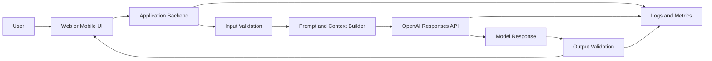
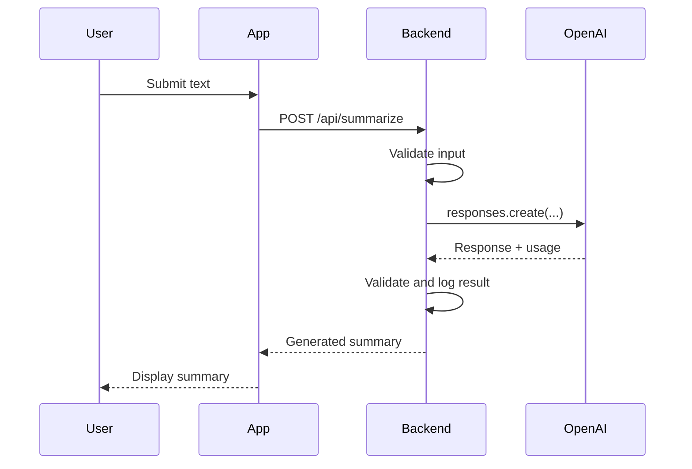
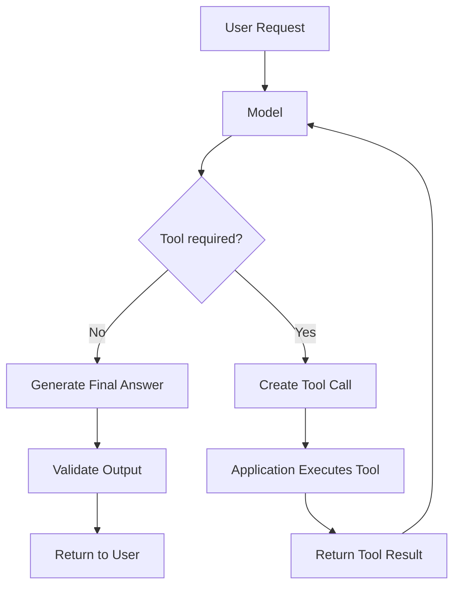
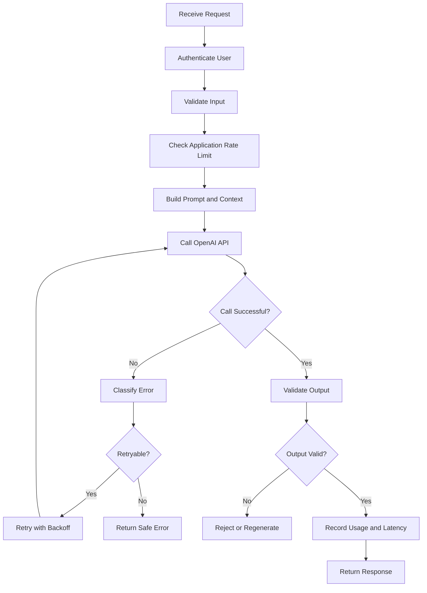
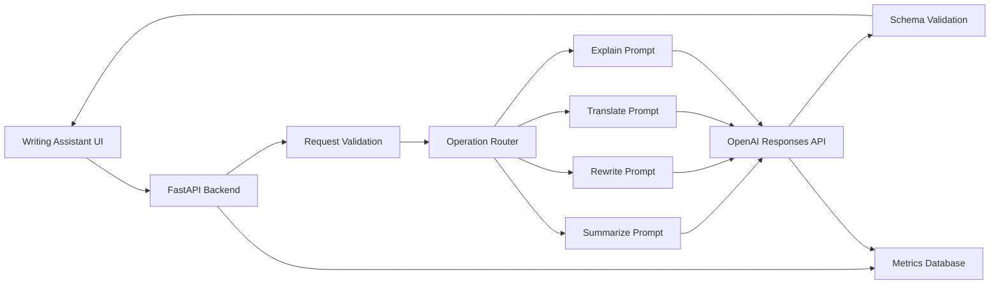

# 002 — OpenAI API

| Field                  | Details                                   |
| ---------------------- | ----------------------------------------- |
| **Course Section**     | 02 — Model Platforms and Prompting        |
| **Module**             | Module 04 — OpenAI Platform and API       |
| **Content Group**      | Platform Basics                           |
| **Roadmap Source**     | OpenAI Platform and API / Platform Basics |
| **Lesson Type**        | API                                       |
| **Order in Module**    | 002                                       |
| **Suggested Duration** | 24 minutes                                |
| **Related Project**    | Project 3 — AI Writing Assistant          |

---

## 1. Overview

The **OpenAI API** allows applications to send text, images, files, instructions, and tool definitions to OpenAI models and receive generated outputs programmatically.

Instead of manually entering prompts in a chat interface, an AI Engineer integrates the API into:

* Web applications
* Mobile applications
* Backend services
* Retrieval-Augmented Generation systems
* AI agents
* Automation pipelines
* Multimodal applications
* Evaluation and benchmarking systems

For new applications, the modern API workflow is centered on the **Responses API**. The official OpenAI quickstart uses `client.responses.create(...)` and reads generated text through `response.output_text`.

The Responses API is designed to support more than basic text generation. It can coordinate model reasoning, tools, code execution, multimodal inputs, streaming events, and stateful interactions. This role is also explained in the attached OpenAI engineering presentation.

---

## 2. Learning Objectives

After completing this lesson, you should be able to:

1. Explain the OpenAI API in your own words.
2. Identify where an OpenAI API call belongs in an AI application.
3. Create a basic API request using the official Python SDK.
4. distinguish between instructions, user input, model output, and metadata.
5. Track latency and token usage for each request.
6. Handle timeouts, connection failures, rate limits, and invalid outputs.
7. Request structured JSON output using a schema.
8. Explain how streaming improves the user experience.
9. Build a small API-backed AI feature for a portfolio project.

---

## 3. Where the OpenAI API Fits

A production application should not normally call the OpenAI API directly from browser or mobile code. The request should pass through a trusted backend service.



### Why use a backend?

The backend is responsible for:

* Protecting the API key
* Authenticating users
* Validating input
* Building prompts
* Selecting models
* Applying rate limits
* Handling retries and timeouts
* Tracking token usage
* Estimating cost
* Validating structured output
* Recording latency and errors
* Applying safety rules

> Never expose an OpenAI API key in browser JavaScript, Flutter source code, mobile binaries, or public repositories.

---

## 4. Core Concepts

### 4.1 API Request

An API request usually contains:

| Component      | Purpose                                                 |
| -------------- | ------------------------------------------------------- |
| `model`        | Selects the model used for the request                  |
| `instructions` | Defines persistent behavior and constraints             |
| `input`        | Contains the current user request or multimodal content |
| `tools`        | Gives the model access to functions or built-in tools   |
| `text.format`  | Defines plain-text or structured output requirements    |
| `stream`       | Enables incremental output delivery                     |
| `metadata`     | Attaches application-specific tracking information      |

A simplified request looks like this:

```text
Model
+ Developer instructions
+ User input
+ Optional context
+ Optional tools
+ Output requirements
= Model response
```

---

### 4.2 API Response

A response may contain:

* Generated text
* Structured JSON
* Tool calls
* Tool results
* File or web citations
* Reasoning-related items
* Response status
* Token usage
* Error or incomplete-response information

The Responses API represents model actions and model messages as output items. This makes it easier to handle workflows containing text, function calls, file search, web search, code execution, or MCP tools.

---

### 4.3 Tokens

Models process text as **tokens**, not directly as words.

A request normally includes:

```text
Input tokens
+ Output tokens
+ Cached tokens or reasoning tokens where applicable
= Total billable usage
```

Token usage affects:

* Cost
* Latency
* Context-window usage
* Maximum output length
* Throughput and rate limits

The API response exposes usage information such as input tokens, output tokens, and total tokens.

---

### 4.4 Latency

Important latency measurements include:

| Metric                  | Meaning                                                          |
| ----------------------- | ---------------------------------------------------------------- |
| **Total latency**       | Time from sending the request to receiving the complete response |
| **Time to first token** | Time before the first streamed output appears                    |
| **Generation time**     | Time spent generating output after generation begins             |
| **Tool latency**        | Time spent executing searches, functions, or external services   |
| **Validation latency**  | Time spent parsing and validating the output                     |

For a basic non-streaming request:

```text
Total latency
= Network time
+ Queue time
+ Model processing
+ Output generation
+ Tool execution
+ Application processing
```

---

### 4.5 Cost

A simplified cost formula is:

```text
Estimated cost
= Input tokens × input-token rate
+ Output tokens × output-token rate
+ Tool charges
```

Pricing varies by model and can change over time. Production applications should store the following values for every model call:

```json
{
  "model": "selected-model",
  "input_tokens": 0,
  "output_tokens": 0,
  "total_tokens": 0,
  "latency_ms": 0,
  "status": "completed"
}
```

---

## 5. Environment Setup

### 5.1 Install the SDK

```bash
pip install --upgrade openai python-dotenv
```

### 5.2 Create an environment file

Create a `.env` file:

```env
OPENAI_API_KEY=your_api_key_here
OPENAI_MODEL=gpt-5
```

Add it to `.gitignore`:

```gitignore
.env
```

The official SDK automatically supports reading `OPENAI_API_KEY` from the environment.

---

## 6. Basic API Demo

```python
import os

from dotenv import load_dotenv
from openai import OpenAI

load_dotenv()

MODEL = os.getenv("OPENAI_MODEL", "gpt-5")

client = OpenAI()

response = client.responses.create(
    model=MODEL,
    instructions=(
        "You are a concise writing assistant. "
        "Follow the user's requested output length."
    ),
    input="Summarize the benefits of exercise in one sentence.",
)

print(response.output_text)
```

### Expected result

```text
Regular exercise improves physical health, mental well-being, energy levels, and long-term quality of life.
```

### Request flow



---

## 7. Message and Instruction Design

A useful request separates application rules from user data.

```python
response = client.responses.create(
    model=MODEL,
    instructions="""
You are an AI writing assistant.

Rules:
- Preserve the original meaning.
- Do not invent facts.
- Use professional English.
- Return only the rewritten text.
""".strip(),
    input="""
Rewrite the following message:

we finish backend but mobile still has some issue
""".strip(),
)

print(response.output_text)
```

### Why separate them?

The `instructions` field defines application behavior.

The `input` field contains the current user task.

This is better than combining everything into one uncontrolled string because it makes the application easier to:

* Maintain
* Test
* Version
* Evaluate
* Debug
* Protect against prompt injection

---

## 8. Logging Tokens and Latency

A production integration should record metrics for every API call.

```python
import json
import os
import time
from typing import Any

from dotenv import load_dotenv
from openai import OpenAI

load_dotenv()

MODEL = os.getenv("OPENAI_MODEL", "gpt-5")
client = OpenAI(timeout=30.0, max_retries=2)


def create_response(user_input: str) -> dict[str, Any]:
    if not user_input or not user_input.strip():
        raise ValueError("user_input must not be empty")

    started_at = time.perf_counter()

    response = client.responses.create(
        model=MODEL,
        instructions=(
            "Summarize the user's text in no more than two sentences. "
            "Do not add unsupported facts."
        ),
        input=user_input.strip(),
    )

    latency_ms = round(
        (time.perf_counter() - started_at) * 1000,
        2,
    )

    usage = response.usage

    result = {
        "response_id": response.id,
        "model": response.model,
        "status": response.status,
        "output": response.output_text,
        "metrics": {
            "latency_ms": latency_ms,
            "input_tokens": getattr(usage, "input_tokens", None),
            "output_tokens": getattr(usage, "output_tokens", None),
            "total_tokens": getattr(usage, "total_tokens", None),
        },
    }

    print(json.dumps(result["metrics"], indent=2))

    return result
```

### Example metrics

```json
{
  "latency_ms": 1842.57,
  "input_tokens": 62,
  "output_tokens": 38,
  "total_tokens": 100
}
```

Do not assume that every SDK or model exposes identical usage subfields. Use safe attribute access and test the returned response object for your selected model.

---

## 9. Error Handling

Common failure categories include:

| Error                | Typical cause                                  | Recommended action                |
| -------------------- | ---------------------------------------------- | --------------------------------- |
| Authentication error | Invalid or missing API key                     | Check environment configuration   |
| Rate-limit error     | Too many requests or tokens                    | Apply exponential backoff         |
| Timeout              | Slow request or network problem                | Retry only when appropriate       |
| Connection error     | Temporary network failure                      | Retry with a limit                |
| Invalid request      | Unsupported parameters or malformed input      | Fix the request                   |
| Server error         | Temporary upstream problem                     | Retry with backoff                |
| Invalid model output | Output does not match application requirements | Validate and regenerate or reject |

### Example

```python
import os

from dotenv import load_dotenv
from openai import (
    APIConnectionError,
    APIStatusError,
    APITimeoutError,
    OpenAI,
    RateLimitError,
)

load_dotenv()

MODEL = os.getenv("OPENAI_MODEL", "gpt-5")
client = OpenAI(timeout=30.0, max_retries=2)


def summarize_text(text: str) -> str:
    if not isinstance(text, str):
        raise TypeError("text must be a string")

    normalized_text = text.strip()

    if not normalized_text:
        raise ValueError("text must not be empty")

    if len(normalized_text) > 20_000:
        raise ValueError("text is too long")

    try:
        response = client.responses.create(
            model=MODEL,
            instructions=(
                "Summarize the input accurately in one sentence. "
                "Do not invent information."
            ),
            input=normalized_text,
        )

        output = response.output_text.strip()

        if not output:
            raise RuntimeError("The model returned an empty response")

        return output

    except RateLimitError as exc:
        raise RuntimeError(
            "The request was rate limited. Retry later."
        ) from exc

    except APITimeoutError as exc:
        raise RuntimeError(
            "The OpenAI request timed out."
        ) from exc

    except APIConnectionError as exc:
        raise RuntimeError(
            "Could not connect to the OpenAI API."
        ) from exc

    except APIStatusError as exc:
        raise RuntimeError(
            f"OpenAI returned HTTP status {exc.status_code}."
        ) from exc
```

### Retry rule

Retry only failures that are likely to be temporary.

```text
Retry:
- Rate-limit responses
- Temporary connection failures
- Selected server errors
- Timeouts when the operation is safe to repeat

Do not blindly retry:
- Authentication errors
- Invalid parameters
- Unsupported models
- Input validation failures
- Permanent permission errors
```

---

## 10. Structured Outputs

Free-form model output is difficult to integrate into production systems.

For application logic, request a defined JSON structure.

OpenAI supports Structured Outputs through a JSON Schema. When strict schema adherence is enabled, supported models are instructed to return output matching the supplied schema.

### Example requirement

The writing assistant must return:

```json
{
  "operation": "summarize",
  "result": "Generated content",
  "language": "en",
  "warnings": []
}
```

### API request

```python
import json
import os

from dotenv import load_dotenv
from openai import OpenAI

load_dotenv()

MODEL = os.getenv("OPENAI_MODEL", "gpt-5")
client = OpenAI()

response = client.responses.create(
    model=MODEL,
    instructions=(
        "Process the user's writing request. "
        "Return data that follows the provided schema."
    ),
    input="Summarize: Artificial intelligence can automate repetitive tasks.",
    text={
        "format": {
            "type": "json_schema",
            "name": "writing_assistant_result",
            "strict": True,
            "schema": {
                "type": "object",
                "properties": {
                    "operation": {
                        "type": "string",
                        "enum": [
                            "summarize",
                            "rewrite",
                            "translate",
                            "explain"
                        ]
                    },
                    "result": {
                        "type": "string"
                    },
                    "language": {
                        "type": "string"
                    },
                    "warnings": {
                        "type": "array",
                        "items": {
                            "type": "string"
                        }
                    }
                },
                "required": [
                    "operation",
                    "result",
                    "language",
                    "warnings"
                ],
                "additionalProperties": False
            }
        }
    },
)

result = json.loads(response.output_text)

print(result["operation"])
print(result["result"])
```

### Validate again in the application

Structured output does not remove the need for application validation.

The backend should still check:

* Required fields
* Allowed enum values
* String lengths
* Numeric ranges
* Business rules
* Unsafe or unexpected content
* Database constraints

---

## 11. Streaming

Without streaming, users wait for the complete answer.

```text
Request sent
      ↓
Long pause
      ↓
Complete response appears
```

With streaming:

```text
Request sent
      ↓
First text delta
      ↓
Additional deltas
      ↓
Completed response
```

The Responses API can emit typed server-sent events, including incremental `response.output_text.delta` events.

### Python example

```python
import os

from dotenv import load_dotenv
from openai import OpenAI

load_dotenv()

MODEL = os.getenv("OPENAI_MODEL", "gpt-5")
client = OpenAI()

stream = client.responses.create(
    model=MODEL,
    input="Explain the OpenAI API to a beginner.",
    stream=True,
)

for event in stream:
    if event.type == "response.output_text.delta":
        print(event.delta, end="", flush=True)
```

### Benefits

* Lower perceived latency
* Better chat experience
* Visible generation progress
* Easier cancellation
* Better feedback for long responses

### Important limitation

Streaming improves perceived responsiveness, but it does not necessarily reduce the total processing time or API cost.

---

## 12. Tools and Agent Workflows

Models can generate text directly or use tools to obtain information and perform actions.



Possible tools include:

* Custom function calls
* Web search
* File search
* Code execution
* Image generation
* Remote MCP servers
* Internal application APIs

The official OpenAI quickstart demonstrates attaching built-in tools such as web search to a Responses API request.

### Example use cases

| Application                | Tool                              |
| -------------------------- | --------------------------------- |
| Customer-support assistant | Search internal documents         |
| Travel assistant           | Search current information        |
| Analytics assistant        | Run database queries              |
| Coding assistant           | Execute tests                     |
| Shopping assistant         | Search product inventory          |
| AI agent                   | Call application functions        |
| RAG system                 | Retrieve relevant document chunks |

---

## 13. Production Integration Pattern

A recommended backend workflow is:



### Minimum production fields to log

```json
{
  "request_id": "application-request-id",
  "openai_response_id": "response-id",
  "user_id": "internal-user-id",
  "feature": "summarize",
  "model": "selected-model",
  "status": "completed",
  "latency_ms": 0,
  "time_to_first_token_ms": null,
  "input_tokens": 0,
  "output_tokens": 0,
  "total_tokens": 0,
  "retry_count": 0,
  "error_type": null,
  "created_at": "ISO-8601 timestamp"
}
```

Avoid logging complete user prompts when they may contain:

* Passwords
* API keys
* Personal information
* Health information
* Financial information
* Confidential business data

---

## 14. Practical Exercise

Build a small **AI Writing Assistant** supporting these operations:

1. Summarize
2. Rewrite
3. Translate
4. Explain
5. Return structured JSON

### Input contract

```json
{
  "operation": "summarize",
  "text": "Long text supplied by the user",
  "target_language": "en"
}
```

### Expected output contract

```json
{
  "operation": "summarize",
  "result": "Short generated result",
  "source_language": "en",
  "target_language": "en",
  "warnings": []
}
```

### Backend endpoint

```text
POST /api/v1/writing/generate
```

### Required implementation tasks

* Validate that `operation` is supported.
* Reject empty text.
* Apply a maximum input length.
* Keep the API key on the server.
* Use the Responses API.
* Measure total latency.
* Record input and output tokens.
* Return structured JSON.
* Handle rate limits and timeouts.
* Do not return internal exception details to the client.

---

## 15. Suggested Test Cases

A single successful demo is not enough.

| Test                | Input                              | Expected behavior                      |
| ------------------- | ---------------------------------- | -------------------------------------- |
| Normal request      | A valid paragraph                  | Return a valid result                  |
| Empty input         | `""`                               | Return a validation error              |
| Whitespace input    | `"   "`                            | Return a validation error              |
| Very long input     | Text above the limit               | Reject or truncate according to policy |
| Invalid operation   | `"generate_money"`                 | Return an enum validation error        |
| Prompt injection    | “Ignore all previous instructions” | Preserve application rules             |
| Mixed language      | Vietnamese and English             | Detect or process consistently         |
| Invalid output      | Missing required JSON field        | Reject or regenerate                   |
| Timeout             | Simulated slow request             | Return a controlled error              |
| Rate limit          | Simulated HTTP 429                 | Retry with backoff                     |
| Network failure     | Disconnect during request          | Return a controlled error              |
| Stream interruption | Connection closes early            | Mark the response incomplete           |

---

## 16. Evaluation Criteria

Record results for each test case.

```json
{
  "test_case_id": "SUM-001",
  "model": "selected-model",
  "passed": true,
  "latency_ms": 1530,
  "input_tokens": 128,
  "output_tokens": 42,
  "format_valid": true,
  "content_score": 4,
  "error": null
}
```

### Recommended evaluation dimensions

| Dimension              | Question                                                |
| ---------------------- | ------------------------------------------------------- |
| Correctness            | Does the output preserve the source meaning?            |
| Relevance              | Does it answer the requested task?                      |
| Format validity        | Does it follow the required schema?                     |
| Instruction compliance | Does it respect length and language constraints?        |
| Hallucination          | Does it introduce unsupported facts?                    |
| Latency                | Is the response fast enough for the feature?            |
| Cost                   | Is token usage acceptable?                              |
| Stability              | Does it work across repeated runs?                      |
| Safety                 | Does it handle unsafe or sensitive input appropriately? |

---

## 17. Common Mistakes

### Mistake 1: Treating one successful prompt as production-ready

A prompt that works once may fail with:

* Longer text
* Another language
* Adversarial input
* Missing context
* Ambiguous instructions
* Unexpected formatting

Use a reusable test dataset instead of relying on manual testing.

---

### Mistake 2: Exposing the API key

Never call the API directly from public frontend code using a permanent secret key.

Use:

```text
Frontend → Your backend → OpenAI API
```

Not:

```text
Frontend → OpenAI API using an exposed key
```

---

### Mistake 3: Trusting free-form JSON

This can fail:

```python
input="Return valid JSON."
```

The model may return:

```text
Here is the JSON you requested:

{ ... }
```

Use Structured Outputs with a JSON Schema and validate the parsed result.

---

### Mistake 4: Ignoring token usage

Without usage tracking, the team cannot explain:

* Why cost increased
* Why requests became slower
* Which feature uses the most tokens
* Which prompt version is more efficient
* Which model is suitable for production

---

### Mistake 5: Retrying every error

Retrying an invalid request does not fix it.

Retries should be:

* Limited
* Logged
* Delayed with exponential backoff
* Applied only to temporary failures

---

### Mistake 6: Hardcoding the model everywhere

Avoid:

```python
model="some-model"
```

in dozens of files.

Prefer:

```python
MODEL = os.getenv("OPENAI_MODEL")
```

or a central model configuration:

```yaml
features:
  summarize:
    model: selected-model
  translate:
    model: selected-model
```

---

### Mistake 7: Logging sensitive content

Logs should contain operational metadata whenever possible, not complete confidential prompts and responses.

---

## 18. Completion Checklist

### Understanding

* [ ] I can explain the OpenAI API in one or two minutes.
* [ ] I understand the difference between a chat interface and an API.
* [ ] I know where the API belongs in an AI application architecture.
* [ ] I understand the purpose of instructions, input, tools, and output formats.

### Implementation

* [ ] I have created a working Responses API request.
* [ ] My API key is stored in an environment variable.
* [ ] I validate empty, invalid, and oversized input.
* [ ] I handle timeouts, connection failures, and rate limits.
* [ ] I validate generated output before using it.

### Observability

* [ ] I record the selected model.
* [ ] I record total latency.
* [ ] I record input tokens.
* [ ] I record output tokens.
* [ ] I record retry and error information.
* [ ] I can compare two model configurations using saved metrics.

### Project

* [ ] I have implemented at least one writing operation.
* [ ] I have a structured JSON output mode.
* [ ] I have tested normal and adversarial inputs.
* [ ] I have documented at least one limitation.
* [ ] I have saved the demo as a portfolio artifact.

---

## 19. Related Outcome

> Call LLM APIs from applications while managing instructions, messages, tokens, cost, latency, retries, streaming, tools, and structured outputs.

---

## 20. Related Project

### Project 3 — AI Writing Assistant

Build an application with the following features:

* Summarize
* Rewrite
* Translate
* Explain
* Structured JSON output
* Streaming response display
* Token and latency logging
* Model comparison
* Error handling
* Basic evaluation dashboard

### Suggested architecture



---

## 21. Suggested 24-Minute Lesson Plan

|          Time | Activity                               |
| ------------: | -------------------------------------- |
|   0–3 minutes | Explain what the OpenAI API is         |
|   3–6 minutes | Show the application architecture      |
|  6–10 minutes | Configure the SDK and API key          |
| 10–14 minutes | Run the first Responses API call       |
| 14–17 minutes | Inspect output and token usage         |
| 17–20 minutes | Add latency logging and error handling |
| 20–22 minutes | Demonstrate structured JSON output     |
| 22–24 minutes | Review the exercise and checklist      |

---

## 22. Final Summary

The **OpenAI API** is a core building block in the modern AI Engineer workflow.

A complete integration is not merely:

```text
Prompt → Model → Text
```

A production-ready integration is:

```text
Validated input
→ Versioned instructions
→ Model and tool selection
→ OpenAI API request
→ Streaming or complete response
→ Output validation
→ Usage and latency logging
→ Safe application response
```

The goal of this lesson is not only to make one API call. The goal is to build a small but observable, testable, reliable, and reusable AI feature that can later become part of a RAG system, an agent workflow, a multimodal application, or a production AI platform.
