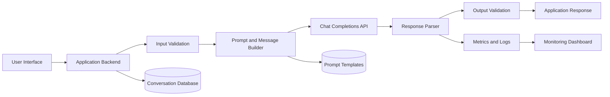
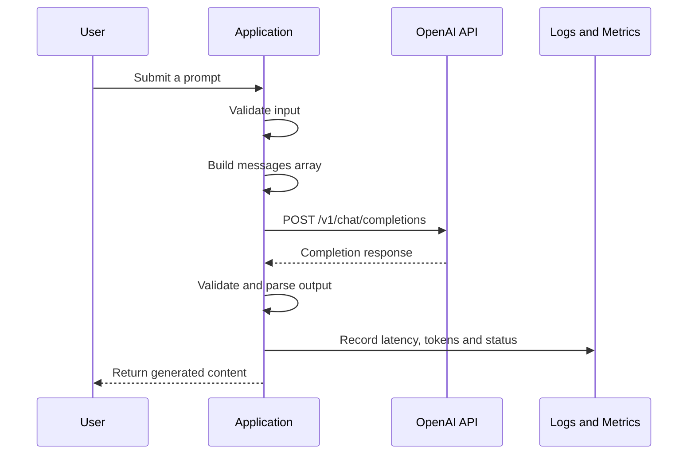
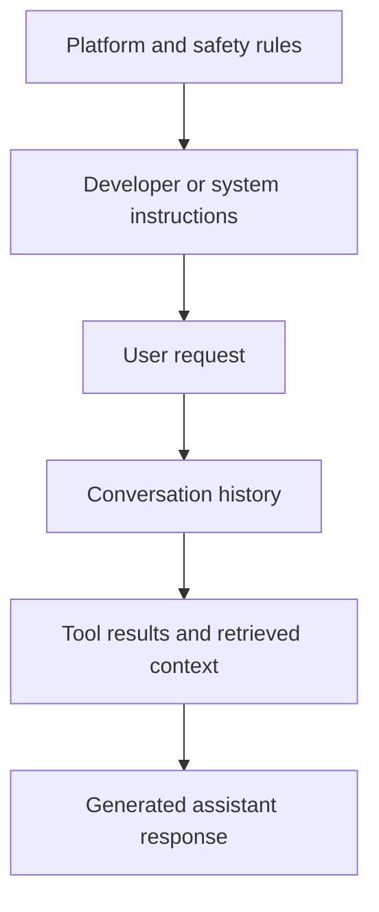
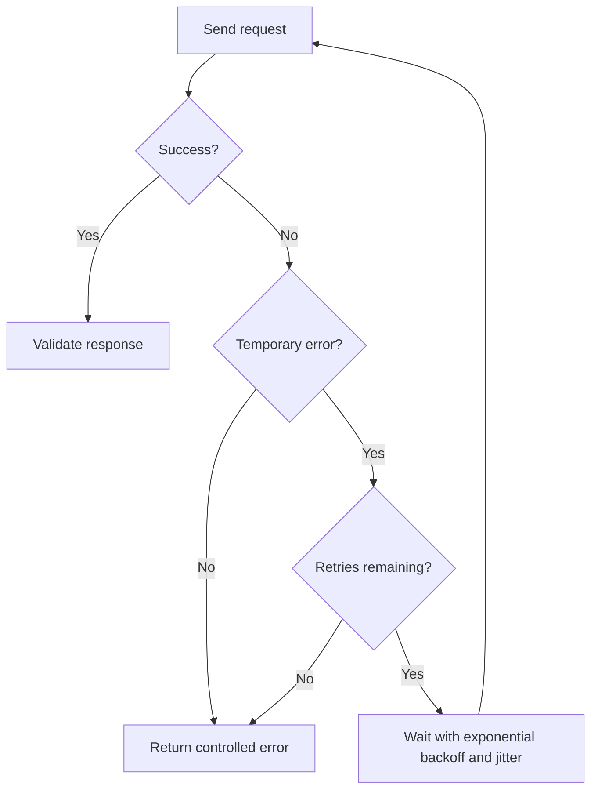
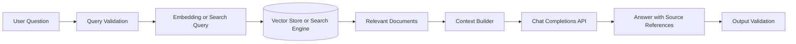
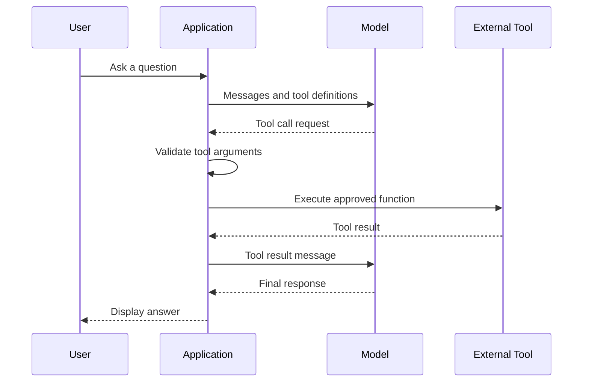
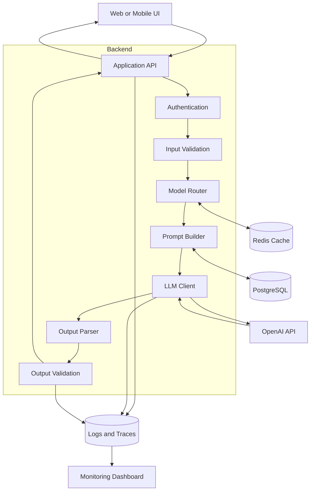
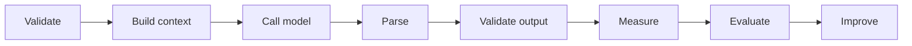

# 003 — Chat Completions API

| Field                  | Value                                     |
| ---------------------- | ----------------------------------------- |
| **Course**             | 02 — Model Platforms and Prompting        |
| **Module**             | Module 04 — OpenAI Platform and API       |
| **Content Group**      | Platform Basics                           |
| **Roadmap Source**     | OpenAI Platform and API / Platform Basics |
| **Lesson Type**        | API                                       |
| **Order in Module**    | 003                                       |
| **Suggested Duration** | 24 minutes                                |
| **Related Project**    | Project 3 — AI Writing Assistant          |

---

## 1. Lesson Overview

The **Chat Completions API** allows an application to send a conversation to an OpenAI model and receive a generated response.

The application provides an ordered list of messages, usually containing instructions, user input, previous assistant replies, and tool results. The model processes this conversation and returns a completion containing one or more response choices.

The official endpoint is:

```text
POST https://api.openai.com/v1/chat/completions
```

The response normally contains a `choices` array. The generated assistant message can usually be read from:

```text
choices[0].message.content
```

The response may also include metadata such as the model name, finish reason, creation time, and token usage.

> [!IMPORTANT]
> Chat Completions remains supported, but OpenAI currently recommends the **Responses API** for new text-generation projects. Chat Completions is still valuable for maintaining existing applications and understanding message-based LLM integrations.

---

## 2. Learning Objectives

After completing this lesson, you should be able to:

* Explain the purpose of the Chat Completions API.
* Identify where an LLM API call belongs in an AI application.
* Construct a valid request using cURL.
* Understand the roles and structure of conversation messages.
* Extract generated text and usage information from a response.
* Manage multi-turn conversation history.
* Measure latency, input tokens, output tokens, and estimated cost.
* Handle timeouts, retries, rate limits, and invalid responses.
* Add Chat Completions to a small AI Writing Assistant.
* Explain when a new project should consider the Responses API instead.

---

## 3. Where the API Fits in an AI Application

The API call is only one component of a complete AI feature.



A production application should not call the model directly from an untrusted client when doing so would expose the API key.

A safer architecture is:

```text
Web or mobile application
        ↓
Your backend API
        ↓
Authentication and validation
        ↓
Prompt/message construction
        ↓
OpenAI API
        ↓
Output validation
        ↓
Response returned to the client
```

---

## 4. The Request Lifecycle



The main stages are:

1. Receive user input.
2. Validate the input.
3. Add application instructions.
4. Add relevant conversation history.
5. Send the request.
6. Wait for a normal or streamed response.
7. parse the response.
8. Validate the generated output.
9. Record operational metrics.
10. Return the result to the user.

---

## 5. Understanding the Endpoint

The complete endpoint is:

```text
https://api.openai.com/v1/chat/completions
```

Its main components are:

| Component           | Meaning                                 |
| ------------------- | --------------------------------------- |
| `https://`          | Secure HTTP protocol                    |
| `api.openai.com`    | OpenAI API host                         |
| `/v1`               | API version namespace                   |
| `/chat/completions` | Chat Completions resource               |
| `POST`              | HTTP method used to create a completion |

The endpoint receives a conversation and returns a model-generated response.

---

## 6. What Is cURL?

**cURL** is a command-line tool for sending requests to URLs.

It is useful for:

* Testing an API without building an application.
* Debugging authentication and request payloads.
* Reproducing an API error.
* Testing different models and parameters.
* Verifying that a backend problem is not caused by the frontend.

A cURL request generally contains:

```text
curl
  + endpoint
  + HTTP headers
  + request body
```

---

## 7. Basic cURL Request

Store the API key in an environment variable rather than writing it directly into source code.

### Linux or macOS

```bash
export OPENAI_API_KEY="your-api-key"
```

### PowerShell

```powershell
$env:OPENAI_API_KEY="your-api-key"
```

### Chat Completions request

```bash
curl https://api.openai.com/v1/chat/completions \
  -H "Content-Type: application/json" \
  -H "Authorization: Bearer $OPENAI_API_KEY" \
  -d '{
    "model": "gpt-5.6",
    "messages": [
      {
        "role": "developer",
        "content": "You are a concise AI engineering tutor."
      },
      {
        "role": "user",
        "content": "Explain retrieval-augmented generation in three bullet points."
      }
    ],
    "store": false
  }'
```

The official documentation currently uses the same Chat Completions endpoint and demonstrates reading the result from the first choice returned by the model.

> [!NOTE]
> Model availability, supported parameters, pricing, and rate limits can change. The model should therefore be configurable rather than permanently hard-coded throughout the application.

---

## 8. Breaking Down the cURL Command

### 8.1 The endpoint

```bash
https://api.openai.com/v1/chat/completions
```

This identifies the API resource that receives the request.

### 8.2 Content-Type header

```bash
-H "Content-Type: application/json"
```

This tells the server that the request body is JSON.

### 8.3 Authorization header

```bash
-H "Authorization: Bearer $OPENAI_API_KEY"
```

This authenticates the request using the API key stored in the environment.

Never commit a real API key to:

* Git repositories
* Mobile application code
* Frontend JavaScript bundles
* Public notebooks
* Screenshots
* Logs
* Error messages

### 8.4 Request body

```bash
-d '{
  "model": "gpt-5.6",
  "messages": [...]
}'
```

The `-d` option sends the JSON request body.

---

## 9. Request Body Structure

A minimal request contains two important fields:

```json
{
  "model": "gpt-5.6",
  "messages": [
    {
      "role": "user",
      "content": "Explain RAG."
    }
  ]
}
```

### `model`

Specifies the model that should process the request.

```json
{
  "model": "gpt-5.6"
}
```

Model selection affects factors such as:

* Response quality
* Reasoning ability
* Latency
* Context-window support
* Input and output cost
* Multimodal support
* Tool-calling support
* Supported generation parameters

### `messages`

Contains the conversation sent to the model.

```json
{
  "messages": [
    {
      "role": "user",
      "content": "Explain RAG."
    }
  ]
}
```

Chat Completions receives an ordered list of conversation messages and returns a response based on that context.

---

## 10. Message Roles

A message normally contains:

```json
{
  "role": "user",
  "content": "Explain RAG."
}
```

The role tells the model where the message came from and how it should be interpreted.

### 10.1 `developer`

Contains instructions defined by the application developer.

```json
{
  "role": "developer",
  "content": "Answer using short, technically accurate explanations."
}
```

For newer model families, OpenAI recommends developer messages for instructions that must take priority over user messages. The API reference notes that developer messages replace the earlier system-message behavior for newer reasoning-model generations.

### 10.2 `system`

Provides system-level guidance in integrations that use this message role.

```json
{
  "role": "system",
  "content": "You are a helpful assistant."
}
```

Older tutorials frequently use `system` for application instructions. When working with a particular model, check whether `developer` is preferred.

### 10.3 `user`

Contains an end user's request or additional context.

```json
{
  "role": "user",
  "content": "Rewrite this paragraph in a professional tone."
}
```

### 10.4 `assistant`

Represents a previous message produced by the model.

```json
{
  "role": "assistant",
  "content": "Here is the rewritten paragraph."
}
```

Assistant messages can be sent back to the model to maintain a multi-turn conversation.

### 10.5 `tool`

Contains the result of a function or tool requested by the model.

```json
{
  "role": "tool",
  "tool_call_id": "call_123",
  "content": "{\"temperature\": 31}"
}
```

Tool messages connect external application functions to the model. Tool arguments must be validated before the application executes a function because generated arguments should never be trusted automatically. The API reference explicitly warns developers to validate function arguments.

---

## 11. Message Priority

A simplified conceptual priority is:



Example:

```json
{
  "messages": [
    {
      "role": "developer",
      "content": "Return no more than three bullet points."
    },
    {
      "role": "user",
      "content": "Explain RAG in detail."
    }
  ]
}
```

Even though the user requests a detailed explanation, the application instruction limits the response to three bullet points.

---

## 12. Conversation History

The Chat Completions API does not automatically understand messages that your application does not send.

For a multi-turn conversation, the application normally stores the previous messages and includes the relevant history in the next request.

### First request

```json
{
  "model": "gpt-5.6",
  "messages": [
    {
      "role": "user",
      "content": "What is retrieval-augmented generation?"
    }
  ]
}
```

### Second request

```json
{
  "model": "gpt-5.6",
  "messages": [
    {
      "role": "user",
      "content": "What is retrieval-augmented generation?"
    },
    {
      "role": "assistant",
      "content": "RAG combines retrieval with language-model generation."
    },
    {
      "role": "user",
      "content": "What database can I use for it?"
    }
  ]
}
```

In Chat Completions, applications normally maintain the transcript and resend the accumulated or selected `messages` on later turns.

### Context-management problem

Conversation history increases the number of input tokens.

A production application may need to:

* Keep only recent messages.
* Summarize older messages.
* Remove duplicated context.
* Retrieve only relevant memories.
* Set a maximum token budget.
* Separate persistent user data from temporary conversation history.

---

## 13. Common Request Parameters

Exact parameter support depends on the selected model.

| Parameter          | Purpose                                                                      |
| ------------------ | ---------------------------------------------------------------------------- |
| `model`            | Selects the model                                                            |
| `messages`         | Supplies conversation context                                                |
| `stream`           | Returns output incrementally                                                 |
| `tools`            | Defines functions the model may call                                         |
| `tool_choice`      | Controls whether tools may or must be called                                 |
| `store`            | Controls request/response storage behavior                                   |
| `response_format`  | Requests a particular structured-output format where supported               |
| `temperature`      | Controls sampling randomness where supported                                 |
| `top_p`            | Controls nucleus sampling where supported                                    |
| Output-token limit | Restricts maximum generated tokens; the exact field depends on the model/API |

> [!WARNING]
> Do not assume that every model supports every parameter. A parameter used in an older GPT-3.5 tutorial may be ignored or rejected by a newer reasoning model.

---

## 14. Understanding Temperature

Temperature is a sampling parameter supported by some model families.

Conceptually:

|   Temperature | Typical behavior            |
| ------------: | --------------------------- |
|     `0.0–0.2` | More focused and repeatable |
|     `0.3–0.6` | Balanced                    |
|     `0.7–1.0` | More varied and creative    |
| Higher values | Increasingly unpredictable  |

Possible low-temperature tasks:

* Data extraction
* Classification
* Code transformation
* Structured output
* Deterministic rewriting

Possible higher-temperature tasks:

* Story ideas
* Marketing variations
* Creative writing
* Brainstorming
* Character dialogue

However, temperature does not guarantee factual correctness.

A higher value does not mean that the model knows more. It only changes how the next tokens are sampled.

### Experiment

Run the same prompt multiple times:

```text
Write a two-sentence opening for a science-fiction story.
```

Compare the outputs using:

```text
temperature = 0.1
temperature = 0.7
temperature = 1.0
```

Record:

* Similarity between outputs
* Creativity
* Factual consistency
* Formatting consistency
* Average latency
* Output-token count

---

## 15. Example Response

A simplified response may look like this:

```json
{
  "id": "chatcmpl_example",
  "object": "chat.completion",
  "created": 1770000000,
  "model": "gpt-5.6",
  "choices": [
    {
      "index": 0,
      "message": {
        "role": "assistant",
        "content": "Retrieval-augmented generation combines external information retrieval with language-model generation."
      },
      "finish_reason": "stop"
    }
  ],
  "usage": {
    "prompt_tokens": 32,
    "completion_tokens": 19,
    "total_tokens": 51
  }
}
```

The values above are illustrative.

The real Chat Completions response includes a `choices` array, generated messages, a finish reason, and may include usage statistics.

---

## 16. Reading the Response

The most important fields are:

```text
choices[0].message.content
choices[0].finish_reason
usage.prompt_tokens
usage.completion_tokens
usage.total_tokens
```

### Generated content

```python
completion.choices[0].message.content
```

### Finish reason

Common finish reasons include:

| Finish reason    | Meaning                                     |
| ---------------- | ------------------------------------------- |
| `stop`           | The model reached a normal stopping point   |
| `length`         | The output-token limit was reached          |
| `tool_calls`     | The model requested one or more tools       |
| `content_filter` | Some output was omitted by a content filter |
| `function_call`  | Older deprecated function-call behavior     |

These values are documented as part of the Chat Completion response object.

### Why `finish_reason` matters

Do not assume the response is complete.

For example:

```python
if completion.choices[0].finish_reason == "length":
    # The response may have been truncated.
    # Ask the user to continue or retry with a larger token budget.
    pass
```

---

## 17. Python Example

Install the SDK:

```bash
pip install openai
```

Create a simple request:

```python
import os

from openai import OpenAI


def main() -> None:
    if not os.getenv("OPENAI_API_KEY"):
        raise RuntimeError("OPENAI_API_KEY is not configured.")

    client = OpenAI()

    completion = client.chat.completions.create(
        model="gpt-5.6",
        messages=[
            {
                "role": "developer",
                "content": (
                    "You are an AI engineering tutor. "
                    "Answer accurately and concisely."
                ),
            },
            {
                "role": "user",
                "content": "Explain retrieval-augmented generation.",
            },
        ],
        store=False,
    )

    if not completion.choices:
        raise RuntimeError("The API returned no completion choices.")

    message = completion.choices[0].message.content

    if not message:
        raise RuntimeError("The completion did not contain text.")

    print(message)

    if completion.usage:
        print("Input tokens:", completion.usage.prompt_tokens)
        print("Output tokens:", completion.usage.completion_tokens)
        print("Total tokens:", completion.usage.total_tokens)


if __name__ == "__main__":
    main()
```

The official migration guide demonstrates the same SDK method:

```python
client.chat.completions.create(...)
```

and extracts generated text from:

```python
completion.choices[0].message.content
```

---

## 18. Measuring Latency and Token Usage

An AI Engineer should measure more than whether the request succeeded.

```python
import json
import os
import time
from datetime import UTC, datetime
from typing import Any

from openai import OpenAI


def create_completion(user_prompt: str) -> dict[str, Any]:
    if not user_prompt.strip():
        raise ValueError("The prompt must not be empty.")

    if len(user_prompt) > 20_000:
        raise ValueError("The prompt exceeds the application limit.")

    if not os.getenv("OPENAI_API_KEY"):
        raise RuntimeError("OPENAI_API_KEY is not configured.")

    client = OpenAI()

    started_at = time.perf_counter()

    completion = client.chat.completions.create(
        model="gpt-5.6",
        messages=[
            {
                "role": "developer",
                "content": "Respond with a concise technical explanation.",
            },
            {
                "role": "user",
                "content": user_prompt,
            },
        ],
        store=False,
    )

    latency_ms = round((time.perf_counter() - started_at) * 1000, 2)

    if not completion.choices:
        raise RuntimeError("No completion choice was returned.")

    choice = completion.choices[0]
    output_text = choice.message.content or ""

    result = {
        "request_time": datetime.now(UTC).isoformat(),
        "model": completion.model,
        "output": output_text,
        "finish_reason": choice.finish_reason,
        "latency_ms": latency_ms,
        "input_tokens": (
            completion.usage.prompt_tokens if completion.usage else None
        ),
        "output_tokens": (
            completion.usage.completion_tokens if completion.usage else None
        ),
        "total_tokens": (
            completion.usage.total_tokens if completion.usage else None
        ),
    }

    print(json.dumps(result, ensure_ascii=False, indent=2))

    return result
```

Example log:

```json
{
  "request_time": "2026-07-17T13:00:00+00:00",
  "model": "gpt-5.6",
  "finish_reason": "stop",
  "latency_ms": 1824.37,
  "input_tokens": 42,
  "output_tokens": 91,
  "total_tokens": 133
}
```

---

## 19. Recommended Metrics

For every model call, consider recording:

| Metric                   | Why it matters                                           |
| ------------------------ | -------------------------------------------------------- |
| Request ID               | Connects application logs with provider requests         |
| Model                    | Enables model comparison                                 |
| Prompt version           | Identifies which prompt produced the output              |
| Feature name             | Separates summarize, rewrite, translate, and other calls |
| Start time               | Supports tracing                                         |
| Total latency            | Measures complete request time                           |
| Time to first token      | Measures perceived streaming responsiveness              |
| Input tokens             | Measures prompt and context size                         |
| Output tokens            | Measures generation length                               |
| Total tokens             | Supports cost analysis                                   |
| Estimated input cost     | Supports budgeting                                       |
| Estimated output cost    | Supports budgeting                                       |
| Retry count              | Reveals instability                                      |
| HTTP status              | Identifies failed calls                                  |
| Finish reason            | Detects truncated or tool-call responses                 |
| Output-validation status | Detects malformed output                                 |
| User feedback            | Supports quality evaluation                              |

Do not store raw sensitive prompts in logs unless the application's privacy policy explicitly allows it.

---

## 20. Cost Estimation

The general cost formula is:

```text
Input cost
    = input tokens / 1,000,000 × model input price

Output cost
    = output tokens / 1,000,000 × model output price

Total estimated cost
    = input cost + output cost
```

Example function:

```python
def estimate_cost(
    input_tokens: int,
    output_tokens: int,
    input_price_per_million: float,
    output_price_per_million: float,
) -> float:
    input_cost = (
        input_tokens / 1_000_000
    ) * input_price_per_million

    output_cost = (
        output_tokens / 1_000_000
    ) * output_price_per_million

    return round(input_cost + output_cost, 8)
```

Pricing should be stored in application configuration because model prices may change.

```python
MODEL_PRICING = {
    "example-model": {
        "input_per_million": 0.0,
        "output_per_million": 0.0,
    }
}
```

Replace the example values with current official pricing before using the calculation in a dashboard.

---

## 21. Streaming Responses

Without streaming:

```text
Request sent
    ↓
Wait for complete generation
    ↓
Display the complete response
```

With streaming:

```text
Request sent
    ↓
Receive the first text chunk
    ↓
Display chunks as they arrive
    ↓
Receive final event
```

Streaming improves perceived responsiveness because the user can begin reading before the complete answer has been generated.

### Python streaming example

```python
import os

from openai import OpenAI


def stream_completion(prompt: str) -> None:
    if not os.getenv("OPENAI_API_KEY"):
        raise RuntimeError("OPENAI_API_KEY is not configured.")

    client = OpenAI()

    stream = client.chat.completions.create(
        model="gpt-5.6",
        messages=[
            {
                "role": "developer",
                "content": "Answer as a concise AI engineering tutor.",
            },
            {
                "role": "user",
                "content": prompt,
            },
        ],
        stream=True,
        stream_options={
            "include_usage": True,
        },
        store=False,
    )

    for chunk in stream:
        if chunk.choices:
            text = chunk.choices[0].delta.content

            if text:
                print(text, end="", flush=True)

        if chunk.usage:
            print("\n")
            print("Input tokens:", chunk.usage.prompt_tokens)
            print("Output tokens:", chunk.usage.completion_tokens)
            print("Total tokens:", chunk.usage.total_tokens)
```

When `stream_options.include_usage` is enabled, a final chunk can contain usage information for the complete request. If the stream is interrupted, that final usage chunk may not arrive.

---

## 22. Streaming Latency Metrics

For streaming, measure at least two latency values.

### Time to first token

```text
Time to first token
    = first output chunk time − request start time
```

This represents how quickly the application begins displaying an answer.

### Total generation latency

```text
Total generation latency
    = final chunk time − request start time
```

Example:

```python
import time

request_started = time.perf_counter()
first_token_at = None

for chunk in stream:
    if chunk.choices:
        text = chunk.choices[0].delta.content

        if text:
            if first_token_at is None:
                first_token_at = time.perf_counter()

            print(text, end="", flush=True)

request_finished = time.perf_counter()

if first_token_at is not None:
    time_to_first_token_ms = (
        first_token_at - request_started
    ) * 1000

    print(
        "\nTime to first token:",
        round(time_to_first_token_ms, 2),
        "ms",
    )

total_latency_ms = (
    request_finished - request_started
) * 1000

print(
    "Total latency:",
    round(total_latency_ms, 2),
    "ms",
)
```

---

## 23. Error Handling

An API integration should expect failures.

Common failure categories include:

| Category          | Example                                    |
| ----------------- | ------------------------------------------ |
| Authentication    | Missing, invalid, or revoked API key       |
| Validation        | Invalid JSON or unsupported parameter      |
| Rate limiting     | Too many requests or tokens                |
| Timeout           | Model response exceeds application timeout |
| Network           | DNS, connection, or proxy failure          |
| Server error      | Temporary upstream problem                 |
| Content handling  | Empty, refused, or filtered output         |
| Output validation | Invalid JSON or missing required fields    |

### Error-handling principles

1. Never expose internal error details or API keys to users.
2. Retry only errors that are likely to be temporary.
3. Use exponential backoff with random jitter.
4. Set a maximum retry count.
5. Apply a complete request deadline.
6. Record every retry.
7. Validate the final response.
8. Return a user-friendly fallback message.

---

## 24. Retry Strategy



Example backoff schedule:

```text
Attempt 1 → immediate
Attempt 2 → wait approximately 1 second
Attempt 3 → wait approximately 2 seconds
Attempt 4 → wait approximately 4 seconds
```

Random jitter prevents many application instances from retrying at exactly the same time.

---

## 25. Output Validation

A successful HTTP response does not guarantee that the output is valid for the application.

Suppose the application expects:

```json
{
  "summary": "string",
  "keywords": ["string"],
  "language": "string"
}
```

Possible model output problems include:

* Invalid JSON
* Markdown surrounding the JSON
* Missing fields
* Incorrect field types
* Additional unsupported fields
* Empty arrays
* Excessively long values
* Unsupported language values

Validate model output with a schema.

```python
from pydantic import BaseModel, Field


class WritingResult(BaseModel):
    summary: str = Field(min_length=1, max_length=1_000)
    keywords: list[str] = Field(min_length=1, max_length=10)
    language: str = Field(pattern=r"^(en|vi)$")
```

Parsing example:

```python
import json

raw_output = completion.choices[0].message.content or ""

parsed_json = json.loads(raw_output)
validated_result = WritingResult.model_validate(parsed_json)
```

Do not send an unvalidated tool call, SQL statement, file path, shell command, or business decision directly into another system.

---

## 26. Chat Completions in a RAG Pipeline

The API can act as the generation stage of a retrieval-augmented generation pipeline.



Example messages:

```json
{
  "model": "gpt-5.6",
  "messages": [
    {
      "role": "developer",
      "content": "Answer only from the supplied context. State when the context is insufficient."
    },
    {
      "role": "user",
      "content": "Context:\n...\n\nQuestion:\nHow does the cache expire?"
    }
  ],
  "store": false
}
```

The model is not the retrieval system.

A complete RAG feature requires:

* Document ingestion
* Chunking
* Indexing
* Retrieval
* Ranking
* Context construction
* Generation
* Citation or evidence handling
* Evaluation

---

## 27. Chat Completions with Tools

The application may provide function definitions that the model can select.



Tool execution must remain under application control.

The model can request a function, but your code must decide whether the call is valid and authorized.

The API supports function tools and returns tool calls in assistant messages. Tool choice may allow automatic selection, require a tool, or disable tool usage.

---

## 28. Production Architecture Example



---

## 29. Storage and Privacy

Requests may contain:

* User messages
* Uploaded document content
* Personal information
* Internal company data
* Retrieved database records
* Conversation history

The application should define:

* Which data may be sent to the model
* Which data must be removed or redacted
* Whether prompts may be logged
* How long logs are retained
* Whether conversations are stored
* Who may access traces
* How user deletion requests are handled

The current migration documentation states that Responses are stored by default and that Chat Completions are stored by default for new accounts. Setting `store: false` disables storage for the request.

Example:

```json
{
  "model": "gpt-5.6",
  "messages": [
    {
      "role": "user",
      "content": "Summarize this document."
    }
  ],
  "store": false
}
```

This parameter does not replace your application's own privacy controls.

---

## 30. Common Mistakes

### Mistake 1: Treating a one-time demo as production-ready

A prompt that works once may fail with:

* Long inputs
* Empty inputs
* Conflicting instructions
* Multiple languages
* Adversarial input
* Unusual formatting
* Large conversation histories

### Mistake 2: Exposing the API key

Never place a secret API key inside a public web or mobile client.

### Mistake 3: Trusting generated JSON without validation

The output must be parsed and validated before use.

### Mistake 4: Ignoring `finish_reason`

A response ending because of `length` may be incomplete.

### Mistake 5: Retrying every error

Authentication and validation failures usually require a configuration or code change rather than another identical request.

### Mistake 6: Retrying without limits

Unlimited retries can increase cost and overload the application.

### Mistake 7: Sending the entire conversation forever

Long message history increases cost and latency and may eventually exceed the model's context limit.

### Mistake 8: Not recording tokens or latency

Without metrics, model selection becomes guesswork.

### Mistake 9: Hard-coding the model everywhere

Use centralized configuration or a model router.

### Mistake 10: Assuming temperature is universally supported

Generation controls differ between model families.

### Mistake 11: Logging sensitive user data

Operational logs should not become an uncontrolled copy of user conversations.

### Mistake 12: Mixing application instructions with user content

Keep trusted application instructions separate from untrusted user input.

---

## 31. Chat Completions vs. Responses API

| Area                         | Chat Completions                  | Responses API                                |
| ---------------------------- | --------------------------------- | -------------------------------------------- |
| Primary input                | `messages`                        | `input` and optional `instructions`          |
| Main output                  | `choices[].message`               | Typed `output` items                         |
| Text helper                  | Read `choices[0].message.content` | `response.output_text`                       |
| Conversation state           | Usually managed manually          | Supports response chaining and Conversations |
| Tool-oriented workflows      | Supported                         | Designed for richer agentic workflows        |
| Recommended for new projects | No longer preferred               | Yes                                          |
| Existing integrations        | Still supported                   | Migration target                             |

OpenAI describes the Responses API as an evolution of Chat Completions and recommends it for new projects, while keeping Chat Completions supported.

### Equivalent conceptual calls

#### Chat Completions

```python
completion = client.chat.completions.create(
    model="gpt-5.6",
    messages=[
        {
            "role": "user",
            "content": "Explain RAG.",
        }
    ],
)

text = completion.choices[0].message.content
```

#### Responses API

```python
response = client.responses.create(
    model="gpt-5.6",
    input="Explain RAG.",
)

text = response.output_text
```

The lesson focuses on Chat Completions, but an AI Engineer should be able to identify both API styles.

---

## 32. Practical Exercise

### Goal

Create a small backend function for an **AI Writing Assistant** with the following operations:

* `summarize`
* `rewrite`
* `translate`
* `explain`
* `json`

### Example input

```json
{
  "operation": "summarize",
  "text": "Retrieval-augmented generation combines information retrieval with text generation...",
  "target_language": "en"
}
```

### Expected output

```json
{
  "operation": "summarize",
  "result": "RAG improves generated answers by supplying relevant retrieved information.",
  "model": "configured-model",
  "latency_ms": 1200.5,
  "input_tokens": 83,
  "output_tokens": 21,
  "total_tokens": 104,
  "finish_reason": "stop"
}
```

### Required implementation steps

1. Validate the operation.
2. Validate that `text` is not empty.
3. Apply an application input-length limit.
4. Build developer and user messages.
5. Call the Chat Completions API.
6. Measure total latency.
7. Read the first completion choice.
8. Inspect `finish_reason`.
9. Record token usage.
10. Validate the generated result.
11. Return a controlled error when the call fails.
12. Avoid exposing the API key.

---

## 33. Suggested Prompt Builder

```python
from typing import Literal


Operation = Literal[
    "summarize",
    "rewrite",
    "translate",
    "explain",
    "json",
]


def build_messages(
    operation: Operation,
    text: str,
    target_language: str = "en",
) -> list[dict[str, str]]:
    operation_instructions = {
        "summarize": (
            "Summarize the supplied text while preserving its key facts."
        ),
        "rewrite": (
            "Rewrite the supplied text in a clear, professional style."
        ),
        "translate": (
            f"Translate the supplied text into {target_language}."
        ),
        "explain": (
            "Explain the supplied text to a beginner using plain language."
        ),
        "json": (
            "Return a JSON object with the fields summary, keywords, "
            "and language. Return no surrounding Markdown."
        ),
    }

    if operation not in operation_instructions:
        raise ValueError(f"Unsupported operation: {operation}")

    if not text.strip():
        raise ValueError("Text must not be empty.")

    return [
        {
            "role": "developer",
            "content": (
                "You are an AI writing assistant. "
                "Follow the requested operation precisely. "
                "Do not invent facts that are not present in the input."
            ),
        },
        {
            "role": "user",
            "content": (
                f"Operation:\n{operation_instructions[operation]}"
                f"\n\nInput text:\n{text}"
            ),
        },
    ]
```

Keeping prompt construction in a dedicated function makes prompts easier to test, version, and compare.

---

## 34. Required Test Cases

Test the implementation with more than one successful example.

| Test                  | Input                            | Expected behavior              |
| --------------------- | -------------------------------- | ------------------------------ |
| Normal summary        | Valid paragraph                  | Returns a shorter result       |
| Empty input           | Empty string                     | Validation error               |
| Whitespace input      | Spaces only                      | Validation error               |
| Unsupported operation | `delete_database`                | Validation error               |
| Very long input       | Above application limit          | Input-size error               |
| Vietnamese input      | Vietnamese paragraph             | Correct processing             |
| Conflicting request   | User asks to ignore instructions | Developer rules remain active  |
| JSON operation        | Valid text                       | Schema-valid JSON              |
| Truncated output      | Low output limit                 | Detect `finish_reason=length`  |
| Rate limit            | Simulated 429                    | Controlled retry               |
| Timeout               | Simulated slow call              | Controlled timeout             |
| Network failure       | Simulated connection error       | User-friendly error            |
| Empty completion      | No content                       | Application error              |
| Multiple requests     | Repeated benchmark               | Metrics recorded for each call |

---

## 35. Model Experiment

Compare at least two available models using the same test dataset.

### Test dataset

Include:

* A short factual explanation
* A long article summary
* Vietnamese-to-English translation
* Professional rewriting
* Creative story continuation
* JSON extraction
* Prompt-injection attempt
* Ambiguous instruction
* Long conversation context
* Invalid or empty input

### Metrics

Record:

```text
Model
Task
Prompt version
Success or failure
Output quality score
Format-valid score
Input tokens
Output tokens
Total tokens
Time to first token
Total latency
Retry count
Estimated cost
Finish reason
```

### Example experiment table

| Model   | Task      | Quality | Latency | Input tokens | Output tokens | Valid output |
| ------- | --------- | ------: | ------: | -----------: | ------------: | ------------ |
| Model A | Summarize |   4.5/5 |   1.4 s |          520 |            88 | Yes          |
| Model B | Summarize |   4.1/5 |   0.8 s |          520 |            75 | Yes          |
| Model A | JSON      |   4.8/5 |   1.2 s |          260 |            54 | Yes          |
| Model B | JSON      |   3.7/5 |   0.7 s |          260 |            61 | No           |

Do not choose a model using latency alone. A fast response that fails schema validation may require another request and ultimately cost more.

---

## 36. Production Checklist

### Security

* [ ] API keys are stored in environment variables or a secret manager.
* [ ] API keys are never sent to frontend or mobile clients.
* [ ] User input is treated as untrusted.
* [ ] Tool arguments are validated.
* [ ] Sensitive data is removed or redacted.
* [ ] Logs do not expose secrets.

### Request handling

* [ ] Input type is validated.
* [ ] Empty input is rejected.
* [ ] Input length is limited.
* [ ] The model is centrally configured.
* [ ] A request timeout is configured.
* [ ] Retry count is limited.
* [ ] Retry backoff includes jitter.
* [ ] Unsupported parameters are avoided.

### Response handling

* [ ] Empty `choices` is handled.
* [ ] Empty content is handled.
* [ ] `finish_reason` is checked.
* [ ] Structured output is schema-validated.
* [ ] Tool calls are authorized before execution.
* [ ] Refusals and filtered output are handled.
* [ ] Partial streaming output is handled.

### Observability

* [ ] Request latency is recorded.
* [ ] Time to first token is recorded for streaming.
* [ ] Input tokens are recorded.
* [ ] Output tokens are recorded.
* [ ] Estimated cost is recorded.
* [ ] Retry count is recorded.
* [ ] HTTP status is recorded.
* [ ] Prompt version is recorded.
* [ ] Model version is recorded.
* [ ] Output-validation results are recorded.

### Quality

* [ ] Representative test inputs exist.
* [ ] Expected outputs or grading criteria exist.
* [ ] Multiple model runs are compared.
* [ ] Prompt changes are evaluated before release.
* [ ] Multilingual inputs are tested.
* [ ] Adversarial inputs are tested.
* [ ] Long-context behavior is tested.
* [ ] Human review is used for subjective tasks.

---

## 37. Suggested 24-Minute Lesson Plan

|          Time | Topic                                       |
| ------------: | ------------------------------------------- |
|   0–3 minutes | What Chat Completions is and where it fits  |
|   3–6 minutes | Endpoint, headers, authentication, and JSON |
|  6–10 minutes | `model`, `messages`, roles, and content     |
| 10–13 minutes | Response structure and finish reasons       |
| 13–16 minutes | Python SDK example                          |
| 16–19 minutes | Tokens, cost, latency, and logging          |
| 19–21 minutes | Streaming and time to first token           |
| 21–23 minutes | Errors, retries, and validation             |
| 23–24 minutes | Exercise and completion checklist           |

---

## 38. Completion Checklist

* [ ] I can explain the Chat Completions API in one or two minutes.
* [ ] I can identify the Chat Completions endpoint.
* [ ] I understand the purpose of HTTP headers.
* [ ] I can explain the `model` field.
* [ ] I can construct a `messages` array.
* [ ] I understand developer, system, user, assistant, and tool roles.
* [ ] I can send a request using cURL.
* [ ] I can send a request using Python.
* [ ] I can extract generated content from the response.
* [ ] I check the completion finish reason.
* [ ] I can record input and output tokens.
* [ ] I can measure total latency.
* [ ] I can measure time to first token when streaming.
* [ ] I understand timeout and retry requirements.
* [ ] I validate structured output.
* [ ] I never expose an API key in client code.
* [ ] I have tested at least one invalid input.
* [ ] I have documented at least one API limitation.
* [ ] I understand that Responses API is preferred for new projects.

---

## 39. Related Outcome

> Call LLM APIs from applications while managing messages, tokens, cost, latency, retries, rate limits, streaming, structured outputs, safety, and user experience.

---

## 40. Related Portfolio Project

### Project 3 — AI Writing Assistant

Build an application that supports:

* Summarization
* Rewriting
* Translation
* Beginner-friendly explanation
* Structured JSON output

The project should include:

```text
Frontend or API client
        ↓
Writing operation selector
        ↓
Input validation
        ↓
Prompt builder
        ↓
Chat Completions client
        ↓
Output validator
        ↓
Metrics logger
        ↓
Results dashboard
```

Suggested dashboard metrics:

* Requests by operation
* Success rate
* Validation-failure rate
* Average latency
* P50, P95, and P99 latency
* Average time to first token
* Input tokens by request
* Output tokens by request
* Estimated cost by request
* Estimated cost by model
* Retry count
* Rate-limit errors
* Quality score by operation
* JSON-validity rate

---

## 41. Final Summary

The Chat Completions API is a foundational message-based interface for integrating language models into applications.

A basic integration requires:

```text
Endpoint
+ authentication
+ model
+ messages
+ response parsing
```

A production integration additionally requires:

```text
Validation
+ secret management
+ timeouts
+ retries
+ rate-limit handling
+ token tracking
+ cost tracking
+ latency measurement
+ structured-output validation
+ safety controls
+ testing
+ monitoring
```

The key engineering lesson is that successfully generating one response is only the beginning.

A reliable AI application must control the full lifecycle:



Chat Completions remains useful for existing message-based integrations, but new OpenAI projects should also evaluate the Responses API, which OpenAI currently recommends as the primary API for new text-generation and agentic workflows.

---

# Bài luyện tập

## Mục tiêu


## Đề bài


## Yêu cầu hoàn thành

- [ ] 
- [ ] 
- [ ] 

## Kết quả / lời giải


## Ghi chú
