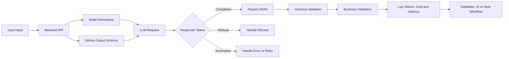
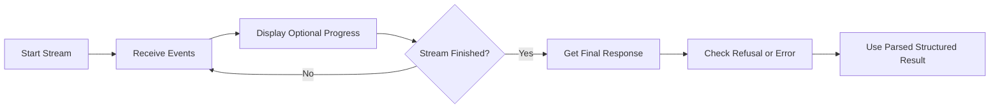
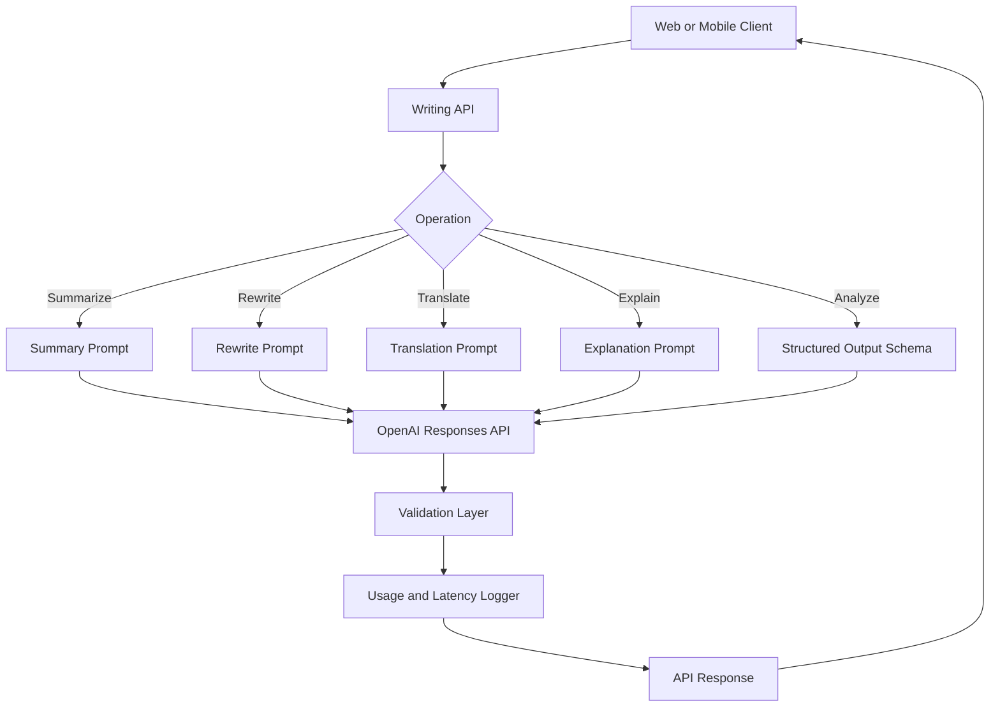

# 009 — JSON Output

**Course:** 02 — Model Platforms and Prompting
**Module:** Module 04 — OpenAI Platform and API
**Content Group:** Request Design
**Roadmap Source:** OpenAI Platform and API / Request Design
**Lesson Type:** API
**Lesson Order:** 009
**Suggested Duration:** 24 minutes

---

## 1. Summary

This lesson explains how to generate and process **JSON output from Large Language Models**.

JSON output allows an AI application to transform unstructured input—such as natural-language text, documents, or images—into structured data that backend services, databases, user interfaces, and automation workflows can consume.

A common use case is sending text or an image to a model, asking it to extract specific information, and receiving the result as a JSON object.

By the end of this lesson, you should understand:

* Why structured output matters in production applications.
* The difference between plain-text JSON, JSON mode, and Structured Outputs.
* How to define an output schema.
* How to parse and validate model output.
* How to handle refusals, incomplete responses, retries, latency, tokens, and cost.
* How JSON output can be used in an AI Writing Assistant.

---

## 2. Learning Objectives

After completing this lesson, you should be able to:

1. Explain JSON output in your own words.
2. Identify where structured output belongs in an LLM application.
3. Define a JSON schema for an application feature.
4. Generate structured data with the OpenAI Responses API.
5. Distinguish JSON mode from Structured Outputs.
6. Validate both the structure and business meaning of model output.
7. Handle malformed input, refusals, incomplete responses, timeouts, and API errors.
8. Build a small JSON-output feature for an AI Writing Assistant.

---

## 3. What Is JSON Output?

**JSON**, or JavaScript Object Notation, is a text-based format used to exchange structured data.

A normal LLM response may look like this:

```text
The text is positive. Its main topic is artificial intelligence,
and the author appears optimistic.
```

A structured JSON response could represent the same information as:

```json
{
  "sentiment": "positive",
  "topic": "artificial_intelligence",
  "confidence": 0.91,
  "summary": "The author is optimistic about artificial intelligence."
}
```

The second format is much easier for software to process.

Your application can directly:

* Store the result in a database.
* Display individual fields in the user interface.
* Filter or sort results.
* Trigger another workflow.
* Send the data to another API.
* Use the result as input for a later LLM call.
* Calculate analytics or evaluation metrics.

JSON output turns a model response into an **application data contract**.

---

## 4. Where JSON Output Fits in an AI Application



The model is only one part of the complete workflow.

A production-ready pipeline is closer to:

```text
input
  → normalize input
  → build messages and schema
  → call the model
  → check response status
  → parse structured output
  → validate business rules
  → log tokens, latency and errors
  → return data to the application
```

---

## 5. Three Ways to Request JSON

### 5.1 Prompt-Only JSON

The simplest approach is to ask the model to return JSON in the prompt.

```text
Analyze the following paragraph.

Return a JSON object with these fields:

- sentiment
- topic
- summary

Return only JSON.
```

This method is useful for quick experiments, but it does not guarantee that the model will always:

* Produce valid JSON.
* Include every required property.
* Use the expected data types.
* Follow enum restrictions.
* Avoid additional properties.
* Return a complete object.

For example, the application may expect:

```json
{
  "confidence": 0.9
}
```

But the model could return:

```json
{
  "confidence": "high"
}
```

The output may be understandable to a human but invalid for the application.

---

### 5.2 JSON Mode

JSON mode tells the API that the model must return valid JSON.

With the Responses API, it can be enabled using a JSON object text format:

```python
response = client.responses.create(
    model="gpt-5.6",
    input=[
        {
            "role": "system",
            "content": "You are an assistant that outputs JSON."
        },
        {
            "role": "user",
            "content": "Extract the title and author from this text."
        }
    ],
    text={
        "format": {
            "type": "json_object"
        }
    }
)
```

JSON mode guarantees valid JSON in normal completed responses, but it does **not** guarantee that the output matches a particular schema. OpenAI recommends Structured Outputs when the selected model and use case support it.

When using JSON mode, the instructions must explicitly tell the model to produce JSON. Your application must also handle incomplete output and validate the parsed object against the expected schema.

---

### 5.3 Structured Outputs

Structured Outputs allow the application to define a JSON Schema or a typed model such as:

* A Pydantic model in Python.
* A Zod schema in JavaScript or TypeScript.
* A raw JSON Schema in an HTTP request.

The model response is constrained to the supplied schema.

OpenAI describes the main benefits as reliable type safety, programmatically detectable refusals, and simpler formatting instructions.

The source lesson also highlights the key distinction: JSON mode focuses on producing valid JSON, while Structured Outputs are designed to make the response conform to the specified schema.

### Comparison

| Capability                                 | Prompt-Only JSON |           JSON Mode | Structured Outputs |
| ------------------------------------------ | ---------------: | ------------------: | -----------------: |
| Usually produces JSON                      |              Yes |                 Yes |                Yes |
| Guarantees valid JSON                      |               No |                 Yes |                Yes |
| Enforces a schema                          |               No |                  No |                Yes |
| Enforces field types                       |               No |                  No |                Yes |
| Enforces required fields                   |               No |                  No |                Yes |
| Supports explicit refusals                 |  Manual handling |     Manual handling |                Yes |
| Recommended for production data extraction |               No | Only when necessary |                Yes |

Structured Outputs are the preferred option when schema adherence matters.

---

## 6. JSON Schema Fundamentals

Consider an application that extracts event information from this sentence:

```text
Alice and Bob are going to a science fair in New York on Friday.
```

The expected output is:

```json
{
  "name": "Science Fair",
  "date": "Friday",
  "location": "New York",
  "participants": [
    "Alice",
    "Bob"
  ]
}
```

A corresponding JSON Schema could be:

```json
{
  "type": "object",
  "properties": {
    "name": {
      "type": "string"
    },
    "date": {
      "type": "string"
    },
    "location": {
      "type": "string"
    },
    "participants": {
      "type": "array",
      "items": {
        "type": "string"
      }
    }
  },
  "required": [
    "name",
    "date",
    "location",
    "participants"
  ],
  "additionalProperties": false
}
```

### Important Schema Properties

#### `type`

Defines the expected data type.

```json
{
  "type": "string"
}
```

Common supported types include strings, numbers, integers, booleans, objects, arrays, enums, and `anyOf`. Structured Outputs support a subset of the full JSON Schema language.

#### `properties`

Defines the fields inside an object.

```json
{
  "properties": {
    "title": {
      "type": "string"
    },
    "rating": {
      "type": "number"
    }
  }
}
```

#### `required`

Defines which fields must be present.

```json
{
  "required": [
    "title",
    "rating"
  ]
}
```

#### `additionalProperties`

Controls whether the model may return fields that are not defined in the schema.

```json
{
  "additionalProperties": false
}
```

Using `false` creates a stricter and more predictable contract.

#### `enum`

Restricts a value to an approved list.

```json
{
  "type": "string",
  "enum": [
    "positive",
    "neutral",
    "negative"
  ]
}
```

#### Arrays

An array schema must describe the type of each item.

```json
{
  "type": "array",
  "items": {
    "type": "string"
  }
}
```

#### Nullable Values

When a value may be unknown, represent that explicitly.

```json
{
  "anyOf": [
    {
      "type": "string"
    },
    {
      "type": "null"
    }
  ]
}
```

Do not force the model to invent information merely because a field is required.

---

## 7. Structured Output with Python and Pydantic

The OpenAI Python SDK can parse a response directly into a Pydantic model. The current Structured Outputs guide demonstrates `client.responses.parse()` with a typed model and exposes the parsed result through `response.output_parsed`.

### Installation

```bash
pip install openai pydantic
```

Set the API key as an environment variable:

```bash
export OPENAI_API_KEY="your_api_key"
```

Do not expose API keys in frontend code or commit them to source control.

### Complete Example

```python
from typing import Optional

from openai import OpenAI
from pydantic import BaseModel, Field

client = OpenAI()


class CalendarEvent(BaseModel):
    name: str = Field(description="Name of the event")
    date: str = Field(description="Date or day mentioned in the input")
    location: Optional[str] = Field(
        description="Event location, or null if it is not provided"
    )
    participants: list[str] = Field(
        description="Names of people attending the event"
    )


response = client.responses.parse(
    model="gpt-5.6",
    input=[
        {
            "role": "system",
            "content": (
                "Extract event information from the user's text. "
                "Do not invent information that is not present."
            ),
        },
        {
            "role": "user",
            "content": (
                "Alice and Bob are going to a science fair "
                "in New York on Friday."
            ),
        },
    ],
    text_format=CalendarEvent,
)

event = response.output_parsed

if event is None:
    raise RuntimeError("The response did not contain parsed event data.")

print(event.model_dump_json(indent=2))
```

### Expected Output

```json
{
  "name": "Science Fair",
  "date": "Friday",
  "location": "New York",
  "participants": [
    "Alice",
    "Bob"
  ]
}
```

The schema describes the structure. The prompt describes the task and semantic rules.

This separation is important:

```text
Prompt:
What should the model do?

Schema:
What shape must the answer have?
```

Do not place every formatting requirement inside the prompt when the schema can represent it more reliably.

---

## 8. Example for an AI Writing Assistant

The related project includes the following features:

* Summarize.
* Rewrite.
* Translate.
* Explain.
* Return JSON output.

A JSON-output endpoint could accept:

```json
{
  "operation": "analyze",
  "text": "Artificial intelligence can improve productivity, but companies must use it responsibly."
}
```

The model could return:

```json
{
  "summary": "AI can improve productivity when used responsibly.",
  "sentiment": "balanced",
  "language": "en",
  "topics": [
    "artificial intelligence",
    "productivity",
    "responsible adoption"
  ],
  "warnings": [],
  "suggested_actions": [
    "Define responsible-use policies",
    "Measure productivity improvements"
  ]
}
```

### Pydantic Schema

```python
from typing import Literal

from pydantic import BaseModel, Field


class WritingAnalysis(BaseModel):
    summary: str = Field(
        min_length=1,
        description="A concise summary of the input"
    )
    sentiment: Literal[
        "positive",
        "neutral",
        "negative",
        "balanced"
    ]
    language: str = Field(
        description="Detected ISO language code"
    )
    topics: list[str]
    warnings: list[str]
    suggested_actions: list[str]
```

### API Request

```python
response = client.responses.parse(
    model="gpt-5.6",
    input=[
        {
            "role": "system",
            "content": (
                "Analyze writing for an AI writing assistant. "
                "Base every field only on the provided text."
            ),
        },
        {
            "role": "user",
            "content": (
                "Artificial intelligence can improve productivity, "
                "but companies must use it responsibly."
            ),
        },
    ],
    text_format=WritingAnalysis,
)

analysis = response.output_parsed
```

---

## 9. Multimodal JSON Extraction

Structured output is not limited to plain text.

A model can receive an image and return structured information such as:

* Receipt fields.
* Invoice details.
* Menu items and prices.
* Form fields.
* Product attributes.
* Chart observations.
* Document classifications.

For example, a menu image could produce:

```json
{
  "menu_items": [
    {
      "name": "Cheeseburger",
      "price": 8.99
    },
    {
      "name": "French Fries",
      "price": 3.49
    }
  ]
}
```

The source demonstration extracts menu-item names and numeric prices from an image into a JSON structure.

The output schema might be represented with Pydantic as:

```python
from pydantic import BaseModel, Field


class MenuItem(BaseModel):
    name: str
    price: float = Field(ge=0)


class MenuExtraction(BaseModel):
    menu_items: list[MenuItem]
```

Even with a correct schema, the application should still consider whether the extracted values are factually accurate. Schema validity cannot guarantee that text was read correctly from a low-quality or ambiguous image.

---

## 10. Three Levels of Validation

Structured output does not eliminate all validation requirements.

A production system should distinguish among three validation layers.

### 10.1 Syntax Validation

Question:

> Is the response valid JSON?

Invalid example:

```text
{
  "sentiment": "positive",
}
```

The trailing comma makes the JSON invalid.

JSON mode and Structured Outputs help prevent this category of error.

---

### 10.2 Schema Validation

Question:

> Does the JSON match the required structure and types?

Expected:

```json
{
  "sentiment": "positive",
  "confidence": 0.95
}
```

Invalid schema result:

```json
{
  "sentiment": 1,
  "confidence": "very high"
}
```

Structured Outputs are designed to enforce this layer.

---

### 10.3 Business Validation

Question:

> Are the values acceptable for this application?

Schema-valid but business-invalid example:

```json
{
  "sentiment": "positive",
  "confidence": 4.8
}
```

The JSON is valid, and the fields have the expected types. However, a confidence score may be required to remain between `0` and `1`.

Other business checks may include:

* Dates must not be impossible.
* Prices must not be negative.
* A summary must not be longer than the original text.
* A translation language must match the requested language.
* Database identifiers must exist.
* A classification must be supported by evidence.
* Extracted data must not be silently invented.

Structured output guarantees shape more effectively than semantic truth.

---

## 11. Handling Missing Information

Suppose the input is:

```text
Alice and Bob are going to a science fair on Friday.
```

The location is not provided.

A dangerous output would be:

```json
{
  "name": "Science Fair",
  "date": "Friday",
  "location": "New York",
  "participants": [
    "Alice",
    "Bob"
  ]
}
```

The model has invented a location.

A better schema allows `null`:

```json
{
  "name": "Science Fair",
  "date": "Friday",
  "location": null,
  "participants": [
    "Alice",
    "Bob"
  ]
}
```

Useful instructions include:

```text
Use null when the source does not provide a value.
Do not infer names, dates, locations or numbers without evidence.
```

A schema can control the structure, but instructions still define how uncertainty should be represented.

---

## 12. Refusals and Incomplete Responses

A structured-output request does not always result in parsed JSON.

The application must account for:

* Safety refusals.
* Maximum output-token limits.
* Content-filter interruptions.
* Network errors.
* Timeouts.
* Rate limits.
* Server errors.
* Invalid input.
* Missing response content.

Structured Outputs make safety refusals programmatically detectable instead of forcing them into the normal application schema.

A response may also have an `incomplete` status when generation stops before a complete result is produced, such as when the maximum output-token limit is reached.

### Simplified Handling Pattern

```python
response = client.responses.parse(
    model="gpt-5.6",
    input=[
        {
            "role": "system",
            "content": "Extract the requested information."
        },
        {
            "role": "user",
            "content": user_input
        }
    ],
    text_format=CalendarEvent,
)

if response.status == "incomplete":
    reason = getattr(response.incomplete_details, "reason", "unknown")
    raise RuntimeError(f"Incomplete response: {reason}")

if response.output_parsed is None:
    raise RuntimeError(
        "No parsed output was returned. "
        "Inspect the response for a refusal or other error."
    )

event = response.output_parsed
```

Do not automatically convert every refusal or missing response into an empty object. That can make a failed request appear successful.

---

## 13. Retry Strategy

Retries should be selective.

### Usually Retry

* Temporary connection failures.
* Timeouts.
* HTTP `429` rate-limit errors.
* HTTP `500` server errors.
* HTTP `503` overloaded-service errors.

### Usually Do Not Retry Without Changing the Request

* Invalid API key.
* Malformed request.
* Unsupported schema.
* Input that consistently triggers a refusal.
* Business-rule failure.
* A prompt that does not contain enough information.

OpenAI recommends pacing requests and using retry logic with exponential backoff for rate-limit and temporary service errors.

A retry policy may use:

```text
attempt 1 → wait approximately 1 second
attempt 2 → wait approximately 2 seconds
attempt 3 → wait approximately 4 seconds
attempt 4 → stop and return an error
```

Add random jitter so that many requests do not retry at exactly the same time. Unsuccessful requests can still contribute to rate limits, so unlimited immediate retries are ineffective.

---

## 14. Logging and Observability

For each LLM request, consider logging:

```json
{
  "request_id": "internal-request-id",
  "feature": "writing_json_analysis",
  "model": "gpt-5.6",
  "status": "completed",
  "latency_ms": 1264,
  "input_tokens": 183,
  "output_tokens": 97,
  "total_tokens": 280,
  "retry_count": 0,
  "schema_version": "writing-analysis-v1",
  "error_type": null
}
```

Useful production metrics include:

* Request count.
* Success rate.
* Refusal rate.
* Parse-failure rate.
* Business-validation failure rate.
* Input tokens.
* Output tokens.
* Total cost.
* Time to first token.
* Total latency.
* Retry count.
* Rate-limit frequency.
* Error frequency by model.
* Output quality score.

OpenAI recommends recording request IDs for production troubleshooting. Response headers can also expose processing and rate-limit information.

### Cost Formula

```text
input cost =
    input tokens × input price per token

output cost =
    output tokens × output price per token

total request cost =
    input cost + output cost
```

Store the model name and pricing version used by your cost calculator. Model prices can change independently from your application code.

---

## 15. Streaming Structured Output

Structured responses can be streamed, but partial chunks should not be treated as a completed JSON object.

During streaming:

```text
chunk 1: {"summary":
chunk 2: "AI can improve"
chunk 3: " productivity",
chunk 4: "sentiment":
chunk 5: "balanced"}
```

The intermediate text is incomplete.

A safe streaming workflow is:



Use streaming events for user experience and progress display, but use the final parsed response as the authoritative application value.

---

## 16. Schema Versioning

Schemas become part of your application contract.

Suppose version 1 returns:

```json
{
  "summary": "Short summary",
  "sentiment": "positive"
}
```

Version 2 adds:

```json
{
  "summary": "Short summary",
  "sentiment": "positive",
  "confidence": 0.93
}
```

A client built for version 1 may not know how to handle version 2.

Useful practices include:

* Give schemas clear names.
* Store a schema version in logs.
* Add fields intentionally.
* Test old and new clients.
* Avoid silently changing field meanings.
* Pin model versions when output consistency is critical.
* Run evaluation datasets after prompt, schema, SDK, or model changes.

Model behavior may vary across model snapshots, so OpenAI recommends pinned versions and application evaluations when consistent behavior is important.

---

## 17. Common Mistakes

### Mistake 1: Trusting a Successful Demo

A prompt working once does not prove that it is production-ready.

Test:

* Empty input.
* Very long input.
* Multilingual input.
* Contradictory input.
* Missing information.
* Prompt-injection attempts.
* Unexpected symbols.
* Invalid dates.
* Large arrays.
* Requests that may be refused.

---

### Mistake 2: Treating Valid JSON as Correct Data

This response is valid JSON:

```json
{
  "invoice_total": 999999999
}
```

That does not mean the value was correctly extracted.

---

### Mistake 3: Using Only Prompt Instructions

Avoid relying only on instructions such as:

```text
Always return exactly these fields.
Never add another field.
Make confidence a number.
```

Represent structural requirements in the schema.

Use the prompt for task meaning and the schema for output shape.

---

### Mistake 4: Making Every Field a String

Weak schema:

```json
{
  "price": "19.99",
  "available": "yes",
  "quantity": "4"
}
```

Better schema:

```json
{
  "price": 19.99,
  "available": true,
  "quantity": 4
}
```

Use meaningful types.

---

### Mistake 5: Inventing Missing Values

Do not force the model to fill fields when the source does not contain enough evidence.

Use:

* `null`
* An empty list
* An explicit `unknown` enum
* A separate `missing_fields` property

Choose one convention and document it.

---

### Mistake 6: Retrying Every Failure

A retry will not fix:

* An invalid schema.
* An authentication error.
* A consistently refused request.
* Missing source information.
* Incorrect business assumptions.

Classify errors before retrying.

---

### Mistake 7: Ignoring Token and Latency Metrics

A correct request may still be too slow or expensive for production.

Track performance for realistic input sizes rather than only small examples.

---

## 18. Practical Exercise

Build a JSON-output feature for an AI Writing Assistant.

### Input

```text
Remote work gives employees more flexibility, but it can make
communication and team alignment more difficult.
```

### Required Output

```json
{
  "summary": "Remote work improves flexibility but may create communication and alignment challenges.",
  "sentiment": "balanced",
  "benefits": [
    "Greater employee flexibility"
  ],
  "risks": [
    "Communication difficulties",
    "Reduced team alignment"
  ],
  "recommended_actions": [
    "Define communication routines",
    "Create regular team-alignment meetings"
  ]
}
```

### Requirements

1. Define the schema with Pydantic or Zod.
2. Use Structured Outputs.
3. Reject empty input before calling the model.
4. Do not allow additional output fields.
5. Represent missing information consistently.
6. Measure total latency.
7. Record input and output tokens.
8. Handle an incomplete response.
9. Handle a refusal.
10. Test at least five difficult inputs.

### Suggested Test Cases

```text
1. Empty text
2. A one-word input
3. A 5,000-word article
4. Vietnamese input
5. Text containing conflicting claims
6. Text asking the model to ignore the schema
7. Text with no clear benefits
8. Text containing unsafe instructions
```

---

## 19. Production Checklist

### Request Design

* [ ] The system instruction clearly defines the task.
* [ ] User input is separated from trusted instructions.
* [ ] The schema has meaningful field names.
* [ ] Field types are correct.
* [ ] Required fields are intentional.
* [ ] Missing values have an explicit representation.
* [ ] Additional properties are disabled where appropriate.

### Response Handling

* [ ] The response status is checked.
* [ ] Refusals are handled separately.
* [ ] Incomplete responses are detected.
* [ ] Parsed output is checked before use.
* [ ] Business rules are validated.
* [ ] Invalid results do not silently reach users.

### Reliability

* [ ] Requests have a timeout policy.
* [ ] Transient errors use limited retries.
* [ ] Retries use exponential backoff and jitter.
* [ ] Rate-limit errors are monitored.
* [ ] Request IDs are logged.
* [ ] Sensitive input is not unnecessarily logged.

### Cost and Performance

* [ ] Input tokens are recorded.
* [ ] Output tokens are recorded.
* [ ] Total latency is recorded.
* [ ] Retry count is recorded.
* [ ] Cost is calculated by model.
* [ ] The output schema is not larger than necessary.

### Testing

* [ ] Normal inputs are tested.
* [ ] Empty inputs are tested.
* [ ] Long inputs are tested.
* [ ] Adversarial inputs are tested.
* [ ] Missing information is tested.
* [ ] Multilingual input is tested.
* [ ] Model or prompt changes are evaluated against a fixed dataset.

---

## 20. Completion Checklist

You have completed this lesson when:

* [ ] You can explain JSON output in one or two minutes.
* [ ] You can explain the difference between JSON mode and Structured Outputs.
* [ ] You can define a JSON schema or typed output model.
* [ ] You have built a small working demo.
* [ ] You validate both structure and business meaning.
* [ ] You handle refusals and incomplete responses.
* [ ] You log tokens, latency, retries, and errors.
* [ ] You have documented at least one limitation or unanswered question.

---

## 21. Related Outcome

> Call LLM APIs from applications while managing messages, tokens, cost, latency, retries, errors, and structured outputs.

---

## 22. Related Project

### Project 3 — AI Writing Assistant

Build an application with the following operations:

```text
summarize
rewrite
translate
explain
analyze
return JSON
```

Suggested architecture:



Recommended portfolio artifacts:

* API source code.
* JSON schemas.
* Example requests and responses.
* Error-handling documentation.
* Test dataset.
* Latency and token dashboard.
* Cost comparison across models.
* Evaluation report for output accuracy.

---

## 23. Key Takeaways

1. JSON output allows LLM responses to become usable application data.
2. Valid JSON does not automatically mean schema-valid or factually correct data.
3. JSON mode guarantees JSON formatting but not schema adherence.
4. Structured Outputs are preferred when the application requires a reliable data contract.
5. The prompt defines the task; the schema defines the response shape.
6. Missing information should be represented explicitly instead of invented.
7. Production systems must handle refusals, incomplete responses, timeouts, rate limits, and server errors.
8. Always track tokens, cost, latency, retries, and validation failures.
9. Test schemas and prompts with realistic, malformed, multilingual, and adversarial inputs.
10. JSON output is most useful when connected to a real API route, UI component, database, agent workflow, or evaluation dashboard.
