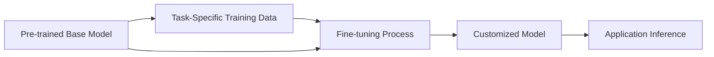
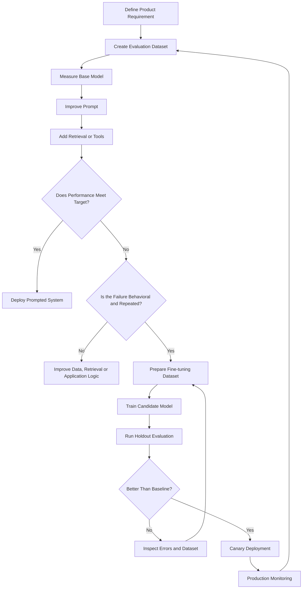
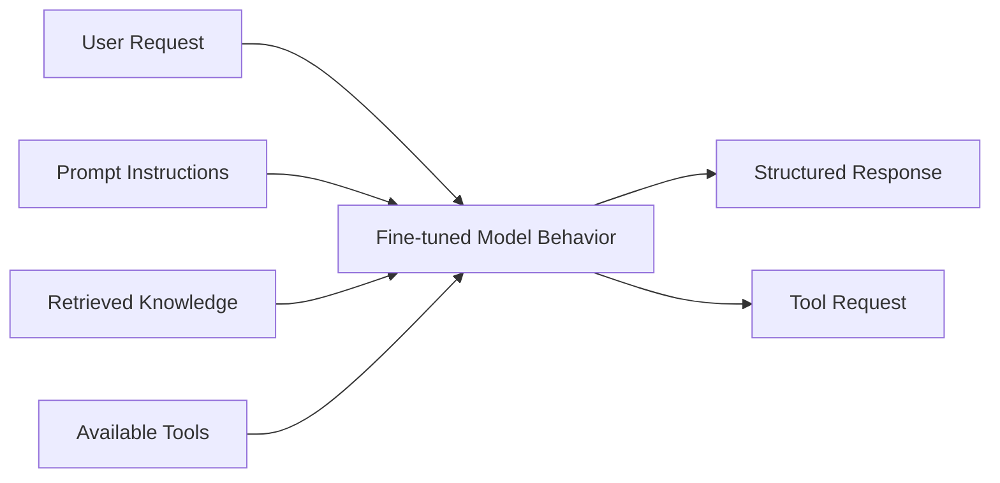
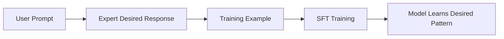
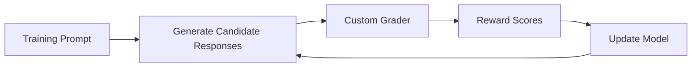
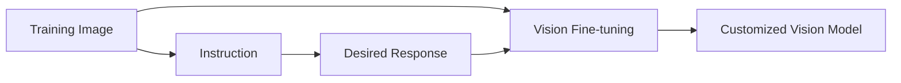
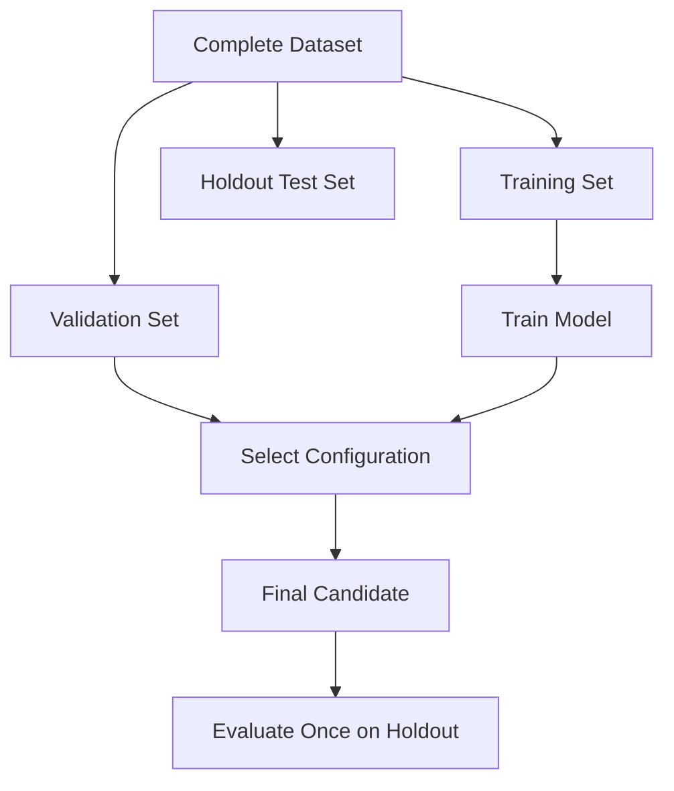
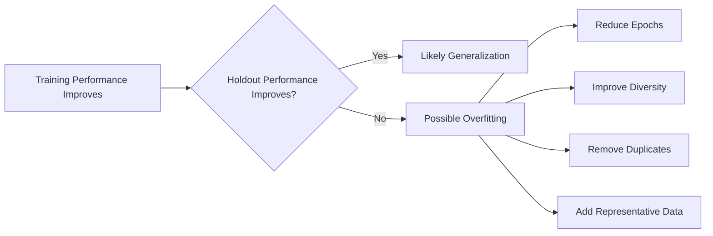
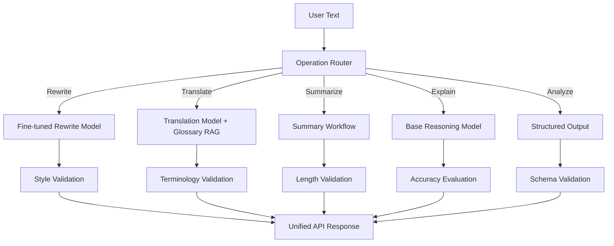

# 012 — Fine-tuning

**Course:** 02 — Model Platforms and Prompting
**Module:** Module 04 — OpenAI Platform and API
**Content Group:** Operations
**Roadmap Source:** OpenAI Platform and API / Operations
**Lesson Type:** API
**Lesson Order:** 012
**Suggested Duration:** 24 minutes

---

## 1. Summary

This lesson explains **fine-tuning** in the context of modern AI engineering.

Fine-tuning adapts a pre-trained model to perform a specific task, follow a particular style, produce a consistent format, or behave more reliably for a defined application.

Instead of sending many examples in every request, an engineering team creates a training dataset containing representative inputs and desired behavior. A training process then adjusts the model so that the desired behavior becomes more likely.

Fine-tuning can be useful for:

* Consistent tone and writing style
* Classification
* Nuanced translation
* Domain-specific response patterns
* Reliable function selection
* Repeated formatting behavior
* Correcting instruction-following failures
* Distilling the behavior of a larger model into a smaller model

Fine-tuning is not normally the first optimization step. A strong workflow begins with evaluation, prompt engineering, retrieval, and application-level validation before investing in model training. OpenAI’s documented optimization workflow combines evaluation, prompting, fine-tuning, and repeated measurement.

---

## 2. Current OpenAI Platform Status

> **Important platform note — July 18, 2026**

OpenAI is winding down its self-serve fine-tuning platform.

The current availability timeline states:

* Since **May 7, 2026**, organizations that had never previously used fine-tuning cannot create training jobs.
* Since **July 2, 2026**, job creation is unavailable to organizations that had not used a fine-tuned model for inference during the preceding 60 days.
* On **January 6, 2027**, active existing customers are scheduled to lose the ability to create new fine-tuning jobs.
* Existing fine-tuned models may continue to be used for inference until their underlying base models are deprecated.

Therefore, the API examples in this lesson apply only to organizations that remain eligible to create fine-tuning jobs.

The engineering concepts remain important because the same workflow applies to:

* Other hosted model providers
* Open-weight models
* Managed cloud training services
* LoRA and adapter training
* Internal model platforms
* Future model-customization products

Always verify current provider availability before planning a production fine-tuning project.

---

## 3. Learning Objectives

After completing this lesson, you should be able to:

1. Explain fine-tuning in your own words.
2. Distinguish fine-tuning from prompting, RAG, and tool calling.
3. Identify tasks that are suitable for fine-tuning.
4. Recognize tasks that should not use fine-tuning.
5. Explain supervised fine-tuning, DPO, RFT, and vision fine-tuning.
6. Prepare training data in JSONL format.
7. Separate training, validation, and holdout datasets.
8. Create and monitor a fine-tuning job where platform access is available.
9. Evaluate a fine-tuned model against a baseline.
10. Detect overfitting, data leakage, and behavior regressions.
11. Plan deployment, monitoring, versioning, and rollback.
12. Apply fine-tuning concepts to an AI Writing Assistant.

---

## 4. What Is Fine-tuning?

A general-purpose model has already been trained on a broad collection of data.

Fine-tuning performs additional training on a smaller, task-specific dataset.



Suppose a base model receives this request:

```text
Rewrite this support reply in our company style.
```

The base model may produce a reasonable answer, but the tone may vary between requests.

A fine-tuned model can learn recurring patterns such as:

* Start with a direct acknowledgment.
* Avoid excessive apologies.
* Use short paragraphs.
* Never promise unsupported refunds.
* End with one concrete next step.
* Use approved product terminology.

The goal is not to teach the model one response. The goal is to increase the probability that it follows the desired behavior across many related inputs.

---

## 5. Model Behavior Before and After Fine-tuning

### Before Fine-tuning

```text
We sincerely apologize for the inconvenience you have experienced.
Our dedicated support team will investigate this unfortunate issue
as quickly as possible.
```

### Desired Company Style

```text
Thanks for reporting this. We are checking the payment record now
and will update you within one business day.
```

### Training Example

```json
{
  "messages": [
    {
      "role": "system",
      "content": "Rewrite support replies using the Acme support style."
    },
    {
      "role": "user",
      "content": "Tell the customer we are investigating the payment issue."
    },
    {
      "role": "assistant",
      "content": "Thanks for reporting this. We are checking the payment record now and will update you within one business day."
    }
  ]
}
```

With enough consistent examples, the model can learn the target style more reliably.

---

## 6. The Model Optimization Cycle

Fine-tuning should be part of an iterative optimization process rather than a one-time training event.



OpenAI’s supervised fine-tuning guidance recommends four core stages:

1. Build a dataset that defines what good performance looks like.
2. Upload example prompts and desired outputs.
3. create a fine-tuning job.
4. Evaluate the resulting model.

The guidance explicitly recommends building evaluations before investing in fine-tuning.

---

## 7. When Fine-tuning Is Useful

Fine-tuning is most appropriate when the model repeatedly fails in a consistent and measurable way.

### Good Candidate: Consistent Style

```text
All customer replies must follow a recognizable brand voice.
```

### Good Candidate: Classification

```json
{
  "category": "billing_dispute",
  "priority": "high"
}
```

### Good Candidate: Specialized Translation Behavior

```text
Translate technical documentation while preserving approved
product terms and sentence structure.
```

### Good Candidate: Repeated Output Patterns

```text
Generate product descriptions using the same sections,
length and tone for thousands of products.
```

### Good Candidate: Tool-Calling Behavior

```text
Select search_docs for policy questions and avoid calling tools
for ordinary rewriting requests.
```

### Good Candidate: Model Distillation

A larger model produces high-quality examples, and those examples are used to customize a smaller model for lower-cost inference.

OpenAI documents supervised fine-tuning use cases including classification, nuanced translation, specific output formats, and correction of instruction-following problems. It also documents using outputs from a larger model to train a smaller model.

---

## 8. When Fine-tuning Is Not the Best Solution

### 8.1 Frequently Changing Knowledge

Question:

```text
What is our current refund policy?
```

A policy may change next week.

Use:

* RAG
* Document search
* Database lookup
* Function calling

Do not retrain a model every time a document changes.

---

### 8.2 Private Record Lookup

Question:

```text
What is the status of order 12345?
```

Use a database or API tool.

A model should not memorize individual customer records.

---

### 8.3 Deterministic Calculations

Task:

```text
Calculate tax using the official formula.
```

Use application code or a calculator tool.

---

### 8.4 Strict Output Structure

Task:

```text
Always return fields named summary, risks and next_actions.
```

Try Structured Outputs before fine-tuning.

A schema can enforce structure without training a custom model.

---

### 8.5 A Weak Prompt

Fine-tuning should not compensate for:

* Missing instructions
* Contradictory prompts
* Poor examples
* An undefined product requirement
* Incorrect retrieval
* Broken application logic

---

### 8.6 A Small Number of Rare Requests

Training and operating a custom model may not be justified when the feature is used only occasionally.

---

## 9. Prompting vs RAG vs Tools vs Fine-tuning

| Technique          | Primary Purpose                 | Changes Model Weights | Best For                                         |
| ------------------ | ------------------------------- | --------------------: | ------------------------------------------------ |
| Prompt engineering | Define behavior for a request   |                    No | Instructions, examples and constraints           |
| Structured Outputs | Enforce response structure      |                    No | Typed JSON and application contracts             |
| RAG                | Add external knowledge          |                    No | Current documents and cited answers              |
| Tool calling       | Access data or perform actions  |                    No | APIs, databases and workflows                    |
| Fine-tuning        | Change recurring model behavior |                   Yes | Style, classification and repeated task patterns |

A production application may combine all of them.



Example:

* Fine-tuning controls brand voice.
* RAG provides the latest refund policy.
* Tool calling retrieves the customer’s order.
* Structured Outputs return predictable fields.

---

## 10. Main Fine-tuning Methods

OpenAI’s documented fine-tuning methods include supervised fine-tuning, vision fine-tuning, Direct Preference Optimization, and Reinforcement Fine-tuning.

| Method                         | Training Signal                      | Best For                                       |
| ------------------------------ | ------------------------------------ | ---------------------------------------------- |
| Supervised Fine-tuning         | Correct example responses            | Format, style, classification and instructions |
| Direct Preference Optimization | Preferred vs non-preferred responses | Subjective quality, tone and style             |
| Reinforcement Fine-tuning      | Programmable reward or grader        | Complex, gradable reasoning tasks              |
| Vision Fine-tuning             | Image inputs with desired responses  | Specialized image understanding                |

---

## 11. Supervised Fine-tuning

**Supervised Fine-tuning**, or **SFT**, trains a model from examples of correct behavior.

Each example contains:

```text
input → desired output
```

Example:

```json
{
  "messages": [
    {
      "role": "system",
      "content": "Classify customer messages."
    },
    {
      "role": "user",
      "content": "I was charged twice for the same order."
    },
    {
      "role": "assistant",
      "content": "{\"category\":\"duplicate_charge\",\"priority\":\"high\"}"
    }
  ]
}
```

SFT is appropriate when reviewers can clearly write the desired answer.

### SFT Workflow



---

## 12. Direct Preference Optimization

**Direct Preference Optimization**, or **DPO**, trains from pairs of responses:

* One preferred response
* One non-preferred response

DPO is useful when quality is subjective and easier to express through comparison than through an exact numeric score.

Examples include:

* Friendlier tone
* More concise answers
* Better summaries
* More natural dialogue
* Better emphasis
* Preferred brand style

OpenAI’s DPO format includes an input, a preferred output, and a non-preferred output. Its documented implementation currently focuses on one-turn examples whose final messages are assistant outputs.

### Example DPO Record

```json
{
  "input": {
    "messages": [
      {
        "role": "user",
        "content": "Rewrite: We regret to inform you that your request cannot be processed."
      }
    ],
    "tools": [],
    "parallel_tool_calls": true
  },
  "preferred_output": [
    {
      "role": "assistant",
      "content": "We cannot process this request yet because the account information is incomplete."
    }
  ],
  "non_preferred_output": [
    {
      "role": "assistant",
      "content": "We deeply regret to inform you that, unfortunately, your request cannot be processed at this time."
    }
  ]
}
```

The preferred response is:

* More direct
* More informative
* Less repetitive
* Consistent with the target style

---

## 13. Reinforcement Fine-tuning

**Reinforcement Fine-tuning**, or **RFT**, trains a reasoning model using a grader that scores candidate responses.

Instead of supplying only one correct output, the system:

1. Samples multiple responses.
2. Scores each response.
3. Gives higher reward to better responses.
4. Updates the model toward higher-scoring behavior.
5. Repeats the process.



RFT is most useful when:

* The task has objective or strongly agreed-upon criteria.
* A reliable grader can score results.
* The base model already succeeds on some examples.
* Evaluation scores leave room for improvement.
* The model cannot receive high scores through lucky guessing.

OpenAI’s guidance states that RFT works best for unambiguous, gradable tasks where experts agree, the base model has some existing success, and evaluation scores are neither already perfect nor completely unsuccessful.

The reward can combine multiple criteria:

```text
total reward =
    0.50 × factual accuracy
  + 0.25 × schema correctness
  + 0.15 × citation support
  + 0.10 × conciseness
```

OpenAI’s RFT implementation uses custom graders to score candidate outputs and optimize the model toward higher-scoring results.

---

## 14. Vision Fine-tuning

Vision fine-tuning extends supervised fine-tuning with image inputs.

Possible use cases include:

* Specialized image classification
* Product inspection
* Visual quality control
* Document-layout interpretation
* Domain-specific screenshots
* Understanding industry-specific diagrams



OpenAI describes vision fine-tuning as supervised fine-tuning with image inputs to improve a model’s image understanding.

A schema-valid result still needs factual evaluation. Fine-tuning cannot make unreadable images clear or guarantee correct visual interpretation.

---

## 15. Training Data Format

Supervised fine-tuning data is commonly stored in **JSONL**, or JSON Lines, format.

Each line must contain one complete JSON object.

```jsonl
{"messages":[{"role":"system","content":"Rewrite in a concise professional style."},{"role":"user","content":"We would like to apologize for the delay that has occurred."},{"role":"assistant","content":"We apologize for the delay."}]}
{"messages":[{"role":"system","content":"Rewrite in a concise professional style."},{"role":"user","content":"At this point in time, the engineering team is currently investigating."},{"role":"assistant","content":"The engineering team is investigating."}]}
{"messages":[{"role":"system","content":"Rewrite in a concise professional style."},{"role":"user","content":"Please be advised that we will contact you at a later time."},{"role":"assistant","content":"We will contact you with an update."}]}
```

A `.jsonl` file differs from an ordinary JSON array.

### Incorrect JSON Array

```json
[
  {
    "messages": []
  },
  {
    "messages": []
  }
]
```

### Correct JSONL

```jsonl
{"messages":[]}
{"messages":[]}
```

OpenAI’s supervised fine-tuning documentation requires one complete JSON structure per line and currently requires at least 10 lines in a training file.

Ten examples may satisfy a technical minimum, but they are rarely sufficient to represent a complex production distribution.

---

## 16. Training Example Design

A high-quality training example should contain:

* A realistic input
* All context needed to answer
* A correct desired response
* Consistent instructions
* The same format used during inference
* No unsupported facts
* No accidental private data
* No contradictory labeling

### Good Example

```json
{
  "messages": [
    {
      "role": "system",
      "content": "Return a concise support response. Do not promise a refund."
    },
    {
      "role": "user",
      "content": "The customer reports a duplicate charge. The payment team has not reviewed it yet."
    },
    {
      "role": "assistant",
      "content": "Thanks for reporting the duplicate charge. Our payment team will review the transaction before confirming the available resolution."
    }
  ]
}
```

### Weak Example

```json
{
  "messages": [
    {
      "role": "user",
      "content": "Customer has a payment problem."
    },
    {
      "role": "assistant",
      "content": "Your full refund has been approved and will arrive tomorrow."
    }
  ]
}
```

The desired answer includes information absent from the input.

Training on such examples can teach the model to invent outcomes.

---

## 17. Data Quality Principles

### Correctness

Every desired response should satisfy the product requirement.

### Consistency

Reviewers should apply the same policy to similar cases.

### Diversity

Include different:

* Input lengths
* User styles
* Languages
* Edge cases
* Error cases
* Topics
* Difficulty levels

### Distribution Matching

Training data should resemble real production traffic.

If 60% of training examples are refusals but only 5% of real production requests should be refused, the resulting model may refuse too frequently.

### Complete Context

The example input must include every fact required for the desired answer.

### Quality Over Quantity

A smaller collection of carefully reviewed examples is usually more useful than a large collection of noisy examples.

OpenAI’s best-practice guidance emphasizes data balance, diversity, complete context, reviewer consistency, and the value of high-quality data over larger quantities of low-quality examples.

---

## 18. Dataset Splitting

Do not evaluate a model only on examples that were used for training.

A common split is:

```text
70–80% training
10–15% validation
10–20% holdout testing
```

The exact percentages depend on dataset size.

### Training Set

Used to update model behavior.

### Validation Set

Used during experimentation to monitor generalization and compare checkpoints or configurations.

### Holdout Test Set

Kept separate until final evaluation.



Avoid placing nearly identical examples in different splits.

Example leakage:

```text
Training:
Rewrite: We apologize for the payment delay.

Test:
Rewrite: We are sorry for the delay in payment.
```

These examples may be too similar to provide an honest generalization test.

---

## 19. Build the Evaluation Before Training

Before fine-tuning, create a baseline report.

### Example Baseline

```json
{
  "model": "base-model",
  "dataset_version": "writing-eval-v1",
  "examples": 200,
  "style_pass_rate": 0.71,
  "format_pass_rate": 0.93,
  "factual_support_rate": 0.89,
  "average_latency_ms": 1240,
  "average_input_tokens": 620,
  "average_output_tokens": 184
}
```

After training, run the same evaluation:

```json
{
  "model": "fine-tuned-candidate-v1",
  "dataset_version": "writing-eval-v1",
  "examples": 200,
  "style_pass_rate": 0.88,
  "format_pass_rate": 0.96,
  "factual_support_rate": 0.87,
  "average_latency_ms": 990,
  "average_input_tokens": 310,
  "average_output_tokens": 176
}
```

The result is mixed:

* Style improved.
* Format improved.
* Prompt size decreased.
* Factual support became slightly worse.

A team must decide whether the regression is acceptable or whether the dataset requires revision.

---

## 20. Evaluation Metrics

### Task Metrics

```text
classification accuracy
precision
recall
F1 score
exact match
JSON schema pass rate
tool-selection accuracy
```

### Writing Metrics

```text
style adherence
tone preference
clarity
conciseness
meaning preservation
grammar quality
terminology compliance
```

### Safety Metrics

```text
unsupported claim rate
refusal accuracy
sensitive-data leakage
unsafe completion rate
prompt-injection resistance
```

### Operational Metrics

```text
latency
input tokens
output tokens
cost per request
error rate
timeout rate
retry rate
```

### Business Metrics

```text
editor acceptance rate
human correction time
support resolution time
customer satisfaction
conversion rate
task completion rate
```

No single training-loss number proves that a model is ready for production.

---

## 21. Creating a Fine-tuning Job

The following workflow applies only to an organization that remains eligible to use OpenAI fine-tuning.

### Step 1: Upload the Dataset

```python
from pathlib import Path

from openai import OpenAI

client = OpenAI()

dataset_path = Path("writing-style-training.jsonl")

with dataset_path.open("rb") as training_data:
    uploaded_file = client.files.create(
        file=training_data,
        purpose="fine-tune",
    )

print(uploaded_file.id)
```

Fine-tuning files must be uploaded with the `fine-tune` purpose.

---

### Step 2: Create the Job

Use a model ID that is currently supported and available to the organization.

```python
import os

base_model = os.environ["FINE_TUNE_BASE_MODEL"]

job = client.fine_tuning.jobs.create(
    training_file=uploaded_file.id,
    model=base_model,
    suffix="writing-style-v1",
)

print(job.id)
print(job.status)
```

A fine-tuning job requires a training file and a supported base model. Supervised fine-tuning is the default method when no alternative method is specified.

Do not hard-code an old model snapshot without checking current support and deprecation status.

---

### Step 3: Monitor the Job

```python
job_status = client.fine_tuning.jobs.retrieve(job.id)

print(job_status.status)
print(job_status.error)
print(job_status.fine_tuned_model)
```

Possible job states include:

```text
validating_files
queued
running
succeeded
failed
cancelled
```

The API also supports listing job events and checkpoints.

---

### Step 4: Use the Fine-tuned Model

After a successful job:

```python
completed_job = client.fine_tuning.jobs.retrieve(job.id)

if completed_job.status != "succeeded":
    raise RuntimeError(
        f"Fine-tuning job is not ready: {completed_job.status}"
    )

if not completed_job.fine_tuned_model:
    raise RuntimeError("No fine-tuned model ID was returned.")

response = client.responses.create(
    model=completed_job.fine_tuned_model,
    input=(
        "Rewrite this message using our support style: "
        "We regret to inform you that the payment review is delayed."
    ),
)

print(response.output_text)
```

A completed job returns a fine-tuned model identifier that can be used for inference like another model ID.

---

## 22. Validation and Error Handling

The training pipeline should validate the dataset before upload.

```python
from __future__ import annotations

import json
from pathlib import Path
from typing import Any


def validate_example(example: dict[str, Any], line_number: int) -> None:
    messages = example.get("messages")

    if not isinstance(messages, list) or not messages:
        raise ValueError(
            f"Line {line_number}: messages must be a non-empty list."
        )

    if messages[-1].get("role") != "assistant":
        raise ValueError(
            f"Line {line_number}: final message must be assistant."
        )

    for index, message in enumerate(messages):
        if message.get("role") not in {
            "system",
            "developer",
            "user",
            "assistant",
            "tool",
        }:
            raise ValueError(
                f"Line {line_number}, message {index}: invalid role."
            )

        content = message.get("content")

        if not isinstance(content, str) or not content.strip():
            raise ValueError(
                f"Line {line_number}, message {index}: "
                "content must be non-empty text."
            )


def validate_jsonl(path: Path) -> int:
    example_count = 0

    with path.open("r", encoding="utf-8") as file:
        for line_number, line in enumerate(file, start=1):
            if not line.strip():
                continue

            try:
                example = json.loads(line)
            except json.JSONDecodeError as exc:
                raise ValueError(
                    f"Line {line_number}: invalid JSON: {exc}"
                ) from exc

            if not isinstance(example, dict):
                raise ValueError(
                    f"Line {line_number}: root value must be an object."
                )

            validate_example(example, line_number)
            example_count += 1

    if example_count < 10:
        raise ValueError(
            "The dataset must contain at least 10 examples."
        )

    return example_count


count = validate_jsonl(Path("writing-style-training.jsonl"))
print(f"Validated {count} examples.")
```

Production validation should additionally check:

* Duplicate examples
* Unsupported roles
* Excessively long examples
* Missing instructions
* Personally identifiable information
* Secrets and credentials
* Contradictory labels
* Invalid tool schemas
* Data leakage between splits

---

## 23. Hyperparameters

Common fine-tuning hyperparameters include:

### Epochs

One epoch means one complete pass through the training dataset.

Too few epochs may cause underfitting.

Too many epochs may cause:

* Memorization
* Reduced generalization
* Stronger unwanted patterns
* Repetitive output
* Catastrophic behavior changes

### Batch Size

The number of examples used before a model update.

### Learning-Rate Multiplier

Controls the size of model-weight updates.

A value that is too high may cause unstable or excessive behavior change.

A value that is too low may produce little improvement.

OpenAI’s fine-tuning API supports automatic selection of batch size, learning-rate multiplier, and epoch count, while also allowing eligible users to configure them through the selected method.

Start with automatic settings unless evaluation evidence suggests a specific adjustment.

---

## 24. Overfitting

A model is overfitted when it performs well on training examples but poorly on new inputs.

### Symptoms

* Repeating phrases from training data
* Producing nearly identical answers
* Failing on unfamiliar wording
* Copying training-specific names
* Excessively following one response pattern
* Higher training accuracy but weaker holdout performance



Use holdout results rather than training loss alone.

---

## 25. Fine-tuning and Prompt Design

Fine-tuning does not eliminate prompts.

A fine-tuned model still benefits from:

* Clear runtime instructions
* User-specific context
* Current information
* Output schemas
* Safety rules
* Tool definitions

For smaller datasets, OpenAI recommends keeping the effective instructions that worked before training inside each training example. Removing repeated instructions may require more examples for the model to learn the intended behavior.

### Before Fine-tuning

```text
You are a support-writing assistant.

Rules:
1. Use no more than 80 words.
2. Begin with a direct acknowledgment.
3. Do not use “sincerely apologize.”
4. Do not promise refunds.
5. End with a concrete next step.

Examples:
...
```

### After Fine-tuning

```text
Rewrite this response using the approved support style.
```

One benefit of successful fine-tuning can be shorter prompts, reducing token use and sometimes latency at scale.

---

## 26. Cost Analysis

Fine-tuning introduces several cost categories.

### Dataset Creation Cost

```text
human writing
human review
data cleaning
labeling
quality assurance
privacy review
```

### Training Cost

```text
training tokens
training duration
grader usage for reinforcement methods
multiple experiments
```

### Inference Cost

```text
input tokens
output tokens
request volume
fine-tuned model pricing
```

### Maintenance Cost

```text
new data collection
retraining
evaluation
model migrations
deprecation handling
monitoring
```

### Total Cost of Ownership

```text
total cost =
    dataset preparation
  + training experiments
  + inference
  + evaluation
  + maintenance
  + migration work
```

A fine-tuned model may reduce per-request prompt tokens, but that saving must be compared with training and maintenance costs.

---

## 27. Safety and Privacy

Before training, inspect every example for:

* Personal data
* Payment data
* Medical information
* Authentication credentials
* Private business information
* Copyright-sensitive content
* Secrets
* Unsupported claims
* Harmful patterns

### Data-Minimization Example

Avoid:

```json
{
  "user_email": "real-person@example.com",
  "full_name": "Real Person",
  "account_number": "123456789",
  "message": "..."
}
```

Prefer:

```json
{
  "user_email": "<EMAIL>",
  "full_name": "<CUSTOMER_NAME>",
  "account_number": "<ACCOUNT_ID>",
  "message": "..."
}
```

A fine-tuned model can learn unwanted behavior from unsafe or careless examples.

OpenAI documents safety evaluation of completed fine-tuning jobs before production use, but application teams remain responsible for their own domain-specific testing, monitoring, and controls.

---

## 28. Deployment Strategy

Do not immediately route all production traffic to a new model.

### Recommended Rollout


At every stage, compare:

* Quality
* Safety
* Latency
* Token usage
* Cost
* Error rate
* Human correction rate

### Rollback Conditions

Rollback when:

```text
quality falls below threshold
unsafe outputs increase
latency exceeds target
cost increases unexpectedly
refusal behavior becomes incorrect
critical formats break
base model is deprecated
```

Keep the previous model and prompt configuration available during rollout.

---

## 29. Model and Dataset Versioning

Treat the model, prompt, and dataset as versioned artifacts.

```json
{
  "feature": "writing_assistant",
  "base_model": "provider-base-model-snapshot",
  "fine_tuned_model": "writing-style-v3",
  "training_dataset": "writing-training-v5",
  "validation_dataset": "writing-validation-v3",
  "holdout_dataset": "writing-holdout-v2",
  "runtime_prompt": "writing-prompt-v7",
  "evaluation_suite": "writing-eval-v4"
}
```

A model name alone is not enough to reproduce an experiment.

Record:

* Dataset hash
* Creation date
* Data sources
* Reviewer names or roles
* Training method
* Hyperparameters
* Random seed
* Base model snapshot
* Evaluation results
* Approval status

---

## 30. Monitoring in Production

Track model quality after deployment.

### Operational Log

```json
{
  "request_id": "request_001",
  "model_version": "writing-style-v3",
  "prompt_version": "writing-prompt-v7",
  "latency_ms": 920,
  "input_tokens": 218,
  "output_tokens": 106,
  "retry_count": 0,
  "status": "completed",
  "schema_valid": true,
  "moderation_flagged": false,
  "user_feedback": null
}
```

### Production Metrics

```text
requests per day
success rate
latency P50 and P95
input and output tokens
cost per request
format pass rate
human edit rate
user acceptance rate
refusal rate
safety incident rate
```

### Drift Indicators

* New request types appear.
* Product terminology changes.
* User language distribution changes.
* The model receives longer inputs.
* Business rules change.
* Quality decreases for one domain.

Production failures should become new evaluation cases before they become training examples.

---

## 31. AI Writing Assistant Case Study

The related project is an AI Writing Assistant with:

```text
summarize
rewrite
translate
explain
analyze
return JSON
```

### Possible Fine-tuning Goal

Improve rewrite consistency across:

* Professional tone
* Friendly tone
* Concise tone
* Technical documentation
* Customer-support messages

### Architecture



Not every operation needs the fine-tuned model.

A specialized model may be used only for rewriting, while other operations continue using a general model.

---

## 32. Example Training Dataset for Rewriting

```jsonl
{"messages":[{"role":"system","content":"Rewrite text in a concise professional style. Preserve meaning and do not invent facts."},{"role":"user","content":"We are currently in the process of reviewing the issue and we will contact you again at a later point in time."},{"role":"assistant","content":"We are reviewing the issue and will contact you with an update."}]}
{"messages":[{"role":"system","content":"Rewrite text in a concise professional style. Preserve meaning and do not invent facts."},{"role":"user","content":"Due to the fact that testing has not been completed, the release may potentially experience a delay."},{"role":"assistant","content":"The release may be delayed because testing is incomplete."}]}
{"messages":[{"role":"system","content":"Rewrite text in a concise professional style. Preserve meaning and do not invent facts."},{"role":"user","content":"It is important to note that the customer has not yet provided the required information."},{"role":"assistant","content":"The customer has not provided the required information."}]}
```

These examples teach:

* Conciseness
* Meaning preservation
* Removal of filler
* No invented information

They do not teach current company facts. Those should remain in prompts, retrieval systems, or tools.

---

## 33. Experiment Design

Compare at least three systems:

### Candidate A — Base Model

```text
base model + short prompt
```

### Candidate B — Prompted Model

```text
base model + detailed prompt + examples
```

### Candidate C — Fine-tuned Model

```text
fine-tuned model + short prompt
```

### Benchmark Table

| Metric                  |  Base | Prompted | Fine-tuned |
| ----------------------- | ----: | -------: | ---------: |
| Style adherence         |   62% |      84% |        91% |
| Meaning preservation    |   88% |      93% |        92% |
| Format validity         |   90% |      98% |        98% |
| Average input tokens    |   160 |      820 |        210 |
| Average latency         | 1.1 s |    1.5 s |      1.0 s |
| Cost per 1,000 requests |     — |        — |          — |

The fine-tuned model should not be selected only because it has the highest style score. Review all critical metrics.

---

## 34. Common Mistakes

### Mistake 1: Fine-tuning Before Creating an Evaluation

Without a baseline, you cannot prove improvement.

---

### Mistake 2: Using Fine-tuning as a Knowledge Database

Use retrieval or tools for changing facts.

---

### Mistake 3: Training on Model-Generated Data Without Review

Synthetic data may contain:

* Hallucinations
* Repetitive phrasing
* Hidden bias
* Incorrect reasoning
* Style artifacts

Human review or reliable automated validation is still necessary.

---

### Mistake 4: Using Inconsistent Labels

If reviewers disagree, the model receives a noisy training signal.

---

### Mistake 5: Mixing Training and Test Data

This produces misleading evaluation results.

---

### Mistake 6: Training Only on Easy Cases

The model may still fail on:

* Ambiguous requests
* Long inputs
* Missing context
* Multilingual text
* Adversarial instructions
* Edge cases

---

### Mistake 7: Ignoring Negative Behavior

Include examples showing:

* When to refuse
* When to ask for missing information
* When not to call a tool
* When to return `null`
* When evidence is insufficient

---

### Mistake 8: Assuming Fine-tuning Guarantees JSON Validity

Use Structured Outputs and schema validation.

---

### Mistake 9: Ignoring Model Deprecation

A fine-tuned model depends on its base model lifecycle.

---

### Mistake 10: Deploying Without Rollback

Keep a tested previous version available.

---

### Mistake 11: Evaluating Only Training Loss

Measure real task and business outcomes.

---

### Mistake 12: Ignoring Current Platform Availability

As of July 18, 2026, OpenAI self-serve fine-tuning is no longer generally available to new or inactive organizations.

---

## 35. Practical Exercise

Design a fine-tuning experiment for the AI Writing Assistant.

### Goal

Improve concise professional rewriting while preserving the original meaning.

### Input

```text
At this particular point in time, we are currently unable to
provide a final answer because the engineering team is still
in the process of conducting an investigation.
```

### Expected Output

```text
We cannot provide a final answer yet because the engineering
team is still investigating.
```

### Requirements

1. Define a measurable quality target.
2. Create at least 50 reviewed examples for the experiment.
3. Include normal and difficult inputs.
4. Create separate training, validation, and holdout sets.
5. Validate every JSONL record.
6. Remove personal and sensitive information.
7. Measure the base model before training.
8. Compare the base, prompted, and customized approaches.
9. Track style adherence and meaning preservation.
10. Track tokens, latency, and estimated cost.
11. Test prompt-injection inputs.
12. Document deployment and rollback criteria.
13. Verify whether the selected provider currently supports new training jobs.

The exercise may be completed as a dataset-and-evaluation design even when training access is unavailable.

---

## 36. Suggested Project Structure

```text
fine-tuning-experiment/
├── README.md
├── data/
│   ├── raw_examples.jsonl
│   ├── training_v1.jsonl
│   ├── validation_v1.jsonl
│   └── holdout_v1.jsonl
├── schemas/
│   └── writing_example.schema.json
├── scripts/
│   ├── validate_dataset.py
│   ├── upload_dataset.py
│   ├── create_job.py
│   ├── monitor_job.py
│   └── run_evaluation.py
├── evals/
│   ├── rubric.md
│   ├── expected_results.jsonl
│   └── benchmark_results.csv
├── reports/
│   └── experiment_v1.md
└── config/
    └── experiment.yaml
```

---

## 37. Experiment Configuration

```yaml
experiment_name: writing-style-v1
task: concise_professional_rewrite

base_model: ${FINE_TUNE_BASE_MODEL}
training_method: supervised

datasets:
  training: data/training_v1.jsonl
  validation: data/validation_v1.jsonl
  holdout: data/holdout_v1.jsonl

metrics:
  - style_adherence
  - meaning_preservation
  - unsupported_claim_rate
  - format_pass_rate
  - input_tokens
  - output_tokens
  - latency_ms

deployment:
  minimum_style_adherence: 0.90
  minimum_meaning_preservation: 0.95
  maximum_unsupported_claim_rate: 0.01
  canary_traffic_percent: 5
```

Configuration files make experiments easier to reproduce and review.

---

## 38. Production Checklist

### Problem Definition

* [ ] The target behavior is clearly defined.
* [ ] The failure is repeated and measurable.
* [ ] Prompting has already been tested.
* [ ] RAG and tools have been considered.
* [ ] Structured Outputs have been considered.
* [ ] Fine-tuning is expected to improve behavior rather than update knowledge.

### Platform Availability

* [ ] Current fine-tuning availability has been verified.
* [ ] The selected organization is eligible to create jobs.
* [ ] The base model currently supports training.
* [ ] The base model’s deprecation status has been reviewed.
* [ ] An alternative provider or approach has been considered.

### Dataset

* [ ] Examples represent production traffic.
* [ ] Desired responses are correct.
* [ ] Instructions are consistent.
* [ ] Examples include all required context.
* [ ] Edge cases are included.
* [ ] Duplicate examples are removed.
* [ ] Sensitive information is removed.
* [ ] Reviewer agreement has been measured.
* [ ] Training and test data are separated.
* [ ] JSONL validation passes.

### Evaluation

* [ ] A base-model baseline exists.
* [ ] A prompted-model baseline exists.
* [ ] The holdout set was not used for training.
* [ ] Task metrics are defined.
* [ ] Safety metrics are defined.
* [ ] Latency and token usage are recorded.
* [ ] Business metrics are recorded.
* [ ] Regressions are reviewed manually.

### Training

* [ ] The training method matches the task.
* [ ] Hyperparameters are documented.
* [ ] Job status and errors are monitored.
* [ ] Checkpoints are compared where available.
* [ ] Training cost is recorded.
* [ ] Dataset and model versions are recorded.

### Deployment

* [ ] Offline evaluation passes.
* [ ] Shadow testing is complete.
* [ ] Canary traffic is configured.
* [ ] Rollback criteria are defined.
* [ ] The previous model remains available.
* [ ] Production logs include model and prompt versions.
* [ ] User feedback is collected.
* [ ] Drift monitoring is active.

---

## 39. Completion Checklist

You have completed this lesson when:

* [ ] You can explain fine-tuning in one or two minutes.
* [ ] You can distinguish fine-tuning from prompting and RAG.
* [ ] You can identify an appropriate fine-tuning use case.
* [ ] You can explain SFT, DPO, RFT, and vision fine-tuning.
* [ ] You understand JSONL training data.
* [ ] You can design high-quality training examples.
* [ ] You can separate training, validation, and holdout data.
* [ ] You can define a baseline evaluation.
* [ ] You can explain overfitting and data leakage.
* [ ] You can create a training job where platform access is available.
* [ ] You can monitor and evaluate a candidate model.
* [ ] You can design a canary deployment and rollback plan.
* [ ] You understand the current OpenAI fine-tuning availability limitations.
* [ ] You have created a demo, dataset, evaluation report, or portfolio artifact.

---

## 40. Related Outcome

> Optimize LLM applications through evaluation, prompting, retrieval, tools, structured outputs, and model customization while managing quality, tokens, cost, latency, safety, deployment, and model lifecycle.

---

## 41. Related Project

### Project 3 — AI Writing Assistant

Build an assistant supporting:

```text
summarize
rewrite
translate
explain
analyze
return structured output
```

Possible fine-tuning artifact:

```text
A customized rewrite model that consistently applies an approved
writing style while preserving meaning and avoiding unsupported claims.
```

Suggested portfolio deliverables:

* Training-data specification
* JSONL validator
* Reviewed example dataset
* Evaluation rubric
* Baseline benchmark
* Fine-tuning API script, where access is available
* Cost and latency comparison
* Error-analysis report
* Deployment plan
* Rollback plan
* Model-card document
* Platform-availability note

---

## 42. Key Takeaways

1. Fine-tuning changes recurring model behavior by training on task-specific data.
2. It should follow evaluation and prompt engineering rather than replace them.
3. Use RAG or tools for current and private factual information.
4. Use Structured Outputs for strict response schemas.
5. SFT learns from correct examples.
6. DPO learns from preferred and non-preferred response pairs.
7. RFT learns from programmable grader rewards.
8. Vision fine-tuning adapts image-understanding behavior.
9. Training data must be correct, consistent, diverse, and representative.
10. Keep training, validation, and holdout datasets separate.
11. Evaluate task quality, safety, latency, tokens, cost, and business impact.
12. High-quality data is more valuable than a larger noisy dataset.
13. Fine-tuned models still require prompts, validation, monitoring, and safety controls.
14. Deploy gradually and maintain a rollback path.
15. Track model, prompt, dataset, and evaluation versions.
16. Always verify the provider’s current training availability and deprecation timeline.
17. As of July 18, 2026, OpenAI’s self-serve fine-tuning platform is being wound down and is unavailable for new or inactive organizations.

---

# Bài luyện tập

## Mục tiêu


## Đề bài


## Yêu cầu hoàn thành

- [ ] 
- [ ] 
- [ ] 

## Kết quả / lời giải


## Ghi chú
