# 013 — Managing Tokens

**Course:** 02 — Model Platforms and Prompting
**Module:** Module 04 — OpenAI Platform and API
**Content Group:** Operations
**Roadmap Source:** OpenAI Platform and API / Operations
**Lesson Type:** API
**Lesson Order:** 013
**Suggested Duration:** 24 minutes

---

## 1. Summary

This lesson explains **token management** in modern AI applications.

Language models do not process text as complete words or characters. They divide input and output into smaller units called **tokens**. Tokens affect:

* Whether a request fits inside the model’s context window
* API cost
* Response length
* Latency
* Rate-limit consumption
* Conversation memory
* Retrieval size
* Tool-calling overhead
* Prompt-caching efficiency

A production AI application should not send unlimited text to a model and hope that the request succeeds. It should define a token budget, estimate input size, reserve space for the response, monitor actual usage, and reduce unnecessary context.

The Responses API reports input tokens, cached input tokens, output tokens, reasoning tokens, and total token usage. It also allows applications to set an output-token limit and choose whether an oversized input should fail or be automatically truncated.

---

## 2. Learning Objectives

After completing this lesson, you should be able to:

1. Explain what tokens are.
2. Distinguish tokens from words and characters.
3. Identify input, cached-input, output, and reasoning tokens.
4. Explain a model’s context window.
5. Create a token budget for an LLM request.
6. Estimate tokens before sending a request.
7. read actual token usage from an API response.
8. Set a maximum output-token limit.
9. Detect responses stopped by a token limit.
10. Manage token growth in multi-turn conversations.
11. Reduce tokens in RAG and tool-calling workflows.
12. Structure prompts for prompt caching.
13. Calculate approximate request cost.
14. Track token usage by feature, model, and user.
15. Build token controls for an AI Writing Assistant.

---

## 3. What Is a Token?

A token is a unit of text processed by a language model.

A token may represent:

* A complete word
* Part of a word
* Punctuation
* Whitespace
* A number
* A code fragment
* Part of a non-English word

For example, a tokenizer might divide a sentence conceptually as follows:

```text
Input:
Managing tokens is important.

Possible tokenization:
["Managing", " tokens", " is", " important", "."]
```

The exact tokenization depends on the tokenizer and model.

Tokens are not equivalent to words:

```text
"AI"                  → may be one token
"unbelievable"        → may be several tokens
"2026-07-18"          → may be several tokens
"Xin chào Việt Nam"   → token count depends on the tokenizer
```

OpenAI describes tokens as the building blocks of text processed by its models. The official `tiktoken` library or tokenizer can be used to inspect how text is divided for supported models.

---

## 4. Why Tokens Matter

Token usage affects four major operational concerns.

### 4.1 Context Capacity

Every model has a maximum context window.

A request must fit:

```text
instructions
+ user input
+ conversation history
+ retrieved documents
+ tool definitions
+ tool results
+ generated output
+ internal reasoning allowance
```

---

### 4.2 Cost

Text-model pricing is commonly based on:

* Input tokens
* Cached input tokens
* Output tokens

Some tools or modalities may introduce additional pricing dimensions.

---

### 4.3 Latency

Larger inputs generally require more processing.

Longer generated outputs also increase the time required to finish a response.

---

### 4.4 Rate Limits

API usage may be constrained by limits such as:

```text
requests per minute
tokens per minute
tokens per day
batch queue tokens
```

A small number of very large requests can consume a token-per-minute allowance even when the request-per-minute allowance has not been reached.

---

## 5. Token Categories

### 5.1 Input Tokens

Input tokens include content sent to the model, such as:

```text
developer instructions
system instructions
user messages
assistant history
retrieved documents
function definitions
tool results
image representations
file content
```

Example:

```json
{
  "input_tokens": 1840
}
```

---

### 5.2 Cached Input Tokens

Cached input tokens are tokens reused from a matching prompt prefix.

Example:

```json
{
  "input_tokens": 1840,
  "input_tokens_details": {
    "cached_tokens": 1024
  }
}
```

Cached tokens are part of the total input-token count. Do not add them to `input_tokens` again when calculating the total number of input tokens.

---

### 5.3 Output Tokens

Output tokens include tokens generated by the model.

Depending on the request and model, they may include:

* Visible text
* Structured JSON
* Tool-call arguments
* Internal reasoning-token usage

Example:

```json
{
  "output_tokens": 420
}
```

---

### 5.4 Reasoning Tokens

Some reasoning models report reasoning tokens as a breakdown of output usage:

```json
{
  "output_tokens": 420,
  "output_tokens_details": {
    "reasoning_tokens": 260
  }
}
```

Reasoning tokens are normally included within the reported output-token total. Do not automatically add `reasoning_tokens` to `output_tokens` again.

The Responses API defines `max_output_tokens` as an upper bound that includes both visible output and reasoning tokens.

---

### 5.5 Total Tokens

```text
total tokens = input tokens + output tokens
```

Example:

```json
{
  "input_tokens": 1840,
  "output_tokens": 420,
  "total_tokens": 2260
}
```

The Responses API usage object reports input, output, cached-input, reasoning, and total-token information.

---

## 6. Token Flow Through an Application

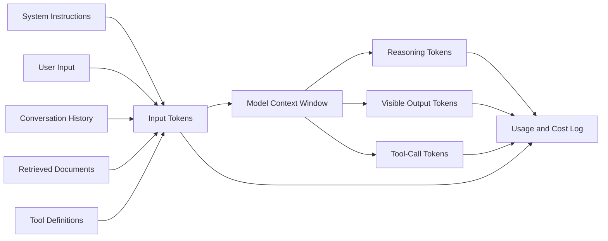

A token budget must account for the entire request, not only the latest user message.

---

## 7. Understanding the Context Window

The **context window** is the maximum amount of tokenized information the model can process in one request.

A simplified equation is:

```text
input tokens + maximum possible output tokens ≤ context window
```

A more practical equation is:

```text
instructions
+ conversation history
+ user input
+ retrieved context
+ tool definitions
+ reserved output
+ safety margin
≤ context window
```

Suppose a model has a hypothetical 32,000-token context window and the application reserves 4,000 output tokens:

```text
maximum theoretical input =
    32,000 - 4,000
    = 28,000 tokens
```

If the application also reserves a 1,000-token safety margin:

```text
safe input budget =
    32,000 - 4,000 - 1,000
    = 27,000 tokens
```

OpenAI’s Realtime documentation gives the same general principle: output capacity must be reserved from the total context window before determining how much conversation input can remain.

---

## 8. A Practical Token Budget

Do not allocate the entire context window to user content.

Example budget:

| Component                         | Token Budget |
| --------------------------------- | -----------: |
| Developer and system instructions |        1,200 |
| Tool definitions                  |        1,500 |
| Conversation summary              |        1,000 |
| Recent conversation turns         |        4,000 |
| Retrieved documents               |        8,000 |
| Current user message              |        2,000 |
| Reserved model output             |        4,000 |
| Safety margin                     |        1,000 |
| **Total**                         |   **22,700** |

The remaining context can support unexpected variation, longer tool results, or tokenizer differences.

### Budget Formula

```text
available dynamic input =
    context window
  - fixed instructions
  - tool definitions
  - reserved output
  - safety margin
```

Then divide the dynamic budget:

```text
dynamic input =
    conversation history
  + current user input
  + retrieved context
  + tool results
```

---

## 9. Hard Limit vs Target Limit

Applications should define two limits.

### Hard Limit

The maximum allowed by the selected model.

```text
hard context limit = model context window
```

### Target Limit

A lower internal threshold used by the application.

```text
target limit = hard limit - output reserve - safety margin
```

Example:

```text
hard limit:       32,000
output reserve:    4,000
safety margin:     1,000
target input:     27,000
```

A target limit creates room for:

* Token-estimation differences
* Tool arguments
* Message-format overhead
* Reasoning tokens
* Unexpectedly long retrieved content

---

## 10. Estimating Tokens Before a Request

OpenAI provides the open-source `tiktoken` tokenizer for counting tokens in text. Different models may use different encodings, so the encoding should match the selected model whenever possible.

### Installation

```bash
pip install tiktoken
```

### Basic Counter

```python
import tiktoken


def count_text_tokens(text: str, model: str) -> int:
    try:
        encoding = tiktoken.encoding_for_model(model)
    except KeyError:
        # Fallback for a model not yet recognized by the installed package.
        encoding = tiktoken.get_encoding("o200k_base")

    return len(encoding.encode(text))


model = "gpt-5.6"
text = "Managing tokens is essential for production AI systems."

print(count_text_tokens(text, model))
```

---

## 11. Preflight Counts Are Estimates

Counting the visible text does not always produce the exact final API input count.

Additional tokens may come from:

* Message-role formatting
* Tool definitions
* JSON Schemas
* Structured Output schemas
* Image metadata
* File content
* Model-specific request formatting
* Conversation-state items

Therefore:

```text
local tokenizer count = useful preflight estimate
API response usage     = authoritative completed-request measurement
```

Use preflight counting to prevent oversized requests, but use the response’s `usage` data for billing logs and production analytics.

---

## 12. Counting Multiple Message Fields

A simple application can serialize relevant text fields before estimating tokens.

```python
from typing import Any

import tiktoken


def get_encoding(model: str) -> tiktoken.Encoding:
    try:
        return tiktoken.encoding_for_model(model)
    except KeyError:
        return tiktoken.get_encoding("o200k_base")


def estimate_message_tokens(
    messages: list[dict[str, Any]],
    model: str,
) -> int:
    encoding = get_encoding(model)
    total = 0

    for message in messages:
        role = str(message.get("role", ""))
        content = message.get("content", "")

        total += len(encoding.encode(role))

        if isinstance(content, str):
            total += len(encoding.encode(content))
        else:
            # Useful estimate for structured or multimodal content.
            total += len(
                encoding.encode(
                    str(content)
                )
            )

        # Reserve a small amount for message formatting.
        total += 4

    return total
```

This is useful for application-level budgeting, but it should not be treated as an exact reproduction of server-side accounting.

---

## 13. Counting Tool Definitions

Tool schemas consume input tokens on every request in which they are included.

Example tool:

```json
{
  "type": "function",
  "name": "search_docs",
  "description": "Search internal documents for relevant information.",
  "parameters": {
    "type": "object",
    "properties": {
      "query": {
        "type": "string"
      },
      "top_k": {
        "type": "integer"
      }
    },
    "required": [
      "query",
      "top_k"
    ],
    "additionalProperties": false
  },
  "strict": true
}
```

A large agent with dozens of verbose tools may spend thousands of tokens describing capabilities before processing the user’s request.

### Better Strategy

Expose only relevant tools:

```python
def select_tools(intent: str) -> list[dict]:
    if intent == "document_question":
        return [SEARCH_DOCS_TOOL]

    if intent == "save_draft":
        return [SAVE_DRAFT_TOOL]

    return []
```

Do not attach every application tool to every request.

---

## 14. Reading Actual Usage from the Responses API

```python
import os

from openai import OpenAI

client = OpenAI()

response = client.responses.create(
    model=os.getenv("OPENAI_MODEL", "gpt-5.6"),
    input="Explain token budgeting in three short paragraphs.",
    max_output_tokens=400,
)

usage = response.usage

if usage is None:
    raise RuntimeError("The response did not include usage information.")

cached_tokens = 0
reasoning_tokens = 0

if usage.input_tokens_details is not None:
    cached_tokens = (
        usage.input_tokens_details.cached_tokens or 0
    )

if usage.output_tokens_details is not None:
    reasoning_tokens = (
        usage.output_tokens_details.reasoning_tokens or 0
    )

print(
    {
        "input_tokens": usage.input_tokens,
        "cached_input_tokens": cached_tokens,
        "output_tokens": usage.output_tokens,
        "reasoning_tokens": reasoning_tokens,
        "total_tokens": usage.total_tokens,
    }
)
```

The exact SDK object shape may evolve, so confirm field names against the installed SDK version and current API reference.

---

## 15. Limiting Output Tokens

Use `max_output_tokens` to set an upper bound on generated output.

```python
response = client.responses.create(
    model="gpt-5.6",
    input="Summarize the following report.",
    max_output_tokens=500,
)
```

This helps control:

* Cost
* Maximum response length
* Latency
* Context-window reservation
* Unexpectedly verbose output

The limit includes visible output and reasoning tokens where reasoning is used.

A 500-token limit does not guarantee that the user receives 500 visible tokens. Some of the budget may be consumed by reasoning or tool-call output.

---

## 16. Detecting Incomplete Responses

A response may stop because it reaches the output-token limit.

```python
response = client.responses.create(
    model="gpt-5.6",
    input="Write a detailed technical report.",
    max_output_tokens=200,
)

if response.status == "incomplete":
    reason = "unknown"

    if response.incomplete_details is not None:
        reason = response.incomplete_details.reason

    raise RuntimeError(
        f"The response was incomplete: {reason}"
    )
```

The Responses API can mark a response as incomplete with a reason such as `max_tokens`.

Do not silently treat an incomplete response as a complete article, structured record, or tool result.

---

## 17. Output Limits Should Match the Task

Different tasks need different output budgets.

| Task                  | Example Output Budget |
| --------------------- | --------------------: |
| Classification        |         20–100 tokens |
| Short JSON extraction |        100–300 tokens |
| Email rewrite         |        200–600 tokens |
| Article summary       |      300–1,000 tokens |
| Technical explanation |      800–2,500 tokens |
| Long report           |         2,000+ tokens |

These numbers are starting points, not universal rules.

Measure actual output distributions:

```text
P50 output tokens
P90 output tokens
P95 output tokens
maximum output tokens
incomplete-response rate
```

Then select a limit based on real application traffic.

---

## 18. Token Growth in Conversations

A multi-turn conversation becomes more expensive when every previous message is resent.

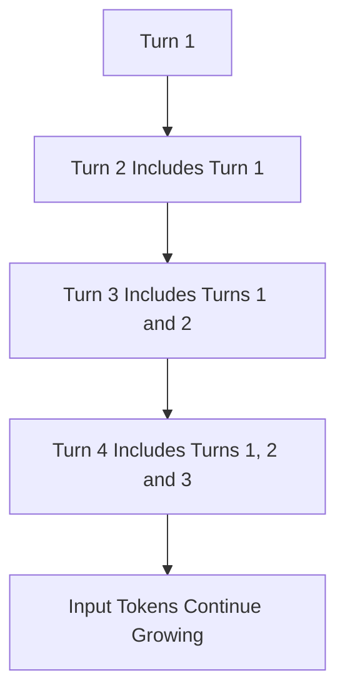

If each turn adds approximately 500 tokens:

```text
Turn 1 input:   500
Turn 2 input: 1,000
Turn 3 input: 1,500
Turn 4 input: 2,000
```

The cumulative API usage across all four turns is:

```text
500 + 1,000 + 1,500 + 2,000 = 5,000 input tokens
```

Conversation state preserves useful context, but earlier content still contributes to later token usage. The OpenAI conversation-state guide shows that prior user and assistant messages are included to preserve multi-turn context.

---

## 19. Conversation Management Strategies

### Strategy 1: Keep Recent Turns

Retain only the most recent messages.

```text
system instructions
conversation summary
last 6 messages
current user message
```

---

### Strategy 2: Summarize Older History

Replace old messages with a compact summary.

```text
Original history: 8,000 tokens
Summary:          1,000 tokens
Tokens saved:     7,000 tokens
```

---

### Strategy 3: Extract Durable Facts

Store important facts separately:

```json
{
  "preferred_language": "en",
  "writing_style": "concise_professional",
  "current_project": "AI Writing Assistant",
  "approved_terms": [
    "Structured Output",
    "Tool Calling"
  ]
}
```

Inject only relevant facts into each request.

---

### Strategy 4: Retrieve Old Context on Demand

Store old conversation content outside the prompt and retrieve relevant sections when needed.

---

### Strategy 5: Start a New Context

For unrelated tasks, create a new conversation rather than carrying irrelevant history forward.

---

## 20. Sliding-Window Conversation Strategy

```python
from typing import Any


def keep_recent_messages(
    messages: list[dict[str, Any]],
    maximum_messages: int = 8,
) -> list[dict[str, Any]]:
    if maximum_messages < 1:
        raise ValueError(
            "maximum_messages must be at least 1"
        )

    return messages[-maximum_messages:]
```

This method is simple, but it may remove critical information.

A better structure is:

```text
permanent instructions
+ durable user facts
+ summarized older conversation
+ recent raw messages
```

---

## 21. Token-Aware Message Selection

```python
from typing import Any

import tiktoken


def select_recent_messages_within_budget(
    messages: list[dict[str, Any]],
    model: str,
    token_budget: int,
) -> list[dict[str, Any]]:
    if token_budget <= 0:
        return []

    encoding = get_encoding(model)
    selected: list[dict[str, Any]] = []
    used_tokens = 0

    for message in reversed(messages):
        serialized = (
            f"{message.get('role', '')}:"
            f"{message.get('content', '')}"
        )
        message_tokens = len(
            encoding.encode(serialized)
        ) + 4

        if used_tokens + message_tokens > token_budget:
            break

        selected.append(message)
        used_tokens += message_tokens

    selected.reverse()
    return selected
```

This is more predictable than selecting a fixed number of messages because individual messages may vary greatly in length.

---

## 22. Summarizing Old Conversation

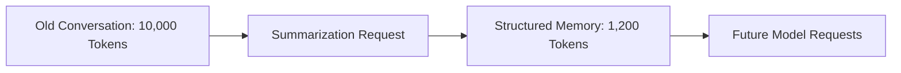

A useful conversation summary should preserve:

* User goals
* Decisions
* Important constraints
* Confirmed facts
* Unresolved questions
* Current task state

It should omit:

* Greetings
* Repeated explanations
* Failed drafts
* Irrelevant side discussions
* Low-value wording details

### Example Summary Schema

```json
{
  "user_goal": "Build an AI Writing Assistant",
  "decisions": [
    "Use the Responses API",
    "Use Structured Outputs for analysis"
  ],
  "constraints": [
    "English output",
    "Concise professional style"
  ],
  "open_questions": [
    "Select the production model"
  ]
}
```

---

## 23. Token Management in RAG

A common mistake is to retrieve too many document chunks.

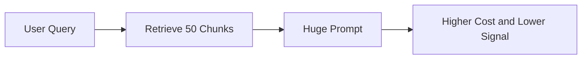

A better workflow is:

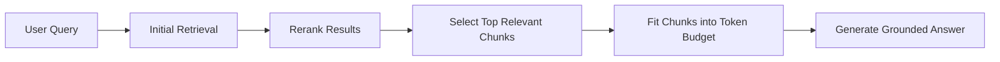

### RAG Token Budget

```text
retrieval budget =
    available input budget
  - instructions
  - conversation history
  - user question
  - tool definitions
```

Do not use a fixed `top_k` without considering chunk size.

Five 200-token chunks use approximately 1,000 tokens.

Five 2,000-token chunks use approximately 10,000 tokens.

---

## 24. Token-Aware Retrieval Selection

```python
from dataclasses import dataclass

import tiktoken


@dataclass
class RetrievedChunk:
    chunk_id: str
    text: str
    score: float


def select_chunks_within_budget(
    chunks: list[RetrievedChunk],
    model: str,
    token_budget: int,
) -> list[RetrievedChunk]:
    encoding = get_encoding(model)

    sorted_chunks = sorted(
        chunks,
        key=lambda chunk: chunk.score,
        reverse=True,
    )

    selected: list[RetrievedChunk] = []
    used_tokens = 0

    for chunk in sorted_chunks:
        chunk_tokens = len(
            encoding.encode(chunk.text)
        )

        if used_tokens + chunk_tokens > token_budget:
            continue

        selected.append(chunk)
        used_tokens += chunk_tokens

    return selected
```

A production implementation may also account for:

* Citation metadata
* Document titles
* Separators
* Duplicate information
* Minimum relevance score
* Diversity across documents

---

## 25. Chunking Long Documents

Sending an entire long document may be unnecessary.

Use chunking:

```text
document
  → sections
  → chunks
  → embeddings or search index
  → relevant chunks
  → model context
```

### Weak Chunking

```text
Split every 2,000 characters.
```

This may break:

* Sentences
* Tables
* Code blocks
* Headings
* Logical arguments

### Better Chunking

Prefer semantic boundaries:

```text
heading
paragraph
table
function
class
chapter
conversation turn
```

Add overlap only when needed. Excessive overlap duplicates tokens and increases retrieval cost.

---

## 26. Hierarchical Summarization

For a document too large to summarize in one request:

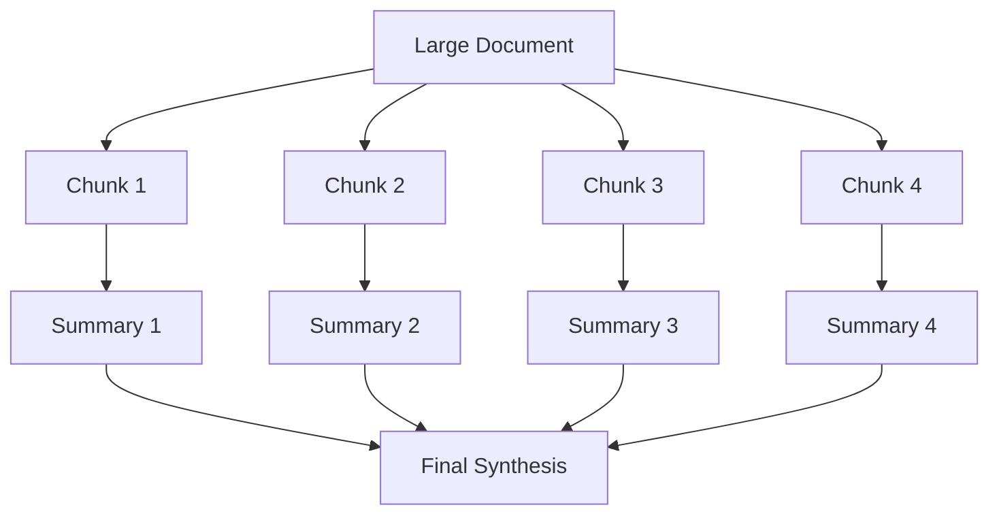

This is often called a map-reduce summarization workflow.

Track tokens for:

```text
each chunk request
each chunk response
final synthesis input
final synthesis output
total workflow
```

The final request contains summaries rather than the complete original document.

---

## 27. Prompt Caching

Repeated prompts often contain stable content:

```text
system instructions
few-shot examples
tool definitions
output schemas
long reference material
```

Prompt caching can reduce the cost and latency of processing repeated prompt prefixes.

OpenAI’s prompt caching works on exact prefix matches. Static instructions and examples should be placed first, while user-specific or variable information should be placed later. Eligible long prompts are cached automatically, and usage data exposes cache activity.

### Cache-Friendly Prompt

```text
1. Stable system instructions
2. Stable policy document
3. Stable examples
4. Stable tool definitions
5. Variable user profile
6. Variable user request
```

### Cache-Unfriendly Prompt

```text
1. Current timestamp
2. Random request ID
3. Variable user input
4. Stable system instructions
5. Stable policy document
```

Changing early content prevents later content from sharing the same exact prefix.

---

## 28. Prompt Cache Layout

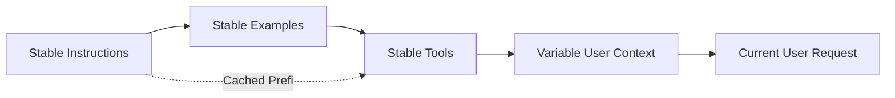

OpenAI documents that automatic caching applies to eligible prompts of at least 1,024 tokens. Cache hits require exact prefix matches, including matching tool and image content where applicable.

Do not add dynamic values near the beginning of an otherwise stable prompt unless they are necessary.

---

## 29. Logging Cached Tokens

```python
def extract_usage(response) -> dict[str, int]:
    if response.usage is None:
        return {
            "input_tokens": 0,
            "cached_tokens": 0,
            "output_tokens": 0,
            "reasoning_tokens": 0,
            "total_tokens": 0,
        }

    usage = response.usage

    cached_tokens = 0
    reasoning_tokens = 0

    if usage.input_tokens_details is not None:
        cached_tokens = (
            usage.input_tokens_details.cached_tokens or 0
        )

    if usage.output_tokens_details is not None:
        reasoning_tokens = (
            usage.output_tokens_details.reasoning_tokens or 0
        )

    return {
        "input_tokens": usage.input_tokens,
        "cached_tokens": cached_tokens,
        "output_tokens": usage.output_tokens,
        "reasoning_tokens": reasoning_tokens,
        "total_tokens": usage.total_tokens,
    }
```

Useful cache metric:

```text
cache hit ratio =
    cached input tokens / total input tokens
```

Example:

```text
cached input tokens: 8,000
total input tokens:  10,000

cache hit ratio = 8,000 / 10,000 = 80%
```

---

## 30. Calculating Request Cost

Pricing differs by model and can change over time. Store prices in configuration instead of hard-coding them throughout application code.

### Formula

```text
uncached input tokens =
    total input tokens - cached input tokens
```

```text
input cost =
    uncached input tokens × uncached input rate
```

```text
cached input cost =
    cached input tokens × cached input rate
```

```text
output cost =
    output tokens × output rate
```

```text
total request cost =
    input cost
  + cached input cost
  + output cost
  + tool-specific charges
```

Rates are commonly expressed per one million tokens:

```text
token cost =
    token count / 1,000,000 × rate per 1M tokens
```

---

## 31. Cost Calculator

```python
from dataclasses import dataclass


@dataclass(frozen=True)
class TokenPricing:
    input_per_million: float
    cached_input_per_million: float
    output_per_million: float


def calculate_token_cost(
    *,
    input_tokens: int,
    cached_tokens: int,
    output_tokens: int,
    pricing: TokenPricing,
) -> dict[str, float]:
    if min(
        input_tokens,
        cached_tokens,
        output_tokens,
    ) < 0:
        raise ValueError(
            "Token counts cannot be negative."
        )

    if cached_tokens > input_tokens:
        raise ValueError(
            "Cached tokens cannot exceed input tokens."
        )

    uncached_tokens = input_tokens - cached_tokens

    input_cost = (
        uncached_tokens
        / 1_000_000
        * pricing.input_per_million
    )
    cached_cost = (
        cached_tokens
        / 1_000_000
        * pricing.cached_input_per_million
    )
    output_cost = (
        output_tokens
        / 1_000_000
        * pricing.output_per_million
    )

    return {
        "uncached_input_cost": input_cost,
        "cached_input_cost": cached_cost,
        "output_cost": output_cost,
        "total_cost": (
            input_cost
            + cached_cost
            + output_cost
        ),
    }
```

Load current pricing from a controlled configuration source and version it with the usage record.

---

## 32. Token Budgets by Feature

Different product features should have different budgets.

```yaml
token_budgets:
  summarize:
    maximum_input_tokens: 12000
    maximum_output_tokens: 800

  rewrite:
    maximum_input_tokens: 6000
    maximum_output_tokens: 1200

  translate:
    maximum_input_tokens: 8000
    maximum_output_tokens: 9000

  explain:
    maximum_input_tokens: 10000
    maximum_output_tokens: 1800

  analyze_json:
    maximum_input_tokens: 10000
    maximum_output_tokens: 1000
```

Translation may require output space similar to or larger than the input.

Classification may need only a small output budget.

Avoid using one global token limit for every feature.

---

## 33. Reasoning Tokens

Reasoning-capable models may consume internal reasoning tokens before returning visible output.

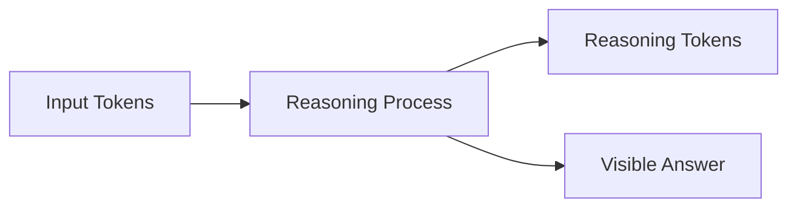

Important consequences:

* A large `max_output_tokens` reserve may be needed for difficult reasoning.
* Visible output may be shorter than expected.
* Cost may increase even when the final answer is concise.
* A response can become incomplete if reasoning uses the available output budget.

Where supported, reducing reasoning effort can reduce reasoning-token usage and latency, but it may also affect task quality. The correct setting should be selected through evaluation rather than cost alone.

---

## 34. Streaming and Tokens

Streaming changes how output is delivered, not necessarily how many tokens are generated.

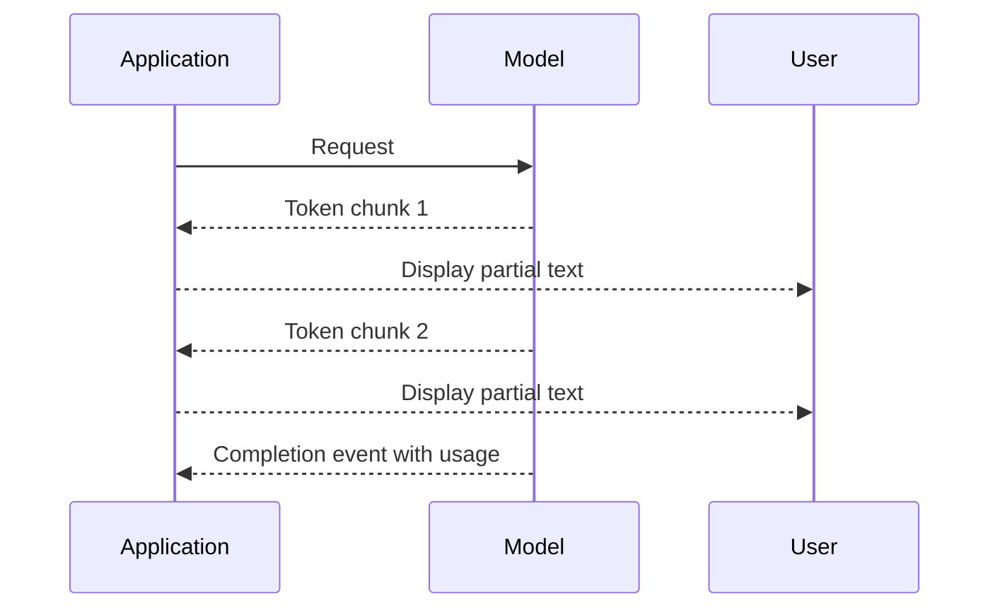

Streaming can improve perceived responsiveness, but:

* The input still consumes tokens.
* Generated output still consumes tokens.
* The final usage record should still be logged.
* Cancelling early may reduce further output generation, but already processed usage remains relevant.

Do not describe streaming as a token-saving feature by itself.

---

## 35. Truncation Behavior

The Responses API supports truncation strategies.

### `disabled`

If the input exceeds the context window, the request fails.

```python
response = client.responses.create(
    model="gpt-5.6",
    input=messages,
    truncation="disabled",
)
```

This is useful when silently removing context would be dangerous.

---

### `auto`

The system may remove earlier conversation items to fit the context window.

```python
response = client.responses.create(
    model="gpt-5.6",
    input=messages,
    truncation="auto",
)
```

The API reference states that `auto` may drop items from the beginning of the conversation, while `disabled` returns an error when the input would exceed the context window.

Automatic truncation should not replace intentional context management.

It may remove:

* Earlier requirements
* User preferences
* Important decisions
* Safety context
* Relevant tool results

---

## 36. Explicit Truncation vs Silent Truncation

A safer application often performs its own reduction:

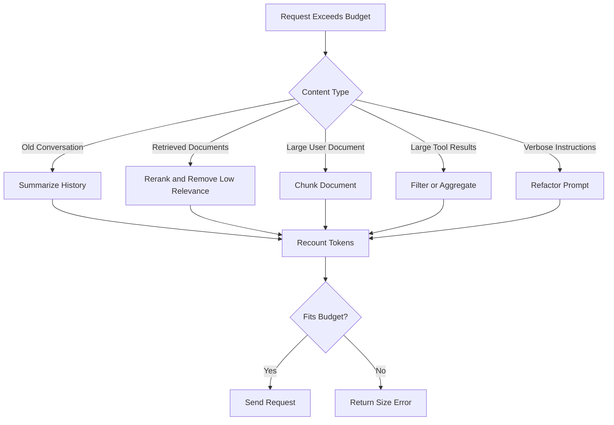

This allows the application to preserve the most valuable information.

---

## 37. Input Validation

Do not call the model for obviously invalid input.

```python
def validate_text_input(
    text: str,
    maximum_characters: int = 100_000,
) -> str:
    normalized = text.strip()

    if not normalized:
        raise ValueError("Input text cannot be empty.")

    if len(normalized) > maximum_characters:
        raise ValueError(
            "Input text exceeds the application limit."
        )

    return normalized
```

Character limits are not token limits, but they provide a fast first layer before tokenizer-based validation.

A useful validation pipeline is:

```text
character limit
→ token estimate
→ feature token budget
→ model request
→ actual usage log
```

---

## 38. Complete Token-Aware Request Example

```python
from __future__ import annotations

import os
import time
from dataclasses import dataclass

import tiktoken
from openai import OpenAI

client = OpenAI()


@dataclass(frozen=True)
class RequestBudget:
    maximum_input_tokens: int
    maximum_output_tokens: int
    safety_margin_tokens: int


def get_model_encoding(model: str) -> tiktoken.Encoding:
    try:
        return tiktoken.encoding_for_model(model)
    except KeyError:
        return tiktoken.get_encoding("o200k_base")


def estimate_tokens(text: str, model: str) -> int:
    encoding = get_model_encoding(model)
    return len(encoding.encode(text))


def extract_response_usage(response) -> dict[str, int]:
    usage = response.usage

    if usage is None:
        return {
            "input_tokens": 0,
            "cached_tokens": 0,
            "output_tokens": 0,
            "reasoning_tokens": 0,
            "total_tokens": 0,
        }

    cached_tokens = 0
    reasoning_tokens = 0

    if usage.input_tokens_details is not None:
        cached_tokens = (
            usage.input_tokens_details.cached_tokens or 0
        )

    if usage.output_tokens_details is not None:
        reasoning_tokens = (
            usage.output_tokens_details.reasoning_tokens or 0
        )

    return {
        "input_tokens": usage.input_tokens,
        "cached_tokens": cached_tokens,
        "output_tokens": usage.output_tokens,
        "reasoning_tokens": reasoning_tokens,
        "total_tokens": usage.total_tokens,
    }


def summarize_text(
    text: str,
    budget: RequestBudget,
) -> dict:
    model = os.getenv(
        "OPENAI_MODEL",
        "gpt-5.6",
    )

    normalized_text = text.strip()

    if not normalized_text:
        raise ValueError(
            "Text cannot be empty."
        )

    instructions = (
        "Summarize the document accurately. "
        "Preserve important facts, dates and limitations. "
        "Do not invent information."
    )

    estimated_input = (
        estimate_tokens(instructions, model)
        + estimate_tokens(normalized_text, model)
        + budget.safety_margin_tokens
    )

    if estimated_input > budget.maximum_input_tokens:
        raise ValueError(
            "The request exceeds the summarize input budget. "
            "Chunk or shorten the document before retrying."
        )

    started_at = time.perf_counter()

    response = client.responses.create(
        model=model,
        instructions=instructions,
        input=normalized_text,
        max_output_tokens=budget.maximum_output_tokens,
        truncation="disabled",
    )

    latency_ms = round(
        (time.perf_counter() - started_at) * 1000
    )

    if response.status == "incomplete":
        reason = "unknown"

        if response.incomplete_details is not None:
            reason = response.incomplete_details.reason

        raise RuntimeError(
            f"Response incomplete: {reason}"
        )

    usage = extract_response_usage(response)

    return {
        "text": response.output_text,
        "usage": usage,
        "meta": {
            "model": model,
            "estimated_input_tokens": estimated_input,
            "latency_ms": latency_ms,
            "maximum_output_tokens": (
                budget.maximum_output_tokens
            ),
        },
    }


result = summarize_text(
    text="Your long source document...",
    budget=RequestBudget(
        maximum_input_tokens=12_000,
        maximum_output_tokens=800,
        safety_margin_tokens=300,
    ),
)

print(result)
```

---

## 39. Token Usage Log

A useful production log might contain:

```json
{
  "request_id": "request_123",
  "feature": "summarize",
  "model": "gpt-5.6",
  "prompt_version": "summary-v4",
  "status": "completed",
  "estimated_input_tokens": 1710,
  "input_tokens": 1748,
  "cached_input_tokens": 1024,
  "output_tokens": 312,
  "reasoning_tokens": 84,
  "total_tokens": 2060,
  "maximum_output_tokens": 800,
  "latency_ms": 1280,
  "retry_count": 0,
  "truncated": false,
  "cost_usd": 0.0
}
```

Do not store sensitive prompt or response content merely to measure token usage.

Metadata is often sufficient.

---

## 40. Important Metrics

### Usage Metrics

```text
input tokens per request
output tokens per request
total tokens per request
cached tokens per request
reasoning tokens per request
```

### Distribution Metrics

```text
P50 input tokens
P90 input tokens
P95 input tokens
maximum input tokens
```

### Efficiency Metrics

```text
tokens per successful task
tokens per accepted answer
cost per successful task
cache hit ratio
retrieved tokens used per answer
```

### Reliability Metrics

```text
context overflow rate
incomplete-response rate
automatic truncation rate
retry rate
rate-limit error rate
```

### Business Metrics

```text
cost per active user
cost per document
cost per story
cost per support resolution
cost per accepted rewrite
```

---

## 41. Monitoring Dashboard

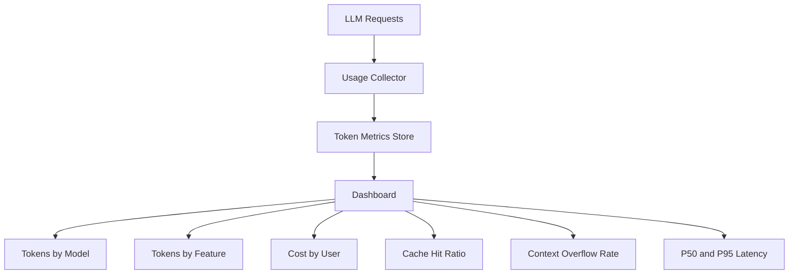

Recommended dashboard filters:

```text
date range
model
provider
feature
environment
user plan
request status
prompt version
```

---

## 42. Alert Conditions

Example alerts:

```yaml
alerts:
  context_overflow_rate:
    threshold: 0.01

  incomplete_response_rate:
    threshold: 0.02

  p95_input_tokens:
    threshold: 20000

  cache_hit_ratio:
    minimum: 0.40

  average_cost_per_request:
    threshold_usd: 0.02

  token_rate_limit_errors:
    threshold_per_minute: 5
```

Alert thresholds should be based on feature requirements and observed traffic.

---

## 43. Managing Token Rate Limits

Suppose an application has a token-per-minute limit.

Three requests arrive:

```text
Request A: 40,000 estimated tokens
Request B: 35,000 estimated tokens
Request C: 30,000 estimated tokens
```

Even though there are only three requests, the combined load is:

```text
40,000 + 35,000 + 30,000
= 105,000 tokens
```

Use:

* Request queues
* Concurrency limits
* Token-aware scheduling
* Exponential backoff
* Smaller prompts
* Smaller output limits
* Separate workloads by project or model
* Batch processing for non-interactive work

Rate-limit plans should consider tokens, not only request count.

---

## 44. Token-Aware Request Queue

```python
from dataclasses import dataclass


@dataclass
class QueuedRequest:
    request_id: str
    estimated_tokens: int
    priority: int


def choose_requests(
    requests: list[QueuedRequest],
    available_token_budget: int,
) -> list[QueuedRequest]:
    selected: list[QueuedRequest] = []
    used_tokens = 0

    for request in sorted(
        requests,
        key=lambda item: item.priority,
    ):
        if (
            used_tokens + request.estimated_tokens
            > available_token_budget
        ):
            continue

        selected.append(request)
        used_tokens += request.estimated_tokens

    return selected
```

A real queue should also support:

* Fairness
* Deadlines
* Per-user quotas
* Retry state
* Request cancellation
* Distributed coordination

---

## 45. AI Writing Assistant Example

The related project supports:

```text
summarize
rewrite
translate
explain
analyze
return JSON
```

Each operation has a different token profile.

### Summarize

```text
large input
small output
```

### Rewrite

```text
medium input
similar-sized output
```

### Translate

```text
medium or large input
output approximately similar to input
```

### Explain

```text
small or medium input
potentially large output
```

### Analyze as JSON

```text
medium input
small structured output
```

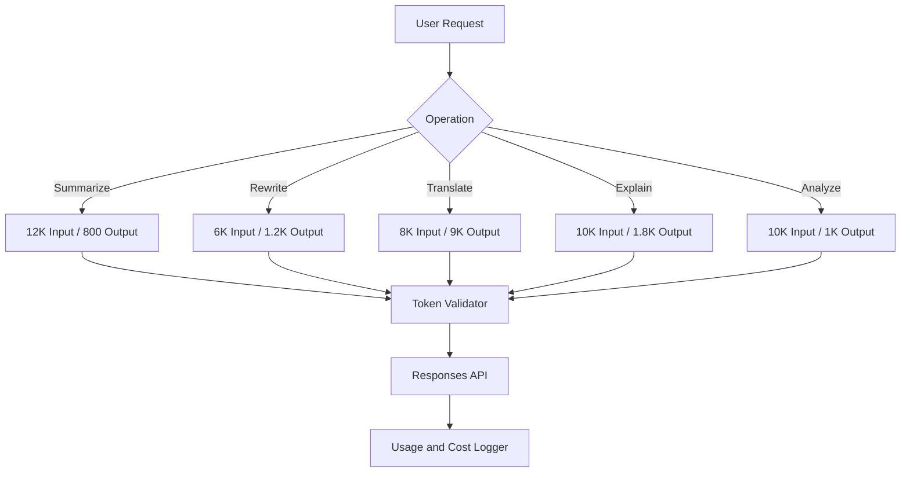

---

## 46. Example Writing Assistant Response

```json
{
  "success": true,
  "data": {
    "summary": "Token management controls context, cost and latency."
  },
  "usage": {
    "input_tokens": 920,
    "cached_input_tokens": 640,
    "output_tokens": 74,
    "reasoning_tokens": 0,
    "total_tokens": 994
  },
  "limits": {
    "maximum_input_tokens": 12000,
    "maximum_output_tokens": 800
  },
  "meta": {
    "model": "configured-model",
    "latency_ms": 780,
    "truncated": false
  }
}
```

Decide carefully whether raw usage and cost data should be exposed to end users or kept only in internal observability systems.

---

## 47. Testing Strategy

### Small Input

```text
Summarize: AI helps automate tasks.
```

Expected:

```text
request succeeds
very low input usage
short output
```

---

### Empty Input

```text
""
```

Expected:

```text
reject before model call
zero model tokens consumed
```

---

### Near-Limit Input

Input token count is close to the feature limit.

Expected:

```text
request succeeds with safety margin
```

---

### Over-Limit Input

Expected:

```text
reject or chunk before model call
```

---

### Long Output Request

Expected:

```text
output respects maximum token budget
```

---

### Incomplete Response

Configure an intentionally small output limit.

Expected:

```text
status is detected as incomplete
result is not stored as complete
```

---

### Conversation Growth

Run 20 conversation turns.

Expected:

```text
old history is summarized or removed
context remains within budget
```

---

### Large Retrieval Result

Return many document chunks.

Expected:

```text
reranker and token selector retain only fitting chunks
```

---

### Cache Test

Send multiple requests with the same long stable prefix.

Expected:

```text
cached token usage becomes visible when eligible
```

---

## 48. Evaluation Table

| Test Case              | Expected Behavior          | Metric                  |
| ---------------------- | -------------------------- | ----------------------- |
| Empty input            | Reject locally             | API calls = 0           |
| Small rewrite          | Complete normally          | Low token usage         |
| Oversized document     | Chunk or reject            | No context error        |
| Long conversation      | Summarize old turns        | Input under budget      |
| Tiny output limit      | Detect incomplete          | No false success        |
| Stable repeated prompt | Reuse cache where eligible | Cached tokens increase  |
| Large RAG result       | Select fitting chunks      | Retrieval within budget |
| Large tool list        | Expose relevant subset     | Tool tokens decrease    |

---

## 49. Common Mistakes

### Mistake 1: Treating Words as Tokens

Word count is not a reliable token count, especially across languages, punctuation, code, and numeric data.

---

### Mistake 2: Counting Only the User Message

Instructions, history, schemas, tools, retrieved documents, and tool results also consume tokens.

---

### Mistake 3: Filling the Entire Context Window

Always reserve output capacity and a safety margin.

---

### Mistake 4: Using the Same Limits for Every Feature

Classification and long-form translation need different budgets.

---

### Mistake 5: Sending the Entire Conversation Forever

Summarize, retrieve, or remove older content.

---

### Mistake 6: Retrieving Too Many RAG Chunks

More context does not always produce a better answer.

Low-relevance content can increase cost and reduce answer quality.

---

### Mistake 7: Ignoring Tool-Schema Tokens

Large tool definitions can become a major portion of input usage.

---

### Mistake 8: Assuming Streaming Saves Tokens

Streaming improves delivery and responsiveness but does not inherently reduce token usage.

---

### Mistake 9: Ignoring Incomplete Status

A response stopped by a token limit should not be treated as complete.

---

### Mistake 10: Double-Counting Cached Tokens

Cached tokens are already included in total input tokens.

---

### Mistake 11: Double-Counting Reasoning Tokens

Reasoning tokens are normally reported as a detail within output usage.

---

### Mistake 12: Hard-Coding Prices

Pricing changes. Store rates in versioned configuration.

---

### Mistake 13: Relying Entirely on Automatic Truncation

Automatic truncation may remove important earlier context.

---

### Mistake 14: Logging Only Total Tokens

Input, cached input, output, and reasoning tokens have different operational meanings.

---

### Mistake 15: Optimizing Cost Without Evaluating Quality

Reducing context or reasoning too aggressively can lower answer quality.

---

## 50. Practical Exercise

Build a token-aware endpoint for an AI Writing Assistant.

### Input

```json
{
  "operation": "summarize",
  "text": "A long article or report..."
}
```

### Expected Output

```json
{
  "success": true,
  "data": {
    "summary": "A concise summary."
  },
  "usage": {
    "input_tokens": 1200,
    "cached_input_tokens": 0,
    "output_tokens": 180,
    "reasoning_tokens": 0,
    "total_tokens": 1380
  },
  "meta": {
    "estimated_input_tokens": 1170,
    "maximum_output_tokens": 800,
    "latency_ms": 940
  }
}
```

### Requirements

1. Reject empty input before the API call.
2. Estimate tokens with a tokenizer.
3. Define separate budgets by operation.
4. Reserve output tokens and a safety margin.
5. Use `truncation="disabled"` for the first implementation.
6. Detect incomplete responses.
7. Log actual API usage.
8. Separate cached and uncached input.
9. Record reasoning tokens where available.
10. Calculate estimated request cost.
11. Add a RAG chunk-selection budget.
12. Add a conversation-history budget.
13. Test a request above the limit.
14. Test a response stopped by the output limit.
15. Create a dashboard comparing operations.

---

## 51. Suggested Project Structure

```text
token-management-demo/
├── README.md
├── app/
│   ├── main.py
│   ├── config.py
│   ├── token_counter.py
│   ├── token_budget.py
│   ├── context_builder.py
│   ├── pricing.py
│   ├── usage_logger.py
│   └── writing_service.py
├── config/
│   ├── token_budgets.yaml
│   └── model_pricing.yaml
├── tests/
│   ├── test_token_counter.py
│   ├── test_token_budget.py
│   ├── test_context_builder.py
│   ├── test_cost_calculator.py
│   └── test_writing_service.py
├── dashboards/
│   └── token_metrics.md
└── reports/
    └── token_optimization_report.md
```

---

## 52. Suggested Benchmark

Compare three implementations.

### Candidate A — Unmanaged

```text
full instructions
full conversation history
all retrieved documents
all tools
unlimited expected output
```

### Candidate B — Basic Limits

```text
input validation
maximum output tokens
recent conversation turns
fixed retrieval top_k
```

### Candidate C — Token-Aware

```text
feature-specific budgets
token-aware history
reranked retrieval
dynamic chunk selection
prompt caching
usage and cost logging
```

### Benchmark Table

| Metric                | Unmanaged | Basic Limits | Token-Aware |
| --------------------- | --------: | -----------: | ----------: |
| Average input tokens  |         — |            — |           — |
| Average output tokens |         — |            — |           — |
| Cached token ratio    |         — |            — |           — |
| P95 latency           |         — |            — |           — |
| Cost per request      |         — |            — |           — |
| Context errors        |         — |            — |           — |
| Quality score         |         — |            — |           — |
| Incomplete rate       |         — |            — |           — |

Token optimization is successful only when efficiency improves without unacceptable quality loss.

---

## 53. Production Checklist

### Model Configuration

* [ ] The selected model’s context window is documented.
* [ ] The model’s maximum output is documented.
* [ ] Current model pricing is configured.
* [ ] Reasoning-token behavior is understood.
* [ ] Rate limits are documented.

### Input Management

* [ ] Empty input is rejected.
* [ ] Character limits are enforced.
* [ ] Input tokens are estimated.
* [ ] Feature-specific budgets exist.
* [ ] Output capacity is reserved.
* [ ] A safety margin is included.
* [ ] Oversized documents are chunked.
* [ ] Tool definitions are included in estimates.
* [ ] Retrieved context has a token budget.

### Conversation Management

* [ ] Old messages are summarized or removed.
* [ ] Important facts are stored separately.
* [ ] Recent messages have a token budget.
* [ ] Unrelated tasks start a new context.
* [ ] Automatic truncation is not the only protection.

### Output Management

* [ ] `max_output_tokens` is set.
* [ ] Limits match the feature.
* [ ] Incomplete responses are detected.
* [ ] Partial JSON is not treated as valid.
* [ ] Partial documents are not treated as complete.

### Cost Management

* [ ] Input tokens are logged.
* [ ] Cached tokens are logged.
* [ ] Output tokens are logged.
* [ ] Reasoning tokens are logged.
* [ ] Prices are versioned.
* [ ] Cost is calculated per request.
* [ ] Cost is aggregated by feature and model.
* [ ] User or tenant quotas are considered.

### Prompt Caching

* [ ] Stable content appears first.
* [ ] Variable content appears later.
* [ ] Tool definitions remain stable where possible.
* [ ] Cache usage is measured.
* [ ] Dynamic timestamps do not unnecessarily break prefixes.
* [ ] Cache-hit ratio is monitored.

### Reliability

* [ ] Context-overflow errors are monitored.
* [ ] Token rate limits are monitored.
* [ ] Retries use bounded backoff.
* [ ] Token-heavy requests use queues where necessary.
* [ ] Latency is measured end to end.
* [ ] Quality is evaluated after token optimization.

---

## 54. Completion Checklist

You have completed this lesson when:

* [ ] You can explain tokens in one or two minutes.
* [ ] You understand input, cached, output, and reasoning tokens.
* [ ] You can explain a context window.
* [ ] You can create a request token budget.
* [ ] You can estimate tokens before an API call.
* [ ] You can read actual token usage afterward.
* [ ] You can set an output-token limit.
* [ ] You can detect incomplete responses.
* [ ] You can manage long conversation history.
* [ ] You can reduce RAG context.
* [ ] You can account for tool definitions.
* [ ] You understand prompt-caching prefixes.
* [ ] You can calculate approximate cost.
* [ ] You can design a token dashboard.
* [ ] You have built a working demo or portfolio artifact.
* [ ] You have documented at least one limitation or open question.

---

## 55. Related Outcome

> Call LLM APIs from applications while managing context windows, input tokens, cached tokens, output tokens, reasoning tokens, cost, latency, retries, rate limits, conversation state, and structured outputs.

---

## 56. Related Project

### Project 3 — AI Writing Assistant

Build an application supporting:

```text
summarize
rewrite
translate
explain
analyze
return JSON
```

Add token-management capabilities:

```text
feature-specific token budgets
preflight token estimation
conversation compaction
RAG context budgeting
output limits
usage logging
cost estimation
prompt-cache monitoring
token dashboard
```

Suggested portfolio artifacts:

* Token counter
* Budget configuration
* Token-aware context builder
* RAG chunk selector
* Usage and cost logger
* Token dashboard
* Context-overflow tests
* Prompt-caching experiment
* Cost-optimization report
* Quality-versus-cost benchmark

---

## 57. Key Takeaways

1. Tokens are the units processed by language models.
2. Tokens are not equivalent to words or characters.
3. Every instruction, message, document, tool, and output consumes context.
4. Reserve output capacity and a safety margin before allocating input.
5. Use local token counting for preflight estimates.
6. Use API usage data as the authoritative completed-request measurement.
7. Set feature-specific input and output budgets.
8. Detect responses stopped by output-token limits.
9. Do not resend unlimited conversation history.
10. Summarize old turns and retrieve historical context only when relevant.
11. Give RAG retrieval its own token budget.
12. Tool definitions and schemas also consume input tokens.
13. Cached tokens are included in input tokens.
14. Reasoning tokens are generally included in output-token usage.
15. Prompt caching works best with a long, stable, exact prefix.
16. Place static instructions first and variable user content later.
17. Streaming improves responsiveness but does not inherently reduce tokens.
18. Automatic truncation should not replace intentional context management.
19. Track token distributions, not only averages.
20. Optimize cost together with quality, safety, and latency.

---

# Bài luyện tập

## Mục tiêu


## Đề bài


## Yêu cầu hoàn thành

- [ ] 
- [ ] 
- [ ] 

## Kết quả / lời giải


## Ghi chú
