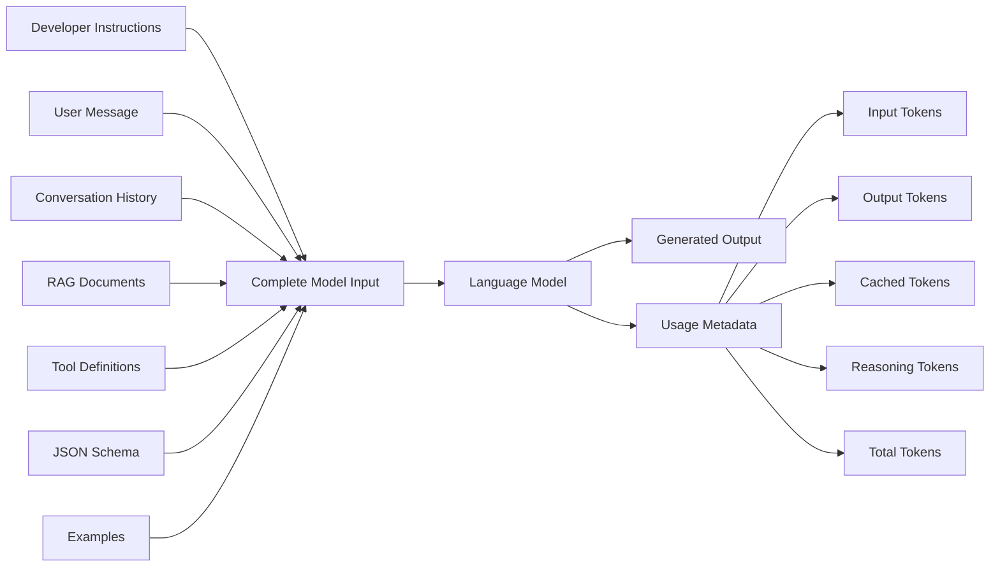
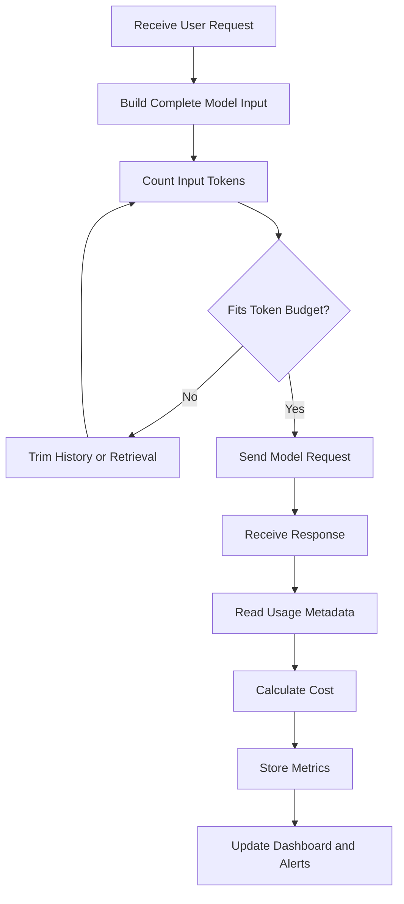
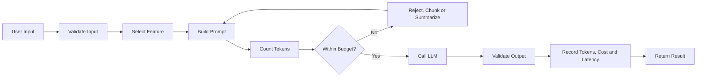

# 014 — Token Counting

**Course:** 02 — Model Platforms and Prompting
**Module:** Module 04 — OpenAI Platform and API
**Content Group:** Operations
**Roadmap Source:** OpenAI Platform and API / Operations
**Lesson Type:** API
**Lesson Order:** 014
**Suggested Duration:** 24 minutes

---

## 1. Lesson Summary

**Token counting** is the process of measuring how much text and other model input is sent to a Large Language Model and how much content the model generates in response.

Language models do not process text directly as words or characters. Instead, a tokenizer converts the content into smaller units called **tokens**. A token may represent:

* A complete word
* Part of a word
* Punctuation
* Whitespace
* A number
* A code fragment
* Part of a non-English word

Token counts affect:

* API cost
* Request latency
* Context-window usage
* Maximum output length
* Rate-limit consumption
* Prompt-caching efficiency
* The scalability of an AI application

OpenAI API responses can report input, output, cached, reasoning, and total token usage. The Responses API also provides an input-token counting operation that can be used before generation.

By the end of this lesson, you should be able to estimate a request before sending it, record the actual usage after receiving the response, calculate its approximate cost, and identify expensive workflows.

---

## 2. Learning Objectives

After completing this lesson, you should be able to:

1. Explain token counting in your own words.
2. Distinguish between input, output, cached, reasoning, and total tokens.
3. Estimate whether a request fits within a model’s context window.
4. calculate the approximate cost of an LLM request.
5. Read token usage from an API response.
6. Count input tokens before sending a generation request.
7. Log token usage by user, feature, model, and environment.
8. Detect workflows that consume unnecessary tokens.
9. Apply token monitoring to an AI Writing Assistant.
10. Describe the limitations of local token estimates.

---

## 3. What Is a Token?

A **token** is a unit of data processed by a language model.

Consider the following sentence:

```text
Token counting is useful.
```

A tokenizer might divide it into units similar to:

```text
["Token", " counting", " is", " useful", "."]
```

This example is only illustrative. The actual split depends on the tokenizer and model.

Different models may use different token encodings. OpenAI’s `tiktoken` library can select an encoding associated with a model, but older Cookbook examples may reference models or APIs that have since changed.

### Tokens are not the same as words

The following values are not interchangeable:

```text
characters ≠ words ≠ tokens
```

A short word may be one token, while a rare or long word may be split into several tokens. Code, JSON, punctuation, spacing, and multilingual text may also tokenize differently.

Therefore, this estimate is unsafe:

```text
1 word = 1 token
```

Use an official counting endpoint or the correct tokenizer whenever accurate budgeting matters.

---

## 4. Main Token Categories

### 4.1 Input tokens

Input tokens represent the content sent to the model.

They may include:

* Developer instructions
* User messages
* Previous conversation messages
* Retrieved RAG documents
* Tool definitions
* Structured-output schemas
* Examples included in the prompt
* Image or audio representations for multimodal models
* Other API-level input items

A request with a one-sentence user message can still contain thousands of input tokens when the application includes long instructions, conversation history, retrieved documents, and tool schemas.

---

### 4.2 Output tokens

Output tokens represent content generated by the model.

Examples include:

* Natural-language answers
* Summaries
* Rewritten text
* JSON output
* Function-call arguments
* Code
* Tool-call requests

Generating fewer output tokens can materially reduce latency. OpenAI’s latency guidance notes that token generation is usually the most expensive latency stage and gives the heuristic that reducing output length by approximately 50% may produce a similar reduction in generation latency.

---

### 4.3 Cached input tokens

Some repeated prompt prefixes may be reused through prompt caching.

Cached tokens are still part of the input, but they are reported separately so that developers can analyze cache usage and its cost implications.

For cache reuse, the beginning of the prompt must match. Static instructions and examples should therefore be placed before dynamic user-specific content. OpenAI reports cache reads through fields such as `cached_tokens`; newer model families may also report cache writes separately.

---

### 4.4 Reasoning tokens

Some reasoning models may use internal reasoning tokens while producing an answer.

These may appear in usage details such as:

```json
{
  "output_tokens_details": {
    "reasoning_tokens": 64
  }
}
```

Reasoning tokens are included in the broader output-token accounting reported by the response.

---

### 4.5 Total tokens

A simplified relationship is:

```text
total_tokens = input_tokens + output_tokens
```

A response may also provide detailed breakdowns within these values:

```text
input_tokens
├── uncached input tokens
├── cached tokens
└── cache-write tokens, when applicable

output_tokens
├── visible response tokens
├── reasoning tokens
└── other model-specific token details
```

The exact fields depend on the API, endpoint, and model.

---

## 5. Why Token Counting Matters

### 5.1 Cost management

Most text-generation APIs calculate costs based on token usage.

A general cost formula is:

```text
input_cost =
    input_tokens / 1,000,000
    × input_price_per_million

output_cost =
    output_tokens / 1,000,000
    × output_price_per_million

total_cost =
    input_cost + output_cost
```

When cached input has a separate price, use:

```text
uncached_input_tokens =
    input_tokens - cached_input_tokens

input_cost =
    uncached_input_tokens / 1,000,000
    × normal_input_price_per_million

cached_cost =
    cached_input_tokens / 1,000,000
    × cached_input_price_per_million

output_cost =
    output_tokens / 1,000,000
    × output_price_per_million

total_cost =
    input_cost + cached_cost + output_cost
```

Always load model prices from a configuration file or pricing service rather than hard-coding them throughout the application.

---

### 5.2 Context-window management

Each model can process a limited amount of context in one request.

A simplified token budget is:

```text
input tokens
+ expected output tokens
+ safety margin
≤ model context limit
```

The approximate output budget can be calculated as:

```text
available_output_tokens =
    context_limit
    - estimated_input_tokens
    - safety_margin
```

Example:

```text
Context limit:           128,000
Estimated input:          92,000
Safety margin:             4,000
Available output budget:  32,000
```

In production, verify both the context limit and any separate maximum-output limit defined for the selected model.

---

### 5.3 Latency

Long requests can increase processing time, while long generated responses usually increase latency more directly.

Token monitoring helps answer questions such as:

* Is retrieval returning too many documents?
* Is conversation history growing indefinitely?
* Is the model producing unnecessarily long answers?
* Are retries duplicating expensive calls?
* Would a smaller model be sufficient?
* Would streaming improve perceived responsiveness?

---

### 5.4 Rate limits

Providers may enforce limits based on:

* Requests per minute
* Tokens per minute
* Requests per day
* Tokens per day
* Concurrent requests

A request may therefore fail even when the application has not exceeded its request count, because it has exceeded its token allowance.

---

### 5.5 Product design

Token usage affects product decisions.

For example:

* Free users may receive shorter outputs.
* A premium plan may allow longer documents.
* A summarization feature may use a cheaper model.
* A RAG system may limit retrieved passages.
* A chat interface may summarize old messages.
* An agent may restrict the number of tool iterations.

Token counting is therefore not only an API concern. It is part of product architecture.

---

## 6. Where Tokens Come From

A production request is often larger than the visible user message.



### Hidden sources of token growth

Common sources include:

1. Repeating the complete system prompt on every call.
2. Sending the full chat history without truncation.
3. Retrieving entire documents instead of relevant chunks.
4. Registering many tools when only one tool is relevant.
5. Using very large JSON schemas.
6. Including too many few-shot examples.
7. Returning verbose JSON field descriptions.
8. Adding the same context at multiple pipeline stages.
9. Retrying failed requests without tracking previous usage.
10. Sending complete documents for small editing operations.

---

## 7. Token-Counting Workflow

A reliable application counts tokens at two points:

1. **Before the request:** estimate or count the planned input.
2. **After the request:** record authoritative usage returned by the API.



### Important distinction

```text
Pre-request count:
Used for validation and budgeting.

Post-request usage:
Used for billing analysis, monitoring, and reporting.
```

Do not replace post-request usage with a local estimate. The response’s usage metadata should be treated as the primary measurement for the completed request.

---

## 8. Preflight Token Counting with the Responses API

The Responses API provides an operation for counting input tokens before generation.

### Python example

```python
import os

from openai import OpenAI

client = OpenAI(api_key=os.environ["OPENAI_API_KEY"])

model = os.environ.get("OPENAI_MODEL", "YOUR_MODEL")

input_items = [
    {
        "role": "developer",
        "content": "You are a concise technical writing assistant.",
    },
    {
        "role": "user",
        "content": (
            "Explain token counting in three bullet points "
            "and return a short example."
        ),
    },
]

token_count = client.responses.input_tokens.count(
    model=model,
    input=input_items,
)

print("Estimated input tokens:", token_count.input_tokens)
```

The token-counting operation returns an object containing an `input_tokens` value.

### Why count the complete request?

Do not count only the user’s text:

```python
# Incomplete measurement
user_text = "Explain token counting."
```

Count the complete payload that will be sent:

```python
# Better measurement
input_items = [
    developer_message,
    conversation_history,
    retrieved_context,
    user_message,
]
```

Tool definitions, schemas, images, and other input elements may also contribute to the final token count.

---

## 9. Reading Actual Usage After Generation

### Python example

```python
import os
import time
from dataclasses import dataclass

from openai import OpenAI

client = OpenAI(api_key=os.environ["OPENAI_API_KEY"])


@dataclass
class TokenMetrics:
    input_tokens: int
    output_tokens: int
    total_tokens: int
    cached_tokens: int
    reasoning_tokens: int
    latency_ms: float


def generate_text(prompt: str, model: str) -> tuple[str, TokenMetrics]:
    started_at = time.perf_counter()

    response = client.responses.create(
        model=model,
        input=prompt,
        max_output_tokens=500,
    )

    latency_ms = (time.perf_counter() - started_at) * 1000

    usage = response.usage

    input_details = getattr(usage, "input_tokens_details", None)
    output_details = getattr(usage, "output_tokens_details", None)

    cached_tokens = (
        getattr(input_details, "cached_tokens", 0)
        if input_details
        else 0
    )

    reasoning_tokens = (
        getattr(output_details, "reasoning_tokens", 0)
        if output_details
        else 0
    )

    metrics = TokenMetrics(
        input_tokens=usage.input_tokens,
        output_tokens=usage.output_tokens,
        total_tokens=usage.total_tokens,
        cached_tokens=cached_tokens,
        reasoning_tokens=reasoning_tokens,
        latency_ms=latency_ms,
    )

    return response.output_text, metrics


if __name__ == "__main__":
    selected_model = os.environ.get("OPENAI_MODEL", "YOUR_MODEL")

    text, metrics = generate_text(
        prompt="Explain token counting in under 120 words.",
        model=selected_model,
    )

    print(text)
    print(metrics)
```

The response usage object can contain fields such as `input_tokens`, `output_tokens`, `total_tokens`, cached-token details, and reasoning-token details.

---

## 10. Cost Calculation Function

The following function uses per-million-token pricing.

```python
from dataclasses import dataclass


@dataclass(frozen=True)
class ModelPricing:
    input_per_million: float
    cached_input_per_million: float
    output_per_million: float


def calculate_cost(
    *,
    input_tokens: int,
    output_tokens: int,
    cached_tokens: int,
    pricing: ModelPricing,
) -> dict[str, float]:
    if min(input_tokens, output_tokens, cached_tokens) < 0:
        raise ValueError("Token counts cannot be negative.")

    if cached_tokens > input_tokens:
        raise ValueError(
            "Cached tokens cannot exceed total input tokens."
        )

    uncached_tokens = input_tokens - cached_tokens

    uncached_input_cost = (
        uncached_tokens / 1_000_000
        * pricing.input_per_million
    )

    cached_input_cost = (
        cached_tokens / 1_000_000
        * pricing.cached_input_per_million
    )

    output_cost = (
        output_tokens / 1_000_000
        * pricing.output_per_million
    )

    total_cost = (
        uncached_input_cost
        + cached_input_cost
        + output_cost
    )

    return {
        "uncached_input_cost": uncached_input_cost,
        "cached_input_cost": cached_input_cost,
        "output_cost": output_cost,
        "total_cost": total_cost,
    }
```

### Example

```python
pricing = ModelPricing(
    input_per_million=1.00,
    cached_input_per_million=0.25,
    output_per_million=4.00,
)

cost = calculate_cost(
    input_tokens=10_000,
    output_tokens=2_000,
    cached_tokens=6_000,
    pricing=pricing,
)

print(cost)
```

The example prices are placeholders. Production applications should retrieve or configure current prices for the selected provider and model.

---

## 11. Token Logging Schema

A useful token log should contain more than a total token count.

```json
{
  "request_id": "req_01JXYZ",
  "user_id": "user_123",
  "feature": "rewrite",
  "route": "/api/writing/rewrite",
  "model": "configured-model-id",
  "provider": "openai",
  "environment": "production",
  "input_tokens": 1840,
  "cached_input_tokens": 1024,
  "output_tokens": 412,
  "reasoning_tokens": 0,
  "total_tokens": 2252,
  "estimated_cost_usd": 0.00427,
  "latency_ms": 1635,
  "time_to_first_token_ms": 428,
  "retry_count": 0,
  "status": "success",
  "created_at": "2026-07-18T04:00:00Z"
}
```

### Recommended grouping dimensions

Track usage by:

* User
* Organization
* Feature
* API route
* Model
* Provider
* Environment
* Prompt version
* Request type
* Success or failure
* Retry count
* Day, week, and month

OpenAI provides platform usage dashboards, while its Usage and Costs APIs can support more detailed analysis and custom dashboards.

---

## 12. Suggested Dashboard Metrics

### Core metrics

```text
Total requests
Total input tokens
Total output tokens
Total cached tokens
Total reasoning tokens
Total estimated cost
Average tokens per request
Average cost per request
Average latency
P50 latency
P95 latency
P99 latency
Error rate
Retry rate
Cache-hit ratio
```

### Useful formulas

#### Average tokens per request

```text
average_tokens_per_request =
    total_tokens / total_requests
```

#### Output-to-input ratio

```text
output_input_ratio =
    output_tokens / input_tokens
```

#### Cache-hit ratio

```text
cache_hit_ratio =
    cached_input_tokens / input_tokens
```

#### Cost per successful request

```text
cost_per_successful_request =
    total_cost / successful_requests
```

#### Tokens per active user

```text
tokens_per_active_user =
    total_tokens / active_users
```

### Dashboard views

A useful operations dashboard could include:

1. Daily cost trend
2. Token usage by feature
3. Token usage by model
4. Top expensive users or organizations
5. P95 latency by model
6. Cost per successful request
7. Failed request cost
8. Retry-related cost
9. Prompt-cache efficiency
10. Token growth by prompt version

---

## 13. Applying Token Counting to an AI Writing Assistant

The related project contains the following features:

* Summarize
* Rewrite
* Translate
* Explain
* Return structured JSON

Each feature has a different token profile.

| Feature     | Typical Input | Typical Output | Main Risk                               |
| ----------- | ------------: | -------------: | --------------------------------------- |
| Summarize   |         Large |          Small | Oversized source documents              |
| Rewrite     |        Medium |         Medium | Repeating the entire document           |
| Translate   |        Medium |         Medium | Output approximately follows input size |
| Explain     |  Small–medium |   Medium–large | Uncontrolled verbosity                  |
| JSON output |        Medium |   Small–medium | Large schemas and invalid output        |

### Suggested request pipeline



### Feature-specific controls

#### Summarize

* Split very long documents into chunks.
* Summarize chunks before producing a final summary.
* Record tokens for every map and reduce call.
* Avoid retrieving unrelated sections.

#### Rewrite

* Send only the section being edited when possible.
* Avoid sending the full document for a one-sentence correction.
* Set a reasonable output limit.

#### Translate

* Validate the source language and target language.
* Track the relationship between source size and output size.
* Preserve formatting without duplicating the original text unnecessarily.

#### Explain

* Allow the user to select brief, standard, or detailed depth.
* Convert the selected depth into an output-token budget.
* Stop the model from repeating the source material.

#### JSON output

* Use a minimal schema.
* Avoid excessively long field descriptions.
* Validate the returned object.
* Track schema size as part of input usage.

---

## 14. Practical Exercise

### Goal

Create a small API route that:

1. Accepts a writing request.
2. Counts its input tokens.
3. Rejects or trims oversized input.
4. Calls the model.
5. Returns structured output.
6. Records token usage, cost, and latency.

### Example input

```json
{
  "feature": "summarize",
  "text": "A long article or document...",
  "output_style": "bullet_points",
  "max_output_tokens": 300
}
```

### Expected output

```json
{
  "result": [
    "Main point one",
    "Main point two",
    "Main point three"
  ],
  "usage": {
    "input_tokens": 1420,
    "output_tokens": 126,
    "total_tokens": 1546
  },
  "metrics": {
    "latency_ms": 1320,
    "estimated_cost_usd": 0.0024
  }
}
```

### Required validation

Your implementation should handle:

* Empty input
* Unsupported feature
* Excessive input size
* Invalid output-token limit
* API timeout
* Rate-limit response
* Malformed structured output
* Missing usage data
* Retry exhaustion

### Analysis questions

After running at least ten test requests, answer:

1. Which feature consumed the most input tokens?
2. Which feature generated the most output tokens?
3. Which request had the highest latency?
4. Did longer output correlate with higher latency?
5. How much cost came from retries?
6. Could any prompts be shortened safely?
7. Did the structured-output schema add significant input usage?
8. Which model offered the best cost-quality trade-off?

---

## 15. Optional Local Counting with `tiktoken`

A local tokenizer is useful for:

* Fast text-only estimates
* Client-side warnings
* Batch preprocessing
* Dataset analysis
* Chunk-size planning
* Offline experiments

```python
import tiktoken


def count_text_tokens(text: str, model: str) -> int:
    if not text:
        return 0

    try:
        encoding = tiktoken.encoding_for_model(model)
    except KeyError:
        encoding = tiktoken.get_encoding("o200k_base")

    return len(encoding.encode(text))


text = "Token counting helps control cost and context size."

print(count_text_tokens(text, "gpt-4o-mini"))
```

Different models can use different encodings, and `tiktoken.encoding_for_model()` selects a tokenizer associated with a known model.

### Limitation

A local text count may not fully reproduce the complete server-side request count when the API payload contains:

* Message wrappers
* Tool definitions
* Structured-output schemas
* Images
* Audio
* Model-specific formatting
* New or unsupported model encodings

For a real API request, prefer the official input-token count operation when available and record the final usage returned after generation.

---

## 16. Common Mistakes

### Mistake 1: Counting only the user message

The complete request may also contain instructions, history, retrieval context, examples, schemas, and tools.

**Better approach:** Count the final payload immediately before sending it.

---

### Mistake 2: Assuming words equal tokens

Tokenization depends on the model’s encoding and the content.

**Better approach:** Use the correct tokenizer or API counting endpoint.

---

### Mistake 3: Tracking only total tokens

A total does not reveal whether the expense came from input, output, reasoning, or poor cache reuse.

**Better approach:** Store the complete usage breakdown.

---

### Mistake 4: Ignoring failed requests and retries

A failed workflow may still have consumed tokens before the failure occurred.

**Better approach:** Store each attempt as an individual model call and connect attempts with a shared operation ID.

---

### Mistake 5: Hard-coding model prices

Prices can vary by model, provider, processing mode, and caching behavior.

**Better approach:** Maintain versioned pricing configuration.

---

### Mistake 6: Allowing unlimited conversation history

A chat may become progressively slower and more expensive.

**Better approach:** Use history truncation, summarization, compaction, or retrieval-based memory.

---

### Mistake 7: Retrieving too much RAG context

More documents do not always produce better answers.

**Better approach:** Tune chunk size, top-k retrieval, relevance thresholds, reranking, and deduplication.

---

### Mistake 8: Setting an output limit without giving a length instruction

An output-token limit is a safety boundary, not always a precise writing target.

**Better approach:** Combine it with instructions such as:

```text
Return no more than five bullet points.
Each bullet must contain fewer than 20 words.
```

---

### Mistake 9: Logging tokens without business context

Knowing that a request used 5,000 tokens is not enough.

**Better approach:** Attach user, feature, prompt version, model, latency, status, and cost metadata.

---

### Mistake 10: Treating one successful demo as production validation

A single request does not represent real usage distributions.

**Better approach:** Test short, average, long, multilingual, malformed, adversarial, and high-concurrency inputs.

---

## 17. Production Checklist

### Before sending the request

* [ ] Validate that the input is not empty.
* [ ] Build the complete model payload.
* [ ] Count or estimate input tokens.
* [ ] Reserve enough tokens for the expected output.
* [ ] Keep a safety margin below the context limit.
* [ ] Restrict conversation history.
* [ ] Limit retrieved documents.
* [ ] Register only relevant tools.
* [ ] Use a reasonable output-token limit.
* [ ] Attach request and operation identifiers.

### After receiving the response

* [ ] Record input tokens.
* [ ] Record output tokens.
* [ ] Record total tokens.
* [ ] Record cached tokens when available.
* [ ] Record reasoning tokens when available.
* [ ] Record model and provider.
* [ ] Record latency and time to first token.
* [ ] Record retry count.
* [ ] Calculate estimated cost.
* [ ] Validate structured output.
* [ ] Mark the request as successful or failed.

### Monitoring

* [ ] Create daily and monthly cost alerts.
* [ ] Track cost by feature.
* [ ] Track P95 latency by model.
* [ ] Detect sudden token growth after prompt changes.
* [ ] Track retry-related cost.
* [ ] Track cache-read and cache-write efficiency.
* [ ] Compare cost per successful request.
* [ ] Set per-user or per-organization quotas.
* [ ] Version prompts and pricing configuration.
* [ ] Review expensive workflows regularly.

---

## 18. Completion Checklist

* [ ] I can explain **Token Counting** in one or two minutes.
* [ ] I can distinguish input, output, cached, reasoning, and total tokens.
* [ ] I can count input tokens before sending a request.
* [ ] I can read actual usage from an API response.
* [ ] I can calculate approximate request cost.
* [ ] I can determine whether a request fits within a context window.
* [ ] I have built a small token-monitoring demo.
* [ ] I log token usage, latency, retries, and errors.
* [ ] I understand how RAG and chat history affect input size.
* [ ] I have documented at least one limitation or open question.

---

## 19. Related Outcome

Call LLM APIs from applications while managing:

* Messages
* Tokens
* Context limits
* Cost
* Latency
* Streaming
* Retries
* Rate limits
* Prompt caching
* Structured outputs
* Production observability

---

## 20. Related Project

### Project 3 — AI Writing Assistant

Build an application with the following operations:

* Summarize
* Rewrite
* Translate
* Explain
* Generate validated JSON output

The application should include:

1. Input-token preflight checks
2. Feature-specific output budgets
3. Structured-output validation
4. Per-request token logs
5. Cost estimation
6. Latency measurement
7. Retry tracking
8. A usage dashboard
9. Per-user quotas
10. Prompt-version comparison

---

## 21. Key Takeaways

Token counting connects model behavior to production engineering.

A reliable AI application should:

```text
Build the complete request
        ↓
Count the planned input
        ↓
Check the context budget
        ↓
Call the model
        ↓
Read actual usage
        ↓
Calculate cost
        ↓
Store operational metrics
        ↓
Optimize prompts and architecture
```

The most important rule is:

> Estimate before the request, but measure again after the request.

Token counting helps an AI engineer control cost, reduce latency, prevent context-limit failures, design fair product quotas, and identify inefficient LLM workflows.

Do not treat token usage as a value printed during development. Treat it as a production metric that should be logged, analyzed, visualized, and optimized.

---

# Bài luyện tập

## Mục tiêu


## Đề bài


## Yêu cầu hoàn thành

- [ ] 
- [ ] 
- [ ] 

## Kết quả / lời giải


## Ghi chú
