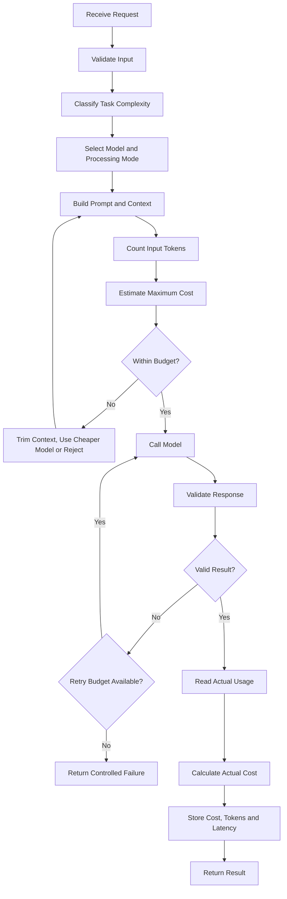
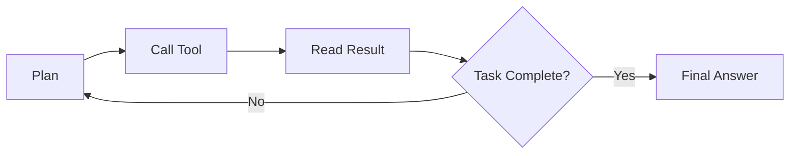
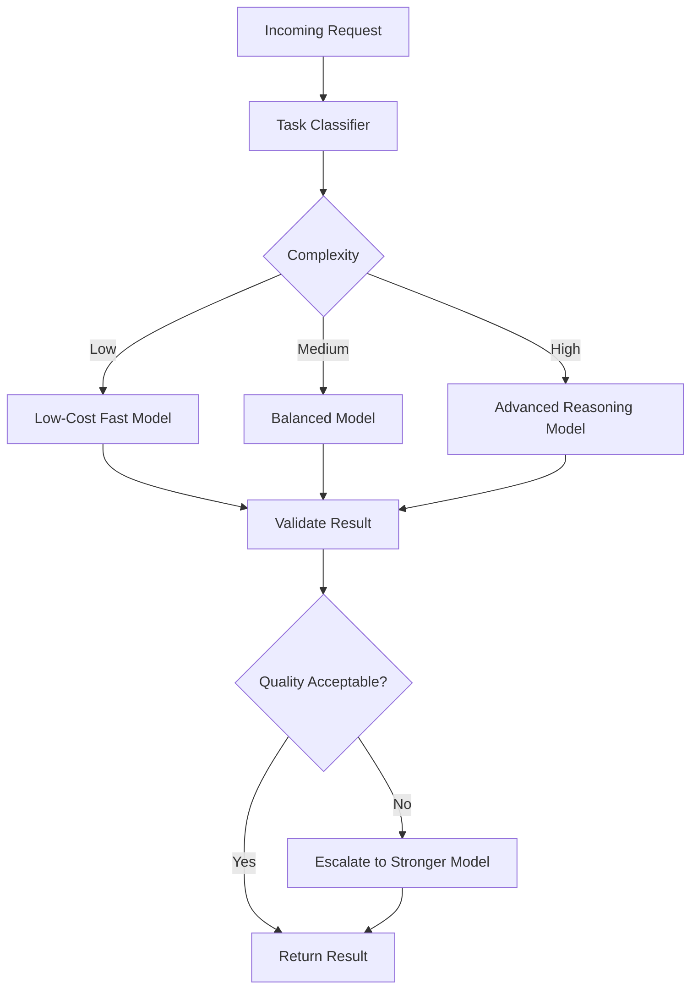

# 015 — Pricing Considerations

**Course:** 02 — Model Platforms and Prompting
**Module:** Module 04 — OpenAI Platform and API
**Content Group:** Operations
**Roadmap Source:** OpenAI Platform and API / Operations
**Lesson Type:** API
**Lesson Order:** 015
**Suggested Duration:** 24 minutes

---

## 1. Lesson Summary

**Pricing considerations** describe how an AI engineer estimates, controls, monitors, and optimizes the cost of running an AI application.

An LLM request is not priced only by the number of API calls. Its cost may depend on:

* Input tokens
* Cached input tokens
* Output tokens
* Model selection
* Reasoning effort
* Images, audio, or video
* Built-in tools
* Retrieval and vector storage
* Processing mode
* Retries and failed requests
* Multi-step agent workflows
* Supporting cloud infrastructure

A production AI system should therefore calculate cost at several levels:

```text
Model call
    ↓
Feature operation
    ↓
User session
    ↓
User or organization
    ↓
Daily and monthly product cost
```

Current OpenAI API pricing distinguishes categories such as input, cached input, and output tokens. Pricing may also vary by model, tool, and processing option, so applications should retrieve or configure current prices rather than embedding permanent values in business logic.

By the end of this lesson, you should be able to estimate the cost of a model call, identify hidden cost drivers, create a cost-aware architecture, and monitor the unit economics of an AI feature.

---

## 2. Learning Objectives

After completing this lesson, you should be able to:

1. Explain API pricing considerations in your own words.
2. Calculate the approximate cost of an LLM request.
3. Distinguish between input, cached-input, and output costs.
4. Identify costs beyond text generation.
5. Compare models using cost, quality, latency, and reliability.
6. Estimate cost per request, session, user, and feature.
7. Recognize how retries and agent loops increase total cost.
8. Add budgets and cost limits to an AI workflow.
9. Log cost-related metrics in production.
10. Apply cost controls to an AI Writing Assistant.

---

## 3. Pricing Is More Than Model Price

A low token price does not automatically produce the cheapest application.

Consider two models:

| Model   | Cost per Call | Success Rate | Average Attempts | Cost per Success |
| ------- | ------------: | -----------: | ---------------: | ---------------: |
| Model A |        $0.002 |          70% |             1.43 |         $0.00286 |
| Model B |        $0.003 |          98% |             1.02 |         $0.00306 |

Model A is cheaper per call, but its lower success rate creates more retries and validation failures.

Now consider another workflow:

| Model   | Model Cost | Average Latency | User Completion Rate |
| ------- | ---------: | --------------: | -------------------: |
| Model C |     $0.004 |       2 seconds |                  90% |
| Model D |     $0.002 |      12 seconds |                  65% |

Model D has a lower API cost but may produce a worse product experience.

A better optimization target is:

```text
Cost per successful, useful outcome
```

not:

```text
Lowest price per token
```

---

## 4. Main Pricing Dimensions

### 4.1 Input-token cost

Input tokens may include:

* Developer instructions
* User messages
* Conversation history
* Few-shot examples
* Retrieved RAG chunks
* Tool descriptions
* Structured-output schemas
* Documents
* Multimodal input representations

A short user question can still create an expensive request when the application adds a large system prompt, long chat history, many tools, and several retrieved documents.

---

### 4.2 Cached-input cost

Repeated prompt prefixes may qualify for cached-input pricing when supported.

Good candidates for stable prefixes include:

* Developer instructions
* Product policies
* Output examples
* Tool definitions
* Reusable background information
* Stable structured-output schemas

Dynamic content should usually appear after stable content:

```text
Stable instructions
    ↓
Stable examples
    ↓
Stable tool definitions
    ↓
Dynamic user context
    ↓
Current user request
```

Cached input can have a different price from normal input, depending on the selected model and API pricing structure.

Caching should still be measured rather than assumed. A large static prompt that receives few repeated requests may not provide meaningful savings.

---

### 4.3 Output-token cost

Output tokens are often more expensive than input tokens.

Output cost grows when an application requests:

* Long explanations
* Complete reports
* Multi-chapter stories
* Large JSON responses
* Verbose reasoning
* Repeated source content
* Several alternative answers

A useful output budget should be defined by feature:

```text
Title generation:        30 tokens
Short classification:   100 tokens
Summary:                 300 tokens
Detailed explanation: 1,000 tokens
Long report:           4,000 tokens
```

These values are examples, not universal limits.

---

### 4.4 Reasoning cost

Reasoning models may consume additional tokens or compute to solve complex tasks.

High reasoning effort may be valuable for:

* Difficult planning
* Complex code analysis
* Multi-constraint decisions
* Mathematical reasoning
* Tool selection
* Long-horizon agent tasks

It may be unnecessary for:

* Simple classification
* Text formatting
* Language detection
* Basic extraction
* Short rewriting
* Template-based responses

A cost-aware application should route simple and difficult tasks differently.

---

### 4.5 Multimodal cost

Multimodal applications may process:

* Images
* Audio
* Video
* Generated speech
* Generated images

The cost model may differ from standard text-token pricing.

For example, an application that analyzes a document image may incur costs for:

1. Image input
2. Extracted or interpreted text
3. Generated response
4. Optional storage
5. Optional embedding and retrieval

Do not apply a text-only formula to every modality.

---

### 4.6 Tool cost

Some API or agent tools may have separate costs.

Examples include:

* Web search
* File search
* Code execution
* Image generation
* Speech generation
* Speech recognition
* Third-party APIs
* Database queries
* Maps or geocoding services

A tool-using agent can therefore create a cost structure such as:

```text
Total operation cost
=
LLM planning cost
+ tool-call cost
+ tool-result processing cost
+ final-generation cost
```

---

### 4.7 Processing mode

A provider may offer different processing modes for different workloads.

Common trade-offs include:

| Mode      | Cost     | Latency      | Suitable Workload                |
| --------- | -------- | ------------ | -------------------------------- |
| Real-time | Standard | Low          | Interactive chat                 |
| Priority  | Higher   | Lowest       | Critical user-facing operations  |
| Flexible  | Lower    | Variable     | Non-urgent processing            |
| Batch     | Lower    | Asynchronous | Offline datasets and evaluations |

The current OpenAI pricing page lists discounted processing options for eligible workloads, including Batch and Flex processing. Exact availability and prices should be verified before implementation.

---

## 5. Basic Cost Formula

When prices are quoted per one million tokens:

```text
uncached_input_cost
=
uncached_input_tokens
÷ 1,000,000
× input_price_per_million

cached_input_cost
=
cached_input_tokens
÷ 1,000,000
× cached_input_price_per_million

output_cost
=
output_tokens
÷ 1,000,000
× output_price_per_million

request_cost
=
uncached_input_cost
+ cached_input_cost
+ output_cost
+ tool_cost
```

Where:

```text
uncached_input_tokens
=
total_input_tokens - cached_input_tokens
```

### Example with placeholder prices

```text
Input tokens:                12,000
Cached input tokens:          8,000
Output tokens:                2,000

Normal input price:      $1.00 / 1M tokens
Cached input price:      $0.25 / 1M tokens
Output price:            $4.00 / 1M tokens
Tool cost:                    $0.003
```

Calculation:

```text
Uncached input tokens
= 12,000 - 8,000
= 4,000

Uncached input cost
= 4,000 / 1,000,000 × $1.00
= $0.004

Cached input cost
= 8,000 / 1,000,000 × $0.25
= $0.002

Output cost
= 2,000 / 1,000,000 × $4.00
= $0.008

Total request cost
= $0.004 + $0.002 + $0.008 + $0.003
= $0.017
```

The prices above are illustrative placeholders. Current prices must come from a versioned pricing configuration.

---

## 6. The Complete Cost Workflow



This workflow separates two important values:

```text
Estimated maximum cost
```

and:

```text
Actual measured cost
```

The estimate protects the system before execution. Actual usage supports billing, analytics, and optimization after execution.

---

## 7. Cost at Different Levels

### 7.1 Cost per model call

```text
call_cost =
token_cost + tool_cost
```

---

### 7.2 Cost per feature operation

A single feature may require multiple calls.

```text
feature_cost =
sum(all model calls)
+ sum(all tool calls)
```

Example summarization pipeline:

```text
4 chunk summaries
+ 1 final summary
= 5 model calls
```

---

### 7.3 Cost per session

```text
session_cost =
sum(feature operations in one session)
```

A user may perform several rewrites, translations, and follow-up questions during one session.

---

### 7.4 Cost per active user

```text
cost_per_active_user =
total monthly AI cost
÷ monthly active users
```

---

### 7.5 Cost per successful result

```text
cost_per_success =
total cost
÷ number of validated successful results
```

This metric includes the effect of:

* Failed requests
* Retries
* Invalid JSON
* Timeouts
* User cancellations
* Agent loops

---

### 7.6 Gross margin per user

```text
gross_profit_per_user
=
revenue_per_user
- AI variable cost
- other variable infrastructure cost
```

```text
gross_margin_percentage
=
gross_profit_per_user
÷ revenue_per_user
× 100
```

An AI feature can appear inexpensive per request while becoming unsustainable when users make hundreds of requests each month.

---

## 8. Hidden Cost Multipliers

### 8.1 Retries

Suppose one operation costs $0.01 per attempt.

```text
First attempt:  $0.01
Retry 1:        $0.01
Retry 2:        $0.01
Total:          $0.03
```

The user sees one result, but the system pays for three attempts.

Use:

* Exponential backoff
* Maximum retry counts
* Error classification
* Idempotency
* Retry budgets
* Provider fallback rules

Do not retry every error automatically.

---

### 8.2 Agent loops

An agent may repeatedly:

1. Plan
2. Select a tool
3. Call the tool
4. Read the result
5. Re-plan
6. Generate the answer



Without limits, cost grows with every loop.

Useful controls include:

```text
max_agent_steps
max_total_tokens
max_tool_calls
max_operation_cost
max_execution_time
```

---

### 8.3 Conversation history

Chat input grows over time:

```text
Request 1:
system + message 1

Request 2:
system + message 1 + answer 1 + message 2

Request 20:
system + 19 previous exchanges + message 20
```

Possible controls:

* Keep only recent messages
* Summarize older messages
* Store structured memory
* Retrieve only relevant history
* Remove duplicate content
* Start a new conversation when appropriate

---

### 8.4 RAG retrieval

A RAG request may contain more retrieved text than the user query requires.

```text
RAG operation cost
=
embedding cost
+ vector database cost
+ reranking cost
+ generation input cost
+ output cost
```

Important parameters include:

* Chunk size
* Chunk overlap
* Top-k
* Relevance threshold
* Reranking depth
* Metadata filters
* Deduplication
* Maximum context budget

Retrieving more chunks does not guarantee a better answer.

---

### 8.5 Structured-output schemas

A large JSON schema may be sent with every request.

For example:

```text
Small schema:      300 tokens
Large schema:    8,000 tokens
Requests/day:   10,000
```

The schema alone could contribute:

```text
8,000 × 10,000
= 80,000,000 input tokens per day
```

Reduce unnecessary:

* Field descriptions
* Repeated examples
* Deep nesting
* Duplicate enum explanations
* Unused optional fields

---

### 8.6 Failed validation

A model response may consume tokens but still fail because it contains:

* Invalid JSON
* Missing fields
* Unsupported values
* Unsafe content
* Incorrect language
* Excessive length
* Hallucinated references

Track both:

```text
API success
```

and:

```text
Application-level success
```

A `200 OK` response is not necessarily a usable product result.

---

## 9. Model Selection as a Cost–Quality Decision

Do not select a model by price alone.

Evaluate:

| Dimension         | Question                                      |
| ----------------- | --------------------------------------------- |
| Quality           | Does the result meet the acceptance criteria? |
| Input price       | How expensive is the prompt and context?      |
| Output price      | How expensive is the expected response?       |
| Latency           | Is it fast enough for the interface?          |
| Reliability       | How often does it produce a valid result?     |
| Context size      | Can it process the required input?            |
| Tool support      | Can it use the required tools?                |
| Structured output | Does it follow the schema reliably?           |
| Reasoning         | Is advanced reasoning necessary?              |
| Availability      | Is the model consistently accessible?         |

### Simple model score

A benchmark may calculate:

```text
value_score
=
quality_score
÷ cost_per_successful_request
```

A more balanced score could be:

```text
weighted_score
=
0.50 × normalized_quality
+ 0.20 × normalized_reliability
+ 0.15 × normalized_speed
+ 0.15 × normalized_cost_efficiency
```

Weights should reflect the product’s real priorities.

---

## 10. Cost-Aware Model Routing

Different tasks may use different models.



Example routing:

| Task                         | Initial Model Tier       |
| ---------------------------- | ------------------------ |
| Language detection           | Low-cost                 |
| Sentiment classification     | Low-cost                 |
| Short rewriting              | Low-cost or balanced     |
| Long translation             | Balanced                 |
| Complex document explanation | Balanced or advanced     |
| Architecture analysis        | Advanced                 |
| High-risk decision support   | Advanced with validation |

Escalation should occur only when the first result fails a measurable quality check.

---

## 11. Practical Python Cost Calculator

```python
from dataclasses import dataclass
from decimal import Decimal


ONE_MILLION = Decimal("1000000")


@dataclass(frozen=True)
class ModelPricing:
    input_per_million: Decimal
    cached_input_per_million: Decimal
    output_per_million: Decimal


@dataclass(frozen=True)
class Usage:
    input_tokens: int
    cached_input_tokens: int
    output_tokens: int
    tool_cost_usd: Decimal = Decimal("0")


def validate_usage(usage: Usage) -> None:
    values = (
        usage.input_tokens,
        usage.cached_input_tokens,
        usage.output_tokens,
    )

    if any(value < 0 for value in values):
        raise ValueError("Token counts cannot be negative.")

    if usage.cached_input_tokens > usage.input_tokens:
        raise ValueError(
            "Cached input tokens cannot exceed total input tokens."
        )

    if usage.tool_cost_usd < 0:
        raise ValueError("Tool cost cannot be negative.")


def calculate_request_cost(
    usage: Usage,
    pricing: ModelPricing,
) -> dict[str, Decimal]:
    validate_usage(usage)

    uncached_input_tokens = (
        usage.input_tokens - usage.cached_input_tokens
    )

    input_cost = (
        Decimal(uncached_input_tokens)
        / ONE_MILLION
        * pricing.input_per_million
    )

    cached_input_cost = (
        Decimal(usage.cached_input_tokens)
        / ONE_MILLION
        * pricing.cached_input_per_million
    )

    output_cost = (
        Decimal(usage.output_tokens)
        / ONE_MILLION
        * pricing.output_per_million
    )

    total_cost = (
        input_cost
        + cached_input_cost
        + output_cost
        + usage.tool_cost_usd
    )

    return {
        "input_cost_usd": input_cost,
        "cached_input_cost_usd": cached_input_cost,
        "output_cost_usd": output_cost,
        "tool_cost_usd": usage.tool_cost_usd,
        "total_cost_usd": total_cost,
    }


if __name__ == "__main__":
    # Placeholder prices for demonstration only.
    pricing = ModelPricing(
        input_per_million=Decimal("1.00"),
        cached_input_per_million=Decimal("0.25"),
        output_per_million=Decimal("4.00"),
    )

    usage = Usage(
        input_tokens=12_000,
        cached_input_tokens=8_000,
        output_tokens=2_000,
        tool_cost_usd=Decimal("0.003"),
    )

    result = calculate_request_cost(usage, pricing)

    for name, value in result.items():
        print(f"{name}: ${value:.6f}")
```

### Why use `Decimal`?

Currency calculations should avoid unnecessary floating-point rounding errors.

Store prices separately from application logic:

```text
config/
└── model-pricing.json
```

Example:

```json
{
  "provider": "example-provider",
  "currency": "USD",
  "effective_from": "2026-07-18",
  "models": {
    "MODEL_ID": {
      "input_per_million": 1.0,
      "cached_input_per_million": 0.25,
      "output_per_million": 4.0
    }
  }
}
```

The values are placeholders. The configuration should include an effective date because provider pricing can change.

---

## 12. Pre-Request Maximum-Cost Guard

An application should estimate the worst acceptable cost before calling the model.

```python
from decimal import Decimal


def estimate_maximum_cost(
    *,
    estimated_input_tokens: int,
    maximum_output_tokens: int,
    pricing: ModelPricing,
) -> Decimal:
    input_cost = (
        Decimal(estimated_input_tokens)
        / ONE_MILLION
        * pricing.input_per_million
    )

    output_cost = (
        Decimal(maximum_output_tokens)
        / ONE_MILLION
        * pricing.output_per_million
    )

    return input_cost + output_cost


def enforce_cost_limit(
    estimated_cost: Decimal,
    maximum_cost: Decimal,
) -> None:
    if estimated_cost > maximum_cost:
        raise ValueError(
            f"Estimated cost ${estimated_cost:.6f} exceeds "
            f"the limit of ${maximum_cost:.6f}."
        )
```

Usage:

```python
estimated_cost = estimate_maximum_cost(
    estimated_input_tokens=20_000,
    maximum_output_tokens=2_000,
    pricing=pricing,
)

enforce_cost_limit(
    estimated_cost=estimated_cost,
    maximum_cost=Decimal("0.05"),
)
```

Possible actions when the request exceeds the budget:

1. Reduce retrieved context.
2. Summarize conversation history.
3. Lower the output-token limit.
4. Select a cheaper model.
5. Split the task into controlled stages.
6. Ask the user to shorten the input.
7. Require a higher subscription tier.
8. Reject the operation safely.

---

## 13. Recommended Cost Log

```json
{
  "operation_id": "op_01JXYZ",
  "request_id": "req_01JABC",
  "user_id": "user_123",
  "organization_id": "org_456",
  "feature": "rewrite",
  "model": "MODEL_ID",
  "provider": "openai",
  "processing_mode": "realtime",
  "prompt_version": "rewrite-v3",
  "attempt": 1,
  "input_tokens": 2400,
  "cached_input_tokens": 1500,
  "output_tokens": 620,
  "tool_cost_usd": 0,
  "model_cost_usd": 0.00488,
  "total_cost_usd": 0.00488,
  "latency_ms": 1820,
  "validation_status": "passed",
  "api_status": "success",
  "created_at": "2026-07-18T05:00:00Z"
}
```

### Important dimensions

Track cost by:

* User
* Organization
* Feature
* Model
* Provider
* Prompt version
* Environment
* Processing mode
* Request status
* Validation status
* Retry attempt
* Date and billing period

---

## 14. Cost Dashboard

A production dashboard should answer:

* How much did the application spend today?
* Which feature is the most expensive?
* Which model has the best cost per successful result?
* Which users or organizations consume the most resources?
* How much cost came from retries?
* How much input was cached?
* Which prompt version increased token usage?
* Which agent workflows exceeded their step budgets?
* Are monthly costs growing faster than active users?

### Suggested metrics

```text
Total cost
Cost by feature
Cost by model
Cost by user
Cost by organization
Average cost per request
P95 cost per request
Cost per successful result
Cost per active user
Retry cost
Failed-request cost
Tool cost
Cached-input savings
Monthly budget utilization
```

### Budget utilization

```text
budget_utilization
=
current_spend
÷ monthly_budget
× 100
```

### Forecasted monthly cost

```text
forecasted_monthly_cost
=
current_spend
÷ elapsed_days
× days_in_month
```

A more reliable forecast should account for weekday patterns, growth, and seasonality.

---

## 15. Applying Pricing Considerations to an AI Writing Assistant

The related project includes:

* Summarize
* Rewrite
* Translate
* Explain
* JSON output

### Feature cost profiles

| Feature     | Input Pattern      | Output Pattern          | Main Cost Risk                          |
| ----------- | ------------------ | ----------------------- | --------------------------------------- |
| Summarize   | Large input        | Short output            | Large source documents                  |
| Rewrite     | Medium input       | Similar-size output     | Rewriting complete documents repeatedly |
| Translate   | Medium–large input | Similar-size output     | High output-token usage                 |
| Explain     | Small–medium input | Potentially long output | Uncontrolled verbosity                  |
| JSON output | Prompt plus schema | Structured output       | Large schema and validation retries     |

### Suggested controls

#### Summarize

* Limit document size.
* Chunk only when necessary.
* Track every map and reduce call.
* Use batch processing for offline datasets.
* Cache repeated document summaries.
* Avoid summarizing unchanged content again.

#### Rewrite

* Send only the selected paragraph or section.
* Store document versions outside the prompt.
* Ask for one final version rather than several unused alternatives.
* Restrict output length to the expected source length.

#### Translate

* Use a suitable model tier instead of an advanced reasoning model by default.
* Preserve formatting without repeating the original text.
* Process large documents by section.
* Reuse validated terminology through compact glossaries.

#### Explain

* Offer depth levels:

```text
Brief
Standard
Detailed
```

* Map each level to an output budget.
* Prevent the response from unnecessarily repeating the source material.

#### JSON output

* Keep schemas minimal.
* Validate before retrying.
* Repair small formatting errors locally when safe.
* Do not repeat an expensive model call for a trivial parsing issue.
* Record the cost of failed validation separately.

---

## 16. Practical Exercise

### Goal

Create a cost-aware API route for an AI Writing Assistant.

The route must:

1. Validate the request.
2. Select a model based on the feature.
3. Count or estimate input tokens.
4. Estimate the maximum request cost.
5. Reject requests above the configured budget.
6. Call the model.
7. Validate the result.
8. Record actual token usage.
9. Calculate actual cost.
10. Return usage and cost metadata.

### Example input

```json
{
  "feature": "summarize",
  "text": "A long document...",
  "output_style": "bullet_points",
  "maximum_output_tokens": 300,
  "maximum_cost_usd": 0.02
}
```

### Expected output

```json
{
  "result": [
    "First important point",
    "Second important point",
    "Third important point"
  ],
  "usage": {
    "input_tokens": 4200,
    "cached_input_tokens": 1200,
    "output_tokens": 180,
    "total_tokens": 4380
  },
  "cost": {
    "estimated_maximum_usd": 0.018,
    "actual_usd": 0.0114
  },
  "metrics": {
    "latency_ms": 1450,
    "attempts": 1,
    "validation_status": "passed"
  }
}
```

### Required test cases

Test at least:

* Empty input
* Very short input
* Maximum permitted input
* Input above the cost budget
* Invalid output limit
* Invalid structured output
* Timeout
* Rate-limit response
* One retry
* Retry-budget exhaustion
* Provider failure
* Expensive tool call
* Long conversation history

### Analysis questions

1. Which feature had the highest average cost?
2. Which feature had the highest output-token cost?
3. How much money was spent on failed attempts?
4. Did a cheaper model create more retries?
5. Which model had the lowest cost per validated result?
6. How much cost came from conversation history?
7. How much could caching reduce repeated-input cost?
8. Which prompt version was the most cost-efficient?
9. Did lower cost reduce answer quality?
10. What monthly budget would support 10,000 active users?

---

## 17. Common Mistakes

### Mistake 1: Comparing only input-token prices

A model may have inexpensive input but expensive output.

**Better approach:** Calculate the full expected request cost.

---

### Mistake 2: Ignoring retries

Retries can multiply the cost of one visible user operation.

**Better approach:** Track cost by attempt and by operation.

---

### Mistake 3: Selecting the cheapest model without evaluation

A weak model may create invalid output, poor user satisfaction, and expensive fallback calls.

**Better approach:** Compare cost per successful result.

---

### Mistake 4: Hard-coding prices

Provider and model prices may change.

**Better approach:** Use versioned pricing configuration with effective dates.

---

### Mistake 5: Treating streaming as a cost reduction

Streaming improves perceived responsiveness, but it does not automatically reduce generated-token cost.

**Better approach:** Control output length and stop generation when appropriate.

---

### Mistake 6: Ignoring non-model costs

Vector databases, tools, cloud functions, logging, storage, and network traffic can materially affect unit economics.

**Better approach:** Calculate the complete feature cost.

---

### Mistake 7: Retrying invalid JSON with the same request

The same prompt may produce the same error and duplicate the full cost.

**Better approach:** Improve the schema, use structured output, or apply a targeted repair strategy.

---

### Mistake 8: Allowing unlimited agent steps

A looping agent can consume a large budget without completing the task.

**Better approach:** Set step, token, tool, time, and cost limits.

---

### Mistake 9: Measuring cost without quality

A low-cost response that users cannot use has poor economic value.

**Better approach:** Measure cost, quality, reliability, and latency together.

---

### Mistake 10: Using one average for every user

Heavy users may consume many times more resources than typical users.

**Better approach:** Analyze cost distributions and percentiles.

---

## 18. Production Checklist

### Pricing configuration

* [ ] Store prices outside application logic.
* [ ] Record the pricing effective date.
* [ ] Support separate input, cached-input, and output prices.
* [ ] Support tool and multimodal costs.
* [ ] Verify current provider pricing regularly.
* [ ] Preserve historical prices for past cost reports.

### Before the request

* [ ] Validate input size.
* [ ] Select an appropriate model tier.
* [ ] Count or estimate input tokens.
* [ ] Reserve a controlled output budget.
* [ ] Estimate maximum request cost.
* [ ] Enforce user and feature budgets.
* [ ] Limit RAG context.
* [ ] Limit conversation history.
* [ ] Limit agent steps and tool calls.

### During execution

* [ ] Record every model attempt.
* [ ] Record every paid tool call.
* [ ] Apply retry limits.
* [ ] Prevent duplicate concurrent requests.
* [ ] Stop runaway agent loops.
* [ ] Use timeouts.
* [ ] Preserve operation-level identifiers.

### After the request

* [ ] Read actual token usage.
* [ ] Calculate actual cost.
* [ ] Validate the output.
* [ ] Record application-level success.
* [ ] Record retry and failure cost.
* [ ] Compare estimated and actual cost.
* [ ] Update user and organization quotas.
* [ ] Send metrics to the monitoring system.

### Monitoring

* [ ] Track daily and monthly spend.
* [ ] Track cost by feature and model.
* [ ] Track cost per successful result.
* [ ] Track cost per active user.
* [ ] Track retry-related cost.
* [ ] Track failed-request cost.
* [ ] Track cache effectiveness.
* [ ] Alert on unusual cost growth.
* [ ] Forecast end-of-month spend.
* [ ] Review cost-quality benchmarks regularly.

---

## 19. Completion Checklist

* [ ] I can explain **Pricing Considerations** in one or two minutes.
* [ ] I can calculate input, cached-input, and output costs.
* [ ] I understand the difference between cost per call and cost per successful result.
* [ ] I can identify hidden costs from retries, tools, RAG, and agent loops.
* [ ] I can estimate a request’s maximum cost before execution.
* [ ] I can record actual cost after execution.
* [ ] I have created a small cost-aware API demo.
* [ ] I can compare models by cost, quality, latency, and reliability.
* [ ] I understand how pricing affects product quotas and subscriptions.
* [ ] I have documented at least one limitation or open question.

---

## 20. Related Outcome

Call LLM APIs from applications while managing:

* Messages
* Tokens
* Cost
* Model selection
* Context limits
* Latency
* Retries
* Rate limits
* Tool usage
* Structured outputs
* Budgets
* Production observability

---

## 21. Related Project

### Project 3 — AI Writing Assistant

Build an application supporting:

* Summarization
* Rewriting
* Translation
* Explanation
* Validated JSON output

The project should include:

1. A model-pricing configuration file
2. Input-token estimation
3. Maximum-cost validation
4. Feature-specific model routing
5. Output-token limits
6. Retry budgets
7. Per-request cost logs
8. Cost per successful result
9. User quotas
10. A cost and latency dashboard

---

## 22. Key Takeaways

Pricing considerations connect API engineering with product economics.

```text
User request
    ↓
Classify complexity
    ↓
Select model
    ↓
Estimate tokens and maximum cost
    ↓
Apply budget guard
    ↓
Execute with retry limits
    ↓
Validate the result
    ↓
Measure actual usage
    ↓
Calculate total operation cost
    ↓
Optimize cost per successful outcome
```

The most important principle is:

> Optimize for the lowest cost that still delivers the required quality, reliability, latency, and user value.

A production AI application should not merely know how much one model call costs. It should understand:

* Why the call was made
* Whether the result was useful
* Whether retries were necessary
* Which feature generated the cost
* Whether the selected model was appropriate
* How the cost affects product sustainability

Pricing should therefore be treated as a measurable architectural constraint, not as an afterthought added after deployment.
