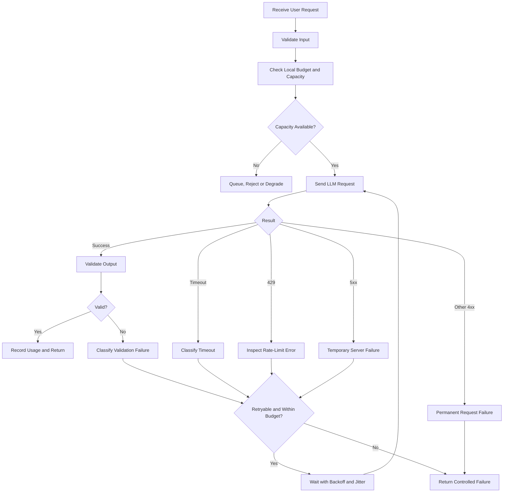
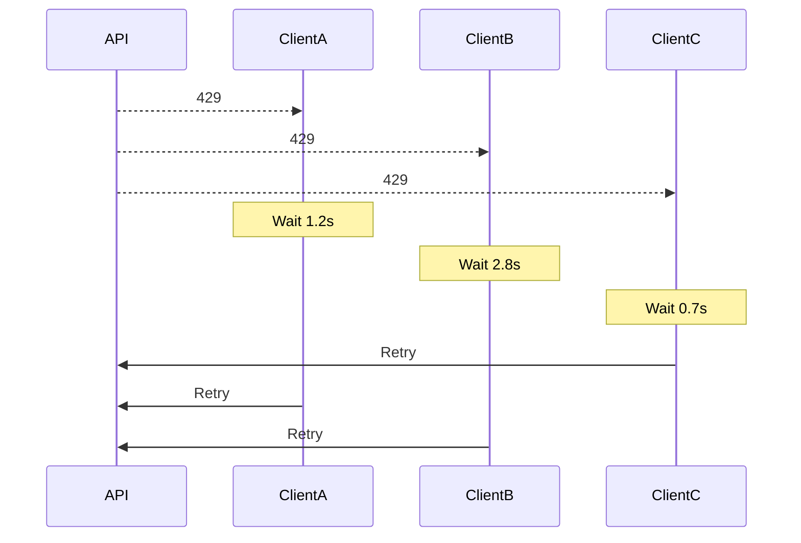
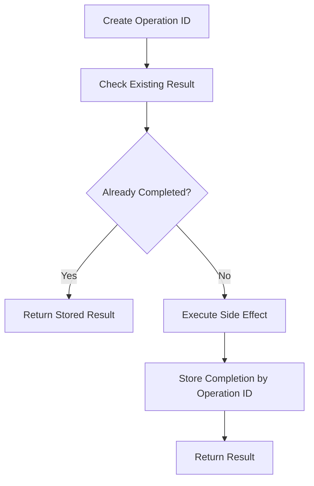
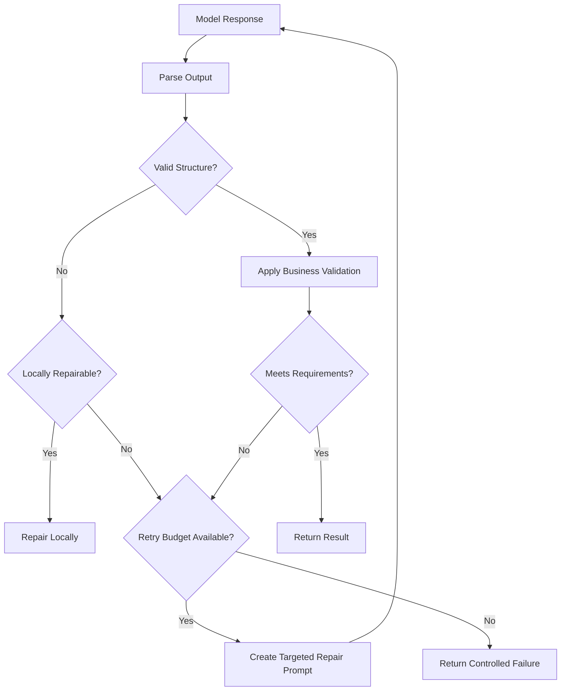

# 016 — Retry, Timeout, and Rate Limits

**Course:** 02 — Model Platforms and Prompting
**Module:** Module 04 — OpenAI Platform and API
**Content Group:** Operations
**Roadmap Source:** OpenAI Platform and API / Operations
**Lesson Type:** API
**Lesson Order:** 016
**Suggested Duration:** 24 minutes

---

## 1. Lesson Summary

Calling an LLM API is a network operation. Even when the prompt and application code are correct, a request may fail because of:

* Temporary network problems
* Slow model generation
* Connection or read timeouts
* Provider overload
* Rate limits
* Internal server errors
* Invalid authentication
* Incorrect request parameters
* Exhausted usage quotas
* Upstream gateway failures

A production AI application must distinguish between failures that should be retried and failures that require an immediate stop.

The basic reliability workflow is:

```text
send request
    ↓
receive response or error
    ↓
classify the result
    ↓
retry, fail, queue or degrade
    ↓
record attempts, latency and cost
    ↓
return a controlled response
```

A good retry strategy does not mean repeatedly sending the same request until it works. It means:

1. Retrying only transient failures
2. Waiting between attempts
3. Adding randomness to retry timing
4. Respecting the provider’s retry instructions
5. Limiting attempts, time, tokens, and cost
6. Preventing duplicate side effects
7. Logging every attempt

The official OpenAI Python SDK currently retries selected transient errors twice by default. These include connection failures, HTTP `408`, `409`, `429`, and server errors with status codes of `500` or higher. Its documented default request timeout is 10 minutes, although both retry and timeout behavior can be configured.

---

## 2. Learning Objectives

After completing this lesson, you should be able to:

1. Explain retries, timeouts, and rate limits in your own words.
2. Distinguish transient failures from permanent failures.
3. Decide which errors are safe to retry.
4. Configure explicit API timeouts.
5. Implement exponential backoff with jitter.
6. Handle HTTP `429 Too Many Requests`.
7. Respect retry and operation budgets.
8. Prevent duplicate operations during retries.
9. Add concurrency limits and request queues.
10. Log retry, timeout, and rate-limit metrics.
11. Test unreliable API behavior.
12. Apply these concepts to an AI Writing Assistant.

---

## 3. Core Concepts

### 3.1 Retry

A **retry** is another attempt to perform an operation after a previous attempt failed.

Retries are useful when the failure is temporary, such as:

* A short network interruption
* A connection reset
* A temporary provider overload
* A request timeout
* A transient rate limit
* An internal server error

Retries are usually harmful when the request itself is invalid.

Examples include:

* Invalid API key
* Unsupported model
* Malformed JSON
* Missing required parameter
* Input exceeding the context limit
* Permission denied
* Invalid structured-output schema

Retrying a permanent error normally produces the same failure while increasing latency and system load.

---

### 3.2 Timeout

A **timeout** limits how long the application waits for an operation.

Without a timeout, a request may remain open for an unacceptable period, consuming:

* Server connections
* Worker processes
* Memory
* User attention
* Concurrent-request capacity
* Infrastructure resources

A timeout should lead to a controlled failure, retry, fallback, or cancellation.

---

### 3.3 Rate limit

A **rate limit** restricts how much API traffic a project, organization, account, model, or API key can submit within a period.

Common limits include:

* Requests per minute
* Tokens per minute
* Requests per day
* Tokens per day
* Concurrent requests
* Model-specific limits

Rate limits protect provider capacity and help distribute resources fairly.

OpenAI notes that limits may be enforced over intervals shorter than one minute. Therefore, a burst of requests can produce rate-limit errors even when the total appears to remain below a published per-minute limit. OpenAI also notes that unsuccessful requests may contribute to rate-limit consumption.

---

## 4. How the Concepts Work Together

Retry, timeout, and rate-limit policies should be designed as one reliability system.



The important decision is not simply:

```text
Did the request fail?
```

It is:

```text
Why did the request fail,
is another attempt likely to succeed,
and is another attempt still within budget?
```

---

## 5. Error Classification

A retry policy should begin with error classification.

### 5.1 Common retryable failures

| Failure                               | Typical Action         |
| ------------------------------------- | ---------------------- |
| Connection reset                      | Retry with backoff     |
| Temporary DNS or network failure      | Retry with backoff     |
| Connection timeout                    | Retry if time remains  |
| Read timeout                          | Retry cautiously       |
| HTTP 408                              | Retry                  |
| HTTP 409 caused by temporary conflict | Retry when appropriate |
| HTTP 429 rate limit                   | Wait, then retry       |
| HTTP 500                              | Retry                  |
| HTTP 502                              | Retry                  |
| HTTP 503                              | Retry                  |
| HTTP 504                              | Retry                  |

The official OpenAI Python SDK automatically retries connection errors, `408`, `409`, `429`, and responses with status codes of `500` or higher by default.

---

### 5.2 Common non-retryable failures

| Failure                         | Typical Action                        |
| ------------------------------- | ------------------------------------- |
| HTTP 400 bad request            | Fix the payload                       |
| HTTP 401 authentication failure | Fix the API key                       |
| HTTP 403 permission denied      | Fix access or project settings        |
| HTTP 404 resource not found     | Correct the model or resource ID      |
| HTTP 422 validation failure     | Correct the request structure         |
| Context limit exceeded          | Reduce the input                      |
| Unsupported feature             | Select another model or API           |
| Invalid schema                  | Repair the schema                     |
| Safety rejection                | Follow the applicable safety workflow |

A retry cannot repair an invalid request unless the application modifies the request first.

---

### 5.3 Conditional retries

Some failures require additional context.

#### Invalid structured output

A retry may be reasonable when:

* The response is nearly valid
* The model failed to include one required field
* The application can send a smaller repair prompt
* The remaining cost and time budgets allow it

A retry may not be reasonable when:

* The schema is incorrect
* The model does not support the requested format
* The prompt contains contradictory instructions
* Several previous attempts produced the same error

#### Content or quality failure

A response that is grammatically valid may still fail product requirements.

Possible actions include:

1. Repair locally.
2. Retry with a corrected prompt.
3. Escalate to a stronger model.
4. Return the best available response with a warning.
5. Fail the operation safely.

---

## 6. Retry Budgets

Retries must be limited.

A retry budget may include:

```text
Maximum attempts
Maximum total elapsed time
Maximum total tokens
Maximum total cost
Maximum tool calls
Maximum model escalations
```

Example:

```text
Maximum attempts:        3
Maximum elapsed time:   20 seconds
Maximum total tokens:   8,000
Maximum total cost:     $0.03
```

The next attempt should occur only when every relevant budget still permits it.

```text
retry_allowed =
    retryable_error
    AND attempts_remaining
    AND time_remaining
    AND token_budget_remaining
    AND cost_budget_remaining
```

### Attempt count versus retry count

These values are different:

```text
1 initial attempt + 2 retries = 3 total attempts
```

Use clear configuration names:

```python
max_attempts = 3
```

or:

```python
max_retries = 2
```

Avoid using the two names interchangeably.

---

## 7. Exponential Backoff

Immediately resending a failed request can make overload worse.

**Exponential backoff** increases the waiting period after each failed attempt.

A simple formula is:

```text
delay = base_delay × 2^retry_number
```

Example:

| Retry Number |       Delay |
| -----------: | ----------: |
|            0 | 0.5 seconds |
|            1 |    1 second |
|            2 |   2 seconds |
|            3 |   4 seconds |
|            4 |   8 seconds |

A maximum cap prevents excessively long delays:

```text
delay =
min(max_delay, base_delay × 2^retry_number)
```

OpenAI recommends exponential backoff for rate-limit errors. Repeated unsuccessful requests without sufficient delay can continue contributing to the limit rather than resolving the problem.

---

## 8. Jitter

When many application instances fail simultaneously, they may all retry at exactly the same time.

This creates a **thundering herd**:

```text
Provider temporarily fails
        ↓
1,000 clients wait 2 seconds
        ↓
1,000 clients retry together
        ↓
Provider becomes overloaded again
```

**Jitter** adds randomness to the delay.

### Full-jitter formula

```text
maximum_delay =
min(cap, base × 2^retry_number)

actual_delay =
random value between 0 and maximum_delay
```

Example:

```text
Calculated maximum delay: 4 seconds
Actual randomized delay:   2.7 seconds
```

Different clients now retry at different times.



---

## 9. Respecting `Retry-After`

A rate-limited or overloaded service may return a `Retry-After` header.

When present and valid, the application should normally prefer the server-provided delay over its locally calculated delay.

```text
if Retry-After is valid:
    wait Retry-After
else:
    use exponential backoff with jitter
```

A defensive application should still enforce a maximum permitted delay:

```text
actual_delay =
min(server_retry_after, application_delay_cap)
```

The current OpenAI Python client examines retry-related response headers and otherwise applies a capped exponential backoff with jitter internally.

---

## 10. Timeout Types

A single `timeout=30` setting may hide several different timeout stages.

### 10.1 Connection timeout

Maximum time allowed to establish the network connection.

```text
Application → DNS → Network → Provider
```

Typical causes:

* DNS problems
* Network outage
* Firewall issue
* Unreachable host
* Connection-pool exhaustion

---

### 10.2 Write timeout

Maximum time allowed to send the request body.

This matters when sending:

* Large documents
* Images
* Audio
* File uploads
* Large tool schemas

---

### 10.3 Read timeout

Maximum time allowed to wait for response data.

This is especially important for:

* Long model generations
* Reasoning models
* Large JSON outputs
* Tool-using workflows

For streaming, the read timeout may act as an **idle timeout** between response chunks rather than a total generation deadline, depending on the HTTP client.

---

### 10.4 Pool timeout

Maximum time allowed to wait for an available connection from the HTTP connection pool.

A pool timeout often indicates that the application has:

* Too much concurrency
* Too few available connections
* Requests that remain open too long
* Missing client reuse
* A connection leak

---

### 10.5 Operation deadline

A complete user operation may contain several model and tool calls.

```text
User request
    ↓
Model planning call
    ↓
Search tool
    ↓
Retrieval tool
    ↓
Final model call
```

Each call may have its own timeout, but the entire operation also needs a deadline.

```text
total operation deadline = 30 seconds
```

Retries must use the remaining time rather than restarting the complete 30-second budget.

---

## 11. Timeout Hierarchy

Timeouts may exist at several infrastructure layers:


Example:

| Layer                       |    Timeout |
| --------------------------- | ---------: |
| Mobile application          | 35 seconds |
| CDN/load balancer           | 32 seconds |
| Application operation       | 28 seconds |
| Inference gateway           | 25 seconds |
| Individual provider attempt | 12 seconds |

The inner operation should usually finish before an outer layer terminates the connection unexpectedly.

A poor configuration looks like:

```text
Load balancer timeout:       30 seconds
Provider request timeout:   120 seconds
```

The load balancer disconnects first, but the backend may continue performing expensive work that the user will never receive.

---

## 12. Configure Explicit SDK Behavior

Do not rely blindly on library defaults.

The official OpenAI Python SDK currently documents:

* Two automatic retries for selected transient failures
* A default timeout of 10 minutes
* `APITimeoutError` for timed-out requests
* Configurable client-level and per-request behavior

For interactive applications, explicit settings are usually easier to reason about.

```python
import os

import httpx
from openai import OpenAI


client = OpenAI(
    api_key=os.environ["OPENAI_API_KEY"],
    max_retries=2,
    timeout=httpx.Timeout(
        timeout=30.0,
        connect=3.0,
        read=25.0,
        write=10.0,
        pool=2.0,
    ),
)

response = client.responses.create(
    model=os.environ["OPENAI_MODEL"],
    input="Explain exponential backoff in three bullet points.",
    max_output_tokens=300,
)

print(response.output_text)
```

The model ID should be supplied through configuration rather than hard-coded throughout the application.

---

## 13. Avoid Nested Retry Multiplication

Retries may be configured in several places:

* OpenAI SDK
* Application service
* API gateway
* Job queue
* Reverse proxy
* Workflow engine

Suppose every layer performs two retries:

```text
Application attempts: 3
SDK attempts:         3
Gateway attempts:     3
```

The worst-case provider-call count can become:

```text
3 × 3 × 3 = 27 attempts
```

This creates:

* High latency
* Unexpected cost
* Increased rate-limit pressure
* Duplicate side effects
* Difficult logs
* Unpredictable user experience

Choose one primary retry owner whenever possible.

Example:

```text
Application owns retry policy.
SDK retries are disabled.
Gateway performs no hidden retries.
```

Or:

```text
SDK handles simple transient retries.
Application does not retry the same provider call.
Application handles only model fallback.
```

Document the decision clearly.

---

## 14. Custom Retry Wrapper

A custom wrapper is useful when the application needs:

* A total operation deadline
* Cost-aware retries
* Custom metrics
* Model fallback
* Different policies by feature
* Explicit backoff behavior

When implementing manual retries, disable SDK retries to avoid stacking policies.

```python
import asyncio
import os
import random
import time
from dataclasses import dataclass

import httpx
import openai
from openai import AsyncOpenAI


@dataclass(frozen=True)
class RetryPolicy:
    max_attempts: int = 3
    base_delay_seconds: float = 0.5
    max_delay_seconds: float = 8.0
    operation_timeout_seconds: float = 25.0


client = AsyncOpenAI(
    api_key=os.environ["OPENAI_API_KEY"],
    max_retries=0,
    timeout=httpx.Timeout(
        timeout=15.0,
        connect=3.0,
        read=12.0,
        write=8.0,
        pool=2.0,
    ),
)


def full_jitter_delay(
    *,
    retry_number: int,
    base_delay: float,
    maximum_delay: float,
) -> float:
    upper_bound = min(
        maximum_delay,
        base_delay * (2**retry_number),
    )
    return random.uniform(0, upper_bound)


def is_retryable_status(status_code: int) -> bool:
    return (
        status_code in {408, 409, 429}
        or status_code >= 500
    )


async def generate_with_retry(
    *,
    prompt: str,
    model: str,
    policy: RetryPolicy,
) -> str:
    if not prompt.strip():
        raise ValueError("Prompt cannot be empty.")

    started_at = time.monotonic()
    last_error: Exception | None = None

    for attempt in range(1, policy.max_attempts + 1):
        elapsed = time.monotonic() - started_at
        remaining_time = (
            policy.operation_timeout_seconds - elapsed
        )

        if remaining_time <= 0:
            raise TimeoutError(
                "The complete model operation exceeded its deadline."
            ) from last_error

        try:
            response = await asyncio.wait_for(
                client.responses.create(
                    model=model,
                    input=prompt,
                    max_output_tokens=400,
                ),
                timeout=remaining_time,
            )

            return response.output_text

        except (
            openai.APITimeoutError,
            openai.APIConnectionError,
        ) as exc:
            last_error = exc
            retryable = True

        except openai.APIStatusError as exc:
            last_error = exc
            retryable = is_retryable_status(exc.status_code)

        if not retryable:
            raise last_error

        if attempt >= policy.max_attempts:
            break

        retry_number = attempt - 1
        delay = full_jitter_delay(
            retry_number=retry_number,
            base_delay=policy.base_delay_seconds,
            maximum_delay=policy.max_delay_seconds,
        )

        elapsed = time.monotonic() - started_at
        remaining_time = (
            policy.operation_timeout_seconds - elapsed
        )

        if delay >= remaining_time:
            break

        await asyncio.sleep(delay)

    raise RuntimeError(
        f"Model request failed after "
        f"{policy.max_attempts} attempts."
    ) from last_error
```

### Example usage

```python
async def main() -> None:
    text = await generate_with_retry(
        prompt="Summarize this article in five bullet points.",
        model=os.environ["OPENAI_MODEL"],
        policy=RetryPolicy(
            max_attempts=3,
            operation_timeout_seconds=25.0,
        ),
    )

    print(text)


if __name__ == "__main__":
    asyncio.run(main())
```

This wrapper provides:

* Validation
* An explicit attempt limit
* A total deadline
* Per-attempt timeout control
* Exponential backoff
* Full jitter
* Retryable status classification
* No nested SDK retry policy

A production version should additionally record metrics and inspect valid server-provided retry timing.

---

## 15. Rate-Limit Dimensions

### 15.1 Requests per minute

This limits the number of API calls.

```text
RPM = requests per minute
```

Many small requests can reach RPM limits even when token usage remains low.

---

### 15.2 Tokens per minute

This limits the volume of input and output tokens.

```text
TPM = tokens per minute
```

A few large document requests can reach TPM limits even when request count remains low.

---

### 15.3 Output reservation

Some systems estimate token demand using the requested maximum output size.

A request configured with an unnecessarily large output limit may consume more rate-limit capacity than the response normally needs.

OpenAI recommends setting the output-token limit close to the expected response size rather than using an excessively high value.

Poor configuration:

```text
Expected output:       300 tokens
Maximum output:     20,000 tokens
```

Better configuration:

```text
Expected output:       300 tokens
Maximum output:        400 tokens
```

Keep a small safety margin, but avoid an extreme limit.

---

### 15.4 Concurrency limits

Even when explicit request and token limits are not exceeded, too many simultaneous requests can overload:

* Application workers
* Connection pools
* Inference gateways
* Provider capacity
* Databases
* Tool services

Use:

* Semaphores
* Worker queues
* Connection-pool limits
* Per-user concurrency limits
* Global concurrency limits

---

## 16. Rate-Limit Handling Strategies

### Strategy 1: Backoff and retry

Use for temporary `429` responses when:

* The operation is still useful
* The delay is acceptable
* The retry budget remains
* The request is safe to repeat

---

### Strategy 2: Queue the request

Use for non-interactive work such as:

* Dataset processing
* Offline evaluation
* Document indexing
* Report generation
* Batch summarization


---

### Strategy 3: Apply concurrency control

```python
import asyncio


MODEL_CONCURRENCY = 8
semaphore = asyncio.Semaphore(MODEL_CONCURRENCY)


async def limited_model_call(coroutine):
    async with semaphore:
        return await coroutine
```

A semaphore limits concurrent work but does not independently enforce a token-per-minute budget.

---

### Strategy 4: Use a token bucket

A token bucket allows traffic while enforcing an average rate.

```text
Bucket receives capacity over time
        ↓
Each request consumes capacity
        ↓
Request proceeds when capacity exists
        ↓
Otherwise it waits or fails
```

For LLM workloads, the consumed amount can be based on:

* One unit per request
* Estimated input tokens
* Reserved input plus output tokens
* Estimated request cost

---

### Strategy 5: Reduce request size

Possible actions:

* Shorten prompts
* Remove unnecessary examples
* Limit RAG chunks
* Summarize old history
* Register fewer tools
* Reduce the output-token limit
* Process only the changed document section

Shorter prompts can reduce both token pressure and cost.

---

### Strategy 6: Degrade gracefully

When capacity is limited:

* Use a smaller model
* Return a shorter response
* Disable non-essential tools
* Offer asynchronous processing
* Use a cached result
* Return a temporary controlled error
* Ask the user to retry manually later

A fallback should still satisfy minimum product-quality requirements.

---

## 17. Idempotency and Duplicate Side Effects

Retrying pure text generation is usually less dangerous than retrying an operation that changes data.

Consider an agent that:

1. Generates an email.
2. Sends the email.
3. Times out before receiving confirmation.
4. Retries the entire operation.
5. Sends the email again.

The final result may be a duplicate email.

The same problem can occur with:

* Payments
* Calendar events
* Database writes
* Notifications
* Ticket creation
* File uploads
* External API actions

### Safer workflow



Use:

* Unique operation IDs
* Idempotency keys
* Database uniqueness constraints
* Deduplication tables
* Transactional outbox patterns
* Tool-result persistence
* State checks before retries

Do not automatically repeat a non-idempotent tool call when its final status is unknown.

---

## 18. Streaming Considerations

Streaming improves perceived responsiveness but introduces additional failure cases.

```text
Request accepted
    ↓
Several chunks received
    ↓
Connection interrupted
    ↓
Partial response remains
```

Questions to decide:

* Should the application retry after partial output?
* Should it discard or preserve the partial response?
* Can the retry produce duplicated text?
* Does the user need a “continue” operation?
* How is partial token usage recorded?
* What is the idle timeout between chunks?
* What happens when the user cancels?

A common safe strategy is:

1. Store the partial response.
2. Mark the attempt as incomplete.
3. Do not silently regenerate the entire response.
4. Allow the user or workflow to continue explicitly.
5. Record any available usage and latency data.

---

## 19. Validation and Retry

A successful HTTP response does not guarantee a successful application result.

```text
HTTP success
≠
valid product output
```

Examples:

* Invalid JSON
* Missing fields
* Wrong language
* Response too long
* Hallucinated citations
* Unsafe content
* Incorrect tool arguments

### Validation workflow



Do not perform a complete expensive retry when a small deterministic repair can safely solve the problem.

---

## 20. Logging Schema

Log every attempt, not only the final operation.

```json
{
  "operation_id": "op_01JXYZ",
  "request_id": "req_01JABC",
  "user_id": "user_123",
  "feature": "summarize",
  "model": "configured-model-id",
  "provider": "openai",
  "attempt": 2,
  "max_attempts": 3,
  "status": "retrying",
  "error_type": "rate_limit",
  "http_status": 429,
  "retry_delay_ms": 1840,
  "attempt_latency_ms": 3210,
  "elapsed_operation_ms": 5830,
  "remaining_deadline_ms": 19170,
  "input_tokens": 4200,
  "output_tokens": 0,
  "estimated_attempt_cost_usd": 0.0042,
  "created_at": "2026-07-18T05:30:00Z"
}
```

### Recommended fields

Track:

* Operation ID
* Provider request ID
* User and organization
* Feature and route
* Model
* Attempt number
* Error class
* HTTP status
* Timeout type
* Retry delay
* Per-attempt latency
* Total operation latency
* Token usage
* Cost
* Rate-limit headers
* Validation result
* Fallback model
* Final operation status

OpenAI API responses expose a unique request identifier, and API response headers can also contain rate-limit information. These values are useful when investigating provider-side failures and support incidents.

Do not log:

* API keys
* Authorization headers
* Unredacted sensitive user content
* Private tool credentials

---

## 21. Reliability Metrics

### Retry rate

```text
retry_rate =
operations_with_at_least_one_retry
÷ total_operations
× 100
```

---

### Attempt amplification

```text
attempt_amplification =
total_provider_attempts
÷ total_user_operations
```

Example:

```text
1,000 user operations
1,250 provider attempts

attempt amplification = 1.25
```

---

### Timeout rate

```text
timeout_rate =
timed_out_operations
÷ total_operations
× 100
```

---

### Rate-limit error rate

```text
rate_limit_error_rate =
429_attempts
÷ total_provider_attempts
× 100
```

---

### Retry success rate

```text
retry_success_rate =
operations_succeeded_after_retry
÷ operations_that_were_retried
× 100
```

---

### Cost amplification

```text
cost_amplification =
total_cost_including_retries
÷ estimated_cost_without_retries
```

---

### P95 latency

P95 latency is the time under which 95% of operations complete.

Track:

* P50 latency
* P95 latency
* P99 latency
* Time to first token
* Time between streamed chunks
* Total retry delay

Average latency alone can hide severe tail-latency problems.

---

## 22. Applying the Concepts to an AI Writing Assistant

The related project includes:

* Summarize
* Rewrite
* Translate
* Explain
* JSON output

### 22.1 Summarization

Risks:

* Large input reaches token-per-minute limits
* Multi-stage summarization creates many attempts
* One failed chunk blocks the final summary

Controls:

* Limit document size
* Use a chunk-level retry budget
* Avoid retrying successful chunks
* Persist each chunk result
* Resume from the failed chunk
* Add a total document-operation deadline

---

### 22.2 Rewriting

Risks:

* Users repeatedly click the rewrite button
* Duplicate requests run concurrently
* Long outputs time out

Controls:

* Disable duplicate UI submissions
* Generate an operation ID
* Deduplicate identical active requests
* Set a feature-specific output limit
* Stream long rewrites
* Cancel backend work when the user cancels

---

### 22.3 Translation

Risks:

* Large documents consume high TPM
* Retrying the entire document duplicates work
* Partial streaming output is difficult to resume

Controls:

* Translate by stable sections
* Store completed sections
* Retry only failed sections
* Preserve section order
* Enforce per-document cost and time budgets

---

### 22.4 Explanation

Risks:

* Uncontrolled verbosity increases read time
* A slow reasoning model exceeds the UI deadline

Controls:

* Offer brief, standard, and detailed modes
* Configure different deadlines by mode
* Route simple explanations to a fast model
* Use a longer asynchronous workflow for deep analysis

---

### 22.5 JSON output

Risks:

* Response returns invalid JSON
* Blind retries generate repeated invalid output
* Large schemas increase rate-limit pressure

Controls:

* Validate the schema before the API call
* Use structured-output support
* Perform deterministic local repairs when safe
* Use a small targeted repair request
* Limit validation retries to one or two attempts

---

## 23. Practical Exercise

### Goal

Build a reliable API route for an AI Writing Assistant.

The route must:

1. Validate the request.
2. Apply a feature-specific timeout.
3. Enforce local concurrency limits.
4. Call the LLM.
5. Classify errors.
6. Retry only transient failures.
7. Use exponential backoff with jitter.
8. Limit attempts and total elapsed time.
9. Validate structured output.
10. Log every attempt.
11. Return a controlled error response.

### Example input

```json
{
  "feature": "summarize",
  "text": "A long article...",
  "output_style": "bullet_points",
  "maximum_output_tokens": 300
}
```

### Successful output

```json
{
  "status": "success",
  "result": [
    "First important point",
    "Second important point",
    "Third important point"
  ],
  "reliability": {
    "attempts": 2,
    "retry_count": 1,
    "total_latency_ms": 5280
  },
  "usage": {
    "input_tokens": 3200,
    "output_tokens": 170,
    "total_tokens": 3370
  }
}
```

### Controlled failure output

```json
{
  "status": "temporarily_unavailable",
  "error": {
    "code": "MODEL_RATE_LIMITED",
    "message": "The writing service is temporarily busy.",
    "retryable": true
  },
  "reliability": {
    "attempts": 3,
    "retry_count": 2,
    "total_latency_ms": 12400
  }
}
```

Do not expose raw provider exceptions or internal stack traces directly to users.

---

## 24. Required Test Cases

Test at least the following scenarios:

| Scenario                        | Expected Behavior             |
| ------------------------------- | ----------------------------- |
| Successful first attempt        | Return immediately            |
| One temporary 500 error         | Retry and succeed             |
| Repeated 503 errors             | Stop at retry limit           |
| Rate-limit error                | Back off before retry         |
| Invalid API key                 | Do not retry                  |
| Invalid input                   | Reject before API call        |
| Connection timeout              | Retry if budget remains       |
| Operation deadline exceeded     | Cancel remaining work         |
| Invalid JSON output             | Repair or targeted retry      |
| Concurrent duplicate request    | Deduplicate or reject         |
| User cancellation               | Cancel backend operation      |
| Partial stream interruption     | Preserve incomplete state     |
| Retry cost exceeds budget       | Stop retrying                 |
| Large request burst             | Queue or throttle             |
| Gateway and SDK retries enabled | Detect attempt multiplication |

### Test assertions

Verify that:

* Retry delay increases correctly.
* Jitter produces different delays.
* Permanent errors are not retried.
* The total deadline includes retry waiting.
* Attempts do not exceed the configured limit.
* Cost and token budgets are enforced.
* Logs contain one record per attempt.
* No API key appears in logs.
* Duplicate side effects do not occur.

---

## 25. Common Mistakes

### Mistake 1: Retrying every error

Authentication and validation errors will not normally improve with repetition.

**Better approach:** Classify errors before retrying.

---

### Mistake 2: Retrying immediately

Immediate retries increase provider pressure and may trigger another rate-limit response.

**Better approach:** Use exponential backoff with jitter.

---

### Mistake 3: Configuring retries at every layer

SDK, gateway, queue, and application retries can multiply into dozens of attempts.

**Better approach:** Assign a clear retry owner.

---

### Mistake 4: Using only a per-attempt timeout

Three 20-second attempts can create a one-minute user operation.

**Better approach:** Add a total operation deadline.

---

### Mistake 5: Setting the timeout too high

A user-facing request may remain active long after the user has left.

**Better approach:** Configure timeouts according to feature and UX requirements.

---

### Mistake 6: Setting the timeout too low

A complex model may be canceled before it has a reasonable opportunity to respond.

**Better approach:** Benchmark realistic latency distributions.

---

### Mistake 7: Ignoring partial success

A multi-chunk job may repeat every successful chunk because one chunk failed.

**Better approach:** Persist progress and resume failed units.

---

### Mistake 8: Treating all `429` errors identically

A temporary traffic limit and a billing or account problem may require different actions.

**Better approach:** Inspect the error body, code, headers, and account state before deciding to retry.

---

### Mistake 9: Using an excessive output-token limit

Providers may estimate rate-limit demand partly from the configured output allowance.

**Better approach:** Set the limit near the expected output size.

---

### Mistake 10: Ignoring failed-request cost

Failed and retried attempts may still consume tokens or infrastructure resources.

**Better approach:** Log usage and cost for every attempt when available.

---

### Mistake 11: Retrying non-idempotent tools

A retry may send duplicate emails, create duplicate tickets, or repeat payments.

**Better approach:** Use idempotency and deduplication.

---

### Mistake 12: Returning raw provider errors

Raw errors may expose implementation details and confuse users.

**Better approach:** Map provider errors to stable application error codes.

---

## 26. Production Checklist

### Retry policy

* [ ] Classify errors as retryable or non-retryable.
* [ ] Configure a maximum attempt count.
* [ ] Use exponential backoff.
* [ ] Add jitter.
* [ ] Respect valid server retry instructions.
* [ ] Prevent nested retry multiplication.
* [ ] Limit model fallback attempts.
* [ ] Enforce token and cost budgets.
* [ ] Use idempotency for side effects.

### Timeout policy

* [ ] Configure connection timeout.
* [ ] Configure write timeout.
* [ ] Configure read timeout.
* [ ] Configure connection-pool timeout.
* [ ] Configure a total operation deadline.
* [ ] Set different deadlines by feature.
* [ ] Coordinate proxy and gateway timeouts.
* [ ] Cancel work after client cancellation.
* [ ] Handle partial streaming output.

### Rate-limit policy

* [ ] Track requests per minute.
* [ ] Track tokens per minute.
* [ ] Limit concurrent requests.
* [ ] Use a queue for offline work.
* [ ] Set realistic output-token limits.
* [ ] Reduce unnecessary prompt content.
* [ ] Limit RAG context.
* [ ] Apply per-user quotas.
* [ ] Implement graceful degradation.
* [ ] Alert before sustained saturation.

### Observability

* [ ] Record every attempt.
* [ ] Record provider request IDs.
* [ ] Record error type and HTTP status.
* [ ] Record retry delay.
* [ ] Record timeout type.
* [ ] Record total elapsed time.
* [ ] Record token usage and cost.
* [ ] Record validation failures.
* [ ] Track P50, P95, and P99 latency.
* [ ] Track retry and timeout rates.
* [ ] Remove secrets and sensitive content from logs.

### Testing

* [ ] Simulate `429` responses.
* [ ] Simulate network failures.
* [ ] Simulate slow responses.
* [ ] Simulate `500` and `503` errors.
* [ ] Test permanent `400` and `401` errors.
* [ ] Test deadline exhaustion.
* [ ] Test duplicate requests.
* [ ] Test interrupted streaming.
* [ ] Test retry-budget exhaustion.
* [ ] Test high-concurrency bursts.

---

## 27. Completion Checklist

* [ ] I can explain retries, timeouts, and rate limits in one or two minutes.
* [ ] I can identify retryable and non-retryable failures.
* [ ] I can implement exponential backoff with jitter.
* [ ] I can configure explicit API timeouts.
* [ ] I understand per-attempt timeout versus total deadline.
* [ ] I can handle an HTTP `429` response.
* [ ] I can prevent retry multiplication.
* [ ] I can prevent duplicate tool side effects.
* [ ] I can log every API attempt.
* [ ] I can measure retry, timeout, and rate-limit behavior.
* [ ] I have implemented a small reliability demo.
* [ ] I have documented at least one limitation or open question.

---

## 28. Related Outcome

Call LLM APIs from applications while managing:

* Messages
* Tokens
* Cost
* Latency
* Retries
* Timeouts
* Rate limits
* Concurrency
* Streaming
* Structured outputs
* Error handling
* Production observability

---

## 29. Related Project

### Project 3 — AI Writing Assistant

Build an application supporting:

* Summarization
* Rewriting
* Translation
* Explanation
* Validated JSON output

The project should include:

1. Explicit timeout configuration
2. A retryable-error classifier
3. Exponential backoff with jitter
4. A maximum operation deadline
5. Per-feature retry policies
6. Concurrency control
7. Rate-limit handling
8. Idempotency and duplicate-request protection
9. Per-attempt token and cost logs
10. A reliability dashboard

---

## 30. Key Takeaways

A reliable LLM integration follows this process:

```text
Validate the request
        ↓
Check local capacity
        ↓
Apply explicit timeouts
        ↓
Send the model request
        ↓
Classify any failure
        ↓
Retry only transient failures
        ↓
Use backoff and jitter
        ↓
Respect attempt, time and cost budgets
        ↓
Validate the final output
        ↓
Record every attempt
        ↓
Return a controlled result
```

The most important principles are:

> Retry only when another attempt has a reasonable chance of success.

> A timeout should protect the complete user operation, not only one network attempt.

> Rate limits should be managed before requests reach the provider, not only after receiving an error.

> Every retry consumes time, capacity, and potentially money.

Retries, timeouts, and rate limits are therefore not isolated error-handling details. Together, they form the reliability boundary between an API demonstration and a production AI system.

---

# Bài luyện tập

## Mục tiêu


## Đề bài


## Yêu cầu hoàn thành

- [ ] 
- [ ] 
- [ ] 

## Kết quả / lời giải


## Ghi chú
