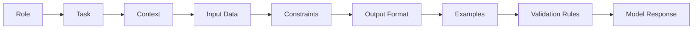
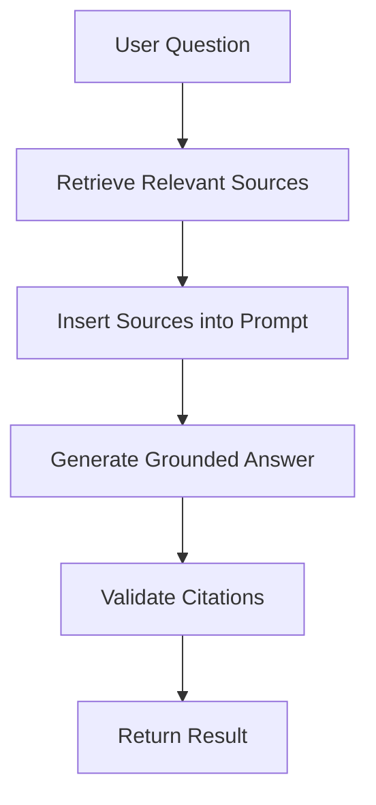
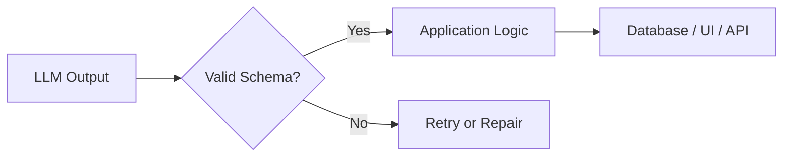
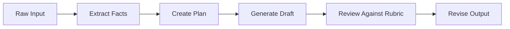
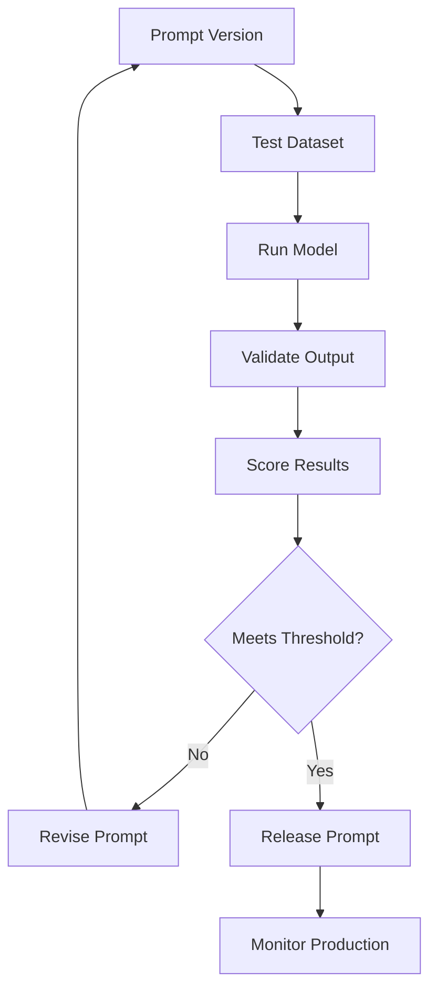
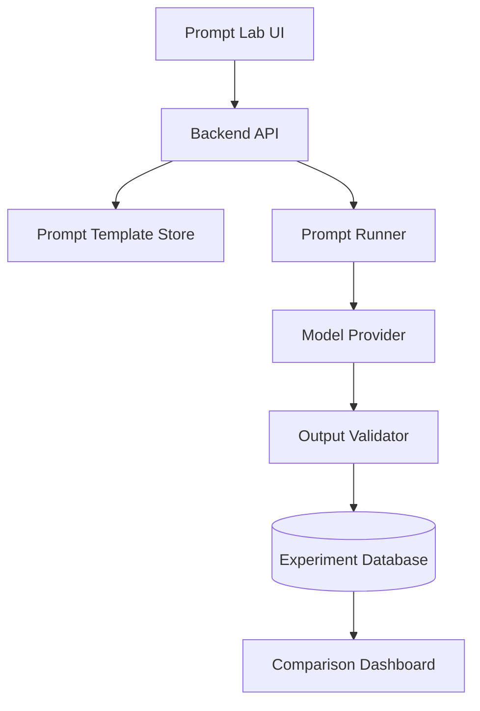

# 001 — Writing Prompts

**Course:** 02 — Model Platforms and Prompting
**Module:** Module 05 — Prompt Engineering
**Content Group:** Prompt Patterns
**Roadmap Source:** Prompt Engineering / Prompt Patterns
**Lesson Type:** Prompting
**Order in Module:** 001
**Suggested Duration:** 22 minutes

---

## 1. Summary

This lesson introduces **Writing Prompts** in the context of modern AI engineering.

A prompt is any instruction, question, request, or structured input used to communicate with an AI model. Prompt writing is not simply about asking longer questions. It is about providing the model with the minimum amount of relevant information required to understand:

* what it should do,
* why the task matters,
* what information it should use,
* what rules it must follow,
* and what the final output should look like.

The wording and sequence of instructions can significantly affect the usefulness of an AI response. Clear context, explicit output requirements, and follow-up instructions often produce better results than vague, one-line requests.

For production AI applications, prompts should be treated as **versioned product logic**, not temporary text written during a demo.

---

## 2. Learning Objectives

By the end of this lesson, you should be able to:

* Explain what a prompt is in your own words.
* Identify the main components of an effective prompt.
* Distinguish between vague prompts and task-specific prompts.
* Write prompts with clear goals, context, constraints, and output formats.
* Use examples to reduce ambiguity.
* Tell the model how to handle missing information.
* Convert a prompt into an API request or reusable prompt template.
* Evaluate prompt quality across realistic inputs.
* Recognize the limitations of prompt engineering.

---

## 3. What Is a Prompt?

A **prompt** is the input that instructs an AI model to perform a task.

A prompt can be:

* a question,
* a command,
* a conversation,
* a document plus instructions,
* a JSON object,
* an image with a text request,
* a tool result,
* or a combination of several input types.

### Simple prompt

```text
Summarize this meeting.
```

### Structured prompt

```text
You are an experienced executive assistant.

Summarize the following meeting transcript for a product manager who has
two minutes to review it before making a decision.

Include:
1. Confirmed decisions
2. Action items and owners
3. Unresolved blockers
4. Missing deadlines marked as "Not specified"

Only include information that directly affects the product launch.
Do not infer names, owners, dates, or decisions that are not present
in the transcript.
```

The second prompt gives the model a clearer definition of success.

When a prompt is vague, the model must fill in missing details using general patterns. The more the model has to guess, the greater the chance that the result will be irrelevant or unsuitable for the specific situation.

---

## 4. The Core Prompt Formula

A practical prompt can be designed using four foundational elements:

```text
Goal + Context + Tone + Sources
```

For production systems, this formula can be expanded into:

```text
Role
+ Task
+ Context
+ Input
+ Constraints
+ Output Format
+ Sources
+ Examples
+ Uncertainty Rules
```

### Prompt architecture



Not every prompt requires every component.

For simple tasks, **goal and context** may be enough. Tone and sourcing are additional controls that can improve the model’s response when style, audience, or evidence quality matters.

---

## 5. Component 1: Goal

The goal answers:

> What do you want the model to do?

A useful goal uses a clear action verb.

### Weak goals

```text
Tell me about Docker.
```

```text
Help me with this document.
```

```text
Analyze the data.
```

These requests do not define what a successful result looks like.

### Better goals

```text
Explain Docker containers to a junior backend developer.
```

```text
Extract all action items from this meeting transcript.
```

```text
Compare monthly revenue across the three customer segments.
```

### Common task verbs

| Category         | Useful verbs                          |
| ---------------- | ------------------------------------- |
| Generation       | Write, create, draft, propose         |
| Transformation   | Rewrite, translate, shorten, simplify |
| Extraction       | Extract, identify, list, classify     |
| Analysis         | Compare, evaluate, diagnose, explain  |
| Coding           | Implement, debug, refactor, test      |
| Decision support | Rank, recommend, prioritize           |
| Validation       | Check, verify, review, detect         |

### Goal checklist

A clear goal answers:

* What action should the model perform?
* What object should it act on?
* What result should it produce?
* How will the result be used?

---

## 6. Component 2: Context

Context answers:

* Why is the task needed?
* Who will use the result?
* What does the model need to know?
* What has already happened?
* What level of expertise should the answer assume?

Context is especially important because the same task can require very different outputs for different audiences.

### Example

#### Without context

```text
Explain REST APIs.
```

#### For a beginner

```text
Explain REST APIs to a first-year computer science student who understands
basic HTTP requests but has never built a backend service.
```

#### For a senior engineer

```text
Explain the design trade-offs between REST, GraphQL, and gRPC for a senior
backend engineer designing internal microservices.
```

The required depth, terminology, examples, and assumptions are different.

Experiments with programming prompts show that specifying the programming language, audience, difficulty level, and whether the output should be an explanation or an exercise can substantially change the response.

### Useful context fields

```text
Audience:
Business goal:
Technical environment:
Current problem:
Available data:
Assumed knowledge:
Downstream use:
```

---

## 7. Component 3: Role

A role tells the model what perspective, expertise, or working style it should simulate.

```text
You are a senior Python engineer.
```

```text
You are an experienced executive assistant.
```

```text
You are a security reviewer evaluating an authentication API.
```

A role can compress many related expectations into a short instruction. For example, assigning the role of an executive assistant implicitly suggests concise language, decision-focused summaries, and professional organization.

However, a role is not a substitute for concrete requirements.

### Weak

```text
You are an expert. Review this.
```

### Better

```text
You are a senior Python engineer reviewing code before production deployment.

Identify:
- correctness defects,
- security risks,
- maintainability problems,
- missing tests,
- and performance concerns.

For each issue, provide its severity, explanation, and a proposed fix.
```

---

## 8. Component 4: Tone and Audience

Tone defines how the response should sound.

Examples:

```text
Use a friendly and encouraging tone.
```

```text
Write in a concise, professional tone.
```

```text
Explain it as if the reader were a sixth-grade student.
```

```text
Use direct technical language for experienced engineers.
```

Useful tone dimensions include:

| Dimension       | Options                                   |
| --------------- | ----------------------------------------- |
| Formality       | Casual, neutral, formal                   |
| Technical depth | Beginner, intermediate, advanced          |
| Emotional style | Encouraging, empathetic, urgent           |
| Writing style   | Concise, analytical, persuasive           |
| Voice           | First person, third person, instructional |

Avoid vague style instructions such as:

```text
Make it better.
```

Replace them with observable requirements:

```text
Use sentences under 20 words where practical.
Define technical terms on first use.
Use one example for each concept.
Limit the answer to 500 words.
```

---

## 9. Component 5: Sources and Grounding

Source instructions tell the model which information it may use.

```text
Use only the supplied meeting transcript.
```

```text
Base the answer on the attached API documentation.
```

```text
Use the retrieved knowledge-base passages and cite each claim.
```

```text
Do not use general knowledge outside the provided source.
```

This is important because a model may otherwise combine the input with general learned patterns.

### Grounded prompt

```text
Answer the user's question using only the provided documentation.

If the documentation does not contain enough information, return:

{
  "status": "insufficient_information",
  "missing_information": ["..."]
}
```

### Grounding workflow



In RAG systems, prompt writing controls how the model should interpret retrieved documents, resolve conflicts, cite evidence, and react when retrieval is incomplete.

---

## 10. Component 6: Constraints

Constraints define the boundaries of the task.

Typical constraints include:

* maximum length,
* allowed information,
* forbidden assumptions,
* language,
* output structure,
* number of items,
* technical framework,
* safety requirements,
* time period,
* supported values.

### Example

```text
Constraints:
- Use English.
- Return no more than five recommendations.
- Use only information from the supplied documents.
- Do not invent prices, dates, owners, or metrics.
- Mark missing values as null.
- Do not include introductory commentary.
```

### Prefer positive instructions

Instead of only saying what the model must not do, describe what it should do.

#### Less precise

```text
Do not go off topic.
```

#### More precise

```text
Include only information that directly affects the product launch schedule.
```

Positive instructions give the model a concrete target. Negative instructions often define an unlimited set of unwanted possibilities, while positive criteria define a smaller, more actionable set.

Negative constraints can still be useful, especially for safety and hallucination control, but they should usually be paired with positive alternatives.

```text
Do not invent a deadline.

When no deadline is provided, set the deadline field to null.
```

---

## 11. Component 7: Output Format

The output format tells the model how the response should be organized.

Common formats include:

* Markdown,
* JSON,
* XML,
* CSV,
* tables,
* bullet lists,
* SQL,
* Mermaid diagrams,
* source code,
* natural-language reports.

### Markdown format

```text
Return the answer using these sections:

## Summary
## Key Findings
## Risks
## Recommended Actions
```

### JSON format

```json
{
  "summary": "string",
  "decisions": [
    {
      "decision": "string",
      "evidence": "string"
    }
  ],
  "action_items": [
    {
      "task": "string",
      "owner": "string | null",
      "deadline": "string | null"
    }
  ],
  "blockers": ["string"]
}
```

### Why output formatting matters

A human may be able to interpret a loosely structured answer, but an application requires predictable data.



A structured output should still be validated after generation.

Never assume that the model will always return valid JSON simply because the prompt requests JSON.

---

## 12. Component 8: Examples

Examples show the model what a correct response looks like.

This technique is often called **few-shot prompting**.

Descriptions such as “professional,” “concise,” or “high quality” can be interpreted differently. A concrete example reduces that ambiguity by demonstrating the intended pattern.

### Example

```text
Input:
The API failed because the database connection timed out.

Expected output:
{
  "category": "database",
  "severity": "high",
  "summary": "The API could not connect to the database before timeout."
}
```

### Multiple examples

```text
Example 1:
Input: "The user entered an invalid password."
Output: {"category": "authentication", "severity": "medium"}

Example 2:
Input: "The payment provider exposed private card information."
Output: {"category": "security", "severity": "critical"}
```

Examples are especially useful when:

* categories are difficult to explain,
* the writing style is important,
* the schema is complex,
* edge cases exist,
* the model repeatedly misunderstands the task.

---

## 13. Component 9: Missing Information and Uncertainty

A reliable prompt tells the model what to do when information is missing.

Without this instruction, the model may produce a fluent but unsupported answer.

### Weak

```text
Find the owner and deadline for every task.
```

### Better

```text
Extract the owner and deadline for every task.

If an owner or deadline is not explicitly stated, return null.
Do not infer missing values from context.
```

### Uncertainty policy

```text
For every claim, classify confidence as:
- confirmed,
- inferred,
- unknown.

Only use "confirmed" when the information is explicitly present in the input.
```

Models may naturally complete missing details with information that sounds plausible. Explicitly separating known information from assumptions helps distinguish a trustworthy report from one that only appears trustworthy.

---

## 14. A Reusable Prompt Template

```text
Role:
You are a [role or expertise].

Task:
Perform [specific action].

Goal:
The result will be used to [business or user outcome].

Context:
- Audience: [target audience]
- Background: [relevant information]
- Environment: [technical or business context]

Input:
<input>
[dynamic input data]
</input>

Instructions:
1. [required action]
2. [required action]
3. [required action]

Constraints:
- [length limit]
- [allowed source]
- [technical limitation]
- [language]
- [what not to infer]

Output format:
[Markdown sections, JSON schema, table, code, etc.]

Examples:
[optional example inputs and outputs]

Missing information:
If required information is absent, [return null / state insufficient data /
ask a question].

Validation:
Before returning the answer, verify that:
- all required fields are present,
- no unsupported claims were added,
- the response follows the requested format.
```

---

## 15. Demo: Improving a Weak Prompt

### Version 1 — Vague prompt

```text
Summarize this meeting.
```

### Problems

* The audience is unknown.
* The purpose is unknown.
* The desired length is unknown.
* Important information is not defined.
* The model may include irrelevant discussion.
* The model may confuse decisions with suggestions.
* The output cannot be reliably parsed.

---

### Version 2 — Add the goal

```text
Summarize this meeting into a short report for the manager.
```

This improves the audience and general purpose.

---

### Version 3 — Add context

```text
Summarize this meeting into a short report for the manager.

The manager has two minutes to read it before deciding whether the product
launch can proceed.
```

Now the model understands why brevity and decision relevance matter.

---

### Version 4 — Add role and output structure

```text
You are an experienced executive assistant.

Summarize the meeting for a manager who has two minutes to review it.

Organize the response into:
1. Confirmed decisions
2. Action items with owners
3. Blockers requiring management support
```

---

### Version 5 — Add relevance constraints

```text
Only include information that directly affects the product launch.

Exclude unresolved internal wording discussions and unrelated conversation.
```

---

### Version 6 — Add hallucination controls

```text
Do not invent names, owners, dates, costs, or decisions.

If the owner or deadline is not explicitly stated, write "Not specified."
```

---

### Final prompt

```text
You are an experienced executive assistant who prepares concise reports
for senior managers.

Task:
Summarize the supplied meeting transcript.

Purpose:
The manager has two minutes to determine whether the product launch is
on schedule and what decisions are still required.

Include:
1. Confirmed decisions
2. Action items, owners, and deadlines
3. Blockers requiring management support

Constraints:
- Include only information that directly affects the product launch.
- Exclude unrelated discussion and unconfirmed wording suggestions.
- Do not invent owners, deadlines, costs, or decisions.
- When information is missing, write "Not specified."
- Keep the report under 350 words.

Output format:

## Executive Summary

## Confirmed Decisions
- ...

## Action Items

| Task | Owner | Deadline |
|---|---|---|

## Blockers Requiring Support
- ...

## Missing Information
- ...

Meeting transcript:
<transcript>
{{MEETING_TRANSCRIPT}}
</transcript>
```

---

## 16. Prompt Chaining

A complex task does not always need to be completed with one large prompt.

It can be split into multiple stages.



### Example chain

#### Step 1: Extract

```text
Extract all confirmed facts from the meeting transcript.
Do not summarize or interpret them.
```

#### Step 2: Classify

```text
Classify the extracted facts into:
- decisions,
- action items,
- blockers,
- background information.
```

#### Step 3: Generate

```text
Write an executive report using only the classified information.
```

#### Step 4: Validate

```text
Compare the report against the extracted facts.

List:
- unsupported claims,
- omitted decisions,
- missing owners,
- missing deadlines.
```

Using follow-up questions and previous conversation context can gradually improve the answer, especially when the task involves exploration or refinement.

---

## 17. Prompting in an API

### Example with the OpenAI-style messages format

```python
from openai import OpenAI

client = OpenAI()

system_prompt = """
You are an experienced executive assistant.

Extract decisions, action items, owners, deadlines, and blockers from a
meeting transcript.

Use only information explicitly present in the transcript.
Return valid JSON matching the requested schema.
"""

user_prompt = """
Analyze the following transcript:

<transcript>
Alice confirmed that the API launch will remain on Friday.
Ben will complete load testing, but no deadline was stated.
The payment gateway decision is still blocked.
</transcript>
"""

response = client.responses.create(
    model="your-model",
    input=[
        {
            "role": "system",
            "content": system_prompt,
        },
        {
            "role": "user",
            "content": user_prompt,
        },
    ],
)

print(response.output_text)
```

### Expected output

```json
{
  "decisions": [
    {
      "decision": "The API launch remains scheduled for Friday."
    }
  ],
  "action_items": [
    {
      "task": "Complete load testing",
      "owner": "Ben",
      "deadline": null
    }
  ],
  "blockers": [
    "The payment gateway decision is unresolved."
  ]
}
```

---

## 18. Prompt Configuration

The prompt is only one part of model behavior.

Other parameters may include:

| Parameter         | Purpose                                              |
| ----------------- | ---------------------------------------------------- |
| Model             | Determines capability, cost, and latency             |
| Temperature       | Controls output variability                          |
| Max output tokens | Limits response length                               |
| Stop sequences    | Define where generation should stop                  |
| Response schema   | Constrains structured output                         |
| Tools             | Allow external actions or data access                |
| Retrieval         | Provides external context                            |
| Reasoning level   | Controls additional reasoning effort where supported |

### Important principle

```text
Observed result =
Prompt
+ Model
+ Parameters
+ Input
+ Retrieved context
+ Tool results
+ Application logic
```

Do not evaluate a prompt without recording the surrounding model configuration.

---

## 19. Prompt Testing

A prompt that works once is not necessarily production-ready.

You should test it with a collection of realistic cases.

### Suggested test set

```text
tests/
├── normal_case.json
├── long_input.json
├── missing_fields.json
├── conflicting_information.json
├── irrelevant_content.json
├── multilingual_input.json
├── prompt_injection.json
└── malformed_input.json
```

### Evaluation dimensions

| Dimension       | Question                                       |
| --------------- | ---------------------------------------------- |
| Task completion | Did the output solve the requested task?       |
| Accuracy        | Are the claims supported by the input?         |
| Relevance       | Did the output avoid irrelevant content?       |
| Format validity | Does it match the required schema?             |
| Completeness    | Are required fields present?                   |
| Consistency     | Does it perform similarly across runs?         |
| Safety          | Did it follow security and policy constraints? |
| Latency         | How long did generation take?                  |
| Cost            | How many input and output tokens were used?    |

### Basic prompt evaluation loop



---

## 20. Prompt Versioning

Prompts should be stored and reviewed like code.

### Example directory

```text
prompts/
├── meeting-summary/
│   ├── v1.md
│   ├── v2.md
│   ├── v3.md
│   └── metadata.json
└── code-review/
    ├── v1.md
    └── metadata.json
```

### Example metadata

```json
{
  "prompt_id": "meeting-summary",
  "version": "3.0.0",
  "model": "example-model",
  "created_at": "2026-07-18",
  "changes": [
    "Added missing-information policy",
    "Added JSON output schema",
    "Reduced maximum report length"
  ],
  "evaluation": {
    "test_cases": 50,
    "schema_validity": 0.98,
    "grounded_accuracy": 0.94
  }
}
```

Prompt changes may affect:

* token consumption,
* latency,
* model reasoning,
* output length,
* safety,
* retrieval usage,
* tool selection,
* application behavior.

Therefore, prompt review should be part of the software development lifecycle.

---

## 21. Common Mistakes

### 21.1 Using vague instructions

```text
Make this better.
```

“Better” is not measurable.

Replace it with:

```text
Shorten the text by approximately 30%, remove repeated ideas, preserve all
technical facts, and use a professional tone.
```

---

### 21.2 Adding too much irrelevant context

More context is not automatically better.

Every piece of context should help the model decide:

* what to include,
* what to exclude,
* how to reason,
* or how to format the answer.

---

### 21.3 Mixing multiple tasks

```text
Summarize this document, translate it, find security problems, rewrite the
code, and create a marketing post.
```

Split unrelated tasks into separate prompts or pipeline stages.

---

### 21.4 Relying only on role prompting

```text
You are a world-class expert.
```

This does not define the task, constraints, evidence requirements, or output.

---

### 21.5 Using only negative instructions

```text
Do not be verbose.
Do not make mistakes.
Do not include irrelevant content.
```

Replace them with observable targets:

```text
Return at most five bullets.
Support each claim using the supplied input.
Include only information affecting deployment readiness.
```

---

### 21.6 Failing to validate structured output

Even well-written prompts can produce:

* invalid JSON,
* extra commentary,
* missing fields,
* incorrect types,
* unsupported enum values.

Use schema validation and retry or repair logic.

---

### 21.7 Trusting generated code without review

Models can generate plausible but incorrect explanations and implementations, particularly for complex or advanced concepts. Generated code and technical explanations should always be tested and reviewed.

---

### 21.8 Ignoring token and output limits

A prompt may request more information than the model can reliably generate in one response.

For long or complex tasks:

* divide the task into stages,
* retrieve only relevant context,
* summarize intermediate results,
* set explicit output limits,
* preserve important state separately.

---

### 21.9 Assuming one successful demo is enough

A prompt may work for:

* one input,
* one language,
* one model,
* one temperature,
* or one output length,

but fail under realistic production conditions.

---

## 22. Practical Exercise

### Scenario

Build a prompt that converts a customer-support message into structured ticket data.

### Input

```text
Hi, I was charged twice for order A-1042 yesterday. I need the extra
payment refunded. Please contact me by email.
```

### Required output

```json
{
  "category": "billing",
  "priority": "high",
  "order_id": "A-1042",
  "customer_request": "Refund the duplicate charge",
  "preferred_contact": "email",
  "missing_information": []
}
```

### Tasks

1. Write the first version of the prompt.
2. Define the role, goal, context, and constraints.
3. Add an explicit JSON schema.
4. Define what to do when the order ID is missing.
5. Add at least two few-shot examples.
6. Test the prompt with:

   * a normal request,
   * a vague request,
   * an angry customer,
   * a message containing two separate problems,
   * an unsupported language.
7. Record:

   * model name,
   * prompt version,
   * temperature,
   * input tokens,
   * output tokens,
   * latency,
   * estimated cost,
   * schema-validation result.
8. Identify which prompt instruction most affected the result.

---

## 23. Mini Project: Prompt Lab

Build a small application that allows users to:

* create prompt templates,
* edit prompt variables,
* select a model,
* adjust model parameters,
* save prompt versions,
* run prompts against test inputs,
* compare outputs side by side,
* validate JSON output,
* record latency and token usage,
* rate output quality,
* restore previous prompt versions.

### Suggested architecture



### Suggested database entities

```text
PromptTemplate
PromptVersion
TestCase
ExperimentRun
ModelConfiguration
ModelResponse
EvaluationScore
ValidationError
```

---

## 24. Production Checklist

### Prompt design

* [ ] The task is explicit.
* [ ] The target audience is defined.
* [ ] Relevant context is included.
* [ ] Irrelevant context is removed.
* [ ] Constraints are measurable.
* [ ] The output format is explicit.
* [ ] Examples are included when needed.
* [ ] Missing-information behavior is defined.
* [ ] The prompt distinguishes facts from assumptions.

### Engineering

* [ ] The prompt has an identifier and version.
* [ ] Model parameters are recorded.
* [ ] Structured output is validated.
* [ ] Errors and retries are handled.
* [ ] Token usage is logged.
* [ ] Latency is logged.
* [ ] Estimated cost is recorded.
* [ ] Test cases cover edge conditions.
* [ ] User input is separated from system instructions.
* [ ] Prompt-injection risks are considered.

### Evaluation

* [ ] Expected outputs are defined.
* [ ] Accuracy is measured.
* [ ] Relevance is measured.
* [ ] Schema validity is measured.
* [ ] Results are compared across prompt versions.
* [ ] Results are compared across models.
* [ ] Production failures are added to the test dataset.

---

## 25. Limitations

Prompt engineering can improve model behavior, but it cannot guarantee correctness.

Important limitations include:

* Models can misunderstand ambiguous language.
* Generated facts may be unsupported.
* Outputs can vary between runs.
* Long prompts increase cost and may reduce focus.
* Complex tasks may exceed context or output limits.
* Model updates can change prompt behavior.
* Different models may interpret the same prompt differently.
* Prompt instructions cannot replace deterministic validation.
* Advanced technical answers still require expert review.

A useful rule is:

> Use prompts to guide model behavior, and use software to enforce requirements.

---

## 26. Completion Checklist

* [ ] I can explain **Writing Prompts** in one or two minutes.
* [ ] I can identify the goal, context, role, constraints, and output format in a prompt.
* [ ] I can turn a vague prompt into a measurable task.
* [ ] I can define what the model should do when information is missing.
* [ ] I can create a prompt with a structured output schema.
* [ ] I have built a small prompt demo or practical artifact.
* [ ] I can test a prompt using normal and edge-case inputs.
* [ ] I understand how prompts relate to models, retrieval, tools, cost, safety, and UX.
* [ ] I have documented at least one limitation or unresolved question.

---

## 27. Related Outcome

Design prompts that are:

* clear,
* relevant,
* constrained,
* testable,
* grounded,
* reusable,
* and robust across realistic inputs.

---

## 28. Related Project

**Project 4: Prompt Lab**

Create a prompt experimentation application with:

* saved prompt templates,
* prompt versioning,
* model configuration,
* reusable test cases,
* output comparison,
* schema validation,
* token and cost tracking,
* latency measurement,
* and human evaluation.

---

## 29. Key Takeaways

1. A prompt is the interface between the user or application and the model.
2. A strong prompt clearly defines the goal and context.
3. Role and tone help control perspective and presentation.
4. Constraints should describe observable behavior.
5. Output schemas make responses easier to use in applications.
6. Examples reduce ambiguity.
7. Missing-information rules reduce unsupported assumptions.
8. Complex tasks may be more reliable as multi-step prompt chains.
9. Prompt outputs must still be validated and reviewed.
10. Prompts should be versioned, tested, evaluated, and monitored like product logic.

---

## 30. Conclusion

**Writing Prompts** is a foundational skill for modern AI engineers.

A useful prompt is not necessarily long. It contains the right information in a structure that helps the model understand the task and the expected result.

The basic pattern is:

```text
Goal + Context + Tone + Sources
```

A more production-ready pattern is:

```text
Role
+ Task
+ Context
+ Input
+ Constraints
+ Output Format
+ Sources
+ Examples
+ Uncertainty Rules
+ Validation
```

Turn this lesson into a practical artifact such as:

* a reusable prompt template,
* an API route,
* a structured extraction pipeline,
* a RAG workflow,
* an agent instruction,
* a prompt evaluation dashboard,
* or a Prompt Lab portfolio project.

The objective is not merely to write prompts that appear effective in a demo. The objective is to design prompts that remain useful, measurable, and reliable across real-world inputs.

---

# Bài luyện tập

## Mục tiêu


## Đề bài


## Yêu cầu hoàn thành

- [ ] 
- [ ] 
- [ ] 

## Kết quả / lời giải


## Ghi chú
