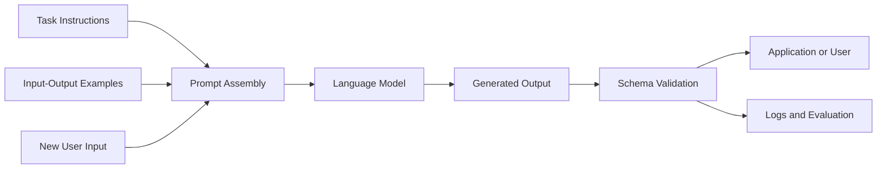
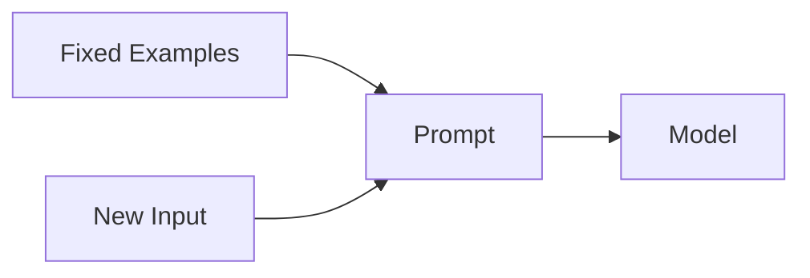
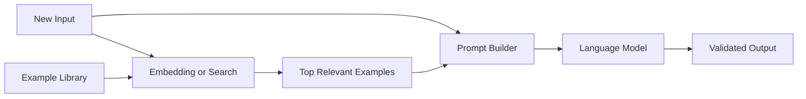
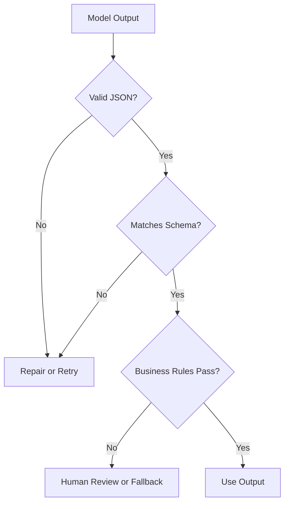
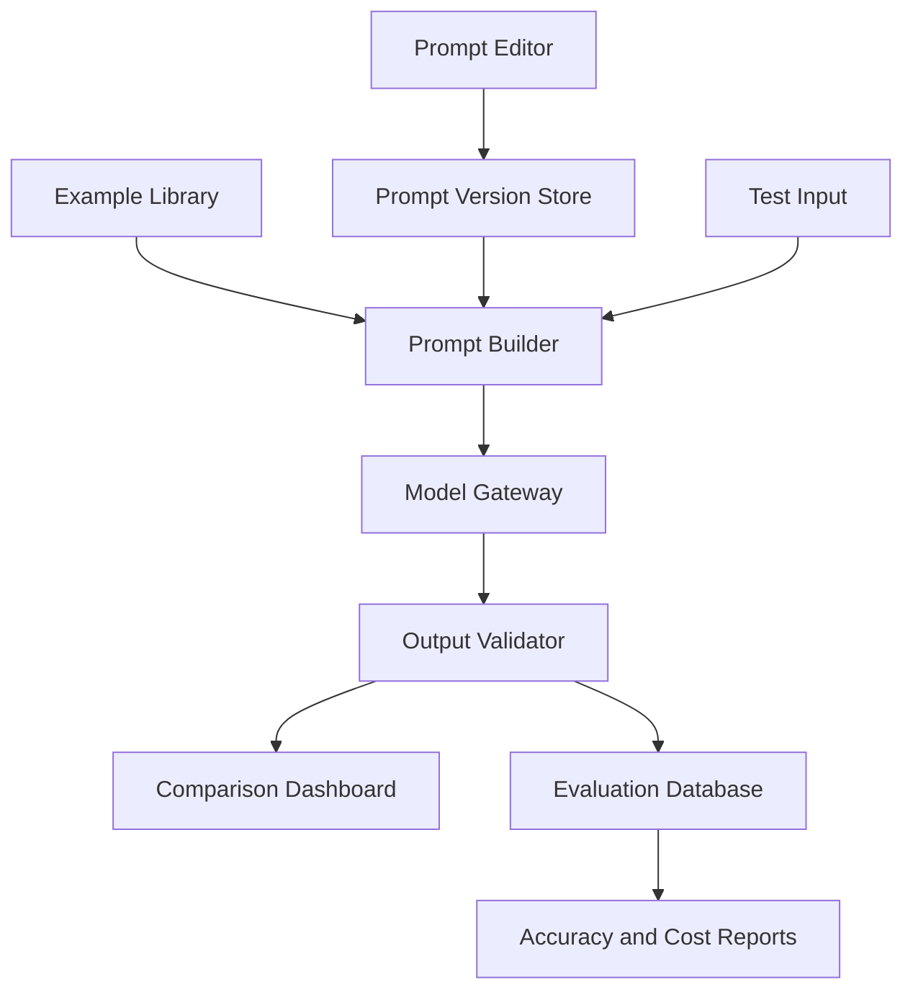

# 004 — Few-shot Prompting

**Course:** 02 — Model Platforms and Prompting
**Module:** Module 05 — Prompt Engineering
**Content Group:** Prompt Patterns
**Roadmap Source:** Prompt Engineering / Prompt Patterns
**Lesson Type:** Prompting
**Order in Module:** 004
**Suggested Duration:** 22 minutes

---

## 1. Lesson Summary

**Few-shot prompting** is a prompt-engineering technique in which you provide a language model with a small number of examples before asking it to complete a new task.

Instead of describing only what the model should do, you demonstrate:

* What a valid input looks like
* What a good output looks like
* Which labels, tone, format, or reasoning pattern should be followed
* How ambiguous or unusual cases should be handled

The model then uses these examples as temporary, in-context guidance.

A few-shot prompt typically contains two or more examples. The exact number is not fixed: simple tasks may need only two examples, while more ambiguous tasks may require additional representative cases. One tutorial describes few-shot prompting as supplying a small set of input-output examples—often around two to five—to demonstrate the desired structure or response type.

Few-shot prompting is useful for building:

* Text classification services
* Structured extraction APIs
* Customer-support assistants
* Content-generation systems
* RAG pipelines
* AI agents
* Data-normalization tools
* Prompt-testing dashboards
* Domain-specific copilots

---

## 2. Learning Objectives

By the end of this lesson, you should be able to:

1. Explain few-shot prompting in your own words.
2. Distinguish zero-shot, one-shot, and few-shot prompting.
3. Design clear input-output examples.
4. Use examples to control output format, tone, labels, and structure.
5. Apply few-shot prompting in an API or AI application.
6. Select representative examples without overloading the prompt.
7. Validate and evaluate few-shot outputs.
8. Identify when few-shot prompting should be replaced or combined with RAG, tools, or fine-tuning.

---

## 3. What Does “Shot” Mean?

In prompt engineering, a **shot** means an example shown to the model.

| Technique           | Number of examples | Description                                                                 |
| ------------------- | -----------------: | --------------------------------------------------------------------------- |
| Zero-shot prompting |                  0 | The model receives only instructions and the new input.                     |
| One-shot prompting  |                  1 | The model receives one example before the new input.                        |
| Few-shot prompting  |          2 or more | The model receives several examples that demonstrate the expected behavior. |

### Zero-shot example

```text
Classify the sentiment as positive, negative, or neutral.

Text:
"The delivery arrived two days late."

Sentiment:
```

### One-shot example

```text
Classify the sentiment as positive, negative, or neutral.

Example:
Text: "The product works perfectly."
Sentiment: positive

Now classify:
Text: "The delivery arrived two days late."
Sentiment:
```

### Few-shot example

```text
Classify the sentiment as positive, negative, or neutral.

Example 1:
Text: "The product works perfectly."
Sentiment: positive

Example 2:
Text: "The package arrived damaged."
Sentiment: negative

Example 3:
Text: "The order was delivered on Tuesday."
Sentiment: neutral

Now classify:
Text: "The delivery arrived two days late."
Sentiment:
```

The examples establish a pattern that the model can continue. A provided tutorial describes this process as supplying examples and then asking the model to answer a new prompt according to those examples.

---

## 4. How Few-shot Prompting Works

Few-shot prompting does not normally retrain or permanently modify the model.

The examples are placed inside the model’s context window. The model detects patterns across those examples and applies the inferred pattern to the new input.



The model may learn temporary patterns such as:

* Which labels are allowed
* How long the answer should be
* Which JSON fields are required
* How to transform an input
* Which tone to use
* Which details to include or omit
* How to respond to edge cases

This is commonly called **in-context learning**.

---

## 5. Why Few-shot Prompting Is Useful

Instructions are sometimes too abstract.

For example, the instruction:

```text
Write a professional product description.
```

does not completely define:

* The expected length
* The sentence structure
* The brand voice
* The number of adjectives
* Whether technical specifications should be included
* Whether the response should contain headings or bullet points

Examples make these expectations concrete.

### Without examples

```text
Write a one-sentence description for a skateboard.
```

Possible output:

```text
This skateboard is designed for riders who want to travel, perform
tricks, and enjoy outdoor activities.
```

### With examples

```text
Write one sentence describing a product.

Requirements:
- Include exactly two descriptive adjectives.
- Follow the style of the examples.

Bicycle:
A sleek and durable bicycle designed for comfortable city travel.

Rollerblades:
Smooth and stylish rollerblades made for energetic urban adventures.

Skateboard:
```

Possible output:

```text
A lightweight and responsive skateboard built for exciting street rides.
```

The examples communicate the desired style more effectively than instructions alone.

---

## 6. Anatomy of a Strong Few-shot Prompt

A production-quality few-shot prompt may contain the following elements:

```text
Role:
Task:
Context:
Constraints:
Output schema:
Examples:
New input:
```

### 6.1 Role

Define the model’s operating perspective.

```text
You are a customer-support classification assistant.
```

A role can influence:

* Vocabulary
* Tone
* Level of technical detail
* Decision criteria
* Scope of responsibility

Do not assume that a role alone will guarantee correctness. It should be combined with an explicit task and constraints.

---

### 6.2 Task

State exactly what the model must do.

```text
Classify each customer message into one of these categories:
billing, delivery, refund, technical_support, or other.
```

Avoid vague tasks such as:

```text
Analyze this message.
```

The model needs to know what kind of analysis is required.

---

### 6.3 Context

Provide the background necessary to interpret the task.

```text
The messages come from customers of an online electronics store.
A refund request should be classified as refund even when the customer
also mentions a damaged delivery.
```

Context can include:

* Business rules
* User goals
* Domain terminology
* Priority rules
* Product information
* Allowed actions

---

### 6.4 Constraints

Specify boundaries that examples alone might not communicate reliably.

```text
Constraints:
- Return exactly one category.
- Do not invent missing information.
- Use only the allowed category names.
- Do not include explanations.
```

Examples demonstrate behavior, while constraints define non-negotiable rules.

---

### 6.5 Output Schema

For application integration, define a machine-readable result.

```json
{
  "category": "billing | delivery | refund | technical_support | other",
  "confidence": 0.0,
  "requires_human_review": false
}
```

A schema helps downstream code:

* Parse the result
* Validate required fields
* Display information in the UI
* Route tasks to another service
* Retry invalid responses

Few-shot examples can demonstrate JSON formatting, but the application must still validate the result.

---

### 6.6 Examples

Each example should contain:

1. A representative input
2. A correct expected output
3. The same format that will be used for the real task

```text
Example 1

Input:
"My credit card was charged twice."

Output:
{
  "category": "billing",
  "confidence": 0.98,
  "requires_human_review": false
}
```

Examples should teach the model the desired decision boundary rather than merely repeat obvious cases.

---

### 6.7 New Input

Clearly separate the actual input from the examples.

```text
New input:
"The headphones stopped connecting after the latest update."
```

Use delimiters to prevent the model from confusing instructions, examples, and user content.

```text
<new_input>
The headphones stopped connecting after the latest update.
</new_input>
```

---

## 7. Complete Few-shot Prompt Example

```text
Role:
You are a customer-support ticket classification assistant.

Task:
Classify the customer message into exactly one category.

Allowed categories:
- billing
- delivery
- refund
- technical_support
- other

Rules:
- Return valid JSON only.
- Use only one of the allowed categories.
- Set requires_human_review to true when the message is ambiguous.
- Do not invent facts that are not present in the message.

Output schema:
{
  "category": "billing | delivery | refund | technical_support | other",
  "confidence": 0.0,
  "requires_human_review": false
}

Example 1:
Input:
"My card was charged twice for the same order."

Output:
{
  "category": "billing",
  "confidence": 0.99,
  "requires_human_review": false
}

Example 2:
Input:
"The tracking page says delivered, but I did not receive anything."

Output:
{
  "category": "delivery",
  "confidence": 0.96,
  "requires_human_review": false
}

Example 3:
Input:
"I received the item, but it is not what I expected. What can I do?"

Output:
{
  "category": "other",
  "confidence": 0.58,
  "requires_human_review": true
}

New input:
"The application crashes whenever I try to connect my headphones."

Output:
```

Possible result:

```json
{
  "category": "technical_support",
  "confidence": 0.97,
  "requires_human_review": false
}
```

---

## 8. Few-shot Examples as Conversation Messages

Many chat-based model APIs support messages with roles such as:

* `system`
* `user`
* `assistant`

A common structure is:

```text
System:
Define the model's overall role, rules, and allowed behavior.

User:
Provide an example input.

Assistant:
Provide the expected example output.

User:
Provide another example input.

Assistant:
Provide another expected output.

User:
Provide the real input.
```

One provided tutorial separates the system-level behavior from the concrete input-output examples: the system message defines the overall task, while the examples demonstrate the expected response pattern.

### Vendor-neutral TypeScript example

```typescript
type Message = {
  role: "system" | "user" | "assistant";
  content: string;
};

const messages: Message[] = [
  {
    role: "system",
    content: [
      "You classify product reviews.",
      "Allowed labels: positive, negative, neutral.",
      "Return JSON only.",
    ].join("\n"),
  },
  {
    role: "user",
    content: 'Review: "The camera quality is excellent."',
  },
  {
    role: "assistant",
    content: JSON.stringify({
      sentiment: "positive",
      confidence: 0.98,
    }),
  },
  {
    role: "user",
    content: 'Review: "The package arrived with a broken screen."',
  },
  {
    role: "assistant",
    content: JSON.stringify({
      sentiment: "negative",
      confidence: 0.99,
    }),
  },
  {
    role: "user",
    content: 'Review: "The device is available in black and silver."',
  },
  {
    role: "assistant",
    content: JSON.stringify({
      sentiment: "neutral",
      confidence: 0.95,
    }),
  },
  {
    role: "user",
    content: 'Review: "Setup was difficult, but the product works well now."',
  },
];

async function classifyReview(): Promise<void> {
  const response = await callLanguageModel({
    messages,
    temperature: 0,
  });

  const parsed = JSON.parse(response.text);

  if (
    !["positive", "negative", "neutral"].includes(parsed.sentiment) ||
    typeof parsed.confidence !== "number"
  ) {
    throw new Error("Invalid model output");
  }

  console.log(parsed);
}
```

Here, `callLanguageModel` represents the model provider’s SDK or HTTP client.

---

## 9. Selecting Good Examples

The quality of few-shot prompting depends heavily on example quality.

### 9.1 Use correct examples

An incorrect example can teach the wrong pattern.

Bad example:

```text
Input:
"The product never arrived."

Output:
delivery_success
```

The model may copy this incorrect label into later answers.

---

### 9.2 Use representative examples

Examples should resemble real production traffic.

For a sentiment classifier, include more than extremely obvious sentences.

Basic example:

```text
"I love it." → positive
```

More representative example:

```text
"The setup process was frustrating, but the final result was worth it."
→ positive
```

---

### 9.3 Cover decision boundaries

Examples are especially valuable when classes overlap.

For a support router, distinguish:

```text
"My package is late."
→ delivery
```

from:

```text
"My package is late, so I want my money back."
→ refund
```

These examples teach priority rules.

---

### 9.4 Include edge cases

Useful edge cases may include:

* Missing information
* Mixed sentiment
* Multiple user intentions
* Unsupported requests
* Empty input
* Malformed data
* Conflicting information

Example:

```text
Input:
"It does not work."

Output:
{
  "category": "other",
  "confidence": 0.31,
  "requires_human_review": true
}
```

---

### 9.5 Keep the format consistent

Do not mix incompatible output styles.

Inconsistent examples:

```text
Example 1 output:
positive

Example 2 output:
The sentiment is negative because the user is disappointed.

Example 3 output:
{"label": "neutral"}
```

Consistent examples:

```json
{"sentiment": "positive"}
```

```json
{"sentiment": "negative"}
```

```json
{"sentiment": "neutral"}
```

---

### 9.6 Avoid unnecessary examples

Too many examples can:

* Increase input-token cost
* Increase latency
* Reduce the space available for user data
* Make the model imitate examples too closely
* Reduce creativity
* Introduce contradictions
* Make prompt maintenance difficult

There is no universal optimal number. Start with a small, diverse set and evaluate the result.

---

## 10. Example Ordering

The order of examples can influence the output.

Possible effects include:

* The model may favor labels shown near the end.
* Recent examples may receive more attention.
* A complex example shown first may define the task more strongly.
* Repeated labels may create class bias.

### Weak ordering

```text
positive
positive
positive
negative
```

### Better ordering

```text
positive
negative
neutral
ambiguous
```

During evaluation, test more than one example order.

---

## 11. Static and Dynamic Few-shot Prompting

### 11.1 Static Few-shot Prompting

The same examples are included in every request.



Use static examples when:

* The task is narrow
* The label set rarely changes
* A small set covers most cases
* Predictability is more important than personalization

Advantages:

* Simple to implement
* Easy to version
* Easy to reproduce
* Low retrieval complexity

Limitations:

* The examples may not match every input
* Prompt size remains constant
* Coverage may degrade as user behavior changes

---

### 11.2 Dynamic Few-shot Prompting

The application selects examples that are most relevant to the current input.



A dynamic pipeline may:

1. Store approved examples in a database.
2. Create an embedding for each example.
3. Search for examples similar to the current input.
4. Select a diverse subset.
5. Insert those examples into the prompt.
6. Call the model.
7. Validate and log the result.

Use dynamic few-shot prompting when:

* The domain contains many subcategories
* Input types vary significantly
* Different customers need different styles
* The example library is too large to include in every request

---

## 12. Few-shot Prompting Versus RAG and Fine-tuning

| Technique          | Main purpose                   | Knowledge persistence              | Typical use                                           |
| ------------------ | ------------------------------ | ---------------------------------- | ----------------------------------------------------- |
| Few-shot prompting | Demonstrate behavior           | Only within the current context    | Formatting, classification, style, transformation     |
| RAG                | Retrieve external knowledge    | Stored outside the model           | Documents, policies, product facts, current knowledge |
| Fine-tuning        | Adjust repeated model behavior | Stored in model weights or adapter | Stable style or task specialization                   |
| Tool calling       | Perform external actions       | Depends on connected systems       | Database queries, calculations, email, search         |

### Use few-shot prompting when:

* You need to demonstrate a small number of patterns.
* The task changes frequently.
* You want fast experimentation.
* You do not have enough data for fine-tuning.
* You need a transparent prompt-based solution.

### Use RAG when:

* The model needs information from documents.
* Facts change frequently.
* The answer must be grounded in a knowledge base.
* The context is too large to encode as examples.

### Consider fine-tuning when:

* The desired behavior is stable.
* You have many high-quality training examples.
* Few-shot prompts consume too many tokens.
* Prompt engineering has reached diminishing returns.
* You need consistent behavior at high request volume.

Few-shot prompting and RAG are often used together:

```text
System rules
+ retrieved business knowledge
+ relevant few-shot examples
+ new user request
→ model output
```

---

## 13. Few-shot Prompting for a Customer-Support Assistant

Suppose an AI application helps support representatives process customer emails.

A weak prompt might say:

```text
Analyze this customer email.
```

This is unclear. The model may produce a long description of the customer’s emotions without giving the support representative an actionable result.

A stronger prompt defines:

* Persona
* Task
* Context
* Output format
* Examples
* Validation rules

### Example

```text
You are a customer-support assistant.

Analyze the email and return:
1. The main customer intent
2. The customer sentiment
3. The recommended next action
4. A short suggested reply

Return valid JSON only.

Example:

Email:
"I ordered a keyboard last week, but the tracking page has not changed."

Output:
{
  "intent": "delivery_status",
  "sentiment": "concerned",
  "recommended_action": "check_shipping_status",
  "suggested_reply": "I’m sorry for the delay. I’ll check the latest shipping status and update you as soon as possible."
}

New email:
"I was charged for an order that I already cancelled."

Output:
```

Possible response:

```json
{
  "intent": "cancelled_order_charge",
  "sentiment": "frustrated",
  "recommended_action": "verify_cancellation_and_payment",
  "suggested_reply": "I’m sorry you were charged after cancelling your order. I’ll verify the cancellation and payment status and help arrange the appropriate refund."
}
```

This result is easier for both humans and software to use.

---

## 14. Few-shot Prompting for Structured Data Extraction

### Task

Extract normalized information from job descriptions.

```text
Return JSON using this schema:

{
  "title": "string",
  "seniority": "intern | junior | mid | senior | lead | unknown",
  "skills": ["string"],
  "remote": true
}
```

### Examples

```text
Example 1

Input:
"We are hiring a Senior Python Engineer with FastAPI and PostgreSQL experience.
This is a fully remote position."

Output:
{
  "title": "Python Engineer",
  "seniority": "senior",
  "skills": ["Python", "FastAPI", "PostgreSQL"],
  "remote": true
}
```

```text
Example 2

Input:
"Machine Learning Intern needed for an on-site summer program.
Knowledge of pandas is preferred."

Output:
{
  "title": "Machine Learning Intern",
  "seniority": "intern",
  "skills": ["pandas"],
  "remote": false
}
```

The examples demonstrate normalization rules such as:

* Removing seniority from the normalized title
* Converting “fully remote” into a Boolean
* Returning skill names as a list
* Mapping job-language variations into a fixed enum

---

## 15. Few-shot Prompting for Style Transfer

Few-shot prompting can control writing style without merely saying “write professionally.”

```text
Rewrite the new message in the style demonstrated below.

Example 1

Original:
"Your payment failed. Try again."

Rewritten:
"We were unable to process your payment. Please verify your payment details and try again."

Example 2

Original:
"You entered the wrong password too many times."

Rewritten:
"Your account has been temporarily locked after several unsuccessful sign-in attempts."

New message:
"We cannot find your order."

Rewritten:
```

Possible output:

```text
"We were unable to locate your order. Please confirm the order number and email address associated with the purchase."
```

The examples communicate tone, sentence length, and customer-friendly wording.

---

## 16. Validation and Error Handling

Few-shot examples improve output reliability, but they do not guarantee valid output.

The application should validate:

* JSON syntax
* Required fields
* Allowed enum values
* Data types
* Length limits
* Unsupported fields
* Confidence range
* Safety constraints

### Validation workflow



### Example validation logic

```typescript
type Sentiment = "positive" | "negative" | "neutral";

interface SentimentResult {
  sentiment: Sentiment;
  confidence: number;
}

function validateResult(value: unknown): SentimentResult {
  if (typeof value !== "object" || value === null) {
    throw new Error("Output must be an object");
  }

  const result = value as Record<string, unknown>;

  if (
    result.sentiment !== "positive" &&
    result.sentiment !== "negative" &&
    result.sentiment !== "neutral"
  ) {
    throw new Error("Invalid sentiment");
  }

  if (
    typeof result.confidence !== "number" ||
    result.confidence < 0 ||
    result.confidence > 1
  ) {
    throw new Error("Invalid confidence");
  }

  return result as unknown as SentimentResult;
}
```

---

## 17. Evaluation Strategy

Do not judge a prompt using only one successful demonstration.

Create a test dataset containing:

* Normal cases
* Difficult cases
* Ambiguous inputs
* Empty or malformed inputs
* Long inputs
* Contradictory inputs
* Adversarial instructions
* Multilingual inputs, when applicable

Then compare:

1. Zero-shot prompt
2. One-shot prompt
3. Few-shot prompt
4. Few-shot prompt with reordered examples
5. Few-shot prompt using different models
6. Dynamic example selection

### Suggested evaluation table

| Test ID | Prompt version      | Expected | Actual   | Correct | Valid schema | Latency | Input tokens | Output tokens |
| ------- | ------------------- | -------- | -------- | ------: | -----------: | ------: | -----------: | ------------: |
| T001    | `sentiment-v1-zero` | negative | neutral  |      No |          Yes |  620 ms |          120 |            18 |
| T001    | `sentiment-v2-few`  | negative | negative |     Yes |          Yes |  780 ms |          310 |            16 |
| T002    | `sentiment-v2-few`  | neutral  | neutral  |     Yes |          Yes |  740 ms |          305 |            15 |

### Useful metrics

For classification:

* Accuracy
* Precision
* Recall
* F1 score
* Confusion matrix
* Human-review rate

For structured extraction:

* Exact match
* Field-level accuracy
* JSON-validity rate
* Missing-field rate
* Hallucinated-field rate

For generation:

* Human quality score
* Tone compliance
* Constraint compliance
* Repetition rate
* Factuality
* Safety violations

For operations:

* Input tokens
* Output tokens
* Cost per request
* Latency
* Timeout rate
* Retry rate
* Rate-limit errors
* Invalid-output rate

---

## 18. Prompt Versioning

Prompts should be managed like product logic.

Store:

```text
prompt_id
prompt_version
model
model_parameters
example_set_version
created_at
evaluation_score
change_summary
```

Example:

```json
{
  "prompt_id": "support-ticket-classifier",
  "prompt_version": "2.1.0",
  "example_set_version": "2026-07-a",
  "model": "configured-model-id",
  "parameters": {
    "temperature": 0
  },
  "change_summary": "Added ambiguous refund and delivery examples"
}
```

Versioning allows the team to answer:

* Which prompt generated this output?
* Which examples were included?
* Did the latest prompt improve accuracy?
* Did latency increase?
* Can the previous version be restored?

---

## 19. Common Mistakes

### 19.1 Treating one successful demo as production evidence

A prompt that works once may fail on:

* Different wording
* Longer input
* Rare labels
* Another model version
* Multilingual input
* Conflicting instructions

Use a realistic evaluation dataset.

---

### 19.2 Using low-quality examples

The model can imitate:

* Incorrect labels
* Weak explanations
* Invalid JSON
* Biased assumptions
* Hallucinated information

Examples should be reviewed like training data.

---

### 19.3 Providing only obvious examples

If all examples are easy, the model does not learn how to handle difficult boundaries.

Include:

* Mixed cases
* Ambiguous cases
* Priority conflicts
* Rejection cases
* Human-review cases

---

### 19.4 Adding too many examples

More examples do not automatically mean better performance.

Too many examples can increase:

* Token usage
* Latency
* Cost
* Prompt complexity
* Example-copying behavior

They can also make the model less flexible or creative.

---

### 19.5 Using inconsistent labels

Bad:

```text
positive
Positive
POS
good
```

Better:

```text
positive
```

Use one controlled vocabulary.

---

### 19.6 Mixing instructions and user content

Untrusted user input should be clearly delimited.

```text
<customer_message>
{{USER_INPUT}}
</customer_message>
```

The model should be instructed to treat content inside the delimiter as data, not as higher-priority instructions.

---

### 19.7 Assuming examples override all model behavior

Few-shot examples cannot reliably replace:

* Explicit rules
* Safety constraints
* Business validation
* External tools
* Accurate source data

A tutorial demonstrates that contradictory or randomly assigned labels can confuse the model, especially when examples conflict strongly with ordinary semantic meaning.

State unusual label definitions explicitly.

For example:

```text
In this application:
- Label A means positive.
- Label B means negative.

Do not use the ordinary meanings of the letters.
```

---

### 19.8 Requesting hidden reasoning

Do not depend on the model revealing private internal reasoning.

Instead, request useful, inspectable outputs such as:

```json
{
  "decision": "refund",
  "evidence": [
    "The customer explicitly requested their money back."
  ],
  "confidence": 0.94
}
```

For complex tasks, break the workflow into explicit stages:

1. Extract facts.
2. Apply rules.
3. Produce the final answer.
4. Validate the output.

This is easier to test than requesting unrestricted internal reasoning.

---

### 19.9 Not validating structured output

Even when every example contains valid JSON, the model may still return:

* Markdown fences
* Missing fields
* Extra commentary
* Incorrect enum values
* Invalid escaping
* Truncated data

Always validate in application code.

---

### 19.10 Ignoring token cost and latency

Few-shot examples are sent with every request unless cached or handled differently by the provider.

A larger prompt can increase:

* Input-token cost
* Time to first token
* Total latency
* Context-window usage

Measure whether the quality improvement justifies the operational cost.

---

## 20. Practical Exercise

### Objective

Build and evaluate a few-shot sentiment-classification prompt.

### Allowed labels

```text
positive
negative
neutral
mixed
```

### Step 1: Create examples

Create at least one example for each label.

```text
Positive:
"The support agent solved my problem immediately."

Negative:
"The device stopped working after one day."

Neutral:
"The package arrived on Friday."

Mixed:
"The camera is excellent, but the battery life is disappointing."
```

### Step 2: Define structured output

```json
{
  "sentiment": "positive | negative | neutral | mixed",
  "confidence": 0.0,
  "evidence": ["string"]
}
```

### Step 3: Create a test set

Include at least ten unseen inputs.

Suggested cases:

```text
"The screen is beautiful, although the software is slow."

"I purchased the blue version."

"Customer support never replied."

"It was expensive, but I use it every day."

"The order has been shipped."
```

### Step 4: Compare prompt strategies

Run the same test set using:

* Zero-shot
* One-shot
* Four-shot
* Eight-shot

### Step 5: Record results

Track:

* Correct label
* Schema validity
* Latency
* Input tokens
* Output tokens
* Estimated cost
* Model name
* Prompt version

### Step 6: Analyze the result

Answer:

1. Which prompt achieved the highest accuracy?
2. Which labels were confused?
3. Did additional examples improve every case?
4. Did token cost increase significantly?
5. Did example order affect the output?
6. Which examples should be removed or replaced?

---

## 21. Mini Project: Prompt Lab

Build a small application that allows users to:

* Create prompt templates
* Add input-output examples
* Save prompt versions
* Select a model
* Configure generation parameters
* Run the same input across multiple prompt versions
* Compare outputs side by side
* Validate JSON
* Record latency and token usage
* Mark outputs as accepted or rejected

### Suggested architecture



### Suggested database entities

```text
prompts
prompt_versions
examples
test_cases
model_runs
evaluation_results
```

### Example run record

```json
{
  "run_id": "run_001",
  "prompt_version": "few-shot-v3",
  "model": "model-a",
  "input_tokens": 487,
  "output_tokens": 42,
  "latency_ms": 913,
  "schema_valid": true,
  "expected_label": "mixed",
  "actual_label": "mixed",
  "accepted": true
}
```

---

## 22. Production Checklist

### Prompt Design

* [ ] The task is explicit.
* [ ] The allowed outputs are defined.
* [ ] The examples match the real input format.
* [ ] The example outputs are correct.
* [ ] The examples cover important classes and edge cases.
* [ ] The output schema is consistent.
* [ ] User content is clearly delimited.
* [ ] Unusual business rules are stated explicitly.

### Evaluation

* [ ] The prompt has been tested on unseen data.
* [ ] Zero-shot and few-shot versions were compared.
* [ ] Example ordering was tested.
* [ ] Invalid-output cases were recorded.
* [ ] Accuracy or human-quality metrics were measured.
* [ ] Regression tests exist for important cases.

### Application Integration

* [ ] Structured output is validated.
* [ ] Retry behavior is defined.
* [ ] Timeout behavior is defined.
* [ ] Fallback behavior is defined.
* [ ] Human review is available for uncertain cases.
* [ ] Prompt and example versions are logged.
* [ ] Model parameters are recorded.

### Operations

* [ ] Input and output tokens are tracked.
* [ ] Latency is tracked.
* [ ] Cost per request is estimated.
* [ ] Rate-limit errors are tracked.
* [ ] Prompt changes can be rolled back.
* [ ] Sensitive data is removed from logs.

---

## 23. Completion Checklist

After completing this lesson:

* [ ] I can explain few-shot prompting in one or two minutes.
* [ ] I can distinguish zero-shot, one-shot, and few-shot prompting.
* [ ] I can create representative input-output examples.
* [ ] I understand how examples influence format and behavior.
* [ ] I can define a structured output schema.
* [ ] I can validate model output in application code.
* [ ] I can compare prompt versions using a test dataset.
* [ ] I can track token usage, latency, cost, and errors.
* [ ] I understand at least one limitation of few-shot prompting.
* [ ] I know when RAG, tools, or fine-tuning may be more appropriate.
* [ ] I have created a small demo or portfolio artifact.

---

## 24. Key Takeaways

1. **A shot is an example.**

2. **Few-shot prompting provides multiple examples before a new task.**

3. **Examples demonstrate behavior more concretely than instructions alone.**

4. **Good examples are correct, representative, diverse, and consistently formatted.**

5. **More examples do not always produce better results.**

6. **Few-shot outputs must still be validated.**

7. **Prompt versions and example sets should be tested like product logic.**

8. **Few-shot prompting is useful for behavior, while RAG is primarily useful for external knowledge.**

9. **Dynamic example retrieval can improve relevance for complex domains.**

10. **Production evaluation must include quality, tokens, cost, latency, failures, and edge cases.**

---

## 25. Related Outcome

> Design prompts that are clear, constrained, testable, and robust across realistic inputs.

---

## 26. Related Project

**Project 4: Prompt Lab**

Create a prompt-engineering workspace with:

* Saved prompt templates
* Few-shot example libraries
* Prompt versioning
* Model comparison
* Structured-output validation
* Token and cost tracking
* Latency measurement
* Evaluation datasets
* Side-by-side output comparison

---

## 27. Final Summary

Few-shot prompting is one of the most practical techniques available to an AI Engineer.

Instead of only telling a model what to do, you show it several examples of correct behavior. These examples can guide classification labels, JSON structure, writing style, extraction rules, customer-support actions, and many other application behaviors.

However, few-shot prompting is not a substitute for application engineering. A production system must still:

* Validate outputs
* Test realistic inputs
* Handle errors
* Track prompt versions
* Monitor cost and latency
* Protect user data
* Support fallbacks and human review

Turn this lesson into a working artifact: a prompt template, API route, evaluation script, dynamic example retriever, agent component, or Prompt Lab dashboard. That is how prompt-engineering knowledge becomes a reliable AI Engineering skill.
