# 005 — Chain-of-thought Style Prompting

**Course:** 02 — Model Platforms and Prompting
**Module:** Module 05 — Prompt Engineering
**Content Group:** Prompt Patterns
**Roadmap Source:** Prompt Engineering / Prompt Patterns
**Lesson Type:** Prompting
**Order in Module:** 005
**Suggested Duration:** 22 minutes

---

## 1. Lesson Summary

**Chain-of-thought style prompting** is a family of prompt patterns that encourages a language model to handle a complex task through smaller, structured stages instead of immediately producing an answer.

The central idea is:

> Decompose the problem, process the important intermediate results, verify them, and then produce the final answer.

This technique is useful for tasks involving:

* Multi-step calculations
* Logical reasoning
* Coding and debugging
* Planning
* Decision analysis
* Data interpretation
* RAG-based question answering
* Tool selection
* Multimodal analysis
* Agent workflows

Traditional descriptions of chain-of-thought prompting focus on generating intermediate reasoning steps. The supplied course material describes it as encouraging a model to break a complex task into structured stages rather than returning a direct answer.

However, production AI applications should not depend on receiving a model’s complete hidden internal reasoning. Instead, they should request useful and verifiable artifacts such as:

* A task decomposition
* Assumptions
* Formulas
* Intermediate calculations
* Retrieved evidence
* Tool results
* A concise rationale
* A confidence estimate
* A final answer

These artifacts are easier to validate, log, test, and present to users.

---

## 2. Learning Objectives

By the end of this lesson, you should be able to:

1. Explain chain-of-thought style prompting in your own words.
2. Identify tasks that benefit from structured decomposition.
3. Distinguish direct prompting from structured reasoning prompts.
4. Design prompts that request plans, calculations, evidence, and conclusions.
5. Apply zero-shot and few-shot structured reasoning patterns.
6. Use tools such as calculators, code execution, search, and databases to verify intermediate results.
7. Validate structured outputs.
8. Evaluate quality, latency, token usage, and cost.
9. Explain why a plausible explanation is not necessarily a correct or faithful explanation.
10. Build a small reasoning-prompt experiment in a Prompt Lab.

---

## 3. Core Concept

A direct prompt asks the model to move immediately from an input to an answer.

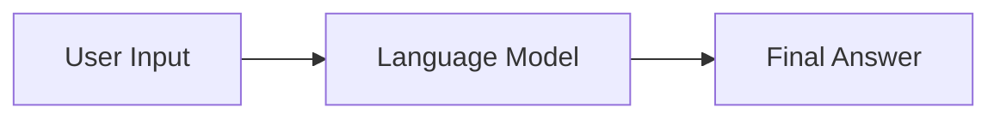

A chain-of-thought style workflow introduces explicit intermediate stages.

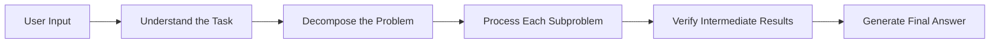

For example, instead of asking:

```text
Should we launch this product?
```

you can ask:

```text
Evaluate the proposed product launch.

Use this process:
1. Identify the launch objective.
2. List the available evidence.
3. Evaluate market demand, cost, risk, and operational readiness.
4. Identify missing information.
5. Compare the strongest launch and delay arguments.
6. Provide a recommendation with a concise justification.
```

The second prompt gives the model an explicit problem-solving procedure.

---

## 4. What Chain-of-thought Style Prompting Is Not

Chain-of-thought style prompting should not be treated as a way to obtain a perfect transcript of a model’s internal mental process.

A generated explanation may be:

* Incomplete
* Retrospective
* Overconfident
* Logically inconsistent
* Different from the process that actually produced the answer
* Plausible even when the answer is wrong

The supplied material explicitly warns that generated reasoning steps may sound convincing while still being illogical or incorrect.

Therefore, a production application should request:

```text
Provide the final answer and a concise, verifiable explanation.
Include the assumptions, formulas, evidence, or tool results needed
to check the answer.
```

Avoid making application correctness depend on:

```text
Reveal every private thought you had while solving the problem.
```

### Better terminology for applications

Instead of asking for unrestricted chain-of-thought, request one or more of the following:

* Structured analysis
* Solution outline
* Calculation steps
* Decision factors
* Evidence summary
* Debugging checklist
* Execution plan
* Verification report
* Concise rationale

---

## 5. When to Use This Pattern

Chain-of-thought style prompting is most useful when the task contains dependencies between multiple steps.

### Good use cases

| Task                      | Why structured reasoning helps                                     |
| ------------------------- | ------------------------------------------------------------------ |
| Mathematical word problem | Information must be translated into calculations.                  |
| Code debugging            | The failure must be reproduced, isolated, and corrected.           |
| Project planning          | Goals, dependencies, risks, and milestones must be connected.      |
| RAG question answering    | Evidence must be retrieved, compared, and synthesized.             |
| Customer-support triage   | Intent, urgency, policy, and recommended action must be evaluated. |
| Financial analysis        | Inputs, formulas, assumptions, and outputs must be checked.        |
| Agent tool selection      | The model must decide which tool to call and in which order.       |
| Image or chart analysis   | Visual observations must be connected to a conclusion.             |

The source material describes the pattern as particularly useful for tasks such as mathematics, coding, symbolic manipulation, and structured decisions.

### Tasks that may not need it

Simple requests often work better with a direct answer:

```text
Translate "Good morning" into Vietnamese.
```

```text
Return the ISO country code for Japan.
```

```text
Convert this title to lowercase.
```

Adding a long reasoning procedure to a simple task can unnecessarily increase:

* Latency
* Token usage
* Cost
* Output length
* Failure opportunities

---

## 6. Direct Prompting Versus Structured Reasoning

### Direct prompt

```text
A project costs $50,000 and produces a net profit of $15,000.
What is its ROI?
```

Possible answer:

```text
30%
```

This answer may be correct, but the application cannot easily verify whether the model used the correct formula.

### Structured prompt

```text
Calculate the project's ROI.

Inputs:
- Initial investment: $50,000
- Net profit: $15,000

Return:
1. Formula used
2. Substitution
3. Calculated result
4. Final ROI percentage
```

Expected output:

```text
Formula:
ROI = Net profit / Initial investment × 100

Substitution:
ROI = 15,000 / 50,000 × 100

Result:
ROI = 30%

Final answer:
The project's ROI is 30%.
```

### Production-oriented structured output

```json
{
  "formula": "ROI = net_profit / initial_investment * 100",
  "inputs": {
    "net_profit": 15000,
    "initial_investment": 50000
  },
  "calculation": 30,
  "unit": "percent",
  "final_answer": "The project's ROI is 30%."
}
```

This structure can be validated in application code.

---

## 7. Anatomy of a Strong Reasoning Prompt

A useful template is:

```text
Role:
Task:
Context:
Constraints:
Process:
Output schema:
Examples:
Input:
```

---

### 7.1 Role

Define the model’s operating perspective.

```text
You are a software debugging assistant.
```

A role can influence:

* Vocabulary
* Depth
* Priorities
* Tone
* Recommended actions

However, a role does not replace a clear task or process.

---

### 7.2 Task

State the exact outcome.

```text
Identify the most likely cause of the API failure and recommend a fix.
```

Avoid vague tasks:

```text
Think about this error.
```

---

### 7.3 Context

Supply the background needed to solve the task.

```text
The service is a Node.js API running in Docker.
The error began after a deployment that changed environment variables.
```

Context may include:

* System architecture
* Business rules
* User goals
* Known constraints
* Previous attempts
* Available tools
* Trusted documents

---

### 7.4 Constraints

Define boundaries.

```text
Constraints:
- Do not invent log entries.
- Separate confirmed facts from hypotheses.
- Prefer the smallest safe change.
- Do not expose credentials.
- Mark uncertain conclusions clearly.
```

---

### 7.5 Process

Tell the model which useful stages to perform.

```text
Process:
1. Extract confirmed facts from the logs.
2. Identify the failing component.
3. Generate no more than three hypotheses.
4. Rank the hypotheses by evidence.
5. Propose a verification step for each hypothesis.
6. Recommend the safest fix.
```

This is more useful than the generic instruction:

```text
Think step by step.
```

---

### 7.6 Output Schema

Define a stable structure for the result.

```json
{
  "summary": "string",
  "confirmed_facts": ["string"],
  "hypotheses": [
    {
      "cause": "string",
      "supporting_evidence": ["string"],
      "verification": "string",
      "confidence": 0.0
    }
  ],
  "recommended_fix": "string",
  "requires_human_review": false
}
```

---

### 7.7 Examples

When needed, add examples showing:

* Correct decomposition
* Appropriate evidence
* Acceptable uncertainty
* Required output format
* Common mistakes to avoid

---

## 8. Pattern 1: Explicit Problem Decomposition

Ask the model to divide the problem into meaningful subproblems.

### Prompt

```text
Analyze the proposed migration from PostgreSQL to MongoDB.

Before making a recommendation, evaluate these areas:
1. Current data relationships
2. Transaction requirements
3. Query patterns
4. Scaling requirements
5. Migration cost
6. Operational expertise
7. Main risks

Return:
- A comparison table
- Missing information
- Final recommendation
- Confidence level
```

### Workflow

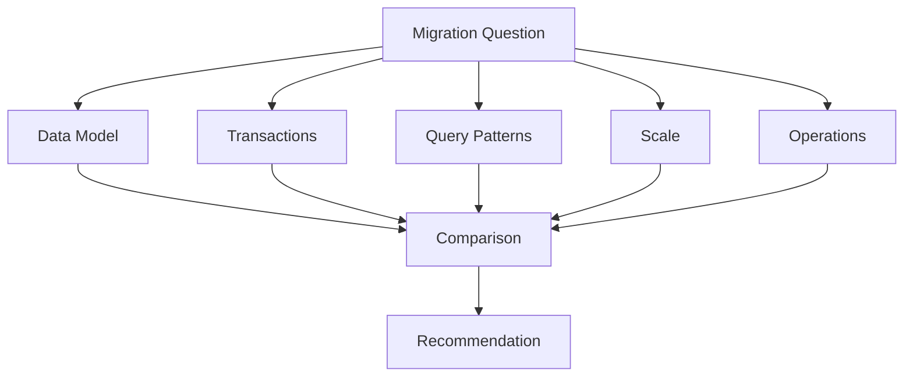

This pattern works well when the important dimensions are known in advance.

---

## 9. Pattern 2: Plan-then-Execute

Separate planning from execution.

### Prompt

```text
Task:
Create a migration plan for replacing an existing payment provider.

Phase 1 — Plan:
- Identify affected systems.
- List dependencies.
- Define migration stages.
- Identify rollback conditions.
- Identify required tests.

Phase 2 — Execute:
- Produce the final migration checklist.
- Assign a suggested owner role to each task.
- Include acceptance criteria.

Do not begin the final checklist until the plan is complete.
```

### Why this helps

Without a planning stage, a model may start writing detailed actions before it understands:

* Scope
* Dependencies
* Risks
* Required order

The plan becomes an intermediate artifact that can be reviewed independently.

---

## 10. Pattern 3: Step-back Prompting

Ask the model to identify the general principle before solving the specific case.

### Example

```text
Question:
Should this API operation be retried after receiving an HTTP 400 response?

First:
1. State the general difference between retryable and non-retryable failures.
2. Identify which information determines retry safety.

Then:
3. Apply those principles to the HTTP 400 case.
4. Provide the final recommendation.
```

Possible output:

```text
General principle:
Retries are appropriate for temporary failures when repeating the operation
is safe. Client errors usually indicate that the request must be corrected.

Application:
HTTP 400 normally means the request is invalid. Repeating the same request
without modification is unlikely to succeed.

Recommendation:
Do not automatically retry an unchanged HTTP 400 request.
```

Step-back prompting is useful when a specific question should be solved using a broader rule.

---

## 11. Pattern 4: Few-shot Structured Reasoning

Provide examples that demonstrate both the solution structure and final output.

### Example prompt

```text
Solve arithmetic word problems using this structure:

- Known values
- Required value
- Equation
- Result

Example 1

Problem:
A box contains 4 rows of 6 bottles. How many bottles are there?

Output:
Known values:
- Rows = 4
- Bottles per row = 6

Required value:
- Total bottles

Equation:
4 × 6 = 24

Result:
24 bottles

Example 2

Problem:
A store had 30 notebooks and sold 12. How many remain?

Output:
Known values:
- Starting notebooks = 30
- Sold notebooks = 12

Required value:
- Remaining notebooks

Equation:
30 - 12 = 18

Result:
18 notebooks

New problem:
A service processed 125 requests in the morning and 87 in the afternoon.
How many requests did it process in total?
```

In few-shot chain-of-thought style prompting, examples demonstrate intermediate solution steps instead of showing only input and final answer. The source material characterizes this form as a combination of input, intermediate steps, and output.

### Important rule

The example steps must be:

* Correct
* Relevant
* Concise
* Consistently formatted
* Representative of the real task

A wrong reasoning example can teach the model a wrong procedure.

---

## 12. Pattern 5: Contrastive Reasoning

Show both a good approach and a bad approach.

### Prompt example

```text
Task:
Classify whether an API error should be retried.

Good example:

Error:
HTTP 503 Service Unavailable

Analysis:
This usually represents a temporary upstream availability problem.
Retry with exponential backoff and a maximum attempt limit.

Decision:
retry

Bad example:

Error:
HTTP 401 Unauthorized

Incorrect analysis:
The server may recover, so retry continuously.

Why this is wrong:
The request lacks valid authentication. Repeating the same request does not
correct the credential problem and may increase load.

Decision:
do_not_retry

New error:
HTTP 429 Too Many Requests
```

Contrastive examples teach:

* What to do
* What not to do
* Why the incorrect pattern fails

This is often more effective than listing many negative instructions such as:

```text
Do not retry 401.
Do not retry forever.
Do not ignore authentication.
Do not create a retry loop.
```

---

## 13. Pattern 6: Self-consistency

For difficult tasks, generate several independent candidate solutions and compare their final conclusions.

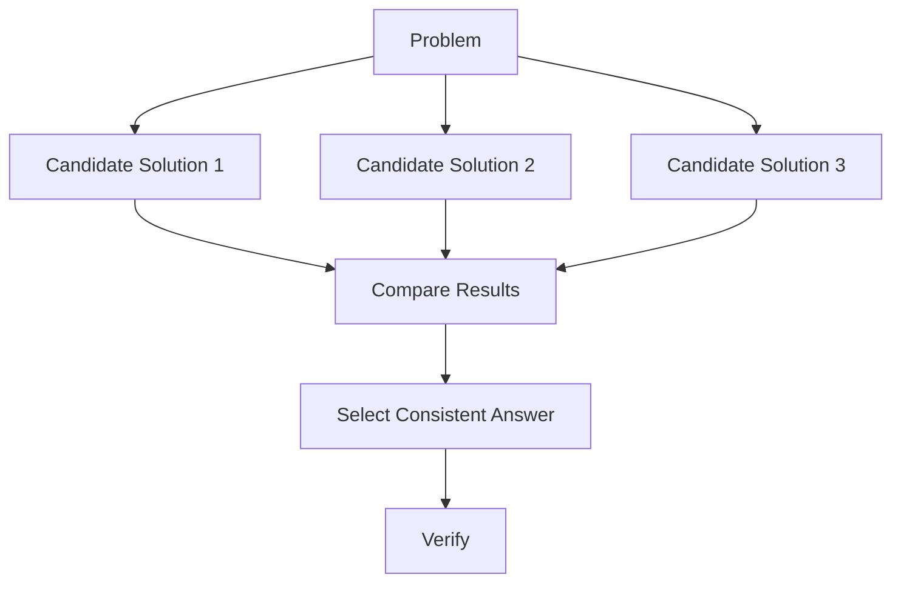

### Application-level implementation

1. Send the same task several times.
2. Vary sampling or reasoning budget when supported.
3. Parse the final answer from each result.
4. Compare answers.
5. Verify the most common result.
6. Escalate disagreements.

### Pseudocode

```typescript
type Candidate = {
  answer: string;
  confidence: number;
};

async function solveWithConsistency(
  prompt: string,
  attempts = 3,
): Promise<Candidate[]> {
  const requests = Array.from({ length: attempts }, () =>
    callLanguageModel({
      prompt,
      temperature: 0.6,
    }),
  );

  const responses = await Promise.all(requests);

  return responses.map((response) => ({
    answer: response.parsed.answer,
    confidence: response.parsed.confidence,
  }));
}
```

### Limitations

Self-consistency:

* Uses more tokens
* Requires multiple model calls
* Adds latency
* Can produce several identical but incorrect answers
* Still requires external validation for high-stakes tasks

Use it selectively.

---

## 14. Pattern 7: Tool-assisted Reasoning

Language models should not perform every operation from memory.

Use tools when intermediate results can be computed or retrieved reliably.

### Examples

| Task                 | Preferred tool        |
| -------------------- | --------------------- |
| Arithmetic           | Calculator            |
| Statistical analysis | Python                |
| Current information  | Search or trusted API |
| Customer record      | Database query        |
| Internal policy      | RAG retrieval         |
| Date calculation     | Date library          |
| Code verification    | Test runner           |
| Geographic distance  | Mapping API           |

### Workflow

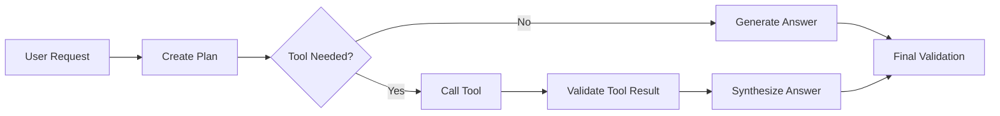

### Example prompt

```text
You are analyzing a financial forecast.

Process:
1. Extract all numeric inputs.
2. Identify the formulas needed.
3. Use the calculator tool for arithmetic.
4. Compare calculated values against the provided totals.
5. Report discrepancies.
6. Return the verified final result.

Do not estimate calculations mentally when the calculator is available.
```

Tool-assisted reasoning is usually more reliable than asking a model to produce a long natural-language calculation unsupported by executable checks.

---

## 15. Pattern 8: RAG with Structured Reasoning

A RAG pipeline must separate retrieval from synthesis.

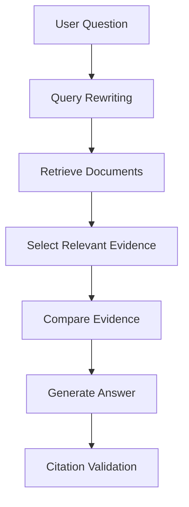

### Prompt template

```text
Answer the question using only the retrieved context.

Process:
1. Identify the claims required to answer the question.
2. Find supporting passages for each claim.
3. Note conflicts or missing evidence.
4. Produce the answer.
5. Cite the supporting passages.
6. If the evidence is insufficient, say so.

Do not use unsupported background knowledge.

Question:
{{QUESTION}}

Retrieved context:
{{CONTEXT}}
```

### Recommended output

```json
{
  "answer": "string",
  "claims": [
    {
      "claim": "string",
      "evidence_ids": ["doc_2_chunk_4"]
    }
  ],
  "conflicts": [],
  "missing_information": [],
  "confidence": 0.86
}
```

The evidence map is more valuable than an unrestricted reasoning transcript because the application can verify it.

---

## 16. Pattern 9: Coding and Debugging

### Weak prompt

```text
Fix this code.
```

### Better prompt

```text
Analyze the code and error logs.

Use this process:
1. State the observed failure.
2. Identify the smallest reproducible path.
3. Separate confirmed facts from hypotheses.
4. Rank at most three possible causes.
5. Propose a test for each cause.
6. Recommend the smallest safe patch.
7. Explain how to verify the patch.
8. Identify possible regressions.

Return:
- Root-cause summary
- Proposed patch
- Verification commands
- Remaining risks
```

### Debugging workflow

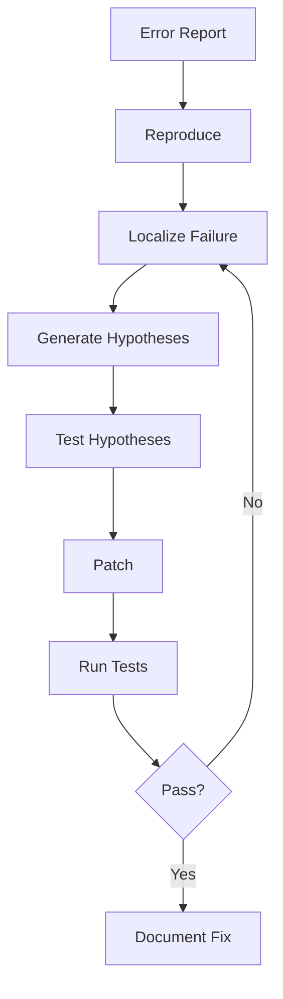

This process creates observable checkpoints instead of relying on a convincing explanation.

---

## 17. Pattern 10: Multimodal Structured Reasoning

For images, diagrams, charts, or screenshots, separate observation from interpretation.

### Prompt

```text
Analyze the attached chart.

Use this structure:

1. Observations
   - Report only visible labels, values, trends, and anomalies.

2. Calculations
   - Calculate changes only from visible values.

3. Interpretation
   - Explain what the observations may indicate.

4. Uncertainty
   - Identify unreadable or missing information.

5. Final conclusion
   - Give a concise summary.

Do not treat assumptions as visible facts.
```

### Workflow

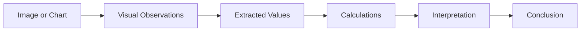

The supplied material includes multimodal examples in which visual observations are combined with domain principles before a conclusion is produced.

---

## 18. Reasoning Models Versus Reasoning Prompts

These concepts are related but different.

### Reasoning prompt

A reasoning prompt changes the instructions sent to a model.

```text
Break the task into stages and verify the result.
```

### Reasoning model

A reasoning-oriented model may internally allocate more inference computation to difficult tasks.

### Comparison

| Dimension       | Reasoning prompt                                  | Reasoning-oriented model                        |
| --------------- | ------------------------------------------------- | ----------------------------------------------- |
| Main mechanism  | Prompt instructions                               | Model design and inference behavior             |
| Works with      | Many general LLMs                                 | Specific model families                         |
| User control    | Process, schema, examples                         | Effort or budget controls when supported        |
| Cost impact     | Longer prompt and output                          | Potentially more inference tokens and latency   |
| Main benefit    | Explicit task structure                           | Stronger complex-task performance               |
| Main limitation | Model may imitate steps without solving correctly | Higher cost and latency may not help every task |

A reasoning-oriented model does not remove the need for:

* Clear instructions
* Good context
* Tools
* Output validation
* Evaluation

Similarly, adding “think step by step” does not automatically transform a weak model into a reliable reasoning system.

---

## 19. Recommended Production Pattern

For most applications, use **structured reasoning outputs** rather than requesting unrestricted chain-of-thought.

### Prompt template

```text
Role:
You are a careful technical analyst.

Task:
{{TASK}}

Context:
{{CONTEXT}}

Constraints:
- Use only the supplied evidence.
- Separate facts from assumptions.
- Do not invent missing values.
- Use tools for calculations when available.
- Mark uncertainty clearly.

Process:
1. Identify the required result.
2. Extract relevant facts.
3. Break the task into subproblems.
4. Resolve each subproblem.
5. Verify important intermediate results.
6. Produce the final answer.

Output schema:
{
  "answer": "string",
  "assumptions": ["string"],
  "key_steps": [
    {
      "step": "string",
      "result": "string"
    }
  ],
  "evidence": ["string"],
  "uncertainties": ["string"],
  "confidence": 0.0
}
```

This gives the application a useful explanation without requiring an exhaustive private reasoning trace.

---

## 20. Complete Demo: Customer-support Decision

### Scenario

A customer says:

```text
I cancelled my subscription yesterday, but I was charged again today.
I need the money returned immediately.
```

### Prompt

```text
Role:
You are a customer-support triage assistant.

Task:
Determine the customer's intent, urgency, required checks, and recommended action.

Context:
A cancellation may take effect immediately or at the end of the billing period.
The system must verify the cancellation timestamp and billing policy before
promising a refund.

Constraints:
- Do not guarantee a refund without verification.
- Do not invent account information.
- Escalate when payment or cancellation records conflict.
- Return valid JSON only.

Process:
1. Extract the customer's explicit request.
2. Identify the relevant account events that must be checked.
3. Determine urgency.
4. Recommend the next safe action.
5. Draft a concise response.

Output schema:
{
  "intent": "string",
  "urgency": "low | medium | high",
  "required_checks": ["string"],
  "recommended_action": "string",
  "suggested_reply": "string",
  "requires_human_review": false
}

Input:
I cancelled my subscription yesterday, but I was charged again today.
I need the money returned immediately.
```

### Expected output

```json
{
  "intent": "refund_after_cancellation",
  "urgency": "high",
  "required_checks": [
    "Verify the cancellation timestamp",
    "Verify the latest charge timestamp",
    "Check whether cancellation was immediate or end-of-cycle",
    "Check whether the charge is pending or completed"
  ],
  "recommended_action": "Review the cancellation and payment records, then issue or escalate the refund according to policy.",
  "suggested_reply": "I’m sorry you were charged after cancelling. I’ll review the cancellation and payment timestamps immediately and help resolve the charge according to the applicable refund policy.",
  "requires_human_review": true
}
```

The output exposes actionable checks, not unrestricted internal reasoning.

---

## 21. Validation

Structured reasoning does not guarantee correctness.

Validate:

* JSON syntax
* Required fields
* Enum values
* Numerical ranges
* Formula results
* Evidence references
* Tool-call results
* Unsupported claims
* Safety requirements

### Validation pipeline

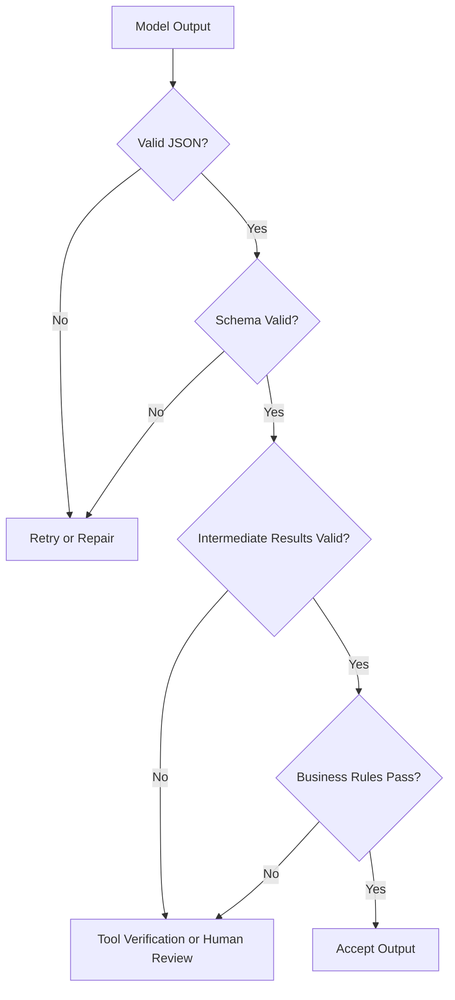

### Example TypeScript validator

```typescript
type ReasoningResult = {
  answer: string;
  assumptions: string[];
  key_steps: Array<{
    step: string;
    result: string;
  }>;
  confidence: number;
};

function validateReasoningResult(value: unknown): ReasoningResult {
  if (typeof value !== "object" || value === null) {
    throw new Error("Output must be an object");
  }

  const data = value as Record<string, unknown>;

  if (typeof data.answer !== "string" || data.answer.trim() === "") {
    throw new Error("A non-empty answer is required");
  }

  if (!Array.isArray(data.assumptions)) {
    throw new Error("assumptions must be an array");
  }

  if (!Array.isArray(data.key_steps)) {
    throw new Error("key_steps must be an array");
  }

  if (
    typeof data.confidence !== "number" ||
    data.confidence < 0 ||
    data.confidence > 1
  ) {
    throw new Error("confidence must be between 0 and 1");
  }

  return data as ReasoningResult;
}
```

---

## 22. Common Mistakes

### 22.1 Adding only “Think step by step”

This phrase may help in some cases, but it does not define:

* Which steps are necessary
* What evidence is allowed
* Which tools should be used
* What output format is required
* How the result should be validated

Better:

```text
Extract the inputs, select the formula, calculate with the calculator tool,
verify the units, and return the result as JSON.
```

---

### 22.2 Assuming longer reasoning means higher accuracy

A long explanation can still contain:

* Incorrect assumptions
* Arithmetic mistakes
* Fabricated evidence
* Circular logic
* Contradictory conclusions

The course material notes that models may imitate the requested reasoning format even when their final answer remains wrong.

Evaluate correctness independently of explanation length.

---

### 22.3 Treating the rationale as proof

A rationale is not evidence by itself.

Weak:

```text
The model explained it confidently, so the result must be correct.
```

Better:

```text
The answer is supported by source passages 2 and 5, and the calculation
was independently verified by the calculator.
```

---

### 22.4 Allowing early errors to propagate

A wrong early assumption can affect every later step.

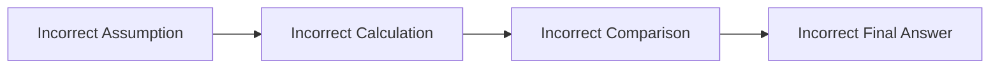

The source material identifies error propagation as an important limitation: an error in an early stage can contaminate the entire solution.

Add checkpoints:

```text
After each calculation, verify the value before using it in later steps.
```

---

### 22.5 Using reasoning prompts for every request

Do not add a seven-stage process to a simple classification or translation task unless evaluation shows that it helps.

Use the smallest prompt that produces reliable results.

---

### 22.6 Not using available tools

Do not ask a model to manually calculate a complex financial forecast when Python or a calculator is available.

Do not ask it to guess current facts when search is available.

Do not ask it to infer company policy when a policy knowledge base exists.

---

### 22.7 Exposing sensitive internal data

Intermediate reasoning outputs may accidentally include:

* Private customer information
* Credentials
* Hidden system instructions
* Sensitive retrieved passages
* Internal security details

Control what is:

* Retrieved
* Logged
* Stored
* Returned to users

---

### 22.8 Ignoring token cost and latency

Generating intermediate text increases:

* Output tokens
* Processing time
* Cost
* Context usage

The supplied material notes that producing additional intermediate steps can make this approach significantly more resource-intensive than a direct response.

Use concise structured outputs when possible.

---

### 22.9 Not validating the final answer separately

A well-structured explanation does not guarantee that the final answer matches the intermediate results.

Verify:

* Does the conclusion follow from the calculations?
* Do the units match?
* Are all claims supported?
* Does the recommendation follow the stated policy?
* Does the code patch fix the reproduced error?

---

## 23. Evaluation Strategy

Do not judge a reasoning prompt from one successful example.

Create an evaluation dataset containing:

* Simple inputs
* Multi-step inputs
* Ambiguous inputs
* Missing information
* Contradictory information
* Adversarial instructions
* Tool-required tasks
* Long-context tasks
* Cases with known answers

### Compare prompt variants

1. Direct answer prompt
2. Generic “think step by step” prompt
3. Explicit decomposition prompt
4. Few-shot structured reasoning prompt
5. Tool-assisted prompt
6. Self-consistency workflow
7. Reasoning-oriented model

### Evaluation table

| Test ID | Strategy             | Correct | Schema valid | Evidence valid |  Latency | Input tokens | Output tokens |   Cost |
| ------- | -------------------- | ------: | -----------: | -------------: | -------: | -----------: | ------------: | -----: |
| T001    | Direct               |      No |          Yes |            N/A |   410 ms |          110 |            20 | $0.001 |
| T001    | Generic step-by-step |     Yes |           No |             No |   920 ms |          125 |           180 | $0.004 |
| T001    | Structured           |     Yes |          Yes |            Yes |   780 ms |          240 |            85 | $0.003 |
| T001    | Tool-assisted        |     Yes |          Yes |            Yes | 1,050 ms |          275 |            74 | $0.004 |

### Quality metrics

For deterministic tasks:

* Exact-match accuracy
* Numerical accuracy
* Unit accuracy
* Tool-result agreement
* Final-answer consistency

For RAG:

* Citation correctness
* Citation completeness
* Unsupported-claim rate
* Retrieval recall
* Answer faithfulness

For planning:

* Dependency coverage
* Constraint compliance
* Risk coverage
* Actionability
* Human acceptance rate

For operations:

* Input tokens
* Output tokens
* Time to first token
* Total latency
* Cost
* Timeout rate
* Retry rate
* Invalid-output rate

---

## 24. Practical Exercise

### Objective

Compare direct prompting with structured reasoning for a small business decision.

### Scenario

A company is considering replacing a manual customer-support process with an AI assistant.

Given:

```text
- Current support agents: 8
- Average tickets per day: 480
- Average handling time: 8 minutes
- Estimated AI automation rate: 35%
- AI platform cost: $2,000 per month
- Human review is required for billing and refund requests
```

### Version A: Direct prompt

```text
Should the company implement the AI assistant?
```

### Version B: Structured prompt

```text
Evaluate whether the company should implement the AI assistant.

Process:
1. Summarize the current workload.
2. Estimate the number of tickets that could be automated.
3. Identify which ticket types still require human review.
4. Identify financial and operational benefits.
5. Identify risks and missing data.
6. Recommend one of:
   - implement
   - run_pilot
   - do_not_implement

Return JSON with:
- recommendation
- automated_tickets_per_day
- benefits
- risks
- missing_information
- confidence
```

### Version C: Tool-assisted prompt

Use code or a calculator to verify all workload calculations.

### Test requirements

Record:

* Final recommendation
* Calculation correctness
* Missing-data awareness
* Output validity
* Latency
* Input tokens
* Output tokens
* Estimated cost

### Reflection questions

1. Did structured decomposition change the recommendation?
2. Did the model identify missing salary and quality data?
3. Did tool use improve numerical reliability?
4. Was the additional latency justified?
5. Which output was easiest to integrate into an application?

---

## 25. Mini Project: Reasoning Prompt Lab

Extend **Project 4: Prompt Lab** with structured-reasoning experiments.

### Features

* Save direct and structured prompt templates
* Define process stages
* Add few-shot examples
* Select models
* Configure reasoning effort when supported
* Run tool-assisted tests
* Compare output schemas
* Validate calculations
* Track latency and tokens
* Record human ratings
* Compare prompt versions

### Architecture

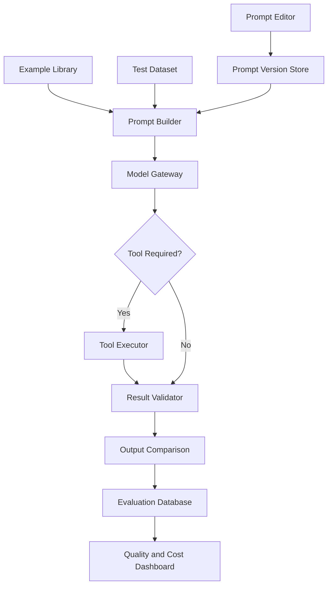

### Suggested data model

```text
prompts
prompt_versions
reasoning_strategies
examples
test_cases
model_runs
tool_calls
validation_results
human_reviews
```

### Example experiment record

```json
{
  "run_id": "run_005",
  "prompt_version": "support-analysis-v3",
  "strategy": "structured_tool_assisted",
  "model": "configured-model-id",
  "input_tokens": 642,
  "output_tokens": 118,
  "latency_ms": 1460,
  "tool_calls": 1,
  "schema_valid": true,
  "answer_correct": true,
  "evidence_valid": true,
  "human_score": 4.5
}
```

---

## 26. Production Checklist

### Task Design

* [ ] The task genuinely requires multiple steps.
* [ ] The desired final outcome is explicit.
* [ ] The model receives sufficient context.
* [ ] Facts, assumptions, and hypotheses are separated.
* [ ] The required reasoning stages are defined.
* [ ] Available tools are identified.
* [ ] The output schema is stable.

### Reliability

* [ ] Intermediate calculations are verified.
* [ ] Retrieved evidence is traceable.
* [ ] Unsupported claims are rejected.
* [ ] Uncertainty is represented.
* [ ] High-risk outputs can be escalated.
* [ ] The final conclusion is validated separately.
* [ ] Failure and fallback behavior is defined.

### Evaluation

* [ ] A direct baseline has been tested.
* [ ] Generic and explicit reasoning prompts have been compared.
* [ ] Tool-assisted execution has been tested.
* [ ] Edge cases are included.
* [ ] Regression tests exist.
* [ ] Quality metrics are recorded.
* [ ] Human review criteria are defined.

### Operations

* [ ] Input and output tokens are logged.
* [ ] Latency is logged.
* [ ] Tool-call duration is logged.
* [ ] Cost per request is estimated.
* [ ] Retry and timeout behavior is defined.
* [ ] Prompt and model versions are recorded.
* [ ] Sensitive intermediate content is protected.

---

## 27. Completion Checklist

After completing this lesson:

* [ ] I can explain chain-of-thought style prompting in one or two minutes.
* [ ] I can identify tasks that benefit from decomposition.
* [ ] I understand the difference between hidden reasoning and useful structured explanations.
* [ ] I can write an explicit multi-stage process.
* [ ] I can create a machine-readable output schema.
* [ ] I can use few-shot structured examples.
* [ ] I can combine reasoning with RAG or tools.
* [ ] I can validate intermediate and final results.
* [ ] I can measure tokens, latency, cost, and failures.
* [ ] I understand that plausible reasoning can still be incorrect.
* [ ] I have created a small demo or portfolio artifact.

---

## 28. Key Takeaways

1. **Chain-of-thought style prompting decomposes complex tasks into manageable stages.**

2. **Explicit processes are usually more reliable than simply saying “think step by step.”**

3. **Production applications should request verifiable artifacts, not unrestricted hidden reasoning.**

4. **A convincing explanation is not proof that an answer is correct.**

5. **Early mistakes can propagate through later stages.**

6. **Calculators, code execution, retrieval, and external APIs should verify intermediate results.**

7. **Few-shot examples can demonstrate a preferred solution structure.**

8. **Self-consistency can improve difficult tasks but increases cost and latency.**

9. **Reasoning prompts are not necessary for every simple request.**

10. **Prompts, tools, schemas, validation, and evaluation must work together as one system.**

---

## 29. Related Outcome

> Design prompts that are clear, constrained, testable, and robust across realistic inputs.

---

## 30. Related Project

**Project 4: Prompt Lab**

Build a prompt-engineering environment with:

* Direct and structured prompt templates
* Saved prompt versions
* Reasoning-strategy comparison
* Few-shot example libraries
* Tool-assisted execution
* Structured-output validation
* Token and latency tracking
* Cost comparison
* Evaluation datasets
* Human review
* Regression testing

---

## 31. Final Summary

Chain-of-thought style prompting is an important technique for AI Engineers because many useful application tasks cannot be solved reliably in a single unstructured jump.

The best production implementation is not simply:

```text
Think step by step.
```

It is a complete workflow:

```text
Understand the task
→ extract facts
→ decompose the problem
→ use tools
→ verify intermediate results
→ validate the conclusion
→ return a structured answer
```

Use this pattern when a task genuinely requires reasoning, planning, calculation, evidence comparison, or tool coordination. Keep the process concise, observable, testable, and appropriate to the task.

Turn the lesson into a real artifact: a structured prompt, API route, RAG workflow, debugging assistant, decision-analysis tool, multimodal analyzer, agent workflow, or Prompt Lab experiment.
