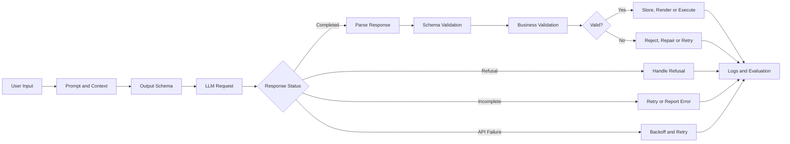
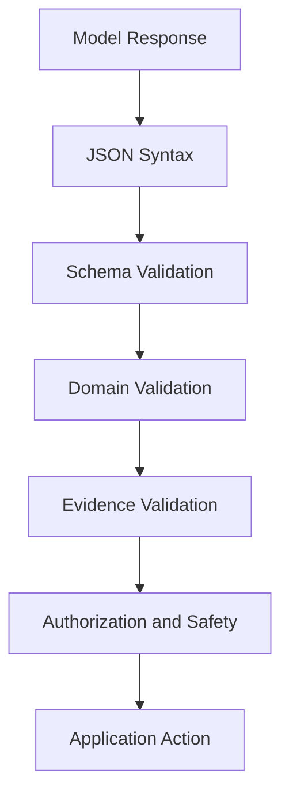
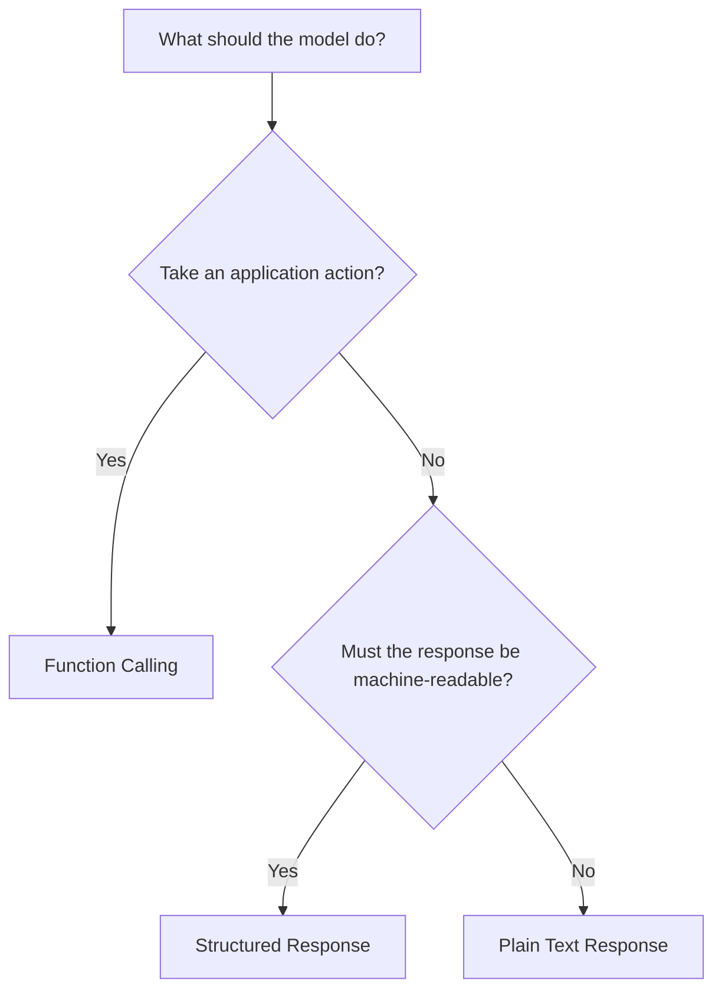
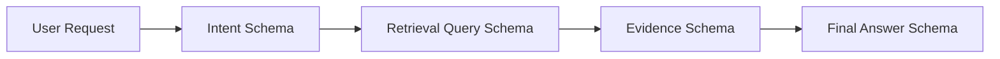
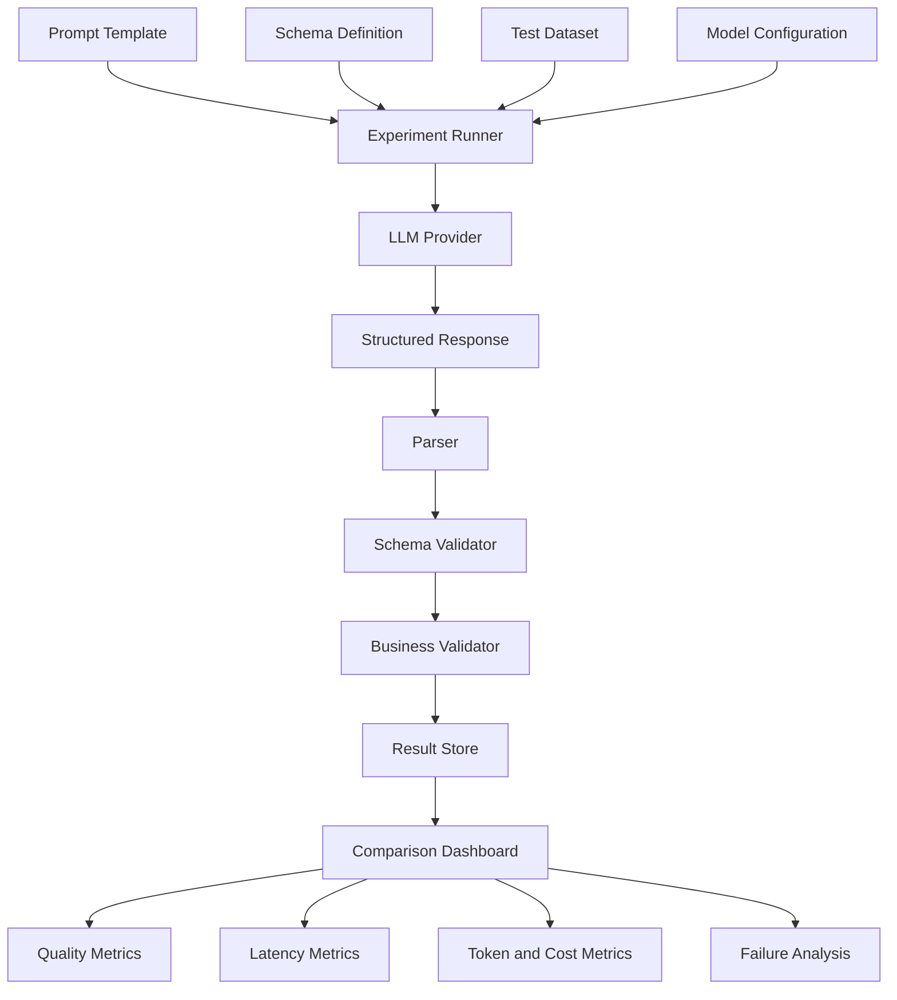

# 006 — Structured Output

**Course:** 02 — Model Platforms and Prompting
**Module:** Module 05 — Prompt Engineering
**Content Group:** Output Control
**Roadmap Source:** Prompt Engineering / Output Control
**Lesson Type:** Prompting
**Order in Module:** 006
**Suggested Duration:** 22 minutes

---

## 1. Summary

**Structured Output** is a method for making a language model return information in a predictable, machine-readable format such as JSON.

Instead of receiving an uncontrolled paragraph, the application defines a schema describing:

* Which fields must exist
* Which data type each field must use
* Which values are allowed
* How objects and arrays are organized
* Whether additional fields are permitted

For example:

```json
{
  "summary": "The deployment may be delayed.",
  "risks": [
    "The database migration has not been tested."
  ],
  "next_actions": [
    "Run the migration in a staging environment."
  ]
}
```

The supplied learning material describes Structured Outputs as a feature intended to make generated output match the JSON Schema supplied by the developer.

Structured output is important because modern AI applications rarely use model responses only as text. They often need to:

* Save results in a database
* Render different fields in a user interface
* Pass data into another LLM step
* Select the next agent action
* Call an API or application function
* Create analytics and evaluation reports
* Apply business rules
* Trigger automated workflows

OpenAI currently defines Structured Outputs as model responses that adhere to a developer-provided JSON Schema. Its documented benefits include reliable type safety, detectable refusals, and simpler formatting instructions.

> **Core principle:** A model response should be treated as external data, not trusted application state.

---

## 2. Learning Objectives

By the end of this lesson, you should be able to:

1. Explain Structured Output in your own words.
2. Distinguish plain text, JSON mode, Structured Output, and function calling.
3. Design a practical JSON Schema for an AI application.
4. Generate structured responses through an API.
5. Parse model output into a typed application object.
6. Validate both schema rules and business rules.
7. Handle refusals, incomplete responses, API errors, and validation failures.
8. Log latency, token usage, retries, and schema failures.
9. Apply structured output to RAG, agents, multimodal systems, and production APIs.
10. Build a small Structured Output demo for a portfolio.

---

## 3. Main Concepts

### 3.1 What Is Structured Output?

Structured Output constrains the shape of a model response.

Without output control, a model might return:

```text
Certainly! Here is the analysis you requested.

The deployment looks mostly safe, although the database migration
has not been tested. You should test it in staging first.
```

This may be readable by a human, but it is difficult for an application to consume reliably.

A structured version is easier to process:

```json
{
  "summary": "The deployment is mostly safe.",
  "risks": [
    "The database migration has not been tested."
  ],
  "next_actions": [
    "Test the migration in staging."
  ]
}
```

The application can now access fields directly:

```python
result["summary"]
result["risks"]
result["next_actions"]
```

---

### 3.2 Where Structured Output Fits in an AI System



Structured Output sits between the language model and the rest of the application.

It acts as a contract:

```text
Natural-language input
        ↓
Model interpretation
        ↓
Structured application data
        ↓
Deterministic software logic
```

---

### 3.3 Why Plain Prompt Instructions Are Not Enough

A prompt may say:

```text
Return only JSON. Do not include Markdown.
Always include summary, risks and next_actions.
```

The model may still produce:

```text
Here is the requested JSON:

{
  "summary": "...",
  "risk": "...",
  "actions": "..."
}
```

This creates several problems:

* Extra text appears before the JSON.
* `risk` is used instead of `risks`.
* `actions` is used instead of `next_actions`.
* Arrays are returned as strings.
* Required fields may be missing.
* Unexpected fields may be added.
* Enum values may be invented.
* The response may be truncated.

These failures are common when the schema exists only as natural-language instructions.

---

### 3.4 Four Levels of Output Control

| Level             | Example                       | Guarantee                                | Recommended use                    |
| ----------------- | ----------------------------- | ---------------------------------------- | ---------------------------------- |
| Plain text        | “Answer using three sections” | No machine-readable guarantee            | Human-facing conversations         |
| Prompted JSON     | “Return only JSON”            | Best-effort formatting                   | Prototypes only                    |
| JSON mode         | Enable JSON object output     | Valid JSON                               | Legacy or unsupported schema cases |
| Structured Output | Supply a strict JSON Schema   | Valid JSON matching the supported schema | Production application data        |

JSON mode ensures syntactically valid JSON, but it does not guarantee that the output follows a specific schema. Structured Outputs provide schema adherence and are recommended over JSON mode when supported.

The supplied source also highlights the limitation of JSON mode: an output may be valid JSON while still containing the wrong type or an unexpected parameter.

---

### 3.5 Structured Output Is Not the Same as Correct Output

Structured Output can guarantee this:

```json
{
  "risk_level": "high",
  "confidence": 0.92
}
```

It cannot automatically guarantee that:

* The risk really is high.
* The confidence score is calibrated.
* The source document supports the answer.
* The model did not misunderstand the input.
* The output complies with your business rules.
* The output is safe to execute.

Therefore, validation should happen at multiple levels.



#### Validation layers

1. **Syntax validation**
   Can the response be parsed as JSON?

2. **Schema validation**
   Are the required fields, types, arrays, and enum values correct?

3. **Domain validation**
   Does the data satisfy application rules?

4. **Evidence validation**
   Is the result supported by retrieved documents or trusted data?

5. **Permission validation**
   Is the user or agent allowed to perform the requested action?

---

### 3.6 Anatomy of a JSON Schema

Consider this schema:

```json
{
  "type": "object",
  "properties": {
    "summary": {
      "type": "string"
    },
    "risks": {
      "type": "array",
      "items": {
        "type": "string"
      }
    },
    "next_actions": {
      "type": "array",
      "items": {
        "type": "string"
      }
    }
  },
  "required": [
    "summary",
    "risks",
    "next_actions"
  ],
  "additionalProperties": false
}
```

#### Important fields

| Keyword                | Meaning                            |
| ---------------------- | ---------------------------------- |
| `type`                 | The expected JSON data type        |
| `properties`           | Fields allowed inside an object    |
| `items`                | Schema for each array item         |
| `required`             | Fields that must be returned       |
| `enum`                 | A fixed set of allowed values      |
| `description`          | Semantic guidance for the model    |
| `additionalProperties` | Whether undefined keys are allowed |

For current OpenAI strict schemas, all fields must be marked as required. A logically optional value can be represented using a union with `null`.

Objects must also use:

```json
{
  "additionalProperties": false
}
```

This prevents the model from adding keys that are not defined in the schema.

---

### 3.7 Use Enums for Decisions

A weak schema might define:

```json
{
  "risk_level": {
    "type": "string"
  }
}
```

Possible model outputs could include:

```text
high
High
very high
critical
dangerous
severe
```

A stronger schema constrains the possible values:

```json
{
  "risk_level": {
    "type": "string",
    "enum": [
      "low",
      "medium",
      "high"
    ]
  }
}
```

This makes downstream logic deterministic:

```python
if result.risk_level == "high":
    require_human_review()
```

Enums are especially useful for:

* Intent classification
* Sentiment classification
* Workflow routing
* Agent decisions
* Priority levels
* Content categories
* Approval status
* Safety status

---

### 3.8 Representing Optional Information

In a normal application model, a field may be optional:

```python
deadline: str | None
```

In a strict schema, the field can remain required while its value may be `null`:

```json
{
  "deadline": {
    "type": [
      "string",
      "null"
    ]
  }
}
```

Valid outputs include:

```json
{
  "deadline": "2026-08-01"
}
```

and:

```json
{
  "deadline": null
}
```

This is preferable to allowing the field to disappear unpredictably.

---

### 3.9 Structured Response or Function Calling?

Structured Outputs can be used in two major ways:

1. Structure a response that your application will display, save, or process.
2. Structure the arguments for a function or tool call.

OpenAI’s current guidance is:

* Use **function calling** when connecting the model to tools, functions, databases, or application actions.
* Use a structured response format when the model should return structured content to the user or application.



#### Example: structured response

```json
{
  "summary": "The candidate has strong Python experience.",
  "score": 82,
  "recommendation": "interview"
}
```

The application displays or stores the result.

#### Example: function call

```json
{
  "candidate_id": "candidate_125",
  "interview_time": "2026-07-22T10:00:00+07:00",
  "duration_minutes": 45
}
```

The application passes these arguments into:

```python
schedule_interview(...)
```

Strict function calling should use `strict: true`. Current OpenAI documentation states that strict function schemas require all properties to be required and every object to set `additionalProperties` to `false`.

---

### 3.10 Applications of Structured Output

#### RAG pipeline

```json
{
  "answer": "The refund period is 30 days.",
  "citations": [
    {
      "document_id": "refund_policy",
      "section": "2.1"
    }
  ],
  "evidence_sufficient": true
}
```

#### AI agent router

```json
{
  "intent": "create_calendar_event",
  "requires_tool": true,
  "tool_name": "calendar.create_event",
  "needs_confirmation": true
}
```

#### Multimodal extraction

```json
{
  "document_type": "invoice",
  "invoice_number": "INV-2026-1042",
  "total": 245.5,
  "currency": "USD"
}
```

#### Content moderation support

```json
{
  "category": "harassment",
  "severity": "medium",
  "requires_human_review": true
}
```

#### Story-generation pipeline

```json
{
  "chapter_number": 2,
  "goal": "The protagonist chooses to continue the exam.",
  "conflict": "Fear of disappointing the family",
  "emotional_shift": "anxiety_to_determination",
  "continuity_requirements": [
    "The exam begins at 08:00.",
    "The protagonist carries the father's old pen."
  ]
}
```

This can be passed to a second model call that writes the full chapter.

---

## 4. Example and Demo

### 4.1 Use Case

Build a model that analyzes an AI project update and returns:

* A short summary
* Overall risk level
* Identified risks
* Recommended next actions
* Whether human review is required

### Input

```text
The team plans to deploy the new recommendation service tomorrow.
The API tests pass, but the database migration has only been tested
locally. No rollback procedure has been documented. The team expects
approximately 20,000 requests during the first hour.
```

### Expected output

```json
{
  "summary": "The recommendation service is planned for deployment tomorrow, but database and rollback readiness are incomplete.",
  "risk_level": "high",
  "risks": [
    {
      "title": "Untested production migration",
      "severity": "high",
      "reason": "The migration has only been tested locally."
    },
    {
      "title": "Missing rollback procedure",
      "severity": "high",
      "reason": "The team has not documented how to recover from a failed deployment."
    }
  ],
  "next_actions": [
    "Test the migration in staging.",
    "Document and rehearse the rollback procedure.",
    "Run a load test before deployment."
  ],
  "requires_human_review": true
}
```

---

### 4.2 Python Demo with Pydantic

The current OpenAI Python SDK supports parsing a Responses API result directly into a Pydantic model through `client.responses.parse`, `text_format`, and `response.output_parsed`.

```python
import json
import time
from typing import Literal

from openai import OpenAI
from pydantic import BaseModel, ConfigDict, Field


client = OpenAI()


class Risk(BaseModel):
    model_config = ConfigDict(extra="forbid")

    title: str = Field(min_length=1, max_length=120)
    severity: Literal["low", "medium", "high"]
    reason: str = Field(min_length=1, max_length=500)


class ProjectAnalysis(BaseModel):
    model_config = ConfigDict(extra="forbid")

    summary: str = Field(min_length=1, max_length=500)
    risk_level: Literal["low", "medium", "high"]
    risks: list[Risk]
    next_actions: list[str]
    requires_human_review: bool


def analyze_project_update(update: str) -> ProjectAnalysis:
    if not update.strip():
        raise ValueError("The project update must not be empty.")

    started_at = time.perf_counter()

    response = client.responses.parse(
        model="gpt-5.6",
        input=[
            {
                "role": "developer",
                "content": (
                    "Analyze the project update. "
                    "Use only information supported by the input. "
                    "Do not invent completed tests, owners, dates, or metrics. "
                    "Set requires_human_review to true when a high-severity "
                    "risk is present."
                ),
            },
            {
                "role": "user",
                "content": update,
            },
        ],
        text_format=ProjectAnalysis,
    )

    latency_ms = round(
        (time.perf_counter() - started_at) * 1000,
        2,
    )

    if response.status != "completed":
        reason = getattr(
            response.incomplete_details,
            "reason",
            "unknown",
        )
        raise RuntimeError(
            f"Model response was incomplete: {reason}"
        )

    result = response.output_parsed

    if result is None:
        raise RuntimeError(
            "No parsed result was returned. "
            "Inspect the raw response for a refusal or error."
        )

    # Business-rule validation
    contains_high_risk = any(
        risk.severity == "high"
        for risk in result.risks
    )

    if contains_high_risk and not result.requires_human_review:
        raise ValueError(
            "Business-rule failure: high risks require human review."
        )

    log_record = {
        "response_id": response.id,
        "status": response.status,
        "latency_ms": latency_ms,
        "input_tokens": (
            response.usage.input_tokens
            if response.usage
            else None
        ),
        "output_tokens": (
            response.usage.output_tokens
            if response.usage
            else None
        ),
        "total_tokens": (
            response.usage.total_tokens
            if response.usage
            else None
        ),
        "schema_name": "ProjectAnalysis",
        "schema_version": "1.0.0",
    }

    print(
        json.dumps(
            log_record,
            indent=2,
            ensure_ascii=False,
        )
    )

    return result


if __name__ == "__main__":
    sample_input = """
    The team plans to deploy the new recommendation service tomorrow.
    The API tests pass, but the database migration has only been tested
    locally. No rollback procedure has been documented. The team expects
    approximately 20,000 requests during the first hour.
    """

    analysis = analyze_project_update(sample_input)

    print(
        analysis.model_dump_json(
            indent=2,
        )
    )
```

---

### 4.3 Why This Demo Is Safer Than `json.loads()`

A basic implementation might do this:

```python
raw_text = call_model(prompt)
result = json.loads(raw_text)
```

That checks only whether the text is valid JSON.

The Pydantic approach also verifies:

* Required fields
* String, Boolean, object, and array types
* Allowed enum values
* Nested object structure
* Extra fields
* String-length constraints
* Application-level validation rules

The important distinction is:

```text
JSON parsing:
“Is this syntactically valid JSON?”

Schema validation:
“Does this JSON have the expected structure?”

Business validation:
“Is this data acceptable for this application?”
```

---

### 4.4 Raw JSON Schema Version

A vendor-neutral schema for the same output could look like this:

```json
{
  "type": "object",
  "properties": {
    "summary": {
      "type": "string",
      "description": "A concise summary supported by the input."
    },
    "risk_level": {
      "type": "string",
      "enum": [
        "low",
        "medium",
        "high"
      ]
    },
    "risks": {
      "type": "array",
      "items": {
        "type": "object",
        "properties": {
          "title": {
            "type": "string"
          },
          "severity": {
            "type": "string",
            "enum": [
              "low",
              "medium",
              "high"
            ]
          },
          "reason": {
            "type": "string"
          }
        },
        "required": [
          "title",
          "severity",
          "reason"
        ],
        "additionalProperties": false
      }
    },
    "next_actions": {
      "type": "array",
      "items": {
        "type": "string"
      }
    },
    "requires_human_review": {
      "type": "boolean"
    }
  },
  "required": [
    "summary",
    "risk_level",
    "risks",
    "next_actions",
    "requires_human_review"
  ],
  "additionalProperties": false
}
```

---

### 4.5 Prompt Design

The schema controls the shape, while the prompt controls the meaning.

A useful developer instruction is:

```text
Analyze the project update.

Rules:
1. Use only information supported by the input.
2. Do not invent owners, dates, metrics or completed work.
3. Identify a risk only when the input provides evidence for it.
4. Set requires_human_review to true when any risk is high.
5. Make every next action specific and executable.
```

Notice that the prompt does not need to repeatedly describe JSON syntax. Formatting belongs in the schema.

A strong Structured Output request therefore has two separate contracts:

```text
Prompt contract
    → What the fields should mean

Schema contract
    → What shape the fields must have
```

---

## 5. Practical Exercise

### Exercise: Support Ticket Analyzer

Create a Structured Output system for this input:

```text
I ordered a keyboard two weeks ago. The tracking page still says
“label created,” and customer support has not replied to my last
two messages. I need the keyboard before Monday.
```

### Required schema

```json
{
  "category": "string",
  "urgency": "low | medium | high",
  "customer_summary": "string",
  "facts": ["string"],
  "missing_information": ["string"],
  "recommended_actions": ["string"],
  "requires_human_agent": true
}
```

### Requirements

1. Define the schema using Pydantic, Zod, or JSON Schema.
2. Restrict `category` to:

   * `delivery_delay`
   * `refund_request`
   * `damaged_item`
   * `account_issue`
   * `other`
3. Restrict urgency to:

   * `low`
   * `medium`
   * `high`
4. Prevent unknown fields.
5. Validate the model response.
6. Add one business rule:

   * High urgency must require a human agent.
7. Log:

   * Model
   * Prompt version
   * Schema version
   * Input tokens
   * Output tokens
   * Total tokens
   * Latency
   * Retry count
   * Validation result
8. Test at least five inputs.

---

### Suggested Test Cases

| Case         | Input characteristic                | Expected behavior                   |
| ------------ | ----------------------------------- | ----------------------------------- |
| Normal       | Clear delivery problem              | Valid structured result             |
| Empty        | No ticket content                   | Reject before model call            |
| Ambiguous    | “It does not work”                  | Populate missing information        |
| Adversarial  | User asks model to ignore schema    | Schema remains unchanged            |
| Long         | Large conversation history          | Complete output or controlled error |
| Unsafe       | Request contains disallowed content | Detect and handle refusal           |
| Multilingual | Vietnamese support ticket           | Same schema, localized content      |

---

### Expected Output Example

```json
{
  "category": "delivery_delay",
  "urgency": "high",
  "customer_summary": "The keyboard shipment has not progressed beyond label creation, and the customer needs it before Monday.",
  "facts": [
    "The order was placed two weeks ago.",
    "Tracking still shows label created.",
    "Two support messages have not received a reply.",
    "The customer needs the keyboard before Monday."
  ],
  "missing_information": [
    "Order number",
    "Carrier name",
    "Exact delivery address",
    "Exact date represented by Monday"
  ],
  "recommended_actions": [
    "Verify whether the carrier received the package.",
    "Escalate the ticket to a human support agent.",
    "Offer replacement or refund options if the package was not handed to the carrier."
  ],
  "requires_human_agent": true
}
```

---

### Evaluation Metrics

Measure more than whether the program executes successfully.

| Metric                 | Question                                 |
| ---------------------- | ---------------------------------------- |
| Parse success rate     | How many responses can be parsed?        |
| Schema success rate    | How many responses match the schema?     |
| Field accuracy         | Are extracted facts correct?             |
| Enum accuracy          | Is the selected category appropriate?    |
| Unsupported-claim rate | Does the model invent information?       |
| Empty-field quality    | Are missing values represented properly? |
| Business-rule success  | Are application rules satisfied?         |
| Refusal handling       | Are refusals detected safely?            |
| P50 latency            | Typical response time                    |
| P95 latency            | Slow-request response time               |
| Token usage            | How expensive is each request?           |
| Retry rate             | How often is another request required?   |

---

## 6. Common Mistakes

### Mistake 1: Treating a successful demo as production evidence

A prompt that works once has not been proven reliable.

Test it against:

* Empty inputs
* Long inputs
* Conflicting statements
* Misspellings
* Multiple languages
* Prompt-injection attempts
* Unusual values
* Missing information
* Unsupported requests
* Model-version changes

---

### Mistake 2: Using only “Return JSON”

This is a formatting instruction, not a real data contract.

Use a schema-based feature when available.

---

### Mistake 3: Assuming valid structure means correct facts

This output is structurally valid:

```json
{
  "invoice_total": 9000
}
```

It may still be factually wrong.

Validate important values against:

* Source documents
* Database records
* Deterministic calculations
* External APIs
* Human review

---

### Mistake 4: Using open-ended strings for decisions

Weak:

```json
{
  "status": "string"
}
```

Strong:

```json
{
  "status": {
    "type": "string",
    "enum": [
      "approved",
      "rejected",
      "needs_review"
    ]
  }
}
```

---

### Mistake 5: Mixing user-facing prose with control data

Avoid:

```json
{
  "result": "The task succeeded and you should now call send_email."
}
```

Prefer:

```json
{
  "user_message": "The draft is ready.",
  "next_action": "request_confirmation",
  "tool_name": null
}
```

---

### Mistake 6: Executing generated values immediately

Never pass unvalidated model output directly into:

* SQL queries
* Shell commands
* Payment APIs
* Email-sending functions
* File deletion
* Account changes
* Calendar updates
* Production deployment tools

Structured Output reduces formatting uncertainty. It does not provide authorization.

---

### Mistake 7: Ignoring refusals

A safety refusal may not match the requested business schema. OpenAI exposes refusals separately so applications can detect and handle them programmatically.

Your application should have a separate refusal path:

```python
if refusal_detected:
    show_safe_message()
    log_refusal()
    do_not_execute_actions()
```

---

### Mistake 8: Ignoring incomplete output

Output may be incomplete because of:

* Maximum output token limits
* Content filtering
* Network interruption
* Provider timeout
* Cancelled requests
* Context-window limits

Current OpenAI examples explicitly check the response status and inspect `incomplete_details.reason`, including the `max_output_tokens` case.

---

### Mistake 9: Making the schema unnecessarily large

A schema should represent the application contract, not every thought the model could generate.

Overly large schemas can:

* Increase prompt and schema tokens
* Increase latency
* Make debugging harder
* Couple unrelated workflow steps
* Create fields that are never used
* Reduce maintainability

Prefer smaller schemas per pipeline stage.



---

### Mistake 10: Failing to version the schema

A field may change from:

```json
{
  "risk": "high"
}
```

to:

```json
{
  "risks": [
    {
      "severity": "high"
    }
  ]
}
```

That is an application contract change.

Track:

```json
{
  "prompt_version": "2.1.0",
  "schema_version": "1.3.0",
  "model": "configured-model-id"
}
```

---

### Mistake 11: Retrying every error blindly

Retry transient failures such as:

* Rate limits
* Temporary server errors
* Network timeouts

Do not blindly retry:

* Invalid API credentials
* Unsupported schemas
* Authorization failures
* Permanent validation problems
* Safety refusals
* Invalid user input

Use exponential backoff with a retry limit for transient errors.

---

## 7. Production Checklist

### Schema

* [ ] The root value is an object.
* [ ] Every field has an explicit type.
* [ ] Decision fields use enums where possible.
* [ ] All required fields are listed.
* [ ] Optional values use `null` where appropriate.
* [ ] Nested objects reject unknown properties.
* [ ] Field descriptions explain semantic meaning.
* [ ] The schema is versioned.

### Prompt

* [ ] The task is clearly defined.
* [ ] Fields are grounded in the input.
* [ ] The model is told not to invent missing facts.
* [ ] Ambiguous values have a defined representation.
* [ ] Prompt instructions do not duplicate the entire schema.
* [ ] Prompt and schema versions are logged.

### Runtime

* [ ] The response status is checked.
* [ ] Refusals are handled.
* [ ] Incomplete responses are handled.
* [ ] The result is parsed into a typed object.
* [ ] Business rules run after parsing.
* [ ] Sensitive actions require authorization.
* [ ] Retries are bounded.
* [ ] Timeout and rate-limit errors are logged.

### Observability

* [ ] Input tokens are recorded.
* [ ] Output tokens are recorded.
* [ ] Total tokens are recorded.
* [ ] Latency is recorded.
* [ ] Retry count is recorded.
* [ ] Parse and validation failures are recorded.
* [ ] Model and provider are recorded.
* [ ] Request or trace IDs are recorded.
* [ ] Raw sensitive content is not logged unnecessarily.

### Evaluation

* [ ] Normal inputs are tested.
* [ ] Edge cases are tested.
* [ ] Adversarial inputs are tested.
* [ ] Multilingual inputs are tested.
* [ ] Field-level accuracy is measured.
* [ ] Unsupported claims are measured.
* [ ] Cost and latency percentiles are compared.
* [ ] A regression dataset is maintained.

---

## 8. Related Outcome

This lesson supports the following outcome:

> **Design prompts that are clear, constrained, testable, and robust across realistic inputs.**

Structured Output contributes to this outcome by separating three responsibilities:

| Responsibility          | Controlled by        |
| ----------------------- | -------------------- |
| Task meaning            | Prompt               |
| Response structure      | Schema               |
| Application correctness | Validation and tests |

A production-quality AI request therefore looks like:

```text
Clear prompt
+ strict schema
+ typed parser
+ business validation
+ error handling
+ observability
+ evaluation dataset
```

---

## 9. Related Project

### Project 4: Prompt Lab

Build a small Prompt Lab that supports:

* Saved prompt templates
* Prompt versioning
* Schema versioning
* Model selection
* Input test cases
* Structured output rendering
* Raw response inspection
* Validation status
* Side-by-side output comparison
* Token and cost logging
* Latency measurements
* Retry counts
* Exportable experiment results

### Suggested Architecture



### Suggested experiment record

```json
{
  "experiment_id": "exp_2026_07_18_001",
  "prompt_version": "structured-analysis-v3",
  "schema_version": "project-analysis-v1",
  "model": "configured-model-id",
  "provider": "configured-provider",
  "input_id": "sample_004",
  "status": "success",
  "schema_valid": true,
  "business_rules_valid": true,
  "input_tokens": 624,
  "output_tokens": 218,
  "total_tokens": 842,
  "latency_ms": 1842,
  "retry_count": 0,
  "estimated_cost": 0.0,
  "created_at": "2026-07-18T18:00:00+07:00"
}
```

### Dashboard comparisons

Compare experiments by:

* Schema adherence
* Field-level correctness
* Unsupported claims
* Human preference score
* Input tokens
* Output tokens
* Total cost
* P50 latency
* P95 latency
* Retry rate
* Refusal rate
* Incomplete-response rate

---

## 10. Completion Checklist

* [ ] I can explain Structured Output in one or two minutes.
* [ ] I understand the difference between JSON mode and schema adherence.
* [ ] I can decide between a structured response and function calling.
* [ ] I can create a JSON Schema, Pydantic model, or Zod schema.
* [ ] I use enums for fields that control application decisions.
* [ ] I parse responses into typed objects.
* [ ] I validate business rules after schema parsing.
* [ ] I handle refusals and incomplete output.
* [ ] I do not execute model-generated actions without authorization.
* [ ] I track tokens, latency, retries, and validation failures.
* [ ] I have tested normal, edge, adversarial, and multilingual inputs.
* [ ] I have created a small demo or portfolio artifact.
* [ ] I have documented at least one limitation or open question.

---

## 11. Key Limitations

Structured Output improves interface reliability, but it does not eliminate:

* Hallucination
* Incorrect classification
* Missing evidence
* Biased interpretation
* Poor prompt instructions
* Unsafe tool execution
* Permission problems
* Provider failures
* Rate limits
* Timeouts
* Model behavior changes
* Application-level bugs

The most important limitation is:

> **Structured Output guarantees structure, not truth.**

---

## 12. Quick Review Questions

1. What is the difference between valid JSON and schema-valid JSON?
2. Why should decision fields use enums?
3. Why is `additionalProperties: false` useful?
4. How can an optional value be represented in a strict schema?
5. When should function calling be used instead of a structured response?
6. Why must business validation still run after schema validation?
7. What should the application do when the model refuses?
8. What metrics should be logged for a production request?
9. Why should schemas be versioned?
10. Why is Structured Output not an authorization mechanism?

---

## 13. Final Summary

Structured Output transforms an LLM response from loosely formatted language into a predictable application contract.

A reliable workflow is:

```text
1. Define the task.
2. Define the schema.
3. Call the model.
4. Check completion status.
5. Detect refusals.
6. Parse the response.
7. Validate the schema.
8. Apply business rules.
9. Verify important facts.
10. Store, display, or execute safely.
11. Log quality, latency, tokens, cost, and failures.
12. Test against a regression dataset.
```

Use Structured Output when model-generated information must be consumed by software rather than read only by a human.

The production mindset is not:

```text
“The model returned JSON, so the result is safe.”
```

It is:

```text
“The model returned schema-valid data.
Now the application must verify meaning, evidence,
permissions, safety, and business rules.”
```

---

# Bài luyện tập

## Mục tiêu


## Đề bài


## Yêu cầu hoàn thành

- [ ] 
- [ ] 
- [ ] 

## Kết quả / lời giải


## Ghi chú
