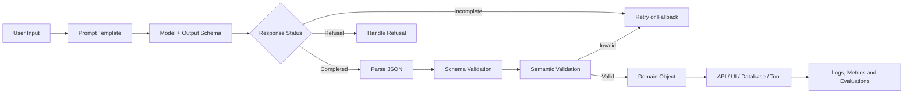
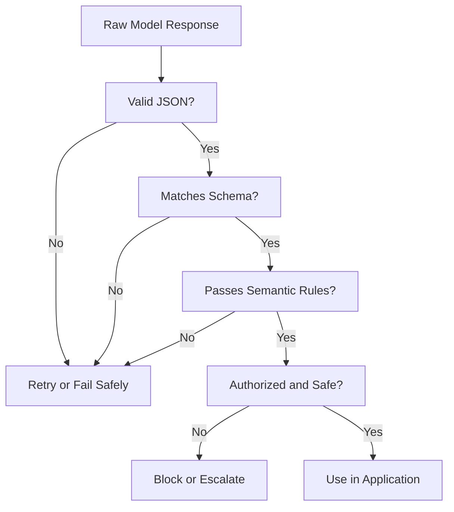
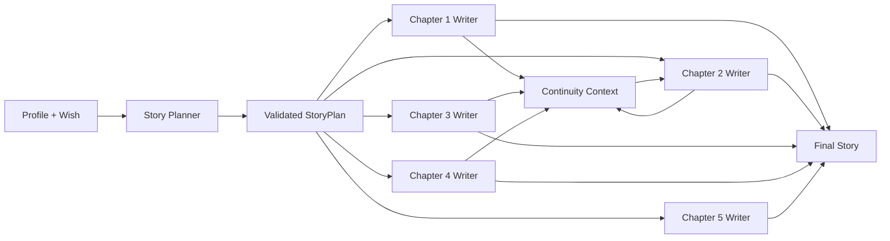

# 008 — Output Schema

**Course:** 02 — Model Platforms and Prompting
**Module:** Module 05 — Prompt Engineering
**Content Group:** Output Control
**Roadmap Source:** Prompt Engineering / Output Control
**Lesson Type:** Prompting
**Order in Module:** 008
**Suggested Duration:** 22 minutes

---

## 1. Lesson Summary

An **Output Schema** defines the exact structure that an AI model should return.

Instead of allowing the model to respond with arbitrary prose, an output schema specifies:

* Which fields must exist
* The data type of each field
* Which values are allowed
* Whether fields are required or optional
* How objects and arrays are nested
* Whether unexpected fields are permitted

Output schemas are essential when an LLM response must be consumed by an application, API route, database, user interface, agent tool, evaluation pipeline, or automated workflow.

Modern AI applications frequently connect LLM outputs to external APIs, databases, tools, and user interfaces. For those integrations, developers usually need structured data—commonly JSON—rather than explanatory text surrounding the result.

The key idea is:

> A prompt explains **what the model should do**, while an output schema defines **what the result must look like**.

---

## 2. Learning Objectives

By the end of this lesson, you should be able to:

1. Explain Output Schema in your own words.
2. Distinguish free-form text, JSON mode, and schema-constrained output.
3. Design a useful JSON Schema for an AI application.
4. Validate model output before using it in application logic.
5. Handle refusals, incomplete responses, invalid values, and retry cases.
6. Version and test schemas as part of production software.
7. Apply an output schema to a prompt, API route, RAG pipeline, agent tool, or portfolio project.

---

## 3. Why Output Schemas Matter

LLMs naturally generate text. Applications require predictable data.

Without an output schema, a model might return:

```text
Sure! Here is the information you requested:

{
  "priority": "high",
  "category": "billing"
}
```

A human can understand this response, but an application expecting pure JSON may fail because of the additional text.

Even valid JSON may still have the wrong structure:

```json
{
  "priority": 10,
  "topic": "billing",
  "explanation": "The user was charged twice."
}
```

Possible problems include:

* `priority` should be a string, not a number.
* The application expects `category`, not `topic`.
* The model added an unexpected `explanation` field.
* A required field may be missing.
* A value may not belong to the permitted enum.
* A nested object may have the wrong shape.

JSON mode can ensure that the output is syntactically valid JSON, but it does not necessarily guarantee that the output follows a particular schema. Structured Outputs with strict schema adherence are designed to constrain the model to a developer-supplied JSON Schema.

---

## 4. Free-Form Output vs JSON Mode vs Structured Output

| Method                    |   Valid JSON | Exact Fields | Correct Types | Restricted Values | Best Use                             |
| ------------------------- | -----------: | -----------: | ------------: | ----------------: | ------------------------------------ |
| Free-form prompting       | No guarantee |           No |            No |                No | Explanations, articles, conversation |
| “Return JSON” instruction |   Unreliable |   Unreliable |    Unreliable |        Unreliable | Experiments and prototypes           |
| JSON mode                 |          Yes | No guarantee |  No guarantee |      No guarantee | Simple JSON generation               |
| Structured output         |          Yes |          Yes |           Yes |               Yes | Production application integration   |
| Tool/function schema      |          Yes |          Yes |           Yes |               Yes | Agent actions and API calls          |

### Important distinction

A structured output guarantees the **shape** of the response, not necessarily the **truth** of every value.

For example, this response can be structurally valid but factually wrong:

```json
{
  "capital": "Sydney",
  "country": "Australia",
  "confidence": 0.99
}
```

Therefore, production systems still need:

* Grounding
* Retrieval
* Business-rule validation
* Permission checks
* Safety checks
* Evaluation
* Monitoring

Schema conformance does not eliminate semantic or factual mistakes inside the generated values. Models may also produce a refusal or an incomplete response when generation is interrupted.

---

## 5. Where Output Schema Fits in an AI Workflow



The schema is only one layer in the workflow.

A robust production pipeline normally performs:

```text
Generation
    → Parsing
    → Schema validation
    → Semantic validation
    → Business-rule validation
    → Application action
    → Logging and evaluation
```

---

## 6. Anatomy of an Output Schema

Consider a system that classifies customer-support messages.

### Example user input

```text
I was charged twice for the same subscription.
Please refund the second charge.
```

### Expected output

```json
{
  "category": "billing",
  "priority": "high",
  "summary": "The customer reports a duplicate subscription charge.",
  "requires_human_review": true
}
```

### JSON Schema

```json
{
  "type": "object",
  "properties": {
    "category": {
      "type": "string",
      "enum": [
        "billing",
        "technical",
        "account",
        "feedback",
        "other"
      ],
      "description": "The primary category of the support request."
    },
    "priority": {
      "type": "string",
      "enum": ["low", "medium", "high"],
      "description": "The urgency of the request."
    },
    "summary": {
      "type": "string",
      "description": "A concise summary of the user's problem."
    },
    "requires_human_review": {
      "type": "boolean",
      "description": "Whether the request should be reviewed by a human."
    }
  },
  "required": [
    "category",
    "priority",
    "summary",
    "requires_human_review"
  ],
  "additionalProperties": false
}
```

### Main schema components

#### `type`

Defines the expected data type.

Common types include:

```text
object
array
string
number
integer
boolean
null
```

#### `properties`

Defines the fields available inside an object.

#### `required`

Lists fields that must be present.

#### `enum`

Restricts a field to a predefined set of values.

#### `items`

Defines the structure of elements inside an array.

#### `description`

Explains the semantic meaning of a field.

#### `additionalProperties`

Controls whether the model may produce fields not defined in the schema.

For strict application contracts, this is commonly set to:

```json
"additionalProperties": false
```

---

## 7. Prompt Structure with an Output Schema

A strong prompt can use the following structure:

```text
Role:
Task:
Context:
Constraints:
Output schema:
Examples:
```

### Complete example

```text
Role:
You are a support-ticket classification assistant.

Task:
Analyze the user's message and classify the support request.

Context:
The result will be used by an automated ticket-routing system.

Constraints:
- Use only the permitted category values.
- Mark duplicate charges, security incidents, and account lockouts
  as requiring human review.
- Keep the summary under 30 words.
- Do not invent information that is not present in the message.

Output schema:
Return an object containing:
- category
- priority
- summary
- requires_human_review

User message:
"I was charged twice for the same subscription."
```

When the API supports schema-constrained generation, the machine-readable schema should be supplied through the API rather than being described only in natural language.

---

## 8. Structured Output API Example

The following example illustrates schema-constrained output with the Responses API.

```python
import json
from openai import OpenAI

client = OpenAI()

support_ticket_schema = {
    "type": "object",
    "properties": {
        "category": {
            "type": "string",
            "enum": [
                "billing",
                "technical",
                "account",
                "feedback",
                "other",
            ],
        },
        "priority": {
            "type": "string",
            "enum": ["low", "medium", "high"],
        },
        "summary": {
            "type": "string",
        },
        "requires_human_review": {
            "type": "boolean",
        },
    },
    "required": [
        "category",
        "priority",
        "summary",
        "requires_human_review",
    ],
    "additionalProperties": False,
}

response = client.responses.create(
    model="gpt-5",
    instructions=(
        "Classify customer-support requests. "
        "Do not invent details that are absent from the message."
    ),
    input=(
        "I was charged twice for the same subscription. "
        "Please refund the second charge."
    ),
    text={
        "format": {
            "type": "json_schema",
            "name": "support_ticket",
            "description": "Classification of a customer-support request.",
            "strict": True,
            "schema": support_ticket_schema,
        }
    },
)

ticket = json.loads(response.output_text)

print(ticket["category"])
print(ticket["priority"])
```

In the current Responses API format, structured JSON output is configured through a JSON Schema response format. Strict mode enforces exact schema adherence, although only a supported subset of JSON Schema may be available.

---

## 9. Application-Level Validation

Even when the provider enforces the schema, application validation remains useful.

It protects the application when:

* A different provider is used.
* Strict structured output is unavailable.
* The response is loaded from a cache.
* Data comes from an old schema version.
* A test fixture is malformed.
* Business rules are stricter than the JSON Schema.
* The model returns structurally valid but semantically invalid data.

### Pydantic model

```python
from enum import Enum
from pydantic import BaseModel, Field


class TicketCategory(str, Enum):
    BILLING = "billing"
    TECHNICAL = "technical"
    ACCOUNT = "account"
    FEEDBACK = "feedback"
    OTHER = "other"


class TicketPriority(str, Enum):
    LOW = "low"
    MEDIUM = "medium"
    HIGH = "high"


class SupportTicket(BaseModel):
    category: TicketCategory
    priority: TicketPriority
    summary: str = Field(min_length=1, max_length=200)
    requires_human_review: bool
```

### Validation

```python
from pydantic import ValidationError


def parse_support_ticket(raw_output: str) -> SupportTicket:
    try:
        return SupportTicket.model_validate_json(raw_output)
    except ValidationError as error:
        raise ValueError(
            f"Invalid support-ticket output: {error}"
        ) from error
```

---

## 10. Schema Validation vs Semantic Validation

These are different layers.

### Schema validation

Checks whether the data has the expected form.

```json
{
  "priority": "high",
  "requires_human_review": false
}
```

This may pass schema validation.

### Semantic validation

Checks whether the values make sense according to the domain.

For example:

```python
def validate_business_rules(ticket: SupportTicket) -> None:
    if (
        ticket.category == TicketCategory.BILLING
        and "duplicate" in ticket.summary.lower()
        and not ticket.requires_human_review
    ):
        raise ValueError(
            "Duplicate billing requests require human review."
        )
```

### Recommended validation layers



---

## 11. Output Schema for Tool Calling

Use a response schema when the model should return information to your application.

Use a tool or function schema when the model should request an action.

### Information response

```json
{
  "category": "billing",
  "priority": "high"
}
```

### Tool call

```json
{
  "ticket_id": "TICKET-4821",
  "queue": "billing-review",
  "reason": "Possible duplicate charge"
}
```

The application then decides whether to execute:

```python
route_ticket(
    ticket_id="TICKET-4821",
    queue="billing-review",
    reason="Possible duplicate charge",
)
```

The model proposes structured arguments. The application remains responsible for:

* Authentication
* Authorization
* Input validation
* Confirmation
* Idempotency
* Rate limiting
* Error handling
* Audit logging

Structured Outputs can be used both for direct model responses and for function-call parameters. A strict function schema constrains the generated tool arguments to the supplied definition.

---

## 12. Practical Example: Wish Story Planning

An output schema can separate story planning from story writing.

### Input

```json
{
  "profile": {
    "name": "Huy",
    "interests": ["studying", "books", "research"],
    "family_context": "The eldest child in a farming family."
  },
  "wish": {
    "true_want": "To be recognized for his academic effort.",
    "surface_goal": "To place first in the university entrance examination."
  }
}
```

### Planning schema

```json
{
  "type": "object",
  "properties": {
    "title": {
      "type": "string"
    },
    "central_theme": {
      "type": "string"
    },
    "emotional_arc": {
      "type": "object",
      "properties": {
        "starting_state": {
          "type": "string"
        },
        "turning_point": {
          "type": "string"
        },
        "ending_state": {
          "type": "string"
        }
      },
      "required": [
        "starting_state",
        "turning_point",
        "ending_state"
      ],
      "additionalProperties": false
    },
    "chapters": {
      "type": "array",
      "minItems": 5,
      "maxItems": 5,
      "items": {
        "type": "object",
        "properties": {
          "chapter_number": {
            "type": "integer"
          },
          "objective": {
            "type": "string"
          },
          "main_event": {
            "type": "string"
          },
          "emotional_shift": {
            "type": "string"
          },
          "continuity_requirements": {
            "type": "array",
            "items": {
              "type": "string"
            }
          }
        },
        "required": [
          "chapter_number",
          "objective",
          "main_event",
          "emotional_shift",
          "continuity_requirements"
        ],
        "additionalProperties": false
      }
    }
  },
  "required": [
    "title",
    "central_theme",
    "emotional_arc",
    "chapters"
  ],
  "additionalProperties": false
}
```

### Architecture



This approach gives the application a stable intermediate artifact:

```text
Profile + Wish
    → Structured Story Plan
    → Validate Plan
    → Generate Chapters
    → Evaluate Continuity and Quality
```

The plan can be stored, compared across models, inspected in a dashboard, and reused during retries.

---

## 13. Schema Design Principles

### 13.1 Use domain-specific field names

Weak:

```json
{
  "value": "high"
}
```

Better:

```json
{
  "risk_level": "high"
}
```

Field names and descriptions help the model understand the semantic role of each value.

### 13.2 Prefer enums for controlled categories

Weak:

```json
{
  "priority": {
    "type": "string"
  }
}
```

Better:

```json
{
  "priority": {
    "type": "string",
    "enum": ["low", "medium", "high"]
  }
}
```

### 13.3 Reject unexpected fields

```json
"additionalProperties": false
```

This prevents the model from silently expanding the application contract.

### 13.4 Make required fields explicit

```json
"required": [
  "category",
  "priority",
  "summary"
]
```

### 13.5 Use nullable fields intentionally

When a value may genuinely be unavailable:

```json
{
  "due_date": {
    "type": ["string", "null"],
    "description": "ISO date, or null when no date is provided."
  }
}
```

Do not use an empty string to represent every missing value.

### 13.6 Keep schemas focused

Avoid using one enormous schema for:

* Classification
* Retrieval
* Planning
* Tool selection
* Final writing
* Quality evaluation

Prefer smaller contracts:

```text
ClassificationSchema
RetrievalQuerySchema
StoryPlanSchema
ChapterSchema
EvaluationSchema
```

### 13.7 Put machine decisions in fields

Weak:

```json
{
  "analysis": "This request appears urgent and should probably be escalated."
}
```

Better:

```json
{
  "priority": "high",
  "requires_escalation": true,
  "reason": "The account may be compromised."
}
```

### 13.8 Version the schema

```json
{
  "schema_version": "support-ticket.v2",
  "category": "billing",
  "priority": "high"
}
```

A schema is an application contract. Changes should be reviewed like API changes.

---

## 14. Output Schema Versioning

A schema can change over time.

### Version 1

```json
{
  "category": "billing",
  "priority": "high"
}
```

### Version 2

```json
{
  "schema_version": "2.0",
  "category": "billing",
  "priority": "high",
  "requires_human_review": true
}
```

Before changing a schema, consider:

* Will existing consumers still work?
* Will cached responses remain valid?
* Must old database records be migrated?
* Do evaluation fixtures need updates?
* Does the frontend support the new field?
* Can the new field be nullable during migration?
* Should the API expose both schema versions temporarily?

### Suggested schema lifecycle

```text
Draft
  → Review
  → Test
  → Version
  → Deploy
  → Monitor
  → Deprecate
```

---

## 15. Failure Handling

A production application should not assume that every request produces a usable object.

### Common response states

```python
class ModelOutputError(Exception):
    pass


def process_model_response(response):
    if response.status == "incomplete":
        raise ModelOutputError("Model response was incomplete.")

    if not response.output_text:
        raise ModelOutputError("No structured output was returned.")

    return parse_support_ticket(response.output_text)
```

### Failure categories

| Failure             | Example                         | Recommended Handling            |
| ------------------- | ------------------------------- | ------------------------------- |
| Transport error     | Timeout or connection failure   | Retry with backoff              |
| Rate limit          | HTTP 429                        | Wait and retry                  |
| Refusal             | Safety refusal                  | Display or route refusal        |
| Incomplete output   | Token limit reached             | Increase limit or simplify task |
| Parse error         | Invalid JSON                    | Retry or use fallback           |
| Schema error        | Missing or wrong field          | Retry with validation feedback  |
| Semantic error      | Valid but illogical value       | Apply domain validation         |
| Tool error          | External API failed             | Retry tool, not entire workflow |
| Authorization error | Model requests forbidden action | Block and audit                 |

### Retry strategy

```text
Attempt 1:
Normal prompt + schema

Attempt 2:
Same schema + validation error feedback

Attempt 3:
Lower-complexity prompt or smaller subtask

Final fallback:
Manual review, default response, or safe failure
```

Avoid unlimited retries. They increase:

* Cost
* Latency
* Duplicate actions
* Provider load
* Failure amplification

---

## 16. Observability and Metrics

For every structured-output request, consider logging:

```json
{
  "request_id": "req_123",
  "prompt_version": "ticket-classifier.v4",
  "schema_version": "support-ticket.v2",
  "model": "model-name",
  "provider": "provider-name",
  "latency_ms": 842,
  "input_tokens": 318,
  "output_tokens": 74,
  "estimated_cost_usd": 0.0012,
  "schema_valid": true,
  "semantic_valid": true,
  "retry_count": 0,
  "response_status": "completed"
}
```

### Useful metrics

* Schema-valid response rate
* Semantic-valid response rate
* First-attempt success rate
* Retry rate
* Refusal rate
* Incomplete-output rate
* P50, P95, and P99 latency
* Input and output tokens
* Cost per successful result
* Accuracy by category
* Performance by prompt version
* Performance by schema version
* Performance by model and provider

---

## 17. Testing Output Schemas

A schema should be tested with realistic and adversarial inputs.

### Basic test cases

```text
1. Normal input
2. Missing information
3. Ambiguous input
4. Very long input
5. Empty input
6. Multilingual input
7. Conflicting instructions
8. Prompt-injection attempt
9. Unsupported category
10. Safety-sensitive request
```

### Example evaluation record

```json
{
  "input": "I cannot sign in after changing my password.",
  "expected": {
    "category": "account",
    "priority": "medium",
    "requires_human_review": false
  }
}
```

### Evaluation dimensions

```text
Structural correctness:
Does the response match the schema?

Classification accuracy:
Is the selected category correct?

Completeness:
Were all relevant facts extracted?

Groundedness:
Did the model avoid inventing facts?

Consistency:
Does the same input produce equivalent decisions?

Latency:
Is the response fast enough for the product?

Cost:
Is the result economical at production volume?
```

---

## 18. Common Mistakes

### Mistake 1: Describing JSON only in the prompt

```text
Please return valid JSON with category and priority.
```

This is weaker than supplying a machine-enforced schema.

### Mistake 2: Treating valid JSON as valid business data

```json
{
  "discount_percent": 900
}
```

The JSON is valid, but the value may violate application rules.

### Mistake 3: Allowing unrestricted strings

```json
{
  "status": {
    "type": "string"
  }
}
```

Possible model outputs:

```text
done
completed
finished
success
successfully_completed
```

Use an enum when the application supports only specific states.

### Mistake 4: Creating an oversized schema

A deeply nested schema with many unrelated responsibilities may:

* Increase latency
* Be harder to test
* Be harder for the model to interpret
* Make errors difficult to diagnose
* Couple unrelated application components

### Mistake 5: Executing tool calls without authorization

A structurally valid tool call is not automatically safe to execute.

### Mistake 6: Ignoring refusals and incomplete responses

The application must handle response states separately from normal structured data.

### Mistake 7: Changing schemas without versioning

A field rename can break:

* Backend parsers
* Frontend components
* Database imports
* Cached objects
* Evaluation datasets
* Analytics dashboards

### Mistake 8: Testing only one successful prompt

A demonstration that works once is not evidence of production reliability.

### Mistake 9: Not tracking latency, tokens, and retries

A schema may improve reliability while increasing cost or first-request latency. OpenAI notes that a new schema may require initial preprocessing before later requests can reuse cached artifacts.

---

## 19. Production Checklist

### Schema design

* [ ] Field names represent domain concepts clearly.
* [ ] Every field has the correct type.
* [ ] Controlled categories use enums.
* [ ] Required fields are explicitly listed.
* [ ] Optional values use a deliberate nullable strategy.
* [ ] Unexpected properties are rejected.
* [ ] Nested objects are not unnecessarily complex.
* [ ] The schema has a version.

### Prompt design

* [ ] The model has a clear role.
* [ ] The task is explicit.
* [ ] Relevant context is included.
* [ ] Constraints are testable.
* [ ] The prompt does not conflict with the schema.
* [ ] Examples are added only when they improve semantic accuracy.

### Runtime validation

* [ ] Refusals are handled.
* [ ] Incomplete responses are handled.
* [ ] JSON parsing errors are handled.
* [ ] Schema validation is performed.
* [ ] Semantic rules are checked.
* [ ] Authorization is checked before actions.
* [ ] Retries are limited and observable.
* [ ] A safe fallback exists.

### Monitoring

* [ ] Prompt version is logged.
* [ ] Schema version is logged.
* [ ] Model and provider are logged.
* [ ] Input and output tokens are recorded.
* [ ] Cost and latency are recorded.
* [ ] Validation failures are categorized.
* [ ] Evaluation results can be compared across versions.

---

## 20. Practical Exercise

### Task

Build a small structured-output classifier.

The system should receive a product review and return:

```json
{
  "sentiment": "positive",
  "topics": ["battery", "performance"],
  "summary": "The user likes the performance but reports weak battery life.",
  "requires_follow_up": false
}
```

### Requirements

1. Define a JSON Schema.
2. Restrict `sentiment` to:

```text
positive
neutral
negative
mixed
```

3. Restrict topics to known values.
4. Require all top-level fields.
5. Reject additional properties.
6. Validate the response in application code.
7. Add at least five test inputs.
8. Include one ambiguous input.
9. Include one empty or invalid input.
10. Log token usage, latency, retries, and validation results.

### Suggested test input

```text
The app is fast and easy to use, but the battery drains much faster
than before.
```

### Expected output

```json
{
  "sentiment": "mixed",
  "topics": ["performance", "battery"],
  "summary": "The user likes the app's performance but reports increased battery drain.",
  "requires_follow_up": true
}
```

---

## 21. Portfolio Project Integration

### Project 4: Prompt Lab

Extend the Prompt Lab so that each saved prompt contains:

```json
{
  "prompt_id": "support-classifier",
  "prompt_version": "4.1.0",
  "schema_version": "2.0.0",
  "model": "selected-model",
  "temperature": 0.2,
  "prompt_template": "...",
  "output_schema": {},
  "test_cases": [],
  "evaluation_results": []
}
```

### Dashboard sections

```text
Prompt Configuration
Schema Viewer
Input Dataset
Raw Model Output
Parsed Output
Validation Errors
Token Usage
Latency
Estimated Cost
Model Comparison
Prompt-Version Comparison
Schema-Version Comparison
```

### Comparison table

| Run | Model   | Prompt | Schema | Valid | Accurate | Latency |    Cost |
| --- | ------- | ------ | ------ | ----: | -------: | ------: | ------: |
| 001 | Model A | v1     | v1     |   Yes |       No |  820 ms |  $0.001 |
| 002 | Model A | v2     | v1     |   Yes |      Yes |  790 ms |  $0.001 |
| 003 | Model B | v2     | v1     |   Yes |      Yes |  430 ms | $0.0006 |
| 004 | Model B | v2     | v2     |   Yes |      Yes |  470 ms | $0.0007 |

This turns prompt engineering into a measurable engineering workflow rather than a collection of manually tested prompt examples.

---

## 22. Completion Checklist

After completing this lesson:

* [ ] I can explain Output Schema in one or two minutes.
* [ ] I understand the difference between valid JSON and schema-valid JSON.
* [ ] I can create a schema using objects, arrays, enums, and required fields.
* [ ] I can explain why `additionalProperties: false` is useful.
* [ ] I can validate model output in application code.
* [ ] I can distinguish schema validation from semantic validation.
* [ ] I know when to use a response schema and when to use a tool schema.
* [ ] I can handle refusals, incomplete output, retries, and fallbacks.
* [ ] I can log schema version, prompt version, tokens, latency, and cost.
* [ ] I have created a small structured-output demo or portfolio artifact.
* [ ] I have documented at least one limitation or open question.

---

## 23. Key Limitations

Output schemas improve reliability, but they do not guarantee:

* Factual correctness
* Complete extraction
* Correct reasoning
* Safe tool execution
* Authorization
* Successful external API calls
* Protection from every prompt-injection attack
* Stable model behavior across every provider
* Compatibility with every JSON Schema feature
* Zero latency overhead

The schema controls the **form** of the output. The rest of the system must control its **meaning, safety, and execution**.

---

## 24. Key Takeaways

1. An Output Schema is a contract between the model and the application.
2. “Return JSON” is an instruction; a strict schema is an enforceable structure.
3. Schema-valid output is not automatically factually or semantically correct.
4. Use enums, required fields, descriptions, nullable values, and restricted additional properties.
5. Validate outputs again inside the application.
6. Treat refusals and incomplete generations as separate response paths.
7. Keep schemas small, domain-focused, and versioned.
8. Never execute tool arguments without authorization and business-rule checks.
9. Track reliability, accuracy, latency, token usage, cost, and retries.
10. Prompts and schemas should be tested and reviewed like production code.

---

## 25. Final Summary

**Output Schema** is a foundational output-control technique for AI Engineers.

It transforms an LLM response from unpredictable text into a stable application contract that can be:

* Parsed
* Validated
* Stored
* Displayed
* Compared
* Evaluated
* Passed to another model
* Used as tool arguments
* Connected to production workflows

The production pattern is:

```text
Clear Prompt
    + Explicit Schema
    + Strict Generation
    + Application Validation
    + Semantic Rules
    + Safe Execution
    + Observability
    = Reliable AI Feature
```

Do not treat the schema as a formatting preference. Treat it as part of your API design, application architecture, evaluation system, and product logic.
