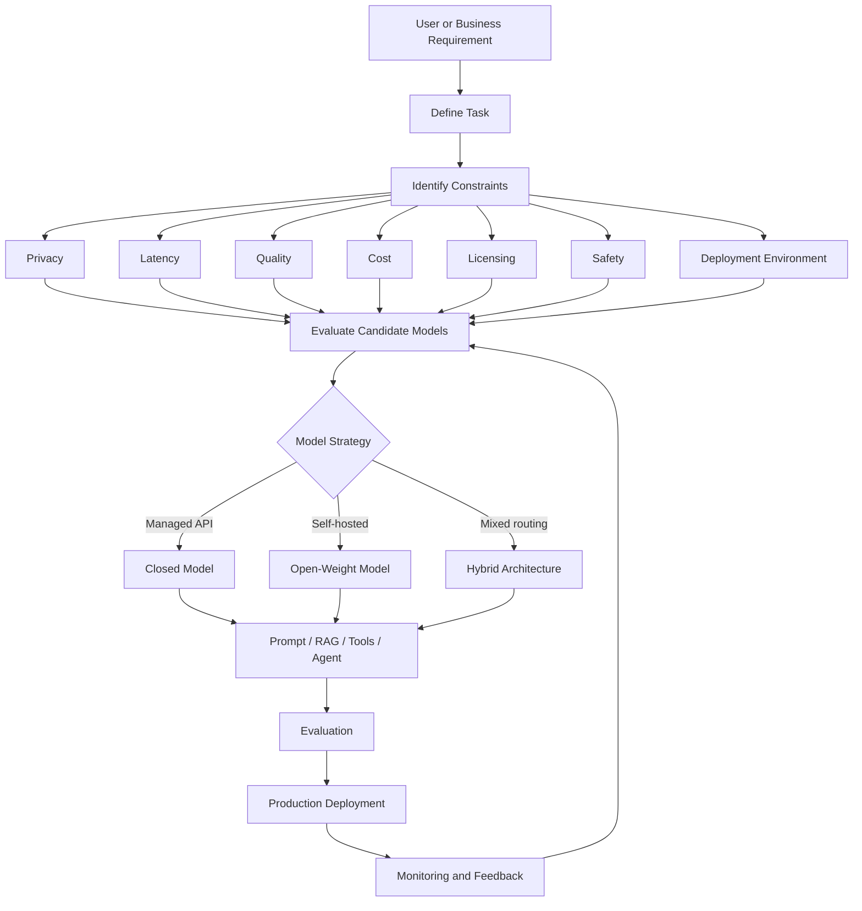
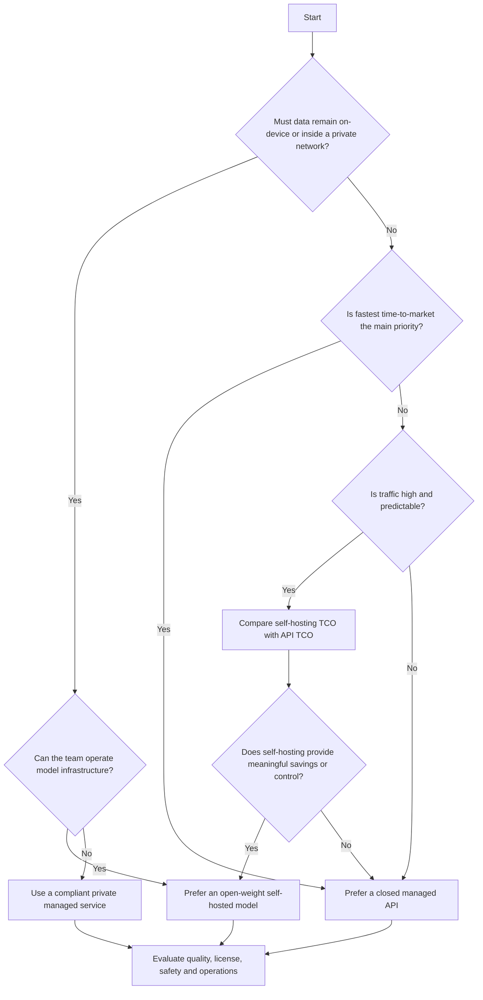
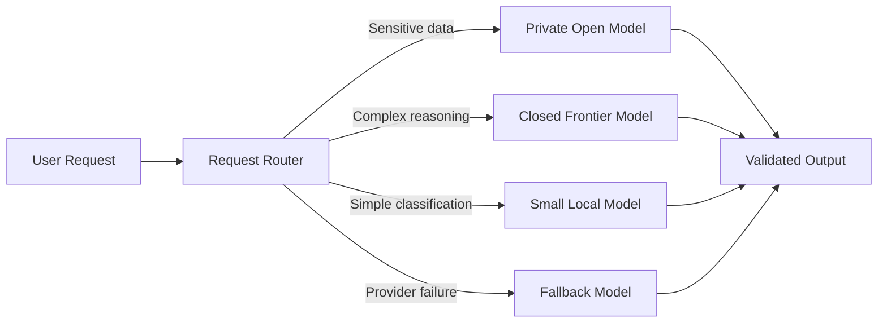
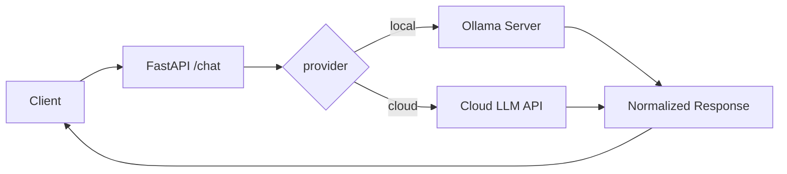
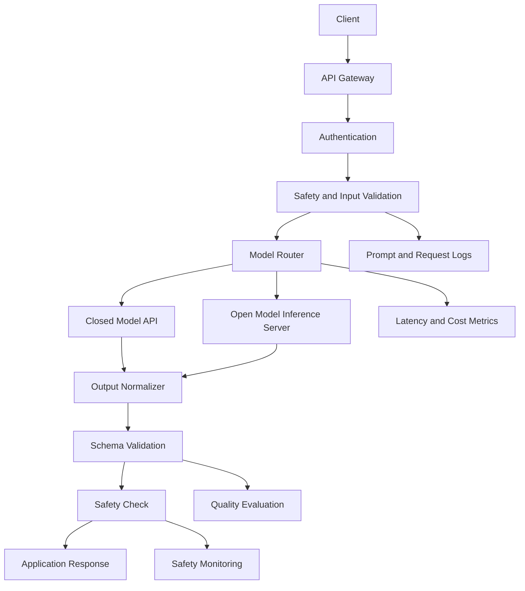

# 001 — Open vs. Closed Models

**Course:** 02 — Model Platforms and Prompting
**Module:** Module 07 — Open-Source AI
**Content Group:** Model Strategy
**Roadmap Source:** Open-Source AI / Model Strategy
**Lesson Type:** Open-Source AI
**Lesson Order:** 001
**Suggested Duration:** 20 minutes

---

## 1. Lesson Overview

Modern AI engineers can choose between two broad categories of models:

1. **Closed or proprietary models**, which are normally accessed through an API or hosted application.
2. **Open or open-weight models**, whose model weights can be downloaded and deployed on infrastructure controlled by the developer.

Closed models often provide strong performance, managed infrastructure, and a simple developer experience. However, they may create vendor dependency, recurring API costs, and restrictions around deployment or customization.

Open models provide more control over deployment, privacy, customization, and model behavior. However, the engineering team must manage infrastructure, security, scaling, monitoring, evaluation, and model upgrades.

An important terminology distinction is that many models commonly called “open source” are technically **open-weight models**. Their weights are available, but their complete training data, training code, or development process may not be fully public.

The goal of this lesson is not to declare one category universally better. The goal is to choose the most appropriate model strategy for a specific AI application.

---

## 2. Learning Objectives

By the end of this lesson, you should be able to:

* Explain the difference between open and closed AI models.
* Distinguish between **open source**, **open weight**, and **closed source**.
* Identify where model selection appears in an AI engineering workflow.
* Compare models using privacy, latency, quality, cost, licensing, safety, and infrastructure requirements.
* Select a suitable model strategy for an AI application.
* Build a small application that can switch between a local model and a cloud model.
* Document model limitations, assumptions, and production risks.

---

## 3. Core Definitions

### 3.1 Closed Models

A **closed model**, also called a proprietary model, is controlled by a model provider.

Developers usually access it through:

* A cloud API
* A web application
* An enterprise AI platform
* A managed SDK

The developer normally cannot download the model weights or inspect the complete training process.

```text
Application
    |
    | HTTPS API request
    v
Provider Infrastructure
    |
    | Model inference
    v
API response
```

Examples may include hosted commercial model families offered by major AI providers.

### Main Characteristics

* Model weights are not publicly downloadable.
* Inference is managed by the provider.
* Pricing is often based on tokens, requests, images, audio duration, or compute usage.
* Updates and model changes are controlled by the provider.
* Scaling, availability, and hardware management are largely handled for the customer.
* Customization is limited to features supported by the provider.

Closed systems are often experienced as “black boxes”: the application sends an API request and receives an output without direct visibility into the internal weights or inference infrastructure.

---

### 3.2 Open-Weight Models

An **open-weight model** makes its trained model weights available for download.

Depending on the license, developers may be allowed to:

* Run the model locally
* Deploy it on private infrastructure
* Fine-tune it
* Quantize it
* Modify its inference configuration
* Redistribute derived versions
* Use it commercially

However, access to weights does not automatically mean that everything is open.

The following components may still be unavailable:

* Original training data
* Data-cleaning pipeline
* Complete training code
* Reinforcement-learning process
* Safety-training datasets
* Evaluation datasets
* Full architectural decisions

```text
Model Repository
    |
    | Download weights
    v
Local Machine / Private Cloud / Edge Device
    |
    | Self-managed inference
    v
Application
```

---

### 3.3 Fully Open-Source AI

A fully open-source AI system would ideally provide most or all of the following:

* Model architecture
* Model weights
* Training code
* Inference code
* Evaluation code
* Data documentation
* A license allowing inspection, modification, and redistribution

In practice, many models described casually as open source are better classified as open weight.

---

## 4. Why Open Models Matter

Open models can reduce the concentration of AI capabilities in a small number of companies.

When model weights and tooling are broadly available:

* Developers can inspect and experiment with the technology.
* Companies can avoid dependence on one provider.
* Researchers can reproduce or extend previous work.
* Organizations can deploy AI in private or offline environments.
* Smaller teams can build specialized models without training from scratch.
* Competition can encourage both open and closed providers to improve quality and pricing.

Open models may be deployed locally, on private clouds, at the edge, or in isolated environments. They can also be fine-tuned or combined with custom guardrails.

However, wider access also raises safety questions. As model capabilities increase, releasing unrestricted weights may make powerful capabilities available to both responsible and malicious users.

Therefore, the debate is not simply:

> Open is good, and closed is bad.

It is a trade-off between:

* Access
* Competition
* Innovation
* Safety
* Accountability
* Commercial incentives
* Concentration of power

---

## 5. Open vs. Closed Models

| Dimension                 | Closed Models                      | Open or Open-Weight Models         |
| ------------------------- | ---------------------------------- | ---------------------------------- |
| Access                    | API, SDK, or hosted platform       | Download and self-host             |
| Setup difficulty          | Usually low                        | Medium to high                     |
| Infrastructure            | Managed by provider                | Managed by your team               |
| Initial development speed | Usually fast                       | Usually slower                     |
| Model weights             | Not available                      | Usually available                  |
| Customization             | Provider-dependent                 | High                               |
| Fine-tuning               | Limited to supported features      | Greater control                    |
| Data privacy              | Data may leave your infrastructure | Can remain local                   |
| Offline usage             | Usually unavailable                | Possible                           |
| Scaling                   | Managed service                    | Self-managed                       |
| Maintenance               | Provider-managed                   | Team-managed                       |
| Quality                   | Often strong out of the box        | Varies by model and task           |
| Latency                   | Includes network latency           | Can be low when deployed locally   |
| Cost structure            | Usage-based API cost               | Hardware and operations cost       |
| Vendor lock-in            | Potentially high                   | Usually lower                      |
| Observability             | Limited internal visibility        | Greater infrastructure visibility  |
| Licensing                 | Commercial service terms           | Model-specific license             |
| Safety controls           | Often included by provider         | Must often be designed by the team |
| Model updates             | Automatic or provider-controlled   | Controlled by your team            |
| Failure responsibility    | Shared with provider               | Mostly your responsibility         |

---

## 6. “Free” Does Not Mean Zero Cost

Open models are often free to download, but operating them is not necessarily free.

A useful analogy is:

* A closed API is similar to using a taxi or ride-sharing service.
* A self-hosted model is similar to receiving a car for free.

The car may have no purchase price, but you still need to pay for:

* Fuel
* Insurance
* Maintenance
* Parking
* Repairs
* Replacement
* Technical expertise

Similarly, a self-hosted model may require:

* GPUs or specialized accelerators
* Cloud GPU rental
* Electricity
* Storage
* Networking
* Container orchestration
* Load balancing
* Monitoring
* Security updates
* Model evaluation
* Engineering salaries
* Backup capacity
* Incident response

Consequently:

```text
Open-model cost
    =
Hardware
+ Cloud infrastructure
+ Engineering
+ Operations
+ Security
+ Monitoring
+ Model maintenance
```

## The source material similarly emphasizes that zero licensing cost does not remove the cost of servers, electricity, capacity, upgrades, and maintenance.

## 7. Total Cost of Ownership

Do not compare only API token prices with the download price of an open model.

Instead, compare **total cost of ownership**, or TCO.

### Closed-Model TCO

```text
TCO_closed
    =
API usage
+ Data transfer
+ Premium platform features
+ Integration engineering
+ Evaluation and monitoring
+ Vendor-switching cost
```

### Open-Model TCO

```text
TCO_open
    =
GPU infrastructure
+ Hosting
+ Inference engineering
+ Security
+ Monitoring
+ Maintenance
+ Upgrade migration
+ Evaluation
+ Staff time
```

### Simplified Cost Formula

For an API model:

```text
monthly_api_cost
    =
input_tokens × input_price
+ output_tokens × output_price
```

For a self-hosted model:

```text
monthly_self_hosted_cost
    =
GPU_hourly_cost × running_hours
+ storage
+ networking
+ operations
```

### Example

Assume a service processes only a small number of requests each day.

A cloud API may be cheaper because the company pays only when requests occur.

If the company operates a high-volume service with stable traffic, self-hosting may eventually become more economical because the infrastructure remains highly utilized.

The break-even point depends on:

* Traffic volume
* Input and output length
* Model size
* GPU utilization
* Batch size
* Quantization
* Latency target
* Availability target
* Engineering cost

---

## 8. Quality and Capability

Closed frontier models often provide:

* Strong reasoning
* High-quality instruction following
* Large context windows
* Multimodal input
* Tool calling
* Structured output
* Managed safety systems
* Reliable scaling

Open models may provide:

* Competitive performance for specific tasks
* Full control over prompting and inference
* Private deployment
* Domain-specific fine-tuning
* Smaller models suitable for edge deployment
* Predictable deployment versions

However, model quality should never be judged only by a public benchmark.

Evaluate models using tasks that represent your real application.

```text
General benchmark score
          is not equal to
Production suitability
```

A smaller local model may outperform a larger cloud model for a narrow task after:

* Fine-tuning
* Retrieval augmentation
* Structured prompting
* Output validation
* Domain-specific evaluation

---

## 9. Privacy and Data Governance

Privacy is one of the strongest reasons to consider self-hosted models.

### Closed-Model Data Flow

```text
User data
    |
    v
Your backend
    |
    | External network request
    v
Model provider
    |
    v
Generated response
```

### Self-Hosted Data Flow

```text
User data
    |
    v
Your private infrastructure
    |
    v
Local model server
    |
    v
Generated response
```

A local financial-document assistant, for example, can process confidential files without sending them to an external inference API. One source demonstrates this pattern using locally stored financial statements and a locally hosted model.

Nevertheless, local deployment does not automatically guarantee security.

Your team must still protect:

* Model endpoints
* Uploaded files
* Logs
* Vector databases
* Embeddings
* Backups
* API keys
* Internal tools
* Agent permissions
* Generated outputs

A badly secured self-hosted model may be less secure than a carefully configured enterprise API.

---

## 10. Latency and Availability

### Closed Model Latency

```text
Total latency
    =
Network latency
+ Provider queue time
+ Model inference
+ Response transfer
```

### Local Model Latency

```text
Total latency
    =
Local queue time
+ Model loading
+ Model inference
+ Local response processing
```

Local deployment can reduce network latency, but only when:

* The model is already loaded.
* The available hardware is sufficient.
* Request concurrency is controlled.
* Context length is manageable.
* Inference is properly optimized.

Closed APIs often provide stronger default scalability and uptime. Open deployments give greater control but require the engineering team to design reliability.

---

## 11. Licensing

Never assume that an open-weight model can be used without restrictions.

Before selecting a model, examine:

* Commercial-use permissions
* Redistribution permissions
* Fine-tuning permissions
* Attribution requirements
* Acceptable-use restrictions
* User-count or revenue restrictions
* Geographic limitations
* Restrictions on competing model training
* Requirements for derived models

```text
Open weights ≠ unrestricted license
```

A production checklist must include legal and licensing review before deployment.

---

## 12. Safety and Responsible Release

Open access supports innovation, but it can also increase misuse risk.

Potential risks include:

* Automated cyber abuse
* Scalable misinformation
* Harmful biological or chemical assistance
* Privacy attacks
* Fraud automation
* Removal of safety guardrails
* Unauthorized surveillance
* Autonomous high-risk agents

The safety question becomes more difficult as capabilities increase.

```text
Lower capability
    |
    | Open release often provides strong research benefits
    v
Higher capability
    |
    | Misuse risk becomes increasingly important
    v
Potential release restrictions
```

A responsible model strategy should consider both:

1. The risks of concentrating powerful AI in a few companies.
2. The risks of distributing highly capable systems without effective controls.

---

## 13. Where Model Strategy Fits in the AI Workflow



Model selection happens before final production deployment, but it must also be revisited after evaluation and monitoring.

---

## 14. Decision Framework

Use the following decision tree.



---

## 15. When to Prefer a Closed Model

A closed model is often appropriate when:

* The team needs to launch quickly.
* The application has low or uncertain traffic.
* The team does not have GPU infrastructure experience.
* Strong general reasoning is required.
* Managed multimodal capabilities are important.
* High availability is required immediately.
* The organization accepts external processing under the provider’s data policy.
* The model is only one small component of the product.
* The team wants provider-managed safety and model upgrades.

### Example Use Cases

* Early-stage chatbot prototype
* Marketing-content assistant
* General-purpose coding assistant
* Customer-support summarization
* Low-volume document classification
* Multimodal proof of concept

---

## 16. When to Prefer an Open-Weight Model

An open-weight model is often appropriate when:

* Data must remain on-premises.
* The system must operate offline.
* The application runs on an edge device.
* Full control of model versions is required.
* The team needs specialized fine-tuning.
* Vendor lock-in is a major concern.
* Traffic is high enough to justify infrastructure investment.
* The application requires air-gapped deployment.
* The organization can maintain inference infrastructure.
* The license supports the intended use.

### Example Use Cases

* Private medical-document assistant
* Internal financial-analysis tool
* Factory system without internet connectivity
* On-device voice interface
* Domain-specific classification model
* High-volume structured extraction service
* Government or defense environment with strict isolation

---

## 17. Hybrid Model Strategy

Many production systems should not choose only one model.

A hybrid architecture can route each request to the most suitable model.



### Example Routing Rules

```python
def choose_model(request):
    if request.contains_sensitive_data:
        return "local_model"

    if request.requires_advanced_reasoning:
        return "cloud_frontier_model"

    if request.task_type == "classification":
        return "small_local_model"

    return "default_cloud_model"
```

A hybrid strategy can improve:

* Cost
* Reliability
* Privacy
* Latency
* Vendor independence
* Task-specific quality

---

## 18. Model Strategy Scorecard

Score each candidate from 1 to 5.

| Criterion               | Weight | Closed Model | Open Model |
| ----------------------- | -----: | -----------: | ---------: |
| Task quality            |    25% |              |            |
| Privacy                 |    15% |              |            |
| Latency                 |    10% |              |            |
| Cost at expected volume |    15% |              |            |
| Setup speed             |    10% |              |            |
| Customization           |    10% |              |            |
| Operational complexity  |     5% |              |            |
| Licensing suitability   |     5% |              |            |
| Vendor independence     |     5% |              |            |

### Weighted Score

```text
final_score
    =
Σ criterion_score × criterion_weight
```

Do not treat this score as an automatic answer. Use it to make assumptions and trade-offs visible.

---

## 19. Practical Demo: Local Model vs. Cloud API

### Goal

Build one FastAPI endpoint that can call either:

* A local model through Ollama
* A cloud model through an external API

### Architecture



### Suggested Project Structure

```text
model-comparison/
├── app/
│   ├── main.py
│   ├── providers/
│   │   ├── base.py
│   │   ├── ollama_provider.py
│   │   └── cloud_provider.py
│   └── schemas.py
├── tests/
│   └── test_chat.py
├── requirements.txt
└── README.md
```

---

## 20. Example FastAPI Implementation

```python
from typing import Literal

import httpx
from fastapi import FastAPI, HTTPException
from pydantic import BaseModel, Field


app = FastAPI(title="Open vs Closed Model Demo")


class ChatRequest(BaseModel):
    message: str = Field(min_length=1, max_length=10_000)
    provider: Literal["local", "cloud"] = "local"


class ChatResponse(BaseModel):
    provider: str
    model: str
    content: str


async def call_ollama(message: str) -> ChatResponse:
    payload = {
        "model": "qwen3:8b",
        "prompt": message,
        "stream": False,
    }

    try:
        async with httpx.AsyncClient(timeout=120) as client:
            response = await client.post(
                "http://localhost:11434/api/generate",
                json=payload,
            )
            response.raise_for_status()
    except httpx.HTTPError as exc:
        raise HTTPException(
            status_code=502,
            detail=f"Local model request failed: {exc}",
        ) from exc

    data = response.json()

    return ChatResponse(
        provider="local",
        model=payload["model"],
        content=data.get("response", ""),
    )


async def call_cloud_model(message: str) -> ChatResponse:
    # Replace this placeholder with the SDK or HTTP API
    # of the cloud model provider selected by your team.
    raise HTTPException(
        status_code=501,
        detail="Cloud provider has not been configured.",
    )


@app.post("/chat", response_model=ChatResponse)
async def chat(request: ChatRequest) -> ChatResponse:
    if request.provider == "local":
        return await call_ollama(request.message)

    return await call_cloud_model(request.message)
```

---

## 21. Test Requests

### Local Model

```bash
curl -X POST http://localhost:8000/chat \
  -H "Content-Type: application/json" \
  -d '{
    "provider": "local",
    "message": "Explain retrieval-augmented generation in three sentences."
  }'
```

### Cloud Model

```bash
curl -X POST http://localhost:8000/chat \
  -H "Content-Type: application/json" \
  -d '{
    "provider": "cloud",
    "message": "Explain retrieval-augmented generation in three sentences."
  }'
```

---

## 22. What to Measure in the Demo

Record the following information for each model:

| Metric              | Description                             |
| ------------------- | --------------------------------------- |
| Time to first token | Delay before output begins              |
| Total latency       | Complete request duration               |
| Input tokens        | Prompt size                             |
| Output tokens       | Response size                           |
| Estimated cost      | API or infrastructure cost              |
| Task accuracy       | Correctness for the selected task       |
| Format compliance   | Whether the output follows instructions |
| Hallucination rate  | Unsupported claims                      |
| Privacy level       | Where data is processed                 |
| Failure rate        | Timeout or provider errors              |
| Operational effort  | Setup and maintenance difficulty        |

Example result:

```json
{
  "provider": "local",
  "model": "qwen3:8b",
  "latency_ms": 2340,
  "estimated_cost_usd": 0,
  "format_valid": true,
  "quality_score": 4,
  "notes": "Private and usable, but weaker on complex reasoning."
}
```

---

## 23. Production Architecture



---

## 24. Production Risks and Debugging

### 24.1 Local Model Runs Out of Memory

**Symptoms:**

* Process crashes
* CUDA out-of-memory error
* Inference becomes extremely slow
* Model fails during loading

**Possible causes:**

* Model is too large.
* Context window is too long.
* Too many concurrent requests.
* Precision is too high.
* GPU memory is fragmented.

**Debugging steps:**

1. Check GPU memory usage.
2. Reduce context length.
3. Reduce batch size.
4. Use a quantized model.
5. Limit request concurrency.
6. Select a smaller model.
7. Restart the inference worker.

---

### 24.2 Cloud API Rate Limit

**Symptoms:**

* HTTP `429`
* Requests become queued
* Intermittent application failure

**Debugging steps:**

1. Read rate-limit response headers.
2. Add exponential backoff.
3. Introduce a request queue.
4. Cache repeated requests.
5. Limit per-user usage.
6. Add another provider or fallback model.

```python
import asyncio
import random


async def retry_with_backoff(operation, max_attempts: int = 5):
    for attempt in range(max_attempts):
        try:
            return await operation()
        except RateLimitError:
            if attempt == max_attempts - 1:
                raise

            delay = (2**attempt) + random.random()
            await asyncio.sleep(delay)
```

---

### 24.3 Model Output Does Not Match the Schema

**Symptoms:**

* Invalid JSON
* Missing fields
* Unexpected prose
* Incorrect data types

**Debugging steps:**

1. Use structured-output features when available.
2. Validate output with Pydantic or JSON Schema.
3. Retry with the validation error.
4. Reduce prompt ambiguity.
5. Add examples.
6. Fall back to another model after repeated failure.

---

### 24.4 Model Quality Changes After an Update

Closed providers may update a model behind an existing API alias.

Open-model teams may replace or quantize a model without detecting regressions.

**Prevention:**

* Pin model versions.
* Maintain a regression test set.
* Run A/B tests before migration.
* Track prompt and model versions.
* Store evaluation results.
* Define rollback procedures.

---

### 24.5 Self-Hosted Endpoint Is Publicly Exposed

**Risk:**

An unprotected inference server can allow unauthorized users to consume compute, access tools, or attack internal systems.

**Prevention:**

* Keep the inference server on a private network.
* Require authentication.
* Add rate limits.
* Restrict tool permissions.
* Validate uploaded files.
* Separate model services from sensitive databases.
* Monitor unusual request patterns.

---

## 25. Common Mistakes

### Mistake 1: Assuming Open Models Are Always Cheaper

Open models may have no licensing fee but can still have high infrastructure and staffing costs.

### Mistake 2: Assuming Closed Models Are Always Better

A smaller open model may be more suitable for a private, narrow, or high-volume task.

### Mistake 3: Ignoring the License

Available weights do not guarantee unrestricted commercial use.

### Mistake 4: Comparing Only Benchmark Scores

Benchmark performance may not represent application performance.

### Mistake 5: Ignoring Model Versioning

A model change can break prompts, JSON schemas, tool calling, and safety behavior.

### Mistake 6: Building Only the Happy Path

Production systems must handle:

* Timeouts
* Invalid JSON
* Model refusal
* Context overflow
* Rate limits
* GPU exhaustion
* Provider outages
* Tool failures

### Mistake 7: Treating Local Deployment as Automatically Private

Sensitive information can still leak through logs, databases, backups, tools, or unsecured endpoints.

### Mistake 8: Fine-Tuning Before Establishing a Baseline

First test:

1. Prompt engineering
2. Retrieval-augmented generation
3. Structured output
4. Tool integration
5. Evaluation

Fine-tune only when evidence shows that these methods are insufficient.

---

## 26. Practical Exercises

### Exercise 1: Five-Line Summary

Without reviewing the lesson, write five lines explaining:

1. What a closed model is.
2. What an open-weight model is.
3. One advantage of closed models.
4. One advantage of open models.
5. One situation where you would use a hybrid strategy.

---

### Exercise 2: Model Selection

Choose the best model strategy for each case.

#### Case A: Medical Records Assistant

Requirements:

* Patient data must remain inside the hospital.
* Internet access is restricted.
* The hospital has an infrastructure team.

Recommended direction:

```text
Self-hosted open-weight model
+ private RAG
+ strict access control
+ audit logging
```

#### Case B: Startup Prototype

Requirements:

* Two developers
* Launch in two weeks
* Low initial usage
* Strong reasoning needed

Recommended direction:

```text
Closed managed API
+ provider abstraction layer
+ usage monitoring
```

#### Case C: High-Volume Classification

Requirements:

* Millions of short requests
* Simple output categories
* Stable traffic
* Strict latency target

Recommended direction:

```text
Benchmark a small self-hosted model
against a low-cost cloud model
using total cost of ownership
```

---

### Exercise 3: Build the Comparison API

Implement the FastAPI project and compare:

* One local model
* One cloud model
* Ten test prompts
* Latency
* Quality
* Cost
* JSON compliance
* Failure behavior

Save the result in a CSV or spreadsheet.

---

### Exercise 4: Identify a Production Failure

Document one possible production incident using this template:

```markdown
## Incident

### Symptom

### Root Cause

### User Impact

### Detection Method

### Immediate Fix

### Permanent Fix

### Regression Test
```

Example incident:

```markdown
## Incident

### Symptom

The local inference endpoint returned HTTP 500 for long prompts.

### Root Cause

The request exceeded the configured context window and caused GPU
memory exhaustion.

### User Impact

Users received no answer for document-analysis requests.

### Detection Method

GPU memory monitoring and API error logs.

### Immediate Fix

Limit input length and restart the inference worker.

### Permanent Fix

Add token counting, context validation, document chunking and concurrency limits.

### Regression Test

Submit requests at 80%, 100% and 120% of the supported context size.
```

---

## 27. Completion Checklist

* [ ] I can explain open, open-weight, and closed models in one to two minutes.
* [ ] I understand that open weights do not always mean fully open source.
* [ ] I can compare models using privacy, latency, cost, quality, licensing, safety, and infrastructure.
* [ ] I understand total cost of ownership.
* [ ] I have created a small model-comparison demo.
* [ ] I have evaluated at least one local and one hosted model.
* [ ] I have documented at least one production failure and debugging process.
* [ ] I know when a hybrid model architecture is appropriate.
* [ ] I have recorded assumptions and unresolved questions.
* [ ] I have checked the license before proposing production deployment.

---

## 28. Related Outcome

After completing this lesson, you should know when to use:

* Closed cloud APIs
* Open-weight models
* Hugging Face model tooling
* Local inference
* Managed inference endpoints
* Hybrid model routing

---

## 29. Related Portfolio Project

### Project 6 — Local AI Assistant

Build a private AI assistant using:

* Ollama for local inference
* FastAPI as the application wrapper
* A cloud LLM API for comparison
* A provider abstraction layer
* Structured logging
* Latency and cost measurement
* A small evaluation dataset
* Optional RAG over private documents
* Automatic fallback between providers

### Suggested Deliverables

```text
project-6-local-ai-assistant/
├── README.md
├── architecture.md
├── app/
├── tests/
├── evaluation/
│   ├── prompts.json
│   ├── results.csv
│   └── analysis.md
├── docker-compose.yml
└── screenshots/
```

### Portfolio Questions to Answer

* Why was the local model selected?
* Why was the cloud model selected?
* Which tasks performed better on each model?
* What was the latency difference?
* What was the estimated cost difference?
* How was private data protected?
* How did the application handle provider failure?
* What would be required before production deployment?

---

## 30. Final Summary

Open and closed models represent different engineering trade-offs.

Closed models generally offer:

* Faster integration
* Managed infrastructure
* Strong out-of-the-box capability
* Lower operational burden

Open or open-weight models generally offer:

* Greater deployment control
* Private and offline inference
* More customization
* Reduced vendor dependence
* Flexible model versioning

Neither category is universally superior.

The correct decision depends on:

```text
Privacy
+ Quality
+ Latency
+ Traffic
+ Total cost
+ Infrastructure capability
+ Licensing
+ Safety
+ Deployment constraints
```

For many real applications, the best strategy is hybrid:

* Use small local models for repetitive or sensitive tasks.
* Use closed frontier models for difficult reasoning.
* Add routing, evaluation, fallback, observability, and output validation.
* Re-evaluate the decision as model capabilities, prices, licenses, and business requirements change.

The main AI engineering skill is not choosing “open” or “closed” based on ideology. It is designing a measurable model strategy that satisfies the application’s real constraints.
