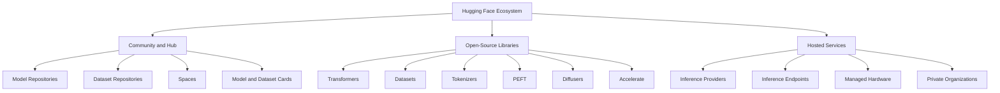
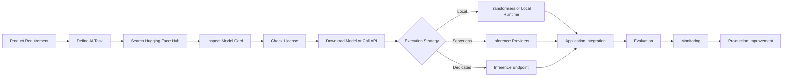
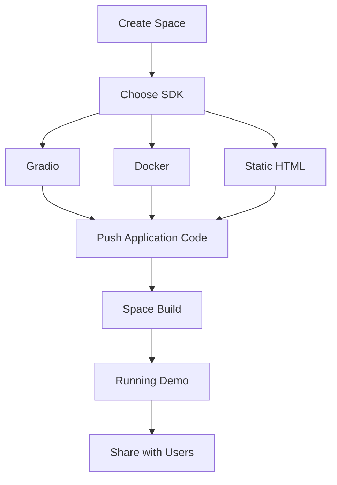
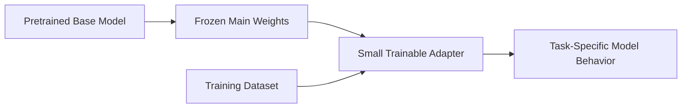
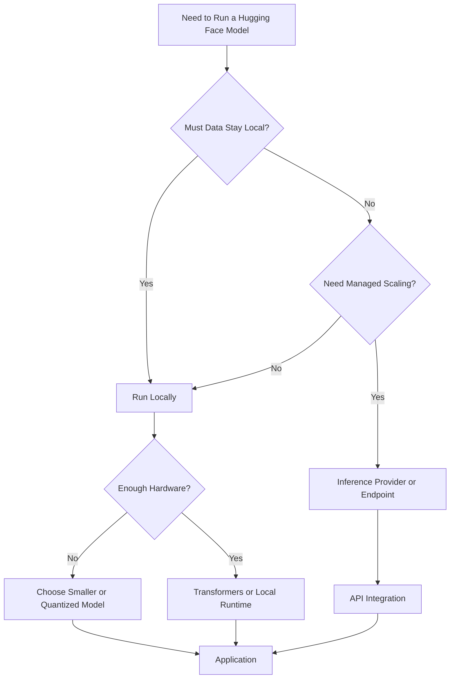
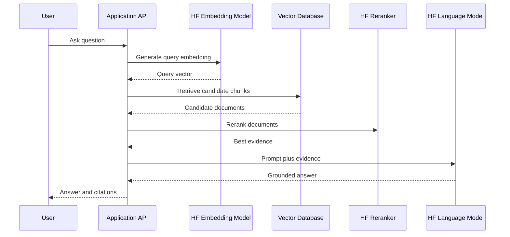
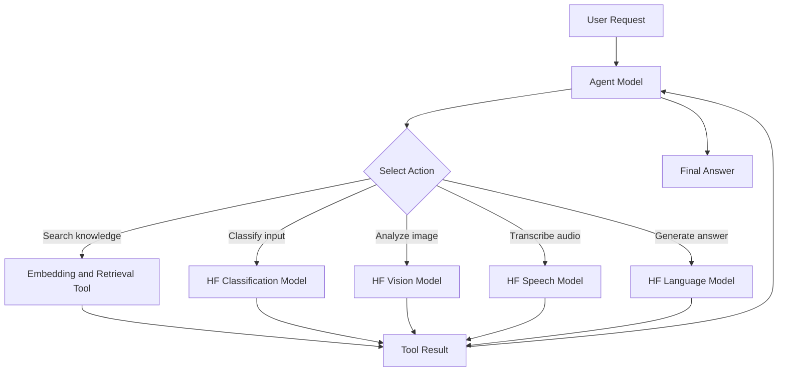
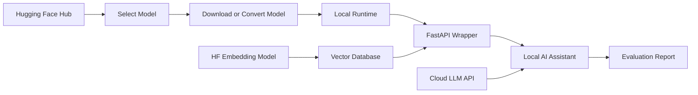

# 003 — Hugging Face

| Field                  | Value                              |
| ---------------------- | ---------------------------------- |
| **Course**             | 02 — Model Platforms and Prompting |
| **Module**             | Module 07 — Open-Source AI         |
| **Content Group**      | Hugging Face                       |
| **Roadmap Source**     | Open-Source AI / Hugging Face      |
| **Lesson Type**        | Open-Source AI                     |
| **Order in Module**    | 003                                |
| **Suggested Duration** | 20 minutes                         |

---

## 1. Lesson Overview

Hugging Face is an open machine-learning platform and ecosystem that helps AI engineers discover, download, evaluate, fine-tune, share, and deploy models and datasets.

The Hugging Face Hub hosts model repositories, datasets, and interactive AI applications called Spaces. It can be used by individual developers, research teams, and private organizations. The platform currently hosts millions of models, datasets, and AI applications.

Hugging Face is not only a website for downloading models. It includes a collection of libraries and services for different stages of the AI engineering workflow:

* Discovering models and datasets
* Loading pretrained models
* Running local inference
* Fine-tuning models
* Managing model versions
* Evaluating model quality
* Hosting demonstrations
* Calling hosted models through APIs
* Deploying dedicated inference endpoints

By the end of this lesson, you should understand where Hugging Face fits into an AI application and how to use its main tools in a small project.

---

## 2. Learning Objectives

After completing this lesson, you should be able to:

1. Explain Hugging Face in your own words.
2. Describe the difference between the Hugging Face Hub and Hugging Face libraries.
3. Read and evaluate a model card.
4. Find a suitable model for an AI task.
5. Load a pretrained model with `transformers`.
6. Load a dataset with `datasets`.
7. call a hosted model through an inference API.
8. Explain how Hugging Face can support a RAG or agent workflow.
9. Identify licensing, hardware, latency, privacy, and security risks.
10. Create a small portfolio demo using a Hugging Face model.

---

## 3. What Is Hugging Face?

Hugging Face can be understood as three connected layers.



### Layer 1: The Hugging Face Hub

The Hub is a version-controlled platform for storing and sharing:

* Models
* Tokenizers
* Configuration files
* Datasets
* Evaluation results
* Model documentation
* Interactive applications

Hub repositories use concepts such as commits, branches, revisions, pull requests, and repository history. Model repositories can be loaded directly by supported machine-learning libraries.

### Layer 2: Hugging Face Libraries

Hugging Face maintains libraries that help developers use pretrained models and datasets.

Important libraries include:

| Library           | Main purpose                                   |
| ----------------- | ---------------------------------------------- |
| `transformers`    | Load and run transformer models                |
| `datasets`        | Load, process, stream, and share datasets      |
| `huggingface_hub` | Access Hub repositories and hosted inference   |
| `tokenizers`      | Fast text tokenization                         |
| `peft`            | Parameter-efficient fine-tuning                |
| `diffusers`       | Image, video, and audio generation models      |
| `accelerate`      | Simplify distributed and multi-device training |
| `evaluate`        | Run reusable evaluation metrics                |

### Layer 3: Hosted Services

Hugging Face also provides hosted execution options.

These include:

* Inference Providers
* Dedicated Inference Endpoints
* CPU and GPU Spaces
* Private model repositories
* Organization management
* Managed deployment infrastructure

Inference Providers offer access to models through a consistent API, while dedicated Inference Endpoints provide isolated model deployments for production applications.

---

## 4. Where Hugging Face Fits in an AI Engineer Workflow



Hugging Face is commonly used between the task-definition and application-integration stages.

For example, an AI engineer may:

1. Define a text-classification requirement.
2. Search the Hub for classification models.
3. Compare model cards and licenses.
4. Test several models with a pipeline.
5. Choose the best model for the application.
6. Deploy it locally or through a hosted endpoint.
7. Monitor accuracy, latency, and resource usage.

---

## 5. Core Hugging Face Components

## 5.1 The Model Hub

The Model Hub contains repositories for language, vision, audio, multimodal, embedding, reranking, and generative models.

A model repository may contain:

```text
model-repository/
├── README.md
├── config.json
├── tokenizer.json
├── tokenizer_config.json
├── generation_config.json
├── model.safetensors
└── special_tokens_map.json
```

The files vary by model architecture and framework.

A repository ID normally follows this format:

```text
organization-or-user/model-name
```

Examples:

```text
google-bert/bert-base-uncased
sentence-transformers/all-MiniLM-L6-v2
distilbert/distilbert-base-uncased-finetuned-sst-2-english
```

The `huggingface_hub` library can search models by task, author, parameter count, framework, or other metadata.

---

## 5.2 Model Cards

A model card is usually the `README.md` file in a model repository.

It should explain:

* What the model does
* Who created it
* Which data was used
* Which languages it supports
* Its intended use
* Its limitations
* Its license
* Its evaluation results
* Potential risks and biases

Model cards use Markdown content and can include YAML metadata for fields such as task, language, library, license, datasets, and metrics.

### Example model-card metadata

```yaml
---
language:
  - en
  - vi

license: apache-2.0

library_name: transformers

pipeline_tag: text-generation

tags:
  - conversational
  - instruction-tuned

datasets:
  - organization/training-dataset

metrics:
  - accuracy
---
```

### Model-card review checklist

Before using a model, answer the following questions:

* Is the model license compatible with the project?
* Is commercial use allowed?
* Does it support the required language?
* What task was it trained for?
* Is it a base model or an instruction-tuned model?
* What prompt format does it expect?
* What hardware is required?
* What evaluation results are provided?
* Are safety limitations documented?
* Is remote model code required?

---

## 5.3 Transformers

The `transformers` library provides reusable implementations for many pretrained model architectures.

It supports tasks such as:

* Text generation
* Text classification
* Token classification
* Question answering
* Translation
* Summarization
* Image classification
* Object detection
* Speech recognition
* Image-to-text
* Multimodal generation

The `pipeline()` interface hides much of the preprocessing, model execution, and output-processing logic, making it useful for experiments and initial prototypes.

### Basic architecture


A Hugging Face pipeline usually manages most of these steps automatically.

---

## 5.4 Datasets

The `datasets` library can load datasets from:

* The Hugging Face Hub
* CSV files
* JSON files
* Parquet files
* Text files
* Local folders
* Remote URLs
* In-memory Python structures

It also supports dataset splits, slicing, transformations, filtering, mapping, and streaming.

Example:

```python
from datasets import load_dataset

dataset = load_dataset(
    "imdb",
    split="test[:100]",
)

print(dataset[0])
```

For very large datasets, streaming can avoid downloading the full dataset before processing it.

```python
from datasets import load_dataset

dataset = load_dataset(
    "HuggingFaceFW/fineweb",
    split="train",
    streaming=True,
)

for example in dataset.take(3):
    print(example)
```

---

## 5.5 Spaces

Hugging Face Spaces allow developers to publish interactive AI applications.

Spaces support:

* Gradio applications
* Docker applications
* Static HTML applications
* Public, protected, and private visibility
* CPU or GPU hardware
* Environment variables and secrets

Spaces store application code in version-controlled repositories, making them useful for demonstrations, portfolios, stakeholder reviews, and small AI products.

### Typical Space workflow



---

## 5.6 PEFT

PEFT means **Parameter-Efficient Fine-Tuning**.

Instead of updating every parameter in a large model, PEFT methods train a much smaller set of parameters or adapters.

Common methods include:

* LoRA
* AdaLoRA
* Prefix tuning
* Prompt tuning
* IA3

This can reduce training memory, storage, and computational requirements compared with full-model fine-tuning. Hugging Face PEFT integrates with Transformers, Diffusers, and Accelerate.



---

## 6. Installing the Main Libraries

Create a virtual environment before installing dependencies.

```bash
python -m venv .venv
```

Activate it on Linux or macOS:

```bash
source .venv/bin/activate
```

Activate it on Windows:

```powershell
.venv\Scripts\activate
```

Install the basic packages:

```bash
pip install transformers datasets huggingface_hub torch
```

Optional packages:

```bash
pip install accelerate sentence-transformers peft
```

Confirm the installation:

```bash
python -c "import transformers; print(transformers.__version__)"
```

For a production application, pin tested dependency versions:

```text
transformers==<tested-version>
datasets==<tested-version>
huggingface-hub==<tested-version>
torch==<tested-version>
```

Avoid copying version numbers from an old tutorial without testing compatibility.

---

## 7. Authentication

Authentication is required for actions such as:

* Accessing private repositories
* Downloading some gated models
* Uploading files
* Creating repositories
* Calling authenticated inference services

The recommended command-line login flow is:

```bash
hf auth login
```

You can verify the active account with:

```bash
hf auth whoami
```

Hugging Face supports read and write token permissions. A read token should normally be used when the application only needs to download or call models.

### Environment variable

```bash
export HF_TOKEN="hf_your_token"
```

Windows PowerShell:

```powershell
$env:HF_TOKEN = "hf_your_token"
```

### Security rule

Never place the token directly inside source code:

```python
# Do not do this.
HF_TOKEN = "hf_secret_token"
```

Use environment variables or a secret-management service instead:

```python
import os

hf_token = os.environ["HF_TOKEN"]
```

---

## 8. Demo 1: Text Classification with a Pipeline

### Objective

Classify text as positive or negative.

### Code

```python
from transformers import pipeline


MODEL_ID = (
    "distilbert/"
    "distilbert-base-uncased-finetuned-sst-2-english"
)

classifier = pipeline(
    task="text-classification",
    model=MODEL_ID,
)

texts = [
    "The application is fast and easy to use.",
    "The model produced an incorrect answer.",
]

results = classifier(texts)

for text, result in zip(texts, results, strict=True):
    print(
        {
            "text": text,
            "label": result["label"],
            "score": round(result["score"], 4),
        }
    )
```

### Expected output structure

```text
{
    "text": "The application is fast and easy to use.",
    "label": "POSITIVE",
    "score": 0.9998
}
```

### What the pipeline does

```text
Input text
    ↓
Tokenizer
    ↓
Token IDs
    ↓
DistilBERT model
    ↓
Classification logits
    ↓
Softmax probabilities
    ↓
Label and confidence score
```

### Important limitation

This particular model was designed for English sentiment classification. It should not automatically be assumed to work well for:

* Vietnamese text
* Emotion classification
* Sarcasm detection
* Product-specific categories
* Financial sentiment
* Medical text

The application should use a model that was trained or evaluated for the actual target task.

---

## 9. Demo 2: Load a Model Explicitly

For more control, load the tokenizer and model separately.

The Transformers Auto classes select the correct implementation based on the model configuration. Models can be loaded from a Hub model ID, local path, branch, tag, or commit revision.

```python
import torch
from transformers import (
    AutoModelForSequenceClassification,
    AutoTokenizer,
)


MODEL_ID = (
    "distilbert/"
    "distilbert-base-uncased-finetuned-sst-2-english"
)

tokenizer = AutoTokenizer.from_pretrained(MODEL_ID)

model = AutoModelForSequenceClassification.from_pretrained(
    MODEL_ID
)

text = "The local model integration works correctly."

inputs = tokenizer(
    text,
    return_tensors="pt",
    truncation=True,
)

with torch.inference_mode():
    outputs = model(**inputs)

probabilities = torch.softmax(
    outputs.logits,
    dim=-1,
)

predicted_id = probabilities.argmax(dim=-1).item()
label = model.config.id2label[predicted_id]
score = probabilities[0, predicted_id].item()

print(
    {
        "label": label,
        "score": round(score, 4),
    }
)
```

This approach is useful when you need:

* Custom batching
* Custom preprocessing
* Direct access to model outputs
* Custom probability thresholds
* GPU placement
* Integration into a training workflow

---

## 10. Demo 3: Search the Hub Programmatically

```python
from huggingface_hub import HfApi


api = HfApi()

models = api.list_models(
    filter="text-classification",
    sort="downloads",
    limit=5,
)

for model in models:
    print(model.id)
```

You can also search using text:

```python
from huggingface_hub import HfApi


api = HfApi()

models = api.list_models(
    search="Vietnamese sentiment",
    limit=10,
)

for model in models:
    print(
        {
            "id": model.id,
            "downloads": model.downloads,
            "likes": model.likes,
        }
    )
```

Search results should create a shortlist, not an automatic production decision.

Each shortlisted model should still be reviewed for:

* License
* Language support
* Training data
* Architecture
* Parameter count
* Evaluation results
* Model age
* Security risks
* Hardware requirements

---

## 11. Demo 4: Call a Hosted Model

Hugging Face Inference Providers can route requests to supported models through a consistent client. The `InferenceClient` chat interface is designed to resemble the OpenAI chat-completion interface.

### Install the client

```bash
pip install huggingface_hub
```

### Python example

```python
import os

from huggingface_hub import InferenceClient


client = InferenceClient(
    api_key=os.environ["HF_TOKEN"],
)

response = client.chat.completions.create(
    model="<supported-model-id>",
    messages=[
        {
            "role": "system",
            "content": (
                "You are an AI engineering tutor. "
                "Answer clearly and concisely."
            ),
        },
        {
            "role": "user",
            "content": (
                "Explain the difference between "
                "fine-tuning and RAG."
            ),
        },
    ],
    max_tokens=300,
    temperature=0.2,
)

print(response.choices[0].message.content)
```

Because model availability depends on the selected inference provider, choose a model that is currently supported by the provider configured for the request.

---

## 12. Local Model or Hosted API?

| Requirement                  |   Local inference |    Hosted inference |
| ---------------------------- | ----------------: | ------------------: |
| No external network required |            Strong |                Weak |
| Full control over data flow  |            Strong | Depends on provider |
| Easy initial setup           |            Medium |              Strong |
| Automatic scaling            |         Difficult |              Strong |
| Hardware management          |          Required |             Managed |
| Custom model files           |            Strong |  Depends on service |
| Per-request cost             | No direct API fee | Usually usage-based |
| Operational responsibility   |              High |               Lower |
| Cold-start risk              |          Possible |            Possible |
| Offline application          |         Supported |       Not supported |

### Decision diagram



---

## 13. Hugging Face in a RAG Pipeline

Hugging Face can support several parts of a RAG system:

* Embedding model
* Reranking model
* Generative model
* Dataset storage
* Evaluation dataset
* Hosted model endpoint
* Demo application



### Example component selection

```yaml
embedding_model: sentence-transformers/all-MiniLM-L6-v2
reranking_model: selected-cross-encoder
generation_model: selected-instruction-model

retrieval:
  candidate_count: 20
  reranked_count: 5

generation:
  maximum_context_chunks: 5
  temperature: 0.1
```

Model IDs in production configuration should ideally be pinned to a tested revision.

---

## 14. Hugging Face in an Agent Workflow

A tool-using model may use Hugging Face for:

* Model hosting
* Tool-calling inference
* Embeddings
* Reranking
* Speech recognition
* Image understanding
* Specialized classification tools



An agent should not receive unrestricted access to every tool.

The application should define:

* Which tools are available
* Which arguments are allowed
* Which actions require confirmation
* How tool output is validated
* How failures are handled
* What information is logged

---

## 15. FastAPI Wrapper Example

The following API wraps a Hugging Face classification pipeline.

```python
from contextlib import asynccontextmanager
from typing import Any

from fastapi import FastAPI, HTTPException
from pydantic import BaseModel, Field
from transformers import pipeline


MODEL_ID = (
    "distilbert/"
    "distilbert-base-uncased-finetuned-sst-2-english"
)

classifier: Any = None


@asynccontextmanager
async def lifespan(app: FastAPI):
    global classifier

    classifier = pipeline(
        task="text-classification",
        model=MODEL_ID,
    )

    yield

    classifier = None


app = FastAPI(
    title="Hugging Face Classification API",
    version="1.0.0",
    lifespan=lifespan,
)


class ClassificationRequest(BaseModel):
    text: str = Field(
        min_length=1,
        max_length=5_000,
    )


class ClassificationResponse(BaseModel):
    model: str
    label: str
    score: float


@app.get("/health")
async def health() -> dict[str, str]:
    status = "ready" if classifier is not None else "loading"

    return {
        "status": status,
        "model": MODEL_ID,
    }


@app.post(
    "/classify",
    response_model=ClassificationResponse,
)
async def classify(
    request: ClassificationRequest,
) -> ClassificationResponse:
    if classifier is None:
        raise HTTPException(
            status_code=503,
            detail="The model is not ready.",
        )

    try:
        result = classifier(
            request.text,
            truncation=True,
        )[0]

    except Exception as exc:
        raise HTTPException(
            status_code=500,
            detail="Model inference failed.",
        ) from exc

    return ClassificationResponse(
        model=MODEL_ID,
        label=result["label"],
        score=round(float(result["score"]), 6),
    )
```

Start the server:

```bash
uvicorn main:app --reload --port 8000
```

Test it:

```bash
curl http://localhost:8000/classify \
  -H "Content-Type: application/json" \
  -d '{
    "text": "This AI application is excellent."
  }'
```

---

## 16. Model Download and Caching

Hugging Face libraries normally download files into a local cache.

The cache avoids downloading the same unchanged files repeatedly. Files can also be downloaded to a specified local directory using `hf_hub_download()` or `snapshot_download()`.

### Download one file

```python
from huggingface_hub import hf_hub_download


file_path = hf_hub_download(
    repo_id="google-bert/bert-base-uncased",
    filename="config.json",
)

print(file_path)
```

### Download a repository snapshot

```python
from huggingface_hub import snapshot_download


directory = snapshot_download(
    repo_id="google-bert/bert-base-uncased",
    local_dir="./models/bert-base-uncased",
)

print(directory)
```

### Pin a revision

```python
directory = snapshot_download(
    repo_id="organization/model-name",
    revision="<commit-hash>",
)
```

Pinning a commit hash improves reproducibility because a future repository update will not silently change the version used by the application.

---

## 17. Common Mistakes

## 17.1 Selecting a Model by Download Count

A popular model is not automatically the best model for a specific application.

Download count does not guarantee:

* Accuracy for your domain
* Vietnamese-language quality
* Safe output
* Correct licensing
* Low latency
* Hardware compatibility

**Better approach:** Create a task-specific evaluation set.

---

## 17.2 Ignoring the Model Card

A model may be designed for classification rather than generation, or for base-model continuation rather than instruction following.

**Possible result:**

```text
User prompt
    ↓
Wrong model type
    ↓
Poor or meaningless output
```

Always review:

* Task
* Architecture
* Prompt format
* License
* Languages
* Limitations

---

## 17.3 Using the Wrong Chat Template

Chat models may expect specific role markers and special tokens.

Transformers provides `apply_chat_template()` to format conversation messages according to the tokenizer’s chat template.

```python
messages = [
    {
        "role": "system",
        "content": "You are a helpful assistant.",
    },
    {
        "role": "user",
        "content": "Explain vector embeddings.",
    },
]

formatted = tokenizer.apply_chat_template(
    messages,
    tokenize=False,
    add_generation_prompt=True,
)

print(formatted)
```

Using the wrong format can produce:

* Repetition
* Empty output
* Role confusion
* Failure to follow instructions
* Incorrect tool calls

---

## 17.4 Trusting Remote Code Without Review

Some repositories require:

```python
trust_remote_code=True
```

This can execute Python code supplied by the model repository.

Do not enable it automatically.

Review:

* Repository owner
* Source files
* Commit revision
* Community discussions
* Security reports

Pin the reviewed revision when remote code is necessary.

---

## 17.5 Hardcoding Access Tokens

Never commit Hugging Face tokens to Git.

Bad:

```python
token = "hf_secret_value"
```

Better:

```python
import os

token = os.environ["HF_TOKEN"]
```

Also add local environment files to `.gitignore`:

```text
.env
.env.*
```

---

## 17.6 Loading the Model for Every Request

This is inefficient:

```python
@app.post("/chat")
def chat():
    model = load_model()
    return run_model(model)
```

The model should normally be loaded once during application startup and reused.

```text
Application startup
    ↓
Load model once
    ↓
Serve many requests
```

---

## 17.7 Ignoring Input Length

Large input can cause:

* Truncation
* Out-of-memory errors
* Long latency
* Poor context usage
* Application crashes

Use explicit truncation and maximum lengths:

```python
inputs = tokenizer(
    text,
    truncation=True,
    max_length=512,
    return_tensors="pt",
)
```

The chosen maximum must match the model and application requirements.

---

## 17.8 Failing to Pin Revisions

Using only a model ID can allow repository updates to change application behavior.

Production configuration should record:

```yaml
model:
  id: organization/model-name
  revision: tested-commit-hash

runtime:
  transformers_version: tested-version
  torch_version: tested-version
```

---

## 18. Production Debugging Example

### Problem

The model works in a notebook but fails inside the production container.

### Possible causes

* Model files were not downloaded
* The container has no network access
* The Hugging Face token is missing
* The model is gated
* Required remote code is unavailable
* PyTorch and Transformers versions are incompatible
* The container does not have enough memory
* The model was downloaded into a different cache path

### Debugging process

```text
1. Log the model ID and revision.
2. Confirm that HF_TOKEN exists.
3. Check repository access.
4. Verify the cache directory.
5. Print installed library versions.
6. Test downloading config.json only.
7. Start with a smaller model.
8. Monitor RAM and VRAM during loading.
9. Confirm that the container can reach the Hub.
10. Test with local_files_only=True after preloading files.
```

### Offline deployment example

Download the model during the image-build stage:

```dockerfile
FROM python:3.12-slim

WORKDIR /app

COPY requirements.txt .

RUN pip install --no-cache-dir -r requirements.txt

RUN python -c "\
from huggingface_hub import snapshot_download; \
snapshot_download(\
    repo_id='google-bert/bert-base-uncased', \
    local_dir='/models/bert-base-uncased'\
)"

COPY . .

CMD ["uvicorn", "main:app", "--host", "0.0.0.0"]
```

Load from the local path:

```python
model = AutoModelForSequenceClassification.from_pretrained(
    "/models/bert-base-uncased",
    local_files_only=True,
)
```

---

## 19. Evaluation Checklist

Before deploying a Hugging Face model, evaluate:

| Area                | Questions                                       |
| ------------------- | ----------------------------------------------- |
| **Quality**         | Is the output correct on real examples?         |
| **Language**        | Does it perform well in English and Vietnamese? |
| **Latency**         | Is response time acceptable?                    |
| **Throughput**      | How many concurrent requests can it handle?     |
| **Memory**          | How much RAM or VRAM is required?               |
| **License**         | Is the intended use permitted?                  |
| **Safety**          | Does it generate unsafe or sensitive content?   |
| **Privacy**         | Where are prompts and outputs processed?        |
| **Reliability**     | What happens when loading or inference fails?   |
| **Reproducibility** | Are model and dependency versions pinned?       |

### Minimal evaluation record

```yaml
model_id: organization/model-name
revision: tested-commit-hash
task: text-classification
test_case_count: 100

results:
  accuracy: 0.91
  p95_latency_ms: 240
  maximum_memory_mb: 1350
  failure_rate: 0.01

limitations:
  - weak performance on mixed Vietnamese-English text
  - confidence score is poorly calibrated
  - model does not support long documents
```

---

## 20. Practical Exercise

### Task

Create a small Hugging Face model API.

### Requirements

1. Find a model on the Hugging Face Hub.
2. Read its model card.
3. Record its license and intended use.
4. Load it with `pipeline()`.
5. Create a FastAPI route.
6. Test at least five normal inputs.
7. Test at least two edge cases.
8. Measure response latency.
9. Record one production risk.
10. Explain how the risk could be reduced.

### Suggested project structure

```text
hugging-face-demo/
├── app/
│   ├── main.py
│   ├── config.py
│   ├── schemas.py
│   └── model_service.py
├── evaluation/
│   ├── test_cases.json
│   └── results.csv
├── tests/
│   └── test_api.py
├── .env.example
├── .gitignore
├── requirements.txt
└── README.md
```

### Optional extensions

* Add batch inference
* Add GPU support
* Add a Gradio interface
* Publish the application as a Space
* Compare local and hosted inference
* Add an embedding model
* Build a small RAG workflow
* Fine-tune with LoRA
* Add model revision pinning
* Add request and latency logging

---

## 21. Five-Line Recall Exercise

Complete these sentences without reviewing the lesson:

```text
1. Hugging Face Hub is used for __________________________.
2. A model card tells me _________________________________.
3. Transformers helps developers _________________________.
4. Datasets is useful when _______________________________.
5. Before using a model in production, I must ____________.
```

---

## 22. Completion Checklist

* [ ] I can explain Hugging Face in one or two minutes.
* [ ] I understand the difference between the Hub and Transformers.
* [ ] I can search for a model.
* [ ] I can read a model card.
* [ ] I can check a model license.
* [ ] I can load a model with `pipeline()`.
* [ ] I can load a dataset with `load_dataset()`.
* [ ] I understand local and hosted inference options.
* [ ] I can explain how Hugging Face fits into RAG.
* [ ] I can explain how Hugging Face fits into an agent.
* [ ] I have built a small API, notebook, Space, or diagram.
* [ ] I have recorded at least one limitation or open question.

---

## 23. Related Outcome

> Know when to use closed APIs, open-source models, Hugging Face tools, or local inference.

Hugging Face is especially useful when you need to:

* Discover open or open-weight models
* Compare specialized models
* Run models locally
* Use task-specific models
* Load public datasets
* Fine-tune pretrained models
* Publish an AI demonstration
* Control model files and revisions

A closed API may still be more suitable when you need:

* Minimal infrastructure work
* Managed scaling
* Strong general-purpose quality
* A stable commercial service agreement
* Built-in safety and monitoring
* Rapid production integration

---

## 24. Related Project

### Project 6 — Local AI Assistant

Build a local AI assistant using:

* A model discovered through Hugging Face
* Ollama or another local runtime
* A FastAPI wrapper
* An optional Hugging Face embedding model
* A comparison with a cloud LLM API

### Hugging Face’s role in the project



### Recommended comparison

| Criterion           |      Local model |   Cloud model |
| ------------------- | ---------------: | ------------: |
| Answer quality      |          Measure |       Measure |
| First-token latency |          Measure |       Measure |
| Total latency       |          Measure |       Measure |
| Privacy             |          Analyze |       Analyze |
| Infrastructure cost |         Estimate |      Estimate |
| API cost            | None or indirect |       Measure |
| Offline support     |              Yes |            No |
| Maintenance effort  |           Higher |         Lower |
| Customization       |           Higher | Usually lower |

---

## 25. Suggested 20-Minute Lesson Plan

|          Time | Activity                                   |
| ------------: | ------------------------------------------ |
|   0–3 minutes | Understand the Hugging Face ecosystem      |
|   3–7 minutes | Explore Hub repositories and model cards   |
|  7–12 minutes | Run a Transformers pipeline                |
| 12–15 minutes | Load a dataset                             |
| 15–18 minutes | Review hosted and local inference          |
| 18–20 minutes | Complete the recall exercise and checklist |

---

## 26. Summary

Hugging Face is one of the central platforms in the open AI ecosystem.

It connects:

* Models
* Datasets
* Libraries
* Developers
* Research
* Hosted inference
* Application demonstrations

For an AI engineer, the important skill is not simply knowing how to download a model.

You should know how to:

1. Define the application task.
2. Search for suitable models.
3. read model cards.
4. Verify licenses and limitations.
5. Test models on real data.
6. Select a deployment method.
7. Integrate the model into an API or pipeline.
8. Measure quality, latency, memory, cost, and safety.
9. Pin versions and model revisions.
10. Document production risks.

Turn this lesson into a working artifact such as a notebook, FastAPI route, RAG pipeline, model evaluation report, Gradio Space, agent tool, or portfolio demonstration.

---

# Bài luyện tập

## Mục tiêu


## Đề bài


## Yêu cầu hoàn thành

- [ ] 
- [ ] 
- [ ] 

## Kết quả / lời giải


## Ghi chú
