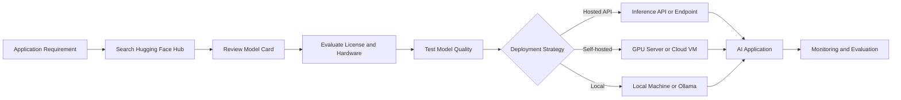
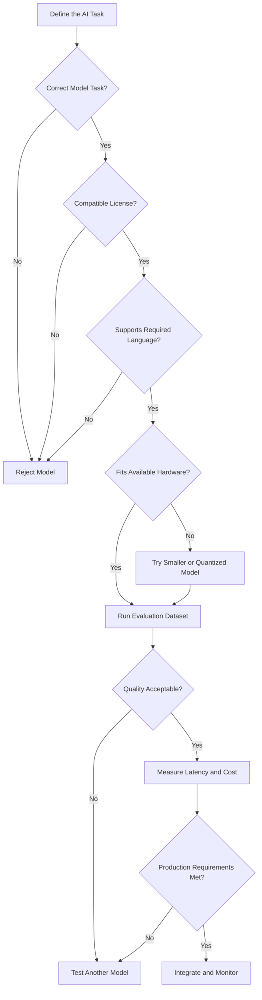
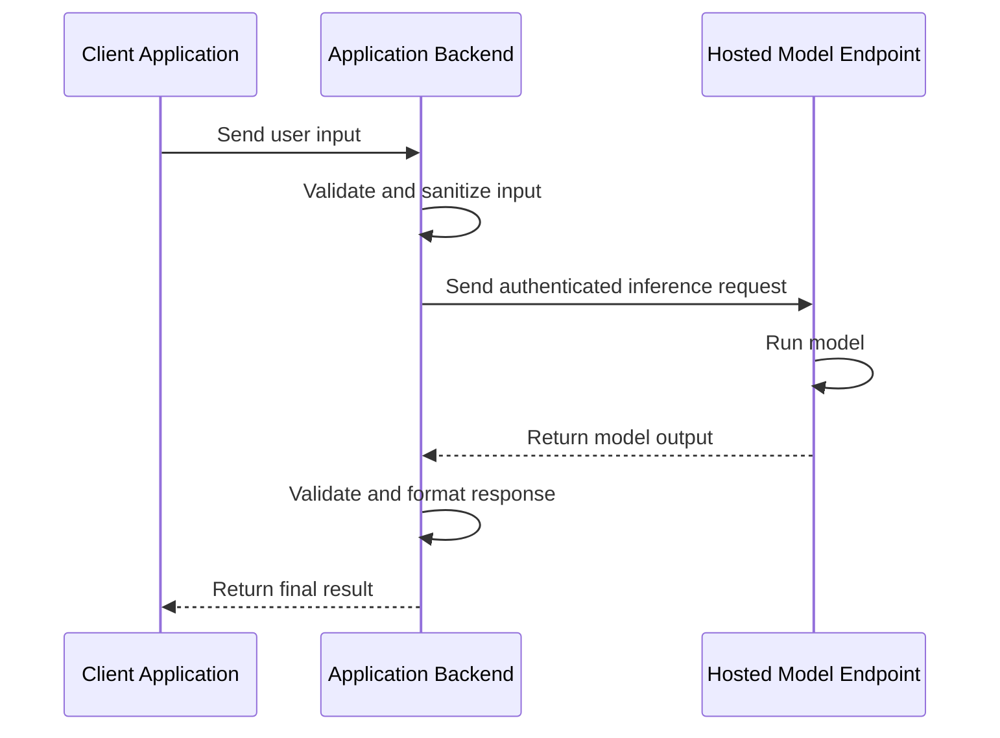
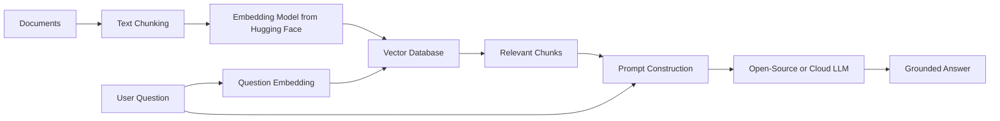
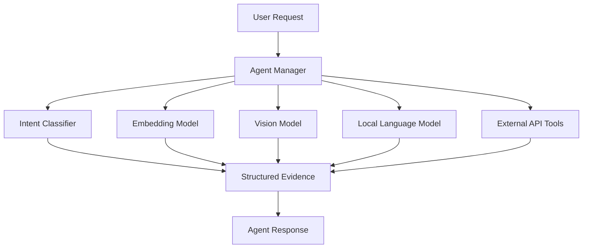
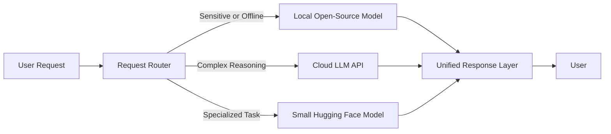
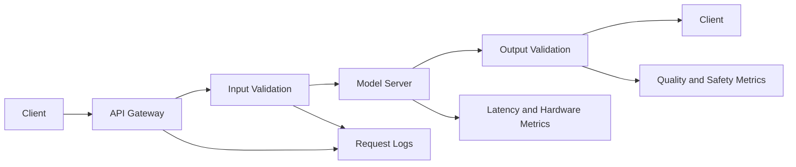
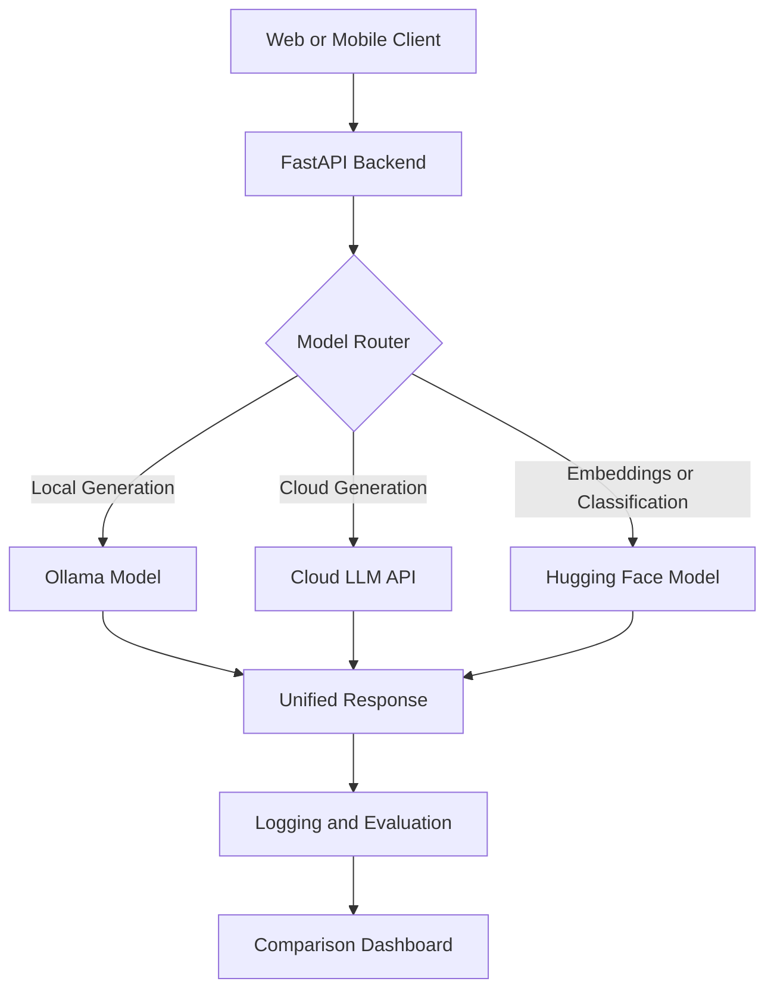

# 004 — Hugging Face Hub

**Course:** 02 — Model Platforms and Prompting
**Module:** Module 07 — Open-Source AI
**Content Group:** Hugging Face
**Roadmap Source:** Open-Source AI / Hugging Face
**Lesson Type:** Open-Source AI
**Order in Module:** 004
**Suggested Duration:** 20 minutes

---

## 1. Lesson Overview

This lesson introduces the **Hugging Face Hub** and explains its role in a modern AI Engineer's workflow.

The Hugging Face Hub is a platform where developers can discover, evaluate, download, share, and deploy:

* Machine learning models
* Datasets
* Interactive AI applications
* Model documentation
* Evaluation results
* Training checkpoints

After completing this lesson, you should understand:

* What the Hugging Face Hub provides
* Where it fits in an AI application workflow
* How to select a suitable model
* How to load a model through an API or Python library
* What factors must be evaluated before using a community model in production

---

## 2. Learning Objectives

By the end of this lesson, you should be able to:

* Explain the Hugging Face Hub in your own words.
* Identify where the Hub belongs in an AI Engineer workflow.
* Search for models based on a specific application requirement.
* Read and evaluate a model card.
* Recognize important factors such as license, hardware requirements, latency, quality, and privacy.
* Integrate a Hugging Face model into a small application or API route.
* Compare an open-source model with a closed commercial API.

---

## 3. What Is the Hugging Face Hub?

The **Hugging Face Hub** is a collaborative platform for machine learning artifacts.

It is often described as a GitHub-like platform for AI because developers can publish, version, download, and collaborate on models and datasets.

The Hub contains three major types of resources:

| Resource | Description                                            | Example Use                                         |
| -------- | ------------------------------------------------------ | --------------------------------------------------- |
| Models   | Pretrained or fine-tuned machine learning models       | Text generation, classification, vision, speech     |
| Datasets | Public or private datasets for training and evaluation | Sentiment data, image collections, instruction data |
| Spaces   | Hosted interactive AI demos and applications           | Gradio apps, Streamlit apps, model showcases        |

A model repository may contain:

* Model weights
* Configuration files
* Tokenizer files
* Model cards
* Example code
* Evaluation results
* License information
* Training details
* Version history

---

## 4. Where Hugging Face Fits in the AI Workflow

The Hugging Face Hub usually sits between the model discovery stage and the application integration stage.



A typical workflow is:

1. Define the AI feature.
2. Search for relevant models.
3. Filter models by task, language, size, license, and popularity.
4. Read the model card.
5. Test several candidate models.
6. Measure quality, speed, memory usage, and cost.
7. Select a deployment method.
8. Integrate the model into the application.
9. Monitor production quality and performance.

---

## 5. Core Hugging Face Hub Concepts

### 5.1 Model Repository

A model repository stores the files required to use a model.

A repository is normally identified by:

```text
organization-or-user/model-name
```

For example:

```text
sentence-transformers/all-MiniLM-L6-v2
```

The repository identifier can be used directly in libraries such as `transformers` or `sentence-transformers`.

---

### 5.2 Model Card

A **model card** documents how a model was created and how it should be used.

Before integrating a model, review the following sections:

* Model description
* Intended use
* Supported languages
* Training data
* Evaluation metrics
* Limitations
* Bias and safety concerns
* License
* Example usage
* Hardware requirements

A model card should be treated as technical documentation, not as a guarantee that the model is suitable for production.

---

### 5.3 Model Weights

Model weights are the learned parameters produced during training.

Large models may contain billions of parameters and require:

* Significant storage
* Large amounts of RAM
* GPU memory
* Quantization
* Distributed inference
* Specialized serving frameworks

Model size has a direct effect on:

* Download time
* Startup time
* Hardware cost
* Inference latency
* Throughput
* Deployment complexity

---

### 5.4 Transformers

The `transformers` library provides APIs for loading and running many models from the Hub.

It supports tasks such as:

* Text generation
* Text classification
* Question answering
* Translation
* Summarization
* Image classification
* Object detection
* Speech recognition
* Multimodal processing

A high-level `pipeline` API can be used for rapid prototyping.

---

### 5.5 Datasets

The Hugging Face `datasets` library provides a standard interface for loading and processing datasets.

Datasets can be used for:

* Fine-tuning
* Benchmarking
* Prompt evaluation
* Retrieval evaluation
* Data exploration
* Model comparison

A dataset repository may include:

* Multiple dataset splits
* Dataset descriptions
* Feature schemas
* Licensing information
* Data examples
* Download scripts

---

### 5.6 Spaces

**Hugging Face Spaces** allows developers to publish interactive AI demos.

Common frameworks include:

* Gradio
* Streamlit
* Docker

Spaces are useful for:

* Portfolio demonstrations
* Internal prototypes
* Model comparison tools
* Stakeholder reviews
* Community feedback
* Reproducible experiments

---

## 6. How to Select a Model

Do not select a model only because it is popular or has a high download count.

Use a structured evaluation process.

### 6.1 Model Selection Checklist

| Factor         | Questions to Ask                                 |
| -------------- | ------------------------------------------------ |
| Task           | Was the model designed for your exact task?      |
| Language       | Does it support the user's language well?        |
| License        | Can it legally be used in your product?          |
| Model size     | Can your infrastructure load and run it?         |
| Latency        | Is the response time acceptable?                 |
| Quality        | Does it perform well on your own test cases?     |
| Context length | Can it process the required input size?          |
| Privacy        | Will user data leave your infrastructure?        |
| Maintenance    | Is the repository active and documented?         |
| Safety         | Does the model produce unsafe or biased outputs? |
| Compatibility  | Does it work with your serving framework?        |
| Cost           | Is self-hosting cheaper than using an API?       |

---

### 6.2 Model Selection Flow



---

## 7. Ways to Use Models from the Hub

There are several ways to consume a Hugging Face model.

### Option 1: Use a High-Level Pipeline

Best for:

* Learning
* Prototyping
* Small experiments
* Testing model behavior

```python
from transformers import pipeline

classifier = pipeline(
    task="sentiment-analysis",
    model="distilbert-base-uncased-finetuned-sst-2-english",
)

result = classifier("The application is fast and easy to use.")

print(result)
```

Possible output:

```python
[
    {
        "label": "POSITIVE",
        "score": 0.9998
    }
]
```

---

### Option 2: Load the Tokenizer and Model Directly

Best for:

* Greater control
* Custom batching
* Custom inference logic
* Fine-tuning
* Accessing hidden states or logits

```python
from transformers import AutoModelForSequenceClassification
from transformers import AutoTokenizer
import torch

MODEL_ID = "distilbert-base-uncased-finetuned-sst-2-english"

tokenizer = AutoTokenizer.from_pretrained(MODEL_ID)
model = AutoModelForSequenceClassification.from_pretrained(MODEL_ID)

text = "The application is fast and easy to use."

inputs = tokenizer(
    text,
    return_tensors="pt",
    truncation=True,
)

with torch.inference_mode():
    outputs = model(**inputs)

predicted_class = outputs.logits.argmax(dim=-1).item()
label = model.config.id2label[predicted_class]

print(label)
```

---

### Option 3: Use a Hosted Inference Service

Best for:

* Avoiding local infrastructure
* Testing large models
* Creating a quick proof of concept
* Scaling without immediately managing GPUs

General workflow:



Secrets such as API tokens should be stored in environment variables rather than committed to source control.

---

### Option 4: Self-Host the Model

Best for:

* Sensitive user data
* Full infrastructure control
* Custom model optimization
* Stable high-volume workloads
* Offline environments

Possible serving tools include:

* Text Generation Inference
* vLLM
* llama.cpp
* Ollama
* ONNX Runtime
* TensorRT-LLM
* Custom FastAPI services

Self-hosting provides more control, but your team becomes responsible for:

* GPU provisioning
* Autoscaling
* Model loading
* Caching
* Monitoring
* Security
* Versioning
* Failure recovery
* Cost optimization

---

## 8. Practical Demo: Build a FastAPI Classification Route

### 8.1 Install Dependencies

```bash
pip install fastapi uvicorn transformers torch
```

### 8.2 Create the API

```python
from contextlib import asynccontextmanager
from typing import Any

from fastapi import FastAPI, HTTPException
from pydantic import BaseModel, Field
from transformers import pipeline


MODEL_ID = "distilbert-base-uncased-finetuned-sst-2-english"

classifier: Any = None


class ClassificationRequest(BaseModel):
    text: str = Field(
        min_length=1,
        max_length=2_000,
        description="Text to classify",
    )


class ClassificationResult(BaseModel):
    label: str
    score: float
    model_id: str


@asynccontextmanager
async def lifespan(app: FastAPI):
    global classifier

    classifier = pipeline(
        task="sentiment-analysis",
        model=MODEL_ID,
    )

    yield

    classifier = None


app = FastAPI(
    title="Hugging Face Model Demo",
    version="1.0.0",
    lifespan=lifespan,
)


@app.get("/health")
def health_check() -> dict[str, str]:
    return {
        "status": "ok",
        "model_id": MODEL_ID,
    }


@app.post(
    "/classify",
    response_model=ClassificationResult,
)
def classify_text(
    request: ClassificationRequest,
) -> ClassificationResult:
    if classifier is None:
        raise HTTPException(
            status_code=503,
            detail="The model is not ready.",
        )

    try:
        predictions = classifier(request.text)

        if not predictions:
            raise ValueError("The model returned no prediction.")

        prediction = predictions[0]

        return ClassificationResult(
            label=str(prediction["label"]),
            score=float(prediction["score"]),
            model_id=MODEL_ID,
        )

    except Exception as exc:
        raise HTTPException(
            status_code=500,
            detail=f"Inference failed: {exc}",
        ) from exc
```

### 8.3 Run the API

```bash
uvicorn main:app --reload
```

### 8.4 Test the Endpoint

```bash
curl -X POST "http://127.0.0.1:8000/classify" \
  -H "Content-Type: application/json" \
  -d '{"text":"This AI lesson is useful and practical."}'
```

Example response:

```json
{
  "label": "POSITIVE",
  "score": 0.9997,
  "model_id": "distilbert-base-uncased-finetuned-sst-2-english"
}
```

---

## 9. Using Hugging Face in a RAG Pipeline

The Hugging Face Hub can provide several components for a Retrieval-Augmented Generation pipeline.



Possible Hugging Face components include:

* Embedding models
* Reranking models
* Text-generation models
* Document classifiers
* Language detectors
* Question-answering models
* Summarization models

An example embedding model can be loaded with `sentence-transformers`:

```python
from sentence_transformers import SentenceTransformer

model = SentenceTransformer(
    "sentence-transformers/all-MiniLM-L6-v2"
)

documents = [
    "Hugging Face hosts machine learning models.",
    "FastAPI is a Python framework for building APIs.",
]

embeddings = model.encode(
    documents,
    normalize_embeddings=True,
)

print(embeddings.shape)
```

---

## 10. Hugging Face in an Agent System

A model from the Hub can also become a component or tool inside an AI agent.



Example agent tools might include:

* A sentiment classifier
* A content moderation model
* A language detector
* An image classifier
* An embedding service
* A reranker
* A local text-generation model

The agent does not need to use one large model for every task. Smaller specialized models may be faster, cheaper, and more reliable for narrow operations.

---

## 11. Open-Source Models Versus Closed APIs

| Dimension          | Open-Source Model                     | Closed API                   |
| ------------------ | ------------------------------------- | ---------------------------- |
| Infrastructure     | Managed by your team                  | Managed by the provider      |
| Initial setup      | More complex                          | Usually simple               |
| Privacy            | Can remain inside your infrastructure | Data may be sent externally  |
| Customization      | High                                  | Limited by provider features |
| Fine-tuning        | Often flexible                        | Depends on the provider      |
| Scaling            | Your responsibility                   | Usually handled by provider  |
| Model transparency | Often higher                          | Usually limited              |
| Maintenance        | Your responsibility                   | Provider's responsibility    |
| Upfront cost       | Hardware and engineering              | Usually low                  |
| Ongoing cost       | Infrastructure-based                  | Usage-based                  |
| Vendor lock-in     | Lower                                 | Potentially higher           |
| Reliability        | Depends on your operations            | Depends on the provider      |

The decision is not always either open source or closed API.

A production system may use a hybrid architecture:



---

## 12. Production Risks and Debugging

### 12.1 Model Download Failure

Possible causes:

* Incorrect repository identifier
* Private or gated repository
* Missing authentication token
* Network failure
* Insufficient disk space

Debugging steps:

1. Verify the model identifier.
2. Open the repository page.
3. Check whether access approval is required.
4. Confirm the authentication token.
5. Check the cache and disk directories.
6. Review the complete exception trace.

---

### 12.2 Out-of-Memory Error

Possible causes:

* The model is too large.
* Batch size is too high.
* Input sequences are too long.
* The model was loaded at full precision.
* Multiple model instances were created.

Possible solutions:

* Use a smaller model.
* Reduce batch size.
* Reduce maximum sequence length.
* Use `float16` or `bfloat16`.
* Use 8-bit or 4-bit quantization.
* Use CPU or GPU offloading.
* Ensure the model is loaded only once.

---

### 12.3 High Latency

Possible causes:

* Cold model startup
* CPU-only inference
* Long prompts
* Large generation limits
* Sequential request processing
* Slow tokenization
* Remote network latency

Possible solutions:

* Warm up the model.
* Use a GPU.
* Apply request batching.
* Stream generated tokens.
* Reduce input and output lengths.
* Cache repeated outputs.
* Use a smaller or quantized model.
* Separate model loading from request handling.

---

### 12.4 Unexpected Output Quality

Possible causes:

* The model was designed for a different task.
* The model does not support the target language well.
* The prompt format is incorrect.
* The model requires a specific chat template.
* Generation parameters are unsuitable.
* Evaluation was based only on a few examples.

Possible solutions:

* Read the model card again.
* Use the official tokenizer chat template.
* Create a representative evaluation dataset.
* Compare several candidate models.
* Tune temperature, top-p, and maximum tokens.
* Add retrieval or fine-tuning where appropriate.

---

### 12.5 License Problems

A model being publicly downloadable does not automatically mean it can be used for every commercial purpose.

Before production use:

* Read the repository license.
* Check usage restrictions.
* Review redistribution requirements.
* Check restrictions inherited from the training dataset.
* Record the model version and license in project documentation.
* Consult a qualified legal professional when the terms are unclear.

---

### 12.6 Model Version Changes

Using an unpinned model revision may cause application behavior to change unexpectedly.

Risky example:

```python
model = AutoModelForSequenceClassification.from_pretrained(
    "organization/model-name"
)
```

More reproducible approach:

```python
model = AutoModelForSequenceClassification.from_pretrained(
    "organization/model-name",
    revision="specific-commit-hash",
)
```

Production systems should record:

* Model repository
* Revision or commit hash
* Library versions
* Tokenizer version
* Runtime configuration
* Quantization settings
* Evaluation results

---

## 13. Monitoring Checklist

A deployed Hugging Face model should be monitored like any other production service.

Track metrics such as:

* Request count
* Error rate
* Model loading time
* Inference latency
* Tokens processed
* Memory usage
* GPU utilization
* Queue length
* Throughput
* Output quality
* User feedback
* Safety violations
* Model and tokenizer versions

Example request flow with observability:



Avoid logging sensitive raw user input unless it is necessary, secure, and permitted by your privacy policy.

---

## 14. Practical Exercise

### Exercise 1: Explain the Hub

Without reviewing the lesson, write five lines explaining:

1. What the Hugging Face Hub is.
2. What kinds of resources it hosts.
3. Why model cards are important.
4. How open-source models differ from closed APIs.
5. What must be checked before production deployment.

---

### Exercise 2: Select a Model

Choose one small AI feature, such as:

* Sentiment analysis
* Text summarization
* Language detection
* Text embedding
* Image classification
* Speech recognition

Find three candidate models and compare them using this table:

| Criterion            | Model A | Model B | Model C |
| -------------------- | ------- | ------- | ------- |
| Repository ID        |         |         |         |
| Task                 |         |         |         |
| Supported language   |         |         |         |
| Model size           |         |         |         |
| License              |         |         |         |
| Evaluation results   |         |         |         |
| Hardware requirement |         |         |         |
| Main limitation      |         |         |         |

Select one model and explain your decision.

---

### Exercise 3: Build a Small Demo

Create one of the following:

* A Python script
* A notebook
* A FastAPI route
* A Gradio interface
* A RAG embedding demo
* An agent tool
* A model evaluation script

The demo should include:

```text
Input:
A small user request or document

Process:
Load a model and run inference

Output:
A structured model response

Observability:
Latency, selected model, and error information
```

---

### Exercise 4: Document a Production Failure

Describe one possible failure using this template:

```text
Failure:
The API returns an out-of-memory error.

Possible cause:
The selected model requires more GPU memory than is available.

How to debug:
Check GPU memory, model precision, batch size, and input length.

Possible fix:
Use quantization, reduce the batch size, or select a smaller model.

Prevention:
Benchmark hardware requirements before production deployment.
```

---

## 15. Common Mistakes

### Mistake 1: Memorizing Definitions Without Building Anything

Knowing what the Hugging Face Hub is does not demonstrate that you can use it.

Create at least one working artifact:

* Script
* API
* Notebook
* Space
* Evaluation report
* Architecture diagram

---

### Mistake 2: Selecting Models Based Only on Popularity

Download count does not guarantee suitability for:

* Your language
* Your task
* Your infrastructure
* Your users
* Your legal requirements

Always evaluate models with your own examples.

---

### Mistake 3: Ignoring the Model License

A technical prototype may work while still being unsuitable for commercial deployment.

Add license review to the model selection checklist.

---

### Mistake 4: Testing Only the Happy Path

Test edge cases such as:

* Empty input
* Very long input
* Unsupported language
* Offensive content
* Repeated requests
* Concurrent requests
* Model server unavailable
* Invalid model output

---

### Mistake 5: Loading the Model for Every Request

This pattern is inefficient:

```python
@app.post("/predict")
def predict(request: Request):
    model = load_model()
    return model(request.text)
```

Load the model once during application startup and reuse it for subsequent requests.

---

### Mistake 6: Ignoring Model and Tokenizer Versions

Changing either the model or tokenizer may alter the output.

Pin and record all important versions.

---

### Mistake 7: Treating Open Source as Free Infrastructure

Model weights may be free to download, but production inference still has costs:

* GPU rental
* Electricity
* Storage
* Bandwidth
* Monitoring
* Engineering
* Maintenance
* Incident response

---

## 16. Completion Checklist

* [ ] I can explain the Hugging Face Hub in one to two minutes.
* [ ] I understand the difference between Models, Datasets, and Spaces.
* [ ] I can read and evaluate a model card.
* [ ] I can identify the model's license and intended use.
* [ ] I can load a model using a Hugging Face library.
* [ ] I have built a small working demo or practical artifact.
* [ ] I have tested at least one edge case.
* [ ] I know how this topic relates to models, prompts, retrieval, tools, cost, safety, privacy, and user experience.
* [ ] I have documented at least one limitation or open question.
* [ ] I understand when to use a hosted API, self-hosted model, or local inference.

---

## 17. Related Learning Outcome

Know when to use:

* Closed commercial APIs
* Open-source models
* Hugging Face tools
* Hosted inference
* Self-hosted inference
* Local model execution

The correct choice depends on:

* Product requirements
* Data sensitivity
* Model quality
* Latency
* Cost
* Infrastructure capacity
* Customization requirements
* Operational maturity

---

## 18. Related Project

### Project 6 — Local AI Assistant

Build a local AI assistant using:

* Ollama for local model inference
* FastAPI as an application wrapper
* A Hugging Face model or embedding model
* A cloud LLM API for comparison

Suggested architecture:



Compare the systems using:

| Metric                | Local Model | Cloud API |
| --------------------- | ----------- | --------- |
| Response quality      |             |           |
| First-token latency   |             |           |
| Total latency         |             |           |
| Cost per request      |             |           |
| Privacy               |             |           |
| Offline support       |             |           |
| Setup complexity      |             |           |
| Hardware requirements |             |           |
| Customization         |             |           |
| Reliability           |             |           |

Possible portfolio deliverables:

* Architecture diagram
* FastAPI source code
* Local and cloud inference routes
* Evaluation dataset
* Latency and quality report
* Error-handling examples
* README with setup instructions
* Screenshots or demonstration video

---

## 19. Summary

The **Hugging Face Hub** is a central platform for discovering, evaluating, sharing, and deploying machine learning models, datasets, and AI applications.

For an AI Engineer, the Hub is more than a model download website. It can support:

* Model discovery
* Rapid prototyping
* RAG pipelines
* Agent tools
* Multimodal applications
* Fine-tuning
* Evaluation
* Local inference
* Self-hosted production services
* Portfolio demonstrations

Open-source models provide greater control over infrastructure, privacy, and customization. However, that control also creates additional responsibility for evaluation, deployment, monitoring, security, licensing, and maintenance.

Turn this lesson into a concrete artifact such as:

* A FastAPI route
* A local inference service
* A RAG workflow
* An agent tool
* A multimodal demo
* A model comparison dashboard
* A production deployment checklist
* A portfolio project note

The goal is not only to know what the Hugging Face Hub is, but to use it confidently as part of a complete AI engineering workflow.
