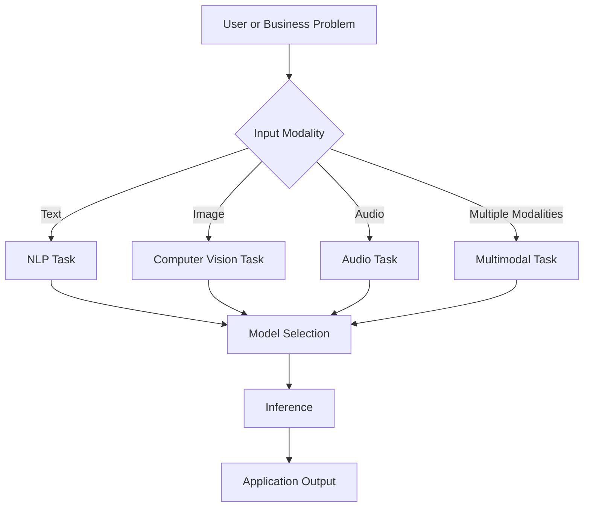
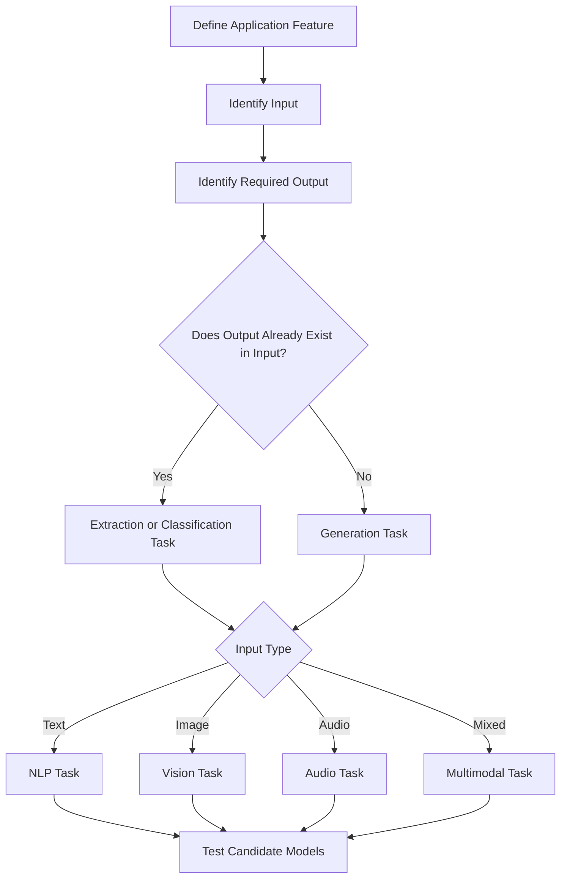
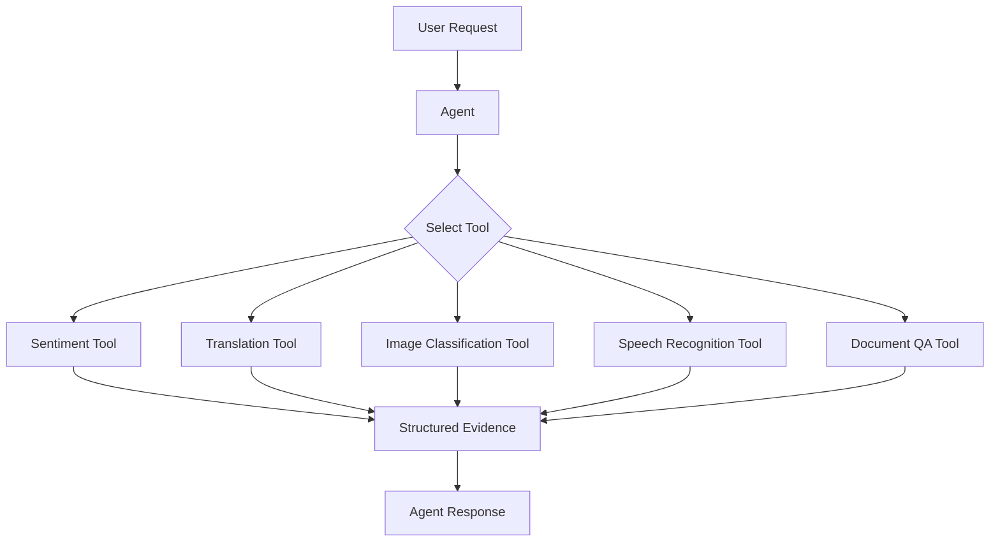
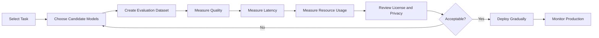
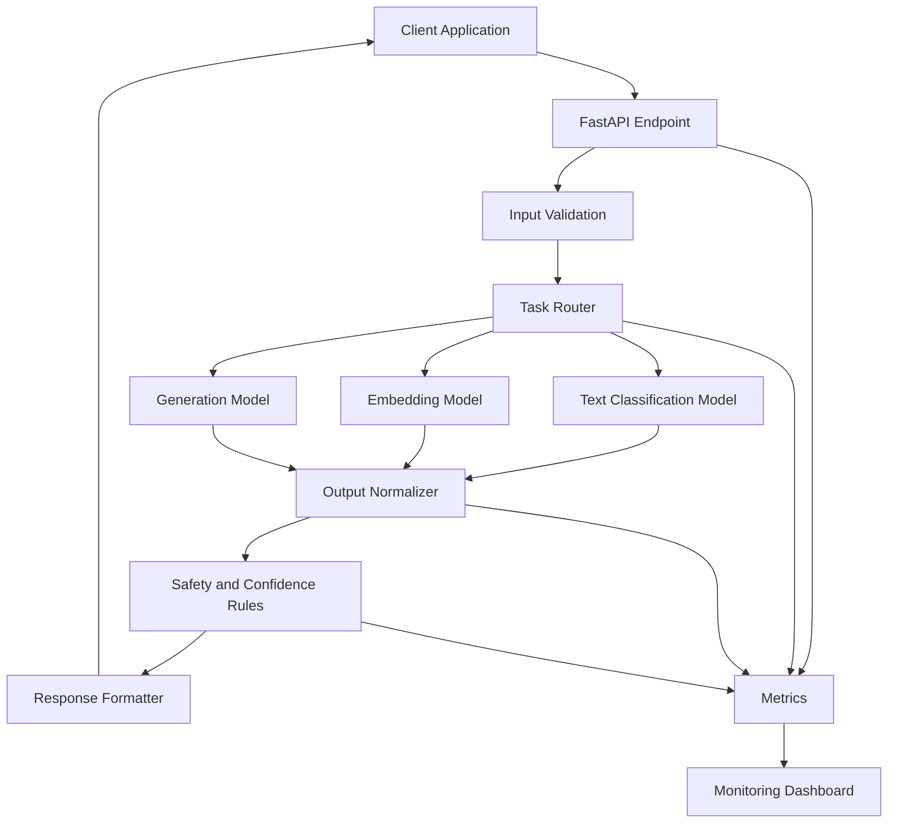
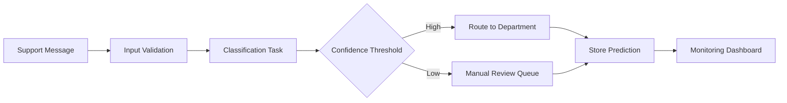
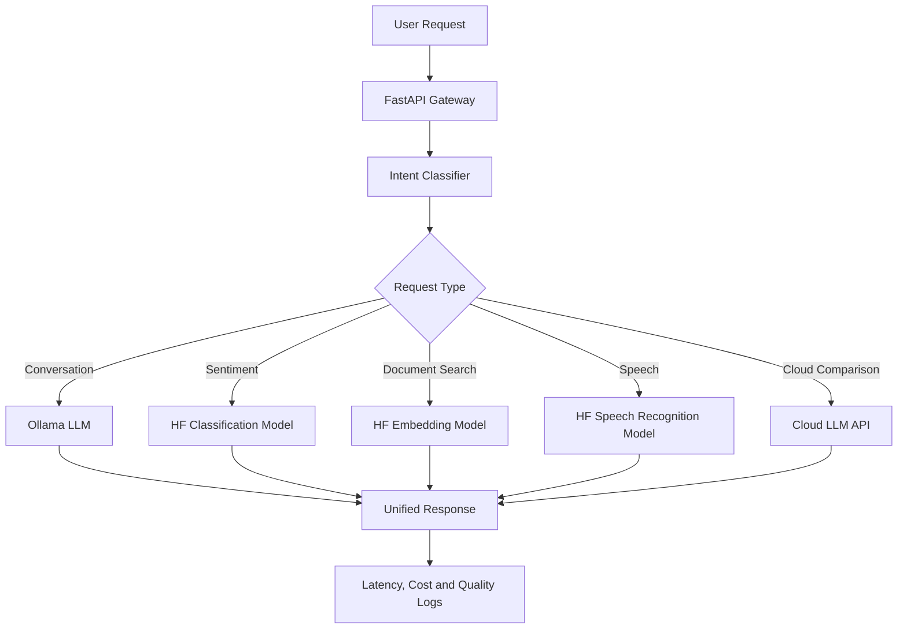

# 005 — Hugging Face Tasks

**Course:** 02 — Model Platforms and Prompting
**Module:** Module 07 — Open Source AI
**Content Group:** Hugging Face
**Roadmap Source:** Open Source AI / Hugging Face
**Lesson Type:** Open Source AI
**Order in Module:** 005
**Suggested Duration:** 20 minutes

---

## 1. Lesson Summary

This lesson explains **Hugging Face Tasks** in the context of modern AI engineering.

A Hugging Face task describes the kind of machine-learning problem a model solves and, more specifically, the expected shape of its inputs and outputs. For example:

* A text-classification model receives text and returns labels and scores.
* A text-generation model receives a prompt and returns generated text.
* An image-classification model receives an image and returns predicted classes.
* A speech-recognition model receives audio and returns text.

Hugging Face uses tasks, sometimes called **pipeline types**, to organize models and determine which inference interface or interactive widget should be associated with each model.

After this lesson, you should understand:

* What a Hugging Face task represents.
* How tasks connect models to application features.
* How to search for an appropriate model by task.
* How to test a task with the Transformers `pipeline()` API.
* How to evaluate whether a model is suitable for production.
* How tasks can become API routes, RAG components, agent tools, or multimodal features.

---

## 2. Learning Objectives

By the end of this lesson, you should be able to:

1. Explain Hugging Face Tasks in your own words.
2. Distinguish between a **task**, a **model**, a **pipeline**, and an **application feature**.
3. Select a suitable task for a given AI product requirement.
4. Run a pretrained model using a task-specific pipeline.
5. Compare multiple models that support the same task.
6. Identify licensing, latency, hardware, quality, privacy, and safety concerns.
7. Build a small task-based AI demo.
8. Describe at least one likely production failure and how to debug it.

---

## 3. What Is a Hugging Face Task?

A **task** is a standardized description of a machine-learning operation.

It defines:

* The expected input format.
* The expected output format.
* The general problem being solved.
* The type of inference interface that can be used.
* The models that can potentially perform the operation.

For example:

```text
Task: text-classification

Input:
"This product is excellent."

Output:
[
  {
    "label": "POSITIVE",
    "score": 0.998
  }
]
```

The task does not identify one specific model. Many different models may support the same task.

The Hugging Face Tasks directory connects each task with relevant models, datasets, demonstrations, and use cases.

---

## 4. Task vs. Model vs. Pipeline vs. Feature

These concepts are related but not identical.

| Concept         | Meaning                           | Example                                  |
| --------------- | --------------------------------- | ---------------------------------------- |
| Product feature | What the user experiences         | Review sentiment dashboard               |
| Task            | The machine-learning problem      | Text classification                      |
| Model           | The trained neural network        | A DistilBERT sentiment model             |
| Pipeline        | High-level inference wrapper      | `pipeline("sentiment-analysis")`         |
| Runtime         | Where inference executes          | Local CPU, GPU, cloud endpoint           |
| Output handler  | Application logic after inference | Save score, display label, trigger alert |

### Relationship


### Example

```text
Product requirement:
Automatically detect whether customer feedback is positive or negative.

Task:
Text classification

Candidate model:
A sentiment-classification model from the Hugging Face Hub

Pipeline:
pipeline("sentiment-analysis")

Application feature:
A dashboard that shows customer satisfaction trends
```

---

## 5. Why Tasks Matter to AI Engineers

Without a task abstraction, developers would need to understand the architecture, preprocessing logic, tokenizer, output format, and post-processing rules of every individual model.

Tasks provide a common starting point.

Instead of beginning with:

```text
Which neural-network architecture should I manually implement?
```

You can begin with:

```text
What type of input do I have?
What output does the application need?
Which Hugging Face task matches that transformation?
```

The task becomes the bridge between the product requirement and the model implementation.



---

## 6. Major Task Categories

Hugging Face supports task-specific pipelines across natural language processing, computer vision, audio, and multimodal workloads.

The following list is representative rather than exhaustive.

### 6.1 Natural Language Processing Tasks

| Task                     | Input                     | Output               | Example Application           |
| ------------------------ | ------------------------- | -------------------- | ----------------------------- |
| Text classification      | Text                      | Label and score      | Sentiment analysis            |
| Token classification     | Text                      | Label for each token | Named entity recognition      |
| Text generation          | Prompt                    | Generated text       | Chatbot or writing assistant  |
| Summarization            | Long text                 | Shorter text         | Article summarizer            |
| Translation              | Source-language text      | Target-language text | Translation service           |
| Question answering       | Question and context      | Answer               | Document assistant            |
| Fill-mask                | Text containing a mask    | Predicted tokens     | Language-learning tool        |
| Zero-shot classification | Text and candidate labels | Ranked labels        | Dynamic intent classification |
| Feature extraction       | Text                      | Vector embeddings    | Semantic search               |
| Sentence similarity      | Two or more texts         | Similarity score     | Duplicate detection           |

Question answering may be extractive, where the answer is selected from a supplied context, or generative, where the model produces an answer based on that context.

---

### 6.2 Computer Vision Tasks

| Task                           | Input            | Output                 | Example Application             |
| ------------------------------ | ---------------- | ---------------------- | ------------------------------- |
| Image classification           | Image            | Class probabilities    | Product-category detection      |
| Object detection               | Image            | Boxes, classes, scores | Traffic monitoring              |
| Image segmentation             | Image            | Pixel-level masks      | Medical image analysis          |
| Depth estimation               | Image            | Depth map              | Robotics                        |
| Image-to-image                 | Image            | Transformed image      | Enhancement or style conversion |
| Zero-shot image classification | Image and labels | Ranked labels          | Flexible image tagging          |
| Image feature extraction       | Image            | Embedding vector       | Visual search                   |

---

### 6.3 Audio Tasks

| Task                           | Input            | Output           | Example Application           |
| ------------------------------ | ---------------- | ---------------- | ----------------------------- |
| Automatic speech recognition   | Audio            | Transcript       | Meeting transcription         |
| Audio classification           | Audio            | Label and score  | Sound-event detection         |
| Text-to-speech                 | Text             | Generated audio  | Voice assistant               |
| Voice activity detection       | Audio            | Speech intervals | Call-center processing        |
| Audio-to-audio                 | Audio            | Modified audio   | Noise removal                 |
| Zero-shot audio classification | Audio and labels | Ranked labels    | Flexible sound classification |

---

### 6.4 Multimodal Tasks

Multimodal tasks process more than one data type.

| Task                        | Input                       | Output      | Example Application     |
| --------------------------- | --------------------------- | ----------- | ----------------------- |
| Visual question answering   | Image and question          | Text answer | Image assistant         |
| Document question answering | Document image and question | Text answer | Invoice assistant       |
| Image-to-text               | Image                       | Text        | Image captioning        |
| Image-text-to-text          | Image and instruction       | Text        | Vision-language chatbot |
| Text-to-image               | Prompt                      | Image       | Creative design tool    |
| Video-text-to-text          | Video and instruction       | Text        | Video understanding     |
| Audio-text-to-text          | Audio and instruction       | Text        | Voice-based assistant   |

Visual question answering, for example, receives an image and a natural-language question and returns a natural-language answer.

---

## 7. Choosing the Correct Task

Start with the required input-output transformation.

### Decision Process



### Selection Questions

Ask the following questions before choosing a task:

1. What data will the user provide?
2. What output must the system return?
3. Is the output a label, a span, a vector, generated content, or a transformed file?
4. Does the application require one modality or several modalities?
5. Is the task deterministic or generative?
6. Does the system need real-time inference?
7. Is a specialized model better than a general-purpose language model?

---

## 8. Mapping Product Features to Tasks

| Product Requirement                     | Suitable Task                            |
| --------------------------------------- | ---------------------------------------- |
| Detect positive and negative reviews    | Text classification                      |
| Extract people and organizations        | Token classification                     |
| Generate support responses              | Text generation                          |
| Search documents by meaning             | Feature extraction or embeddings         |
| Answer questions from a document        | Question answering or RAG                |
| Convert speech into text                | Automatic speech recognition             |
| Identify objects in warehouse images    | Object detection                         |
| Generate image descriptions             | Image-to-text                            |
| Ask questions about screenshots         | Visual question answering                |
| Route user messages to business domains | Zero-shot or trained text classification |
| Translate an application interface      | Translation                              |
| Shorten long reports                    | Summarization                            |

---

## 9. The Transformers Pipeline API

The Transformers `pipeline()` function provides a high-level interface for running pretrained models.

A pipeline usually handles:

1. Input preprocessing.
2. Tokenization or feature extraction.
3. Model inference.
4. Output post-processing.
5. Conversion into a task-specific result structure.

The pipeline abstraction is designed to make inference available through a consistent interface across different tasks and models.

### Basic Pattern

```python
from transformers import pipeline

task_pipeline = pipeline(
    task="TASK_NAME",
    model="MODEL_ID"
)

result = task_pipeline(input_data)
print(result)
```

---

## 10. Demo 1 — Sentiment Classification

### Installation

```bash
pip install torch transformers
```

### Python Code

```python
from pprint import pprint

import torch
from transformers import pipeline


def create_sentiment_classifier():
    """Create a sentiment-analysis pipeline on CPU or GPU."""

    device = 0 if torch.cuda.is_available() else -1

    return pipeline(
        task="sentiment-analysis",
        model="distilbert/distilbert-base-uncased-finetuned-sst-2-english",
        device=device,
    )


def main() -> None:
    classifier = create_sentiment_classifier()

    reviews = [
        "The application is fast and very easy to use.",
        "The latest update broke the login screen.",
        "The interface is acceptable, but it needs improvement.",
    ]

    results = classifier(
        reviews,
        truncation=True,
        batch_size=8,
    )

    for review, result in zip(reviews, results):
        pprint(
            {
                "text": review,
                "label": result["label"],
                "confidence": round(result["score"], 4),
            }
        )


if __name__ == "__main__":
    main()
```

### Expected Output Shape

```json
{
  "text": "The application is fast and very easy to use.",
  "label": "POSITIVE",
  "confidence": 0.9998
}
```

The pipeline API can run on different hardware. CPU is normally represented by `device=-1`, while `device=0` selects the first CUDA GPU. Batch processing may improve throughput, although its effectiveness depends on the model, hardware, input lengths, and workload.

---

## 11. Demo 2 — Summarization

```python
from transformers import pipeline


summarizer = pipeline(
    task="summarization",
    model="facebook/bart-large-cnn",
)

article = """
Open-source AI models allow engineering teams to inspect model artifacts,
run inference inside their own infrastructure, customize deployment settings,
and reduce dependence on a single hosted API. However, teams must still
evaluate model quality, licenses, security, latency, operational complexity,
and hardware requirements before using a model in production.
"""

result = summarizer(
    article,
    max_length=70,
    min_length=20,
    do_sample=False,
)

print(result[0]["summary_text"])
```

Summarization models create a shorter representation of a document while attempting to retain its important information.

---

## 12. Demo 3 — Exposing a Task Through FastAPI

A local pipeline can be wrapped in an HTTP API.

### Installation

```bash
pip install fastapi uvicorn torch transformers
```

### API Route

```python
from contextlib import asynccontextmanager
from typing import Any

import torch
from fastapi import FastAPI, HTTPException
from pydantic import BaseModel, Field
from transformers import Pipeline, pipeline


classifier: Pipeline | None = None


class ClassificationRequest(BaseModel):
    text: str = Field(
        min_length=1,
        max_length=5000,
        description="Text to classify",
    )


class ClassificationResponse(BaseModel):
    label: str
    confidence: float


@asynccontextmanager
async def lifespan(app: FastAPI):
    global classifier

    device = 0 if torch.cuda.is_available() else -1

    classifier = pipeline(
        task="sentiment-analysis",
        model="distilbert/distilbert-base-uncased-finetuned-sst-2-english",
        device=device,
    )

    yield

    classifier = None


app = FastAPI(
    title="Hugging Face Task Demo",
    lifespan=lifespan,
)


@app.post(
    "/classify",
    response_model=ClassificationResponse,
)
def classify_text(
    request: ClassificationRequest,
) -> ClassificationResponse:
    if classifier is None:
        raise HTTPException(
            status_code=503,
            detail="The model is not available.",
        )

    try:
        result: dict[str, Any] = classifier(
            request.text,
            truncation=True,
        )[0]

        return ClassificationResponse(
            label=str(result["label"]),
            confidence=float(result["score"]),
        )

    except Exception as exc:
        raise HTTPException(
            status_code=500,
            detail=f"Inference failed: {type(exc).__name__}",
        ) from exc
```

### Run the API

```bash
uvicorn main:app --reload
```

### Request

```bash
curl -X POST "http://127.0.0.1:8000/classify" \
  -H "Content-Type: application/json" \
  -d '{"text":"The new feature works extremely well."}'
```

### Response

```json
{
  "label": "POSITIVE",
  "confidence": 0.9997
}
```

---

## 13. Using Tasks in a RAG Pipeline

Hugging Face tasks can provide several components in a retrieval-augmented generation system.


### Possible Task Mapping

| RAG Component         | Hugging Face Task              |
| --------------------- | ------------------------------ |
| Query embedding       | Feature extraction             |
| Document embedding    | Feature extraction             |
| Query classification  | Text classification            |
| Reranking             | Text ranking or classification |
| Answer generation     | Text generation                |
| Context summarization | Summarization                  |
| Safety detection      | Text classification            |
| Language detection    | Text classification            |

### Important Distinction

Question answering and RAG are related but not identical.

A question-answering task may receive a fixed context:

```text
Question + Context → Answer
```

A complete RAG system also performs retrieval:

```text
Question
  → Search relevant documents
  → Build context
  → Generate or extract answer
```

---

## 14. Using Tasks as Agent Tools

An AI agent can expose specialized Hugging Face models as callable tools.



### Example Tool Definition

```python
from transformers import pipeline


sentiment_pipeline = pipeline(
    task="sentiment-analysis",
    model="distilbert/distilbert-base-uncased-finetuned-sst-2-english",
)


def analyze_sentiment(text: str) -> dict[str, float | str]:
    """
    Agent tool that returns a structured sentiment result.
    """

    if not text.strip():
        raise ValueError("Text must not be empty.")

    result = sentiment_pipeline(
        text,
        truncation=True,
    )[0]

    return {
        "label": str(result["label"]),
        "confidence": float(result["score"]),
    }
```

A tool should return structured evidence instead of an unvalidated paragraph.

Good tool output:

```json
{
  "label": "NEGATIVE",
  "confidence": 0.9812
}
```

Less reliable tool output:

```text
The user appears to be unhappy and may be considering leaving.
```

The first format separates model evidence from the agent’s final interpretation.

---

## 15. Model Selection Within a Task

Selecting the correct task is only the first step. You must then compare models supporting that task.

### Model Selection Criteria

| Criterion          | Questions                                                   |
| ------------------ | ----------------------------------------------------------- |
| Task compatibility | Does the model support the exact input-output requirement?  |
| Language           | Does it support English, Vietnamese, or multiple languages? |
| License            | Can it legally be used in the intended product?             |
| Model size         | Can the infrastructure load it?                             |
| Latency            | Is inference fast enough for the UX?                        |
| Memory             | How much CPU RAM or GPU VRAM is required?                   |
| Quality            | Does it perform well on representative data?                |
| Context length     | Can it process the required input length?                   |
| Privacy            | Can data remain inside the organization?                    |
| Maintenance        | Is the repository documented and actively maintained?       |
| Safety             | Does the model produce harmful or unreliable outputs?       |
| Output format      | Can the result be integrated reliably?                      |

---

## 16. Read the Model Card

Never select a model only because it appears near the top of a search result.

Review its model card for:

* Intended use.
* Training data.
* Supported languages.
* Limitations.
* Evaluation results.
* Bias and safety concerns.
* License.
* Example code.
* Required libraries.
* Hardware requirements.
* Input restrictions.
* Output-label definitions.

### Example Problem

A model may return:

```json
{
  "label": "LABEL_1",
  "score": 0.97
}
```

Without reading its configuration or model card, you may not know whether `LABEL_1` means:

* Positive sentiment.
* Negative sentiment.
* Spam.
* Toxic content.
* A domain-specific class.

High confidence does not help when the label mapping is interpreted incorrectly.

---

## 17. Model Evaluation Workflow

Do not move directly from a successful demo to production.



### Minimum Evaluation Set

Include:

* Normal inputs.
* Very short inputs.
* Very long inputs.
* Empty or invalid inputs.
* Domain-specific terminology.
* Mixed-language inputs.
* Misspellings.
* Ambiguous inputs.
* Adversarial inputs.
* Sensitive content.
* Inputs from real user traffic.

### Example Evaluation Record

```json
{
  "input": "The service was cheap, but it never worked.",
  "expected_label": "NEGATIVE",
  "predicted_label": "NEGATIVE",
  "confidence": 0.873,
  "latency_ms": 42,
  "model_version": "commit-or-version-id"
}
```

---

## 18. Quality Metrics by Task

Different tasks require different evaluation metrics.

| Task                     | Possible Metrics                                   |
| ------------------------ | -------------------------------------------------- |
| Classification           | Accuracy, precision, recall, F1                    |
| Named entity recognition | Entity-level precision, recall, F1                 |
| Question answering       | Exact match, token F1                              |
| Summarization            | ROUGE, factual consistency, human review           |
| Translation              | BLEU, COMET, human review                          |
| Text generation          | Task success, factuality, safety, human preference |
| Speech recognition       | Word error rate                                    |
| Object detection         | Mean average precision                             |
| Embeddings               | Recall@K, MRR, NDCG                                |
| Reranking                | MRR, NDCG, precision@K                             |

A single benchmark number is rarely sufficient. The model should be evaluated on data resembling the intended production environment.

---

## 19. Local Model vs. Hosted Inference

The same task may be implemented through local inference or a hosted service.

| Factor            | Local Inference          | Hosted Inference          |
| ----------------- | ------------------------ | ------------------------- |
| Setup             | More infrastructure work | Faster initial setup      |
| Data privacy      | Greater direct control   | Depends on provider terms |
| Scaling           | Managed by your team     | Often managed by provider |
| Hardware          | Your responsibility      | Provider responsibility   |
| Cold start        | Must be optimized        | Depends on service        |
| Cost model        | Hardware and operations  | Usage-based pricing       |
| Customization     | High                     | Depends on platform       |
| Offline operation | Possible                 | Usually unavailable       |
| Observability     | Fully customizable       | Limited by provider       |
| Model updates     | Controlled by your team  | May depend on provider    |

### Decision Rule

Use local inference when:

* Privacy is critical.
* Offline operation is required.
* You need control over model versions.
* You have suitable infrastructure.
* Predictable high-volume workloads justify the operational cost.

Use hosted inference when:

* You need a fast prototype.
* Traffic is low or unpredictable.
* You do not want to operate GPUs.
* The provider supports the required model and compliance needs.

---

## 20. Production Architecture Example



### Recommended Logged Fields

```json
{
  "request_id": "req_123",
  "task": "text-classification",
  "model_id": "organization/model-name",
  "model_revision": "revision-id",
  "input_length": 128,
  "output_label": "POSITIVE",
  "confidence": 0.97,
  "latency_ms": 46,
  "device": "cuda:0",
  "error_type": null
}
```

Do not log raw user content when it may contain personal, confidential, or regulated data.

---

## 21. Common Production Failures

### 21.1 Choosing the Wrong Task

**Example**

The product needs semantic search, but the developer uses text generation rather than an embedding task.

**Result**

* Expensive inference.
* Unstable search behavior.
* Difficult evaluation.
* Inconsistent output.

**Fix**

Define the exact input-output transformation before selecting the model.

---

### 21.2 Using the Wrong Model for the Language

**Example**

An English sentiment model is used on Vietnamese reviews.

**Symptoms**

* High-confidence incorrect labels.
* Unstable behavior with diacritics.
* Poor treatment of local expressions.

**Debugging Steps**

1. Check the model card.
2. Confirm supported languages.
3. Build a Vietnamese evaluation dataset.
4. Compare multilingual and Vietnamese-specific models.
5. Add language detection before routing.

---

### 21.3 Misreading Model Labels

**Example**

The model returns `LABEL_0`, but the application assumes it means “negative.”

**Fix**

Inspect:

```python
print(model.config.id2label)
print(model.config.label2id)
```

Never hard-code unknown label meanings.

---

### 21.4 Ignoring Input-Length Limits

**Symptoms**

* Truncation warnings.
* Missing information.
* Runtime errors.
* Poor classification of long documents.

**Fixes**

* Enable explicit truncation.
* Validate input length.
* Split long documents.
* Use a model with a suitable context window.
* Log truncation events.

---

### 21.5 Loading the Model on Every Request

Incorrect:

```python
@app.post("/classify")
def classify(request: Request):
    classifier = pipeline("sentiment-analysis")
    return classifier(request.text)
```

This may repeatedly load model weights and cause severe latency or memory problems.

Better:

```python
classifier = pipeline("sentiment-analysis")


@app.post("/classify")
def classify(request: Request):
    return classifier(request.text)
```

For a production service, load the model during application startup.

---

### 21.6 Dependency or Runtime Mismatch

Possible symptoms:

* Missing PyTorch operators.
* Unsupported tokenizer.
* CUDA errors.
* Incompatible Transformers version.
* Model architecture not recognized.

Useful debugging information:

```python
import platform

import torch
import transformers

print("Python:", platform.python_version())
print("Transformers:", transformers.__version__)
print("PyTorch:", torch.__version__)
print("CUDA available:", torch.cuda.is_available())
print("CUDA version:", torch.version.cuda)
```

Pin tested dependency versions:

```text
transformers==X.Y.Z
torch==X.Y.Z
tokenizers==X.Y.Z
```

---

### 21.7 Running Out of Memory

**Possible causes**

* Model is too large.
* Batch size is too high.
* Inputs are too long.
* Several workers load separate model copies.
* GPU memory is already occupied.

**Possible fixes**

* Reduce batch size.
* Reduce maximum input length.
* Use a smaller model.
* Use quantization.
* Limit worker processes.
* Use CPU offloading.
* Monitor memory before and after inference.

---

### 21.8 Trusting Confidence Scores Too Much

A score of `0.99` does not guarantee correctness.

The model may be:

* Out of domain.
* Poorly calibrated.
* Biased by training data.
* Receiving an unsupported language.
* Processing truncated input.
* Producing a label that was mapped incorrectly.

Create confidence policies based on evaluation data:

```python
if confidence < 0.70:
    return {
        "status": "needs_review",
        "label": label,
        "confidence": confidence,
    }
```

The threshold should be selected through testing rather than guessed.

---

### 21.9 Ignoring the License

Not every model hosted on the Hugging Face Hub has the same usage permissions.

Before deployment:

1. Read the model license.
2. Confirm commercial-use permissions.
3. Check redistribution conditions.
4. Review attribution requirements.
5. Record the approved model and version.
6. Ask for legal review when necessary.

“Hugging Face model” does not automatically mean unrestricted open source.

---

### 21.10 Updating Models Without Version Control

Loading only a moving model identifier can cause unexpected behavior after repository changes.

Prefer recording or pinning:

* Model ID.
* Revision or commit.
* Tokenizer revision.
* Library versions.
* Evaluation dataset version.
* Runtime configuration.

```python
classifier = pipeline(
    task="sentiment-analysis",
    model="organization/model-name",
    revision="approved-revision-id",
)
```

---

## 22. Debugging Checklist

When a Hugging Face task fails, debug the system layer by layer.

### Layer 1 — Input

* Is the input empty?
* Is the type correct?
* Is the text too long?
* Is the language supported?
* Is the audio or image format valid?

### Layer 2 — Preprocessing

* Is the correct tokenizer loaded?
* Is truncation happening?
* Is padding configured correctly?
* Is image normalization correct?
* Is the audio sample rate correct?

### Layer 3 — Model

* Is the architecture supported?
* Are the weights downloaded completely?
* Is the revision correct?
* Is the model in evaluation mode?
* Is the model loaded on the intended device?

### Layer 4 — Runtime

* Is enough RAM or VRAM available?
* Are CUDA and PyTorch compatible?
* Is the batch size too large?
* Is the model being loaded repeatedly?
* Are multiple workers duplicating model memory?

### Layer 5 — Output

* Is the output schema what the application expects?
* Are labels mapped correctly?
* Are confidence scores calibrated?
* Are generated outputs complete?
* Is post-processing removing useful data?

### Layer 6 — Product Logic

* Is the selected task appropriate?
* Is the model suitable for the domain?
* Is a fallback available?
* Should low-confidence results be reviewed?
* Are latency and errors monitored?

---

## 23. Practical Mini Project

### Project: Support Message Router

Build a service that classifies support messages into:

* `billing`
* `technical`
* `account`
* `feedback`
* `other`

### Suggested Architecture



### Development Steps

1. Collect representative support messages.
2. Define the label taxonomy.
3. Create training, validation, and test datasets.
4. Test a zero-shot classifier as a baseline.
5. Test a fine-tuned classifier.
6. Compare accuracy, F1, latency, and memory usage.
7. Add a confidence threshold.
8. Expose the model through FastAPI.
9. Log model version and prediction metadata.
10. Build a small interface or dashboard.

### Example API Contract

#### Request

```json
{
  "message": "I was charged twice for my subscription."
}
```

#### Response

```json
{
  "category": "billing",
  "confidence": 0.96,
  "requires_review": false,
  "model_version": "support-router-v1"
}
```

---

## 24. Connection to the Local AI Assistant Project

This lesson directly supports:

> **Project 6: Local AI Assistant using Ollama, a FastAPI wrapper, and a comparison with a cloud LLM API.**

Hugging Face task models can complement the local language model.

### Example Hybrid Architecture



### Comparison Dimensions

| Dimension          | Local Hugging Face Task Model | Ollama LLM            | Cloud LLM API       |
| ------------------ | ----------------------------- | --------------------- | ------------------- |
| Specialization     | High for one task             | General-purpose       | General-purpose     |
| Privacy            | High control                  | High control          | Provider-dependent  |
| Latency            | Often low for small models    | Depends on model size | Network-dependent   |
| Cost per request   | Mainly infrastructure         | Mainly infrastructure | Usage-based         |
| Offline support    | Yes                           | Yes                   | No                  |
| Structured output  | Often predictable             | Must be constrained   | Must be constrained |
| Operational effort | Moderate                      | Moderate              | Lower initially     |

A small specialized model may outperform a large general-purpose model for a narrow, well-defined task while using fewer resources.

---

## 25. Practical Exercises

### Exercise 1 — Five-Line Summary

Without looking at the lesson, write five lines explaining:

1. What a Hugging Face task is.
2. How it differs from a model.
3. What a pipeline does.
4. Why evaluation is necessary.
5. How tasks connect to AI applications.

---

### Exercise 2 — Task Mapping

Select the most suitable task for each requirement:

1. Detect product defects in photographs.
2. Convert recorded meetings into text.
3. Find semantically related documents.
4. Extract organization names from news articles.
5. Generate captions for uploaded images.
6. Determine the intent of a support message.
7. Answer questions about an invoice image.

---

### Exercise 3 — Build a Pipeline

Create a Python script that:

1. Loads a text-classification pipeline.
2. Processes at least five inputs.
3. Uses batch inference.
4. Prints labels and scores.
5. Handles empty input.
6. Records latency.
7. Saves the output as JSON.

---

### Exercise 4 — Compare Two Models

Choose two models supporting the same task and compare:

| Measurement      | Model A | Model B |
| ---------------- | ------: | ------: |
| Model size       |         |         |
| Average latency  |         |         |
| Accuracy or F1   |         |         |
| Memory usage     |         |         |
| Language support |         |         |
| License          |         |         |
| Best use case    |         |         |

Write a recommendation based on evidence.

---

### Exercise 5 — Production Failure Note

Document one possible production incident.

Use this template:

```markdown
## Incident

### Symptom

### Expected Behavior

### Actual Behavior

### Root Cause

### Debugging Evidence

### Fix

### Regression Test

### Monitoring Improvement
```

Example incident:

```text
The application classified Vietnamese customer reviews using an
English-only sentiment model, producing confident but incorrect predictions.
```

---

## 26. Common Learning Mistakes

### Memorizing Task Names Without Building Anything

Knowing that text classification exists is not enough. Build a script, API, notebook, or interface.

### Testing Only the Happy Path

A demo that works on one clean English sentence does not prove that the system is production-ready.

### Selecting a Model by Popularity Alone

Popularity does not guarantee task compatibility, language support, legal suitability, or domain accuracy.

### Ignoring Output Semantics

Always verify label mappings, score meanings, generated-output format, and error behavior.

### Skipping Baselines

Compare the selected model against:

* A simple rule-based system.
* A smaller model.
* A general-purpose LLM.
* A hosted API.
* Human performance where appropriate.

### Failing to Record Assumptions

Document assumptions such as:

* Supported language.
* Expected input length.
* Required latency.
* Confidence threshold.
* Hardware.
* License.
* Evaluation dataset.
* Known failure cases.

---

## 27. Completion Checklist

* [ ] I can explain Hugging Face Tasks in one or two minutes.
* [ ] I understand the difference between a task, model, pipeline, and feature.
* [ ] I can map a product requirement to a suitable task.
* [ ] I can find candidate models for a task.
* [ ] I can run a model with the Transformers pipeline API.
* [ ] I have created a small working demo.
* [ ] I have tested normal and edge-case inputs.
* [ ] I have checked the model card and license.
* [ ] I have measured latency and resource usage.
* [ ] I have evaluated quality on representative data.
* [ ] I understand at least one production limitation.
* [ ] I have documented an unresolved question or future improvement.

---

## 28. Key Takeaways

1. A Hugging Face task defines a standard machine-learning input-output operation.
2. Tasks connect product requirements to models and inference pipelines.
3. Multiple models can support the same task, but their quality, licenses, language coverage, size, and hardware needs may differ.
4. The Transformers pipeline API is an effective tool for rapid experimentation.
5. A successful pipeline demo is not the same as a production-ready system.
6. Production deployment requires model evaluation, version control, observability, input validation, privacy review, and failure handling.
7. Specialized task models can be useful components inside APIs, RAG pipelines, multimodal applications, and AI agents.

---

## 29. Final Outcome

After completing this lesson, you should know when to use:

* A closed commercial API.
* An open or openly available Hugging Face model.
* A specialized task model.
* A local inference server.
* A general-purpose language model.
* A RAG pipeline.
* An agent with task-specific tools.

The goal is not only to recognize task names. The goal is to turn a task into a working and evaluated engineering artifact:

```text
Product requirement
    ↓
Hugging Face task
    ↓
Candidate models
    ↓
Evaluation
    ↓
Pipeline or API
    ↓
Application feature
    ↓
Monitoring and improvement
```
