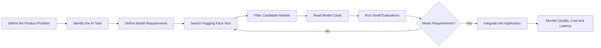
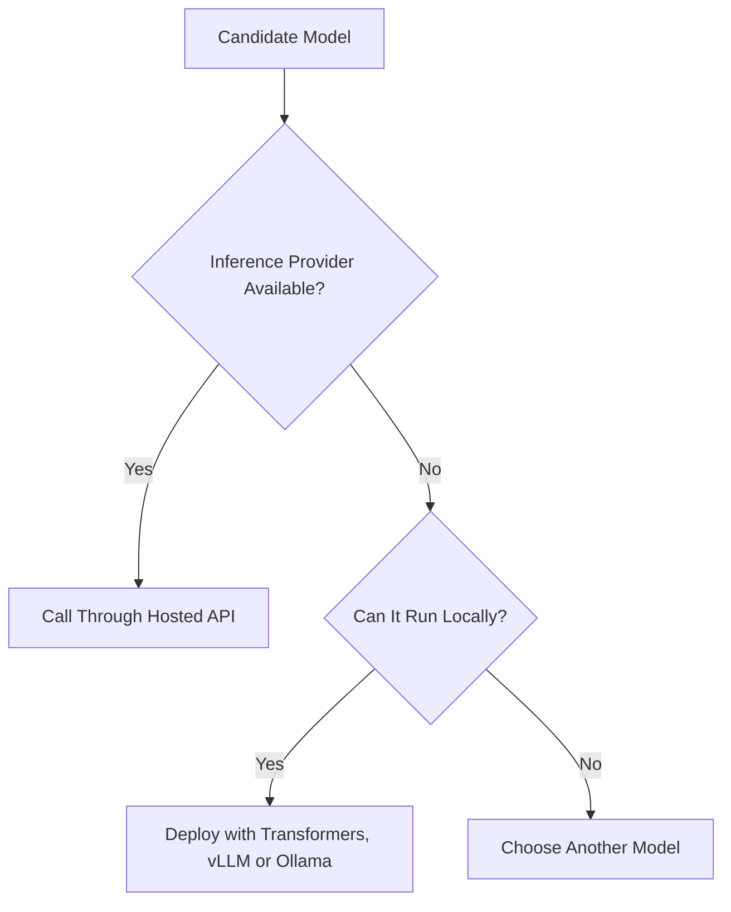
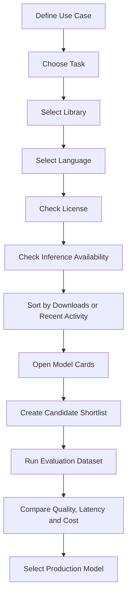
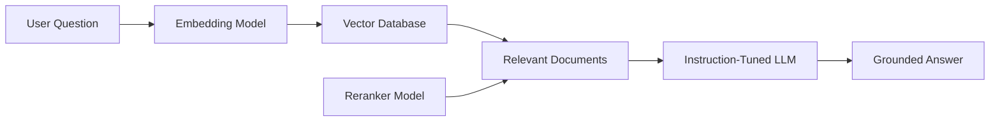
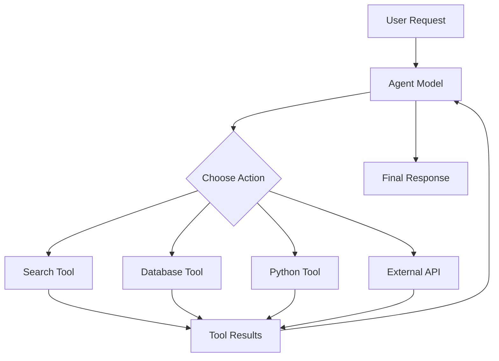
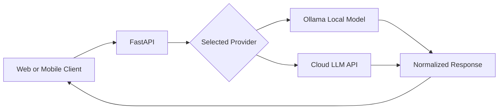

# 006 — Finding Open-Source Models

**Course:** 02 — Model Platforms and Prompting
**Module:** Module 07 — Open-Source AI
**Content Group:** Hugging Face
**Roadmap Source:** Open-Source AI / Hugging Face
**Lesson Type:** Open-Source AI
**Lesson Order:** 006
**Suggested Duration:** 20 minutes

---

## 1. Lesson Summary

This lesson explains how to find, filter, evaluate, and select open-source models on the Hugging Face Hub.

The Hugging Face Hub contains a very large number of models for tasks such as:

* Text generation
* Chat and instruction following
* Text classification
* Summarization
* Translation
* Image classification
* Image-to-text
* Text-to-image generation
* Object detection
* Automatic speech recognition
* Text-to-speech
* Embedding generation
* Zero-shot classification

Having many choices is useful, but it can also be overwhelming. An AI Engineer needs a structured process for reducing thousands of possible models to a small number of realistic candidates.

By the end of this lesson, you should understand how model discovery fits into an AI application workflow and how to evaluate models based on task compatibility, quality, license, hardware requirements, latency, privacy, and deployment options.

---

## 2. Learning Objectives

After completing this lesson, you should be able to:

* Explain how to find open-source models on Hugging Face.
* Search for models based on a specific machine learning task.
* Use filters to reduce irrelevant model results.
* Understand the difference between base, instruction-tuned, and chat models.
* Read and evaluate a Hugging Face model card.
* Check whether a model is available through an inference provider.
* Evaluate model size, latency, hardware, license, and privacy requirements.
* Compare several candidate models using a repeatable evaluation process.
* Integrate a selected model into a small AI application.
* Identify production risks related to model selection.

---

## 3. Why Model Discovery Matters

Finding a model is not simply searching for the model with the most downloads.

The best model depends on the application.

For example, an AI assistant may need:

* Good instruction-following ability
* Support for multi-turn conversations
* A suitable context window
* Acceptable latency
* A license that allows commercial use
* Support from an inference provider
* Enough quality for the target language
* Hardware requirements that fit the project budget

A document classifier may need completely different characteristics:

* Stable output labels
* High classification accuracy
* Low latency
* Small memory usage
* Fast batch processing
* Easy fine-tuning

Therefore, model selection should start with application requirements rather than model popularity.

---

## 4. Position in the AI Engineering Workflow

Finding a model happens after the problem and task have been defined, but before full application integration.



A common mistake is selecting a model before defining the product requirements.

A better sequence is:

1. Define the user problem.
2. Identify the machine learning task.
3. Define technical and business constraints.
4. Search for candidate models.
5. Test the strongest candidates.
6. Select the model using measured results.

---

## 5. Step 1 — Define the Model Requirements

Before opening the Hugging Face model page, write down what the application needs.

### Example requirement document

```yaml
use_case: Customer support assistant
task: Text generation
interaction_style: Multi-turn chat
languages:
  - English
  - Vietnamese
deployment:
  preferred: Local inference
  alternative: Hosted inference API
maximum_memory: 12 GB
target_latency: Under 3 seconds
commercial_use: Required
privacy: Customer messages must not be stored externally
minimum_context_length: 8192 tokens
```

This small requirements document makes the search process much more focused.

### Important requirement categories

| Category   | Questions                                             |
| ---------- | ----------------------------------------------------- |
| Task       | What should the model do?                             |
| Input      | Text, image, audio, video, or multimodal?             |
| Output     | Free-form text, labels, embeddings, images, or audio? |
| Language   | Which languages must the model support?               |
| Quality    | What level of accuracy or fluency is required?        |
| Latency    | How quickly must the model respond?                   |
| Hardware   | CPU, GPU, browser, mobile device, or cloud server?    |
| Privacy    | Can data leave the application environment?           |
| License    | Is commercial use allowed?                            |
| Budget     | What is the maximum inference cost?                   |
| Deployment | Local, browser, cloud API, or managed endpoint?       |

---

## 6. Step 2 — Start with the Task Filter

The first useful filter on the Hugging Face Hub is the task or pipeline tag.

Always begin by selecting the task that matches the application.

### Common task categories

#### Natural Language Processing

* Text generation
* Text classification
* Token classification
* Question answering
* Summarization
* Translation
* Sentence similarity
* Feature extraction
* Zero-shot classification

#### Computer Vision

* Image classification
* Object detection
* Image segmentation
* Depth estimation
* Image-to-text
* Text-to-image
* Visual question answering

#### Audio

* Automatic speech recognition
* Audio classification
* Text-to-speech
* Voice activity detection

#### Multimodal AI

* Image-text-to-text
* Visual question answering
* Document question answering
* Image-text retrieval

### Example

Suppose you want to build an application that summarizes long reports.

Start with:

```text
Task: Summarization
```

Do not begin with a general search such as:

```text
best language model
```

The general query will return many models that were not trained or optimized for summarization.

---

## 7. Step 3 — Apply Additional Filters

After selecting the task, use additional filters to reduce the number of candidates.

### 7.1 Library Filter

The library filter identifies the software ecosystem supported by the model.

Common libraries include:

* Transformers
* Diffusers
* Sentence Transformers
* Transformers.js
* timm
* spaCy
* PyTorch
* TensorFlow
* ONNX

For many NLP and multimodal projects, `Transformers` is a practical starting point.

For embedding and semantic search applications, `Sentence Transformers` is often more appropriate.

For browser-based applications, check whether the model is compatible with `Transformers.js` or ONNX.

---

### 7.2 Language Filter

Language support is especially important for multilingual applications.

A model may perform well in English but poorly in:

* Vietnamese
* Japanese
* Arabic
* Thai
* Low-resource languages

Check whether the target language appears in:

* The model tags
* The model card
* The training dataset
* The evaluation results
* Community discussions

Do not assume that a model is multilingual simply because it accepts Unicode text.

---

### 7.3 License Filter

A model's source code may be public while its weights still have usage restrictions.

Common license categories include:

* Apache 2.0
* MIT
* BSD
* Creative Commons licenses
* OpenRAIL licenses
* Model-specific community licenses
* Research-only licenses
* Non-commercial licenses

Before using a model in a commercial product, verify:

* Whether commercial use is permitted
* Whether redistribution is permitted
* Whether derivative models are permitted
* Whether attribution is required
* Whether there are usage restrictions
* Whether the model has an additional acceptable-use policy

> A publicly downloadable model is not automatically unrestricted.

---

### 7.4 Inference Provider Filter

The inference availability filter shows models supported by one or more hosted inference providers.

This is useful when you want to call the model through an API instead of managing the model locally.



When inference availability is enabled, the results normally include only models supported by at least one compatible provider.

If a model disappears after enabling the filter, it may still be downloadable, but it may not be directly available through the selected hosted inference service.

---

### 7.5 Model Size

Model size affects:

* Memory consumption
* Download time
* Startup time
* Inference latency
* Hardware requirements
* Hosting cost
* Output quality

A larger model is not automatically the best production model.

For example:

| Model Size          | Possible Deployment                           |
| ------------------- | --------------------------------------------- |
| Under 1B parameters | Browser, mobile, CPU, edge device             |
| 1B–3B parameters    | Laptop, CPU, small GPU                        |
| 7B–9B parameters    | Consumer GPU or quantized local deployment    |
| 13B–32B parameters  | Powerful GPU or managed inference             |
| 70B+ parameters     | Multi-GPU or specialized cloud infrastructure |

These ranges are approximate. Actual requirements depend on:

* Data type
* Quantization
* Model architecture
* Context length
* Batch size
* Runtime
* Attention implementation

---

### 7.6 Sorting Options

Hugging Face model results can be sorted using signals such as:

* Trending
* Most downloaded
* Most liked
* Recently created
* Recently updated

Each option answers a different question.

| Sorting Method   | What It Suggests                            |
| ---------------- | ------------------------------------------- |
| Trending         | Models receiving recent community attention |
| Most downloaded  | Widely used or integrated models            |
| Most liked       | Positive community interest                 |
| Recently created | Newly released models                       |
| Recently updated | Models with recent maintenance activity     |

Downloads and likes are useful discovery signals, but they are not direct measurements of quality.

---

## 8. Step 4 — Understand Model Types

For generative AI tasks, model names often include terms such as:

* Base
* Pretrained
* Instruct
* Instruction-tuned
* Chat
* Assistant
* Code
* Reasoning

### Base models

Base models are trained primarily to predict the next token.

They are useful for:

* Fine-tuning
* Research
* Domain adaptation
* Custom instruction tuning

However, they may not reliably follow user instructions without additional training or prompting.

### Instruction-tuned models

Instruction-tuned models are optimized to respond to commands and user requests.

Use them for:

* Question answering
* Summarization
* Structured generation
* General assistant features
* Tool-selection prompts

### Chat models

Chat models are instruction-tuned models optimized for conversational interactions.

They usually include:

* A chat template
* User and assistant roles
* System messages
* Multi-turn formatting

For chat applications, prefer models with `Instruct` or `Chat` in the model name unless you specifically need a base model.

---

## 9. Step 5 — Read the Model Card

The model card is one of the most important sources of information on Hugging Face.

Think of it as the model's technical README.

A strong model card should explain:

* What the model does
* Who created it
* What architecture it uses
* Which datasets were used
* Which languages it supports
* How to run it
* What hardware it requires
* How it was evaluated
* What its limitations are
* What license applies
* Which use cases are intended
* Which use cases should be avoided

### Model card inspection checklist

```text
[ ] Correct task or pipeline tag
[ ] Suitable model architecture
[ ] Appropriate model size
[ ] Target language supported
[ ] Commercially compatible license
[ ] Clear intended use
[ ] Clear limitations
[ ] Recent maintenance activity
[ ] Reproducible usage example
[ ] Evaluation results available
[ ] Compatible inference provider
[ ] Required tokenizer or processor included
[ ] Trust-remote-code requirement understood
```

---

## 10. Information Near the Top of a Model Page

The top section of a model page often includes important metadata.

### Pipeline tag

The pipeline tag describes the primary task.

Examples:

```text
text-generation
text-classification
summarization
automatic-speech-recognition
image-classification
feature-extraction
```

### Model size

The parameter count provides an approximate indication of computational requirements.

Examples:

```text
0.5B
1.5B
7B
14B
32B
70B
```

### License

The license determines the legal conditions for using the model.

### Downloads and likes

These are community adoption signals, not guaranteed quality indicators.

### Inference widget

The inference widget allows you to test the model directly from the browser.

Use it to perform a quick sanity check before writing integration code.

### Inference providers

This section shows which hosted providers can serve the model.

### Usage examples

Many model cards include examples for:

* Python
* Transformers
* JavaScript
* Inference clients
* cURL
* Hosted endpoints

---

## 11. Step 6 — Check Provider Compatibility

There are three practical ways to verify whether a model can be used through hosted inference.

### Method 1 — Enable inference availability

Use the inference availability filter on the model search page.

### Method 2 — Inspect the model page

Open the model card and look for the inference providers section.

### Method 3 — Test the model in an official playground

Try the model in the available inference playground or interactive widget.

If the model runs successfully in the official playground, it is a strong indication that it can be used through the associated inference client.

However, production integration should still test:

* Authentication
* Request format
* Streaming support
* Rate limits
* Cold-start latency
* Maximum input length
* Provider-specific parameters

---

## 12. Model Discovery Workflow

A practical discovery workflow can be summarized as follows:



---

## 13. Creating a Candidate Shortlist

Do not evaluate every search result.

Create a shortlist of approximately three to five candidates.

### Example shortlist

| Model   | Type       | Size | License    | Deployment | Reason to Test               |
| ------- | ---------- | ---: | ---------- | ---------- | ---------------------------- |
| Model A | Instruct   | 1.5B | Apache 2.0 | Local      | Fast and lightweight         |
| Model B | Instruct   |   7B | Permissive | Local/API  | Strong general quality       |
| Model C | Chat       |   8B | Custom     | API        | Good multilingual support    |
| Model D | Fine-tuned |   3B | Apache 2.0 | Local      | Optimized for classification |

A shortlist prevents endless browsing and moves the process toward measurable evaluation.

---

## 14. Choosing Models for Different Tasks

### 14.1 Chat and text generation

Prefer models that have:

* `Instruct` or `Chat` in the name
* A documented chat template
* Evaluation results for instruction following
* Suitable context length
* Support for the required languages
* Acceptable generation latency

### 14.2 Text classification

When labels are fixed, a model fine-tuned for the specific classification task will often be more reliable and efficient than a general-purpose zero-shot model.

Use zero-shot classification when:

* Labels change at runtime
* You have little or no training data
* You need a quick prototype
* Moderate accuracy is acceptable

Use fine-tuned classification when:

* Labels are stable
* Accuracy is important
* You have representative training data
* Low latency is required

### 14.3 Embeddings and RAG

Look for models designed for:

* Feature extraction
* Sentence similarity
* Semantic search
* Retrieval
* Multilingual embeddings

Evaluate embeddings using your actual documents and queries.

A model with a high public benchmark score may still perform poorly on:

* Vietnamese documents
* Product codes
* Legal terminology
* Medical terminology
* Internal abbreviations
* Very short search queries

### 14.4 Summarization

Check whether the model was trained for:

* Extractive summarization
* Abstractive summarization
* News articles
* Conversations
* Scientific documents
* Long documents

Also verify the maximum input length. A good summarization model cannot summarize a document that exceeds its supported context without chunking.

### 14.5 Image tasks

Check:

* Required image resolution
* Preprocessing instructions
* Supported labels
* Dataset domain
* Processor class
* Evaluation metrics

An image classifier trained on general objects may perform poorly on medical, industrial, satellite, or document images.

---

## 15. Practical Demo — Searching Models with the Hugging Face API

The Hugging Face Hub can also be searched programmatically.

### Installation

```bash
pip install huggingface_hub
```

### Python example

```python
from huggingface_hub import HfApi


def find_text_generation_models(limit: int = 10) -> None:
    """Find popular text-generation models on Hugging Face."""

    api = HfApi()

    models = api.list_models(
        task="text-generation",
        library="transformers",
        sort="downloads",
        direction=-1,
        limit=limit,
    )

    for model in models:
        print(
            {
                "model_id": model.id,
                "downloads": model.downloads,
                "likes": model.likes,
                "pipeline_tag": model.pipeline_tag,
                "last_modified": str(model.last_modified),
            }
        )


if __name__ == "__main__":
    find_text_generation_models()
```

### What this demo does

1. Connects to the Hugging Face Hub.
2. Filters models by the `text-generation` task.
3. Filters models by the `transformers` library.
4. Sorts candidates by downloads.
5. Prints metadata for inspection.

This script is useful for model discovery, but it does not replace evaluation.

---

## 16. Practical Demo — Loading a Model with Transformers

After selecting a candidate, test it with a small input.

### Installation

```bash
pip install transformers torch accelerate
```

### Text-generation example

```python
from transformers import pipeline


def create_generator(model_id: str):
    """Create a text-generation pipeline for a selected model."""

    return pipeline(
        task="text-generation",
        model=model_id,
        device_map="auto",
    )


def generate_response(generator, prompt: str) -> str:
    """Generate a response with basic generation limits."""

    result = generator(
        prompt,
        max_new_tokens=150,
        do_sample=False,
    )

    return result[0]["generated_text"]


if __name__ == "__main__":
    MODEL_ID = "replace-with-a-compatible-instruct-model"

    generator = create_generator(MODEL_ID)

    response = generate_response(
        generator,
        "Explain semantic search in three simple bullet points.",
    )

    print(response)
```

> Replace the placeholder with a model that fits your environment, license, and task.

---

## 17. Using a Chat Template Correctly

Chat models should normally be used with their documented chat template.

```python
from transformers import AutoModelForCausalLM, AutoTokenizer


MODEL_ID = "replace-with-a-chat-model"

tokenizer = AutoTokenizer.from_pretrained(MODEL_ID)
model = AutoModelForCausalLM.from_pretrained(
    MODEL_ID,
    device_map="auto",
)

messages = [
    {
        "role": "system",
        "content": "You are a helpful AI engineering tutor.",
    },
    {
        "role": "user",
        "content": "What should I inspect before selecting an open-source model?",
    },
]

prompt = tokenizer.apply_chat_template(
    messages,
    tokenize=False,
    add_generation_prompt=True,
)

inputs = tokenizer(prompt, return_tensors="pt").to(model.device)

outputs = model.generate(
    **inputs,
    max_new_tokens=200,
    do_sample=False,
)

generated_tokens = outputs[0][inputs["input_ids"].shape[1]:]
response = tokenizer.decode(generated_tokens, skip_special_tokens=True)

print(response)
```

Using the wrong prompt format can significantly reduce model quality.

---

## 18. A Simple Model Evaluation Script

A model should be tested on representative prompts before production use.

```python
from dataclasses import dataclass
from time import perf_counter
from typing import Callable


@dataclass
class EvaluationCase:
    prompt: str
    expected_keywords: list[str]


@dataclass
class EvaluationResult:
    prompt: str
    output: str
    latency_seconds: float
    keyword_score: float


def evaluate_model(
    generate: Callable[[str], str],
    cases: list[EvaluationCase],
) -> list[EvaluationResult]:
    """Evaluate a model using latency and simple keyword coverage."""

    results: list[EvaluationResult] = []

    for case in cases:
        start = perf_counter()
        output = generate(case.prompt)
        latency = perf_counter() - start

        normalized_output = output.lower()
        matched = sum(
            keyword.lower() in normalized_output
            for keyword in case.expected_keywords
        )

        score = matched / max(len(case.expected_keywords), 1)

        results.append(
            EvaluationResult(
                prompt=case.prompt,
                output=output,
                latency_seconds=latency,
                keyword_score=score,
            )
        )

    return results
```

### Example evaluation cases

```python
cases = [
    EvaluationCase(
        prompt="Explain retrieval-augmented generation.",
        expected_keywords=["retrieval", "documents", "generation"],
    ),
    EvaluationCase(
        prompt="Return JSON with the keys name and category.",
        expected_keywords=['"name"', '"category"'],
    ),
]
```

Keyword checking is only a simple starting point. Production evaluation may also require:

* Human review
* Exact-match scoring
* Classification accuracy
* BLEU or ROUGE
* Retrieval precision and recall
* Hallucination checks
* Safety evaluation
* Structured-output validation
* LLM-as-a-judge
* Domain expert review

---

## 19. Model Comparison Scorecard

A repeatable scorecard helps prevent decisions based only on intuition.

| Criterion        | Weight | Model A | Model B | Model C |
| ---------------- | -----: | ------: | ------: | ------: |
| Task quality     |    30% |       8 |       9 |       7 |
| Latency          |    15% |       9 |       6 |       8 |
| Hardware fit     |    15% |       9 |       5 |       8 |
| Language quality |    15% |       7 |       9 |       8 |
| License          |    10% |      10 |       8 |       6 |
| Context length   |     5% |       6 |       9 |       8 |
| Documentation    |     5% |       8 |       9 |       7 |
| Maintenance      |     5% |       7 |       9 |       6 |

### Weighted score formula

```text
Total Score =
    Quality × 0.30
  + Latency × 0.15
  + Hardware Fit × 0.15
  + Language Quality × 0.15
  + License × 0.10
  + Context Length × 0.05
  + Documentation × 0.05
  + Maintenance × 0.05
```

The weights should change depending on the product.

For a privacy-sensitive application, privacy and local deployment may receive much higher weights.

---

## 20. Local Inference vs Hosted Inference

Finding a model also requires choosing how it will run.

| Factor                 | Local Inference               | Hosted Inference        |
| ---------------------- | ----------------------------- | ----------------------- |
| Setup effort           | Higher                        | Lower                   |
| Infrastructure control | High                          | Limited                 |
| Data privacy           | Stronger control              | Depends on provider     |
| Initial cost           | Hardware required             | Usually low             |
| Scaling                | Must be managed               | Often managed           |
| Latency                | Predictable on local hardware | Network dependent       |
| Model choice           | Limited by hardware           | Limited by provider     |
| Maintenance            | Your responsibility           | Provider responsibility |

### Local inference is useful when:

* Sensitive data must remain private.
* The application must work offline.
* Inference volume is high and predictable.
* The team needs control over model versions.
* Suitable hardware is available.

### Hosted inference is useful when:

* You need a fast prototype.
* You do not want to manage GPUs.
* Traffic is unpredictable.
* You need access to larger models.
* Operational simplicity is more important than infrastructure control.

---

## 21. Production Risks

### 21.1 Selecting by popularity only

A highly downloaded model may be:

* Old
* Used mainly for research
* Unsuitable for your language
* Too large for your hardware
* Incompatible with commercial use

### 21.2 Ignoring the license

The application may work technically but still be legally unsuitable for deployment.

### 21.3 Using a base model for chat

The model may produce completions instead of following instructions reliably.

### 21.4 Ignoring the chat template

The model may generate:

* Repeated text
* Empty answers
* Role markers
* Poor instruction following
* Unexpected formatting

### 21.5 Ignoring memory requirements

The model may fail with:

```text
CUDA out of memory
```

Possible fixes include:

* Use a smaller model.
* Reduce batch size.
* Reduce context length.
* Use quantization.
* Use CPU offloading.
* Select a more efficient runtime.

### 21.6 Trusting public benchmarks blindly

Public benchmarks may not represent:

* Your users
* Your language
* Your prompts
* Your domain
* Your deployment hardware
* Your required output structure

### 21.7 Ignoring recent maintenance

An abandoned repository may contain:

* Outdated code
* Broken dependencies
* Security issues
* Missing tokenizer files
* Unsupported model formats

### 21.8 Confusing open weights with open source

Some models provide downloadable weights but do not provide:

* Full training code
* Training data
* Complete data documentation
* Unrestricted licensing

Use precise terminology when documenting the model.

---

## 22. Debugging Checklist

When a selected model does not work, inspect the failure systematically.

### Model loading errors

Check:

```text
- Is the model ID correct?
- Does the repository require authentication?
- Did you accept any required license?
- Is trust_remote_code required?
- Are all model files available?
- Is the Transformers version compatible?
```

### Memory errors

Check:

```text
- Parameter count
- Precision: FP32, FP16, BF16, INT8 or INT4
- Context length
- Batch size
- KV-cache size
- GPU memory
- CPU offloading configuration
```

### Poor output quality

Check:

```text
- Correct task
- Correct model type
- Correct chat template
- Prompt language
- Generation parameters
- Maximum token limit
- Special token configuration
- Model limitations
```

### Slow inference

Check:

```text
- Model size
- Quantization
- Device placement
- Batch size
- Prompt length
- Output length
- Cold-start time
- Provider queue time
- Network latency
```

### Unexpected API failure

Check:

```text
- Provider supports the model
- API token is valid
- Request body matches the provider schema
- Model is currently available
- Input does not exceed the context limit
- Rate limit has not been exceeded
```

---

## 23. Recommended Selection Strategy

Use the following strategy for most projects:

1. Start with the application task.
2. Define quality, latency, hardware, license, and privacy requirements.
3. Select the appropriate Hugging Face task.
4. Filter by library, language, license, and inference availability.
5. Sort by downloads and recent activity.
6. Inspect the top model cards.
7. Select three to five candidates.
8. Start with smaller models when possible.
9. Test candidates on real application examples.
10. Compare quality, latency, memory, and operational cost.
11. Record all assumptions and limitations.
12. Select the smallest model that satisfies the product requirements.

This final point is important:

> The best production model is usually not the largest model. It is the smallest model that reliably meets the application's quality requirements.

---

## 24. Mini Project — Model Finder CLI

Build a small command-line tool that recommends Hugging Face models.

### Input

```json
{
  "task": "text-generation",
  "library": "transformers",
  "language": "en",
  "maximum_candidates": 5
}
```

### Processing

The tool should:

1. Search Hugging Face models.
2. Filter by task.
3. Filter by library.
4. Sort by downloads.
5. Extract model metadata.
6. Produce a comparison table.
7. Mark models that require manual license review.

### Output

```text
1. organization/model-a
   Downloads: 2,500,000
   Pipeline: text-generation
   License: apache-2.0
   Status: Recommended for evaluation

2. organization/model-b
   Downloads: 1,800,000
   Pipeline: text-generation
   License: custom
   Status: Manual license review required
```

### Possible extension

Expose the model finder through FastAPI:

```text
GET /models/search
    ?task=text-generation
    &library=transformers
    &limit=5
```

---

## 25. Connection to RAG Applications

For a RAG application, you may need to discover more than one model.



A RAG system may use:

* One embedding model
* One reranking model
* One generation model
* One safety or classification model

Each model should be selected and evaluated independently.

### Example requirements

| Component         | Important Criteria                                         |
| ----------------- | ---------------------------------------------------------- |
| Embedding model   | Retrieval quality, vector size, multilingual support       |
| Reranker          | Ranking accuracy, latency                                  |
| Generator         | Grounded generation, context length, instruction following |
| Safety classifier | Recall, false-positive rate, label coverage                |

---

## 26. Connection to Agent Systems

An AI agent may require models with additional capabilities.



When selecting a model for an agent, test:

* Tool-selection accuracy
* JSON or function-call reliability
* Multi-step instruction following
* Recovery after tool errors
* Context retention
* Hallucination rate
* Ability to stop after completing the task

A model that writes fluent answers may still perform poorly as an agent controller.

---

## 27. Practical Exercise

### Exercise 1 — Explain the lesson

Without reading the material, write five lines explaining:

1. Why model discovery matters
2. Which filter should be used first
3. What a model card contains
4. Why the license matters
5. Why models must be evaluated locally

### Exercise 2 — Find three models

Choose one task:

* Text generation
* Summarization
* Text classification
* Embeddings
* Automatic speech recognition
* Image classification

Find three candidate models and record:

```markdown
| Model | Task | Size | License | Downloads | Last Updated | Provider Available |
|---|---|---:|---|---:|---|---|
```

### Exercise 3 — Run one candidate

Load one model using:

* Transformers
* Hugging Face Inference
* Ollama
* Transformers.js
* Another supported runtime

Record:

* Installation steps
* Input example
* Output
* Latency
* Memory usage
* One failure
* How the failure was fixed

### Exercise 4 — Compare local and cloud inference

Run the same prompt through:

1. A local open model
2. A cloud LLM API

Compare:

* Response quality
* Latency
* Privacy
* Cost
* Setup complexity
* Output consistency

---

## 28. Common Mistakes

### Mistake 1 — Memorizing definitions without building anything

Knowing what a model card is does not prove that you can select a production model.

Build at least one small integration.

### Mistake 2 — Testing only the happy path

Also test:

* Empty input
* Very long input
* Unsupported language
* Ambiguous requests
* Malformed documents
* Adversarial prompts
* Structured-output failures

### Mistake 3 — Ignoring assumptions

Document assumptions such as:

```text
- The application supports only English.
- The selected model requires at least 8 GB of GPU memory.
- Commercial use depends on legal review.
- Evaluation was performed on only 50 examples.
```

### Mistake 4 — Selecting one model immediately

Always compare multiple candidates when the feature is important.

### Mistake 5 — Measuring quality but not latency

A high-quality model may still be unusable if every response takes 30 seconds.

### Mistake 6 — Measuring latency but not total cost

Include:

* GPU rental
* API calls
* Storage
* Network transfer
* Engineering time
* Monitoring
* Scaling infrastructure

---

## 29. Completion Checklist

* [ ] I can explain how to find open-source models in one to two minutes.
* [ ] I can identify the correct task before searching.
* [ ] I know how to use task, library, language, license, and provider filters.
* [ ] I can distinguish a base model from an instruction or chat model.
* [ ] I can read and evaluate a Hugging Face model card.
* [ ] I can check whether a model supports hosted inference.
* [ ] I understand how model size affects hardware and latency.
* [ ] I have compared at least three candidate models.
* [ ] I have tested one model with real code.
* [ ] I have recorded at least one production risk.
* [ ] I have documented assumptions and limitations.
* [ ] I know how this topic affects model quality, cost, privacy, safety, and user experience.

---

## 30. Related Outcome

After completing this lesson, you should know when to use:

* Closed commercial APIs
* Open-weight models
* Fully open-source models
* Hugging Face hosted inference
* Local inference
* Browser-based inference
* Managed cloud endpoints

The choice should be based on measurable product requirements rather than personal preference.

---

## 31. Related Project

### Project 6 — Local AI Assistant

Build a local AI assistant using:

* Ollama for local model inference
* FastAPI as an application wrapper
* A simple chat interface
* A cloud LLM API for comparison

### Suggested architecture



### Required comparison

Measure:

| Metric               | Local Model | Cloud Model |
| -------------------- | ----------: | ----------: |
| First-token latency  |             |             |
| Total response time  |             |             |
| Output quality       |             |             |
| Cost per request     |             |             |
| Privacy              |             |             |
| Offline support      |             |             |
| Setup complexity     |             |             |
| Hardware requirement |             |             |

---

## 32. Key Takeaways

Finding open-source models is a core AI Engineering skill.

A reliable selection process is:

```text
Define the use case
        ↓
Select the machine learning task
        ↓
Apply task, library, language and license filters
        ↓
Check model size and inference availability
        ↓
Read the model card
        ↓
Shortlist several candidates
        ↓
Evaluate with real application examples
        ↓
Compare quality, latency, memory and cost
        ↓
Select and document the production model
```

Remember:

* Start with the task, not the model name.
* Read the model card before integration.
* Check the license before commercial use.
* Prefer instruction or chat models for assistant applications.
* Prefer task-specific fine-tuned models when labels are fixed.
* Start with smaller models when possible.
* Do not rely only on downloads or public benchmarks.
* Test every candidate with your own data.
* Document limitations, assumptions, and deployment risks.

The goal is not merely to find a model that runs.

The goal is to find a model that satisfies the application's quality, latency, cost, privacy, safety, and operational requirements.

---

# Bài luyện tập

## Mục tiêu


## Đề bài


## Yêu cầu hoàn thành

- [ ] 
- [ ] 
- [ ] 

## Kết quả / lời giải


## Ghi chú
